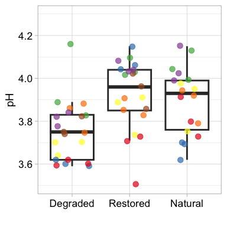

## 1. Sample Selection

    samples_to_keep <- c(
      "MGr3I", "MGr3H", "MGr3G", "MGr2F", "MGr2E", "MGr2D", "MGr1C", "MGr1B", "MGr1A",
      "CRr3I", "CRr3H", "CRr3G", "CRr2F", "CRr2E", "CRr2D", "CRr1C", "CRr1B", "CRr1A",
      "MHr3I", "MHr3H", "MHr3G", "MHr2F", "MHr2E", "MHr2D", "MHr1C", "MHr1B", "MHr1A",
      "BOr3I", "BOr3H", "BOr3G", "BOr2F", "BOr2E", "BOr2D", "BOr1C", "BOr1B", "BOr1A",
      "BAr3I", "BAr3H", "BAr3G", "BAr2F", "BAr2E", "BAr2D", "BAr1C", "BAr1B", "BAr1A",
      "SEr3I", "SEr3H", "SEr3G", "SEr2F", "SEr2E", "SEr2D", "LASCr2F", "LASCr2E", "LASCr2D",
      "LABRr1C", "LABRr1B", "LABRr1A", "LASAr3I", "LASAr3G", "LASAr3H"
    )

## 2. Data Import and Preprocessing

    # Oxygen data

    O2 <- read.csv("oxygen_probe.csv") %>%
      filter(Sample %in% samples_to_keep) %>%
      mutate(Depth = factor(Depth, levels = c("0_5", "5_10", "40_45", "45_50"))) %>%
      spread(key = Depth, value = O2) %>%
      mutate(
        oxic = rowMeans(select(., "0_5", "5_10"), na.rm = TRUE),
        anoxic = rowMeans(select(., "40_45", "45_50"), na.rm = TRUE)
      )

    head(O2)

    ##   Sample     Site Treatment   0_5  5_10 40_45 45_50   oxic anoxic
    ## 1  BAr1A Balmoral       NAT 9.960 9.788    NA    NA 9.8740    NaN
    ## 2  BAr1B Balmoral       NAT 8.407 9.326    NA    NA 8.8665    NaN
    ## 3  BAr1C Balmoral       NAT 6.874 7.207    NA    NA 7.0405    NaN
    ## 4  BAr2D Balmoral       RES 9.841 8.734    NA    NA 9.2875    NaN
    ## 5  BAr2E Balmoral       RES 9.858 6.597    NA    NA 8.2275    NaN
    ## 6  BAr2F Balmoral       RES 9.826 6.817    NA    NA 8.3215    NaN

    # Moisture & bulk density

    bulk <- read.csv("Bulk_Density.csv") %>%
      filter(Sample %in% samples_to_keep) %>%
      mutate(
        volume        = Volume_After - Volume_before,
        wet_weight    = weight_before - Crucible_weight,
        dry_weight    = weight_after - Crucible_weight,
        moisture      = ((wet_weight - dry_weight) / wet_weight) * 100,
        bulk_density  = dry_weight / volume,
        CUE_addition  = 0.334 * (moisture / 100) * 300,
        wet_bulk      = wet_weight / Volume_before
      )

    head(bulk)

    ##   Sample Depth yr_rest     Site Treatment Crucible Volume_before Volume_After Crucible_weight
    ## 1  MGr1A  0_10     NAT Migneint       NAT        1           920          935           0.604
    ## 2  MGr1B  0_10     NAT Migneint       NAT        2           920          925           0.617
    ## 3  MGr1C  0_10     NAT Migneint       NAT        3           920          930           0.500
    ## 4  MGr2D  0_10    REST Migneint      REST        4           920          930           0.522
    ## 5  MGr2E  0_10    REST Migneint      REST        5           920          930           0.497
    ## 6  MGr2F  0_10    REST Migneint      REST        6           920          930           0.521
    ##   weight_before weight_after volume wet_weight dry_weight moisture bulk_density CUE_addition
    ## 1        11.861       1.3242     15     11.257     0.7202 93.60220   0.04801333     93.78941
    ## 2         5.601       1.0261      5      4.984     0.4091 91.79173   0.08182000     91.97532
    ## 3         9.751       1.5310     10      9.251     1.0310 88.85526   0.10310000     89.03297
    ## 4        11.536       1.5683     10     11.014     1.0463 90.50027   0.10463000     90.68127
    ## 5        10.333       1.5770     10      9.836     1.0800 89.01993   0.10800000     89.19797
    ## 6        10.211       1.6773     10      9.690     1.1563 88.06708   0.11563000     88.24321
    ##      wet_bulk
    ## 1 0.012235870
    ## 2 0.005417391
    ## 3 0.010055435
    ## 4 0.011971739
    ## 5 0.010691304
    ## 6 0.010532609

    bulk_mean <- bulk %>%
      group_by(Treatment) %>%
      summarise(moisture_mean = mean(moisture, na.rm = TRUE))

    head(bulk_mean)

    ## # A tibble: 3 × 2
    ##   Treatment moisture_mean
    ##   <chr>             <dbl>
    ## 1 DAM                86.8
    ## 2 NAT                89.7
    ## 3 REST               88.4

    # Vegetation data

    veg <- read.csv("vegetation_percentage.csv") %>%
      left_join(read.csv("Sample_ID.csv"), by = "Sample") %>%
      mutate(vascular = eric + gram)

    head(veg)

    ##   Sample      eric    sphag     gram    other Sample_ID Depth     Site Treatment vascular
    ## 1  MGr1A  0.000000 66.18769 33.81231 0.000000       MG1  0_10 Migneint       NAT 33.81231
    ## 2  MGr1B  0.000000 54.35052 45.64948 0.000000       MG3  0_10 Migneint       NAT 45.64948
    ## 3  MGr1C  0.000000 32.25944 67.74056 0.000000       MG5  0_10 Migneint       NAT 67.74056
    ## 4  MGr2D  3.299358 37.12693 59.57371 0.000000       MG7  0_10 Migneint      REST 62.87307
    ## 5  MGr2E  6.992965 30.49051 61.24726 2.072367       MG9  0_10 Migneint      REST 68.24022
    ## 6  MGr2F 24.864825 11.70368 62.22017 1.946839      MG11  0_10 Migneint      REST 87.08499

    TC <- read.csv("TC_TN.csv") %>%
      left_join(read.csv("Sample_ID.csv"), by = "Sample") %>%
      filter(Sample %in% samples_to_keep)

    head(TC)

    ##    Sample Plate_Well Sample_Weight_mg      X.N      X.C       CN Sample_ID Depth     Site Treatment
    ## 1   CRr1C         A1            10.17 1.760035 47.24883 26.84539       CR5  0_10  Crocach       NAT
    ## 2 LABRr1B         A2            10.69 1.284095 44.34337 34.53279      LA15  0_10 Langwell       NAT
    ## 3   SEr2D         A3            11.62 1.121106 46.44328 41.42631       SE1  0_10    Stean      REST
    ## 4   SEr2E         A4            12.24 1.006353 45.62141 45.33341       SE3  0_10    Stean      REST
    ## 5   CRr2D         A6            10.60 1.358692 53.16726 39.13121       CR7  0_10  Crocach      REST
    ## 6   CRr2E         A7            12.45 1.958444 49.32398 25.18528       CR9  0_10  Crocach      REST

    # pH

    ph <- read.csv("Ph.csv") %>%
      filter(Sample %in% samples_to_keep & Depth == "0_10")

    head(ph)

    ##   Sample     Site Treatment Depth   ph cond
    ## 1  MGr1A Migneint       NAT  0_10 3.79 48.8
    ## 2  MGr1B Migneint       NAT  0_10 3.94 28.8
    ## 3  MGr1C Migneint       NAT  0_10 3.92 30.1
    ## 4  MGr2D Migneint       RES  0_10 3.83 30.4
    ## 5  MGr2E Migneint       RES  0_10 3.91 48.6
    ## 6  MGr2F Migneint       RES  0_10 3.85 37.5

    # Water table

    wt_raw <- read.csv("Site_Data.csv")

    head(wt_raw)

    ##            ID     Site Region            Datetime       Date Hour Day Week Month Quarter Year
    ## 1 BraemoreNN1 Braemore     NN 2022-08-03 22:00:00 2022-08-03   22 215   31     8       3 2022
    ## 2 BraemoreNN1 Braemore     NN 2022-08-03 23:00:00 2022-08-03   23 215   31     8       3 2022
    ## 3 BraemoreNN1 Braemore     NN 2022-08-04 00:00:00 2022-08-04    0 216   31     8       3 2022
    ## 4 BraemoreNN1 Braemore     NN 2022-08-04 01:00:00 2022-08-04    1 216   31     8       3 2022
    ## 5 BraemoreNN1 Braemore     NN 2022-08-04 02:00:00 2022-08-04    2 216   31     8       3 2022
    ## 6 BraemoreNN1 Braemore     NN 2022-08-04 03:00:00 2022-08-04    3 216   31     8       3 2022
    ##   Temperature.Logger. Temperature.Baro. mmHg.Logger. mmHg.Baro. mmHg.Baro.Adj.    mmH2O  A  B   C   E
    ## 1              10.150             9.127      782.481    730.769        730.594 705.4090 20 50 975 945
    ## 2              10.098             8.185      783.353    731.143        730.968 712.1793 20 50 975 945
    ## 3              10.046             8.238      783.973    730.980        730.805 722.8243 20 50 975 945
    ## 4              10.150             8.343      784.745    731.335        731.160 728.4934 20 50 975 945
    ## 5              10.098             8.657      785.197    731.381        731.206 734.0130 20 50 975 945
    ## 6              10.098             8.709      785.784    731.091        730.916 745.9359 20 50 975 945
    ##    WTD.mm.
    ## 1 239.5910
    ## 2 232.8207
    ## 3 222.1757
    ## 4 216.5066
    ## 5 210.9870
    ## 6 199.0641

    wt_overall <- wt_raw %>%
      group_by(ID, Site, Region) %>%
      summarise(mean_wt = mean(WTD.mm., na.rm = TRUE) / 10)

    wt_eco_index <- read.csv("wt_eco_index.csv")

    wt_mean <- wt_eco_index %>%
      group_by(Treatment, Site) %>%
      summarise(mean_wt = mean(mean_wt, na.rm = TRUE))

    head(wt_mean)

    ## # A tibble: 6 × 3
    ## # Groups:   Treatment [2]
    ##   Treatment Site        mean_wt
    ##   <chr>     <chr>         <dbl>
    ## 1 DAM       Crocach       16.4 
    ## 2 DAM       Langwell      14.1 
    ## 3 DAM       Migneint      11.1 
    ## 4 DAM       Moors_House   14.4 
    ## 5 NAT       Crocach        9.86
    ## 6 NAT       Langwell       4.95

    # CUE

    dna_prod<- read.csv("CUE_calc.csv")

    head(dna_prod)

    ##   Sample     Site Treatment    Growth  MAP MAT elevation Moisture   pH Moss_cover     O2       TC
    ## 1  MGr1A Migneint       NAT 0.3886936 2181   8       453 93.60220 3.79   66.18769 5.3940 49.51977
    ## 2  MGr1B Migneint       NAT 0.3408612 2181   8       453 91.79173 3.94   54.35052 2.6115 50.84798
    ## 3  MGr1C Migneint       NAT 0.5737515 2181   8       453 88.85526 3.92   32.25944 3.8380 43.88880
    ## 4  MGr2D Migneint      REST 0.3526606 2181   8       453 90.50027 3.83   37.12693 7.6860 45.53867
    ## 5  MGr2E Migneint      REST 0.5162134 2181   8       453 89.01993 3.91   30.49051 3.2345 48.84855
    ## 6  MGr2F Migneint      REST 0.7323781 2181   8       453 88.06708 3.85   11.70368 6.0275 51.89397
    ##         TN      C.N FTIR_axis_1 degradation_index
    ## 1 1.875534 26.40303   4.7201213         1.0398335
    ## 2 2.438352 20.85342   3.5834275         1.3963518
    ## 3 2.182232 20.11189   8.4835592         0.7765000
    ## 4 1.966561 23.15650  -4.1697732         0.6880606
    ## 5 1.983733 24.62456  -0.1013926         0.9195808
    ## 6 2.316258 22.40422   1.6136481         0.3640050

    eco_index_mean <- dna_prod %>%
      group_by(Treatment, Site) %>%
      summarise(mean_eco = mean(degradation_index, na.rm = TRUE))

    head(eco_index_mean)

    ## # A tibble: 6 × 3
    ## # Groups:   Treatment [1]
    ##   Treatment Site        mean_eco
    ##   <chr>     <chr>          <dbl>
    ## 1 DAM       Balmoral     -1.03  
    ## 2 DAM       Bowness      -0.648 
    ## 3 DAM       Crocach       0.225 
    ## 4 DAM       Langwell     -0.268 
    ## 5 DAM       Migneint      0.0450
    ## 6 DAM       Moors_House  -0.169

    merged_data <- wt_mean %>%
      left_join(eco_index_mean, by = c("Treatment", "Site"))

    head(merged_data)

    ## # A tibble: 6 × 4
    ## # Groups:   Treatment [2]
    ##   Treatment Site        mean_wt mean_eco
    ##   <chr>     <chr>         <dbl>    <dbl>
    ## 1 DAM       Crocach       16.4    0.225 
    ## 2 DAM       Langwell      14.1   -0.268 
    ## 3 DAM       Migneint      11.1    0.0450
    ## 4 DAM       Moors_House   14.4   -0.169 
    ## 5 NAT       Crocach        9.86   0.547 
    ## 6 NAT       Langwell       4.95   0.577

    #FTIR

    ftir_pca1<- read.csv("FTIR_PCA1.csv")

    head(ftir_pca1)

    ##   Sample      Dim.1      Dim.2      Dim.3      Dim.4      Dim.5       Dim.6       Dim.7       Dim.8
    ## 1  BAr1B -1.9565497 -2.4164518 -1.2950079 -0.4174487 0.31759706 -1.24151193  0.69993247 -0.37191949
    ## 2  MHr2F -4.7352177 -5.0305388 -1.2279077 -0.1799292 0.01252335 -0.03195187 -0.35663387  1.09910739
    ## 3  MHr3I -2.7526421 -0.3799199 -0.3815408  0.2138585 0.32617734 -0.61435210 -0.02404865  0.07453849
    ## 4  BAr3H  1.2498036 -1.6535798 -0.4785025  0.4683792 1.17723014 -1.72535789  0.03680538  0.25006553
    ## 5  BOr3G -0.6555999  2.5904651 -0.1342621 -1.2214137 0.25051339  1.22348739 -1.35973586 -0.78141555
    ## 6  BAr1A  6.3061509  4.2183008  1.0623159 -0.4072020 0.33424608 -1.07356876 -0.31774524 -0.46761151
    ##        Dim.9      Dim.10      Dim.11      Dim.12      Dim.13      Dim.14       Dim.15      Dim.16
    ## 1  0.4961016 -0.09845445  0.03938947 -0.14780526 -0.01841486  0.03096822 -0.079135886  0.11170304
    ## 2  0.8399325 -0.27520209 -0.33686291  0.18208161  0.14337817  0.19878081 -0.199413216  0.11526081
    ## 3  0.4330289 -0.10892760 -0.16968835  0.19534167  0.19927666 -0.08414536  0.010988675 -0.02546947
    ## 4 -0.2240488 -0.07511397  0.48655059 -0.35440144 -0.40175599 -0.43890403  0.039677671  0.17976720
    ## 5 -0.7256833 -0.18159046  0.04343169 -0.03276495  0.18055485 -0.11460398  0.007209472 -0.09657342
    ## 6 -0.7324566 -0.35175243  0.55262502  0.89116497 -0.04798625 -0.33624303 -0.155489575  0.28963409
    ##        Dim.17      Dim.18      Dim.19      Dim.20      Dim.21      Dim.22      Dim.23      Dim.24
    ## 1 -0.22541849  0.10394981 -0.10125048  0.14150505 -0.04278345  0.02690668 -0.08403309  0.02140345
    ## 2  0.05385490 -0.07585182  0.04563307 -0.02033211 -0.09723419  0.02178535 -0.03567855  0.20357737
    ## 3  0.05987585 -0.04248067 -0.10944556 -0.08332132 -0.05355628  0.16100229 -0.01539536 -0.08721521
    ## 4 -0.18990756  0.09674233  0.08990054 -0.01612439 -0.11110121 -0.11058614 -0.02993948 -0.05091754
    ## 5 -0.09903773  0.04997338  0.01072301  0.04521493 -0.02586574 -0.02773886  0.09056951  0.01662873
    ## 6  0.20995346 -0.17577331 -0.12032747 -0.03818185 -0.11144552  0.04395274 -0.04787326  0.03893967
    ##         Dim.25       Dim.26       Dim.27      Dim.28       Dim.29      Dim.30      Dim.31       Dim.32
    ## 1  0.095566611 -0.009378685 -0.021752317 -0.05619571  0.025677553  0.06964608 -0.08490448 -0.049051859
    ## 2 -0.095959004 -0.048976834  0.111668503  0.07123512  0.051883810 -0.07236152 -0.06690863 -0.003199647
    ## 3 -0.038475732 -0.008567403  0.008104951 -0.14813542 -0.108239967  0.00229450  0.05677360  0.014950761
    ## 4  0.047980422  0.090305627  0.092725840  0.05433733 -0.001499947 -0.05553758 -0.04274928  0.093590439
    ## 5 -0.010808203 -0.077434290 -0.011520447  0.02757388 -0.027167491 -0.04853861 -0.02135756 -0.050288110
    ## 6  0.007664477  0.079254678 -0.051650524  0.02827244 -0.055622348 -0.04603427  0.01826477 -0.081076143
    ##        Dim.33       Dim.34       Dim.35      Dim.36       Dim.37      Dim.38       Dim.39      Dim.40
    ## 1 -0.00576461 -0.057185537 -0.030955942 -0.11174372  0.103804516  0.02913086  0.072238756  0.06771030
    ## 2 -0.02023591  0.048843916  0.041958975 -0.07971041 -0.043238759 -0.01737566  0.070018564 -0.03323713
    ## 3  0.04816872 -0.048767735 -0.000796077  0.06123309 -0.008357028 -0.08035425  0.077976457 -0.02670324
    ## 4 -0.02092324  0.072492942 -0.004304158 -0.03332772 -0.104952301 -0.04633750 -0.009359459 -0.01006968
    ## 5  0.03131786 -0.007213619  0.047360466  0.03713415 -0.013977741 -0.02784179 -0.030907774  0.02516804
    ## 6 -0.03263168  0.028453917 -0.042692262 -0.05737595 -0.005992336 -0.01433088  0.004542540  0.02430982
    ##         Dim.41       Dim.42       Dim.43       Dim.44       Dim.45       Dim.46      Dim.47
    ## 1 -0.010045662 -0.032446907 -0.005267703 -0.083730770 -0.010251890 -0.008613633 -0.01263819
    ## 2  0.018143052  0.089458176 -0.006481032  0.023315579  0.007759098 -0.048973792  0.01505355
    ## 3  0.037825411 -0.050771656  0.012362294 -0.011665861  0.063619272 -0.028950552  0.04891372
    ## 4 -0.025500744 -0.040853553  0.019764388 -0.051876721 -0.013150618  0.028252483  0.01691990
    ## 5 -0.023869397  0.020594091  0.008890544  0.003107982  0.004572741 -0.000777380  0.01457998
    ## 6  0.007109654 -0.000504597  0.003265076  0.002169739 -0.006530105  0.031123973  0.00986265
    ##         Dim.48       Dim.49       Dim.50       Dim.51       Dim.52       Dim.53       Dim.54
    ## 1  0.010312072  0.023558002  0.024354062  0.002834919  0.028845794  0.017937056  0.012814030
    ## 2 -0.004151988  0.005682839 -0.009839553  0.010420133  0.031483676 -0.006757738 -0.014918229
    ## 3  0.040092798 -0.012674525 -0.029423074  0.010633095 -0.024538397  0.008979280  0.028662225
    ## 4  0.014793775  0.004501871 -0.068712367  0.011115125 -0.007703575  0.024207169 -0.000477491
    ## 5 -0.019579924 -0.009576693 -0.038867357  0.028421048  0.041283120  0.044451778 -0.032962617
    ## 6 -0.024141022 -0.066366444  0.048656068 -0.034088863  0.014402494  0.011520922 -0.025692167
    ##         Dim.55       Dim.56       Dim.57       Dim.58       Dim.59       Dim.60    Dim.61
    ## 1  0.014455330  0.005874768  0.005216456 -0.022336297 -0.013305071 -0.016496597 -2.30e-15
    ## 2  0.019704069 -0.026077306 -0.006342921 -0.016235296  0.016267925  0.002713705 -4.82e-15
    ## 3  0.041361410 -0.025656514 -0.028378508 -0.011372762 -0.006290272  0.005072726 -3.08e-15
    ## 4 -0.005505721  0.020329648 -0.005905113  0.015952586  0.013476372 -0.002104612 -3.72e-15
    ## 5  0.048080101  0.008603450  0.023722076 -0.008637899 -0.067175757 -0.025139678 -3.20e-15
    ## 6  0.009587772 -0.012385607 -0.025130200  0.018548994 -0.007736761  0.011324700 -2.38e-16

## 3. Figure 1b

    ftir_pca1<- ftir_pca1 %>%
      select(Sample, Dim.1, Dim.2)

    bulk_pca<- bulk %>%
      select(Sample, Site, Treatment, moisture, bulk_density)

    veg_pca<- veg %>%
      select(Sample, sphag, vascular)

    o2_pca<- O2_combine %>%
      select(Sample, oxic)

    TC_pca<- TC %>%
      select(Sample, X.C, X.N)

    TC_pca<- TC %>%
      select(Sample, X.C, X.N, CN)

    ph_pca<- ph %>%
      select(Sample, ph)

    # Merge environmental datasets
    env_pca<- bulk_pca %>%
      left_join(x=.,y=ph_pca, by=c("Sample")) %>%
      left_join(x=.,y=veg_pca, by=c("Sample"))   %>%
      left_join(x=.,y=o2_pca, by=c("Sample")) %>%
      left_join(x=.,y=TC_pca, by=c("Sample")) %>%
      left_join(x=.,y=ftir_pca1, by=c("Sample"))

    head(env_pca)

    ##   Sample     Site Treatment moisture bulk_density   ph    sphag vascular   oxic      X.C      X.N
    ## 1  MGr1A Migneint       NAT 93.60220   0.04801333 3.79 66.18769 33.81231 5.3940 49.51977 1.875534
    ## 2  MGr1B Migneint       NAT 91.79173   0.08182000 3.94 54.35052 45.64948 2.6115 50.84798 2.438352
    ## 3  MGr1C Migneint       NAT 88.85526   0.10310000 3.92 32.25944 67.74056 3.8380 43.88880 2.182232
    ## 4  MGr2D Migneint      REST 90.50027   0.10463000 3.83 37.12693 62.87307 7.6860 45.53867 1.966561
    ## 5  MGr2E Migneint      REST 89.01993   0.10800000 3.91 30.49051 68.24022 3.2345 48.84855 1.983733
    ## 6  MGr2F Migneint      REST 88.06708   0.11563000 3.85 11.70368 87.08499 6.0275 51.89397 2.316258
    ##         CN      Dim.1      Dim.2
    ## 1 26.40303  4.7201213 -5.1682661
    ## 2 20.85342  3.5834275 -0.4052128
    ## 3 20.11189  8.4835592  0.7025439
    ## 4 23.15650 -4.1697732  3.1092607
    ## 5 24.62456 -0.1013926  3.9521840
    ## 6 22.40422  1.6136481 -0.6317632

    # Prepare data for PCA
    env_pca_m <- env_pca %>%
      select(-Sample, -Treatment, -Site) %>%
      mutate(across(where(is.numeric), scale))

    colnames(env_pca_m) <- c("Moisture","bulk_density","pH","Moss_cover","vascular",
                             "O2","X.C","X.N","CN","FTIR_axis_1","Dim.2")

    head(env_pca_m)

    ##      Moisture bulk_density          pH Moss_cover   vascular         O2        X.C       X.N
    ## 1  1.62289842   -1.0244958 -0.39176601  3.8976441 -3.9451023 -1.3552286  0.4316108 0.7616336
    ## 2  1.07380244   -0.6464334  0.50086540  3.0086963 -3.0299135 -2.7973058  0.9436429 2.3594618
    ## 3  0.18320120   -0.4084577  0.38184788  1.3497004 -1.3219453 -2.1616517 -1.7391600 1.6323422
    ## 4  0.68211613   -0.3913476 -0.15373096  1.7152393 -1.6982746 -0.1673613 -1.1031280 1.0200567
    ## 5  0.23314321   -0.3536606  0.32233912  1.2168572 -1.2833139 -2.4744257  0.1728492 1.0688089
    ## 6 -0.05584516   -0.2683338 -0.03471344 -0.1939963  0.1736665 -1.0269067  1.3468794 2.0128402
    ##           CN FTIR_axis_1      Dim.2
    ## 1 -0.7104047  0.65019187 -1.6618684
    ## 2 -1.4699033  0.49223197 -0.1372711
    ## 3 -1.5713863  1.17317550  0.2173088
    ## 4 -1.1547119 -0.58518638  0.9876706
    ## 5 -0.9537998 -0.01982658  1.2574804
    ## 6 -1.2576658  0.21850290 -0.2097872

    for (i in 1:length(colnames(env_pca_m))){
      
      if (is.numeric(env_pca_m[, i])==TRUE)
        
        env_pca_m[, i] <- as.numeric(scale(env_pca_m[, i]))
      
      else
        
        env_pca_m[, i] <- env_pca_m[, i]
      
    }

    nb <- estim_ncpPCA(env_pca_m, ncp.max = 5)
    env_pca_m_imputed <- imputePCA(env_pca_m, ncp = nb$ncp)$completeObs

    pca_ind <- as.data.frame(env_pca_result$ind$coord)  # Individual scores
    pca_var <- as.data.frame(env_pca_result$var$coord)  # Variable loadings

    pca_ind$Site <- env_pca$Site
    pca_ind$Treatment <- env_pca$Treatment

    pca_var <- as.data.frame(env_pca_result$var$coord)  # Loadings (coordinates)
    var <- get_pca_var(env_pca_result)
    pca_var$contrib <- var$contrib[, 1] + var$contrib[, 2]  # Summing contributions to Dim.1 and Dim.2

    # Save PCA contribution plots
    scaling_factor <- 3.2  
    site_colors <- c(
      "Migneint"  = "#e41a1c",
      "Bowness" = "#377eb8",
      "Crocach" = "#4daf4a",
      "Langwell" = "#984ea3",
      "Migneint" = "#ff7f00",
      "Moors_House" = "#ffff33",
      "Stean" = "#a65628"
    )

    pca_var$custom_labels <- c( "Moisture" ,  "pH", "Moss cover",  "O2" , "C:N", "OM chemistry" )

    pca_ind$Treatment <- factor(pca_ind$Treatment, levels = c("NAT", "REST", "DAM"))

### PCA plot

    Figure_1b <- ggplot(data = pca_ind, aes(x = Dim.1, y = Dim.2)) +
      geom_point(aes(fill = Site, shape = Treatment), 
                 size = 3, color = "black", alpha = 0.7) +  # Ensure color is only for outline
      scale_shape_manual(values = c(21, 22, 23), 
                         labels = c("Natural", "Restored", "Degraded")) +
      stat_ellipse(
        aes(group = Treatment, fill = Treatment), 
        geom = "polygon", alpha = 0.1, color = NA, level = 0.9) +
      scale_fill_manual(values = c("Balmoral" = "#e41a1c", 
                                   "Bowness" = "#377eb8", 
                                   "Crocach" = "#4daf4a", 
                                   "Langwell" = "#984ea3", 
                                   "Migneint" = "#ff7f00", 
                                   "Moors_House" = "#ffff33", 
                                   "Stean" = "#a65628"), 
                        labels = c("Balmoral", "Bowness", "Crocach", 
                                   "Langwell", "Migneint", "Moor House", "Stean")) +
      xlab("Dim1 (35.4%)") +
      ylab("Dim2 (29.4%)") +
      coord_cartesian(ylim = c(-3, 3)) + 
      
      geom_segment(data = pca_var, 
                   aes(x = 0, y = 0, xend = Dim.1 * scaling_factor, yend = Dim.2 * scaling_factor, color = contrib), 
                   arrow = arrow(length = unit(0.2, "cm")), size = 0.8, alpha =0.8) +
      
      geom_text(data = pca_var, 
                aes(x = Dim.1 * scaling_factor *1.15, y = Dim.2 * scaling_factor *1.15, label = custom_labels), 
                color = "black", hjust = 0.5, vjust = 0.5, fontface = "bold") + 
      scale_color_gradient2(low = "blue", mid = "grey", high = "red", 
                            midpoint = mean(pca_var$contrib, na.rm = TRUE)) +
      guides(
        fill = guide_legend(order = 1, title = "Site", override.aes = list(shape = 21, color = "black")), 
        shape = guide_legend(order = 2, title = "Treatment"), 
        color = guide_colorbar(order = 3, title = "Contribution") 
      ) +
      
      labs(color = "Contribution") +
      theme_light() +
      theme(legend.position = "right")

    Figure_1b

### Save the plot

    ggsave("Figure_1b_PCA.png",  dpi=1000, width = 7, height = 8, units = "in") 

## 4. Figure 1c

    metadata <- env_pca %>%
      select(Sample, Site, Treatment)

    all(rownames(env_pca_m_imputed) == metadata$Sample) # Should be TRUE

    ## [1] TRUE

    # Run PERMANOVA
    permanova <- adonis2(env_pca_m_imputed ~ Site * Treatment, data = metadata, method = "euclidean", permutations = 999)

    print(permanova)

    ## Permutation test for adonis under reduced model
    ## Permutation: free
    ## Number of permutations: 999
    ## 
    ## adonis2(formula = env_pca_m_imputed ~ Site * Treatment, data = metadata, permutations = 999, method = "euclidean")
    ##          Df SumOfSqs     R2      F Pr(>F)    
    ## Model    19   447.74 0.6969 4.8406  0.001 ***
    ## Residual 40   194.73 0.3031                  
    ## Total    59   642.47 1.0000                  
    ## ---
    ## Signif. codes:  0 '***' 0.001 '**' 0.01 '*' 0.05 '.' 0.1 ' ' 1

    #Ecosystem health index

    env_pca_s<- env_pca %>%
      select(-c("Dim.2" ,"bulk_density","vascular", "X.C","X.N")) %>%
      dplyr::rename(pH = ph) %>%
      dplyr::rename(C_N = CN) %>%
      dplyr::rename(FTIR_axis_1 = Dim.1) %>%
      dplyr::rename(O2 = oxic) %>%
      dplyr::rename(Moss_cover = sphag) %>%
      dplyr::rename(Moisture = moisture) 

    env_pca_s <- env_pca %>%
      select(-c("Dim.2", "bulk_density", "vascular", "X.C", "X.N")) 

    colnames(env_pca_s) <- c("Sample","Site","Treatment","Moisture","pH",
                             "Moss_cover","O2","C_N","FTIR_axis_1")

    scaling_factor <- 0.01  

    env_data_standardized <- env_pca_s %>%
      mutate(across(c("Moisture", "pH", "Moss_cover", "FTIR_axis_1", "O2", "C_N"), ~scale(.) * scaling_factor)) %>%
      mutate(O2 = -O2, FTIR_axis_1 = -FTIR_axis_1, C_N = -C_N)  

    weights <- c(Moisture = 17, pH = 12.4, Moss_cover = 13.5, FTIR_axis_1 = 18.1, O2 = 19.8, C_N = 19.1)

    env_data_standardized <- env_data_standardized %>%
      rowwise() %>%
      mutate(
        adjusted_weights = list(
          if (is.na(Moss_cover)) {
            # Reweight variables proportionally if Moss_cover is missing
            new_weights <- weights[names(weights) != "Moss_cover"]
            new_weights / sum(new_weights) * sum(weights)  
          } else {
            weights
          }
        )
      ) %>%
      ungroup()

    env_data_standardized <- env_data_standardized %>%
      rowwise() %>%
      mutate(
        # Ensure adjusted_weights is correctly used by unlisting and matching variable names
        degradation_index = sum(c_across(all_of(names(weights))) * unlist(adjusted_weights)[names(weights)], na.rm = TRUE)
      ) %>%
      ungroup()

    env_data_standardized$Site <- factor(env_data_standardized$Site,
                                         levels = rev(c("Crocach", "Langwell", "Balmoral", 
                                                        "Bowness", "Moors_House", "Stean", "Migneint")))

    env_data_standardized$Treatment <- factor(env_data_standardized$Treatment, 
                                              levels = c("NAT", "REST", "DAM"))

    site_means <- env_data_standardized %>%
      group_by(Site) %>%
      summarise(mean_index = mean(degradation_index, na.rm = TRUE))

    mean_points <- env_data_standardized %>%
      group_by(Site, Treatment) %>%
      summarise(mean_index = mean(degradation_index, na.rm = TRUE), .groups = "drop")

### Ecosystem health index plot

    Figure_1c <- ggplot(env_data_standardized, aes(y = Site, x = degradation_index, fill = Site)) +
      # Violin plot
      geom_violin(alpha = 0.7) +  
      stat_summary(fun = mean, geom = "crossbar", width = 0.15, color = "white", size = 0.3) +
      labs(x = "Ecosystem health index") +
      scale_fill_manual(values = c("Balmoral" = "#e41a1c", 
                                   "Bowness" = "#377eb8", 
                                   "Crocach" = "#4daf4a", 
                                   "Langwell" = "#984ea3", 
                                   "Migneint" = "#ff7f00", 
                                   "Moors_House" = "#ffff33", 
                                   "Stean" = "#a65628"), 
                        labels = c("Balmoral", "Bowness", "Crocach", 
                                   "Langwell", "Migneint", "Moor House", "Stean")) +
      scale_y_discrete(labels = function(y) gsub("Moors_House", "Moor House", y)) +
      geom_point(data = mean_points, 
                 aes(x = mean_index, y = Site, shape = Treatment), 
                 size = 3, fill = "white", color = "black", stroke = 1) +
      
      scale_shape_manual(values = c(21, 22, 23), 
                         labels = c("NAT", "REST", "DAM")) +
      theme_light() +
      theme(
        axis.title.x = element_text(size = 13, colour = "black"),  # Adjust size for y-axis title
        axis.title.y = element_blank(),
        axis.text.y = element_text(size = 13, colour = "black"),   # Adjust size for y-axis text
        axis.text.x = element_text(size = 13, colour = "black"),   # Adjust size for x-axis text
        panel.grid.minor = element_blank(),
        legend.position = "none")

    Figure_1c

### Save the plot

    ggsave("Figure_1c_EcosystemHealthIndex.png",  dpi=1000, width = 4.5, height =5, units = "in") 

## 5.Figure 1d

    ### Plot oxygen concentration
    Figure_1d <- ggplot(env_pca_s, mapping=aes(y=O2, x=Treatment))+
      geom_boxplot(lwd=1,outlier.shape= NA)+
      geom_jitter(aes(y=O2, x=Treatment, colour=Site), alpha=0.7, width = 0.3, size=3)+
      #ylab("Oxygen Concentration (mg/L)")+
      ylab(expression("Oxygen concentration (mg L  "^{ -1}*")"))+ 
      xlab(" ")+
      theme_light(base_size = 14)+
      theme(legend.position = "None")+
      scale_colour_manual(values=c( "#e41a1c",
                                    "#377eb8",
                                    "#4daf4a",
                                    "#984ea3",
                                    "#ff7f00",
                                    "#ffff33",
                                    "#a65628"), 
                          labels = c("Balmoral"  = "Balmoral",
                                     "Bowness" = "Bowness",
                                     "Crocach" = "Crocach",
                                     "Langwell" = "Langwell",
                                     "Migneint" = "Migneint",
                                     "Moors_House" = "Moor House",
                                     "Stean" = "Stean" )) +
      scale_x_discrete(limits=c("DAM", "REST", "NAT"),labels=c("DAM" = "Degraded", "NAT" = "Natural",
                                                               "REST" = "Restored"))+
      theme(legend.text=element_text(size=16))+
      theme(legend.position = "None")+
      theme(axis.text=element_text(size=13,colour="black"))

    Figure_1d

### Save the plot

    ggsave("Figure_1d_oxygen.png",  dpi=1000, width = 4, height = 4, units = "in")

## 6. Figure 1e

    ### Plot moisture 

    Figure_1e <- ggplot(env_pca_s,aes(x=Treatment,y=Moisture))+
      geom_boxplot(lwd=1,outlier.shape= NA)+
      geom_jitter(aes(y=Moisture, x=Treatment, color=Site), alpha=0.7, width = 0.3, size=3)+
      scale_y_continuous(name="Moisture (%)",breaks=c(75,80,85,90,95),limits = c(75, 95))+
      xlab(" ")+
      theme_light(base_size = 14)+
      scale_colour_manual(values=c( "#e41a1c",
                                    "#377eb8",
                                    "#4daf4a",
                                    "#984ea3",
                                    "#ff7f00",
                                    "#ffff33",
                                    "#a65628"), 
                          labels = c("Balmoral"  = "Balmoral",
                                     "Bowness" = "Bowness",
                                     "Crocach" = "Crocach",
                                     "Langwell" = "Langwell",
                                     "Migneint" = "Migneint",
                                     "Moors_House" = "Moor House",
                                     "Stean" = "Stean" )) +
      scale_x_discrete(limits=c("DAM", "REST", "NAT"),labels=c("DAM" = "Degraded", "NAT" = "Natural",
                                                               "REST" = "Restored"))+
      theme(legend.text=element_text(size=16))+
      theme(legend.position = "None")+
      theme(axis.text=element_text(size=13,colour="black"))

    Figure_1e

### Save the plot

    ggsave("Figure_1e_moisture.png",  dpi=1000, width = 4, height = 4, units = "in")

## 7. Figure 1f

    Figure_1f <- ggplot(env_pca_s, mapping=aes(y=FTIR_axis_1, x=Treatment))+
      geom_boxplot(lwd=1,outlier.shape = NA)+
      geom_jitter(aes(y=FTIR_axis_1, x=Treatment, colour=Site), alpha=0.7, width = 0.3, size=3)+
      #ylab("Oxygen Concentration (mg/L)")+
      ylab(expression("OM chemistry (FTIR PC1)"))+ 
      xlab(" ")+
      theme_light(base_size = 14)+
      theme(legend.position = "None")+
      scale_colour_manual(values=c( "#e41a1c",
                                    "#377eb8",
                                    "#4daf4a",
                                    "#984ea3",
                                    "#ff7f00",
                                    "#ffff33",
                                    "#a65628"), 
                          labels = c("Balmoral"  = "Balmoral",
                                     "Bowness" = "Bowness",
                                     "Crocach" = "Crocach",
                                     "Langwell" = "Langwell",
                                     "Migneint" = "Migneint",
                                     "Moors_House" = "Moor House",
                                     "Stean" = "Stean" )) +
      scale_x_discrete(limits=c("DAM", "REST", "NAT"),labels=c("DAM" = "Degraded", "NAT" = "Natural",
                                                               "REST" = "Restored"))+
      theme(legend.text=element_text(size=16))+
      theme(legend.position = "None")+
      theme(axis.text=element_text(size=13,colour="black")) +
      scale_y_continuous(limits = c(-10, 12)) 

    Figure_1f

### Save the plot

    ggsave("Figure_1f_FTIR.png",  dpi=1000, width = 4, height = 4, units = "in")

## 8. Figure 1g

    Figure_1g <- ggplot(env_pca_s, mapping=aes(y=C_N, x=Treatment))+
      geom_boxplot(lwd=1,outlier.shape = NA)+
      geom_jitter(aes(y=C_N, x=Treatment, colour=Site), alpha=0.7, width = 0.3, size=3)+
      #ylab("Oxygen Concentration (mg/L)")+
      ylab(expression("C:N ratio"))+ 
      xlab(" ")+
      theme_light(base_size = 14)+
      theme(legend.position = "None")+
      scale_colour_manual(values=c( "#e41a1c",
                                    "#377eb8",
                                    "#4daf4a",
                                    "#984ea3",
                                    "#ff7f00",
                                    "#ffff33",
                                    "#a65628"), 
                          labels = c("Balmoral"  = "Balmoral",
                                     "Bowness" = "Bowness",
                                     "Crocach" = "Crocach",
                                     "Langwell" = "Langwell",
                                     "Migneint" = "Migneint",
                                     "Moors_House" = "Moor House",
                                     "Stean" = "Stean" )) +
      scale_x_discrete(limits=c("DAM", "REST", "NAT"),labels=c("DAM" = "Degraded", "NAT" = "Natural",
                                                               "REST" = "Restored"))+
      theme(legend.text=element_text(size=16))+
      theme(legend.position = "None")+
      theme(axis.text=element_text(size=13,colour="black")) 

    Figure_1g

### Save the plot

    ggsave("Figure_1g_CN_ratio.png",  dpi=1000, width = 4, height = 4, units = "in")

## 9. Figure 1h

    # Figure 1h
    ### Plot pH 

    Figure_1h <- ggplot(env_pca_s,aes(x=Treatment,y=pH))+
      geom_boxplot(lwd=1,outlier.shape= NA)+
      geom_jitter(aes(y=pH, x=Treatment, color=Site), alpha=0.7, width = 0.3, size=3)+
      ylab("pH")+
      xlab(" ")+
      theme_light(base_size = 14)+
      scale_colour_manual(values=c( "#e41a1c",
                                    "#377eb8",
                                    "#4daf4a",
                                    "#984ea3",
                                    "#ff7f00",
                                    "#ffff33",
                                    "#a65628"), 
                          labels = c("Balmoral"  = "Balmoral",
                                     "Bowness" = "Bowness",
                                     "Crocach" = "Crocach",
                                     "Langwell" = "Langwell",
                                     "Migneint" = "Migneint",
                                     "Moors_House" = "Moor House",
                                     "Stean" = "Stean" )) +
      scale_x_discrete(limits=c("DAM", "REST", "NAT"),labels=c("DAM" = "Degraded", "NAT" = "Natural",
                                                               "REST" = "Restored"))+
      scale_y_continuous(limits = c(3.5,4.3)) +
      theme(legend.text=element_text(size=16))+
      theme(legend.position = "None")+
      theme(axis.text=element_text(size=13,colour="black"))

    Figure_1h

### Save the plot

    ggsave("Figure_1h_pH.png",  dpi=1000, width = 4, height = 4, units = "in")

## 9. Figure 1i

    ### Plot moss cover

    Figure_1i <- ggplot(env_pca_s,aes(x=Treatment,y=Moss_cover))+
      geom_boxplot(lwd=1,outlier.shape= NA)+
      geom_jitter(aes(y=Moss_cover, x=Treatment, color=Site), alpha=0.7, width = 0.3, size=3)+
      ylab("Moss cover (%)")+
      xlab(" ")+
      theme_light(base_size = 14)+
      scale_colour_manual(values=c( "#e41a1c",
                                    "#377eb8",
                                    "#4daf4a",
                                    "#984ea3",
                                    "#ff7f00",
                                    "#ffff33",
                                    "#a65628"), 
                          labels = c("Balmoral"  = "Balmoral",
                                     "Bowness" = "Bowness",
                                     "Crocach" = "Crocach",
                                     "Langwell" = "Langwell",
                                     "Migneint" = "Migneint",
                                     "Moors_House" = "Moor House",
                                     "Stean" = "Stean" )) +
      scale_x_discrete(limits=c("DAM", "REST", "NAT"),labels=c("DAM" = "Degraded", "NAT" = "Natural",
                                                               "REST" = "Restored"))+
      theme(legend.text=element_text(size=16))+
      theme(legend.position = "None")+
      theme(axis.text=element_text(size=13,colour="black"))

    Figure_1i

### Save the plot

    ggsave("Figure_1i_moss_cover.png",  dpi=1000, width = 4, height = 4, units = "in")
