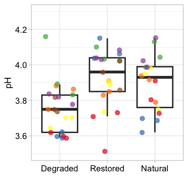

## 1. Sample Selection

    samples_to_keep <- c(
      "MGr3I", "MGr3H", "MGr3G", "MGr2F", "MGr2E", "MGr2D", "MGr1C", "MGr1B", "MGr1A",
      "CRr3I", "CRr3H", "CRr3G", "CRr2F", "CRr2E", "CRr2D", "CRr1C", "CRr1B", "CRr1A",
      "MHr3I", "MHr3H", "MHr3G", "MHr2F", "MHr2E", "MHr2D", "MHr1C", "MHr1B", "MHr1A",
      "BOr3I", "BOr3H", "BOr3G", "BOr2F", "BOr2E", "BOr2D", "BOr1C", "BOr1B", "BOr1A",
      "BAr3I", "BAr3H", "BAr3G", "BAr2F", "BAr2E", "BAr2D", "BAr1C", "BAr1B", "BAr1A",
      "SEr3I", "SEr3H", "SEr3G", "SEr2F", "SEr2E", "SEr2D", "LASCr2F", "LASCr2E", "LASCr2D",
      "LABRr1C", "LABRr1B", "LABRr1A", "LASAr3I", "LASAr3G", "LASAr3H"
    )

## 2. Data Import and Preprocessing

    # Oxygen data

    O2 <- read.csv("oxygen_probe.csv") %>%
      filter(Sample %in% samples_to_keep) %>%
      mutate(Depth = factor(Depth, levels = c("0_5", "5_10", "40_45", "45_50"))) %>%
      spread(key = Depth, value = O2) %>%
      mutate(
        oxic = rowMeans(select(., "0_5", "5_10"), na.rm = TRUE),
        anoxic = rowMeans(select(., "40_45", "45_50"), na.rm = TRUE)
      )

    O2

    ##     Sample        Site Treatment    0_5   5_10   40_45   45_50    oxic
    ## 1    BAr1A    Balmoral       NAT  9.960  9.788      NA      NA  9.8740
    ## 2    BAr1B    Balmoral       NAT  8.407  9.326      NA      NA  8.8665
    ## 3    BAr1C    Balmoral       NAT  6.874  7.207      NA      NA  7.0405
    ## 4    BAr2D    Balmoral       RES  9.841  8.734      NA      NA  9.2875
    ## 5    BAr2E    Balmoral       RES  9.858  6.597      NA      NA  8.2275
    ## 6    BAr2F    Balmoral       RES  9.826  6.817      NA      NA  8.3215
    ## 7    BAr3G    Balmoral       DAM  9.661  9.234      NA      NA  9.4475
    ## 8    BAr3H    Balmoral       DAM  9.342  9.364      NA      NA  9.3530
    ## 9    BAr3I    Balmoral       DAM 10.630  9.961      NA      NA 10.2955
    ## 10   BOr1A     Bowness       NAT  8.513  5.447  8.6500  9.8500  6.9800
    ## 11   BOr1B     Bowness       NAT  5.943  7.445  7.7050  9.5030  6.6940
    ## 12   BOr1C     Bowness       NAT  6.023  6.028 10.4300 10.9800  6.0255
    ## 13   BOr2D     Bowness       RES  8.385  7.746  3.7110  8.7760  8.0655
    ## 14   BOr2E     Bowness       RES  7.305  8.286  6.2770  6.3740  7.7955
    ## 15   BOr2F     Bowness       RES  9.146  8.482  7.4120  4.9220  8.8140
    ## 16   BOr3G     Bowness       DAM  9.908  9.870 10.3000 10.1100  9.8890
    ## 17   BOr3H     Bowness       DAM 10.050  9.642  8.7960  8.9570  9.8460
    ## 18   BOr3I     Bowness       DAM  9.765  7.852  9.1400  9.5170  8.8085
    ## 19   CRr1A     Crocach       NAT  6.846  5.706  7.9630  5.2090  6.2760
    ## 20   CRr1B     Crocach       NAT  5.621  5.428  3.0280  3.8900  5.5245
    ## 21   CRr1C     Crocach       NAT  4.349  7.216  6.8480  5.9470  5.7825
    ## 22   CRr2D     Crocach       RES  7.074  2.906  3.5600  3.3520  4.9900
    ## 23   CRr2E     Crocach       RES  9.086  5.282  1.8960  3.8220  7.1840
    ## 24   CRr2F     Crocach       RES  7.807  7.250  5.5510  2.9560  7.5285
    ## 25   CRr3G     Crocach       DAM     NA  5.201  6.2190  0.1390  5.2010
    ## 26   CRr3H     Crocach       DAM  7.901  8.256  5.4420  4.2140  8.0785
    ## 27   CRr3I     Crocach       DAM  5.016  9.980  6.1160  5.8160  7.4980
    ## 28 LABRr1A    Langwell       NAT  7.086  5.331  6.2300  6.1870  6.2085
    ## 29 LABRr1B    Langwell       NAT     NA 10.050  7.5750  4.4500 10.0500
    ## 30 LABRr1C    Langwell       NAT  6.985  6.704  7.0930  6.9390  6.8445
    ## 31 LASAr3G    Langwell       DAM  8.556  8.534  5.5860  7.1740  8.5450
    ## 32 LASAr3H    Langwell       DAM  8.938     NA  4.5650  6.7010  8.9380
    ## 33 LASAr3I    Langwell       DAM     NA  9.724  8.2700  7.7100  9.7240
    ## 34 LASCr2D    Langwell       RES     NA  9.963      NA      NA  9.9630
    ## 35 LASCr2E    Langwell       RES 10.770  6.322      NA      NA  8.5460
    ## 36 LASCr2F    Langwell       RES 10.160 10.150      NA      NA 10.1550
    ## 37   MGr1A   Migneint        NAT  3.648  7.140  5.1990  3.8710  5.3940
    ## 38   MGr1B   Migneint        NAT  2.407  2.816  2.8380  3.9300  2.6115
    ## 39   MGr1C   Migneint        NAT  5.774  1.902  5.6820  5.8780  3.8380
    ## 40   MGr2D   Migneint        RES  6.301  9.071  1.1563  2.6620  7.6860
    ## 41   MGr2E   Migneint        RES  1.152  5.317  0.1150  2.8370  3.2345
    ## 42   MGr2F   Migneint        RES  6.931  5.124  1.0790  2.7050  6.0275
    ## 43   MGr3G   Migneint        DAM  3.177  8.563  7.4040  0.8361  5.8700
    ## 44   MGr3H   Migneint        DAM  8.423 10.150  6.3790  3.7580  9.2865
    ## 45   MGr3I   Migneint        DAM  9.675  4.042  8.0320  2.9080  6.8585
    ## 46   MHr1A Moors_House       NAT 10.720 10.280  8.3870  1.5620 10.5000
    ## 47   MHr1B Moors_House       NAT  9.337  5.784  0.9244  1.6950  7.5605
    ## 48   MHr1C Moors_House       NAT  8.216  8.383  3.7300  1.6340  8.2995
    ## 49   MHr2D Moors_House       RES  9.978  8.298  3.0020  3.9080  9.1380
    ## 50   MHr2E Moors_House       RES  9.867  7.505  1.6220  5.6000  8.6860
    ## 51   MHr2F Moors_House       RES 10.670  9.975  5.0690  5.7150 10.3225
    ## 52   MHr3G Moors_House       DAM 10.490  6.082  1.1350  6.6130  8.2860
    ## 53   MHr3H Moors_House       DAM  9.611  9.870  1.7560  3.7120  9.7405
    ## 54   MHr3I Moors_House       DAM  9.318  4.949  3.5520  1.7430  7.1335
    ## 55   SEr2D       Stean       RES     NA  8.218 10.7000  6.6500  8.2180
    ## 56   SEr2E       Stean       RES     NA 11.820  5.4980  7.3520 11.8200
    ## 57   SEr2F       Stean       RES  8.573  9.313  8.3890  9.1470  8.9430
    ## 58   SEr3G       Stean       DAM     NA 10.760  6.6270  2.1580 10.7600
    ## 59   SEr3H       Stean       DAM 10.990  8.462 10.4600  7.0830  9.7260
    ## 60   SEr3I       Stean       DAM 10.230  9.624  9.1020  2.1500  9.9270
    ##      anoxic
    ## 1       NaN
    ## 2       NaN
    ## 3       NaN
    ## 4       NaN
    ## 5       NaN
    ## 6       NaN
    ## 7       NaN
    ## 8       NaN
    ## 9       NaN
    ## 10  9.25000
    ## 11  8.60400
    ## 12 10.70500
    ## 13  6.24350
    ## 14  6.32550
    ## 15  6.16700
    ## 16 10.20500
    ## 17  8.87650
    ## 18  9.32850
    ## 19  6.58600
    ## 20  3.45900
    ## 21  6.39750
    ## 22  3.45600
    ## 23  2.85900
    ## 24  4.25350
    ## 25  3.17900
    ## 26  4.82800
    ## 27  5.96600
    ## 28  6.20850
    ## 29  6.01250
    ## 30  7.01600
    ## 31  6.38000
    ## 32  5.63300
    ## 33  7.99000
    ## 34      NaN
    ## 35      NaN
    ## 36      NaN
    ## 37  4.53500
    ## 38  3.38400
    ## 39  5.78000
    ## 40  1.90915
    ## 41  1.47600
    ## 42  1.89200
    ## 43  4.12005
    ## 44  5.06850
    ## 45  5.47000
    ## 46  4.97450
    ## 47  1.30970
    ## 48  2.68200
    ## 49  3.45500
    ## 50  3.61100
    ## 51  5.39200
    ## 52  3.87400
    ## 53  2.73400
    ## 54  2.64750
    ## 55  8.67500
    ## 56  6.42500
    ## 57  8.76800
    ## 58  4.39250
    ## 59  8.77150
    ## 60  5.62600

    # Moisture & bulk density

    bulk <- read.csv("Bulk_Density.csv") %>%
      filter(Sample %in% samples_to_keep) %>%
      mutate(
        volume        = Volume_After - Volume_before,
        wet_weight    = weight_before - Crucible_weight,
        dry_weight    = weight_after - Crucible_weight,
        moisture      = ((wet_weight - dry_weight) / wet_weight) * 100,
        bulk_density  = dry_weight / volume,
        CUE_addition  = 0.334 * (moisture / 100) * 300,
        wet_bulk      = wet_weight / Volume_before
      )

    bulk

    ##     Sample Depth yr_rest        Site Treatment Crucible Volume_before
    ## 1    MGr1A  0_10     NAT    Migneint       NAT        1           920
    ## 2    MGr1B  0_10     NAT    Migneint       NAT        2           920
    ## 3    MGr1C  0_10     NAT    Migneint       NAT        3           920
    ## 4    MGr2D  0_10    REST    Migneint      REST        4           920
    ## 5    MGr2E  0_10    REST    Migneint      REST        5           920
    ## 6    MGr2F  0_10    REST    Migneint      REST        6           920
    ## 7    MGr3G  0_10     DAM    Migneint       DAM        7           920
    ## 8    MGr3H  0_10     DAM    Migneint       DAM        8           920
    ## 9    MGr3I  0_10     DAM    Migneint       DAM        9           920
    ## 10   CRr1A  0_10     NAT     Crocach       NAT        1           900
    ## 11   CRr1B  0_10     NAT     Crocach       NAT        2           900
    ## 12   CRr1C  0_10     NAT     Crocach       NAT        3           900
    ## 13   CRr2D  0_10    REST     Crocach      REST        4           900
    ## 14   CRr2E  0_10    REST     Crocach      REST        5           901
    ## 15   CRr2F  0_10    REST     Crocach      REST        6           901
    ## 16   CRr3G  0_10     DAM     Crocach       DAM        7           901
    ## 17   CRr3H  0_10     DAM     Crocach       DAM        8           900
    ## 18   CRr3I  0_10     DAM     Crocach       DAM        9           900
    ## 19   SEr2D  0_10    REST       Stean      REST       10           900
    ## 20   SEr2E  0_10    REST       Stean      REST       11           900
    ## 21   SEr2F  0_10    REST       Stean      REST       12           895
    ## 22   SEr3G  0_10     DAM       Stean       DAM       13           895
    ## 23   SEr3H  0_10     DAM       Stean       DAM       14           892
    ## 24   SEr3I  0_10     DAM       Stean       DAM       15           890
    ## 25   MHr1A  0_10     NAT Moors_House       NAT        1           900
    ## 26   MHr1B  0_10     NAT Moors_House       NAT        2           900
    ## 27   MHr1C  0_10     NAT Moors_House       NAT        3           900
    ## 28   MHr2D  0_10    REST Moors_House      REST        4           900
    ## 29   MHr2E  0_10    REST Moors_House      REST        5           900
    ## 30   MHr2F  0_10    REST Moors_House      REST        6           900
    ## 31   MHr3G  0_10     DAM Moors_House       DAM        7           900
    ## 32   MHr3H  0_10     DAM Moors_House       DAM        8           900
    ## 33   MHr3I  0_10     DAM Moors_House       DAM        9           900
    ## 34 LABRr1A  0_10     NAT    Langwell       NAT       10           900
    ## 35 LABRr1B  0_10     NAT    Langwell       NAT       11           899
    ## 36 LABRr1C  0_10     NAT    Langwell       NAT       12           899
    ## 37 LASAr3G  0_10     DAM    Langwell       DAM       16           899
    ## 38 LASAr3H  0_10     DAM    Langwell       DAM       17           897
    ## 39 LASAr3I  0_10     DAM    Langwell       DAM       18           897
    ## 40   BOr1A  0_10     NAT     Bowness       NAT        1           915
    ## 41   BOr1B  0_10     NAT     Bowness       NAT        2           915
    ## 42   BOr1C  0_10     NAT     Bowness       NAT        3           916
    ## 43   BOr2D  0_10    REST     Bowness      REST        4           917
    ## 44   BOr2E  0_10    REST     Bowness      REST        5           918
    ## 45   BOr2F  0_10    REST     Bowness      REST        6           918
    ## 46   BOr3G  0_10     DAM     Bowness       DAM        7           919
    ## 47   BOr3H  0_10     DAM     Bowness       DAM        8           919
    ## 48   BOr3I  0_10     DAM     Bowness       DAM        9           918
    ## 49   BAr1A  0_10     NAT    Balmoral       NAT       10           900
    ## 50   BAr1B  0_10     NAT    Balmoral       NAT       11           899
    ## 51   BAr1C  0_10     NAT    Balmoral       NAT       12           899
    ## 52   BAr2D  0_10    REST    Balmoral      REST       13           898
    ## 53   BAr2E  0_10    REST    Balmoral      REST       14           898
    ## 54   BAr2F  0_10    REST    Balmoral      REST       15           897
    ## 55   BAr3G  0_10     DAM    Balmoral       DAM       16           897
    ##    Volume_After Crucible_weight weight_before weight_after volume wet_weight
    ## 1           935           0.604        11.861       1.3242     15     11.257
    ## 2           925           0.617         5.601       1.0261      5      4.984
    ## 3           930           0.500         9.751       1.5310     10      9.251
    ## 4           930           0.522        11.536       1.5683     10     11.014
    ## 5           930           0.497        10.333       1.5770     10      9.836
    ## 6           930           0.521        10.211       1.6773     10      9.690
    ## 7           930           0.521        10.847       1.6781     10     10.326
    ## 8           930           0.524        10.502       1.5276     10      9.978
    ## 9           930           0.522         9.852       1.5800     10      9.330
    ## 10          910           0.492        10.271       1.7464     10      9.779
    ## 11          910           0.521         9.584       1.5142     10      9.063
    ## 12          911           0.496        10.441       1.4665     11      9.945
    ## 13          910           0.528         9.879       2.0166     10      9.351
    ## 14          913           0.496        10.682       1.9501     12     10.186
    ## 15          912           0.522         9.974       1.9361     11      9.452
    ## 16          911           0.522        11.715       1.7188     10     11.193
    ## 17          910           0.522        10.884       1.5651     10     10.362
    ## 18          909           0.523        11.504       1.6390      9     10.981
    ## 19          910           0.523        12.363       1.4083     10     11.840
    ## 20          908           0.522        11.516       1.4356      8     10.994
    ## 21          905           0.522        10.790       1.5959     10     10.268
    ## 22          905           0.518        12.177       1.9960     10     11.659
    ## 23          901           0.522        10.637       1.5195      9     10.115
    ## 24          899           0.522        10.722       1.8364      9     10.200
    ## 25          910           0.492        11.082       1.5750     10     10.590
    ## 26          910           0.523         9.639       1.1934     10      9.116
    ## 27          910           0.500        10.663       1.2422     10     10.163
    ## 28          909           0.527        10.885       1.7702      9     10.358
    ## 29          910           0.499        10.420       1.7404     10      9.921
    ## 30          910           0.523        11.080       1.5360     10     10.557
    ## 31          910           0.526        10.262       1.4469     10      9.736
    ## 32          909           0.527        10.671       1.5103      9     10.144
    ## 33          910           0.525        10.240       1.6065     10      9.715
    ## 34          910           0.527        10.428       1.5291     10      9.901
    ## 35          910           0.525        10.324       1.2666     11      9.799
    ## 36          908           0.527         9.781       1.4765      9      9.254
    ## 37          905           0.522        10.652       1.6389      6     10.130
    ## 38          900           0.522         5.291       1.0552      3      4.769
    ## 39          902           0.525        11.397       1.7071      5     10.872
    ## 40          925           0.495        10.511       1.5522     10     10.016
    ## 41          926           0.527        10.326       1.7280     11      9.799
    ## 42          929           0.505        10.325       1.9264     13      9.820
    ## 43          927           0.533        10.328       1.6700     10      9.795
    ## 44          927           0.502        10.328       1.8295      9      9.826
    ## 45          928           0.535        10.017       1.7240     10      9.482
    ## 46          929           0.540        11.164       2.3087     10     10.624
    ## 47          927           0.528        11.092       2.4395      8     10.564
    ## 48          927           0.542        10.316       1.9268      9      9.774
    ## 49          911           0.525        11.104       1.9815     11     10.579
    ## 50          910           0.523        11.963       1.9440     11     11.440
    ## 51          909           0.526        11.477       1.5563     10     10.951
    ## 52          906           0.526         9.721       1.6756      8      9.195
    ## 53          908           0.526        11.580       1.9136     10     11.054
    ## 54          904           0.525        10.549       1.9528      7     10.024
    ## 55          903           0.526        11.192       2.7041      6     10.666
    ##    dry_weight moisture bulk_density CUE_addition    wet_bulk
    ## 1      0.7202 93.60220   0.04801333     93.78941 0.012235870
    ## 2      0.4091 91.79173   0.08182000     91.97532 0.005417391
    ## 3      1.0310 88.85526   0.10310000     89.03297 0.010055435
    ## 4      1.0463 90.50027   0.10463000     90.68127 0.011971739
    ## 5      1.0800 89.01993   0.10800000     89.19797 0.010691304
    ## 6      1.1563 88.06708   0.11563000     88.24321 0.010532609
    ## 7      1.1571 88.79431   0.11571000     88.97189 0.011223913
    ## 8      1.0036 89.94187   0.10036000     90.12176 0.010845652
    ## 9      1.0580 88.66024   0.10580000     88.83756 0.010141304
    ## 10     1.2544 87.17251   0.12544000     87.34686 0.010865556
    ## 11     0.9932 89.04116   0.09932000     89.21924 0.010070000
    ## 12     0.9705 90.24133   0.08822727     90.42181 0.011050000
    ## 13     1.4886 84.08085   0.14886000     84.24901 0.010390000
    ## 14     1.4541 85.72452   0.12117500     85.89597 0.011305216
    ## 15     1.4141 85.03915   0.12855455     85.20922 0.010490566
    ## 16     1.1968 89.30760   0.11968000     89.48622 0.012422863
    ## 17     1.0431 89.93341   0.10431000     90.11328 0.011513333
    ## 18     1.1160 89.83699   0.12400000     90.01667 0.012201111
    ## 19     0.8853 92.52280   0.08853000     92.70785 0.013155556
    ## 20     0.9136 91.69001   0.11420000     91.87339 0.012215556
    ## 21     1.0739 89.54129   0.10739000     89.72038 0.011472626
    ## 22     1.4780 87.32310   0.14780000     87.49774 0.013026816
    ## 23     0.9975 90.13841   0.11083333     90.31869 0.011339686
    ## 24     1.3144 87.11373   0.14604444     87.28795 0.011460674
    ## 25     1.0830 89.77337   0.10830000     89.95292 0.011766667
    ## 26     0.6704 92.64590   0.06704000     92.83119 0.010128889
    ## 27     0.7422 92.69704   0.07422000     92.88243 0.011292222
    ## 28     1.2432 87.99768   0.13813333     88.17368 0.011508889
    ## 29     1.2414 87.48715   0.12414000     87.66212 0.011023333
    ## 30     1.0130 90.40447   0.10130000     90.58528 0.011730000
    ## 31     0.9209 90.54129   0.09209000     90.72237 0.010817778
    ## 32     0.9833 90.30659   0.10925556     90.48720 0.011271111
    ## 33     1.0815 88.86773   0.10815000     89.04547 0.010794444
    ## 34     1.0021 89.87880   0.10021000     90.05856 0.011001111
    ## 35     0.7416 92.43188   0.06741818     92.61674 0.010899889
    ## 36     0.9495 89.73957   0.10550000     89.91905 0.010293660
    ## 37     1.1169 88.97433   0.18615000     89.15228 0.011268076
    ## 38     0.5332 88.81946   0.17773333     88.99710 0.005316611
    ## 39     1.1821 89.12712   0.23642000     89.30537 0.012120401
    ## 40     1.0572 89.44489   0.10572000     89.62378 0.010946448
    ## 41     1.2010 87.74365   0.10918182     87.91913 0.010709290
    ## 42     1.4214 85.52546   0.10933846     85.69651 0.010720524
    ## 43     1.1370 88.39204   0.11370000     88.56882 0.010681570
    ## 44     1.3275 86.48992   0.14750000     86.66290 0.010703704
    ## 45     1.1890 87.46045   0.11890000     87.63537 0.010328976
    ## 46     1.7687 83.35184   0.17687000     83.51855 0.011560392
    ## 47     1.9115 81.90553   0.23893750     82.06934 0.011495103
    ## 48     1.3848 85.83180   0.15386667     86.00346 0.010647059
    ## 49     1.4565 86.23216   0.13240909     86.40462 0.011754444
    ## 50     1.4210 87.57867   0.12918182     87.75383 0.012725250
    ## 51     1.0303 90.59173   0.10303000     90.77291 0.012181313
    ## 52     1.1496 87.49755   0.14370000     87.67255 0.010239421
    ## 53     1.3876 87.44708   0.13876000     87.62197 0.012309577
    ## 54     1.4278 85.75619   0.20397143     85.92770 0.011175028
    ## 55     2.1781 79.57904   0.36301667     79.73819 0.011890747
    ##  [ reached 'max' / getOption("max.print") -- omitted 5 rows ]

    bulk_mean <- bulk %>%
      group_by(Treatment) %>%
      summarise(moisture_mean = mean(moisture, na.rm = TRUE))

    bulk_mean

    ## # A tibble: 3 × 2
    ##   Treatment moisture_mean
    ##   <chr>             <dbl>
    ## 1 DAM                86.8
    ## 2 NAT                89.7
    ## 3 REST               88.4

    # Vegetation data

    veg <- read.csv("vegetation_percentage.csv") %>%
      left_join(read.csv("Sample_ID.csv"), by = "Sample") %>%
      mutate(vascular = eric + gram)

    veg

    ##     Sample       eric      sphag     gram      other Sample_ID Depth
    ## 1    MGr1A  0.0000000 66.1876879 33.81231  0.0000000       MG1  0_10
    ## 2    MGr1B  0.0000000 54.3505188 45.64948  0.0000000       MG3  0_10
    ## 3    MGr1C  0.0000000 32.2594406 67.74056  0.0000000       MG5  0_10
    ## 4    MGr2D  3.2993579 37.1269318 59.57371  0.0000000       MG7  0_10
    ## 5    MGr2E  6.9929645 30.4905093 61.24726  2.0723668       MG9  0_10
    ## 6    MGr2F 24.8648246 11.7036794 62.22017  1.9468391      MG11  0_10
    ## 7    MGr3G 23.7458810  3.3525996 72.90152  0.0000000      MG13  0_10
    ## 8    MGr3H 21.3004935 13.9967492 64.70276  0.0000000      MG15  0_10
    ## 9    MGr3I 44.1147951  5.8353934 48.71354  2.7431293      MG17  0_10
    ## 10   CRr1A  5.8826746 11.7858922 82.33143  0.0000000       CR1  0_10
    ## 11   CRr1B 10.7293345 18.5248394 70.74583  0.0000000       CR3  0_10
    ## 12   CRr1C  2.7902401 31.7718780 65.43788  0.0000000       CR5  0_10
    ## 13   CRr2D 10.8472343 20.7780596 67.99703  0.5554291       CR7  0_10
    ## 14   CRr2E 11.0421331 12.9237580 76.03411  0.0000000       CR9  0_10
    ## 15   CRr2F  7.5181224 22.3215287 69.78060  0.5441980      CR11  0_10
    ## 16   CRr3G  0.5996160  0.0000000 92.49664  7.4637803      CR13  0_10
    ## 17   CRr3H  4.8945331 17.8346918 77.27078  0.0000000      CR15  0_10
    ## 18   CRr3I  2.0918158  4.2322748 92.63377  1.1250071      CR17  0_10
    ## 19   BAr1A 52.9422026  2.5936194 44.46418  0.0000000       BA1  0_10
    ## 20   BAr1B 31.7603838 14.6546829 52.97671  1.1480878       BA2  0_10
    ## 21   BAr1C 12.4240690  5.0644358 82.51150  0.0000000       BA3  0_10
    ## 22   BAr2D 37.0802978  8.8829984 54.03670  0.0000000       BA4  0_10
    ## 23   BAr2E 14.7926306 14.0147498 71.19262  0.0000000       BA5  0_10
    ## 24   BAr2F 45.6126942 20.5633611 33.82394  0.0000000       BA6  0_10
    ## 25   BAr3G  0.6726145 14.7352104 84.59218  0.0000000       BA7  0_10
    ## 26   BAr3H  0.6902902  1.5695768 97.74013  0.0000000       BA8  0_10
    ## 27   BAr3I  0.0000000  2.2326978 97.76730  0.0000000       BA9  0_10
    ## 28   BOr1A  6.4084260 18.5421161 75.04946  0.0000000       BO1  0_10
    ## 29   BOr1B 12.4342096  6.9777328 78.78540  2.2880568       BO3  0_10
    ## 30   BOr1C 33.3926649  5.0326398 59.64157  3.2412328       BO5  0_10
    ## 31   BOr2D 29.9663782  4.9809653 61.05607  6.5457679       BO7  0_10
    ## 32   BOr2E 55.4185832  0.7924928 39.07355 12.0679528       BO9  0_10
    ## 33   BOr2F 29.7423769 13.0070921 48.78090 17.3626081      BO11  0_10
    ## 34   BOr3G 47.1351660  2.0521152 50.17753  1.2658835      BO13  0_10
    ## 35   BOr3H 39.1374603  0.0000000 58.83278  3.4500563      BO15  0_10
    ## 36   BOr3I 46.5901992  5.2124817 40.98548 17.5960879      BO17  0_10
    ## 37 LASYr2D         NA         NA       NA         NA       LA1  0_10
    ## 38 LASYr2E         NA         NA       NA         NA       LA3  0_10
    ## 39 LASYr2F         NA         NA       NA         NA       LA5  0_10
    ## 40 LASAr3G 27.9534051  3.1468596 68.89974  0.0000000       LA7  0_10
    ## 41 LASAr3H  2.7401308 17.9265668 79.33330  0.0000000       LA8  0_10
    ## 42 LASAr3I 14.9069431  3.5386288 81.55443  0.0000000       LA9  0_10
    ## 43 LABRr1A 15.3480141 15.6898898 67.38439  2.3413462      LA13  0_10
    ## 44 LABRr1B  1.8824982 21.8623275 76.25517  0.0000000      LA15  0_10
    ## 45 LABRr1C  2.4287302 27.6016439 69.96963  0.0000000      LA17  0_10
    ## 46 LASCr2D  1.0947375 14.5214756 84.38379  0.0000000      LA19  0_10
    ## 47 LASCr2E 10.2228933 18.0108674 71.76624  0.0000000      LA21  0_10
    ## 48 LASCr2F  0.0000000 11.7345203 88.26548  0.0000000      LA23  0_10
    ## 49 LAWAr2D         NA         NA       NA         NA      LA25  0_10
    ## 50 LAWAr2E         NA         NA       NA         NA      LA27  0_10
    ## 51 LAWAr2F         NA         NA       NA         NA      LA29  0_10
    ## 52   SEr2D         NA         NA       NA         NA       SE1  0_10
    ## 53   SEr2E         NA         NA       NA         NA       SE3  0_10
    ## 54   SEr2F         NA         NA       NA         NA       SE5  0_10
    ## 55   SEr3G         NA         NA       NA         NA       SE7  0_10
    ## 56   SEr3H         NA         NA       NA         NA       SE9  0_10
    ## 57   SEr3I         NA         NA       NA         NA      SE11  0_10
    ## 58   MHr1A 35.7311690 20.8881867 43.38064  0.0000000       MH1  0_10
    ## 59   MHr1B 48.8273425 19.3135510 31.85911  0.0000000       MH3  0_10
    ## 60   MHr1C 31.5346144 31.7324024 36.73298  0.0000000       MH5  0_10
    ## 61   MHr2D 45.3345537  6.1741580 48.49129  0.0000000       MH7  0_10
    ## 62   MHr2E 67.1475716  1.6966111 29.44333  5.8162184       MH9  0_10
    ## 63   MHr2F 40.9881427  1.7706887 57.24117  0.0000000      MH11  0_10
    ## 64   MHr3G 54.6569432 15.7959643 29.54709  0.0000000      MH13  0_10
    ## 65   MHr3H 56.5883533  1.3777282 42.03392  0.0000000      MH15  0_10
    ## 66   MHr3I 42.9887371  2.3262473 54.68502  0.0000000      MH17  0_10
    ##           Site Treatment vascular
    ## 1     Migneint       NAT 33.81231
    ## 2     Migneint       NAT 45.64948
    ## 3     Migneint       NAT 67.74056
    ## 4     Migneint      REST 62.87307
    ## 5     Migneint      REST 68.24022
    ## 6     Migneint      REST 87.08499
    ## 7     Migneint       DAM 96.64740
    ## 8     Migneint       DAM 86.00325
    ## 9     Migneint       DAM 92.82833
    ## 10     Crocach       NAT 88.21411
    ## 11     Crocach       NAT 81.47516
    ## 12     Crocach       NAT 68.22812
    ## 13     Crocach      REST 78.84427
    ## 14     Crocach      REST 87.07624
    ## 15     Crocach      REST 77.29873
    ## 16     Crocach       DAM 93.09625
    ## 17     Crocach       DAM 82.16531
    ## 18     Crocach       DAM 94.72559
    ## 19    Balmoral       NAT 97.40638
    ## 20    Balmoral       NAT 84.73710
    ## 21    Balmoral       NAT 94.93556
    ## 22    Balmoral      REST 91.11700
    ## 23    Balmoral      REST 85.98525
    ## 24    Balmoral      REST 79.43664
    ## 25    Balmoral       DAM 85.26479
    ## 26    Balmoral       DAM 98.43042
    ## 27    Balmoral       DAM 97.76730
    ## 28     Bowness       NAT 81.45788
    ## 29     Bowness       NAT 91.21961
    ## 30     Bowness       NAT 93.03424
    ## 31     Bowness      REST 91.02245
    ## 32     Bowness      REST 94.49213
    ## 33     Bowness      REST 78.52327
    ## 34     Bowness       DAM 97.31270
    ## 35     Bowness       DAM 97.97024
    ## 36     Bowness       DAM 87.57568
    ## 37    Langwell      REST       NA
    ## 38    Langwell      REST       NA
    ## 39    Langwell      REST       NA
    ## 40    Langwell       DAM 96.85314
    ## 41    Langwell       DAM 82.07343
    ## 42    Langwell       DAM 96.46137
    ## 43    Langwell       NAT 82.73241
    ## 44    Langwell       NAT 78.13767
    ## 45    Langwell       NAT 72.39836
    ## 46    Langwell      REST 85.47852
    ## 47    Langwell      REST 81.98913
    ## 48    Langwell      REST 88.26548
    ## 49    Langwell      REST       NA
    ## 50    Langwell      REST       NA
    ## 51    Langwell      REST       NA
    ## 52       Stean      REST       NA
    ## 53       Stean      REST       NA
    ## 54       Stean      REST       NA
    ## 55       Stean       DAM       NA
    ## 56       Stean       DAM       NA
    ## 57       Stean       DAM       NA
    ## 58 Moors_House       NAT 79.11181
    ## 59 Moors_House       NAT 80.68645
    ## 60 Moors_House       NAT 68.26760
    ## 61 Moors_House      REST 93.82584
    ## 62 Moors_House      REST 96.59090
    ## 63 Moors_House      REST 98.22931
    ## 64 Moors_House       DAM 84.20404
    ## 65 Moors_House       DAM 98.62227
    ## 66 Moors_House       DAM 97.67375

    TC <- read.csv("TC_TN.csv") %>%
      left_join(read.csv("Sample_ID.csv"), by = "Sample") %>%
      filter(Sample %in% samples_to_keep)

    TC

    ##     Sample Plate_Well Sample_Weight_mg       X.N      X.C       CN Sample_ID
    ## 1    CRr1C         A1            10.17 1.7600350 47.24883 26.84539       CR5
    ## 2  LABRr1B         A2            10.69 1.2840947 44.34337 34.53279      LA15
    ## 3    SEr2D         A3            11.62 1.1211059 46.44328 41.42631       SE1
    ## 4    SEr2E         A4            12.24 1.0063529 45.62141 45.33341       SE3
    ## 5    CRr2D         A6            10.60 1.3586918 53.16726 39.13121       CR7
    ## 6    CRr2E         A7            12.45 1.9584445 49.32398 25.18528       CR9
    ## 7  LABRr1C         A8            13.16 1.7810409 47.69652 26.78014      LA17
    ## 8    CRr2F         A9            10.42 2.1696458 49.88054 22.99018      CR11
    ## 9    BOr3G        A10            11.31 1.7134116 46.64932 27.22599      BO13
    ## 10   CRr1A        A11            11.77 2.0214064 47.89912 23.69594       CR1
    ## 11   MGr2E         B1            11.79 1.9837331 48.84855 24.62456       MG9
    ## 12   BOr1C         B2            14.83 1.3583310 46.29145 34.07965       BO5
    ## 13   MHr1A         B3            11.40 1.3372927 47.97347 35.87357       MH1
    ## 14   BAr2D         B4            10.22 1.1211820 51.12538 45.59954       BA4
    ## 15 LASCr2E         B5            12.20 1.0615925 46.26957 43.58506      LA21
    ## 16 LASAr3G         B7            11.86 1.3907166 46.83960 33.68019       LA7
    ## 17   BOr3H         B8            11.89 1.7978941 45.12646 25.09962      BO15
    ## 18   BOr1A         B9            11.21 1.4358318 47.23617 32.89812       BO1
    ## 19   BAr1A        B10            12.16 1.1701019 46.27535 39.54814       BA1
    ## 20   SEr3H         C1            11.33 0.9110925 49.64233 54.48660       SE9
    ## 21   BAr3G         C2            10.42 1.4844972 42.35862 28.53398       BA7
    ## 22   BAr1B         C3            13.67 1.1706003 46.42556 39.65961       BA2
    ## 23   BAr1C         C4            14.54 1.2474421 49.78674 39.91106       BA3
    ## 24 LASAr3H         C5            13.72 1.9692106 50.28053 25.53334       LA8
    ## 25   BOr2D         C6            14.52 1.6016167 49.29037 30.77538       BO7
    ## 26   MHr2F         C8            10.51 1.4993716 48.64301 32.44227      MH11
    ## 27   BAr2E         C9            10.76 1.5402536 52.07274 33.80790       BA5
    ## 28 LASCr2F        C10            10.86 1.2663594 51.38515 40.57707      LA23
    ## 29   BOr2E        C11            12.42 1.7381197 47.98551 27.60771       BO9
    ## 30   MGr1B         D1            13.32 2.4383523 50.84798 20.85342       MG3
    ## 31   BAr2F         D2            12.67 1.5189359 51.15368 33.67731       BA6
    ## 32   MHr1C         D3            10.66 1.3935555 49.35648 35.41766       MH5
    ## 33   BAr3I         D4            13.18 1.4212520 47.02564 33.08748       BA9
    ## 34   BOr2F         D5            10.15 1.6779313 49.52766 29.51710      BO11
    ## 35   SEr3G         D6            11.06 1.1503860 52.86704 45.95592       SE7
    ## 36   MHr3G         D7            11.14 1.5411164 49.85317 32.34874      MH13
    ## 37   MHr2D         D8            11.20 1.7610246 50.64264 28.75749       MH7
    ## 38   MHr3H         D9            10.26 1.5832690 50.68416 32.01235      MH15
    ## 39   MGr2F        D10             9.92 2.3162584 51.89397 22.40422      MG11
    ## 40   MHr2E        D11            12.72 1.9943821 50.98798 25.56580       MH9
    ## 41   CRr3G         E1            11.10 1.5050452 51.33075 34.10579      CR13
    ## 42   MHr1B         E2            10.64 1.5526851 49.47584 31.86469       MH3
    ## 43   SEr3I         E3            10.55 1.3637865 51.86971 38.03360      SE11
    ## 44   MGr1A         E4            10.20 1.8755337 49.51977 26.40303       MG1
    ## 45   MGr3G         E7            13.40 1.7664410 50.16782 28.40051      MG13
    ## 46   BOr3I         E8            11.93 2.2437608 49.97747 22.27397      BO17
    ## 47   BAr3H        E10            10.70 1.8095157 50.73779 28.03943       BA8
    ## 48 LABRr1A        E11            10.13 1.7855492 49.90676 27.95037      LA13
    ## 49 LASAr3I         F1            11.36 1.7046403 45.57399 26.73526       LA9
    ## 50   MGr3H         F2            12.84 1.9150014 47.01845 24.55270      MG15
    ## 51   MGr1C         F3            13.19 2.1822319 43.88880 20.11189       MG5
    ## 52   CRr3H         F4            12.25 1.6273959 46.77607 28.74290      CR15
    ## 53   MHr3I         F5            10.31 1.7537367 47.86358 27.29234      MH17
    ## 54   SEr2F         F6             9.90 1.2458235 45.01654 36.13396       SE5
    ## 55   CRr3I         F7            10.94 1.7116307 43.69639 25.52910      CR17
    ## 56 LASCr2D         F8            10.52 0.9723937 41.44368 42.62027      LA19
    ## 57   MGr3I         F9            10.63 2.0100722 49.97535 24.86246      MG17
    ## 58   MGr2D        F10            13.17 1.9665606 45.53867 23.15650       MG7
    ## 59   CRr1B        F11            11.87 1.8297397 49.00604 26.78307       CR3
    ## 60   BOr1B         G1            10.73 1.5578886 48.25644 30.97554       BO3
    ##    Depth        Site Treatment
    ## 1   0_10     Crocach       NAT
    ## 2   0_10    Langwell       NAT
    ## 3   0_10       Stean      REST
    ## 4   0_10       Stean      REST
    ## 5   0_10     Crocach      REST
    ## 6   0_10     Crocach      REST
    ## 7   0_10    Langwell       NAT
    ## 8   0_10     Crocach      REST
    ## 9   0_10     Bowness       DAM
    ## 10  0_10     Crocach       NAT
    ## 11  0_10    Migneint      REST
    ## 12  0_10     Bowness       NAT
    ## 13  0_10 Moors_House       NAT
    ## 14  0_10    Balmoral      REST
    ## 15  0_10    Langwell      REST
    ## 16  0_10    Langwell       DAM
    ## 17  0_10     Bowness       DAM
    ## 18  0_10     Bowness       NAT
    ## 19  0_10    Balmoral       NAT
    ## 20  0_10       Stean       DAM
    ## 21  0_10    Balmoral       DAM
    ## 22  0_10    Balmoral       NAT
    ## 23  0_10    Balmoral       NAT
    ## 24  0_10    Langwell       DAM
    ## 25  0_10     Bowness      REST
    ## 26  0_10 Moors_House      REST
    ## 27  0_10    Balmoral      REST
    ## 28  0_10    Langwell      REST
    ## 29  0_10     Bowness      REST
    ## 30  0_10    Migneint       NAT
    ## 31  0_10    Balmoral      REST
    ## 32  0_10 Moors_House       NAT
    ## 33  0_10    Balmoral       DAM
    ## 34  0_10     Bowness      REST
    ## 35  0_10       Stean       DAM
    ## 36  0_10 Moors_House       DAM
    ## 37  0_10 Moors_House      REST
    ## 38  0_10 Moors_House       DAM
    ## 39  0_10    Migneint      REST
    ## 40  0_10 Moors_House      REST
    ## 41  0_10     Crocach       DAM
    ## 42  0_10 Moors_House       NAT
    ## 43  0_10       Stean       DAM
    ## 44  0_10    Migneint       NAT
    ## 45  0_10    Migneint       DAM
    ## 46  0_10     Bowness       DAM
    ## 47  0_10    Balmoral       DAM
    ## 48  0_10    Langwell       NAT
    ## 49  0_10    Langwell       DAM
    ## 50  0_10    Migneint       DAM
    ## 51  0_10    Migneint       NAT
    ## 52  0_10     Crocach       DAM
    ## 53  0_10 Moors_House       DAM
    ## 54  0_10       Stean      REST
    ## 55  0_10     Crocach       DAM
    ## 56  0_10    Langwell      REST
    ## 57  0_10    Migneint       DAM
    ## 58  0_10    Migneint      REST
    ## 59  0_10     Crocach       NAT
    ## 60  0_10     Bowness       NAT

    # pH

    ph <- read.csv("Ph.csv") %>%
      filter(Sample %in% samples_to_keep & Depth == "0_10")

    ph

    ##     Sample        Site Treatment Depth   ph cond
    ## 1    MGr1A    Migneint       NAT  0_10 3.79 48.8
    ## 2    MGr1B    Migneint       NAT  0_10 3.94 28.8
    ## 3    MGr1C    Migneint       NAT  0_10 3.92 30.1
    ## 4    MGr2D    Migneint       RES  0_10 3.83 30.4
    ## 5    MGr2E    Migneint       RES  0_10 3.91 48.6
    ## 6    MGr2F    Migneint       RES  0_10 3.85 37.5
    ## 7    MGr3G    Migneint       DAM  0_10 3.88 37.9
    ## 8    MGr3H    Migneint       DAM  0_10 3.86 33.1
    ## 9    MGr3I    Migneint       DAM  0_10 3.75 34.8
    ## 10   CRr1A     Crocach       NAT  0_10 3.99 46.2
    ## 11   CRr1B     Crocach       NAT  0_10 4.04 30.8
    ## 12   CRr1C     Crocach       NAT  0_10 4.13 25.9
    ## 13   CRr2D     Crocach       RES  0_10 4.03 35.9
    ## 14   CRr2E     Crocach       RES  0_10 4.02 41.8
    ## 15   CRr2F     Crocach       RES  0_10 4.10 33.5
    ## 16   CRr3G     Crocach       DAM  0_10 3.83 43.8
    ## 17   CRr3H     Crocach       DAM  0_10 3.89 58.7
    ## 18   CRr3I     Crocach       DAM  0_10 4.16 45.1
    ## 19   SEr2D       Stean       RES  0_10 3.86 39.7
    ## 20   SEr2E       Stean       RES  0_10 3.96 32.2
    ## 21   SEr2F       Stean       RES  0_10 4.02 27.8
    ## 22   SEr3G       Stean       DAM  0_10 3.82 54.8
    ## 23   SEr3H       Stean       DAM  0_10 3.75 44.5
    ## 24   SEr3I       Stean       DAM  0_10 3.74 47.0
    ## 25 LASAr3G    Langwell       DAM  0_10 3.78 55.6
    ## 26 LASAr3H    Langwell       DAM  0_10 3.84 62.3
    ## 27 LASAr3I    Langwell       DAM  0_10 3.82 63.8
    ## 28 LABRr1A    Langwell       NAT  0_10 4.15 25.7
    ## 29 LABRr1B    Langwell       NAT  0_10 4.02 23.0
    ## 30 LABRr1C    Langwell       NAT  0_10 3.99 22.7
    ## 31   MHr1A Moors_House       NAT  0_10 3.75 54.1
    ## 32   MHr1B Moors_House       NAT  0_10 3.98 25.9
    ## 33   MHr1C Moors_House       NAT  0_10 3.95 30.0
    ## 34   MHr2D Moors_House       RES  0_10 3.89 37.1
    ## 35   MHr2E Moors_House       RES  0_10 3.91 30.6
    ## 36   MHr2F Moors_House       RES  0_10 3.74 36.9
    ## 37   MHr3G Moors_House       DAM  0_10 3.70 38.9
    ## 38   MHr3H Moors_House       DAM  0_10 3.64 39.2
    ## 39   MHr3I Moors_House       DAM  0_10 3.70 38.7
    ## 40   BOr1A     Bowness       NAT  0_10 3.62 41.1
    ## 41   BOr1B     Bowness       NAT  0_10 3.70 47.8
    ## 42   BOr1C     Bowness       NAT  0_10 3.69 44.9
    ## 43   BOr2D     Bowness       RES  0_10 4.15 31.0
    ## 44   BOr2E     Bowness       RES  0_10 4.04 30.2
    ## 45   BOr2F     Bowness       RES  0_10 4.06 30.8
    ## 46   BOr3G     Bowness       DAM  0_10 3.60 35.1
    ## 47   BOr3H     Bowness       DAM  0_10 3.59 42.4
    ## 48   BOr3I     Bowness       DAM  0_10 3.62 34.8
    ## 49   BAr1A    Balmoral       NAT  0_10 3.73 46.7
    ## 50   BAr1B    Balmoral       NAT  0_10 3.80 28.7
    ## 51   BAr1C    Balmoral       NAT  0_10 3.91 21.9
    ## 52   BAr2D    Balmoral       RES  0_10 3.71 20.9
    ## 53   BAr2E    Balmoral       RES  0_10 3.73 25.3
    ## 54   BAr2F    Balmoral       RES  0_10 3.51 38.9
    ## 55   BAr3G    Balmoral       DAM  0_10 3.60 35.1
    ## 56   BAr3H    Balmoral       DAM  0_10 3.59 42.4
    ## 57   BAr3I    Balmoral       DAM  0_10 3.62 34.8
    ## 58 LASCr2D    Langwell       RES  0_10 4.08 60.8
    ## 59 LASCr2E    Langwell       RES  0_10 4.04 39.2
    ## 60 LASCr2F    Langwell       RES  0_10 4.03 29.3

    # Water table

    wt_raw <- read.csv("Site_Data.csv")

    wt_raw

    ##             ID     Site Region            Datetime       Date Hour Day Week
    ## 1  BraemoreNN1 Braemore     NN 2022-08-03 22:00:00 2022-08-03   22 215   31
    ## 2  BraemoreNN1 Braemore     NN 2022-08-03 23:00:00 2022-08-03   23 215   31
    ## 3  BraemoreNN1 Braemore     NN 2022-08-04 00:00:00 2022-08-04    0 216   31
    ## 4  BraemoreNN1 Braemore     NN 2022-08-04 01:00:00 2022-08-04    1 216   31
    ## 5  BraemoreNN1 Braemore     NN 2022-08-04 02:00:00 2022-08-04    2 216   31
    ## 6  BraemoreNN1 Braemore     NN 2022-08-04 03:00:00 2022-08-04    3 216   31
    ## 7  BraemoreNN1 Braemore     NN 2022-08-04 04:00:00 2022-08-04    4 216   31
    ## 8  BraemoreNN1 Braemore     NN 2022-08-04 05:00:00 2022-08-04    5 216   31
    ## 9  BraemoreNN1 Braemore     NN 2022-08-04 06:00:00 2022-08-04    6 216   31
    ## 10 BraemoreNN1 Braemore     NN 2022-08-04 07:00:00 2022-08-04    7 216   31
    ## 11 BraemoreNN1 Braemore     NN 2022-08-04 08:00:00 2022-08-04    8 216   31
    ## 12 BraemoreNN1 Braemore     NN 2022-08-04 09:00:00 2022-08-04    9 216   31
    ## 13 BraemoreNN1 Braemore     NN 2022-08-04 10:00:00 2022-08-04   10 216   31
    ## 14 BraemoreNN1 Braemore     NN 2022-08-04 11:00:00 2022-08-04   11 216   31
    ## 15 BraemoreNN1 Braemore     NN 2022-08-04 12:00:00 2022-08-04   12 216   31
    ## 16 BraemoreNN1 Braemore     NN 2022-08-04 13:00:00 2022-08-04   13 216   31
    ## 17 BraemoreNN1 Braemore     NN 2022-08-04 14:00:00 2022-08-04   14 216   31
    ## 18 BraemoreNN1 Braemore     NN 2022-08-04 15:00:00 2022-08-04   15 216   31
    ## 19 BraemoreNN1 Braemore     NN 2022-08-04 16:00:00 2022-08-04   16 216   31
    ## 20 BraemoreNN1 Braemore     NN 2022-08-04 17:00:00 2022-08-04   17 216   31
    ## 21 BraemoreNN1 Braemore     NN 2022-08-04 18:00:00 2022-08-04   18 216   31
    ## 22 BraemoreNN1 Braemore     NN 2022-08-04 19:00:00 2022-08-04   19 216   31
    ## 23 BraemoreNN1 Braemore     NN 2022-08-04 20:00:00 2022-08-04   20 216   31
    ## 24 BraemoreNN1 Braemore     NN 2022-08-04 21:00:00 2022-08-04   21 216   31
    ## 25 BraemoreNN1 Braemore     NN 2022-08-04 22:00:00 2022-08-04   22 216   31
    ## 26 BraemoreNN1 Braemore     NN 2022-08-04 23:00:00 2022-08-04   23 216   31
    ## 27 BraemoreNN1 Braemore     NN 2022-08-05 00:00:00 2022-08-05    0 217   31
    ## 28 BraemoreNN1 Braemore     NN 2022-08-05 01:00:00 2022-08-05    1 217   31
    ## 29 BraemoreNN1 Braemore     NN 2022-08-05 02:00:00 2022-08-05    2 217   31
    ## 30 BraemoreNN1 Braemore     NN 2022-08-05 03:00:00 2022-08-05    3 217   31
    ## 31 BraemoreNN1 Braemore     NN 2022-08-05 04:00:00 2022-08-05    4 217   31
    ## 32 BraemoreNN1 Braemore     NN 2022-08-05 05:00:00 2022-08-05    5 217   31
    ## 33 BraemoreNN1 Braemore     NN 2022-08-05 06:00:00 2022-08-05    6 217   31
    ## 34 BraemoreNN1 Braemore     NN 2022-08-05 07:00:00 2022-08-05    7 217   31
    ## 35 BraemoreNN1 Braemore     NN 2022-08-05 08:00:00 2022-08-05    8 217   31
    ## 36 BraemoreNN1 Braemore     NN 2022-08-05 09:00:00 2022-08-05    9 217   31
    ## 37 BraemoreNN1 Braemore     NN 2022-08-05 10:00:00 2022-08-05   10 217   31
    ## 38 BraemoreNN1 Braemore     NN 2022-08-05 11:00:00 2022-08-05   11 217   31
    ## 39 BraemoreNN1 Braemore     NN 2022-08-05 12:00:00 2022-08-05   12 217   31
    ## 40 BraemoreNN1 Braemore     NN 2022-08-05 13:00:00 2022-08-05   13 217   31
    ## 41 BraemoreNN1 Braemore     NN 2022-08-05 14:00:00 2022-08-05   14 217   31
    ## 42 BraemoreNN1 Braemore     NN 2022-08-05 15:00:00 2022-08-05   15 217   31
    ## 43 BraemoreNN1 Braemore     NN 2022-08-05 16:00:00 2022-08-05   16 217   31
    ## 44 BraemoreNN1 Braemore     NN 2022-08-05 17:00:00 2022-08-05   17 217   31
    ## 45 BraemoreNN1 Braemore     NN 2022-08-05 18:00:00 2022-08-05   18 217   31
    ##    Month Quarter Year Temperature.Logger. Temperature.Baro. mmHg.Logger.
    ## 1      8       3 2022              10.150             9.127      782.481
    ## 2      8       3 2022              10.098             8.185      783.353
    ## 3      8       3 2022              10.046             8.238      783.973
    ## 4      8       3 2022              10.150             8.343      784.745
    ## 5      8       3 2022              10.098             8.657      785.197
    ## 6      8       3 2022              10.098             8.709      785.784
    ## 7      8       3 2022              10.098             8.133      786.078
    ## 8      8       3 2022              10.098             7.923      786.539
    ## 9      8       3 2022              10.098             7.661      787.084
    ## 10     8       3 2022              10.098             7.555      788.132
    ## 11     8       3 2022              10.098            10.583      789.012
    ## 12     8       3 2022              10.098            11.152      789.892
    ## 13     8       3 2022              10.046            10.116      790.513
    ## 14     8       3 2022              10.046            12.234      791.225
    ## 15     8       3 2022              10.098            18.215      791.988
    ## 16     8       3 2022              10.098            18.664      792.869
    ## 17     8       3 2022              10.098            15.296      793.623
    ## 18     8       3 2022              10.098            13.260      794.378
    ## 19     8       3 2022              10.098            15.954      795.174
    ## 20     8       3 2022              10.098            13.669      796.348
    ## 21     8       3 2022              10.098            11.668      797.145
    ## 22     8       3 2022              10.098            13.873      797.606
    ## 23     8       3 2022              10.098            10.427      798.193
    ## 24     8       3 2022              10.098             9.283      798.947
    ## 25     8       3 2022              10.150             7.923      799.669
    ## 26     8       3 2022              10.098             6.501      800.121
    ## 27     8       3 2022              10.098             5.547      800.289
    ## 28     8       3 2022              10.098             5.707      800.457
    ## 29     8       3 2022              10.098             4.483      800.708
    ## 30     8       3 2022              10.098             3.787      800.918
    ## 31     8       3 2022              10.098             3.305      800.960
    ## 32     8       3 2022              10.098             3.197      801.127
    ## 33     8       3 2022              10.098             4.216      801.756
    ## 34     8       3 2022              10.098             8.552      801.798
    ## 35     8       3 2022              10.098            11.771      801.966
    ## 36     8       3 2022              10.150            14.026      802.100
    ## 37     8       3 2022              10.098            12.183      802.553
    ## 38     8       3 2022              10.150            15.853      802.687
    ## 39     8       3 2022              10.150            12.388      803.232
    ## 40     8       3 2022              10.098            12.696      803.559
    ## 41     8       3 2022              10.098            16.257      803.768
    ## 42     8       3 2022              10.150            13.975      804.406
    ## 43     8       3 2022              10.098            13.413      804.649
    ## 44     8       3 2022              10.098            12.799      804.481
    ## 45     8       3 2022              10.150            11.720      804.658
    ##    mmHg.Baro. mmHg.Baro.Adj.    mmH2O  A  B   C   E   WTD.mm.
    ## 1     730.769        730.594 705.4090 20 50 975 945 239.59105
    ## 2     731.143        730.968 712.1793 20 50 975 945 232.82069
    ## 3     730.980        730.805 722.8243 20 50 975 945 222.17572
    ## 4     731.335        731.160 728.4934 20 50 975 945 216.50657
    ## 5     731.381        731.206 734.0130 20 50 975 945 210.98696
    ## 6     731.091        730.916 745.9359 20 50 975 945 199.06405
    ## 7     731.093        730.918 749.9057 20 50 975 945 195.09428
    ## 8     730.723        730.548 761.2032 20 50 975 945 183.79676
    ## 9     731.026        730.851 764.4933 20 50 975 945 180.50674
    ## 10    731.436        731.261 773.1669 20 50 975 945 171.83307
    ## 11    731.881        731.706 779.0808 20 50 975 945 165.91920
    ## 12    732.182        732.007 786.9524 20 50 975 945 158.04764
    ## 13    732.617        732.442 789.4811 20 50 975 945 155.51895
    ## 14    733.119        732.944 792.3360 20 50 975 945 152.66398
    ## 15    733.299        733.124 800.2620 20 50 975 945 144.73803
    ## 16    733.722        733.547 806.4885 20 50 975 945 138.51148
    ## 17    733.972        733.797 813.3405 20 50 975 945 131.65955
    ## 18    734.478        734.303 816.7256 20 50 975 945 128.27437
    ## 19    733.959        733.784 834.6032 20 50 975 945 110.39681
    ## 20    734.376        734.201 844.8947 20 50 975 945 100.10532
    ## 21    734.815        734.640 849.7617 20 50 975 945  95.23827
    ## 22    734.835        734.660 855.7572 20 50 975 945  89.24284
    ## 23    735.173        734.998 859.1423 20 50 975 945  85.85766
    ## 24    735.467        735.292 865.3961 20 50 975 945  79.60391
    ## 25    736.034        735.859 867.5033 20 50 975 945  77.49667
    ## 26    736.006        735.831 874.0290 20 50 975 945  70.97102
    ## 27    736.219        736.044 873.4172 20 50 975 945  71.58280
    ## 28    736.452        736.277 872.5335 20 50 975 945  72.46648
    ## 29    736.210        736.035 879.2359 20 50 975 945  65.76410
    ## 30    736.549        736.374 877.4821 20 50 975 945  67.51787
    ## 31    736.533        736.358 878.2707 20 50 975 945  66.72935
    ## 32    736.732        736.557 877.8356 20 50 975 945  67.16439
    ## 33    736.941        736.766 883.5455 20 50 975 945  61.45445
    ## 34    737.059        736.884 882.5123 20 50 975 945  62.48768
    ## 35    737.467        737.292 879.2495 20 50 975 945  65.75050
    ## 36    737.456        737.281 881.2208 20 50 975 945  63.77921
    ## 37    737.917        737.742 881.1120 20 50 975 945  63.88797
    ## 38    737.942        737.767 882.5939 20 50 975 945  62.40611
    ## 39    738.375        738.200 884.1165 20 50 975 945  60.88346
    ## 40    738.766        738.591 883.2465 20 50 975 945  61.75354
    ## 41    738.950        738.775 883.5863 20 50 975 945  61.41367
    ## 42    739.065        738.890 890.6966 20 50 975 945  54.30343
    ## 43    739.310        739.135 890.6694 20 50 975 945  54.33062
    ## 44    739.463        739.288 886.3054 20 50 975 945  58.69465
    ## 45    739.883        739.708 883.0017 20 50 975 945  61.99826
    ##  [ reached 'max' / getOption("max.print") -- omitted 254619 rows ]

    wt_overall <- wt_raw %>%
      group_by(ID, Site, Region) %>%
      summarise(mean_wt = mean(WTD.mm., na.rm = TRUE) / 10)

    ## `summarise()` has grouped output by 'ID', 'Site'. You can override using the
    ## `.groups` argument.

    wt_eco_index <- read.csv("wt_eco_index.csv")

    wt_mean <- wt_eco_index %>%
      group_by(Treatment, Site) %>%
      summarise(mean_wt = mean(mean_wt, na.rm = TRUE))

    ## `summarise()` has grouped output by 'Treatment'. You can override using the
    ## `.groups` argument.

    wt_mean

    ## # A tibble: 12 × 3
    ## # Groups:   Treatment [3]
    ##    Treatment Site        mean_wt
    ##    <chr>     <chr>         <dbl>
    ##  1 DAM       Crocach       16.4 
    ##  2 DAM       Langwell      14.1 
    ##  3 DAM       Migneint      11.1 
    ##  4 DAM       Moors_House   14.4 
    ##  5 NAT       Crocach        9.86
    ##  6 NAT       Langwell       4.95
    ##  7 NAT       Migneint       6.89
    ##  8 NAT       Moors_House   12.0 
    ##  9 REST      Crocach       12.5 
    ## 10 REST      Langwell       5.40
    ## 11 REST      Migneint       9.32
    ## 12 REST      Moors_House    9.61

    dna_prod<- read.csv("CUE_calc.csv")

    dna_prod

    ##     Sample        Site Treatment      Growth  MAP MAT elevation Moisture
    ## 1    MGr1A    Migneint       NAT  0.38869360 2181 8.0       453 93.60220
    ## 2    MGr1B    Migneint       NAT  0.34086121 2181 8.0       453 91.79173
    ## 3    MGr1C    Migneint       NAT  0.57375152 2181 8.0       453 88.85526
    ## 4    MGr2D    Migneint      REST  0.35266063 2181 8.0       453 90.50027
    ## 5    MGr2E    Migneint      REST  0.51621336 2181 8.0       453 89.01993
    ## 6    MGr2F    Migneint      REST  0.73237813 2181 8.0       453 88.06708
    ## 7    MGr3G    Migneint       DAM  1.44582310 2181 8.0       453 88.79431
    ## 8    MGr3H    Migneint       DAM  0.07219564 2181 8.0       453 89.94187
    ## 9    MGr3I    Migneint       DAM  0.26602057 2181 8.0       453 88.66024
    ## 10   CRr1A     Crocach       NAT  1.68775735 1258 7.1       189 87.17251
    ## 11   CRr1B     Crocach       NAT  0.63721974 1258 7.1       189 89.04116
    ## 12   CRr1C     Crocach       NAT  0.46046682 1258 7.1       189 90.24133
    ## 13   CRr2D     Crocach      REST  0.39735323 1258 7.1       189 84.08085
    ## 14   CRr2E     Crocach      REST  1.14204704 1258 7.1       189 85.72452
    ## 15   CRr2F     Crocach      REST  0.69912406 1258 7.1       189 85.03915
    ## 16   CRr3G     Crocach       DAM  0.83886133 1258 7.1       189 89.30760
    ## 17   CRr3H     Crocach       DAM  0.44089702 1258 7.1       189 89.93341
    ## 18   CRr3I     Crocach       DAM  1.50661803 1258 7.1       189 89.83699
    ## 19   SEr2D       Stean      REST  0.17650038 1229 8.0       530 92.52280
    ## 20   SEr2E       Stean      REST  1.01480188 1229 8.0       530 91.69001
    ## 21   SEr2F       Stean      REST  0.42573170 1229 8.0       530 89.54129
    ## 22   SEr3G       Stean       DAM  2.14676311 1229 8.0       530 87.32310
    ## 23   SEr3H       Stean       DAM  0.61830575 1229 8.0       530 90.13841
    ## 24   SEr3I       Stean       DAM  3.84213321 1229 8.0       530 87.11373
    ## 25   MHr1A Moors_House       NAT  2.05837200 1699 8.0       517 89.77337
    ## 26   MHr1B Moors_House       NAT  0.30296316 1699 8.0       517 92.64590
    ## 27   MHr1C Moors_House       NAT  0.15537793 1699 8.0       517 92.69704
    ## 28   MHr2D Moors_House      REST  1.20253865 1699 8.0       517 87.99768
    ## 29   MHr2E Moors_House      REST  0.76496729 1699 8.0       517 87.48715
    ## 30   MHr2F Moors_House      REST  0.14974297 1699 8.0       517 90.40447
    ## 31   MHr3G Moors_House       DAM  1.68531614 1699 8.0       517 90.54129
    ## 32   MHr3H Moors_House       DAM  0.38781041 1699 8.0       517 90.30659
    ## 33   MHr3I Moors_House       DAM  0.92478687 1699 8.0       517 88.86773
    ## 34 LABRr1A    Langwell       NAT  0.43283820 1223 7.0       255 89.87880
    ## 35 LABRr1B    Langwell       NAT  0.09182724 1223 7.0       255 92.43188
    ## 36 LABRr1C    Langwell       NAT  0.79484349 1223 7.0       255 89.73957
    ## 37 LASAr3G    Langwell       DAM  0.32197303 1223 7.0       255 88.97433
    ## 38 LASAr3H    Langwell       DAM  1.15336929 1223 7.0       255 88.81946
    ## 39 LASAr3I    Langwell       DAM  0.66822415 1223 7.0       255 89.12712
    ## 40   BOr1A     Bowness       NAT  0.76778036  953 9.6        66 89.44489
    ## 41   BOr1B     Bowness       NAT  0.55018238  953 9.6        66 87.74365
    ## 42   BOr1C     Bowness       NAT  2.92101820  953 9.6        66 85.52546
    ## 43   BOr2D     Bowness      REST  1.23910383  953 9.6        66 88.39204
    ## 44   BOr2E     Bowness      REST  0.25789753  953 9.6        66 86.48992
    ## 45   BOr2F     Bowness      REST  2.17106877  953 9.6        66 87.46045
    ## 46   BOr3G     Bowness       DAM  5.81848179  953 9.6        66 83.35184
    ## 47   BOr3H     Bowness       DAM  4.34250819  953 9.6        66 81.90553
    ## 48   BOr3I     Bowness       DAM  2.87260494  953 9.6        66 85.83180
    ## 49   BAr1A    Balmoral       NAT  0.79109328 1412 5.5       695 86.23216
    ## 50   BAr1B    Balmoral       NAT  5.14052550 1412 5.5       695 87.57867
    ## 51   BAr1C    Balmoral       NAT  4.90633352 1412 5.5       695 90.59173
    ## 52   BAr2D    Balmoral      REST 10.94489133 1412 5.5       695 87.49755
    ## 53   BAr2E    Balmoral      REST  7.93344148 1412 5.5       695 87.44708
    ## 54   BAr2F    Balmoral      REST  6.60151559 1412 5.5       695 85.75619
    ## 55   BAr3G    Balmoral       DAM 10.47585538 1412 5.5       695 79.57904
    ## 56   BAr3H    Balmoral       DAM  8.35337506 1412 5.5       695 79.88972
    ## 57   BAr3I    Balmoral       DAM  7.49684880 1412 5.5       695 75.38969
    ## 58 LASCr2D    Langwell      REST  2.85406531 1223 7.0       255 90.79751
    ## 59 LASCr2E    Langwell      REST  0.39066372 1223 7.0       255 90.99193
    ## 60 LASCr2F    Langwell      REST  0.52917065 1223 7.0       255 89.54370
    ##      pH Moss_cover      O2       TC        TN      C.N FTIR_axis_1
    ## 1  3.79 66.1876879  5.3940 49.51977 1.8755337 26.40303   4.7201213
    ## 2  3.94 54.3505188  2.6115 50.84798 2.4383523 20.85342   3.5834275
    ## 3  3.92 32.2594406  3.8380 43.88880 2.1822319 20.11189   8.4835592
    ## 4  3.83 37.1269318  7.6860 45.53867 1.9665606 23.15650  -4.1697732
    ## 5  3.91 30.4905093  3.2345 48.84855 1.9837331 24.62456  -0.1013926
    ## 6  3.85 11.7036794  6.0275 51.89397 2.3162584 22.40422   1.6136481
    ## 7  3.88  3.3525996  5.8700 50.16782 1.7664410 28.40051  10.5528150
    ## 8  3.86 13.9967492  9.2865 47.01845 1.9150014 24.55270  -2.4318758
    ## 9  3.75  5.8353934  6.8585 49.97535 2.0100722 24.86246   7.6933825
    ## 10 3.99 11.7858922  6.2760 47.89912 2.0214064 23.69594  10.5843964
    ## 11 4.04 18.5248394  5.5245 49.00604 1.8297397 26.78307   2.8671865
    ## 12 4.13 31.7718780  5.7825 47.24883 1.7600350 26.84539  -5.5195485
    ## 13 4.03 20.7780596  4.9900 53.16726 1.3586918 39.13121   5.0262560
    ## 14 4.02 12.9237580  7.1840 49.32398 1.9584445 25.18528   2.2507617
    ## 15 4.10 22.3215287  7.5285 49.88054 2.1696458 22.99018  -1.2004110
    ## 16 3.83 11.0334833  5.2010 51.33075 1.5050452 34.10579  -2.1481348
    ## 17 3.89 17.8346918  8.0785 46.77607 1.6273959 28.74290   6.9155312
    ## 18 4.16  4.2322748  7.4980 43.69639 1.7116307 25.52910  -1.9512279
    ## 19 3.86         NA  8.2180 46.44328 1.1211059 41.42631  -4.0531888
    ## 20 3.96         NA 11.8200 45.62141 1.0063529 45.33341 -35.5976450
    ## 21 4.02         NA  8.9430 45.01654 1.2458235 36.13396  -1.5807610
    ## 22 3.82         NA 10.7600 52.86704 1.1503860 45.95592   2.6460162
    ## 23 3.75         NA  9.7260 49.64233 0.9110925 54.48660  -3.7233433
    ## 24 3.74         NA  9.9270 51.86971 1.3637865 38.03360   1.3774953
    ## 25 3.75 20.8881867 10.5000 47.97347 1.3372927 35.87357  -1.8734713
    ## 26 3.98 19.3135510  7.5605 49.47584 1.5526851 31.86469  -5.6546686
    ## 27 3.95 31.7324024  8.2995 49.35648 1.3935555 35.41766  -8.3060380
    ## 28 3.89  6.1741580  9.1380 50.64264 1.7610246 28.75749   3.1013350
    ## 29 3.91  1.6966111  8.6860 50.98798 1.9943821 25.56580  -2.4901959
    ## 30 3.74  1.7706887 10.3225 48.64301 1.4993716 32.44227  -4.7352177
    ## 31 3.70 15.7959643  8.2860 49.85317 1.5411164 32.34874  -1.4938349
    ## 32 3.64  1.3777282  9.7405 50.68416 1.5832690 32.01235   8.3938829
    ## 33 3.70  2.3262473  7.1335 47.86358 1.7537367 27.29234  -2.7526421
    ## 34 4.15 15.6898898  6.2085 49.90676 1.7855492 27.95037  -4.4841524
    ## 35 4.02 21.8623275 10.0500 44.34337 1.2840947 34.53279  -7.5750774
    ## 36 3.99 27.6016439  6.8445 47.69652 1.7810409 26.78014  -5.8549973
    ## 37 3.78  3.1468596  8.5450 46.83960 1.3907166 33.68019   5.3588569
    ## 38 3.84 17.9265668  9.1345 50.28053 1.9692106 25.53334   6.4976671
    ## 39 3.82  3.5386288  9.7240 45.57399 1.7046403 26.73526   9.7899008
    ## 40 3.62 18.5421161  6.9800 47.23617 1.4358318 32.89812  -2.5185531
    ## 41 3.70  6.9777328  6.6940 48.25644 1.5578886 30.97554  -2.7836535
    ## 42 3.69  5.0326398  6.0255 46.29145 1.3583310 34.07965  -4.1653549
    ## 43 4.15  4.9809653  8.0655 49.29037 1.6016167 30.77538  -6.0779021
    ## 44 4.04  0.7924928  7.7955 47.98551 1.7381197 27.60771  -3.0249243
    ## 45 4.06 13.0070921  8.8140 49.52766 1.6779313 29.51710  -5.0174196
    ## 46 3.60  2.0521152  9.8890 46.64932 1.7134116 27.22599  -0.6555999
    ## 47 3.59  3.6322984  9.8460 45.12646 1.7978941 25.09962   9.9198881
    ## 48 3.62  5.2124817  8.8085 49.97747 2.2437608 22.27397   6.1138685
    ## 49 3.73  2.5936194  9.8740 46.27535 1.1701019 39.54814   6.3061509
    ## 50 3.80 14.6546829  8.8665 46.42556 1.1706003 39.65961  -1.9565497
    ## 51 3.91  5.0644358  7.0405 49.78674 1.2474421 39.91106  -5.5507649
    ## 52 3.71  8.8829984  9.2875 51.12538 1.1211820 45.59954   6.5308311
    ## 53 3.73 14.0147498  8.2275 52.07274 1.5402536 33.80790   8.8456267
    ## 54 3.51 20.5633611  8.3215 51.15368 1.5189359 33.67731  -3.2045526
    ## 55 3.60 14.7352104  9.4475 42.35862 1.4844972 28.53398   2.2691565
    ## 56 3.59  1.5695768  9.3530 50.73779 1.8095157 28.03943   1.2498036
    ## 57 3.62  2.2326978 10.2955 47.02564 1.4212520 33.08748  10.5733020
    ## 58 4.08 14.5214756  9.9630 41.44368 0.9723937 42.62027  -7.9420040
    ## 59 4.04 18.0108674  8.5460 46.26957 1.0615925 43.58506  -6.2830715
    ## 60 4.03 11.7345203 10.1550 51.38515 1.2663594 40.57707   6.0899599
    ##    degradation_index
    ## 1        1.039833529
    ## 2        1.396351814
    ## 3        0.776499950
    ## 4        0.688060648
    ## 5        0.919580766
    ## 6        0.364005021
    ## 7       -0.026448296
    ## 8        0.202461524
    ## 9       -0.041149766
    ## 10       0.137120448
    ## 11       0.529210487
    ## 12       0.974647050
    ## 13      -0.033306484
    ## 14       0.173641711
    ## 15       0.401446952
    ## 16       0.168110443
    ## 17       0.042392608
    ## 18       0.465350015
    ## 19       0.055305662
    ## 20       0.462907656
    ## 21       0.016103806
    ## 22      -0.922147193
    ## 23      -0.763943486
    ## 24      -0.627714840
    ## 25      -0.252022444
    ## 26       0.551376705
    ## 27       0.555763355
    ## 28      -0.188796232
    ## 29       0.024697972
    ## 30      -0.240792645
    ## 31       0.008831597
    ## 32      -0.582883862
    ## 33       0.068085083
    ## 34       0.709029404
    ## 35       0.318794546
    ## 36       0.704354976
    ## 37      -0.374910130
    ## 38      -0.044798328
    ## 39      -0.384444538
    ## 40       0.066541715
    ## 41       0.006889205
    ## 42      -0.112365103
    ## 43       0.299486592
    ## 44       0.111499409
    ## 45       0.195822181
    ## 46      -0.626651551
    ## 47      -0.935412031
    ## 48      -0.381937074
    ## 49      -0.872388753
    ## 50      -0.320731707
    ## 51       0.089770005
    ## 52      -0.861788205
    ## 53      -0.438826990
    ## 54      -0.325096378
    ## 55      -0.755040527
    ## 56      -0.831613140
    ## 57      -1.497950267
    ## 58       0.011132604
    ## 59       0.105479608
    ## 60      -0.437896483

    eco_index_mean <- dna_prod %>%
      group_by(Treatment, Site) %>%
      summarise(mean_eco = mean(degradation_index, na.rm = TRUE))

    ## `summarise()` has grouped output by 'Treatment'. You can override using the
    ## `.groups` argument.

    eco_index_mean

    ## # A tibble: 20 × 3
    ## # Groups:   Treatment [3]
    ##    Treatment Site        mean_eco
    ##    <chr>     <chr>          <dbl>
    ##  1 DAM       Balmoral     -1.03  
    ##  2 DAM       Bowness      -0.648 
    ##  3 DAM       Crocach       0.225 
    ##  4 DAM       Langwell     -0.268 
    ##  5 DAM       Migneint      0.0450
    ##  6 DAM       Moors_House  -0.169 
    ##  7 DAM       Stean        -0.771 
    ##  8 NAT       Balmoral     -0.368 
    ##  9 NAT       Bowness      -0.0130
    ## 10 NAT       Crocach       0.547 
    ## 11 NAT       Langwell      0.577 
    ## 12 NAT       Migneint      1.07  
    ## 13 NAT       Moors_House   0.285 
    ## 14 REST      Balmoral     -0.542 
    ## 15 REST      Bowness       0.202 
    ## 16 REST      Crocach       0.181 
    ## 17 REST      Langwell     -0.107 
    ## 18 REST      Migneint      0.657 
    ## 19 REST      Moors_House  -0.135 
    ## 20 REST      Stean         0.178

    merged_data <- wt_mean %>%
      left_join(eco_index_mean, by = c("Treatment", "Site"))

    merged_data

    ## # A tibble: 12 × 4
    ## # Groups:   Treatment [3]
    ##    Treatment Site        mean_wt mean_eco
    ##    <chr>     <chr>         <dbl>    <dbl>
    ##  1 DAM       Crocach       16.4    0.225 
    ##  2 DAM       Langwell      14.1   -0.268 
    ##  3 DAM       Migneint      11.1    0.0450
    ##  4 DAM       Moors_House   14.4   -0.169 
    ##  5 NAT       Crocach        9.86   0.547 
    ##  6 NAT       Langwell       4.95   0.577 
    ##  7 NAT       Migneint       6.89   1.07  
    ##  8 NAT       Moors_House   12.0    0.285 
    ##  9 REST      Crocach       12.5    0.181 
    ## 10 REST      Langwell       5.40  -0.107 
    ## 11 REST      Migneint       9.32   0.657 
    ## 12 REST      Moors_House    9.61  -0.135

    #FTIR
    ftir_pca1<- read.csv("FTIR_PCA1_export.csv")

    ftir_pca1

    ##    Sample       Dim.1      Dim.2      Dim.3       Dim.4       Dim.5
    ## 1   BAr1B  -1.9565497 -2.4164518 -1.2950079 -0.41744867  0.31759706
    ## 2   MHr2F  -4.7352177 -5.0305388 -1.2279077 -0.17992922  0.01252335
    ## 3   MHr3I  -2.7526421 -0.3799199 -0.3815408  0.21385853  0.32617734
    ## 4   BAr3H   1.2498036 -1.6535798 -0.4785025  0.46837920  1.17723014
    ## 5   BOr3G  -0.6555999  2.5904651 -0.1342621 -1.22141371  0.25051339
    ## 6   BAr1A   6.3061509  4.2183008  1.0623159 -0.40720199  0.33424608
    ## 7   SEr2E -35.5976450  4.0343456  5.2356194  3.69941427 -0.47683570
    ## 8   MHr3G  -1.4938349 -1.1902841 -2.1010426 -1.78202351 -0.42012461
    ## 9   MGr1B   3.5834275 -0.4052128  0.8540122  0.74132966  0.20569385
    ## 10  CRr3G  -2.1481348 -0.9911047 -1.3711433 -0.13101484 -1.19872017
    ## 11  BOr1A  -2.5185531 -4.2607804 -1.6660554 -0.52775945 -1.45665346
    ## 12  CRr2D   5.0262560  8.0022458 -1.0510479 -3.64827313  0.29944425
    ## 13  MHr1C  -8.3060380 -3.2712462 -0.6862521  0.20201260 -0.26187354
    ## 14  SEr2D  -4.0531888  0.3258280  0.1229448  0.06010372 -0.52133960
    ## 15  CRr2F  -1.2004110  3.2008303 -0.3276362 -1.74419779  1.30477574
    ## 16  CRr1C  -5.5195485  0.6672038 -0.8199644 -0.69907568 -1.09348188
    ##          Dim.6       Dim.7       Dim.8       Dim.9      Dim.10      Dim.11
    ## 1  -1.24151193  0.69993247 -0.37191949  0.49610158 -0.09845445  0.03938947
    ## 2  -0.03195187 -0.35663387  1.09910739  0.83993252 -0.27520209 -0.33686291
    ## 3  -0.61435210 -0.02404865  0.07453849  0.43302890 -0.10892760 -0.16968835
    ## 4  -1.72535789  0.03680538  0.25006553 -0.22404879 -0.07511397  0.48655059
    ## 5   1.22348739 -1.35973586 -0.78141555 -0.72568327 -0.18159046  0.04343169
    ## 6  -1.07356876 -0.31774524 -0.46761151 -0.73245661 -0.35175243  0.55262502
    ## 7   1.34534226  1.08060640 -1.45231945  1.14733905 -0.31807819  0.11064286
    ## 8   0.84403046  0.23464149 -0.08996983 -0.00031061  0.32233475 -0.37263318
    ## 9  -1.92743012 -0.98700620 -0.04098768 -0.31508677 -0.22337856 -0.36578658
    ## 10 -0.81912461  0.87547639 -0.31721398 -0.98597336  0.65587641 -0.61521235
    ## 11  0.07150368  0.38270867  0.18958822 -0.54279076 -0.05166148 -0.55948282
    ## 12 -0.02340307  3.06395036 -0.19162942  1.43946834  0.22418626 -0.50613961
    ## 13 -0.15395620  0.07240812  0.50992620  0.22283618  0.03164911  0.37714125
    ## 14 -0.04158938  0.41602895  1.17693696  0.14537127  0.73708298 -0.02453235
    ## 15 -0.85681020  0.77110867 -0.10222605 -0.40412082 -0.57378700  0.65840334
    ## 16 -0.11016396  0.63826362 -0.83076548 -0.78978425 -0.01171296  0.20129200
    ##         Dim.12      Dim.13      Dim.14       Dim.15      Dim.16      Dim.17
    ## 1  -0.14780526 -0.01841486  0.03096822 -0.079135886  0.11170304 -0.22541849
    ## 2   0.18208161  0.14337817  0.19878081 -0.199413216  0.11526081  0.05385490
    ## 3   0.19534167  0.19927666 -0.08414536  0.010988675 -0.02546947  0.05987585
    ## 4  -0.35440144 -0.40175599 -0.43890403  0.039677671  0.17976720 -0.18990756
    ## 5  -0.03276495  0.18055485 -0.11460398  0.007209472 -0.09657342 -0.09903773
    ## 6   0.89116497 -0.04798625 -0.33624303 -0.155489575  0.28963409  0.20995346
    ## 7  -0.16013982 -0.16400910 -0.33853592 -0.101286053  0.11388127 -0.02542380
    ## 8  -0.02804347  0.64801186 -0.41460480  0.120570015  0.14320488 -0.03661853
    ## 9  -0.22258012 -0.17678901 -0.19151902 -0.066587180  0.17467519  0.21712333
    ## 10 -0.25079896 -0.12178559 -0.50218103  0.126268039 -0.02554744 -0.04201397
    ## 11  0.42907290  0.29778036 -0.59025729 -0.030369510 -0.10908376  0.01195071
    ## 12  0.96813843 -0.24725125  0.10191259  0.025636260 -0.05667901 -0.16531162
    ## 13  0.25311142  0.60601208 -0.12080365 -0.086666831 -0.08005948  0.08894508
    ## 14  0.16986454  0.17518081  0.19740683  0.083395314 -0.03547931 -0.06390398
    ## 15 -0.56410791  0.24014380 -0.03892156 -0.269507747 -0.19133554  0.01742636
    ## 16 -0.18442409  0.33972403  0.19097250 -0.122359591 -0.11860030  0.09229997
    ##          Dim.18      Dim.19      Dim.20       Dim.21       Dim.22
    ## 1   0.103949808 -0.10125048  0.14150505 -0.042783452  0.026906676
    ## 2  -0.075851817  0.04563307 -0.02033211 -0.097234188  0.021785352
    ## 3  -0.042480674 -0.10944556 -0.08332132 -0.053556282  0.161002295
    ## 4   0.096742334  0.08990054 -0.01612439 -0.111101212 -0.110586135
    ## 5   0.049973375  0.01072301  0.04521493 -0.025865744 -0.027738864
    ## 6  -0.175773312 -0.12032747 -0.03818185 -0.111445516  0.043952736
    ## 7  -0.076744167  0.06206514 -0.02139669  0.001565253 -0.014445546
    ## 8   0.083555147  0.09575887 -0.11918355  0.035578893  0.070217507
    ## 9  -0.112347248  0.06093288 -0.16077782  0.059122472 -0.011766160
    ## 10 -0.243014827  0.03180279  0.18893260 -0.107898370 -0.036279946
    ## 11  0.013114172  0.12538759  0.14335807  0.103352437 -0.080535057
    ## 12 -0.007638244  0.02536485  0.11114864 -0.079800668  0.002695382
    ## 13  0.014496978 -0.11091000  0.02436755 -0.010684145  0.118808427
    ## 14  0.005911687 -0.06740639 -0.10534432  0.150019342  0.007483505
    ## 15  0.077881383  0.01602535 -0.11067950  0.229579929 -0.068487773
    ## 16  0.075193729 -0.07962944 -0.08667764 -0.073271757 -0.051531238
    ##          Dim.23       Dim.24       Dim.25       Dim.26       Dim.27
    ## 1  -0.084033091  0.021403446  0.095566611 -0.009378685 -0.021752317
    ## 2  -0.035678551  0.203577374 -0.095959004 -0.048976834  0.111668503
    ## 3  -0.015395359 -0.087215209 -0.038475732 -0.008567403  0.008104951
    ## 4  -0.029939479 -0.050917543  0.047980422  0.090305627  0.092725840
    ## 5   0.090569510  0.016628727 -0.010808203 -0.077434290 -0.011520447
    ## 6  -0.047873264  0.038939669  0.007664477  0.079254678 -0.051650524
    ## 7   0.004462353  0.025543970  0.028604291 -0.007485557  0.029632964
    ## 8  -0.034550129  0.092956368  0.073156439 -0.039573059  0.029737958
    ## 9   0.152929748  0.034443094 -0.052249621  0.006523820  0.041613775
    ## 10 -0.028746555 -0.060538939 -0.006997017  0.073157091 -0.025638153
    ## 11  0.048945030  0.011356031  0.052010233  0.006998788  0.038151989
    ## 12  0.096820027  0.003455337 -0.108448274 -0.016543834  0.068239381
    ## 13  0.005410262 -0.031162780 -0.113747778 -0.012501159 -0.032597419
    ## 14 -0.065506935 -0.072308064 -0.005260633  0.015502857  0.079052230
    ## 15  0.087058142  0.056566411  0.015442556 -0.051697550 -0.042456528
    ## 16 -0.043326020  0.021301673 -0.057694261  0.012533414 -0.078742651
    ##          Dim.28       Dim.29       Dim.30       Dim.31       Dim.32
    ## 1  -0.056195710  0.025677553  0.069646077 -0.084904476 -0.049051859
    ## 2   0.071235115  0.051883810 -0.072361521 -0.066908631 -0.003199647
    ## 3  -0.148135419 -0.108239967  0.002294500  0.056773603  0.014950761
    ## 4   0.054337326 -0.001499947 -0.055537584 -0.042749275  0.093590439
    ## 5   0.027573882 -0.027167491 -0.048538606 -0.021357561 -0.050288110
    ## 6   0.028272440 -0.055622348 -0.046034268  0.018264770 -0.081076143
    ## 7  -0.002808944  0.015422221 -0.001548880 -0.004494906 -0.001147976
    ## 8  -0.026278120  0.015947506 -0.020455793  0.018159144 -0.017511724
    ## 9  -0.158367350  0.091953502  0.042161822  0.063514701  0.027198142
    ## 10 -0.045970347 -0.045944253 -0.027798997  0.060446198  0.033449827
    ## 11  0.054793440 -0.005821071 -0.024296426 -0.030209246 -0.030438795
    ## 12 -0.057160325  0.016321114  0.029407702  0.014635573  0.040592804
    ## 13  0.023042262 -0.059531412 -0.003298826 -0.020545623 -0.026817344
    ## 14  0.022951821 -0.009983219 -0.012835111 -0.015890338 -0.042811880
    ## 15 -0.035502092 -0.045977223 -0.031231761  0.008229523 -0.037501993
    ## 16  0.065273748  0.028749965 -0.040434648 -0.016777128  0.027800202
    ##          Dim.33       Dim.34       Dim.35       Dim.36       Dim.37
    ## 1  -0.005764610 -0.057185537 -0.030955942 -0.111743724  0.103804516
    ## 2  -0.020235910  0.048843916  0.041958975 -0.079710406 -0.043238759
    ## 3   0.048168721 -0.048767735 -0.000796077  0.061233086 -0.008357028
    ## 4  -0.020923237  0.072492942 -0.004304158 -0.033327722 -0.104952301
    ## 5   0.031317860 -0.007213619  0.047360466  0.037134153 -0.013977741
    ## 6  -0.032631680  0.028453917 -0.042692262 -0.057375954 -0.005992336
    ## 7  -0.005331838  0.010422062 -0.007756869  0.006801651 -0.001137152
    ## 8  -0.043038401  0.010837980  0.011045639  0.093855707 -0.070862262
    ## 9   0.046403288  0.025504108  0.025431671 -0.017810852  0.074085524
    ## 10  0.072321165 -0.010293751  0.023309304  0.006798972 -0.010079051
    ## 11 -0.016516991 -0.004842608 -0.048053001 -0.022488911  0.024359717
    ## 12  0.021169313  0.039350038 -0.004212800  0.000717943  0.015865028
    ## 13  0.073702247 -0.009145516  0.047881786 -0.021533519  0.006388006
    ## 14 -0.050511139 -0.016058671 -0.046114449 -0.009749814  0.004871240
    ## 15  0.040080630  0.028542754  0.002051439  0.002200172 -0.004457810
    ## 16  0.066795630 -0.060018220  0.065785559 -0.029305021  0.019231069
    ##          Dim.38       Dim.39       Dim.40       Dim.41       Dim.42
    ## 1   0.029130860  0.072238756  0.067710305 -0.010045662 -0.032446907
    ## 2  -0.017375663  0.070018564 -0.033237131  0.018143052  0.089458176
    ## 3  -0.080354255  0.077976457 -0.026703242  0.037825411 -0.050771656
    ## 4  -0.046337499 -0.009359459 -0.010069684 -0.025500744 -0.040853553
    ## 5  -0.027841793 -0.030907774  0.025168036 -0.023869397  0.020594091
    ## 6  -0.014330880  0.004542540  0.024309816  0.007109654 -0.000504597
    ## 7  -0.006857011 -0.007153530  0.001974813  0.004758034 -0.002557225
    ## 8  -0.005386122 -0.018962572  0.041548798  0.023560554 -0.028454834
    ## 9  -0.035503210 -0.009128646  0.086169169  0.030609471 -0.015047084
    ## 10 -0.007583421 -0.010105742 -0.048857930 -0.051283201  0.042892896
    ## 11  0.010033961 -0.049201113 -0.048889092  0.016862592 -0.047104885
    ## 12 -0.011559963 -0.018075882  0.012293016 -0.006737628  0.017413495
    ## 13  0.038588783  0.072111211 -0.015566944  0.007492550  0.023196595
    ## 14  0.024416550  0.007268863  0.015799701 -0.095573091 -0.001194135
    ## 15 -0.048766832 -0.001079893 -0.001299147 -0.084582524  0.066342421
    ## 16 -0.000287632 -0.023599405  0.047103756 -0.002790703 -0.030600452
    ##          Dim.43       Dim.44       Dim.45       Dim.46       Dim.47
    ## 1  -0.005267703 -0.083730770 -0.010251890 -0.008613633 -0.012638187
    ## 2  -0.006481032  0.023315579  0.007759098 -0.048973792  0.015053549
    ## 3   0.012362294 -0.011665861  0.063619272 -0.028950552  0.048913724
    ## 4   0.019764388 -0.051876721 -0.013150618  0.028252483  0.016919897
    ## 5   0.008890544  0.003107982  0.004572741 -0.000777380  0.014579980
    ## 6   0.003265076  0.002169739 -0.006530105  0.031123973  0.009862650
    ## 7  -0.002696949 -0.003377737 -0.006893496 -0.002410355 -0.003028338
    ## 8   0.051346853 -0.007015727 -0.045379990 -0.017387758  0.009404844
    ## 9  -0.010600891  0.028631859 -0.066044904 -0.010772387 -0.008746509
    ## 10 -0.025193052 -0.007665051  0.032185343 -0.023313879 -0.048798705
    ## 11 -0.038150112 -0.008890161 -0.014613801 -0.004413348 -0.011808673
    ## 12  0.011975988  0.025835191 -0.026626235  0.018484465  0.021218782
    ## 13 -0.014398447  0.000040100 -0.012484703  0.018437992 -0.013163358
    ## 14  0.055511074 -0.001700571 -0.032550297 -0.023032133 -0.005122332
    ## 15 -0.050498356 -0.017912192 -0.033832853  0.010723871  0.000852830
    ## 16  0.050173174  0.015406267  0.039481396  0.049849276  0.027483251
    ##          Dim.48       Dim.49       Dim.50       Dim.51       Dim.52
    ## 1   0.010312072  0.023558002  0.024354062  0.002834919  0.028845794
    ## 2  -0.004151988  0.005682839 -0.009839553  0.010420133  0.031483676
    ## 3   0.040092798 -0.012674525 -0.029423074  0.010633095 -0.024538397
    ## 4   0.014793775  0.004501871 -0.068712367  0.011115125 -0.007703575
    ## 5  -0.019579924 -0.009576693 -0.038867357  0.028421048  0.041283120
    ## 6  -0.024141022 -0.066366444  0.048656068 -0.034088863  0.014402494
    ## 7  -0.000180991 -0.006717737  0.003404327  0.002543477  0.002080631
    ## 8  -0.000040200  0.043314787  0.069980753 -0.017499591 -0.010865418
    ## 9  -0.038970939  0.034552820 -0.027003091  0.011514066 -0.005794420
    ## 10 -0.057715601 -0.002275216  0.031753922  0.042489781  0.035875573
    ## 11  0.051491060 -0.019054725 -0.012330615 -0.034505722 -0.006942119
    ## 12  0.008054749 -0.002616989 -0.015511751 -0.008406257  0.006357292
    ## 13 -0.010660741 -0.009073004 -0.004482385  0.015549435 -0.052487998
    ## 14 -0.023580128 -0.014872440 -0.024013630 -0.006011709 -0.026801858
    ## 15  0.053051568 -0.029277442  0.022826191  0.018701691 -0.018222975
    ## 16  0.045953459  0.029005656 -0.009569967 -0.002914759  0.044066282
    ##          Dim.53       Dim.54       Dim.55       Dim.56       Dim.57
    ## 1   0.017937056  0.012814030  0.014455330  0.005874768  0.005216456
    ## 2  -0.006757738 -0.014918229  0.019704069 -0.026077306 -0.006342921
    ## 3   0.008979280  0.028662225  0.041361410 -0.025656514 -0.028378508
    ## 4   0.024207169 -0.000477491 -0.005505721  0.020329648 -0.005905113
    ## 5   0.044451778 -0.032962617  0.048080101  0.008603450  0.023722076
    ## 6   0.011520922 -0.025692167  0.009587772 -0.012385607 -0.025130200
    ## 7  -0.005835236 -0.002031127  0.001240250  0.000066500 -0.001119640
    ## 8   0.037255458 -0.015297840  0.018327121  0.021825475 -0.017826972
    ## 9  -0.029451236 -0.004824222  0.014698840 -0.001107093  0.017322380
    ## 10 -0.012134333  0.019090613  0.012195770  0.023530184 -0.012849954
    ## 11 -0.034641321  0.011901529  0.031944521 -0.057391760  0.026801408
    ## 12  0.013022833  0.002166488 -0.010727360  0.004089785  0.006860040
    ## 13  0.019175126 -0.006021850 -0.023815950  0.052208836  0.030452416
    ## 14 -0.069048566 -0.021055553  0.047331738  0.040374432 -0.030081889
    ## 15 -0.012831036  0.014430898 -0.004447361 -0.010039697 -0.012617504
    ## 16 -0.027204585 -0.013649085  0.026908120  0.011548968  0.025753126
    ##          Dim.58       Dim.59       Dim.60    Dim.61
    ## 1  -0.022336297 -0.013305071 -0.016496597 -2.30e-15
    ## 2  -0.016235296  0.016267925  0.002713705 -4.82e-15
    ## 3  -0.011372762 -0.006290272  0.005072726 -3.08e-15
    ## 4   0.015952586  0.013476372 -0.002104612 -3.72e-15
    ## 5  -0.008637899 -0.067175757 -0.025139678 -3.20e-15
    ## 6   0.018548994 -0.007736761  0.011324700 -2.38e-16
    ## 7  -0.000395693 -0.000389101 -0.001468763  5.99e-15
    ## 8  -0.005475120  0.034884981 -0.016529015 -2.84e-15
    ## 9   0.012294021  0.002969252 -0.007622961 -2.46e-15
    ## 10 -0.008416829  0.017475594  0.000949947 -2.99e-15
    ## 11  0.033417008 -0.004857893 -0.016707098 -6.32e-15
    ## 12  0.013056951 -0.003851760  0.003894618  5.61e-16
    ## 13  0.063546925  0.006732194 -0.029632682 -4.42e-15
    ## 14  0.002067453 -0.027120688  0.016844327 -3.41e-15
    ## 15 -0.028882655  0.023333688 -0.010905423 -2.58e-15
    ## 16  0.011427097  0.039836264  0.039677787 -4.04e-15
    ##  [ reached 'max' / getOption("max.print") -- omitted 45 rows ]

## 3. Figure 1b

    ftir_pca1<- ftir_pca1 %>%
      select(Sample, Dim.1, Dim.2)

    bulk_pca<- bulk %>%
      select(Sample, Site, Treatment, moisture, bulk_density)

    veg_pca<- veg %>%
      select(Sample, sphag, vascular)

    o2_pca<- O2_combine %>%
      select(Sample, oxic)

    TC_pca<- TC %>%
      select(Sample, X.C, X.N)

    TC_pca<- TC %>%
      select(Sample, X.C, X.N, CN)

    ph_pca<- ph %>%
      select(Sample, ph)

    # Merge environmental datasets
    env_pca<- bulk_pca %>%
      left_join(x=.,y=ph_pca, by=c("Sample")) %>%
      left_join(x=.,y=veg_pca, by=c("Sample"))   %>%
      left_join(x=.,y=o2_pca, by=c("Sample")) %>%
      left_join(x=.,y=TC_pca, by=c("Sample")) %>%
      left_join(x=.,y=ftir_pca1, by=c("Sample"))

    env_pca

    ##     Sample        Site Treatment moisture bulk_density   ph      sphag
    ## 1    MGr1A    Migneint       NAT 93.60220   0.04801333 3.79 66.1876879
    ## 2    MGr1B    Migneint       NAT 91.79173   0.08182000 3.94 54.3505188
    ## 3    MGr1C    Migneint       NAT 88.85526   0.10310000 3.92 32.2594406
    ## 4    MGr2D    Migneint      REST 90.50027   0.10463000 3.83 37.1269318
    ## 5    MGr2E    Migneint      REST 89.01993   0.10800000 3.91 30.4905093
    ## 6    MGr2F    Migneint      REST 88.06708   0.11563000 3.85 11.7036794
    ## 7    MGr3G    Migneint       DAM 88.79431   0.11571000 3.88  3.3525996
    ## 8    MGr3H    Migneint       DAM 89.94187   0.10036000 3.86 13.9967492
    ## 9    MGr3I    Migneint       DAM 88.66024   0.10580000 3.75  5.8353934
    ## 10   CRr1A     Crocach       NAT 87.17251   0.12544000 3.99 11.7858922
    ## 11   CRr1B     Crocach       NAT 89.04116   0.09932000 4.04 18.5248394
    ## 12   CRr1C     Crocach       NAT 90.24133   0.08822727 4.13 31.7718780
    ## 13   CRr2D     Crocach      REST 84.08085   0.14886000 4.03 20.7780596
    ## 14   CRr2E     Crocach      REST 85.72452   0.12117500 4.02 12.9237580
    ## 15   CRr2F     Crocach      REST 85.03915   0.12855455 4.10 22.3215287
    ## 16   CRr3G     Crocach       DAM 89.30760   0.11968000 3.83  0.0000000
    ## 17   CRr3H     Crocach       DAM 89.93341   0.10431000 3.89 17.8346918
    ## 18   CRr3I     Crocach       DAM 89.83699   0.12400000 4.16  4.2322748
    ## 19   SEr2D       Stean      REST 92.52280   0.08853000 3.86         NA
    ## 20   SEr2E       Stean      REST 91.69001   0.11420000 3.96         NA
    ## 21   SEr2F       Stean      REST 89.54129   0.10739000 4.02         NA
    ## 22   SEr3G       Stean       DAM 87.32310   0.14780000 3.82         NA
    ## 23   SEr3H       Stean       DAM 90.13841   0.11083333 3.75         NA
    ## 24   SEr3I       Stean       DAM 87.11373   0.14604444 3.74         NA
    ## 25   MHr1A Moors_House       NAT 89.77337   0.10830000 3.75 20.8881867
    ## 26   MHr1B Moors_House       NAT 92.64590   0.06704000 3.98 19.3135510
    ## 27   MHr1C Moors_House       NAT 92.69704   0.07422000 3.95 31.7324024
    ## 28   MHr2D Moors_House      REST 87.99768   0.13813333 3.89  6.1741580
    ## 29   MHr2E Moors_House      REST 87.48715   0.12414000 3.91  1.6966111
    ## 30   MHr2F Moors_House      REST 90.40447   0.10130000 3.74  1.7706887
    ## 31   MHr3G Moors_House       DAM 90.54129   0.09209000 3.70 15.7959643
    ## 32   MHr3H Moors_House       DAM 90.30659   0.10925556 3.64  1.3777282
    ## 33   MHr3I Moors_House       DAM 88.86773   0.10815000 3.70  2.3262473
    ## 34 LABRr1A    Langwell       NAT 89.87880   0.10021000 4.15 15.6898898
    ## 35 LABRr1B    Langwell       NAT 92.43188   0.06741818 4.02 21.8623275
    ## 36 LABRr1C    Langwell       NAT 89.73957   0.10550000 3.99 27.6016439
    ## 37 LASAr3G    Langwell       DAM 88.97433   0.18615000 3.78  3.1468596
    ## 38 LASAr3H    Langwell       DAM 88.81946   0.17773333 3.84 17.9265668
    ## 39 LASAr3I    Langwell       DAM 89.12712   0.23642000 3.82  3.5386288
    ## 40   BOr1A     Bowness       NAT 89.44489   0.10572000 3.62 18.5421161
    ## 41   BOr1B     Bowness       NAT 87.74365   0.10918182 3.70  6.9777328
    ## 42   BOr1C     Bowness       NAT 85.52546   0.10933846 3.69  5.0326398
    ## 43   BOr2D     Bowness      REST 88.39204   0.11370000 4.15  4.9809653
    ## 44   BOr2E     Bowness      REST 86.48992   0.14750000 4.04  0.7924928
    ## 45   BOr2F     Bowness      REST 87.46045   0.11890000 4.06 13.0070921
    ## 46   BOr3G     Bowness       DAM 83.35184   0.17687000 3.60  2.0521152
    ## 47   BOr3H     Bowness       DAM 81.90553   0.23893750 3.59  0.0000000
    ## 48   BOr3I     Bowness       DAM 85.83180   0.15386667 3.62  5.2124817
    ## 49   BAr1A    Balmoral       NAT 86.23216   0.13240909 3.73  2.5936194
    ## 50   BAr1B    Balmoral       NAT 87.57867   0.12918182 3.80 14.6546829
    ## 51   BAr1C    Balmoral       NAT 90.59173   0.10303000 3.91  5.0644358
    ## 52   BAr2D    Balmoral      REST 87.49755   0.14370000 3.71  8.8829984
    ## 53   BAr2E    Balmoral      REST 87.44708   0.13876000 3.73 14.0147498
    ## 54   BAr2F    Balmoral      REST 85.75619   0.20397143 3.51 20.5633611
    ## 55   BAr3G    Balmoral       DAM 79.57904   0.36301667 3.60 14.7352104
    ## 56   BAr3H    Balmoral       DAM 79.88972   0.37080000 3.59  1.5695768
    ## 57   BAr3I    Balmoral       DAM 75.38969   0.66152500 3.62  2.2326978
    ## 58 LASCr2D    Langwell      REST 90.79751   0.09043750 4.08 14.5214756
    ## 59 LASCr2E    Langwell      REST 90.99193   0.11664444 4.04 18.0108674
    ## 60 LASCr2F    Langwell      REST 89.54370   0.19650000 4.03 11.7345203
    ##    vascular    oxic      X.C       X.N       CN       Dim.1        Dim.2
    ## 1  33.81231  5.3940 49.51977 1.8755337 26.40303   4.7201213 -5.168266139
    ## 2  45.64948  2.6115 50.84798 2.4383523 20.85342   3.5834275 -0.405212820
    ## 3  67.74056  3.8380 43.88880 2.1822319 20.11189   8.4835592  0.702543872
    ## 4  62.87307  7.6860 45.53867 1.9665606 23.15650  -4.1697732  3.109260705
    ## 5  68.24022  3.2345 48.84855 1.9837331 24.62456  -0.1013926  3.952183960
    ## 6  87.08499  6.0275 51.89397 2.3162584 22.40422   1.6136481 -0.631763225
    ## 7  96.64740  5.8700 50.16782 1.7664410 28.40051  10.5528150  0.151787561
    ## 8  86.00325  9.2865 47.01845 1.9150014 24.55270  -2.4318758 -0.108637235
    ## 9  92.82833  6.8585 49.97535 2.0100722 24.86246   7.6933825  4.113371234
    ## 10 88.21411  6.2760 47.89912 2.0214064 23.69594  10.5843964  3.749985541
    ## 11 81.47516  5.5245 49.00604 1.8297397 26.78307   2.8671865  2.323190444
    ## 12 68.22812  5.7825 47.24883 1.7600350 26.84539  -5.5195485  0.667203776
    ## 13 78.84427  4.9900 53.16726 1.3586918 39.13121   5.0262560  8.002245842
    ## 14 87.07624  7.1840 49.32398 1.9584445 25.18528   2.2507617  1.707907631
    ## 15 77.29873  7.5285 49.88054 2.1696458 22.99018  -1.2004110  3.200830324
    ## 16 93.09625  5.2010 51.33075 1.5050452 34.10579  -2.1481348 -0.991104699
    ## 17 82.16531  8.0785 46.77607 1.6273959 28.74290   6.9155312  0.814737453
    ## 18 94.72559  7.4980 43.69639 1.7116307 25.52910  -1.9512279  0.557303375
    ## 19       NA  8.2180 46.44328 1.1211059 41.42631  -4.0531888  0.325828007
    ## 20       NA 11.8200 45.62141 1.0063529 45.33341 -35.5976450  4.034345572
    ## 21       NA  8.9430 45.01654 1.2458235 36.13396  -1.5807610  1.019064796
    ## 22       NA 10.7600 52.86704 1.1503860 45.95592   2.6460162  1.544077582
    ## 23       NA  9.7260 49.64233 0.9110925 54.48660  -3.7233433  3.838834311
    ## 24       NA  9.9270 51.86971 1.3637865 38.03360   1.3774953  0.669787324
    ## 25 79.11181 10.5000 47.97347 1.3372927 35.87357  -1.8734713 -0.755737817
    ## 26 80.68645  7.5605 49.47584 1.5526851 31.86469  -5.6546686 -2.297084082
    ## 27 68.26760  8.2995 49.35648 1.3935555 35.41766  -8.3060380 -3.271246212
    ## 28 93.82584  9.1380 50.64264 1.7610246 28.75749   3.1013350 -1.740586391
    ## 29 96.59090  8.6860 50.98798 1.9943821 25.56580  -2.4901959 -2.373391337
    ## 30 98.22931 10.3225 48.64301 1.4993716 32.44227  -4.7352177 -5.030538817
    ## 31 84.20404  8.2860 49.85317 1.5411164 32.34874  -1.4938349 -1.190284114
    ## 32 98.62227  9.7405 50.68416 1.5832690 32.01235   8.3938829 -1.082968888
    ## 33 97.67375  7.1335 47.86358 1.7537367 27.29234  -2.7526421 -0.379919872
    ## 34 82.73241  6.2085 49.90676 1.7855492 27.95037  -4.4841524  1.376800638
    ## 35 78.13767 10.0500 44.34337 1.2840947 34.53279  -7.5750774 -3.633314254
    ## 36 72.39836  6.8445 47.69652 1.7810409 26.78014  -5.8549973  2.021072214
    ## 37 96.85314  8.5450 46.83960 1.3907166 33.68019   5.3588569  0.966170305
    ## 38 82.07343  8.9380 50.28053 1.9692106 25.53334   6.4976671 -2.228328718
    ## 39 96.46137  9.7240 45.57399 1.7046403 26.73526   9.7899008 -8.583556468
    ## 40 81.45788  6.9800 47.23617 1.4358318 32.89812  -2.5185531 -4.260780415
    ## 41 91.21961  6.6940 48.25644 1.5578886 30.97554  -2.7836535  0.191784178
    ## 42 93.03424  6.0255 46.29145 1.3583310 34.07965  -4.1653549  1.769669909
    ## 43 91.02245  8.0655 49.29037 1.6016167 30.77538  -6.0779021  1.113386000
    ## 44 94.49213  7.7955 47.98551 1.7381197 27.60771  -3.0249243  0.007043294
    ## 45 78.52327  8.8140 49.52766 1.6779313 29.51710  -5.0174196 -0.531208054
    ## 46 97.31270  9.8890 46.64932 1.7134116 27.22599  -0.6555999  2.590465067
    ## 47 97.97024  9.8460 45.12646 1.7978941 25.09962   9.9198881  0.712986757
    ## 48 87.57568  8.8085 49.97747 2.2437608 22.27397   6.1138685  0.597180642
    ## 49 97.40638  9.8740 46.27535 1.1701019 39.54814   6.3061509  4.218300822
    ## 50 84.73710  8.8665 46.42556 1.1706003 39.65961  -1.9565497 -2.416451837
    ## 51 94.93556  7.0405 49.78674 1.2474421 39.91106  -5.5507649 -2.600324132
    ## 52 91.11700  9.2875 51.12538 1.1211820 45.59954   6.5308311 -3.831395027
    ## 53 85.98525  8.2275 52.07274 1.5402536 33.80790   8.8456267  0.851287039
    ## 54 79.43664  8.3215 51.15368 1.5189359 33.67731  -3.2045526 -0.527883765
    ## 55 85.26479  9.4475 42.35862 1.4844972 28.53398   2.2691565  5.652697292
    ## 56 98.43042  9.3530 50.73779 1.8095157 28.03943   1.2498036 -1.653579846
    ## 57 97.76730 10.2955 47.02564 1.4212520 33.08748  10.5733020  4.648121413
    ## 58 85.47852  9.9630 41.44368 0.9723937 42.62027  -7.9420040 -3.266912258
    ## 59 81.98913  8.5460 46.26957 1.0615925 43.58506  -6.2830715 -2.428604459
    ## 60 88.26548 10.1550 51.38515 1.2663594 40.57707   6.0899599 -8.393913246

    # Prepare data for PCA
    env_pca_m <- env_pca %>%
      select(-Sample, -Treatment, -Site) %>%
      rename(
        pH = ph,
        CN = CN,
        FTIR_axis_1 = Dim.1,
        O2 = oxic,
        Moss_cover = sphag,
        Moisture = moisture
      ) %>%
      mutate(across(where(is.numeric), scale))

    env_pca_m

    ##       Moisture bulk_density          pH  Moss_cover     vascular          O2
    ## 1   1.62289842 -1.024495764 -0.39176601  3.89764405 -3.945102277 -1.35522864
    ## 2   1.07380244 -0.646433427  0.50086540  3.00869627 -3.029913463 -2.79730583
    ## 3   0.18320120 -0.408457686  0.38184788  1.34970038 -1.321945314 -2.16165168
    ## 4   0.68211613 -0.391347588 -0.15373096  1.71523926 -1.698274617 -0.16736129
    ## 5   0.23314321 -0.353660641  0.32233912  1.21685717 -1.283313920 -2.47442565
    ## 6  -0.05584516 -0.268333812 -0.03471344 -0.19399627  0.173666520 -1.02690666
    ## 7   0.16471473 -0.267439167  0.14381284 -0.82114569  0.912982424 -1.10853368
    ## 8   0.51275933 -0.439099299  0.02479532 -0.02179130  0.090031723  0.66212462
    ## 9   0.12405279 -0.378263396 -0.62980105 -0.63469283  0.617711714 -0.59622701
    ## 10 -0.32715771 -0.158627891  0.79840920 -0.18782225  0.260963773 -0.89811738
    ## 11  0.23958190 -0.450729693  1.09595301  0.31825924 -0.260056847 -1.28759483
    ## 12  0.60358087 -0.574780444  1.63153185  1.31308540 -1.284249491 -1.15388201
    ## 13 -1.26482669  0.103279621  1.03644424  0.48747158 -0.463464103 -1.56460840
    ## 14 -0.76631714 -0.206323686  0.97693548 -0.10237080  0.172989860 -0.42753119
    ## 15 -0.97418514 -0.123797709  1.45300557  0.60338303 -0.582957160 -0.24898830
    ## 16  0.32039230 -0.223042377 -0.15373096 -1.07291924  0.638426127 -1.45525412
    ## 17  0.51019302 -0.394926171  0.20332160  0.26643053 -0.206698195  0.03605841
    ## 18  0.48095006 -0.174731512  1.81005813 -0.75508384  0.764397864 -0.26479543
    ## 19  1.29552828 -0.571395024  0.02479532          NA           NA  0.10835662
    ## 20  1.04295161 -0.284325603  0.61988292          NA           NA  1.97515340
    ## 21  0.39126808 -0.360482314  0.97693548          NA           NA  0.48410000
    ## 22 -0.28148674  0.091425566 -0.21323972          NA           NA  1.42579066
    ## 23  0.57236664 -0.321975274 -0.62980105          NA           NA  0.88990285
    ## 24 -0.34498719  0.071793065 -0.68930981          NA           NA  0.99407447
    ## 25  0.46165478 -0.350305719 -0.62980105  0.49574190 -0.442778655  1.29104131
    ## 26  1.33286115 -0.811719209  0.73890044  0.37748990 -0.321035951 -0.23240376
    ## 27  1.34837165 -0.731424763  0.56037416  1.31012087 -1.281197446  0.15059536
    ## 28 -0.07689238 -0.016677449  0.20332160 -0.60925229  0.694834094  0.58516201
    ## 29 -0.23173201 -0.173165882  0.32233912 -0.94550713  0.908614155  0.35090545
    ## 30  0.65306059 -0.428587213 -0.68930981 -0.93994405  1.035287609  1.19904896
    ## 31  0.69455636 -0.531583292 -0.92734485  0.11332616 -0.049074304  0.14359876
    ## 32  0.62337288 -0.339619674 -1.28439741 -0.96945459  1.065669286  0.89741772
    ## 33  0.18698365 -0.351983180 -0.92734485 -0.89822271  0.992334691 -0.45370366
    ## 34  0.49363027 -0.440776760  1.75054937  0.10536018 -0.162852942 -0.93310039
    ## 35  1.26795224 -0.807489975  0.97693548  0.56889793 -0.518094194  1.05782128
    ## 36  0.45140390 -0.381618317  0.79840920  0.99990914 -0.961828519 -0.60348274
    ## 37  0.21931530  0.520296321 -0.45127477 -0.83659636  0.928889182  0.27782984
    ## 38  0.17234348  0.426172144 -0.09422220  0.27333016 -0.213801495  0.48150867
    ## 39  0.26565240  1.082469276 -0.21323972 -0.80717527  0.898599607  0.88886632
    ## 40  0.36202943 -0.379158041 -1.40341493  0.31955668 -0.261392588 -0.53325760
    ## 41 -0.15393866 -0.340444284 -0.92734485 -0.54890543  0.493333876 -0.68148189
    ## 42 -0.82669160 -0.338692531 -0.98685361 -0.69497803  0.633631352 -1.02794320
    ## 43  0.04271090 -0.289917139  1.75054937 -0.69885868  0.478090001  0.02932094
    ## 44 -0.53417928  0.088070645  1.09595301 -1.01340461  0.746348049 -0.11061108
    ## 45 -0.23982895 -0.231765172  1.21497053 -0.09611258 -0.488281617  0.41724359
    ## 46 -1.48592520  0.416517426 -1.52243246 -0.91880948  0.964419628  0.97438033
    ## 47 -1.92457753  1.110622656 -1.58194122 -1.07291924  1.015257257  0.95209486
    ## 48 -0.73378184  0.159269527 -1.40341493 -0.68147226  0.211603639  0.41439312
    ## 49 -0.61235713 -0.080692056 -0.74881857 -0.87814359  0.971662858  0.96660633
    ## 50 -0.20397411 -0.116782874 -0.33225725  0.02761820 -0.007860687  0.44445259
    ## 51  0.70985327 -0.409240501  0.32233912 -0.69259021  0.780632086 -0.50190246
    ## 52 -0.22857642  0.045574977 -0.86783609 -0.40582378  0.485400536  0.66264289
    ## 53 -0.24388496 -0.009669391 -0.74881857 -0.02043949  0.088640004  0.11328015
    ## 54 -0.75671460  0.719594613 -2.05801130  0.47134815 -0.417664824  0.16199722
    ## 55 -2.63017759  2.498208727 -1.52243246  0.03366566  0.032937711  0.74556557
    ## 56 -2.53594976  2.585250292 -1.58194122 -0.95504715  1.050836546  0.69658936
    ## 57 -3.90075982  5.836448469 -1.40341493 -0.90524809  0.999567454  1.18505576
    ## 58  0.77226420 -0.550063317  1.33398805  0.01761460  0.049462585  1.01273207
    ## 59  0.83123186 -0.256989209  1.09595301  0.27966097 -0.220319185  0.27834811
    ## 60  0.39199828  0.636041100  1.03644424 -0.19168018  0.264935582  1.11223928
    ##            X.C         X.N          CN FTIR_axis_1        Dim.2
    ## 1   0.43161082  0.76163356 -0.71040467  0.65019187 -1.661868401
    ## 2   0.94364288  2.35946184 -1.46990327  0.49223197 -0.137271067
    ## 3  -1.73916004  1.63234220 -1.57138634  1.17317550  0.217308819
    ## 4  -1.10312804  1.02005669 -1.15471191 -0.58518638  0.987670564
    ## 5   0.17284919  1.06880887 -0.95379980 -0.01982658  1.257480381
    ## 6   1.34687942  2.01284021 -1.25766579  0.21850290 -0.209787186
    ## 7   0.68143567  0.45192203 -0.43703782  1.46072826  0.041018203
    ## 8  -0.53266365  0.87368136 -0.96363417 -0.34368063 -0.042340711
    ## 9   0.60723719  1.14358513 -0.92124077  1.06336913  1.309074531
    ## 10 -0.19316090  1.17576259 -1.08088716  1.46511694  1.192759046
    ## 11  0.23356387  0.63162549 -0.65839435  0.39270002  0.736058721
    ## 12 -0.44385046  0.43373570 -0.64986476 -0.77275699  0.205996870
    ## 13  1.83773650 -0.70566784  1.03152547  0.69273367  2.553857544
    ## 14  0.35613291  0.99701521 -0.87706053  0.30703897  0.539113931
    ## 15  0.57069015  1.59661053 -1.17747447 -0.17255094  1.016980921
    ## 16  1.12975454 -0.29017424  0.34376552 -0.30425075 -0.324808165
    ## 17 -0.62610036  0.05717636 -0.39017922  0.95527554  0.253220664
    ## 18 -1.81333647  0.29631698 -0.83000757 -0.27688771  0.170819044
    ## 19 -0.75439294 -1.38016837  1.34562425 -0.56898530  0.096726502
    ## 20 -1.07122953 -1.70594933  1.88033497 -4.95253957  1.283779347
    ## 21 -1.30441175 -1.02609819  0.62133324 -0.22540602  0.318623443
    ## 22  1.72200274 -1.29704298  1.96552868  0.36196524  0.486673859
    ## 23  0.47885785 -1.97639138  3.13300524 -0.52314855  1.221198492
    ## 24  1.33752501 -0.69120426  0.88131072  0.18568608  0.206823833
    ## 25 -0.16449768 -0.76641947  0.58569792 -0.26608231 -0.249469995
    ## 26  0.41467406 -0.15492555  0.03705789 -0.79153387 -0.742836801
    ## 27  0.36866085 -0.60669062  0.52330354 -1.15997965 -1.054654639
    ## 28  0.86448410  0.43654502 -0.38818255  0.42523831 -0.564708437
    ## 29  0.99761344  1.09904136 -0.82498436 -0.35178504 -0.767261856
    ## 30  0.09361541 -0.30628125  0.11610204 -0.66376299 -1.617783505
    ## 31  0.56013868 -0.18776905  0.10330250 -0.21332640 -0.388563152
    ## 32  0.88048998 -0.06809873  0.05726552  1.16071370 -0.354212811
    ## 33 -0.20685942  0.41585497 -0.58869678 -0.38825570 -0.129175092
    ## 34  0.58079896  0.50616967 -0.49864118 -0.62887388  0.433130477
    ## 35 -1.56392190 -0.91744723  0.40220283 -1.05840220 -1.170548360
    ## 36 -0.27126232  0.49337084 -0.65879501 -0.81937242  0.639354229
    ## 37 -0.60161067 -0.61475039  0.28551984  0.73895333  0.301692538
    ## 38  0.72488712  1.02758004 -0.82942673  0.89720733 -0.720829018
    ## 39 -1.08950893  0.27647131 -0.66493745  1.35471039 -2.755062657
    ## 40 -0.44873134 -0.48666935  0.17848870 -0.35572568 -1.371392896
    ## 41 -0.05541097 -0.14015299 -0.08462859 -0.39256518  0.053820649
    ## 42 -0.81292673 -0.70669227  0.34018851 -0.58457239  0.558883309
    ## 43  0.34317410 -0.01600995 -0.11202123 -0.85034823  0.348814550
    ## 44 -0.15985650  0.37151865 -0.54553649 -0.42609322 -0.005312734
    ## 45  0.43465346  0.20064523 -0.28422507 -0.70297899 -0.177600659
    ## 46 -0.67496504  0.30137282 -0.59777805 -0.09684163  0.821610183
    ## 47 -1.26203677  0.54121670 -0.88878446  1.37277399  0.220651463
    ## 48  0.60805483  1.80702130 -1.27549163  0.84387301  0.183583288
    ## 49 -0.81913114 -1.24107001  1.08858477  0.87059341  1.342661258
    ## 50 -0.76122676 -1.23965503  1.10384078 -0.27762726 -0.781045015
    ## 51  0.53452840 -1.02150296  1.13825287 -0.77709496 -0.839900374
    ## 52  1.05058106 -1.37995245  1.91675576  0.90181594 -1.233951685
    ## 53  1.41579556 -0.19021828  0.30299769  1.22348997  0.264919756
    ## 54  1.06149134 -0.25073876  0.28512579 -0.45105514 -0.176536593
    ## 55 -2.32905382 -0.34850947 -0.41877034  0.30959519  1.801794694
    ## 56  0.90116496  0.57421012 -0.48645288  0.16794150 -0.536858666
    ## 57 -0.52989012 -0.52806097  0.20440314  1.46357521  1.480241773
    ## 58 -2.68176687 -1.80235869  1.50902505 -1.10939191 -1.053267391
    ## 59 -0.82136055 -1.54912558  1.64106204 -0.87885946 -0.784934927
    ## 60  1.15072659 -0.96779715  1.22940012  0.84055057 -2.694360092

    # center and scale the data
    for (i in 1:length(colnames(env_pca_m))){
      
      if (is.numeric(env_pca_m[, i])==TRUE)
        
        env_pca_m[, i] <- as.numeric(scale(env_pca_m[, i]))
      
      else
        
        env_pca_m[, i] <- env_pca_m[, i]
      
    }

    # Impute missing data and run PCA
    nb <- estim_ncpPCA(env_pca_m, ncp.max = 5)
    env_pca_m_imputed <- imputePCA(env_pca_m, ncp = nb$ncp)$completeObs

    #extract PCA scores for individuals and loadings for variables
    pca_ind <- as.data.frame(env_pca_result$ind$coord)  # Individual scores
    pca_var <- as.data.frame(env_pca_result$var$coord)  # Variable loadings

    # Add additional columns for plotting
    pca_ind$Site <- env_pca$Site
    pca_ind$Treatment <- env_pca$Treatment

    # Extract variable loadings (coordinates) and contributions
    pca_var <- as.data.frame(env_pca_result$var$coord)  # Loadings (coordinates)
    var <- get_pca_var(env_pca_result)
    pca_var$contrib <- var$contrib[, 1] + var$contrib[, 2]  # Summing contributions to Dim.1 and Dim.2

    # Save PCA contribution plots
    # Define a scaling factor to adjust arrow sizes
    scaling_factor <- 3.2  # Adjust this factor to increase/decrease arrow size --> Default Fviz biplot arrows are much larger than woth extracted values, unsure why or what sclaing factor (if any they use) 
    site_colors <- c(
      "Migneint"  = "#e41a1c",
      "Bowness" = "#377eb8",
      "Crocach" = "#4daf4a",
      "Langwell" = "#984ea3",
      "Migneint" = "#ff7f00",
      "Moors_House" = "#ffff33",
      "Stean" = "#a65628"
    )

    pca_var$custom_labels <- c( "Moisture" ,  "pH", "Moss cover",  "O2" , "C:N", "OM chemistry" )

    pca_ind$Treatment <- factor(pca_ind$Treatment, levels = c("NAT", "REST", "DAM"))

### PCA plot

    Figure_1b <- ggplot(data = pca_ind, aes(x = Dim.1, y = Dim.2)) +
      geom_point(aes(fill = Site, shape = Treatment), 
                 size = 3, color = "black", alpha = 0.7) +  # Ensure color is only for outline
      # Define shape legend for Treatment
      scale_shape_manual(values = c(21, 22, 23), 
                         labels = c("Natural", "Restored", "Degraded")) +
      stat_ellipse(
        aes(group = Treatment, fill = Treatment), 
        geom = "polygon", alpha = 0.1, color = NA, level = 0.9) +
      
      # Define fill legend for Site
      scale_fill_manual(values = c("Balmoral" = "#e41a1c", 
                                   "Bowness" = "#377eb8", 
                                   "Crocach" = "#4daf4a", 
                                   "Langwell" = "#984ea3", 
                                   "Migneint" = "#ff7f00", 
                                   "Moors_House" = "#ffff33", 
                                   "Stean" = "#a65628"), 
                        labels = c("Balmoral", "Bowness", "Crocach", 
                                   "Langwell", "Migneint", "Moor House", "Stean")) +
      
      xlab("Dim1 (35.4%)") +
      ylab("Dim2 (29.4%)") +
      coord_cartesian(ylim = c(-3, 3)) + 
      
      geom_segment(data = pca_var, 
                   aes(x = 0, y = 0, xend = Dim.1 * scaling_factor, yend = Dim.2 * scaling_factor, color = contrib), 
                   arrow = arrow(length = unit(0.2, "cm")), size = 0.8, alpha =0.8) +
      
      geom_text(data = pca_var, 
                aes(x = Dim.1 * scaling_factor *1.15, y = Dim.2 * scaling_factor *1.15, label = custom_labels), 
                color = "black", hjust = 0.5, vjust = 0.5, fontface = "bold") +
      
      scale_color_gradient2(low = "blue", mid = "grey", high = "red", 
                            midpoint = mean(pca_var$contrib, na.rm = TRUE)) +
      
      # Ensure Site colors appear in the legend
      guides(
        fill = guide_legend(order = 1, title = "Site", override.aes = list(shape = 21, color = "black")), 
        shape = guide_legend(order = 2, title = "Treatment"), 
        color = guide_colorbar(order = 3, title = "Contribution") 
      ) +
      
      labs(color = "Contribution") +
      theme_light() +
      theme(legend.position = "right")

    Figure_1b

### Save the plot

    ggsave("Figure_1b_PCA.png",  dpi=1000, width = 7, height = 5.5, units = "in") 

## 4. Figure 1c

    # Ensure rows match
    metadata <- env_pca %>%
      select(Sample, Site, Treatment)

    # Optional: Check alignment
    all(rownames(env_pca_m_imputed) == metadata$Sample) # Should be TRUE

    ## [1] TRUE

    # Run PERMANOVA
    permanova <- adonis2(env_pca_m_imputed ~ Site * Treatment, data = metadata, method = "euclidean", permutations = 999)

    # View results
    print(permanova)

    ## Permutation test for adonis under reduced model
    ## Permutation: free
    ## Number of permutations: 999
    ## 
    ## adonis2(formula = env_pca_m_imputed ~ Site * Treatment, data = metadata, permutations = 999, method = "euclidean")
    ##          Df SumOfSqs     R2      F Pr(>F)    
    ## Model    19   447.74 0.6969 4.8406  0.001 ***
    ## Residual 40   194.73 0.3031                  
    ## Total    59   642.47 1.0000                  
    ## ---
    ## Signif. codes:  0 '***' 0.001 '**' 0.01 '*' 0.05 '.' 0.1 ' ' 1

    #Ecosystem health index

    env_pca_s<- env_pca %>%
      select(-c("Dim.2" ,"bulk_density","vascular", "X.C","X.N")) %>%
      dplyr::rename(pH = ph) %>%
      dplyr::rename(C_N = CN) %>%
      dplyr::rename(FTIR_axis_1 = Dim.1) %>%
      dplyr::rename(O2 = oxic) %>%
      dplyr::rename(Moss_cover = sphag) %>%
      dplyr::rename(Moisture = moisture) 

    env_pca_s <- env_pca %>%
      select(-c("Dim.2", "bulk_density", "vascular", "X.C", "X.N")) %>%
      rename(pH = ph, C_N = CN, FTIR_axis_1 = Dim.1, O2 = oxic, Moss_cover = sphag, Moisture = moisture)

    # Standardize variables (but scale them by a factor to reduce range)
    scaling_factor <- 0.01  # You can adjust this value as needed

    # Standardize variables
    env_data_standardized <- env_pca_s %>%
      mutate(across(c("Moisture", "pH", "Moss_cover", "FTIR_axis_1", "O2", "C_N"), ~scale(.) * scaling_factor)) %>%
      mutate(O2 = -O2, FTIR_axis_1 = -FTIR_axis_1, C_N = -C_N)  # Reverse selected variables

    # Define weights
    weights <- c(Moisture = 17, pH = 12.4, Moss_cover = 13.5, FTIR_axis_1 = 18.1, O2 = 19.8, C_N = 19.1)

    # Adjust weights where Moss_cover is missing and add adjusted_weights column
    env_data_standardized <- env_data_standardized %>%
      rowwise() %>%
      mutate(
        adjusted_weights = list(
          if (is.na(Moss_cover)) {
            # Reweight variables proportionally if Moss_cover is missing
            new_weights <- weights[names(weights) != "Moss_cover"]
            new_weights / sum(new_weights) * sum(weights)  
          } else {
            weights
          }
        )
      ) %>%
      ungroup()

    # Compute degradation index, ensuring adjusted_weights is correctly referenced
    env_data_standardized <- env_data_standardized %>%
      rowwise() %>%
      mutate(
        # Ensure adjusted_weights is correctly used by unlisting and matching variable names
        degradation_index = sum(c_across(all_of(names(weights))) * unlist(adjusted_weights)[names(weights)], na.rm = TRUE)
      ) %>%
      ungroup()

    env_data_standardized$Site <- factor(env_data_standardized$Site,
                                         levels = rev(c("Crocach", "Langwell", "Balmoral", 
                                                        "Bowness", "Moors_House", "Stean", "Migneint")))

    env_data_standardized$Treatment <- factor(env_data_standardized$Treatment, 
                                              levels = c("NAT", "REST", "DAM"))

    site_means <- env_data_standardized %>%
      group_by(Site) %>%
      summarise(mean_index = mean(degradation_index, na.rm = TRUE))

    mean_points <- env_data_standardized %>%
      group_by(Site, Treatment) %>%
      summarise(mean_index = mean(degradation_index, na.rm = TRUE), .groups = "drop")

### Ecosystem health index plot

    Figure_1c <- ggplot(env_data_standardized, aes(y = Site, x = degradation_index, fill = Site)) +
      # Violin plot
      geom_violin(alpha = 0.7) +  
      # Add mean values as horizontal dashes
      stat_summary(fun = mean, geom = "crossbar", width = 0.15, color = "white", size = 0.3) +
      
      # Axis Labels
      labs(x = "Ecosystem health index") +
      # Custom Site Colors
      scale_fill_manual(values = c("Balmoral" = "#e41a1c", 
                                   "Bowness" = "#377eb8", 
                                   "Crocach" = "#4daf4a", 
                                   "Langwell" = "#984ea3", 
                                   "Migneint" = "#ff7f00", 
                                   "Moors_House" = "#ffff33", 
                                   "Stean" = "#a65628"), 
                        labels = c("Balmoral", "Bowness", "Crocach", 
                                   "Langwell", "Migneint", "Moor House", "Stean")) +
      scale_y_discrete(labels = function(y) gsub("Moors_House", "Moor House", y)) +
      
      # Add mean points by Treatment shape
      geom_point(data = mean_points, 
                 aes(x = mean_index, y = Site, shape = Treatment), 
                 size = 3, fill = "white", color = "black", stroke = 1) +
      
      scale_shape_manual(values = c(21, 22, 23), 
                         labels = c("NAT", "REST", "DAM")) +
      
      # Remove x-axis labels, title, minor gridlines, and legend
      theme_light() +
      theme(
        axis.title.x = element_text(size = 13, colour = "black"),  # Adjust size for y-axis title
        axis.title.y = element_blank(),
        axis.text.y = element_text(size = 13, colour = "black"),   # Adjust size for y-axis text
        axis.text.x = element_text(size = 13, colour = "black"),   # Adjust size for x-axis text
        panel.grid.minor = element_blank(),
        legend.position = "none")

    Figure_1c

### Save the plot

    ggsave("Figure_1c_EcosystemHealthIndex.png",  dpi=1000, width = 4.5, height =5, units = "in") 

## 5.Figure 1d

    ### Plot oxygen concentration
    Figure_1d <- ggplot(env_pca_s, mapping=aes(y=O2, x=Treatment))+
      geom_boxplot(lwd=1,outlier.shape= NA)+
      geom_jitter(aes(y=O2, x=Treatment, colour=Site), alpha=0.7, width = 0.3, size=3)+
      #ylab("Oxygen Concentration (mg/L)")+
      ylab(expression("Oxygen concentration (mg L  "^{ -1}*")"))+ 
      xlab(" ")+
      theme_light(base_size = 14)+
      theme(legend.position = "None")+
      scale_colour_manual(values=c( "#e41a1c",
                                    "#377eb8",
                                    "#4daf4a",
                                    "#984ea3",
                                    "#ff7f00",
                                    "#ffff33",
                                    "#a65628"), 
                          labels = c("Balmoral"  = "Balmoral",
                                     "Bowness" = "Bowness",
                                     "Crocach" = "Crocach",
                                     "Langwell" = "Langwell",
                                     "Migneint" = "Migneint",
                                     "Moors_House" = "Moor House",
                                     "Stean" = "Stean" )) +
      scale_x_discrete(limits=c("DAM", "REST", "NAT"),labels=c("DAM" = "Degraded", "NAT" = "Natural",
                                                               "REST" = "Restored"))+
      theme(legend.text=element_text(size=16))+
      theme(legend.position = "None")+
      theme(axis.text=element_text(size=13,colour="black"))

    Figure_1d

### Save the plot

    ggsave("Figure_1d_oxygen.png",  dpi=1000, width = 4, height = 4, units = "in")

## 6. Figure 1e

    ### Plot moisture 

    Figure_1e <- ggplot(env_pca_s,aes(x=Treatment,y=Moisture))+
      geom_boxplot(lwd=1,outlier.shape= NA)+
      geom_jitter(aes(y=Moisture, x=Treatment, color=Site), alpha=0.7, width = 0.3, size=3)+
      scale_y_continuous(name="Moisture (%)",breaks=c(75,80,85,90,95),limits = c(75, 95))+
      xlab(" ")+
      theme_light(base_size = 14)+
      scale_colour_manual(values=c( "#e41a1c",
                                    "#377eb8",
                                    "#4daf4a",
                                    "#984ea3",
                                    "#ff7f00",
                                    "#ffff33",
                                    "#a65628"), 
                          labels = c("Balmoral"  = "Balmoral",
                                     "Bowness" = "Bowness",
                                     "Crocach" = "Crocach",
                                     "Langwell" = "Langwell",
                                     "Migneint" = "Migneint",
                                     "Moors_House" = "Moor House",
                                     "Stean" = "Stean" )) +
      scale_x_discrete(limits=c("DAM", "REST", "NAT"),labels=c("DAM" = "Degraded", "NAT" = "Natural",
                                                               "REST" = "Restored"))+
      theme(legend.text=element_text(size=16))+
      theme(legend.position = "None")+
      theme(axis.text=element_text(size=13,colour="black"))

    Figure_1e

### Save the plot

    ggsave("Figure_1e_moisture.png",  dpi=1000, width = 4, height = 4, units = "in")

## 7. Figure 1f

    Figure_1f <- ggplot(env_pca_s, mapping=aes(y=FTIR_axis_1, x=Treatment))+
      geom_boxplot(lwd=1,outlier.shape = NA)+
      geom_jitter(aes(y=FTIR_axis_1, x=Treatment, colour=Site), alpha=0.7, width = 0.3, size=3)+
      #ylab("Oxygen Concentration (mg/L)")+
      ylab(expression("OM chemistry (FTIR PC1)"))+ 
      xlab(" ")+
      theme_light(base_size = 14)+
      theme(legend.position = "None")+
      scale_colour_manual(values=c( "#e41a1c",
                                    "#377eb8",
                                    "#4daf4a",
                                    "#984ea3",
                                    "#ff7f00",
                                    "#ffff33",
                                    "#a65628"), 
                          labels = c("Balmoral"  = "Balmoral",
                                     "Bowness" = "Bowness",
                                     "Crocach" = "Crocach",
                                     "Langwell" = "Langwell",
                                     "Migneint" = "Migneint",
                                     "Moors_House" = "Moor House",
                                     "Stean" = "Stean" )) +
      scale_x_discrete(limits=c("DAM", "REST", "NAT"),labels=c("DAM" = "Degraded", "NAT" = "Natural",
                                                               "REST" = "Restored"))+
      theme(legend.text=element_text(size=16))+
      theme(legend.position = "None")+
      theme(axis.text=element_text(size=13,colour="black")) +
      scale_y_continuous(limits = c(-10, 12)) 

    Figure_1f

    ## Warning: Removed 1 row containing non-finite outside the scale range
    ## (`stat_boxplot()`).

    ## Warning: Removed 1 row containing missing values or values outside the scale range
    ## (`geom_point()`).

### Save the plot

    ggsave("Figure_1f_FTIR.png",  dpi=1000, width = 4, height = 4, units = "in")

    ## Warning: Removed 1 row containing non-finite outside the scale range
    ## (`stat_boxplot()`).

    ## Warning: Removed 1 row containing missing values or values outside the scale range
    ## (`geom_point()`).

## 8. Figure 1g

    Figure_1g <- ggplot(env_pca_s, mapping=aes(y=C_N, x=Treatment))+
      geom_boxplot(lwd=1,outlier.shape = NA)+
      geom_jitter(aes(y=C_N, x=Treatment, colour=Site), alpha=0.7, width = 0.3, size=3)+
      #ylab("Oxygen Concentration (mg/L)")+
      ylab(expression("C:N ratio"))+ 
      xlab(" ")+
      theme_light(base_size = 14)+
      theme(legend.position = "None")+
      scale_colour_manual(values=c( "#e41a1c",
                                    "#377eb8",
                                    "#4daf4a",
                                    "#984ea3",
                                    "#ff7f00",
                                    "#ffff33",
                                    "#a65628"), 
                          labels = c("Balmoral"  = "Balmoral",
                                     "Bowness" = "Bowness",
                                     "Crocach" = "Crocach",
                                     "Langwell" = "Langwell",
                                     "Migneint" = "Migneint",
                                     "Moors_House" = "Moor House",
                                     "Stean" = "Stean" )) +
      scale_x_discrete(limits=c("DAM", "REST", "NAT"),labels=c("DAM" = "Degraded", "NAT" = "Natural",
                                                               "REST" = "Restored"))+
      theme(legend.text=element_text(size=16))+
      theme(legend.position = "None")+
      theme(axis.text=element_text(size=13,colour="black")) 

    Figure_1g

### Save the plot

    ggsave("Figure_1g_CN_ratio.png",  dpi=1000, width = 4, height = 4, units = "in")

## 9. Figure 1h

    # Figure 1h
    ### Plot pH 

    Figure_1h <- ggplot(env_pca_s,aes(x=Treatment,y=pH))+
      geom_boxplot(lwd=1,outlier.shape= NA)+
      geom_jitter(aes(y=pH, x=Treatment, color=Site), alpha=0.7, width = 0.3, size=3)+
      ylab("pH")+
      xlab(" ")+
      theme_light(base_size = 14)+
      scale_colour_manual(values=c( "#e41a1c",
                                    "#377eb8",
                                    "#4daf4a",
                                    "#984ea3",
                                    "#ff7f00",
                                    "#ffff33",
                                    "#a65628"), 
                          labels = c("Balmoral"  = "Balmoral",
                                     "Bowness" = "Bowness",
                                     "Crocach" = "Crocach",
                                     "Langwell" = "Langwell",
                                     "Migneint" = "Migneint",
                                     "Moors_House" = "Moor House",
                                     "Stean" = "Stean" )) +
      scale_x_discrete(limits=c("DAM", "REST", "NAT"),labels=c("DAM" = "Degraded", "NAT" = "Natural",
                                                               "REST" = "Restored"))+
      scale_y_continuous(limits = c(3.5,4.3)) +
      theme(legend.text=element_text(size=16))+
      theme(legend.position = "None")+
      theme(axis.text=element_text(size=13,colour="black"))

    Figure_1h

### Save the plot

    ggsave("Figure_1h_pH.png",  dpi=1000, width = 4, height = 4, units = "in")

## 9. Figure 1i

    ### Plot moss cover

    Figure_1i <- ggplot(env_pca_s,aes(x=Treatment,y=Moss_cover))+
      geom_boxplot(lwd=1,outlier.shape= NA)+
      geom_jitter(aes(y=Moss_cover, x=Treatment, color=Site), alpha=0.7, width = 0.3, size=3)+
      ylab("Moss cover (%)")+
      xlab(" ")+
      theme_light(base_size = 14)+
      scale_colour_manual(values=c( "#e41a1c",
                                    "#377eb8",
                                    "#4daf4a",
                                    "#984ea3",
                                    "#ff7f00",
                                    "#ffff33",
                                    "#a65628"), 
                          labels = c("Balmoral"  = "Balmoral",
                                     "Bowness" = "Bowness",
                                     "Crocach" = "Crocach",
                                     "Langwell" = "Langwell",
                                     "Migneint" = "Migneint",
                                     "Moors_House" = "Moor House",
                                     "Stean" = "Stean" )) +
      scale_x_discrete(limits=c("DAM", "REST", "NAT"),labels=c("DAM" = "Degraded", "NAT" = "Natural",
                                                               "REST" = "Restored"))+
      theme(legend.text=element_text(size=16))+
      theme(legend.position = "None")+
      theme(axis.text=element_text(size=13,colour="black"))

    Figure_1i

    ## Warning: Removed 6 rows containing non-finite outside the scale range
    ## (`stat_boxplot()`).

    ## Warning: Removed 6 rows containing missing values or values outside the scale range
    ## (`geom_point()`).

### Save the plot

    ggsave("Figure_1i_moss_cover.png",  dpi=1000, width = 4, height = 4, units = "in")

    ## Warning: Removed 6 rows containing non-finite outside the scale range
    ## (`stat_boxplot()`).

    ## Warning: Removed 6 rows containing missing values or values outside the scale range
    ## (`geom_point()`).
