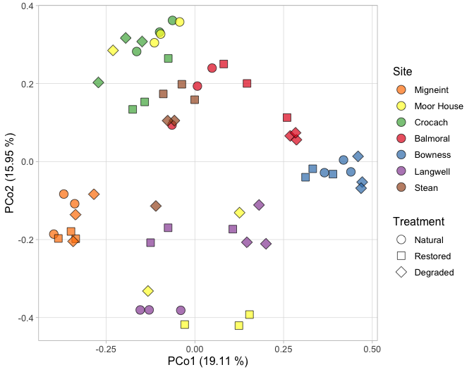
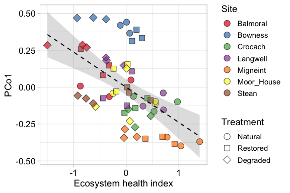
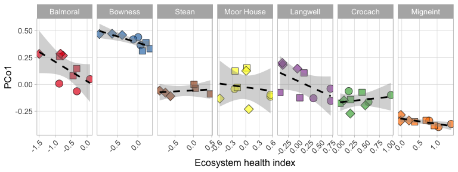
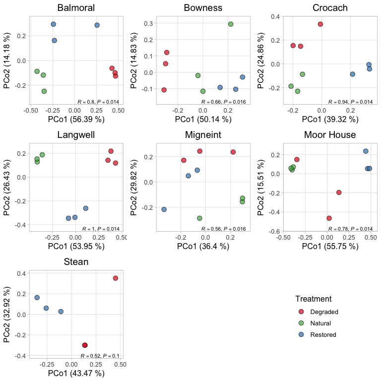

# 1. Figure 3a

    # Load metadata
    metadata <- readRDS("metadata_simple.RDS") %>%
      mutate(treatment = factor(treatment, levels = c("NAT", "REST", "DAM")))

    env_data<- read.csv("eco_index.csv")

    # input data, hosts = prokaryotes 
    host.metabolism <- readRDS("host_abundance_long_all_and_all_sites_and_metabolism.RDS")
    #write.csv(host.metabolism, "host_metabolism.csv", row.names = FALSE)
    host.contig.genome <- readRDS("host_contig_to_genome.RDS")

    #Create dissimilarity matrix
    tmeans.host <- readRDS("host_tmeans_norm_50.RDS")
    tmeans.xform.host <- decostand(tmeans.host, method="hellinger")
    bray_curtis_dist_host <- as.matrix(vegdist(t(tmeans.xform.host), method='bray'))

    pcoa_host <- pcoa(as.dist(bray_curtis_dist_host))
    axes_host <- as.data.frame(pcoa_host$vectors) # make a dataframe named axes, put pcoa values in there
    axes_host$SampleID <- rownames(axes_host) # Give df extra column with the rownames in it 
    axes_host <- merge(metadata[,c("site", "treatment")] %>% mutate("SampleID" = row.names(.)), axes_host, by.x = "SampleID", by.y = "SampleID")
    head(axes_host)

    ##   SampleID     site treatment      Axis.1     Axis.2      Axis.3      Axis.4      Axis.5      Axis.6
    ## 1    BAr1A Balmoral       NAT  0.00714021 0.19355679  0.03395340 -0.02008537 -0.24377214 -0.07974512
    ## 2    BAr1B Balmoral       NAT -0.06449806 0.09369297  0.07084953  0.12658267 -0.12319931 -0.04640611
    ## 3    BAr1C Balmoral       NAT  0.04846473 0.23972982 -0.02410970  0.14795764 -0.15841780 -0.05731493
    ## 4    BAr2D Balmoral      REST  0.25972327 0.11279392 -0.46710777 -0.05547807  0.03802455 -0.03680643
    ## 5    BAr2E Balmoral      REST  0.08127189 0.25017064 -0.11889848 -0.05774070 -0.07651190  0.07815563
    ## 6    BAr2F Balmoral      REST  0.14689434 0.20037918 -0.09665265  0.08878230 -0.05837722  0.09058111
    ##        Axis.7     Axis.8      Axis.9    Axis.10       Axis.11     Axis.12     Axis.13      Axis.14
    ## 1 -0.28298318 0.07283297 -0.09220161 0.07270307 -0.0334713418 -0.03284145  0.10891264  0.141932529
    ## 2 -0.33764358 0.17997989 -0.02816323 0.01362414 -0.0263130105  0.05395438 -0.04374575 -0.001971325
    ## 3 -0.26067745 0.15369331 -0.01895733 0.01262902 -0.1111182969 -0.04872180 -0.07970736 -0.031134996
    ## 4 -0.02814462 0.06629549  0.10296676 0.07863998 -0.2064603309  0.05090192  0.00115690 -0.057051710
    ## 5 -0.15524992 0.22795266  0.24202655 0.01913468 -0.0009566301  0.03223264 -0.14724674  0.097918438
    ## 6 -0.21171203 0.20171691  0.10107206 0.01381487  0.1029012401  0.05827115 -0.12333002 -0.069325726
    ##        Axis.15     Axis.16     Axis.17      Axis.18      Axis.19      Axis.20      Axis.21
    ## 1  0.037391349 -0.09770782  0.15883405 -0.125645152  0.075435835 -0.058707648  0.021870327
    ## 2  0.010498722 -0.03171775 -0.08887027  0.050282616 -0.003827812 -0.026196073 -0.042415166
    ## 3 -0.036294063 -0.13096290  0.01445609  0.007506588  0.031591228 -0.057463820 -0.047986023
    ## 4  0.045295448  0.24462804 -0.05252606 -0.113989353 -0.000333256 -0.005688488 -0.005276882
    ## 5  0.034403086  0.11474346  0.07737974 -0.033259210  0.034921192  0.050332493  0.053466774
    ## 6  0.008018201 -0.02461296 -0.04110163  0.127909737 -0.126728530 -0.055660071  0.006485771
    ##        Axis.22      Axis.23     Axis.24     Axis.25     Axis.26      Axis.27      Axis.28      Axis.29
    ## 1 -0.005877874  0.011732110 -0.01136539 -0.01993049  0.06105822  0.012930952 -0.019398242  0.025634809
    ## 2  0.039722307 -0.056442688  0.04906887 -0.01634432 -0.06450418 -0.037937994 -0.050432080 -0.004302576
    ## 3  0.087194720 -0.040248419 -0.08144293  0.00476655 -0.04863892 -0.003588618  0.044081716 -0.028995594
    ## 4  0.103761249  0.015162096 -0.02684365 -0.02127863  0.05438575  0.002363089  0.004331242 -0.008259591
    ## 5 -0.132959282 -0.005940074  0.04885685  0.07763683 -0.04262406 -0.007070534  0.026588942  0.033672542
    ## 6 -0.027834752  0.055534598  0.03497519 -0.05900434  0.08320018  0.055978594 -0.042871168 -0.015764527
    ##        Axis.30       Axis.31      Axis.32       Axis.33      Axis.34       Axis.35      Axis.36
    ## 1  0.001612813  0.0028650594  0.007873355 -0.0007179483 -0.001335208 -2.733529e-02  0.009094454
    ## 2  0.034538033 -0.0525276132 -0.056038923 -0.0253776470 -0.002435833  2.549721e-02 -0.010108227
    ## 3 -0.023080758 -0.0086232059  0.046505664  0.0163437997  0.011012970 -7.314123e-06 -0.006024906
    ## 4 -0.013581617 -0.0004644215  0.012090954  0.0100080087 -0.009522320  2.070399e-02 -0.012858099
    ## 5 -0.003881859 -0.0094171795 -0.018134883  0.0027380671 -0.005061732 -2.300049e-03 -0.004622964
    ## 6 -0.005694897  0.0373460107  0.034602338  0.0147316051 -0.005723615 -9.403158e-03  0.014615222
    ##        Axis.37      Axis.38      Axis.39       Axis.40       Axis.41      Axis.42       Axis.43
    ## 1  0.048057076  0.002934483 -0.004852738  0.0095684896  0.0021512303  0.002025272  0.0025205953
    ## 2  0.015898827 -0.005158872 -0.009225441 -0.0183235528  0.0014409822 -0.003022627 -0.0039672423
    ## 3 -0.041529754  0.009523529  0.008146081  0.0008684416  0.0015595129 -0.010632307 -0.0006707481
    ## 4  0.008510080  0.017388586  0.002844365  0.0012303142 -0.0008063377  0.001979308 -0.0041501992
    ## 5 -0.025546923 -0.015372878  0.007587850 -0.0090242957  0.0002141975  0.001419993  0.0040379679
    ## 6  0.007695665 -0.009362747 -0.006978365  0.0111371787 -0.0052932605  0.001882011 -0.0005719896
    ##         Axis.44       Axis.45      Axis.46
    ## 1 -0.0008516797  0.0080775905  0.002225515
    ## 2 -0.0012063246  0.0059283471 -0.006508267
    ## 3  0.0028003178 -0.0072268099  0.006224829
    ## 4 -0.0005039340  0.0009647050 -0.003618141
    ## 5  0.0014378406 -0.0009912762  0.004272346
    ## 6  0.0003206199  0.0030580837  0.001951821

    # Store eigenvalues
    eigval_host <- round(pcoa_host$values$Relative_eig * 100, digits = 2)
    eigval_host <- data.frame(PC = 1:length(eigval_host), Eigval = eigval_host)

    # ANOSIM for prokaryoteic MAGs
    anosim_result_hosts <- anosim(bray_curtis_dist_host, metadata$site)
    r_statistic_host <- anosim_result_hosts$statistic
    p_value_host <- anosim_result_hosts$signif
    summary(anosim_result_hosts)

    ## 
    ## Call:
    ## anosim(x = bray_curtis_dist_host, grouping = metadata$site) 
    ## Dissimilarity: user supplied square matrix 
    ## 
    ## ANOSIM statistic R: 0.6785 
    ##       Significance: 0.001 
    ## 
    ## Permutation: free
    ## Number of permutations: 999
    ## 
    ## Upper quantiles of permutations (null model):
    ##    90%    95%  97.5%    99% 
    ## 0.0431 0.0568 0.0692 0.0882 
    ## 
    ## Dissimilarity ranks between and within classes:
    ##            0%    25%   50%     75% 100%    N
    ## Between     2 569.50 969.0 1368.00 1770 1539
    ## Balmoral    7 161.50 615.5 1233.00 1663   36
    ## Bowness     6  46.75  75.5  120.50  268   36
    ## Crocach    18  60.75 122.5  162.50  210   36
    ## Langwell    1 141.75 307.5  698.25 1336   36
    ## Migneint   12  77.25 106.5  157.25  439   36
    ## Moor_House 10 206.25 552.5 1543.25 1640   36
    ## Stean      15 106.00 138.0  236.50  663   15

### Plot PCoA for prokaryoteic MAGs

    plot.pcoa.host <- ggplot(axes_host, aes(Axis.1, Axis.2)) +
      geom_point(aes(shape=as.character(treatment),
                     fill=as.character(site)),
                 color = "black",
                 size = 4,
                 alpha=0.7,
                 stroke=0.5) +
      xlab(paste("PCo1 (", eigval_host$Eigval[1], " %)", sep = "")) +
      ylab(paste("PCo2 (", eigval_host$Eigval[2], " %)", sep = "")) +
      scale_fill_manual(name="Site", limits=c("Migneint",  "Moor_House" ,"Crocach" ,    "Balmoral" ,   "Bowness" ,    "Langwell", "Stean"),
                        labels=c("Moor_House" = "Moor House"), values = c("#ff7f00" , "#ffff33" , "#4daf4a" ,"#e41a1c" ,  "#377eb8" , "#984ea3","#a65628"))+
      scale_shape_manual(name="Treatment", values=c(21, 22, 23), limits=c("NAT", "REST", "DAM"),
                         labels=c("DAM" = "Degraded", "NAT" = "Natural", "REST" = "Restored"))+
      # Ensure Site colors appear in the legend
      guides(
        fill = guide_legend(order = 1, title = "Site", override.aes = list(shape = 21, color = "black")), 
        shape = guide_legend(order = 2, title = "Treatment") ) +
      theme_light() +
      theme(text = element_text(size = 12),
            panel.grid.minor = element_blank(),
            legend.position = "right")

    plot.pcoa.host

 \### Save the
plot

    ggsave("Figure_3a.png", dpi = 1000, width = 7, height = 5.5, units = "in")

# 2. Figure 3b

    axes_host2<- read.csv("pcoa_axes_host_all_eco_index.csv")

    # Fit the global interaction model
    global_model <- lm(Axis.1 ~ eco_index * site, data = axes_host2)

    # Summary of the model
    summary(global_model)

    ## 
    ## Call:
    ## lm(formula = Axis.1 ~ eco_index * site, data = axes_host2)
    ## 
    ## Residuals:
    ##       Min        1Q    Median        3Q       Max 
    ## -0.199587 -0.032089  0.001783  0.052978  0.182516 
    ## 
    ## Coefficients:
    ##                           Estimate Std. Error t value Pr(>|t|)    
    ## (Intercept)               0.028649   0.055649   0.515  0.60915    
    ## eco_index                -0.182276   0.071720  -2.541  0.01447 *  
    ## siteBowness               0.359708   0.064763   5.554 1.34e-06 ***
    ## siteCrocach              -0.193056   0.071791  -2.689  0.00995 ** 
    ## siteLangwell             -0.003510   0.063815  -0.055  0.95638    
    ## siteMigneint             -0.349090   0.074515  -4.685 2.51e-05 ***
    ## siteMoor_House           -0.055802   0.063621  -0.877  0.38499    
    ## siteStean                -0.085069   0.070840  -1.201  0.23595    
    ## eco_index:siteBowness     0.064992   0.106913   0.608  0.54625    
    ## eco_index:siteCrocach     0.233194   0.126936   1.837  0.07266 .  
    ## eco_index:siteLangwell   -0.007191   0.103210  -0.070  0.94476    
    ## eco_index:siteMigneint    0.134278   0.097226   1.381  0.17392    
    ## eco_index:siteMoor_House  0.123525   0.113215   1.091  0.28093    
    ## eco_index:siteStean       0.200497   0.103826   1.931  0.05965 .  
    ## ---
    ## Signif. codes:  0 '***' 0.001 '**' 0.01 '*' 0.05 '.' 0.1 ' ' 1
    ## 
    ## Residual standard error: 0.09249 on 46 degrees of freedom
    ## Multiple R-squared:  0.8887, Adjusted R-squared:  0.8573 
    ## F-statistic: 28.26 on 13 and 46 DF,  p-value: < 2.2e-16

    # R² (marginal = fixed only, conditional = fixed + random)
    performance::r2(global_model)

    ## # R2 for Linear Regression
    ##        R2: 0.889
    ##   adj. R2: 0.857

    site_slopes <- emtrends(global_model, ~ site, var = "eco_index")
    summary(site_slopes)

    ##  site       eco_index.trend     SE df lower.CL upper.CL
    ##  Balmoral           -0.1823 0.0717 46   -0.327  -0.0379
    ##  Bowness            -0.1173 0.0793 46   -0.277   0.0423
    ##  Crocach             0.0509 0.1050 46   -0.160   0.2617
    ##  Langwell           -0.1895 0.0742 46   -0.339  -0.0401
    ##  Migneint           -0.0480 0.0656 46   -0.180   0.0841
    ##  Moor_House         -0.0588 0.0876 46   -0.235   0.1176
    ##  Stean               0.0182 0.0751 46   -0.133   0.1693
    ## 
    ## Confidence level used: 0.95

    # Example: per-site linear models and get R² and adjusted R²
    site_r2 <- axes_host2 %>%
      group_by(site) %>%
      group_split() %>%
      map_df(~ {
        model <- lm( Axis.1 ~ eco_index, data = .x)
        summary_model <- summary(model)
        tibble(
          Site = unique(.x$site),
          R2 = summary_model$r.squared,
          adj_R2 = summary_model$adj.r.squared,
          p_value = coef(summary_model)[2, "Pr(>|t|)"]
        )
      })

    print(site_r2)

    ## # A tibble: 7 × 4
    ##   Site           R2  adj_R2 p_value
    ##   <chr>       <dbl>   <dbl>   <dbl>
    ## 1 Balmoral   0.384   0.296  0.0751 
    ## 2 Bowness    0.652   0.603  0.00846
    ## 3 Crocach    0.0603 -0.0739 0.524  
    ## 4 Langwell   0.333   0.237  0.104  
    ## 5 Migneint   0.526   0.458  0.0270 
    ## 6 Moor_House 0.0267 -0.112  0.674  
    ## 7 Stean      0.0656 -0.168  0.624

    #Stats for Figure 3b

    axes_host <- merge(axes_host,env_data,by="SampleID")
    m1 <- lmer(Axis.1 ~ eco_index + (1 | site), data = axes_host)

    # Extract variance components
    var_comp <- as.data.frame(VarCorr(m1))
    var_random <- var_comp$vcov[var_comp$grp == "Site"]         # Random intercept variance
    var_resid  <- attr(VarCorr(m1), "sc")^2                     # Residual variance

    # Calculate total variance
    var_total <- var_random + var_resid

    # Marginal R²: fixed effects only
    # Conditional R²: fixed + random effects
    # We'll use the method from Nakagawa & Schielzeth (2013)

    # Calculate fitted values based on fixed effects
    y_hat_fixed <- predict(m1, re.form = NA)

    # Variance of fitted values from fixed effects
    var_fixed <- var(y_hat_fixed)

    # R² values
    R2_marginal <- var_fixed / var_total
    R2_conditional <- (var_fixed + var_random) / var_total

    # Show results
    cat("Marginal R² (fixed effects only):", round(R2_marginal, 3), "\n")

    ## Marginal R² (fixed effects only):

    cat("Conditional R² (fixed + random effects):", round(R2_conditional, 3), "\n")

    ## Conditional R² (fixed + random effects):

### PCo1 vs. ecosystem health index for all samples

    Figure_3b <- ggplot(axes_host2, aes(x = eco_index, y = Axis.1)) +
      geom_point(color = "black",size = 4, alpha = 0.7,aes(shape=as.character(treatment),
                                                           fill=as.character(site))) +  
      geom_smooth(method = "lm", color = "black", se = TRUE, linetype = "dashed", size = 0.7, alpha = 0.3) +  # Regression line with confidence interval
      scale_fill_manual(values=c( "#e41a1c",
                                  "#377eb8",
                                  "#4daf4a",
                                  "#984ea3",
                                  "#ff7f00",
                                  "#ffff33",
                                  "#a65628"), 
                        labels = c("Balmoral"  = "Balmoral",
                                   "Bowness" = "Bowness",
                                   "Crocach" = "Crocach",
                                   "Langwell" = "Langwell",
                                   "Migneint" = "Migneint",
                                   "Moors_House" = "Moor House",
                                   "Stean" = "Stean" )) +
      scale_shape_manual(name="Treatment", values=c(21, 22, 23), limits=c("NAT", "REST", "DAM"),
                         labels=c("DAM" = "Degraded", "NAT" = "Natural", "REST" = "Restored"))+
      ylab("PCo1")+ 
      # Ensure Site colors appear in the legend
      guides(
        fill = guide_legend(order = 1, title = "Site", override.aes = list(shape = 21, color = "black")), 
        shape = guide_legend(order = 2, title = "Treatment") ) +
      labs(x = "Ecosystem health index") +
      theme_light(base_size = 14)+
      theme(axis.text = element_text(size = 13, colour = "black")) 

    ## Warning: Using `size` aesthetic for lines was deprecated in ggplot2 3.4.0.
    ## ℹ Please use `linewidth` instead.
    ## This warning is displayed once every 8 hours.
    ## Call `lifecycle::last_lifecycle_warnings()` to see where this warning was generated.

    Figure_3b 

    ## `geom_smooth()` using formula = 'y ~ x'

 \### Save the
plot

    ggsave("Figure_3b.png",  dpi=1000, width = 6, height = 4, units = "in")

    ## `geom_smooth()` using formula = 'y ~ x'

# 3. Figure S8

    site_order <- c("Balmoral","Bowness","Stean","Moor_House","Langwell","Crocach","Migneint")
    axes_host2$site <- factor(axes_host2$site, levels = site_order)
    site_labels <- c(
      "Balmoral" = "Balmoral",
      "Bowness" = "Bowness",
      "Crocach" = "Crocach",
      "Langwell" = "Langwell",
      "Migneint" = "Migneint",
      "Moor_House" = "Moor House",  # <- rename here
      "Stean" = "Stean"
    )

### PCo1 from PCoA of microbial composition vs. ecosystem health index for all samples, plotted by site.

    ggplot(axes_host2, aes(x = eco_index, y = Axis.1)) +
      geom_point(aes(fill = site, shape = treatment), size = 4, color = "black", alpha = 0.7,stroke=0.5) +
      geom_smooth(method = "lm", se = TRUE, color = "black", linetype = "dashed", aes(group = 1)) + 
      scale_fill_manual(
        name = "Site",
        limits = c("Migneint", "Moor_House", "Crocach", "Balmoral", "Bowness", "Langwell", "Stean"),
        values = c("#ff7f00", "#ffff33", "#4daf4a", "#e41a1c", "#377eb8", "#984ea3", "#a65628")
      ) +
      scale_shape_manual(
        name = "Treatment",
        values = c("NAT" = 21, "REST" = 22, "DAM" = 23),
        labels = c("DAM" = "Degraded", "NAT" = "Natural", "REST" = "Restored")
      ) +
      labs(
        x = "Ecosystem health index",
        y = "PCo1"
      ) +
      theme_light() +
      theme(legend.position = "None")+
      theme(axis.text.x = element_text(angle = 45, hjust = 1)) +
      theme(text = element_text(size = 12),
            panel.grid.minor = element_blank()) +
      guides(
        fill = guide_legend(order = 1, title = "Site", override.aes = list(shape = 21, color = "black")), 
        shape = guide_legend(order = 2, title = "Treatment") ) +
      facet_grid(. ~ site, scales = "free", labeller = as_labeller(site_labels))

    ## `geom_smooth()` using formula = 'y ~ x'

 \### Save the
plot

    ggsave("Figure_S8.png",  dpi=1000, width = 8, height = 3, units = "in")

    ## `geom_smooth()` using formula = 'y ~ x'

# 3. Figure 3c

    # Load and format data
    trimmed.mean.cov <- read.csv(
      "MAG_trimmed_mean_cov.tsv",
      sep = "\t") %>%
      rename_with(~str_remove(., '.filtered.Trimmed.Mean'))
    rownames(trimmed.mean.cov) <- trimmed.mean.cov$Genome
    trimmed.mean.cov <- trimmed.mean.cov[, !(colnames(trimmed.mean.cov) %in% c("LASYr2D", "LASYr2E", "LASYr2F", "LAWAr2D", "LAWAr2E", "LAWAr2F"))]
    trimmed.mean.cov <- trimmed.mean.cov %>%
      select(-Genome)

    coverage <- read.csv("MAG_covered_fraction.tsv", sep = "\t", header = TRUE, row.names = 1)
    colnames(coverage) <- sub(".filtered.Covered.Fraction", "", colnames(coverage))
    coverage <- coverage %>%
      select(-contains(".filtered"))
    coverage <- coverage[, !(colnames(coverage) %in% c("LASYr2D", "LASYr2E", "LASYr2F", "LAWAr2D", "LAWAr2E", "LAWAr2F"))]

    trimmed.mean.cov[coverage < 0.50] <- 0
    trimmed.mean.cov <- trimmed.mean.cov[rowSums(trimmed.mean.cov>0) > 1,] # Remove singletons
    trimmed.mean.cov <- trimmed.mean.cov[, colSums(trimmed.mean.cov)>0] # Remove singletons

    seqdepth <- read_csv(file="seq_depth.csv", show_col_types = FALSE)
    seqdepth_R1 <- subset(seqdepth, Pair=="R1")
    trimmed.mean.cov.norm <- trimmed.mean.cov
    for(col in colnames(trimmed.mean.cov.norm)) {
      trimmed.mean.cov.norm[[col]] <- trimmed.mean.cov.norm[[col]] / seqdepth_R1$Hundred.Millions.Reads[seqdepth_R1$Sample == col]
    }

    metadata <- read.csv("./metadata.tsv", sep = "\t") %>%
      filter(
        !sample %in% c("LASYr2D", "LASYr2E", "LASYr2F", "LAWAr2D", "LAWAr2E", "LAWAr2F")
      )

    # Transform data, compute Bray-Curtis, run PCoA
    eigvals  <- c()
    pcoa.data <- c()
    anosims <- c()
    for(Site in unique(metadata$site)) {
      meta.site <- metadata %>%
        filter(site == Site)
      data.site <- trimmed.mean.cov %>%
        select(any_of(meta.site$sample))
      data.hellinger <- decostand(data.site, method = "hellinger")
      
      bray <- as.matrix(vegdist(t(data.hellinger), method = "bray"))
      
      pcoa <- pcoa(as.dist(bray))
      pcoa.axes <- as.data.frame(pcoa$vectors) %>%
        mutate(sample = rownames(.)) %>%
        left_join(
          meta.site %>%
            select(sample, site, treatment),
        ) %>%
        select(sample, site, treatment, everything())
      pcoa.data[[Site]] <- pcoa.axes
      
      eigval <- round(pcoa$values$Relative_eig * 100, digits = 2)
      eigval <- data.frame(PCoA = 1:length(eigval), Eigval = eigval)
      eigval$site <- Site
      eigvals[[Site]] <- eigval
      
      anosim.res <- anosim(bray, meta.site$treatment)
      anosim.r <- anosim.res$statistic
      anosim.p <- anosim.res$signif
      anosims[[Site]] <- c("R" = anosim.r, "P" = anosim.p, "site" = Site)
    }

    ## Joining with `by = join_by(sample)`
    ## Joining with `by = join_by(sample)`
    ## Joining with `by = join_by(sample)`
    ## Joining with `by = join_by(sample)`
    ## Joining with `by = join_by(sample)`
    ## Joining with `by = join_by(sample)`
    ## Joining with `by = join_by(sample)`
    ## 'nperm' >= set of all permutations: complete enumeration.
    ## Set of permutations < 'minperm'. Generating entire set.

    axes.df <- bind_rows(pcoa.data)
    eigvals.df <- bind_rows(eigvals)
    anosims.df <- bind_rows(anosims)
    anosims.df$P.adj <- p.adjust(anosims.df$P, method = "BH")
    anosims.df <- anosims.df  %>%
      mutate(R = as.numeric(R), P = as.numeric(P), P.adj = as.numeric(P.adj))

### PCoA plot of microbial community composition by site, showing variation in MAG abundance across treatments.

    plots <- lapply(unique(axes.df$site), function(Site) {
      site.data <- axes.df %>% filter(site == Site)
      site.anosim <- anosims.df %>%
        filter(site == Site)
      site.eigval <- eigvals.df %>%
        filter(site == Site)
      
      x.pos <- Inf
      y.pos <- min(site.data$Axis.2, na.rm = TRUE) - 0.2 * diff(range(site.data$Axis.2, na.rm = TRUE))
      
      ggplot(site.data, aes(Axis.1, Axis.2)) +
        geom_point(aes(fill = as.character(treatment)),
                   shape = 21,
                   color = "black",
                   size = 3,
                   alpha = 0.7,
                   stroke = 0.5) +
        geom_text(
          data = data.frame(
            x = x.pos, y = y.pos,
            label = paste0("italic(R)==", round(site.anosim$R, 2), "*','~italic(P)==", signif(site.anosim$P.adj, 2))
          ),
          aes(x = x, y = y, label = label),
          parse = TRUE, hjust = 1.1, vjust = -0.1, size = 2.75, inherit.aes = FALSE
        ) +
        labs(
          x = paste("PCo1 (", site.eigval$Eigval[1], " %)", sep = ""),
          y = paste("PCo2 (", site.eigval$Eigval[2], " %)", sep = ""),
          title = if(Site == "Moor_House"){title <- "Moor House"}else{title <- Site}
        ) +
        scale_fill_manual(name = "Treatment",
                          values = c("NAT" = "#4daf4a", "REST" = "#377eb8", "DAM" = "#e41a1c"),
                          labels = c("DAM" = "Degraded", "NAT" = "Natural", "REST" = "Restored")) +
        scale_x_continuous(expand = expansion(mult = c(0.1, 0.1))) +
        scale_y_continuous(expand = expansion(mult = c(0, 0.1))) +
        theme_light() +
        theme(text = element_text(size = 12),
              panel.grid.minor = element_blank(),
              legend.position = "none",
              plot.title = element_text(hjust = 0.5))
    })
    plot.with.legend <- plots[[1]] + theme(legend.position = "right")
    legend <- get_legend(plot.with.legend)

    ## Warning in get_plot_component(plot, "guide-box"): Multiple components found; returning the first one.
    ## To return all, use `return_all = TRUE`.

    plots[[8]] <- ggplot() + theme_light() + theme(panel.grid.minor = element_blank(), panel.border = element_blank())
    plots[[9]] <- legend
    plot.pcoa <- plot_grid(plotlist = plots, ncol = 3, align = "hv", axis = "tblr")

    plot.pcoa

 \### Save the
plot

    ggsave(plot.pcoa,
           filename="fig3c.svg",
           device="svg",
           width=8,
           height=8,
           bg = "white",
           units="in")
