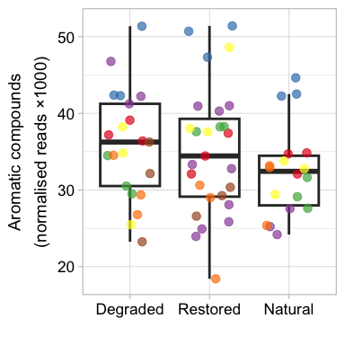

# 1. Data import

    #load raw data KEGG annotations: configs based gene abundances 
    kegg_abund_raw<- read.csv("kegg_abund_raw_t.csv")
    Sample_id<- read.csv("Sample_ID.csv")
    env_data<- read.csv("env_data.csv")

    # load prodigal output of total protein coding genes to normalise data 
    prodigal_output_kegg_abund<- read.csv("prodigal_output_kegg.csv")

    kegg_abund<- kegg_abund_raw %>%
      left_join(x=.,y=prodigal_output_kegg_abund, by=c("Sample")) 

    kegg_abund_gather<- kegg_abund %>%
      gather(key = "KO", value = "reads", 
             K00003:K24042 )

    kegg_abund_gather$reads<- as.numeric(kegg_abund_gather$reads)

    #normalise: gene abundances as reads divided by total per sample prodigal output multiplied by mean all sample prodigal output
    kegg_abund_gather<- kegg_abund_gather %>%
      mutate(reads_norm = (reads/prodigal_output)*57474057.89)

    kegg_abund_gather<- kegg_abund_gather  %>%
      left_join(x=.,y=Sample_id, by=c("Sample"))

    # pivot data by site (for faster execution)

    kegg_abund_mig<- kegg_abund_gather %>%
      filter(Site == "Migneint") %>%
      select(Sample,KO,reads_norm) %>%
      pivot_wider(names_from = KO, values_from = reads_norm)

    kegg_abund_moor<- kegg_abund_gather %>%
      filter(Site == "Moors_House") %>%
      select(Sample,KO,reads_norm) %>%
      pivot_wider(names_from = KO, values_from = reads_norm)

    kegg_abund_cro<- kegg_abund_gather %>%
      filter(Site == "Crocach") %>%
      select(Sample,KO,reads_norm) %>%
      pivot_wider(names_from = KO, values_from = reads_norm)

    kegg_abund_bal<- kegg_abund_gather %>%
      filter(Site == "Balmoral") %>%
      select(Sample,KO,reads_norm) %>%
      pivot_wider(names_from = KO, values_from = reads_norm)

    kegg_abund_bow<- kegg_abund_gather %>%
      filter(Site == "Bowness") %>%
      select(Sample,KO,reads_norm) %>%
      pivot_wider(names_from = KO, values_from = reads_norm)

    kegg_abund_lang<- kegg_abund_gather %>%
      filter(Site == "Langwell" ) %>%
      select(Sample,KO,reads_norm) %>%
      pivot_wider(names_from = KO, values_from = reads_norm)

    kegg_abund_stean<- kegg_abund_gather %>%
      filter(Site == "Stean") %>%
      select(Sample,KO,reads_norm) %>%
      pivot_wider(names_from = KO, values_from = reads_norm)

    # dataframe to select genes of interest 
    kegg_abund <- rbind(kegg_abund_bal, kegg_abund_bow,kegg_abund_cro,kegg_abund_mig,kegg_abund_lang, kegg_abund_moor, kegg_abund_stean)

    kegg_abund <- kegg_abund  %>%
      left_join(x=.,y=Sample_id, by=c("Sample"))

    #load raw data CAZy annotations: configs based gene abundances 
    cazy_abund_raw<- read.csv("cazy_abund_raw.csv")

    rownames(cazy_abund_raw) <- cazy_abund_raw[,1]

    cazy_abund_raw<- cazy_abund_raw %>%
      select(-c("Sample"))

    cazy_abund_raw_t<- t(cazy_abund_raw)

    cazy_abund <- cbind(Sample = rownames(cazy_abund_raw_t), cazy_abund_raw_t)

    cazy_abund<- as.data.frame(cazy_abund, stringsAsFactors=FALSE)

    prodigal_output_caz_abund<- read.csv("prodigal_output_caz_abund.csv")

    cazy_abund<- cazy_abund %>%
      left_join(x=.,y=prodigal_output_caz_abund, by=c("Sample")) 

    cazy_abund_gather<- cazy_abund %>%
      gather(key = "cazyme", value = "reads", 
             AA1_1:SLH )

    cazy_abund_gather$reads<- as.numeric(cazy_abund_gather$reads)

    cazy_abund_gather<- cazy_abund_gather %>%
      mutate(reads_norm = (reads/prodigal_output)*57474057.89)    

    cazy_abund_gather<- cazy_abund_gather  %>%
      left_join(x=.,y=Sample_id, by=c("Sample"))

    ### CAZy genes by substrate classes 

    cazy_substrate<- read.csv("cazyme_by_substrate.csv")

    # create dataframe in same format
    cazy_abund_substrate<- cazy_abund_gather %>%
      left_join(x=., y=cazy_substrate, by=("cazyme"))

    cazy_substrate_sum<- cazy_abund_substrate %>%
      dplyr::group_by(Sample, Treatment, Site,Substrate) %>%
      dplyr::summarise(reads_sum= sum(reads_norm, na.rm=TRUE))

    ## `summarise()` has grouped output by 'Sample', 'Treatment', 'Site'. You can override using the `.groups`
    ## argument.

    cazy_substrate_sum<- cazy_substrate_sum %>%
      filter(Sample %in% c(  "MGr3I"  , "MGr3H",   "MGr3G"  , "MGr2F"  , "MGr2E"  , "MGr2D" ,  "MGr1C"  , "MGr1B" , 
                             "MGr1A" ,  "CRr3I" ,  "CRr3H" ,  "CRr3G" ,  "CRr2F"  , "CRr2E"  , "CRr2D"  , "CRr1C"  ,
                             "CRr1B" ,  "CRr1A"  , "MHr3I" ,  "MHr3H" ,  "MHr3G"  , "MHr2F"  , "MHr2E" ,  "MHr2D",  
                             "MHr1C" ,  "MHr1B" ,  "MHr1A",   "BOr3I" ,  "BOr3H"  , "BOr3G" ,  "BOr2F" ,  "BOr2E"  ,
                             "BOr2D" ,  "BOr1C"  , "BOr1B" ,  "BOr1A",   "BAr3I" ,  "BAr3H"  , "BAr3G" ,  "BAr2F",  
                             "BAr2E" ,  "BAr2D" ,  "BAr1C"  , "BAr1B" ,  "BAr1A" ,  "SEr3I"  , "SEr3H"  , "SEr3G",  
                             "SEr2F"  , "SEr2E"  , "SEr2D"  , "LASCr2F", "LASCr2E",
                             "LASCr2D", "LABRr1C" ,"LABRr1B" ,"LABRr1A" ,"LASAr3I" ,"LASAr3G","LASAr3H" ))

# 2. Figure 4a&f

    ## Figure 4a ##
    # Fermentation
    kegg_abund_ferm<- kegg_abund %>%
      select( 
        "K00163", "K00627", "K00169" , "K03737", "K00174",  "K00656", "K01568" , "K14028", "K00114",
        "K00163" , "K00627" , "K00169" , "K03737" , "K00174" , "K00656", "K13788" , "K01512" , "K00925",
        "K00101",  "K00016",  "K00102" , "K03777",
        "K01595", "K00024", "K01676", "K00239",  "K00244",  "K18209" ,"K01899" ,  "K01902", "K01847", "K05606" ,"K11264",  "K03416",Sample
      )

    ####

    # convert to as.numeric

    kegg_abund_ferm<- kegg_abund_ferm %>% 
      mutate(across(1:28, as.numeric))
    # sum 
    kegg_abund_ferm_sum<- kegg_abund_ferm %>%
      left_join(x=.,y=Sample_id, by=c("Sample")) %>%
      mutate(ferm_sum = K00163+ K00627+ K00169 +K03737+ K00174+  K00656+ K01568 + K14028+ K00114+
               K00163 + K00627 + K00169 + K03737 + K00174 + K00656+ K13788 + K01512 + K00925+
               K00101+  K00016+  K00102 + K03777+
               K01595+ K00024+ K01676+ K00239+  K00244+  K18209 +K01899 +  K01902+ K01847+ K05606 +K11264+  K03416 ) %>%
      mutate(ethanol_ferm = K00163+ K00627+ K00169 +K03737+ K00174+  K00656+ K01568 + K14028+ K00114) %>%
      mutate(acetato = K00163 + K00627 + K00169 + K03737 + K00174 + K00656+ K13788 + K01512 + K00925) %>%
      mutate(lactate =  K00101+  K00016+  K00102 + K03777) %>%
      mutate(prop_ferm = K01595+ K00024+ K01676+ K00239+  K00244+  K18209 +K01899 +  K01902+ K01847+ K05606 +K11264+  K03416) 

    kegg_abund_ferm_sum<- kegg_abund_ferm_sum %>%
      filter(Sample %in% c(  "MGr3I"  , "MGr3H",   "MGr3G"  , "MGr2F"  , "MGr2E"  , "MGr2D" ,  "MGr1C"  , "MGr1B" , 
                             "MGr1A" ,  "CRr3I" ,  "CRr3H" ,  "CRr3G" ,  "CRr2F"  , "CRr2E"  , "CRr2D"  , "CRr1C"  ,
                             "CRr1B" ,  "CRr1A"  , "MHr3I" ,  "MHr3H" ,  "MHr3G"  , "MHr2F"  , "MHr2E" ,  "MHr2D",  
                             "MHr1C" ,  "MHr1B" ,  "MHr1A",   "BOr3I" ,  "BOr3H"  , "BOr3G" ,  "BOr2F" ,  "BOr2E"  ,
                             "BOr2D" ,  "BOr1C"  , "BOr1B" ,  "BOr1A",   "BAr3I" ,  "BAr3H"  , "BAr3G" ,  "BAr2F",  
                             "BAr2E" ,  "BAr2D" ,  "BAr1C"  , "BAr1B" ,  "BAr1A" ,  "SEr3I"  , "SEr3H"  , "SEr3G",  
                             "SEr2F"  , "SEr2E"  , "SEr2D"  , "LASCr2F", "LASCr2E",
                             "LASCr2D", "LABRr1C" ,"LABRr1B" ,"LABRr1A" ,"LASAr3I" ,"LASAr3G", "LASAr3H"  ))

### Figure 4a

    Figure_4a <- ggplot(kegg_abund_ferm_sum, aes(x=Treatment, y=ferm_sum))+
      geom_boxplot(lwd=1,outlier.shape= NA)+
      geom_jitter(aes(y=ferm_sum, x=Treatment, color=Site), alpha=0.7, width = 0.3,size=3)+
      ylab(expression(atop("Fermentation", paste("(normalised reads ×1000)"))))+ ### [reported] = subscript 
      xlab(" ")+
      theme_light(base_size = 14)+
      theme(legend.position = "None")+
      scale_colour_manual(values=c( "#e41a1c",
                                    "#377eb8",
                                    "#4daf4a",
                                    "#984ea3",
                                    "#ff7f00",
                                    "#ffff33",
                                    "#a65628"), 
                          labels = c("Balmoral"  = "Balmoral",
                                     "Bowness" = "Bowness",
                                     "Crocach" = "Crocach",
                                     "Langwell" = "Langwell",
                                     "Migneint" = "Migneint",
                                     "Moors_House" = "Moor House",
                                     "Stean" = "Stean" )) +
      scale_x_discrete(limits=c("DAM", "REST","NAT"),labels=c("DAM" = "Degraded", "NAT" = "Natural",
                                                               "REST" = "Restored"))+
      scale_y_continuous(labels = function(x) x / 1000 , limits = c(44000, 71000)) +
      theme(legend.text=element_text(size=16))+
      theme(legend.position = "None")+
      theme(axis.text=element_text(size=13,colour="black")) 

    Figure_4a

 \###
Save the plot

    ggsave("Figure_4a.png",  dpi=1000, width = 4, height = 4, units = "in")

### Stats for figure 4a

    ferm_sum_lm <- lm(ferm_sum ~ Treatment, data = kegg_abund_ferm_sum)

    # Perform pairwise comparisons for the Treatment variable
    emmeans_results <- emmeans(ferm_sum_lm, ~ Treatment)

    # Perform pairwise comparisons for DAM vs. REST, REST vs. NAT, DAM vs. NAT
    pairwise_comparisons <- pairs(emmeans_results, adjust = "tukey")

    # Print the pairwise comparisons
    summary(pairwise_comparisons)

    ##  contrast   estimate   SE df t.ratio p.value
    ##  DAM - NAT     -2377 1990 57  -1.195  0.4610
    ##  DAM - REST    -1540 1910 57  -0.806  0.7010
    ##  NAT - REST      837 1990 57   0.421  0.9071
    ## 
    ## P value adjustment: tukey method for comparing a family of 3 estimates

    ferm_sum_lm_interaction <- lm(ferm_sum ~ Treatment * Site, data = kegg_abund_ferm_sum)
    anova(ferm_sum_lm_interaction)

    ## Analysis of Variance Table
    ## 
    ## Response: ferm_sum
    ##                Df    Sum Sq   Mean Sq F value    Pr(>F)    
    ## Treatment       2  57416417  28708208  2.7933   0.07319 .  
    ## Site            6 952065701 158677617 15.4393 4.547e-09 ***
    ## Treatment:Site 11 821657669  74696152  7.2679 1.261e-06 ***
    ## Residuals      40 411101217  10277530                      
    ## ---
    ## Signif. codes:  0 '***' 0.001 '**' 0.01 '*' 0.05 '.' 0.1 ' ' 1

### Figure 4f

    merged_ferm <- merge(kegg_abund_ferm_sum, env_data, by = "Sample")

    site_order <- c("Balmoral","Bowness","Stean","Moors_House","Langwell","Crocach","Migneint")
    merged_ferm$Site.x <- factor(merged_ferm$Site.x, levels = site_order)
    site_labels <- c(
      "Balmoral" = "Balmoral",
      "Bowness" = "Bowness",
      "Crocach" = "Crocach",
      "Langwell" = "Langwell",
      "Migneint" = "Migneint",
      "Moors_House" = "Moor House",  # <- rename here
      "Stean" = "Stean"
    )

    #correaltion 
    # Select relevant columns (numeric factors)
    cor_data <- merged_ferm %>%
      select(ferm_sum, moisture, ph, sphag, Dim.1, oxic, CN, eco_index)

    # Compute Pearson correlation matrix
    cor_matrix <- cor(cor_data, use = "complete.obs", method = "pearson")

    # Print correlation matrix
    print(cor_matrix)

    ##             ferm_sum    moisture          ph      sphag       Dim.1        oxic          CN  eco_index
    ## ferm_sum   1.0000000  0.50089483  0.37926768  0.3533784 -0.08862410 -0.53419118 -0.23203181  0.6032441
    ## moisture   0.5008948  1.00000000  0.43568799  0.4366189 -0.35949111 -0.25681759  0.06967877  0.6790104
    ## ph         0.3792677  0.43568799  1.00000000  0.2438908 -0.33906204 -0.30907168 -0.04545533  0.6320731
    ## sphag      0.3533784  0.43661892  0.24389085  1.0000000 -0.13416082 -0.49279052 -0.20426364  0.6980154
    ## Dim.1     -0.0886241 -0.35949111 -0.33906204 -0.1341608  1.00000000 -0.01288157 -0.21379767 -0.4133396
    ## oxic      -0.5341912 -0.25681759 -0.30907168 -0.4927905 -0.01288157  1.00000000  0.39330447 -0.7262251
    ## CN        -0.2320318  0.06967877 -0.04545533 -0.2042636 -0.21379767  0.39330447  1.00000000 -0.4059578
    ## eco_index  0.6032441  0.67901038  0.63207308  0.6980154 -0.41333962 -0.72622506 -0.40595784  1.0000000

    ferm_sum_env <- lm(ferm_sum ~ moisture+ ph+ sphag+ Dim.1+ oxic+ CN, data = merged_ferm)
    summary(ferm_sum_env)

    ## 
    ## Call:
    ## lm(formula = ferm_sum ~ moisture + ph + sphag + Dim.1 + oxic + 
    ##     CN, data = merged_ferm)
    ## 
    ## Residuals:
    ##      Min       1Q   Median       3Q      Max 
    ## -11802.5  -3068.3   -262.3   2717.1  10279.3 
    ## 
    ## Coefficients:
    ##              Estimate Std. Error t value Pr(>|t|)   
    ## (Intercept) -11018.37   25064.31  -0.440  0.66224   
    ## moisture       766.01     256.08   2.991  0.00441 **
    ## ph            4189.26    4680.14   0.895  0.37529   
    ## sphag          -24.29      64.40  -0.377  0.70775   
    ## Dim.1           69.69     137.49   0.507  0.61462   
    ## oxic         -1279.71     464.55  -2.755  0.00833 **
    ## CN            -107.82     127.63  -0.845  0.40250   
    ## ---
    ## Signif. codes:  0 '***' 0.001 '**' 0.01 '*' 0.05 '.' 0.1 ' ' 1
    ## 
    ## Residual standard error: 5018 on 47 degrees of freedom
    ##   (6 observations deleted due to missingness)
    ## Multiple R-squared:  0.4492, Adjusted R-squared:  0.3788 
    ## F-statistic: 6.387 on 6 and 47 DF,  p-value: 5.715e-05

    ferm_sum_env <- lm(ferm_sum ~ moisture+ oxic, data = merged_ferm)
    summary(ferm_sum_env)

    ## 
    ## Call:
    ## lm(formula = ferm_sum ~ moisture + oxic, data = merged_ferm)
    ## 
    ## Residuals:
    ##      Min       1Q   Median       3Q      Max 
    ## -12853.2  -3219.8     56.5   2955.0  11335.6 
    ## 
    ## Coefficients:
    ##             Estimate Std. Error t value Pr(>|t|)    
    ## (Intercept)    196.7    18630.5   0.011 0.991614    
    ## moisture       772.9      202.8   3.812 0.000341 ***
    ## oxic         -1138.4      346.5  -3.285 0.001746 ** 
    ## ---
    ## Signif. codes:  0 '***' 0.001 '**' 0.01 '*' 0.05 '.' 0.1 ' ' 1
    ## 
    ## Residual standard error: 5043 on 57 degrees of freedom
    ## Multiple R-squared:  0.3534, Adjusted R-squared:  0.3307 
    ## F-statistic: 15.58 on 2 and 57 DF,  p-value: 4.009e-06

    ferm_sum_eco <- lm(ferm_sum ~ eco_index , data = merged_ferm)
    summary(ferm_sum_eco)

    ## 
    ## Call:
    ## lm(formula = ferm_sum ~ eco_index, data = merged_ferm)
    ## 
    ## Residuals:
    ##      Min       1Q   Median       3Q      Max 
    ## -13315.7  -2855.9    110.9   2559.6  12587.1 
    ## 
    ## Coefficients:
    ##             Estimate Std. Error t value Pr(>|t|)    
    ## (Intercept)  59313.1      692.6  85.634  < 2e-16 ***
    ## eco_index     5555.5     1245.3   4.461  3.8e-05 ***
    ## ---
    ## Signif. codes:  0 '***' 0.001 '**' 0.01 '*' 0.05 '.' 0.1 ' ' 1
    ## 
    ## Residual standard error: 5365 on 58 degrees of freedom
    ## Multiple R-squared:  0.2555, Adjusted R-squared:  0.2426 
    ## F-statistic:  19.9 on 1 and 58 DF,  p-value: 3.804e-05

### Plot Figure 4f

    Figure_4f <- ggplot(merged_ferm, aes(x = eco_index, y = ferm_sum)) +
      geom_point(color = "black",size = 4, alpha = 0.7,aes(shape=as.character(Treatment.x),
                                                           fill=as.character(Site.x))) +  
      geom_smooth(method = "lm", color = "black", se = TRUE, linetype = "dashed", size = 0.7, alpha = 0.3) +
      scale_fill_manual(values=c( "#e41a1c",
                                  "#377eb8",
                                  "#4daf4a",
                                  "#984ea3",
                                  "#ff7f00",
                                  "#ffff33",
                                  "#a65628"), 
                        labels = c("Balmoral"  = "Balmoral",
                                   "Bowness" = "Bowness",
                                   "Crocach" = "Crocach",
                                   "Langwell" = "Langwell",
                                   "Migneint" = "Migneint",
                                   "Moors_House" = "Moor House",
                                   "Stean" = "Stean" )) +
      scale_shape_manual(name="Treatment", values=c(21, 22, 23), limits=c("NAT", "REST", "DAM"),
                         labels=c("DAM" = "Degraded", "NAT" = "Natural", "REST" = "Restored"))+
      ylab(expression(atop("Fermentation", paste("(normalised reads ×1000)"))))+ 
      scale_y_continuous(labels = function(x) x / 1000) +
      guides(
        fill = guide_legend(order = 1, title = "Site", override.aes = list(shape = 21, color = "black")), 
        shape = guide_legend(order = 2, title = "Treatment") ) +
      labs(x = "Ecosystem health index") +
      theme_light(base_size = 14)+
      theme(axis.text = element_text(size = 13, colour = "black")) 

    Figure_4f

    ## `geom_smooth()` using formula = 'y ~ x'

 \###
Save the plot

    ggsave("Figure_4f.png",  dpi=1000, width = 6, height = 4.5, units = "in") 

    ## `geom_smooth()` using formula = 'y ~ x'

# 3. Figure S9a

    merged_ferm <- merged_ferm %>% filter(Site.x != "Stean")

### Plot Figure S9a

    ggplot(merged_ferm, aes(x = eco_index, y = ferm_sum)) +
      geom_point(color = "black", size = 4, alpha = 0.7, 
                 aes(shape = as.character(Treatment.x),
                     fill = as.character(Site.x))) +  
      geom_smooth(method = "lm", color = "black", se = TRUE, 
                  linetype = "dashed", size = 0.7, alpha = 0.3) +
      scale_fill_manual(values = c(
        "#e41a1c", "#377eb8", "#4daf4a", 
        "#984ea3", "#ff7f00", "#ffff33", "#a65628")) +
      scale_shape_manual(name = "Treatment", values = c(21, 22, 23),
                         limits = c("NAT", "REST", "DAM"),
                         labels = c("DAM" = "Degraded", "NAT" = "Natural", "REST" = "Restored")) +
      labs(y = "Fermentation") +
      scale_y_continuous(labels = function(x) x / 1000) +
      labs(x = "Ecosystem health index") +
      theme_light(base_size = 14) +
      theme(
        axis.text = element_text(size = 13, colour = "black"),
        axis.text.x = element_text(angle = 45, hjust = 1),
        legend.position = "none"
      ) +
      facet_grid(. ~ Site.x, scales = "free", labeller = as_labeller(site_labels))

    ## `geom_smooth()` using formula = 'y ~ x'

 \###
Save the plot

    ggsave("Figure_S9a.png",  dpi=1000, width = 8, height = 3, units = "in") 

    ## `geom_smooth()` using formula = 'y ~ x'

# 4. Figure S10c

    kegg_abund_ferm_sum <- merge(kegg_abund_ferm_sum,env_data,by="Sample")
    lm_eco <- lm(ferm_sum ~ eco_index, data = kegg_abund_ferm_sum)
    eco_summary <- summary(lm_eco)

    # Extract model fit stats
    r_squared <- round(eco_summary$r.squared, 3)
    adj_r_squared <- round(eco_summary$adj.r.squared, 3)
    f_stat <- eco_summary$fstatistic
    model_p <- round(pf(f_stat[1], f_stat[2], f_stat[3], lower.tail = FALSE), 4)

    # Coefficients table
    eco_df <- as.data.frame(eco_summary$coefficients)
    eco_df$Term <- rownames(eco_df)

    # Add model stats as additional rows
    stats_df <- data.frame(
      Estimate = NA,
      `Std. Error` = NA,
      `t value` = NA,
      `Pr(>|t|)` = NA,
      Term = c(
        paste0("R² = ", r_squared),
        paste0("Adjusted R² = ", adj_r_squared),
        paste0("Model p-value = ", model_p)
      )
    )

    # Combine the coefficient table and model statistics
    names(stats_df) <- names(eco_df)
    eco_results <- rbind(eco_df, stats_df)

    # Coefficients table
    eco_df <- as.data.frame(eco_summary$coefficients)
    eco_df$Term <- rownames(eco_df)
    rownames(eco_df) <- NULL

    # Reorder columns
    eco_df <- eco_df[, c("Estimate", "Std. Error", "t value", "Pr(>|t|)", "Term")]

    # Model stats as rows (ensure same column names and order)
    stats_df <- data.frame(
      Estimate = NA,
      `Std. Error` = NA,
      `t value` = NA,
      `Pr(>|t|)` = NA,
      Term = c(
        paste0("R² = ", r_squared),
        paste0("Adjusted R² = ", adj_r_squared),
        paste0("Model p-value = ", model_p)
      ),
      check.names = FALSE
    )

    # Bind rows
    eco_results <- rbind(eco_df, stats_df)

    # Write to CSV
    write.csv(eco_results, file = "eco_index_model_results.csv", row.names = FALSE)

    # Write to CSV
    write.csv(eco_results, file = "fer_eco_index_results.csv", row.names = FALSE)

    # Stats
    model <- lm(log(Growth) ~ ferm_sum, data = merged_ferm)
    summary(model)

    ## 
    ## Call:
    ## lm(formula = log(Growth) ~ ferm_sum, data = merged_ferm)
    ## 
    ## Residuals:
    ##      Min       1Q   Median       3Q      Max 
    ## -2.57879 -0.78089  0.03437  0.79225  2.30830 
    ## 
    ## Coefficients:
    ##               Estimate Std. Error t value Pr(>|t|)    
    ## (Intercept)  5.456e+00  1.391e+00   3.923 0.000258 ***
    ## ferm_sum    -9.263e-05  2.341e-05  -3.956 0.000232 ***
    ## ---
    ## Signif. codes:  0 '***' 0.001 '**' 0.01 '*' 0.05 '.' 0.1 ' ' 1
    ## 
    ## Residual standard error: 1.085 on 52 degrees of freedom
    ## Multiple R-squared:  0.2314, Adjusted R-squared:  0.2166 
    ## F-statistic: 15.65 on 1 and 52 DF,  p-value: 0.0002318

### Plot Figure S10c

    #Plot ferm vs growth 
    ggplot(merged_ferm, aes(y = Growth, x = ferm_sum)) +
      geom_point(color = "black",size = 4, alpha = 0.7,aes(shape=as.character(Treatment.x),
                                                           fill=as.character(Site.x))) +  
      geom_smooth(method = "lm", color = "black", se = TRUE, linetype = "dashed", size = 0.7, alpha = 0.3) +
      scale_fill_manual(values=c( "#e41a1c",
                                  "#377eb8",
                                  "#4daf4a",
                                  "#984ea3",
                                  "#ff7f00",
                                  "#ffff33",
                                  "#a65628"), 
                        labels = c("Balmoral"  = "Balmoral",
                                   "Bowness" = "Bowness",
                                   "Crocach" = "Crocach",
                                   "Langwell" = "Langwell",
                                   "Migneint" = "Migneint",
                                   "Moors_House" = "Moor House",
                                   "Stean" = "Stean" )) +
      scale_shape_manual(name="Treatment", values=c(21, 22, 23), limits=c("NAT", "REST", "DAM"),
                         labels=c("DAM" = "Degraded", "NAT" = "Natural", "REST" = "Restored"))+
      xlab(expression(atop("Fermentation", paste("(normalised reads ×1000)"))))+ 
      ylab(expression("Microbial growth rate (ng g"^{-1}*"h"^{-1}*")"))+ 
      scale_x_continuous(labels = function(x) x / 1000) +
      scale_y_continuous(trans='log2',labels = label_number(accuracy = 0.1), limits = c(0.05, 11))+
      theme(
        axis.text = element_text(size = 13, colour = "black"),
        legend.position = "None"
      ) +
      theme_light(base_size = 14) +
      guides(
        fill = guide_legend(order = 1, title = "Site", override.aes = list(shape = 21, color = "black")), 
        shape = guide_legend(order = 2, title = "Treatment") ) 

    ## `geom_smooth()` using formula = 'y ~ x'

 \### Save
the plot

    ggsave("Figure_S10c.png",  dpi=1000, width = 7, height = 4.5, units = "in") 

    ## `geom_smooth()` using formula = 'y ~ x'

# 5. Lignin (Figure 5a&f)

    cazy_substrate_Lignin <- cazy_substrate_sum %>%
      filter(Substrate == "Lignin") 

### Figure 5a

    Figure_5a <- ggplot(cazy_substrate_Lignin, aes(x=Treatment, y=reads_sum))+
      geom_boxplot(lwd=1,outlier.shape= NA)+
      geom_jitter(aes(y=reads_sum, x=Treatment, color=Site), alpha=0.7, width = 0.3,size=3)+
      ylab(expression(atop("Lignin", paste("(normalised reads ×1000)"))))+ 
      xlab(" ")+
      theme_light(base_size = 14)+
      theme(legend.position = "None")+
      scale_colour_manual(values=c( "#e41a1c",
                                    "#377eb8",
                                    "#4daf4a",
                                    "#984ea3",
                                    "#ff7f00",
                                    "#ffff33",
                                    "#a65628"), 
                          labels = c("Balmoral"  = "Balmoral",
                                     "Bowness" = "Bowness",
                                     "Crocach" = "Crocach",
                                     "Langwell" = "Langwell",
                                     "Migneint" = "Migneint",
                                     "Moors_House" = "Moor House",
                                     "Stean" = "Stean" )) +
      scale_x_discrete(limits=c("DAM", "REST","NAT"),labels=c("DAM" = "Degraded", "NAT" = "Natural",
                                                              "REST" = "Restored"))+
      scale_y_continuous(labels = function(x) x / 1000 , limits = c(10500, 17500)) +
      theme(legend.text=element_text(size=16))+
      theme(legend.position = "None")+
      theme(axis.text=element_text(size=13,colour="black")) 

    Figure_5a

 \###
Save the plot

    ggsave("Figure_5a.png",  dpi=1000, width = 4, height = 4, units = "in")

### Figure 5f

    Lignin_lm <- lm(reads_sum ~ Treatment, data = cazy_substrate_Lignin)

    # Perform pairwise comparisons for the Treatment variable
    emmeans_results <- emmeans(Lignin_lm, ~ Treatment)

    # Perform pairwise comparisons for DAM vs. REST, REST vs. NAT, DAM vs. NAT
    pairwise_comparisons <- pairs(emmeans_results, adjust = "tukey")

    # Print the pairwise comparisons
    summary(pairwise_comparisons)

    ##  contrast   estimate  SE df t.ratio p.value
    ##  DAM - NAT     380.7 510 57   0.746  0.7373
    ##  DAM - REST    447.2 490 57   0.912  0.6350
    ##  NAT - REST     66.5 510 57   0.130  0.9907
    ## 
    ## P value adjustment: tukey method for comparing a family of 3 estimates

    Lignin_lm_interaction <- lm(reads_sum ~ Treatment * Site, data = cazy_substrate_Lignin)
    anova(Lignin_lm_interaction)

    ## Analysis of Variance Table
    ## 
    ## Response: reads_sum
    ##                Df   Sum Sq Mean Sq F value    Pr(>F)    
    ## Treatment       2  2411269 1205635  0.8337 0.4418446    
    ## Site            6 49312564 8218761  5.6833 0.0002413 ***
    ## Treatment:Site 11 36764962 3342269  2.3112 0.0263885 *  
    ## Residuals      40 57844644 1446116                      
    ## ---
    ## Signif. codes:  0 '***' 0.001 '**' 0.01 '*' 0.05 '.' 0.1 ' ' 1

    merged_Lignin <- merge(cazy_substrate_Lignin, env_data, by = "Sample")  %>%
      filter(Sample != "SEr2E")

    # correaltion 
    # Select relevant columns (numeric factors)
    cor_data <- merged_Lignin %>%
      select(reads_sum, moisture, ph, sphag, Dim.1, oxic, CN, eco_index)

    # Compute Pearson correlation matrix
    cor_matrix <- cor(cor_data, use = "complete.obs", method = "pearson")

    # Print correlation matrix
    print(cor_matrix)

    ##             reads_sum    moisture          ph      sphag       Dim.1        oxic          CN   eco_index
    ## reads_sum  1.00000000 -0.18249263 -0.08710120  0.0855374  0.29667510 -0.14826857 -0.14819168 -0.03851853
    ## moisture  -0.18249263  1.00000000  0.43568799  0.4366189 -0.35949111 -0.25681759  0.06967877  0.67901038
    ## ph        -0.08710120  0.43568799  1.00000000  0.2438908 -0.33906204 -0.30907168 -0.04545533  0.63207308
    ## sphag      0.08553740  0.43661892  0.24389085  1.0000000 -0.13416082 -0.49279052 -0.20426364  0.69801540
    ## Dim.1      0.29667510 -0.35949111 -0.33906204 -0.1341608  1.00000000 -0.01288157 -0.21379767 -0.41333962
    ## oxic      -0.14826857 -0.25681759 -0.30907168 -0.4927905 -0.01288157  1.00000000  0.39330447 -0.72622506
    ## CN        -0.14819168  0.06967877 -0.04545533 -0.2042636 -0.21379767  0.39330447  1.00000000 -0.40595784
    ## eco_index -0.03851853  0.67901038  0.63207308  0.6980154 -0.41333962 -0.72622506 -0.40595784  1.00000000

    # Optional: Visualize correlations with a heatmap
    ggcorrplot(cor_matrix, lab = TRUE, colors = c("blue", "white", "red"))

    Lignin_lm_env <- lm(reads_sum ~ moisture+ ph+ sphag+ Dim.1+ oxic+ CN, data = merged_Lignin)
    summary(Lignin_lm_env)

    ## 
    ## Call:
    ## lm(formula = reads_sum ~ moisture + ph + sphag + Dim.1 + oxic + 
    ##     CN, data = merged_Lignin)
    ## 
    ## Residuals:
    ##     Min      1Q  Median      3Q     Max 
    ## -3447.0 -1133.2  -252.1  1142.6  2560.8 
    ## 
    ## Coefficients:
    ##              Estimate Std. Error t value Pr(>|t|)   
    ## (Intercept) 22270.151   7965.505   2.796  0.00747 **
    ## moisture      -89.960     81.384  -1.105  0.27462   
    ## ph             67.694   1487.361   0.046  0.96389   
    ## sphag          16.785     20.468   0.820  0.41631   
    ## Dim.1          70.386     43.694   1.611  0.11390   
    ## oxic         -103.479    147.635  -0.701  0.48682   
    ## CN             -1.673     40.561  -0.041  0.96728   
    ## ---
    ## Signif. codes:  0 '***' 0.001 '**' 0.01 '*' 0.05 '.' 0.1 ' ' 1
    ## 
    ## Residual standard error: 1595 on 47 degrees of freedom
    ##   (5 observations deleted due to missingness)
    ## Multiple R-squared:  0.1376, Adjusted R-squared:  0.0275 
    ## F-statistic:  1.25 on 6 and 47 DF,  p-value: 0.2987

    Lignin_lm_env <- lm(reads_sum ~ Dim.1, data = merged_Lignin)
    summary(Lignin_lm_env)

    ## 
    ## Call:
    ## lm(formula = reads_sum ~ Dim.1, data = merged_Lignin)
    ## 
    ## Residuals:
    ##     Min      1Q  Median      3Q     Max 
    ## -3921.4 -1251.5  -256.9  1288.3  2715.8 
    ## 
    ## Coefficients:
    ##             Estimate Std. Error t value Pr(>|t|)    
    ## (Intercept) 13991.68     201.94  69.287   <2e-16 ***
    ## Dim.1          78.34      36.68   2.136    0.037 *  
    ## ---
    ## Signif. codes:  0 '***' 0.001 '**' 0.01 '*' 0.05 '.' 0.1 ' ' 1
    ## 
    ## Residual standard error: 1540 on 57 degrees of freedom
    ## Multiple R-squared:  0.0741, Adjusted R-squared:  0.05786 
    ## F-statistic: 4.562 on 1 and 57 DF,  p-value: 0.037

    Lignin_lm_eco <- lm(reads_sum ~ eco_index, data = merged_Lignin)
    summary(Lignin_lm_eco)

    ## 
    ## Call:
    ## lm(formula = reads_sum ~ eco_index, data = merged_Lignin)
    ## 
    ## Residuals:
    ##     Min      1Q  Median      3Q     Max 
    ## -3499.5 -1193.1  -231.4  1298.2  3058.8 
    ## 
    ## Coefficients:
    ##             Estimate Std. Error t value Pr(>|t|)    
    ## (Intercept) 14042.11     208.46  67.361   <2e-16 ***
    ## eco_index     -10.91     373.83  -0.029    0.977    
    ## ---
    ## Signif. codes:  0 '***' 0.001 '**' 0.01 '*' 0.05 '.' 0.1 ' ' 1
    ## 
    ## Residual standard error: 1601 on 57 degrees of freedom
    ## Multiple R-squared:  1.493e-05,  Adjusted R-squared:  -0.01753 
    ## F-statistic: 0.000851 on 1 and 57 DF,  p-value: 0.9768

### Plot Figure 5f

    Figure_5f <- ggplot(merged_Lignin, aes(x = eco_index, y = reads_sum)) +
      geom_point(color = "black",size = 4, alpha = 0.7,aes(shape=as.character(Treatment.x),
                                                           fill=as.character(Site.x))) +  
      geom_smooth(method = "lm", color = "black", se = TRUE, linetype = "dashed", size = 0.7, alpha = 0.3) + 
      scale_fill_manual(values=c( "#e41a1c",
                                  "#377eb8",
                                  "#4daf4a",
                                  "#984ea3",
                                  "#ff7f00",
                                  "#ffff33",
                                  "#a65628"), 
                        labels = c("Balmoral"  = "Balmoral",
                                   "Bowness" = "Bowness",
                                   "Crocach" = "Crocach",
                                   "Langwell" = "Langwell",
                                   "Migneint" = "Migneint",
                                   "Moors_House" = "Moor House",
                                   "Stean" = "Stean" )) +
      scale_shape_manual(name="Treatment", values=c(21, 22, 23), limits=c("NAT", "REST", "DAM"),
                         labels=c("DAM" = "Degraded", "NAT" = "Natural", "REST" = "Restored"))+
      ylab(expression(atop("Lignin", paste("(normalised reads ×1000)"))))+ 
      scale_y_continuous(labels = function(x) x / 1000) +
      guides(
        fill = guide_legend(order = 1, title = "Site", override.aes = list(shape = 21, color = "black")), 
        shape = guide_legend(order = 2, title = "Treatment") ) +
      labs(x = "Ecosystem health index") +
      theme_light(base_size = 14)+
      theme(axis.text = element_text(size = 13, colour = "black")) 

    Figure_5f

    ## `geom_smooth()` using formula = 'y ~ x'

 \###
Save the plot

    ggsave("Figure_5f.png",  dpi=1000, width = 6, height = 4.5, units = "in") 

    ## `geom_smooth()` using formula = 'y ~ x'

# 6. Cellulose (Figure 5b&g)

    cazy_substrate_Cellulose <- cazy_substrate_sum %>%
      filter(Substrate == "Cellulose") 

### Figure 5b

    Figure_5b <- ggplot(cazy_substrate_Cellulose, aes(x=Treatment, y=reads_sum))+
      geom_boxplot(lwd=1,outlier.shape= NA)+
      geom_jitter(aes(y=reads_sum, x=Treatment, color=Site), alpha=0.7, width = 0.3,size=3)+
      ylab(expression(atop("Cellulose", paste("(normalised reads ×1000)"))))+ ### [reported] = subscript 
      xlab(" ")+
      theme_light(base_size = 14)+
      theme(legend.position = "None")+
      scale_colour_manual(values=c( "#e41a1c",
                                    "#377eb8",
                                    "#4daf4a",
                                    "#984ea3",
                                    "#ff7f00",
                                    "#ffff33",
                                    "#a65628"), 
                          labels = c("Balmoral"  = "Balmoral",
                                     "Bowness" = "Bowness",
                                     "Crocach" = "Crocach",
                                     "Langwell" = "Langwell",
                                     "Migneint" = "Migneint",
                                     "Moors_House" = "Moor House",
                                     "Stean" = "Stean" )) +
      scale_x_discrete(limits=c("DAM", "REST","NAT"),labels=c("DAM" = "Degraded", "NAT" = "Natural",
                                                              "REST" = "Restored"))+
      scale_y_continuous(labels = function(x) x / 1000, 
                         limits = c(32000, 56000), 
                         breaks = seq(35000, 55000, by = 5000)) +  # Adjust breaks and limits
      theme(legend.text=element_text(size=16))+
      theme(legend.position = "None")+
      theme(axis.text=element_text(size=13,colour="black")) 

    Figure_5b

 \###
Save the plot

    ggsave("Figure_5b.png",  dpi=1000, width = 4, height = 4, units = "in")

### Figure 5g

    Cellulose_lm <- lm(reads_sum ~ Treatment, data = cazy_substrate_Cellulose)

    # Perform pairwise comparisons for the Treatment variable
    emmeans_results <- emmeans(Cellulose_lm, ~ Treatment)

    # Perform pairwise comparisons for DAM vs. REST, REST vs. NAT, DAM vs. NAT
    pairwise_comparisons <- pairs(emmeans_results, adjust = "tukey")

    # Print the pairwise comparisons
    summary(pairwise_comparisons)

    ##  contrast   estimate   SE df t.ratio p.value
    ##  DAM - NAT     -1090 1690 57  -0.646  0.7952
    ##  DAM - REST     -133 1620 57  -0.082  0.9963
    ##  NAT - REST      957 1690 57   0.567  0.8379
    ## 
    ## P value adjustment: tukey method for comparing a family of 3 estimates

    Cellulose_lm_interaction <- lm(reads_sum ~ Treatment * Site, data = cazy_substrate_Cellulose)
    anova(Cellulose_lm_interaction)

    ## Analysis of Variance Table
    ## 
    ## Response: reads_sum
    ##                Df    Sum Sq   Mean Sq F value    Pr(>F)    
    ## Treatment       2  13389900   6694950  0.5394   0.58727    
    ## Site            6 806994676 134499113 10.8367 3.875e-07 ***
    ## Treatment:Site 11 268473848  24406713  1.9665   0.05898 .  
    ## Residuals      40 496459105  12411478                      
    ## ---
    ## Signif. codes:  0 '***' 0.001 '**' 0.01 '*' 0.05 '.' 0.1 ' ' 1

    merged_Cellulose <- merge(cazy_substrate_Cellulose, env_data, by = "Sample")  %>%
      filter(Sample != "SEr2E")

    # correaltion 
    # Select relevant columns (numeric factors)
    cor_data <- merged_Cellulose %>%
      select(reads_sum, moisture, ph, sphag, Dim.1, oxic, CN, eco_index)

    # Compute Pearson correlation matrix
    cor_matrix <- cor(cor_data, use = "complete.obs", method = "pearson")

    # Print correlation matrix
    print(cor_matrix)

    ##            reads_sum    moisture          ph      sphag       Dim.1        oxic          CN  eco_index
    ## reads_sum  1.0000000  0.25638391  0.10376729  0.3658205  0.11744706 -0.52517148 -0.20300711  0.4023317
    ## moisture   0.2563839  1.00000000  0.43568799  0.4366189 -0.35949111 -0.25681759  0.06967877  0.6790104
    ## ph         0.1037673  0.43568799  1.00000000  0.2438908 -0.33906204 -0.30907168 -0.04545533  0.6320731
    ## sphag      0.3658205  0.43661892  0.24389085  1.0000000 -0.13416082 -0.49279052 -0.20426364  0.6980154
    ## Dim.1      0.1174471 -0.35949111 -0.33906204 -0.1341608  1.00000000 -0.01288157 -0.21379767 -0.4133396
    ## oxic      -0.5251715 -0.25681759 -0.30907168 -0.4927905 -0.01288157  1.00000000  0.39330447 -0.7262251
    ## CN        -0.2030071  0.06967877 -0.04545533 -0.2042636 -0.21379767  0.39330447  1.00000000 -0.4059578
    ## eco_index  0.4023317  0.67901038  0.63207308  0.6980154 -0.41333962 -0.72622506 -0.40595784  1.0000000

    # Optional: Visualize correlations with a heatmap
    ggcorrplot(cor_matrix, lab = TRUE, colors = c("blue", "white", "red"))

    Cellulose_lm_env <- lm(reads_sum ~ moisture+ ph+ sphag+ Dim.1+ oxic+ CN, data = merged_Cellulose)
    summary(Cellulose_lm_env)

    ## 
    ## Call:
    ## lm(formula = reads_sum ~ moisture + ph + sphag + Dim.1 + oxic + 
    ##     CN, data = merged_Cellulose)
    ## 
    ## Residuals:
    ##      Min       1Q   Median       3Q      Max 
    ## -11360.0  -2014.6   -748.1   3197.9   9605.1 
    ## 
    ## Coefficients:
    ##             Estimate Std. Error t value Pr(>|t|)   
    ## (Intercept) 36116.60   21847.49   1.653  0.10497   
    ## moisture      286.13     223.22   1.282  0.20619   
    ## ph          -2564.96    4079.48  -0.629  0.53256   
    ## sphag          39.86      56.14   0.710  0.48123   
    ## Dim.1         149.15     119.84   1.245  0.21948   
    ## oxic        -1222.78     404.93  -3.020  0.00408 **
    ## CN             13.49     111.25   0.121  0.90402   
    ## ---
    ## Signif. codes:  0 '***' 0.001 '**' 0.01 '*' 0.05 '.' 0.1 ' ' 1
    ## 
    ## Residual standard error: 4374 on 47 degrees of freedom
    ##   (5 observations deleted due to missingness)
    ## Multiple R-squared:  0.3341, Adjusted R-squared:  0.2491 
    ## F-statistic:  3.93 on 6 and 47 DF,  p-value: 0.002902

    Cellulose_lm_env <- lm(reads_sum ~ Dim.1, data = merged_Cellulose)
    summary(Cellulose_lm_env)

    ## 
    ## Call:
    ## lm(formula = reads_sum ~ Dim.1, data = merged_Cellulose)
    ## 
    ## Residuals:
    ##      Min       1Q   Median       3Q      Max 
    ## -10535.5  -3751.8   -767.4   4271.5  11901.1 
    ## 
    ## Coefficients:
    ##             Estimate Std. Error t value Pr(>|t|)    
    ## (Intercept) 43352.83     664.17  65.273   <2e-16 ***
    ## Dim.1          68.21     120.64   0.565    0.574    
    ## ---
    ## Signif. codes:  0 '***' 0.001 '**' 0.01 '*' 0.05 '.' 0.1 ' ' 1
    ## 
    ## Residual standard error: 5066 on 57 degrees of freedom
    ## Multiple R-squared:  0.005576,   Adjusted R-squared:  -0.01187 
    ## F-statistic: 0.3196 on 1 and 57 DF,  p-value: 0.5741

    Cellulose_lm_eco <- lm(reads_sum ~ eco_index, data = merged_Cellulose)
    summary(Cellulose_lm_eco)

    ## 
    ## Call:
    ## lm(formula = reads_sum ~ eco_index, data = merged_Cellulose)
    ## 
    ## Residuals:
    ##    Min     1Q Median     3Q    Max 
    ## -13048  -3352   -742   4329  11488 
    ## 
    ## Coefficients:
    ##             Estimate Std. Error t value Pr(>|t|)    
    ## (Intercept)  43431.3      626.2  69.353   <2e-16 ***
    ## eco_index     2889.0     1123.0   2.572   0.0127 *  
    ## ---
    ## Signif. codes:  0 '***' 0.001 '**' 0.01 '*' 0.05 '.' 0.1 ' ' 1
    ## 
    ## Residual standard error: 4809 on 57 degrees of freedom
    ## Multiple R-squared:  0.104,  Adjusted R-squared:  0.0883 
    ## F-statistic: 6.618 on 1 and 57 DF,  p-value: 0.01273

### Plot Figure 5g

    Figure_5g <- ggplot(merged_Cellulose, aes(x = eco_index, y = reads_sum)) +
      geom_point(color = "black",size = 4, alpha = 0.7,aes(shape=as.character(Treatment.x),
                                                           fill=as.character(Site.x))) +  
      geom_smooth(method = "lm", color = "black", se = TRUE, linetype = "dashed", size = 0.7, alpha = 0.3) +
      scale_fill_manual(values=c( "#e41a1c",
                                  "#377eb8",
                                  "#4daf4a",
                                  "#984ea3",
                                  "#ff7f00",
                                  "#ffff33",
                                  "#a65628"), 
                        labels = c("Balmoral"  = "Balmoral",
                                   "Bowness" = "Bowness",
                                   "Crocach" = "Crocach",
                                   "Langwell" = "Langwell",
                                   "Migneint" = "Migneint",
                                   "Moors_House" = "Moor House",
                                   "Stean" = "Stean" )) +
      scale_shape_manual(name="Treatment", values=c(21, 22, 23), limits=c("NAT", "REST", "DAM"),
                         labels=c("DAM" = "Degraded", "NAT" = "Natural", "REST" = "Restored"))+
      ylab(expression(atop("Cellulose", paste("(normalised reads ×1000)"))))+ 
      scale_y_continuous(labels = function(x) x / 1000) +
      guides(
        fill = guide_legend(order = 1, title = "Site", override.aes = list(shape = 21, color = "black")), 
        shape = guide_legend(order = 2, title = "Treatment") ) +
      labs(x = "Ecosystem health index") +
      theme_light(base_size = 14)+
      theme(axis.text = element_text(size = 13, colour = "black")) 

    Figure_5g

    ## `geom_smooth()` using formula = 'y ~ x'

 \###
Save the plot

    ggsave("Figure_5g.png",  dpi=1000, width = 6, height = 4.5, units = "in") 

    ## `geom_smooth()` using formula = 'y ~ x'

# 5. Oligosacharides (Figure 5c&h)

    cazy_substrate_Oligosaccharides <- cazy_substrate_sum %>%
      filter(Substrate == "Oligosaccharides"  ) 

### Figure 5c

    Figure_5c <- ggplot(cazy_substrate_Oligosaccharides, aes(x=Treatment, y=reads_sum))+
      geom_boxplot(lwd=1,outlier.shape= NA)+
      geom_jitter(aes(y=reads_sum, x=Treatment, color=Site), alpha=0.7, width = 0.3,size=3)+
      ylab(expression(atop("Oligosaccharides", paste("(normalised reads ×1000)"))))+ ### [reported] = subscript 
      xlab(" ")+
      theme_light(base_size = 14)+
      theme(legend.position = "None")+
      scale_colour_manual(values=c( "#e41a1c",
                                    "#377eb8",
                                    "#4daf4a",
                                    "#984ea3",
                                    "#ff7f00",
                                    "#ffff33",
                                    "#a65628"), 
                          labels = c("Balmoral"  = "Balmoral",
                                     "Bowness" = "Bowness",
                                     "Crocach" = "Crocach",
                                     "Langwell" = "Langwell",
                                     "Migneint" = "Migneint",
                                     "Moors_House" = "Moor House",
                                     "Stean" = "Stean" )) +
      scale_x_discrete(limits=c("DAM", "REST","NAT"),labels=c("DAM" = "Degraded", "NAT" = "Natural",
                                                              "REST" = "Restored"))+
      scale_y_continuous(labels = function(x) x / 1000, limits = c(2000, 13500)) +
      theme(legend.text=element_text(size=16))+
      theme(legend.position = "None")+
      theme(axis.text=element_text(size=13,colour="black")) 

    Figure_5c

 \###
Save the plot

    ggsave("Figure_5c.png",  dpi=1000, width = 4, height = 4, units = "in")

### Figure 5h

    Oligosaccharides_lm <- lm(reads_sum ~ Treatment, data = cazy_substrate_Oligosaccharides)

    # Perform pairwise comparisons for the Treatment variable
    emmeans_results <- emmeans(Oligosaccharides_lm, ~ Treatment)

    # Perform pairwise comparisons for DAM vs. REST, REST vs. NAT, DAM vs. NAT
    pairwise_comparisons <- pairs(emmeans_results, adjust = "tukey")

    # Print the pairwise comparisons
    summary(pairwise_comparisons)

    ##  contrast   estimate  SE df t.ratio p.value
    ##  DAM - NAT     -1183 932 57  -1.270  0.4178
    ##  DAM - REST     -200 895 57  -0.223  0.9730
    ##  NAT - REST      984 932 57   1.056  0.5452
    ## 
    ## P value adjustment: tukey method for comparing a family of 3 estimates

    Oligosaccharides_lm_interaction <- lm(reads_sum ~ Treatment * Site, data = cazy_substrate_Oligosaccharides)
    anova(Oligosaccharides_lm_interaction)

    ## Analysis of Variance Table
    ## 
    ## Response: reads_sum
    ##                Df    Sum Sq  Mean Sq F value    Pr(>F)    
    ## Treatment       2  15204806  7602403  3.1373   0.05424 .  
    ## Site            6 312841832 52140305 21.5167 4.172e-11 ***
    ## Treatment:Site 11  69657850  6332532  2.6132   0.01304 *  
    ## Residuals      40  96929993  2423250                      
    ## ---
    ## Signif. codes:  0 '***' 0.001 '**' 0.01 '*' 0.05 '.' 0.1 ' ' 1

    merged_Oligosaccharides <- merge(cazy_substrate_Oligosaccharides, env_data, by = "Sample")  %>%
      filter(Sample != "SEr2E")

    #correaltion 
    # Select relevant columns (numeric factors)
    cor_data <- merged_Oligosaccharides %>%
      select(reads_sum, moisture, ph, sphag, Dim.1, oxic, CN, eco_index)

    # Compute Pearson correlation matrix
    cor_matrix <- cor(cor_data, use = "complete.obs", method = "pearson")

    # Print correlation matrix
    print(cor_matrix)

    ##             reads_sum    moisture          ph      sphag       Dim.1        oxic          CN  eco_index
    ## reads_sum  1.00000000  0.48171607  0.25894508  0.5273517  0.04112217 -0.42191699 -0.09427875  0.5001017
    ## moisture   0.48171607  1.00000000  0.43568799  0.4366189 -0.35949111 -0.25681759  0.06967877  0.6790104
    ## ph         0.25894508  0.43568799  1.00000000  0.2438908 -0.33906204 -0.30907168 -0.04545533  0.6320731
    ## sphag      0.52735171  0.43661892  0.24389085  1.0000000 -0.13416082 -0.49279052 -0.20426364  0.6980154
    ## Dim.1      0.04112217 -0.35949111 -0.33906204 -0.1341608  1.00000000 -0.01288157 -0.21379767 -0.4133396
    ## oxic      -0.42191699 -0.25681759 -0.30907168 -0.4927905 -0.01288157  1.00000000  0.39330447 -0.7262251
    ## CN        -0.09427875  0.06967877 -0.04545533 -0.2042636 -0.21379767  0.39330447  1.00000000 -0.4059578
    ## eco_index  0.50010170  0.67901038  0.63207308  0.6980154 -0.41333962 -0.72622506 -0.40595784  1.0000000

    ggcorrplot(cor_matrix, lab = TRUE, colors = c("blue", "white", "red"))

    Oligosaccharides_lm_env <- lm(reads_sum ~ moisture+ ph+ sphag+ Dim.1+ oxic+ CN, data = merged_Oligosaccharides)
    summary(Oligosaccharides_lm_env)

    ## 
    ## Call:
    ## lm(formula = reads_sum ~ moisture + ph + sphag + Dim.1 + oxic + 
    ##     CN, data = merged_Oligosaccharides)
    ## 
    ## Residuals:
    ##     Min      1Q  Median      3Q     Max 
    ## -3431.8 -1407.8  -579.5  1032.0  5308.2 
    ## 
    ## Coefficients:
    ##              Estimate Std. Error t value Pr(>|t|)  
    ## (Intercept) -22765.59   11044.26  -2.061   0.0448 *
    ## moisture       290.60     112.84   2.575   0.0132 *
    ## ph             900.34    2062.24   0.437   0.6644  
    ## sphag           65.58      28.38   2.311   0.0253 *
    ## Dim.1          118.29      60.58   1.952   0.0568 .
    ## oxic          -268.58     204.70  -1.312   0.1959  
    ## CN              32.61      56.24   0.580   0.5648  
    ## ---
    ## Signif. codes:  0 '***' 0.001 '**' 0.01 '*' 0.05 '.' 0.1 ' ' 1
    ## 
    ## Residual standard error: 2211 on 47 degrees of freedom
    ##   (5 observations deleted due to missingness)
    ## Multiple R-squared:  0.4324, Adjusted R-squared:   0.36 
    ## F-statistic: 5.968 on 6 and 47 DF,  p-value: 0.0001077

    Oligosaccharides_lm_env <- lm(reads_sum ~ moisture+ sphag+ Dim.1, data = merged_Oligosaccharides)
    summary(Oligosaccharides_lm_env)

    ## 
    ## Call:
    ## lm(formula = reads_sum ~ moisture + sphag + Dim.1, data = merged_Oligosaccharides)
    ## 
    ## Residuals:
    ##     Min      1Q  Median      3Q     Max 
    ## -3964.5 -1549.7  -369.6  1245.3  5414.3 
    ## 
    ## Coefficients:
    ##              Estimate Std. Error t value Pr(>|t|)   
    ## (Intercept) -23774.98    9178.78  -2.590  0.01253 * 
    ## moisture       326.60     105.62   3.092  0.00324 **
    ## sphag           79.92      25.18   3.174  0.00258 **
    ## Dim.1          114.78      56.89   2.018  0.04901 * 
    ## ---
    ## Signif. codes:  0 '***' 0.001 '**' 0.01 '*' 0.05 '.' 0.1 ' ' 1
    ## 
    ## Residual standard error: 2195 on 50 degrees of freedom
    ##   (5 observations deleted due to missingness)
    ## Multiple R-squared:  0.4047, Adjusted R-squared:  0.369 
    ## F-statistic: 11.33 on 3 and 50 DF,  p-value: 8.743e-06

    Oligosaccharides_lm_eco <- lm(reads_sum ~ eco_index, data = merged_Oligosaccharides)
    summary(Oligosaccharides_lm_eco)

    ## 
    ## Call:
    ## lm(formula = reads_sum ~ eco_index, data = merged_Oligosaccharides)
    ## 
    ## Residuals:
    ##     Min      1Q  Median      3Q     Max 
    ## -4586.3 -1966.4  -485.8  1621.3  7441.8 
    ## 
    ## Coefficients:
    ##             Estimate Std. Error t value Pr(>|t|)    
    ## (Intercept)   6552.6      352.2  18.604  < 2e-16 ***
    ## eco_index     1808.9      631.6   2.864  0.00585 ** 
    ## ---
    ## Signif. codes:  0 '***' 0.001 '**' 0.01 '*' 0.05 '.' 0.1 ' ' 1
    ## 
    ## Residual standard error: 2705 on 57 degrees of freedom
    ## Multiple R-squared:  0.1258, Adjusted R-squared:  0.1105 
    ## F-statistic: 8.202 on 1 and 57 DF,  p-value: 0.005848

### Plot Figure 5h

    Figure_5h <- ggplot(merged_Oligosaccharides, aes(x = eco_index, y = reads_sum)) +
      geom_point(color = "black",size = 4, alpha = 0.7,aes(shape=as.character(Treatment.x),
                                                           fill=as.character(Site.x))) +  
      geom_smooth(method = "lm", color = "black", se = TRUE, linetype = "dashed", size = 0.7, alpha = 0.3) +
      scale_fill_manual(values=c( "#e41a1c",
                                  "#377eb8",
                                  "#4daf4a",
                                  "#984ea3",
                                  "#ff7f00",
                                  "#ffff33",
                                  "#a65628"), 
                        labels = c("Balmoral"  = "Balmoral",
                                   "Bowness" = "Bowness",
                                   "Crocach" = "Crocach",
                                   "Langwell" = "Langwell",
                                   "Migneint" = "Migneint",
                                   "Moors_House" = "Moor House",
                                   "Stean" = "Stean" )) +
      scale_shape_manual(name="Treatment", values=c(21, 22, 23), limits=c("NAT", "REST", "DAM"),
                         labels=c("DAM" = "Degraded", "NAT" = "Natural", "REST" = "Restored"))+
      ylab(expression(atop("Oligosaccharides", paste("(normalised reads ×1000)"))))+ 
      scale_y_continuous(labels = function(x) x / 1000) +
      guides(
        fill = guide_legend(order = 1, title = "Site", override.aes = list(shape = 21, color = "black")), 
        shape = guide_legend(order = 2, title = "Treatment") ) +
      labs(x = "Ecosystem health index") +
      theme_light(base_size = 14)+
      theme(axis.text = element_text(size = 13, colour = "black")) 

    Figure_5h

    ## `geom_smooth()` using formula = 'y ~ x'

 \###
Save the plot

    ggsave("Figure_5h.png",  dpi=1000, width = 6, height = 4.5, units = "in") 

    ## `geom_smooth()` using formula = 'y ~ x'

# 5. Aromatics compounds (Figure 5d&i)

    ko_levels <- read.csv("KO_levels.csv") 

    kegg_levels <- kegg_abund_gather %>%
      left_join(x=.,y=ko_levels, by=c("KO"))

    ## Warning in left_join(x = ., y = ko_levels, by = c("KO")): Detected an unexpected many-to-many relationship between `x` and `y`.
    ## ℹ Row 1 of `x` matches multiple rows in `y`.
    ## ℹ Row 15 of `y` matches multiple rows in `x`.
    ## ℹ If a many-to-many relationship is expected, set `relationship = "many-to-many"` to silence this warning.

    kegg_levels_aromatic <- kegg_levels %>%
      filter(Category3 == "01220_Degradation_of_aromatic_compounds_[PATH:ko01220]")

    #00190_Oxidative_phosphorylation_[PATH:ko00190]

    kegg_levels_aromatic <- kegg_levels_aromatic  %>%
      dplyr::group_by(Sample, Site, Treatment) %>%
      dplyr::summarise(sum = sum(reads_norm)) 

    ## `summarise()` has grouped output by 'Sample', 'Site'. You can override using the `.groups` argument.

### Figure 5d

    Figure_5d <- ggplot(kegg_levels_aromatic, aes(x=Treatment, y=sum))+
      geom_boxplot(lwd=1,outlier.shape= NA)+
      geom_jitter(aes(y=sum, x=Treatment, color=Site), alpha=0.7, width = 0.3,size=3)+
      ylab(expression(atop("Aromatic compounds", paste("(normalised reads ×1000)"))))+ ### [reported] = subscript 
      xlab(" ")+
      theme_light(base_size = 14)+
      theme(legend.position = "None")+
      scale_colour_manual(values=c( "#e41a1c",
                                    "#377eb8",
                                    "#4daf4a",
                                    "#984ea3",
                                    "#ff7f00",
                                    "#ffff33",
                                    "#a65628"), 
                          labels = c("Balmoral"  = "Balmoral",
                                     "Bowness" = "Bowness",
                                     "Crocach" = "Crocach",
                                     "Langwell" = "Langwell",
                                     "Migneint" = "Migneint",
                                     "Moors_House" = "Moor House",
                                     "Stean" = "Stean" )) +
      scale_x_discrete(limits=c("DAM", "REST","NAT"),labels=c("DAM" = "Degraded", "NAT" = "Natural",
                                                              "REST" = "Restored"))+
      scale_y_continuous(labels = function(x) x / 1000, limits = c(18000, 52000)) +
      theme(legend.text=element_text(size=16))+
      theme(legend.position = "None")+
      theme(axis.text=element_text(size=13,colour="black")) 

    Figure_5d

 \###
Save the plot

    ggsave("Figure_5d.png",  dpi=1000, width = 4, height = 4, units = "in")

### Figure 5i

    aromatic_lm <- lm(sum ~ Treatment, data = kegg_levels_aromatic)

    # Perform pairwise comparisons for the Treatment variable
    emmeans_results <- emmeans(aromatic_lm, ~ Treatment)

    # Perform pairwise comparisons for DAM vs. REST, REST vs. NAT, DAM vs. NAT
    pairwise_comparisons <- pairs(emmeans_results, adjust = "tukey")

    # Print the pairwise comparisons
    summary(pairwise_comparisons)

    ##  contrast   estimate   SE df t.ratio p.value
    ##  DAM - NAT      3487 2370 63   1.469  0.3124
    ##  DAM - REST      845 2150 63   0.393  0.9184
    ##  NAT - REST    -2642 2250 63  -1.175  0.4723
    ## 
    ## P value adjustment: tukey method for comparing a family of 3 estimates

    aromatic_lm_interaction <- lm(sum ~ Treatment * Site, data = kegg_levels_aromatic)
    anova(aromatic_lm_interaction)

    ## Analysis of Variance Table
    ## 
    ## Response: sum
    ##                Df     Sum Sq   Mean Sq F value    Pr(>F)    
    ## Treatment       2  127163414  63581707  3.0308  0.058015 .  
    ## Site            6 1787694877 297949146 14.2024 4.483e-09 ***
    ## Treatment:Site 11  685641406  62331037  2.9711  0.004679 ** 
    ## Residuals      46  965023737  20978777                      
    ## ---
    ## Signif. codes:  0 '***' 0.001 '**' 0.01 '*' 0.05 '.' 0.1 ' ' 1

    merged_aromatic <- merge(kegg_levels_aromatic, env_data, by = "Sample") %>%
      filter(Sample != "SEr2E")

    #correaltion 
    # Select relevant columns (numeric factors)
    cor_data <- merged_aromatic %>%
      select(sum, moisture, ph, sphag, Dim.1, oxic, CN, eco_index)

    # Compute Pearson correlation matrix
    cor_matrix <- cor(cor_data, use = "complete.obs", method = "pearson")

    # Print correlation matrix
    print(cor_matrix)

    ##                   sum    moisture          ph      sphag       Dim.1        oxic          CN  eco_index
    ## sum        1.00000000 -0.39214403 -0.22426292 -0.4614426  0.01311506  0.21019512 -0.05700873 -0.3454815
    ## moisture  -0.39214403  1.00000000  0.43568799  0.4366189 -0.35949111 -0.25681759  0.06967877  0.6790104
    ## ph        -0.22426292  0.43568799  1.00000000  0.2438908 -0.33906204 -0.30907168 -0.04545533  0.6320731
    ## sphag     -0.46144256  0.43661892  0.24389085  1.0000000 -0.13416082 -0.49279052 -0.20426364  0.6980154
    ## Dim.1      0.01311506 -0.35949111 -0.33906204 -0.1341608  1.00000000 -0.01288157 -0.21379767 -0.4133396
    ## oxic       0.21019512 -0.25681759 -0.30907168 -0.4927905 -0.01288157  1.00000000  0.39330447 -0.7262251
    ## CN        -0.05700873  0.06967877 -0.04545533 -0.2042636 -0.21379767  0.39330447  1.00000000 -0.4059578
    ## eco_index -0.34548155  0.67901038  0.63207308  0.6980154 -0.41333962 -0.72622506 -0.40595784  1.0000000

    # Optional: Visualize correlations with a heatmap
    ggcorrplot(cor_matrix, lab = TRUE, colors = c("blue", "white", "red"))

    aromatic_lm_env <- lm(sum ~ moisture+ ph+ sphag+ Dim.1+ oxic+ CN, data = merged_aromatic)
    summary(aromatic_lm_env)

    ## 
    ## Call:
    ## lm(formula = sum ~ moisture + ph + sphag + Dim.1 + oxic + CN, 
    ##     data = merged_aromatic)
    ## 
    ## Residuals:
    ##      Min       1Q   Median       3Q      Max 
    ## -13163.9  -4603.5   -209.5   3477.1  14205.0 
    ## 
    ## Coefficients:
    ##              Estimate Std. Error t value Pr(>|t|)   
    ## (Intercept) 108902.97   33353.64   3.265  0.00205 **
    ## moisture      -526.37     340.78  -1.545  0.12914   
    ## ph           -4466.89    6227.97  -0.717  0.47678   
    ## sphag         -227.59      85.70  -2.656  0.01078 * 
    ## Dim.1         -258.91     182.96  -1.415  0.16363   
    ## oxic           -77.31     618.19  -0.125  0.90102   
    ## CN            -199.37     169.84  -1.174  0.24635   
    ## ---
    ## Signif. codes:  0 '***' 0.001 '**' 0.01 '*' 0.05 '.' 0.1 ' ' 1
    ## 
    ## Residual standard error: 6677 on 47 degrees of freedom
    ##   (5 observations deleted due to missingness)
    ## Multiple R-squared:  0.3037, Adjusted R-squared:  0.2148 
    ## F-statistic: 3.416 on 6 and 47 DF,  p-value: 0.007022

    aromatic_lm_env <- lm(sum ~ Dim.1, data = merged_aromatic)
    summary(aromatic_lm_env)

    ## 
    ## Call:
    ## lm(formula = sum ~ Dim.1, data = merged_aromatic)
    ## 
    ## Residuals:
    ##    Min     1Q Median     3Q    Max 
    ## -16195  -5362   -516   3516  16770 
    ## 
    ## Coefficients:
    ##             Estimate Std. Error t value Pr(>|t|)    
    ## (Intercept) 34732.07     989.43  35.103   <2e-16 ***
    ## Dim.1          29.71     179.72   0.165    0.869    
    ## ---
    ## Signif. codes:  0 '***' 0.001 '**' 0.01 '*' 0.05 '.' 0.1 ' ' 1
    ## 
    ## Residual standard error: 7548 on 57 degrees of freedom
    ## Multiple R-squared:  0.0004793,  Adjusted R-squared:  -0.01706 
    ## F-statistic: 0.02733 on 1 and 57 DF,  p-value: 0.8693

    aromatic_lm_eco <- lm(sum ~ eco_index, data = merged_aromatic)
    summary(aromatic_lm_eco)

    ## 
    ## Call:
    ## lm(formula = sum ~ eco_index, data = merged_aromatic)
    ## 
    ## Residuals:
    ##    Min     1Q Median     3Q    Max 
    ## -13795  -4558  -1100   3884  17120 
    ## 
    ## Coefficients:
    ##             Estimate Std. Error t value Pr(>|t|)    
    ## (Intercept)    34707        944  36.765   <2e-16 ***
    ## eco_index      -3714       1693  -2.194   0.0324 *  
    ## ---
    ## Signif. codes:  0 '***' 0.001 '**' 0.01 '*' 0.05 '.' 0.1 ' ' 1
    ## 
    ## Residual standard error: 7250 on 57 degrees of freedom
    ## Multiple R-squared:  0.07785,    Adjusted R-squared:  0.06167 
    ## F-statistic: 4.812 on 1 and 57 DF,  p-value: 0.03235

### Plot Figure 5i

    Figure_5i <- ggplot(merged_aromatic, aes(x = eco_index, y = sum)) +
      geom_point(color = "black",size = 4, alpha = 0.7,aes(shape=as.character(Treatment.x),
                                                           fill=as.character(Site.x))) +  
      geom_smooth(method = "lm", color = "black", se = TRUE, linetype = "dashed", size = 0.7, alpha = 0.3) +
      scale_fill_manual(values=c( "#e41a1c",
                                  "#377eb8",
                                  "#4daf4a",
                                  "#984ea3",
                                  "#ff7f00",
                                  "#ffff33",
                                  "#a65628"), 
                        labels = c("Balmoral"  = "Balmoral",
                                   "Bowness" = "Bowness",
                                   "Crocach" = "Crocach",
                                   "Langwell" = "Langwell",
                                   "Migneint" = "Migneint",
                                   "Moors_House" = "Moor House",
                                   "Stean" = "Stean" )) +
      scale_shape_manual(name="Treatment", values=c(21, 22, 23), limits=c("NAT", "REST", "DAM"),
                         labels=c("DAM" = "Degraded", "NAT" = "Natural", "REST" = "Restored"))+
      ylab(expression(atop("Aromatic compounds", paste("(normalised reads ×1000)"))))+ 
      scale_y_continuous(labels = function(x) x / 1000) +
      guides(
        fill = guide_legend(order = 1, title = "Site", override.aes = list(shape = 21, color = "black")), 
        shape = guide_legend(order = 2, title = "Treatment") ) +
      labs(x = "Ecosystem health index") +
      theme_light(base_size = 14)+
      theme(axis.text = element_text(size = 13, colour = "black")) 

    Figure_5i

    ## `geom_smooth()` using formula = 'y ~ x'

 \###
Save the plot

    ggsave("Figure_5i.png",  dpi=1000, width = 6, height = 4.5, units = "in")

    ## `geom_smooth()` using formula = 'y ~ x'

# 5. Cell wall (Figure 5e&j)

    cazy_substrate_Cell_Wall<- cazy_substrate_sum %>%
      filter(Substrate == "Cell Wall"  ) 

### Figure 5e

    Figure_5e <- ggplot(cazy_substrate_Cell_Wall, aes(x=Treatment, y=reads_sum))+
      geom_boxplot(lwd=1,outlier.shape= NA)+
      geom_jitter(aes(y=reads_sum, x=Treatment, color=Site), alpha=0.7, width = 0.3,size=3)+
      ylab(expression(atop("Microbial cell wall", paste("(normalised reads ×1000)"))))+ ### [reported] = subscript 
      xlab(" ")+
      theme_light(base_size = 14)+
      theme(legend.position = "None")+
      scale_colour_manual(values=c( "#e41a1c",
                                    "#377eb8",
                                    "#4daf4a",
                                    "#984ea3",
                                    "#ff7f00",
                                    "#ffff33",
                                    "#a65628"), 
                          labels = c("Balmoral"  = "Balmoral",
                                     "Bowness" = "Bowness",
                                     "Crocach" = "Crocach",
                                     "Langwell" = "Langwell",
                                     "Migneint" = "Migneint",
                                     "Moors_House" = "Moor House",
                                     "Stean" = "Stean" )) +
      scale_x_discrete(limits=c("DAM", "REST","NAT"),labels=c("DAM" = "Degraded", "NAT" = "Natural",
                                                               "REST" = "Restored"))+
      scale_y_continuous(labels = function(x) x / 1000, limits = c(1600, 5400)) +
      theme(legend.text=element_text(size=16))+
      theme(legend.position = "None")+
      theme(axis.text=element_text(size=13,colour="black")) 

    Figure_5e

    ## Warning: Removed 1 row containing non-finite outside the scale range (`stat_boxplot()`).

    ## Warning: Removed 1 row containing missing values or values outside the scale range (`geom_point()`).

 \###
Save the plot

    ggsave("Figure_5e.png",  dpi=1000, width = 4, height = 4, units = "in")

    ## Warning: Removed 1 row containing non-finite outside the scale range (`stat_boxplot()`).

    ## Warning: Removed 1 row containing missing values or values outside the scale range (`geom_point()`).

### Figure 5j

    cell_wall_lm <- lm(reads_sum ~ Treatment, data = cazy_substrate_Cell_Wall)

    # Perform pairwise comparisons for the Treatment variable
    emmeans_results <- emmeans(cell_wall_lm, ~ Treatment)

    # Perform pairwise comparisons for DAM vs. REST, REST vs. NAT, DAM vs. NAT
    pairwise_comparisons <- pairs(emmeans_results, adjust = "tukey")

    # Print the pairwise comparisons
    summary(pairwise_comparisons)

    ##  contrast   estimate  SE df t.ratio p.value
    ##  DAM - NAT       693 276 57   2.506  0.0395
    ##  DAM - REST      594 266 57   2.236  0.0738
    ##  NAT - REST      -99 276 57  -0.358  0.9319
    ## 
    ## P value adjustment: tukey method for comparing a family of 3 estimates

    cell_wall_lm_interaction <- lm(reads_sum ~ Treatment * Site, data = cazy_substrate_Cell_Wall)
    anova(cell_wall_lm_interaction)

    ## Analysis of Variance Table
    ## 
    ## Response: reads_sum
    ##                Df   Sum Sq Mean Sq F value   Pr(>F)   
    ## Treatment       2  5674269 2837134  5.8318 0.005991 **
    ## Site            6 10337616 1722936  3.5415 0.006615 **
    ## Treatment:Site 11 12408174 1128016  2.3186 0.025933 * 
    ## Residuals      40 19459892  486497                    
    ## ---
    ## Signif. codes:  0 '***' 0.001 '**' 0.01 '*' 0.05 '.' 0.1 ' ' 1

    merged_cell_wall <- merge(cazy_substrate_Cell_Wall, env_data, by = "Sample") %>%
      filter(Sample != "SEr2E")

    #correaltion 
    # Select relevant columns (numeric factors)
    cor_data <- merged_cell_wall %>%
      select(reads_sum, moisture, ph, sphag, Dim.1, oxic, CN, eco_index)

    # Compute Pearson correlation matrix
    cor_matrix <- cor(cor_data, use = "complete.obs", method = "pearson")

    # Print correlation matrix
    print(cor_matrix)

    ##             reads_sum    moisture          ph      sphag       Dim.1        oxic          CN  eco_index
    ## reads_sum  1.00000000 -0.01544928  0.09355379 -0.2145069  0.18157696  0.02612597  0.13501816 -0.1294993
    ## moisture  -0.01544928  1.00000000  0.43568799  0.4366189 -0.35949111 -0.25681759  0.06967877  0.6790104
    ## ph         0.09355379  0.43568799  1.00000000  0.2438908 -0.33906204 -0.30907168 -0.04545533  0.6320731
    ## sphag     -0.21450688  0.43661892  0.24389085  1.0000000 -0.13416082 -0.49279052 -0.20426364  0.6980154
    ## Dim.1      0.18157696 -0.35949111 -0.33906204 -0.1341608  1.00000000 -0.01288157 -0.21379767 -0.4133396
    ## oxic       0.02612597 -0.25681759 -0.30907168 -0.4927905 -0.01288157  1.00000000  0.39330447 -0.7262251
    ## CN         0.13501816  0.06967877 -0.04545533 -0.2042636 -0.21379767  0.39330447  1.00000000 -0.4059578
    ## eco_index -0.12949930  0.67901038  0.63207308  0.6980154 -0.41333962 -0.72622506 -0.40595784  1.0000000

    # Optional: Visualize correlations with a heatmap
    #library(ggcorrplot)
    ggcorrplot(cor_matrix, lab = TRUE, colors = c("blue", "white", "red"))

    cell_wall_lm_env <- lm(reads_sum ~ moisture+ ph+ sphag+ Dim.1+ oxic+ CN, data = merged_cell_wall)
    summary(cell_wall_lm_env)

    ## 
    ## Call:
    ## lm(formula = reads_sum ~ moisture + ph + sphag + Dim.1 + oxic + 
    ##     CN, data = merged_cell_wall)
    ## 
    ## Residuals:
    ##      Min       1Q   Median       3Q      Max 
    ## -1578.18  -346.95   -13.14   264.25  1458.64 
    ## 
    ## Coefficients:
    ##              Estimate Std. Error t value Pr(>|t|)  
    ## (Intercept) -1740.281   3583.197  -0.486   0.6295  
    ## moisture       17.247     36.610   0.471   0.6397  
    ## ph            836.766    669.073   1.251   0.2173  
    ## sphag         -14.764      9.207  -1.604   0.1155  
    ## Dim.1          35.872     19.655   1.825   0.0743 .
    ## oxic          -35.488     66.412  -0.534   0.5956  
    ## CN             21.455     18.246   1.176   0.2456  
    ## ---
    ## Signif. codes:  0 '***' 0.001 '**' 0.01 '*' 0.05 '.' 0.1 ' ' 1
    ## 
    ## Residual standard error: 717.3 on 47 degrees of freedom
    ##   (5 observations deleted due to missingness)
    ## Multiple R-squared:  0.1474, Adjusted R-squared:  0.03857 
    ## F-statistic: 1.354 on 6 and 47 DF,  p-value: 0.2527

    cell_wall_lm_env <- lm(reads_sum ~ Dim.1, data = merged_cell_wall)
    summary(cell_wall_lm_env)

    ## 
    ## Call:
    ## lm(formula = reads_sum ~ Dim.1, data = merged_cell_wall)
    ## 
    ## Residuals:
    ##     Min      1Q  Median      3Q     Max 
    ## -1515.4  -490.7  -178.9   383.8  3936.7 
    ## 
    ## Coefficients:
    ##             Estimate Std. Error t value Pr(>|t|)    
    ## (Intercept)  3272.08     119.67  27.342   <2e-16 ***
    ## Dim.1          14.62      21.74   0.673    0.504    
    ## ---
    ## Signif. codes:  0 '***' 0.001 '**' 0.01 '*' 0.05 '.' 0.1 ' ' 1
    ## 
    ## Residual standard error: 912.9 on 57 degrees of freedom
    ## Multiple R-squared:  0.007873,   Adjusted R-squared:  -0.009533 
    ## F-statistic: 0.4523 on 1 and 57 DF,  p-value: 0.5039

    cell_wall_lm_eco <- lm(reads_sum ~ eco_index, data = merged_cell_wall)
    summary(cell_wall_lm_eco)

    ## 
    ## Call:
    ## lm(formula = reads_sum ~ eco_index, data = merged_cell_wall)
    ## 
    ## Residuals:
    ##     Min      1Q  Median      3Q     Max 
    ## -1431.0  -532.0  -132.1   440.4  3583.6 
    ## 
    ## Coefficients:
    ##             Estimate Std. Error t value Pr(>|t|)    
    ## (Intercept)   3276.9      115.9   28.27   <2e-16 ***
    ## eco_index     -384.6      207.9   -1.85   0.0695 .  
    ## ---
    ## Signif. codes:  0 '***' 0.001 '**' 0.01 '*' 0.05 '.' 0.1 ' ' 1
    ## 
    ## Residual standard error: 890.1 on 57 degrees of freedom
    ## Multiple R-squared:  0.05666,    Adjusted R-squared:  0.04011 
    ## F-statistic: 3.423 on 1 and 57 DF,  p-value: 0.06947

### Plot Figure 5j

    Figure_5j <- ggplot(merged_cell_wall, aes(x = eco_index, y = reads_sum)) +
      geom_point(color = "black",size = 4, alpha = 0.7,aes(shape=as.character(Treatment.x),
                                                           fill=as.character(Site.x))) +  
      geom_smooth(method = "lm", color = "black", se = TRUE, linetype = "dashed", size = 0.7, alpha = 0.3) +
      scale_fill_manual(values=c( "#e41a1c",
                                  "#377eb8",
                                  "#4daf4a",
                                  "#984ea3",
                                  "#ff7f00",
                                  "#ffff33",
                                  "#a65628"), 
                        labels = c("Balmoral"  = "Balmoral",
                                   "Bowness" = "Bowness",
                                   "Crocach" = "Crocach",
                                   "Langwell" = "Langwell",
                                   "Migneint" = "Migneint",
                                   "Moors_House" = "Moor House",
                                   "Stean" = "Stean" )) +
      scale_shape_manual(name="Treatment", values=c(21, 22, 23), limits=c("NAT", "REST", "DAM"),
                         labels=c("DAM" = "Degraded", "NAT" = "Natural", "REST" = "Restored"))+
      ylab(expression(atop("Microbial cell wall", paste("(normalised reads ×1000)"))))+ 
      scale_y_continuous(labels = function(x) x / 1000) +
      guides(
        fill = guide_legend(order = 1, title = "Site", override.aes = list(shape = 21, color = "black")), 
        shape = guide_legend(order = 2, title = "Treatment") ) +
      labs(x = "Ecosystem health index") +
      theme_light(base_size = 14)+
      theme(axis.text = element_text(size = 13, colour = "black")) 

    Figure_5j

    ## `geom_smooth()` using formula = 'y ~ x'

 \###
Save the plot

    ggsave("Figure_5j.png",  dpi=1000, width = 6, height = 4.5, units = "in") 

    ## `geom_smooth()` using formula = 'y ~ x'

# 5. Figure 4b-e & 4g-j & Figure S11

    # Define your list of KEGG pathways and labels
    pathways <- list(
      list("01220_Degradation_of_aromatic_compounds_[PATH:ko01220]", "Degradation of Aromatic Compounds", "Aromatic compounds", "Aromatic"),
      list("00680_Methane_metabolism_[PATH:ko00680]", "Methane metabolism", "Methane metabolism", "Methane"),
      list("00720_Carbon_fixation_pathways_in_prokaryotes_[PATH:ko00720]", "Carbon fixation pathways in prokaryotes", "Carbon fixation in prokaryotes", "CarbonFixation"),
      list("00910_Nitrogen_metabolism_[PATH:ko00910]", "Nitrogen metabolism", "Nitrogen metabolism", "Nitrogen"),
      list("00920_Sulfur_metabolism_[PATH:ko00920]", "Sulfur metabolism", "Sulfur metabolism", "Sulfur")
    )

    # Loop through each pathway
    for (pathway in pathways) {
      kegg_id <- pathway[[1]]
      title <- pathway[[2]]
      x_axis_label <- pathway[[3]]
      filename_prefix <- pathway[[4]]
      
      # Filter and summarise
      df_pathway <- kegg_levels %>%
        filter(Category3 == kegg_id) %>%
        group_by(Sample, Site, Treatment) %>%
        summarise(sum = sum(reads_norm), .groups = "drop") %>%
        filter(Sample %in% c("MGr3I", "MGr3H", "MGr3G", "MGr2F", "MGr2E", "MGr2D", "MGr1C", "MGr1B", 
                             "MGr1A", "CRr3I", "CRr3H", "CRr3G", "CRr2F", "CRr2E", "CRr2D", "CRr1C", 
                             "CRr1B", "CRr1A", "MHr3I", "MHr3H", "MHr3G", "MHr2F", "MHr2E", "MHr2D", 
                             "MHr1C", "MHr1B", "MHr1A", "BOr3I", "BOr3H", "BOr3G", "BOr2F", "BOr2E", 
                             "BOr2D", "BOr1C", "BOr1B", "BOr1A", "BAr3I", "BAr3H", "BAr3G", "BAr2F", 
                             "BAr2E", "BAr2D", "BAr1C", "BAr1B", "BAr1A", 
                             "LASCr2F", "LASCr2E", "LASCr2D", 
                             "LABRr1C", "LABRr1B", "LABRr1A", "LASAr3I", "LASAr3G", "LASAr3H"))
      
      # Merge with environmental data
      merged_pathway <- merge(df_pathway, env_data, by = "Sample")
      
      # ---- Linear model ----
      model <- lm(log(Growth) ~ sum, data = merged_pathway)
      cat("\nPathway:", title, "\n")
      print(summary(model))
      
      # Reorder Site.x
      site_order <- c("Balmoral", "Bowness", "Moors_House", "Langwell", "Crocach", "Migneint")
      merged_pathway$Site.x <- factor(merged_pathway$Site.x, levels = (site_order))

     
      Figure_5_substrate_plot1 <- ggplot(merged_pathway, aes(x=Treatment.x, y=sum))+
         geom_boxplot(lwd=1,outlier.shape= NA)+
         geom_jitter(aes(y=sum, x=Treatment.x, color=Site.x), alpha=0.7, width = 0.3,size=3)+
         ylab(bquote(atop(.(title), "(normalised reads ×1000)")))+
         xlab(" ")+
         theme_light(base_size = 14)+
         theme(legend.position = "None")+
         scale_colour_manual(values=c( "#e41a1c",
                                       "#377eb8",
                                      "#4daf4a",
                                      "#984ea3",
                                      "#ff7f00",
                                      "#ffff33",
                                      "#a65628"),
                            labels = c("Balmoral"  = "Balmoral",
                                       "Bowness" = "Bowness",
                                       "Crocach" = "Crocach",
                                       "Langwell" = "Langwell",
                                       "Migneint" = "Migneint",
                                       "Moors_House" = "Moor House",
                                       "Stean" = "Stean" )) +
        scale_x_discrete(limits=c("DAM", "REST","NAT"),labels=c("DAM" = "Degraded", "NAT" = "Natural",
                                                                "REST" = "Restored"))+
        scale_y_continuous(labels = function(x) x / 1000 , limits = c(floor(min(merged_pathway$sum) / 1000) * 1000, ceiling(max(merged_pathway$sum) / 1000) * 1000)) +
        theme(legend.text=element_text(size=16))+
        theme(legend.position = "None")+
        theme(axis.text=element_text(size=13,colour="black"))
     
      Figure_5_substrate_plot1

      ggsave(paste0("Figure_5_",filename_prefix, "_plot1.png"),  dpi=1000, width = 4, height = 4, units = "in")

      # Figure 5f ##
      substrate_lm <- lm(sum ~ Treatment.x, data = merged_pathway)

      # Perform pairwise comparisons for the Treatment variable
      emmeans_results <- emmeans(substrate_lm, ~ Treatment.x)

      # Perform pairwise comparisons for DAM vs. REST, REST vs. NAT, DAM vs. NAT
      pairwise_comparisons <- pairs(emmeans_results, adjust = "tukey")

      # Print the pairwise comparisons
      summary(pairwise_comparisons)

      substrate_lm_interaction <- lm(sum ~ Treatment.x * Site.x, data = merged_pathway)
      anova(substrate_lm_interaction)

      # correaltion
      # Select relevant columns (numeric factors)
      cor_data <- merged_pathway %>%
        select(sum, moisture, ph, sphag, Dim.1, oxic, CN, eco_index)

      # Compute Pearson correlation matrix
      cor_matrix <- cor(cor_data, use = "complete.obs", method = "pearson")

      # Print correlation matrix
      print(cor_matrix)

      # Optional: Visualize correlations with a heatmap
      ggcorrplot(cor_matrix, lab = TRUE, colors = c("blue", "white", "red"))

      substrate_lm_env <- lm(sum ~ moisture+ ph+ sphag+ Dim.1+ oxic+ CN, data = merged_pathway)
      summary(substrate_lm_env)

      substrate_lm_env <- lm(sum ~ Dim.1, data = merged_pathway)
      summary(substrate_lm_env)

      substrate_lm_eco <- lm(sum ~ eco_index, data = merged_pathway)
      summary(substrate_lm_eco)

      Figure_5_substrate_plot2 <- ggplot(merged_pathway, aes(x = eco_index, y = sum)) +
        geom_point(color = "black",size = 4, alpha = 0.7,aes(shape=as.character(Treatment.x),
                                                             fill=as.character(Site.x))) +
        geom_smooth(method = "lm", color = "black", se = TRUE, linetype = "dashed", size = 0.7, alpha = 0.3) +  # Regression line with confidence interval
        scale_fill_manual(values=c( "#e41a1c",
                                    "#377eb8",
                                    "#4daf4a",
                                    "#984ea3",
                                    "#ff7f00",
                                    "#ffff33",
                                    "#a65628"),
                          labels = c("Balmoral"  = "Balmoral",
                                     "Bowness" = "Bowness",
                                     "Crocach" = "Crocach",
                                     "Langwell" = "Langwell",
                                     "Migneint" = "Migneint",
                                     "Moors_House" = "Moor House",
                                     "Stean" = "Stean" )) +
        scale_shape_manual(name="Treatment", values=c(21, 22, 23), limits=c("NAT", "REST", "DAM"),
                           labels=c("DAM" = "Degraded", "NAT" = "Natural", "REST" = "Restored"))+
        ylab(bquote(atop(.(title), "(normalised reads ×1000)")))+
        scale_y_continuous(labels = function(x) x / 1000) +

        guides(
          fill = guide_legend(order = 1, title = "Site", override.aes = list(shape = 21, color = "black")),
          shape = guide_legend(order = 2, title = "Treatment") ) +
        labs(x = "Ecosystem health index") +
        theme_light(base_size = 14)+
        theme(axis.text = element_text(size = 13, colour = "black"))

      Figure_5_substrate_plot2

      ggsave(paste0("Figure_5_",filename_prefix, "_plot2.png"),  dpi=1000, width = 6, height = 4, units = "in")

      # Correlation with ecosystem health index
      p2 <- ggplot(merged_pathway, aes(x = sum, y = Growth)) +
        geom_point(color = "black", size = 4, alpha = 0.7, aes(shape = as.character(Treatment.x), fill = as.character(Site.x))) +
        geom_smooth(method = "lm", color = "black", se = TRUE, linetype = "dashed", size = 0.7, alpha = 0.3) +
        scale_y_continuous(trans='log2',labels = label_number(accuracy = 0.1), limits = c(0.05, 11))+
        scale_fill_manual(values = c("#e41a1c", "#377eb8", "#4daf4a", "#984ea3", "#ff7f00", "#ffff33", "#a65628")) +
        scale_shape_manual(name = "Treatment", values = c(21, 22, 23), limits = c("NAT", "REST", "DAM"),
                           labels = c("DAM" = "Degraded", "NAT" = "Natural", "REST" = "Restored")) +
        xlab(paste0(x_axis_label))  +
        scale_x_continuous(labels = function(x) x / 1000) +
        ylab(expression("Microbial growth rate (ng g"^{-1}*"h"^{-1}*")"))+ 
        guides(fill = "none", shape = "none", color = "none") +
        theme_light(base_size = 14) +
        theme(
          axis.text = element_text(size = 13, colour = "black"),
          legend.position = "none"
        ) +
        facet_grid(. ~ Site.x, scales = "free")
      
      ggsave(paste0(filename_prefix, "_growth_facet_site.png"), plot = p2, dpi = 1000, width = 8, height = 3, units = "in")
    }  

    ## 
    ## Pathway: Degradation of Aromatic Compounds 
    ## 
    ## Call:
    ## lm(formula = log(Growth) ~ sum, data = merged_pathway)
    ## 
    ## Residuals:
    ##     Min      1Q  Median      3Q     Max 
    ## -2.4780 -0.5584 -0.1146  0.6868  2.4431 
    ## 
    ## Coefficients:
    ##               Estimate Std. Error t value Pr(>|t|)  
    ## (Intercept) -1.581e+00  7.814e-01  -2.023   0.0482 *
    ## sum          4.445e-05  2.171e-05   2.048   0.0457 *
    ## ---
    ## Signif. codes:  0 '***' 0.001 '**' 0.01 '*' 0.05 '.' 0.1 ' ' 1
    ## 
    ## Residual standard error: 1.191 on 52 degrees of freedom
    ## Multiple R-squared:  0.07462,    Adjusted R-squared:  0.05682 
    ## F-statistic: 4.193 on 1 and 52 DF,  p-value: 0.04566

    ##                   sum    moisture          ph      sphag       Dim.1        oxic          CN  eco_index
    ## sum        1.00000000 -0.39214403 -0.22426292 -0.4614426  0.01311506  0.21019512 -0.05700873 -0.3454815
    ## moisture  -0.39214403  1.00000000  0.43568799  0.4366189 -0.35949111 -0.25681759  0.06967877  0.6790104
    ## ph        -0.22426292  0.43568799  1.00000000  0.2438908 -0.33906204 -0.30907168 -0.04545533  0.6320731
    ## sphag     -0.46144256  0.43661892  0.24389085  1.0000000 -0.13416082 -0.49279052 -0.20426364  0.6980154
    ## Dim.1      0.01311506 -0.35949111 -0.33906204 -0.1341608  1.00000000 -0.01288157 -0.21379767 -0.4133396
    ## oxic       0.21019512 -0.25681759 -0.30907168 -0.4927905 -0.01288157  1.00000000  0.39330447 -0.7262251
    ## CN        -0.05700873  0.06967877 -0.04545533 -0.2042636 -0.21379767  0.39330447  1.00000000 -0.4059578
    ## eco_index -0.34548155  0.67901038  0.63207308  0.6980154 -0.41333962 -0.72622506 -0.40595784  1.0000000

    ## `geom_smooth()` using formula = 'y ~ x'
    ## `geom_smooth()` using formula = 'y ~ x'

    ## Warning: Removed 1 row containing missing values or values outside the scale range (`geom_smooth()`).

    ## 
    ## Pathway: Methane metabolism 
    ## 
    ## Call:
    ## lm(formula = log(Growth) ~ sum, data = merged_pathway)
    ## 
    ## Residuals:
    ##      Min       1Q   Median       3Q      Max 
    ## -2.58408 -0.67853 -0.05391  0.83400  1.92436 
    ## 
    ## Coefficients:
    ##               Estimate Std. Error t value Pr(>|t|)    
    ## (Intercept)  2.888e+00  7.703e-01   3.749 0.000447 ***
    ## sum         -3.930e-05  1.023e-05  -3.842 0.000334 ***
    ## ---
    ## Signif. codes:  0 '***' 0.001 '**' 0.01 '*' 0.05 '.' 0.1 ' ' 1
    ## 
    ## Residual standard error: 1.092 on 52 degrees of freedom
    ## Multiple R-squared:  0.2211, Adjusted R-squared:  0.2061 
    ## F-statistic: 14.76 on 1 and 52 DF,  p-value: 0.0003335

    ##                   sum    moisture          ph      sphag       Dim.1        oxic          CN  eco_index
    ## sum        1.00000000  0.42943009  0.38127331  0.4686206 -0.09084801 -0.43145611 -0.17369506  0.5576106
    ## moisture   0.42943009  1.00000000  0.43568799  0.4366189 -0.35949111 -0.25681759  0.06967877  0.6790104
    ## ph         0.38127331  0.43568799  1.00000000  0.2438908 -0.33906204 -0.30907168 -0.04545533  0.6320731
    ## sphag      0.46862064  0.43661892  0.24389085  1.0000000 -0.13416082 -0.49279052 -0.20426364  0.6980154
    ## Dim.1     -0.09084801 -0.35949111 -0.33906204 -0.1341608  1.00000000 -0.01288157 -0.21379767 -0.4133396
    ## oxic      -0.43145611 -0.25681759 -0.30907168 -0.4927905 -0.01288157  1.00000000  0.39330447 -0.7262251
    ## CN        -0.17369506  0.06967877 -0.04545533 -0.2042636 -0.21379767  0.39330447  1.00000000 -0.4059578
    ## eco_index  0.55761061  0.67901038  0.63207308  0.6980154 -0.41333962 -0.72622506 -0.40595784  1.0000000

    ## `geom_smooth()` using formula = 'y ~ x'
    ## `geom_smooth()` using formula = 'y ~ x'

    ## 
    ## Pathway: Carbon fixation pathways in prokaryotes 
    ## 
    ## Call:
    ## lm(formula = log(Growth) ~ sum, data = merged_pathway)
    ## 
    ## Residuals:
    ##      Min       1Q   Median       3Q      Max 
    ## -2.57388 -0.68560 -0.00104  0.86503  1.74947 
    ## 
    ## Coefficients:
    ##               Estimate Std. Error t value Pr(>|t|)    
    ## (Intercept)  4.746e+00  1.120e+00   4.239 9.21e-05 ***
    ## sum         -4.833e-05  1.127e-05  -4.289 7.80e-05 ***
    ## ---
    ## Signif. codes:  0 '***' 0.001 '**' 0.01 '*' 0.05 '.' 0.1 ' ' 1
    ## 
    ## Residual standard error: 1.064 on 52 degrees of freedom
    ## Multiple R-squared:  0.2614, Adjusted R-squared:  0.2471 
    ## F-statistic:  18.4 on 1 and 52 DF,  p-value: 7.802e-05

    ##                   sum    moisture          ph      sphag       Dim.1        oxic          CN  eco_index
    ## sum        1.00000000  0.50157384  0.38361361  0.3762242 -0.03557673 -0.45874643 -0.23539239  0.5712193
    ## moisture   0.50157384  1.00000000  0.43568799  0.4366189 -0.35949111 -0.25681759  0.06967877  0.6790104
    ## ph         0.38361361  0.43568799  1.00000000  0.2438908 -0.33906204 -0.30907168 -0.04545533  0.6320731
    ## sphag      0.37622415  0.43661892  0.24389085  1.0000000 -0.13416082 -0.49279052 -0.20426364  0.6980154
    ## Dim.1     -0.03557673 -0.35949111 -0.33906204 -0.1341608  1.00000000 -0.01288157 -0.21379767 -0.4133396
    ## oxic      -0.45874643 -0.25681759 -0.30907168 -0.4927905 -0.01288157  1.00000000  0.39330447 -0.7262251
    ## CN        -0.23539239  0.06967877 -0.04545533 -0.2042636 -0.21379767  0.39330447  1.00000000 -0.4059578
    ## eco_index  0.57121929  0.67901038  0.63207308  0.6980154 -0.41333962 -0.72622506 -0.40595784  1.0000000

    ## `geom_smooth()` using formula = 'y ~ x'
    ## `geom_smooth()` using formula = 'y ~ x'

    ## Warning: Removed 3 rows containing missing values or values outside the scale range (`geom_smooth()`).

    ## 
    ## Pathway: Nitrogen metabolism 
    ## 
    ## Call:
    ## lm(formula = log(Growth) ~ sum, data = merged_pathway)
    ## 
    ## Residuals:
    ##      Min       1Q   Median       3Q      Max 
    ## -2.68350 -0.74435 -0.06852  0.66812  2.51515 
    ## 
    ## Coefficients:
    ##               Estimate Std. Error t value Pr(>|t|)   
    ## (Intercept)  3.872e+00  1.326e+00   2.919  0.00517 **
    ## sum         -1.073e-04  3.636e-05  -2.952  0.00473 **
    ## ---
    ## Signif. codes:  0 '***' 0.001 '**' 0.01 '*' 0.05 '.' 0.1 ' ' 1
    ## 
    ## Residual standard error: 1.146 on 52 degrees of freedom
    ## Multiple R-squared:  0.1435, Adjusted R-squared:  0.127 
    ## F-statistic: 8.712 on 1 and 52 DF,  p-value: 0.004733

    ##                    sum    moisture          ph      sphag       Dim.1        oxic           CN  eco_index
    ## sum        1.000000000  0.45336439  0.33059945  0.1167798  0.04067987 -0.24598560 -0.002411176  0.3211999
    ## moisture   0.453364386  1.00000000  0.43568799  0.4366189 -0.35949111 -0.25681759  0.069678771  0.6790104
    ## ph         0.330599452  0.43568799  1.00000000  0.2438908 -0.33906204 -0.30907168 -0.045455326  0.6320731
    ## sphag      0.116779820  0.43661892  0.24389085  1.0000000 -0.13416082 -0.49279052 -0.204263645  0.6980154
    ## Dim.1      0.040679870 -0.35949111 -0.33906204 -0.1341608  1.00000000 -0.01288157 -0.213797667 -0.4133396
    ## oxic      -0.245985602 -0.25681759 -0.30907168 -0.4927905 -0.01288157  1.00000000  0.393304474 -0.7262251
    ## CN        -0.002411176  0.06967877 -0.04545533 -0.2042636 -0.21379767  0.39330447  1.000000000 -0.4059578
    ## eco_index  0.321199895  0.67901038  0.63207308  0.6980154 -0.41333962 -0.72622506 -0.405957837  1.0000000

    ## `geom_smooth()` using formula = 'y ~ x'
    ## `geom_smooth()` using formula = 'y ~ x'

    ## 
    ## Pathway: Sulfur metabolism 
    ## 
    ## Call:
    ## lm(formula = log(Growth) ~ sum, data = merged_pathway)
    ## 
    ## Residuals:
    ##      Min       1Q   Median       3Q      Max 
    ## -2.60205 -0.75515  0.00845  0.82268  2.24989 
    ## 
    ## Coefficients:
    ##               Estimate Std. Error t value Pr(>|t|)    
    ## (Intercept)  4.882e+00  1.405e+00   3.475 0.001039 ** 
    ## sum         -1.754e-04  5.001e-05  -3.507 0.000944 ***
    ## ---
    ## Signif. codes:  0 '***' 0.001 '**' 0.01 '*' 0.05 '.' 0.1 ' ' 1
    ## 
    ## Residual standard error: 1.113 on 52 degrees of freedom
    ## Multiple R-squared:  0.1913, Adjusted R-squared:  0.1757 
    ## F-statistic:  12.3 on 1 and 52 DF,  p-value: 0.0009438

    ##                   sum    moisture          ph      sphag       Dim.1        oxic          CN  eco_index
    ## sum        1.00000000  0.43161595  0.42147045  0.2010074  0.00785757 -0.40426302 -0.09335756  0.4450066
    ## moisture   0.43161595  1.00000000  0.43568799  0.4366189 -0.35949111 -0.25681759  0.06967877  0.6790104
    ## ph         0.42147045  0.43568799  1.00000000  0.2438908 -0.33906204 -0.30907168 -0.04545533  0.6320731
    ## sphag      0.20100738  0.43661892  0.24389085  1.0000000 -0.13416082 -0.49279052 -0.20426364  0.6980154
    ## Dim.1      0.00785757 -0.35949111 -0.33906204 -0.1341608  1.00000000 -0.01288157 -0.21379767 -0.4133396
    ## oxic      -0.40426302 -0.25681759 -0.30907168 -0.4927905 -0.01288157  1.00000000  0.39330447 -0.7262251
    ## CN        -0.09335756  0.06967877 -0.04545533 -0.2042636 -0.21379767  0.39330447  1.00000000 -0.4059578
    ## eco_index  0.44500664  0.67901038  0.63207308  0.6980154 -0.41333962 -0.72622506 -0.40595784  1.0000000

    ## `geom_smooth()` using formula = 'y ~ x'
    ## `geom_smooth()` using formula = 'y ~ x'

    #LOOP for CAZy 

    library(dplyr)
    library(ggplot2)
    library(emmeans)
    library(ggcorrplot)

    # Define CAZy substrates: name used in data, y-axis label, and filename prefix
    substrates <- list(
      list("Cell Wall", "Microbial cell wall", "CellWall"),
      list("Lignin", "Lignin", "Lignin"),
      list("Oligosaccharides", "Oligosaccharides", "Oligosaccharides"),
      list("Cellulose", "Cellulose", "Cellulose"),
      list("Hemicellulose", "Hemicellulose", "Hemicellulose")
    )

    # Loop through each CAZy substrate
    for (entry in substrates) {
      substrate_name <- entry[[1]]
      y_label <- entry[[2]]
      filename_prefix <- entry[[3]]
      
      # Filter data
      df_sub <- cazy_substrate_sum %>%
        group_by(Sample, Site, Treatment) %>%
        filter(Substrate == substrate_name) %>%
        filter(Sample %in% c("MGr3I", "MGr3H", "MGr3G", "MGr2F", "MGr2E", "MGr2D", "MGr1C", "MGr1B", 
                           "MGr1A", "CRr3I", "CRr3H", "CRr3G", "CRr2F", "CRr2E", "CRr2D", "CRr1C", 
                           "CRr1B", "CRr1A", "MHr3I", "MHr3H", "MHr3G", "MHr2F", "MHr2E", "MHr2D", 
                           "MHr1C", "MHr1B", "MHr1A", "BOr3I", "BOr3H", "BOr3G", "BOr2F", "BOr2E", 
                           "BOr2D", "BOr1C", "BOr1B", "BOr1A", "BAr3I", "BAr3H", "BAr3G", "BAr2F", 
                           "BAr2E", "BAr2D", "BAr1C", "BAr1B", "BAr1A", 
                           "LASCr2F", "LASCr2E", "LASCr2D", 
                           "LABRr1C", "LABRr1B", "LABRr1A", "LASAr3I", "LASAr3G", "LASAr3H"))
      
      # Merge with environmental data
      merged_df <- merge(df_sub, env_data, by = "Sample") 

      # Plot
      p <- ggplot(df_sub, aes(x = Treatment, y = reads_sum)) +
        geom_boxplot(lwd = 1, outlier.shape = NA) +
        geom_jitter(aes(color = Site), alpha = 0.7, width = 0.3, size = 3) +
        ylab(paste0(y_label))  +
        xlab("") +
        theme_light(base_size = 14) +
        theme(legend.position = "none", axis.text = element_text(size = 13, colour = "black")) +
        scale_colour_manual(values = c("#e41a1c", "#377eb8", "#4daf4a", "#984ea3", "#ff7f00", "#ffff33")) +
        scale_x_discrete(
          limits = c("DAM", "REST", "NAT"),
          labels = c("DAM" = "Degraded", "NAT" = "Natural", "REST" = "Restored")
        ) +
        scale_y_continuous(labels = \(x) x / 1000)
      
      ggsave(paste0("Figure_", filename_prefix, ".png"), plot = p, dpi = 1000, width = 4, height = 4, units = "in")
      
      # Correlation with ecosystem health index
      p2 <- ggplot(merged_df, aes(x = eco_index, y = reads_sum)) +
        geom_point(color = "black", size = 4, alpha = 0.7, aes(shape = as.character(Treatment.x), fill = as.character(Site.x))) +
        geom_smooth(method = "lm", color = "black", se = TRUE, linetype = "dashed", size = 0.7, alpha = 0.3) +
        scale_fill_manual(values = c("#e41a1c", "#377eb8", "#4daf4a", "#984ea3", "#ff7f00", "#ffff33")) +
        scale_shape_manual(name = "Treatment", values = c(21, 22, 23), limits = c("NAT", "REST", "DAM"),
                           labels = c("DAM" = "Degraded", "NAT" = "Natural", "REST" = "Restored")) +
        ylab(paste0(y_label))  +
        scale_y_continuous(labels = function(x) x / 1000) +
        labs(x = "Ecosystem health index") +
        guides(fill = "none", shape = "none", color = "none") +
        theme(legend.position = "none") +
        theme_light(base_size = 14) +
        theme(axis.text = element_text(size = 13, colour = "black"))
      
      ggsave(paste0(filename_prefix, "_eco.png"), plot = p2, dpi = 1000, width = 4, height = 4, units = "in")
      # Models and results
      
      # Define output file name
      output_file <- paste0("results_", filename_prefix, ".csv")
      
      # Helper function to write each section
      write_section <- function(header, df, file, append = TRUE) {
        write(paste0("### ", header, " ###"), file = file, append = append)
        write.table(df, file = file, sep = ",", row.names = FALSE, append = TRUE, col.names = TRUE)
        write("\n\n", file = file, append = TRUE)
      }
      
      # 1. Pairwise comparisons
      # Pairwise contrasts using emmeans
      library(emmeans)
      emm <- emmeans(lm(reads_sum ~ Treatment.x * Site.x, data = merged_df), ~ Treatment.x)
      pairwise_results <- summary(pairs(emm))
      pairwise_df <- as.data.frame(pairwise_results)
      write_section("Pairwise comparisons (Tukey-adjusted)", pairwise_df, output_file, append = FALSE)
      
      # 2. ANOVA: Treatment × Site
      # ANOVA interaction analysis
      anova_model <- lm(reads_sum ~ Treatment.x * Site.x, data = merged_df)
      anova_df <- as.data.frame(anova(anova_model))
      anova_df$Effect <- rownames(anova_df)
      write_section("ANOVA: Treatment × Site interaction", anova_df, output_file)
      
      # 3. Environmental model: sum ~ moisture + ph + sphag + Dim.1 + oxic + CN
      lm_env <- lm(reads_sum ~ moisture + ph + sphag + Dim.1 + oxic + CN, data = merged_df)
      lm_env_df <- as.data.frame(summary(lm_env)$coefficients)
      lm_env_df$Term <- rownames(lm_env_df)
      write_section("Linear model: Environmental variables", lm_env_df, output_file)
      
      # 4. Ecological index model: sum ~ eco_index
      lm_eco <- lm(reads_sum ~ eco_index, data = merged_df)
      eco_summary <- summary(lm_eco)
      
      # Extract model fit stats
      r_squared <- round(eco_summary$r.squared, 3)
      adj_r_squared <- round(eco_summary$adj.r.squared, 3)
      f_stat <- eco_summary$fstatistic
      model_p <- round(pf(f_stat[1], f_stat[2], f_stat[3], lower.tail = FALSE), 4)
      
      # Coefficients table
      eco_df <- as.data.frame(eco_summary$coefficients)
      eco_df$Term <- rownames(eco_df)
      
      # Add model stats as additional rows
      stats_df <- data.frame(
        Estimate = NA,
        `Std. Error` = NA,
        `t value` = NA,
        `Pr(>|t|)` = NA,
        Term = c(
          paste0("R² = ", r_squared),
          paste0("Adjusted R² = ", adj_r_squared),
          paste0("Model p-value = ", model_p)
        )
      )
      
      # Combine and write
      eco_df <- bind_rows(eco_df, stats_df)
      write_section("Linear model: Ecosystem health index", eco_df, output_file)
      
    }

    ## `geom_smooth()` using formula = 'y ~ x'
    ## NOTE: Results may be misleading due to involvement in interactions

    ## Warning in write.table(df, file = file, sep = ",", row.names = FALSE, append = TRUE, : appending column
    ## names to file

    ## Warning in write.table(df, file = file, sep = ",", row.names = FALSE, append = TRUE, : appending column
    ## names to file
    ## Warning in write.table(df, file = file, sep = ",", row.names = FALSE, append = TRUE, : appending column
    ## names to file
    ## Warning in write.table(df, file = file, sep = ",", row.names = FALSE, append = TRUE, : appending column
    ## names to file

    ## `geom_smooth()` using formula = 'y ~ x'
    ## NOTE: Results may be misleading due to involvement in interactions

    ## Warning in write.table(df, file = file, sep = ",", row.names = FALSE, append = TRUE, : appending column
    ## names to file
    ## Warning in write.table(df, file = file, sep = ",", row.names = FALSE, append = TRUE, : appending column
    ## names to file
    ## Warning in write.table(df, file = file, sep = ",", row.names = FALSE, append = TRUE, : appending column
    ## names to file
    ## Warning in write.table(df, file = file, sep = ",", row.names = FALSE, append = TRUE, : appending column
    ## names to file

    ## `geom_smooth()` using formula = 'y ~ x'
    ## NOTE: Results may be misleading due to involvement in interactions

    ## Warning in write.table(df, file = file, sep = ",", row.names = FALSE, append = TRUE, : appending column
    ## names to file
    ## Warning in write.table(df, file = file, sep = ",", row.names = FALSE, append = TRUE, : appending column
    ## names to file
    ## Warning in write.table(df, file = file, sep = ",", row.names = FALSE, append = TRUE, : appending column
    ## names to file
    ## Warning in write.table(df, file = file, sep = ",", row.names = FALSE, append = TRUE, : appending column
    ## names to file

    ## `geom_smooth()` using formula = 'y ~ x'
    ## NOTE: Results may be misleading due to involvement in interactions

    ## Warning in write.table(df, file = file, sep = ",", row.names = FALSE, append = TRUE, : appending column
    ## names to file
    ## Warning in write.table(df, file = file, sep = ",", row.names = FALSE, append = TRUE, : appending column
    ## names to file
    ## Warning in write.table(df, file = file, sep = ",", row.names = FALSE, append = TRUE, : appending column
    ## names to file
    ## Warning in write.table(df, file = file, sep = ",", row.names = FALSE, append = TRUE, : appending column
    ## names to file

    ## `geom_smooth()` using formula = 'y ~ x'
    ## NOTE: Results may be misleading due to involvement in interactions

    ## Warning in write.table(df, file = file, sep = ",", row.names = FALSE, append = TRUE, : appending column
    ## names to file
    ## Warning in write.table(df, file = file, sep = ",", row.names = FALSE, append = TRUE, : appending column
    ## names to file
    ## Warning in write.table(df, file = file, sep = ",", row.names = FALSE, append = TRUE, : appending column
    ## names to file
    ## Warning in write.table(df, file = file, sep = ",", row.names = FALSE, append = TRUE, : appending column
    ## names to file

    # Define CAZy substrates: name used in data, y-axis label, and filename prefix
    substrates <- list(
      list("Cell Wall", "Microbial cell wall", "CellWall"),
      list("Lignin", "Lignin", "Lignin"),
      list("Oligosaccharides", "Oligosaccharides", "Oligosaccharides"),
      list("Cellulose", "Cellulose", "Cellulose"),
      list("Hemicellulose", "Hemicellulose", "Hemicellulose")
    )

    # Loop through each CAZy substrate
    for (entry in substrates) {
      substrate_name <- entry[[1]]
      y_label <- entry[[2]]
      filename_prefix <- entry[[3]]
      
      # Filter data
      df_sub <- cazy_substrate_sum %>%
        group_by(Sample, Site, Treatment) %>%
        filter(Substrate == substrate_name) %>%
        filter(Sample %in% c("MGr3I", "MGr3H", "MGr3G", "MGr2F", "MGr2E", "MGr2D", "MGr1C", "MGr1B", 
                             "MGr1A", "CRr3I", "CRr3H", "CRr3G", "CRr2F", "CRr2E", "CRr2D", "CRr1C", 
                             "CRr1B", "CRr1A", "MHr3I", "MHr3H", "MHr3G", "MHr2F", "MHr2E", "MHr2D", 
                             "MHr1C", "MHr1B", "MHr1A", "BOr3I", "BOr3H", "BOr3G", "BOr2F", "BOr2E", 
                             "BOr2D", "BOr1C", "BOr1B", "BOr1A", "BAr3I", "BAr3H", "BAr3G", "BAr2F", 
                             "BAr2E", "BAr2D", "BAr1C", "BAr1B", "BAr1A", 
                             "LASCr2F", "LASCr2E", "LASCr2D", 
                             "LABRr1C", "LABRr1B", "LABRr1A", "LASAr3I", "LASAr3G", "LASAr3H"))
      
      # Merge with environmental data
      merged_df <- merge(df_sub, env_data, by = "Sample") 
      
      # Reorder Site.x
      site_order <- c("Balmoral", "Bowness", "Moors_House", "Langwell", "Crocach", "Migneint")
      merged_df$Site.x <- factor(merged_df$Site.x, levels = (site_order))
      
      # Correlation with ecosystem health index
      p2 <- ggplot(merged_df, aes(x = eco_index, y = reads_sum)) +
        geom_point(color = "black", size = 4, alpha = 0.7, aes(shape = as.character(Treatment.x), fill = as.character(Site.x))) +
        geom_smooth(method = "lm", color = "black", se = TRUE, linetype = "dashed", size = 0.7, alpha = 0.3) +
        scale_fill_manual(values = c("#e41a1c", "#377eb8", "#4daf4a", "#984ea3", "#ff7f00", "#ffff33")) +
        scale_shape_manual(name = "Treatment", values = c(21, 22, 23), limits = c("NAT", "REST", "DAM"),
                           labels = c("DAM" = "Degraded", "NAT" = "Natural", "REST" = "Restored")) +
        ylab(paste0(y_label))  +
        scale_y_continuous(labels = function(x) x / 1000) +
        labs(x = "Ecosystem health index") +
        guides(fill = "none", shape = "none", color = "none") +
        theme_light(base_size = 14) +
        theme(
          axis.text = element_text(size = 13, colour = "black"),
          axis.text.x = element_text(angle = 45, hjust = 1),
          legend.position = "none"
        ) +
        facet_grid(. ~ Site.x, scales = "free")
      
      ggsave(paste0(filename_prefix, "_eco.png"), plot = p2, dpi = 1000, width = 8, height = 3, units = "in")
    }

    ## `geom_smooth()` using formula = 'y ~ x'
    ## `geom_smooth()` using formula = 'y ~ x'
    ## `geom_smooth()` using formula = 'y ~ x'
    ## `geom_smooth()` using formula = 'y ~ x'
    ## `geom_smooth()` using formula = 'y ~ x'
