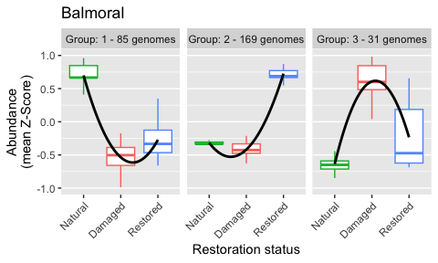
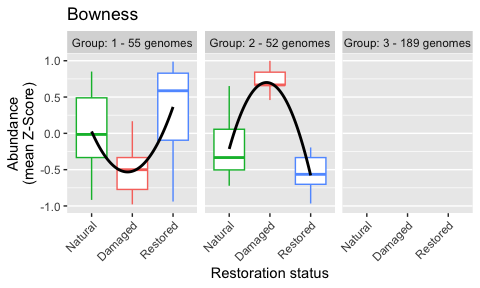
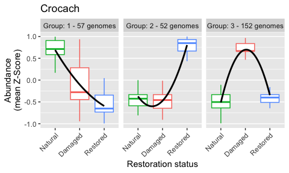
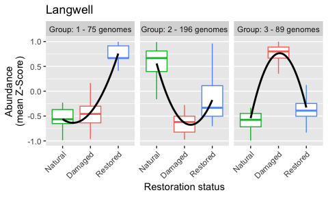
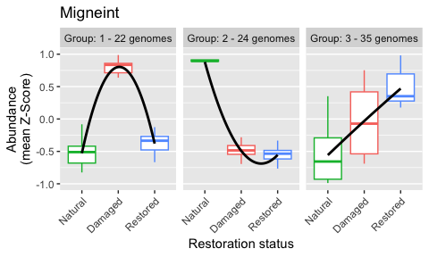
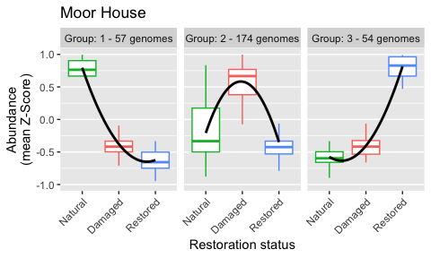
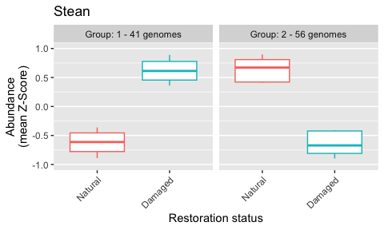
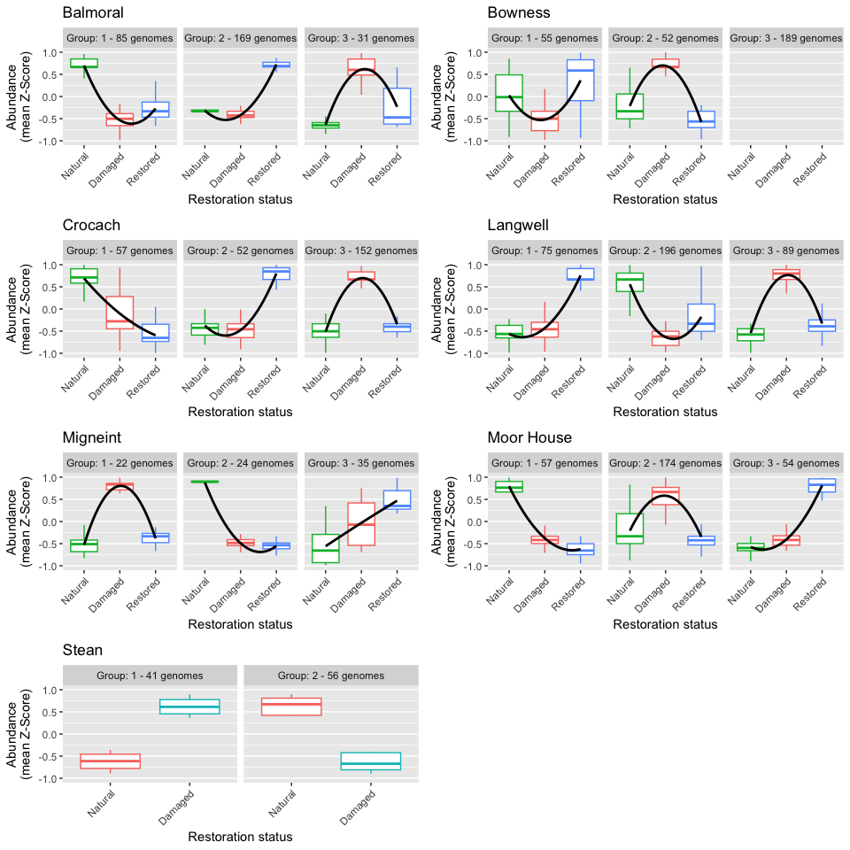

# Load and format data

## Metadata

    metadata <- read.csv("./metadata.tsv", sep = "\t") %>%
      filter(
        !sample %in% c("LASYr2D", "LASYr2E", "LASYr2F", "LAWAr2D", "LAWAr2E", "LAWAr2F")
      )
    row.names(metadata) <- metadata$sample

## Contig to genome table

    contig2genome <- read.csv("./contig_to_genome.tsv", header=FALSE, sep="\t")
    colnames(contig2genome) <- c("contig", "Genome")
    contig2genome$Genome <- gsub(".fasta", "", contig2genome$Genome)
    head(contig2genome)

    ##                   contig             Genome
    ## 1 BAr1A1B1C_000000006168 BAr1A1B1C__bin_100
    ## 2 BAr1A1B1C_000000006972 BAr1A1B1C__bin_100
    ## 3 BAr1A1B1C_000000007187 BAr1A1B1C__bin_100
    ## 4 BAr1A1B1C_000000007759 BAr1A1B1C__bin_100
    ## 5 BAr1A1B1C_000000007985 BAr1A1B1C__bin_100
    ## 6 BAr1A1B1C_000000012567 BAr1A1B1C__bin_100

## Genome counts

    genome_counts <- read.csv("./genome_counts.tsv", sep = "\t", header = TRUE, row.names = 1)
    colnames(genome_counts) <- sub(".filtered.Read.Count", "", colnames(genome_counts))
    genome_counts <- genome_counts %>% select(-contains(".filtered"))
    genome_counts <- genome_counts[, !(colnames(genome_counts) %in% c("LASYr2D", "LASYr2E", "LASYr2F", "LAWAr2D", "LAWAr2E", "LAWAr2F"))] # remove extra Langwell restored replicates
    head(genome_counts)

    ##                    BAr1A BAr1B  BAr1C  BAr2D BAr2E BAr2F BAr3G BAr3H BAr3I BOr1A  BOr1B  BOr1C  BOr2D BOr2E
    ## CRr3G3H3I__bin_97  10209 12759  16148  32489 33730 48124 43342 58656 46712 28005  38878  37509  32549 28547
    ## MGr2D2E2F__bin_102   527  3498    766    574   510   586   411   897   547  4445   4663  12778  23270 29801
    ## MGr2D2E2F__bin_107   612   317    378     77   134    51    43    49    49   164     51     90    125   119
    ## BOr1A1B1C__bin_57  11179  4944  17657 157074  6743 14416  9535 28454 16906 81756 234499 481075 100674 42814
    ## CRr2D2E2F__bin_21  51818 79789 187539  14057 60117 83826  3445 26948 10992 90458 109478 128718 140736 58127
    ## SEr2D2E2F__bin_42   2688  7226   3805   1401  1748  2800   569   820   626  5570   3744   5156   3405  5934
    ##                     BOr2F  BOr3G  BOr3H  BOr3I   CRr1A   CRr1B   CRr1C  CRr2D  CRr2E  CRr2F  CRr3G   CRr3H
    ## CRr3G3H3I__bin_97   29310  40073  49567  46153   21608  126451  163406  13160  12412  66022 319814  443281
    ## MGr2D2E2F__bin_102  18214    461    339    435    2718    7056    3185   2675   3848   1955   5329    3867
    ## MGr2D2E2F__bin_107     72     43     24     31     178     212     222    460    414    209    295     160
    ## BOr1A1B1C__bin_57  300177 258956 510260 519790   77892    8181   19076   2618  39294  46472   2089   33619
    ## CRr2D2E2F__bin_21   95293  31754  48668 105770 1916143 1395796 1064746 199826 167383 393051 375828 1006370
    ## SEr2D2E2F__bin_42    4038   2353   4018   2416    4367    7005    4862   7762  30447  36430   5556    4171
    ##                      CRr3I LABRr1A LABRr1B LABRr1C LASAr3G LASAr3H LASAr3I LASCr2D LASCr2E LASCr2F  MGr1A
    ## CRr3G3H3I__bin_97   601693   11469   11914   10574   11372   19263   22211    2941   19804    3949  45871
    ## MGr2D2E2F__bin_102   20829  138417   55568   18398     853   10914     957   66326   25448   20966  87344
    ## MGr2D2E2F__bin_107     189   10819    8206     920     106      80      42     686     440     482 418544
    ## BOr1A1B1C__bin_57    65959     391     341    2367    6822    1220   14088    1272  193454    2922    334
    ## CRr2D2E2F__bin_21  1092743   13017   12378   14648  112113   54744   34938  111841  100292  102436  65737
    ## SEr2D2E2F__bin_42     8952    1438    1292     789    2789    4602     945   10059   10635    6069  12126
    ##                     MGr1B  MGr1C  MGr2D  MGr2E MGr2F  MGr3G  MGr3H  MGr3I   MHr1A   MHr1B  MHr1C MHr2D
    ## CRr3G3H3I__bin_97   79649  60886  16719  57103 60834  89147  76697   5667   31509  153521 130518 26026
    ## MGr2D2E2F__bin_102  44044  20480 151068  80904 58057  25896 143684  67940    2728    5610   3254  1355
    ## MGr2D2E2F__bin_107  12866    499 526929 166118 37744    168  25779    931     180     172    231   108
    ## BOr1A1B1C__bin_57     317    780   5184    227  1140    565  10008   2115   82236   12062  12554   532
    ## CRr2D2E2F__bin_21  219225 104000  30016  13377 31381 143907 284723  19925 1387919 1363733 950724 14394
    ## SEr2D2E2F__bin_42    7646   4786  16218  39077 45652  23083 177671 136755    4066    6831   4981 23899
    ##                    MHr2E MHr2F  MHr3G MHr3H  MHr3I  SEr2D  SEr2E  SEr2F  SEr3G  SEr3H  SEr3I
    ## CRr3G3H3I__bin_97  69457 52563  23992  6577 543723  19889  13191  10193   5297   1809  25353
    ## MGr2D2E2F__bin_102   611   325   1010 23904  19886   1623   2558   1905   3186   2835  66487
    ## MGr2D2E2F__bin_107   130    65     98   293    285    179    116     87    285    284   2772
    ## BOr1A1B1C__bin_57   6575  4951  39733  4704  44636  94399   3707  14933  67852   3050  14664
    ## CRr2D2E2F__bin_21  52408 19746 205905 27387 937060 160758  71143 496164 186202 123321  94989
    ## SEr2D2E2F__bin_42   4097   903   1313  5172  10692 170923 124303  86564  44102  25785 112737

## Trimmed mean genome coverage

    tmeans <- read.csv("./genome_trimmed_mean_cov.tsv", sep = "\t", header = TRUE, row.names = 1)
    colnames(tmeans) <-  sub(".filtered.Trimmed.Mean", "", colnames(tmeans))
    tmeans <- tmeans %>% select(-contains(".filtered"))
    tmeans <- tmeans[, !(colnames(tmeans) %in% c("LASYr2D", "LASYr2E", "LASYr2F", "LAWAr2D", "LAWAr2E", "LAWAr2F"))] # remove extra Langwell restored replicates
    head(tmeans)

    ##                        BAr1A      BAr1B      BAr1C      BAr2D      BAr2E       BAr2F     BAr3G     BAr3H
    ## CRr3G3H3I__bin_97  0.0000000 0.00000000 0.04159392 0.09140381 0.05801507 0.076773900 0.1745691 0.4286790
    ## MGr2D2E2F__bin_102 0.0000000 0.08970084 0.00000000 0.00000000 0.00000000 0.000000000 0.0000000 0.0000000
    ## MGr2D2E2F__bin_107 0.0000000 0.00000000 0.00000000 0.00000000 0.00000000 0.000000000 0.0000000 0.0000000
    ## BOr1A1B1C__bin_57  0.2938575 0.09777822 0.59626530 5.84007600 0.13314608 0.391337840 0.2508757 0.9634436
    ## CRr2D2E2F__bin_21  1.3489698 2.02902300 5.96384140 0.21155033 1.10930720 1.950417300 0.0000000 0.6114137
    ## SEr2D2E2F__bin_42  0.0000000 0.20063858 0.05316389 0.00000000 0.00000000 0.003746511 0.0000000 0.0000000
    ##                        BAr3I      BOr1A       BOr1B       BOr1C      BOr2D      BOr2E       BOr2F
    ## CRr3G3H3I__bin_97  0.1728462 0.02047414  0.02419298  0.04044275 0.01676833 0.00000000  0.01310886
    ## MGr2D2E2F__bin_102 0.0000000 0.19383805  0.20925352  0.75555050 1.48243220 1.94876490  1.08015510
    ## MGr2D2E2F__bin_107 0.0000000 0.00000000  0.00000000  0.00000000 0.00000000 0.00000000  0.00000000
    ## BOr1A1B1C__bin_57  0.5370316 3.53836680 10.48776150 22.09255200 4.41022970 1.76372970 13.16904800
    ## CRr2D2E2F__bin_21  0.1393521 2.45227270  2.93048360  3.53684260 3.94354750 1.49667420  2.47623560
    ## SEr2D2E2F__bin_42  0.0000000 0.11329823  0.02120573  0.07682487 0.02579297 0.08044376  0.03043835
    ##                          BOr3G       BOr3H       BOr3I       CRr1A      CRr1B        CRr1C      CRr2D
    ## CRr3G3H3I__bin_97   0.09396218  0.12504318  0.07635172  0.24628772  2.5893207  3.517527800 0.07735442
    ## MGr2D2E2F__bin_102  0.00000000  0.00000000  0.00000000  0.00000000  0.1574958  0.001733551 0.00000000
    ## MGr2D2E2F__bin_107  0.00000000  0.00000000  0.00000000  0.00000000  0.0000000  0.000000000 0.00000000
    ## BOr1A1B1C__bin_57  11.75666600 23.94035700 24.02790600  3.41324200  0.2566347  0.719588500 0.02950514
    ## CRr2D2E2F__bin_21   0.53344125  1.03728080  2.86537600 60.09852200 43.7575230 33.665253000 5.47219100
    ## SEr2D2E2F__bin_42   0.00000000  0.03412416  0.00000000  0.03127359  0.1156215  0.047645237 0.21488738
    ##                         CRr2E      CRr2F        CRr3G        CRr3H      CRr3I    LABRr1A   LABRr1B
    ## CRr3G3H3I__bin_97  0.01862040  0.9144765  6.832873300  9.736143000 13.3382090  0.0000000 0.0000000
    ## MGr2D2E2F__bin_102 0.06278205  0.0000000  0.094580576  0.005439222  1.1797982 10.1692560 3.9876344
    ## MGr2D2E2F__bin_107 0.00000000  0.0000000  0.000000000  0.000000000  0.0000000  0.1757442 0.1290612
    ## BOr1A1B1C__bin_57  1.64509690  1.9848795  0.007098831  1.298006900  2.8551393  0.0000000 0.0000000
    ## CRr2D2E2F__bin_21  4.07080900 11.7379360 10.590194000 30.660522000 33.4183350  0.2293265 0.2373512
    ## SEr2D2E2F__bin_42  1.15893950  1.4601696  0.090516740  0.027754536  0.1554965  0.0000000 0.0000000
    ##                       LABRr1C    LASAr3G      LASAr3H     LASAr3I   LASCr2D   LASCr2E    LASCr2F      MGr1A
    ## CRr3G3H3I__bin_97  0.00000000 0.00000000 0.0001300578 0.006282962 0.0000000 0.0336550 0.00000000  0.1518996
    ## MGr2D2E2F__bin_102 1.19582590 0.00000000 0.5971367000 0.000000000 4.7111998 1.6820074 1.35975940  6.1014676
    ## MGr2D2E2F__bin_107 0.00000000 0.00000000 0.0000000000 0.000000000 0.0000000 0.0000000 0.00000000 14.1929660
    ## BOr1A1B1C__bin_57  0.02006921 0.16279325 0.0000000000 0.532026900 0.0000000 9.0902290 0.03491909  0.0000000
    ## CRr2D2E2F__bin_21  0.28466463 2.75222660 1.0304362000 0.526320100 3.0235236 2.6696198 2.94784570  1.7831537
    ## SEr2D2E2F__bin_42  0.00000000 0.02277528 0.0586430500 0.000000000 0.3169128 0.3239092 0.15722182  0.3053606
    ##                        MGr1B     MGr1C       MGr2D      MGr2E      MGr2F     MGr3G     MGr3H       MGr3I
    ## CRr3G3H3I__bin_97  0.8785822 0.4793107  0.01225297 0.04544300 0.06576606 0.1202917 0.1032584 0.000000000
    ## MGr2D2E2F__bin_102 2.7711022 1.1196126 11.08159200 5.79091550 4.18148500 1.5684347 8.7387360 4.681300600
    ## MGr2D2E2F__bin_107 0.3093565 0.0000000 17.97301900 5.42454340 1.13515370 0.0000000 0.5566205 0.000000000
    ## BOr1A1B1C__bin_57  0.0000000 0.0000000  0.13084045 0.00000000 0.00000000 0.0000000 0.2601484 0.008936496
    ## CRr2D2E2F__bin_21  6.4404664 2.7897463  0.73306330 0.07471212 0.65482580 3.8547895 6.9317856 0.273533250
    ## SEr2D2E2F__bin_42  0.1063998 0.0478833  0.53115326 1.50692030 1.83016770 0.7556792 6.1356173 5.784804000
    ##                         MHr1A       MHr1B        MHr1C      MHr2D      MHr2E      MHr2F   MHr3G     MHr3H
    ## CRr3G3H3I__bin_97   0.3653310  3.15488770  2.682882800 0.00000000 0.03851254 0.01391153 0.00000 0.0000000
    ## MGr2D2E2F__bin_102  0.0000000  0.09526601  0.001092325 0.01540881 0.00000000 0.00000000 0.00000 1.4242715
    ## MGr2D2E2F__bin_107  0.0000000  0.00000000  0.000000000 0.00000000 0.00000000 0.00000000 0.00000 0.0000000
    ## BOr1A1B1C__bin_57   3.5640695  0.40650558  0.420145450 0.00000000 0.10039095 0.07705295 1.67641 0.0798580
    ## CRr2D2E2F__bin_21  42.9494820 42.37871600 29.172752000 0.16562708 1.04367570 0.27581254 6.16882 0.6068039
    ## SEr2D2E2F__bin_42   0.0242311  0.09135710  0.041844270 0.94033300 0.02496504 0.00000000 0.00000 0.1094223
    ##                        MHr3I      SEr2D      SEr2E      SEr2F     SEr3G      SEr3H       SEr3I
    ## CRr3G3H3I__bin_97  11.933261 0.04300018 0.00000000  0.0000000 0.0000000 0.00000000 0.004010393
    ## MGr2D2E2F__bin_102  1.067121 0.00000000 0.00000000  0.0000000 0.0000000 0.00000000 2.754094400
    ## MGr2D2E2F__bin_107  0.000000 0.00000000 0.00000000  0.0000000 0.0000000 0.00000000 0.000000000
    ## BOr1A1B1C__bin_57   1.875822 4.23549900 0.05444433  0.5348124 2.9344602 0.01123636 0.358333170
    ## CRr2D2E2F__bin_21  28.308372 4.57841060 1.48839310 15.3856260 4.5591280 2.10742380 2.029838600
    ## SEr2D2E2F__bin_42   0.202335 7.32135400 5.45638700  3.7175370 0.6761632 0.29197374 1.642770400

## Genome coverage

    coverage <- read.csv("./genome_covered_fraction.tsv", sep = "\t", header = TRUE, row.names = 1)
    colnames(coverage) <-  sub(".filtered.Covered.Fraction", "", colnames(coverage))
    coverage <- coverage %>% select(-contains(".filtered"))
    coverage <- coverage[, !(colnames(coverage) %in% c("LASYr2D", "LASYr2E", "LASYr2F", "LAWAr2D", "LAWAr2E", "LAWAr2F"))] # remove extra Langwell restored replicates
    head(coverage)

    ##                          BAr1A       BAr1B       BAr1C        BAr2D       BAr2E        BAr2F        BAr3G
    ## CRr3G3H3I__bin_97  0.045524586 0.047571886 0.087638330 0.0999286200 0.086341440 0.0958619340 0.1240396500
    ## MGr2D2E2F__bin_102 0.012250610 0.118602745 0.025969906 0.0146554190 0.012011249 0.0171007420 0.0104865860
    ## MGr2D2E2F__bin_107 0.003162913 0.003615655 0.003383756 0.0003768662 0.001044673 0.0004906799 0.0002487317
    ## BOr1A1B1C__bin_57  0.214380220 0.121573500 0.340614230 0.7702551500 0.134466040 0.2352555200 0.1999385700
    ## CRr2D2E2F__bin_21  0.612089750 0.743531500 0.946627800 0.1848667900 0.522714000 0.7138021600 0.0393238700
    ## SEr2D2E2F__bin_42  0.047422152 0.186751100 0.097332280 0.0236088610 0.024242654 0.0531780460 0.0050788056
    ##                           BAr3H       BAr3I      BOr1A        BOr1B       BOr1C       BOr2D       BOr2E
    ## CRr3G3H3I__bin_97  0.2587587500 0.123871790 0.06728035 0.0687499200 0.077618060 0.064816210 0.049883116
    ## MGr2D2E2F__bin_102 0.0321138700 0.012886597 0.17793344 0.1865366000 0.422828350 0.579676150 0.657357160
    ## MGr2D2E2F__bin_107 0.0004572644 0.000245968 0.00184765 0.0003519931 0.000944678 0.001264009 0.001533594
    ## BOr1A1B1C__bin_57  0.3729518400 0.293163300 0.87544080 0.9871101400 0.996909860 0.917300160 0.683777700
    ## CRr2D2E2F__bin_21  0.3829574000 0.148597260 0.77364210 0.8174296600 0.855403400 0.876000640 0.630108830
    ## SEr2D2E2F__bin_42  0.0093587790 0.005786818 0.13345976 0.0689379050 0.111234050 0.072968856 0.111903000
    ##                           BOr2F        BOr3G        BOr3H        BOr3I      CRr1A       CRr1B       CRr1C
    ## CRr3G3H3I__bin_97  0.0621577760 0.1005106640 0.1097850050 0.0941664950 0.20826764 0.823256730 0.899214900
    ## MGr2D2E2F__bin_102 0.4938115200 0.0160302800 0.0110042240 0.0117020510 0.02982528 0.157775370 0.050827768
    ## MGr2D2E2F__bin_107 0.0008444316 0.0004042519 0.0001947142 0.0001899406 0.00181348 0.002475006 0.002334058
    ## BOr1A1B1C__bin_57  0.9880021000 0.9881159700 0.9957737000 0.9950458000 0.84390380 0.214952510 0.418467970
    ## CRr2D2E2F__bin_21  0.7656233000 0.3421924400 0.5189516500 0.8098859000 0.96648276 0.981800100 0.979778600
    ## SEr2D2E2F__bin_42  0.0771287100 0.0379839470 0.0803256600 0.0379891540 0.07794935 0.135654760 0.092389870
    ##                          CRr2D       CRr2E       CRr2F       CRr3G       CRr3H       CRr3I     LABRr1A
    ## CRr3G3H3I__bin_97  0.108577870 0.066973700 0.473228960 0.979414460 0.991840240 0.995055260 0.031266283
    ## MGr2D2E2F__bin_102 0.045330454 0.098894620 0.039102796 0.116732635 0.054335560 0.532874350 0.947785100
    ## MGr2D2E2F__bin_107 0.002789815 0.002452143 0.002427772 0.002090854 0.001414505 0.002059448 0.158991070
    ## BOr1A1B1C__bin_57  0.075448030 0.665222900 0.718789100 0.055640176 0.546916370 0.810526400 0.008414254
    ## CRr2D2E2F__bin_21  0.962769570 0.912501800 0.993431030 0.973620700 0.985993000 0.987524450 0.199227680
    ## SEr2D2E2F__bin_42  0.194944170 0.566815500 0.642681500 0.116685260 0.075014435 0.151767820 0.028329268
    ##                        LABRr1B    LABRr1C     LASAr3G     LASAr3H      LASAr3I     LASCr2D     LASCr2E
    ## CRr3G3H3I__bin_97  0.032561180 0.03440355 0.048518416 0.050474137 0.0558775920 0.022826780 0.076705106
    ## MGr2D2E2F__bin_102 0.884760000 0.57393680 0.023806592 0.366737840 0.0345682580 0.894301400 0.664986850
    ## MGr2D2E2F__bin_107 0.137995350 0.01553317 0.001045427 0.000839658 0.0006489637 0.003600077 0.003028748
    ## BOr1A1B1C__bin_57  0.009071427 0.06687815 0.153589430 0.026792223 0.3616138400 0.032603044 0.982796250
    ## CRr2D2E2F__bin_21  0.207703680 0.23123607 0.812635800 0.496212930 0.3390659000 0.828518030 0.808655700
    ## SEr2D2E2F__bin_42  0.026546380 0.01527027 0.070017340 0.100231060 0.0157803650 0.251258000 0.253983600
    ##                        LASCr2F       MGr1A       MGr1B       MGr1C      MGr2D       MGr2E      MGr2F
    ## CRr3G3H3I__bin_97  0.026413959 0.147560830 0.458620970 0.306125370 0.06151623 0.075866610 0.08516921
    ## MGr2D2E2F__bin_102 0.605168400 0.944673400 0.800404600 0.549151960 0.99167730 0.954557060 0.91727906
    ## MGr2D2E2F__bin_107 0.003290042 0.998656100 0.241049680 0.008597324 0.99958870 0.957125960 0.56476295
    ## BOr1A1B1C__bin_57  0.080239914 0.008486337 0.007491313 0.020333324 0.14434318 0.005701011 0.03443848
    ## CRr2D2E2F__bin_21  0.829042100 0.702160300 0.945180200 0.810915470 0.43065155 0.103877430 0.39801782
    ## SEr2D2E2F__bin_42  0.159169230 0.245542780 0.131764770 0.092744360 0.35388260 0.646573400 0.70894560
    ##                          MGr3G      MGr3H      MGr3I       MHr1A       MHr1B       MHr1C       MHr2D
    ## CRr3G3H3I__bin_97  0.099043250 0.09736675 0.03219387 0.271165040 0.870663940 0.832427560 0.039640136
    ## MGr2D2E2F__bin_102 0.648291300 0.97036400 0.92590356 0.023509122 0.119108126 0.050358642 0.062983490
    ## MGr2D2E2F__bin_107 0.001578567 0.31677392 0.00488494 0.001916993 0.002043871 0.002153665 0.001363502
    ## BOr1A1B1C__bin_57  0.015146330 0.18657412 0.05710644 0.845683700 0.291012260 0.295927730 0.013741372
    ## CRr2D2E2F__bin_21  0.895334500 0.93621120 0.21842538 0.965699200 0.980932400 0.978435000 0.162793370
    ## SEr2D2E2F__bin_42  0.435852170 0.90604600 0.91517950 0.071672620 0.118206100 0.087326355 0.519968570
    ##                          MHr2E        MHr2F      MHr3G       MHr3H       MHr3I       SEr2D        SEr2E
    ## CRr3G3H3I__bin_97  0.073201690 0.0629402600 0.05020605 0.032775250 0.991782550 0.080850065 0.0483803000
    ## MGr2D2E2F__bin_102 0.016457826 0.0134559460 0.03852012 0.605745200 0.502346460 0.033924807 0.0399248340
    ## MGr2D2E2F__bin_107 0.001096178 0.0006861478 0.00122783 0.002503648 0.002054424 0.001361995 0.0007024787
    ## BOr1A1B1C__bin_57  0.109723140 0.1057373200 0.66824937 0.109111440 0.695444460 0.898589730 0.0973341840
    ## CRr2D2E2F__bin_21  0.401232480 0.2178919500 0.91871154 0.381448800 0.987531800 0.912349340 0.6317292000
    ## SEr2D2E2F__bin_42  0.071836690 0.0103229770 0.02738525 0.130095810 0.178642970 0.982868100 0.9641974000
    ##                           SEr2F       SEr3G       SEr3H      SEr3I
    ## CRr3G3H3I__bin_97  0.0474942660 0.029443026 0.013710993 0.05391489
    ## MGr2D2E2F__bin_102 0.0320296400 0.023558700 0.018431356 0.77030050
    ## MGr2D2E2F__bin_107 0.0006208243 0.001508219 0.001251698 0.02450435
    ## BOr1A1B1C__bin_57  0.3554645000 0.827289200 0.059184740 0.24465065
    ## CRr2D2E2F__bin_21  0.9674262400 0.790055330 0.537100850 0.67725320
    ## SEr2D2E2F__bin_42  0.9093751300 0.164247700 0.134630020 0.23783277

## Pre-filter trimmed means and values to 0 if coverage &lt; 50%

\#But not the genome counts, since DESeq2 requires raw, unfiltered count
matrices

    tmeans[coverage < 0.50] <- 0
    tmeans <- tmeans[rowSums(tmeans>0) > 1,] # Remove singletons
    tmeans <- tmeans[, colSums(tmeans)>0] # Remove singletons
    head(tmeans)

    ##                      BAr1A    BAr1B    BAr1C    BAr2D    BAr2E    BAr2F BAr3G BAr3H BAr3I    BOr1A
    ## CRr3G3H3I__bin_97  0.00000 0.000000 0.000000 0.000000 0.000000 0.000000     0     0     0 0.000000
    ## MGr2D2E2F__bin_102 0.00000 0.000000 0.000000 0.000000 0.000000 0.000000     0     0     0 0.000000
    ## MGr2D2E2F__bin_107 0.00000 0.000000 0.000000 0.000000 0.000000 0.000000     0     0     0 0.000000
    ## BOr1A1B1C__bin_57  0.00000 0.000000 0.000000 5.840076 0.000000 0.000000     0     0     0 3.538367
    ## CRr2D2E2F__bin_21  1.34897 2.029023 5.963841 0.000000 1.109307 1.950417     0     0     0 2.452273
    ## SEr2D2E2F__bin_42  0.00000 0.000000 0.000000 0.000000 0.000000 0.000000     0     0     0 0.000000
    ##                        BOr1B     BOr1C    BOr2D    BOr2E     BOr2F    BOr3G     BOr3H     BOr3I     CRr1A
    ## CRr3G3H3I__bin_97   0.000000  0.000000 0.000000 0.000000  0.000000  0.00000  0.000000  0.000000  0.000000
    ## MGr2D2E2F__bin_102  0.000000  0.000000 1.482432 1.948765  0.000000  0.00000  0.000000  0.000000  0.000000
    ## MGr2D2E2F__bin_107  0.000000  0.000000 0.000000 0.000000  0.000000  0.00000  0.000000  0.000000  0.000000
    ## BOr1A1B1C__bin_57  10.487761 22.092552 4.410230 1.763730 13.169048 11.75667 23.940357 24.027906  3.413242
    ## CRr2D2E2F__bin_21   2.930484  3.536843 3.943548 1.496674  2.476236  0.00000  1.037281  2.865376 60.098522
    ## SEr2D2E2F__bin_42   0.000000  0.000000 0.000000 0.000000  0.000000  0.00000  0.000000  0.000000  0.000000
    ##                        CRr1B     CRr1C    CRr2D    CRr2E    CRr2F     CRr3G     CRr3H     CRr3I  LABRr1A
    ## CRr3G3H3I__bin_97   2.589321  3.517528 0.000000 0.000000  0.00000  6.832873  9.736143 13.338209  0.00000
    ## MGr2D2E2F__bin_102  0.000000  0.000000 0.000000 0.000000  0.00000  0.000000  0.000000  1.179798 10.16926
    ## MGr2D2E2F__bin_107  0.000000  0.000000 0.000000 0.000000  0.00000  0.000000  0.000000  0.000000  0.00000
    ## BOr1A1B1C__bin_57   0.000000  0.000000 0.000000 1.645097  1.98488  0.000000  1.298007  2.855139  0.00000
    ## CRr2D2E2F__bin_21  43.757523 33.665253 5.472191 4.070809 11.73794 10.590194 30.660522 33.418335  0.00000
    ## SEr2D2E2F__bin_42   0.000000  0.000000 0.000000 1.158940  1.46017  0.000000  0.000000  0.000000  0.00000
    ##                     LABRr1B  LABRr1C  LASAr3G LASAr3H LASAr3I  LASCr2D  LASCr2E  LASCr2F     MGr1A    MGr1B
    ## CRr3G3H3I__bin_97  0.000000 0.000000 0.000000       0       0 0.000000 0.000000 0.000000  0.000000 0.000000
    ## MGr2D2E2F__bin_102 3.987634 1.195826 0.000000       0       0 4.711200 1.682007 1.359759  6.101468 2.771102
    ## MGr2D2E2F__bin_107 0.000000 0.000000 0.000000       0       0 0.000000 0.000000 0.000000 14.192966 0.000000
    ## BOr1A1B1C__bin_57  0.000000 0.000000 0.000000       0       0 0.000000 9.090229 0.000000  0.000000 0.000000
    ## CRr2D2E2F__bin_21  0.000000 0.000000 2.752227       0       0 3.023524 2.669620 2.947846  1.783154 6.440466
    ## SEr2D2E2F__bin_42  0.000000 0.000000 0.000000       0       0 0.000000 0.000000 0.000000  0.000000 0.000000
    ##                       MGr1C    MGr2D    MGr2E    MGr2F    MGr3G    MGr3H    MGr3I    MHr1A     MHr1B
    ## CRr3G3H3I__bin_97  0.000000  0.00000 0.000000 0.000000 0.000000 0.000000 0.000000  0.00000  3.154888
    ## MGr2D2E2F__bin_102 1.119613 11.08159 5.790915 4.181485 1.568435 8.738736 4.681301  0.00000  0.000000
    ## MGr2D2E2F__bin_107 0.000000 17.97302 5.424543 1.135154 0.000000 0.000000 0.000000  0.00000  0.000000
    ## BOr1A1B1C__bin_57  0.000000  0.00000 0.000000 0.000000 0.000000 0.000000 0.000000  3.56407  0.000000
    ## CRr2D2E2F__bin_21  2.789746  0.00000 0.000000 0.000000 3.854789 6.931786 0.000000 42.94948 42.378716
    ## SEr2D2E2F__bin_42  0.000000  0.00000 1.506920 1.830168 0.000000 6.135617 5.784804  0.00000  0.000000
    ##                        MHr1C    MHr2D MHr2E MHr2F   MHr3G    MHr3H     MHr3I    SEr2D    SEr2E     SEr2F
    ## CRr3G3H3I__bin_97   2.682883 0.000000     0     0 0.00000 0.000000 11.933261 0.000000 0.000000  0.000000
    ## MGr2D2E2F__bin_102  0.000000 0.000000     0     0 0.00000 1.424271  1.067121 0.000000 0.000000  0.000000
    ## MGr2D2E2F__bin_107  0.000000 0.000000     0     0 0.00000 0.000000  0.000000 0.000000 0.000000  0.000000
    ## BOr1A1B1C__bin_57   0.000000 0.000000     0     0 1.67641 0.000000  1.875822 4.235499 0.000000  0.000000
    ## CRr2D2E2F__bin_21  29.172752 0.000000     0     0 6.16882 0.000000 28.308372 4.578411 1.488393 15.385626
    ## SEr2D2E2F__bin_42   0.000000 0.940333     0     0 0.00000 0.000000  0.000000 7.321354 5.456387  3.717537
    ##                       SEr3G    SEr3H    SEr3I
    ## CRr3G3H3I__bin_97  0.000000 0.000000 0.000000
    ## MGr2D2E2F__bin_102 0.000000 0.000000 2.754094
    ## MGr2D2E2F__bin_107 0.000000 0.000000 0.000000
    ## BOr1A1B1C__bin_57  2.934460 0.000000 0.000000
    ## CRr2D2E2F__bin_21  4.559128 2.107424 2.029839
    ## SEr2D2E2F__bin_42  0.000000 0.000000 0.000000

## And normalize trimmed means by the sequencing depth per sample (per 100M reads)

    seqdepth <- read_csv(file="./seq_depth.csv", show_col_types = FALSE)
    seqdepth_R1 <- subset(seqdepth, Pair=="R1")
    tmeans_norm <- tmeans
    for(col in colnames(tmeans_norm)) {
      tmeans_norm[[col]] <- tmeans_norm[[col]] / seqdepth_R1$Hundred.Millions.Reads[seqdepth_R1$Sample == col]
    }
    head(tmeans_norm)

    ##                       BAr1A    BAr1B    BAr1C   BAr2D    BAr2E    BAr2F BAr3G BAr3H BAr3I    BOr1A    BOr1B
    ## CRr3G3H3I__bin_97  0.000000 0.000000  0.00000  0.0000 0.000000 0.000000     0     0     0  0.00000  0.00000
    ## MGr2D2E2F__bin_102 0.000000 0.000000  0.00000  0.0000 0.000000 0.000000     0     0     0  0.00000  0.00000
    ## MGr2D2E2F__bin_107 0.000000 0.000000  0.00000  0.0000 0.000000 0.000000     0     0     0  0.00000  0.00000
    ## BOr1A1B1C__bin_57  0.000000 0.000000  0.00000 15.2412 0.000000 0.000000     0     0     0 11.81465 37.25809
    ## CRr2D2E2F__bin_21  4.612914 7.078385 13.16384  0.0000 2.988147 5.575596     0     0     0  8.18817 10.41063
    ## SEr2D2E2F__bin_42  0.000000 0.000000  0.00000  0.0000 0.000000 0.000000     0     0     0  0.00000  0.00000
    ##                       BOr1C     BOr2D    BOr2E     BOr2F    BOr3G     BOr3H     BOr3I     CRr1A      CRr1B
    ## CRr3G3H3I__bin_97   0.00000  0.000000 0.000000  0.000000  0.00000  0.000000  0.000000   0.00000   7.833139
    ## MGr2D2E2F__bin_102  0.00000  4.310709 7.160779  0.000000  0.00000  0.000000  0.000000   0.00000   0.000000
    ## MGr2D2E2F__bin_107  0.00000  0.000000 0.000000  0.000000  0.00000  0.000000  0.000000   0.00000   0.000000
    ## BOr1A1B1C__bin_57  66.07288 12.824341 6.480863 46.155480 37.02044 64.690383 67.801818  11.30955   0.000000
    ## CRr2D2E2F__bin_21  10.57775 11.467294 5.499562  8.678824  0.00000  2.802886  8.085503 199.13249 132.374000
    ## SEr2D2E2F__bin_42   0.00000  0.000000 0.000000  0.000000  0.00000  0.000000  0.000000   0.00000   0.000000
    ##                        CRr1C    CRr2D     CRr2E     CRr2F    CRr3G     CRr3H     CRr3I  LABRr1A  LABRr1B
    ## CRr3G3H3I__bin_97   9.007517  0.00000  0.000000  0.000000 20.11977 26.904450 38.402958  0.00000  0.00000
    ## MGr2D2E2F__bin_102  0.000000  0.00000  0.000000  0.000000  0.00000  0.000000  3.396838 25.25634 11.78801
    ## MGr2D2E2F__bin_107  0.000000  0.00000  0.000000  0.000000  0.00000  0.000000  0.000000  0.00000  0.00000
    ## BOr1A1B1C__bin_57   0.000000  0.00000  4.925223  6.736030  0.00000  3.586858  8.220429  0.00000  0.00000
    ## CRr2D2E2F__bin_21  86.208366 20.11373 12.187514 39.834706 31.18340 84.726002 96.217034  0.00000  0.00000
    ## SEr2D2E2F__bin_42   0.000000  0.00000  3.469726  4.955337  0.00000  0.000000  0.000000  0.00000  0.00000
    ##                     LABRr1C  LASAr3G LASAr3H LASAr3I   LASCr2D   LASCr2E  LASCr2F     MGr1A     MGr1B
    ## CRr3G3H3I__bin_97  0.000000 0.000000       0       0  0.000000  0.000000 0.000000  0.000000  0.000000
    ## MGr2D2E2F__bin_102 3.185639 0.000000       0       0 13.679682  3.349885 3.793309 17.207979  6.806855
    ## MGr2D2E2F__bin_107 0.000000 0.000000       0       0  0.000000  0.000000 0.000000 40.028446  0.000000
    ## BOr1A1B1C__bin_57  0.000000 0.000000       0       0  0.000000 18.104094 0.000000  0.000000  0.000000
    ## CRr2D2E2F__bin_21  0.000000 9.982587       0       0  8.779259  5.316813 8.223580  5.029031 15.820174
    ## SEr2D2E2F__bin_42  0.000000 0.000000       0       0  0.000000  0.000000 0.000000  0.000000  0.000000
    ##                       MGr1C    MGr2D     MGr2E    MGr2F    MGr3G     MGr3H    MGr3I     MHr1A      MHr1B
    ## CRr3G3H3I__bin_97  0.000000  0.00000  0.000000  0.00000 0.000000  0.000000  0.00000   0.00000   9.592013
    ## MGr2D2E2F__bin_102 3.654748 30.90347 16.340326 13.93808 3.889692 12.644012 13.77003   0.00000   0.000000
    ## MGr2D2E2F__bin_107 0.000000 50.12174 15.306527  3.78379 0.000000  0.000000  0.00000   0.00000   0.000000
    ## BOr1A1B1C__bin_57  0.000000  0.00000  0.000000  0.00000 0.000000  0.000000  0.00000  12.34039   0.000000
    ## CRr2D2E2F__bin_21  9.106560  0.00000  0.000000  0.00000 9.559815 10.029549  0.00000 148.71021 128.846803
    ## SEr2D2E2F__bin_42  0.000000  0.00000  4.252103  6.10047 0.000000  8.877579 17.01598   0.00000   0.000000
    ##                        MHr1C    MHr2D MHr2E MHr2F     MHr3G    MHr3H     MHr3I    SEr2D     SEr2E     SEr2F
    ## CRr3G3H3I__bin_97   8.899374 0.000000     0     0  0.000000 0.000000 31.457092  0.00000  0.000000  0.000000
    ## MGr2D2E2F__bin_102  0.000000 0.000000     0     0  0.000000 4.567917  2.813022  0.00000  0.000000  0.000000
    ## MGr2D2E2F__bin_107  0.000000 0.000000     0     0  0.000000 0.000000  0.000000  0.00000  0.000000  0.000000
    ## BOr1A1B1C__bin_57   0.000000 0.000000     0     0  5.303785 0.000000  4.944826 10.39344  0.000000  0.000000
    ## CRr2D2E2F__bin_21  96.768756 0.000000     0     0 19.516759 0.000000 74.623278 11.23490  3.753084 39.400077
    ## SEr2D2E2F__bin_42   0.000000 2.992175     0     0  0.000000 0.000000  0.000000 17.96577 13.758650  9.520005
    ##                        SEr3G    SEr3H     SEr3I
    ## CRr3G3H3I__bin_97   0.000000 0.000000 0.0000000
    ## MGr2D2E2F__bin_102  0.000000 0.000000 1.3468118
    ## MGr2D2E2F__bin_107  0.000000 0.000000 0.0000000
    ## BOr1A1B1C__bin_57   7.413248 0.000000 0.0000000
    ## CRr2D2E2F__bin_21  11.517602 3.934582 0.9926351
    ## SEr2D2E2F__bin_42   0.000000 0.000000 0.0000000

## MAG GTDB taxonomy

    gtdb <- read_csv(file="./MAGs_gtdb_taxonomy.csv", show_col_types = FALSE)
    head(gtdb)

    ## # A tibble: 6 × 7
    ##   Genome               Domain   Phylum          Class         Order   Family          Genus   
    ##   <chr>                <chr>    <chr>           <chr>         <chr>   <chr>           <chr>   
    ## 1 SEr3G3H3I__bin_186   Bacteria Patescibacteria Paceibacteria UBA6257 2-01-FULL-56-20 JAKAGE01
    ## 2 LAWAr2D2E2F__bin_24  Bacteria Spirochaetota   Spirochaetia  SZUA-6  <NA>            <NA>    
    ## 3 MHr3G3H3I__bin_65    Bacteria Spirochaetota   Spirochaetia  SZUA-6  <NA>            <NA>    
    ## 4 LASCr2D2E2F__bin_124 Bacteria Spirochaetota   Spirochaetia  SZUA-6  <NA>            <NA>    
    ## 5 MGr1A1B1C__bin_111   Bacteria Spirochaetota   Spirochaetia  SZUA-6  <NA>            <NA>    
    ## 6 MGr3G3H3I__bin_83    Bacteria Spirochaetota   Spirochaetia  SZUA-6  Fen-1364        Fen-1364

## Metabolic functions

    metabolic_modules <- read.csv("./METABOLIC_KEGG_module_presence.csv")
    head(metabolic_modules)

    ##   Module.ID                                     Module                 Module.Category
    ## 1    M00015 Proline biosynthesis, glutamate => proline Arginine and proline metabolism
    ##   BAr1A1B1C__bin_10.Module.presence BAr1A1B1C__bin_100.Module.presence BAr1A1B1C__bin_103.Module.presence
    ## 1                            Absent                             Absent                             Absent
    ##   BAr1A1B1C__bin_104.Module.presence BAr1A1B1C__bin_105.Module.presence BAr1A1B1C__bin_108.Module.presence
    ## 1                             Absent                             Absent                            Present
    ##   BAr1A1B1C__bin_115.Module.presence BAr1A1B1C__bin_116.Module.presence BAr1A1B1C__bin_117.Module.presence
    ## 1                             Absent                             Absent                            Present
    ##   BAr1A1B1C__bin_118.Module.presence BAr1A1B1C__bin_12.Module.presence BAr1A1B1C__bin_121.Module.presence
    ## 1                            Present                            Absent                            Present
    ##   BAr1A1B1C__bin_122.Module.presence BAr1A1B1C__bin_124.Module.presence BAr1A1B1C__bin_125.Module.presence
    ## 1                            Present                            Present                            Present
    ##   BAr1A1B1C__bin_127.Module.presence BAr1A1B1C__bin_13.Module.presence BAr1A1B1C__bin_132.Module.presence
    ## 1                            Present                            Absent                             Absent
    ##   BAr1A1B1C__bin_135.Module.presence BAr1A1B1C__bin_136.Module.presence BAr1A1B1C__bin_138.Module.presence
    ## 1                             Absent                            Present                            Present
    ##   BAr1A1B1C__bin_140.Module.presence BAr1A1B1C__bin_143.Module.presence BAr1A1B1C__bin_146.Module.presence
    ## 1                             Absent                            Present                             Absent
    ##   BAr1A1B1C__bin_19.Module.presence BAr1A1B1C__bin_20.Module.presence BAr1A1B1C__bin_25.Module.presence
    ## 1                            Absent                            Absent                           Present
    ##   BAr1A1B1C__bin_27.Module.presence BAr1A1B1C__bin_31.Module.presence BAr1A1B1C__bin_32.Module.presence
    ## 1                            Absent                           Present                           Present
    ##   BAr1A1B1C__bin_33.Module.presence BAr1A1B1C__bin_41.Module.presence BAr1A1B1C__bin_42.Module.presence
    ## 1                           Present                           Present                            Absent
    ##   BAr1A1B1C__bin_43.Module.presence BAr1A1B1C__bin_44.Module.presence BAr1A1B1C__bin_47.Module.presence
    ## 1                            Absent                            Absent                            Absent
    ##   BAr1A1B1C__bin_48.Module.presence BAr1A1B1C__bin_49.Module.presence BAr1A1B1C__bin_56.Module.presence
    ## 1                           Present                            Absent                            Absent
    ##   BAr1A1B1C__bin_58.Module.presence BAr1A1B1C__bin_6.Module.presence BAr1A1B1C__bin_60.Module.presence
    ## 1                           Present                           Absent                            Absent
    ##   BAr1A1B1C__bin_61.Module.presence BAr1A1B1C__bin_65.Module.presence BAr1A1B1C__bin_67.Module.presence
    ## 1                            Absent                           Present                            Absent
    ##   BAr1A1B1C__bin_68.Module.presence BAr1A1B1C__bin_72.Module.presence BAr1A1B1C__bin_73.Module.presence
    ## 1                           Present                            Absent                           Present
    ##   BAr1A1B1C__bin_78.Module.presence BAr1A1B1C__bin_79.Module.presence BAr1A1B1C__bin_8.Module.presence
    ## 1                            Absent                            Absent                           Absent
    ##   BAr1A1B1C__bin_80.Module.presence BAr1A1B1C__bin_82.Module.presence BAr1A1B1C__bin_83.Module.presence
    ## 1                            Absent                           Present                           Present
    ##   BAr1A1B1C__bin_85.Module.presence BAr1A1B1C__bin_86.Module.presence BAr1A1B1C__bin_89.Module.presence
    ## 1                            Absent                            Absent                           Present
    ##   BAr1A1B1C__bin_92.Module.presence BAr2D2E2F__bin_10.Module.presence BAr2D2E2F__bin_106.Module.presence
    ## 1                            Absent                            Absent                            Present
    ##   BAr2D2E2F__bin_109.Module.presence BAr2D2E2F__bin_11.Module.presence BAr2D2E2F__bin_111.Module.presence
    ## 1                             Absent                           Present                            Present
    ##   BAr2D2E2F__bin_124.Module.presence BAr2D2E2F__bin_125.Module.presence BAr2D2E2F__bin_126.Module.presence
    ## 1                             Absent                             Absent                            Present
    ##   BAr2D2E2F__bin_127.Module.presence BAr2D2E2F__bin_130.Module.presence BAr2D2E2F__bin_131.Module.presence
    ## 1                             Absent                             Absent                            Present
    ##   BAr2D2E2F__bin_15.Module.presence BAr2D2E2F__bin_17.Module.presence BAr2D2E2F__bin_18.Module.presence
    ## 1                            Absent                           Present                            Absent
    ##   BAr2D2E2F__bin_2.Module.presence BAr2D2E2F__bin_26.Module.presence BAr2D2E2F__bin_27.Module.presence
    ## 1                           Absent                           Present                           Present
    ##   BAr2D2E2F__bin_37.Module.presence BAr2D2E2F__bin_42.Module.presence BAr2D2E2F__bin_44.Module.presence
    ## 1                           Present                           Present                            Absent
    ##   BAr2D2E2F__bin_5.Module.presence BAr2D2E2F__bin_51.Module.presence BAr2D2E2F__bin_57.Module.presence
    ## 1                           Absent                            Absent                            Absent
    ##   BAr2D2E2F__bin_7.Module.presence BAr2D2E2F__bin_71.Module.presence BAr2D2E2F__bin_76.Module.presence
    ## 1                          Present                           Present                            Absent
    ##   BAr2D2E2F__bin_78.Module.presence BAr2D2E2F__bin_8.Module.presence BAr2D2E2F__bin_86.Module.presence
    ## 1                            Absent                           Absent                           Present
    ##   BAr2D2E2F__bin_87.Module.presence BAr2D2E2F__bin_94.Module.presence BAr2D2E2F__bin_96.Module.presence
    ## 1                            Absent                           Present                           Present
    ##   BAr3G3H3I__bin_15.Module.presence BAr3G3H3I__bin_20.Module.presence BAr3G3H3I__bin_23.Module.presence
    ## 1                           Present                            Absent                            Absent
    ##   BAr3G3H3I__bin_3.Module.presence BAr3G3H3I__bin_32.Module.presence BAr3G3H3I__bin_39.Module.presence
    ## 1                          Present                            Absent                            Absent
    ##   BAr3G3H3I__bin_54.Module.presence BAr3G3H3I__bin_6.Module.presence BAr3G3H3I__bin_68.Module.presence
    ## 1                            Absent                           Absent                           Present
    ##   BAr3G3H3I__bin_76.Module.presence BAr3G3H3I__bin_79.Module.presence BAr3G3H3I__bin_8.Module.presence
    ## 1                            Absent                           Present                          Present
    ##   BAr3G3H3I__bin_81.Module.presence BAr3G3H3I__bin_83.Module.presence BAr3G3H3I__bin_85.Module.presence
    ## 1                           Present                           Present                            Absent
    ##   BAr3G3H3I__bin_95.Module.presence BAr3G3H3I__bin_98.Module.presence BOr1A1B1C__bin_14.Module.presence
    ## 1                            Absent                            Absent                            Absent
    ##   BOr1A1B1C__bin_16.Module.presence BOr1A1B1C__bin_18.Module.presence BOr1A1B1C__bin_20.Module.presence
    ## 1                           Present                            Absent                           Present
    ##   BOr1A1B1C__bin_21.Module.presence BOr1A1B1C__bin_27.Module.presence BOr1A1B1C__bin_28.Module.presence
    ## 1                            Absent                            Absent                            Absent
    ##   BOr1A1B1C__bin_3.Module.presence BOr1A1B1C__bin_30.Module.presence BOr1A1B1C__bin_33.Module.presence
    ## 1                           Absent                            Absent                            Absent
    ##   BOr1A1B1C__bin_39.Module.presence BOr1A1B1C__bin_42.Module.presence BOr1A1B1C__bin_44.Module.presence
    ## 1                           Present                            Absent                            Absent
    ##   BOr1A1B1C__bin_45.Module.presence BOr1A1B1C__bin_48.Module.presence BOr1A1B1C__bin_57.Module.presence
    ## 1                           Present                           Present                            Absent
    ##   BOr1A1B1C__bin_6.Module.presence BOr1A1B1C__bin_60.Module.presence BOr1A1B1C__bin_7.Module.presence
    ## 1                          Present                           Present                           Absent
    ##   BOr1A1B1C__bin_70.Module.presence BOr1A1B1C__bin_72.Module.presence BOr1A1B1C__bin_77.Module.presence
    ## 1                            Absent                           Present                            Absent
    ##   BOr1A1B1C__bin_78.Module.presence BOr1A1B1C__bin_81.Module.presence BOr1A1B1C__bin_84.Module.presence
    ## 1                           Present                           Present                            Absent
    ##   BOr1A1B1C__bin_86.Module.presence BOr1A1B1C__bin_87.Module.presence BOr1A1B1C__bin_91.Module.presence
    ## 1                           Present                            Absent                            Absent
    ##   BOr2D2E2F__bin_11.Module.presence BOr2D2E2F__bin_15.Module.presence BOr2D2E2F__bin_18.Module.presence
    ## 1                           Present                            Absent                            Absent
    ##   BOr2D2E2F__bin_19.Module.presence BOr2D2E2F__bin_2.Module.presence BOr2D2E2F__bin_20.Module.presence
    ## 1                           Present                           Absent                            Absent
    ##   BOr2D2E2F__bin_22.Module.presence BOr2D2E2F__bin_26.Module.presence BOr2D2E2F__bin_30.Module.presence
    ## 1                            Absent                           Present                           Present
    ##   BOr2D2E2F__bin_32.Module.presence BOr2D2E2F__bin_33.Module.presence BOr2D2E2F__bin_39.Module.presence
    ## 1                            Absent                            Absent                           Present
    ##   BOr2D2E2F__bin_44.Module.presence BOr2D2E2F__bin_46.Module.presence BOr2D2E2F__bin_49.Module.presence
    ## 1                            Absent                           Present                            Absent
    ##   BOr2D2E2F__bin_51.Module.presence BOr2D2E2F__bin_56.Module.presence BOr2D2E2F__bin_61.Module.presence
    ## 1                            Absent                            Absent                           Present
    ##   BOr2D2E2F__bin_66.Module.presence BOr2D2E2F__bin_69.Module.presence BOr2D2E2F__bin_7.Module.presence
    ## 1                           Present                            Absent                          Present
    ##   BOr2D2E2F__bin_73.Module.presence BOr2D2E2F__bin_74.Module.presence BOr2D2E2F__bin_82.Module.presence
    ## 1                            Absent                            Absent                            Absent
    ##   BOr3G3H3I__bin_102.Module.presence BOr3G3H3I__bin_12.Module.presence BOr3G3H3I__bin_14.Module.presence
    ## 1                            Present                            Absent                            Absent
    ##   BOr3G3H3I__bin_18.Module.presence BOr3G3H3I__bin_20.Module.presence BOr3G3H3I__bin_26.Module.presence
    ## 1                           Present                            Absent                           Present
    ##   BOr3G3H3I__bin_3.Module.presence BOr3G3H3I__bin_31.Module.presence BOr3G3H3I__bin_33.Module.presence
    ## 1                          Present                            Absent                           Present
    ##   BOr3G3H3I__bin_37.Module.presence BOr3G3H3I__bin_38.Module.presence BOr3G3H3I__bin_43.Module.presence
    ## 1                           Present                           Present                           Present
    ##   BOr3G3H3I__bin_49.Module.presence BOr3G3H3I__bin_5.Module.presence BOr3G3H3I__bin_50.Module.presence
    ## 1                            Absent                           Absent                           Present
    ##   BOr3G3H3I__bin_51.Module.presence BOr3G3H3I__bin_53.Module.presence BOr3G3H3I__bin_85.Module.presence
    ## 1                           Present                           Present                           Present
    ##   BOr3G3H3I__bin_91.Module.presence BOr3G3H3I__bin_93.Module.presence BOr3G3H3I__bin_96.Module.presence
    ## 1                            Absent                           Present                            Absent
    ##   BOr3G3H3I__bin_97.Module.presence CRr1A1B1C__bin_101.Module.presence CRr1A1B1C__bin_103.Module.presence
    ## 1                            Absent                             Absent                            Present
    ##   CRr1A1B1C__bin_104.Module.presence CRr1A1B1C__bin_108.Module.presence CRr1A1B1C__bin_11.Module.presence
    ## 1                            Present                             Absent                           Present
    ##   CRr1A1B1C__bin_115.Module.presence CRr1A1B1C__bin_117.Module.presence CRr1A1B1C__bin_118.Module.presence
    ## 1                             Absent                             Absent                             Absent
    ##   CRr1A1B1C__bin_120.Module.presence CRr1A1B1C__bin_124.Module.presence CRr1A1B1C__bin_125.Module.presence
    ## 1                             Absent                            Present                            Present
    ##   CRr1A1B1C__bin_126.Module.presence CRr1A1B1C__bin_129.Module.presence CRr1A1B1C__bin_130.Module.presence
    ## 1                             Absent                            Present                             Absent
    ##   CRr1A1B1C__bin_136.Module.presence CRr1A1B1C__bin_138.Module.presence CRr1A1B1C__bin_16.Module.presence
    ## 1                             Absent                            Present                            Absent
    ##   CRr1A1B1C__bin_20.Module.presence CRr1A1B1C__bin_23.Module.presence CRr1A1B1C__bin_28.Module.presence
    ## 1                            Absent                           Present                            Absent
    ##   CRr1A1B1C__bin_29.Module.presence CRr1A1B1C__bin_31.Module.presence CRr1A1B1C__bin_33.Module.presence
    ## 1                            Absent                            Absent                           Present
    ##   CRr1A1B1C__bin_41.Module.presence CRr1A1B1C__bin_45.Module.presence CRr1A1B1C__bin_49.Module.presence
    ## 1                            Absent                           Present                            Absent
    ##   CRr1A1B1C__bin_50.Module.presence CRr1A1B1C__bin_52.Module.presence CRr1A1B1C__bin_55.Module.presence
    ## 1                            Absent                            Absent                            Absent
    ##   CRr1A1B1C__bin_57.Module.presence CRr1A1B1C__bin_61.Module.presence CRr1A1B1C__bin_66.Module.presence
    ## 1                           Present                           Present                           Present
    ##   CRr1A1B1C__bin_67.Module.presence CRr1A1B1C__bin_71.Module.presence CRr1A1B1C__bin_73.Module.presence
    ## 1                           Present                            Absent                           Present
    ##   CRr1A1B1C__bin_76.Module.presence CRr1A1B1C__bin_77.Module.presence CRr1A1B1C__bin_78.Module.presence
    ## 1                           Present                            Absent                            Absent
    ##   CRr1A1B1C__bin_81.Module.presence CRr1A1B1C__bin_83.Module.presence CRr1A1B1C__bin_85.Module.presence
    ## 1                           Present                            Absent                           Present
    ##   CRr1A1B1C__bin_95.Module.presence CRr1A1B1C__bin_96.Module.presence CRr1A1B1C__bin_98.Module.presence
    ## 1                            Absent                           Present                           Present
    ##   CRr2D2E2F__bin_102.Module.presence CRr2D2E2F__bin_104.Module.presence CRr2D2E2F__bin_11.Module.presence
    ## 1                            Present                            Present                            Absent
    ##   CRr2D2E2F__bin_117.Module.presence CRr2D2E2F__bin_119.Module.presence CRr2D2E2F__bin_124.Module.presence
    ## 1                            Present                             Absent                            Present
    ##   CRr2D2E2F__bin_13.Module.presence CRr2D2E2F__bin_18.Module.presence CRr2D2E2F__bin_21.Module.presence
    ## 1                            Absent                            Absent                           Present
    ##   CRr2D2E2F__bin_23.Module.presence CRr2D2E2F__bin_27.Module.presence CRr2D2E2F__bin_3.Module.presence
    ## 1                            Absent                            Absent                          Present
    ##   CRr2D2E2F__bin_32.Module.presence CRr2D2E2F__bin_34.Module.presence CRr2D2E2F__bin_37.Module.presence
    ## 1                           Present                            Absent                            Absent
    ##   CRr2D2E2F__bin_38.Module.presence CRr2D2E2F__bin_4.Module.presence CRr2D2E2F__bin_41.Module.presence
    ## 1                            Absent                          Present                            Absent
    ##   CRr2D2E2F__bin_44.Module.presence CRr2D2E2F__bin_49.Module.presence CRr2D2E2F__bin_5.Module.presence
    ## 1                           Present                            Absent                          Present
    ##   CRr2D2E2F__bin_51.Module.presence CRr2D2E2F__bin_52.Module.presence CRr2D2E2F__bin_54.Module.presence
    ## 1                            Absent                           Present                           Present
    ##   CRr2D2E2F__bin_57.Module.presence CRr2D2E2F__bin_58.Module.presence CRr2D2E2F__bin_61.Module.presence
    ## 1                           Present                            Absent                            Absent
    ##   CRr2D2E2F__bin_62.Module.presence CRr2D2E2F__bin_63.Module.presence CRr2D2E2F__bin_64.Module.presence
    ## 1                            Absent                            Absent                            Absent
    ##   CRr2D2E2F__bin_65.Module.presence CRr2D2E2F__bin_75.Module.presence CRr2D2E2F__bin_78.Module.presence
    ## 1                            Absent                            Absent                            Absent
    ##   CRr2D2E2F__bin_79.Module.presence CRr2D2E2F__bin_82.Module.presence CRr2D2E2F__bin_89.Module.presence
    ## 1                            Absent                           Present                            Absent
    ##   CRr2D2E2F__bin_9.Module.presence CRr2D2E2F__bin_90.Module.presence CRr2D2E2F__bin_94.Module.presence
    ## 1                           Absent                            Absent                           Present
    ##   CRr2D2E2F__bin_95.Module.presence CRr2D2E2F__bin_98.Module.presence CRr3G3H3I__bin_102.Module.presence
    ## 1                           Present                            Absent                             Absent
    ##   CRr3G3H3I__bin_104.Module.presence CRr3G3H3I__bin_105.Module.presence CRr3G3H3I__bin_11.Module.presence
    ## 1                            Present                             Absent                           Present
    ##   CRr3G3H3I__bin_111.Module.presence CRr3G3H3I__bin_118.Module.presence CRr3G3H3I__bin_127.Module.presence
    ## 1                             Absent                            Present                             Absent
    ##   CRr3G3H3I__bin_129.Module.presence CRr3G3H3I__bin_131.Module.presence CRr3G3H3I__bin_134.Module.presence
    ## 1                             Absent                            Present                            Present
    ##   CRr3G3H3I__bin_135.Module.presence CRr3G3H3I__bin_137.Module.presence CRr3G3H3I__bin_20.Module.presence
    ## 1                            Present                             Absent                           Present
    ##   CRr3G3H3I__bin_27.Module.presence CRr3G3H3I__bin_3.Module.presence CRr3G3H3I__bin_30.Module.presence
    ## 1                            Absent                           Absent                           Present
    ##   CRr3G3H3I__bin_31.Module.presence CRr3G3H3I__bin_35.Module.presence CRr3G3H3I__bin_36.Module.presence
    ## 1                           Present                           Present                           Present
    ##   CRr3G3H3I__bin_38.Module.presence CRr3G3H3I__bin_42.Module.presence CRr3G3H3I__bin_43.Module.presence
    ## 1                           Present                           Present                            Absent
    ##   CRr3G3H3I__bin_47.Module.presence CRr3G3H3I__bin_5.Module.presence CRr3G3H3I__bin_51.Module.presence
    ## 1                            Absent                          Present                           Present
    ##   CRr3G3H3I__bin_52.Module.presence CRr3G3H3I__bin_58.Module.presence CRr3G3H3I__bin_60.Module.presence
    ## 1                            Absent                           Present                            Absent
    ##   CRr3G3H3I__bin_61.Module.presence CRr3G3H3I__bin_62.Module.presence CRr3G3H3I__bin_63.Module.presence
    ## 1                            Absent                           Present                           Present
    ##   CRr3G3H3I__bin_64.Module.presence CRr3G3H3I__bin_72.Module.presence CRr3G3H3I__bin_74.Module.presence
    ## 1                            Absent                            Absent                            Absent
    ##   CRr3G3H3I__bin_76.Module.presence CRr3G3H3I__bin_8.Module.presence CRr3G3H3I__bin_81.Module.presence
    ## 1                            Absent                           Absent                            Absent
    ##   CRr3G3H3I__bin_82.Module.presence CRr3G3H3I__bin_86.Module.presence CRr3G3H3I__bin_87.Module.presence
    ## 1                           Present                            Absent                            Absent
    ##   CRr3G3H3I__bin_90.Module.presence CRr3G3H3I__bin_93.Module.presence CRr3G3H3I__bin_95.Module.presence
    ## 1                            Absent                            Absent                            Absent
    ##   CRr3G3H3I__bin_97.Module.presence CRr3G3H3I__bin_98.Module.presence CRr3G3H3I__bin_99.Module.presence
    ## 1                            Absent                           Present                           Present
    ##   LABRr1A1B1C__bin_108.Module.presence LABRr1A1B1C__bin_109.Module.presence
    ## 1                               Absent                               Absent
    ##   LABRr1A1B1C__bin_110.Module.presence LABRr1A1B1C__bin_116.Module.presence
    ## 1                               Absent                              Present
    ##   LABRr1A1B1C__bin_118.Module.presence LABRr1A1B1C__bin_12.Module.presence
    ## 1                              Present                              Absent
    ##   LABRr1A1B1C__bin_124.Module.presence LABRr1A1B1C__bin_134.Module.presence
    ## 1                              Present                               Absent
    ##   LABRr1A1B1C__bin_136.Module.presence LABRr1A1B1C__bin_138.Module.presence
    ## 1                              Present                               Absent
    ##   LABRr1A1B1C__bin_139.Module.presence LABRr1A1B1C__bin_15.Module.presence
    ## 1                              Present                              Absent
    ##   LABRr1A1B1C__bin_18.Module.presence LABRr1A1B1C__bin_19.Module.presence
    ## 1                              Absent                              Absent
    ##   LABRr1A1B1C__bin_2.Module.presence LABRr1A1B1C__bin_20.Module.presence
    ## 1                            Present                             Present
    ##   LABRr1A1B1C__bin_26.Module.presence LABRr1A1B1C__bin_29.Module.presence
    ## 1                              Absent                              Absent
    ##   LABRr1A1B1C__bin_31.Module.presence LABRr1A1B1C__bin_32.Module.presence
    ## 1                             Present                              Absent
    ##   LABRr1A1B1C__bin_36.Module.presence LABRr1A1B1C__bin_37.Module.presence
    ## 1                             Present                              Absent
    ##   LABRr1A1B1C__bin_40.Module.presence LABRr1A1B1C__bin_44.Module.presence
    ## 1                             Present                              Absent
    ##   LABRr1A1B1C__bin_47.Module.presence LABRr1A1B1C__bin_5.Module.presence
    ## 1                              Absent                             Absent
    ##   LABRr1A1B1C__bin_55.Module.presence LABRr1A1B1C__bin_56.Module.presence
    ## 1                              Absent                              Absent
    ##   LABRr1A1B1C__bin_59.Module.presence LABRr1A1B1C__bin_68.Module.presence
    ## 1                             Present                              Absent
    ##   LABRr1A1B1C__bin_71.Module.presence LABRr1A1B1C__bin_77.Module.presence
    ## 1                              Absent                              Absent
    ##   LABRr1A1B1C__bin_78.Module.presence LABRr1A1B1C__bin_80.Module.presence
    ## 1                             Present                              Absent
    ##   LABRr1A1B1C__bin_86.Module.presence LABRr1A1B1C__bin_94.Module.presence
    ## 1                              Absent                             Present
    ##   LABRr1A1B1C__bin_96.Module.presence LASAr3G3H3I__bin_1.Module.presence
    ## 1                              Absent                             Absent
    ##   LASAr3G3H3I__bin_10.Module.presence LASAr3G3H3I__bin_104.Module.presence
    ## 1                             Present                              Present
    ##   LASAr3G3H3I__bin_105.Module.presence LASAr3G3H3I__bin_108.Module.presence
    ## 1                               Absent                               Absent
    ##   LASAr3G3H3I__bin_11.Module.presence LASAr3G3H3I__bin_113.Module.presence
    ## 1                              Absent                               Absent
    ##   LASAr3G3H3I__bin_116.Module.presence LASAr3G3H3I__bin_118.Module.presence
    ## 1                              Present                               Absent
    ##   LASAr3G3H3I__bin_121.Module.presence LASAr3G3H3I__bin_123.Module.presence
    ## 1                               Absent                               Absent
    ##   LASAr3G3H3I__bin_124.Module.presence LASAr3G3H3I__bin_125.Module.presence
    ## 1                              Present                               Absent
    ##   LASAr3G3H3I__bin_128.Module.presence LASAr3G3H3I__bin_135.Module.presence
    ## 1                               Absent                              Present
    ##   LASAr3G3H3I__bin_140.Module.presence LASAr3G3H3I__bin_142.Module.presence
    ## 1                              Present                              Present
    ##   LASAr3G3H3I__bin_143.Module.presence LASAr3G3H3I__bin_15.Module.presence
    ## 1                              Present                             Present
    ##   LASAr3G3H3I__bin_2.Module.presence LASAr3G3H3I__bin_23.Module.presence
    ## 1                             Absent                              Absent
    ##   LASAr3G3H3I__bin_28.Module.presence LASAr3G3H3I__bin_32.Module.presence
    ## 1                             Present                              Absent
    ##   LASAr3G3H3I__bin_35.Module.presence LASAr3G3H3I__bin_39.Module.presence
    ## 1                             Present                             Present
    ##   LASAr3G3H3I__bin_43.Module.presence LASAr3G3H3I__bin_44.Module.presence
    ## 1                              Absent                             Present
    ##   LASAr3G3H3I__bin_48.Module.presence LASAr3G3H3I__bin_49.Module.presence
    ## 1                              Absent                              Absent
    ##   LASAr3G3H3I__bin_53.Module.presence LASAr3G3H3I__bin_54.Module.presence
    ## 1                              Absent                             Present
    ##   LASAr3G3H3I__bin_57.Module.presence LASAr3G3H3I__bin_6.Module.presence
    ## 1                              Absent                            Present
    ##   LASAr3G3H3I__bin_63.Module.presence LASAr3G3H3I__bin_66.Module.presence
    ## 1                              Absent                             Present
    ##   LASAr3G3H3I__bin_69.Module.presence LASAr3G3H3I__bin_7.Module.presence
    ## 1                              Absent                            Present
    ##   LASAr3G3H3I__bin_72.Module.presence LASAr3G3H3I__bin_79.Module.presence
    ## 1                             Present                             Present
    ##   LASAr3G3H3I__bin_82.Module.presence LASAr3G3H3I__bin_9.Module.presence
    ## 1                             Present                             Absent
    ##   LASAr3G3H3I__bin_91.Module.presence LASAr3G3H3I__bin_93.Module.presence
    ## 1                             Present                              Absent
    ##   LASAr3G3H3I__bin_94.Module.presence LASCr2D2E2F__bin_103.Module.presence
    ## 1                              Absent                               Absent
    ##   LASCr2D2E2F__bin_104.Module.presence LASCr2D2E2F__bin_105.Module.presence
    ## 1                               Absent                              Present
    ##   LASCr2D2E2F__bin_117.Module.presence LASCr2D2E2F__bin_124.Module.presence
    ## 1                              Present                               Absent
    ##   LASCr2D2E2F__bin_126.Module.presence LASCr2D2E2F__bin_129.Module.presence
    ## 1                              Present                               Absent
    ##   LASCr2D2E2F__bin_131.Module.presence LASCr2D2E2F__bin_135.Module.presence
    ## 1                               Absent                               Absent
    ##   LASCr2D2E2F__bin_140.Module.presence LASCr2D2E2F__bin_144.Module.presence
    ## 1                               Absent                              Present
    ##   LASCr2D2E2F__bin_147.Module.presence LASCr2D2E2F__bin_150.Module.presence
    ## 1                              Present                               Absent
    ##   LASCr2D2E2F__bin_16.Module.presence LASCr2D2E2F__bin_21.Module.presence
    ## 1                              Absent                              Absent
    ##   LASCr2D2E2F__bin_22.Module.presence LASCr2D2E2F__bin_25.Module.presence
    ## 1                              Absent                             Present
    ##   LASCr2D2E2F__bin_3.Module.presence LASCr2D2E2F__bin_30.Module.presence
    ## 1                            Present                             Present
    ##   LASCr2D2E2F__bin_31.Module.presence LASCr2D2E2F__bin_32.Module.presence
    ## 1                              Absent                             Present
    ##   LASCr2D2E2F__bin_34.Module.presence LASCr2D2E2F__bin_37.Module.presence
    ## 1                              Absent                             Present
    ##   LASCr2D2E2F__bin_4.Module.presence LASCr2D2E2F__bin_48.Module.presence
    ## 1                             Absent                              Absent
    ##   LASCr2D2E2F__bin_49.Module.presence LASCr2D2E2F__bin_51.Module.presence
    ## 1                             Present                             Present
    ##   LASCr2D2E2F__bin_54.Module.presence LASCr2D2E2F__bin_57.Module.presence
    ## 1                              Absent                              Absent
    ##   LASCr2D2E2F__bin_59.Module.presence LASCr2D2E2F__bin_65.Module.presence
    ## 1                              Absent                             Present
    ##   LASCr2D2E2F__bin_66.Module.presence LASCr2D2E2F__bin_68.Module.presence
    ## 1                             Present                              Absent
    ##   LASCr2D2E2F__bin_72.Module.presence LASCr2D2E2F__bin_82.Module.presence
    ## 1                              Absent                             Present
    ##   LASCr2D2E2F__bin_86.Module.presence LASCr2D2E2F__bin_89.Module.presence
    ## 1                             Present                              Absent
    ##   LASCr2D2E2F__bin_90.Module.presence LASCr2D2E2F__bin_91.Module.presence
    ## 1                             Present                             Present
    ##   LASCr2D2E2F__bin_93.Module.presence LASCr2D2E2F__bin_94.Module.presence
    ## 1                             Present                             Present
    ##   LASCr2D2E2F__bin_97.Module.presence LASCr2D2E2F__bin_99.Module.presence
    ## 1                             Present                             Present
    ##   LASYr2D2E2F__bin_101.Module.presence LASYr2D2E2F__bin_106.Module.presence
    ## 1                               Absent                              Present
    ##   LASYr2D2E2F__bin_112.Module.presence LASYr2D2E2F__bin_114.Module.presence
    ## 1                              Present                              Present
    ##   LASYr2D2E2F__bin_115.Module.presence LASYr2D2E2F__bin_118.Module.presence
    ## 1                               Absent                              Present
    ##   LASYr2D2E2F__bin_2.Module.presence LASYr2D2E2F__bin_27.Module.presence
    ## 1                             Absent                              Absent
    ##   LASYr2D2E2F__bin_28.Module.presence LASYr2D2E2F__bin_31.Module.presence
    ## 1                             Present                              Absent
    ##   LASYr2D2E2F__bin_32.Module.presence LASYr2D2E2F__bin_33.Module.presence
    ## 1                              Absent                             Present
    ##   LASYr2D2E2F__bin_36.Module.presence LASYr2D2E2F__bin_38.Module.presence
    ## 1                              Absent                              Absent
    ##   LASYr2D2E2F__bin_4.Module.presence LASYr2D2E2F__bin_46.Module.presence
    ## 1                             Absent                              Absent
    ##   LASYr2D2E2F__bin_54.Module.presence LASYr2D2E2F__bin_6.Module.presence
    ## 1                              Absent                             Absent
    ##   LASYr2D2E2F__bin_65.Module.presence LASYr2D2E2F__bin_67.Module.presence
    ## 1                              Absent                              Absent
    ##   LASYr2D2E2F__bin_78.Module.presence LASYr2D2E2F__bin_82.Module.presence
    ## 1                             Present                             Present
    ##   LASYr2D2E2F__bin_88.Module.presence LASYr2D2E2F__bin_91.Module.presence
    ## 1                              Absent                             Present
    ##   LASYr2D2E2F__bin_93.Module.presence LASYr2D2E2F__bin_94.Module.presence
    ## 1                             Present                              Absent
    ##   LASYr2D2E2F__bin_96.Module.presence LASYr2D2E2F__bin_97.Module.presence
    ## 1                             Present                             Present
    ##   LASYr2D2E2F__bin_98.Module.presence LAWAr2D2E2F__bin_10.Module.presence
    ## 1                              Absent                              Absent
    ##   LAWAr2D2E2F__bin_100.Module.presence LAWAr2D2E2F__bin_103.Module.presence
    ## 1                               Absent                              Present
    ##   LAWAr2D2E2F__bin_105.Module.presence LAWAr2D2E2F__bin_112.Module.presence
    ## 1                              Present                               Absent
    ##   LAWAr2D2E2F__bin_119.Module.presence LAWAr2D2E2F__bin_120.Module.presence
    ## 1                               Absent                               Absent
    ##   LAWAr2D2E2F__bin_121.Module.presence LAWAr2D2E2F__bin_130.Module.presence
    ## 1                               Absent                              Present
    ##   LAWAr2D2E2F__bin_134.Module.presence LAWAr2D2E2F__bin_138.Module.presence
    ## 1                               Absent                               Absent
    ##   LAWAr2D2E2F__bin_14.Module.presence LAWAr2D2E2F__bin_144.Module.presence
    ## 1                              Absent                              Present
    ##   LAWAr2D2E2F__bin_146.Module.presence LAWAr2D2E2F__bin_155.Module.presence
    ## 1                               Absent                               Absent
    ##   LAWAr2D2E2F__bin_156.Module.presence LAWAr2D2E2F__bin_157.Module.presence
    ## 1                               Absent                               Absent
    ##   LAWAr2D2E2F__bin_17.Module.presence LAWAr2D2E2F__bin_19.Module.presence
    ## 1                             Present                             Present
    ##   LAWAr2D2E2F__bin_24.Module.presence LAWAr2D2E2F__bin_27.Module.presence
    ## 1                             Present                             Present
    ##   LAWAr2D2E2F__bin_30.Module.presence LAWAr2D2E2F__bin_36.Module.presence
    ## 1                             Present                              Absent
    ##   LAWAr2D2E2F__bin_38.Module.presence LAWAr2D2E2F__bin_46.Module.presence
    ## 1                              Absent                              Absent
    ##   LAWAr2D2E2F__bin_48.Module.presence LAWAr2D2E2F__bin_49.Module.presence
    ## 1                              Absent                             Present
    ##   LAWAr2D2E2F__bin_52.Module.presence LAWAr2D2E2F__bin_62.Module.presence
    ## 1                             Present                              Absent
    ##   LAWAr2D2E2F__bin_67.Module.presence LAWAr2D2E2F__bin_69.Module.presence
    ## 1                              Absent                              Absent
    ##   LAWAr2D2E2F__bin_7.Module.presence LAWAr2D2E2F__bin_75.Module.presence
    ## 1                             Absent                             Present
    ##   LAWAr2D2E2F__bin_79.Module.presence LAWAr2D2E2F__bin_87.Module.presence
    ## 1                             Present                             Present
    ##   LAWAr2D2E2F__bin_93.Module.presence LAWAr2D2E2F__bin_95.Module.presence
    ## 1                             Present                              Absent
    ##   LAWAr2D2E2F__bin_98.Module.presence LAWAr2D2E2F__bin_99.Module.presence MGr1A1B1C__bin_1.Module.presence
    ## 1                             Present                              Absent                           Absent
    ##   MGr1A1B1C__bin_10.Module.presence MGr1A1B1C__bin_101.Module.presence MGr1A1B1C__bin_104.Module.presence
    ## 1                            Absent                            Present                             Absent
    ##   MGr1A1B1C__bin_105.Module.presence MGr1A1B1C__bin_111.Module.presence MGr1A1B1C__bin_112.Module.presence
    ## 1                             Absent                            Present                             Absent
    ##   MGr1A1B1C__bin_113.Module.presence MGr1A1B1C__bin_114.Module.presence MGr1A1B1C__bin_117.Module.presence
    ## 1                             Absent                             Absent                             Absent
    ##   MGr1A1B1C__bin_119.Module.presence MGr1A1B1C__bin_121.Module.presence MGr1A1B1C__bin_125.Module.presence
    ## 1                             Absent                            Present                             Absent
    ##   MGr1A1B1C__bin_130.Module.presence MGr1A1B1C__bin_131.Module.presence MGr1A1B1C__bin_132.Module.presence
    ## 1                            Present                             Absent                            Present
    ##   MGr1A1B1C__bin_134.Module.presence MGr1A1B1C__bin_137.Module.presence MGr1A1B1C__bin_138.Module.presence
    ## 1                             Absent                            Present                             Absent
    ##   MGr1A1B1C__bin_140.Module.presence MGr1A1B1C__bin_144.Module.presence MGr1A1B1C__bin_146.Module.presence
    ## 1                             Absent                             Absent                             Absent
    ##   MGr1A1B1C__bin_16.Module.presence MGr1A1B1C__bin_22.Module.presence MGr1A1B1C__bin_23.Module.presence
    ## 1                            Absent                            Absent                            Absent
    ##   MGr1A1B1C__bin_25.Module.presence MGr1A1B1C__bin_31.Module.presence MGr1A1B1C__bin_32.Module.presence
    ## 1                            Absent                           Present                            Absent
    ##   MGr1A1B1C__bin_33.Module.presence MGr1A1B1C__bin_35.Module.presence MGr1A1B1C__bin_41.Module.presence
    ## 1                            Absent                            Absent                            Absent
    ##   MGr1A1B1C__bin_45.Module.presence MGr1A1B1C__bin_47.Module.presence MGr1A1B1C__bin_5.Module.presence
    ## 1                           Present                            Absent                           Absent
    ##   MGr1A1B1C__bin_50.Module.presence MGr1A1B1C__bin_51.Module.presence MGr1A1B1C__bin_54.Module.presence
    ## 1                           Present                            Absent                            Absent
    ##   MGr1A1B1C__bin_55.Module.presence MGr1A1B1C__bin_57.Module.presence MGr1A1B1C__bin_59.Module.presence
    ## 1                            Absent                           Present                            Absent
    ##   MGr1A1B1C__bin_60.Module.presence MGr1A1B1C__bin_62.Module.presence MGr1A1B1C__bin_68.Module.presence
    ## 1                           Present                            Absent                           Present
    ##   MGr1A1B1C__bin_69.Module.presence MGr1A1B1C__bin_70.Module.presence MGr1A1B1C__bin_71.Module.presence
    ## 1                           Present                            Absent                            Absent
    ##   MGr1A1B1C__bin_72.Module.presence MGr1A1B1C__bin_74.Module.presence MGr1A1B1C__bin_75.Module.presence
    ## 1                            Absent                            Absent                            Absent
    ##   MGr1A1B1C__bin_8.Module.presence MGr1A1B1C__bin_80.Module.presence MGr1A1B1C__bin_82.Module.presence
    ## 1                           Absent                            Absent                            Absent
    ##   MGr1A1B1C__bin_84.Module.presence MGr1A1B1C__bin_88.Module.presence MGr1A1B1C__bin_89.Module.presence
    ## 1                           Present                            Absent                            Absent
    ##   MGr1A1B1C__bin_9.Module.presence MGr1A1B1C__bin_90.Module.presence MGr1A1B1C__bin_92.Module.presence
    ## 1                           Absent                            Absent                            Absent
    ##   MGr1A1B1C__bin_93.Module.presence MGr1A1B1C__bin_94.Module.presence MGr1A1B1C__bin_97.Module.presence
    ## 1                            Absent                           Present                            Absent
    ##   MGr1A1B1C__bin_98.Module.presence MGr1A1B1C__bin_99.Module.presence MGr2D2E2F__bin_10.Module.presence
    ## 1                            Absent                           Present                            Absent
    ##   MGr2D2E2F__bin_102.Module.presence MGr2D2E2F__bin_103.Module.presence MGr2D2E2F__bin_104.Module.presence
    ## 1                            Present                             Absent                             Absent
    ##   MGr2D2E2F__bin_105.Module.presence MGr2D2E2F__bin_106.Module.presence MGr2D2E2F__bin_107.Module.presence
    ## 1                             Absent                             Absent                            Present
    ##   MGr2D2E2F__bin_108.Module.presence MGr2D2E2F__bin_11.Module.presence MGr2D2E2F__bin_111.Module.presence
    ## 1                             Absent                            Absent                             Absent
    ##   MGr2D2E2F__bin_113.Module.presence MGr2D2E2F__bin_114.Module.presence MGr2D2E2F__bin_115.Module.presence
    ## 1                             Absent                            Present                             Absent
    ##   MGr2D2E2F__bin_116.Module.presence MGr2D2E2F__bin_117.Module.presence MGr2D2E2F__bin_118.Module.presence
    ## 1                            Present                            Present                            Present
    ##   MGr2D2E2F__bin_119.Module.presence MGr2D2E2F__bin_12.Module.presence MGr2D2E2F__bin_121.Module.presence
    ## 1                             Absent                           Present                             Absent
    ##   MGr2D2E2F__bin_123.Module.presence MGr2D2E2F__bin_124.Module.presence MGr2D2E2F__bin_127.Module.presence
    ## 1                             Absent                            Present                            Present
    ##   MGr2D2E2F__bin_128.Module.presence MGr2D2E2F__bin_129.Module.presence MGr2D2E2F__bin_13.Module.presence
    ## 1                             Absent                            Present                           Present
    ##   MGr2D2E2F__bin_132.Module.presence MGr2D2E2F__bin_25.Module.presence MGr2D2E2F__bin_27.Module.presence
    ## 1                            Present                            Absent                           Present
    ##   MGr2D2E2F__bin_28.Module.presence MGr2D2E2F__bin_30.Module.presence MGr2D2E2F__bin_32.Module.presence
    ## 1                            Absent                           Present                           Present
    ##   MGr2D2E2F__bin_38.Module.presence MGr2D2E2F__bin_4.Module.presence MGr2D2E2F__bin_40.Module.presence
    ## 1                            Absent                          Present                           Present
    ##   MGr2D2E2F__bin_45.Module.presence MGr2D2E2F__bin_49.Module.presence MGr2D2E2F__bin_5.Module.presence
    ## 1                            Absent                            Absent                           Absent
    ##   MGr2D2E2F__bin_50.Module.presence MGr2D2E2F__bin_51.Module.presence MGr2D2E2F__bin_53.Module.presence
    ## 1                           Present                           Present                           Present
    ##   MGr2D2E2F__bin_55.Module.presence MGr2D2E2F__bin_56.Module.presence MGr2D2E2F__bin_58.Module.presence
    ## 1                            Absent                            Absent                           Present
    ##   MGr2D2E2F__bin_6.Module.presence MGr2D2E2F__bin_61.Module.presence MGr2D2E2F__bin_63.Module.presence
    ## 1                           Absent                           Present                           Present
    ##   MGr2D2E2F__bin_67.Module.presence MGr2D2E2F__bin_71.Module.presence MGr2D2E2F__bin_74.Module.presence
    ## 1                            Absent                            Absent                            Absent
    ##   MGr2D2E2F__bin_76.Module.presence MGr2D2E2F__bin_77.Module.presence MGr2D2E2F__bin_78.Module.presence
    ## 1                            Absent                            Absent                            Absent
    ##   MGr2D2E2F__bin_80.Module.presence MGr2D2E2F__bin_83.Module.presence MGr2D2E2F__bin_9.Module.presence
    ## 1                            Absent                            Absent                          Present
    ##   MGr2D2E2F__bin_92.Module.presence MGr2D2E2F__bin_98.Module.presence MGr2D2E2F__bin_99.Module.presence
    ## 1                            Absent                            Absent                            Absent
    ##   MGr3G3H3I__bin_1.Module.presence MGr3G3H3I__bin_100.Module.presence MGr3G3H3I__bin_103.Module.presence
    ## 1                           Absent                             Absent                            Present
    ##   MGr3G3H3I__bin_115.Module.presence MGr3G3H3I__bin_117.Module.presence MGr3G3H3I__bin_121.Module.presence
    ## 1                             Absent                            Present                             Absent
    ##   MGr3G3H3I__bin_122.Module.presence MGr3G3H3I__bin_124.Module.presence MGr3G3H3I__bin_125.Module.presence
    ## 1                            Present                            Present                            Present
    ##   MGr3G3H3I__bin_13.Module.presence MGr3G3H3I__bin_131.Module.presence MGr3G3H3I__bin_132.Module.presence
    ## 1                            Absent                            Present                             Absent
    ##   MGr3G3H3I__bin_138.Module.presence MGr3G3H3I__bin_139.Module.presence MGr3G3H3I__bin_142.Module.presence
    ## 1                            Present                             Absent                             Absent
    ##   MGr3G3H3I__bin_147.Module.presence MGr3G3H3I__bin_15.Module.presence MGr3G3H3I__bin_152.Module.presence
    ## 1                            Present                           Present                            Present
    ##   MGr3G3H3I__bin_155.Module.presence MGr3G3H3I__bin_156.Module.presence MGr3G3H3I__bin_159.Module.presence
    ## 1                            Present                             Absent                             Absent
    ##   MGr3G3H3I__bin_160.Module.presence MGr3G3H3I__bin_162.Module.presence MGr3G3H3I__bin_163.Module.presence
    ## 1                            Present                             Absent                            Present
    ##   MGr3G3H3I__bin_165.Module.presence MGr3G3H3I__bin_167.Module.presence MGr3G3H3I__bin_168.Module.presence
    ## 1                             Absent                             Absent                             Absent
    ##   MGr3G3H3I__bin_173.Module.presence MGr3G3H3I__bin_25.Module.presence MGr3G3H3I__bin_33.Module.presence
    ## 1                            Present                           Present                            Absent
    ##   MGr3G3H3I__bin_35.Module.presence MGr3G3H3I__bin_4.Module.presence MGr3G3H3I__bin_42.Module.presence
    ## 1                            Absent                           Absent                           Present
    ##   MGr3G3H3I__bin_48.Module.presence MGr3G3H3I__bin_50.Module.presence MGr3G3H3I__bin_53.Module.presence
    ## 1                            Absent                            Absent                            Absent
    ##   MGr3G3H3I__bin_55.Module.presence MGr3G3H3I__bin_57.Module.presence MGr3G3H3I__bin_70.Module.presence
    ## 1                            Absent                           Present                            Absent
    ##   MGr3G3H3I__bin_71.Module.presence MGr3G3H3I__bin_73.Module.presence MGr3G3H3I__bin_76.Module.presence
    ## 1                            Absent                           Present                           Present
    ##   MGr3G3H3I__bin_77.Module.presence MGr3G3H3I__bin_78.Module.presence MGr3G3H3I__bin_79.Module.presence
    ## 1                           Present                           Present                            Absent
    ##   MGr3G3H3I__bin_81.Module.presence MGr3G3H3I__bin_82.Module.presence MGr3G3H3I__bin_83.Module.presence
    ## 1                            Absent                            Absent                           Present
    ##   MGr3G3H3I__bin_85.Module.presence MGr3G3H3I__bin_9.Module.presence MGr3G3H3I__bin_90.Module.presence
    ## 1                            Absent                           Absent                            Absent
    ##   MGr3G3H3I__bin_91.Module.presence MGr3G3H3I__bin_92.Module.presence MGr3G3H3I__bin_94.Module.presence
    ## 1                            Absent                            Absent                           Present
    ##   MGr3G3H3I__bin_97.Module.presence MHr1A1B1C__bin_10.Module.presence MHr1A1B1C__bin_101.Module.presence
    ## 1                            Absent                            Absent                             Absent
    ##   MHr1A1B1C__bin_108.Module.presence MHr1A1B1C__bin_112.Module.presence MHr1A1B1C__bin_115.Module.presence
    ## 1                             Absent                             Absent                             Absent
    ##   MHr1A1B1C__bin_12.Module.presence MHr1A1B1C__bin_120.Module.presence MHr1A1B1C__bin_13.Module.presence
    ## 1                            Absent                             Absent                           Present
    ##   MHr1A1B1C__bin_14.Module.presence MHr1A1B1C__bin_2.Module.presence MHr1A1B1C__bin_21.Module.presence
    ## 1                           Present                           Absent                            Absent
    ##   MHr1A1B1C__bin_22.Module.presence MHr1A1B1C__bin_27.Module.presence MHr1A1B1C__bin_28.Module.presence
    ## 1                            Absent                           Present                           Present
    ##   MHr1A1B1C__bin_31.Module.presence MHr1A1B1C__bin_32.Module.presence MHr1A1B1C__bin_33.Module.presence
    ## 1                            Absent                            Absent                            Absent
    ##   MHr1A1B1C__bin_34.Module.presence MHr1A1B1C__bin_36.Module.presence MHr1A1B1C__bin_37.Module.presence
    ## 1                           Present                            Absent                           Present
    ##   MHr1A1B1C__bin_39.Module.presence MHr1A1B1C__bin_4.Module.presence MHr1A1B1C__bin_41.Module.presence
    ## 1                            Absent                           Absent                           Present
    ##   MHr1A1B1C__bin_43.Module.presence MHr1A1B1C__bin_47.Module.presence MHr1A1B1C__bin_48.Module.presence
    ## 1                           Present                            Absent                            Absent
    ##   MHr1A1B1C__bin_51.Module.presence MHr1A1B1C__bin_52.Module.presence MHr1A1B1C__bin_55.Module.presence
    ## 1                           Present                           Present                            Absent
    ##   MHr1A1B1C__bin_59.Module.presence MHr1A1B1C__bin_60.Module.presence MHr1A1B1C__bin_63.Module.presence
    ## 1                            Absent                           Present                            Absent
    ##   MHr1A1B1C__bin_66.Module.presence MHr1A1B1C__bin_67.Module.presence MHr1A1B1C__bin_68.Module.presence
    ## 1                            Absent                            Absent                            Absent
    ##   MHr1A1B1C__bin_77.Module.presence MHr1A1B1C__bin_78.Module.presence MHr1A1B1C__bin_79.Module.presence
    ## 1                           Present                           Present                            Absent
    ##   MHr1A1B1C__bin_81.Module.presence MHr1A1B1C__bin_83.Module.presence MHr1A1B1C__bin_88.Module.presence
    ## 1                            Absent                           Present                            Absent
    ##   MHr1A1B1C__bin_89.Module.presence MHr1A1B1C__bin_92.Module.presence MHr1A1B1C__bin_97.Module.presence
    ## 1                            Absent                            Absent                            Absent
    ##   MHr2D2E2F__bin_10.Module.presence MHr2D2E2F__bin_102.Module.presence MHr2D2E2F__bin_106.Module.presence
    ## 1                            Absent                            Present                             Absent
    ##   MHr2D2E2F__bin_119.Module.presence MHr2D2E2F__bin_120.Module.presence MHr2D2E2F__bin_126.Module.presence
    ## 1                            Present                            Present                            Present
    ##   MHr2D2E2F__bin_129.Module.presence MHr2D2E2F__bin_132.Module.presence MHr2D2E2F__bin_133.Module.presence
    ## 1                            Present                            Present                             Absent
    ##   MHr2D2E2F__bin_16.Module.presence MHr2D2E2F__bin_20.Module.presence MHr2D2E2F__bin_21.Module.presence
    ## 1                            Absent                           Present                            Absent
    ##   MHr2D2E2F__bin_27.Module.presence MHr2D2E2F__bin_37.Module.presence MHr2D2E2F__bin_40.Module.presence
    ## 1                           Present                            Absent                           Present
    ##   MHr2D2E2F__bin_41.Module.presence MHr2D2E2F__bin_42.Module.presence MHr2D2E2F__bin_46.Module.presence
    ## 1                           Present                            Absent                            Absent
    ##   MHr2D2E2F__bin_48.Module.presence MHr2D2E2F__bin_49.Module.presence MHr2D2E2F__bin_5.Module.presence
    ## 1                            Absent                           Present                          Present
    ##   MHr2D2E2F__bin_50.Module.presence MHr2D2E2F__bin_51.Module.presence MHr2D2E2F__bin_53.Module.presence
    ## 1                            Absent                           Present                            Absent
    ##   MHr2D2E2F__bin_59.Module.presence MHr2D2E2F__bin_7.Module.presence MHr2D2E2F__bin_75.Module.presence
    ## 1                            Absent                           Absent                           Present
    ##   MHr2D2E2F__bin_80.Module.presence MHr2D2E2F__bin_85.Module.presence MHr2D2E2F__bin_86.Module.presence
    ## 1                            Absent                           Present                            Absent
    ##   MHr2D2E2F__bin_92.Module.presence MHr3G3H3I__bin_100.Module.presence MHr3G3H3I__bin_105.Module.presence
    ## 1                            Absent                             Absent                            Present
    ##   MHr3G3H3I__bin_106.Module.presence MHr3G3H3I__bin_111.Module.presence MHr3G3H3I__bin_113.Module.presence
    ## 1                             Absent                             Absent                             Absent
    ##   MHr3G3H3I__bin_118.Module.presence MHr3G3H3I__bin_119.Module.presence MHr3G3H3I__bin_120.Module.presence
    ## 1                            Present                             Absent                             Absent
    ##   MHr3G3H3I__bin_13.Module.presence MHr3G3H3I__bin_16.Module.presence MHr3G3H3I__bin_20.Module.presence
    ## 1                           Present                            Absent                            Absent
    ##   MHr3G3H3I__bin_23.Module.presence MHr3G3H3I__bin_25.Module.presence MHr3G3H3I__bin_26.Module.presence
    ## 1                           Present                            Absent                           Present
    ##   MHr3G3H3I__bin_27.Module.presence MHr3G3H3I__bin_31.Module.presence MHr3G3H3I__bin_37.Module.presence
    ## 1                           Present                            Absent                            Absent
    ##   MHr3G3H3I__bin_38.Module.presence MHr3G3H3I__bin_39.Module.presence MHr3G3H3I__bin_4.Module.presence
    ## 1                            Absent                            Absent                          Present
    ##   MHr3G3H3I__bin_40.Module.presence MHr3G3H3I__bin_45.Module.presence MHr3G3H3I__bin_49.Module.presence
    ## 1                            Absent                            Absent                           Present
    ##   MHr3G3H3I__bin_51.Module.presence MHr3G3H3I__bin_53.Module.presence MHr3G3H3I__bin_61.Module.presence
    ## 1                           Present                           Present                            Absent
    ##   MHr3G3H3I__bin_65.Module.presence MHr3G3H3I__bin_66.Module.presence MHr3G3H3I__bin_68.Module.presence
    ## 1                            Absent                            Absent                            Absent
    ##   MHr3G3H3I__bin_73.Module.presence MHr3G3H3I__bin_74.Module.presence MHr3G3H3I__bin_79.Module.presence
    ## 1                           Present                           Present                            Absent
    ##   MHr3G3H3I__bin_83.Module.presence MHr3G3H3I__bin_84.Module.presence MHr3G3H3I__bin_85.Module.presence
    ## 1                           Present                            Absent                            Absent
    ##   MHr3G3H3I__bin_86.Module.presence MHr3G3H3I__bin_89.Module.presence MHr3G3H3I__bin_9.Module.presence
    ## 1                           Present                           Present                          Present
    ##   MHr3G3H3I__bin_94.Module.presence MHr3G3H3I__bin_99.Module.presence SEr2D2E2F__bin_102.Module.presence
    ## 1                            Absent                           Present                            Present
    ##   SEr2D2E2F__bin_103.Module.presence SEr2D2E2F__bin_104.Module.presence SEr2D2E2F__bin_107.Module.presence
    ## 1                            Present                             Absent                            Present
    ##   SEr2D2E2F__bin_108.Module.presence SEr2D2E2F__bin_110.Module.presence SEr2D2E2F__bin_113.Module.presence
    ## 1                            Present                             Absent                             Absent
    ##   SEr2D2E2F__bin_114.Module.presence SEr2D2E2F__bin_118.Module.presence SEr2D2E2F__bin_119.Module.presence
    ## 1                            Present                             Absent                            Present
    ##   SEr2D2E2F__bin_123.Module.presence SEr2D2E2F__bin_124.Module.presence SEr2D2E2F__bin_128.Module.presence
    ## 1                            Present                             Absent                            Present
    ##   SEr2D2E2F__bin_129.Module.presence SEr2D2E2F__bin_130.Module.presence SEr2D2E2F__bin_131.Module.presence
    ## 1                             Absent                            Present                            Present
    ##   SEr2D2E2F__bin_135.Module.presence SEr2D2E2F__bin_140.Module.presence SEr2D2E2F__bin_144.Module.presence
    ## 1                            Present                            Present                             Absent
    ##   SEr2D2E2F__bin_145.Module.presence SEr2D2E2F__bin_146.Module.presence SEr2D2E2F__bin_147.Module.presence
    ## 1                             Absent                             Absent                             Absent
    ##   SEr2D2E2F__bin_150.Module.presence SEr2D2E2F__bin_154.Module.presence SEr2D2E2F__bin_155.Module.presence
    ## 1                             Absent                            Present                             Absent
    ##   SEr2D2E2F__bin_158.Module.presence SEr2D2E2F__bin_159.Module.presence SEr2D2E2F__bin_161.Module.presence
    ## 1                             Absent                             Absent                             Absent
    ##   SEr2D2E2F__bin_162.Module.presence SEr2D2E2F__bin_167.Module.presence SEr2D2E2F__bin_169.Module.presence
    ## 1                             Absent                            Present                             Absent
    ##   SEr2D2E2F__bin_178.Module.presence SEr2D2E2F__bin_18.Module.presence SEr2D2E2F__bin_181.Module.presence
    ## 1                            Present                           Present                            Present
    ##   SEr2D2E2F__bin_184.Module.presence SEr2D2E2F__bin_21.Module.presence SEr2D2E2F__bin_23.Module.presence
    ## 1                             Absent                           Present                            Absent
    ##   SEr2D2E2F__bin_26.Module.presence SEr2D2E2F__bin_29.Module.presence SEr2D2E2F__bin_31.Module.presence
    ## 1                            Absent                            Absent                            Absent
    ##   SEr2D2E2F__bin_35.Module.presence SEr2D2E2F__bin_40.Module.presence SEr2D2E2F__bin_41.Module.presence
    ## 1                            Absent                            Absent                            Absent
    ##   SEr2D2E2F__bin_42.Module.presence SEr2D2E2F__bin_43.Module.presence SEr2D2E2F__bin_46.Module.presence
    ## 1                            Absent                           Present                            Absent
    ##   SEr2D2E2F__bin_48.Module.presence SEr2D2E2F__bin_5.Module.presence SEr2D2E2F__bin_54.Module.presence
    ## 1                            Absent                           Absent                           Present
    ##   SEr2D2E2F__bin_56.Module.presence SEr2D2E2F__bin_57.Module.presence SEr2D2E2F__bin_6.Module.presence
    ## 1                           Present                            Absent                           Absent
    ##   SEr2D2E2F__bin_65.Module.presence SEr2D2E2F__bin_66.Module.presence SEr2D2E2F__bin_67.Module.presence
    ## 1                            Absent                            Absent                           Present
    ##   SEr2D2E2F__bin_69.Module.presence SEr2D2E2F__bin_71.Module.presence SEr2D2E2F__bin_73.Module.presence
    ## 1                           Present                            Absent                           Present
    ##   SEr2D2E2F__bin_75.Module.presence SEr2D2E2F__bin_76.Module.presence SEr2D2E2F__bin_78.Module.presence
    ## 1                           Present                            Absent                            Absent
    ##   SEr2D2E2F__bin_79.Module.presence SEr2D2E2F__bin_80.Module.presence SEr2D2E2F__bin_83.Module.presence
    ## 1                           Present                           Present                            Absent
    ##   SEr2D2E2F__bin_85.Module.presence SEr2D2E2F__bin_92.Module.presence SEr2D2E2F__bin_94.Module.presence
    ## 1                           Present                           Present                           Present
    ##   SEr2D2E2F__bin_97.Module.presence SEr2D2E2F__bin_99.Module.presence SEr3G3H3I__bin_10.Module.presence
    ## 1                            Absent                            Absent                            Absent
    ##   SEr3G3H3I__bin_100.Module.presence SEr3G3H3I__bin_103.Module.presence SEr3G3H3I__bin_108.Module.presence
    ## 1                            Present                            Present                            Present
    ##   SEr3G3H3I__bin_11.Module.presence SEr3G3H3I__bin_117.Module.presence SEr3G3H3I__bin_118.Module.presence
    ## 1                            Absent                            Present                            Present
    ##   SEr3G3H3I__bin_119.Module.presence SEr3G3H3I__bin_121.Module.presence SEr3G3H3I__bin_127.Module.presence
    ## 1                             Absent                             Absent                             Absent
    ##   SEr3G3H3I__bin_13.Module.presence SEr3G3H3I__bin_130.Module.presence SEr3G3H3I__bin_132.Module.presence
    ## 1                           Present                             Absent                             Absent
    ##   SEr3G3H3I__bin_140.Module.presence SEr3G3H3I__bin_143.Module.presence SEr3G3H3I__bin_150.Module.presence
    ## 1                            Present                            Present                             Absent
    ##   SEr3G3H3I__bin_154.Module.presence SEr3G3H3I__bin_159.Module.presence SEr3G3H3I__bin_163.Module.presence
    ## 1                            Present                             Absent                             Absent
    ##   SEr3G3H3I__bin_168.Module.presence SEr3G3H3I__bin_170.Module.presence SEr3G3H3I__bin_173.Module.presence
    ## 1                             Absent                             Absent                             Absent
    ##   SEr3G3H3I__bin_174.Module.presence SEr3G3H3I__bin_176.Module.presence SEr3G3H3I__bin_177.Module.presence
    ## 1                            Present                            Present                             Absent
    ##   SEr3G3H3I__bin_180.Module.presence SEr3G3H3I__bin_186.Module.presence SEr3G3H3I__bin_19.Module.presence
    ## 1                            Present                             Absent                            Absent
    ##   SEr3G3H3I__bin_195.Module.presence SEr3G3H3I__bin_197.Module.presence SEr3G3H3I__bin_198.Module.presence
    ## 1                             Absent                            Present                             Absent
    ##   SEr3G3H3I__bin_199.Module.presence SEr3G3H3I__bin_203.Module.presence SEr3G3H3I__bin_206.Module.presence
    ## 1                            Present                            Present                             Absent
    ##   SEr3G3H3I__bin_216.Module.presence SEr3G3H3I__bin_219.Module.presence SEr3G3H3I__bin_226.Module.presence
    ## 1                            Present                             Absent                             Absent
    ##   SEr3G3H3I__bin_231.Module.presence SEr3G3H3I__bin_235.Module.presence SEr3G3H3I__bin_236.Module.presence
    ## 1                             Absent                            Present                            Present
    ##   SEr3G3H3I__bin_25.Module.presence SEr3G3H3I__bin_258.Module.presence SEr3G3H3I__bin_261.Module.presence
    ## 1                            Absent                            Present                            Present
    ##   SEr3G3H3I__bin_262.Module.presence SEr3G3H3I__bin_267.Module.presence SEr3G3H3I__bin_272.Module.presence
    ## 1                             Absent                            Present                             Absent
    ##   SEr3G3H3I__bin_275.Module.presence SEr3G3H3I__bin_276.Module.presence SEr3G3H3I__bin_28.Module.presence
    ## 1                             Absent                            Present                           Present
    ##   SEr3G3H3I__bin_282.Module.presence SEr3G3H3I__bin_288.Module.presence SEr3G3H3I__bin_29.Module.presence
    ## 1                            Present                             Absent                            Absent
    ##   SEr3G3H3I__bin_3.Module.presence SEr3G3H3I__bin_33.Module.presence SEr3G3H3I__bin_35.Module.presence
    ## 1                          Present                            Absent                            Absent
    ##   SEr3G3H3I__bin_39.Module.presence SEr3G3H3I__bin_56.Module.presence SEr3G3H3I__bin_67.Module.presence
    ## 1                           Present                            Absent                           Present
    ##   SEr3G3H3I__bin_68.Module.presence SEr3G3H3I__bin_69.Module.presence SEr3G3H3I__bin_7.Module.presence
    ## 1                           Present                            Absent                           Absent
    ##   SEr3G3H3I__bin_73.Module.presence SEr3G3H3I__bin_75.Module.presence SEr3G3H3I__bin_77.Module.presence
    ## 1                            Absent                           Present                           Present
    ##   SEr3G3H3I__bin_83.Module.presence SEr3G3H3I__bin_84.Module.presence SEr3G3H3I__bin_85.Module.presence
    ## 1                            Absent                            Absent                            Absent
    ##   SEr3G3H3I__bin_86.Module.presence SEr3G3H3I__bin_9.Module.presence SEr3G3H3I__bin_90.Module.presence
    ## 1                           Present                          Present                           Present
    ##   SEr3G3H3I__bin_99.Module.presence
    ## 1                            Absent
    ##  [ reached 'max' / getOption("max.print") -- omitted 5 rows ]

    metabolic_result <- read.csv("./METABOLIC_result.tsv", sep="\t")
    head(metabolic_result)

    ##      Category Function Gene.abbreviation Corresponding.KO BAr1A1B1C__bin_10.Hmm.presence
    ##      BAr1A1B1C__bin_10.Hit.numbers BAr1A1B1C__bin_10.Hits BAr1A1B1C__bin_100.Hmm.presence
    ##      BAr1A1B1C__bin_100.Hit.numbers BAr1A1B1C__bin_100.Hits BAr1A1B1C__bin_103.Hmm.presence
    ##      BAr1A1B1C__bin_103.Hit.numbers BAr1A1B1C__bin_103.Hits BAr1A1B1C__bin_104.Hmm.presence
    ##      BAr1A1B1C__bin_104.Hit.numbers BAr1A1B1C__bin_104.Hits BAr1A1B1C__bin_105.Hmm.presence
    ##      BAr1A1B1C__bin_105.Hit.numbers BAr1A1B1C__bin_105.Hits BAr1A1B1C__bin_108.Hmm.presence
    ##      BAr1A1B1C__bin_108.Hit.numbers BAr1A1B1C__bin_108.Hits BAr1A1B1C__bin_115.Hmm.presence
    ##      BAr1A1B1C__bin_115.Hit.numbers BAr1A1B1C__bin_115.Hits BAr1A1B1C__bin_116.Hmm.presence
    ##      BAr1A1B1C__bin_116.Hit.numbers BAr1A1B1C__bin_116.Hits BAr1A1B1C__bin_117.Hmm.presence
    ##      BAr1A1B1C__bin_117.Hit.numbers BAr1A1B1C__bin_117.Hits BAr1A1B1C__bin_118.Hmm.presence
    ##      BAr1A1B1C__bin_118.Hit.numbers BAr1A1B1C__bin_118.Hits BAr1A1B1C__bin_12.Hmm.presence
    ##      BAr1A1B1C__bin_12.Hit.numbers BAr1A1B1C__bin_12.Hits BAr1A1B1C__bin_121.Hmm.presence
    ##      BAr1A1B1C__bin_121.Hit.numbers BAr1A1B1C__bin_121.Hits BAr1A1B1C__bin_122.Hmm.presence
    ##      BAr1A1B1C__bin_122.Hit.numbers BAr1A1B1C__bin_122.Hits BAr1A1B1C__bin_124.Hmm.presence
    ##      BAr1A1B1C__bin_124.Hit.numbers BAr1A1B1C__bin_124.Hits BAr1A1B1C__bin_125.Hmm.presence
    ##      BAr1A1B1C__bin_125.Hit.numbers BAr1A1B1C__bin_125.Hits BAr1A1B1C__bin_127.Hmm.presence
    ##      BAr1A1B1C__bin_127.Hit.numbers BAr1A1B1C__bin_127.Hits BAr1A1B1C__bin_13.Hmm.presence
    ##      BAr1A1B1C__bin_13.Hit.numbers BAr1A1B1C__bin_13.Hits BAr1A1B1C__bin_132.Hmm.presence
    ##      BAr1A1B1C__bin_132.Hit.numbers BAr1A1B1C__bin_132.Hits BAr1A1B1C__bin_135.Hmm.presence
    ##      BAr1A1B1C__bin_135.Hit.numbers BAr1A1B1C__bin_135.Hits BAr1A1B1C__bin_136.Hmm.presence
    ##      BAr1A1B1C__bin_136.Hit.numbers BAr1A1B1C__bin_136.Hits BAr1A1B1C__bin_138.Hmm.presence
    ##      BAr1A1B1C__bin_138.Hit.numbers BAr1A1B1C__bin_138.Hits BAr1A1B1C__bin_140.Hmm.presence
    ##      BAr1A1B1C__bin_140.Hit.numbers BAr1A1B1C__bin_140.Hits BAr1A1B1C__bin_143.Hmm.presence
    ##      BAr1A1B1C__bin_143.Hit.numbers BAr1A1B1C__bin_143.Hits BAr1A1B1C__bin_146.Hmm.presence
    ##      BAr1A1B1C__bin_146.Hit.numbers BAr1A1B1C__bin_146.Hits BAr1A1B1C__bin_19.Hmm.presence
    ##      BAr1A1B1C__bin_19.Hit.numbers BAr1A1B1C__bin_19.Hits BAr1A1B1C__bin_20.Hmm.presence
    ##      BAr1A1B1C__bin_20.Hit.numbers BAr1A1B1C__bin_20.Hits BAr1A1B1C__bin_25.Hmm.presence
    ##      BAr1A1B1C__bin_25.Hit.numbers BAr1A1B1C__bin_25.Hits BAr1A1B1C__bin_27.Hmm.presence
    ##      BAr1A1B1C__bin_27.Hit.numbers BAr1A1B1C__bin_27.Hits BAr1A1B1C__bin_31.Hmm.presence
    ##      BAr1A1B1C__bin_31.Hit.numbers BAr1A1B1C__bin_31.Hits BAr1A1B1C__bin_32.Hmm.presence
    ##      BAr1A1B1C__bin_32.Hit.numbers BAr1A1B1C__bin_32.Hits BAr1A1B1C__bin_33.Hmm.presence
    ##      BAr1A1B1C__bin_33.Hit.numbers BAr1A1B1C__bin_33.Hits BAr1A1B1C__bin_41.Hmm.presence
    ##      BAr1A1B1C__bin_41.Hit.numbers BAr1A1B1C__bin_41.Hits BAr1A1B1C__bin_42.Hmm.presence
    ##      BAr1A1B1C__bin_42.Hit.numbers BAr1A1B1C__bin_42.Hits BAr1A1B1C__bin_43.Hmm.presence
    ##      BAr1A1B1C__bin_43.Hit.numbers BAr1A1B1C__bin_43.Hits BAr1A1B1C__bin_44.Hmm.presence
    ##      BAr1A1B1C__bin_44.Hit.numbers BAr1A1B1C__bin_44.Hits BAr1A1B1C__bin_47.Hmm.presence
    ##      BAr1A1B1C__bin_47.Hit.numbers BAr1A1B1C__bin_47.Hits BAr1A1B1C__bin_48.Hmm.presence
    ##      BAr1A1B1C__bin_48.Hit.numbers BAr1A1B1C__bin_48.Hits BAr1A1B1C__bin_49.Hmm.presence
    ##      BAr1A1B1C__bin_49.Hit.numbers BAr1A1B1C__bin_49.Hits BAr1A1B1C__bin_56.Hmm.presence
    ##      BAr1A1B1C__bin_56.Hit.numbers BAr1A1B1C__bin_56.Hits BAr1A1B1C__bin_58.Hmm.presence
    ##      BAr1A1B1C__bin_58.Hit.numbers BAr1A1B1C__bin_58.Hits BAr1A1B1C__bin_6.Hmm.presence
    ##      BAr1A1B1C__bin_6.Hit.numbers BAr1A1B1C__bin_6.Hits BAr1A1B1C__bin_60.Hmm.presence
    ##      BAr1A1B1C__bin_60.Hit.numbers BAr1A1B1C__bin_60.Hits BAr1A1B1C__bin_61.Hmm.presence
    ##      BAr1A1B1C__bin_61.Hit.numbers BAr1A1B1C__bin_61.Hits BAr1A1B1C__bin_65.Hmm.presence
    ##      BAr1A1B1C__bin_65.Hit.numbers BAr1A1B1C__bin_65.Hits BAr1A1B1C__bin_67.Hmm.presence
    ##      BAr1A1B1C__bin_67.Hit.numbers BAr1A1B1C__bin_67.Hits BAr1A1B1C__bin_68.Hmm.presence
    ##      BAr1A1B1C__bin_68.Hit.numbers BAr1A1B1C__bin_68.Hits BAr1A1B1C__bin_72.Hmm.presence
    ##      BAr1A1B1C__bin_72.Hit.numbers BAr1A1B1C__bin_72.Hits BAr1A1B1C__bin_73.Hmm.presence
    ##      BAr1A1B1C__bin_73.Hit.numbers BAr1A1B1C__bin_73.Hits BAr1A1B1C__bin_78.Hmm.presence
    ##      BAr1A1B1C__bin_78.Hit.numbers BAr1A1B1C__bin_78.Hits BAr1A1B1C__bin_79.Hmm.presence
    ##      BAr1A1B1C__bin_79.Hit.numbers BAr1A1B1C__bin_79.Hits BAr1A1B1C__bin_8.Hmm.presence
    ##      BAr1A1B1C__bin_8.Hit.numbers BAr1A1B1C__bin_8.Hits BAr1A1B1C__bin_80.Hmm.presence
    ##      BAr1A1B1C__bin_80.Hit.numbers BAr1A1B1C__bin_80.Hits BAr1A1B1C__bin_82.Hmm.presence
    ##      BAr1A1B1C__bin_82.Hit.numbers BAr1A1B1C__bin_82.Hits BAr1A1B1C__bin_83.Hmm.presence
    ##      BAr1A1B1C__bin_83.Hit.numbers BAr1A1B1C__bin_83.Hits BAr1A1B1C__bin_85.Hmm.presence
    ##      BAr1A1B1C__bin_85.Hit.numbers BAr1A1B1C__bin_85.Hits BAr1A1B1C__bin_86.Hmm.presence
    ##      BAr1A1B1C__bin_86.Hit.numbers BAr1A1B1C__bin_86.Hits BAr1A1B1C__bin_89.Hmm.presence
    ##      BAr1A1B1C__bin_89.Hit.numbers BAr1A1B1C__bin_89.Hits BAr1A1B1C__bin_92.Hmm.presence
    ##      BAr1A1B1C__bin_92.Hit.numbers BAr1A1B1C__bin_92.Hits BAr2D2E2F__bin_10.Hmm.presence
    ##      BAr2D2E2F__bin_10.Hit.numbers BAr2D2E2F__bin_10.Hits BAr2D2E2F__bin_106.Hmm.presence
    ##      BAr2D2E2F__bin_106.Hit.numbers BAr2D2E2F__bin_106.Hits BAr2D2E2F__bin_109.Hmm.presence
    ##      BAr2D2E2F__bin_109.Hit.numbers BAr2D2E2F__bin_109.Hits BAr2D2E2F__bin_11.Hmm.presence
    ##      BAr2D2E2F__bin_11.Hit.numbers BAr2D2E2F__bin_11.Hits BAr2D2E2F__bin_111.Hmm.presence
    ##      BAr2D2E2F__bin_111.Hit.numbers BAr2D2E2F__bin_111.Hits BAr2D2E2F__bin_124.Hmm.presence
    ##      BAr2D2E2F__bin_124.Hit.numbers BAr2D2E2F__bin_124.Hits BAr2D2E2F__bin_125.Hmm.presence
    ##      BAr2D2E2F__bin_125.Hit.numbers BAr2D2E2F__bin_125.Hits BAr2D2E2F__bin_126.Hmm.presence
    ##      BAr2D2E2F__bin_126.Hit.numbers BAr2D2E2F__bin_126.Hits BAr2D2E2F__bin_127.Hmm.presence
    ##      BAr2D2E2F__bin_127.Hit.numbers BAr2D2E2F__bin_127.Hits BAr2D2E2F__bin_130.Hmm.presence
    ##      BAr2D2E2F__bin_130.Hit.numbers BAr2D2E2F__bin_130.Hits BAr2D2E2F__bin_131.Hmm.presence
    ##      BAr2D2E2F__bin_131.Hit.numbers BAr2D2E2F__bin_131.Hits BAr2D2E2F__bin_15.Hmm.presence
    ##      BAr2D2E2F__bin_15.Hit.numbers BAr2D2E2F__bin_15.Hits BAr2D2E2F__bin_17.Hmm.presence
    ##      BAr2D2E2F__bin_17.Hit.numbers BAr2D2E2F__bin_17.Hits BAr2D2E2F__bin_18.Hmm.presence
    ##      BAr2D2E2F__bin_18.Hit.numbers BAr2D2E2F__bin_18.Hits BAr2D2E2F__bin_2.Hmm.presence
    ##      BAr2D2E2F__bin_2.Hit.numbers BAr2D2E2F__bin_2.Hits BAr2D2E2F__bin_26.Hmm.presence
    ##      BAr2D2E2F__bin_26.Hit.numbers BAr2D2E2F__bin_26.Hits BAr2D2E2F__bin_27.Hmm.presence
    ##      BAr2D2E2F__bin_27.Hit.numbers BAr2D2E2F__bin_27.Hits BAr2D2E2F__bin_37.Hmm.presence
    ##      BAr2D2E2F__bin_37.Hit.numbers BAr2D2E2F__bin_37.Hits BAr2D2E2F__bin_42.Hmm.presence
    ##      BAr2D2E2F__bin_42.Hit.numbers BAr2D2E2F__bin_42.Hits BAr2D2E2F__bin_44.Hmm.presence
    ##      BAr2D2E2F__bin_44.Hit.numbers BAr2D2E2F__bin_44.Hits BAr2D2E2F__bin_5.Hmm.presence
    ##      BAr2D2E2F__bin_5.Hit.numbers BAr2D2E2F__bin_5.Hits BAr2D2E2F__bin_51.Hmm.presence
    ##      BAr2D2E2F__bin_51.Hit.numbers BAr2D2E2F__bin_51.Hits BAr2D2E2F__bin_57.Hmm.presence
    ##      BAr2D2E2F__bin_57.Hit.numbers BAr2D2E2F__bin_57.Hits BAr2D2E2F__bin_7.Hmm.presence
    ##      BAr2D2E2F__bin_7.Hit.numbers BAr2D2E2F__bin_7.Hits BAr2D2E2F__bin_71.Hmm.presence
    ##      BAr2D2E2F__bin_71.Hit.numbers BAr2D2E2F__bin_71.Hits BAr2D2E2F__bin_76.Hmm.presence
    ##      BAr2D2E2F__bin_76.Hit.numbers BAr2D2E2F__bin_76.Hits BAr2D2E2F__bin_78.Hmm.presence
    ##      BAr2D2E2F__bin_78.Hit.numbers BAr2D2E2F__bin_78.Hits BAr2D2E2F__bin_8.Hmm.presence
    ##      BAr2D2E2F__bin_8.Hit.numbers BAr2D2E2F__bin_8.Hits BAr2D2E2F__bin_86.Hmm.presence
    ##      BAr2D2E2F__bin_86.Hit.numbers BAr2D2E2F__bin_86.Hits BAr2D2E2F__bin_87.Hmm.presence
    ##      BAr2D2E2F__bin_87.Hit.numbers BAr2D2E2F__bin_87.Hits BAr2D2E2F__bin_94.Hmm.presence
    ##      BAr2D2E2F__bin_94.Hit.numbers BAr2D2E2F__bin_94.Hits BAr2D2E2F__bin_96.Hmm.presence
    ##      BAr2D2E2F__bin_96.Hit.numbers BAr2D2E2F__bin_96.Hits BAr3G3H3I__bin_15.Hmm.presence
    ##      BAr3G3H3I__bin_15.Hit.numbers BAr3G3H3I__bin_15.Hits BAr3G3H3I__bin_20.Hmm.presence
    ##      BAr3G3H3I__bin_20.Hit.numbers BAr3G3H3I__bin_20.Hits BAr3G3H3I__bin_23.Hmm.presence
    ##      BAr3G3H3I__bin_23.Hit.numbers BAr3G3H3I__bin_23.Hits BAr3G3H3I__bin_3.Hmm.presence
    ##      BAr3G3H3I__bin_3.Hit.numbers BAr3G3H3I__bin_3.Hits BAr3G3H3I__bin_32.Hmm.presence
    ##      BAr3G3H3I__bin_32.Hit.numbers BAr3G3H3I__bin_32.Hits BAr3G3H3I__bin_39.Hmm.presence
    ##      BAr3G3H3I__bin_39.Hit.numbers BAr3G3H3I__bin_39.Hits BAr3G3H3I__bin_54.Hmm.presence
    ##      BAr3G3H3I__bin_54.Hit.numbers BAr3G3H3I__bin_54.Hits BAr3G3H3I__bin_6.Hmm.presence
    ##      BAr3G3H3I__bin_6.Hit.numbers BAr3G3H3I__bin_6.Hits BAr3G3H3I__bin_68.Hmm.presence
    ##      BAr3G3H3I__bin_68.Hit.numbers BAr3G3H3I__bin_68.Hits BAr3G3H3I__bin_76.Hmm.presence
    ##      BAr3G3H3I__bin_76.Hit.numbers BAr3G3H3I__bin_76.Hits BAr3G3H3I__bin_79.Hmm.presence
    ##      BAr3G3H3I__bin_79.Hit.numbers BAr3G3H3I__bin_79.Hits BAr3G3H3I__bin_8.Hmm.presence
    ##      BAr3G3H3I__bin_8.Hit.numbers BAr3G3H3I__bin_8.Hits BAr3G3H3I__bin_81.Hmm.presence
    ##      BAr3G3H3I__bin_81.Hit.numbers BAr3G3H3I__bin_81.Hits BAr3G3H3I__bin_83.Hmm.presence
    ##      BAr3G3H3I__bin_83.Hit.numbers BAr3G3H3I__bin_83.Hits BAr3G3H3I__bin_85.Hmm.presence
    ##      BAr3G3H3I__bin_85.Hit.numbers BAr3G3H3I__bin_85.Hits BAr3G3H3I__bin_95.Hmm.presence
    ##      BAr3G3H3I__bin_95.Hit.numbers BAr3G3H3I__bin_95.Hits BAr3G3H3I__bin_98.Hmm.presence
    ##      BAr3G3H3I__bin_98.Hit.numbers BAr3G3H3I__bin_98.Hits BOr1A1B1C__bin_14.Hmm.presence
    ##      BOr1A1B1C__bin_14.Hit.numbers BOr1A1B1C__bin_14.Hits BOr1A1B1C__bin_16.Hmm.presence
    ##      BOr1A1B1C__bin_16.Hit.numbers BOr1A1B1C__bin_16.Hits BOr1A1B1C__bin_18.Hmm.presence
    ##      BOr1A1B1C__bin_18.Hit.numbers BOr1A1B1C__bin_18.Hits BOr1A1B1C__bin_20.Hmm.presence
    ##      BOr1A1B1C__bin_20.Hit.numbers BOr1A1B1C__bin_20.Hits BOr1A1B1C__bin_21.Hmm.presence
    ##      BOr1A1B1C__bin_21.Hit.numbers BOr1A1B1C__bin_21.Hits BOr1A1B1C__bin_27.Hmm.presence
    ##      BOr1A1B1C__bin_27.Hit.numbers BOr1A1B1C__bin_27.Hits BOr1A1B1C__bin_28.Hmm.presence
    ##      BOr1A1B1C__bin_28.Hit.numbers BOr1A1B1C__bin_28.Hits BOr1A1B1C__bin_3.Hmm.presence
    ##      BOr1A1B1C__bin_3.Hit.numbers BOr1A1B1C__bin_3.Hits BOr1A1B1C__bin_30.Hmm.presence
    ##      BOr1A1B1C__bin_30.Hit.numbers BOr1A1B1C__bin_30.Hits BOr1A1B1C__bin_33.Hmm.presence
    ##      BOr1A1B1C__bin_33.Hit.numbers BOr1A1B1C__bin_33.Hits BOr1A1B1C__bin_39.Hmm.presence
    ##      BOr1A1B1C__bin_39.Hit.numbers BOr1A1B1C__bin_39.Hits BOr1A1B1C__bin_42.Hmm.presence
    ##      BOr1A1B1C__bin_42.Hit.numbers BOr1A1B1C__bin_42.Hits BOr1A1B1C__bin_44.Hmm.presence
    ##      BOr1A1B1C__bin_44.Hit.numbers BOr1A1B1C__bin_44.Hits BOr1A1B1C__bin_45.Hmm.presence
    ##      BOr1A1B1C__bin_45.Hit.numbers BOr1A1B1C__bin_45.Hits BOr1A1B1C__bin_48.Hmm.presence
    ##      BOr1A1B1C__bin_48.Hit.numbers BOr1A1B1C__bin_48.Hits BOr1A1B1C__bin_57.Hmm.presence
    ##      BOr1A1B1C__bin_57.Hit.numbers BOr1A1B1C__bin_57.Hits BOr1A1B1C__bin_6.Hmm.presence
    ##      BOr1A1B1C__bin_6.Hit.numbers BOr1A1B1C__bin_6.Hits BOr1A1B1C__bin_60.Hmm.presence
    ##      BOr1A1B1C__bin_60.Hit.numbers BOr1A1B1C__bin_60.Hits BOr1A1B1C__bin_7.Hmm.presence
    ##      BOr1A1B1C__bin_7.Hit.numbers BOr1A1B1C__bin_7.Hits BOr1A1B1C__bin_70.Hmm.presence
    ##      BOr1A1B1C__bin_70.Hit.numbers BOr1A1B1C__bin_70.Hits BOr1A1B1C__bin_72.Hmm.presence
    ##      BOr1A1B1C__bin_72.Hit.numbers BOr1A1B1C__bin_72.Hits BOr1A1B1C__bin_77.Hmm.presence
    ##      BOr1A1B1C__bin_77.Hit.numbers BOr1A1B1C__bin_77.Hits BOr1A1B1C__bin_78.Hmm.presence
    ##      BOr1A1B1C__bin_78.Hit.numbers BOr1A1B1C__bin_78.Hits BOr1A1B1C__bin_81.Hmm.presence
    ##      BOr1A1B1C__bin_81.Hit.numbers BOr1A1B1C__bin_81.Hits BOr1A1B1C__bin_84.Hmm.presence
    ##      BOr1A1B1C__bin_84.Hit.numbers BOr1A1B1C__bin_84.Hits BOr1A1B1C__bin_86.Hmm.presence
    ##      BOr1A1B1C__bin_86.Hit.numbers BOr1A1B1C__bin_86.Hits BOr1A1B1C__bin_87.Hmm.presence
    ##      BOr1A1B1C__bin_87.Hit.numbers BOr1A1B1C__bin_87.Hits BOr1A1B1C__bin_91.Hmm.presence
    ##      BOr1A1B1C__bin_91.Hit.numbers BOr1A1B1C__bin_91.Hits BOr2D2E2F__bin_11.Hmm.presence
    ##      BOr2D2E2F__bin_11.Hit.numbers BOr2D2E2F__bin_11.Hits BOr2D2E2F__bin_15.Hmm.presence
    ##      BOr2D2E2F__bin_15.Hit.numbers BOr2D2E2F__bin_15.Hits BOr2D2E2F__bin_18.Hmm.presence
    ##      BOr2D2E2F__bin_18.Hit.numbers BOr2D2E2F__bin_18.Hits BOr2D2E2F__bin_19.Hmm.presence
    ##      BOr2D2E2F__bin_19.Hit.numbers BOr2D2E2F__bin_19.Hits BOr2D2E2F__bin_2.Hmm.presence
    ##      BOr2D2E2F__bin_2.Hit.numbers BOr2D2E2F__bin_2.Hits BOr2D2E2F__bin_20.Hmm.presence
    ##      BOr2D2E2F__bin_20.Hit.numbers BOr2D2E2F__bin_20.Hits BOr2D2E2F__bin_22.Hmm.presence
    ##      BOr2D2E2F__bin_22.Hit.numbers BOr2D2E2F__bin_22.Hits BOr2D2E2F__bin_26.Hmm.presence
    ##      BOr2D2E2F__bin_26.Hit.numbers BOr2D2E2F__bin_26.Hits BOr2D2E2F__bin_30.Hmm.presence
    ##      BOr2D2E2F__bin_30.Hit.numbers BOr2D2E2F__bin_30.Hits BOr2D2E2F__bin_32.Hmm.presence
    ##      BOr2D2E2F__bin_32.Hit.numbers BOr2D2E2F__bin_32.Hits BOr2D2E2F__bin_33.Hmm.presence
    ##      BOr2D2E2F__bin_33.Hit.numbers BOr2D2E2F__bin_33.Hits BOr2D2E2F__bin_39.Hmm.presence
    ##      BOr2D2E2F__bin_39.Hit.numbers BOr2D2E2F__bin_39.Hits BOr2D2E2F__bin_44.Hmm.presence
    ##      BOr2D2E2F__bin_44.Hit.numbers BOr2D2E2F__bin_44.Hits BOr2D2E2F__bin_46.Hmm.presence
    ##      BOr2D2E2F__bin_46.Hit.numbers BOr2D2E2F__bin_46.Hits BOr2D2E2F__bin_49.Hmm.presence
    ##      BOr2D2E2F__bin_49.Hit.numbers BOr2D2E2F__bin_49.Hits BOr2D2E2F__bin_51.Hmm.presence
    ##      BOr2D2E2F__bin_51.Hit.numbers BOr2D2E2F__bin_51.Hits BOr2D2E2F__bin_56.Hmm.presence
    ##      BOr2D2E2F__bin_56.Hit.numbers BOr2D2E2F__bin_56.Hits BOr2D2E2F__bin_61.Hmm.presence
    ##      BOr2D2E2F__bin_61.Hit.numbers BOr2D2E2F__bin_61.Hits BOr2D2E2F__bin_66.Hmm.presence
    ##      BOr2D2E2F__bin_66.Hit.numbers BOr2D2E2F__bin_66.Hits BOr2D2E2F__bin_69.Hmm.presence
    ##      BOr2D2E2F__bin_69.Hit.numbers BOr2D2E2F__bin_69.Hits BOr2D2E2F__bin_7.Hmm.presence
    ##      BOr2D2E2F__bin_7.Hit.numbers BOr2D2E2F__bin_7.Hits BOr2D2E2F__bin_73.Hmm.presence
    ##      BOr2D2E2F__bin_73.Hit.numbers BOr2D2E2F__bin_73.Hits BOr2D2E2F__bin_74.Hmm.presence
    ##      BOr2D2E2F__bin_74.Hit.numbers BOr2D2E2F__bin_74.Hits BOr2D2E2F__bin_82.Hmm.presence
    ##      BOr2D2E2F__bin_82.Hit.numbers BOr2D2E2F__bin_82.Hits BOr3G3H3I__bin_102.Hmm.presence
    ##      BOr3G3H3I__bin_102.Hit.numbers BOr3G3H3I__bin_102.Hits BOr3G3H3I__bin_12.Hmm.presence
    ##      BOr3G3H3I__bin_12.Hit.numbers BOr3G3H3I__bin_12.Hits BOr3G3H3I__bin_14.Hmm.presence
    ##      BOr3G3H3I__bin_14.Hit.numbers BOr3G3H3I__bin_14.Hits BOr3G3H3I__bin_18.Hmm.presence
    ##      BOr3G3H3I__bin_18.Hit.numbers BOr3G3H3I__bin_18.Hits BOr3G3H3I__bin_20.Hmm.presence
    ##      BOr3G3H3I__bin_20.Hit.numbers BOr3G3H3I__bin_20.Hits BOr3G3H3I__bin_26.Hmm.presence
    ##      BOr3G3H3I__bin_26.Hit.numbers BOr3G3H3I__bin_26.Hits BOr3G3H3I__bin_3.Hmm.presence
    ##      BOr3G3H3I__bin_3.Hit.numbers BOr3G3H3I__bin_3.Hits BOr3G3H3I__bin_31.Hmm.presence
    ##      BOr3G3H3I__bin_31.Hit.numbers BOr3G3H3I__bin_31.Hits BOr3G3H3I__bin_33.Hmm.presence
    ##      BOr3G3H3I__bin_33.Hit.numbers BOr3G3H3I__bin_33.Hits BOr3G3H3I__bin_37.Hmm.presence
    ##      BOr3G3H3I__bin_37.Hit.numbers BOr3G3H3I__bin_37.Hits BOr3G3H3I__bin_38.Hmm.presence
    ##      BOr3G3H3I__bin_38.Hit.numbers BOr3G3H3I__bin_38.Hits BOr3G3H3I__bin_43.Hmm.presence
    ##      BOr3G3H3I__bin_43.Hit.numbers BOr3G3H3I__bin_43.Hits BOr3G3H3I__bin_49.Hmm.presence
    ##      BOr3G3H3I__bin_49.Hit.numbers BOr3G3H3I__bin_49.Hits BOr3G3H3I__bin_5.Hmm.presence
    ##      BOr3G3H3I__bin_5.Hit.numbers BOr3G3H3I__bin_5.Hits BOr3G3H3I__bin_50.Hmm.presence
    ##      BOr3G3H3I__bin_50.Hit.numbers BOr3G3H3I__bin_50.Hits BOr3G3H3I__bin_51.Hmm.presence
    ##      BOr3G3H3I__bin_51.Hit.numbers BOr3G3H3I__bin_51.Hits BOr3G3H3I__bin_53.Hmm.presence
    ##      BOr3G3H3I__bin_53.Hit.numbers BOr3G3H3I__bin_53.Hits BOr3G3H3I__bin_85.Hmm.presence
    ##      BOr3G3H3I__bin_85.Hit.numbers BOr3G3H3I__bin_85.Hits BOr3G3H3I__bin_91.Hmm.presence
    ##      BOr3G3H3I__bin_91.Hit.numbers BOr3G3H3I__bin_91.Hits BOr3G3H3I__bin_93.Hmm.presence
    ##      BOr3G3H3I__bin_93.Hit.numbers BOr3G3H3I__bin_93.Hits BOr3G3H3I__bin_96.Hmm.presence
    ##      BOr3G3H3I__bin_96.Hit.numbers BOr3G3H3I__bin_96.Hits BOr3G3H3I__bin_97.Hmm.presence
    ##      BOr3G3H3I__bin_97.Hit.numbers BOr3G3H3I__bin_97.Hits CRr1A1B1C__bin_101.Hmm.presence
    ##      CRr1A1B1C__bin_101.Hit.numbers CRr1A1B1C__bin_101.Hits CRr1A1B1C__bin_103.Hmm.presence
    ##      CRr1A1B1C__bin_103.Hit.numbers CRr1A1B1C__bin_103.Hits CRr1A1B1C__bin_104.Hmm.presence
    ##      CRr1A1B1C__bin_104.Hit.numbers CRr1A1B1C__bin_104.Hits CRr1A1B1C__bin_108.Hmm.presence
    ##      CRr1A1B1C__bin_108.Hit.numbers CRr1A1B1C__bin_108.Hits CRr1A1B1C__bin_11.Hmm.presence
    ##      CRr1A1B1C__bin_11.Hit.numbers CRr1A1B1C__bin_11.Hits CRr1A1B1C__bin_115.Hmm.presence
    ##      CRr1A1B1C__bin_115.Hit.numbers CRr1A1B1C__bin_115.Hits CRr1A1B1C__bin_117.Hmm.presence
    ##      CRr1A1B1C__bin_117.Hit.numbers CRr1A1B1C__bin_117.Hits CRr1A1B1C__bin_118.Hmm.presence
    ##      CRr1A1B1C__bin_118.Hit.numbers CRr1A1B1C__bin_118.Hits CRr1A1B1C__bin_120.Hmm.presence
    ##      CRr1A1B1C__bin_120.Hit.numbers CRr1A1B1C__bin_120.Hits CRr1A1B1C__bin_124.Hmm.presence
    ##      CRr1A1B1C__bin_124.Hit.numbers CRr1A1B1C__bin_124.Hits CRr1A1B1C__bin_125.Hmm.presence
    ##      CRr1A1B1C__bin_125.Hit.numbers CRr1A1B1C__bin_125.Hits CRr1A1B1C__bin_126.Hmm.presence
    ##      CRr1A1B1C__bin_126.Hit.numbers CRr1A1B1C__bin_126.Hits CRr1A1B1C__bin_129.Hmm.presence
    ##      CRr1A1B1C__bin_129.Hit.numbers CRr1A1B1C__bin_129.Hits CRr1A1B1C__bin_130.Hmm.presence
    ##      CRr1A1B1C__bin_130.Hit.numbers CRr1A1B1C__bin_130.Hits CRr1A1B1C__bin_136.Hmm.presence
    ##      CRr1A1B1C__bin_136.Hit.numbers CRr1A1B1C__bin_136.Hits CRr1A1B1C__bin_138.Hmm.presence
    ##      CRr1A1B1C__bin_138.Hit.numbers CRr1A1B1C__bin_138.Hits CRr1A1B1C__bin_16.Hmm.presence
    ##      CRr1A1B1C__bin_16.Hit.numbers CRr1A1B1C__bin_16.Hits CRr1A1B1C__bin_20.Hmm.presence
    ##      CRr1A1B1C__bin_20.Hit.numbers CRr1A1B1C__bin_20.Hits CRr1A1B1C__bin_23.Hmm.presence
    ##      CRr1A1B1C__bin_23.Hit.numbers CRr1A1B1C__bin_23.Hits CRr1A1B1C__bin_28.Hmm.presence
    ##      CRr1A1B1C__bin_28.Hit.numbers CRr1A1B1C__bin_28.Hits CRr1A1B1C__bin_29.Hmm.presence
    ##      CRr1A1B1C__bin_29.Hit.numbers CRr1A1B1C__bin_29.Hits CRr1A1B1C__bin_31.Hmm.presence
    ##      CRr1A1B1C__bin_31.Hit.numbers CRr1A1B1C__bin_31.Hits CRr1A1B1C__bin_33.Hmm.presence
    ##      CRr1A1B1C__bin_33.Hit.numbers CRr1A1B1C__bin_33.Hits CRr1A1B1C__bin_41.Hmm.presence
    ##      CRr1A1B1C__bin_41.Hit.numbers CRr1A1B1C__bin_41.Hits CRr1A1B1C__bin_45.Hmm.presence
    ##      CRr1A1B1C__bin_45.Hit.numbers CRr1A1B1C__bin_45.Hits CRr1A1B1C__bin_49.Hmm.presence
    ##      CRr1A1B1C__bin_49.Hit.numbers CRr1A1B1C__bin_49.Hits CRr1A1B1C__bin_50.Hmm.presence
    ##      CRr1A1B1C__bin_50.Hit.numbers CRr1A1B1C__bin_50.Hits CRr1A1B1C__bin_52.Hmm.presence
    ##      CRr1A1B1C__bin_52.Hit.numbers CRr1A1B1C__bin_52.Hits CRr1A1B1C__bin_55.Hmm.presence
    ##      CRr1A1B1C__bin_55.Hit.numbers CRr1A1B1C__bin_55.Hits CRr1A1B1C__bin_57.Hmm.presence
    ##      CRr1A1B1C__bin_57.Hit.numbers CRr1A1B1C__bin_57.Hits CRr1A1B1C__bin_61.Hmm.presence
    ##      CRr1A1B1C__bin_61.Hit.numbers CRr1A1B1C__bin_61.Hits CRr1A1B1C__bin_66.Hmm.presence
    ##      CRr1A1B1C__bin_66.Hit.numbers CRr1A1B1C__bin_66.Hits CRr1A1B1C__bin_67.Hmm.presence
    ##      CRr1A1B1C__bin_67.Hit.numbers CRr1A1B1C__bin_67.Hits CRr1A1B1C__bin_71.Hmm.presence
    ##      CRr1A1B1C__bin_71.Hit.numbers CRr1A1B1C__bin_71.Hits CRr1A1B1C__bin_73.Hmm.presence
    ##      CRr1A1B1C__bin_73.Hit.numbers CRr1A1B1C__bin_73.Hits CRr1A1B1C__bin_76.Hmm.presence
    ##      CRr1A1B1C__bin_76.Hit.numbers CRr1A1B1C__bin_76.Hits CRr1A1B1C__bin_77.Hmm.presence
    ##      CRr1A1B1C__bin_77.Hit.numbers CRr1A1B1C__bin_77.Hits CRr1A1B1C__bin_78.Hmm.presence
    ##      CRr1A1B1C__bin_78.Hit.numbers CRr1A1B1C__bin_78.Hits CRr1A1B1C__bin_81.Hmm.presence
    ##      CRr1A1B1C__bin_81.Hit.numbers CRr1A1B1C__bin_81.Hits CRr1A1B1C__bin_83.Hmm.presence
    ##      CRr1A1B1C__bin_83.Hit.numbers CRr1A1B1C__bin_83.Hits CRr1A1B1C__bin_85.Hmm.presence
    ##      CRr1A1B1C__bin_85.Hit.numbers CRr1A1B1C__bin_85.Hits CRr1A1B1C__bin_95.Hmm.presence
    ##      CRr1A1B1C__bin_95.Hit.numbers CRr1A1B1C__bin_95.Hits CRr1A1B1C__bin_96.Hmm.presence
    ##      CRr1A1B1C__bin_96.Hit.numbers CRr1A1B1C__bin_96.Hits CRr1A1B1C__bin_98.Hmm.presence
    ##      CRr1A1B1C__bin_98.Hit.numbers CRr1A1B1C__bin_98.Hits CRr2D2E2F__bin_102.Hmm.presence
    ##      CRr2D2E2F__bin_102.Hit.numbers CRr2D2E2F__bin_102.Hits CRr2D2E2F__bin_104.Hmm.presence
    ##      CRr2D2E2F__bin_104.Hit.numbers CRr2D2E2F__bin_104.Hits CRr2D2E2F__bin_11.Hmm.presence
    ##      CRr2D2E2F__bin_11.Hit.numbers CRr2D2E2F__bin_11.Hits CRr2D2E2F__bin_117.Hmm.presence
    ##      CRr2D2E2F__bin_117.Hit.numbers CRr2D2E2F__bin_117.Hits CRr2D2E2F__bin_119.Hmm.presence
    ##      CRr2D2E2F__bin_119.Hit.numbers CRr2D2E2F__bin_119.Hits CRr2D2E2F__bin_124.Hmm.presence
    ##      CRr2D2E2F__bin_124.Hit.numbers CRr2D2E2F__bin_124.Hits CRr2D2E2F__bin_13.Hmm.presence
    ##      CRr2D2E2F__bin_13.Hit.numbers CRr2D2E2F__bin_13.Hits CRr2D2E2F__bin_18.Hmm.presence
    ##      CRr2D2E2F__bin_18.Hit.numbers CRr2D2E2F__bin_18.Hits CRr2D2E2F__bin_21.Hmm.presence
    ##      CRr2D2E2F__bin_21.Hit.numbers CRr2D2E2F__bin_21.Hits CRr2D2E2F__bin_23.Hmm.presence
    ##      CRr2D2E2F__bin_23.Hit.numbers CRr2D2E2F__bin_23.Hits CRr2D2E2F__bin_27.Hmm.presence
    ##      CRr2D2E2F__bin_27.Hit.numbers CRr2D2E2F__bin_27.Hits CRr2D2E2F__bin_3.Hmm.presence
    ##      CRr2D2E2F__bin_3.Hit.numbers CRr2D2E2F__bin_3.Hits CRr2D2E2F__bin_32.Hmm.presence
    ##      CRr2D2E2F__bin_32.Hit.numbers CRr2D2E2F__bin_32.Hits CRr2D2E2F__bin_34.Hmm.presence
    ##      CRr2D2E2F__bin_34.Hit.numbers CRr2D2E2F__bin_34.Hits CRr2D2E2F__bin_37.Hmm.presence
    ##      CRr2D2E2F__bin_37.Hit.numbers CRr2D2E2F__bin_37.Hits CRr2D2E2F__bin_38.Hmm.presence
    ##      CRr2D2E2F__bin_38.Hit.numbers CRr2D2E2F__bin_38.Hits CRr2D2E2F__bin_4.Hmm.presence
    ##      CRr2D2E2F__bin_4.Hit.numbers CRr2D2E2F__bin_4.Hits CRr2D2E2F__bin_41.Hmm.presence
    ##      CRr2D2E2F__bin_41.Hit.numbers CRr2D2E2F__bin_41.Hits CRr2D2E2F__bin_44.Hmm.presence
    ##      CRr2D2E2F__bin_44.Hit.numbers CRr2D2E2F__bin_44.Hits CRr2D2E2F__bin_49.Hmm.presence
    ##      CRr2D2E2F__bin_49.Hit.numbers CRr2D2E2F__bin_49.Hits CRr2D2E2F__bin_5.Hmm.presence
    ##      CRr2D2E2F__bin_5.Hit.numbers CRr2D2E2F__bin_5.Hits CRr2D2E2F__bin_51.Hmm.presence
    ##      CRr2D2E2F__bin_51.Hit.numbers CRr2D2E2F__bin_51.Hits CRr2D2E2F__bin_52.Hmm.presence
    ##      CRr2D2E2F__bin_52.Hit.numbers CRr2D2E2F__bin_52.Hits CRr2D2E2F__bin_54.Hmm.presence
    ##      CRr2D2E2F__bin_54.Hit.numbers CRr2D2E2F__bin_54.Hits CRr2D2E2F__bin_57.Hmm.presence
    ##      CRr2D2E2F__bin_57.Hit.numbers CRr2D2E2F__bin_57.Hits CRr2D2E2F__bin_58.Hmm.presence
    ##      CRr2D2E2F__bin_58.Hit.numbers CRr2D2E2F__bin_58.Hits CRr2D2E2F__bin_61.Hmm.presence
    ##      CRr2D2E2F__bin_61.Hit.numbers CRr2D2E2F__bin_61.Hits CRr2D2E2F__bin_62.Hmm.presence
    ##      CRr2D2E2F__bin_62.Hit.numbers CRr2D2E2F__bin_62.Hits CRr2D2E2F__bin_63.Hmm.presence
    ##      CRr2D2E2F__bin_63.Hit.numbers CRr2D2E2F__bin_63.Hits CRr2D2E2F__bin_64.Hmm.presence
    ##      CRr2D2E2F__bin_64.Hit.numbers CRr2D2E2F__bin_64.Hits CRr2D2E2F__bin_65.Hmm.presence
    ##      CRr2D2E2F__bin_65.Hit.numbers CRr2D2E2F__bin_65.Hits CRr2D2E2F__bin_75.Hmm.presence
    ##      CRr2D2E2F__bin_75.Hit.numbers CRr2D2E2F__bin_75.Hits CRr2D2E2F__bin_78.Hmm.presence
    ##      CRr2D2E2F__bin_78.Hit.numbers CRr2D2E2F__bin_78.Hits CRr2D2E2F__bin_79.Hmm.presence
    ##      CRr2D2E2F__bin_79.Hit.numbers CRr2D2E2F__bin_79.Hits CRr2D2E2F__bin_82.Hmm.presence
    ##      CRr2D2E2F__bin_82.Hit.numbers CRr2D2E2F__bin_82.Hits CRr2D2E2F__bin_89.Hmm.presence
    ##      CRr2D2E2F__bin_89.Hit.numbers CRr2D2E2F__bin_89.Hits CRr2D2E2F__bin_9.Hmm.presence
    ##      CRr2D2E2F__bin_9.Hit.numbers CRr2D2E2F__bin_9.Hits CRr2D2E2F__bin_90.Hmm.presence
    ##      CRr2D2E2F__bin_90.Hit.numbers CRr2D2E2F__bin_90.Hits CRr2D2E2F__bin_94.Hmm.presence
    ##      CRr2D2E2F__bin_94.Hit.numbers CRr2D2E2F__bin_94.Hits CRr2D2E2F__bin_95.Hmm.presence
    ##      CRr2D2E2F__bin_95.Hit.numbers CRr2D2E2F__bin_95.Hits CRr2D2E2F__bin_98.Hmm.presence
    ##      CRr2D2E2F__bin_98.Hit.numbers CRr2D2E2F__bin_98.Hits CRr3G3H3I__bin_102.Hmm.presence
    ##      CRr3G3H3I__bin_102.Hit.numbers CRr3G3H3I__bin_102.Hits CRr3G3H3I__bin_104.Hmm.presence
    ##      CRr3G3H3I__bin_104.Hit.numbers CRr3G3H3I__bin_104.Hits CRr3G3H3I__bin_105.Hmm.presence
    ##      CRr3G3H3I__bin_105.Hit.numbers CRr3G3H3I__bin_105.Hits CRr3G3H3I__bin_11.Hmm.presence
    ##      CRr3G3H3I__bin_11.Hit.numbers CRr3G3H3I__bin_11.Hits CRr3G3H3I__bin_111.Hmm.presence
    ##      CRr3G3H3I__bin_111.Hit.numbers CRr3G3H3I__bin_111.Hits CRr3G3H3I__bin_118.Hmm.presence
    ##      CRr3G3H3I__bin_118.Hit.numbers CRr3G3H3I__bin_118.Hits CRr3G3H3I__bin_127.Hmm.presence
    ##      CRr3G3H3I__bin_127.Hit.numbers CRr3G3H3I__bin_127.Hits CRr3G3H3I__bin_129.Hmm.presence
    ##      CRr3G3H3I__bin_129.Hit.numbers CRr3G3H3I__bin_129.Hits CRr3G3H3I__bin_131.Hmm.presence
    ##      CRr3G3H3I__bin_131.Hit.numbers CRr3G3H3I__bin_131.Hits CRr3G3H3I__bin_134.Hmm.presence
    ##      CRr3G3H3I__bin_134.Hit.numbers CRr3G3H3I__bin_134.Hits CRr3G3H3I__bin_135.Hmm.presence
    ##      CRr3G3H3I__bin_135.Hit.numbers CRr3G3H3I__bin_135.Hits CRr3G3H3I__bin_137.Hmm.presence
    ##      CRr3G3H3I__bin_137.Hit.numbers CRr3G3H3I__bin_137.Hits CRr3G3H3I__bin_20.Hmm.presence
    ##      CRr3G3H3I__bin_20.Hit.numbers CRr3G3H3I__bin_20.Hits CRr3G3H3I__bin_27.Hmm.presence
    ##      CRr3G3H3I__bin_27.Hit.numbers CRr3G3H3I__bin_27.Hits CRr3G3H3I__bin_3.Hmm.presence
    ##      CRr3G3H3I__bin_3.Hit.numbers CRr3G3H3I__bin_3.Hits CRr3G3H3I__bin_30.Hmm.presence
    ##      CRr3G3H3I__bin_30.Hit.numbers CRr3G3H3I__bin_30.Hits CRr3G3H3I__bin_31.Hmm.presence
    ##      CRr3G3H3I__bin_31.Hit.numbers CRr3G3H3I__bin_31.Hits CRr3G3H3I__bin_35.Hmm.presence
    ##      CRr3G3H3I__bin_35.Hit.numbers CRr3G3H3I__bin_35.Hits CRr3G3H3I__bin_36.Hmm.presence
    ##      CRr3G3H3I__bin_36.Hit.numbers CRr3G3H3I__bin_36.Hits CRr3G3H3I__bin_38.Hmm.presence
    ##      CRr3G3H3I__bin_38.Hit.numbers CRr3G3H3I__bin_38.Hits CRr3G3H3I__bin_42.Hmm.presence
    ##      CRr3G3H3I__bin_42.Hit.numbers CRr3G3H3I__bin_42.Hits CRr3G3H3I__bin_43.Hmm.presence
    ##      CRr3G3H3I__bin_43.Hit.numbers CRr3G3H3I__bin_43.Hits CRr3G3H3I__bin_47.Hmm.presence
    ##      CRr3G3H3I__bin_47.Hit.numbers CRr3G3H3I__bin_47.Hits CRr3G3H3I__bin_5.Hmm.presence
    ##      CRr3G3H3I__bin_5.Hit.numbers CRr3G3H3I__bin_5.Hits CRr3G3H3I__bin_51.Hmm.presence
    ##      CRr3G3H3I__bin_51.Hit.numbers CRr3G3H3I__bin_51.Hits CRr3G3H3I__bin_52.Hmm.presence
    ##      CRr3G3H3I__bin_52.Hit.numbers CRr3G3H3I__bin_52.Hits CRr3G3H3I__bin_58.Hmm.presence
    ##      CRr3G3H3I__bin_58.Hit.numbers CRr3G3H3I__bin_58.Hits CRr3G3H3I__bin_60.Hmm.presence
    ##      CRr3G3H3I__bin_60.Hit.numbers CRr3G3H3I__bin_60.Hits CRr3G3H3I__bin_61.Hmm.presence
    ##      CRr3G3H3I__bin_61.Hit.numbers CRr3G3H3I__bin_61.Hits CRr3G3H3I__bin_62.Hmm.presence
    ##      CRr3G3H3I__bin_62.Hit.numbers CRr3G3H3I__bin_62.Hits CRr3G3H3I__bin_63.Hmm.presence
    ##      CRr3G3H3I__bin_63.Hit.numbers CRr3G3H3I__bin_63.Hits CRr3G3H3I__bin_64.Hmm.presence
    ##      CRr3G3H3I__bin_64.Hit.numbers CRr3G3H3I__bin_64.Hits CRr3G3H3I__bin_72.Hmm.presence
    ##      CRr3G3H3I__bin_72.Hit.numbers CRr3G3H3I__bin_72.Hits CRr3G3H3I__bin_74.Hmm.presence
    ##      CRr3G3H3I__bin_74.Hit.numbers CRr3G3H3I__bin_74.Hits CRr3G3H3I__bin_76.Hmm.presence
    ##      CRr3G3H3I__bin_76.Hit.numbers CRr3G3H3I__bin_76.Hits CRr3G3H3I__bin_8.Hmm.presence
    ##      CRr3G3H3I__bin_8.Hit.numbers CRr3G3H3I__bin_8.Hits CRr3G3H3I__bin_81.Hmm.presence
    ##      CRr3G3H3I__bin_81.Hit.numbers CRr3G3H3I__bin_81.Hits CRr3G3H3I__bin_82.Hmm.presence
    ##      CRr3G3H3I__bin_82.Hit.numbers CRr3G3H3I__bin_82.Hits CRr3G3H3I__bin_86.Hmm.presence
    ##      CRr3G3H3I__bin_86.Hit.numbers CRr3G3H3I__bin_86.Hits CRr3G3H3I__bin_87.Hmm.presence
    ##      CRr3G3H3I__bin_87.Hit.numbers CRr3G3H3I__bin_87.Hits CRr3G3H3I__bin_90.Hmm.presence
    ##      CRr3G3H3I__bin_90.Hit.numbers CRr3G3H3I__bin_90.Hits CRr3G3H3I__bin_93.Hmm.presence
    ##      CRr3G3H3I__bin_93.Hit.numbers CRr3G3H3I__bin_93.Hits CRr3G3H3I__bin_95.Hmm.presence
    ##      CRr3G3H3I__bin_95.Hit.numbers CRr3G3H3I__bin_95.Hits CRr3G3H3I__bin_97.Hmm.presence
    ##      CRr3G3H3I__bin_97.Hit.numbers CRr3G3H3I__bin_97.Hits CRr3G3H3I__bin_98.Hmm.presence
    ##      CRr3G3H3I__bin_98.Hit.numbers CRr3G3H3I__bin_98.Hits CRr3G3H3I__bin_99.Hmm.presence
    ##      CRr3G3H3I__bin_99.Hit.numbers CRr3G3H3I__bin_99.Hits LABRr1A1B1C__bin_108.Hmm.presence
    ##      LABRr1A1B1C__bin_108.Hit.numbers LABRr1A1B1C__bin_108.Hits LABRr1A1B1C__bin_109.Hmm.presence
    ##      LABRr1A1B1C__bin_109.Hit.numbers LABRr1A1B1C__bin_109.Hits LABRr1A1B1C__bin_110.Hmm.presence
    ##      LABRr1A1B1C__bin_110.Hit.numbers LABRr1A1B1C__bin_110.Hits LABRr1A1B1C__bin_116.Hmm.presence
    ##      LABRr1A1B1C__bin_116.Hit.numbers LABRr1A1B1C__bin_116.Hits LABRr1A1B1C__bin_118.Hmm.presence
    ##      LABRr1A1B1C__bin_118.Hit.numbers LABRr1A1B1C__bin_118.Hits LABRr1A1B1C__bin_12.Hmm.presence
    ##      LABRr1A1B1C__bin_12.Hit.numbers LABRr1A1B1C__bin_12.Hits LABRr1A1B1C__bin_124.Hmm.presence
    ##      LABRr1A1B1C__bin_124.Hit.numbers LABRr1A1B1C__bin_124.Hits LABRr1A1B1C__bin_134.Hmm.presence
    ##      LABRr1A1B1C__bin_134.Hit.numbers LABRr1A1B1C__bin_134.Hits LABRr1A1B1C__bin_136.Hmm.presence
    ##      LABRr1A1B1C__bin_136.Hit.numbers LABRr1A1B1C__bin_136.Hits LABRr1A1B1C__bin_138.Hmm.presence
    ##      LABRr1A1B1C__bin_138.Hit.numbers LABRr1A1B1C__bin_138.Hits LABRr1A1B1C__bin_139.Hmm.presence
    ##      LABRr1A1B1C__bin_139.Hit.numbers LABRr1A1B1C__bin_139.Hits LABRr1A1B1C__bin_15.Hmm.presence
    ##      LABRr1A1B1C__bin_15.Hit.numbers LABRr1A1B1C__bin_15.Hits LABRr1A1B1C__bin_18.Hmm.presence
    ##      LABRr1A1B1C__bin_18.Hit.numbers LABRr1A1B1C__bin_18.Hits LABRr1A1B1C__bin_19.Hmm.presence
    ##      LABRr1A1B1C__bin_19.Hit.numbers LABRr1A1B1C__bin_19.Hits LABRr1A1B1C__bin_2.Hmm.presence
    ##      LABRr1A1B1C__bin_2.Hit.numbers LABRr1A1B1C__bin_2.Hits LABRr1A1B1C__bin_20.Hmm.presence
    ##      LABRr1A1B1C__bin_20.Hit.numbers LABRr1A1B1C__bin_20.Hits LABRr1A1B1C__bin_26.Hmm.presence
    ##      LABRr1A1B1C__bin_26.Hit.numbers LABRr1A1B1C__bin_26.Hits LABRr1A1B1C__bin_29.Hmm.presence
    ##      LABRr1A1B1C__bin_29.Hit.numbers LABRr1A1B1C__bin_29.Hits LABRr1A1B1C__bin_31.Hmm.presence
    ##      LABRr1A1B1C__bin_31.Hit.numbers LABRr1A1B1C__bin_31.Hits LABRr1A1B1C__bin_32.Hmm.presence
    ##      LABRr1A1B1C__bin_32.Hit.numbers LABRr1A1B1C__bin_32.Hits LABRr1A1B1C__bin_36.Hmm.presence
    ##      LABRr1A1B1C__bin_36.Hit.numbers LABRr1A1B1C__bin_36.Hits LABRr1A1B1C__bin_37.Hmm.presence
    ##      LABRr1A1B1C__bin_37.Hit.numbers LABRr1A1B1C__bin_37.Hits LABRr1A1B1C__bin_40.Hmm.presence
    ##      LABRr1A1B1C__bin_40.Hit.numbers LABRr1A1B1C__bin_40.Hits LABRr1A1B1C__bin_44.Hmm.presence
    ##      LABRr1A1B1C__bin_44.Hit.numbers LABRr1A1B1C__bin_44.Hits LABRr1A1B1C__bin_47.Hmm.presence
    ##      LABRr1A1B1C__bin_47.Hit.numbers LABRr1A1B1C__bin_47.Hits LABRr1A1B1C__bin_5.Hmm.presence
    ##      LABRr1A1B1C__bin_5.Hit.numbers LABRr1A1B1C__bin_5.Hits LABRr1A1B1C__bin_55.Hmm.presence
    ##      LABRr1A1B1C__bin_55.Hit.numbers LABRr1A1B1C__bin_55.Hits LABRr1A1B1C__bin_56.Hmm.presence
    ##      LABRr1A1B1C__bin_56.Hit.numbers LABRr1A1B1C__bin_56.Hits LABRr1A1B1C__bin_59.Hmm.presence
    ##      LABRr1A1B1C__bin_59.Hit.numbers LABRr1A1B1C__bin_59.Hits LABRr1A1B1C__bin_68.Hmm.presence
    ##      LABRr1A1B1C__bin_68.Hit.numbers LABRr1A1B1C__bin_68.Hits LABRr1A1B1C__bin_71.Hmm.presence
    ##      LABRr1A1B1C__bin_71.Hit.numbers LABRr1A1B1C__bin_71.Hits LABRr1A1B1C__bin_77.Hmm.presence
    ##      LABRr1A1B1C__bin_77.Hit.numbers LABRr1A1B1C__bin_77.Hits LABRr1A1B1C__bin_78.Hmm.presence
    ##      LABRr1A1B1C__bin_78.Hit.numbers LABRr1A1B1C__bin_78.Hits LABRr1A1B1C__bin_80.Hmm.presence
    ##      LABRr1A1B1C__bin_80.Hit.numbers LABRr1A1B1C__bin_80.Hits LABRr1A1B1C__bin_86.Hmm.presence
    ##      LABRr1A1B1C__bin_86.Hit.numbers LABRr1A1B1C__bin_86.Hits LABRr1A1B1C__bin_94.Hmm.presence
    ##      LABRr1A1B1C__bin_94.Hit.numbers LABRr1A1B1C__bin_94.Hits LABRr1A1B1C__bin_96.Hmm.presence
    ##      LABRr1A1B1C__bin_96.Hit.numbers LABRr1A1B1C__bin_96.Hits LASAr3G3H3I__bin_1.Hmm.presence
    ##      LASAr3G3H3I__bin_1.Hit.numbers LASAr3G3H3I__bin_1.Hits LASAr3G3H3I__bin_10.Hmm.presence
    ##      LASAr3G3H3I__bin_10.Hit.numbers LASAr3G3H3I__bin_10.Hits LASAr3G3H3I__bin_104.Hmm.presence
    ##      LASAr3G3H3I__bin_104.Hit.numbers LASAr3G3H3I__bin_104.Hits LASAr3G3H3I__bin_105.Hmm.presence
    ##      LASAr3G3H3I__bin_105.Hit.numbers LASAr3G3H3I__bin_105.Hits LASAr3G3H3I__bin_108.Hmm.presence
    ##      LASAr3G3H3I__bin_108.Hit.numbers LASAr3G3H3I__bin_108.Hits LASAr3G3H3I__bin_11.Hmm.presence
    ##      LASAr3G3H3I__bin_11.Hit.numbers LASAr3G3H3I__bin_11.Hits LASAr3G3H3I__bin_113.Hmm.presence
    ##      LASAr3G3H3I__bin_113.Hit.numbers LASAr3G3H3I__bin_113.Hits LASAr3G3H3I__bin_116.Hmm.presence
    ##      LASAr3G3H3I__bin_116.Hit.numbers LASAr3G3H3I__bin_116.Hits LASAr3G3H3I__bin_118.Hmm.presence
    ##      LASAr3G3H3I__bin_118.Hit.numbers LASAr3G3H3I__bin_118.Hits LASAr3G3H3I__bin_121.Hmm.presence
    ##      LASAr3G3H3I__bin_121.Hit.numbers LASAr3G3H3I__bin_121.Hits LASAr3G3H3I__bin_123.Hmm.presence
    ##      LASAr3G3H3I__bin_123.Hit.numbers LASAr3G3H3I__bin_123.Hits LASAr3G3H3I__bin_124.Hmm.presence
    ##      LASAr3G3H3I__bin_124.Hit.numbers LASAr3G3H3I__bin_124.Hits LASAr3G3H3I__bin_125.Hmm.presence
    ##      LASAr3G3H3I__bin_125.Hit.numbers LASAr3G3H3I__bin_125.Hits LASAr3G3H3I__bin_128.Hmm.presence
    ##      LASAr3G3H3I__bin_128.Hit.numbers LASAr3G3H3I__bin_128.Hits LASAr3G3H3I__bin_135.Hmm.presence
    ##      LASAr3G3H3I__bin_135.Hit.numbers LASAr3G3H3I__bin_135.Hits LASAr3G3H3I__bin_140.Hmm.presence
    ##      LASAr3G3H3I__bin_140.Hit.numbers LASAr3G3H3I__bin_140.Hits LASAr3G3H3I__bin_142.Hmm.presence
    ##      LASAr3G3H3I__bin_142.Hit.numbers LASAr3G3H3I__bin_142.Hits LASAr3G3H3I__bin_143.Hmm.presence
    ##      LASAr3G3H3I__bin_143.Hit.numbers LASAr3G3H3I__bin_143.Hits LASAr3G3H3I__bin_15.Hmm.presence
    ##      LASAr3G3H3I__bin_15.Hit.numbers LASAr3G3H3I__bin_15.Hits LASAr3G3H3I__bin_2.Hmm.presence
    ##      LASAr3G3H3I__bin_2.Hit.numbers LASAr3G3H3I__bin_2.Hits LASAr3G3H3I__bin_23.Hmm.presence
    ##      LASAr3G3H3I__bin_23.Hit.numbers LASAr3G3H3I__bin_23.Hits LASAr3G3H3I__bin_28.Hmm.presence
    ##      LASAr3G3H3I__bin_28.Hit.numbers LASAr3G3H3I__bin_28.Hits LASAr3G3H3I__bin_32.Hmm.presence
    ##      LASAr3G3H3I__bin_32.Hit.numbers LASAr3G3H3I__bin_32.Hits LASAr3G3H3I__bin_35.Hmm.presence
    ##      LASAr3G3H3I__bin_35.Hit.numbers LASAr3G3H3I__bin_35.Hits LASAr3G3H3I__bin_39.Hmm.presence
    ##      LASAr3G3H3I__bin_39.Hit.numbers LASAr3G3H3I__bin_39.Hits LASAr3G3H3I__bin_43.Hmm.presence
    ##      LASAr3G3H3I__bin_43.Hit.numbers LASAr3G3H3I__bin_43.Hits LASAr3G3H3I__bin_44.Hmm.presence
    ##      LASAr3G3H3I__bin_44.Hit.numbers LASAr3G3H3I__bin_44.Hits LASAr3G3H3I__bin_48.Hmm.presence
    ##      LASAr3G3H3I__bin_48.Hit.numbers LASAr3G3H3I__bin_48.Hits LASAr3G3H3I__bin_49.Hmm.presence
    ##      LASAr3G3H3I__bin_49.Hit.numbers LASAr3G3H3I__bin_49.Hits LASAr3G3H3I__bin_53.Hmm.presence
    ##      LASAr3G3H3I__bin_53.Hit.numbers LASAr3G3H3I__bin_53.Hits LASAr3G3H3I__bin_54.Hmm.presence
    ##      LASAr3G3H3I__bin_54.Hit.numbers LASAr3G3H3I__bin_54.Hits LASAr3G3H3I__bin_57.Hmm.presence
    ##      LASAr3G3H3I__bin_57.Hit.numbers LASAr3G3H3I__bin_57.Hits LASAr3G3H3I__bin_6.Hmm.presence
    ##      LASAr3G3H3I__bin_6.Hit.numbers LASAr3G3H3I__bin_6.Hits LASAr3G3H3I__bin_63.Hmm.presence
    ##      LASAr3G3H3I__bin_63.Hit.numbers LASAr3G3H3I__bin_63.Hits LASAr3G3H3I__bin_66.Hmm.presence
    ##      LASAr3G3H3I__bin_66.Hit.numbers LASAr3G3H3I__bin_66.Hits LASAr3G3H3I__bin_69.Hmm.presence
    ##      LASAr3G3H3I__bin_69.Hit.numbers LASAr3G3H3I__bin_69.Hits LASAr3G3H3I__bin_7.Hmm.presence
    ##      LASAr3G3H3I__bin_7.Hit.numbers LASAr3G3H3I__bin_7.Hits LASAr3G3H3I__bin_72.Hmm.presence
    ##      LASAr3G3H3I__bin_72.Hit.numbers LASAr3G3H3I__bin_72.Hits LASAr3G3H3I__bin_79.Hmm.presence
    ##      LASAr3G3H3I__bin_79.Hit.numbers LASAr3G3H3I__bin_79.Hits LASAr3G3H3I__bin_82.Hmm.presence
    ##      LASAr3G3H3I__bin_82.Hit.numbers LASAr3G3H3I__bin_82.Hits LASAr3G3H3I__bin_9.Hmm.presence
    ##      LASAr3G3H3I__bin_9.Hit.numbers LASAr3G3H3I__bin_9.Hits LASAr3G3H3I__bin_91.Hmm.presence
    ##      LASAr3G3H3I__bin_91.Hit.numbers LASAr3G3H3I__bin_91.Hits LASAr3G3H3I__bin_93.Hmm.presence
    ##      LASAr3G3H3I__bin_93.Hit.numbers LASAr3G3H3I__bin_93.Hits LASAr3G3H3I__bin_94.Hmm.presence
    ##      LASAr3G3H3I__bin_94.Hit.numbers LASAr3G3H3I__bin_94.Hits LASCr2D2E2F__bin_103.Hmm.presence
    ##      LASCr2D2E2F__bin_103.Hit.numbers LASCr2D2E2F__bin_103.Hits LASCr2D2E2F__bin_104.Hmm.presence
    ##      LASCr2D2E2F__bin_104.Hit.numbers LASCr2D2E2F__bin_104.Hits LASCr2D2E2F__bin_105.Hmm.presence
    ##      LASCr2D2E2F__bin_105.Hit.numbers LASCr2D2E2F__bin_105.Hits LASCr2D2E2F__bin_117.Hmm.presence
    ##      LASCr2D2E2F__bin_117.Hit.numbers LASCr2D2E2F__bin_117.Hits LASCr2D2E2F__bin_124.Hmm.presence
    ##      LASCr2D2E2F__bin_124.Hit.numbers LASCr2D2E2F__bin_124.Hits LASCr2D2E2F__bin_126.Hmm.presence
    ##      LASCr2D2E2F__bin_126.Hit.numbers LASCr2D2E2F__bin_126.Hits LASCr2D2E2F__bin_129.Hmm.presence
    ##      LASCr2D2E2F__bin_129.Hit.numbers LASCr2D2E2F__bin_129.Hits LASCr2D2E2F__bin_131.Hmm.presence
    ##      LASCr2D2E2F__bin_131.Hit.numbers LASCr2D2E2F__bin_131.Hits LASCr2D2E2F__bin_135.Hmm.presence
    ##      LASCr2D2E2F__bin_135.Hit.numbers LASCr2D2E2F__bin_135.Hits LASCr2D2E2F__bin_140.Hmm.presence
    ##      LASCr2D2E2F__bin_140.Hit.numbers LASCr2D2E2F__bin_140.Hits LASCr2D2E2F__bin_144.Hmm.presence
    ##      LASCr2D2E2F__bin_144.Hit.numbers LASCr2D2E2F__bin_144.Hits LASCr2D2E2F__bin_147.Hmm.presence
    ##      LASCr2D2E2F__bin_147.Hit.numbers LASCr2D2E2F__bin_147.Hits LASCr2D2E2F__bin_150.Hmm.presence
    ##      LASCr2D2E2F__bin_150.Hit.numbers LASCr2D2E2F__bin_150.Hits LASCr2D2E2F__bin_16.Hmm.presence
    ##      LASCr2D2E2F__bin_16.Hit.numbers LASCr2D2E2F__bin_16.Hits LASCr2D2E2F__bin_21.Hmm.presence
    ##      LASCr2D2E2F__bin_21.Hit.numbers LASCr2D2E2F__bin_21.Hits LASCr2D2E2F__bin_22.Hmm.presence
    ##      LASCr2D2E2F__bin_22.Hit.numbers LASCr2D2E2F__bin_22.Hits LASCr2D2E2F__bin_25.Hmm.presence
    ##      LASCr2D2E2F__bin_25.Hit.numbers LASCr2D2E2F__bin_25.Hits LASCr2D2E2F__bin_3.Hmm.presence
    ##      LASCr2D2E2F__bin_3.Hit.numbers LASCr2D2E2F__bin_3.Hits LASCr2D2E2F__bin_30.Hmm.presence
    ##      LASCr2D2E2F__bin_30.Hit.numbers LASCr2D2E2F__bin_30.Hits LASCr2D2E2F__bin_31.Hmm.presence
    ##      LASCr2D2E2F__bin_31.Hit.numbers LASCr2D2E2F__bin_31.Hits LASCr2D2E2F__bin_32.Hmm.presence
    ##      LASCr2D2E2F__bin_32.Hit.numbers LASCr2D2E2F__bin_32.Hits LASCr2D2E2F__bin_34.Hmm.presence
    ##      LASCr2D2E2F__bin_34.Hit.numbers LASCr2D2E2F__bin_34.Hits LASCr2D2E2F__bin_37.Hmm.presence
    ##      LASCr2D2E2F__bin_37.Hit.numbers LASCr2D2E2F__bin_37.Hits LASCr2D2E2F__bin_4.Hmm.presence
    ##      LASCr2D2E2F__bin_4.Hit.numbers LASCr2D2E2F__bin_4.Hits LASCr2D2E2F__bin_48.Hmm.presence
    ##      LASCr2D2E2F__bin_48.Hit.numbers LASCr2D2E2F__bin_48.Hits LASCr2D2E2F__bin_49.Hmm.presence
    ##      LASCr2D2E2F__bin_49.Hit.numbers LASCr2D2E2F__bin_49.Hits LASCr2D2E2F__bin_51.Hmm.presence
    ##      LASCr2D2E2F__bin_51.Hit.numbers LASCr2D2E2F__bin_51.Hits LASCr2D2E2F__bin_54.Hmm.presence
    ##      LASCr2D2E2F__bin_54.Hit.numbers LASCr2D2E2F__bin_54.Hits LASCr2D2E2F__bin_57.Hmm.presence
    ##      LASCr2D2E2F__bin_57.Hit.numbers LASCr2D2E2F__bin_57.Hits LASCr2D2E2F__bin_59.Hmm.presence
    ##      LASCr2D2E2F__bin_59.Hit.numbers LASCr2D2E2F__bin_59.Hits LASCr2D2E2F__bin_65.Hmm.presence
    ##      LASCr2D2E2F__bin_65.Hit.numbers LASCr2D2E2F__bin_65.Hits LASCr2D2E2F__bin_66.Hmm.presence
    ##      LASCr2D2E2F__bin_66.Hit.numbers LASCr2D2E2F__bin_66.Hits LASCr2D2E2F__bin_68.Hmm.presence
    ##      LASCr2D2E2F__bin_68.Hit.numbers LASCr2D2E2F__bin_68.Hits LASCr2D2E2F__bin_72.Hmm.presence
    ##      LASCr2D2E2F__bin_72.Hit.numbers LASCr2D2E2F__bin_72.Hits LASCr2D2E2F__bin_82.Hmm.presence
    ##      LASCr2D2E2F__bin_82.Hit.numbers LASCr2D2E2F__bin_82.Hits LASCr2D2E2F__bin_86.Hmm.presence
    ##      LASCr2D2E2F__bin_86.Hit.numbers LASCr2D2E2F__bin_86.Hits LASCr2D2E2F__bin_89.Hmm.presence
    ##      LASCr2D2E2F__bin_89.Hit.numbers LASCr2D2E2F__bin_89.Hits LASCr2D2E2F__bin_90.Hmm.presence
    ##      LASCr2D2E2F__bin_90.Hit.numbers LASCr2D2E2F__bin_90.Hits LASCr2D2E2F__bin_91.Hmm.presence
    ##      LASCr2D2E2F__bin_91.Hit.numbers LASCr2D2E2F__bin_91.Hits LASCr2D2E2F__bin_93.Hmm.presence
    ##      LASCr2D2E2F__bin_93.Hit.numbers LASCr2D2E2F__bin_93.Hits LASCr2D2E2F__bin_94.Hmm.presence
    ##      LASCr2D2E2F__bin_94.Hit.numbers LASCr2D2E2F__bin_94.Hits LASCr2D2E2F__bin_97.Hmm.presence
    ##      LASCr2D2E2F__bin_97.Hit.numbers LASCr2D2E2F__bin_97.Hits LASCr2D2E2F__bin_99.Hmm.presence
    ##      LASCr2D2E2F__bin_99.Hit.numbers LASCr2D2E2F__bin_99.Hits LASYr2D2E2F__bin_101.Hmm.presence
    ##      LASYr2D2E2F__bin_101.Hit.numbers LASYr2D2E2F__bin_101.Hits LASYr2D2E2F__bin_106.Hmm.presence
    ##      LASYr2D2E2F__bin_106.Hit.numbers LASYr2D2E2F__bin_106.Hits LASYr2D2E2F__bin_112.Hmm.presence
    ##      LASYr2D2E2F__bin_112.Hit.numbers LASYr2D2E2F__bin_112.Hits LASYr2D2E2F__bin_114.Hmm.presence
    ##      LASYr2D2E2F__bin_114.Hit.numbers LASYr2D2E2F__bin_114.Hits LASYr2D2E2F__bin_115.Hmm.presence
    ##      LASYr2D2E2F__bin_115.Hit.numbers LASYr2D2E2F__bin_115.Hits LASYr2D2E2F__bin_118.Hmm.presence
    ##      LASYr2D2E2F__bin_118.Hit.numbers LASYr2D2E2F__bin_118.Hits LASYr2D2E2F__bin_2.Hmm.presence
    ##      LASYr2D2E2F__bin_2.Hit.numbers LASYr2D2E2F__bin_2.Hits LASYr2D2E2F__bin_27.Hmm.presence
    ##      LASYr2D2E2F__bin_27.Hit.numbers LASYr2D2E2F__bin_27.Hits LASYr2D2E2F__bin_28.Hmm.presence
    ##      LASYr2D2E2F__bin_28.Hit.numbers LASYr2D2E2F__bin_28.Hits LASYr2D2E2F__bin_31.Hmm.presence
    ##      LASYr2D2E2F__bin_31.Hit.numbers LASYr2D2E2F__bin_31.Hits LASYr2D2E2F__bin_32.Hmm.presence
    ##      LASYr2D2E2F__bin_32.Hit.numbers LASYr2D2E2F__bin_32.Hits LASYr2D2E2F__bin_33.Hmm.presence
    ##      LASYr2D2E2F__bin_33.Hit.numbers LASYr2D2E2F__bin_33.Hits LASYr2D2E2F__bin_36.Hmm.presence
    ##      LASYr2D2E2F__bin_36.Hit.numbers LASYr2D2E2F__bin_36.Hits LASYr2D2E2F__bin_38.Hmm.presence
    ##      LASYr2D2E2F__bin_38.Hit.numbers LASYr2D2E2F__bin_38.Hits LASYr2D2E2F__bin_4.Hmm.presence
    ##      LASYr2D2E2F__bin_4.Hit.numbers LASYr2D2E2F__bin_4.Hits LASYr2D2E2F__bin_46.Hmm.presence
    ##      LASYr2D2E2F__bin_46.Hit.numbers LASYr2D2E2F__bin_46.Hits LASYr2D2E2F__bin_54.Hmm.presence
    ##      LASYr2D2E2F__bin_54.Hit.numbers LASYr2D2E2F__bin_54.Hits LASYr2D2E2F__bin_6.Hmm.presence
    ##      LASYr2D2E2F__bin_6.Hit.numbers LASYr2D2E2F__bin_6.Hits LASYr2D2E2F__bin_65.Hmm.presence
    ##      LASYr2D2E2F__bin_65.Hit.numbers LASYr2D2E2F__bin_65.Hits LASYr2D2E2F__bin_67.Hmm.presence
    ##      LASYr2D2E2F__bin_67.Hit.numbers LASYr2D2E2F__bin_67.Hits LASYr2D2E2F__bin_78.Hmm.presence
    ##      LASYr2D2E2F__bin_78.Hit.numbers LASYr2D2E2F__bin_78.Hits LASYr2D2E2F__bin_82.Hmm.presence
    ##      LASYr2D2E2F__bin_82.Hit.numbers LASYr2D2E2F__bin_82.Hits LASYr2D2E2F__bin_88.Hmm.presence
    ##      LASYr2D2E2F__bin_88.Hit.numbers LASYr2D2E2F__bin_88.Hits LASYr2D2E2F__bin_91.Hmm.presence
    ##      LASYr2D2E2F__bin_91.Hit.numbers LASYr2D2E2F__bin_91.Hits LASYr2D2E2F__bin_93.Hmm.presence
    ##      LASYr2D2E2F__bin_93.Hit.numbers LASYr2D2E2F__bin_93.Hits LASYr2D2E2F__bin_94.Hmm.presence
    ##      LASYr2D2E2F__bin_94.Hit.numbers LASYr2D2E2F__bin_94.Hits LASYr2D2E2F__bin_96.Hmm.presence
    ##      LASYr2D2E2F__bin_96.Hit.numbers LASYr2D2E2F__bin_96.Hits LASYr2D2E2F__bin_97.Hmm.presence
    ##      LASYr2D2E2F__bin_97.Hit.numbers LASYr2D2E2F__bin_97.Hits LASYr2D2E2F__bin_98.Hmm.presence
    ##      LASYr2D2E2F__bin_98.Hit.numbers LASYr2D2E2F__bin_98.Hits LAWAr2D2E2F__bin_10.Hmm.presence
    ##      LAWAr2D2E2F__bin_10.Hit.numbers LAWAr2D2E2F__bin_10.Hits LAWAr2D2E2F__bin_100.Hmm.presence
    ##      LAWAr2D2E2F__bin_100.Hit.numbers LAWAr2D2E2F__bin_100.Hits LAWAr2D2E2F__bin_103.Hmm.presence
    ##      LAWAr2D2E2F__bin_103.Hit.numbers LAWAr2D2E2F__bin_103.Hits LAWAr2D2E2F__bin_105.Hmm.presence
    ##      LAWAr2D2E2F__bin_105.Hit.numbers LAWAr2D2E2F__bin_105.Hits LAWAr2D2E2F__bin_112.Hmm.presence
    ##      LAWAr2D2E2F__bin_112.Hit.numbers LAWAr2D2E2F__bin_112.Hits LAWAr2D2E2F__bin_119.Hmm.presence
    ##      LAWAr2D2E2F__bin_119.Hit.numbers LAWAr2D2E2F__bin_119.Hits LAWAr2D2E2F__bin_120.Hmm.presence
    ##      LAWAr2D2E2F__bin_120.Hit.numbers LAWAr2D2E2F__bin_120.Hits LAWAr2D2E2F__bin_121.Hmm.presence
    ##      LAWAr2D2E2F__bin_121.Hit.numbers LAWAr2D2E2F__bin_121.Hits LAWAr2D2E2F__bin_130.Hmm.presence
    ##      LAWAr2D2E2F__bin_130.Hit.numbers LAWAr2D2E2F__bin_130.Hits LAWAr2D2E2F__bin_134.Hmm.presence
    ##      LAWAr2D2E2F__bin_134.Hit.numbers LAWAr2D2E2F__bin_134.Hits LAWAr2D2E2F__bin_138.Hmm.presence
    ##      LAWAr2D2E2F__bin_138.Hit.numbers LAWAr2D2E2F__bin_138.Hits LAWAr2D2E2F__bin_14.Hmm.presence
    ##      LAWAr2D2E2F__bin_14.Hit.numbers LAWAr2D2E2F__bin_14.Hits LAWAr2D2E2F__bin_144.Hmm.presence
    ##      LAWAr2D2E2F__bin_144.Hit.numbers LAWAr2D2E2F__bin_144.Hits LAWAr2D2E2F__bin_146.Hmm.presence
    ##      LAWAr2D2E2F__bin_146.Hit.numbers LAWAr2D2E2F__bin_146.Hits LAWAr2D2E2F__bin_155.Hmm.presence
    ##      LAWAr2D2E2F__bin_155.Hit.numbers LAWAr2D2E2F__bin_155.Hits LAWAr2D2E2F__bin_156.Hmm.presence
    ##      LAWAr2D2E2F__bin_156.Hit.numbers LAWAr2D2E2F__bin_156.Hits LAWAr2D2E2F__bin_157.Hmm.presence
    ##      LAWAr2D2E2F__bin_157.Hit.numbers LAWAr2D2E2F__bin_157.Hits LAWAr2D2E2F__bin_17.Hmm.presence
    ##      LAWAr2D2E2F__bin_17.Hit.numbers LAWAr2D2E2F__bin_17.Hits LAWAr2D2E2F__bin_19.Hmm.presence
    ##      LAWAr2D2E2F__bin_19.Hit.numbers LAWAr2D2E2F__bin_19.Hits LAWAr2D2E2F__bin_24.Hmm.presence
    ##      LAWAr2D2E2F__bin_24.Hit.numbers LAWAr2D2E2F__bin_24.Hits LAWAr2D2E2F__bin_27.Hmm.presence
    ##      LAWAr2D2E2F__bin_27.Hit.numbers LAWAr2D2E2F__bin_27.Hits LAWAr2D2E2F__bin_30.Hmm.presence
    ##      LAWAr2D2E2F__bin_30.Hit.numbers LAWAr2D2E2F__bin_30.Hits LAWAr2D2E2F__bin_36.Hmm.presence
    ##      LAWAr2D2E2F__bin_36.Hit.numbers LAWAr2D2E2F__bin_36.Hits LAWAr2D2E2F__bin_38.Hmm.presence
    ##      LAWAr2D2E2F__bin_38.Hit.numbers LAWAr2D2E2F__bin_38.Hits LAWAr2D2E2F__bin_46.Hmm.presence
    ##      LAWAr2D2E2F__bin_46.Hit.numbers LAWAr2D2E2F__bin_46.Hits LAWAr2D2E2F__bin_48.Hmm.presence
    ##      LAWAr2D2E2F__bin_48.Hit.numbers LAWAr2D2E2F__bin_48.Hits LAWAr2D2E2F__bin_49.Hmm.presence
    ##      LAWAr2D2E2F__bin_49.Hit.numbers LAWAr2D2E2F__bin_49.Hits LAWAr2D2E2F__bin_52.Hmm.presence
    ##      LAWAr2D2E2F__bin_52.Hit.numbers LAWAr2D2E2F__bin_52.Hits LAWAr2D2E2F__bin_62.Hmm.presence
    ##      LAWAr2D2E2F__bin_62.Hit.numbers LAWAr2D2E2F__bin_62.Hits LAWAr2D2E2F__bin_67.Hmm.presence
    ##      LAWAr2D2E2F__bin_67.Hit.numbers LAWAr2D2E2F__bin_67.Hits LAWAr2D2E2F__bin_69.Hmm.presence
    ##      LAWAr2D2E2F__bin_69.Hit.numbers LAWAr2D2E2F__bin_69.Hits LAWAr2D2E2F__bin_7.Hmm.presence
    ##      LAWAr2D2E2F__bin_7.Hit.numbers LAWAr2D2E2F__bin_7.Hits LAWAr2D2E2F__bin_75.Hmm.presence
    ##      LAWAr2D2E2F__bin_75.Hit.numbers LAWAr2D2E2F__bin_75.Hits LAWAr2D2E2F__bin_79.Hmm.presence
    ##      LAWAr2D2E2F__bin_79.Hit.numbers LAWAr2D2E2F__bin_79.Hits LAWAr2D2E2F__bin_87.Hmm.presence
    ##      LAWAr2D2E2F__bin_87.Hit.numbers LAWAr2D2E2F__bin_87.Hits LAWAr2D2E2F__bin_93.Hmm.presence
    ##      LAWAr2D2E2F__bin_93.Hit.numbers LAWAr2D2E2F__bin_93.Hits LAWAr2D2E2F__bin_95.Hmm.presence
    ##      LAWAr2D2E2F__bin_95.Hit.numbers LAWAr2D2E2F__bin_95.Hits LAWAr2D2E2F__bin_98.Hmm.presence
    ##      LAWAr2D2E2F__bin_98.Hit.numbers LAWAr2D2E2F__bin_98.Hits LAWAr2D2E2F__bin_99.Hmm.presence
    ##      LAWAr2D2E2F__bin_99.Hit.numbers LAWAr2D2E2F__bin_99.Hits MGr1A1B1C__bin_1.Hmm.presence
    ##      MGr1A1B1C__bin_1.Hit.numbers MGr1A1B1C__bin_1.Hits MGr1A1B1C__bin_10.Hmm.presence
    ##      MGr1A1B1C__bin_10.Hit.numbers MGr1A1B1C__bin_10.Hits MGr1A1B1C__bin_101.Hmm.presence
    ##      MGr1A1B1C__bin_101.Hit.numbers MGr1A1B1C__bin_101.Hits MGr1A1B1C__bin_104.Hmm.presence
    ##      MGr1A1B1C__bin_104.Hit.numbers MGr1A1B1C__bin_104.Hits MGr1A1B1C__bin_105.Hmm.presence
    ##      MGr1A1B1C__bin_105.Hit.numbers MGr1A1B1C__bin_105.Hits MGr1A1B1C__bin_111.Hmm.presence
    ##      MGr1A1B1C__bin_111.Hit.numbers MGr1A1B1C__bin_111.Hits MGr1A1B1C__bin_112.Hmm.presence
    ##      MGr1A1B1C__bin_112.Hit.numbers MGr1A1B1C__bin_112.Hits MGr1A1B1C__bin_113.Hmm.presence
    ##      MGr1A1B1C__bin_113.Hit.numbers MGr1A1B1C__bin_113.Hits MGr1A1B1C__bin_114.Hmm.presence
    ##      MGr1A1B1C__bin_114.Hit.numbers MGr1A1B1C__bin_114.Hits MGr1A1B1C__bin_117.Hmm.presence
    ##      MGr1A1B1C__bin_117.Hit.numbers MGr1A1B1C__bin_117.Hits MGr1A1B1C__bin_119.Hmm.presence
    ##      MGr1A1B1C__bin_119.Hit.numbers MGr1A1B1C__bin_119.Hits MGr1A1B1C__bin_121.Hmm.presence
    ##      MGr1A1B1C__bin_121.Hit.numbers MGr1A1B1C__bin_121.Hits MGr1A1B1C__bin_125.Hmm.presence
    ##      MGr1A1B1C__bin_125.Hit.numbers MGr1A1B1C__bin_125.Hits MGr1A1B1C__bin_130.Hmm.presence
    ##      MGr1A1B1C__bin_130.Hit.numbers MGr1A1B1C__bin_130.Hits MGr1A1B1C__bin_131.Hmm.presence
    ##      MGr1A1B1C__bin_131.Hit.numbers MGr1A1B1C__bin_131.Hits MGr1A1B1C__bin_132.Hmm.presence
    ##      MGr1A1B1C__bin_132.Hit.numbers MGr1A1B1C__bin_132.Hits MGr1A1B1C__bin_134.Hmm.presence
    ##      MGr1A1B1C__bin_134.Hit.numbers MGr1A1B1C__bin_134.Hits MGr1A1B1C__bin_137.Hmm.presence
    ##      MGr1A1B1C__bin_137.Hit.numbers MGr1A1B1C__bin_137.Hits MGr1A1B1C__bin_138.Hmm.presence
    ##      MGr1A1B1C__bin_138.Hit.numbers MGr1A1B1C__bin_138.Hits MGr1A1B1C__bin_140.Hmm.presence
    ##      MGr1A1B1C__bin_140.Hit.numbers MGr1A1B1C__bin_140.Hits MGr1A1B1C__bin_144.Hmm.presence
    ##      MGr1A1B1C__bin_144.Hit.numbers MGr1A1B1C__bin_144.Hits MGr1A1B1C__bin_146.Hmm.presence
    ##      MGr1A1B1C__bin_146.Hit.numbers MGr1A1B1C__bin_146.Hits MGr1A1B1C__bin_16.Hmm.presence
    ##      MGr1A1B1C__bin_16.Hit.numbers MGr1A1B1C__bin_16.Hits MGr1A1B1C__bin_22.Hmm.presence
    ##      MGr1A1B1C__bin_22.Hit.numbers MGr1A1B1C__bin_22.Hits MGr1A1B1C__bin_23.Hmm.presence
    ##      MGr1A1B1C__bin_23.Hit.numbers MGr1A1B1C__bin_23.Hits MGr1A1B1C__bin_25.Hmm.presence
    ##      MGr1A1B1C__bin_25.Hit.numbers MGr1A1B1C__bin_25.Hits MGr1A1B1C__bin_31.Hmm.presence
    ##      MGr1A1B1C__bin_31.Hit.numbers MGr1A1B1C__bin_31.Hits MGr1A1B1C__bin_32.Hmm.presence
    ##      MGr1A1B1C__bin_32.Hit.numbers MGr1A1B1C__bin_32.Hits MGr1A1B1C__bin_33.Hmm.presence
    ##      MGr1A1B1C__bin_33.Hit.numbers MGr1A1B1C__bin_33.Hits MGr1A1B1C__bin_35.Hmm.presence
    ##      MGr1A1B1C__bin_35.Hit.numbers MGr1A1B1C__bin_35.Hits MGr1A1B1C__bin_41.Hmm.presence
    ##      MGr1A1B1C__bin_41.Hit.numbers MGr1A1B1C__bin_41.Hits MGr1A1B1C__bin_45.Hmm.presence
    ##      MGr1A1B1C__bin_45.Hit.numbers MGr1A1B1C__bin_45.Hits MGr1A1B1C__bin_47.Hmm.presence
    ##      MGr1A1B1C__bin_47.Hit.numbers MGr1A1B1C__bin_47.Hits MGr1A1B1C__bin_5.Hmm.presence
    ##      MGr1A1B1C__bin_5.Hit.numbers MGr1A1B1C__bin_5.Hits MGr1A1B1C__bin_50.Hmm.presence
    ##      MGr1A1B1C__bin_50.Hit.numbers MGr1A1B1C__bin_50.Hits MGr1A1B1C__bin_51.Hmm.presence
    ##      MGr1A1B1C__bin_51.Hit.numbers MGr1A1B1C__bin_51.Hits MGr1A1B1C__bin_54.Hmm.presence
    ##      MGr1A1B1C__bin_54.Hit.numbers MGr1A1B1C__bin_54.Hits MGr1A1B1C__bin_55.Hmm.presence
    ##      MGr1A1B1C__bin_55.Hit.numbers MGr1A1B1C__bin_55.Hits MGr1A1B1C__bin_57.Hmm.presence
    ##      MGr1A1B1C__bin_57.Hit.numbers MGr1A1B1C__bin_57.Hits MGr1A1B1C__bin_59.Hmm.presence
    ##      MGr1A1B1C__bin_59.Hit.numbers MGr1A1B1C__bin_59.Hits MGr1A1B1C__bin_60.Hmm.presence
    ##      MGr1A1B1C__bin_60.Hit.numbers MGr1A1B1C__bin_60.Hits MGr1A1B1C__bin_62.Hmm.presence
    ##      MGr1A1B1C__bin_62.Hit.numbers MGr1A1B1C__bin_62.Hits MGr1A1B1C__bin_68.Hmm.presence
    ##      MGr1A1B1C__bin_68.Hit.numbers MGr1A1B1C__bin_68.Hits MGr1A1B1C__bin_69.Hmm.presence
    ##      MGr1A1B1C__bin_69.Hit.numbers MGr1A1B1C__bin_69.Hits MGr1A1B1C__bin_70.Hmm.presence
    ##      MGr1A1B1C__bin_70.Hit.numbers MGr1A1B1C__bin_70.Hits MGr1A1B1C__bin_71.Hmm.presence
    ##      MGr1A1B1C__bin_71.Hit.numbers MGr1A1B1C__bin_71.Hits MGr1A1B1C__bin_72.Hmm.presence
    ##      MGr1A1B1C__bin_72.Hit.numbers MGr1A1B1C__bin_72.Hits MGr1A1B1C__bin_74.Hmm.presence
    ##      MGr1A1B1C__bin_74.Hit.numbers MGr1A1B1C__bin_74.Hits MGr1A1B1C__bin_75.Hmm.presence
    ##      MGr1A1B1C__bin_75.Hit.numbers MGr1A1B1C__bin_75.Hits MGr1A1B1C__bin_8.Hmm.presence
    ##      MGr1A1B1C__bin_8.Hit.numbers MGr1A1B1C__bin_8.Hits MGr1A1B1C__bin_80.Hmm.presence
    ##      MGr1A1B1C__bin_80.Hit.numbers MGr1A1B1C__bin_80.Hits MGr1A1B1C__bin_82.Hmm.presence
    ##      MGr1A1B1C__bin_82.Hit.numbers MGr1A1B1C__bin_82.Hits MGr1A1B1C__bin_84.Hmm.presence
    ##      MGr1A1B1C__bin_84.Hit.numbers MGr1A1B1C__bin_84.Hits MGr1A1B1C__bin_88.Hmm.presence
    ##      MGr1A1B1C__bin_88.Hit.numbers MGr1A1B1C__bin_88.Hits MGr1A1B1C__bin_89.Hmm.presence
    ##      MGr1A1B1C__bin_89.Hit.numbers MGr1A1B1C__bin_89.Hits MGr1A1B1C__bin_9.Hmm.presence
    ##      MGr1A1B1C__bin_9.Hit.numbers MGr1A1B1C__bin_9.Hits MGr1A1B1C__bin_90.Hmm.presence
    ##      MGr1A1B1C__bin_90.Hit.numbers MGr1A1B1C__bin_90.Hits MGr1A1B1C__bin_92.Hmm.presence
    ##      MGr1A1B1C__bin_92.Hit.numbers MGr1A1B1C__bin_92.Hits MGr1A1B1C__bin_93.Hmm.presence
    ##      MGr1A1B1C__bin_93.Hit.numbers MGr1A1B1C__bin_93.Hits MGr1A1B1C__bin_94.Hmm.presence
    ##      MGr1A1B1C__bin_94.Hit.numbers MGr1A1B1C__bin_94.Hits MGr1A1B1C__bin_97.Hmm.presence
    ##      MGr1A1B1C__bin_97.Hit.numbers MGr1A1B1C__bin_97.Hits MGr1A1B1C__bin_98.Hmm.presence
    ##      MGr1A1B1C__bin_98.Hit.numbers MGr1A1B1C__bin_98.Hits MGr1A1B1C__bin_99.Hmm.presence
    ##      MGr1A1B1C__bin_99.Hit.numbers MGr1A1B1C__bin_99.Hits MGr2D2E2F__bin_10.Hmm.presence
    ##      MGr2D2E2F__bin_10.Hit.numbers MGr2D2E2F__bin_10.Hits MGr2D2E2F__bin_102.Hmm.presence
    ##      MGr2D2E2F__bin_102.Hit.numbers MGr2D2E2F__bin_102.Hits MGr2D2E2F__bin_103.Hmm.presence
    ##      MGr2D2E2F__bin_103.Hit.numbers MGr2D2E2F__bin_103.Hits MGr2D2E2F__bin_104.Hmm.presence
    ##      MGr2D2E2F__bin_104.Hit.numbers MGr2D2E2F__bin_104.Hits MGr2D2E2F__bin_105.Hmm.presence
    ##      MGr2D2E2F__bin_105.Hit.numbers MGr2D2E2F__bin_105.Hits MGr2D2E2F__bin_106.Hmm.presence
    ##      MGr2D2E2F__bin_106.Hit.numbers MGr2D2E2F__bin_106.Hits MGr2D2E2F__bin_107.Hmm.presence
    ##      MGr2D2E2F__bin_107.Hit.numbers MGr2D2E2F__bin_107.Hits MGr2D2E2F__bin_108.Hmm.presence
    ##      MGr2D2E2F__bin_108.Hit.numbers MGr2D2E2F__bin_108.Hits MGr2D2E2F__bin_11.Hmm.presence
    ##      MGr2D2E2F__bin_11.Hit.numbers MGr2D2E2F__bin_11.Hits MGr2D2E2F__bin_111.Hmm.presence
    ##      MGr2D2E2F__bin_111.Hit.numbers MGr2D2E2F__bin_111.Hits MGr2D2E2F__bin_113.Hmm.presence
    ##      MGr2D2E2F__bin_113.Hit.numbers MGr2D2E2F__bin_113.Hits MGr2D2E2F__bin_114.Hmm.presence
    ##      MGr2D2E2F__bin_114.Hit.numbers MGr2D2E2F__bin_114.Hits MGr2D2E2F__bin_115.Hmm.presence
    ##      MGr2D2E2F__bin_115.Hit.numbers MGr2D2E2F__bin_115.Hits MGr2D2E2F__bin_116.Hmm.presence
    ##      MGr2D2E2F__bin_116.Hit.numbers MGr2D2E2F__bin_116.Hits MGr2D2E2F__bin_117.Hmm.presence
    ##      MGr2D2E2F__bin_117.Hit.numbers MGr2D2E2F__bin_117.Hits MGr2D2E2F__bin_118.Hmm.presence
    ##      MGr2D2E2F__bin_118.Hit.numbers MGr2D2E2F__bin_118.Hits MGr2D2E2F__bin_119.Hmm.presence
    ##      MGr2D2E2F__bin_119.Hit.numbers MGr2D2E2F__bin_119.Hits MGr2D2E2F__bin_12.Hmm.presence
    ##      MGr2D2E2F__bin_12.Hit.numbers MGr2D2E2F__bin_12.Hits MGr2D2E2F__bin_121.Hmm.presence
    ##      MGr2D2E2F__bin_121.Hit.numbers MGr2D2E2F__bin_121.Hits MGr2D2E2F__bin_123.Hmm.presence
    ##      MGr2D2E2F__bin_123.Hit.numbers MGr2D2E2F__bin_123.Hits MGr2D2E2F__bin_124.Hmm.presence
    ##      MGr2D2E2F__bin_124.Hit.numbers MGr2D2E2F__bin_124.Hits MGr2D2E2F__bin_127.Hmm.presence
    ##      MGr2D2E2F__bin_127.Hit.numbers MGr2D2E2F__bin_127.Hits MGr2D2E2F__bin_128.Hmm.presence
    ##      MGr2D2E2F__bin_128.Hit.numbers MGr2D2E2F__bin_128.Hits MGr2D2E2F__bin_129.Hmm.presence
    ##      MGr2D2E2F__bin_129.Hit.numbers MGr2D2E2F__bin_129.Hits MGr2D2E2F__bin_13.Hmm.presence
    ##      MGr2D2E2F__bin_13.Hit.numbers MGr2D2E2F__bin_13.Hits MGr2D2E2F__bin_132.Hmm.presence
    ##      MGr2D2E2F__bin_132.Hit.numbers MGr2D2E2F__bin_132.Hits MGr2D2E2F__bin_25.Hmm.presence
    ##      MGr2D2E2F__bin_25.Hit.numbers MGr2D2E2F__bin_25.Hits MGr2D2E2F__bin_27.Hmm.presence
    ##      MGr2D2E2F__bin_27.Hit.numbers MGr2D2E2F__bin_27.Hits MGr2D2E2F__bin_28.Hmm.presence
    ##      MGr2D2E2F__bin_28.Hit.numbers MGr2D2E2F__bin_28.Hits MGr2D2E2F__bin_30.Hmm.presence
    ##      MGr2D2E2F__bin_30.Hit.numbers MGr2D2E2F__bin_30.Hits MGr2D2E2F__bin_32.Hmm.presence
    ##      MGr2D2E2F__bin_32.Hit.numbers MGr2D2E2F__bin_32.Hits MGr2D2E2F__bin_38.Hmm.presence
    ##      MGr2D2E2F__bin_38.Hit.numbers MGr2D2E2F__bin_38.Hits MGr2D2E2F__bin_4.Hmm.presence
    ##      MGr2D2E2F__bin_4.Hit.numbers MGr2D2E2F__bin_4.Hits MGr2D2E2F__bin_40.Hmm.presence
    ##      MGr2D2E2F__bin_40.Hit.numbers MGr2D2E2F__bin_40.Hits MGr2D2E2F__bin_45.Hmm.presence
    ##      MGr2D2E2F__bin_45.Hit.numbers MGr2D2E2F__bin_45.Hits MGr2D2E2F__bin_49.Hmm.presence
    ##      MGr2D2E2F__bin_49.Hit.numbers MGr2D2E2F__bin_49.Hits MGr2D2E2F__bin_5.Hmm.presence
    ##      MGr2D2E2F__bin_5.Hit.numbers MGr2D2E2F__bin_5.Hits MGr2D2E2F__bin_50.Hmm.presence
    ##      MGr2D2E2F__bin_50.Hit.numbers MGr2D2E2F__bin_50.Hits MGr2D2E2F__bin_51.Hmm.presence
    ##      MGr2D2E2F__bin_51.Hit.numbers MGr2D2E2F__bin_51.Hits MGr2D2E2F__bin_53.Hmm.presence
    ##      MGr2D2E2F__bin_53.Hit.numbers MGr2D2E2F__bin_53.Hits MGr2D2E2F__bin_55.Hmm.presence
    ##      MGr2D2E2F__bin_55.Hit.numbers MGr2D2E2F__bin_55.Hits MGr2D2E2F__bin_56.Hmm.presence
    ##      MGr2D2E2F__bin_56.Hit.numbers MGr2D2E2F__bin_56.Hits MGr2D2E2F__bin_58.Hmm.presence
    ##      MGr2D2E2F__bin_58.Hit.numbers MGr2D2E2F__bin_58.Hits MGr2D2E2F__bin_6.Hmm.presence
    ##      MGr2D2E2F__bin_6.Hit.numbers MGr2D2E2F__bin_6.Hits MGr2D2E2F__bin_61.Hmm.presence
    ##      MGr2D2E2F__bin_61.Hit.numbers MGr2D2E2F__bin_61.Hits MGr2D2E2F__bin_63.Hmm.presence
    ##      MGr2D2E2F__bin_63.Hit.numbers MGr2D2E2F__bin_63.Hits MGr2D2E2F__bin_67.Hmm.presence
    ##      MGr2D2E2F__bin_67.Hit.numbers MGr2D2E2F__bin_67.Hits MGr2D2E2F__bin_71.Hmm.presence
    ##      MGr2D2E2F__bin_71.Hit.numbers MGr2D2E2F__bin_71.Hits MGr2D2E2F__bin_74.Hmm.presence
    ##      MGr2D2E2F__bin_74.Hit.numbers MGr2D2E2F__bin_74.Hits MGr2D2E2F__bin_76.Hmm.presence
    ##      MGr2D2E2F__bin_76.Hit.numbers MGr2D2E2F__bin_76.Hits MGr2D2E2F__bin_77.Hmm.presence
    ##      MGr2D2E2F__bin_77.Hit.numbers MGr2D2E2F__bin_77.Hits MGr2D2E2F__bin_78.Hmm.presence
    ##      MGr2D2E2F__bin_78.Hit.numbers MGr2D2E2F__bin_78.Hits MGr2D2E2F__bin_80.Hmm.presence
    ##      MGr2D2E2F__bin_80.Hit.numbers MGr2D2E2F__bin_80.Hits MGr2D2E2F__bin_83.Hmm.presence
    ##      MGr2D2E2F__bin_83.Hit.numbers MGr2D2E2F__bin_83.Hits MGr2D2E2F__bin_9.Hmm.presence
    ##      MGr2D2E2F__bin_9.Hit.numbers MGr2D2E2F__bin_9.Hits MGr2D2E2F__bin_92.Hmm.presence
    ##      MGr2D2E2F__bin_92.Hit.numbers MGr2D2E2F__bin_92.Hits MGr2D2E2F__bin_98.Hmm.presence
    ##      MGr2D2E2F__bin_98.Hit.numbers MGr2D2E2F__bin_98.Hits MGr2D2E2F__bin_99.Hmm.presence
    ##      MGr2D2E2F__bin_99.Hit.numbers MGr2D2E2F__bin_99.Hits MGr3G3H3I__bin_1.Hmm.presence
    ##      MGr3G3H3I__bin_1.Hit.numbers MGr3G3H3I__bin_1.Hits MGr3G3H3I__bin_100.Hmm.presence
    ##      MGr3G3H3I__bin_100.Hit.numbers MGr3G3H3I__bin_100.Hits MGr3G3H3I__bin_103.Hmm.presence
    ##      MGr3G3H3I__bin_103.Hit.numbers MGr3G3H3I__bin_103.Hits MGr3G3H3I__bin_115.Hmm.presence
    ##      MGr3G3H3I__bin_115.Hit.numbers MGr3G3H3I__bin_115.Hits MGr3G3H3I__bin_117.Hmm.presence
    ##      MGr3G3H3I__bin_117.Hit.numbers MGr3G3H3I__bin_117.Hits MGr3G3H3I__bin_121.Hmm.presence
    ##      MGr3G3H3I__bin_121.Hit.numbers MGr3G3H3I__bin_121.Hits MGr3G3H3I__bin_122.Hmm.presence
    ##      MGr3G3H3I__bin_122.Hit.numbers MGr3G3H3I__bin_122.Hits MGr3G3H3I__bin_124.Hmm.presence
    ##      MGr3G3H3I__bin_124.Hit.numbers MGr3G3H3I__bin_124.Hits MGr3G3H3I__bin_125.Hmm.presence
    ##      MGr3G3H3I__bin_125.Hit.numbers MGr3G3H3I__bin_125.Hits MGr3G3H3I__bin_13.Hmm.presence
    ##      MGr3G3H3I__bin_13.Hit.numbers MGr3G3H3I__bin_13.Hits MGr3G3H3I__bin_131.Hmm.presence
    ##      MGr3G3H3I__bin_131.Hit.numbers MGr3G3H3I__bin_131.Hits MGr3G3H3I__bin_132.Hmm.presence
    ##      MGr3G3H3I__bin_132.Hit.numbers MGr3G3H3I__bin_132.Hits MGr3G3H3I__bin_138.Hmm.presence
    ##      MGr3G3H3I__bin_138.Hit.numbers MGr3G3H3I__bin_138.Hits MGr3G3H3I__bin_139.Hmm.presence
    ##      MGr3G3H3I__bin_139.Hit.numbers MGr3G3H3I__bin_139.Hits MGr3G3H3I__bin_142.Hmm.presence
    ##      MGr3G3H3I__bin_142.Hit.numbers MGr3G3H3I__bin_142.Hits MGr3G3H3I__bin_147.Hmm.presence
    ##      MGr3G3H3I__bin_147.Hit.numbers MGr3G3H3I__bin_147.Hits MGr3G3H3I__bin_15.Hmm.presence
    ##      MGr3G3H3I__bin_15.Hit.numbers MGr3G3H3I__bin_15.Hits MGr3G3H3I__bin_152.Hmm.presence
    ##      MGr3G3H3I__bin_152.Hit.numbers MGr3G3H3I__bin_152.Hits MGr3G3H3I__bin_155.Hmm.presence
    ##      MGr3G3H3I__bin_155.Hit.numbers MGr3G3H3I__bin_155.Hits MGr3G3H3I__bin_156.Hmm.presence
    ##      MGr3G3H3I__bin_156.Hit.numbers MGr3G3H3I__bin_156.Hits MGr3G3H3I__bin_159.Hmm.presence
    ##      MGr3G3H3I__bin_159.Hit.numbers MGr3G3H3I__bin_159.Hits MGr3G3H3I__bin_160.Hmm.presence
    ##      MGr3G3H3I__bin_160.Hit.numbers MGr3G3H3I__bin_160.Hits MGr3G3H3I__bin_162.Hmm.presence
    ##      MGr3G3H3I__bin_162.Hit.numbers MGr3G3H3I__bin_162.Hits MGr3G3H3I__bin_163.Hmm.presence
    ##      MGr3G3H3I__bin_163.Hit.numbers MGr3G3H3I__bin_163.Hits MGr3G3H3I__bin_165.Hmm.presence
    ##      MGr3G3H3I__bin_165.Hit.numbers MGr3G3H3I__bin_165.Hits MGr3G3H3I__bin_167.Hmm.presence
    ##      MGr3G3H3I__bin_167.Hit.numbers MGr3G3H3I__bin_167.Hits MGr3G3H3I__bin_168.Hmm.presence
    ##      MGr3G3H3I__bin_168.Hit.numbers MGr3G3H3I__bin_168.Hits MGr3G3H3I__bin_173.Hmm.presence
    ##      MGr3G3H3I__bin_173.Hit.numbers MGr3G3H3I__bin_173.Hits MGr3G3H3I__bin_25.Hmm.presence
    ##      MGr3G3H3I__bin_25.Hit.numbers MGr3G3H3I__bin_25.Hits MGr3G3H3I__bin_33.Hmm.presence
    ##      MGr3G3H3I__bin_33.Hit.numbers MGr3G3H3I__bin_33.Hits MGr3G3H3I__bin_35.Hmm.presence
    ##      MGr3G3H3I__bin_35.Hit.numbers MGr3G3H3I__bin_35.Hits MGr3G3H3I__bin_4.Hmm.presence
    ##      MGr3G3H3I__bin_4.Hit.numbers MGr3G3H3I__bin_4.Hits MGr3G3H3I__bin_42.Hmm.presence
    ##      MGr3G3H3I__bin_42.Hit.numbers MGr3G3H3I__bin_42.Hits MGr3G3H3I__bin_48.Hmm.presence
    ##      MGr3G3H3I__bin_48.Hit.numbers MGr3G3H3I__bin_48.Hits MGr3G3H3I__bin_50.Hmm.presence
    ##      MGr3G3H3I__bin_50.Hit.numbers MGr3G3H3I__bin_50.Hits MGr3G3H3I__bin_53.Hmm.presence
    ##      MGr3G3H3I__bin_53.Hit.numbers MGr3G3H3I__bin_53.Hits MGr3G3H3I__bin_55.Hmm.presence
    ##      MGr3G3H3I__bin_55.Hit.numbers MGr3G3H3I__bin_55.Hits MGr3G3H3I__bin_57.Hmm.presence
    ##      MGr3G3H3I__bin_57.Hit.numbers MGr3G3H3I__bin_57.Hits MGr3G3H3I__bin_70.Hmm.presence
    ##      MGr3G3H3I__bin_70.Hit.numbers MGr3G3H3I__bin_70.Hits MGr3G3H3I__bin_71.Hmm.presence
    ##      MGr3G3H3I__bin_71.Hit.numbers MGr3G3H3I__bin_71.Hits MGr3G3H3I__bin_73.Hmm.presence
    ##      MGr3G3H3I__bin_73.Hit.numbers MGr3G3H3I__bin_73.Hits MGr3G3H3I__bin_76.Hmm.presence
    ##      MGr3G3H3I__bin_76.Hit.numbers MGr3G3H3I__bin_76.Hits MGr3G3H3I__bin_77.Hmm.presence
    ##      MGr3G3H3I__bin_77.Hit.numbers MGr3G3H3I__bin_77.Hits MGr3G3H3I__bin_78.Hmm.presence
    ##      MGr3G3H3I__bin_78.Hit.numbers MGr3G3H3I__bin_78.Hits MGr3G3H3I__bin_79.Hmm.presence
    ##      MGr3G3H3I__bin_79.Hit.numbers MGr3G3H3I__bin_79.Hits MGr3G3H3I__bin_81.Hmm.presence
    ##      MGr3G3H3I__bin_81.Hit.numbers MGr3G3H3I__bin_81.Hits MGr3G3H3I__bin_82.Hmm.presence
    ##      MGr3G3H3I__bin_82.Hit.numbers MGr3G3H3I__bin_82.Hits MGr3G3H3I__bin_83.Hmm.presence
    ##      MGr3G3H3I__bin_83.Hit.numbers MGr3G3H3I__bin_83.Hits MGr3G3H3I__bin_85.Hmm.presence
    ##      MGr3G3H3I__bin_85.Hit.numbers MGr3G3H3I__bin_85.Hits MGr3G3H3I__bin_9.Hmm.presence
    ##      MGr3G3H3I__bin_9.Hit.numbers MGr3G3H3I__bin_9.Hits MGr3G3H3I__bin_90.Hmm.presence
    ##      MGr3G3H3I__bin_90.Hit.numbers MGr3G3H3I__bin_90.Hits MGr3G3H3I__bin_91.Hmm.presence
    ##      MGr3G3H3I__bin_91.Hit.numbers MGr3G3H3I__bin_91.Hits MGr3G3H3I__bin_92.Hmm.presence
    ##      MGr3G3H3I__bin_92.Hit.numbers MGr3G3H3I__bin_92.Hits MGr3G3H3I__bin_94.Hmm.presence
    ##      MGr3G3H3I__bin_94.Hit.numbers MGr3G3H3I__bin_94.Hits MGr3G3H3I__bin_97.Hmm.presence
    ##      MGr3G3H3I__bin_97.Hit.numbers MGr3G3H3I__bin_97.Hits MHr1A1B1C__bin_10.Hmm.presence
    ##      MHr1A1B1C__bin_10.Hit.numbers MHr1A1B1C__bin_10.Hits MHr1A1B1C__bin_101.Hmm.presence
    ##      MHr1A1B1C__bin_101.Hit.numbers MHr1A1B1C__bin_101.Hits MHr1A1B1C__bin_108.Hmm.presence
    ##      MHr1A1B1C__bin_108.Hit.numbers MHr1A1B1C__bin_108.Hits MHr1A1B1C__bin_112.Hmm.presence
    ##      MHr1A1B1C__bin_112.Hit.numbers MHr1A1B1C__bin_112.Hits MHr1A1B1C__bin_115.Hmm.presence
    ##      MHr1A1B1C__bin_115.Hit.numbers MHr1A1B1C__bin_115.Hits MHr1A1B1C__bin_12.Hmm.presence
    ##      MHr1A1B1C__bin_12.Hit.numbers MHr1A1B1C__bin_12.Hits MHr1A1B1C__bin_120.Hmm.presence
    ##      MHr1A1B1C__bin_120.Hit.numbers MHr1A1B1C__bin_120.Hits MHr1A1B1C__bin_13.Hmm.presence
    ##      MHr1A1B1C__bin_13.Hit.numbers MHr1A1B1C__bin_13.Hits MHr1A1B1C__bin_14.Hmm.presence
    ##      MHr1A1B1C__bin_14.Hit.numbers MHr1A1B1C__bin_14.Hits MHr1A1B1C__bin_2.Hmm.presence
    ##      MHr1A1B1C__bin_2.Hit.numbers MHr1A1B1C__bin_2.Hits MHr1A1B1C__bin_21.Hmm.presence
    ##      MHr1A1B1C__bin_21.Hit.numbers MHr1A1B1C__bin_21.Hits MHr1A1B1C__bin_22.Hmm.presence
    ##      MHr1A1B1C__bin_22.Hit.numbers MHr1A1B1C__bin_22.Hits MHr1A1B1C__bin_27.Hmm.presence
    ##      MHr1A1B1C__bin_27.Hit.numbers MHr1A1B1C__bin_27.Hits MHr1A1B1C__bin_28.Hmm.presence
    ##      MHr1A1B1C__bin_28.Hit.numbers MHr1A1B1C__bin_28.Hits MHr1A1B1C__bin_31.Hmm.presence
    ##      MHr1A1B1C__bin_31.Hit.numbers MHr1A1B1C__bin_31.Hits MHr1A1B1C__bin_32.Hmm.presence
    ##      MHr1A1B1C__bin_32.Hit.numbers MHr1A1B1C__bin_32.Hits MHr1A1B1C__bin_33.Hmm.presence
    ##      MHr1A1B1C__bin_33.Hit.numbers MHr1A1B1C__bin_33.Hits MHr1A1B1C__bin_34.Hmm.presence
    ##      MHr1A1B1C__bin_34.Hit.numbers MHr1A1B1C__bin_34.Hits MHr1A1B1C__bin_36.Hmm.presence
    ##      MHr1A1B1C__bin_36.Hit.numbers MHr1A1B1C__bin_36.Hits MHr1A1B1C__bin_37.Hmm.presence
    ##      MHr1A1B1C__bin_37.Hit.numbers MHr1A1B1C__bin_37.Hits MHr1A1B1C__bin_39.Hmm.presence
    ##      MHr1A1B1C__bin_39.Hit.numbers MHr1A1B1C__bin_39.Hits MHr1A1B1C__bin_4.Hmm.presence
    ##      MHr1A1B1C__bin_4.Hit.numbers MHr1A1B1C__bin_4.Hits MHr1A1B1C__bin_41.Hmm.presence
    ##      MHr1A1B1C__bin_41.Hit.numbers MHr1A1B1C__bin_41.Hits MHr1A1B1C__bin_43.Hmm.presence
    ##      MHr1A1B1C__bin_43.Hit.numbers MHr1A1B1C__bin_43.Hits MHr1A1B1C__bin_47.Hmm.presence
    ##      MHr1A1B1C__bin_47.Hit.numbers MHr1A1B1C__bin_47.Hits MHr1A1B1C__bin_48.Hmm.presence
    ##      MHr1A1B1C__bin_48.Hit.numbers MHr1A1B1C__bin_48.Hits MHr1A1B1C__bin_51.Hmm.presence
    ##      MHr1A1B1C__bin_51.Hit.numbers MHr1A1B1C__bin_51.Hits MHr1A1B1C__bin_52.Hmm.presence
    ##      MHr1A1B1C__bin_52.Hit.numbers MHr1A1B1C__bin_52.Hits MHr1A1B1C__bin_55.Hmm.presence
    ##      MHr1A1B1C__bin_55.Hit.numbers MHr1A1B1C__bin_55.Hits MHr1A1B1C__bin_59.Hmm.presence
    ##      MHr1A1B1C__bin_59.Hit.numbers MHr1A1B1C__bin_59.Hits MHr1A1B1C__bin_60.Hmm.presence
    ##      MHr1A1B1C__bin_60.Hit.numbers MHr1A1B1C__bin_60.Hits MHr1A1B1C__bin_63.Hmm.presence
    ##      MHr1A1B1C__bin_63.Hit.numbers MHr1A1B1C__bin_63.Hits MHr1A1B1C__bin_66.Hmm.presence
    ##      MHr1A1B1C__bin_66.Hit.numbers MHr1A1B1C__bin_66.Hits MHr1A1B1C__bin_67.Hmm.presence
    ##      MHr1A1B1C__bin_67.Hit.numbers MHr1A1B1C__bin_67.Hits MHr1A1B1C__bin_68.Hmm.presence
    ##      MHr1A1B1C__bin_68.Hit.numbers MHr1A1B1C__bin_68.Hits MHr1A1B1C__bin_77.Hmm.presence
    ##      MHr1A1B1C__bin_77.Hit.numbers MHr1A1B1C__bin_77.Hits MHr1A1B1C__bin_78.Hmm.presence
    ##      MHr1A1B1C__bin_78.Hit.numbers MHr1A1B1C__bin_78.Hits MHr1A1B1C__bin_79.Hmm.presence
    ##      MHr1A1B1C__bin_79.Hit.numbers MHr1A1B1C__bin_79.Hits MHr1A1B1C__bin_81.Hmm.presence
    ##      MHr1A1B1C__bin_81.Hit.numbers MHr1A1B1C__bin_81.Hits MHr1A1B1C__bin_83.Hmm.presence
    ##      MHr1A1B1C__bin_83.Hit.numbers MHr1A1B1C__bin_83.Hits MHr1A1B1C__bin_88.Hmm.presence
    ##      MHr1A1B1C__bin_88.Hit.numbers MHr1A1B1C__bin_88.Hits MHr1A1B1C__bin_89.Hmm.presence
    ##      MHr1A1B1C__bin_89.Hit.numbers MHr1A1B1C__bin_89.Hits MHr1A1B1C__bin_92.Hmm.presence
    ##      MHr1A1B1C__bin_92.Hit.numbers MHr1A1B1C__bin_92.Hits MHr1A1B1C__bin_97.Hmm.presence
    ##      MHr1A1B1C__bin_97.Hit.numbers MHr1A1B1C__bin_97.Hits MHr2D2E2F__bin_10.Hmm.presence
    ##      MHr2D2E2F__bin_10.Hit.numbers MHr2D2E2F__bin_10.Hits MHr2D2E2F__bin_102.Hmm.presence
    ##      MHr2D2E2F__bin_102.Hit.numbers MHr2D2E2F__bin_102.Hits MHr2D2E2F__bin_106.Hmm.presence
    ##      MHr2D2E2F__bin_106.Hit.numbers MHr2D2E2F__bin_106.Hits MHr2D2E2F__bin_119.Hmm.presence
    ##      MHr2D2E2F__bin_119.Hit.numbers MHr2D2E2F__bin_119.Hits MHr2D2E2F__bin_120.Hmm.presence
    ##      MHr2D2E2F__bin_120.Hit.numbers MHr2D2E2F__bin_120.Hits MHr2D2E2F__bin_126.Hmm.presence
    ##      MHr2D2E2F__bin_126.Hit.numbers MHr2D2E2F__bin_126.Hits MHr2D2E2F__bin_129.Hmm.presence
    ##      MHr2D2E2F__bin_129.Hit.numbers MHr2D2E2F__bin_129.Hits MHr2D2E2F__bin_132.Hmm.presence
    ##      MHr2D2E2F__bin_132.Hit.numbers MHr2D2E2F__bin_132.Hits MHr2D2E2F__bin_133.Hmm.presence
    ##      MHr2D2E2F__bin_133.Hit.numbers MHr2D2E2F__bin_133.Hits MHr2D2E2F__bin_16.Hmm.presence
    ##      MHr2D2E2F__bin_16.Hit.numbers MHr2D2E2F__bin_16.Hits MHr2D2E2F__bin_20.Hmm.presence
    ##      MHr2D2E2F__bin_20.Hit.numbers MHr2D2E2F__bin_20.Hits MHr2D2E2F__bin_21.Hmm.presence
    ##      MHr2D2E2F__bin_21.Hit.numbers MHr2D2E2F__bin_21.Hits MHr2D2E2F__bin_27.Hmm.presence
    ##      MHr2D2E2F__bin_27.Hit.numbers MHr2D2E2F__bin_27.Hits MHr2D2E2F__bin_37.Hmm.presence
    ##      MHr2D2E2F__bin_37.Hit.numbers MHr2D2E2F__bin_37.Hits MHr2D2E2F__bin_40.Hmm.presence
    ##      MHr2D2E2F__bin_40.Hit.numbers MHr2D2E2F__bin_40.Hits MHr2D2E2F__bin_41.Hmm.presence
    ##      MHr2D2E2F__bin_41.Hit.numbers MHr2D2E2F__bin_41.Hits MHr2D2E2F__bin_42.Hmm.presence
    ##      MHr2D2E2F__bin_42.Hit.numbers MHr2D2E2F__bin_42.Hits MHr2D2E2F__bin_46.Hmm.presence
    ##      MHr2D2E2F__bin_46.Hit.numbers MHr2D2E2F__bin_46.Hits MHr2D2E2F__bin_48.Hmm.presence
    ##      MHr2D2E2F__bin_48.Hit.numbers MHr2D2E2F__bin_48.Hits MHr2D2E2F__bin_49.Hmm.presence
    ##      MHr2D2E2F__bin_49.Hit.numbers MHr2D2E2F__bin_49.Hits MHr2D2E2F__bin_5.Hmm.presence
    ##      MHr2D2E2F__bin_5.Hit.numbers MHr2D2E2F__bin_5.Hits MHr2D2E2F__bin_50.Hmm.presence
    ##      MHr2D2E2F__bin_50.Hit.numbers MHr2D2E2F__bin_50.Hits MHr2D2E2F__bin_51.Hmm.presence
    ##      MHr2D2E2F__bin_51.Hit.numbers MHr2D2E2F__bin_51.Hits MHr2D2E2F__bin_53.Hmm.presence
    ##      MHr2D2E2F__bin_53.Hit.numbers MHr2D2E2F__bin_53.Hits MHr2D2E2F__bin_59.Hmm.presence
    ##      MHr2D2E2F__bin_59.Hit.numbers MHr2D2E2F__bin_59.Hits MHr2D2E2F__bin_7.Hmm.presence
    ##      MHr2D2E2F__bin_7.Hit.numbers MHr2D2E2F__bin_7.Hits MHr2D2E2F__bin_75.Hmm.presence
    ##      MHr2D2E2F__bin_75.Hit.numbers MHr2D2E2F__bin_75.Hits MHr2D2E2F__bin_80.Hmm.presence
    ##      MHr2D2E2F__bin_80.Hit.numbers MHr2D2E2F__bin_80.Hits MHr2D2E2F__bin_85.Hmm.presence
    ##      MHr2D2E2F__bin_85.Hit.numbers MHr2D2E2F__bin_85.Hits MHr2D2E2F__bin_86.Hmm.presence
    ##      MHr2D2E2F__bin_86.Hit.numbers MHr2D2E2F__bin_86.Hits MHr2D2E2F__bin_92.Hmm.presence
    ##      MHr2D2E2F__bin_92.Hit.numbers MHr2D2E2F__bin_92.Hits MHr3G3H3I__bin_100.Hmm.presence
    ##      MHr3G3H3I__bin_100.Hit.numbers MHr3G3H3I__bin_100.Hits MHr3G3H3I__bin_105.Hmm.presence
    ##      MHr3G3H3I__bin_105.Hit.numbers MHr3G3H3I__bin_105.Hits MHr3G3H3I__bin_106.Hmm.presence
    ##      MHr3G3H3I__bin_106.Hit.numbers MHr3G3H3I__bin_106.Hits MHr3G3H3I__bin_111.Hmm.presence
    ##      MHr3G3H3I__bin_111.Hit.numbers MHr3G3H3I__bin_111.Hits MHr3G3H3I__bin_113.Hmm.presence
    ##      MHr3G3H3I__bin_113.Hit.numbers MHr3G3H3I__bin_113.Hits MHr3G3H3I__bin_118.Hmm.presence
    ##      MHr3G3H3I__bin_118.Hit.numbers MHr3G3H3I__bin_118.Hits MHr3G3H3I__bin_119.Hmm.presence
    ##      MHr3G3H3I__bin_119.Hit.numbers MHr3G3H3I__bin_119.Hits MHr3G3H3I__bin_120.Hmm.presence
    ##      MHr3G3H3I__bin_120.Hit.numbers MHr3G3H3I__bin_120.Hits MHr3G3H3I__bin_13.Hmm.presence
    ##      MHr3G3H3I__bin_13.Hit.numbers MHr3G3H3I__bin_13.Hits MHr3G3H3I__bin_16.Hmm.presence
    ##      MHr3G3H3I__bin_16.Hit.numbers MHr3G3H3I__bin_16.Hits MHr3G3H3I__bin_20.Hmm.presence
    ##      MHr3G3H3I__bin_20.Hit.numbers MHr3G3H3I__bin_20.Hits MHr3G3H3I__bin_23.Hmm.presence
    ##      MHr3G3H3I__bin_23.Hit.numbers MHr3G3H3I__bin_23.Hits MHr3G3H3I__bin_25.Hmm.presence
    ##      MHr3G3H3I__bin_25.Hit.numbers MHr3G3H3I__bin_25.Hits MHr3G3H3I__bin_26.Hmm.presence
    ##      MHr3G3H3I__bin_26.Hit.numbers MHr3G3H3I__bin_26.Hits MHr3G3H3I__bin_27.Hmm.presence
    ##      MHr3G3H3I__bin_27.Hit.numbers MHr3G3H3I__bin_27.Hits MHr3G3H3I__bin_31.Hmm.presence
    ##      MHr3G3H3I__bin_31.Hit.numbers MHr3G3H3I__bin_31.Hits MHr3G3H3I__bin_37.Hmm.presence
    ##      MHr3G3H3I__bin_37.Hit.numbers MHr3G3H3I__bin_37.Hits MHr3G3H3I__bin_38.Hmm.presence
    ##      MHr3G3H3I__bin_38.Hit.numbers MHr3G3H3I__bin_38.Hits MHr3G3H3I__bin_39.Hmm.presence
    ##      MHr3G3H3I__bin_39.Hit.numbers MHr3G3H3I__bin_39.Hits MHr3G3H3I__bin_4.Hmm.presence
    ##      MHr3G3H3I__bin_4.Hit.numbers MHr3G3H3I__bin_4.Hits MHr3G3H3I__bin_40.Hmm.presence
    ##      MHr3G3H3I__bin_40.Hit.numbers MHr3G3H3I__bin_40.Hits MHr3G3H3I__bin_45.Hmm.presence
    ##      MHr3G3H3I__bin_45.Hit.numbers MHr3G3H3I__bin_45.Hits MHr3G3H3I__bin_49.Hmm.presence
    ##      MHr3G3H3I__bin_49.Hit.numbers MHr3G3H3I__bin_49.Hits MHr3G3H3I__bin_51.Hmm.presence
    ##      MHr3G3H3I__bin_51.Hit.numbers MHr3G3H3I__bin_51.Hits MHr3G3H3I__bin_53.Hmm.presence
    ##      MHr3G3H3I__bin_53.Hit.numbers MHr3G3H3I__bin_53.Hits MHr3G3H3I__bin_61.Hmm.presence
    ##      MHr3G3H3I__bin_61.Hit.numbers MHr3G3H3I__bin_61.Hits MHr3G3H3I__bin_65.Hmm.presence
    ##      MHr3G3H3I__bin_65.Hit.numbers MHr3G3H3I__bin_65.Hits MHr3G3H3I__bin_66.Hmm.presence
    ##      MHr3G3H3I__bin_66.Hit.numbers MHr3G3H3I__bin_66.Hits MHr3G3H3I__bin_68.Hmm.presence
    ##      MHr3G3H3I__bin_68.Hit.numbers MHr3G3H3I__bin_68.Hits MHr3G3H3I__bin_73.Hmm.presence
    ##      MHr3G3H3I__bin_73.Hit.numbers MHr3G3H3I__bin_73.Hits MHr3G3H3I__bin_74.Hmm.presence
    ##      MHr3G3H3I__bin_74.Hit.numbers MHr3G3H3I__bin_74.Hits MHr3G3H3I__bin_79.Hmm.presence
    ##      MHr3G3H3I__bin_79.Hit.numbers MHr3G3H3I__bin_79.Hits MHr3G3H3I__bin_83.Hmm.presence
    ##      MHr3G3H3I__bin_83.Hit.numbers MHr3G3H3I__bin_83.Hits MHr3G3H3I__bin_84.Hmm.presence
    ##      MHr3G3H3I__bin_84.Hit.numbers MHr3G3H3I__bin_84.Hits MHr3G3H3I__bin_85.Hmm.presence
    ##      MHr3G3H3I__bin_85.Hit.numbers MHr3G3H3I__bin_85.Hits MHr3G3H3I__bin_86.Hmm.presence
    ##      MHr3G3H3I__bin_86.Hit.numbers MHr3G3H3I__bin_86.Hits MHr3G3H3I__bin_89.Hmm.presence
    ##      MHr3G3H3I__bin_89.Hit.numbers MHr3G3H3I__bin_89.Hits MHr3G3H3I__bin_9.Hmm.presence
    ##      MHr3G3H3I__bin_9.Hit.numbers MHr3G3H3I__bin_9.Hits MHr3G3H3I__bin_94.Hmm.presence
    ##      MHr3G3H3I__bin_94.Hit.numbers MHr3G3H3I__bin_94.Hits MHr3G3H3I__bin_99.Hmm.presence
    ##      MHr3G3H3I__bin_99.Hit.numbers MHr3G3H3I__bin_99.Hits SEr2D2E2F__bin_102.Hmm.presence
    ##      SEr2D2E2F__bin_102.Hit.numbers SEr2D2E2F__bin_102.Hits SEr2D2E2F__bin_103.Hmm.presence
    ##      SEr2D2E2F__bin_103.Hit.numbers SEr2D2E2F__bin_103.Hits SEr2D2E2F__bin_104.Hmm.presence
    ##      SEr2D2E2F__bin_104.Hit.numbers SEr2D2E2F__bin_104.Hits SEr2D2E2F__bin_107.Hmm.presence
    ##      SEr2D2E2F__bin_107.Hit.numbers SEr2D2E2F__bin_107.Hits SEr2D2E2F__bin_108.Hmm.presence
    ##      SEr2D2E2F__bin_108.Hit.numbers SEr2D2E2F__bin_108.Hits SEr2D2E2F__bin_110.Hmm.presence
    ##      SEr2D2E2F__bin_110.Hit.numbers SEr2D2E2F__bin_110.Hits SEr2D2E2F__bin_113.Hmm.presence
    ##      SEr2D2E2F__bin_113.Hit.numbers SEr2D2E2F__bin_113.Hits SEr2D2E2F__bin_114.Hmm.presence
    ##      SEr2D2E2F__bin_114.Hit.numbers SEr2D2E2F__bin_114.Hits SEr2D2E2F__bin_118.Hmm.presence
    ##      SEr2D2E2F__bin_118.Hit.numbers SEr2D2E2F__bin_118.Hits SEr2D2E2F__bin_119.Hmm.presence
    ##      SEr2D2E2F__bin_119.Hit.numbers SEr2D2E2F__bin_119.Hits SEr2D2E2F__bin_123.Hmm.presence
    ##      SEr2D2E2F__bin_123.Hit.numbers SEr2D2E2F__bin_123.Hits SEr2D2E2F__bin_124.Hmm.presence
    ##      SEr2D2E2F__bin_124.Hit.numbers SEr2D2E2F__bin_124.Hits SEr2D2E2F__bin_128.Hmm.presence
    ##      SEr2D2E2F__bin_128.Hit.numbers SEr2D2E2F__bin_128.Hits SEr2D2E2F__bin_129.Hmm.presence
    ##      SEr2D2E2F__bin_129.Hit.numbers SEr2D2E2F__bin_129.Hits SEr2D2E2F__bin_130.Hmm.presence
    ##      SEr2D2E2F__bin_130.Hit.numbers SEr2D2E2F__bin_130.Hits SEr2D2E2F__bin_131.Hmm.presence
    ##      SEr2D2E2F__bin_131.Hit.numbers SEr2D2E2F__bin_131.Hits SEr2D2E2F__bin_135.Hmm.presence
    ##      SEr2D2E2F__bin_135.Hit.numbers SEr2D2E2F__bin_135.Hits SEr2D2E2F__bin_140.Hmm.presence
    ##      SEr2D2E2F__bin_140.Hit.numbers SEr2D2E2F__bin_140.Hits SEr2D2E2F__bin_144.Hmm.presence
    ##      SEr2D2E2F__bin_144.Hit.numbers SEr2D2E2F__bin_144.Hits SEr2D2E2F__bin_145.Hmm.presence
    ##      SEr2D2E2F__bin_145.Hit.numbers SEr2D2E2F__bin_145.Hits SEr2D2E2F__bin_146.Hmm.presence
    ##      SEr2D2E2F__bin_146.Hit.numbers SEr2D2E2F__bin_146.Hits SEr2D2E2F__bin_147.Hmm.presence
    ##      SEr2D2E2F__bin_147.Hit.numbers SEr2D2E2F__bin_147.Hits SEr2D2E2F__bin_150.Hmm.presence
    ##      SEr2D2E2F__bin_150.Hit.numbers SEr2D2E2F__bin_150.Hits SEr2D2E2F__bin_154.Hmm.presence
    ##      SEr2D2E2F__bin_154.Hit.numbers SEr2D2E2F__bin_154.Hits SEr2D2E2F__bin_155.Hmm.presence
    ##      SEr2D2E2F__bin_155.Hit.numbers SEr2D2E2F__bin_155.Hits SEr2D2E2F__bin_158.Hmm.presence
    ##      SEr2D2E2F__bin_158.Hit.numbers SEr2D2E2F__bin_158.Hits SEr2D2E2F__bin_159.Hmm.presence
    ##      SEr2D2E2F__bin_159.Hit.numbers SEr2D2E2F__bin_159.Hits SEr2D2E2F__bin_161.Hmm.presence
    ##      SEr2D2E2F__bin_161.Hit.numbers SEr2D2E2F__bin_161.Hits SEr2D2E2F__bin_162.Hmm.presence
    ##      SEr2D2E2F__bin_162.Hit.numbers SEr2D2E2F__bin_162.Hits SEr2D2E2F__bin_167.Hmm.presence
    ##      SEr2D2E2F__bin_167.Hit.numbers SEr2D2E2F__bin_167.Hits SEr2D2E2F__bin_169.Hmm.presence
    ##      SEr2D2E2F__bin_169.Hit.numbers SEr2D2E2F__bin_169.Hits SEr2D2E2F__bin_178.Hmm.presence
    ##      SEr2D2E2F__bin_178.Hit.numbers SEr2D2E2F__bin_178.Hits SEr2D2E2F__bin_18.Hmm.presence
    ##      SEr2D2E2F__bin_18.Hit.numbers SEr2D2E2F__bin_18.Hits SEr2D2E2F__bin_181.Hmm.presence
    ##      SEr2D2E2F__bin_181.Hit.numbers SEr2D2E2F__bin_181.Hits SEr2D2E2F__bin_184.Hmm.presence
    ##      SEr2D2E2F__bin_184.Hit.numbers SEr2D2E2F__bin_184.Hits SEr2D2E2F__bin_21.Hmm.presence
    ##      SEr2D2E2F__bin_21.Hit.numbers SEr2D2E2F__bin_21.Hits SEr2D2E2F__bin_23.Hmm.presence
    ##      SEr2D2E2F__bin_23.Hit.numbers SEr2D2E2F__bin_23.Hits SEr2D2E2F__bin_26.Hmm.presence
    ##      SEr2D2E2F__bin_26.Hit.numbers SEr2D2E2F__bin_26.Hits SEr2D2E2F__bin_29.Hmm.presence
    ##      SEr2D2E2F__bin_29.Hit.numbers SEr2D2E2F__bin_29.Hits SEr2D2E2F__bin_31.Hmm.presence
    ##      SEr2D2E2F__bin_31.Hit.numbers SEr2D2E2F__bin_31.Hits SEr2D2E2F__bin_35.Hmm.presence
    ##      SEr2D2E2F__bin_35.Hit.numbers SEr2D2E2F__bin_35.Hits SEr2D2E2F__bin_40.Hmm.presence
    ##      SEr2D2E2F__bin_40.Hit.numbers SEr2D2E2F__bin_40.Hits SEr2D2E2F__bin_41.Hmm.presence
    ##      SEr2D2E2F__bin_41.Hit.numbers SEr2D2E2F__bin_41.Hits SEr2D2E2F__bin_42.Hmm.presence
    ##      SEr2D2E2F__bin_42.Hit.numbers SEr2D2E2F__bin_42.Hits SEr2D2E2F__bin_43.Hmm.presence
    ##      SEr2D2E2F__bin_43.Hit.numbers SEr2D2E2F__bin_43.Hits SEr2D2E2F__bin_46.Hmm.presence
    ##      SEr2D2E2F__bin_46.Hit.numbers SEr2D2E2F__bin_46.Hits SEr2D2E2F__bin_48.Hmm.presence
    ##      SEr2D2E2F__bin_48.Hit.numbers SEr2D2E2F__bin_48.Hits SEr2D2E2F__bin_5.Hmm.presence
    ##      SEr2D2E2F__bin_5.Hit.numbers SEr2D2E2F__bin_5.Hits SEr2D2E2F__bin_54.Hmm.presence
    ##      SEr2D2E2F__bin_54.Hit.numbers SEr2D2E2F__bin_54.Hits SEr2D2E2F__bin_56.Hmm.presence
    ##      SEr2D2E2F__bin_56.Hit.numbers SEr2D2E2F__bin_56.Hits SEr2D2E2F__bin_57.Hmm.presence
    ##      SEr2D2E2F__bin_57.Hit.numbers SEr2D2E2F__bin_57.Hits SEr2D2E2F__bin_6.Hmm.presence
    ##      SEr2D2E2F__bin_6.Hit.numbers SEr2D2E2F__bin_6.Hits SEr2D2E2F__bin_65.Hmm.presence
    ##      SEr2D2E2F__bin_65.Hit.numbers SEr2D2E2F__bin_65.Hits SEr2D2E2F__bin_66.Hmm.presence
    ##      SEr2D2E2F__bin_66.Hit.numbers SEr2D2E2F__bin_66.Hits SEr2D2E2F__bin_67.Hmm.presence
    ##      SEr2D2E2F__bin_67.Hit.numbers SEr2D2E2F__bin_67.Hits SEr2D2E2F__bin_69.Hmm.presence
    ##      SEr2D2E2F__bin_69.Hit.numbers SEr2D2E2F__bin_69.Hits SEr2D2E2F__bin_71.Hmm.presence
    ##      SEr2D2E2F__bin_71.Hit.numbers SEr2D2E2F__bin_71.Hits SEr2D2E2F__bin_73.Hmm.presence
    ##      SEr2D2E2F__bin_73.Hit.numbers SEr2D2E2F__bin_73.Hits SEr2D2E2F__bin_75.Hmm.presence
    ##      SEr2D2E2F__bin_75.Hit.numbers SEr2D2E2F__bin_75.Hits SEr2D2E2F__bin_76.Hmm.presence
    ##      SEr2D2E2F__bin_76.Hit.numbers SEr2D2E2F__bin_76.Hits SEr2D2E2F__bin_78.Hmm.presence
    ##      SEr2D2E2F__bin_78.Hit.numbers SEr2D2E2F__bin_78.Hits SEr2D2E2F__bin_79.Hmm.presence
    ##      SEr2D2E2F__bin_79.Hit.numbers SEr2D2E2F__bin_79.Hits SEr2D2E2F__bin_80.Hmm.presence
    ##      SEr2D2E2F__bin_80.Hit.numbers SEr2D2E2F__bin_80.Hits SEr2D2E2F__bin_83.Hmm.presence
    ##      SEr2D2E2F__bin_83.Hit.numbers SEr2D2E2F__bin_83.Hits SEr2D2E2F__bin_85.Hmm.presence
    ##      SEr2D2E2F__bin_85.Hit.numbers SEr2D2E2F__bin_85.Hits SEr2D2E2F__bin_92.Hmm.presence
    ##      SEr2D2E2F__bin_92.Hit.numbers SEr2D2E2F__bin_92.Hits SEr2D2E2F__bin_94.Hmm.presence
    ##      SEr2D2E2F__bin_94.Hit.numbers SEr2D2E2F__bin_94.Hits SEr2D2E2F__bin_97.Hmm.presence
    ##      SEr2D2E2F__bin_97.Hit.numbers SEr2D2E2F__bin_97.Hits SEr2D2E2F__bin_99.Hmm.presence
    ##      SEr2D2E2F__bin_99.Hit.numbers SEr2D2E2F__bin_99.Hits SEr3G3H3I__bin_10.Hmm.presence
    ##      SEr3G3H3I__bin_10.Hit.numbers SEr3G3H3I__bin_10.Hits SEr3G3H3I__bin_100.Hmm.presence
    ##      SEr3G3H3I__bin_100.Hit.numbers SEr3G3H3I__bin_100.Hits SEr3G3H3I__bin_103.Hmm.presence
    ##      SEr3G3H3I__bin_103.Hit.numbers SEr3G3H3I__bin_103.Hits SEr3G3H3I__bin_108.Hmm.presence
    ##      SEr3G3H3I__bin_108.Hit.numbers SEr3G3H3I__bin_108.Hits SEr3G3H3I__bin_11.Hmm.presence
    ##      SEr3G3H3I__bin_11.Hit.numbers SEr3G3H3I__bin_11.Hits SEr3G3H3I__bin_117.Hmm.presence
    ##      SEr3G3H3I__bin_117.Hit.numbers SEr3G3H3I__bin_117.Hits SEr3G3H3I__bin_118.Hmm.presence
    ##      SEr3G3H3I__bin_118.Hit.numbers SEr3G3H3I__bin_118.Hits SEr3G3H3I__bin_119.Hmm.presence
    ##      SEr3G3H3I__bin_119.Hit.numbers SEr3G3H3I__bin_119.Hits SEr3G3H3I__bin_121.Hmm.presence
    ##      SEr3G3H3I__bin_121.Hit.numbers SEr3G3H3I__bin_121.Hits SEr3G3H3I__bin_127.Hmm.presence
    ##      SEr3G3H3I__bin_127.Hit.numbers SEr3G3H3I__bin_127.Hits SEr3G3H3I__bin_13.Hmm.presence
    ##      SEr3G3H3I__bin_13.Hit.numbers SEr3G3H3I__bin_13.Hits SEr3G3H3I__bin_130.Hmm.presence
    ##      SEr3G3H3I__bin_130.Hit.numbers SEr3G3H3I__bin_130.Hits SEr3G3H3I__bin_132.Hmm.presence
    ##      SEr3G3H3I__bin_132.Hit.numbers SEr3G3H3I__bin_132.Hits SEr3G3H3I__bin_140.Hmm.presence
    ##      SEr3G3H3I__bin_140.Hit.numbers SEr3G3H3I__bin_140.Hits SEr3G3H3I__bin_143.Hmm.presence
    ##      SEr3G3H3I__bin_143.Hit.numbers SEr3G3H3I__bin_143.Hits SEr3G3H3I__bin_150.Hmm.presence
    ##      SEr3G3H3I__bin_150.Hit.numbers SEr3G3H3I__bin_150.Hits SEr3G3H3I__bin_154.Hmm.presence
    ##      SEr3G3H3I__bin_154.Hit.numbers SEr3G3H3I__bin_154.Hits SEr3G3H3I__bin_159.Hmm.presence
    ##      SEr3G3H3I__bin_159.Hit.numbers SEr3G3H3I__bin_159.Hits SEr3G3H3I__bin_163.Hmm.presence
    ##      SEr3G3H3I__bin_163.Hit.numbers SEr3G3H3I__bin_163.Hits SEr3G3H3I__bin_168.Hmm.presence
    ##      SEr3G3H3I__bin_168.Hit.numbers SEr3G3H3I__bin_168.Hits SEr3G3H3I__bin_170.Hmm.presence
    ##      SEr3G3H3I__bin_170.Hit.numbers SEr3G3H3I__bin_170.Hits SEr3G3H3I__bin_173.Hmm.presence
    ##      SEr3G3H3I__bin_173.Hit.numbers SEr3G3H3I__bin_173.Hits SEr3G3H3I__bin_174.Hmm.presence
    ##      SEr3G3H3I__bin_174.Hit.numbers SEr3G3H3I__bin_174.Hits SEr3G3H3I__bin_176.Hmm.presence
    ##      SEr3G3H3I__bin_176.Hit.numbers SEr3G3H3I__bin_176.Hits SEr3G3H3I__bin_177.Hmm.presence
    ##      SEr3G3H3I__bin_177.Hit.numbers SEr3G3H3I__bin_177.Hits SEr3G3H3I__bin_180.Hmm.presence
    ##      SEr3G3H3I__bin_180.Hit.numbers SEr3G3H3I__bin_180.Hits SEr3G3H3I__bin_186.Hmm.presence
    ##      SEr3G3H3I__bin_186.Hit.numbers SEr3G3H3I__bin_186.Hits SEr3G3H3I__bin_19.Hmm.presence
    ##      SEr3G3H3I__bin_19.Hit.numbers SEr3G3H3I__bin_19.Hits SEr3G3H3I__bin_195.Hmm.presence
    ##      SEr3G3H3I__bin_195.Hit.numbers SEr3G3H3I__bin_195.Hits SEr3G3H3I__bin_197.Hmm.presence
    ##      SEr3G3H3I__bin_197.Hit.numbers SEr3G3H3I__bin_197.Hits SEr3G3H3I__bin_198.Hmm.presence
    ##      SEr3G3H3I__bin_198.Hit.numbers SEr3G3H3I__bin_198.Hits SEr3G3H3I__bin_199.Hmm.presence
    ##      SEr3G3H3I__bin_199.Hit.numbers SEr3G3H3I__bin_199.Hits SEr3G3H3I__bin_203.Hmm.presence
    ##      SEr3G3H3I__bin_203.Hit.numbers SEr3G3H3I__bin_203.Hits SEr3G3H3I__bin_206.Hmm.presence
    ##      SEr3G3H3I__bin_206.Hit.numbers SEr3G3H3I__bin_206.Hits SEr3G3H3I__bin_216.Hmm.presence
    ##      SEr3G3H3I__bin_216.Hit.numbers SEr3G3H3I__bin_216.Hits SEr3G3H3I__bin_219.Hmm.presence
    ##      SEr3G3H3I__bin_219.Hit.numbers SEr3G3H3I__bin_219.Hits SEr3G3H3I__bin_226.Hmm.presence
    ##      SEr3G3H3I__bin_226.Hit.numbers SEr3G3H3I__bin_226.Hits SEr3G3H3I__bin_231.Hmm.presence
    ##      SEr3G3H3I__bin_231.Hit.numbers SEr3G3H3I__bin_231.Hits SEr3G3H3I__bin_235.Hmm.presence
    ##      SEr3G3H3I__bin_235.Hit.numbers SEr3G3H3I__bin_235.Hits SEr3G3H3I__bin_236.Hmm.presence
    ##      SEr3G3H3I__bin_236.Hit.numbers SEr3G3H3I__bin_236.Hits SEr3G3H3I__bin_25.Hmm.presence
    ##      SEr3G3H3I__bin_25.Hit.numbers SEr3G3H3I__bin_25.Hits SEr3G3H3I__bin_258.Hmm.presence
    ##      SEr3G3H3I__bin_258.Hit.numbers SEr3G3H3I__bin_258.Hits SEr3G3H3I__bin_261.Hmm.presence
    ##      SEr3G3H3I__bin_261.Hit.numbers SEr3G3H3I__bin_261.Hits SEr3G3H3I__bin_262.Hmm.presence
    ##      SEr3G3H3I__bin_262.Hit.numbers SEr3G3H3I__bin_262.Hits SEr3G3H3I__bin_267.Hmm.presence
    ##      SEr3G3H3I__bin_267.Hit.numbers SEr3G3H3I__bin_267.Hits SEr3G3H3I__bin_272.Hmm.presence
    ##      SEr3G3H3I__bin_272.Hit.numbers SEr3G3H3I__bin_272.Hits SEr3G3H3I__bin_275.Hmm.presence
    ##      SEr3G3H3I__bin_275.Hit.numbers SEr3G3H3I__bin_275.Hits SEr3G3H3I__bin_276.Hmm.presence
    ##      SEr3G3H3I__bin_276.Hit.numbers SEr3G3H3I__bin_276.Hits SEr3G3H3I__bin_28.Hmm.presence
    ##      SEr3G3H3I__bin_28.Hit.numbers SEr3G3H3I__bin_28.Hits SEr3G3H3I__bin_282.Hmm.presence
    ##      SEr3G3H3I__bin_282.Hit.numbers SEr3G3H3I__bin_282.Hits SEr3G3H3I__bin_288.Hmm.presence
    ##      SEr3G3H3I__bin_288.Hit.numbers SEr3G3H3I__bin_288.Hits SEr3G3H3I__bin_29.Hmm.presence
    ##      SEr3G3H3I__bin_29.Hit.numbers SEr3G3H3I__bin_29.Hits SEr3G3H3I__bin_3.Hmm.presence
    ##      SEr3G3H3I__bin_3.Hit.numbers SEr3G3H3I__bin_3.Hits SEr3G3H3I__bin_33.Hmm.presence
    ##      SEr3G3H3I__bin_33.Hit.numbers SEr3G3H3I__bin_33.Hits SEr3G3H3I__bin_35.Hmm.presence
    ##      SEr3G3H3I__bin_35.Hit.numbers SEr3G3H3I__bin_35.Hits SEr3G3H3I__bin_39.Hmm.presence
    ##      SEr3G3H3I__bin_39.Hit.numbers SEr3G3H3I__bin_39.Hits SEr3G3H3I__bin_56.Hmm.presence
    ##      SEr3G3H3I__bin_56.Hit.numbers SEr3G3H3I__bin_56.Hits SEr3G3H3I__bin_67.Hmm.presence
    ##      SEr3G3H3I__bin_67.Hit.numbers SEr3G3H3I__bin_67.Hits SEr3G3H3I__bin_68.Hmm.presence
    ##      SEr3G3H3I__bin_68.Hit.numbers SEr3G3H3I__bin_68.Hits SEr3G3H3I__bin_69.Hmm.presence
    ##      SEr3G3H3I__bin_69.Hit.numbers SEr3G3H3I__bin_69.Hits SEr3G3H3I__bin_7.Hmm.presence
    ##      SEr3G3H3I__bin_7.Hit.numbers SEr3G3H3I__bin_7.Hits SEr3G3H3I__bin_73.Hmm.presence
    ##      SEr3G3H3I__bin_73.Hit.numbers SEr3G3H3I__bin_73.Hits SEr3G3H3I__bin_75.Hmm.presence
    ##      SEr3G3H3I__bin_75.Hit.numbers SEr3G3H3I__bin_75.Hits SEr3G3H3I__bin_77.Hmm.presence
    ##      SEr3G3H3I__bin_77.Hit.numbers SEr3G3H3I__bin_77.Hits SEr3G3H3I__bin_83.Hmm.presence
    ##      SEr3G3H3I__bin_83.Hit.numbers SEr3G3H3I__bin_83.Hits SEr3G3H3I__bin_84.Hmm.presence
    ##      SEr3G3H3I__bin_84.Hit.numbers SEr3G3H3I__bin_84.Hits SEr3G3H3I__bin_85.Hmm.presence
    ##      SEr3G3H3I__bin_85.Hit.numbers SEr3G3H3I__bin_85.Hits SEr3G3H3I__bin_86.Hmm.presence
    ##      SEr3G3H3I__bin_86.Hit.numbers SEr3G3H3I__bin_86.Hits SEr3G3H3I__bin_9.Hmm.presence
    ##      SEr3G3H3I__bin_9.Hit.numbers SEr3G3H3I__bin_9.Hits SEr3G3H3I__bin_90.Hmm.presence
    ##      SEr3G3H3I__bin_90.Hit.numbers SEr3G3H3I__bin_90.Hits SEr3G3H3I__bin_99.Hmm.presence
    ##      SEr3G3H3I__bin_99.Hit.numbers SEr3G3H3I__bin_99.Hits
    ##  [ reached 'max' / getOption("max.print") -- omitted 6 rows ]

## Reformat METABOLIC results

Only retain metabolic categories/functions of interest, remove pathways
that are absent in all MAGs, rename categories, and move columns.

    modules_of_interest <- unique(subset(metabolic_modules, Module.Category %in% c("Methane metabolism", "Nitrogen metabolism", "Sulfur metabolism", "Carbon fixation"))$Module.ID)

    # Filter the table for the specified categories and rename
    metabolic_filtered <- metabolic_modules %>%
      dplyr::rename(Category = Module.Category) %>%
      filter(Module.ID %in% modules_of_interest)

    # Identify columns representing bins
    bin_columns <- grep("\\Module\\.presence$", colnames(metabolic_filtered), value = TRUE)

    # Remove rows where the function is absent in all bins
    metabolic_filtered <- metabolic_filtered %>%
      rowwise() %>%
      filter(any(across(all_of(bin_columns), ~ . == "Present")))

    metabolic_filtered <- metabolic_filtered %>%
      select(Category, Module, Module.ID, everything())

    # Rename Module to Pathway and split the Pathway into a Module and Function
    metabolic_filtered <- metabolic_filtered %>%
      dplyr::rename(Pathway = Module)
    metabolic_filtered[c("Module", "Function")] <- do.call(rbind, lapply(metabolic_filtered$Pathway, function(x) {
      parts <- unlist(strsplit(x, ", ", fixed = TRUE))
      if (length(parts) > 1) {
        c(parts[1], paste(parts[-1], collapse = ", "))
      } else {
        c(parts[1], NA)
      }
    }))

    metabolic_filtered <- metabolic_filtered %>%
      select(Module, everything()) %>%
      select(-Function) %>%
      arrange(Category, Module)

    # Convert back to data frame if necessary
    metabolic_filtered <- as.data.frame(metabolic_filtered)

    head(metabolic_filtered)

    ##                       Module        Category                                              Pathway Module.ID
    ## 1 C4-dicarboxylic acid cycle Carbon fixation C4-dicarboxylic acid cycle, NADP - malic enzyme type    M00172
    ##   BAr1A1B1C__bin_10.Module.presence BAr1A1B1C__bin_100.Module.presence BAr1A1B1C__bin_103.Module.presence
    ## 1                            Absent                            Present                             Absent
    ##   BAr1A1B1C__bin_104.Module.presence BAr1A1B1C__bin_105.Module.presence BAr1A1B1C__bin_108.Module.presence
    ## 1                             Absent                             Absent                            Present
    ##   BAr1A1B1C__bin_115.Module.presence BAr1A1B1C__bin_116.Module.presence BAr1A1B1C__bin_117.Module.presence
    ## 1                             Absent                             Absent                            Present
    ##   BAr1A1B1C__bin_118.Module.presence BAr1A1B1C__bin_12.Module.presence BAr1A1B1C__bin_121.Module.presence
    ## 1                            Present                            Absent                             Absent
    ##   BAr1A1B1C__bin_122.Module.presence BAr1A1B1C__bin_124.Module.presence BAr1A1B1C__bin_125.Module.presence
    ## 1                            Present                             Absent                            Present
    ##   BAr1A1B1C__bin_127.Module.presence BAr1A1B1C__bin_13.Module.presence BAr1A1B1C__bin_132.Module.presence
    ## 1                            Present                            Absent                            Present
    ##   BAr1A1B1C__bin_135.Module.presence BAr1A1B1C__bin_136.Module.presence BAr1A1B1C__bin_138.Module.presence
    ## 1                             Absent                             Absent                             Absent
    ##   BAr1A1B1C__bin_140.Module.presence BAr1A1B1C__bin_143.Module.presence BAr1A1B1C__bin_146.Module.presence
    ## 1                             Absent                            Present                             Absent
    ##   BAr1A1B1C__bin_19.Module.presence BAr1A1B1C__bin_20.Module.presence BAr1A1B1C__bin_25.Module.presence
    ## 1                           Present                            Absent                           Present
    ##   BAr1A1B1C__bin_27.Module.presence BAr1A1B1C__bin_31.Module.presence BAr1A1B1C__bin_32.Module.presence
    ## 1                            Absent                            Absent                            Absent
    ##   BAr1A1B1C__bin_33.Module.presence BAr1A1B1C__bin_41.Module.presence BAr1A1B1C__bin_42.Module.presence
    ## 1                           Present                            Absent                           Present
    ##   BAr1A1B1C__bin_43.Module.presence BAr1A1B1C__bin_44.Module.presence BAr1A1B1C__bin_47.Module.presence
    ## 1                            Absent                            Absent                           Present
    ##   BAr1A1B1C__bin_48.Module.presence BAr1A1B1C__bin_49.Module.presence BAr1A1B1C__bin_56.Module.presence
    ## 1                            Absent                            Absent                            Absent
    ##   BAr1A1B1C__bin_58.Module.presence BAr1A1B1C__bin_6.Module.presence BAr1A1B1C__bin_60.Module.presence
    ## 1                            Absent                           Absent                            Absent
    ##   BAr1A1B1C__bin_61.Module.presence BAr1A1B1C__bin_65.Module.presence BAr1A1B1C__bin_67.Module.presence
    ## 1                           Present                            Absent                            Absent
    ##   BAr1A1B1C__bin_68.Module.presence BAr1A1B1C__bin_72.Module.presence BAr1A1B1C__bin_73.Module.presence
    ## 1                           Present                            Absent                           Present
    ##   BAr1A1B1C__bin_78.Module.presence BAr1A1B1C__bin_79.Module.presence BAr1A1B1C__bin_8.Module.presence
    ## 1                            Absent                            Absent                           Absent
    ##   BAr1A1B1C__bin_80.Module.presence BAr1A1B1C__bin_82.Module.presence BAr1A1B1C__bin_83.Module.presence
    ## 1                            Absent                            Absent                            Absent
    ##   BAr1A1B1C__bin_85.Module.presence BAr1A1B1C__bin_86.Module.presence BAr1A1B1C__bin_89.Module.presence
    ## 1                           Present                           Present                            Absent
    ##   BAr1A1B1C__bin_92.Module.presence BAr2D2E2F__bin_10.Module.presence BAr2D2E2F__bin_106.Module.presence
    ## 1                            Absent                            Absent                             Absent
    ##   BAr2D2E2F__bin_109.Module.presence BAr2D2E2F__bin_11.Module.presence BAr2D2E2F__bin_111.Module.presence
    ## 1                             Absent                            Absent                             Absent
    ##   BAr2D2E2F__bin_124.Module.presence BAr2D2E2F__bin_125.Module.presence BAr2D2E2F__bin_126.Module.presence
    ## 1                            Present                             Absent                             Absent
    ##   BAr2D2E2F__bin_127.Module.presence BAr2D2E2F__bin_130.Module.presence BAr2D2E2F__bin_131.Module.presence
    ## 1                             Absent                             Absent                             Absent
    ##   BAr2D2E2F__bin_15.Module.presence BAr2D2E2F__bin_17.Module.presence BAr2D2E2F__bin_18.Module.presence
    ## 1                           Present                            Absent                            Absent
    ##   BAr2D2E2F__bin_2.Module.presence BAr2D2E2F__bin_26.Module.presence BAr2D2E2F__bin_27.Module.presence
    ## 1                           Absent                            Absent                            Absent
    ##   BAr2D2E2F__bin_37.Module.presence BAr2D2E2F__bin_42.Module.presence BAr2D2E2F__bin_44.Module.presence
    ## 1                           Present                            Absent                           Present
    ##   BAr2D2E2F__bin_5.Module.presence BAr2D2E2F__bin_51.Module.presence BAr2D2E2F__bin_57.Module.presence
    ## 1                           Absent                            Absent                           Present
    ##   BAr2D2E2F__bin_7.Module.presence BAr2D2E2F__bin_71.Module.presence BAr2D2E2F__bin_76.Module.presence
    ## 1                           Absent                            Absent                            Absent
    ##   BAr2D2E2F__bin_78.Module.presence BAr2D2E2F__bin_8.Module.presence BAr2D2E2F__bin_86.Module.presence
    ## 1                            Absent                           Absent                            Absent
    ##   BAr2D2E2F__bin_87.Module.presence BAr2D2E2F__bin_94.Module.presence BAr2D2E2F__bin_96.Module.presence
    ## 1                           Present                            Absent                            Absent
    ##   BAr3G3H3I__bin_15.Module.presence BAr3G3H3I__bin_20.Module.presence BAr3G3H3I__bin_23.Module.presence
    ## 1                           Present                            Absent                            Absent
    ##   BAr3G3H3I__bin_3.Module.presence BAr3G3H3I__bin_32.Module.presence BAr3G3H3I__bin_39.Module.presence
    ## 1                           Absent                            Absent                            Absent
    ##   BAr3G3H3I__bin_54.Module.presence BAr3G3H3I__bin_6.Module.presence BAr3G3H3I__bin_68.Module.presence
    ## 1                           Present                           Absent                            Absent
    ##   BAr3G3H3I__bin_76.Module.presence BAr3G3H3I__bin_79.Module.presence BAr3G3H3I__bin_8.Module.presence
    ## 1                            Absent                           Present                           Absent
    ##   BAr3G3H3I__bin_81.Module.presence BAr3G3H3I__bin_83.Module.presence BAr3G3H3I__bin_85.Module.presence
    ## 1                            Absent                            Absent                            Absent
    ##   BAr3G3H3I__bin_95.Module.presence BAr3G3H3I__bin_98.Module.presence BOr1A1B1C__bin_14.Module.presence
    ## 1                            Absent                            Absent                           Present
    ##   BOr1A1B1C__bin_16.Module.presence BOr1A1B1C__bin_18.Module.presence BOr1A1B1C__bin_20.Module.presence
    ## 1                            Absent                           Present                            Absent
    ##   BOr1A1B1C__bin_21.Module.presence BOr1A1B1C__bin_27.Module.presence BOr1A1B1C__bin_28.Module.presence
    ## 1                            Absent                            Absent                            Absent
    ##   BOr1A1B1C__bin_3.Module.presence BOr1A1B1C__bin_30.Module.presence BOr1A1B1C__bin_33.Module.presence
    ## 1                          Present                            Absent                            Absent
    ##   BOr1A1B1C__bin_39.Module.presence BOr1A1B1C__bin_42.Module.presence BOr1A1B1C__bin_44.Module.presence
    ## 1                           Present                           Present                            Absent
    ##   BOr1A1B1C__bin_45.Module.presence BOr1A1B1C__bin_48.Module.presence BOr1A1B1C__bin_57.Module.presence
    ## 1                            Absent                            Absent                            Absent
    ##   BOr1A1B1C__bin_6.Module.presence BOr1A1B1C__bin_60.Module.presence BOr1A1B1C__bin_7.Module.presence
    ## 1                           Absent                            Absent                          Present
    ##   BOr1A1B1C__bin_70.Module.presence BOr1A1B1C__bin_72.Module.presence BOr1A1B1C__bin_77.Module.presence
    ## 1                           Present                            Absent                            Absent
    ##   BOr1A1B1C__bin_78.Module.presence BOr1A1B1C__bin_81.Module.presence BOr1A1B1C__bin_84.Module.presence
    ## 1                            Absent                            Absent                            Absent
    ##   BOr1A1B1C__bin_86.Module.presence BOr1A1B1C__bin_87.Module.presence BOr1A1B1C__bin_91.Module.presence
    ## 1                            Absent                           Present                            Absent
    ##   BOr2D2E2F__bin_11.Module.presence BOr2D2E2F__bin_15.Module.presence BOr2D2E2F__bin_18.Module.presence
    ## 1                            Absent                            Absent                            Absent
    ##   BOr2D2E2F__bin_19.Module.presence BOr2D2E2F__bin_2.Module.presence BOr2D2E2F__bin_20.Module.presence
    ## 1                            Absent                           Absent                            Absent
    ##   BOr2D2E2F__bin_22.Module.presence BOr2D2E2F__bin_26.Module.presence BOr2D2E2F__bin_30.Module.presence
    ## 1                            Absent                            Absent                            Absent
    ##   BOr2D2E2F__bin_32.Module.presence BOr2D2E2F__bin_33.Module.presence BOr2D2E2F__bin_39.Module.presence
    ## 1                            Absent                            Absent                            Absent
    ##   BOr2D2E2F__bin_44.Module.presence BOr2D2E2F__bin_46.Module.presence BOr2D2E2F__bin_49.Module.presence
    ## 1                            Absent                            Absent                            Absent
    ##   BOr2D2E2F__bin_51.Module.presence BOr2D2E2F__bin_56.Module.presence BOr2D2E2F__bin_61.Module.presence
    ## 1                            Absent                            Absent                           Present
    ##   BOr2D2E2F__bin_66.Module.presence BOr2D2E2F__bin_69.Module.presence BOr2D2E2F__bin_7.Module.presence
    ## 1                           Present                            Absent                           Absent
    ##   BOr2D2E2F__bin_73.Module.presence BOr2D2E2F__bin_74.Module.presence BOr2D2E2F__bin_82.Module.presence
    ## 1                            Absent                           Present                            Absent
    ##   BOr3G3H3I__bin_102.Module.presence BOr3G3H3I__bin_12.Module.presence BOr3G3H3I__bin_14.Module.presence
    ## 1                            Present                            Absent                            Absent
    ##   BOr3G3H3I__bin_18.Module.presence BOr3G3H3I__bin_20.Module.presence BOr3G3H3I__bin_26.Module.presence
    ## 1                            Absent                           Present                           Present
    ##   BOr3G3H3I__bin_3.Module.presence BOr3G3H3I__bin_31.Module.presence BOr3G3H3I__bin_33.Module.presence
    ## 1                          Present                            Absent                            Absent
    ##   BOr3G3H3I__bin_37.Module.presence BOr3G3H3I__bin_38.Module.presence BOr3G3H3I__bin_43.Module.presence
    ## 1                            Absent                            Absent                            Absent
    ##   BOr3G3H3I__bin_49.Module.presence BOr3G3H3I__bin_5.Module.presence BOr3G3H3I__bin_50.Module.presence
    ## 1                            Absent                           Absent                            Absent
    ##   BOr3G3H3I__bin_51.Module.presence BOr3G3H3I__bin_53.Module.presence BOr3G3H3I__bin_85.Module.presence
    ## 1                            Absent                            Absent                            Absent
    ##   BOr3G3H3I__bin_91.Module.presence BOr3G3H3I__bin_93.Module.presence BOr3G3H3I__bin_96.Module.presence
    ## 1                            Absent                            Absent                            Absent
    ##   BOr3G3H3I__bin_97.Module.presence CRr1A1B1C__bin_101.Module.presence CRr1A1B1C__bin_103.Module.presence
    ## 1                            Absent                             Absent                             Absent
    ##   CRr1A1B1C__bin_104.Module.presence CRr1A1B1C__bin_108.Module.presence CRr1A1B1C__bin_11.Module.presence
    ## 1                             Absent                             Absent                            Absent
    ##   CRr1A1B1C__bin_115.Module.presence CRr1A1B1C__bin_117.Module.presence CRr1A1B1C__bin_118.Module.presence
    ## 1                             Absent                             Absent                             Absent
    ##   CRr1A1B1C__bin_120.Module.presence CRr1A1B1C__bin_124.Module.presence CRr1A1B1C__bin_125.Module.presence
    ## 1                            Present                             Absent                             Absent
    ##   CRr1A1B1C__bin_126.Module.presence CRr1A1B1C__bin_129.Module.presence CRr1A1B1C__bin_130.Module.presence
    ## 1                             Absent                            Present                            Present
    ##   CRr1A1B1C__bin_136.Module.presence CRr1A1B1C__bin_138.Module.presence CRr1A1B1C__bin_16.Module.presence
    ## 1                             Absent                             Absent                            Absent
    ##   CRr1A1B1C__bin_20.Module.presence CRr1A1B1C__bin_23.Module.presence CRr1A1B1C__bin_28.Module.presence
    ## 1                            Absent                            Absent                           Present
    ##   CRr1A1B1C__bin_29.Module.presence CRr1A1B1C__bin_31.Module.presence CRr1A1B1C__bin_33.Module.presence
    ## 1                           Present                            Absent                            Absent
    ##   CRr1A1B1C__bin_41.Module.presence CRr1A1B1C__bin_45.Module.presence CRr1A1B1C__bin_49.Module.presence
    ## 1                            Absent                            Absent                            Absent
    ##   CRr1A1B1C__bin_50.Module.presence CRr1A1B1C__bin_52.Module.presence CRr1A1B1C__bin_55.Module.presence
    ## 1                            Absent                            Absent                           Present
    ##   CRr1A1B1C__bin_57.Module.presence CRr1A1B1C__bin_61.Module.presence CRr1A1B1C__bin_66.Module.presence
    ## 1                           Present                            Absent                           Present
    ##   CRr1A1B1C__bin_67.Module.presence CRr1A1B1C__bin_71.Module.presence CRr1A1B1C__bin_73.Module.presence
    ## 1                            Absent                            Absent                           Present
    ##   CRr1A1B1C__bin_76.Module.presence CRr1A1B1C__bin_77.Module.presence CRr1A1B1C__bin_78.Module.presence
    ## 1                            Absent                            Absent                           Present
    ##   CRr1A1B1C__bin_81.Module.presence CRr1A1B1C__bin_83.Module.presence CRr1A1B1C__bin_85.Module.presence
    ## 1                           Present                           Present                            Absent
    ##   CRr1A1B1C__bin_95.Module.presence CRr1A1B1C__bin_96.Module.presence CRr1A1B1C__bin_98.Module.presence
    ## 1                            Absent                           Present                            Absent
    ##   CRr2D2E2F__bin_102.Module.presence CRr2D2E2F__bin_104.Module.presence CRr2D2E2F__bin_11.Module.presence
    ## 1                             Absent                             Absent                            Absent
    ##   CRr2D2E2F__bin_117.Module.presence CRr2D2E2F__bin_119.Module.presence CRr2D2E2F__bin_124.Module.presence
    ## 1                            Present                             Absent                             Absent
    ##   CRr2D2E2F__bin_13.Module.presence CRr2D2E2F__bin_18.Module.presence CRr2D2E2F__bin_21.Module.presence
    ## 1                            Absent                           Present                            Absent
    ##   CRr2D2E2F__bin_23.Module.presence CRr2D2E2F__bin_27.Module.presence CRr2D2E2F__bin_3.Module.presence
    ## 1                            Absent                           Present                          Present
    ##   CRr2D2E2F__bin_32.Module.presence CRr2D2E2F__bin_34.Module.presence CRr2D2E2F__bin_37.Module.presence
    ## 1                            Absent                            Absent                            Absent
    ##   CRr2D2E2F__bin_38.Module.presence CRr2D2E2F__bin_4.Module.presence CRr2D2E2F__bin_41.Module.presence
    ## 1                           Present                          Present                            Absent
    ##   CRr2D2E2F__bin_44.Module.presence CRr2D2E2F__bin_49.Module.presence CRr2D2E2F__bin_5.Module.presence
    ## 1                           Present                            Absent                           Absent
    ##   CRr2D2E2F__bin_51.Module.presence CRr2D2E2F__bin_52.Module.presence CRr2D2E2F__bin_54.Module.presence
    ## 1                            Absent                           Present                           Present
    ##   CRr2D2E2F__bin_57.Module.presence CRr2D2E2F__bin_58.Module.presence CRr2D2E2F__bin_61.Module.presence
    ## 1                           Present                            Absent                           Present
    ##   CRr2D2E2F__bin_62.Module.presence CRr2D2E2F__bin_63.Module.presence CRr2D2E2F__bin_64.Module.presence
    ## 1                            Absent                           Present                            Absent
    ##   CRr2D2E2F__bin_65.Module.presence CRr2D2E2F__bin_75.Module.presence CRr2D2E2F__bin_78.Module.presence
    ## 1                            Absent                            Absent                           Present
    ##   CRr2D2E2F__bin_79.Module.presence CRr2D2E2F__bin_82.Module.presence CRr2D2E2F__bin_89.Module.presence
    ## 1                            Absent                           Present                            Absent
    ##   CRr2D2E2F__bin_9.Module.presence CRr2D2E2F__bin_90.Module.presence CRr2D2E2F__bin_94.Module.presence
    ## 1                           Absent                            Absent                            Absent
    ##   CRr2D2E2F__bin_95.Module.presence CRr2D2E2F__bin_98.Module.presence CRr3G3H3I__bin_102.Module.presence
    ## 1                            Absent                            Absent                             Absent
    ##   CRr3G3H3I__bin_104.Module.presence CRr3G3H3I__bin_105.Module.presence CRr3G3H3I__bin_11.Module.presence
    ## 1                             Absent                             Absent                            Absent
    ##   CRr3G3H3I__bin_111.Module.presence CRr3G3H3I__bin_118.Module.presence CRr3G3H3I__bin_127.Module.presence
    ## 1                             Absent                            Present                             Absent
    ##   CRr3G3H3I__bin_129.Module.presence CRr3G3H3I__bin_131.Module.presence CRr3G3H3I__bin_134.Module.presence
    ## 1                             Absent                             Absent                             Absent
    ##   CRr3G3H3I__bin_135.Module.presence CRr3G3H3I__bin_137.Module.presence CRr3G3H3I__bin_20.Module.presence
    ## 1                             Absent                             Absent                            Absent
    ##   CRr3G3H3I__bin_27.Module.presence CRr3G3H3I__bin_3.Module.presence CRr3G3H3I__bin_30.Module.presence
    ## 1                            Absent                           Absent                            Absent
    ##   CRr3G3H3I__bin_31.Module.presence CRr3G3H3I__bin_35.Module.presence CRr3G3H3I__bin_36.Module.presence
    ## 1                            Absent                            Absent                            Absent
    ##   CRr3G3H3I__bin_38.Module.presence CRr3G3H3I__bin_42.Module.presence CRr3G3H3I__bin_43.Module.presence
    ## 1                            Absent                            Absent                           Present
    ##   CRr3G3H3I__bin_47.Module.presence CRr3G3H3I__bin_5.Module.presence CRr3G3H3I__bin_51.Module.presence
    ## 1                            Absent                           Absent                            Absent
    ##   CRr3G3H3I__bin_52.Module.presence CRr3G3H3I__bin_58.Module.presence CRr3G3H3I__bin_60.Module.presence
    ## 1                            Absent                            Absent                            Absent
    ##   CRr3G3H3I__bin_61.Module.presence CRr3G3H3I__bin_62.Module.presence CRr3G3H3I__bin_63.Module.presence
    ## 1                            Absent                            Absent                           Present
    ##   CRr3G3H3I__bin_64.Module.presence CRr3G3H3I__bin_72.Module.presence CRr3G3H3I__bin_74.Module.presence
    ## 1                            Absent                            Absent                            Absent
    ##   CRr3G3H3I__bin_76.Module.presence CRr3G3H3I__bin_8.Module.presence CRr3G3H3I__bin_81.Module.presence
    ## 1                            Absent                           Absent                            Absent
    ##   CRr3G3H3I__bin_82.Module.presence CRr3G3H3I__bin_86.Module.presence CRr3G3H3I__bin_87.Module.presence
    ## 1                           Present                            Absent                            Absent
    ##   CRr3G3H3I__bin_90.Module.presence CRr3G3H3I__bin_93.Module.presence CRr3G3H3I__bin_95.Module.presence
    ## 1                            Absent                           Present                            Absent
    ##   CRr3G3H3I__bin_97.Module.presence CRr3G3H3I__bin_98.Module.presence CRr3G3H3I__bin_99.Module.presence
    ## 1                           Present                            Absent                            Absent
    ##   LABRr1A1B1C__bin_108.Module.presence LABRr1A1B1C__bin_109.Module.presence
    ## 1                               Absent                               Absent
    ##   LABRr1A1B1C__bin_110.Module.presence LABRr1A1B1C__bin_116.Module.presence
    ## 1                               Absent                               Absent
    ##   LABRr1A1B1C__bin_118.Module.presence LABRr1A1B1C__bin_12.Module.presence
    ## 1                               Absent                              Absent
    ##   LABRr1A1B1C__bin_124.Module.presence LABRr1A1B1C__bin_134.Module.presence
    ## 1                               Absent                               Absent
    ##   LABRr1A1B1C__bin_136.Module.presence LABRr1A1B1C__bin_138.Module.presence
    ## 1                               Absent                               Absent
    ##   LABRr1A1B1C__bin_139.Module.presence LABRr1A1B1C__bin_15.Module.presence
    ## 1                              Present                              Absent
    ##   LABRr1A1B1C__bin_18.Module.presence LABRr1A1B1C__bin_19.Module.presence
    ## 1                              Absent                              Absent
    ##   LABRr1A1B1C__bin_2.Module.presence LABRr1A1B1C__bin_20.Module.presence
    ## 1                             Absent                              Absent
    ##   LABRr1A1B1C__bin_26.Module.presence LABRr1A1B1C__bin_29.Module.presence
    ## 1                              Absent                              Absent
    ##   LABRr1A1B1C__bin_31.Module.presence LABRr1A1B1C__bin_32.Module.presence
    ## 1                             Present                              Absent
    ##   LABRr1A1B1C__bin_36.Module.presence LABRr1A1B1C__bin_37.Module.presence
    ## 1                             Present                             Present
    ##   LABRr1A1B1C__bin_40.Module.presence LABRr1A1B1C__bin_44.Module.presence
    ## 1                              Absent                              Absent
    ##   LABRr1A1B1C__bin_47.Module.presence LABRr1A1B1C__bin_5.Module.presence
    ## 1                              Absent                             Absent
    ##   LABRr1A1B1C__bin_55.Module.presence LABRr1A1B1C__bin_56.Module.presence
    ## 1                             Present                             Present
    ##   LABRr1A1B1C__bin_59.Module.presence LABRr1A1B1C__bin_68.Module.presence
    ## 1                             Present                              Absent
    ##   LABRr1A1B1C__bin_71.Module.presence LABRr1A1B1C__bin_77.Module.presence
    ## 1                              Absent                              Absent
    ##   LABRr1A1B1C__bin_78.Module.presence LABRr1A1B1C__bin_80.Module.presence
    ## 1                             Present                              Absent
    ##   LABRr1A1B1C__bin_86.Module.presence LABRr1A1B1C__bin_94.Module.presence
    ## 1                              Absent                              Absent
    ##   LABRr1A1B1C__bin_96.Module.presence LASAr3G3H3I__bin_1.Module.presence
    ## 1                              Absent                            Present
    ##   LASAr3G3H3I__bin_10.Module.presence LASAr3G3H3I__bin_104.Module.presence
    ## 1                              Absent                              Present
    ##   LASAr3G3H3I__bin_105.Module.presence LASAr3G3H3I__bin_108.Module.presence
    ## 1                               Absent                               Absent
    ##   LASAr3G3H3I__bin_11.Module.presence LASAr3G3H3I__bin_113.Module.presence
    ## 1                              Absent                               Absent
    ##   LASAr3G3H3I__bin_116.Module.presence LASAr3G3H3I__bin_118.Module.presence
    ## 1                               Absent                               Absent
    ##   LASAr3G3H3I__bin_121.Module.presence LASAr3G3H3I__bin_123.Module.presence
    ## 1                               Absent                               Absent
    ##   LASAr3G3H3I__bin_124.Module.presence LASAr3G3H3I__bin_125.Module.presence
    ## 1                               Absent                               Absent
    ##   LASAr3G3H3I__bin_128.Module.presence LASAr3G3H3I__bin_135.Module.presence
    ## 1                              Present                               Absent
    ##   LASAr3G3H3I__bin_140.Module.presence LASAr3G3H3I__bin_142.Module.presence
    ## 1                               Absent                               Absent
    ##   LASAr3G3H3I__bin_143.Module.presence LASAr3G3H3I__bin_15.Module.presence
    ## 1                               Absent                              Absent
    ##   LASAr3G3H3I__bin_2.Module.presence LASAr3G3H3I__bin_23.Module.presence
    ## 1                             Absent                              Absent
    ##   LASAr3G3H3I__bin_28.Module.presence LASAr3G3H3I__bin_32.Module.presence
    ## 1                             Present                              Absent
    ##   LASAr3G3H3I__bin_35.Module.presence LASAr3G3H3I__bin_39.Module.presence
    ## 1                             Present                              Absent
    ##   LASAr3G3H3I__bin_43.Module.presence LASAr3G3H3I__bin_44.Module.presence
    ## 1                              Absent                             Present
    ##   LASAr3G3H3I__bin_48.Module.presence LASAr3G3H3I__bin_49.Module.presence
    ## 1                              Absent                             Present
    ##   LASAr3G3H3I__bin_53.Module.presence LASAr3G3H3I__bin_54.Module.presence
    ## 1                              Absent                             Present
    ##   LASAr3G3H3I__bin_57.Module.presence LASAr3G3H3I__bin_6.Module.presence
    ## 1                              Absent                             Absent
    ##   LASAr3G3H3I__bin_63.Module.presence LASAr3G3H3I__bin_66.Module.presence
    ## 1                              Absent                              Absent
    ##   LASAr3G3H3I__bin_69.Module.presence LASAr3G3H3I__bin_7.Module.presence
    ## 1                              Absent                             Absent
    ##   LASAr3G3H3I__bin_72.Module.presence LASAr3G3H3I__bin_79.Module.presence
    ## 1                              Absent                              Absent
    ##   LASAr3G3H3I__bin_82.Module.presence LASAr3G3H3I__bin_9.Module.presence
    ## 1                              Absent                             Absent
    ##   LASAr3G3H3I__bin_91.Module.presence LASAr3G3H3I__bin_93.Module.presence
    ## 1                              Absent                              Absent
    ##   LASAr3G3H3I__bin_94.Module.presence LASCr2D2E2F__bin_103.Module.presence
    ## 1                              Absent                               Absent
    ##   LASCr2D2E2F__bin_104.Module.presence LASCr2D2E2F__bin_105.Module.presence
    ## 1                               Absent                               Absent
    ##   LASCr2D2E2F__bin_117.Module.presence LASCr2D2E2F__bin_124.Module.presence
    ## 1                              Present                               Absent
    ##   LASCr2D2E2F__bin_126.Module.presence LASCr2D2E2F__bin_129.Module.presence
    ## 1                               Absent                              Present
    ##   LASCr2D2E2F__bin_131.Module.presence LASCr2D2E2F__bin_135.Module.presence
    ## 1                               Absent                               Absent
    ##   LASCr2D2E2F__bin_140.Module.presence LASCr2D2E2F__bin_144.Module.presence
    ## 1                               Absent                              Present
    ##   LASCr2D2E2F__bin_147.Module.presence LASCr2D2E2F__bin_150.Module.presence
    ## 1                               Absent                               Absent
    ##   LASCr2D2E2F__bin_16.Module.presence LASCr2D2E2F__bin_21.Module.presence
    ## 1                              Absent                              Absent
    ##   LASCr2D2E2F__bin_22.Module.presence LASCr2D2E2F__bin_25.Module.presence
    ## 1                              Absent                             Present
    ##   LASCr2D2E2F__bin_3.Module.presence LASCr2D2E2F__bin_30.Module.presence
    ## 1                             Absent                             Present
    ##   LASCr2D2E2F__bin_31.Module.presence LASCr2D2E2F__bin_32.Module.presence
    ## 1                              Absent                              Absent
    ##   LASCr2D2E2F__bin_34.Module.presence LASCr2D2E2F__bin_37.Module.presence
    ## 1                              Absent                              Absent
    ##   LASCr2D2E2F__bin_4.Module.presence LASCr2D2E2F__bin_48.Module.presence
    ## 1                             Absent                             Present
    ##   LASCr2D2E2F__bin_49.Module.presence LASCr2D2E2F__bin_51.Module.presence
    ## 1                              Absent                              Absent
    ##   LASCr2D2E2F__bin_54.Module.presence LASCr2D2E2F__bin_57.Module.presence
    ## 1                              Absent                             Present
    ##   LASCr2D2E2F__bin_59.Module.presence LASCr2D2E2F__bin_65.Module.presence
    ## 1                              Absent                              Absent
    ##   LASCr2D2E2F__bin_66.Module.presence LASCr2D2E2F__bin_68.Module.presence
    ## 1                              Absent                              Absent
    ##   LASCr2D2E2F__bin_72.Module.presence LASCr2D2E2F__bin_82.Module.presence
    ## 1                             Present                             Present
    ##   LASCr2D2E2F__bin_86.Module.presence LASCr2D2E2F__bin_89.Module.presence
    ## 1                              Absent                              Absent
    ##   LASCr2D2E2F__bin_90.Module.presence LASCr2D2E2F__bin_91.Module.presence
    ## 1                             Present                             Present
    ##   LASCr2D2E2F__bin_93.Module.presence LASCr2D2E2F__bin_94.Module.presence
    ## 1                              Absent                              Absent
    ##   LASCr2D2E2F__bin_97.Module.presence LASCr2D2E2F__bin_99.Module.presence
    ## 1                              Absent                              Absent
    ##   LASYr2D2E2F__bin_101.Module.presence LASYr2D2E2F__bin_106.Module.presence
    ## 1                               Absent                              Present
    ##   LASYr2D2E2F__bin_112.Module.presence LASYr2D2E2F__bin_114.Module.presence
    ## 1                              Present                               Absent
    ##   LASYr2D2E2F__bin_115.Module.presence LASYr2D2E2F__bin_118.Module.presence
    ## 1                               Absent                               Absent
    ##   LASYr2D2E2F__bin_2.Module.presence LASYr2D2E2F__bin_27.Module.presence
    ## 1                             Absent                              Absent
    ##   LASYr2D2E2F__bin_28.Module.presence LASYr2D2E2F__bin_31.Module.presence
    ## 1                             Present                             Present
    ##   LASYr2D2E2F__bin_32.Module.presence LASYr2D2E2F__bin_33.Module.presence
    ## 1                             Present                              Absent
    ##   LASYr2D2E2F__bin_36.Module.presence LASYr2D2E2F__bin_38.Module.presence
    ## 1                              Absent                              Absent
    ##   LASYr2D2E2F__bin_4.Module.presence LASYr2D2E2F__bin_46.Module.presence
    ## 1                             Absent                              Absent
    ##   LASYr2D2E2F__bin_54.Module.presence LASYr2D2E2F__bin_6.Module.presence
    ## 1                             Present                            Present
    ##   LASYr2D2E2F__bin_65.Module.presence LASYr2D2E2F__bin_67.Module.presence
    ## 1                              Absent                              Absent
    ##   LASYr2D2E2F__bin_78.Module.presence LASYr2D2E2F__bin_82.Module.presence
    ## 1                              Absent                             Present
    ##   LASYr2D2E2F__bin_88.Module.presence LASYr2D2E2F__bin_91.Module.presence
    ## 1                              Absent                             Present
    ##   LASYr2D2E2F__bin_93.Module.presence LASYr2D2E2F__bin_94.Module.presence
    ## 1                              Absent                              Absent
    ##   LASYr2D2E2F__bin_96.Module.presence LASYr2D2E2F__bin_97.Module.presence
    ## 1                              Absent                              Absent
    ##   LASYr2D2E2F__bin_98.Module.presence LAWAr2D2E2F__bin_10.Module.presence
    ## 1                             Present                             Present
    ##   LAWAr2D2E2F__bin_100.Module.presence LAWAr2D2E2F__bin_103.Module.presence
    ## 1                               Absent                               Absent
    ##   LAWAr2D2E2F__bin_105.Module.presence LAWAr2D2E2F__bin_112.Module.presence
    ## 1                               Absent                               Absent
    ##   LAWAr2D2E2F__bin_119.Module.presence LAWAr2D2E2F__bin_120.Module.presence
    ## 1                              Present                               Absent
    ##   LAWAr2D2E2F__bin_121.Module.presence LAWAr2D2E2F__bin_130.Module.presence
    ## 1                               Absent                              Present
    ##   LAWAr2D2E2F__bin_134.Module.presence LAWAr2D2E2F__bin_138.Module.presence
    ## 1                               Absent                               Absent
    ##   LAWAr2D2E2F__bin_14.Module.presence LAWAr2D2E2F__bin_144.Module.presence
    ## 1                              Absent                              Present
    ##   LAWAr2D2E2F__bin_146.Module.presence LAWAr2D2E2F__bin_155.Module.presence
    ## 1                               Absent                               Absent
    ##   LAWAr2D2E2F__bin_156.Module.presence LAWAr2D2E2F__bin_157.Module.presence
    ## 1                               Absent                               Absent
    ##   LAWAr2D2E2F__bin_17.Module.presence LAWAr2D2E2F__bin_19.Module.presence
    ## 1                             Present                              Absent
    ##   LAWAr2D2E2F__bin_24.Module.presence LAWAr2D2E2F__bin_27.Module.presence
    ## 1                              Absent                              Absent
    ##   LAWAr2D2E2F__bin_30.Module.presence LAWAr2D2E2F__bin_36.Module.presence
    ## 1                              Absent                              Absent
    ##   LAWAr2D2E2F__bin_38.Module.presence LAWAr2D2E2F__bin_46.Module.presence
    ## 1                              Absent                              Absent
    ##   LAWAr2D2E2F__bin_48.Module.presence LAWAr2D2E2F__bin_49.Module.presence
    ## 1                              Absent                              Absent
    ##   LAWAr2D2E2F__bin_52.Module.presence LAWAr2D2E2F__bin_62.Module.presence
    ## 1                              Absent                              Absent
    ##   LAWAr2D2E2F__bin_67.Module.presence LAWAr2D2E2F__bin_69.Module.presence
    ## 1                              Absent                              Absent
    ##   LAWAr2D2E2F__bin_7.Module.presence LAWAr2D2E2F__bin_75.Module.presence
    ## 1                            Present                             Present
    ##   LAWAr2D2E2F__bin_79.Module.presence LAWAr2D2E2F__bin_87.Module.presence
    ## 1                             Present                             Present
    ##   LAWAr2D2E2F__bin_93.Module.presence LAWAr2D2E2F__bin_95.Module.presence
    ## 1                              Absent                              Absent
    ##   LAWAr2D2E2F__bin_98.Module.presence LAWAr2D2E2F__bin_99.Module.presence MGr1A1B1C__bin_1.Module.presence
    ## 1                             Present                              Absent                          Present
    ##   MGr1A1B1C__bin_10.Module.presence MGr1A1B1C__bin_101.Module.presence MGr1A1B1C__bin_104.Module.presence
    ## 1                            Absent                            Present                             Absent
    ##   MGr1A1B1C__bin_105.Module.presence MGr1A1B1C__bin_111.Module.presence MGr1A1B1C__bin_112.Module.presence
    ## 1                             Absent                            Present                             Absent
    ##   MGr1A1B1C__bin_113.Module.presence MGr1A1B1C__bin_114.Module.presence MGr1A1B1C__bin_117.Module.presence
    ## 1                             Absent                             Absent                             Absent
    ##   MGr1A1B1C__bin_119.Module.presence MGr1A1B1C__bin_121.Module.presence MGr1A1B1C__bin_125.Module.presence
    ## 1                             Absent                             Absent                             Absent
    ##   MGr1A1B1C__bin_130.Module.presence MGr1A1B1C__bin_131.Module.presence MGr1A1B1C__bin_132.Module.presence
    ## 1                            Present                             Absent                             Absent
    ##   MGr1A1B1C__bin_134.Module.presence MGr1A1B1C__bin_137.Module.presence MGr1A1B1C__bin_138.Module.presence
    ## 1                             Absent                            Present                            Present
    ##   MGr1A1B1C__bin_140.Module.presence MGr1A1B1C__bin_144.Module.presence MGr1A1B1C__bin_146.Module.presence
    ## 1                             Absent                             Absent                             Absent
    ##   MGr1A1B1C__bin_16.Module.presence MGr1A1B1C__bin_22.Module.presence MGr1A1B1C__bin_23.Module.presence
    ## 1                            Absent                            Absent                            Absent
    ##   MGr1A1B1C__bin_25.Module.presence MGr1A1B1C__bin_31.Module.presence MGr1A1B1C__bin_32.Module.presence
    ## 1                            Absent                            Absent                            Absent
    ##   MGr1A1B1C__bin_33.Module.presence MGr1A1B1C__bin_35.Module.presence MGr1A1B1C__bin_41.Module.presence
    ## 1                            Absent                            Absent                            Absent
    ##   MGr1A1B1C__bin_45.Module.presence MGr1A1B1C__bin_47.Module.presence MGr1A1B1C__bin_5.Module.presence
    ## 1                            Absent                           Present                          Present
    ##   MGr1A1B1C__bin_50.Module.presence MGr1A1B1C__bin_51.Module.presence MGr1A1B1C__bin_54.Module.presence
    ## 1                           Present                           Present                            Absent
    ##   MGr1A1B1C__bin_55.Module.presence MGr1A1B1C__bin_57.Module.presence MGr1A1B1C__bin_59.Module.presence
    ## 1                            Absent                            Absent                            Absent
    ##   MGr1A1B1C__bin_60.Module.presence MGr1A1B1C__bin_62.Module.presence MGr1A1B1C__bin_68.Module.presence
    ## 1                           Present                            Absent                           Present
    ##   MGr1A1B1C__bin_69.Module.presence MGr1A1B1C__bin_70.Module.presence MGr1A1B1C__bin_71.Module.presence
    ## 1                           Present                            Absent                            Absent
    ##   MGr1A1B1C__bin_72.Module.presence MGr1A1B1C__bin_74.Module.presence MGr1A1B1C__bin_75.Module.presence
    ## 1                            Absent                           Present                            Absent
    ##   MGr1A1B1C__bin_8.Module.presence MGr1A1B1C__bin_80.Module.presence MGr1A1B1C__bin_82.Module.presence
    ## 1                           Absent                            Absent                            Absent
    ##   MGr1A1B1C__bin_84.Module.presence MGr1A1B1C__bin_88.Module.presence MGr1A1B1C__bin_89.Module.presence
    ## 1                            Absent                            Absent                            Absent
    ##   MGr1A1B1C__bin_9.Module.presence MGr1A1B1C__bin_90.Module.presence MGr1A1B1C__bin_92.Module.presence
    ## 1                           Absent                            Absent                            Absent
    ##   MGr1A1B1C__bin_93.Module.presence MGr1A1B1C__bin_94.Module.presence MGr1A1B1C__bin_97.Module.presence
    ## 1                            Absent                            Absent                            Absent
    ##   MGr1A1B1C__bin_98.Module.presence MGr1A1B1C__bin_99.Module.presence MGr2D2E2F__bin_10.Module.presence
    ## 1                            Absent                            Absent                            Absent
    ##   MGr2D2E2F__bin_102.Module.presence MGr2D2E2F__bin_103.Module.presence MGr2D2E2F__bin_104.Module.presence
    ## 1                             Absent                             Absent                             Absent
    ##   MGr2D2E2F__bin_105.Module.presence MGr2D2E2F__bin_106.Module.presence MGr2D2E2F__bin_107.Module.presence
    ## 1                            Present                            Present                             Absent
    ##   MGr2D2E2F__bin_108.Module.presence MGr2D2E2F__bin_11.Module.presence MGr2D2E2F__bin_111.Module.presence
    ## 1                            Present                            Absent                             Absent
    ##   MGr2D2E2F__bin_113.Module.presence MGr2D2E2F__bin_114.Module.presence MGr2D2E2F__bin_115.Module.presence
    ## 1                             Absent                            Present                             Absent
    ##   MGr2D2E2F__bin_116.Module.presence MGr2D2E2F__bin_117.Module.presence MGr2D2E2F__bin_118.Module.presence
    ## 1                             Absent                             Absent                             Absent
    ##   MGr2D2E2F__bin_119.Module.presence MGr2D2E2F__bin_12.Module.presence MGr2D2E2F__bin_121.Module.presence
    ## 1                             Absent                            Absent                             Absent
    ##   MGr2D2E2F__bin_123.Module.presence MGr2D2E2F__bin_124.Module.presence MGr2D2E2F__bin_127.Module.presence
    ## 1                             Absent                            Present                             Absent
    ##   MGr2D2E2F__bin_128.Module.presence MGr2D2E2F__bin_129.Module.presence MGr2D2E2F__bin_13.Module.presence
    ## 1                             Absent                             Absent                            Absent
    ##   MGr2D2E2F__bin_132.Module.presence MGr2D2E2F__bin_25.Module.presence MGr2D2E2F__bin_27.Module.presence
    ## 1                            Present                            Absent                           Present
    ##   MGr2D2E2F__bin_28.Module.presence MGr2D2E2F__bin_30.Module.presence MGr2D2E2F__bin_32.Module.presence
    ## 1                            Absent                            Absent                            Absent
    ##   MGr2D2E2F__bin_38.Module.presence MGr2D2E2F__bin_4.Module.presence MGr2D2E2F__bin_40.Module.presence
    ## 1                           Present                           Absent                            Absent
    ##   MGr2D2E2F__bin_45.Module.presence MGr2D2E2F__bin_49.Module.presence MGr2D2E2F__bin_5.Module.presence
    ## 1                            Absent                            Absent                          Present
    ##   MGr2D2E2F__bin_50.Module.presence MGr2D2E2F__bin_51.Module.presence MGr2D2E2F__bin_53.Module.presence
    ## 1                           Present                            Absent                            Absent
    ##   MGr2D2E2F__bin_55.Module.presence MGr2D2E2F__bin_56.Module.presence MGr2D2E2F__bin_58.Module.presence
    ## 1                            Absent                            Absent                           Present
    ##   MGr2D2E2F__bin_6.Module.presence MGr2D2E2F__bin_61.Module.presence MGr2D2E2F__bin_63.Module.presence
    ## 1                           Absent                            Absent                            Absent
    ##   MGr2D2E2F__bin_67.Module.presence MGr2D2E2F__bin_71.Module.presence MGr2D2E2F__bin_74.Module.presence
    ## 1                            Absent                            Absent                            Absent
    ##   MGr2D2E2F__bin_76.Module.presence MGr2D2E2F__bin_77.Module.presence MGr2D2E2F__bin_78.Module.presence
    ## 1                            Absent                            Absent                            Absent
    ##   MGr2D2E2F__bin_80.Module.presence MGr2D2E2F__bin_83.Module.presence MGr2D2E2F__bin_9.Module.presence
    ## 1                            Absent                            Absent                           Absent
    ##   MGr2D2E2F__bin_92.Module.presence MGr2D2E2F__bin_98.Module.presence MGr2D2E2F__bin_99.Module.presence
    ## 1                            Absent                            Absent                            Absent
    ##   MGr3G3H3I__bin_1.Module.presence MGr3G3H3I__bin_100.Module.presence MGr3G3H3I__bin_103.Module.presence
    ## 1                           Absent                             Absent                            Present
    ##   MGr3G3H3I__bin_115.Module.presence MGr3G3H3I__bin_117.Module.presence MGr3G3H3I__bin_121.Module.presence
    ## 1                             Absent                             Absent                             Absent
    ##   MGr3G3H3I__bin_122.Module.presence MGr3G3H3I__bin_124.Module.presence MGr3G3H3I__bin_125.Module.presence
    ## 1                             Absent                             Absent                             Absent
    ##   MGr3G3H3I__bin_13.Module.presence MGr3G3H3I__bin_131.Module.presence MGr3G3H3I__bin_132.Module.presence
    ## 1                           Present                            Present                             Absent
    ##   MGr3G3H3I__bin_138.Module.presence MGr3G3H3I__bin_139.Module.presence MGr3G3H3I__bin_142.Module.presence
    ## 1                             Absent                             Absent                             Absent
    ##   MGr3G3H3I__bin_147.Module.presence MGr3G3H3I__bin_15.Module.presence MGr3G3H3I__bin_152.Module.presence
    ## 1                             Absent                            Absent                            Present
    ##   MGr3G3H3I__bin_155.Module.presence MGr3G3H3I__bin_156.Module.presence MGr3G3H3I__bin_159.Module.presence
    ## 1                             Absent                             Absent                             Absent
    ##   MGr3G3H3I__bin_160.Module.presence MGr3G3H3I__bin_162.Module.presence MGr3G3H3I__bin_163.Module.presence
    ## 1                             Absent                             Absent                             Absent
    ##   MGr3G3H3I__bin_165.Module.presence MGr3G3H3I__bin_167.Module.presence MGr3G3H3I__bin_168.Module.presence
    ## 1                             Absent                             Absent                             Absent
    ##   MGr3G3H3I__bin_173.Module.presence MGr3G3H3I__bin_25.Module.presence MGr3G3H3I__bin_33.Module.presence
    ## 1                             Absent                           Present                            Absent
    ##   MGr3G3H3I__bin_35.Module.presence MGr3G3H3I__bin_4.Module.presence MGr3G3H3I__bin_42.Module.presence
    ## 1                           Present                           Absent                            Absent
    ##   MGr3G3H3I__bin_48.Module.presence MGr3G3H3I__bin_50.Module.presence MGr3G3H3I__bin_53.Module.presence
    ## 1                            Absent                            Absent                            Absent
    ##   MGr3G3H3I__bin_55.Module.presence MGr3G3H3I__bin_57.Module.presence MGr3G3H3I__bin_70.Module.presence
    ## 1                            Absent                            Absent                           Present
    ##   MGr3G3H3I__bin_71.Module.presence MGr3G3H3I__bin_73.Module.presence MGr3G3H3I__bin_76.Module.presence
    ## 1                            Absent                           Present                            Absent
    ##   MGr3G3H3I__bin_77.Module.presence MGr3G3H3I__bin_78.Module.presence MGr3G3H3I__bin_79.Module.presence
    ## 1                            Absent                           Present                           Present
    ##   MGr3G3H3I__bin_81.Module.presence MGr3G3H3I__bin_82.Module.presence MGr3G3H3I__bin_83.Module.presence
    ## 1                            Absent                            Absent                            Absent
    ##   MGr3G3H3I__bin_85.Module.presence MGr3G3H3I__bin_9.Module.presence MGr3G3H3I__bin_90.Module.presence
    ## 1                            Absent                           Absent                            Absent
    ##   MGr3G3H3I__bin_91.Module.presence MGr3G3H3I__bin_92.Module.presence MGr3G3H3I__bin_94.Module.presence
    ## 1                            Absent                            Absent                            Absent
    ##   MGr3G3H3I__bin_97.Module.presence MHr1A1B1C__bin_10.Module.presence MHr1A1B1C__bin_101.Module.presence
    ## 1                           Present                            Absent                             Absent
    ##   MHr1A1B1C__bin_108.Module.presence MHr1A1B1C__bin_112.Module.presence MHr1A1B1C__bin_115.Module.presence
    ## 1                             Absent                             Absent                             Absent
    ##   MHr1A1B1C__bin_12.Module.presence MHr1A1B1C__bin_120.Module.presence MHr1A1B1C__bin_13.Module.presence
    ## 1                            Absent                             Absent                            Absent
    ##   MHr1A1B1C__bin_14.Module.presence MHr1A1B1C__bin_2.Module.presence MHr1A1B1C__bin_21.Module.presence
    ## 1                            Absent                           Absent                           Present
    ##   MHr1A1B1C__bin_22.Module.presence MHr1A1B1C__bin_27.Module.presence MHr1A1B1C__bin_28.Module.presence
    ## 1                            Absent                            Absent                            Absent
    ##   MHr1A1B1C__bin_31.Module.presence MHr1A1B1C__bin_32.Module.presence MHr1A1B1C__bin_33.Module.presence
    ## 1                           Present                            Absent                            Absent
    ##   MHr1A1B1C__bin_34.Module.presence MHr1A1B1C__bin_36.Module.presence MHr1A1B1C__bin_37.Module.presence
    ## 1                           Present                           Present                            Absent
    ##   MHr1A1B1C__bin_39.Module.presence MHr1A1B1C__bin_4.Module.presence MHr1A1B1C__bin_41.Module.presence
    ## 1                            Absent                          Present                           Present
    ##   MHr1A1B1C__bin_43.Module.presence MHr1A1B1C__bin_47.Module.presence MHr1A1B1C__bin_48.Module.presence
    ## 1                            Absent                            Absent                            Absent
    ##   MHr1A1B1C__bin_51.Module.presence MHr1A1B1C__bin_52.Module.presence MHr1A1B1C__bin_55.Module.presence
    ## 1                           Present                           Present                            Absent
    ##   MHr1A1B1C__bin_59.Module.presence MHr1A1B1C__bin_60.Module.presence MHr1A1B1C__bin_63.Module.presence
    ## 1                            Absent                           Present                            Absent
    ##   MHr1A1B1C__bin_66.Module.presence MHr1A1B1C__bin_67.Module.presence MHr1A1B1C__bin_68.Module.presence
    ## 1                            Absent                            Absent                            Absent
    ##   MHr1A1B1C__bin_77.Module.presence MHr1A1B1C__bin_78.Module.presence MHr1A1B1C__bin_79.Module.presence
    ## 1                            Absent                           Present                            Absent
    ##   MHr1A1B1C__bin_81.Module.presence MHr1A1B1C__bin_83.Module.presence MHr1A1B1C__bin_88.Module.presence
    ## 1                            Absent                            Absent                           Present
    ##   MHr1A1B1C__bin_89.Module.presence MHr1A1B1C__bin_92.Module.presence MHr1A1B1C__bin_97.Module.presence
    ## 1                           Present                            Absent                            Absent
    ##   MHr2D2E2F__bin_10.Module.presence MHr2D2E2F__bin_102.Module.presence MHr2D2E2F__bin_106.Module.presence
    ## 1                            Absent                             Absent                            Present
    ##   MHr2D2E2F__bin_119.Module.presence MHr2D2E2F__bin_120.Module.presence MHr2D2E2F__bin_126.Module.presence
    ## 1                             Absent                            Present                             Absent
    ##   MHr2D2E2F__bin_129.Module.presence MHr2D2E2F__bin_132.Module.presence MHr2D2E2F__bin_133.Module.presence
    ## 1                            Present                            Present                            Present
    ##   MHr2D2E2F__bin_16.Module.presence MHr2D2E2F__bin_20.Module.presence MHr2D2E2F__bin_21.Module.presence
    ## 1                            Absent                            Absent                            Absent
    ##   MHr2D2E2F__bin_27.Module.presence MHr2D2E2F__bin_37.Module.presence MHr2D2E2F__bin_40.Module.presence
    ## 1                            Absent                            Absent                           Present
    ##   MHr2D2E2F__bin_41.Module.presence MHr2D2E2F__bin_42.Module.presence MHr2D2E2F__bin_46.Module.presence
    ## 1                           Present                            Absent                            Absent
    ##   MHr2D2E2F__bin_48.Module.presence MHr2D2E2F__bin_49.Module.presence MHr2D2E2F__bin_5.Module.presence
    ## 1                            Absent                            Absent                          Present
    ##   MHr2D2E2F__bin_50.Module.presence MHr2D2E2F__bin_51.Module.presence MHr2D2E2F__bin_53.Module.presence
    ## 1                            Absent                            Absent                            Absent
    ##   MHr2D2E2F__bin_59.Module.presence MHr2D2E2F__bin_7.Module.presence MHr2D2E2F__bin_75.Module.presence
    ## 1                           Present                           Absent                            Absent
    ##   MHr2D2E2F__bin_80.Module.presence MHr2D2E2F__bin_85.Module.presence MHr2D2E2F__bin_86.Module.presence
    ## 1                           Present                            Absent                            Absent
    ##   MHr2D2E2F__bin_92.Module.presence MHr3G3H3I__bin_100.Module.presence MHr3G3H3I__bin_105.Module.presence
    ## 1                            Absent                             Absent                             Absent
    ##   MHr3G3H3I__bin_106.Module.presence MHr3G3H3I__bin_111.Module.presence MHr3G3H3I__bin_113.Module.presence
    ## 1                             Absent                            Present                             Absent
    ##   MHr3G3H3I__bin_118.Module.presence MHr3G3H3I__bin_119.Module.presence MHr3G3H3I__bin_120.Module.presence
    ## 1                            Present                             Absent                             Absent
    ##   MHr3G3H3I__bin_13.Module.presence MHr3G3H3I__bin_16.Module.presence MHr3G3H3I__bin_20.Module.presence
    ## 1                            Absent                           Present                            Absent
    ##   MHr3G3H3I__bin_23.Module.presence MHr3G3H3I__bin_25.Module.presence MHr3G3H3I__bin_26.Module.presence
    ## 1                            Absent                            Absent                            Absent
    ##   MHr3G3H3I__bin_27.Module.presence MHr3G3H3I__bin_31.Module.presence MHr3G3H3I__bin_37.Module.presence
    ## 1                            Absent                            Absent                            Absent
    ##   MHr3G3H3I__bin_38.Module.presence MHr3G3H3I__bin_39.Module.presence MHr3G3H3I__bin_4.Module.presence
    ## 1                            Absent                            Absent                           Absent
    ##   MHr3G3H3I__bin_40.Module.presence MHr3G3H3I__bin_45.Module.presence MHr3G3H3I__bin_49.Module.presence
    ## 1                            Absent                            Absent                            Absent
    ##   MHr3G3H3I__bin_51.Module.presence MHr3G3H3I__bin_53.Module.presence MHr3G3H3I__bin_61.Module.presence
    ## 1                           Present                            Absent                           Present
    ##   MHr3G3H3I__bin_65.Module.presence MHr3G3H3I__bin_66.Module.presence MHr3G3H3I__bin_68.Module.presence
    ## 1                           Present                            Absent                            Absent
    ##   MHr3G3H3I__bin_73.Module.presence MHr3G3H3I__bin_74.Module.presence MHr3G3H3I__bin_79.Module.presence
    ## 1                           Present                            Absent                            Absent
    ##   MHr3G3H3I__bin_83.Module.presence MHr3G3H3I__bin_84.Module.presence MHr3G3H3I__bin_85.Module.presence
    ## 1                            Absent                            Absent                            Absent
    ##   MHr3G3H3I__bin_86.Module.presence MHr3G3H3I__bin_89.Module.presence MHr3G3H3I__bin_9.Module.presence
    ## 1                           Present                            Absent                           Absent
    ##   MHr3G3H3I__bin_94.Module.presence MHr3G3H3I__bin_99.Module.presence SEr2D2E2F__bin_102.Module.presence
    ## 1                            Absent                            Absent                             Absent
    ##   SEr2D2E2F__bin_103.Module.presence SEr2D2E2F__bin_104.Module.presence SEr2D2E2F__bin_107.Module.presence
    ## 1                             Absent                             Absent                             Absent
    ##   SEr2D2E2F__bin_108.Module.presence SEr2D2E2F__bin_110.Module.presence SEr2D2E2F__bin_113.Module.presence
    ## 1                             Absent                             Absent                             Absent
    ##   SEr2D2E2F__bin_114.Module.presence SEr2D2E2F__bin_118.Module.presence SEr2D2E2F__bin_119.Module.presence
    ## 1                            Present                             Absent                            Present
    ##   SEr2D2E2F__bin_123.Module.presence SEr2D2E2F__bin_124.Module.presence SEr2D2E2F__bin_128.Module.presence
    ## 1                             Absent                             Absent                             Absent
    ##   SEr2D2E2F__bin_129.Module.presence SEr2D2E2F__bin_130.Module.presence SEr2D2E2F__bin_131.Module.presence
    ## 1                             Absent                             Absent                            Present
    ##   SEr2D2E2F__bin_135.Module.presence SEr2D2E2F__bin_140.Module.presence SEr2D2E2F__bin_144.Module.presence
    ## 1                             Absent                             Absent                             Absent
    ##   SEr2D2E2F__bin_145.Module.presence SEr2D2E2F__bin_146.Module.presence SEr2D2E2F__bin_147.Module.presence
    ## 1                            Present                            Present                            Present
    ##   SEr2D2E2F__bin_150.Module.presence SEr2D2E2F__bin_154.Module.presence SEr2D2E2F__bin_155.Module.presence
    ## 1                            Present                             Absent                             Absent
    ##   SEr2D2E2F__bin_158.Module.presence SEr2D2E2F__bin_159.Module.presence SEr2D2E2F__bin_161.Module.presence
    ## 1                            Present                             Absent                             Absent
    ##   SEr2D2E2F__bin_162.Module.presence SEr2D2E2F__bin_167.Module.presence SEr2D2E2F__bin_169.Module.presence
    ## 1                             Absent                             Absent                             Absent
    ##   SEr2D2E2F__bin_178.Module.presence SEr2D2E2F__bin_18.Module.presence SEr2D2E2F__bin_181.Module.presence
    ## 1                             Absent                           Present                             Absent
    ##   SEr2D2E2F__bin_184.Module.presence SEr2D2E2F__bin_21.Module.presence SEr2D2E2F__bin_23.Module.presence
    ## 1                            Present                            Absent                           Present
    ##   SEr2D2E2F__bin_26.Module.presence SEr2D2E2F__bin_29.Module.presence SEr2D2E2F__bin_31.Module.presence
    ## 1                            Absent                            Absent                           Present
    ##   SEr2D2E2F__bin_35.Module.presence SEr2D2E2F__bin_40.Module.presence SEr2D2E2F__bin_41.Module.presence
    ## 1                            Absent                            Absent                           Present
    ##   SEr2D2E2F__bin_42.Module.presence SEr2D2E2F__bin_43.Module.presence SEr2D2E2F__bin_46.Module.presence
    ## 1                           Present                            Absent                            Absent
    ##   SEr2D2E2F__bin_48.Module.presence SEr2D2E2F__bin_5.Module.presence SEr2D2E2F__bin_54.Module.presence
    ## 1                           Present                           Absent                            Absent
    ##   SEr2D2E2F__bin_56.Module.presence SEr2D2E2F__bin_57.Module.presence SEr2D2E2F__bin_6.Module.presence
    ## 1                            Absent                            Absent                          Present
    ##   SEr2D2E2F__bin_65.Module.presence SEr2D2E2F__bin_66.Module.presence SEr2D2E2F__bin_67.Module.presence
    ## 1                            Absent                            Absent                           Present
    ##   SEr2D2E2F__bin_69.Module.presence SEr2D2E2F__bin_71.Module.presence SEr2D2E2F__bin_73.Module.presence
    ## 1                            Absent                            Absent                            Absent
    ##   SEr2D2E2F__bin_75.Module.presence SEr2D2E2F__bin_76.Module.presence SEr2D2E2F__bin_78.Module.presence
    ## 1                            Absent                            Absent                            Absent
    ##   SEr2D2E2F__bin_79.Module.presence SEr2D2E2F__bin_80.Module.presence SEr2D2E2F__bin_83.Module.presence
    ## 1                           Present                            Absent                           Present
    ##   SEr2D2E2F__bin_85.Module.presence SEr2D2E2F__bin_92.Module.presence SEr2D2E2F__bin_94.Module.presence
    ## 1                            Absent                            Absent                           Present
    ##   SEr2D2E2F__bin_97.Module.presence SEr2D2E2F__bin_99.Module.presence SEr3G3H3I__bin_10.Module.presence
    ## 1                            Absent                            Absent                           Present
    ##   SEr3G3H3I__bin_100.Module.presence SEr3G3H3I__bin_103.Module.presence SEr3G3H3I__bin_108.Module.presence
    ## 1                             Absent                             Absent                             Absent
    ##   SEr3G3H3I__bin_11.Module.presence SEr3G3H3I__bin_117.Module.presence SEr3G3H3I__bin_118.Module.presence
    ## 1                           Present                             Absent                             Absent
    ##   SEr3G3H3I__bin_119.Module.presence SEr3G3H3I__bin_121.Module.presence SEr3G3H3I__bin_127.Module.presence
    ## 1                             Absent                             Absent                            Present
    ##   SEr3G3H3I__bin_13.Module.presence SEr3G3H3I__bin_130.Module.presence SEr3G3H3I__bin_132.Module.presence
    ## 1                           Present                            Present                             Absent
    ##   SEr3G3H3I__bin_140.Module.presence SEr3G3H3I__bin_143.Module.presence SEr3G3H3I__bin_150.Module.presence
    ## 1                             Absent                             Absent                             Absent
    ##   SEr3G3H3I__bin_154.Module.presence SEr3G3H3I__bin_159.Module.presence SEr3G3H3I__bin_163.Module.presence
    ## 1                            Present                             Absent                            Present
    ##   SEr3G3H3I__bin_168.Module.presence SEr3G3H3I__bin_170.Module.presence SEr3G3H3I__bin_173.Module.presence
    ## 1                            Present                             Absent                            Present
    ##   SEr3G3H3I__bin_174.Module.presence SEr3G3H3I__bin_176.Module.presence SEr3G3H3I__bin_177.Module.presence
    ## 1                             Absent                             Absent                             Absent
    ##   SEr3G3H3I__bin_180.Module.presence SEr3G3H3I__bin_186.Module.presence SEr3G3H3I__bin_19.Module.presence
    ## 1                             Absent                             Absent                           Present
    ##   SEr3G3H3I__bin_195.Module.presence SEr3G3H3I__bin_197.Module.presence SEr3G3H3I__bin_198.Module.presence
    ## 1                             Absent                            Present                             Absent
    ##   SEr3G3H3I__bin_199.Module.presence SEr3G3H3I__bin_203.Module.presence SEr3G3H3I__bin_206.Module.presence
    ## 1                             Absent                             Absent                             Absent
    ##   SEr3G3H3I__bin_216.Module.presence SEr3G3H3I__bin_219.Module.presence SEr3G3H3I__bin_226.Module.presence
    ## 1                             Absent                             Absent                             Absent
    ##   SEr3G3H3I__bin_231.Module.presence SEr3G3H3I__bin_235.Module.presence SEr3G3H3I__bin_236.Module.presence
    ## 1                             Absent                             Absent                             Absent
    ##   SEr3G3H3I__bin_25.Module.presence SEr3G3H3I__bin_258.Module.presence SEr3G3H3I__bin_261.Module.presence
    ## 1                            Absent                             Absent                             Absent
    ##   SEr3G3H3I__bin_262.Module.presence SEr3G3H3I__bin_267.Module.presence SEr3G3H3I__bin_272.Module.presence
    ## 1                             Absent                             Absent                             Absent
    ##   SEr3G3H3I__bin_275.Module.presence SEr3G3H3I__bin_276.Module.presence SEr3G3H3I__bin_28.Module.presence
    ## 1                             Absent                            Present                            Absent
    ##   SEr3G3H3I__bin_282.Module.presence SEr3G3H3I__bin_288.Module.presence SEr3G3H3I__bin_29.Module.presence
    ## 1                             Absent                             Absent                            Absent
    ##   SEr3G3H3I__bin_3.Module.presence SEr3G3H3I__bin_33.Module.presence SEr3G3H3I__bin_35.Module.presence
    ## 1                           Absent                           Present                            Absent
    ##   SEr3G3H3I__bin_39.Module.presence SEr3G3H3I__bin_56.Module.presence SEr3G3H3I__bin_67.Module.presence
    ## 1                            Absent                            Absent                           Present
    ##   SEr3G3H3I__bin_68.Module.presence SEr3G3H3I__bin_69.Module.presence SEr3G3H3I__bin_7.Module.presence
    ## 1                            Absent                           Present                           Absent
    ##   SEr3G3H3I__bin_73.Module.presence SEr3G3H3I__bin_75.Module.presence SEr3G3H3I__bin_77.Module.presence
    ## 1                           Present                            Absent                            Absent
    ##   SEr3G3H3I__bin_83.Module.presence SEr3G3H3I__bin_84.Module.presence SEr3G3H3I__bin_85.Module.presence
    ## 1                           Present                            Absent                            Absent
    ##   SEr3G3H3I__bin_86.Module.presence SEr3G3H3I__bin_9.Module.presence SEr3G3H3I__bin_90.Module.presence
    ## 1                            Absent                           Absent                           Present
    ##   SEr3G3H3I__bin_99.Module.presence
    ## 1                            Absent
    ##  [ reached 'max' / getOption("max.print") -- omitted 5 rows ]

## Additional fermentation functions

    # Filter the subset of fermentation data
    fermentation_subset <- subset(metabolic_result, Category %in% c("Fermentation"))

    # Rename the columns of the subset to match `metabolic_filtered`
    fermentation_subset <- fermentation_subset %>%
      dplyr::rename(Module = Category, Pathway = Function) %>%
      mutate(Module = case_when(Module == "Fermentation" ~ "Fermentation"),
             Category = case_when(Module == "Fermentation" ~ "Fermentation"),
             Module_orig = Pathway)

    fermentation_subset <- fermentation_subset %>%
      select(Module, Category, Pathway, everything()) %>%
      select(-Module_orig) %>%
      arrange(Category, Module)

    # Identify bin columns in both dataframes
    bin_columns_result <- grep("\\.Hmm\\.presence$", colnames(fermentation_subset), value = TRUE)
    bin_columns_filtered <- grep("\\.Module\\.presence$", colnames(metabolic_filtered), value = TRUE)

    # Ensure presence/absence column names match by renaming Hmm.presence to Module.presence
    colnames(fermentation_subset) <- gsub("\\.Hmm\\.presence$", ".Module.presence", colnames(fermentation_subset))

    # Remove any columns with ".Hits" or ".Hit.numbers" or other unwanted columns
    fermentation_subset <- fermentation_subset %>%
      select(-matches("\\.Hits$|\\.Hit\\.numbers$")) %>%
      select(-Gene.abbreviation, -Corresponding.KO)

    # Verify that the columns now match
    bin_columns_result_renamed <- grep("\\.Module\\.presence$", colnames(fermentation_subset), value = TRUE)

    # Now, append the complex carbon degradation subset to `metabolic_filtered`
    metabolic_filtered <- bind_rows(metabolic_filtered, fermentation_subset)

    # Clean up and reorder columns in `metabolic_filtered` (optional)
    metabolic_filtered <- metabolic_filtered %>%
      select(Module, Pathway, everything()) %>%
      arrange(Category, Module)

    # Convert back to data frame if necessary
    metabolic_filtered <- as.data.frame(metabolic_filtered)

    # Remove rows where the function is absent in all bins
    metabolic_filtered <- metabolic_filtered %>%
      rowwise() %>%
      filter(any(across(all_of(bin_columns), ~ . == "Present")))

    write_csv(metabolic_filtered, file = "./genome_metabolic_functions.csv")

    # Preview the result
    head(metabolic_filtered)

    ## # A tibble: 6 × 939
    ## # Rowwise: 
    ##   Module     Pathway Category Module.ID BAr1A1B1C__bin_10.Mo…¹ BAr1A1B1C__bin_100.M…² BAr1A1B1C__bin_103.M…³
    ##   <chr>      <chr>   <chr>    <chr>     <chr>                  <chr>                  <chr>                 
    ## 1 C4-dicarb… C4-dic… Carbon … M00172    Absent                 Present                Absent                
    ## 2 CAM (Cras… CAM (C… Carbon … M00168    Absent                 Present                Absent                
    ## 3 CAM (Cras… CAM (C… Carbon … M00169    Present                Present                Present               
    ## 4 Phosphate… Phosph… Carbon … M00579    Present                Absent                 Absent                
    ## 5 Reductive… Reduct… Carbon … M00173    Present                Absent                 Absent                
    ## 6 Reductive… Reduct… Carbon … M00166    Absent                 Present                Present               
    ## # ℹ abbreviated names: ¹​BAr1A1B1C__bin_10.Module.presence, ²​BAr1A1B1C__bin_100.Module.presence,
    ## #   ³​BAr1A1B1C__bin_103.Module.presence
    ## # ℹ 932 more variables: BAr1A1B1C__bin_104.Module.presence <chr>, BAr1A1B1C__bin_105.Module.presence <chr>,
    ## #   BAr1A1B1C__bin_108.Module.presence <chr>, BAr1A1B1C__bin_115.Module.presence <chr>,
    ## #   BAr1A1B1C__bin_116.Module.presence <chr>, BAr1A1B1C__bin_117.Module.presence <chr>,
    ## #   BAr1A1B1C__bin_118.Module.presence <chr>, BAr1A1B1C__bin_12.Module.presence <chr>,
    ## #   BAr1A1B1C__bin_121.Module.presence <chr>, BAr1A1B1C__bin_122.Module.presence <chr>, …

## Make a long version of the filtered METABOLIC results

    metabolic_filtered_long <- metabolic_filtered %>%
      pivot_longer(
        cols = ends_with(".Module.presence"),
        names_to = "Genome", 
        values_to = "Module_presence",
        ) %>%
      filter(Module_presence == "Present") %>%
      select(Module, Category, Pathway, Module.ID, Genome, -Module_presence)

    metabolic_filtered_long <- metabolic_filtered_long[with(metabolic_filtered_long, order(Category, Module, Pathway, Genome)),]

    metabolic_filtered_long$Genome <- gsub('.Module.presence', '', metabolic_filtered_long$Genome)

    head(metabolic_filtered_long)

    ## # A tibble: 6 × 5
    ##   Module                     Category        Pathway                                        Module.ID Genome
    ##   <chr>                      <chr>           <chr>                                          <chr>     <chr> 
    ## 1 C4-dicarboxylic acid cycle Carbon fixation C4-dicarboxylic acid cycle, NADP - malic enzy… M00172    BAr1A…
    ## 2 C4-dicarboxylic acid cycle Carbon fixation C4-dicarboxylic acid cycle, NADP - malic enzy… M00172    BAr1A…
    ## 3 C4-dicarboxylic acid cycle Carbon fixation C4-dicarboxylic acid cycle, NADP - malic enzy… M00172    BAr1A…
    ## 4 C4-dicarboxylic acid cycle Carbon fixation C4-dicarboxylic acid cycle, NADP - malic enzy… M00172    BAr1A…
    ## 5 C4-dicarboxylic acid cycle Carbon fixation C4-dicarboxylic acid cycle, NADP - malic enzy… M00172    BAr1A…
    ## 6 C4-dicarboxylic acid cycle Carbon fixation C4-dicarboxylic acid cycle, NADP - malic enzy… M00172    BAr1A…

# Genome differential abundance with DESeq2

## Run models and retrieve results, site by site

### Balmoral

#### DESeq

    metadata_balmoral <- subset(metadata, site=="Balmoral")
    dds_balmoral <- DESeqDataSetFromMatrix(countData = genome_counts %>%
                                             select(all_of(rownames(metadata_balmoral))),
                                           colData = metadata_balmoral,
                                           design =  ~ treatment)

    ## Warning in DESeqDataSet(se, design = design, ignoreRank): some variables in design formula are characters,
    ## converting to factors

    dds_balmoral <- DESeq(dds_balmoral, test = "LRT", reduced = ~1)

    ## estimating size factors

    ## estimating dispersions

    ## gene-wise dispersion estimates

    ## mean-dispersion relationship

    ## -- note: fitType='parametric', but the dispersion trend was not well captured by the
    ##    function: y = a/x + b, and a local regression fit was automatically substituted.
    ##    specify fitType='local' or 'mean' to avoid this message next time.

    ## final dispersion estimates

    ## fitting model and testing

    res_balmoral <- results(dds_balmoral) %>%
      as.data.frame() %>%
      tibble::rownames_to_column("gene") %>%
      dplyr::rename("Genome" = "gene")
    res_balmoral

    ##                   Genome     baseMean log2FoldChange     lfcSE        stat       pvalue         padj
    ## 1      CRr3G3H3I__bin_97  48639.14852    -1.41627025 0.4095001  66.5420125 3.552921e-15 5.862320e-14
    ## 2     MGr2D2E2F__bin_102    880.77901    -1.06683443 0.5856096   3.2478740 1.971211e-01 2.405851e-01
    ## 3     MGr2D2E2F__bin_107    156.13695    -0.15994244 0.5774325  12.1504216 2.299161e-03 4.696858e-03
    ## 4      BOr1A1B1C__bin_57  41880.83871     1.27453777 1.1199853   8.3152951 1.564432e-02 2.546026e-02
    ## 5      CRr2D2E2F__bin_21  44463.22782     0.87015527 0.7347689   3.4790089 1.756074e-01 2.164815e-01
    ## 6      SEr2D2E2F__bin_42   1965.45384     0.48217327 0.3443471   7.9835856 1.846658e-02 2.945042e-02
    ## 7     LASYr2D2E2F__bin_2   4669.06257     0.62481419 0.5423590   1.8980076 3.871265e-01 4.393578e-01
    ## 8      SEr3G3H3I__bin_90  10258.86382     0.28143245 0.5854143   0.2493323 8.827916e-01 8.932018e-01
    ## 9      CRr1A1B1C__bin_11 212761.35938     3.41360286 1.0555536  10.7649228 4.596494e-03 8.882414e-03
    ## 10    CRr1A1B1C__bin_138  71308.52484    -0.69318610 0.5432894   9.3364703 9.388825e-03 1.657533e-02
    ## 11   LABRr1A1B1C__bin_32    899.82840     3.26803484 0.8734767  17.8442624 1.334036e-04 3.840950e-04
    ## 12    SEr3G3H3I__bin_216  44390.32632     1.48722443 1.0151467  50.3574682 1.161488e-11 1.311259e-10
    ## 13    BAr1A1B1C__bin_108  96203.62124    -2.03278925 1.0144050   9.0239968 1.097650e-02 1.891132e-02
    ## 14    SEr2D2E2F__bin_135  27547.03615    -0.09622746 1.5183879   2.2687320           NA           NA
    ## 15    MGr1A1B1C__bin_104   4784.85539    -0.25234189 0.8314613  17.0202648 2.014172e-04 5.434463e-04
    ## 16     BAr2D2E2F__bin_44 283649.42096     0.59074266 0.9535098  14.9438521           NA           NA
    ## 17     BAr1A1B1C__bin_31  28464.32369     1.21913587 1.4546017  18.5377253           NA           NA
    ## 18    MGr3G3H3I__bin_125   1838.92541    -0.79677494 0.6468864   7.1158871 2.849737e-02 4.319919e-02
    ## 19     BOr1A1B1C__bin_20  10618.05216     0.13780899 0.3674594   3.4869605 1.749106e-01 2.162440e-01
    ## 20     MHr1A1B1C__bin_78 359713.31382     5.40726656 0.5098214  84.8909282 3.682724e-19 1.215299e-17
    ## 21      BAr2D2E2F__bin_2 234277.34488    -1.60802212 0.9260926  32.1853813           NA           NA
    ## 22   LASAr3G3H3I__bin_54  16873.93556    -0.64981976 0.4101701   2.4951580 2.871993e-01 3.375575e-01
    ## 23     BOr2D2E2F__bin_74 502142.84519    -0.55027731 0.2918683  46.5030971 7.979593e-11 7.607212e-10
    ## 24     MHr2D2E2F__bin_49   2261.81777    -0.17184821 0.3190279  32.2031782 1.016644e-07 5.738685e-07
    ## 25     BOr2D2E2F__bin_32  16299.18845     0.89825837 0.8091784  67.8496725 1.847697e-15 3.170649e-14
    ## 26     BAr2D2E2F__bin_37 476120.89271     4.37089056 1.0636425  15.6407255 4.014760e-04 9.898461e-04
    ## 27   LABRr1A1B1C__bin_19   1102.48102    -0.35876767 0.5796156   0.4170008 8.118007e-01 8.311754e-01
    ## 28     MHr2D2E2F__bin_75  11031.05585     2.91913914 0.7931677  61.0600728 5.507743e-14 7.622005e-13
    ## 29  LAWAr2D2E2F__bin_155 118008.84940    -3.09669399 0.6903861  29.8300117 3.330391e-07 1.661323e-06
    ## 30    SEr2D2E2F__bin_145   4357.71566     0.13563483 0.4651959   1.3348438 5.130295e-01 5.643325e-01
    ## 31     CRr2D2E2F__bin_61   6561.09459     1.10970855 0.6406074  11.1393808 3.811660e-03 7.535494e-03
    ## 32   LASCr2D2E2F__bin_89 135855.67179     2.79340209 0.9162428  12.9826020 1.516575e-03 3.189267e-03
    ## 33     BOr2D2E2F__bin_30  33752.54456     0.12740770 0.6855259   7.8616735 1.962724e-02 3.107043e-02
    ## 34    BAr1A1B1C__bin_100  92172.49439     5.35011220 0.8966939  30.2276260 2.729948e-07 1.411021e-06
    ## 35    MGr2D2E2F__bin_116   3014.18028     1.43165926 0.4503804  13.4031662 1.228965e-03 2.649376e-03
    ## 36    SEr3G3H3I__bin_180   1833.54794     4.03994682 0.8060560  20.9727971 2.791354e-05 8.936500e-05
    ## 37   LABRr1A1B1C__bin_86    103.73056    -0.27179547 0.5996576   2.5668516 2.770864e-01 3.283704e-01
    ## 38     CRr2D2E2F__bin_63 224266.65947     0.30877450 0.7108277   0.2816997 8.686197e-01 8.809406e-01
    ## 39   LASYr2D2E2F__bin_98 120638.83944     0.98412311 0.7274671  13.0184834 1.489609e-03 3.158026e-03
    ## 40     SEr3G3H3I__bin_84    573.63370    -1.25230454 0.8935181  12.8273966 1.638952e-03 3.429807e-03
    ## 41    MHr2D2E2F__bin_102   4865.99103    -2.46663476 0.7784767  33.1850622 6.222363e-08 3.813419e-07
    ## 42     BAr1A1B1C__bin_60 221613.66210     2.13902818 0.8714174   6.9385437 3.113970e-02 4.656346e-02
    ## 43     CRr1A1B1C__bin_31   6939.63680     0.21598058 0.6474777   2.0381769 3.609238e-01 4.128968e-01
    ## 44    SEr3G3H3I__bin_195   1781.66629    -0.76906576 0.4863760   2.4890807 2.880733e-01 3.376597e-01
    ## 45     MGr3G3H3I__bin_81     75.61473    -1.39562124 0.6002349  16.8083128 2.239346e-04 5.930121e-04
    ## 46   LABRr1A1B1C__bin_26   7233.34087     1.06379276 0.3748624   9.7632974 7.584499e-03 1.383528e-02
    ## 47   LAWAr2D2E2F__bin_98  33738.64260    -3.13701324 0.5068132  55.9202916 7.195533e-13 9.354193e-12
    ## 48     BAr1A1B1C__bin_67  70831.41480    -0.07077944 0.8407860   6.7341058 3.449114e-02 5.119965e-02
    ## 49    MHr2D2E2F__bin_126  31836.99992    -2.04292608 0.6872099  24.8882958 3.940717e-06 1.536880e-05
    ## 50    MGr1A1B1C__bin_132   1215.30941    -0.33549171 0.2581701  15.8733149 3.573991e-04 8.862672e-04
    ## 51   LABRr1A1B1C__bin_96   2189.60636     2.45930994 1.0700787  17.2907754 1.759364e-04 4.869467e-04
    ## 52   LAWAr2D2E2F__bin_95   1854.00607     0.32490283 0.5432889   4.5821453 1.011579e-01 1.343552e-01
    ## 53     CRr3G3H3I__bin_43  96372.25610     0.12711025 0.6124051  14.1980317 8.259173e-04 1.894752e-03
    ## 54     MGr1A1B1C__bin_10  11198.68005     0.28703891 0.3479121 160.4749221 1.423356e-35 1.526549e-33
    ## 55    MGr3G3H3I__bin_147   4815.18068    -0.31178333 0.3066835   3.2450139 1.974032e-01 2.405851e-01
    ## 56     BOr1A1B1C__bin_33  19402.59739     2.98158211 0.8266873  13.7733976 1.021280e-03 2.288477e-03
    ## 57      MGr2D2E2F__bin_9   1279.70958     2.03642761 0.7387157  54.7076531 1.319423e-12 1.624934e-11
    ## 58     SEr3G3H3I__bin_11   7054.54215     1.40706329 0.3226913  22.1735757 1.531332e-05 5.213819e-05
    ## 59  LASCr2D2E2F__bin_103     53.87160     0.78936249 0.6165161   3.5869627 1.663799e-01 2.087138e-01
    ## 60     BOr3G3H3I__bin_14   9670.53494     4.10217155 1.0322149  26.3147073 1.931230e-06 8.284975e-06
    ## 61    LASAr3G3H3I__bin_1  64524.38057     1.32665621 0.8208779   7.5000535 2.351712e-02 3.642182e-02
    ## 62      MGr3G3H3I__bin_4   2045.81363     1.78306984 0.6015123  44.3710000 2.317180e-10 1.911674e-09
    ## 63     BOr3G3H3I__bin_33  23627.72783    -1.97201799 0.6363819  23.7502588 6.961404e-06 2.596906e-05
    ## 64     SEr2D2E2F__bin_92 300309.17178    -1.38516078 0.6761377   5.8484592 5.370605e-02 7.654451e-02
    ## 65     CRr3G3H3I__bin_51  13040.60776    -0.93872294 0.4242700  24.8667641 3.983371e-06 1.539519e-05
    ## 66     MHr3G3H3I__bin_85   8588.03677    -0.19577371 1.7532880   0.6362614 7.275077e-01 7.556920e-01
    ## 67     BAr3G3H3I__bin_15 317573.27217    -2.89084623 0.6814307  45.6924349 1.196779e-10 1.069621e-09
    ## 68     CRr1A1B1C__bin_98  24340.41546     1.82442550 0.7445520   6.4451249 3.985281e-02 5.756516e-02
    ## 69    SEr3G3H3I__bin_276 131956.33776     0.12697526 0.6711623   3.5136337 1.725934e-01 2.152165e-01
    ## 70     MHr2D2E2F__bin_27   8769.61727     0.80301367 0.7637931   1.0986705 5.773335e-01 6.223016e-01
    ## 71    MGr3G3H3I__bin_163   6111.54210     2.55608450 0.9391545   6.6195559 3.652428e-02 5.366068e-02
    ## 72   LASYr2D2E2F__bin_46  28846.65500    -0.97162711 0.6716825  11.1687879 3.756025e-03 7.490383e-03
    ## 73    SEr3G3H3I__bin_261  18903.93844     2.86764150 0.9634142   7.6993460 2.128670e-02 3.357350e-02
    ## 74     SEr3G3H3I__bin_75  28986.05884     1.45900974 0.9839794  34.4797478           NA           NA
    ## 75     MHr3G3H3I__bin_66   5947.73133     0.30653483 0.7392452   0.1717976 9.176871e-01 9.241497e-01
    ## 76      SEr3G3H3I__bin_7   6393.13222    -0.17620051 0.4188595   7.3521545 2.532211e-02 3.882681e-02
    ## 77     BAr1A1B1C__bin_72  23351.91149     2.20666617 1.1497453  12.7615280           NA           NA
    ## 78     BOr3G3H3I__bin_18   9291.69369    -2.32036406 0.6825406  30.9422442 1.909752e-07 1.024105e-06
    ## 79  LAWAr2D2E2F__bin_138   2288.42963     0.18894189 0.9031175  14.8507851           NA           NA
    ## 80     BAr3G3H3I__bin_39  48539.81297    -5.21373007 0.8413613  69.8387780 6.834426e-16 1.425702e-14
    ## 81   LABRr1A1B1C__bin_71   4441.86492     0.48601992 0.3957443   4.9366397 8.472709e-02 1.150251e-01
    ## 82    LASAr3G3H3I__bin_9    119.59282    -1.50730828 0.4807106  46.6265920 7.501778e-11 7.314233e-10
    ## 83   LASCr2D2E2F__bin_30   1341.25373    -0.25385026 0.3339608   7.5494829 2.294302e-02 3.566144e-02
    ## 84   LABRr1A1B1C__bin_20    362.56638     1.19698118 0.5939175  20.5584779 3.433865e-05 1.083182e-04
    ## 85   LABRr1A1B1C__bin_94   5274.12981     0.71903771 0.5774059   3.0898308 2.133299e-01 2.577987e-01
    ## 86    SEr3G3H3I__bin_121  74861.27673     1.93769970 0.8659649   5.6217638 6.015192e-02 8.460713e-02
    ## 87   LABRr1A1B1C__bin_31   5175.83578    -1.43386561 0.2910930  36.4287319 1.229140e-08 8.112324e-08
    ## 88   LABRr1A1B1C__bin_12   1808.80305    -0.54394932 0.3884680   4.1037238 1.284954e-01 1.645509e-01
    ## 89     BOr1A1B1C__bin_87  58369.81480    -1.39715377 0.5235219  37.6357141 6.722155e-09 4.577468e-08
    ## 90     SEr2D2E2F__bin_99  38149.37042    -0.24505708 0.6577966   2.5595836 2.780952e-01 3.286580e-01
    ## 91    BAr2D2E2F__bin_127  11812.40660     4.88140529 1.2157025  22.3290023           NA           NA
    ## 92   LASCr2D2E2F__bin_86   5362.99237    -0.57423525 0.4534833   4.3657665 1.127161e-01 1.475346e-01
    ## 93  LABRr1A1B1C__bin_118    400.15174    -0.04084772 0.4258019   1.0204048 6.003740e-01 6.422954e-01
    ## 94     SEr3G3H3I__bin_29   3272.10218     2.03407442 0.5406734  13.7180053 1.049961e-03 2.333850e-03
    ## 95      BAr3G3H3I__bin_6 189062.10572    -3.61641594 0.7197985  48.9326120 2.368200e-11 2.599045e-10
    ## 96     BOr2D2E2F__bin_33  78841.01463     1.76612182 0.6470773  36.7291722 1.057698e-08 7.089881e-08
    ## 97     BOr2D2E2F__bin_11  72296.57077    -2.31727940 0.7612826  23.1116703 9.579979e-06 3.396538e-05
    ## 98     MGr3G3H3I__bin_48   8744.11846     1.75774992 0.3579807  32.3984170 9.220896e-08 5.404533e-07
    ## 99     MGr1A1B1C__bin_68  27107.94909    -1.81741294 0.5437856  10.5064619 5.230591e-03 9.972994e-03
    ## 100    MGr3G3H3I__bin_92    150.51894    -1.28570239 0.6489560   4.0492380 1.320441e-01 1.685921e-01
    ## 101    SEr3G3H3I__bin_13   5083.75529    -0.98437795 0.6034038   2.8977663 2.348324e-01 2.821936e-01
    ## 102    BAr2D2E2F__bin_94 117121.74021     0.31444949 0.8903460  10.9313545 4.229476e-03 8.247477e-03
    ## 103   MGr3G3H3I__bin_152  29926.71172    -1.51820150 0.5879266  31.1841036 1.692224e-07 9.307234e-07
    ## 104   SEr2D2E2F__bin_128  12599.89459    -1.82069325 0.5471135  26.9173016 1.428835e-06 6.428085e-06
    ## 105   MGr3G3H3I__bin_115  18838.75102     6.68621005 1.2464796  22.1585488           NA           NA
    ## 106    MGr2D2E2F__bin_76   2140.55948     0.44312067 0.4710589   2.0509381 3.586282e-01 4.113676e-01
    ## 107    SEr3G3H3I__bin_85   8210.91261    -1.33246089 0.5546693   6.6098666 3.670166e-02 5.373724e-02
    ## 108    SEr3G3H3I__bin_28  11603.57739    -1.18912703 0.5745222  34.1313665 3.876751e-08 2.445774e-07
    ## 109   SEr3G3H3I__bin_173   2029.51879    -1.79395403 0.6324061   8.3934669 1.504464e-02 2.482366e-02
    ## 110    BAr3G3H3I__bin_76  22604.94779    -7.25823396 1.0494913  75.1901374 4.706186e-17 1.345969e-15
    ## 111    MGr2D2E2F__bin_71    185.66030    -1.35645404 0.8336302   2.5696748           NA           NA
    ## 112     CRr3G3H3I__bin_5  13042.66470     0.32233978 0.6100188   0.6490559 7.228685e-01 7.545270e-01
    ## 113 LASAr3G3H3I__bin_142  30207.92246    -1.87506710 0.8343903   4.8112125 9.021079e-02 1.213431e-01
    ## 114   SEr3G3H3I__bin_119   8030.55737     1.40946298 1.0107583  46.2952244 8.853597e-11 8.256942e-10
    ## 115   MGr2D2E2F__bin_111   4269.20407    -0.12146678 0.7566451   1.1038514 5.758398e-01 6.222551e-01
    ## 116  LAWAr2D2E2F__bin_62  26642.39926     1.95115573 0.9708021  31.6425840           NA           NA
    ## 117    CRr2D2E2F__bin_11  32391.25957     0.41587818 0.5892220  26.8831597 1.453436e-06 6.428085e-06
    ## 118   SEr3G3H3I__bin_231   1197.80231    -0.23641653 0.5072136   2.5523632 2.791010e-01 3.289405e-01
    ## 119   SEr3G3H3I__bin_262     19.13166    -0.36541809 1.0527788   0.5968526 7.419850e-01 7.688685e-01
    ## 120    SEr2D2E2F__bin_75  11638.20546     1.81362232 0.7712452  24.6842843 4.363910e-06 1.671533e-05
    ## 121    SEr3G3H3I__bin_69   2782.30508     0.56085625 0.5944536   0.8847287 6.425155e-01 6.789141e-01
    ## 122    SEr2D2E2F__bin_57   6691.03393     3.88476910 0.9334347  20.4456125 3.633220e-05 1.129457e-04
    ## 123 LASAr3G3H3I__bin_135  10726.48802     1.92229084 0.9380336   6.6950018 3.517214e-02 5.203051e-02
    ## 124   SEr3G3H3I__bin_203  14805.91250     0.96098622 0.8993408  48.8844989 2.425861e-11 2.599045e-10
    ## 125    CRr1A1B1C__bin_52   2975.80296     0.48597924 0.5156378   6.4609035 3.953963e-02 5.730575e-02
    ## 126    MGr1A1B1C__bin_50   3794.59661    -0.18447989 0.3669036   0.2928642 8.637844e-01 8.781126e-01
    ## 127   MGr3G3H3I__bin_117  31630.22344     0.55589252 1.1269873   4.5684304 1.018540e-01 1.348622e-01
    ## 128    BAr3G3H3I__bin_23   9042.34815    -7.32165152 0.8081340 125.8660354 4.661629e-28 3.333064e-26
    ## 129   MGr1A1B1C__bin_144  18752.72824    -1.01602635 0.6678360   7.6648153 2.165741e-02 3.384202e-02
    ## 130   BAr1A1B1C__bin_104 106256.04753     1.22049323 0.8673824  13.6549289 1.083602e-03 2.371762e-03
    ## 131  LASAr3G3H3I__bin_35  83424.66436     0.73467758 0.5874091  22.0088503 1.662796e-05 5.572964e-05
    ## 132    CRr3G3H3I__bin_72  11357.48201    -0.33174978 0.5337115  17.3498745 1.708137e-04 4.758381e-04
    ## 133  LAWAr2D2E2F__bin_69   2050.38350    -0.12983318 0.2662619   1.3511577 5.088618e-01 5.611869e-01
    ## 134   MHr2D2E2F__bin_132   6521.51764    -0.65565086 0.3608877  26.2697889 1.975094e-06 8.389262e-06
    ## 135     SEr3G3H3I__bin_9  16509.98747    -0.21834479 0.5305229   1.7038705 4.265886e-01 4.790746e-01
    ## 136    BAr3G3H3I__bin_68  28640.02971    -4.73810425 0.9453400  52.5916944           NA           NA
    ## 137    CRr3G3H3I__bin_86    646.95959     0.75449893 0.7298453   3.5868755 1.663872e-01 2.087138e-01
    ## 138  LASYr2D2E2F__bin_54 190564.25181    -1.89781158 0.4988701  56.5815199 5.169863e-13 6.930848e-12
    ## 139    BAr2D2E2F__bin_42 535411.42047     6.49902018 1.1148554  22.5962829 1.239594e-05 4.288596e-05
    ## 140    CRr3G3H3I__bin_98   5948.31815     0.71619268 0.4747424   2.8350716 2.423104e-01 2.895575e-01
    ## 141   SEr3G3H3I__bin_159    632.01135    -0.21206630 0.3260816   8.4981285 1.427759e-02 2.374064e-02
    ## 142   SEr3G3H3I__bin_258   5625.46956     2.11101547 0.7319941   7.6741288 2.155679e-02 3.384202e-02
    ##  [ reached 'max' / getOption("max.print") -- omitted 317 rows ]

#### Balmoral results

    res_balmoral <- res_balmoral %>%
      filter(!is.na(pvalue))
    head(res_balmoral)

    ##               Genome  baseMean log2FoldChange     lfcSE      stat       pvalue         padj
    ## 1  CRr3G3H3I__bin_97 48639.149     -1.4162703 0.4095001 66.542013 3.552921e-15 5.862320e-14
    ## 2 MGr2D2E2F__bin_102   880.779     -1.0668344 0.5856096  3.247874 1.971211e-01 2.405851e-01
    ## 3 MGr2D2E2F__bin_107   156.137     -0.1599424 0.5774325 12.150422 2.299161e-03 4.696858e-03
    ## 4  BOr1A1B1C__bin_57 41880.839      1.2745378 1.1199853  8.315295 1.564432e-02 2.546026e-02
    ## 5  CRr2D2E2F__bin_21 44463.228      0.8701553 0.7347689  3.479009 1.756074e-01 2.164815e-01
    ## 6  SEr2D2E2F__bin_42  1965.454      0.4821733 0.3443471  7.983586 1.846658e-02 2.945042e-02

#### Subset to return genomes with padj &lt; 0.05 in Balmoral

    padj.cutoff <- 0.05 # Set alpha to 0.05
    sig_balmoral <- res_balmoral %>%
      filter(padj < padj.cutoff)
    insig_balmoral <- res_balmoral %>%
      filter(padj >= padj.cutoff)

#### Subset tmeans with just significant genomes in Balmoral

    tmeans_balmoral <- tmeans_norm %>%
      select(all_of(rownames(metadata_balmoral)))
    tmeans_sig_balmoral <- tmeans_balmoral[rownames(tmeans_balmoral) %in% sig_balmoral$Genome, ]

### Bowness

#### DESeq

    metadata_bowness <- subset(metadata, site=="Bowness")
    dds_bowness <- DESeqDataSetFromMatrix(countData = genome_counts %>%
                                             select(all_of(rownames(metadata_bowness))),
                                           colData = metadata_bowness,
                                           design =  ~ treatment)

    ## Warning in DESeqDataSet(se, design = design, ignoreRank): some variables in design formula are characters,
    ## converting to factors

    dds_bowness <- DESeq(dds_bowness, test = "LRT", reduced = ~1)

    ## estimating size factors

    ## estimating dispersions

    ## gene-wise dispersion estimates

    ## mean-dispersion relationship

    ## -- note: fitType='parametric', but the dispersion trend was not well captured by the
    ##    function: y = a/x + b, and a local regression fit was automatically substituted.
    ##    specify fitType='local' or 'mean' to avoid this message next time.

    ## final dispersion estimates

    ## fitting model and testing

    res_bowness <- results(dds_bowness) %>%
      as.data.frame() %>%
      tibble::rownames_to_column("gene") %>%
      dplyr::rename("Genome" = "gene")
    res_bowness

    ##                   Genome     baseMean log2FoldChange     lfcSE        stat       pvalue         padj
    ## 1      CRr3G3H3I__bin_97 3.904223e+04   -1.181569176 0.2811230  18.7963139 8.287667e-05 2.491825e-04
    ## 2     MGr2D2E2F__bin_102 9.155746e+03    5.247231232 0.4414930 101.2850884 1.014431e-22 7.625139e-21
    ## 3     MGr2D2E2F__bin_107 7.389365e+01    1.070913128 0.4201981   8.3866209 1.509623e-02 2.521438e-02
    ## 4      BOr1A1B1C__bin_57 3.128791e+05   -2.067418234 0.7791623   6.8983793 3.177137e-02 4.824542e-02
    ## 5      CRr2D2E2F__bin_21 8.932187e+04   -0.003633982 0.5190205   0.6605168 7.187380e-01 7.468913e-01
    ## 6      SEr2D2E2F__bin_42 4.013845e+03    0.050773547 0.3165993   0.8917567 6.402616e-01 6.746682e-01
    ## 7     LASYr2D2E2F__bin_2 3.653634e+04   -3.119634953 0.6491948  22.9201059 1.054295e-05 4.170940e-05
    ## 8      SEr3G3H3I__bin_90 1.085969e+04    0.893945130 0.5386254   9.7933747 7.471292e-03 1.380964e-02
    ## 9      CRr1A1B1C__bin_11 4.901426e+05    0.215624426 0.5303116   5.7181783 5.732095e-02 8.233041e-02
    ## 10    CRr1A1B1C__bin_138 6.423381e+04   -2.010263931 0.5348870  13.2628121 1.318308e-03 2.886199e-03
    ## 11   LABRr1A1B1C__bin_32 1.779173e+03    0.844112909 0.5020609  26.8891495 1.449090e-06 6.668772e-06
    ## 12    SEr3G3H3I__bin_216 1.287805e+04    6.430512051 0.6624739  61.2349745 5.046546e-14 1.034542e-12
    ## 13    BAr1A1B1C__bin_108 3.413109e+04   -3.267600723 0.5728329  29.8502341 3.296887e-07 1.770114e-06
    ## 14    SEr2D2E2F__bin_135 2.073108e+05    3.231354873 0.5915767  28.3929654 6.831969e-07 3.349150e-06
    ## 15    MGr1A1B1C__bin_104 1.021130e+03   -1.102167190 0.3302375  10.9791639 4.129570e-03 8.132909e-03
    ## 16     BAr2D2E2F__bin_44 1.311570e+05   -2.768917123 1.0249836   9.3446700 9.350411e-03 1.673427e-02
    ## 17     BAr1A1B1C__bin_31 4.174816e+02   -0.348415320 0.1860346   3.8787713 1.437923e-01 1.842338e-01
    ## 18    MGr3G3H3I__bin_125 7.017837e+03    2.304694548 0.6420216  19.5364062 5.724312e-05 1.805360e-04
    ## 19     BOr1A1B1C__bin_20 7.072141e+04    1.297056034 0.5415346   8.7407315 1.264661e-02 2.196720e-02
    ## 20     MHr1A1B1C__bin_78 1.458196e+05   -0.471141303 0.4225925   2.3662817 3.063151e-01 3.569719e-01
    ## 21      BAr2D2E2F__bin_2 2.533486e+04   -2.270218647 0.3055641  74.2230561 7.632524e-17 2.294845e-15
    ## 22   LASAr3G3H3I__bin_54 1.739211e+04   -1.066877647 0.4632847   6.6410566 3.613374e-02 5.325593e-02
    ## 23     BOr2D2E2F__bin_74 3.287261e+06   -0.686322085 0.3524938   4.3814838 1.118337e-01 1.501102e-01
    ## 24     MHr2D2E2F__bin_49 2.837871e+03   -0.695064559 0.2078808  11.1455119 3.799993e-03 7.583173e-03
    ## 25     BOr2D2E2F__bin_32 8.746294e+04    2.608485172 0.8216443   9.0684135 1.073542e-02 1.900759e-02
    ## 26     BAr2D2E2F__bin_37 2.997965e+05   -3.258698049 0.5656791  27.9171326 8.667057e-07 4.114571e-06
    ## 27   LABRr1A1B1C__bin_19 7.397884e+02   -0.473434821 0.2053915   7.9052184 1.920453e-02 3.115555e-02
    ## 28     MHr2D2E2F__bin_75 4.140186e+03    2.982574861 0.5453697  34.2332424 3.684223e-08 2.479977e-07
    ## 29  LAWAr2D2E2F__bin_155 4.593515e+04   -1.724356760 0.4524435  15.1002508 5.260442e-04 1.310751e-03
    ## 30    SEr2D2E2F__bin_145 7.060796e+03    1.495798079 0.4630533  30.0456140 2.990046e-07 1.664828e-06
    ## 31     CRr2D2E2F__bin_61 6.670957e+03    1.924387445 0.4670587  19.4221253 6.060927e-05 1.885157e-04
    ## 32   LASCr2D2E2F__bin_89 1.460140e+05   -0.697703146 0.5419681   2.9427735 2.296069e-01 2.783675e-01
    ## 33     BOr2D2E2F__bin_30 1.316813e+05   -0.194233116 0.3054697   2.8129129 2.450100e-01 2.923267e-01
    ## 34    BAr1A1B1C__bin_100 1.002443e+04    0.575810056 0.5096577   6.0702836 4.806785e-02 7.015728e-02
    ## 35    MGr2D2E2F__bin_116 2.625664e+03   -0.566918529 0.2851033   4.7258474 9.414457e-02 1.275051e-01
    ## 36    SEr3G3H3I__bin_180 2.556472e+05    2.866493471 0.3859971  49.7860613 1.545589e-11 1.991602e-10
    ## 37   LABRr1A1B1C__bin_86 1.002682e+03    1.681640463 0.4609199  13.4594022 1.194890e-03 2.641644e-03
    ## 38     CRr2D2E2F__bin_63 3.890164e+05    0.296326965 0.2252694   2.5459460 2.799979e-01 3.297104e-01
    ## 39   LASYr2D2E2F__bin_98 7.526622e+04    0.174070386 0.3118273   0.3163555 8.536980e-01 8.632686e-01
    ## 40     SEr3G3H3I__bin_84 3.066392e+03    5.063805315 0.6040644  58.8779080 1.639928e-13 2.958430e-12
    ## 41    MHr2D2E2F__bin_102 9.766249e+02   -1.674462576 0.2682610  46.7634414 7.005639e-11 7.706202e-10
    ## 42     BAr1A1B1C__bin_60 7.780723e+03   -0.432152270 0.3878260  14.6677924 6.530243e-04 1.585674e-03
    ## 43     CRr1A1B1C__bin_31 2.019139e+04   -0.591594420 0.6694627   1.0722513 5.850104e-01 6.262772e-01
    ## 44    SEr3G3H3I__bin_195 2.165071e+03   -0.143157568 0.1662036   1.9450300 3.781308e-01 4.231688e-01
    ## 45     MGr3G3H3I__bin_81 9.195884e+01    0.276600148 0.6204245   3.7064489 1.567310e-01 1.991146e-01
    ## 46   LABRr1A1B1C__bin_26 1.095616e+04   -0.295066924 0.4053243   1.7056591 4.262072e-01 4.699742e-01
    ## 47   LAWAr2D2E2F__bin_98 4.321239e+04   -1.825783684 0.4173549  18.8230430 8.177643e-05 2.475246e-04
    ## 48     BAr1A1B1C__bin_67 3.768665e+03   -0.882824943 0.2408259  13.8859243 9.654057e-04 2.202931e-03
    ## 49    MHr2D2E2F__bin_126 4.851117e+04   -1.799635730 0.3200786  37.1843753 8.423944e-09 6.228195e-08
    ## 50    MGr1A1B1C__bin_132 1.240625e+03    0.595891287 0.2253505   9.9448616 6.926291e-03 1.301566e-02
    ## 51   LABRr1A1B1C__bin_96 3.058227e+03    3.749540715 0.7442188  25.2556028 3.279560e-06 1.408649e-05
    ## 52   LAWAr2D2E2F__bin_95 1.686983e+03    0.223447339 0.5651308   0.9876729 6.102806e-01 6.506774e-01
    ## 53     CRr3G3H3I__bin_43 5.713943e+04   -1.422708457 0.2524830  31.8480201 1.214200e-07 7.020568e-07
    ## 54     MGr1A1B1C__bin_10 3.433914e+03    2.043021672 0.7397086   7.0720517 2.912886e-02 4.484987e-02
    ## 55    MGr3G3H3I__bin_147 1.925187e+04   -1.440656809 0.5888349   8.3793790 1.515099e-02 2.521438e-02
    ## 56     BOr1A1B1C__bin_33 7.203010e+04   -0.630233696 0.5798445   1.3620099 5.061081e-01 5.486893e-01
    ## 57      MGr2D2E2F__bin_9 2.558477e+03    4.603824656 0.9953046  24.4944485 4.798418e-06 2.003784e-05
    ## 58     SEr3G3H3I__bin_11 6.756093e+03   -0.469714526 0.3037600   3.0899144 2.133210e-01 2.607257e-01
    ## 59  LASCr2D2E2F__bin_103 1.318139e+02   -0.450799245 0.6973302   0.7548982 6.856081e-01 7.141091e-01
    ## 60     BOr3G3H3I__bin_14 6.871780e+04   -3.373523687 0.7237518  18.1878610 1.123456e-04 3.147073e-04
    ## 61    LASAr3G3H3I__bin_1 1.425170e+05    0.490363877 0.4297320   1.3171872 5.175787e-01 5.597794e-01
    ## 62      MGr3G3H3I__bin_4 1.289608e+03    1.869130395 0.2928928  45.7872653 1.141357e-10 1.197098e-09
    ## 63     BOr3G3H3I__bin_33 9.988996e+04   -3.615084810 0.3657798 114.4498596 1.404523e-25 1.583599e-23
    ## 64     SEr2D2E2F__bin_92 1.200622e+05   -0.671108402 0.2965446   5.6258359 6.002957e-02 8.567512e-02
    ## 65     CRr3G3H3I__bin_51 6.153405e+03   -0.536837966 0.2566656   5.1896470 7.465905e-02 1.036038e-01
    ## 66     MHr3G3H3I__bin_85 2.239026e+04    7.770544630 0.8094770  51.2734797 7.346921e-12 1.004079e-10
    ## 67     BAr3G3H3I__bin_15 3.603149e+04   -3.099235110 0.5677921  28.7614183 5.682473e-07 2.879545e-06
    ## 68     CRr1A1B1C__bin_98 1.600329e+04   -0.254259126 0.3237990   0.9103539 6.343357e-01 6.715620e-01
    ## 69    SEr3G3H3I__bin_276 6.220734e+04   -1.347378662 0.1988015  58.3094079 2.179079e-13 3.779864e-12
    ## 70     MHr2D2E2F__bin_27 3.844641e+04   -2.656304864 0.5234806  22.8423085 1.096114e-05 4.298673e-05
    ## 71    MGr3G3H3I__bin_163 2.602402e+03   -0.429068559 0.5519016   0.6404635 7.259808e-01 7.526835e-01
    ## 72   LASYr2D2E2F__bin_46 9.958409e+04   -1.243998616 0.3871011  13.6118019 1.107222e-03 2.496786e-03
    ## 73    SEr3G3H3I__bin_261 1.854017e+04    3.225208364 0.6340057  22.1573771 1.543785e-05 5.660543e-05
    ## 74     SEr3G3H3I__bin_75 1.139897e+04    0.777631022 0.5925927   2.8809299 2.368176e-01 2.833017e-01
    ## 75     MHr3G3H3I__bin_66 2.186129e+04    0.743197501 0.5241001   2.0455039 3.596040e-01 4.074909e-01
    ## 76      SEr3G3H3I__bin_7 2.325777e+04   -1.679813837 0.3429973  28.2824313 7.220181e-07 3.501399e-06
    ## 77     BAr1A1B1C__bin_72 1.240928e+04    2.576675914 0.5279587  22.4922283 1.305794e-05 4.907609e-05
    ## 78     BOr3G3H3I__bin_18 1.770104e+05   -4.358096601 0.7181624  27.9256228 8.630343e-07 4.114571e-06
    ## 79  LAWAr2D2E2F__bin_138 6.974986e+03    3.233222683 0.4112462  56.4978238 5.390803e-13 8.383628e-12
    ## 80     BAr3G3H3I__bin_39 2.470044e+03   -2.141205768 0.3668082  38.9586805 3.469205e-09 2.697606e-08
    ## 81   LABRr1A1B1C__bin_71 6.092713e+03   -0.087086678 0.2371638   4.3694346 1.125095e-01 1.505691e-01
    ## 82    LASAr3G3H3I__bin_9 1.074354e+04    4.999004355 0.9902271  25.5989130 2.762273e-06 1.209500e-05
    ## 83   LASCr2D2E2F__bin_30 1.972092e+03    0.956389882 0.2194259  18.6970618 8.709328e-05 2.567259e-04
    ## 84   LABRr1A1B1C__bin_20 3.904395e+02    1.527680486 0.3383115  19.6337052 5.452493e-05 1.731742e-04
    ## 85   LABRr1A1B1C__bin_94 7.934156e+03   -0.433319649 0.4050133   3.1410363 2.079374e-01 2.562289e-01
    ## 86    SEr3G3H3I__bin_121 2.318217e+05   -0.083823629 0.4764922   0.5822338 7.474283e-01 7.697603e-01
    ## 87   LABRr1A1B1C__bin_31 1.079984e+04   -0.912060856 0.2723683  11.0450007 3.995844e-03 7.904061e-03
    ## 88   LABRr1A1B1C__bin_12 1.209707e+03   -0.751712298 0.1902686  16.9900285 2.044853e-04 5.522329e-04
    ## 89     BOr1A1B1C__bin_87 3.550916e+05   -0.948503350 0.3778588  26.9544530 1.402539e-06 6.521083e-06
    ## 90     SEr2D2E2F__bin_99 3.019281e+04   -0.975405759 0.3730658   8.7379811 1.266402e-02 2.196720e-02
    ## 91    BAr2D2E2F__bin_127 1.785147e+03   -0.549839081 0.5118185  11.6226557 2.993453e-03 6.054023e-03
    ## 92   LASCr2D2E2F__bin_86 6.134159e+04    1.197676360 0.4720184   6.6877681 3.529959e-02 5.254163e-02
    ## 93  LABRr1A1B1C__bin_118 4.323837e+02   -0.250093837 0.3098175   4.0611900 1.312574e-01 1.705968e-01
    ## 94     SEr3G3H3I__bin_29 1.277033e+04    2.638072732 0.5997314  19.3729844 6.211692e-05 1.918817e-04
    ## 95      BAr3G3H3I__bin_6 4.454668e+04   -2.743591265 0.6599962  15.4740213 4.363741e-04 1.099468e-03
    ## 96     BOr2D2E2F__bin_33 2.843304e+05    3.226549395 0.5769994  28.4314270 6.701840e-07 3.321461e-06
    ## 97     BOr2D2E2F__bin_11 2.134807e+05    0.147971660 0.5019308   1.6728875 4.332485e-01 4.754138e-01
    ## 98     MGr3G3H3I__bin_48 3.335269e+03   -0.371980129 0.2602723   2.0538239 3.581111e-01 4.068215e-01
    ## 99     MGr1A1B1C__bin_68 2.040298e+04   -1.400082879 0.5413863   7.7519066 2.073456e-02 3.351716e-02
    ## 100    MGr3G3H3I__bin_92 2.776354e+02    1.377047664 0.4812880   8.0598901 1.777531e-02 2.904588e-02
    ## 101    SEr3G3H3I__bin_13 3.971883e+03   -0.330158962 0.2599740   5.4317956 6.614554e-02 9.264484e-02
    ## 102    BAr2D2E2F__bin_94 5.720670e+04   -2.391672610 0.7247808  12.4614986 1.967977e-03 4.090127e-03
    ## 103   MGr3G3H3I__bin_152 8.343994e+03   -1.661595096 0.3929818  20.0350994 4.461013e-05 1.447422e-04
    ## 104   SEr2D2E2F__bin_128 9.484080e+04    1.463553273 0.4640944   9.5730685 8.341316e-03 1.523050e-02
    ## 105   MGr3G3H3I__bin_115 1.768516e+03    1.917407712 1.2408487  23.3123282           NA           NA
    ## 106    MGr2D2E2F__bin_76 3.304796e+03    1.405085970 0.8171465   9.7190728 7.754078e-03 1.427383e-02
    ## 107    SEr3G3H3I__bin_85 4.737487e+04    0.454795159 0.9063093   2.9040445 2.340964e-01 2.815400e-01
    ## 108    SEr3G3H3I__bin_28 1.815375e+04   -4.612772775 0.4857952  71.6818218 2.719507e-16 7.214692e-15
    ## 109   SEr3G3H3I__bin_173 1.111105e+03    0.367990237 0.2369273   3.0931261 2.129787e-01 2.607257e-01
    ## 110    BAr3G3H3I__bin_76 7.819550e+01   -1.222852803 0.4854783  11.6445771 2.960821e-03 6.015002e-03
    ## 111    MGr2D2E2F__bin_71 1.125645e+03    4.792812946 0.6639475  42.4706614 5.992569e-10 5.299311e-09
    ## 112     CRr3G3H3I__bin_5 6.016969e+04   -0.240716084 0.5430169   0.3399254 8.436963e-01 8.550720e-01
    ## 113 LASAr3G3H3I__bin_142 9.823690e+03   -2.147864468 0.2763226  70.5745523 4.730757e-16 1.185318e-14
    ## 114   SEr3G3H3I__bin_119 9.130580e+02    3.424146353 0.6667963  24.5612073 4.640893e-06 1.956115e-05
    ## 115   MGr2D2E2F__bin_111 1.481545e+04    5.106851959 0.4751360  81.7946784 1.731854e-18 8.678513e-17
    ## 116  LAWAr2D2E2F__bin_62 7.806597e+03    1.278807559 0.4355101   8.8765006 1.181660e-02 2.065614e-02
    ## 117    CRr2D2E2F__bin_11 2.769359e+04    0.583249274 0.3256368   3.2670696 1.952382e-01 2.419023e-01
    ## 118   SEr3G3H3I__bin_231 5.465279e+04   -1.140661109 0.9046248   7.6922179 2.136270e-02 3.428675e-02
    ## 119   SEr3G3H3I__bin_262 3.650829e+02    5.428021498 0.6328822  57.0257984 4.140046e-13 6.915411e-12
    ## 120    SEr2D2E2F__bin_75 2.256553e+03    0.065320110 0.2447177   0.4586940 7.950526e-01 8.112414e-01
    ## 121    SEr3G3H3I__bin_69 1.676537e+03    1.194579466 0.2157561  36.8843643 9.787281e-09 7.119457e-08
    ## 122    SEr2D2E2F__bin_57 1.458134e+03    0.551577534 0.6886168   3.4688685 1.765000e-01 2.211153e-01
    ## 123 LASAr3G3H3I__bin_135 1.338611e+05   -1.838197308 0.6249921  10.5821786 5.036271e-03 9.790338e-03
    ## 124   SEr3G3H3I__bin_203 8.091693e+03    4.093572114 0.4080543  78.7218291 8.049558e-18 3.025292e-16
    ## 125    CRr1A1B1C__bin_52 1.131934e+04    3.056750477 0.7992776  14.6649334 6.539585e-04 1.585674e-03
    ## 126    MGr1A1B1C__bin_50 4.375095e+03    1.424050215 0.3731746  15.7812509 3.742354e-04 9.535603e-04
    ## 127   MGr3G3H3I__bin_117 1.741104e+03   -1.161778070 0.3731415   9.6105320 8.186523e-03 1.500863e-02
    ## 128    BAr3G3H3I__bin_23 6.954184e+01   -2.666874675 0.4407417  51.7415051 5.813998e-12 8.194104e-11
    ## 129   MGr1A1B1C__bin_144 1.905584e+04   -3.205594021 0.5233206  48.5311916 2.894581e-11 3.626266e-10
    ## 130   BAr1A1B1C__bin_104 5.774372e+04    3.189122678 0.3847529  59.0970742 1.469716e-13 2.761841e-12
    ## 131  LASAr3G3H3I__bin_35 5.098783e+05    1.195251788 0.4372663   8.2855316 1.587887e-02 2.632857e-02
    ## 132    CRr3G3H3I__bin_72 1.095337e+04   -1.296951381 0.7514207   2.9246587 2.316959e-01 2.793981e-01
    ## 133  LAWAr2D2E2F__bin_69 2.031777e+03    0.111145911 0.2301096   0.9386402 6.254273e-01 6.652541e-01
    ## 134   MHr2D2E2F__bin_132 7.440244e+03   -1.496772413 0.4065955  14.2451224 8.066980e-04 1.885082e-03
    ## 135     SEr3G3H3I__bin_9 2.774514e+04    0.238430700 0.1774010   7.0646443 2.923694e-02 4.484987e-02
    ## 136    BAr3G3H3I__bin_68 2.529961e+03   -3.227361205 0.5760476  33.5982062 5.061069e-08 3.260774e-07
    ## 137    CRr3G3H3I__bin_86 2.014384e+02   -0.333642260 0.3597558   0.8644965 6.490482e-01 6.807459e-01
    ## 138  LASYr2D2E2F__bin_54 1.969177e+05   -1.412828982 0.3271416  19.0500116 7.300331e-05 2.224628e-04
    ## 139    BAr2D2E2F__bin_42 1.828840e+04    0.857109477 0.6245238  18.7359140 8.541772e-05 2.534434e-04
    ## 140    CRr3G3H3I__bin_98 9.270665e+03    1.495797235 0.3690543  18.5366984 9.436416e-05 2.693559e-04
    ## 141   SEr3G3H3I__bin_159 2.447923e+03    0.752405816 0.3498758  19.9224358 4.719522e-05 1.509578e-04
    ## 142   SEr3G3H3I__bin_258 6.405224e+03   -1.372607050 0.4256701  16.9944005 2.040388e-04 5.522329e-04
    ##  [ reached 'max' / getOption("max.print") -- omitted 317 rows ]

#### Bowness results

    res_bowness <- res_bowness %>%
      filter(!is.na(pvalue))
    head(res_bowness)

    ##               Genome     baseMean log2FoldChange     lfcSE        stat       pvalue         padj
    ## 1  CRr3G3H3I__bin_97  39042.23131   -1.181569176 0.2811230  18.7963139 8.287667e-05 2.491825e-04
    ## 2 MGr2D2E2F__bin_102   9155.74602    5.247231232 0.4414930 101.2850884 1.014431e-22 7.625139e-21
    ## 3 MGr2D2E2F__bin_107     73.89365    1.070913128 0.4201981   8.3866209 1.509623e-02 2.521438e-02
    ## 4  BOr1A1B1C__bin_57 312879.11392   -2.067418234 0.7791623   6.8983793 3.177137e-02 4.824542e-02
    ## 5  CRr2D2E2F__bin_21  89321.86757   -0.003633982 0.5190205   0.6605168 7.187380e-01 7.468913e-01
    ## 6  SEr2D2E2F__bin_42   4013.84470    0.050773547 0.3165993   0.8917567 6.402616e-01 6.746682e-01

#### Subset to return genomes with padj &lt; 0.05 in Bowness

    padj.cutoff <- 0.05 # Set alpha to 0.05
    sig_bowness <- res_bowness %>%
      filter(padj < padj.cutoff)
    insig_bowness <- res_bowness %>%
      filter(padj >= padj.cutoff)

#### Subset tmeans with just significant genomes in Bowness

    tmeans_bowness <- tmeans_norm %>%
      select(all_of(rownames(metadata_bowness)))
    tmeans_sig_bowness <- tmeans_bowness[rownames(tmeans_bowness) %in% sig_bowness$Genome, ]

### Crocach

#### DESeq

    metadata_crocach <- subset(metadata, site=="Crocach")
    dds_crocach <- DESeqDataSetFromMatrix(countData = genome_counts %>%
                                             select(all_of(rownames(metadata_crocach))),
                                           colData = metadata_crocach,
                                           design =  ~ treatment)

    ## Warning in DESeqDataSet(se, design = design, ignoreRank): some variables in design formula are characters,
    ## converting to factors

    dds_crocach <- DESeq(dds_crocach, test = "LRT", reduced = ~1)

    ## estimating size factors

    ## estimating dispersions

    ## gene-wise dispersion estimates

    ## mean-dispersion relationship

    ## -- note: fitType='parametric', but the dispersion trend was not well captured by the
    ##    function: y = a/x + b, and a local regression fit was automatically substituted.
    ##    specify fitType='local' or 'mean' to avoid this message next time.

    ## final dispersion estimates

    ## fitting model and testing

    res_crocach <- results(dds_crocach) %>%
      as.data.frame() %>%
      tibble::rownames_to_column("gene") %>%
      dplyr::rename("Genome" = "gene")
    res_crocach

    ##                   Genome     baseMean log2FoldChange     lfcSE       stat       pvalue         padj
    ## 1      CRr3G3H3I__bin_97 184104.70284   -3.622299743 0.7773587 20.1491420 4.213756e-05 1.913045e-04
    ## 2     MGr2D2E2F__bin_102   5556.72124   -1.651325708 0.6127365  7.5051351 2.345744e-02 4.311610e-02
    ## 3     MGr2D2E2F__bin_107    264.95565    0.960833201 0.3834441  7.2969740 2.603048e-02 4.598381e-02
    ## 4      BOr1A1B1C__bin_57  35992.09013   -0.015791957 1.1929249  0.2999374 8.607349e-01 8.761741e-01
    ## 5      CRr2D2E2F__bin_21 907559.59989   -1.459436701 0.5892077 18.1191165 1.162743e-04 4.798959e-04
    ## 6      SEr2D2E2F__bin_42  12587.93713    2.207850182 0.5489246 22.8825028 1.074305e-05 5.542438e-05
    ## 7     LASYr2D2E2F__bin_2   1696.00803    1.345902158 0.4791804  8.4937510 1.430887e-02 2.845007e-02
    ## 8      SEr3G3H3I__bin_90  53274.16821    0.780891618 0.7824081  7.6725000 2.157435e-02 4.047420e-02
    ## 9      CRr1A1B1C__bin_11 542218.64191    0.204883358 0.7087972  4.7582450 9.263183e-02 1.297989e-01
    ## 10    CRr1A1B1C__bin_138 142217.14729   -1.042817569 0.6475789 10.5949595 5.004190e-03 1.159134e-02
    ## 11   LABRr1A1B1C__bin_32   2421.46004   -1.501321936 0.5648833  7.3479122 2.537588e-02 4.535689e-02
    ## 12    SEr3G3H3I__bin_216 101831.54724    1.935072310 0.4821912 15.1284643 5.186755e-04 1.658300e-03
    ## 13    BAr1A1B1C__bin_108  39076.99693    0.034163170 0.6167044  4.4530522 1.079026e-01 1.471105e-01
    ## 14    SEr2D2E2F__bin_135 750559.01057   -1.401497981 0.5237770 10.8701673 4.360870e-03 1.036563e-02
    ## 15    MGr1A1B1C__bin_104   7345.66423    1.238127852 0.9541108 10.5992254 4.993528e-03 1.159134e-02
    ## 16     BAr2D2E2F__bin_44  55839.28698   -2.108856616 0.7653953  7.5214870 2.326644e-02 4.293887e-02
    ## 17     BAr1A1B1C__bin_31    457.78476   -0.257796366 0.3435713  0.7123675 7.003439e-01 7.419417e-01
    ## 18    MGr3G3H3I__bin_125   1520.08893   -1.335721435 0.4105255 16.5367137 2.565064e-04 9.545403e-04
    ## 19     BOr1A1B1C__bin_20  15516.22490   -0.157312246 0.2177187  3.4052312 1.822063e-01 2.356743e-01
    ## 20     MHr1A1B1C__bin_78 328328.23497    1.257641711 0.4133689 14.9781801 5.591515e-04 1.762880e-03
    ## 21      BAr2D2E2F__bin_2   4054.02248   -0.106864023 0.5602979  0.1608571 9.227208e-01 9.288586e-01
    ## 22   LASAr3G3H3I__bin_54  13543.03122    1.548222868 0.3286704 24.2212177 5.500845e-06 3.243355e-05
    ## 23     BOr2D2E2F__bin_74 194464.30768    1.435311953 0.4451397 10.1908952 6.124565e-03 1.376511e-02
    ## 24     MHr2D2E2F__bin_49   1259.84341    0.254917648 0.3054500  1.2423603 5.373100e-01 5.892240e-01
    ## 25     BOr2D2E2F__bin_32   4316.60792    2.292378920 0.7995074  9.0104345 1.105119e-02 2.301486e-02
    ## 26     BAr2D2E2F__bin_37 177243.43117   -0.537672474 0.5248562 18.9044103 7.851623e-05 3.331436e-04
    ## 27   LABRr1A1B1C__bin_19   1222.92543   -0.563434769 0.2474822 42.8562975 4.941664e-10 7.237147e-09
    ## 28     MHr2D2E2F__bin_75  11169.47177    0.138082923 0.3049447  0.2891706 8.653811e-01 8.771628e-01
    ## 29  LAWAr2D2E2F__bin_155  70816.85768   -0.341166529 0.3290324  5.8547605 5.353711e-02 8.528368e-02
    ## 30    SEr2D2E2F__bin_145  23029.68955   -0.165832912 0.3596531 20.7790073 3.075360e-05 1.454389e-04
    ## 31     CRr2D2E2F__bin_61  69974.62099    1.950861272 0.4691470 19.4664982 5.927938e-05 2.638513e-04
    ## 32   LASCr2D2E2F__bin_89 176428.62273    0.265283804 0.2697782  5.0791957 7.889812e-02 1.168382e-01
    ## 33     BOr2D2E2F__bin_30  33479.46205   -0.257261191 0.5977155  6.5545928 3.773013e-02 6.202435e-02
    ## 34    BAr1A1B1C__bin_100  33361.83019   -0.551082791 0.5944323  0.9219465 6.306696e-01 6.768888e-01
    ## 35    MGr2D2E2F__bin_116   3685.66841    0.185592930 0.4172991  6.1215337 4.685175e-02 7.516147e-02
    ## 36    SEr3G3H3I__bin_180   1790.10199   -0.523696605 0.4125311 13.0965331 1.432597e-03 4.076534e-03
    ## 37   LABRr1A1B1C__bin_86   1054.83626   -1.261359238 0.6795869  8.5462796 1.393795e-02 2.787590e-02
    ## 38     CRr2D2E2F__bin_63 494674.36054    5.737317210 0.5678174 86.9903521 1.289095e-19 7.315616e-18
    ## 39   LASYr2D2E2F__bin_98 110713.24891    3.545590963 0.5727396 39.1833797 3.100539e-09 4.140132e-08
    ## 40     SEr3G3H3I__bin_84  16029.95408    0.069210518 0.7288075  6.8068025 3.325995e-02 5.551477e-02
    ## 41    MHr2D2E2F__bin_102    787.03163   -0.651748002 0.3447249  5.1631980 7.565294e-02 1.126113e-01
    ## 42     BAr1A1B1C__bin_60  67178.81141    1.192716869 0.8992555  7.0804379 2.900698e-02 4.969497e-02
    ## 43     CRr1A1B1C__bin_31  43529.27688   -1.636611649 0.7990165 13.0908629 1.436664e-03 4.076534e-03
    ## 44    SEr3G3H3I__bin_195   4004.39576   -0.465738200 0.3269798  5.0629490 7.954165e-02 1.172465e-01
    ## 45     MGr3G3H3I__bin_81     77.91812   -1.058335404 0.5308668  4.1902766 1.230532e-01 1.657750e-01
    ## 46   LABRr1A1B1C__bin_26  12954.79451    0.932832994 0.6116368  2.4235521 2.976681e-01 3.556351e-01
    ## 47   LAWAr2D2E2F__bin_98  97609.77933    0.148075429 0.5460079  0.8307945 6.600780e-01 7.034634e-01
    ## 48     BAr1A1B1C__bin_67  18052.03971   -0.567986797 0.5030369  2.4932363 2.874753e-01 3.452746e-01
    ## 49    MHr2D2E2F__bin_126  20779.65194   -0.125309043 0.6151273  0.5609797 7.554136e-01 7.897048e-01
    ## 50    MGr1A1B1C__bin_132  18387.78823   -1.482533860 0.5068300 59.1618080 1.422907e-13 3.588889e-12
    ## 51   LABRr1A1B1C__bin_96   7849.28953   -1.040268931 0.4723666 14.4624353 7.236392e-04 2.234913e-03
    ## 52   LAWAr2D2E2F__bin_95   2822.74814   -0.465951535 0.3249064  7.8532807 1.970978e-02 3.744033e-02
    ## 53     CRr3G3H3I__bin_43 589478.67492   -1.393222447 0.6917733 23.0191364 1.003363e-05 5.359138e-05
    ## 54     MGr1A1B1C__bin_10  80964.56016    1.983178577 0.8782452  4.8911217 8.667751e-02 1.229737e-01
    ## 55    MGr3G3H3I__bin_147   7253.99327    0.116501759 0.2383399  2.0312119 3.621829e-01 4.205397e-01
    ## 56     BOr1A1B1C__bin_33  26434.59739    0.203163741 0.5122753 16.6215239 2.458566e-04 9.224704e-04
    ## 57      MGr2D2E2F__bin_9   1683.77381    0.144604893 0.7548547  0.6273162 7.307688e-01 7.679839e-01
    ## 58     SEr3G3H3I__bin_11   8139.47632    1.613395340 0.3711123 18.0211071 1.221142e-04 4.994582e-04
    ## 59  LASCr2D2E2F__bin_103   1125.34604    4.262018262 0.5561053 67.9457522 1.761033e-15 5.330059e-14
    ## 60     BOr3G3H3I__bin_14    800.42284   -0.905599147 0.9467465  3.8297349 1.473614e-01 1.939190e-01
    ## 61    LASAr3G3H3I__bin_1  59166.73284    2.708523143 0.5626856 21.0242365 2.720477e-05 1.313932e-04
    ## 62      MGr3G3H3I__bin_4   7741.46156   -0.046131390 0.2780393  1.1882016 5.520587e-01 6.034654e-01
    ## 63     BOr3G3H3I__bin_33  11813.00286    0.334590820 0.6270291  0.8666628 6.483456e-01 6.942191e-01
    ## 64     SEr2D2E2F__bin_92 381301.25354    0.195589559 0.8268815  3.2031237 2.015814e-01 2.556368e-01
    ## 65     CRr3G3H3I__bin_51 224210.95793   -4.242869353 0.4792651 60.2190815 8.386729e-14 2.239750e-12
    ## 66     MHr3G3H3I__bin_85 514559.60325    1.400547420 0.5968844 12.3849872 2.044722e-03 5.338930e-03
    ## 67     BAr3G3H3I__bin_15  44491.70031   -0.341864968 0.7683785  9.7261622 7.726641e-03 1.654667e-02
    ## 68     CRr1A1B1C__bin_98  75140.06680   -1.715565836 0.4073350 20.3898279 3.735985e-05 1.713270e-04
    ## 69    SEr3G3H3I__bin_276  43626.06021    2.340767219 0.6149493 16.1846845 3.058725e-04 1.128993e-03
    ## 70     MHr2D2E2F__bin_27  29985.80331    2.720936891 0.5544291 34.5236513 3.186283e-08 3.364122e-07
    ## 71    MGr3G3H3I__bin_163  43529.95385   -1.012555941 0.7996989 11.2255658           NA           NA
    ## 72   LASYr2D2E2F__bin_46  11002.66561    0.646037274 0.2995318  4.8315320 8.929891e-02 1.262981e-01
    ## 73    SEr3G3H3I__bin_261  26124.42534    0.756406301 0.4383186  3.1933627 2.025677e-01 2.561719e-01
    ## 74     SEr3G3H3I__bin_75  25220.52420   -1.103422414 0.7254326  7.9346759 1.892374e-02 3.625054e-02
    ## 75     MHr3G3H3I__bin_66 123268.85619   -0.751954629 0.3469194  4.9814002 8.285194e-02 1.203653e-01
    ## 76      SEr3G3H3I__bin_7  18142.04771   -0.352782425 0.3399450 16.0971911 3.195504e-04 1.160607e-03
    ## 77     BAr1A1B1C__bin_72  37823.30894    1.734035741 0.7218676  5.6915658 5.808877e-02 9.093897e-02
    ## 78     BOr3G3H3I__bin_18   1666.72246   -0.189000977 0.4392767  5.7689212 5.588493e-02 8.840333e-02
    ## 79  LAWAr2D2E2F__bin_138  35194.27388   -0.851959814 0.4793783  5.9262182 5.165806e-02 8.258014e-02
    ## 80     BAr3G3H3I__bin_39    717.19783   -0.650131768 0.4181008  2.8936510 2.353161e-01 2.895217e-01
    ## 81   LABRr1A1B1C__bin_71   8060.68079    1.003712161 0.3334944 13.1623270 1.386235e-03 3.983234e-03
    ## 82    LASAr3G3H3I__bin_9    217.63815    0.954067758 0.6270909  4.9845874 8.272001e-02 1.203653e-01
    ## 83   LASCr2D2E2F__bin_30  11943.96349   -1.778808745 0.4156700 19.8738167 4.835657e-05 2.173652e-04
    ## 84   LABRr1A1B1C__bin_20   1042.33024   -0.850192659 0.3179239  7.2286107 2.693563e-02 4.721535e-02
    ## 85   LABRr1A1B1C__bin_94   6342.08338    1.003978633 0.2579549 14.9176653 5.763286e-04 1.792145e-03
    ## 86    SEr3G3H3I__bin_121 263530.89847    0.186732136 0.5401162  7.1697572 2.774004e-02 4.825278e-02
    ## 87   LABRr1A1B1C__bin_31  19459.32102   -0.451017891 0.4250285  1.8162226 4.032852e-01 4.635227e-01
    ## 88   LABRr1A1B1C__bin_12   4853.79303   -0.493846393 0.4064300  1.4721199 4.789975e-01 5.330021e-01
    ## 89     BOr1A1B1C__bin_87  14252.32314    1.184793245 0.4452535  7.1883748 2.748301e-02 4.798956e-02
    ## 90     SEr2D2E2F__bin_99  58563.89297   -0.920995308 0.5550372  8.6418763 1.328741e-02 2.705150e-02
    ## 91    BAr2D2E2F__bin_127   4576.79005   -2.624859526 0.8158957 10.1251983 6.329088e-03 1.408532e-02
    ## 92   LASCr2D2E2F__bin_86  36873.08121   -0.444727318 0.4915978  1.5069911 4.707183e-01 5.263697e-01
    ## 93  LABRr1A1B1C__bin_118   1471.25236   -0.919636006 0.6601401 23.2231172 9.060751e-06 4.897120e-05
    ## 94     SEr3G3H3I__bin_29  11032.43926   -0.212558051 0.6005140  7.3905058 2.484117e-02 4.475477e-02
    ## 95      BAr3G3H3I__bin_6  63385.26272   -2.603766443 0.5081468 26.6222324 1.655982e-06 1.105612e-05
    ## 96     BOr2D2E2F__bin_33 126872.68216    1.386680377 0.6356364  4.9003585 8.627812e-02 1.229737e-01
    ## 97     BOr2D2E2F__bin_11   2307.99582    0.440350201 0.3618306  4.5746902 1.015357e-01 1.396885e-01
    ## 98     MGr3G3H3I__bin_48  20553.94289    0.652863292 0.4084297  4.3493808 1.136433e-01 1.540122e-01
    ## 99     MGr1A1B1C__bin_68 584783.95107   -0.621592888 0.5839257  2.6885729 2.607257e-01 3.181975e-01
    ## 100    MGr3G3H3I__bin_92   1899.59745   -1.136638143 0.6607872  7.0429914 2.955520e-02 5.044383e-02
    ## 101    SEr3G3H3I__bin_13   1935.22801    1.032500306 0.2793100 14.0613575 8.843314e-04 2.641358e-03
    ## 102    BAr2D2E2F__bin_94  27238.27872   -0.655185344 1.0090583  2.7228417 2.562964e-01 3.136349e-01
    ## 103   MGr3G3H3I__bin_152  24558.72223    0.372183782 0.3067317  8.8894856 1.174013e-02 2.422735e-02
    ## 104   SEr2D2E2F__bin_128 104008.46935    0.616928106 0.4563812 11.2587946 3.590739e-03 8.717623e-03
    ## 105   MGr3G3H3I__bin_115   5053.21606   -2.714718042 0.8452900 12.2125213 2.228870e-03 5.716988e-03
    ## 106    MGr2D2E2F__bin_76  15285.51695   -1.694035560 0.7945325 32.2513856 9.924316e-08 9.011279e-07
    ## 107    SEr3G3H3I__bin_85   4134.07676    0.251337957 0.3166752  6.5486157 3.784305e-02 6.202435e-02
    ## 108    SEr3G3H3I__bin_28   2478.72489    0.895537075 0.2751928 45.0920517 1.615792e-10 2.821421e-09
    ## 109   SEr3G3H3I__bin_173   1362.93816    0.136732416 0.1581614  4.7187995 9.447691e-02 1.315721e-01
    ## 110    BAr3G3H3I__bin_76    114.04270   -1.296257193 0.6137227  5.0196530 8.128234e-02 1.190393e-01
    ## 111    MGr2D2E2F__bin_71   4470.46745    1.334905074 0.6392154  5.2715566 7.166317e-02 1.073765e-01
    ## 112     CRr3G3H3I__bin_5 140774.02526    0.608571349 0.7369154  3.5231990 1.717699e-01 2.234485e-01
    ## 113 LASAr3G3H3I__bin_142   5626.84054    0.677036112 0.4477213  8.1688967 1.683242e-02 3.265778e-02
    ## 114   SEr3G3H3I__bin_119  13377.69991    1.154415074 0.5232863  6.6265429 3.639691e-02 6.030728e-02
    ## 115   MGr2D2E2F__bin_111  86944.97064   -1.460129782 0.6511065 10.4577610 5.359522e-03 1.229592e-02
    ## 116  LAWAr2D2E2F__bin_62  46806.20047    2.311569134 0.7330161 17.0618714 1.972703e-04 7.720751e-04
    ## 117    CRr2D2E2F__bin_11  91099.29712    3.355193751 0.6083202 27.1351737 1.281362e-06 8.949822e-06
    ## 118   SEr3G3H3I__bin_231   1417.74053   -0.152626653 0.2907013  0.3516646 8.387586e-01 8.576496e-01
    ## 119   SEr3G3H3I__bin_262    241.66293    2.967181416 0.7227998 15.1554829 5.117156e-04 1.647652e-03
    ## 120    SEr2D2E2F__bin_75   8323.25367   -0.004217156 0.4962847  6.7918174 3.351009e-02 5.572740e-02
    ## 121    SEr3G3H3I__bin_69   4349.13759    0.285037269 0.2669097  2.2951716 3.174021e-01 3.737297e-01
    ## 122    SEr2D2E2F__bin_57  21238.62785    2.292211239 0.9357191 15.8220034 3.666871e-04 1.291133e-03
    ## 123 LASAr3G3H3I__bin_135  14655.55795    2.740739241 0.5398934 33.3068360 5.854805e-08 5.778438e-07
    ## 124   SEr3G3H3I__bin_203  52402.45440    0.505398801 0.3775109  4.7970268 9.085291e-02 1.277004e-01
    ## 125    CRr1A1B1C__bin_52  65686.76166   -2.800717087 0.8724640 38.4184068 4.545158e-09 5.895719e-08
    ## 126    MGr1A1B1C__bin_50  12330.84380   -1.141713152 0.2808422 27.0010211 1.370259e-06 9.425723e-06
    ## 127   MGr3G3H3I__bin_117  71380.23921   -3.903952175 0.6861550 53.0910136 2.960962e-12 6.401318e-11
    ## 128    BAr3G3H3I__bin_23     57.70059   -1.264194030 0.7354485  3.0988260 2.123726e-01 2.656120e-01
    ## 129   MGr1A1B1C__bin_144 272886.36790    0.654225827 0.6772922  3.1027241 2.119591e-01 2.656120e-01
    ## 130   BAr1A1B1C__bin_104 259806.77458   -0.384044968 1.0496569  1.7131937 4.246046e-01 4.812879e-01
    ## 131  LASAr3G3H3I__bin_35 466678.84376    2.784559598 0.4514848 50.6016783 1.027981e-11 2.029146e-10
    ## 132    CRr3G3H3I__bin_72  24114.33609   -2.860205077 0.8566307 12.8898590 1.588557e-03 4.318591e-03
    ## 133  LAWAr2D2E2F__bin_69   4671.70076   -0.399247475 0.2333749 31.1339471 1.735199e-07 1.514962e-06
    ## 134   MHr2D2E2F__bin_132   8377.84198   -0.698583031 0.2642025  7.0815268 2.899119e-02 4.969497e-02
    ## 135     SEr3G3H3I__bin_9  33228.47586   -0.450184702 0.3722525  3.8886620 1.430829e-01 1.888362e-01
    ## 136    BAr3G3H3I__bin_68   1198.95277   -1.287774761 0.7338858  6.1672713 4.579247e-02 7.372263e-02
    ## 137    CRr3G3H3I__bin_86  27240.96667   -5.215534491 0.8168477 36.7238020 1.060542e-08 1.337461e-07
    ## 138  LASYr2D2E2F__bin_54  26977.06901    1.717041513 0.4274441 15.7541917 3.793331e-04 1.324748e-03
    ## 139    BAr2D2E2F__bin_42 172280.65495    0.588263708 0.7391976  1.5924248 4.510341e-01 5.081128e-01
    ## 140    CRr3G3H3I__bin_98 160490.24376   -0.312984514 0.5785236  0.3531546 8.381340e-01 8.576496e-01
    ## 141   SEr3G3H3I__bin_159    921.34925   -0.689833275 0.3410548  4.6612438 9.723526e-02 1.349994e-01
    ## 142   SEr3G3H3I__bin_258  12999.45183   -1.733583948 0.3084360 34.2981694 3.566540e-08 3.680021e-07
    ##  [ reached 'max' / getOption("max.print") -- omitted 317 rows ]

#### Crocach results

    res_crocach <- res_crocach %>%
      filter(!is.na(pvalue))
    head(res_crocach)

    ##               Genome    baseMean log2FoldChange     lfcSE       stat       pvalue         padj
    ## 1  CRr3G3H3I__bin_97 184104.7028    -3.62229974 0.7773587 20.1491420 4.213756e-05 1.913045e-04
    ## 2 MGr2D2E2F__bin_102   5556.7212    -1.65132571 0.6127365  7.5051351 2.345744e-02 4.311610e-02
    ## 3 MGr2D2E2F__bin_107    264.9556     0.96083320 0.3834441  7.2969740 2.603048e-02 4.598381e-02
    ## 4  BOr1A1B1C__bin_57  35992.0901    -0.01579196 1.1929249  0.2999374 8.607349e-01 8.761741e-01
    ## 5  CRr2D2E2F__bin_21 907559.5999    -1.45943670 0.5892077 18.1191165 1.162743e-04 4.798959e-04
    ## 6  SEr2D2E2F__bin_42  12587.9371     2.20785018 0.5489246 22.8825028 1.074305e-05 5.542438e-05

#### Subset to return genomes with padj &lt; 0.05 in Crocach

    padj.cutoff <- 0.05 # Set alpha to 0.05
    sig_crocach <- res_crocach %>%
      filter(padj < padj.cutoff)
    insig_crocach <- res_crocach %>%
      filter(padj >= padj.cutoff)

#### Subset tmeans with just significant genomes in Crocach

    tmeans_crocach <- tmeans_norm %>%
      select(all_of(rownames(metadata_crocach)))
    tmeans_sig_crocach <- tmeans_crocach[rownames(tmeans_crocach) %in% sig_crocach$Genome, ]

### Langwell

### DESeq

    metadata_langwell <- subset(metadata, site=="Langwell")
    dds_langwell <- DESeqDataSetFromMatrix(countData = genome_counts %>%
                                             select(all_of(rownames(metadata_langwell))),
                                           colData = metadata_langwell,
                                           design =  ~ treatment)

    ## Warning in DESeqDataSet(se, design = design, ignoreRank): some variables in design formula are characters,
    ## converting to factors

    dds_langwell <- DESeq(dds_langwell, test = "LRT", reduced = ~1)

    ## estimating size factors

    ## estimating dispersions

    ## gene-wise dispersion estimates

    ## mean-dispersion relationship

    ## -- note: fitType='parametric', but the dispersion trend was not well captured by the
    ##    function: y = a/x + b, and a local regression fit was automatically substituted.
    ##    specify fitType='local' or 'mean' to avoid this message next time.

    ## final dispersion estimates

    ## fitting model and testing

    res_langwell <- results(dds_langwell) %>%
      as.data.frame() %>%
      tibble::rownames_to_column("gene") %>%
      dplyr::rename("Genome" = "gene")
    res_langwell

    ##                   Genome     baseMean log2FoldChange     lfcSE        stat       pvalue         padj
    ## 1      CRr3G3H3I__bin_97 1.357870e+04    -1.83906520 0.5292892  11.6189397 2.999020e-03 4.458543e-03
    ## 2     MGr2D2E2F__bin_102 4.183263e+04     2.78368559 0.8883725  18.9335187 7.738177e-05 1.432044e-04
    ## 3     MGr2D2E2F__bin_107 3.078182e+03     2.30883639 0.7051919  76.7552736 2.151811e-17 1.713764e-16
    ## 4      BOr1A1B1C__bin_57 1.527620e+04     2.01390511 1.5998301   6.8272073 3.292235e-02 4.067414e-02
    ## 5      CRr2D2E2F__bin_21 5.904917e+04     0.08709743 0.4928013  20.5669654 3.419324e-05 6.838647e-05
    ## 6      SEr2D2E2F__bin_42 3.768713e+03     1.13673255 0.5130242  16.4523766 2.675542e-04 4.643159e-04
    ## 7     LASYr2D2E2F__bin_2 1.709838e+04    -2.31810675 0.9130498  12.1890672 2.255162e-03 3.375175e-03
    ## 8      SEr3G3H3I__bin_90 1.794701e+04     0.94983664 0.3373305  22.6986787 1.177727e-05 2.537518e-05
    ## 9      CRr1A1B1C__bin_11 3.150934e+06    -0.46454376 0.6179392  14.4685431 7.214326e-04 1.165793e-03
    ## 10    CRr1A1B1C__bin_138 3.471519e+04    -1.34346193 0.4894347   7.5915667 2.246530e-02 2.862721e-02
    ## 11   LABRr1A1B1C__bin_32 1.025445e+05     2.12700498 0.7330512  20.2539980 3.998529e-05 7.787527e-05
    ## 12    SEr3G3H3I__bin_216 4.574029e+04     3.89358987 0.7114898  26.9061881 1.436797e-06 3.520943e-06
    ## 13    BAr1A1B1C__bin_108 1.367703e+04    -0.99166913 0.3765427   6.8140272 3.314002e-02 4.082997e-02
    ## 14    SEr2D2E2F__bin_135 1.537783e+05     0.98035903 0.5834262  16.6643370 2.406496e-04 4.209009e-04
    ## 15    MGr1A1B1C__bin_104 7.886381e+04     3.76559049 0.7208532  34.4047861 3.381393e-08 9.792865e-08
    ## 16     BAr2D2E2F__bin_44 2.189351e+04     0.52173081 0.6928783   0.6991523           NA           NA
    ## 17     BAr1A1B1C__bin_31 5.123577e+02    -0.59865589 0.4032745   3.7912374 1.502254e-01 1.717962e-01
    ## 18    MGr3G3H3I__bin_125 4.567771e+03     2.48991628 0.6684079  35.4433422 2.011759e-08 6.021776e-08
    ## 19     BOr1A1B1C__bin_20 1.129913e+04    -1.09846189 0.2757507  34.1824035 3.779074e-08 1.087398e-07
    ## 20     MHr1A1B1C__bin_78 4.140343e+05     0.90458752 0.4531352  44.8769706 1.799242e-10 6.687184e-10
    ## 21      BAr2D2E2F__bin_2 4.806642e+03    -0.48504831 0.6778550   0.5809883 7.478939e-01 7.529587e-01
    ## 22   LASAr3G3H3I__bin_54 1.864775e+05    -3.89163055 0.4949985 125.5362480 5.497308e-28 1.225900e-26
    ## 23     BOr2D2E2F__bin_74 7.207798e+05    -2.03347011 0.7247061   7.4866369 2.367541e-02 2.982834e-02
    ## 24     MHr2D2E2F__bin_49 7.263605e+03     0.18452346 0.4117836  71.7585777 2.617115e-16 1.945389e-15
    ## 25     BOr2D2E2F__bin_32 1.308761e+04     1.43121465 0.7701668  24.2068031 5.540635e-06 1.229414e-05
    ## 26     BAr2D2E2F__bin_37 5.061221e+04    -0.55738958 0.6530818   8.3286228 1.554041e-02 2.020707e-02
    ## 27   LABRr1A1B1C__bin_19 1.676928e+05     0.49231730 0.7241712 148.2753961 6.344638e-33 2.021220e-31
    ## 28     MHr2D2E2F__bin_75 2.138918e+05     4.60561088 0.5631451  92.6629367 7.559602e-21 8.223372e-20
    ## 29  LAWAr2D2E2F__bin_155 8.226880e+04    -1.30275052 0.4486949   8.8903458 1.173508e-02 1.548475e-02
    ## 30    SEr2D2E2F__bin_145 2.197517e+04     2.79065418 0.5760393  23.9107915 6.424474e-06 1.418473e-05
    ## 31     CRr2D2E2F__bin_61 1.458317e+04     0.57750509 0.5472786   9.6299035 8.107613e-03 1.112614e-02
    ## 32   LASCr2D2E2F__bin_89 5.751459e+05    -0.04260732 0.5676455   2.8711925 2.379734e-01 2.607768e-01
    ## 33     BOr2D2E2F__bin_30 3.194932e+04     1.27215313 0.5502497   7.0797039 2.901762e-02 3.625171e-02
    ## 34    BAr1A1B1C__bin_100 3.665897e+04     0.83047891 0.3557856  19.9623406 4.626290e-05 8.855473e-05
    ## 35    MGr2D2E2F__bin_116 1.174720e+04    -0.91810656 0.3888668   5.9244177 5.170458e-02 6.249389e-02
    ## 36    SEr3G3H3I__bin_180 1.158227e+05     2.00224495 0.7325717  14.2763058 7.942177e-04 1.278777e-03
    ## 37   LABRr1A1B1C__bin_86 3.914218e+04     0.93175207 0.5228902  32.9767353 6.905465e-08 1.924898e-07
    ## 38     CRr2D2E2F__bin_63 3.605860e+05    -1.91489221 0.4481726  20.6275332 3.317325e-05 6.664537e-05
    ## 39   LASYr2D2E2F__bin_98 1.237433e+05     0.29906476 0.5153066   0.3595515 8.354575e-01 8.354575e-01
    ## 40     SEr3G3H3I__bin_84 1.730728e+04     1.11659891 0.4448273  13.0180863 1.489905e-03 2.291371e-03
    ## 41    MHr2D2E2F__bin_102 1.187970e+03    -1.65174756 0.3246173  26.4544651 1.800885e-06 4.365188e-06
    ## 42     BAr1A1B1C__bin_60 1.067559e+04     0.19114378 0.6259483   0.7727743 6.795074e-01 6.872116e-01
    ## 43     CRr1A1B1C__bin_31 1.128450e+04     1.10169142 0.6306613  13.1753280 1.377254e-03 2.132830e-03
    ## 44    SEr3G3H3I__bin_195 4.400433e+03    -0.28673971 0.3029838   1.5800690 4.538291e-01 4.762536e-01
    ## 45     MGr3G3H3I__bin_81 3.011806e+02     0.67490658 0.4366156  61.2490551 5.011142e-14 2.902557e-13
    ## 46   LABRr1A1B1C__bin_26 3.387350e+05     1.34841024 0.5019847 166.1307457 8.417186e-37 4.171183e-35
    ## 47   LAWAr2D2E2F__bin_98 1.845674e+05     0.61234722 0.4090876   7.4901865 2.363342e-02 2.982834e-02
    ## 48     BAr1A1B1C__bin_67 3.533364e+03     0.23503600 0.4852147   4.3229422 1.151556e-01 1.334010e-01
    ## 49    MHr2D2E2F__bin_126 2.512700e+04    -1.78922719 0.4814370  13.3572607 1.257499e-03 1.974805e-03
    ## 50    MGr1A1B1C__bin_132 5.815373e+04     4.16586150 0.5916233  70.4011714 5.159170e-16 3.652365e-15
    ## 51   LABRr1A1B1C__bin_96 4.374074e+04     1.09294168 0.4913487  11.2970040 3.522790e-03 5.134524e-03
    ## 52   LAWAr2D2E2F__bin_95 1.369102e+05     6.91413573 0.4892283 121.5274775 4.079844e-27 7.581710e-26
    ## 53     CRr3G3H3I__bin_43 1.714360e+04    -1.55973283 0.5060199   9.3705791 9.230062e-03 1.251248e-02
    ## 54     MGr1A1B1C__bin_10 1.179517e+04     1.00467145 0.3989983  49.8897988 1.467465e-11 6.116725e-11
    ## 55    MGr3G3H3I__bin_147 1.885228e+04    -3.23343857 0.5951147  37.0692925 8.922888e-09 2.883774e-08
    ## 56     BOr1A1B1C__bin_33 2.826052e+04    -0.95889836 0.4978103   4.0127281 1.344767e-01 1.545789e-01
    ## 57      MGr2D2E2F__bin_9 8.062055e+03     7.35513721 0.6138285  86.0686865 2.043724e-19 1.898960e-18
    ## 58     SEr3G3H3I__bin_11 1.693675e+05    -1.32906868 0.7153860  51.8358713 5.546047e-12 2.498522e-11
    ## 59  LASCr2D2E2F__bin_103 1.528403e+04     5.64343468 0.5307899  98.5399964 4.002319e-22 4.697458e-21
    ## 60     BOr3G3H3I__bin_14 2.117441e+03     3.08485196 1.5293928   8.1024886           NA           NA
    ## 61    LASAr3G3H3I__bin_1 1.626109e+05    -2.55526889 0.5696579  89.2548204 4.154914e-20 4.309515e-19
    ## 62      MGr3G3H3I__bin_4 1.097277e+04     2.93292971 0.4628003  38.0094605 5.576356e-09 1.842263e-08
    ## 63     BOr3G3H3I__bin_33 4.032148e+04    -1.39762165 0.7513605   5.5142325           NA           NA
    ## 64     SEr2D2E2F__bin_92 9.862532e+04    -0.58257117 0.4972621   3.3352624 1.886935e-01 2.109206e-01
    ## 65     CRr3G3H3I__bin_51 2.855492e+04     1.04612392 0.6431723  46.0613526 9.951863e-11 3.761467e-10
    ## 66     MHr3G3H3I__bin_85 1.234344e+04     5.61346210 0.7224509  57.2284935 3.741024e-13 1.940113e-12
    ## 67     BAr3G3H3I__bin_15 1.866700e+04    -0.83122542 0.6341504   5.5166858 6.339674e-02 7.580414e-02
    ## 68     CRr1A1B1C__bin_98 3.141667e+04    -0.08773169 0.4883292  23.5589838 7.660051e-06 1.674697e-05
    ## 69    SEr3G3H3I__bin_276 4.044782e+05    -2.01033355 0.5999165  35.1050498 2.382513e-08 7.037092e-08
    ## 70     MHr2D2E2F__bin_27 8.133150e+04    -2.07023752 0.6556389   9.3366370 9.388042e-03 1.264975e-02
    ## 71    MGr3G3H3I__bin_163 1.150582e+04    -4.70350008 0.5205200 103.0369853 4.224769e-23 5.234019e-22
    ## 72   LASYr2D2E2F__bin_46 5.450309e+04    -2.36615545 0.4956619  28.4431855 6.662554e-07 1.707758e-06
    ## 73    SEr3G3H3I__bin_261 1.792358e+04     2.52989812 0.4353111  42.2806770 6.589730e-10 2.296109e-09
    ## 74     SEr3G3H3I__bin_75 5.934838e+03     0.65643074 0.5345690   4.7147451 9.466863e-02 1.111111e-01
    ## 75     MHr3G3H3I__bin_66 7.219365e+04    -0.31477091 0.5037428  22.0580570 1.622384e-05 3.397309e-05
    ## 76      SEr3G3H3I__bin_7 2.413629e+04    -2.21951154 0.4358835  26.7652723 1.541683e-06 3.757325e-06
    ## 77     BAr1A1B1C__bin_72 3.618489e+04    -1.46908649 0.4956779  63.5585922 1.579163e-14 1.006153e-13
    ## 78     BOr3G3H3I__bin_18 3.974770e+03     0.10758454 0.7870367   7.5913057           NA           NA
    ## 79  LAWAr2D2E2F__bin_138 5.842383e+04     2.49633659 0.5668616  18.7824271 8.345412e-05 1.525432e-04
    ## 80     BAr3G3H3I__bin_39 7.726694e+02    -0.31470836 0.3953897   2.0811074 3.532590e-01 3.751274e-01
    ## 81   LABRr1A1B1C__bin_71 7.011689e+04    -0.34712001 0.5986702  53.8169759 2.059644e-12 9.877433e-12
    ## 82    LASAr3G3H3I__bin_9 1.144695e+04    -4.39925787 0.7189484  84.5532562 4.360072e-19 3.812926e-18
    ## 83   LASCr2D2E2F__bin_30 3.749909e+04     4.13665942 0.4761709  65.4918764 6.006476e-15 3.939541e-14
    ## 84   LABRr1A1B1C__bin_20 5.828136e+04     4.30227002 0.4245869 162.1344382 6.208034e-36 2.768783e-34
    ## 85   LABRr1A1B1C__bin_94 2.087642e+05    -0.77479355 0.4850887 146.1023966 1.880476e-32 5.241826e-31
    ## 86    SEr3G3H3I__bin_121 1.356878e+05    -1.76455603 0.5263747  18.2109071 1.110585e-04 1.997262e-04
    ## 87   LABRr1A1B1C__bin_31 1.092625e+05     1.93703952 0.6255180  25.7638008 2.543676e-06 6.034465e-06
    ## 88   LABRr1A1B1C__bin_12 5.593428e+04     0.31447027 0.6170178  87.3221520 1.092033e-19 1.036269e-18
    ## 89     BOr1A1B1C__bin_87 2.207838e+04    -0.76962897 0.7009886   1.3823772 5.009802e-01 5.184158e-01
    ## 90     SEr2D2E2F__bin_99 1.305256e+04    -1.16197698 0.3695241  21.8252838 1.822636e-05 3.780909e-05
    ## 91    BAr2D2E2F__bin_127 2.597685e+02    -0.14872487 0.3783002   8.7355438 1.267946e-02 1.663247e-02
    ## 92   LASCr2D2E2F__bin_86 6.316436e+04     0.38545801 0.3027362  85.8447051 2.285910e-19 2.039032e-18
    ## 93  LABRr1A1B1C__bin_118 6.309493e+04     1.68606166 0.5626443 148.3490688 6.115177e-33 2.021220e-31
    ## 94     SEr3G3H3I__bin_29 1.098775e+04     1.00482133 0.6436342   2.3999305 3.012047e-01 3.213811e-01
    ## 95      BAr3G3H3I__bin_6 1.406106e+04    -1.33804835 0.4914763   9.2646737 9.731990e-03 1.303444e-02
    ## 96     BOr2D2E2F__bin_33 2.797657e+05     1.79785661 0.5838808  25.6024375 2.757410e-06 6.472657e-06
    ## 97     BOr2D2E2F__bin_11 9.651990e+04    -2.49721343 0.6325980  47.2897268 5.384759e-11 2.095587e-10
    ## 98     MGr3G3H3I__bin_48 1.865184e+04    -0.45516112 0.3316449   8.4443343 1.466683e-02 1.912691e-02
    ## 99     MGr1A1B1C__bin_68 1.567409e+04    -0.59580147 0.6089642   1.2222810 5.427315e-01 5.577379e-01
    ## 100    MGr3G3H3I__bin_92 4.082656e+03     4.16364582 0.4948786  55.8703459 7.377488e-13 3.697033e-12
    ## 101    SEr3G3H3I__bin_13 3.627516e+03    -0.86057258 0.3948525   6.8734963 3.216912e-02 3.996498e-02
    ## 102    BAr2D2E2F__bin_94 9.454614e+03     1.04539627 0.6171031   2.8105150 2.453039e-01 2.681508e-01
    ## 103   MGr3G3H3I__bin_152 1.017723e+04    -0.61840265 0.3646953   4.5305442 1.038018e-01 1.205614e-01
    ## 104   SEr2D2E2F__bin_128 5.553320e+04    -1.95200338 0.5285694  27.4835015 1.076548e-06 2.697419e-06
    ## 105   MGr3G3H3I__bin_115 5.377289e+03    -0.19963379 0.8567299  48.8591251 2.456834e-11 1.005273e-10
    ## 106    MGr2D2E2F__bin_76 6.817044e+04     1.01397802 0.6465320 106.4083031 7.829438e-24 1.126429e-22
    ## 107    SEr3G3H3I__bin_85 1.083923e+04     1.26094853 0.5376716   5.3335878 6.947461e-02 8.262847e-02
    ## 108    SEr3G3H3I__bin_28 4.373293e+03    -0.87542150 0.7921315   6.4999849 3.877450e-02 4.764029e-02
    ## 109   SEr3G3H3I__bin_173 1.392084e+03    -0.20818593 0.3243494   1.7141754 4.243962e-01 4.485325e-01
    ## 110    BAr3G3H3I__bin_76 6.373680e+01    -0.77232304 0.4952424   2.5496732 2.794766e-01 3.025402e-01
    ## 111    MGr2D2E2F__bin_71 1.266220e+04     4.37069453 0.7738413  71.8705187 2.474658e-16 1.870674e-15
    ## 112     CRr3G3H3I__bin_5 7.244300e+04     0.06199805 0.4137939   0.8787366 6.444434e-01 6.562140e-01
    ## 113 LASAr3G3H3I__bin_142 6.124931e+04    -3.92754159 0.5486890  64.9928575 7.708685e-15 4.982715e-14
    ## 114   SEr3G3H3I__bin_119 8.885181e+03     3.04804745 0.5169061  36.7382119 1.052928e-08 3.307084e-08
    ## 115   MGr2D2E2F__bin_111 2.387438e+04     0.33312249 0.7480621   2.8177492           NA           NA
    ## 116  LAWAr2D2E2F__bin_62 7.777155e+04     1.89368708 0.3785620  28.2596457 7.302909e-07 1.854930e-06
    ## 117    CRr2D2E2F__bin_11 3.208329e+04    -0.19750813 0.3778081   0.7897818 6.737535e-01 6.829411e-01
    ## 118   SEr3G3H3I__bin_231 1.118918e+04    -2.86536585 0.5375752  60.8534088 6.107313e-14 3.447926e-13
    ## 119   SEr3G3H3I__bin_262 2.003756e+02     1.43365846 0.6915938  20.9317228 2.849274e-05 5.776255e-05
    ## 120    SEr2D2E2F__bin_75 6.037507e+03     0.29223827 0.4196067  10.0526607 6.562850e-03 9.146972e-03
    ## 121    SEr3G3H3I__bin_69 4.133617e+03     0.06004398 0.3369745   3.5084434 1.730419e-01 1.953840e-01
    ## 122    SEr2D2E2F__bin_57 1.161650e+04     0.92690395 1.3054035   3.2857611 1.934221e-01 2.156656e-01
    ## 123 LASAr3G3H3I__bin_135 1.578245e+05    -3.90068088 0.8448933  46.1734247 9.409536e-11 3.586883e-10
    ## 124   SEr3G3H3I__bin_203 3.008370e+04     1.35707962 0.3741479  12.8812299 1.595425e-03 2.445222e-03
    ## 125    CRr1A1B1C__bin_52 4.368126e+04     0.11218279 0.7165216  35.5992463 1.860895e-08 5.607832e-08
    ## 126    MGr1A1B1C__bin_50 4.832061e+03     0.61375567 0.4565035   8.1692770 1.682922e-02 2.181928e-02
    ## 127   MGr3G3H3I__bin_117 4.387626e+03    -2.36998343 0.6648071  25.1715230 3.420371e-06 7.783089e-06
    ## 128    BAr3G3H3I__bin_23 3.106416e+01     0.23244568 0.3753031   1.2327087 5.399092e-01 5.561189e-01
    ## 129   MGr1A1B1C__bin_144 6.431908e+04    -3.36034517 0.6678130  22.1205961 1.572438e-05 3.339559e-05
    ## 130   BAr1A1B1C__bin_104 1.921929e+04    -0.11197680 0.3790488  11.0202411 4.045620e-03 5.820472e-03
    ## 131  LASAr3G3H3I__bin_35 8.548658e+05     0.70981855 0.4470381  14.7860340 6.155361e-04 1.001931e-03
    ## 132    CRr3G3H3I__bin_72 1.112462e+04    -1.45226856 0.5646988  19.1363574 6.991861e-05 1.299321e-04
    ## 133  LAWAr2D2E2F__bin_69 4.861890e+05     1.88043067 0.5867861 167.8788153 3.512194e-37 1.958048e-35
    ## 134   MHr2D2E2F__bin_132 7.027374e+03    -2.20885326 0.3705347  43.4196055 3.728657e-10 1.319826e-09
    ## 135     SEr3G3H3I__bin_9 3.892694e+04     0.34208971 0.3382357   6.3557490 4.167414e-02 5.078324e-02
    ## 136    BAr3G3H3I__bin_68 8.929878e+02    -0.81681418 0.6738439   1.9861934 3.704278e-01 3.924247e-01
    ## 137    CRr3G3H3I__bin_86 6.324800e+02     0.37528185 0.5631168   1.6621313 4.355849e-01 4.581860e-01
    ## 138  LASYr2D2E2F__bin_54 6.961538e+04    -2.34595652 0.6166417  14.8174772 6.059345e-04 9.899150e-04
    ## 139    BAr2D2E2F__bin_42 6.136146e+04     0.90811968 0.6374144   6.3148038 4.253611e-02 5.169238e-02
    ## 140    CRr3G3H3I__bin_98 1.823263e+04     0.07317925 0.3525873   3.8608346 1.450876e-01 1.663473e-01
    ## 141   SEr3G3H3I__bin_159 9.443781e+02    -1.02217926 0.3394922  13.9214168 9.484245e-04 1.510705e-03
    ## 142   SEr3G3H3I__bin_258 1.173587e+04    -0.56570717 0.4230002   3.7306551 1.548455e-01 1.766268e-01
    ##  [ reached 'max' / getOption("max.print") -- omitted 317 rows ]

#### Langwell results

    res_langwell <- res_langwell %>%
      filter(!is.na(pvalue))
    head(res_langwell)

    ##               Genome  baseMean log2FoldChange     lfcSE      stat       pvalue         padj
    ## 1  CRr3G3H3I__bin_97 13578.696    -1.83906520 0.5292892 11.618940 2.999020e-03 4.458543e-03
    ## 2 MGr2D2E2F__bin_102 41832.629     2.78368559 0.8883725 18.933519 7.738177e-05 1.432044e-04
    ## 3 MGr2D2E2F__bin_107  3078.182     2.30883639 0.7051919 76.755274 2.151811e-17 1.713764e-16
    ## 4  BOr1A1B1C__bin_57 15276.205     2.01390511 1.5998301  6.827207 3.292235e-02 4.067414e-02
    ## 5  CRr2D2E2F__bin_21 59049.173     0.08709743 0.4928013 20.566965 3.419324e-05 6.838647e-05
    ## 6  SEr2D2E2F__bin_42  3768.713     1.13673255 0.5130242 16.452377 2.675542e-04 4.643159e-04

#### Subset to return genomes with padj &lt; 0.05 in Langwell

    padj.cutoff <- 0.05 # Set alpha to 0.05
    sig_langwell <- res_langwell %>%
      filter(padj < padj.cutoff)
    insig_langwell <- res_langwell %>%
      filter(padj >= padj.cutoff)

#### Subset tmeans with just significant genomes in Langwell

    tmeans_langwell <- tmeans_norm %>%
      select(all_of(rownames(metadata_langwell)))
    tmeans_sig_langwell <- tmeans_langwell[rownames(tmeans_langwell) %in% sig_langwell$Genome, ]

### Migneint

#### DESeq

    metadata_migneint <- subset(metadata, site=="Migneint")
    dds_migneint <- DESeqDataSetFromMatrix(countData = genome_counts %>%
                                             select(all_of(rownames(metadata_migneint))),
                                           colData = metadata_migneint,
                                           design =  ~ treatment)

    ## Warning in DESeqDataSet(se, design = design, ignoreRank): some variables in design formula are characters,
    ## converting to factors

    dds_migneint <- DESeq(dds_migneint, test = "LRT", reduced = ~1)

    ## estimating size factors

    ## estimating dispersions

    ## gene-wise dispersion estimates

    ## mean-dispersion relationship

    ## -- note: fitType='parametric', but the dispersion trend was not well captured by the
    ##    function: y = a/x + b, and a local regression fit was automatically substituted.
    ##    specify fitType='local' or 'mean' to avoid this message next time.

    ## final dispersion estimates

    ## fitting model and testing

    res_migneint <- results(dds_migneint) %>%
      as.data.frame() %>%
      tibble::rownames_to_column("gene") %>%
      dplyr::rename("Genome" = "gene")
    res_migneint

    ##                   Genome     baseMean log2FoldChange     lfcSE       stat       pvalue         padj
    ## 1      CRr3G3H3I__bin_97 5.209974e+04    0.427523362 0.7281910  0.9999722 6.065391e-01 7.365117e-01
    ## 2     MGr2D2E2F__bin_102 8.190548e+04    1.149945040 0.7857230  3.0432521 2.183565e-01 4.079351e-01
    ## 3     MGr2D2E2F__bin_107 1.792509e+05    6.307277204 1.6234926  9.5150392 8.586882e-03 4.628539e-02
    ## 4      BOr1A1B1C__bin_57 2.095036e+03    0.297382664 0.9667540  6.8509161 3.253438e-02 1.159693e-01
    ## 5      CRr2D2E2F__bin_21 8.441445e+04   -1.516142502 0.7047701  7.5949420 2.242742e-02 9.178629e-02
    ## 6      SEr2D2E2F__bin_42 4.707796e+04   -1.207394509 0.7468316 16.7777793 2.273796e-04 2.955935e-03
    ## 7     LASYr2D2E2F__bin_2 5.713780e+02   -0.220564071 0.2790883  3.6510736 1.611311e-01 3.391427e-01
    ## 8      SEr3G3H3I__bin_90 4.527324e+04    0.272931380 0.8266853  1.0886090 5.802452e-01 7.177545e-01
    ## 9      CRr1A1B1C__bin_11 2.860431e+06    0.418208094 0.4290579  1.0535788 5.904978e-01 7.216467e-01
    ## 10    CRr1A1B1C__bin_138 3.282117e+04   -0.222655884 0.5140798 11.3321293 3.461461e-03 2.314189e-02
    ## 11   LABRr1A1B1C__bin_32 3.211192e+04    1.697031678 0.9679652  3.7427559 1.539114e-01 3.290921e-01
    ## 12    SEr3G3H3I__bin_216 7.109826e+04    1.388989333 0.6975778  9.2840046 9.638379e-03 5.071623e-02
    ## 13    BAr1A1B1C__bin_108 3.878953e+04   -0.234791093 0.4103224  0.3796159 8.271180e-01 8.982460e-01
    ## 14    SEr2D2E2F__bin_135 4.526403e+05   -2.644015247 0.8147639  9.3390585           NA           NA
    ## 15    MGr1A1B1C__bin_104 2.145020e+05   -0.122965785 0.6659793  4.0812939 1.299446e-01 2.950984e-01
    ## 16     BAr2D2E2F__bin_44 2.121859e+04   -0.605126677 0.4902224  7.9663642 1.862627e-02 8.150613e-02
    ## 17     BAr1A1B1C__bin_31 2.609377e+02    0.007036486 0.3696294  0.2708807 8.733313e-01 9.257984e-01
    ## 18    MGr3G3H3I__bin_125 1.032989e+05   -0.647507865 1.1725364  0.9713805           NA           NA
    ## 19     BOr1A1B1C__bin_20 8.086231e+03   -0.465203308 0.4530512  3.0970806 2.125580e-01 3.997900e-01
    ## 20     MHr1A1B1C__bin_78 2.080484e+05    0.520613833 0.6719877  1.8724692 3.921015e-01 5.664938e-01
    ## 21      BAr2D2E2F__bin_2 2.594361e+03    0.223541152 0.5303770  0.5174079 7.720516e-01 8.617343e-01
    ## 22   LASAr3G3H3I__bin_54 1.110890e+04   -0.623213378 0.3855982  3.6110890 1.643849e-01 3.427271e-01
    ## 23     BOr2D2E2F__bin_74 1.375578e+05   -0.102208332 0.8091933  0.6260805 7.312205e-01 8.440297e-01
    ## 24     MHr2D2E2F__bin_49 7.000335e+03   -1.272407563 0.7997181  7.4026260 2.469109e-02 9.831946e-02
    ## 25     BOr2D2E2F__bin_32 7.306377e+02   -0.800066963 0.4249327 10.8550556 4.393945e-03 2.774463e-02
    ## 26     BAr2D2E2F__bin_37 6.142129e+04    0.692548357 0.6825549  5.4373463 6.596222e-02 1.893201e-01
    ## 27   LABRr1A1B1C__bin_19 9.692676e+04    6.039898066 1.4716620 16.7191975           NA           NA
    ## 28     MHr2D2E2F__bin_75 4.762899e+04    0.351875342 0.7251887  3.5934009 1.658452e-01 3.441483e-01
    ## 29  LAWAr2D2E2F__bin_155 4.966375e+04   -0.424599042 0.5789868  3.2129513 2.005933e-01 3.838193e-01
    ## 30    SEr2D2E2F__bin_145 1.046296e+05    0.929988182 0.6176380 11.8258191 2.704307e-03 1.927909e-02
    ## 31     CRr2D2E2F__bin_61 4.465163e+04   -0.573171414 0.4069607  2.2538253 3.240321e-01 5.170476e-01
    ## 32   LASCr2D2E2F__bin_89 5.104810e+05    0.089102836 0.5325251  0.1777647 9.149532e-01 9.441252e-01
    ## 33     BOr2D2E2F__bin_30 1.076076e+04    0.145444783 0.7290215  0.3395705 8.438460e-01 9.068992e-01
    ## 34    BAr1A1B1C__bin_100 3.734723e+04    0.303163057 0.5923836  3.7400176 1.541223e-01 3.290921e-01
    ## 35    MGr2D2E2F__bin_116 1.258988e+05    3.166733461 0.9736509 29.2227364 4.511941e-07 1.424484e-05
    ## 36    SEr3G3H3I__bin_180 5.844608e+03    1.455869534 0.7949498  3.2248459 1.994039e-01 3.838193e-01
    ## 37   LABRr1A1B1C__bin_86 1.345943e+04   -0.339441061 0.5370466  6.7933111 3.348507e-02 1.174635e-01
    ## 38     CRr2D2E2F__bin_63 3.864810e+04    0.123242489 0.5827111  0.2610755 8.776234e-01 9.257984e-01
    ## 39   LASYr2D2E2F__bin_98 2.130160e+04    0.384411517 0.7164217  0.2924044 8.639830e-01 9.246501e-01
    ## 40     SEr3G3H3I__bin_84 1.272479e+04   -0.316243597 0.8416406  0.7418593 6.900925e-01 8.133890e-01
    ## 41    MHr2D2E2F__bin_102 8.237539e+02   -0.164110193 0.3802845  0.8066288 6.681020e-01 7.895751e-01
    ## 42     BAr1A1B1C__bin_60 9.526814e+03    0.421276946 0.5272200  1.3230471 5.160645e-01 6.728628e-01
    ## 43     CRr1A1B1C__bin_31 1.228737e+04    0.848733572 0.6643798  1.6096943 4.471563e-01 6.137984e-01
    ## 44    SEr3G3H3I__bin_195 3.299684e+03   -0.244297384 0.4023549  1.0699890 5.856725e-01 7.210787e-01
    ## 45     MGr3G3H3I__bin_81 3.292080e+04   -2.522354013 0.9576543 19.5655890 5.641393e-05 8.905341e-04
    ## 46   LABRr1A1B1C__bin_26 8.175464e+04    1.747132810 0.8384378 10.1863793           NA           NA
    ## 47   LAWAr2D2E2F__bin_98 4.099436e+04   -0.351944615 0.4850278  4.7164517 9.458789e-02 2.430689e-01
    ## 48     BAr1A1B1C__bin_67 5.145113e+03    0.856262241 0.6602786  2.5692731 2.767512e-01 4.606677e-01
    ## 49    MHr2D2E2F__bin_126 8.396935e+03   -1.422206503 0.4253687 12.5756635 1.858786e-03 1.416523e-02
    ## 50    MGr1A1B1C__bin_132 2.418121e+05    2.072362095 0.9745920  8.0030537 1.828769e-02 8.083161e-02
    ## 51   LABRr1A1B1C__bin_96 5.396746e+03    0.207424202 0.4764262  9.9286258 6.982747e-03 4.061019e-02
    ## 52   LAWAr2D2E2F__bin_95 5.205633e+04    1.229487463 0.9487726  7.0760917 2.907008e-02 1.091662e-01
    ## 53     CRr3G3H3I__bin_43 4.083910e+06    0.287146155 0.8385179  0.3822944 8.260110e-01 8.982460e-01
    ## 54     MGr1A1B1C__bin_10 1.285725e+05    0.109075984 0.9016983  4.7181320 9.450846e-02 2.430689e-01
    ## 55    MGr3G3H3I__bin_147 5.417802e+04   -0.324080583 0.6693033  5.1538255 7.600830e-02 2.134984e-01
    ## 56     BOr1A1B1C__bin_33 1.046144e+04   -0.473647476 0.3917376  2.9915939 2.240700e-01 4.129075e-01
    ## 57      MGr2D2E2F__bin_9 1.134405e+05    0.737999183 1.4299194  0.2763671 8.709388e-01 9.257984e-01
    ## 58     SEr3G3H3I__bin_11 1.093970e+04    0.551846072 0.5497154  2.0544337 3.580020e-01 5.494336e-01
    ## 59  LASCr2D2E2F__bin_103 1.679320e+02   -2.828909629 0.7703183 16.6015267 2.483272e-04 3.136018e-03
    ## 60     BOr3G3H3I__bin_14 1.209791e+02   -0.406123922 0.6232188  2.0605562 3.569077e-01 5.494336e-01
    ## 61    LASAr3G3H3I__bin_1 5.711098e+03   -0.388004382 0.3314067  6.9152778 3.150406e-02 1.153285e-01
    ## 62      MGr3G3H3I__bin_4 3.218561e+05   -0.125128199 0.7952998  8.1079972 1.735285e-02 7.907174e-02
    ## 63     BOr3G3H3I__bin_33 3.950781e+03   -1.438714976 0.4179088 19.7262903 5.205836e-05 8.522146e-04
    ## 64     SEr2D2E2F__bin_92 2.079034e+04   -0.069911567 0.6115992  0.7030240 7.036234e-01 8.246907e-01
    ## 65     CRr3G3H3I__bin_51 3.817236e+04   -0.122460913 0.6526166 23.4623796 8.039129e-06 1.692045e-04
    ## 66     MHr3G3H3I__bin_85 2.349105e+06    0.275220107 0.7146235  2.7253313 2.559775e-01 4.472018e-01
    ## 67     BAr3G3H3I__bin_15 1.111075e+04    0.075171710 0.4272767  0.5531103 7.583918e-01 8.551254e-01
    ## 68     CRr1A1B1C__bin_98 1.791788e+04   -1.818357796 0.7012075  6.5317133 3.816423e-02 1.258850e-01
    ## 69    SEr3G3H3I__bin_276 1.096840e+05    0.930215702 0.9843021  2.0236493 3.635550e-01 5.541080e-01
    ## 70     MHr2D2E2F__bin_27 1.137514e+04   -0.703017284 0.7656903  7.6157163 2.219567e-02 9.168932e-02
    ## 71    MGr3G3H3I__bin_163 4.016240e+04   -1.225952670 0.6785719 12.8728872 1.602094e-03 1.261261e-02
    ## 72   LASYr2D2E2F__bin_46 1.003060e+04    0.216596461 0.3148747  0.4737209 7.891014e-01 8.740260e-01
    ## 73    SEr3G3H3I__bin_261 4.707306e+03    0.522771829 0.5609460  1.7810961 4.104308e-01 5.833132e-01
    ## 74     SEr3G3H3I__bin_75 1.235464e+04   -0.360048297 0.7177004  1.9801003 3.715581e-01 5.613021e-01
    ## 75     MHr3G3H3I__bin_66 6.643612e+04   -0.952464517 0.8591477  4.6830165 9.618246e-02 2.457379e-01
    ## 76      SEr3G3H3I__bin_7 8.224970e+04   -2.508481868 0.9931194 14.9675148 5.621413e-04 5.778289e-03
    ## 77     BAr1A1B1C__bin_72 4.058181e+04   -0.032631823 0.6516093  4.5166612 1.045248e-01 2.595504e-01
    ## 78     BOr3G3H3I__bin_18 1.173015e+03    0.632470535 0.6654516  3.0070136 2.223491e-01 4.129075e-01
    ## 79  LAWAr2D2E2F__bin_138 4.852012e+04   -0.798715648 0.8007503  4.7806247 9.160107e-02 2.395720e-01
    ## 80     BAr3G3H3I__bin_39 4.004600e+02   -0.613373243 0.4734668  2.2577364 3.233991e-01 5.170476e-01
    ## 81   LABRr1A1B1C__bin_71 3.261649e+04   -0.238462243 0.5433045  1.0557663 5.898523e-01 7.216467e-01
    ## 82    LASAr3G3H3I__bin_9 5.143950e+02   -1.091114447 0.3599971  9.9311238 6.974031e-03 4.061019e-02
    ## 83   LASCr2D2E2F__bin_30 1.794133e+04    0.312932005 0.5310850 40.2336409 1.833901e-09 2.532246e-07
    ## 84   LABRr1A1B1C__bin_20 6.837160e+03   -0.483903738 0.7394070  4.0867082 1.295933e-01 2.950984e-01
    ## 85   LABRr1A1B1C__bin_94 5.338746e+04   -0.219111180 0.6117435  7.2122287 2.715716e-02 1.052936e-01
    ## 86    SEr3G3H3I__bin_121 1.998258e+05   -2.891468403 0.6441245 36.6328534 1.109882e-08 6.132100e-07
    ## 87   LABRr1A1B1C__bin_31 4.376059e+04    0.662486977 0.5658900  1.7687442 4.129734e-01 5.850456e-01
    ## 88   LABRr1A1B1C__bin_12 7.238974e+04    0.950845436 0.8405161  1.2908325 5.244442e-01 6.817775e-01
    ## 89     BOr1A1B1C__bin_87 1.530541e+04   -0.027383188 0.6340148  0.2115635 8.996210e-01 9.312709e-01
    ## 90     SEr2D2E2F__bin_99 7.406819e+03   -0.494667669 0.4021737  1.5966317 4.500863e-01 6.151918e-01
    ## 91    BAr2D2E2F__bin_127 1.511674e+02   -0.863964405 0.5160847  5.7194590 5.728425e-02 1.734222e-01
    ## 92   LASCr2D2E2F__bin_86 1.351806e+04   -1.410627514 0.9814970  9.1919729 1.009226e-02 5.247975e-02
    ## 93  LABRr1A1B1C__bin_118 3.333190e+03    0.308751481 0.8849616  0.5884607 7.451048e-01 8.488050e-01
    ## 94     SEr3G3H3I__bin_29 7.685743e+03    0.329845830 0.6565431  6.9101139 3.158551e-02 1.153285e-01
    ## 95      BAr3G3H3I__bin_6 1.892568e+04   -0.258490060 0.4921141  2.5657837 2.772344e-01 4.606677e-01
    ## 96     BOr2D2E2F__bin_33 3.905782e+04   -0.376227605 0.3911253  4.1630051 1.247426e-01 2.924485e-01
    ## 97     BOr2D2E2F__bin_11 1.734846e+04   -0.001161321 0.6564730  9.2927955 9.596108e-03 5.071623e-02
    ## 98     MGr3G3H3I__bin_48 1.468934e+05   -0.217914109 0.6094967 22.4747708 1.317242e-05 2.531395e-04
    ## 99     MGr1A1B1C__bin_68 6.155089e+05    1.258184253 0.5979270 24.9036403 3.910598e-06 9.097287e-05
    ## 100    MGr3G3H3I__bin_92 1.253818e+04   -1.745058118 0.4415859 25.0268263 3.677001e-06 9.029080e-05
    ## 101    SEr3G3H3I__bin_13 1.200123e+03   -0.366574809 0.4243317  1.0462532 5.926646e-01 7.216467e-01
    ## 102    BAr2D2E2F__bin_94 2.513186e+03   -0.455797919 0.4465334  5.4596194 6.523170e-02 1.887467e-01
    ## 103   MGr3G3H3I__bin_152 1.225862e+05   -0.848447270 0.8109540  3.3552777 1.868146e-01 3.686251e-01
    ## 104   SEr2D2E2F__bin_128 1.471808e+04   -0.762247326 0.4565183  2.7695148 2.503845e-01 4.391665e-01
    ## 105   MGr3G3H3I__bin_115 5.226816e+05    3.865671589 1.3247045 13.5316193 1.152514e-03 1.083854e-02
    ## 106    MGr2D2E2F__bin_76 9.420196e+04    4.332267669 1.4397413  7.8873072           NA           NA
    ## 107    SEr3G3H3I__bin_85 2.650679e+03    0.253480241 0.4499950  1.2664047 5.308890e-01 6.841193e-01
    ## 108    SEr3G3H3I__bin_28 1.020931e+03   -0.749208357 0.4538656  2.9904050 2.242032e-01 4.129075e-01
    ## 109   SEr3G3H3I__bin_173 1.253484e+03    0.017497071 0.4151984  0.3949281 8.208097e-01 8.957972e-01
    ## 110    BAr3G3H3I__bin_76 1.311133e+02   -0.260155646 0.6071824  2.0275781 3.628416e-01 5.541080e-01
    ## 111    MGr2D2E2F__bin_71 2.552894e+05    4.464289862 1.3886271  9.8233419           NA           NA
    ## 112     CRr3G3H3I__bin_5 1.351305e+04   -1.250824375 0.5073872 10.3260798 5.724272e-03 3.465929e-02
    ## 113 LASAr3G3H3I__bin_142 3.005854e+03   -0.442262955 0.4378962  2.1215359 3.461899e-01 5.387884e-01
    ## 114   SEr3G3H3I__bin_119 4.449161e+03    0.763016421 0.5957353  2.6226702 2.694601e-01 4.560565e-01
    ## 115   MGr2D2E2F__bin_111 1.248757e+05    1.641887161 0.7766943  7.1508765 2.800315e-02 1.067017e-01
    ## 116  LAWAr2D2E2F__bin_62 4.831092e+04    0.910375042 0.5527781  4.1944505 1.227967e-01 2.902467e-01
    ## 117    CRr2D2E2F__bin_11 2.029096e+04    0.309170761 0.4782446  4.1952553 1.227473e-01 2.902467e-01
    ## 118   SEr3G3H3I__bin_231 1.109682e+03   -0.550573321 0.4398079  1.9320011 3.806022e-01 5.613021e-01
    ## 119   SEr3G3H3I__bin_262 5.563882e+03    0.094185396 0.6755541  5.0682025 7.933299e-02 2.177962e-01
    ## 120    SEr2D2E2F__bin_75 6.758361e+03    0.200253774 0.3839044  1.9299371 3.809952e-01 5.613021e-01
    ## 121    SEr3G3H3I__bin_69 4.368298e+03    0.529686267 0.5203957  1.1491796 5.629357e-01 7.133900e-01
    ## 122    SEr2D2E2F__bin_57 2.640873e+04   -1.492557554 0.5557007 16.4889631 2.627043e-04 3.207062e-03
    ## 123 LASAr3G3H3I__bin_135 3.997183e+03   -0.159705095 0.6720622  6.3341534 4.212657e-02 1.339564e-01
    ## 124   SEr3G3H3I__bin_203 4.275650e+04    0.527940799 0.6008356  3.1873318 2.031794e-01 3.870918e-01
    ## 125    CRr1A1B1C__bin_52 3.852590e+04    2.140554344 0.9376722 22.1182312 1.574299e-05 2.899333e-04
    ## 126    MGr1A1B1C__bin_50 2.515784e+05    3.071549131 1.3028327  5.0058137           NA           NA
    ## 127   MGr3G3H3I__bin_117 2.070035e+05   -0.014287834 1.0236764 13.1736717 1.378394e-03 1.171635e-02
    ## 128    BAr3G3H3I__bin_23 6.532258e+01   -0.217615969 0.6686451  1.8297019 4.005763e-01 5.748530e-01
    ## 129   MGr1A1B1C__bin_144 5.488040e+05   -0.261579438 0.6545330  4.1979204 1.225838e-01 2.902467e-01
    ## 130   BAr1A1B1C__bin_104 2.085371e+04   -0.618203116 0.6539802 10.6905034 4.770750e-03 2.969960e-02
    ## 131  LASAr3G3H3I__bin_35 1.994074e+05    0.157014415 0.9536094  0.2617924 8.773088e-01 9.257984e-01
    ## 132    CRr3G3H3I__bin_72 3.567822e+03   -1.198752426 0.5845025  4.2755474 1.179171e-01 2.863700e-01
    ## 133  LAWAr2D2E2F__bin_69 5.259542e+03    0.816254593 0.5528547  2.6868626 2.609487e-01 4.509813e-01
    ## 134   MHr2D2E2F__bin_132 5.185059e+03   -0.606246472 0.4432366  3.3806398 1.844605e-01 3.670107e-01
    ## 135     SEr3G3H3I__bin_9 3.522463e+04   -0.229356134 0.4322116  0.6256849 7.313651e-01 8.440297e-01
    ## 136    BAr3G3H3I__bin_68 6.431390e+02    0.288382355 0.4024220  0.5366792 7.646480e-01 8.556315e-01
    ## 137    CRr3G3H3I__bin_86 2.898426e+03    0.869175648 0.7166918  2.8912110 2.356034e-01 4.251342e-01
    ## 138  LASYr2D2E2F__bin_54 1.394931e+04   -0.060987567 0.6113876  1.3859281 5.000916e-01 6.623974e-01
    ## 139    BAr2D2E2F__bin_42 3.130292e+04   -0.433260673 0.7530159  2.1900121 3.345376e-01 5.262121e-01
    ## 140    CRr3G3H3I__bin_98 9.813128e+04   -0.344542106 0.5125574 17.3024295 1.749142e-04 2.416003e-03
    ## 141   SEr3G3H3I__bin_159 8.925192e+02   -0.858099052 0.3841224  5.4181966 6.659683e-02 1.899084e-01
    ## 142   SEr3G3H3I__bin_258 2.122903e+04    0.357307598 0.6859386  0.4689809 7.909738e-01 8.740260e-01
    ##  [ reached 'max' / getOption("max.print") -- omitted 317 rows ]

#### Migneint results

    res_migneint <- res_migneint %>%
      filter(!is.na(pvalue))
    head(res_migneint)

    ##               Genome   baseMean log2FoldChange     lfcSE       stat       pvalue        padj
    ## 1  CRr3G3H3I__bin_97  52099.735      0.4275234 0.7281910  0.9999722 0.6065390760 0.736511735
    ## 2 MGr2D2E2F__bin_102  81905.476      1.1499450 0.7857230  3.0432521 0.2183565393 0.407935060
    ## 3 MGr2D2E2F__bin_107 179250.875      6.3072772 1.6234926  9.5150392 0.0085868818 0.046285387
    ## 4  BOr1A1B1C__bin_57   2095.036      0.2973827 0.9667540  6.8509161 0.0325343751 0.115969305
    ## 5  CRr2D2E2F__bin_21  84414.446     -1.5161425 0.7047701  7.5949420 0.0224274193 0.091786290
    ## 6  SEr2D2E2F__bin_42  47077.957     -1.2073945 0.7468316 16.7777793 0.0002273796 0.002955935

#### Subset to return genomes with padj &lt; 0.05 in Migneint

    padj.cutoff <- 0.05 # Set alpha to 0.05
    sig_migneint <- res_migneint %>%
      filter(padj < padj.cutoff)
    insig_migneint <- res_migneint %>%
      filter(padj >= padj.cutoff)

#### Subset tmeans with just significant genomes in Migneint

    tmeans_migneint <- tmeans_norm %>%
      select(all_of(rownames(metadata_migneint)))
    tmeans_sig_migneint <- tmeans_migneint[rownames(tmeans_migneint) %in% sig_migneint$Genome, ]

### Moor House

#### DESeq

    metadata_moor_house <- subset(metadata, site=="Moor_House")
    dds_moor_house <- DESeqDataSetFromMatrix(countData = genome_counts %>%
                                             select(all_of(rownames(metadata_moor_house))),
                                           colData = metadata_moor_house,
                                           design =  ~ treatment)

    ## Warning in DESeqDataSet(se, design = design, ignoreRank): some variables in design formula are characters,
    ## converting to factors

    dds_moor_house <- DESeq(dds_moor_house, test = "LRT", reduced = ~1)

    ## estimating size factors

    ## estimating dispersions

    ## gene-wise dispersion estimates

    ## mean-dispersion relationship

    ## -- note: fitType='parametric', but the dispersion trend was not well captured by the
    ##    function: y = a/x + b, and a local regression fit was automatically substituted.
    ##    specify fitType='local' or 'mean' to avoid this message next time.

    ## final dispersion estimates

    ## fitting model and testing

    res_moor_house <- results(dds_moor_house) %>%
      as.data.frame() %>%
      tibble::rownames_to_column("gene") %>%
      dplyr::rename("Genome" = "gene")
    res_moor_house

    ##                   Genome     baseMean log2FoldChange     lfcSE         stat       pvalue         padj
    ## 1      CRr3G3H3I__bin_97 1.011256e+05    -1.10728263 1.0819282 1.037009e+00 5.954104e-01 6.399127e-01
    ## 2     MGr2D2E2F__bin_102 5.471334e+03    -3.42009899 0.8348680 1.495987e+01 5.642954e-04 1.238480e-03
    ## 3     MGr2D2E2F__bin_107 1.728817e+02    -0.46788925 0.4091389 1.895700e+00 3.875733e-01 4.415795e-01
    ## 4      BOr1A1B1C__bin_57 2.534168e+04    -2.43869330 1.0513795 7.176811e+00 2.764237e-02 4.073099e-02
    ## 5      CRr2D2E2F__bin_21 5.390879e+05    -3.12359998 0.9281564 2.299493e+01 1.015579e-05 3.815283e-05
    ## 6      SEr2D2E2F__bin_42 7.955145e+03     1.66243811 0.9382293 4.011196e+00 1.345798e-01 1.748279e-01
    ## 7     LASYr2D2E2F__bin_2 4.135988e+03     2.59244860 0.6428388 2.782582e+01 9.071918e-07 4.569833e-06
    ## 8      SEr3G3H3I__bin_90 1.541770e+04    -0.01156225 0.5765373 7.194059e-03 9.964094e-01 9.988046e-01
    ## 9      CRr1A1B1C__bin_11 1.650241e+06     1.12065523 0.7785904 6.279484e+00 4.329396e-02 6.140674e-02
    ## 10    CRr1A1B1C__bin_138 1.101320e+05     0.13745755 0.6823762 1.210601e+01 2.350787e-03 4.455810e-03
    ## 11   LABRr1A1B1C__bin_32 5.650759e+04     1.38268045 1.1652995 1.579700e+01 3.713006e-04 8.797293e-04
    ## 12    SEr3G3H3I__bin_216 5.546622e+04    -3.55022192 0.6244041 2.820214e+01 7.515951e-07 3.917690e-06
    ## 13    BAr1A1B1C__bin_108 2.711234e+04     0.76926738 0.5658854 1.009365e+01 6.429707e-03 1.085501e-02
    ## 14    SEr2D2E2F__bin_135 4.095290e+05    -4.11691733 1.2501252 8.442062e+00 1.468350e-02 2.284709e-02
    ## 15    MGr1A1B1C__bin_104 3.481728e+04    -1.72125315 1.0518902 9.960855e+00 6.871124e-03 1.146103e-02
    ## 16     BAr2D2E2F__bin_44 4.398395e+04     1.02635790 0.7721787 4.465992e+00 1.072068e-01 1.410259e-01
    ## 17     BAr1A1B1C__bin_31 3.852328e+02    -0.05474960 0.4889296 3.124290e-02 9.844999e-01 9.892445e-01
    ## 18    MGr3G3H3I__bin_125 4.266776e+03    -3.48059038 0.9707524 1.342096e+01           NA           NA
    ## 19     BOr1A1B1C__bin_20 1.025762e+04    -0.41897345 0.5049085 1.344963e+00 5.104403e-01 5.661001e-01
    ## 20     MHr1A1B1C__bin_78 2.744041e+05    -0.78844165 0.7449381 2.886100e+00 2.362062e-01 2.860541e-01
    ## 21      BAr2D2E2F__bin_2 6.933082e+03     1.39534613 0.7285441 5.275578e+00 7.151922e-02 9.746247e-02
    ## 22   LASAr3G3H3I__bin_54 1.145883e+05     2.87056044 0.8276361 3.358582e+01 5.092500e-08 3.481266e-07
    ## 23     BOr2D2E2F__bin_74 1.139901e+06     2.46158568 0.9544251 1.503400e+01 5.437603e-04 1.199725e-03
    ## 24     MHr2D2E2F__bin_49 7.101859e+04     6.50881386 0.7262079 9.885388e+01 3.421004e-22 1.783198e-20
    ## 25     BOr2D2E2F__bin_32 3.639046e+03    -2.31263594 0.9470663 6.774118e+00 3.380796e-02 4.929343e-02
    ## 26     BAr2D2E2F__bin_37 6.690657e+04    -1.39865548 1.0098125 2.870905e+00 2.380076e-01 2.868473e-01
    ## 27   LABRr1A1B1C__bin_19 1.242954e+03    -0.09989085 0.4560460 1.189700e+00 5.516453e-01 6.021887e-01
    ## 28     MHr2D2E2F__bin_75 1.746287e+05     3.32152225 0.9253175 3.090740e+01 1.943320e-07 1.095087e-06
    ## 29  LAWAr2D2E2F__bin_155 6.424017e+04    -0.59343157 0.5534122 3.153411e+00 2.066548e-01 2.566967e-01
    ## 30    SEr2D2E2F__bin_145 8.695634e+03    -0.91386419 0.5897509 3.157129e+00 2.062710e-01 2.566967e-01
    ## 31     CRr2D2E2F__bin_61 2.125694e+04    -2.98605689 0.6198420 2.561781e+01 2.736300e-06 1.213869e-05
    ## 32   LASCr2D2E2F__bin_89 3.610319e+05     1.16151098 0.6246353 7.271253e+00 2.636742e-02 3.899011e-02
    ## 33     BOr2D2E2F__bin_30 3.675377e+04    -0.97209387 0.8920221 3.474209e+00 1.760294e-01 2.224371e-01
    ## 34    BAr1A1B1C__bin_100 2.170616e+04    -2.26635367 0.4307122 3.120288e+01 1.676412e-07 9.866272e-07
    ## 35    MGr2D2E2F__bin_116 1.507700e+04     1.44929326 0.7018378 2.390914e+01 6.429769e-06 2.628641e-05
    ## 36    SEr3G3H3I__bin_180 9.435794e+03     1.59794463 0.9462261 9.542740e+00           NA           NA
    ## 37   LABRr1A1B1C__bin_86 2.505242e+04     2.38994265 0.8316850 4.931544e+01           NA           NA
    ## 38     CRr2D2E2F__bin_63 3.605898e+05    -0.48723150 1.1392508 3.105245e+00           NA           NA
    ## 39   LASYr2D2E2F__bin_98 7.630230e+04    -0.43899075 0.8879513 2.197151e+00           NA           NA
    ## 40     SEr3G3H3I__bin_84 1.443431e+04    -3.44785592 0.8733007 1.913642e+01 6.991639e-05 2.038821e-04
    ## 41    MHr2D2E2F__bin_102 8.831221e+04     7.52717541 0.6875272 1.366107e+02 2.164554e-30 2.256548e-28
    ## 42     BAr1A1B1C__bin_60 3.029044e+04    -1.34358200 0.5100220 4.828710e+01 3.270312e-11 4.702483e-10
    ## 43     CRr1A1B1C__bin_31 4.417249e+04    -2.92841657 1.0213247 1.035980e+01 5.628581e-03 9.658923e-03
    ## 44    SEr3G3H3I__bin_195 5.541403e+03     0.30679079 0.4284101 1.926235e+00 3.817010e-01 4.360803e-01
    ## 45     MGr3G3H3I__bin_81 1.084167e+04     6.64057793 1.0499282 5.604569e+01 6.758220e-13 1.409089e-11
    ## 46   LABRr1A1B1C__bin_26 4.139831e+04     0.38066794 0.7743695 1.082833e+01 4.453050e-03 7.868312e-03
    ## 47   LAWAr2D2E2F__bin_98 1.265128e+05     0.28158723 0.6663040 1.144414e+00 5.642787e-01 6.111798e-01
    ## 48     BAr1A1B1C__bin_67 6.885833e+03    -0.89953903 0.4646137 2.552135e+01 2.871499e-06 1.260437e-05
    ## 49    MHr2D2E2F__bin_126 2.065150e+05     4.58450309 0.6670765 6.468369e+01 8.997383e-15 2.679935e-13
    ## 50    MGr1A1B1C__bin_132 2.037736e+04     1.10966223 0.7596848 2.834268e+00 2.424078e-01 2.904714e-01
    ## 51   LABRr1A1B1C__bin_96 1.991472e+04    -2.52821841 0.7445449 1.236318e+01 2.067138e-03 4.009285e-03
    ## 52   LAWAr2D2E2F__bin_95 2.321219e+04    -0.78801716 1.0736459 1.160264e+01 3.023555e-03 5.578860e-03
    ## 53     CRr3G3H3I__bin_43 2.310784e+05    -2.70783220 1.2270781 6.545454e+00           NA           NA
    ## 54     MGr1A1B1C__bin_10 2.413827e+04    -0.31400886 0.6319975 2.979511e+01 3.389020e-07 1.835352e-06
    ## 55    MGr3G3H3I__bin_147 6.873507e+03     1.01024663 0.4739813 7.101185e+00 2.870763e-02 4.215169e-02
    ## 56     BOr1A1B1C__bin_33 2.032169e+04     0.51210242 0.5279694 1.243494e+01 1.994280e-03 3.886051e-03
    ## 57      MGr2D2E2F__bin_9 9.980570e+02    -3.55748363 0.5898183 3.038270e+01 2.526271e-07 1.404607e-06
    ## 58     SEr3G3H3I__bin_11 8.172252e+04     3.70629510 0.9057150 3.150662e+01 1.440203e-07 8.960083e-07
    ## 59  LASCr2D2E2F__bin_103 2.127893e+03     0.41228865 0.9267300 1.365905e+01 1.081370e-03 2.243439e-03
    ## 60     BOr3G3H3I__bin_14 6.260529e+02    -0.57861086 0.6717525 5.517924e+00 6.335750e-02 8.748370e-02
    ## 61    LASAr3G3H3I__bin_1 2.613097e+04    -2.02776185 0.5756996 2.296651e+01 1.030114e-05 3.827316e-05
    ## 62      MGr3G3H3I__bin_4 6.216667e+03    -0.63312225 0.7064348 9.614697e-01 6.183288e-01 6.611362e-01
    ## 63     BOr3G3H3I__bin_33 4.950238e+04     2.87509442 0.7813918 2.257615e+01 1.252133e-05 4.462731e-05
    ## 64     SEr2D2E2F__bin_92 2.499145e+05     0.36424653 0.7965856 9.531767e+00 8.515362e-03 1.392512e-02
    ## 65     CRr3G3H3I__bin_51 1.106205e+05    -5.10794051 1.1530731 1.593314e+01 3.468662e-04 8.312827e-04
    ## 66     MHr3G3H3I__bin_85 1.130411e+05   -10.07442180 1.3254318 2.712738e+01 1.286364e-06 6.237368e-06
    ## 67     BAr3G3H3I__bin_15 3.480773e+04     0.62195794 0.6620009 1.741602e+01 1.652564e-04 4.306995e-04
    ## 68     CRr1A1B1C__bin_98 3.980311e+04    -1.23536227 0.6102395 1.743095e+01 1.640279e-04 4.302869e-04
    ## 69    SEr3G3H3I__bin_276 1.551418e+05     1.25302448 0.8562143 1.583634e+01 3.640688e-04 8.675240e-04
    ## 70     MHr2D2E2F__bin_27 1.661240e+05     3.35502863 0.8079434 4.066661e+01 1.476925e-09 1.399722e-08
    ## 71    MGr3G3H3I__bin_163 1.915008e+04    -0.70899081 1.1266360 1.770962e+00 4.125156e-01 4.661762e-01
    ## 72   LASYr2D2E2F__bin_46 2.782436e+04     1.77461612 0.6655150 1.515939e+01 5.107176e-04 1.132815e-03
    ## 73    SEr3G3H3I__bin_261 1.525142e+04    -3.26454439 0.5338626 3.147779e+01 1.461117e-07 8.960083e-07
    ## 74     SEr3G3H3I__bin_75 1.519782e+04    -4.90040970 0.7578993 3.679021e+01 1.025908e-08 8.556073e-08
    ## 75     MHr3G3H3I__bin_66 7.067618e+04    -2.17767301 0.5891462 1.265277e+01 1.788483e-03 3.568409e-03
    ## 76      SEr3G3H3I__bin_7 4.991907e+04     2.41467943 0.6680639 3.196194e+01 1.146974e-07 7.358282e-07
    ## 77     BAr1A1B1C__bin_72 1.616596e+04    -2.73916300 0.5477971 2.774902e+01 9.427089e-07 4.679876e-06
    ## 78     BOr3G3H3I__bin_18 2.116874e+03     0.93103777 0.5689119 2.903298e+00 2.341838e-01 2.847074e-01
    ## 79  LAWAr2D2E2F__bin_138 5.024137e+04    -2.90947109 1.0010577 1.075415e+01 4.621327e-03 8.131196e-03
    ## 80     BAr3G3H3I__bin_39 1.081694e+03     0.90857802 0.5298224 4.709744e+00 9.490567e-02 1.260371e-01
    ## 81   LABRr1A1B1C__bin_71 1.972935e+04     1.15946820 0.5711544 2.372109e+01 7.063683e-06 2.778826e-05
    ## 82    LASAr3G3H3I__bin_9 3.066958e+03    -1.77945464 1.2196124 1.550418e+01 4.298425e-04 9.958018e-04
    ## 83   LASCr2D2E2F__bin_30 1.040864e+04    -0.26756269 0.5850354 2.045762e+00 3.595576e-01 4.141865e-01
    ## 84   LABRr1A1B1C__bin_20 1.434653e+04    -2.05248676 0.9643456 2.356630e+01 7.632073e-06 2.946828e-05
    ## 85   LABRr1A1B1C__bin_94 1.908963e+04     1.83795575 0.5915934 2.376299e+01 6.917237e-06 2.747131e-05
    ## 86    SEr3G3H3I__bin_121 1.675395e+05     0.13105751 0.5294984 4.648196e+00 9.787169e-02 1.295635e-01
    ## 87   LABRr1A1B1C__bin_31 4.809109e+04    -1.45511875 0.9115037 6.300680e+00 4.283756e-02 6.096676e-02
    ## 88   LABRr1A1B1C__bin_12 7.520702e+03     0.12088794 0.4495172 1.148036e+01 3.214193e-03 5.904487e-03
    ## 89     BOr1A1B1C__bin_87 3.265542e+04     1.99290708 0.7196010 1.212210e+01 2.331946e-03 4.440281e-03
    ## 90     SEr2D2E2F__bin_99 3.357069e+04    -0.48650188 0.6814557 9.001311e+00 1.110171e-02 1.780544e-02
    ## 91    BAr2D2E2F__bin_127 1.446161e+03    -1.59907219 0.9547185 6.635034e+00           NA           NA
    ## 92   LASCr2D2E2F__bin_86 2.729699e+04    -1.37008638 0.7142318 3.549446e+00 1.695304e-01 2.149955e-01
    ## 93  LABRr1A1B1C__bin_118 3.682784e+03     1.15612040 0.9726429 2.069390e+00 3.553347e-01 4.104559e-01
    ## 94     SEr3G3H3I__bin_29 5.198621e+03    -3.27827746 0.7136758 3.571468e+01 1.756533e-08 1.356433e-07
    ## 95      BAr3G3H3I__bin_6 3.901209e+04    -0.48560155 0.6666039 9.836567e+00 7.311669e-03 1.205125e-02
    ## 96     BOr2D2E2F__bin_33 6.713400e+04    -0.46579662 0.7276247 1.239745e+00 5.380130e-01 5.903984e-01
    ## 97     BOr2D2E2F__bin_11 9.483548e+03    -0.34237095 0.9314267 6.300991e+00 4.283089e-02 6.096676e-02
    ## 98     MGr3G3H3I__bin_48 2.856857e+04     1.39592577 0.5566743 1.548499e+01 4.339876e-04 9.998500e-04
    ## 99     MGr1A1B1C__bin_68 3.268040e+05    -4.37694335 1.2657890 9.332153e+00           NA           NA
    ## 100    MGr3G3H3I__bin_92 2.291589e+03    -1.16644104 0.8362565 1.942485e+00 3.786124e-01 4.337400e-01
    ## 101    SEr3G3H3I__bin_13 1.736519e+03    -0.09949041 0.5951678 1.061922e+00 5.880395e-01 6.336240e-01
    ## 102    BAr2D2E2F__bin_94 2.178010e+04    -0.54099866 0.8588551 9.915909e+00 7.027289e-03 1.167482e-02
    ## 103   MGr3G3H3I__bin_152 1.341891e+04     0.78690987 0.5408155 2.697655e+00 2.595444e-01 3.092286e-01
    ## 104   SEr2D2E2F__bin_128 5.826410e+04    -1.68052751 0.7062452 4.023260e+01 1.834860e-09 1.663341e-08
    ## 105   MGr3G3H3I__bin_115 2.956662e+03    -5.01133790 1.1438504 1.379030e+01 1.012683e-03 2.111445e-03
    ## 106    MGr2D2E2F__bin_76 9.355980e+03    -0.73659321 0.8026006 4.160036e+01 9.259689e-10 9.417781e-09
    ## 107    SEr3G3H3I__bin_85 1.072883e+04    -0.07211215 0.7672213 8.366789e+00 1.524667e-02 2.354763e-02
    ## 108    SEr3G3H3I__bin_28 4.827961e+04     6.09580921 0.6331132 1.253688e+02 5.977383e-28 4.985137e-26
    ## 109   SEr3G3H3I__bin_173 1.146473e+03    -0.02981567 0.3748643 9.662755e-02 9.528348e-01 9.620632e-01
    ## 110    BAr3G3H3I__bin_76 8.377661e+01    -0.17215771 0.4790658 1.814427e+00 4.036474e-01 4.575902e-01
    ## 111    MGr2D2E2F__bin_71 2.230219e+03    -4.19687807 0.9067500 1.654500e+01 2.554463e-04 6.416934e-04
    ## 112     CRr3G3H3I__bin_5 6.606388e+04    -1.21824546 0.8103842 2.443526e+00 2.947101e-01 3.452082e-01
    ## 113 LASAr3G3H3I__bin_142 6.476069e+04     0.39027044 0.9999903 1.811064e+01 1.167680e-04 3.182501e-04
    ## 114   SEr3G3H3I__bin_119 1.027322e+04    -2.07857782 0.5520389 1.797537e+01 1.249389e-04 3.383086e-04
    ## 115   MGr2D2E2F__bin_111 4.217628e+04    -4.93176739 1.0955023 1.516584e+01 5.090718e-04 1.132815e-03
    ## 116  LAWAr2D2E2F__bin_62 5.411465e+04    -1.11402818 0.6721553 1.628123e+01 2.914586e-04 7.234418e-04
    ## 117    CRr2D2E2F__bin_11 5.182080e+04    -0.62986027 0.9510192 4.398975e-01 8.025599e-01 8.263395e-01
    ## 118   SEr3G3H3I__bin_231 1.467091e+03    -0.00981431 0.3556181 5.461379e+00 6.517434e-02 8.969538e-02
    ## 119   SEr3G3H3I__bin_262 1.169587e+02    -2.49739002 0.8423455 2.015218e+01 4.207365e-05 1.280636e-04
    ## 120    SEr2D2E2F__bin_75 5.437984e+03    -0.26447896 0.4779910 3.769392e+00 1.518752e-01 1.948676e-01
    ## 121    SEr3G3H3I__bin_69 3.228746e+03    -0.73063742 0.4242124 3.004622e+00 2.226151e-01 2.730309e-01
    ## 122    SEr2D2E2F__bin_57 6.971274e+03    -4.96915654 0.6225362 5.206308e+01 4.950471e-12 8.601444e-11
    ## 123 LASAr3G3H3I__bin_135 8.683899e+04     4.00116437 0.7187425 5.665634e+01 4.980021e-13 1.092984e-11
    ## 124   SEr3G3H3I__bin_203 3.172090e+04    -3.68158043 0.5370066 4.640901e+01 8.363949e-11 1.125086e-09
    ## 125    CRr1A1B1C__bin_52 3.827448e+04     0.04900967 0.9186390 4.174773e+01 8.601932e-10 9.204171e-09
    ## 126    MGr1A1B1C__bin_50 8.611647e+03    -1.19813505 0.6583464 1.046476e+01 5.340786e-03 9.241111e-03
    ## 127   MGr3G3H3I__bin_117 8.501833e+03    -2.77528898 1.0198579 7.106355e+00           NA           NA
    ## 128    BAr3G3H3I__bin_23 4.383641e+01     0.36877161 0.4437078 1.279863e+00 5.273284e-01 5.832784e-01
    ## 129   MGr1A1B1C__bin_144 9.751477e+04    -1.24435863 0.8872468 2.700843e+00 2.591310e-01 3.092286e-01
    ## 130   BAr1A1B1C__bin_104 1.231633e+05    -0.85186996 0.8873212 2.146286e+01 2.184734e-05 7.230429e-05
    ## 131  LASAr3G3H3I__bin_35 2.877581e+05    -1.39657266 0.6428829 8.791298e+00 1.233087e-02 1.955123e-02
    ## 132    CRr3G3H3I__bin_72 1.877991e+04    -1.27251060 1.0307603 3.108064e+00           NA           NA
    ## 133  LAWAr2D2E2F__bin_69 9.876265e+03     0.96249096 0.7845770 2.919033e+00 2.323486e-01 2.833022e-01
    ## 134   MHr2D2E2F__bin_132 4.185121e+05     7.79832751 0.7388149 1.104915e+02 1.016441e-24 7.064262e-23
    ## 135     SEr3G3H3I__bin_9 2.459522e+04    -0.25221318 0.4931419 4.121870e-01 8.137570e-01 8.337510e-01
    ## 136    BAr3G3H3I__bin_68 1.252549e+03     0.27040593 0.7858995 1.256354e+00 5.335635e-01 5.870606e-01
    ## 137    CRr3G3H3I__bin_86 5.496240e+03    -2.14893288 1.1019289 6.768616e+00           NA           NA
    ## 138  LASYr2D2E2F__bin_54 8.339264e+04     2.43270735 0.8425715 1.327120e+01 1.312793e-03 2.696722e-03
    ## 139    BAr2D2E2F__bin_42 9.266486e+04    -3.91601493 1.0152118 1.977217e+01 5.087762e-05 1.515426e-04
    ## 140    CRr3G3H3I__bin_98 4.337529e+04    -1.89933890 0.7323230 2.333980e+01 8.547240e-06 3.240181e-05
    ## 141   SEr3G3H3I__bin_159 7.367661e+02    -0.59599205 0.4816428 1.542564e+00 4.624198e-01 5.169679e-01
    ## 142   SEr3G3H3I__bin_258 8.161089e+03    -1.29987160 0.6495180 5.037900e+00 8.054412e-02 1.083448e-01
    ##  [ reached 'max' / getOption("max.print") -- omitted 317 rows ]

#### Moor House results

    res_moor_house <- res_moor_house %>%
      filter(!is.na(pvalue))
    head(res_moor_house)

    ##               Genome    baseMean log2FoldChange     lfcSE      stat       pvalue         padj
    ## 1  CRr3G3H3I__bin_97 101125.5954     -1.1072826 1.0819282  1.037009 5.954104e-01 6.399127e-01
    ## 2 MGr2D2E2F__bin_102   5471.3339     -3.4200990 0.8348680 14.959866 5.642954e-04 1.238480e-03
    ## 3 MGr2D2E2F__bin_107    172.8817     -0.4678892 0.4091389  1.895700 3.875733e-01 4.415795e-01
    ## 4  BOr1A1B1C__bin_57  25341.6750     -2.4386933 1.0513795  7.176811 2.764237e-02 4.073099e-02
    ## 5  CRr2D2E2F__bin_21 539087.8881     -3.1236000 0.9281564 22.994933 1.015579e-05 3.815283e-05
    ## 6  SEr2D2E2F__bin_42   7955.1454      1.6624381 0.9382293  4.011196 1.345798e-01 1.748279e-01

#### Subset to return genomes with padj &lt; 0.05 in Moor House

    padj.cutoff <- 0.05 # Set alpha to 0.05
    sig_moor_house <- res_moor_house %>%
      filter(padj < padj.cutoff)
    insig_moor_house <- res_moor_house %>%
      filter(padj >= padj.cutoff)

#### Subset tmeans with just significant genomes in Moor House

    tmeans_moor_house <- tmeans_norm %>%
      select(all_of(rownames(metadata_moor_house)))
    tmeans_sig_moor_house <- tmeans_moor_house[rownames(tmeans_moor_house) %in% sig_moor_house$Genome, ]

### Stean

#### DESeq

    metadata_stean <- subset(metadata, site=="Stean")
    dds_stean <- DESeqDataSetFromMatrix(countData = genome_counts %>%
                                             select(all_of(rownames(metadata_stean))),
                                           colData = metadata_stean,
                                           design =  ~ treatment)

    ## Warning in DESeqDataSet(se, design = design, ignoreRank): some variables in design formula are characters,
    ## converting to factors

    dds_stean <- DESeq(dds_stean, test = "LRT", reduced = ~1)

    ## estimating size factors

    ## estimating dispersions

    ## gene-wise dispersion estimates

    ## mean-dispersion relationship

    ## final dispersion estimates

    ## fitting model and testing

    res_stean <- results(dds_stean) %>%
      as.data.frame() %>%
      tibble::rownames_to_column("gene") %>%
      dplyr::rename("Genome" = "gene")
    res_stean

    ##                   Genome     baseMean log2FoldChange     lfcSE         stat       pvalue         padj
    ## 1      CRr3G3H3I__bin_97 1.285844e+04    1.832141651 0.7002042 6.430861e+00 1.121542e-02 4.673093e-02
    ## 2     MGr2D2E2F__bin_102 5.400630e+03   -1.485717393 0.7284922 3.988160e+00 4.582107e-02 1.347679e-01
    ## 3     MGr2D2E2F__bin_107 3.366986e+02   -1.486405960 0.5944668 6.009985e+00 1.422515e-02 5.524329e-02
    ## 4      BOr1A1B1C__bin_57 4.583663e+04    0.372232037 1.4451225 6.615733e-02 7.970161e-01 8.701914e-01
    ## 5      CRr2D2E2F__bin_21 2.534577e+05    0.994438015 1.0790868 8.329472e-01 3.614217e-01 5.411141e-01
    ## 6      SEr2D2E2F__bin_42 1.111455e+05    1.977600448 0.6878614 7.689505e+00 5.554285e-03 2.709407e-02
    ## 7     LASYr2D2E2F__bin_2 2.509877e+04    5.186785700 1.1760067 1.362728e+01 2.229224e-04 2.123070e-03
    ## 8      SEr3G3H3I__bin_90 2.749295e+05    0.726666520 0.8099860 7.964715e-01 3.721504e-01 5.492995e-01
    ## 9      CRr1A1B1C__bin_11 4.573908e+05   -4.765782925 1.6212343 6.301176e+00           NA           NA
    ## 10    CRr1A1B1C__bin_138 6.558288e+04    1.061987362 0.9396902 1.249377e+00 2.636716e-01 4.287342e-01
    ## 11   LABRr1A1B1C__bin_32 1.524907e+04   -2.873900113 1.4116724 3.599364e+00           NA           NA
    ## 12    SEr3G3H3I__bin_216 9.294698e+04   -2.409195379 1.1153879 4.206764e+00 4.026307e-02 1.278193e-01
    ## 13    BAr1A1B1C__bin_108 1.813669e+04   -1.422348487 0.7353362 3.599137e+00 5.780958e-02 1.560875e-01
    ## 14    SEr2D2E2F__bin_135 3.200714e+06   -1.536787822 0.8903913 2.847970e+00 9.148938e-02 2.079304e-01
    ## 15    MGr1A1B1C__bin_104 4.146627e+03   -1.165596242 1.0386774 1.226621e+00           NA           NA
    ## 16     BAr2D2E2F__bin_44 4.364896e+04    2.846148314 0.8106073 1.073132e+01 1.053370e-03 7.178120e-03
    ## 17     BAr1A1B1C__bin_31 5.549726e+02    0.622643221 0.8508847 5.312396e-01 4.660862e-01 6.277255e-01
    ## 18    MGr3G3H3I__bin_125 9.222329e+03   -3.243103996 0.9436289 9.936336e+00 1.620478e-03 9.821076e-03
    ## 19     BOr1A1B1C__bin_20 2.296832e+04   -1.459045017 0.8462647 2.853902e+00 9.115244e-02 2.079304e-01
    ## 20     MHr1A1B1C__bin_78 6.819151e+04   -1.144717483 1.0345364 1.193543e+00 2.746161e-01 4.429292e-01
    ## 21      BAr2D2E2F__bin_2 9.601883e+03    0.790578776 1.0621146 5.472295e-01 4.594519e-01 6.251047e-01
    ## 22   LASAr3G3H3I__bin_54 2.235702e+04    0.860387632 0.6720772 1.615147e+00 2.037698e-01 3.607227e-01
    ## 23     BOr2D2E2F__bin_74 2.666541e+05    0.858869327 0.9086455 8.805351e-01 3.480551e-01 5.334179e-01
    ## 24     MHr2D2E2F__bin_49 2.828470e+03   -0.688007021 0.8656544 6.258858e-01 4.288685e-01 5.915427e-01
    ## 25     BOr2D2E2F__bin_32 4.189638e+02   -0.729658401 0.6781778 1.146810e+00 2.842180e-01 4.547488e-01
    ## 26     BAr2D2E2F__bin_37 2.598642e+06    6.844309562 0.6437919 6.779895e+01 1.810454e-16 2.413939e-14
    ## 27   LABRr1A1B1C__bin_19 3.126487e+03   -3.015816808 1.1287616 6.127297e+00           NA           NA
    ## 28     MHr2D2E2F__bin_75 4.441001e+04   -3.988035048 1.1650256 9.202971e+00           NA           NA
    ## 29  LAWAr2D2E2F__bin_155 9.798476e+04   -2.161740698 0.8208233 6.370306e+00 1.160456e-02 4.785384e-02
    ## 30    SEr2D2E2F__bin_145 8.861310e+05    1.012366593 1.1615150 7.445600e-01           NA           NA
    ## 31     CRr2D2E2F__bin_61 1.243335e+05    1.387941545 0.8540672 2.544944e+00 1.106478e-01 2.398324e-01
    ## 32   LASCr2D2E2F__bin_89 9.151831e+04   -1.959295048 1.1218841 2.840990e+00           NA           NA
    ## 33     BOr2D2E2F__bin_30 1.093098e+04    0.125742563 0.9469656 1.762520e-02 8.943832e-01 9.351593e-01
    ## 34    BAr1A1B1C__bin_100 1.813236e+04    0.070768847 0.8948534 6.252630e-03 9.369741e-01 9.634695e-01
    ## 35    MGr2D2E2F__bin_116 6.349353e+03    0.351071109 0.5382334 4.244103e-01 5.147446e-01 6.641866e-01
    ## 36    SEr3G3H3I__bin_180 9.109735e+05   -3.686811151 0.8924347 1.378579e+01 2.048800e-04 1.998829e-03
    ## 37   LABRr1A1B1C__bin_86 2.702092e+03   -3.956013868 1.6782524 4.379239e+00           NA           NA
    ## 38     CRr2D2E2F__bin_63 5.568448e+04    0.465677914 0.9590810 2.347325e-01 6.280368e-01 7.454442e-01
    ## 39   LASYr2D2E2F__bin_98 3.414805e+04    0.465564963 1.0388961 1.999546e-01 6.547575e-01 7.657982e-01
    ## 40     SEr3G3H3I__bin_84 4.427398e+05   -4.169605623 1.1474087 1.019405e+01 1.408944e-03 8.945676e-03
    ## 41    MHr2D2E2F__bin_102 1.073328e+03   -0.175907535 0.7623789 5.319437e-02 8.175952e-01 8.862821e-01
    ## 42     BAr1A1B1C__bin_60 1.102346e+04   -0.065698766 0.7068676 8.638413e-03 9.259488e-01 9.570530e-01
    ## 43     CRr1A1B1C__bin_31 8.568231e+03   -0.334440633 0.7642838 1.910685e-01 6.620288e-01 7.698009e-01
    ## 44    SEr3G3H3I__bin_195 5.129868e+04   -2.688406590 0.7038084 1.286839e+01 3.341784e-04 3.037986e-03
    ## 45     MGr3G3H3I__bin_81 1.046935e+02   -0.348550826 0.6234730 3.129995e-01 5.758454e-01 7.104781e-01
    ## 46   LABRr1A1B1C__bin_26 2.639728e+04   -1.725786461 1.2064840 1.934685e+00 1.642468e-01 3.128511e-01
    ## 47   LAWAr2D2E2F__bin_98 1.064676e+05   -0.205027568 0.7374834 7.722771e-02 7.810901e-01 8.630830e-01
    ## 48     BAr1A1B1C__bin_67 5.545740e+03   -0.437589931 0.6058661 5.196558e-01 4.709886e-01 6.321994e-01
    ## 49    MHr2D2E2F__bin_126 3.335487e+04   -0.589738891 0.6899177 7.256492e-01 3.942971e-01 5.735231e-01
    ## 50    MGr1A1B1C__bin_132 1.018489e+04   -2.850934399 1.0511759 6.401052e+00           NA           NA
    ## 51   LABRr1A1B1C__bin_96 3.544113e+03   -1.852083705 1.1842754 2.294584e+00 1.298260e-01 2.703406e-01
    ## 52   LAWAr2D2E2F__bin_95 8.979832e+03   -1.850625957 0.9039126 3.932694e+00 4.735602e-02 1.382658e-01
    ## 53     CRr3G3H3I__bin_43 3.529464e+05    6.318855232 0.6081861 6.795088e+01 1.676192e-16 2.413939e-14
    ## 54     MGr1A1B1C__bin_10 3.282170e+03   -1.087451720 0.5782129 3.457099e+00 6.298072e-02 1.625309e-01
    ## 55    MGr3G3H3I__bin_147 8.558796e+03    0.354493632 0.6830718 2.686381e-01 6.042468e-01 7.284377e-01
    ## 56     BOr1A1B1C__bin_33 7.609908e+04    0.473793144 0.8766830 2.907620e-01 5.897326e-01 7.191861e-01
    ## 57      MGr2D2E2F__bin_9 1.085778e+03   -0.953273359 1.0445589 8.183359e-01 3.656671e-01 5.437430e-01
    ## 58     SEr3G3H3I__bin_11 2.021919e+04   -3.481005394 1.2450240 6.435592e+00           NA           NA
    ## 59  LASCr2D2E2F__bin_103 4.830356e+03    4.913225587 1.3606875 9.384418e+00 2.188375e-03 1.268623e-02
    ## 60     BOr3G3H3I__bin_14 3.688179e+02   -0.391753459 0.7630272 2.627414e-01 6.082430e-01 7.306222e-01
    ## 61    LASAr3G3H3I__bin_1 5.304340e+05    0.013770731 0.6690741 4.233456e-04 9.835844e-01 9.960348e-01
    ## 62      MGr3G3H3I__bin_4 7.291976e+03   -0.989960790 0.8078161 1.473269e+00 2.248306e-01 3.843259e-01
    ## 63     BOr3G3H3I__bin_33 1.704385e+04   -0.822170991 0.5656922 2.084408e+00 1.488099e-01 2.967935e-01
    ## 64     SEr2D2E2F__bin_92 2.314779e+05    1.558243912 1.1928268 1.629491e+00 2.017734e-01 3.607227e-01
    ## 65     CRr3G3H3I__bin_51 1.624725e+04    0.808988943 0.5933917 1.834857e+00 1.755549e-01 3.281401e-01
    ## 66     MHr3G3H3I__bin_85 8.497275e+04    6.903254682 0.8814791 3.661163e+01 1.441692e-09 6.407521e-08
    ## 67     BAr3G3H3I__bin_15 2.667134e+04    0.519317352 0.9823906 2.779421e-01           NA           NA
    ## 68     CRr1A1B1C__bin_98 4.715456e+04    1.494431293 1.2919695 1.282088e+00 2.575111e-01 4.221493e-01
    ## 69    SEr3G3H3I__bin_276 1.009093e+05   -2.931902418 1.3645575 3.989394e+00           NA           NA
    ## 70     MHr2D2E2F__bin_27 1.690934e+04    0.189166957 0.9266059 4.164609e-02 8.382959e-01 9.013934e-01
    ## 71    MGr3G3H3I__bin_163 1.473321e+04   -0.058873981 1.3072373 2.028980e-03 9.640721e-01 9.812438e-01
    ## 72   LASYr2D2E2F__bin_46 1.657379e+04   -1.320630219 0.8885834 2.135818e+00 1.438936e-01 2.918796e-01
    ## 73    SEr3G3H3I__bin_261 5.403791e+05   -0.733007355 0.7889913 8.540086e-01 3.554208e-01 5.385164e-01
    ## 74     SEr3G3H3I__bin_75 2.392535e+05   -2.198109245 1.0466990 4.039852e+00 4.443772e-02 1.326499e-01
    ## 75     MHr3G3H3I__bin_66 9.119659e+04    1.624579349 0.9939839 2.541029e+00 1.109225e-01 2.398324e-01
    ## 76      SEr3G3H3I__bin_7 3.106338e+05   -1.510819606 1.3020024 1.289138e+00 2.562069e-01 4.217398e-01
    ## 77     BAr1A1B1C__bin_72 7.049574e+04    1.189968088 0.7434622 2.492375e+00 1.143990e-01 2.460193e-01
    ## 78     BOr3G3H3I__bin_18 3.564708e+03    2.288325069 0.9325049 5.480386e+00 1.923102e-02 6.993097e-02
    ## 79  LAWAr2D2E2F__bin_138 1.104334e+05   -1.496536280 0.8598663 2.902325e+00 8.845191e-02 2.069051e-01
    ## 80     BAr3G3H3I__bin_39 2.089571e+03    1.890445588 0.9308338 3.859524e+00 4.946436e-02 1.418019e-01
    ## 81   LABRr1A1B1C__bin_71 2.387505e+04   -2.364187420 1.0463426 4.619341e+00           NA           NA
    ## 82    LASAr3G3H3I__bin_9 5.912384e+01    0.552431295 1.0108831 2.960912e-01 5.863434e-01 7.183390e-01
    ## 83   LASCr2D2E2F__bin_30 8.948432e+03    0.035743943 0.7153748 2.496014e-03 9.601542e-01 9.797492e-01
    ## 84   LABRr1A1B1C__bin_20 9.454177e+03   -4.076936485 1.2605441 8.148689e+00           NA           NA
    ## 85   LABRr1A1B1C__bin_94 2.841243e+04   -4.738943298 1.4069416 8.295279e+00           NA           NA
    ## 86    SEr3G3H3I__bin_121 1.714037e+06   -0.454585094 0.7286721 3.876037e-01 5.335617e-01 6.811439e-01
    ## 87   LABRr1A1B1C__bin_31 2.302685e+04   -0.005500048 1.2256314 2.021898e-05 9.964123e-01 9.983435e-01
    ## 88   LABRr1A1B1C__bin_12 5.197805e+03   -0.713283816 0.8561180 6.872564e-01 4.070991e-01 5.836547e-01
    ## 89     BOr1A1B1C__bin_87 1.343868e+04    1.345570204 0.8007434 2.726990e+00 9.866510e-02 2.204972e-01
    ## 90     SEr2D2E2F__bin_99 1.260162e+05    1.765339762 0.8733349 3.853893e+00 4.963066e-02 1.418019e-01
    ## 91    BAr2D2E2F__bin_127 6.274475e+04    6.171274370 1.2492330 1.557442e+01 7.932059e-05 9.688225e-04
    ## 92   LASCr2D2E2F__bin_86 3.103518e+04    3.256036944 0.8377617 1.269016e+01 3.675848e-04 3.267421e-03
    ## 93  LABRr1A1B1C__bin_118 1.007653e+04   -4.734441393 1.4405480 7.903006e+00           NA           NA
    ## 94     SEr3G3H3I__bin_29 1.366630e+05   -0.513681409 0.8252229 3.854554e-01 5.346980e-01 6.811439e-01
    ## 95      BAr3G3H3I__bin_6 3.780025e+04   -0.731867043 0.9198389 6.263887e-01 4.286831e-01 5.915427e-01
    ## 96     BOr2D2E2F__bin_33 5.417109e+05    0.528155441 0.8284292 4.041958e-01 5.249303e-01 6.729875e-01
    ## 97     BOr2D2E2F__bin_11 2.018498e+03   -0.706680521 0.8401064 7.007855e-01 4.025199e-01 5.791653e-01
    ## 98     MGr3G3H3I__bin_48 1.532143e+04    1.285575684 0.6713446 3.551878e+00 5.947809e-02 1.586082e-01
    ## 99     MGr1A1B1C__bin_68 1.232406e+05    5.917172683 0.9789052 2.387900e+01 1.025849e-06 3.419497e-05
    ## 100    MGr3G3H3I__bin_92 3.946853e+02   -0.227403695 0.8449503 7.246322e-02 7.877835e-01 8.633244e-01
    ## 101    SEr3G3H3I__bin_13 1.635620e+05   -0.140105179 0.9472851 2.186876e-02 8.824368e-01 9.264428e-01
    ## 102    BAr2D2E2F__bin_94 1.505952e+04    0.647372856 0.9895677 4.244211e-01 5.147392e-01 6.641866e-01
    ## 103   MGr3G3H3I__bin_152 3.395209e+04    0.618607097 0.7639442 6.507246e-01 4.198537e-01 5.915427e-01
    ## 104   SEr2D2E2F__bin_128 2.775342e+05    1.341300541 1.0309905 1.634871e+00 2.010307e-01 3.607227e-01
    ## 105   MGr3G3H3I__bin_115 1.453691e+04    2.838199304 1.5023221 3.109003e+00           NA           NA
    ## 106    MGr2D2E2F__bin_76 8.434183e+03   -1.569317736 0.5199667 8.693771e+00 3.192994e-03 1.702930e-02
    ## 107    SEr3G3H3I__bin_85 8.265309e+05   -3.036692449 0.9855295 8.130867e+00 4.351794e-03 2.190363e-02
    ## 108    SEr3G3H3I__bin_28 1.296533e+05   -6.445085687 1.0529828 2.331138e+01 1.377823e-06 4.239455e-05
    ## 109   SEr3G3H3I__bin_173 1.010091e+05   -1.348676671 0.6371825 4.325925e+00 3.753600e-02 1.220683e-01
    ## 110    BAr3G3H3I__bin_76 1.694204e+02   -0.862225156 1.3089518 4.273800e-01 5.132773e-01 6.641866e-01
    ## 111    MGr2D2E2F__bin_71 8.822896e+02    1.606662901 1.1558807 1.841623e+00 1.747608e-01 3.281401e-01
    ## 112     CRr3G3H3I__bin_5 3.323731e+04    1.674499293 0.6531931 6.233252e+00 1.253733e-02 5.014931e-02
    ## 113 LASAr3G3H3I__bin_142 4.375897e+03   -1.491001772 0.6666832 4.794291e+00 2.855421e-02 9.672434e-02
    ## 114   SEr3G3H3I__bin_119 2.075220e+04   -2.247219682 1.0698570 4.027223e+00 4.477158e-02 1.326565e-01
    ## 115   MGr2D2E2F__bin_111 2.541000e+04    0.609381839 0.5658114 1.151438e+00 2.832484e-01 4.547488e-01
    ## 116  LAWAr2D2E2F__bin_62 2.362997e+04   -1.458679199 0.9898847 2.084864e+00 1.487655e-01 2.967935e-01
    ## 117    CRr2D2E2F__bin_11 8.134504e+04    0.050679279 0.6031848 7.058062e-03 9.330467e-01 9.619038e-01
    ## 118   SEr3G3H3I__bin_231 6.061715e+05   -7.205838664 0.8696764 3.987330e+01 2.709828e-10 1.354914e-08
    ## 119   SEr3G3H3I__bin_262 1.922223e+04   -3.148692716 1.5024837 3.724682e+00 5.361385e-02 1.510249e-01
    ## 120    SEr2D2E2F__bin_75 7.703494e+04    2.192652709 1.1283441 3.460450e+00 6.285321e-02 1.625309e-01
    ## 121    SEr3G3H3I__bin_69 5.969538e+04   -3.004906596 0.7918528 1.236685e+01 4.370233e-04 3.719347e-03
    ## 122    SEr2D2E2F__bin_57 1.792278e+05    3.169815443 1.0934520 7.113530e+00 7.650429e-03 3.517439e-02
    ## 123 LASAr3G3H3I__bin_135 3.828692e+03    1.028816156 0.5374555 3.589590e+00 5.814259e-02 1.560875e-01
    ## 124   SEr3G3H3I__bin_203 8.307881e+04   -2.393467606 1.1170782 4.144458e+00 4.177103e-02 1.289290e-01
    ## 125    CRr1A1B1C__bin_52 9.513103e+03   -1.622816359 0.5285522 8.969079e+00 2.745870e-03 1.484254e-02
    ## 126    MGr1A1B1C__bin_50 3.732254e+04   -0.606180770 0.5187214 1.355729e+00 2.442790e-01 4.054423e-01
    ## 127   MGr3G3H3I__bin_117 1.365958e+04    4.375048557 1.1189470 1.157536e+01 6.683156e-04 5.140890e-03
    ## 128    BAr3G3H3I__bin_23 5.452845e+01    1.604486144 1.0715047 2.131932e+00 1.442588e-01 2.918796e-01
    ## 129   MGr1A1B1C__bin_144 5.791080e+04    3.048123982 1.1560090 5.948232e+00 1.473206e-02 5.666176e-02
    ## 130   BAr1A1B1C__bin_104 7.017413e+04    3.309077920 0.8236596 1.349507e+01 2.391908e-04 2.225031e-03
    ## 131  LASAr3G3H3I__bin_35 2.077909e+05    1.699756384 0.8965189 3.404135e+00 6.503322e-02 1.656897e-01
    ## 132    CRr3G3H3I__bin_72 2.145742e+04    3.081872480 0.9267861 9.433429e+00 2.130655e-03 1.253327e-02
    ## 133  LAWAr2D2E2F__bin_69 6.040123e+04   -4.359198835 1.3484640 7.923318e+00           NA           NA
    ## 134   MHr2D2E2F__bin_132 1.452392e+04   -1.674673502 0.9089805 3.219357e+00 7.277220e-02 1.785821e-01
    ## 135     SEr3G3H3I__bin_9 5.652350e+05   -3.135289405 1.1528529 6.279836e+00 1.221194e-02 4.934116e-02
    ## 136    BAr3G3H3I__bin_68 9.775987e+02    0.003489017 0.7844534 2.002131e-05 9.964299e-01 9.983435e-01
    ## 137    CRr3G3H3I__bin_86 7.710540e+02    0.947547776 0.7586721 1.532385e+00 2.157549e-01 3.768644e-01
    ## 138  LASYr2D2E2F__bin_54 2.896960e+04    1.158767954 0.7957306 2.065933e+00 1.506227e-01 2.967935e-01
    ## 139    BAr2D2E2F__bin_42 1.085920e+04    3.512364023 1.1684609 7.418187e+00 6.456786e-03 3.074660e-02
    ## 140    CRr3G3H3I__bin_98 1.245773e+04    0.695892647 1.1305355 3.752637e-01           NA           NA
    ## 141   SEr3G3H3I__bin_159 9.676511e+04   -4.233123949 1.1631990 1.016244e+01 1.433306e-03 8.958163e-03
    ## 142   SEr3G3H3I__bin_258 2.194988e+05   -2.729784129 0.6264517 1.668919e+01 4.403115e-05 5.870820e-04
    ##  [ reached 'max' / getOption("max.print") -- omitted 317 rows ]

#### Stean results

    res_stean <- res_stean %>%
      filter(!is.na(pvalue))
    head(res_stean)

    ##               Genome    baseMean log2FoldChange     lfcSE       stat      pvalue       padj
    ## 1  CRr3G3H3I__bin_97  12858.4424       1.832142 0.7002042 6.43086051 0.011215423 0.04673093
    ## 2 MGr2D2E2F__bin_102   5400.6299      -1.485717 0.7284922 3.98816018 0.045821071 0.13476786
    ## 3 MGr2D2E2F__bin_107    336.6986      -1.486406 0.5944668 6.00998514 0.014225147 0.05524329
    ## 4  BOr1A1B1C__bin_57  45836.6292       0.372232 1.4451225 0.06615733 0.797016146 0.87019143
    ## 5  CRr2D2E2F__bin_21 253457.7178       0.994438 1.0790868 0.83294721 0.361421694 0.54111412
    ## 6  SEr2D2E2F__bin_42 111145.5007       1.977600 0.6878614 7.68950525 0.005554285 0.02709407

#### Subset to return genomes with padj &lt; 0.05 in Stean

    padj.cutoff <- 0.05 # Set alpha to 0.05
    sig_stean <- res_stean %>%
      filter(padj < padj.cutoff)
    insig_stean <- res_stean %>%
      filter(padj >= padj.cutoff)

#### Subset tmeans with just significant genomes in Stean

    tmeans_stean <- tmeans_norm %>%
      select(all_of(rownames(metadata_stean)))
    tmeans_sig_stean <- tmeans_stean[rownames(tmeans_stean) %in% sig_stean$Genome, ]

## Combine DESeq2 result tables and write

    combined_deseq_results <- rbind(res_balmoral %>% mutate(site = "Balmoral"),
                                    res_bowness %>% mutate(site = "Bowness"),
                                    res_crocach %>% mutate(site = "Crocach"),
                                    res_langwell %>% mutate(site = "Langwell"),
                                    res_migneint %>% mutate(site = "Migneint"),
                                    res_moor_house %>% mutate(site = "Moor House"),
                                    res_stean %>% mutate(site = "Stean")
                                    )
    write_csv(combined_deseq_results, file = "./deseq_results_combined.csv")
    head(combined_deseq_results)

    ##               Genome  baseMean log2FoldChange     lfcSE      stat       pvalue         padj     site
    ## 1  CRr3G3H3I__bin_97 48639.149     -1.4162703 0.4095001 66.542013 3.552921e-15 5.862320e-14 Balmoral
    ## 2 MGr2D2E2F__bin_102   880.779     -1.0668344 0.5856096  3.247874 1.971211e-01 2.405851e-01 Balmoral
    ## 3 MGr2D2E2F__bin_107   156.137     -0.1599424 0.5774325 12.150422 2.299161e-03 4.696858e-03 Balmoral
    ## 4  BOr1A1B1C__bin_57 41880.839      1.2745378 1.1199853  8.315295 1.564432e-02 2.546026e-02 Balmoral
    ## 5  CRr2D2E2F__bin_21 44463.228      0.8701553 0.7347689  3.479009 1.756074e-01 2.164815e-01 Balmoral
    ## 6  SEr2D2E2F__bin_42  1965.454      0.4821733 0.3443471  7.983586 1.846658e-02 2.945042e-02 Balmoral

## Cluster genomes by their abundance patterns across treatments

### General functions and format metadata

    tidy_otu <- function(otu) {
      as.data.frame(otu) %>%
        mutate(Genome = row.names(otu)) %>%
        tidyr::gather(key = "Sample", value = "Count", -Genome)
    }
    rel_ab <- function(otu, total = 100) {
      t(t(otu)/colSums(otu)) * 100
    }

    metadata$Sample <- rownames(metadata)

### Balmoral

#### Calculate the zscores of each genome across samples and then calculate the mean zvalue for each treatment

    genome.zs.balmoral <- tmeans_sig_balmoral %>%
      filter(row.names(.) %in% sig_balmoral$Genome) %>% # Only include genomes significant from DESeq
      rel_ab() %>% 
      tidy_otu %>%
      group_by(Genome) %>%
      mutate(zValue = (Count - mean(Count))/sd(Count)) %>%
      inner_join(metadata, by = "Sample") %>%
      group_by(treatment, Genome) %>%
      summarise(MeanZS = mean(zValue)) 

    ## `summarise()` has grouped output by 'treatment'. You can override using the `.groups` argument.

#### Format zscores as a matrix

    genome.zs.matrix.balmoral <- genome.zs.balmoral %>%
      spread(key = Genome, value = MeanZS) %>%
      as.data.frame()
    row.names(genome.zs.matrix.balmoral) <- genome.zs.matrix.balmoral$Treatment
    genome.zs.matrix.balmoral <- genome.zs.matrix.balmoral[,-1]
    genome.zs.matrix.balmoral <- as.matrix(genome.zs.matrix.balmoral)

    # Check for NA, NaN, or Inf values and handle them
    genome.zs.matrix.balmoral[is.na(genome.zs.matrix.balmoral)] <- 0
    genome.zs.matrix.balmoral[is.nan(genome.zs.matrix.balmoral)] <- 0
    genome.zs.matrix.balmoral[is.infinite(genome.zs.matrix.balmoral)] <- 0

    genome.dist.balmoral <- dist(t(genome.zs.matrix.balmoral))

#### Perform the hierarchical clustering

    genome.hc.balmoral <- hclust(as.dist(genome.dist.balmoral), method = "ward.D")
    genome.ord.balmoral <- genome.hc.balmoral$labels[genome.hc.balmoral$order]
    genome.ord.balmoral <- data.frame(Genome = genome.ord.balmoral, order = 1:length(genome.ord.balmoral))
    genome.cut.balmoral <- cutree(genome.hc.balmoral[c(1,2,4)],k = 3) # k = 3 for three treatments
    genome.clusters.balmoral <- data.frame(Genome = names(genome.cut.balmoral),
                                          Cluster = genome.cut.balmoral) %>%
      inner_join(genome.ord.balmoral, by = "Genome") %>%
      inner_join(genome.zs.balmoral, by = "Genome") %>%
      mutate(Title = factor(treatment, levels = c("NAT", "DAM", "REST")))
    genome.clusters.balmoral <- genome.clusters.balmoral %>%
      group_by(Cluster) %>%
      mutate(Cluster.size = n_distinct(Genome)) %>%
      mutate(Title = factor(treatment, levels = c("NAT", "DAM", "REST")))
    genome.clusters.balmoral$Title <- paste("Group: ", genome.clusters.balmoral$Cluster, " - ", genome.clusters.balmoral$Cluster.size, " genomes", sep = "")

    head(genome.clusters.balmoral)

    ## # A tibble: 6 × 7
    ## # Groups:   Cluster [1]
    ##   Genome             Cluster order treatment  MeanZS Title                 Cluster.size
    ##   <chr>                <int> <int> <chr>       <dbl> <chr>                        <int>
    ## 1 BAr1A1B1C__bin_100       1    15 DAM       -0.875  Group: 1 - 85 genomes           85
    ## 2 BAr1A1B1C__bin_100       1    15 NAT        0.865  Group: 1 - 85 genomes           85
    ## 3 BAr1A1B1C__bin_100       1    15 REST       0.0103 Group: 1 - 85 genomes           85
    ## 4 BAr1A1B1C__bin_103       1    69 DAM       -0.376  Group: 1 - 85 genomes           85
    ## 5 BAr1A1B1C__bin_103       1    69 NAT        0.752  Group: 1 - 85 genomes           85
    ## 6 BAr1A1B1C__bin_103       1    69 REST      -0.376  Group: 1 - 85 genomes           85

#### Plot Z-Score clusters

    plot.clusters.balmoral <-
    ggplot(data = genome.clusters.balmoral, aes(x = factor(treatment, levels = c("NAT", "DAM", "REST")), y = MeanZS)) +
      geom_boxplot(aes(color = treatment), outlier.shape = NA) +
      geom_smooth(aes(group = 1), method = "lm", color="black", se = F, formula = y ~ poly(x, 2),) +
      xlab("Restoration status") +
      ylab("Abundance\n(mean Z-Score)") +
      scale_x_discrete(labels = c("Natural", "Damaged", "Restored")) +
      facet_wrap(~Title, ncol = 3, labeller = labeller(label_column = as.character)) +
      theme(legend.position = "none", panel.grid.major.x = element_blank(), axis.text.x = element_text(angle = 45, hjust=1)) +
      ylim(-1,1) +
      ggtitle("Balmoral")
    plot.clusters.balmoral

    ## Warning: Removed 477 rows containing non-finite outside the scale range (`stat_boxplot()`).

    ## Warning: Removed 477 rows containing non-finite outside the scale range (`stat_smooth()`).

#### Manually rename cluster titles based on abundance trends

    genome.clusters.balmoral <- genome.clusters.balmoral %>%
      mutate(Title = case_when(Cluster == 1 ~ "Natural-abundant",
                               Cluster == 2 ~ "Restored-abundant",
                               Cluster == 3 ~ "Damaged-abundant"))
    genome.clusters.balmoral$site <- "Balmoral"
    head(genome.clusters.balmoral)

    ## # A tibble: 6 × 8
    ## # Groups:   Cluster [1]
    ##   Genome             Cluster order treatment  MeanZS Title            Cluster.size site    
    ##   <chr>                <int> <int> <chr>       <dbl> <chr>                   <int> <chr>   
    ## 1 BAr1A1B1C__bin_100       1    15 DAM       -0.875  Natural-abundant           85 Balmoral
    ## 2 BAr1A1B1C__bin_100       1    15 NAT        0.865  Natural-abundant           85 Balmoral
    ## 3 BAr1A1B1C__bin_100       1    15 REST       0.0103 Natural-abundant           85 Balmoral
    ## 4 BAr1A1B1C__bin_103       1    69 DAM       -0.376  Natural-abundant           85 Balmoral
    ## 5 BAr1A1B1C__bin_103       1    69 NAT        0.752  Natural-abundant           85 Balmoral
    ## 6 BAr1A1B1C__bin_103       1    69 REST      -0.376  Natural-abundant           85 Balmoral

### Bowness

#### Calculate the zscores of each genome across samples and then calculate the mean zvalue for each treatment

    genome.zs.bowness <- tmeans_sig_bowness %>%
      filter(row.names(.) %in% sig_bowness$Genome) %>% # Only include genomes significant from DESeq
      rel_ab() %>% 
      tidy_otu %>%
      group_by(Genome) %>%
      mutate(zValue = (Count - mean(Count))/sd(Count)) %>%
      inner_join(metadata, by = "Sample") %>%
      group_by(treatment, Genome) %>%
      summarise(MeanZS = mean(zValue)) 

    ## `summarise()` has grouped output by 'treatment'. You can override using the `.groups` argument.

#### Format zscores as a matrix

    genome.zs.matrix.bowness <- genome.zs.bowness %>%
      spread(key = Genome, value = MeanZS) %>%
      as.data.frame()
    row.names(genome.zs.matrix.bowness) <- genome.zs.matrix.bowness$Treatment
    genome.zs.matrix.bowness <- genome.zs.matrix.bowness[,-1]
    genome.zs.matrix.bowness <- as.matrix(genome.zs.matrix.bowness)

    # Check for NA, NaN, or Inf values and handle them
    genome.zs.matrix.bowness[is.na(genome.zs.matrix.bowness)] <- 0
    genome.zs.matrix.bowness[is.nan(genome.zs.matrix.bowness)] <- 0
    genome.zs.matrix.bowness[is.infinite(genome.zs.matrix.bowness)] <- 0

    genome.dist.bowness <- dist(t(genome.zs.matrix.bowness))

#### Perform the hierarchical clustering

    genome.hc.bowness <- hclust(as.dist(genome.dist.bowness), method = "ward.D")
    genome.ord.bowness <- genome.hc.bowness$labels[genome.hc.bowness$order]
    genome.ord.bowness <- data.frame(Genome = genome.ord.bowness, order = 1:length(genome.ord.bowness))
    genome.cut.bowness <- cutree(genome.hc.bowness[c(1,2,4)],k = 3) # k = 3 for three treatments
    genome.clusters.bowness <- data.frame(Genome = names(genome.cut.bowness),
                                          Cluster = genome.cut.bowness) %>%
      inner_join(genome.ord.bowness, by = "Genome") %>%
      inner_join(genome.zs.bowness, by = "Genome") %>%
      mutate(Title = factor(treatment, levels = c("NAT", "DAM", "REST")))
    genome.clusters.bowness <- genome.clusters.bowness %>%
      group_by(Cluster) %>%
      mutate(Cluster.size = n_distinct(Genome)) %>%
      mutate(Title = factor(treatment, levels = c("NAT", "DAM", "REST")))
    genome.clusters.bowness$Title <- paste("Group: ", genome.clusters.bowness$Cluster, " - ", genome.clusters.bowness$Cluster.size, " genomes", sep = "")

    head(genome.clusters.bowness)

    ## # A tibble: 6 × 7
    ## # Groups:   Cluster [2]
    ##   Genome             Cluster order treatment MeanZS Title                 Cluster.size
    ##   <chr>                <int> <int> <chr>      <dbl> <chr>                        <int>
    ## 1 BAr1A1B1C__bin_104       1   294 DAM       -0.721 Group: 1 - 55 genomes           55
    ## 2 BAr1A1B1C__bin_104       1   294 NAT       -0.444 Group: 1 - 55 genomes           55
    ## 3 BAr1A1B1C__bin_104       1   294 REST       1.16  Group: 1 - 55 genomes           55
    ## 4 BAr1A1B1C__bin_105       2    34 DAM        0.667 Group: 2 - 52 genomes           52
    ## 5 BAr1A1B1C__bin_105       2    34 NAT       -0.333 Group: 2 - 52 genomes           52
    ## 6 BAr1A1B1C__bin_105       2    34 REST      -0.333 Group: 2 - 52 genomes           52

#### Plot Z-Score clusters

    plot.clusters.bowness <-
    ggplot(data = genome.clusters.bowness, aes(x = factor(treatment, levels = c("NAT", "DAM", "REST")), y = MeanZS)) +
      geom_boxplot(aes(color = treatment), outlier.shape = NA) +
      geom_smooth(aes(group = 1), method = "lm", color="black", se = F, formula = y ~ poly(x, 2),) +
      xlab("Restoration status") +
      ylab("Abundance\n(mean Z-Score)") +
      scale_x_discrete(labels = c("Natural", "Damaged", "Restored")) +
      facet_wrap(~Title, ncol = 3, labeller = labeller(label_column = as.character)) +
      theme(legend.position = "none", panel.grid.major.x = element_blank(), axis.text.x = element_text(angle = 45, hjust=1)) +
      ylim(-1,1) +
      ggtitle("Bowness")
    plot.clusters.bowness

    ## Warning: Removed 607 rows containing non-finite outside the scale range (`stat_boxplot()`).

    ## Warning: Removed 607 rows containing non-finite outside the scale range (`stat_smooth()`).

#### Manually rename cluster titles based on abundance trends

    genome.clusters.bowness <- genome.clusters.bowness %>%
      mutate(Title = case_when(Cluster == 1 ~ "Restored-abundant",
                               Cluster == 2 ~ "Damaged-abundant",
                               Cluster == 3 ~ "Natural-abundant"))
    genome.clusters.bowness$site <- "Bowness"
    head(genome.clusters.bowness)

    ## # A tibble: 6 × 8
    ## # Groups:   Cluster [2]
    ##   Genome             Cluster order treatment MeanZS Title             Cluster.size site   
    ##   <chr>                <int> <int> <chr>      <dbl> <chr>                    <int> <chr>  
    ## 1 BAr1A1B1C__bin_104       1   294 DAM       -0.721 Restored-abundant           55 Bowness
    ## 2 BAr1A1B1C__bin_104       1   294 NAT       -0.444 Restored-abundant           55 Bowness
    ## 3 BAr1A1B1C__bin_104       1   294 REST       1.16  Restored-abundant           55 Bowness
    ## 4 BAr1A1B1C__bin_105       2    34 DAM        0.667 Damaged-abundant            52 Bowness
    ## 5 BAr1A1B1C__bin_105       2    34 NAT       -0.333 Damaged-abundant            52 Bowness
    ## 6 BAr1A1B1C__bin_105       2    34 REST      -0.333 Damaged-abundant            52 Bowness

### Crocach

#### Calculate the zscores of each genome across samples and then calculate the mean zvalue for each treatment

    genome.zs.crocach <- tmeans_sig_crocach %>%
      filter(row.names(.) %in% sig_crocach$Genome) %>% # Only include genomes significant from DESeq
      rel_ab() %>% 
      tidy_otu %>%
      group_by(Genome) %>%
      mutate(zValue = (Count - mean(Count))/sd(Count)) %>%
      inner_join(metadata, by = "Sample") %>%
      group_by(treatment, Genome) %>%
      summarise(MeanZS = mean(zValue)) 

    ## `summarise()` has grouped output by 'treatment'. You can override using the `.groups` argument.

#### Format zscores as a matrix

    genome.zs.matrix.crocach <- genome.zs.crocach %>%
      spread(key = Genome, value = MeanZS) %>%
      as.data.frame()
    row.names(genome.zs.matrix.crocach) <- genome.zs.matrix.crocach$Treatment
    genome.zs.matrix.crocach <- genome.zs.matrix.crocach[,-1]
    genome.zs.matrix.crocach <- as.matrix(genome.zs.matrix.crocach)

    # Check for NA, NaN, or Inf values and handle them
    genome.zs.matrix.crocach[is.na(genome.zs.matrix.crocach)] <- 0
    genome.zs.matrix.crocach[is.nan(genome.zs.matrix.crocach)] <- 0
    genome.zs.matrix.crocach[is.infinite(genome.zs.matrix.crocach)] <- 0

    genome.dist.crocach <- dist(t(genome.zs.matrix.crocach))

#### Perform the hierarchical clustering

    genome.hc.crocach <- hclust(as.dist(genome.dist.crocach), method = "ward.D")
    genome.ord.crocach <- genome.hc.crocach$labels[genome.hc.crocach$order]
    genome.ord.crocach <- data.frame(Genome = genome.ord.crocach, order = 1:length(genome.ord.crocach))
    genome.cut.crocach <- cutree(genome.hc.crocach[c(1,2,4)],k = 3) # k = 3 for three treatments
    genome.clusters.crocach <- data.frame(Genome = names(genome.cut.crocach),
                                          Cluster = genome.cut.crocach) %>%
      inner_join(genome.ord.crocach, by = "Genome") %>%
      inner_join(genome.zs.crocach, by = "Genome") %>%
      mutate(Title = factor(treatment, levels = c("NAT", "DAM", "REST")))
    genome.clusters.crocach <- genome.clusters.crocach %>%
      group_by(Cluster) %>%
      mutate(Cluster.size = n_distinct(Genome)) %>%
      mutate(Title = factor(treatment, levels = c("NAT", "DAM", "REST")))
    genome.clusters.crocach$Title <- paste("Group: ", genome.clusters.crocach$Cluster, " - ", genome.clusters.crocach$Cluster.size, " genomes", sep = "")

    head(genome.clusters.crocach)

    ## # A tibble: 6 × 7
    ## # Groups:   Cluster [2]
    ##   Genome             Cluster order treatment MeanZS Title                 Cluster.size
    ##   <chr>                <int> <int> <chr>      <dbl> <chr>                        <int>
    ## 1 BAr1A1B1C__bin_103       1    75 DAM       -0.333 Group: 1 - 57 genomes           57
    ## 2 BAr1A1B1C__bin_103       1    75 NAT        0.667 Group: 1 - 57 genomes           57
    ## 3 BAr1A1B1C__bin_103       1    75 REST      -0.333 Group: 1 - 57 genomes           57
    ## 4 BAr1A1B1C__bin_116       2    17 DAM       -0.333 Group: 2 - 52 genomes           52
    ## 5 BAr1A1B1C__bin_116       2    17 NAT       -0.333 Group: 2 - 52 genomes           52
    ## 6 BAr1A1B1C__bin_116       2    17 REST       0.667 Group: 2 - 52 genomes           52

#### Plot Z-Score clusters

    plot.clusters.crocach <-
    ggplot(data = genome.clusters.crocach, aes(x = factor(treatment, levels = c("NAT", "DAM", "REST")), y = MeanZS)) +
      geom_boxplot(aes(color = treatment), outlier.shape = NA) +
      geom_smooth(aes(group = 1), method = "lm", color="black", se = F, formula = y ~ poly(x, 2),) +
      xlab("Restoration status") +
      ylab("Abundance\n(mean Z-Score)") +
      scale_x_discrete(labels = c("Natural", "Damaged", "Restored")) +
      facet_wrap(~Title, ncol = 3, labeller = labeller(label_column = as.character)) +
      theme(legend.position = "none", panel.grid.major.x = element_blank(), axis.text.x = element_text(angle = 45, hjust=1)) +
      ylim(-1,1) +
      ggtitle("Crocach")
    plot.clusters.crocach

    ## Warning: Removed 407 rows containing non-finite outside the scale range (`stat_boxplot()`).

    ## Warning: Removed 407 rows containing non-finite outside the scale range (`stat_smooth()`).

#### Manually rename cluster titles based on abundance trends

    genome.clusters.crocach <- genome.clusters.crocach %>%
      mutate(Title = case_when(Cluster == 1 ~ "Natural-abundant",
                               Cluster == 2 ~ "Restored-abundant",
                               Cluster == 3 ~ "Damaged-abundant"))
    genome.clusters.crocach$site <- "Crocach"
    head(genome.clusters.crocach)

    ## # A tibble: 6 × 8
    ## # Groups:   Cluster [2]
    ##   Genome             Cluster order treatment MeanZS Title             Cluster.size site   
    ##   <chr>                <int> <int> <chr>      <dbl> <chr>                    <int> <chr>  
    ## 1 BAr1A1B1C__bin_103       1    75 DAM       -0.333 Natural-abundant            57 Crocach
    ## 2 BAr1A1B1C__bin_103       1    75 NAT        0.667 Natural-abundant            57 Crocach
    ## 3 BAr1A1B1C__bin_103       1    75 REST      -0.333 Natural-abundant            57 Crocach
    ## 4 BAr1A1B1C__bin_116       2    17 DAM       -0.333 Restored-abundant           52 Crocach
    ## 5 BAr1A1B1C__bin_116       2    17 NAT       -0.333 Restored-abundant           52 Crocach
    ## 6 BAr1A1B1C__bin_116       2    17 REST       0.667 Restored-abundant           52 Crocach

### Langwell

#### Calculate the zscores of each genome across samples and then calculate the mean zvalue for each treatment

    genome.zs.langwell <- tmeans_sig_langwell %>%
      filter(row.names(.) %in% sig_langwell$Genome) %>% # Only include genomes significant from DESeq
      rel_ab() %>% 
      tidy_otu %>%
      group_by(Genome) %>%
      mutate(zValue = (Count - mean(Count))/sd(Count)) %>%
      inner_join(metadata, by = "Sample") %>%
      group_by(treatment, Genome) %>%
      summarise(MeanZS = mean(zValue)) 

    ## `summarise()` has grouped output by 'treatment'. You can override using the `.groups` argument.

#### Format zscores as a matrix

    genome.zs.matrix.langwell <- genome.zs.langwell %>%
      spread(key = Genome, value = MeanZS) %>%
      as.data.frame()
    row.names(genome.zs.matrix.langwell) <- genome.zs.matrix.langwell$Treatment
    genome.zs.matrix.langwell <- genome.zs.matrix.langwell[,-1]
    genome.zs.matrix.langwell <- as.matrix(genome.zs.matrix.langwell)

    # Check for NA, NaN, or Inf values and handle them
    genome.zs.matrix.langwell[is.na(genome.zs.matrix.langwell)] <- 0
    genome.zs.matrix.langwell[is.nan(genome.zs.matrix.langwell)] <- 0
    genome.zs.matrix.langwell[is.infinite(genome.zs.matrix.langwell)] <- 0

    genome.dist.langwell <- dist(t(genome.zs.matrix.langwell))

#### Perform the hierarchical clustering

    genome.hc.langwell <- hclust(as.dist(genome.dist.langwell), method = "ward.D")
    genome.ord.langwell <- genome.hc.langwell$labels[genome.hc.langwell$order]
    genome.ord.langwell <- data.frame(Genome = genome.ord.langwell, order = 1:length(genome.ord.langwell))
    genome.cut.langwell <- cutree(genome.hc.langwell[c(1,2,4)],k = 3) # k = 3 for three treatments
    genome.clusters.langwell <- data.frame(Genome = names(genome.cut.langwell),
                                          Cluster = genome.cut.langwell) %>%
      inner_join(genome.ord.langwell, by = "Genome") %>%
      inner_join(genome.zs.langwell, by = "Genome") %>%
      mutate(Title = factor(treatment, levels = c("NAT", "DAM", "REST")))
    genome.clusters.langwell <- genome.clusters.langwell %>%
      group_by(Cluster) %>%
      mutate(Cluster.size = n_distinct(Genome)) %>%
      mutate(Title = factor(treatment, levels = c("NAT", "DAM", "REST")))
    genome.clusters.langwell$Title <- paste("Group: ", genome.clusters.langwell$Cluster, " - ", genome.clusters.langwell$Cluster.size, " genomes", sep = "")

    head(genome.clusters.langwell)

    ## # A tibble: 6 × 7
    ## # Groups:   Cluster [1]
    ##   Genome             Cluster order treatment MeanZS Title                 Cluster.size
    ##   <chr>                <int> <int> <chr>      <dbl> <chr>                        <int>
    ## 1 BAr1A1B1C__bin_100       1   111 DAM       -0.630 Group: 1 - 75 genomes           75
    ## 2 BAr1A1B1C__bin_100       1   111 NAT       -0.630 Group: 1 - 75 genomes           75
    ## 3 BAr1A1B1C__bin_100       1   111 REST       1.26  Group: 1 - 75 genomes           75
    ## 4 BAr1A1B1C__bin_103       1   102 DAM       -0.643 Group: 1 - 75 genomes           75
    ## 5 BAr1A1B1C__bin_103       1   102 NAT       -0.643 Group: 1 - 75 genomes           75
    ## 6 BAr1A1B1C__bin_103       1   102 REST       1.29  Group: 1 - 75 genomes           75

#### Plot Z-Score clusters

    plot.clusters.langwell <-
    ggplot(data = genome.clusters.langwell, aes(x = factor(treatment, levels = c("NAT", "DAM", "REST")), y = MeanZS)) +
      geom_boxplot(aes(color = treatment), outlier.shape = NA) +
      geom_smooth(aes(group = 1), method = "lm", color="black", se = F, formula = y ~ poly(x, 2),) +
      xlab("Restoration status") +
      ylab("Abundance\n(mean Z-Score)") +
      scale_x_discrete(labels = c("Natural", "Damaged", "Restored")) +
      facet_wrap(~Title, ncol = 3, labeller = labeller(label_column = as.character)) +
      theme(legend.position = "none", panel.grid.major.x = element_blank(), axis.text.x = element_text(angle = 45, hjust=1)) +
      ylim(-1,1) +
      ggtitle("Langwell")
    plot.clusters.langwell

    ## Warning: Removed 513 rows containing non-finite outside the scale range (`stat_boxplot()`).

    ## Warning: Removed 513 rows containing non-finite outside the scale range (`stat_smooth()`).

#### Manually rename cluster titles based on abundance trends

    genome.clusters.langwell <- genome.clusters.langwell %>%
      mutate(Title = case_when(Cluster == 1 ~ "Restored-abundant",
                               Cluster == 2 ~ "Natural-abundant",
                               Cluster == 3 ~ "Damaged-abundant"))
    genome.clusters.langwell$site <- "Langwell"
    head(genome.clusters.langwell)

    ## # A tibble: 6 × 8
    ## # Groups:   Cluster [1]
    ##   Genome             Cluster order treatment MeanZS Title             Cluster.size site    
    ##   <chr>                <int> <int> <chr>      <dbl> <chr>                    <int> <chr>   
    ## 1 BAr1A1B1C__bin_100       1   111 DAM       -0.630 Restored-abundant           75 Langwell
    ## 2 BAr1A1B1C__bin_100       1   111 NAT       -0.630 Restored-abundant           75 Langwell
    ## 3 BAr1A1B1C__bin_100       1   111 REST       1.26  Restored-abundant           75 Langwell
    ## 4 BAr1A1B1C__bin_103       1   102 DAM       -0.643 Restored-abundant           75 Langwell
    ## 5 BAr1A1B1C__bin_103       1   102 NAT       -0.643 Restored-abundant           75 Langwell
    ## 6 BAr1A1B1C__bin_103       1   102 REST       1.29  Restored-abundant           75 Langwell

### Migneint

#### Calculate the zscores of each genome across samples and then calculate the mean zvalue for each treatment

    genome.zs.migneint <- tmeans_sig_migneint %>%
      filter(row.names(.) %in% sig_migneint$Genome) %>% # Only include genomes significant from DESeq
      rel_ab() %>% 
      tidy_otu %>%
      group_by(Genome) %>%
      mutate(zValue = (Count - mean(Count))/sd(Count)) %>%
      inner_join(metadata, by = "Sample") %>%
      group_by(treatment, Genome) %>%
      summarise(MeanZS = mean(zValue)) 

    ## `summarise()` has grouped output by 'treatment'. You can override using the `.groups` argument.

#### Format zscores as a matrix

    genome.zs.matrix.migneint <- genome.zs.migneint %>%
      spread(key = Genome, value = MeanZS) %>%
      as.data.frame()
    row.names(genome.zs.matrix.migneint) <- genome.zs.matrix.migneint$Treatment
    genome.zs.matrix.migneint <- genome.zs.matrix.migneint[,-1]
    genome.zs.matrix.migneint <- as.matrix(genome.zs.matrix.migneint)

    # Check for NA, NaN, or Inf values and handle them
    genome.zs.matrix.migneint[is.na(genome.zs.matrix.migneint)] <- 0
    genome.zs.matrix.migneint[is.nan(genome.zs.matrix.migneint)] <- 0
    genome.zs.matrix.migneint[is.infinite(genome.zs.matrix.migneint)] <- 0

    genome.dist.migneint <- dist(t(genome.zs.matrix.migneint))

#### Perform the hierarchical clustering

    genome.hc.migneint <- hclust(as.dist(genome.dist.migneint), method = "ward.D")
    genome.ord.migneint <- genome.hc.migneint$labels[genome.hc.migneint$order]
    genome.ord.migneint <- data.frame(Genome = genome.ord.migneint, order = 1:length(genome.ord.migneint))
    genome.cut.migneint <- cutree(genome.hc.migneint[c(1,2,4)],k = 3) # k = 3 for three treatments
    genome.clusters.migneint <- data.frame(Genome = names(genome.cut.migneint),
                                          Cluster = genome.cut.migneint) %>%
      inner_join(genome.ord.migneint, by = "Genome") %>%
      inner_join(genome.zs.migneint, by = "Genome") %>%
      mutate(Title = factor(treatment, levels = c("NAT", "DAM", "REST")))
    genome.clusters.migneint <- genome.clusters.migneint %>%
      group_by(Cluster) %>%
      mutate(Cluster.size = n_distinct(Genome)) %>%
      mutate(Title = factor(treatment, levels = c("NAT", "DAM", "REST")))
    genome.clusters.migneint$Title <- paste("Group: ", genome.clusters.migneint$Cluster, " - ", genome.clusters.migneint$Cluster.size, " genomes", sep = "")

    head(genome.clusters.migneint)

    ## # A tibble: 6 × 7
    ## # Groups:   Cluster [2]
    ##   Genome             Cluster order treatment MeanZS Title                 Cluster.size
    ##   <chr>                <int> <int> <chr>      <dbl> <chr>                        <int>
    ## 1 BAr1A1B1C__bin_104       1    32 DAM        0.667 Group: 1 - 22 genomes           22
    ## 2 BAr1A1B1C__bin_104       1    32 NAT       -0.333 Group: 1 - 22 genomes           22
    ## 3 BAr1A1B1C__bin_104       1    32 REST      -0.333 Group: 1 - 22 genomes           22
    ## 4 BAr1A1B1C__bin_138       2     7 DAM       -0.413 Group: 2 - 24 genomes           24
    ## 5 BAr1A1B1C__bin_138       2     7 NAT        0.827 Group: 2 - 24 genomes           24
    ## 6 BAr1A1B1C__bin_138       2     7 REST      -0.413 Group: 2 - 24 genomes           24

#### Plot Z-Score clusters

    plot.clusters.migneint <-
    ggplot(data = genome.clusters.migneint, aes(x = factor(treatment, levels = c("NAT", "DAM", "REST")), y = MeanZS)) +
      geom_boxplot(aes(color = treatment), outlier.shape = NA) +
      geom_smooth(aes(group = 1), method = "lm", color="black", se = F, formula = y ~ poly(x, 2),) +
      xlab("Restoration status") +
      ylab("Abundance\n(mean Z-Score)") +
      scale_x_discrete(labels = c("Natural", "Damaged", "Restored")) +
      facet_wrap(~Title, ncol = 3, labeller = labeller(label_column = as.character)) +
      theme(legend.position = "none", panel.grid.major.x = element_blank(), axis.text.x = element_text(angle = 45, hjust=1)) +
      ylim(-1,1) +
      ggtitle("Migneint")
    plot.clusters.migneint

    ## Warning: Removed 89 rows containing non-finite outside the scale range (`stat_boxplot()`).

    ## Warning: Removed 89 rows containing non-finite outside the scale range (`stat_smooth()`).

#### Manually rename cluster titles based on abundance trends

    genome.clusters.migneint <- genome.clusters.migneint %>%
      mutate(Title = case_when(Cluster == 1 ~ "Damaged-abundant",
                               Cluster == 2 ~ "Natural-abundant",
                               Cluster == 3 ~ "Restored-abundant"))
    genome.clusters.migneint$site <- "Migneint"
    head(genome.clusters.migneint)

    ## # A tibble: 6 × 8
    ## # Groups:   Cluster [2]
    ##   Genome             Cluster order treatment MeanZS Title            Cluster.size site    
    ##   <chr>                <int> <int> <chr>      <dbl> <chr>                   <int> <chr>   
    ## 1 BAr1A1B1C__bin_104       1    32 DAM        0.667 Damaged-abundant           22 Migneint
    ## 2 BAr1A1B1C__bin_104       1    32 NAT       -0.333 Damaged-abundant           22 Migneint
    ## 3 BAr1A1B1C__bin_104       1    32 REST      -0.333 Damaged-abundant           22 Migneint
    ## 4 BAr1A1B1C__bin_138       2     7 DAM       -0.413 Natural-abundant           24 Migneint
    ## 5 BAr1A1B1C__bin_138       2     7 NAT        0.827 Natural-abundant           24 Migneint
    ## 6 BAr1A1B1C__bin_138       2     7 REST      -0.413 Natural-abundant           24 Migneint

### Moor House

#### Calculate the zscores of each genome across samples and then calculate the mean zvalue for each treatment

    genome.zs.moor_house <- tmeans_sig_moor_house %>%
      filter(row.names(.) %in% sig_moor_house$Genome) %>% # Only include genomes significant from DESeq
      rel_ab() %>% 
      tidy_otu %>%
      group_by(Genome) %>%
      mutate(zValue = (Count - mean(Count))/sd(Count)) %>%
      inner_join(metadata, by = "Sample") %>%
      group_by(treatment, Genome) %>%
      summarise(MeanZS = mean(zValue)) 

    ## `summarise()` has grouped output by 'treatment'. You can override using the `.groups` argument.

#### Format zscores as a matrix

    genome.zs.matrix.moor_house <- genome.zs.moor_house %>%
      spread(key = Genome, value = MeanZS) %>%
      as.data.frame()
    row.names(genome.zs.matrix.moor_house) <- genome.zs.matrix.moor_house$Treatment
    genome.zs.matrix.moor_house <- genome.zs.matrix.moor_house[,-1]
    genome.zs.matrix.moor_house <- as.matrix(genome.zs.matrix.moor_house)

    # Check for NA, NaN, or Inf values and handle them
    genome.zs.matrix.moor_house[is.na(genome.zs.matrix.moor_house)] <- 0
    genome.zs.matrix.moor_house[is.nan(genome.zs.matrix.moor_house)] <- 0
    genome.zs.matrix.moor_house[is.infinite(genome.zs.matrix.moor_house)] <- 0

    genome.dist.moor_house <- dist(t(genome.zs.matrix.moor_house))

#### Perform the hierarchical clustering

    genome.hc.moor_house <- hclust(as.dist(genome.dist.moor_house), method = "ward.D")
    genome.ord.moor_house <- genome.hc.moor_house$labels[genome.hc.moor_house$order]
    genome.ord.moor_house <- data.frame(Genome = genome.ord.moor_house, order = 1:length(genome.ord.moor_house))
    genome.cut.moor_house <- cutree(genome.hc.moor_house[c(1,2,4)],k = 3) # k = 3 for three treatments
    genome.clusters.moor_house <- data.frame(Genome = names(genome.cut.moor_house),
                                          Cluster = genome.cut.moor_house) %>%
      inner_join(genome.ord.moor_house, by = "Genome") %>%
      inner_join(genome.zs.moor_house, by = "Genome") %>%
      mutate(Title = factor(treatment, levels = c("NAT", "DAM", "REST")))
    genome.clusters.moor_house <- genome.clusters.moor_house %>%
      group_by(Cluster) %>%
      mutate(Cluster.size = n_distinct(Genome)) %>%
      mutate(Title = factor(treatment, levels = c("NAT", "DAM", "REST")))
    genome.clusters.moor_house$Title <- paste("Group: ", genome.clusters.moor_house$Cluster, " - ", genome.clusters.moor_house$Cluster.size, " genomes", sep = "")

    head(genome.clusters.moor_house)

    ## # A tibble: 6 × 7
    ## # Groups:   Cluster [1]
    ##   Genome             Cluster order treatment MeanZS Title                 Cluster.size
    ##   <chr>                <int> <int> <chr>      <dbl> <chr>                        <int>
    ## 1 BAr1A1B1C__bin_100       1   101 DAM       -0.333 Group: 1 - 57 genomes           57
    ## 2 BAr1A1B1C__bin_100       1   101 NAT        0.667 Group: 1 - 57 genomes           57
    ## 3 BAr1A1B1C__bin_100       1   101 REST      -0.333 Group: 1 - 57 genomes           57
    ## 4 BAr1A1B1C__bin_103       1    56 DAM       -0.439 Group: 1 - 57 genomes           57
    ## 5 BAr1A1B1C__bin_103       1    56 NAT        0.877 Group: 1 - 57 genomes           57
    ## 6 BAr1A1B1C__bin_103       1    56 REST      -0.439 Group: 1 - 57 genomes           57

#### Plot Z-Score clusters

    plot.clusters.moor_house <-
    ggplot(data = genome.clusters.moor_house, aes(x = factor(treatment, levels = c("NAT", "DAM", "REST")), y = MeanZS)) +
      geom_boxplot(aes(color = treatment), outlier.shape = NA) +
      geom_smooth(aes(group = 1), method = "lm", color="black", se = F, formula = y ~ poly(x, 2),) +
      xlab("Restoration status") +
      ylab("Abundance\n(mean Z-Score)") +
      scale_x_discrete(labels = c("Natural", "Damaged", "Restored")) +
      facet_wrap(~Title, ncol = 3, labeller = labeller(label_column = as.character)) +
      theme(legend.position = "none", panel.grid.major.x = element_blank(), axis.text.x = element_text(angle = 45, hjust=1)) +
      ylim(-1,1) +
      ggtitle("Moor House")
    plot.clusters.moor_house

    ## Warning: Removed 314 rows containing non-finite outside the scale range (`stat_boxplot()`).

    ## Warning: Removed 314 rows containing non-finite outside the scale range (`stat_smooth()`).

#### Manually rename cluster titles based on abundance trends

    genome.clusters.moor_house <- genome.clusters.moor_house %>%
      mutate(Title = case_when(Cluster == 1 ~ "Natural-abundant",
                               Cluster == 2 ~ "Damaged-abundant",
                               Cluster == 3 ~ "Restored-abundant"))
    genome.clusters.moor_house$site <- "Moor_House"
    head(genome.clusters.moor_house)

    ## # A tibble: 6 × 8
    ## # Groups:   Cluster [1]
    ##   Genome             Cluster order treatment MeanZS Title            Cluster.size site      
    ##   <chr>                <int> <int> <chr>      <dbl> <chr>                   <int> <chr>     
    ## 1 BAr1A1B1C__bin_100       1   101 DAM       -0.333 Natural-abundant           57 Moor_House
    ## 2 BAr1A1B1C__bin_100       1   101 NAT        0.667 Natural-abundant           57 Moor_House
    ## 3 BAr1A1B1C__bin_100       1   101 REST      -0.333 Natural-abundant           57 Moor_House
    ## 4 BAr1A1B1C__bin_103       1    56 DAM       -0.439 Natural-abundant           57 Moor_House
    ## 5 BAr1A1B1C__bin_103       1    56 NAT        0.877 Natural-abundant           57 Moor_House
    ## 6 BAr1A1B1C__bin_103       1    56 REST      -0.439 Natural-abundant           57 Moor_House

### Stean

#### Calculate the zscores of each genome across samples and then calculate the mean zvalue for each treatment

    genome.zs.stean <- tmeans_sig_stean %>%
      filter(row.names(.) %in% sig_stean$Genome) %>% # Only include genomes significant from DESeq
      rel_ab() %>% 
      tidy_otu %>%
      group_by(Genome) %>%
      mutate(zValue = (Count - mean(Count))/sd(Count)) %>%
      inner_join(metadata, by = "Sample") %>%
      group_by(treatment, Genome) %>%
      summarise(MeanZS = mean(zValue)) 

    ## `summarise()` has grouped output by 'treatment'. You can override using the `.groups` argument.

#### Format zscores as a matrix

    genome.zs.matrix.stean <- genome.zs.stean %>%
      spread(key = Genome, value = MeanZS) %>%
      as.data.frame()
    row.names(genome.zs.matrix.stean) <- genome.zs.matrix.stean$Treatment
    genome.zs.matrix.stean <- genome.zs.matrix.stean[,-1]
    genome.zs.matrix.stean <- as.matrix(genome.zs.matrix.stean)

    # Check for NA, NaN, or Inf values and handle them
    genome.zs.matrix.stean[is.na(genome.zs.matrix.stean)] <- 0
    genome.zs.matrix.stean[is.nan(genome.zs.matrix.stean)] <- 0
    genome.zs.matrix.stean[is.infinite(genome.zs.matrix.stean)] <- 0

    genome.dist.stean <- dist(t(genome.zs.matrix.stean))

#### Perform the hierarchical clustering

    genome.hc.stean <- hclust(as.dist(genome.dist.stean), method = "ward.D")
    genome.ord.stean <- genome.hc.stean$labels[genome.hc.stean$order]
    genome.ord.stean <- data.frame(Genome = genome.ord.stean, order = 1:length(genome.ord.stean))
    genome.cut.stean <- cutree(genome.hc.stean[c(1,2,4)],k = 2) # k = 2 for TWO treatments (stean has no Restored treatment)
    genome.clusters.stean <- data.frame(Genome = names(genome.cut.stean),
                                          Cluster = genome.cut.stean) %>%
      inner_join(genome.ord.stean, by = "Genome") %>%
      inner_join(genome.zs.stean, by = "Genome") %>%
      mutate(Title = factor(treatment, levels = c("NAT", "DAM")))
    genome.clusters.stean <- genome.clusters.stean %>%
      group_by(Cluster) %>%
      mutate(Cluster.size = n_distinct(Genome)) %>%
      mutate(Title = factor(treatment, levels = c("NAT", "DAM")))
    genome.clusters.stean$Title <- paste("Group: ", genome.clusters.stean$Cluster, " - ", genome.clusters.stean$Cluster.size, " genomes", sep = "")

    head(genome.clusters.stean)

    ## # A tibble: 6 × 7
    ## # Groups:   Cluster [2]
    ##   Genome             Cluster order treatment  MeanZS Title                 Cluster.size
    ##   <chr>                <int> <int> <chr>       <dbl> <chr>                        <int>
    ## 1 BAr1A1B1C__bin_104       1    27 DAM        -0.534 Group: 1 - 41 genomes           41
    ## 2 BAr1A1B1C__bin_104       1    27 REST        0.534 Group: 1 - 41 genomes           41
    ## 3 BAr1A1B1C__bin_116       2    65 DAM       NaN     Group: 2 - 56 genomes           56
    ## 4 BAr1A1B1C__bin_116       2    65 REST      NaN     Group: 2 - 56 genomes           56
    ## 5 BAr1A1B1C__bin_58        1    38 DAM        -0.408 Group: 1 - 41 genomes           41
    ## 6 BAr1A1B1C__bin_58        1    38 REST        0.408 Group: 1 - 41 genomes           41

#### Plot Z-Score clusters

    plot.clusters.stean <-
    ggplot(data = genome.clusters.stean, aes(x = factor(treatment, levels = c("NAT", "DAM")), y = MeanZS)) +
      geom_boxplot(aes(color = treatment), outlier.shape = NA) +
      geom_smooth(aes(group = 1), method = "lm", color="black", se = F, formula = y ~ poly(x, 2),) +
      xlab("Restoration status") +
      ylab("Abundance\n(mean Z-Score)") +
      scale_x_discrete(labels = c("Natural", "Damaged")) +
      facet_wrap(~Title, ncol = 3, labeller = labeller(label_column = as.character)) +
      theme(legend.position = "none", panel.grid.major.x = element_blank(), axis.text.x = element_text(angle = 45, hjust=1)) +
      ylim(-1,1) +
      ggtitle("Stean")
    plot.clusters.stean

    ## Warning: Removed 50 rows containing non-finite outside the scale range (`stat_boxplot()`).

    ## Warning: Removed 50 rows containing non-finite outside the scale range (`stat_smooth()`).

    ## Warning: Failed to fit group 1.
    ## Failed to fit group 1.
    ## Caused by error in `poly()`:
    ## ! 'degree' must be less than number of unique points

#### Manually rename cluster titles based on abundance trends

    genome.clusters.stean <- genome.clusters.stean %>%
      mutate(Title = case_when(Cluster == 1 ~ "Damaged-abundant",
                               Cluster == 2 ~ "Natural-abundant"))
    genome.clusters.stean$site <- "Stean"
    head(genome.clusters.stean)

    ## # A tibble: 6 × 8
    ## # Groups:   Cluster [2]
    ##   Genome             Cluster order treatment  MeanZS Title            Cluster.size site 
    ##   <chr>                <int> <int> <chr>       <dbl> <chr>                   <int> <chr>
    ## 1 BAr1A1B1C__bin_104       1    27 DAM        -0.534 Damaged-abundant           41 Stean
    ## 2 BAr1A1B1C__bin_104       1    27 REST        0.534 Damaged-abundant           41 Stean
    ## 3 BAr1A1B1C__bin_116       2    65 DAM       NaN     Natural-abundant           56 Stean
    ## 4 BAr1A1B1C__bin_116       2    65 REST      NaN     Natural-abundant           56 Stean
    ## 5 BAr1A1B1C__bin_58        1    38 DAM        -0.408 Damaged-abundant           41 Stean
    ## 6 BAr1A1B1C__bin_58        1    38 REST        0.408 Damaged-abundant           41 Stean

### Combine cluster dataframes into one

    genome.clusters <- rbind(genome.clusters.balmoral,
                            genome.clusters.bowness,
                            genome.clusters.crocach,
                            genome.clusters.langwell,
                            genome.clusters.migneint,
                            genome.clusters.moor_house,
                            genome.clusters.stean)
    head(genome.clusters)

    ## # A tibble: 6 × 8
    ## # Groups:   Cluster [1]
    ##   Genome             Cluster order treatment  MeanZS Title            Cluster.size site    
    ##   <chr>                <int> <int> <chr>       <dbl> <chr>                   <int> <chr>   
    ## 1 BAr1A1B1C__bin_100       1    15 DAM       -0.875  Natural-abundant           85 Balmoral
    ## 2 BAr1A1B1C__bin_100       1    15 NAT        0.865  Natural-abundant           85 Balmoral
    ## 3 BAr1A1B1C__bin_100       1    15 REST       0.0103 Natural-abundant           85 Balmoral
    ## 4 BAr1A1B1C__bin_103       1    69 DAM       -0.376  Natural-abundant           85 Balmoral
    ## 5 BAr1A1B1C__bin_103       1    69 NAT        0.752  Natural-abundant           85 Balmoral
    ## 6 BAr1A1B1C__bin_103       1    69 REST      -0.376  Natural-abundant           85 Balmoral

    unique(genome.clusters$site)

    ## [1] "Balmoral"   "Bowness"    "Crocach"    "Langwell"   "Migneint"   "Moor_House" "Stean"

### Combine cluster barplots

    plot.clusters.combined <- cowplot::plot_grid(plot.clusters.balmoral,
                                                 plot.clusters.bowness,
                                                 plot.clusters.crocach,
                                                 plot.clusters.langwell,
                                                 plot.clusters.migneint,
                                                 plot.clusters.moor_house,
                                                 plot.clusters.stean,
                                                 nrow = 4,
                                                 ncol = 2,
                                                 label_size = 16,
                                                 label_fontfamily = "sans",
                                                 label_fontface = "bold")

    ## Warning: Removed 477 rows containing non-finite outside the scale range (`stat_boxplot()`).

    ## Warning: Removed 477 rows containing non-finite outside the scale range (`stat_smooth()`).

    ## Warning: Removed 607 rows containing non-finite outside the scale range (`stat_boxplot()`).

    ## Warning: Removed 607 rows containing non-finite outside the scale range (`stat_smooth()`).

    ## Warning: Removed 407 rows containing non-finite outside the scale range (`stat_boxplot()`).

    ## Warning: Removed 407 rows containing non-finite outside the scale range (`stat_smooth()`).

    ## Warning: Removed 513 rows containing non-finite outside the scale range (`stat_boxplot()`).

    ## Warning: Removed 513 rows containing non-finite outside the scale range (`stat_smooth()`).

    ## Warning: Removed 89 rows containing non-finite outside the scale range (`stat_boxplot()`).

    ## Warning: Removed 89 rows containing non-finite outside the scale range (`stat_smooth()`).

    ## Warning: Removed 314 rows containing non-finite outside the scale range (`stat_boxplot()`).

    ## Warning: Removed 314 rows containing non-finite outside the scale range (`stat_smooth()`).

    ## Warning: Removed 50 rows containing non-finite outside the scale range (`stat_boxplot()`).

    ## Warning: Removed 50 rows containing non-finite outside the scale range (`stat_smooth()`).

    ## Warning: Failed to fit group 1.
    ## Failed to fit group 1.
    ## Caused by error in `poly()`:
    ## ! 'degree' must be less than number of unique points

    ggsave(plot = plot.clusters.combined,
           filename = "./trend_groups.png",
           device = "png",
           dpi = 600,
           width = 10,
           height = 10,
           units = "in",
           bg = "white")
    plot.clusters.combined

### Merge and Save DESeq2 Results and Cluster Results

    combined_deseq_clusters <- combined_deseq_results %>%
      full_join(genome.clusters, by = join_by("Genome", "site"))
    head(combined_deseq_clusters)

    ##               Genome  baseMean log2FoldChange     lfcSE      stat       pvalue         padj     site
    ## 1  CRr3G3H3I__bin_97 48639.149     -1.4162703 0.4095001 66.542013 3.552921e-15 5.862320e-14 Balmoral
    ## 2  CRr3G3H3I__bin_97 48639.149     -1.4162703 0.4095001 66.542013 3.552921e-15 5.862320e-14 Balmoral
    ## 3  CRr3G3H3I__bin_97 48639.149     -1.4162703 0.4095001 66.542013 3.552921e-15 5.862320e-14 Balmoral
    ## 4 MGr2D2E2F__bin_102   880.779     -1.0668344 0.5856096  3.247874 1.971211e-01 2.405851e-01 Balmoral
    ## 5 MGr2D2E2F__bin_107   156.137     -0.1599424 0.5774325 12.150422 2.299161e-03 4.696858e-03 Balmoral
    ## 6 MGr2D2E2F__bin_107   156.137     -0.1599424 0.5774325 12.150422 2.299161e-03 4.696858e-03 Balmoral
    ##   Cluster order treatment MeanZS             Title Cluster.size
    ## 1       2   242       DAM    NaN Restored-abundant          169
    ## 2       2   242       NAT    NaN Restored-abundant          169
    ## 3       2   242      REST    NaN Restored-abundant          169
    ## 4      NA    NA      <NA>     NA              <NA>           NA
    ## 5       2   185       DAM    NaN Restored-abundant          169
    ## 6       2   185       NAT    NaN Restored-abundant          169

    write_csv(combined_deseq_clusters, file = "./deseq_and_clusters_combined.csv")

# Combined genome clusters, metabolic functions, abundance, and taxonomy

## Genome abundance with taxonomy and metabolic functions

    genome_clusters <- genome.clusters %>%
      group_by(Genome) %>%
      select(Genome, site,  Title) %>%
      dplyr::rename(c(`Trend Group` = Title)) %>%
      distinct()

    abundance_long_all <- tmeans_norm %>%
      rownames_to_column(var = "Genome") %>%
      gather(key = "Sample", value = "Abundance", -Genome) %>%
      left_join(metadata %>%
                  select(Sample, site, treatment))  %>%
      left_join(genome_clusters, by = join_by("Genome", "site")) %>% # Cluster assignment isn't the same across all sites!
      left_join(gtdb) %>%
      filter(Abundance > 0) # 0 is non-detection not actual 0

    ## Joining with `by = join_by(Sample)`
    ## Joining with `by = join_by(Genome)`

    abundance_long_all$Abundance[is.na(abundance_long_all$Abundance)] <- 0

    # List the columns from "Domain" through "Genus"
    tax_columns <- c("Domain", "Phylum", "Class", "Order", "Family", "Genus")

    # Replace NA values with "Unknown" and refactor to make "Unknown" the last level
    abundance_long_all <- abundance_long_all %>%
      mutate(across(all_of(tax_columns), ~ ifelse(is.na(.), "Unknown", .))) %>%
      mutate(across(all_of(tax_columns), ~ factor(., levels = c(setdiff(levels(factor(.)), "Unknown"), "Unknown"))))

    head(abundance_long_all)

    ##               Genome Sample Abundance     site treatment      Trend Group   Domain           Phylum
    ## 1  CRr2D2E2F__bin_21  BAr1A  4.612914 Balmoral       NAT             <NA> Bacteria   Pseudomonadota
    ## 2  CRr1A1B1C__bin_11  BAr1A 11.206407 Balmoral       NAT Natural-abundant Bacteria  Planctomycetota
    ## 3 CRr1A1B1C__bin_138  BAr1A  5.172810 Balmoral       NAT Damaged-abundant Bacteria   Pseudomonadota
    ## 4 SEr3G3H3I__bin_216  BAr1A 35.687683 Balmoral       NAT Natural-abundant Bacteria Desulfobacterota
    ## 5  BAr2D2E2F__bin_44  BAr1A  3.634440 Balmoral       NAT             <NA> Bacteria  Acidobacteriota
    ## 6  MHr1A1B1C__bin_78  BAr1A 53.689815 Balmoral       NAT Natural-abundant Bacteria   Pseudomonadota
    ##                 Class              Order              Family        Genus
    ## 1 Gammaproteobacteria Steroidobacterales Steroidobacteraceae     Bog-1198
    ## 2      Planctomycetia      Isosphaerales      Isosphaeraceae      Unknown
    ## 3 Alphaproteobacteria        Rhizobiales   Xanthobacteraceae      BOG-931
    ## 4          Syntrophia       Syntrophales       Smithellaceae    Smithella
    ## 5         Terriglobia      Terriglobales                SbA1      Bog-209
    ## 6 Alphaproteobacteria        Rhizobiales    Beijerinckiaceae Methylocella

## Merge genome abundance data with metabolic predictions

    abundance_long_all_and_metabolism <- abundance_long_all %>%
      inner_join(metabolic_filtered_long, by = "Genome") %>%
      filter(Abundance > 0) # 0 is non-detection not actual 0

    ## Warning in inner_join(., metabolic_filtered_long, by = "Genome"): Detected an unexpected many-to-many relationship between `x` and `y`.
    ## ℹ Row 1 of `x` matches multiple rows in `y`.
    ## ℹ Row 303 of `y` matches multiple rows in `x`.
    ## ℹ If a many-to-many relationship is expected, set `relationship = "many-to-many"` to silence this warning.

    write_csv(abundance_long_all_and_metabolism, file = "./genome_abundance_annotated.csv")
    head(abundance_long_all_and_metabolism)

    ##              Genome Sample Abundance     site treatment Trend Group   Domain         Phylum
    ## 1 CRr2D2E2F__bin_21  BAr1A  4.612914 Balmoral       NAT        <NA> Bacteria Pseudomonadota
    ## 2 CRr2D2E2F__bin_21  BAr1A  4.612914 Balmoral       NAT        <NA> Bacteria Pseudomonadota
    ## 3 CRr2D2E2F__bin_21  BAr1A  4.612914 Balmoral       NAT        <NA> Bacteria Pseudomonadota
    ## 4 CRr2D2E2F__bin_21  BAr1A  4.612914 Balmoral       NAT        <NA> Bacteria Pseudomonadota
    ## 5 CRr2D2E2F__bin_21  BAr1A  4.612914 Balmoral       NAT        <NA> Bacteria Pseudomonadota
    ## 6 CRr2D2E2F__bin_21  BAr1A  4.612914 Balmoral       NAT        <NA> Bacteria Pseudomonadota
    ##                 Class              Order              Family    Genus
    ## 1 Gammaproteobacteria Steroidobacterales Steroidobacteraceae Bog-1198
    ## 2 Gammaproteobacteria Steroidobacterales Steroidobacteraceae Bog-1198
    ## 3 Gammaproteobacteria Steroidobacterales Steroidobacteraceae Bog-1198
    ## 4 Gammaproteobacteria Steroidobacterales Steroidobacteraceae Bog-1198
    ## 5 Gammaproteobacteria Steroidobacterales Steroidobacteraceae Bog-1198
    ## 6 Gammaproteobacteria Steroidobacterales Steroidobacteraceae Bog-1198
    ##                                             Module        Category
    ## 1               CAM (Crassulacean acid metabolism) Carbon fixation
    ## 2   Reductive citrate cycle (Arnon-Buchanan cycle) Carbon fixation
    ## 3                Reductive pentose phosphate cycle Carbon fixation
    ## 4                Reductive pentose phosphate cycle Carbon fixation
    ## 5 Reductive pentose phosphate cycle (Calvin cycle) Carbon fixation
    ## 6                                     Fermentation    Fermentation
    ##                                                               Pathway Module.ID
    ## 1                            CAM (Crassulacean acid metabolism), dark    M00168
    ## 2                      Reductive citrate cycle (Arnon-Buchanan cycle)    M00173
    ## 3 Reductive pentose phosphate cycle, glyceraldehyde-3P => ribulose-5P    M00167
    ## 4 Reductive pentose phosphate cycle, ribulose-5P => glyceraldehyde-3P    M00166
    ## 5                    Reductive pentose phosphate cycle (Calvin cycle)    M00165
    ## 6                                               Acetate to acetyl-CoA      <NA>

# Final, simplified table

Just genomes, their cluster/trend group in each site (if available), and
functions

    genomes.annotated <- metabolic_filtered_long %>%
      full_join(combined_deseq_clusters %>%
                  select(Genome, site, Title) %>%
                  distinct()) %>%
      dplyr::rename(`Trend group` = Title)

    ## Joining with `by = join_by(Genome)`

    ## Warning in full_join(., combined_deseq_clusters %>% select(Genome, site, : Detected an unexpected many-to-many relationship between `x` and `y`.
    ## ℹ Row 1 of `x` matches multiple rows in `y`.
    ## ℹ Row 30 of `y` matches multiple rows in `x`.
    ## ℹ If a many-to-many relationship is expected, set `relationship = "many-to-many"` to silence this warning.

    write_csv(genomes.annotated, file = "./genomes_annotated_simple.csv")
    head(genomes.annotated)

    ## # A tibble: 6 × 7
    ##   Module                     Category        Pathway                    Module.ID Genome site  `Trend group`
    ##   <chr>                      <chr>           <chr>                      <chr>     <chr>  <chr> <chr>        
    ## 1 C4-dicarboxylic acid cycle Carbon fixation C4-dicarboxylic acid cycl… M00172    BAr1A… Balm… Natural-abun…
    ## 2 C4-dicarboxylic acid cycle Carbon fixation C4-dicarboxylic acid cycl… M00172    BAr1A… Bown… <NA>         
    ## 3 C4-dicarboxylic acid cycle Carbon fixation C4-dicarboxylic acid cycl… M00172    BAr1A… Croc… <NA>         
    ## 4 C4-dicarboxylic acid cycle Carbon fixation C4-dicarboxylic acid cycl… M00172    BAr1A… Lang… Restored-abu…
    ## 5 C4-dicarboxylic acid cycle Carbon fixation C4-dicarboxylic acid cycl… M00172    BAr1A… Mign… <NA>         
    ## 6 C4-dicarboxylic acid cycle Carbon fixation C4-dicarboxylic acid cycl… M00172    BAr1A… Moor… <NA>

# 1. Read MAG metadata & HMM results

    mag_metadata <- read_csv("mag_metabolism.csv")

    ## Rows: 43181 Columns: 17
    ## ── Column specification ────────────────────────────────────────────────────────────────────────────────────
    ## Delimiter: ","
    ## chr (16): Host, Sample, site, treatment, Host Trend Group, Domain, Phylum, Class, Order, Family, Genus, ...
    ## dbl  (1): Host_Abundance
    ## 
    ## ℹ Use `spec()` to retrieve the full column specification for this data.
    ## ℹ Specify the column types or set `show_col_types = FALSE` to quiet this message.

    hmm_hits <- read_csv("mags_HMMhit.csv")

    ## Rows: 315 Columns: 2815
    ## ── Column specification ────────────────────────────────────────────────────────────────────────────────────
    ## Delimiter: ","
    ## chr (1880): Category, Function, Gene.abbreviation, Gene.name, Hmm.file, Corresponding.KO, Reaction, Subs...
    ## dbl  (935): BAr1A1B1C__bin_10.Hit.numbers, BAr1A1B1C__bin_100.Hit.numbers, BAr1A1B1C__bin_103.Hit.number...
    ## 
    ## ℹ Use `spec()` to retrieve the full column specification for this data.
    ## ℹ Specify the column types or set `show_col_types = FALSE` to quiet this message.

    ### HMM ###
    # Reshape HMM results to long format
    hmm_long <- melt(hmm_hits, id.vars = colnames(hmm_hits)[1:10])

    # Filter where all values in group are "Present"
    hmm_present <- hmm_long %>%
      group_by(Function, variable) %>%
      filter(all(value == "Present")) %>%
      ungroup() %>%
      dplyr::select(Category, Function, variable) %>%
      distinct()

    # Select specific metabolic categories of interest
    categories_of_interest <- c("Ethanol fermentation", "Fermentation", "Sulfur cycling enzymes (detailed)",
                                "Nitrogen cycling", "Methane metabolism", "Carbon fixation", "Sulfur cycling")

    hmm_present$variable <- gsub(".Hmm.presence", "", hmm_present$variable)

    # Filter to selected categories
    hmm_selected <- hmm_present %>%
      filter(Category %in% categories_of_interest)

    # Merge with metadata
    mag_taxa <- unique(mag_metadata[, 1:12])
    hmm_selected <- merge(hmm_selected, mag_taxa, by.x = "variable", by.y = "Host")

    # Clean Host Trend Group
    hmm_selected_clean <- hmm_selected %>%
      filter(!is.na(`Host Trend Group`) & `Host Trend Group` != "NA") %>%
      mutate(`Host Trend Group` = recode(`Host Trend Group`,
                                         "Natural-abundant" = "NAT",
                                         "Restored-abundant" = "REST",
                                         "Damaged-abundant" = "DAM"),
             `Host Trend Group` = factor(`Host Trend Group`, levels = c("NAT", "REST", "DAM")),
             Host_Abundance = as.numeric(Host_Abundance))

    # Count unique hosts per category & group
    hmm_unique_hosts_by_category <- hmm_selected_clean %>%
      group_by(Category, `Host Trend Group`) %>%
      summarize(unique_hosts = n_distinct(variable), .groups = "drop")

    # Count unique hosts per function & group
    hmm_unique_hosts <- hmm_selected_clean %>%
      group_by(Function, `Host Trend Group`, Category) %>%
      summarize(unique_hosts = n_distinct(variable), .groups = "drop")

    hmm_unique_hosts

    ## # A tibble: 128 × 4
    ##    Function                `Host Trend Group` Category             unique_hosts
    ##    <chr>                   <fct>              <chr>                       <int>
    ##  1 Acetaldehyde => Ethanol NAT                Ethanol fermentation           38
    ##  2 Acetaldehyde => Ethanol REST               Ethanol fermentation           38
    ##  3 Acetaldehyde => Ethanol DAM                Ethanol fermentation           48
    ##  4 Acetate => Acetaldehyde NAT                Ethanol fermentation           47
    ##  5 Acetate => Acetaldehyde REST               Ethanol fermentation           47
    ##  6 Acetate => Acetaldehyde DAM                Ethanol fermentation           47
    ##  7 Acetate to acetyl-CoA   NAT                Fermentation                  173
    ##  8 Acetate to acetyl-CoA   REST               Fermentation                  174
    ##  9 Acetate to acetyl-CoA   DAM                Fermentation                  172
    ## 10 Acetogenesis            NAT                Fermentation                   34
    ## # ℹ 118 more rows

# 2. Fermentation

    # Prepare fermentation data & add alcohol utilization placeholder
    fermentation_data <- hmm_unique_hosts %>%
      filter(Category %in% c("Ethanol fermentation", "Fermentation")) %>%
      mutate(Category = "Fermentation")

    # Summarize unique_hosts per Host Trend Group
    fermentation_summary <- fermentation_data %>%
      group_by(`Host Trend Group`) %>%
      summarise(total_unique_hosts = sum(unique_hosts), .groups = "drop")

    # Plot fermentation data
    fermentation_data$Category <- "Fermentation\n"

### Fermentation bar plot

    fermentation_bar_plot <- ggplot(hmm_unique_hosts_by_category[hmm_unique_hosts_by_category$Category == "Fermentation",], 
                               aes(x = `Host Trend Group`, y = unique_hosts, fill = `Host Trend Group`)) +
      geom_col(position = "dodge") +
      theme_bw() +
      labs(x = "", y = "MAGs with metabolic pathway") +
      scale_fill_manual(values = c('NAT' = '#4daf4a', 'REST' = '#377eb8', 'DAM' = '#e41a1c')) +
      theme(axis.text.x = element_text(angle = 45, hjust = 1, size = 13, colour = "black"),
            axis.text.y = element_blank(),
            axis.ticks.y = element_blank(),
            axis.title.x = element_blank(),
            legend.position = "none")+
      coord_flip()

    fermentation_bar_plot

### Save the plot

    ggsave("fermentation_bar_plot.png", plot = fermentation_bar_plot, dpi = 300, width = 3, height = 1.5)

### Fermentation scatter plot

    # Fermentation scatter plot
    fermentation_plot <- ggplot(fermentation_data, aes(x = Function, y = unique_hosts, fill = `Host Trend Group`)) +
      geom_point(size = 4, color = "black", alpha = 0.7, shape=21) +  # 设置点的边缘为黑色，填充颜色根据`fill`设置
      scale_shape_manual(values = c(21, 22, 23)) + 
      scale_fill_manual(values = c('NAT' = '#4daf4a', 'REST' = '#377eb8', 'DAM' = '#e41a1c')) +
      labs(x = NULL, y = 'MAGs with metabolic pathway', fill = 'Cluster') +
      coord_flip() +
      facet_grid(Category ~ ., scales = 'free_y', space = 'free') +
      theme_light(base_size = 14) +
      theme(
        axis.text.y = element_text(size = 13, colour = "black"),
        axis.text.x = element_text(size = 13, colour = "black"),
        legend.text = element_text(size = 16),
        strip.text = element_text(size = 13, colour = "black"),
        strip.background = element_rect(color = "black", fill = "white"),
        panel.border = element_rect(color = "black", fill = NA),
        legend.position = "none"
        #axis.title.x = element_blank()
      )+
      scale_y_continuous(limits = c(0, 190), breaks = seq(0, 180, by = 30))

    fermentation_plot

### Save the plot

    ggsave("fermentation_scatter_plot.png", plot = fermentation_plot, dpi = 300, width = 10, height = 3)

# 3. KEGG

    # Load KEGG data
    mags_kegg <- read_csv("mags_keggmodulehit.csv")

    ## Rows: 470 Columns: 938
    ## ── Column specification ────────────────────────────────────────────────────────────────────────────────────
    ## Delimiter: ","
    ## chr (938): Module.ID, Module, Module.Category, BAr1A1B1C__bin_10.Module.presence, BAr1A1B1C__bin_100.Mod...
    ## 
    ## ℹ Use `spec()` to retrieve the full column specification for this data.
    ## ℹ Specify the column types or set `show_col_types = FALSE` to quiet this message.

    # Reshape long format
    kegg_long <- melt(mags_kegg, id.vars = colnames(mags_kegg)[1:3])
    kegg_long$variable <- gsub(".Module.presence", "", kegg_long$variable)

    kegg_long_catagory <- kegg_long %>%
      filter(value == "Present")

    # Filter to interested categories
    categories_of_interest <- c("Carbon fixation", "Nitrogen metabolism", 
                                "Methane metabolism", "Sulfur metabolism")

    # Add host metadata
    taxa_info <- unique(df[, c(1, 6)])  # assume `df` defined earlier
    kegg_summary <- merge(kegg_long_catagory, taxa_info, 
                          by.x = "variable", by.y = "Host", all.x = TRUE)

    # Clean and recode Host Trend Group
    kegg_summary <- kegg_summary %>%
      filter(!is.na(`Host Trend Group`) & `Host Trend Group` != "NA") %>%
      mutate(`Host Trend Group` = recode(`Host Trend Group`,
                                         "Natural-abundant" = "NAT",
                                         "Restored-abundant" = "REST",
                                         "Damaged-abundant" = "DAM"),
             `Host Trend Group` = factor(`Host Trend Group`, levels = c("NAT", "REST", "DAM")))

    # Count unique hosts per category & group
    keggresult_by_category <- kegg_summary %>%
      group_by(`Host Trend Group`, `Module.Category`) %>%
      summarise(unique_hosts = n_distinct(variable), .groups = "drop")

    keggresult_by_category

    ## # A tibble: 88 × 3
    ##    `Host Trend Group` Module.Category                      unique_hosts
    ##    <fct>              <chr>                                       <int>
    ##  1 NAT                ATP synthesis                                 161
    ##  2 NAT                Arginine and proline metabolism               216
    ##  3 NAT                Aromatic amino acid metabolism                183
    ##  4 NAT                Aromatics degradation                          32
    ##  5 NAT                Biosynthesis of other antibiotics               2
    ##  6 NAT                Branched-chain amino acid metabolism          185
    ##  7 NAT                Carbon fixation                               177
    ##  8 NAT                Central carbohydrate metabolism               224
    ##  9 NAT                Cofactor and vitamin metabolism               224
    ## 10 NAT                Cysteine and methionine metabolism            200
    ## # ℹ 78 more rows

    # Count unique hosts per function & group

    kegg_long_function <- kegg_long %>%
      mutate(presence = ifelse(value == "Present", 1, 0))

    # Add host metadata
    taxa_info <- unique(df[, c(1, 6)])  # assume `df` defined earlier
    kegg_summary_function <- merge(kegg_long_function, taxa_info, 
                          by.x = "variable", by.y = "Host", all.x = TRUE)

    # Clean and recode Host Trend Group
    kegg_summary_function <- kegg_summary_function %>%
      filter(!is.na(`Host Trend Group`) & `Host Trend Group` != "NA") %>%
      mutate(`Host Trend Group` = recode(`Host Trend Group`,
                                         "Natural-abundant" = "NAT",
                                         "Restored-abundant" = "REST",
                                         "Damaged-abundant" = "DAM"),
             `Host Trend Group` = factor(`Host Trend Group`, levels = c("NAT", "REST", "DAM")))

    # Aggregate: if any "Present" in the same group => 1
    keggresult <- kegg_summary_function %>%
      group_by(`Module`, `Host Trend Group`, `Module.Category`) %>%
      summarise(unique_hosts = sum(presence), .groups = "drop")  %>%
      group_by(`Module`) %>%
      filter(sum(unique_hosts) > 0) %>%
      ungroup()

    # Rename columns for consistency with downstream (if needed)
    colnames(keggresult) <- c( "Function", "Host Trend Group", "Category","unique_hosts")

    keggresult <- keggresult[keggresult$Category %in% categories_of_interest,]
    keggresult$Category <- factor(keggresult$Category,
                                  levels = c("Methane metabolism", "Nitrogen metabolism", 
                                             "Sulfur metabolism", "Carbon fixation", "Fermentation"),
                                  labels = c("Methane\nmetabolism", "Nitrogen\nmetabolism", 
                                             "Sulfur\nmetabolism", "Carbon\nfixation", "Fermentation"))

    keggresult

    ## # A tibble: 78 × 4
    ##    Function                                             `Host Trend Group` Category             unique_hosts
    ##    <chr>                                                <fct>              <fct>                       <dbl>
    ##  1 Acetyl-CoA pathway, CO2 => acetyl-CoA                NAT                "Methane\nmetabolis…            7
    ##  2 Acetyl-CoA pathway, CO2 => acetyl-CoA                REST               "Methane\nmetabolis…            8
    ##  3 Acetyl-CoA pathway, CO2 => acetyl-CoA                DAM                "Methane\nmetabolis…            6
    ##  4 Assimilatory nitrate reduction, nitrate => ammonia   NAT                "Nitrogen\nmetaboli…           20
    ##  5 Assimilatory nitrate reduction, nitrate => ammonia   REST               "Nitrogen\nmetaboli…           17
    ##  6 Assimilatory nitrate reduction, nitrate => ammonia   DAM                "Nitrogen\nmetaboli…            7
    ##  7 Assimilatory sulfate reduction, sulfate => H2S       NAT                "Sulfur\nmetabolism"            6
    ##  8 Assimilatory sulfate reduction, sulfate => H2S       REST               "Sulfur\nmetabolism"            3
    ##  9 Assimilatory sulfate reduction, sulfate => H2S       DAM                "Sulfur\nmetabolism"           10
    ## 10 C4-dicarboxylic acid cycle, NADP - malic enzyme type NAT                "Carbon\nfixation"             53
    ## # ℹ 68 more rows

    # global presence data
    genecount <- read.csv("genecountinbac&arc_kegg.csv")
    genecount_long <- melt(genecount)

    ## Using Category, Function as id variables

    genecount_long

    ##               Category
    ## 1      Carbon fixation
    ## 2      Carbon fixation
    ## 3      Carbon fixation
    ## 4      Carbon fixation
    ## 5      Carbon fixation
    ## 6      Carbon fixation
    ## 7      Carbon fixation
    ## 8      Carbon fixation
    ## 9      Carbon fixation
    ## 10     Carbon fixation
    ## 11     Carbon fixation
    ## 12     Carbon fixation
    ## 13     Carbon fixation
    ## 14  Methane metabolism
    ## 15  Methane metabolism
    ## 16  Methane metabolism
    ## 17  Methane metabolism
    ## 18  Methane metabolism
    ## 19  Methane metabolism
    ## 20  Methane metabolism
    ## 21  Methane metabolism
    ## 22  Methane metabolism
    ## 23  Methane metabolism
    ## 24  Methane metabolism
    ## 25  Methane metabolism
    ## 26  Methane metabolism
    ## 27 Nitrogen metabolism
    ## 28 Nitrogen metabolism
    ## 29 Nitrogen metabolism
    ## 30 Nitrogen metabolism
    ## 31 Nitrogen metabolism
    ## 32 Nitrogen metabolism
    ## 33 Nitrogen metabolism
    ## 34   Sulfur metabolism
    ## 35   Sulfur metabolism
    ## 36   Sulfur metabolism
    ## 37   Sulfur metabolism
    ## 38   Sulfur metabolism
    ## 39   Sulfur metabolism
    ## 40   Sulfur metabolism
    ## 41   Sulfur metabolism
    ## 42   Sulfur metabolism
    ## 43   Sulfur metabolism
    ## 44   Sulfur metabolism
    ## 45     Carbon fixation
    ## 46     Carbon fixation
    ## 47     Carbon fixation
    ## 48     Carbon fixation
    ## 49     Carbon fixation
    ## 50     Carbon fixation
    ## 51     Carbon fixation
    ## 52     Carbon fixation
    ## 53     Carbon fixation
    ## 54     Carbon fixation
    ## 55     Carbon fixation
    ## 56     Carbon fixation
    ## 57     Carbon fixation
    ## 58  Methane metabolism
    ## 59  Methane metabolism
    ## 60  Methane metabolism
    ## 61  Methane metabolism
    ## 62  Methane metabolism
    ## 63  Methane metabolism
    ## 64  Methane metabolism
    ## 65  Methane metabolism
    ## 66  Methane metabolism
    ## 67  Methane metabolism
    ## 68  Methane metabolism
    ## 69  Methane metabolism
    ## 70  Methane metabolism
    ## 71 Nitrogen metabolism
    ## 72 Nitrogen metabolism
    ## 73 Nitrogen metabolism
    ## 74 Nitrogen metabolism
    ## 75 Nitrogen metabolism
    ## 76 Nitrogen metabolism
    ## 77 Nitrogen metabolism
    ## 78   Sulfur metabolism
    ## 79   Sulfur metabolism
    ## 80   Sulfur metabolism
    ## 81   Sulfur metabolism
    ## 82   Sulfur metabolism
    ## 83   Sulfur metabolism
    ## 84   Sulfur metabolism
    ## 85   Sulfur metabolism
    ## 86   Sulfur metabolism
    ## 87   Sulfur metabolism
    ## 88   Sulfur metabolism
    ##                                                                                                     Function
    ## 1                                                           Reductive pentose phosphate cycle (Calvin cycle)
    ## 2                                                                   CAM (Crassulacean acid metabolism), dark
    ## 3                                                                  CAM (Crassulacean acid metabolism), light
    ## 4                                                       C4-dicarboxylic acid cycle, NADP - malic enzyme type
    ## 5                                                        C4-dicarboxylic acid cycle, NAD - malic enzyme type
    ## 6                                         C4-dicarboxylic acid cycle, phosphoenolpyruvate carboxykinase type
    ## 7                                                             Reductive citrate cycle (Arnon-Buchanan cycle)
    ## 8                                                                               3-Hydroxypropionate bi-cycle
    ## 9                                                                    Hydroxypropionate-hydroxybutylate cycle
    ## 10                                                                       Dicarboxylate-hydroxybutyrate cycle
    ## 11                                                     Reductive acetyl-CoA pathway (Wood-Ljungdahl pathway)
    ## 12                                 Phosphate acetyltransferase-acetate kinase pathway, acetyl-CoA => acetate
    ## 13                                            Incomplete reductive citrate cycle, acetyl-CoA => oxoglutarate
    ## 14                                                                            Methanogenesis, CO2 => methane
    ## 15                                                                        Methanogenesis, acetate => methane
    ## 16                                                                       Methanogenesis, methanol => methane
    ## 17                                       Methanogenesis, methylamine0dimethylamine0trimethylamine => methane
    ## 18                                                                                   Coenzyme M biosynthesis
    ## 19    2-Oxocarboxylic acid chain extension, 2-oxoglutarate => 2-oxoadipate => 2-oxopimelate => 2-oxosuberate
    ## 20                                                  Methane oxidation, methanotroph, methane => formaldehyde
    ## 21                                                                 Formaldehyde assimilation, serine pathway
    ## 22                                                 Formaldehyde assimilation, ribulose monophosphate pathway
    ## 23                                                 Formaldehyde assimilation, xylulose monophosphate pathway
    ## 24                                                                                F420 biosynthesis, archaea
    ## 25                                                                                 Methanofuran biosynthesis
    ## 26                                                                     Acetyl-CoA pathway, CO2 => acetyl-CoA
    ## 27                                                                    Nitrogen fixation, nitrogen => ammonia
    ## 28                                                        Assimilatory nitrate reduction, nitrate => ammonia
    ## 29                                                       Dissimilatory nitrate reduction, nitrate => ammonia
    ## 30                                                                      Denitrification, nitrate => nitrogen
    ## 31                                                                         Nitrification, ammonia => nitrite
    ## 32                                           Complete nitrification, comammox, ammonia => nitrite => nitrate
    ## 33                                                                    Anammox, nitrite + ammonia => nitrogen
    ## 34                                                    Assimilatory sulfate reduction, plants, sulfate => H2S
    ## 35                                                            Assimilatory sulfate reduction, sulfate => H2S
    ## 36                                                           Dissimilatory sulfate reduction, sulfate => H2S
    ## 37                                                      Sulfur oxidation, SOX system, thiosulfate => sulfate
    ## 38 Sulfur oxidation, tetrathionate intermediate (S4I) pathway, thiosulfate => sulfur + sulfate + thiosulfate
    ## 39                                                                       Sulfur reduction, sulfur => sulfide
    ## 40                                                                      Sulfide oxidation, sulfide => sulfur
    ## 41                Dimethylsulfoniopropionate (DMSP) degradation, demethylation pathway, DMSP => methanethiol
    ## 42                       Dimethylsulfoniopropionate (DMSP) degradation, cleavage pathway, DMSP => acetyl-CoA
    ## 43           Dimethylsulfoniopropionate (DMSP) degradation, cleavage pathway, DMSP => acrylate => acetyl-CoA
    ## 44                    Dimethylsulfoniopropionate (DMSP) degradation, cleavage pathway, DMSP => propionyl-CoA
    ## 45                                                          Reductive pentose phosphate cycle (Calvin cycle)
    ## 46                                                                  CAM (Crassulacean acid metabolism), dark
    ## 47                                                                 CAM (Crassulacean acid metabolism), light
    ## 48                                                      C4-dicarboxylic acid cycle, NADP - malic enzyme type
    ## 49                                                       C4-dicarboxylic acid cycle, NAD - malic enzyme type
    ## 50                                        C4-dicarboxylic acid cycle, phosphoenolpyruvate carboxykinase type
    ## 51                                                            Reductive citrate cycle (Arnon-Buchanan cycle)
    ## 52                                                                              3-Hydroxypropionate bi-cycle
    ## 53                                                                   Hydroxypropionate-hydroxybutylate cycle
    ## 54                                                                       Dicarboxylate-hydroxybutyrate cycle
    ## 55                                                     Reductive acetyl-CoA pathway (Wood-Ljungdahl pathway)
    ## 56                                 Phosphate acetyltransferase-acetate kinase pathway, acetyl-CoA => acetate
    ## 57                                            Incomplete reductive citrate cycle, acetyl-CoA => oxoglutarate
    ## 58                                                                            Methanogenesis, CO2 => methane
    ## 59                                                                        Methanogenesis, acetate => methane
    ## 60                                                                       Methanogenesis, methanol => methane
    ## 61                                       Methanogenesis, methylamine0dimethylamine0trimethylamine => methane
    ## 62                                                                                   Coenzyme M biosynthesis
    ## 63    2-Oxocarboxylic acid chain extension, 2-oxoglutarate => 2-oxoadipate => 2-oxopimelate => 2-oxosuberate
    ## 64                                                  Methane oxidation, methanotroph, methane => formaldehyde
    ## 65                                                                 Formaldehyde assimilation, serine pathway
    ## 66                                                 Formaldehyde assimilation, ribulose monophosphate pathway
    ## 67                                                 Formaldehyde assimilation, xylulose monophosphate pathway
    ## 68                                                                                F420 biosynthesis, archaea
    ## 69                                                                                 Methanofuran biosynthesis
    ## 70                                                                     Acetyl-CoA pathway, CO2 => acetyl-CoA
    ## 71                                                                    Nitrogen fixation, nitrogen => ammonia
    ## 72                                                        Assimilatory nitrate reduction, nitrate => ammonia
    ## 73                                                       Dissimilatory nitrate reduction, nitrate => ammonia
    ## 74                                                                      Denitrification, nitrate => nitrogen
    ## 75                                                                         Nitrification, ammonia => nitrite
    ## 76                                           Complete nitrification, comammox, ammonia => nitrite => nitrate
    ## 77                                                                    Anammox, nitrite + ammonia => nitrogen
    ## 78                                                    Assimilatory sulfate reduction, plants, sulfate => H2S
    ## 79                                                            Assimilatory sulfate reduction, sulfate => H2S
    ## 80                                                           Dissimilatory sulfate reduction, sulfate => H2S
    ## 81                                                      Sulfur oxidation, SOX system, thiosulfate => sulfate
    ## 82 Sulfur oxidation, tetrathionate intermediate (S4I) pathway, thiosulfate => sulfur + sulfate + thiosulfate
    ## 83                                                                       Sulfur reduction, sulfur => sulfide
    ## 84                                                                      Sulfide oxidation, sulfide => sulfur
    ## 85                Dimethylsulfoniopropionate (DMSP) degradation, demethylation pathway, DMSP => methanethiol
    ## 86                       Dimethylsulfoniopropionate (DMSP) degradation, cleavage pathway, DMSP => acetyl-CoA
    ## 87           Dimethylsulfoniopropionate (DMSP) degradation, cleavage pathway, DMSP => acrylate => acetyl-CoA
    ## 88                    Dimethylsulfoniopropionate (DMSP) degradation, cleavage pathway, DMSP => propionyl-CoA
    ##    variable value
    ## 1       Bac   458
    ## 2       Bac  4061
    ## 3       Bac  1409
    ## 4       Bac     0
    ## 5       Bac     0
    ## 6       Bac     0
    ## 7       Bac    23
    ## 8       Bac     5
    ## 9       Bac     0
    ## 10      Bac     0
    ## 11      Bac    72
    ## 12      Bac  6153
    ## 13      Bac     0
    ## 14      Bac     0
    ## 15      Bac     0
    ## 16      Bac     0
    ## 17      Bac     0
    ## 18      Bac     1
    ## 19      Bac     0
    ## 20      Bac    53
    ## 21      Bac    63
    ## 22      Bac   664
    ## 23      Bac     0
    ## 24      Bac     1
    ## 25      Bac     0
    ## 26      Bac     1
    ## 27      Bac   814
    ## 28      Bac  1708
    ## 29      Bac  1547
    ## 30      Bac   333
    ## 31      Bac    45
    ## 32      Bac     6
    ## 33      Bac     2
    ## 34      Bac     0
    ## 35      Bac  3093
    ## 36      Bac   143
    ## 37      Bac   557
    ## 38      Bac    17
    ## 39      Bac   177
    ## 40      Bac   386
    ## 41      Bac    23
    ## 42      Bac    32
    ## 43      Bac     3
    ## 44      Bac     3
    ## 45      Arc     0
    ## 46      Arc   226
    ## 47      Arc     0
    ## 48      Arc     0
    ## 49      Arc     0
    ## 50      Arc     0
    ## 51      Arc     0
    ## 52      Arc     0
    ## 53      Arc    44
    ## 54      Arc    12
    ## 55      Arc     0
    ## 56      Arc    27
    ## 57      Arc    68
    ## 58      Arc   117
    ## 59      Arc    84
    ## 60      Arc    56
    ## 61      Arc    41
    ## 62      Arc    56
    ## 63      Arc   120
    ## 64      Arc     0
    ## 65      Arc     0
    ## 66      Arc     4
    ## 67      Arc     0
    ## 68      Arc   272
    ## 69      Arc    45
    ## 70      Arc   103
    ## 71      Arc    73
    ## 72      Arc    60
    ## 73      Arc     0
    ## 74      Arc     0
    ## 75      Arc     0
    ## 76      Arc     0
    ## 77      Arc     0
    ## 78      Arc     0
    ## 79      Arc    21
    ## 80      Arc     5
    ## 81      Arc     0
    ## 82      Arc    22
    ## 83      Arc   167
    ## 84      Arc     0
    ## 85      Arc     0
    ## 86      Arc     0
    ## 87      Arc     0
    ## 88      Arc     0

    colnames(genecount_long) <- c("Category","Function","variable","genecount")

## 1) Methane

    # Subset data where Category is "Methane metabolism"
    methane_result <- keggresult[keggresult$Category == "Methane\nmetabolism",]

    # Get the order of Function in methane_result
    methane_function_order <- unique(methane_result$Function)

    # Reorder Function in genecount_long to match methane_result
    methane_genecount_long_sorted <- genecount_long[genecount_long$Category == "Methane metabolism",]
    methane_genecount_long_sorted$Function <- factor(methane_genecount_long_sorted$Function,levels = methane_function_order)

### Methane scatter plot

    methane_plot1 <- ggplot(methane_result, aes(x = Function, y = unique_hosts, fill = `Host Trend Group`)) +
      geom_point(size = 4, color = "black", alpha = 0.7, shape = 21) +  # set black border and fill by `fill`
      scale_shape_manual(values = c(21, 22, 23)) +
      scale_fill_manual(values = c('NAT' = '#4daf4a', 'REST' = '#377eb8', 'DAM' = '#e41a1c')) +
      labs(x = NULL, y = 'MAGs with metabolic pathway', fill = 'Cluster') +
      coord_flip() +
      facet_grid(Category ~ ., scales = 'free_y', space = 'free') +
      theme_light(base_size = 14) +
      theme(
        axis.text.y = element_text(size = 13, colour = "black"),
        axis.text.x = element_blank(),
        legend.text = element_text(size = 16),
        strip.text = element_text(size = 13, colour = "black"),
        strip.background = element_rect(color = "black", fill = "white"),
        panel.border = element_rect(color = "black", fill = NA),
        legend.position = "none",
        axis.title.x = element_blank()
      ) +
      scale_y_continuous(limits = c(0, 60), breaks = seq(0, 50, by = 10))

    methane_plot1

### Global methane presence

    methane_plot2 <- ggplot(methane_genecount_long_sorted[!is.na(methane_genecount_long_sorted$Function),], 
                            aes(x = Function, y = variable)) +
      geom_tile(aes(fill = log10(genecount + 1)), width = 1, height = 1, color = "gray") +  # heatmap
      geom_text(aes(label = round(genecount, 2)), color = "black", size = 3) +  # add text labels
      scale_fill_gradient(low = "white", high = "lightgrey") +  # gradient fill
      theme_minimal() +
      theme(
        axis.text.y = element_blank(),  # remove y-axis text
        axis.text.x = element_blank(),  # remove x-axis text
        strip.background = element_blank(),
        panel.border = element_blank(),  # remove border
        axis.title.x = element_blank(),  # remove x-axis title
        axis.title.y = element_blank(),  # remove y-axis title
        panel.background = element_blank(),  # remove panel background
        legend.position = "none",  # remove legend
        panel.grid = element_blank()  # remove grid lines
      ) +   
      coord_flip()  # flip axes

    methane_plot2

### Methane bar plot

    methane_plot3 <- ggplot(keggresult_by_category[keggresult_by_category$Module.Category %in% "Methane metabolism",], 
                            aes(x = `Host Trend Group`, y = unique_hosts, fill = `Host Trend Group`)) +
      geom_col(position = "dodge") +
      theme_bw() +
      labs(x = "", y = "MAGs with metabolic pathway") +
      scale_fill_manual(values = c('NAT' = '#4daf4a', 'REST' = '#377eb8', 'DAM' = '#e41a1c')) +
      theme(axis.text.x = element_text(angle = 45, hjust = 1, size = 13, colour = "black"),
            axis.text.y = element_blank(),
            axis.ticks.y = element_blank(),
            axis.title.x = element_blank(),
            legend.position = "none")+
      coord_flip()

    methane_plot3

\### Save the plot

    ggsave("methane_scatter_plot.png", plot = methane_plot1, dpi = 300, width = 10, height = 3)
    ggsave("methane_global_presence.png", plot = methane_plot2, dpi = 300, width = 4, height = 1)
    ggsave("methane_bar_plot.png", plot = methane_plot3, dpi = 300, width = 3, height = 1.5)

## 2) Nitrogen

    # Subset data where Category is "Nitrogen metabolism"
    nitrogen_result <- keggresult[keggresult$Category == "Nitrogen\nmetabolism",]

    # Get the order of Function in nitrogen_result
    nitrogen_function_order <- unique(nitrogen_result$Function)

    # Reorder Function in genecount_long to match nitrogen_result
    nitrogen_genecount_long_sorted <- genecount_long[genecount_long$Category == "Nitrogen metabolism",]
    nitrogen_genecount_long_sorted$Function <- factor(nitrogen_genecount_long_sorted$Function,
                                                     levels = nitrogen_function_order)

### Nitrogen scatter plot

    nitrogen_plot1 <- ggplot(nitrogen_result, aes(x = Function, y = unique_hosts, fill = `Host Trend Group`)) +
      geom_point(size = 4, color = "black", alpha = 0.7, shape = 21) +  # set black border and fill by `fill`
      scale_shape_manual(values = c(21, 22, 23)) +
      scale_fill_manual(values = c('NAT' = '#4daf4a', 'REST' = '#377eb8', 'DAM' = '#e41a1c')) +
      labs(x = NULL, y = 'MAGs with metabolic pathway', fill = 'Cluster') +
      coord_flip() +
      facet_grid(Category ~ ., scales = 'free_y', space = 'free') +
      theme_light(base_size = 14) +
      theme(
        axis.text.y = element_text(size = 13, colour = "black"),
        axis.text.x = element_blank(),
        legend.text = element_text(size = 16),
        strip.text = element_text(size = 13, colour = "black"),
        strip.background = element_rect(color = "black", fill = "white"),
        panel.border = element_rect(color = "black", fill = NA),
        legend.position = "none",
        axis.title.x = element_blank()
      ) +
      scale_y_continuous(limits = c(0, 60), breaks = seq(0, 50, by = 10))

    nitrogen_plot1

### Global nitrogen presence

    nitrogen_plot2 <- ggplot(nitrogen_genecount_long_sorted[!is.na(nitrogen_genecount_long_sorted$Function),], 
                            aes(x = Function, y = variable)) +
      geom_tile(aes(fill = log10(genecount + 1)), width = 1, height = 1, color = "gray") +  # heatmap
      geom_text(aes(label = round(genecount, 2)), color = "black", size = 3) +  # add text labels
      scale_fill_gradient(low = "white", high = "lightgrey") +  # gradient fill
      theme_minimal() +
      theme(
        axis.text.y = element_blank(),  # remove y-axis text
        axis.text.x = element_blank(),  # remove x-axis text
        strip.background = element_blank(),
        panel.border = element_blank(),  # remove border
        axis.title.x = element_blank(),  # remove x-axis title
        axis.title.y = element_blank(),  # remove y-axis title
        panel.background = element_blank(),  # remove panel background
        legend.position = "none",  # remove legend
        panel.grid = element_blank()  # remove grid lines
      ) +   
      coord_flip()  # flip axes

    nitrogen_plot2

### Nitrogen bar plot

    nitrogen_plot3 <- ggplot(keggresult_by_category[keggresult_by_category$Module.Category %in% "Nitrogen metabolism",], 
                            aes(x = `Host Trend Group`, y = unique_hosts, fill = `Host Trend Group`)) +
      geom_col(position = "dodge") +
      theme_bw() +
      labs(x = "", y = "MAGs with metabolic pathway") +
      scale_fill_manual(values = c('NAT' = '#4daf4a', 'REST' = '#377eb8', 'DAM' = '#e41a1c')) +
      theme(axis.text.x = element_text(angle = 45, hjust = 1, size = 13, colour = "black"),
            axis.text.y = element_blank(),
            axis.ticks.y = element_blank(),
            axis.title.x = element_blank(),
            legend.position = "none")+
      coord_flip()

    nitrogen_plot3

\### Save the plot

    ggsave("nitrogen_scatter_plot.png", plot = nitrogen_plot1, dpi = 300, width = 10, height = 3)
    ggsave("nitrogen_global_presence.png", plot = nitrogen_plot2, dpi = 300, width = 4, height = 1)
    ggsave("nitrogen_bar_plot.png", plot = nitrogen_plot3, dpi = 300, width = 3, height = 1.5)

## 3) Sulfur

    # Subset data where Category is "sulfur metabolism"
    sulfur_result <- keggresult[keggresult$Category == "Sulfur\nmetabolism",]

    # Get the order of Function in sulfur_result
    sulfur_function_order <- unique(sulfur_result$Function)

    # Reorder Function in genecount_long to match sulfur_result
    sulfur_genecount_long_sorted <- genecount_long[genecount_long$Category == "Sulfur metabolism",]
    sulfur_genecount_long_sorted$Function <- factor(sulfur_genecount_long_sorted$Function,
                                                      levels = sulfur_function_order)

### Sulfur scatter plot

    sulfur_plot1 <- ggplot(sulfur_result, aes(x = Function, y = unique_hosts, fill = `Host Trend Group`)) +
      geom_point(size = 4, color = "black", alpha = 0.7, shape = 21) +  # set black border and fill by `fill`
      scale_shape_manual(values = c(21, 22, 23)) +
      scale_fill_manual(values = c('NAT' = '#4daf4a', 'REST' = '#377eb8', 'DAM' = '#e41a1c')) +
      labs(x = NULL, y = 'MAGs with metabolic pathway', fill = 'Cluster') +
      coord_flip() +
      facet_grid(Category ~ ., scales = 'free_y', space = 'free') +
      theme_light(base_size = 14) +
      theme(
        axis.text.y = element_text(size = 13, colour = "black"),
        axis.text.x = element_text(size = 13, colour = "black"),
        legend.text = element_text(size = 16),
        strip.text = element_text(size = 13, colour = "black"),
        strip.background = element_rect(color = "black", fill = "white"),
        panel.border = element_rect(color = "black", fill = NA),
        legend.position = "none",
        axis.title.x = element_blank()
      ) +
      scale_y_continuous(limits = c(0, 60), breaks = seq(0, 50, by = 10))

    sulfur_plot1

### Global sulfur presence

    sulfur_plot2 <- ggplot(sulfur_genecount_long_sorted[!is.na(sulfur_genecount_long_sorted$Function),], 
                             aes(x = Function, y = variable)) +
      geom_tile(aes(fill = log10(genecount + 1)), width = 1, height = 1, color = "gray") +  # heatmap
      geom_text(aes(label = round(genecount, 2)), color = "black", size = 3) +  # add text labels
      scale_fill_gradient(low = "white", high = "lightgrey") +  # gradient fill
      theme_minimal() +
      theme(
        axis.text.y = element_blank(),  # remove y-axis text
        axis.text.x = element_blank(),  # remove x-axis text
        strip.background = element_blank(),
        panel.border = element_blank(),  # remove border
        axis.title.x = element_blank(),  # remove x-axis title
        axis.title.y = element_blank(),  # remove y-axis title
        panel.background = element_blank(),  # remove panel background
        legend.position = "none",  # remove legend
        panel.grid = element_blank()  # remove grid lines
      ) +   
      coord_flip()  # flip axes

    sulfur_plot2

### Sulfur bar plot

    sulfur_plot3 <- ggplot(keggresult_by_category[keggresult_by_category$Module.Category %in% "Sulfur metabolism",], 
                             aes(x = `Host Trend Group`, y = unique_hosts, fill = `Host Trend Group`)) +
      geom_col(position = "dodge") +
      theme_bw() +
      labs(x = "", y = "MAGs with metabolic pathway") +
      scale_fill_manual(values = c('NAT' = '#4daf4a', 'REST' = '#377eb8', 'DAM' = '#e41a1c')) +
      theme(axis.text.x = element_text(angle = 45, hjust = 1, size = 13, colour = "black"),
            axis.text.y = element_blank(),
            axis.ticks.y = element_blank(),
            axis.title.x = element_blank(),
            legend.position = "none")+
      coord_flip()

### Save the plot

    ggsave("sulfur_scatter_plot.png", plot = sulfur_plot1, dpi = 300, width = 10, height = 3)
    ggsave("sulfur_global_presence.png", plot = sulfur_plot2, dpi = 300, width = 4, height = 1)
    ggsave("sulfur_bar_plot.png", plot = sulfur_plot3, dpi = 300, width = 3, height = 1.5)

## 4) Carbon fixation

    # Subset data where Category is "carbon metabolism"
    carbon_result <- keggresult[keggresult$Category == "Carbon\nfixation",]

    # Get the order of Function in carbon_result
    carbon_function_order <- unique(carbon_result$Function)

    # Reorder Function in genecount_long to match carbon_result
    carbon_genecount_long_sorted <- genecount_long[genecount_long$Category == "Carbon fixation",]
    carbon_genecount_long_sorted$Function <- factor(carbon_genecount_long_sorted$Function,
                                                    levels = carbon_function_order)

### Carbon fixation scatter plot

    carbon_plot1 <- ggplot(carbon_result, aes(x = Function, y = unique_hosts, fill = `Host Trend Group`)) +
      geom_point(size = 4, color = "black", alpha = 0.7, shape = 21) +  # set black border and fill by `fill`
      scale_shape_manual(values = c(21, 22, 23)) +
      scale_fill_manual(values = c('NAT' = '#4daf4a', 'REST' = '#377eb8', 'DAM' = '#e41a1c')) +
      labs(x = NULL, y = 'MAGs with metabolic pathway', fill = 'Cluster') +
      coord_flip() +
      facet_grid(Category ~ ., scales = 'free_y', space = 'free') +
      theme_light(base_size = 14) +
      theme(
        axis.text.y = element_text(size = 13, colour = "black"),
        axis.text.x = element_blank(),
        legend.text = element_text(size = 16),
        strip.text = element_text(size = 13, colour = "black"),
        strip.background = element_rect(color = "black", fill = "white"),
        panel.border = element_rect(color = "black", fill = NA),
        legend.position = "none",
        axis.title.x = element_blank()
      ) +
      scale_y_continuous(limits = c(0, 190), breaks = seq(0, 180, by = 30))

### Global carbon fixation presence

    carbon_plot2 <- ggplot(carbon_genecount_long_sorted[!is.na(carbon_genecount_long_sorted$Function),], 
                           aes(x = Function, y = variable)) +
      geom_tile(aes(fill = log10(genecount + 1)), width = 1, height = 1, color = "gray") +  # heatmap
      geom_text(aes(label = round(genecount, 2)), color = "black", size = 3) +  # add text labels
      scale_fill_gradient(low = "white", high = "lightgrey") +  # gradient fill
      theme_minimal() +
      theme(
        axis.text.y = element_blank(),  # remove y-axis text
        axis.text.x = element_blank(),  # remove x-axis text
        strip.background = element_blank(),
        panel.border = element_blank(),  # remove border
        axis.title.x = element_blank(),  # remove x-axis title
        axis.title.y = element_blank(),  # remove y-axis title
        panel.background = element_blank(),  # remove panel background
        legend.position = "none",  # remove legend
        panel.grid = element_blank()  # remove grid lines
      ) +   
      coord_flip()  # flip axes

### Carbon fixation bar plot

    carbon_plot3 <- ggplot(keggresult_by_category[keggresult_by_category$Module.Category %in% "Carbon fixation",], 
                           aes(x = `Host Trend Group`, y = unique_hosts, fill = `Host Trend Group`)) +
      geom_col(position = "dodge") +
      theme_bw() +
      labs(x = "", y = "MAGs with metabolic pathway") +
      scale_fill_manual(values = c('NAT' = '#4daf4a', 'REST' = '#377eb8', 'DAM' = '#e41a1c')) +
      theme(axis.text.x = element_text(angle = 45, hjust = 1, size = 13, colour = "black"),
            axis.text.y = element_blank(),
            axis.ticks.y = element_blank(),
            axis.title.x = element_blank(),
            legend.position = "none")+
      coord_flip()

### Save the plot

    ggsave("carbonfixation_scatter_plot.png", plot = methane_plot1, dpi = 300, width = 10, height = 3)
    ggsave("carbonfixation_global_presence.png", plot = methane_plot2, dpi = 300, width = 4, height = 1)
    ggsave("carbonfixation_bar_plot.png", plot = methane_plot3, dpi = 300, width = 3, height = 1.5)

    # 4.Combine plots

    # Convert global presence plots to grob
    methane_grob_plot2 <- ggplotGrob(methane_plot2)

    nitrogen_grob_plot2 <- ggplotGrob(nitrogen_plot2)

    sulfur_grob_plot2 <- ggplotGrob(sulfur_plot2)

    carbon_grob_plot2 <- ggplotGrob(carbon_plot2)

    # Combine plots
    methane_plot <- methane_plot1 + 
      annotation_custom(methane_grob_plot2, xmin = -.2, xmax = 10, ymin = 56, ymax = 63.8)

    nitrogen_plot <- nitrogen_plot1 + 
      annotation_custom(nitrogen_grob_plot2, xmin = -.2, xmax = 7, ymin = 56, ymax = 63.8) 

    sulfur_plot <- sulfur_plot1 + 
      annotation_custom(sulfur_grob_plot2, xmin = -.2, xmax = 3, ymin = 56, ymax = 63.8) 

    carbon_plot <- carbon_plot1 + 
      annotation_custom(carbon_grob_plot2, xmin = -.2, xmax = 7, ymin = 177, ymax = 203) 

    fermentation_plot+theme(plot.margin = margin(-146, 5.5, 194, 320))

    # Adjusting position
    nitrogen_plot <- nitrogen_plot + 
      theme(plot.margin = margin(-2, 7, 70,-4)) 

    sulfur_plot <- sulfur_plot + 
      theme(plot.margin = margin(-63, 6.8, 165, 18)) 

    carbon_plot <- carbon_plot + 
      theme(plot.margin = margin(-163, 6.5, 190,-76)) 

    fermentation_plot <- fermentation_plot  + 
      theme(plot.margin = margin(-183, 6.5, 200, 162)) 

### Combine all pathway plots into one figure

    combined_plot <- grid.arrange(
      methane_plot, nitrogen_plot, sulfur_plot, carbon_plot, fermentation_plot,
      ncol = 1
    )

    combined_plot

    ## TableGrob (5 x 1) "arrange": 5 grobs
    ##   z     cells    name           grob
    ## 1 1 (1-1,1-1) arrange gtable[layout]
    ## 2 2 (2-2,1-1) arrange gtable[layout]
    ## 3 3 (3-3,1-1) arrange gtable[layout]
    ## 4 4 (4-4,1-1) arrange gtable[layout]
    ## 5 5 (5-5,1-1) arrange gtable[layout]

### Save the plot

    ggsave("combined_plot.pdf", plot = combined_plot, dpi = 300, width = 15, height = 12)

### Plot legend only

    legend_plot <- ggplot(carbon_result, aes(x = Function, y = unique_hosts, fill = `Host Trend Group`)) +
      geom_point(size = 0, alpha = 0, shape = 21) +
      scale_fill_manual(values = c('NAT' = '#4daf4a', 'REST' = '#377eb8', 'DAM' = '#e41a1c')) +
      labs(fill = 'Treatment') +
      theme_void() +
      theme(legend.position = "right") +
      guides(fill = guide_legend(override.aes = list(alpha = 1, size = 5)))

    legend_plot

 \### Save
the plot

    ggsave("legend_only.png", plot = legend_plot, width = 4, height = 4)
