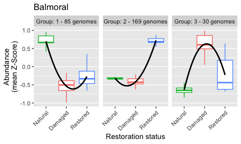
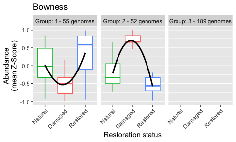
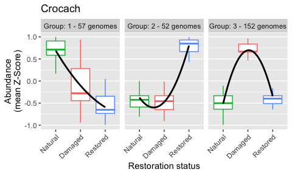
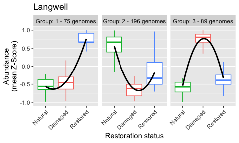
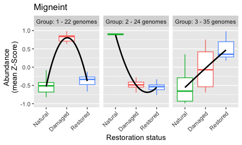
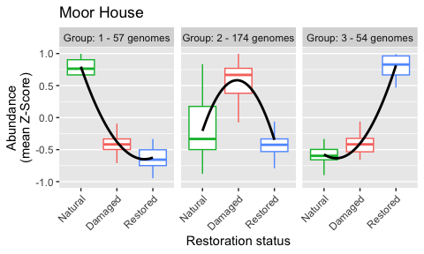
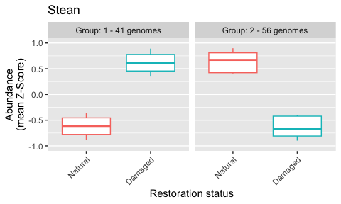
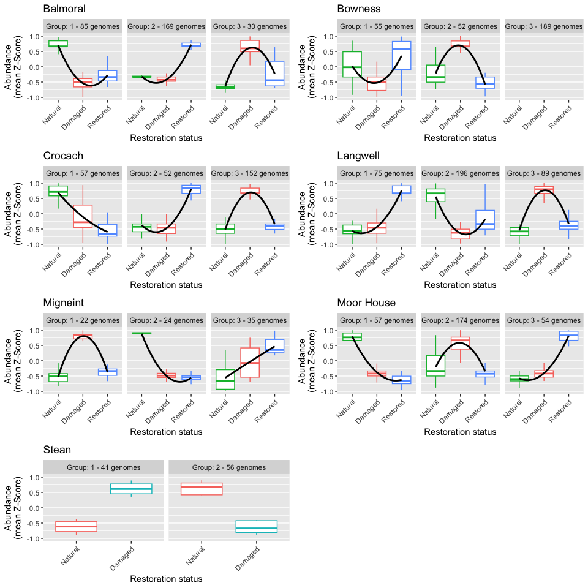

# Load and format data

## Metadata

    metadata <- read.csv("./metadata.tsv", sep = "\t") %>%
      filter(
        !sample %in% c("LASYr2D", "LASYr2E", "LASYr2F", "LAWAr2D", "LAWAr2E", "LAWAr2F")
      )
    row.names(metadata) <- metadata$sample

## Contig to genome table

    contig2genome <- read.csv("./contig_to_genome.tsv", header=FALSE, sep="\t")
    colnames(contig2genome) <- c("contig", "Genome")
    contig2genome$Genome <- gsub(".fasta", "", contig2genome$Genome)
    head(contig2genome)

    ##                   contig             Genome
    ## 1 BAr1A1B1C_000000006168 BAr1A1B1C__bin_100
    ## 2 BAr1A1B1C_000000006972 BAr1A1B1C__bin_100
    ## 3 BAr1A1B1C_000000007187 BAr1A1B1C__bin_100
    ## 4 BAr1A1B1C_000000007759 BAr1A1B1C__bin_100
    ## 5 BAr1A1B1C_000000007985 BAr1A1B1C__bin_100
    ## 6 BAr1A1B1C_000000012567 BAr1A1B1C__bin_100

## Genome counts

    genome_counts <- read.csv("./genome_counts.tsv", sep = "\t", header = TRUE, row.names = 1)
    colnames(genome_counts) <- sub(".filtered.Read.Count", "", colnames(genome_counts))
    genome_counts <- genome_counts %>% select(-contains(".filtered"))
    genome_counts <- genome_counts[, !(colnames(genome_counts) %in% c("LASYr2D", "LASYr2E", "LASYr2F", "LAWAr2D", "LAWAr2E", "LAWAr2F"))] # remove extra Langwell restored replicates
    head(genome_counts)

    ##                    BAr1A BAr1B  BAr1C  BAr2D BAr2E BAr2F BAr3G BAr3H BAr3I
    ## CRr3G3H3I__bin_97  10209 12759  16148  32489 33730 48124 43342 58656 46712
    ## MGr2D2E2F__bin_102   527  3498    766    574   510   586   411   897   547
    ## MGr2D2E2F__bin_107   612   317    378     77   134    51    43    49    49
    ## BOr1A1B1C__bin_57  11179  4944  17657 157074  6743 14416  9535 28454 16906
    ## CRr2D2E2F__bin_21  51818 79789 187539  14057 60117 83826  3445 26948 10992
    ## SEr2D2E2F__bin_42   2688  7226   3805   1401  1748  2800   569   820   626
    ##                    BOr1A  BOr1B  BOr1C  BOr2D BOr2E  BOr2F  BOr3G  BOr3H  BOr3I
    ## CRr3G3H3I__bin_97  28005  38878  37509  32549 28547  29310  40073  49567  46153
    ## MGr2D2E2F__bin_102  4445   4663  12778  23270 29801  18214    461    339    435
    ## MGr2D2E2F__bin_107   164     51     90    125   119     72     43     24     31
    ## BOr1A1B1C__bin_57  81756 234499 481075 100674 42814 300177 258956 510260 519790
    ## CRr2D2E2F__bin_21  90458 109478 128718 140736 58127  95293  31754  48668 105770
    ## SEr2D2E2F__bin_42   5570   3744   5156   3405  5934   4038   2353   4018   2416
    ##                      CRr1A   CRr1B   CRr1C  CRr2D  CRr2E  CRr2F  CRr3G   CRr3H
    ## CRr3G3H3I__bin_97    21608  126451  163406  13160  12412  66022 319814  443281
    ## MGr2D2E2F__bin_102    2718    7056    3185   2675   3848   1955   5329    3867
    ## MGr2D2E2F__bin_107     178     212     222    460    414    209    295     160
    ## BOr1A1B1C__bin_57    77892    8181   19076   2618  39294  46472   2089   33619
    ## CRr2D2E2F__bin_21  1916143 1395796 1064746 199826 167383 393051 375828 1006370
    ## SEr2D2E2F__bin_42     4367    7005    4862   7762  30447  36430   5556    4171
    ##                      CRr3I LABRr1A LABRr1B LABRr1C LASAr3G LASAr3H LASAr3I
    ## CRr3G3H3I__bin_97   601693   11469   11914   10574   11372   19263   22211
    ## MGr2D2E2F__bin_102   20829  138417   55568   18398     853   10914     957
    ## MGr2D2E2F__bin_107     189   10819    8206     920     106      80      42
    ## BOr1A1B1C__bin_57    65959     391     341    2367    6822    1220   14088
    ## CRr2D2E2F__bin_21  1092743   13017   12378   14648  112113   54744   34938
    ## SEr2D2E2F__bin_42     8952    1438    1292     789    2789    4602     945
    ##                    LASCr2D LASCr2E LASCr2F  MGr1A  MGr1B  MGr1C  MGr2D  MGr2E
    ## CRr3G3H3I__bin_97     2941   19804    3949  45871  79649  60886  16719  57103
    ## MGr2D2E2F__bin_102   66326   25448   20966  87344  44044  20480 151068  80904
    ## MGr2D2E2F__bin_107     686     440     482 418544  12866    499 526929 166118
    ## BOr1A1B1C__bin_57     1272  193454    2922    334    317    780   5184    227
    ## CRr2D2E2F__bin_21   111841  100292  102436  65737 219225 104000  30016  13377
    ## SEr2D2E2F__bin_42    10059   10635    6069  12126   7646   4786  16218  39077
    ##                    MGr2F  MGr3G  MGr3H  MGr3I   MHr1A   MHr1B  MHr1C MHr2D
    ## CRr3G3H3I__bin_97  60834  89147  76697   5667   31509  153521 130518 26026
    ## MGr2D2E2F__bin_102 58057  25896 143684  67940    2728    5610   3254  1355
    ## MGr2D2E2F__bin_107 37744    168  25779    931     180     172    231   108
    ## BOr1A1B1C__bin_57   1140    565  10008   2115   82236   12062  12554   532
    ## CRr2D2E2F__bin_21  31381 143907 284723  19925 1387919 1363733 950724 14394
    ## SEr2D2E2F__bin_42  45652  23083 177671 136755    4066    6831   4981 23899
    ##                    MHr2E MHr2F  MHr3G MHr3H  MHr3I  SEr2D  SEr2E  SEr2F  SEr3G
    ## CRr3G3H3I__bin_97  69457 52563  23992  6577 543723  19889  13191  10193   5297
    ## MGr2D2E2F__bin_102   611   325   1010 23904  19886   1623   2558   1905   3186
    ## MGr2D2E2F__bin_107   130    65     98   293    285    179    116     87    285
    ## BOr1A1B1C__bin_57   6575  4951  39733  4704  44636  94399   3707  14933  67852
    ## CRr2D2E2F__bin_21  52408 19746 205905 27387 937060 160758  71143 496164 186202
    ## SEr2D2E2F__bin_42   4097   903   1313  5172  10692 170923 124303  86564  44102
    ##                     SEr3H  SEr3I
    ## CRr3G3H3I__bin_97    1809  25353
    ## MGr2D2E2F__bin_102   2835  66487
    ## MGr2D2E2F__bin_107    284   2772
    ## BOr1A1B1C__bin_57    3050  14664
    ## CRr2D2E2F__bin_21  123321  94989
    ## SEr2D2E2F__bin_42   25785 112737

## Trimmed mean genome coverage

    tmeans <- read.csv("./genome_trimmed_mean_cov.tsv", sep = "\t", header = TRUE, row.names = 1)
    colnames(tmeans) <-  sub(".filtered.Trimmed.Mean", "", colnames(tmeans))
    tmeans <- tmeans %>% select(-contains(".filtered"))
    tmeans <- tmeans[, !(colnames(tmeans) %in% c("LASYr2D", "LASYr2E", "LASYr2F", "LAWAr2D", "LAWAr2E", "LAWAr2F"))] # remove extra Langwell restored replicates
    head(tmeans)

    ##                        BAr1A      BAr1B      BAr1C      BAr2D      BAr2E
    ## CRr3G3H3I__bin_97  0.0000000 0.00000000 0.04159392 0.09140381 0.05801507
    ## MGr2D2E2F__bin_102 0.0000000 0.08970084 0.00000000 0.00000000 0.00000000
    ## MGr2D2E2F__bin_107 0.0000000 0.00000000 0.00000000 0.00000000 0.00000000
    ## BOr1A1B1C__bin_57  0.2938575 0.09777822 0.59626530 5.84007600 0.13314608
    ## CRr2D2E2F__bin_21  1.3489698 2.02902300 5.96384140 0.21155033 1.10930720
    ## SEr2D2E2F__bin_42  0.0000000 0.20063858 0.05316389 0.00000000 0.00000000
    ##                          BAr2F     BAr3G     BAr3H     BAr3I      BOr1A
    ## CRr3G3H3I__bin_97  0.076773900 0.1745691 0.4286790 0.1728462 0.02047414
    ## MGr2D2E2F__bin_102 0.000000000 0.0000000 0.0000000 0.0000000 0.19383805
    ## MGr2D2E2F__bin_107 0.000000000 0.0000000 0.0000000 0.0000000 0.00000000
    ## BOr1A1B1C__bin_57  0.391337840 0.2508757 0.9634436 0.5370316 3.53836680
    ## CRr2D2E2F__bin_21  1.950417300 0.0000000 0.6114137 0.1393521 2.45227270
    ## SEr2D2E2F__bin_42  0.003746511 0.0000000 0.0000000 0.0000000 0.11329823
    ##                          BOr1B       BOr1C      BOr2D      BOr2E       BOr2F
    ## CRr3G3H3I__bin_97   0.02419298  0.04044275 0.01676833 0.00000000  0.01310886
    ## MGr2D2E2F__bin_102  0.20925352  0.75555050 1.48243220 1.94876490  1.08015510
    ## MGr2D2E2F__bin_107  0.00000000  0.00000000 0.00000000 0.00000000  0.00000000
    ## BOr1A1B1C__bin_57  10.48776150 22.09255200 4.41022970 1.76372970 13.16904800
    ## CRr2D2E2F__bin_21   2.93048360  3.53684260 3.94354750 1.49667420  2.47623560
    ## SEr2D2E2F__bin_42   0.02120573  0.07682487 0.02579297 0.08044376  0.03043835
    ##                          BOr3G       BOr3H       BOr3I       CRr1A      CRr1B
    ## CRr3G3H3I__bin_97   0.09396218  0.12504318  0.07635172  0.24628772  2.5893207
    ## MGr2D2E2F__bin_102  0.00000000  0.00000000  0.00000000  0.00000000  0.1574958
    ## MGr2D2E2F__bin_107  0.00000000  0.00000000  0.00000000  0.00000000  0.0000000
    ## BOr1A1B1C__bin_57  11.75666600 23.94035700 24.02790600  3.41324200  0.2566347
    ## CRr2D2E2F__bin_21   0.53344125  1.03728080  2.86537600 60.09852200 43.7575230
    ## SEr2D2E2F__bin_42   0.00000000  0.03412416  0.00000000  0.03127359  0.1156215
    ##                           CRr1C      CRr2D      CRr2E      CRr2F        CRr3G
    ## CRr3G3H3I__bin_97   3.517527800 0.07735442 0.01862040  0.9144765  6.832873300
    ## MGr2D2E2F__bin_102  0.001733551 0.00000000 0.06278205  0.0000000  0.094580576
    ## MGr2D2E2F__bin_107  0.000000000 0.00000000 0.00000000  0.0000000  0.000000000
    ## BOr1A1B1C__bin_57   0.719588500 0.02950514 1.64509690  1.9848795  0.007098831
    ## CRr2D2E2F__bin_21  33.665253000 5.47219100 4.07080900 11.7379360 10.590194000
    ## SEr2D2E2F__bin_42   0.047645237 0.21488738 1.15893950  1.4601696  0.090516740
    ##                           CRr3H      CRr3I    LABRr1A   LABRr1B    LABRr1C
    ## CRr3G3H3I__bin_97   9.736143000 13.3382090  0.0000000 0.0000000 0.00000000
    ## MGr2D2E2F__bin_102  0.005439222  1.1797982 10.1692560 3.9876344 1.19582590
    ## MGr2D2E2F__bin_107  0.000000000  0.0000000  0.1757442 0.1290612 0.00000000
    ## BOr1A1B1C__bin_57   1.298006900  2.8551393  0.0000000 0.0000000 0.02006921
    ## CRr2D2E2F__bin_21  30.660522000 33.4183350  0.2293265 0.2373512 0.28466463
    ## SEr2D2E2F__bin_42   0.027754536  0.1554965  0.0000000 0.0000000 0.00000000
    ##                       LASAr3G      LASAr3H     LASAr3I   LASCr2D   LASCr2E
    ## CRr3G3H3I__bin_97  0.00000000 0.0001300578 0.006282962 0.0000000 0.0336550
    ## MGr2D2E2F__bin_102 0.00000000 0.5971367000 0.000000000 4.7111998 1.6820074
    ## MGr2D2E2F__bin_107 0.00000000 0.0000000000 0.000000000 0.0000000 0.0000000
    ## BOr1A1B1C__bin_57  0.16279325 0.0000000000 0.532026900 0.0000000 9.0902290
    ## CRr2D2E2F__bin_21  2.75222660 1.0304362000 0.526320100 3.0235236 2.6696198
    ## SEr2D2E2F__bin_42  0.02277528 0.0586430500 0.000000000 0.3169128 0.3239092
    ##                       LASCr2F      MGr1A     MGr1B     MGr1C       MGr2D
    ## CRr3G3H3I__bin_97  0.00000000  0.1518996 0.8785822 0.4793107  0.01225297
    ## MGr2D2E2F__bin_102 1.35975940  6.1014676 2.7711022 1.1196126 11.08159200
    ## MGr2D2E2F__bin_107 0.00000000 14.1929660 0.3093565 0.0000000 17.97301900
    ## BOr1A1B1C__bin_57  0.03491909  0.0000000 0.0000000 0.0000000  0.13084045
    ## CRr2D2E2F__bin_21  2.94784570  1.7831537 6.4404664 2.7897463  0.73306330
    ## SEr2D2E2F__bin_42  0.15722182  0.3053606 0.1063998 0.0478833  0.53115326
    ##                         MGr2E      MGr2F     MGr3G     MGr3H       MGr3I
    ## CRr3G3H3I__bin_97  0.04544300 0.06576606 0.1202917 0.1032584 0.000000000
    ## MGr2D2E2F__bin_102 5.79091550 4.18148500 1.5684347 8.7387360 4.681300600
    ## MGr2D2E2F__bin_107 5.42454340 1.13515370 0.0000000 0.5566205 0.000000000
    ## BOr1A1B1C__bin_57  0.00000000 0.00000000 0.0000000 0.2601484 0.008936496
    ## CRr2D2E2F__bin_21  0.07471212 0.65482580 3.8547895 6.9317856 0.273533250
    ## SEr2D2E2F__bin_42  1.50692030 1.83016770 0.7556792 6.1356173 5.784804000
    ##                         MHr1A       MHr1B        MHr1C      MHr2D      MHr2E
    ## CRr3G3H3I__bin_97   0.3653310  3.15488770  2.682882800 0.00000000 0.03851254
    ## MGr2D2E2F__bin_102  0.0000000  0.09526601  0.001092325 0.01540881 0.00000000
    ## MGr2D2E2F__bin_107  0.0000000  0.00000000  0.000000000 0.00000000 0.00000000
    ## BOr1A1B1C__bin_57   3.5640695  0.40650558  0.420145450 0.00000000 0.10039095
    ## CRr2D2E2F__bin_21  42.9494820 42.37871600 29.172752000 0.16562708 1.04367570
    ## SEr2D2E2F__bin_42   0.0242311  0.09135710  0.041844270 0.94033300 0.02496504
    ##                         MHr2F   MHr3G     MHr3H     MHr3I      SEr2D      SEr2E
    ## CRr3G3H3I__bin_97  0.01391153 0.00000 0.0000000 11.933261 0.04300018 0.00000000
    ## MGr2D2E2F__bin_102 0.00000000 0.00000 1.4242715  1.067121 0.00000000 0.00000000
    ## MGr2D2E2F__bin_107 0.00000000 0.00000 0.0000000  0.000000 0.00000000 0.00000000
    ## BOr1A1B1C__bin_57  0.07705295 1.67641 0.0798580  1.875822 4.23549900 0.05444433
    ## CRr2D2E2F__bin_21  0.27581254 6.16882 0.6068039 28.308372 4.57841060 1.48839310
    ## SEr2D2E2F__bin_42  0.00000000 0.00000 0.1094223  0.202335 7.32135400 5.45638700
    ##                         SEr2F     SEr3G      SEr3H       SEr3I
    ## CRr3G3H3I__bin_97   0.0000000 0.0000000 0.00000000 0.004010393
    ## MGr2D2E2F__bin_102  0.0000000 0.0000000 0.00000000 2.754094400
    ## MGr2D2E2F__bin_107  0.0000000 0.0000000 0.00000000 0.000000000
    ## BOr1A1B1C__bin_57   0.5348124 2.9344602 0.01123636 0.358333170
    ## CRr2D2E2F__bin_21  15.3856260 4.5591280 2.10742380 2.029838600
    ## SEr2D2E2F__bin_42   3.7175370 0.6761632 0.29197374 1.642770400

## Genome coverage

    coverage <- read.csv("./genome_covered_fraction.tsv", sep = "\t", header = TRUE, row.names = 1)
    colnames(coverage) <-  sub(".filtered.Covered.Fraction", "", colnames(coverage))
    coverage <- coverage %>% select(-contains(".filtered"))
    coverage <- coverage[, !(colnames(coverage) %in% c("LASYr2D", "LASYr2E", "LASYr2F", "LAWAr2D", "LAWAr2E", "LAWAr2F"))] # remove extra Langwell restored replicates
    head(coverage)

    ##                          BAr1A       BAr1B       BAr1C        BAr2D       BAr2E
    ## CRr3G3H3I__bin_97  0.045524586 0.047571886 0.087638330 0.0999286200 0.086341440
    ## MGr2D2E2F__bin_102 0.012250610 0.118602745 0.025969906 0.0146554190 0.012011249
    ## MGr2D2E2F__bin_107 0.003162913 0.003615655 0.003383756 0.0003768662 0.001044673
    ## BOr1A1B1C__bin_57  0.214380220 0.121573500 0.340614230 0.7702551500 0.134466040
    ## CRr2D2E2F__bin_21  0.612089750 0.743531500 0.946627800 0.1848667900 0.522714000
    ## SEr2D2E2F__bin_42  0.047422152 0.186751100 0.097332280 0.0236088610 0.024242654
    ##                           BAr2F        BAr3G        BAr3H       BAr3I
    ## CRr3G3H3I__bin_97  0.0958619340 0.1240396500 0.2587587500 0.123871790
    ## MGr2D2E2F__bin_102 0.0171007420 0.0104865860 0.0321138700 0.012886597
    ## MGr2D2E2F__bin_107 0.0004906799 0.0002487317 0.0004572644 0.000245968
    ## BOr1A1B1C__bin_57  0.2352555200 0.1999385700 0.3729518400 0.293163300
    ## CRr2D2E2F__bin_21  0.7138021600 0.0393238700 0.3829574000 0.148597260
    ## SEr2D2E2F__bin_42  0.0531780460 0.0050788056 0.0093587790 0.005786818
    ##                         BOr1A        BOr1B       BOr1C       BOr2D       BOr2E
    ## CRr3G3H3I__bin_97  0.06728035 0.0687499200 0.077618060 0.064816210 0.049883116
    ## MGr2D2E2F__bin_102 0.17793344 0.1865366000 0.422828350 0.579676150 0.657357160
    ## MGr2D2E2F__bin_107 0.00184765 0.0003519931 0.000944678 0.001264009 0.001533594
    ## BOr1A1B1C__bin_57  0.87544080 0.9871101400 0.996909860 0.917300160 0.683777700
    ## CRr2D2E2F__bin_21  0.77364210 0.8174296600 0.855403400 0.876000640 0.630108830
    ## SEr2D2E2F__bin_42  0.13345976 0.0689379050 0.111234050 0.072968856 0.111903000
    ##                           BOr2F        BOr3G        BOr3H        BOr3I
    ## CRr3G3H3I__bin_97  0.0621577760 0.1005106640 0.1097850050 0.0941664950
    ## MGr2D2E2F__bin_102 0.4938115200 0.0160302800 0.0110042240 0.0117020510
    ## MGr2D2E2F__bin_107 0.0008444316 0.0004042519 0.0001947142 0.0001899406
    ## BOr1A1B1C__bin_57  0.9880021000 0.9881159700 0.9957737000 0.9950458000
    ## CRr2D2E2F__bin_21  0.7656233000 0.3421924400 0.5189516500 0.8098859000
    ## SEr2D2E2F__bin_42  0.0771287100 0.0379839470 0.0803256600 0.0379891540
    ##                         CRr1A       CRr1B       CRr1C       CRr2D       CRr2E
    ## CRr3G3H3I__bin_97  0.20826764 0.823256730 0.899214900 0.108577870 0.066973700
    ## MGr2D2E2F__bin_102 0.02982528 0.157775370 0.050827768 0.045330454 0.098894620
    ## MGr2D2E2F__bin_107 0.00181348 0.002475006 0.002334058 0.002789815 0.002452143
    ## BOr1A1B1C__bin_57  0.84390380 0.214952510 0.418467970 0.075448030 0.665222900
    ## CRr2D2E2F__bin_21  0.96648276 0.981800100 0.979778600 0.962769570 0.912501800
    ## SEr2D2E2F__bin_42  0.07794935 0.135654760 0.092389870 0.194944170 0.566815500
    ##                          CRr2F       CRr3G       CRr3H       CRr3I     LABRr1A
    ## CRr3G3H3I__bin_97  0.473228960 0.979414460 0.991840240 0.995055260 0.031266283
    ## MGr2D2E2F__bin_102 0.039102796 0.116732635 0.054335560 0.532874350 0.947785100
    ## MGr2D2E2F__bin_107 0.002427772 0.002090854 0.001414505 0.002059448 0.158991070
    ## BOr1A1B1C__bin_57  0.718789100 0.055640176 0.546916370 0.810526400 0.008414254
    ## CRr2D2E2F__bin_21  0.993431030 0.973620700 0.985993000 0.987524450 0.199227680
    ## SEr2D2E2F__bin_42  0.642681500 0.116685260 0.075014435 0.151767820 0.028329268
    ##                        LABRr1B    LABRr1C     LASAr3G     LASAr3H      LASAr3I
    ## CRr3G3H3I__bin_97  0.032561180 0.03440355 0.048518416 0.050474137 0.0558775920
    ## MGr2D2E2F__bin_102 0.884760000 0.57393680 0.023806592 0.366737840 0.0345682580
    ## MGr2D2E2F__bin_107 0.137995350 0.01553317 0.001045427 0.000839658 0.0006489637
    ## BOr1A1B1C__bin_57  0.009071427 0.06687815 0.153589430 0.026792223 0.3616138400
    ## CRr2D2E2F__bin_21  0.207703680 0.23123607 0.812635800 0.496212930 0.3390659000
    ## SEr2D2E2F__bin_42  0.026546380 0.01527027 0.070017340 0.100231060 0.0157803650
    ##                        LASCr2D     LASCr2E     LASCr2F       MGr1A       MGr1B
    ## CRr3G3H3I__bin_97  0.022826780 0.076705106 0.026413959 0.147560830 0.458620970
    ## MGr2D2E2F__bin_102 0.894301400 0.664986850 0.605168400 0.944673400 0.800404600
    ## MGr2D2E2F__bin_107 0.003600077 0.003028748 0.003290042 0.998656100 0.241049680
    ## BOr1A1B1C__bin_57  0.032603044 0.982796250 0.080239914 0.008486337 0.007491313
    ## CRr2D2E2F__bin_21  0.828518030 0.808655700 0.829042100 0.702160300 0.945180200
    ## SEr2D2E2F__bin_42  0.251258000 0.253983600 0.159169230 0.245542780 0.131764770
    ##                          MGr1C      MGr2D       MGr2E      MGr2F       MGr3G
    ## CRr3G3H3I__bin_97  0.306125370 0.06151623 0.075866610 0.08516921 0.099043250
    ## MGr2D2E2F__bin_102 0.549151960 0.99167730 0.954557060 0.91727906 0.648291300
    ## MGr2D2E2F__bin_107 0.008597324 0.99958870 0.957125960 0.56476295 0.001578567
    ## BOr1A1B1C__bin_57  0.020333324 0.14434318 0.005701011 0.03443848 0.015146330
    ## CRr2D2E2F__bin_21  0.810915470 0.43065155 0.103877430 0.39801782 0.895334500
    ## SEr2D2E2F__bin_42  0.092744360 0.35388260 0.646573400 0.70894560 0.435852170
    ##                         MGr3H      MGr3I       MHr1A       MHr1B       MHr1C
    ## CRr3G3H3I__bin_97  0.09736675 0.03219387 0.271165040 0.870663940 0.832427560
    ## MGr2D2E2F__bin_102 0.97036400 0.92590356 0.023509122 0.119108126 0.050358642
    ## MGr2D2E2F__bin_107 0.31677392 0.00488494 0.001916993 0.002043871 0.002153665
    ## BOr1A1B1C__bin_57  0.18657412 0.05710644 0.845683700 0.291012260 0.295927730
    ## CRr2D2E2F__bin_21  0.93621120 0.21842538 0.965699200 0.980932400 0.978435000
    ## SEr2D2E2F__bin_42  0.90604600 0.91517950 0.071672620 0.118206100 0.087326355
    ##                          MHr2D       MHr2E        MHr2F      MHr3G       MHr3H
    ## CRr3G3H3I__bin_97  0.039640136 0.073201690 0.0629402600 0.05020605 0.032775250
    ## MGr2D2E2F__bin_102 0.062983490 0.016457826 0.0134559460 0.03852012 0.605745200
    ## MGr2D2E2F__bin_107 0.001363502 0.001096178 0.0006861478 0.00122783 0.002503648
    ## BOr1A1B1C__bin_57  0.013741372 0.109723140 0.1057373200 0.66824937 0.109111440
    ## CRr2D2E2F__bin_21  0.162793370 0.401232480 0.2178919500 0.91871154 0.381448800
    ## SEr2D2E2F__bin_42  0.519968570 0.071836690 0.0103229770 0.02738525 0.130095810
    ##                          MHr3I       SEr2D        SEr2E        SEr2F
    ## CRr3G3H3I__bin_97  0.991782550 0.080850065 0.0483803000 0.0474942660
    ## MGr2D2E2F__bin_102 0.502346460 0.033924807 0.0399248340 0.0320296400
    ## MGr2D2E2F__bin_107 0.002054424 0.001361995 0.0007024787 0.0006208243
    ## BOr1A1B1C__bin_57  0.695444460 0.898589730 0.0973341840 0.3554645000
    ## CRr2D2E2F__bin_21  0.987531800 0.912349340 0.6317292000 0.9674262400
    ## SEr2D2E2F__bin_42  0.178642970 0.982868100 0.9641974000 0.9093751300
    ##                          SEr3G       SEr3H      SEr3I
    ## CRr3G3H3I__bin_97  0.029443026 0.013710993 0.05391489
    ## MGr2D2E2F__bin_102 0.023558700 0.018431356 0.77030050
    ## MGr2D2E2F__bin_107 0.001508219 0.001251698 0.02450435
    ## BOr1A1B1C__bin_57  0.827289200 0.059184740 0.24465065
    ## CRr2D2E2F__bin_21  0.790055330 0.537100850 0.67725320
    ## SEr2D2E2F__bin_42  0.164247700 0.134630020 0.23783277

## Pre-filter trimmed means and values to 0 if coverage &lt; 50%

\#But not the genome counts, since DESeq2 requires raw, unfiltered count
matrices

    tmeans[coverage < 0.50] <- 0
    tmeans <- tmeans[rowSums(tmeans>0) > 1,] # Remove singletons
    tmeans <- tmeans[, colSums(tmeans)>0] # Remove singletons
    head(tmeans)

    ##                      BAr1A    BAr1B    BAr1C    BAr2D    BAr2E    BAr2F BAr3G
    ## CRr3G3H3I__bin_97  0.00000 0.000000 0.000000 0.000000 0.000000 0.000000     0
    ## MGr2D2E2F__bin_102 0.00000 0.000000 0.000000 0.000000 0.000000 0.000000     0
    ## MGr2D2E2F__bin_107 0.00000 0.000000 0.000000 0.000000 0.000000 0.000000     0
    ## BOr1A1B1C__bin_57  0.00000 0.000000 0.000000 5.840076 0.000000 0.000000     0
    ## CRr2D2E2F__bin_21  1.34897 2.029023 5.963841 0.000000 1.109307 1.950417     0
    ## SEr2D2E2F__bin_42  0.00000 0.000000 0.000000 0.000000 0.000000 0.000000     0
    ##                    BAr3H BAr3I    BOr1A     BOr1B     BOr1C    BOr2D    BOr2E
    ## CRr3G3H3I__bin_97      0     0 0.000000  0.000000  0.000000 0.000000 0.000000
    ## MGr2D2E2F__bin_102     0     0 0.000000  0.000000  0.000000 1.482432 1.948765
    ## MGr2D2E2F__bin_107     0     0 0.000000  0.000000  0.000000 0.000000 0.000000
    ## BOr1A1B1C__bin_57      0     0 3.538367 10.487761 22.092552 4.410230 1.763730
    ## CRr2D2E2F__bin_21      0     0 2.452273  2.930484  3.536843 3.943548 1.496674
    ## SEr2D2E2F__bin_42      0     0 0.000000  0.000000  0.000000 0.000000 0.000000
    ##                        BOr2F    BOr3G     BOr3H     BOr3I     CRr1A     CRr1B
    ## CRr3G3H3I__bin_97   0.000000  0.00000  0.000000  0.000000  0.000000  2.589321
    ## MGr2D2E2F__bin_102  0.000000  0.00000  0.000000  0.000000  0.000000  0.000000
    ## MGr2D2E2F__bin_107  0.000000  0.00000  0.000000  0.000000  0.000000  0.000000
    ## BOr1A1B1C__bin_57  13.169048 11.75667 23.940357 24.027906  3.413242  0.000000
    ## CRr2D2E2F__bin_21   2.476236  0.00000  1.037281  2.865376 60.098522 43.757523
    ## SEr2D2E2F__bin_42   0.000000  0.00000  0.000000  0.000000  0.000000  0.000000
    ##                        CRr1C    CRr2D    CRr2E    CRr2F     CRr3G     CRr3H
    ## CRr3G3H3I__bin_97   3.517528 0.000000 0.000000  0.00000  6.832873  9.736143
    ## MGr2D2E2F__bin_102  0.000000 0.000000 0.000000  0.00000  0.000000  0.000000
    ## MGr2D2E2F__bin_107  0.000000 0.000000 0.000000  0.00000  0.000000  0.000000
    ## BOr1A1B1C__bin_57   0.000000 0.000000 1.645097  1.98488  0.000000  1.298007
    ## CRr2D2E2F__bin_21  33.665253 5.472191 4.070809 11.73794 10.590194 30.660522
    ## SEr2D2E2F__bin_42   0.000000 0.000000 1.158940  1.46017  0.000000  0.000000
    ##                        CRr3I  LABRr1A  LABRr1B  LABRr1C  LASAr3G LASAr3H
    ## CRr3G3H3I__bin_97  13.338209  0.00000 0.000000 0.000000 0.000000       0
    ## MGr2D2E2F__bin_102  1.179798 10.16926 3.987634 1.195826 0.000000       0
    ## MGr2D2E2F__bin_107  0.000000  0.00000 0.000000 0.000000 0.000000       0
    ## BOr1A1B1C__bin_57   2.855139  0.00000 0.000000 0.000000 0.000000       0
    ## CRr2D2E2F__bin_21  33.418335  0.00000 0.000000 0.000000 2.752227       0
    ## SEr2D2E2F__bin_42   0.000000  0.00000 0.000000 0.000000 0.000000       0
    ##                    LASAr3I  LASCr2D  LASCr2E  LASCr2F     MGr1A    MGr1B
    ## CRr3G3H3I__bin_97        0 0.000000 0.000000 0.000000  0.000000 0.000000
    ## MGr2D2E2F__bin_102       0 4.711200 1.682007 1.359759  6.101468 2.771102
    ## MGr2D2E2F__bin_107       0 0.000000 0.000000 0.000000 14.192966 0.000000
    ## BOr1A1B1C__bin_57        0 0.000000 9.090229 0.000000  0.000000 0.000000
    ## CRr2D2E2F__bin_21        0 3.023524 2.669620 2.947846  1.783154 6.440466
    ## SEr2D2E2F__bin_42        0 0.000000 0.000000 0.000000  0.000000 0.000000
    ##                       MGr1C    MGr2D    MGr2E    MGr2F    MGr3G    MGr3H
    ## CRr3G3H3I__bin_97  0.000000  0.00000 0.000000 0.000000 0.000000 0.000000
    ## MGr2D2E2F__bin_102 1.119613 11.08159 5.790915 4.181485 1.568435 8.738736
    ## MGr2D2E2F__bin_107 0.000000 17.97302 5.424543 1.135154 0.000000 0.000000
    ## BOr1A1B1C__bin_57  0.000000  0.00000 0.000000 0.000000 0.000000 0.000000
    ## CRr2D2E2F__bin_21  2.789746  0.00000 0.000000 0.000000 3.854789 6.931786
    ## SEr2D2E2F__bin_42  0.000000  0.00000 1.506920 1.830168 0.000000 6.135617
    ##                       MGr3I    MHr1A     MHr1B     MHr1C    MHr2D MHr2E MHr2F
    ## CRr3G3H3I__bin_97  0.000000  0.00000  3.154888  2.682883 0.000000     0     0
    ## MGr2D2E2F__bin_102 4.681301  0.00000  0.000000  0.000000 0.000000     0     0
    ## MGr2D2E2F__bin_107 0.000000  0.00000  0.000000  0.000000 0.000000     0     0
    ## BOr1A1B1C__bin_57  0.000000  3.56407  0.000000  0.000000 0.000000     0     0
    ## CRr2D2E2F__bin_21  0.000000 42.94948 42.378716 29.172752 0.000000     0     0
    ## SEr2D2E2F__bin_42  5.784804  0.00000  0.000000  0.000000 0.940333     0     0
    ##                      MHr3G    MHr3H     MHr3I    SEr2D    SEr2E     SEr2F
    ## CRr3G3H3I__bin_97  0.00000 0.000000 11.933261 0.000000 0.000000  0.000000
    ## MGr2D2E2F__bin_102 0.00000 1.424271  1.067121 0.000000 0.000000  0.000000
    ## MGr2D2E2F__bin_107 0.00000 0.000000  0.000000 0.000000 0.000000  0.000000
    ## BOr1A1B1C__bin_57  1.67641 0.000000  1.875822 4.235499 0.000000  0.000000
    ## CRr2D2E2F__bin_21  6.16882 0.000000 28.308372 4.578411 1.488393 15.385626
    ## SEr2D2E2F__bin_42  0.00000 0.000000  0.000000 7.321354 5.456387  3.717537
    ##                       SEr3G    SEr3H    SEr3I
    ## CRr3G3H3I__bin_97  0.000000 0.000000 0.000000
    ## MGr2D2E2F__bin_102 0.000000 0.000000 2.754094
    ## MGr2D2E2F__bin_107 0.000000 0.000000 0.000000
    ## BOr1A1B1C__bin_57  2.934460 0.000000 0.000000
    ## CRr2D2E2F__bin_21  4.559128 2.107424 2.029839
    ## SEr2D2E2F__bin_42  0.000000 0.000000 0.000000

## And normalize trimmed means by the sequencing depth per sample (per 100M reads)

    seqdepth <- read_csv(file="./seq_depth.csv", show_col_types = FALSE)
    seqdepth_R1 <- subset(seqdepth, Pair=="R1")
    tmeans_norm <- tmeans
    for(col in colnames(tmeans_norm)) {
      tmeans_norm[[col]] <- tmeans_norm[[col]] / seqdepth_R1$Hundred.Millions.Reads[seqdepth_R1$Sample == col]
    }
    head(tmeans_norm)

    ##                       BAr1A    BAr1B    BAr1C   BAr2D    BAr2E    BAr2F BAr3G
    ## CRr3G3H3I__bin_97  0.000000 0.000000  0.00000  0.0000 0.000000 0.000000     0
    ## MGr2D2E2F__bin_102 0.000000 0.000000  0.00000  0.0000 0.000000 0.000000     0
    ## MGr2D2E2F__bin_107 0.000000 0.000000  0.00000  0.0000 0.000000 0.000000     0
    ## BOr1A1B1C__bin_57  0.000000 0.000000  0.00000 15.2412 0.000000 0.000000     0
    ## CRr2D2E2F__bin_21  4.612914 7.078385 13.16384  0.0000 2.988147 5.575596     0
    ## SEr2D2E2F__bin_42  0.000000 0.000000  0.00000  0.0000 0.000000 0.000000     0
    ##                    BAr3H BAr3I    BOr1A    BOr1B    BOr1C     BOr2D    BOr2E
    ## CRr3G3H3I__bin_97      0     0  0.00000  0.00000  0.00000  0.000000 0.000000
    ## MGr2D2E2F__bin_102     0     0  0.00000  0.00000  0.00000  4.310709 7.160779
    ## MGr2D2E2F__bin_107     0     0  0.00000  0.00000  0.00000  0.000000 0.000000
    ## BOr1A1B1C__bin_57      0     0 11.81465 37.25809 66.07288 12.824341 6.480863
    ## CRr2D2E2F__bin_21      0     0  8.18817 10.41063 10.57775 11.467294 5.499562
    ## SEr2D2E2F__bin_42      0     0  0.00000  0.00000  0.00000  0.000000 0.000000
    ##                        BOr2F    BOr3G     BOr3H     BOr3I     CRr1A      CRr1B
    ## CRr3G3H3I__bin_97   0.000000  0.00000  0.000000  0.000000   0.00000   7.833139
    ## MGr2D2E2F__bin_102  0.000000  0.00000  0.000000  0.000000   0.00000   0.000000
    ## MGr2D2E2F__bin_107  0.000000  0.00000  0.000000  0.000000   0.00000   0.000000
    ## BOr1A1B1C__bin_57  46.155480 37.02044 64.690383 67.801818  11.30955   0.000000
    ## CRr2D2E2F__bin_21   8.678824  0.00000  2.802886  8.085503 199.13249 132.374000
    ## SEr2D2E2F__bin_42   0.000000  0.00000  0.000000  0.000000   0.00000   0.000000
    ##                        CRr1C    CRr2D     CRr2E     CRr2F    CRr3G     CRr3H
    ## CRr3G3H3I__bin_97   9.007517  0.00000  0.000000  0.000000 20.11977 26.904450
    ## MGr2D2E2F__bin_102  0.000000  0.00000  0.000000  0.000000  0.00000  0.000000
    ## MGr2D2E2F__bin_107  0.000000  0.00000  0.000000  0.000000  0.00000  0.000000
    ## BOr1A1B1C__bin_57   0.000000  0.00000  4.925223  6.736030  0.00000  3.586858
    ## CRr2D2E2F__bin_21  86.208366 20.11373 12.187514 39.834706 31.18340 84.726002
    ## SEr2D2E2F__bin_42   0.000000  0.00000  3.469726  4.955337  0.00000  0.000000
    ##                        CRr3I  LABRr1A  LABRr1B  LABRr1C  LASAr3G LASAr3H
    ## CRr3G3H3I__bin_97  38.402958  0.00000  0.00000 0.000000 0.000000       0
    ## MGr2D2E2F__bin_102  3.396838 25.25634 11.78801 3.185639 0.000000       0
    ## MGr2D2E2F__bin_107  0.000000  0.00000  0.00000 0.000000 0.000000       0
    ## BOr1A1B1C__bin_57   8.220429  0.00000  0.00000 0.000000 0.000000       0
    ## CRr2D2E2F__bin_21  96.217034  0.00000  0.00000 0.000000 9.982587       0
    ## SEr2D2E2F__bin_42   0.000000  0.00000  0.00000 0.000000 0.000000       0
    ##                    LASAr3I   LASCr2D   LASCr2E  LASCr2F     MGr1A     MGr1B
    ## CRr3G3H3I__bin_97        0  0.000000  0.000000 0.000000  0.000000  0.000000
    ## MGr2D2E2F__bin_102       0 13.679682  3.349885 3.793309 17.207979  6.806855
    ## MGr2D2E2F__bin_107       0  0.000000  0.000000 0.000000 40.028446  0.000000
    ## BOr1A1B1C__bin_57        0  0.000000 18.104094 0.000000  0.000000  0.000000
    ## CRr2D2E2F__bin_21        0  8.779259  5.316813 8.223580  5.029031 15.820174
    ## SEr2D2E2F__bin_42        0  0.000000  0.000000 0.000000  0.000000  0.000000
    ##                       MGr1C    MGr2D     MGr2E    MGr2F    MGr3G     MGr3H
    ## CRr3G3H3I__bin_97  0.000000  0.00000  0.000000  0.00000 0.000000  0.000000
    ## MGr2D2E2F__bin_102 3.654748 30.90347 16.340326 13.93808 3.889692 12.644012
    ## MGr2D2E2F__bin_107 0.000000 50.12174 15.306527  3.78379 0.000000  0.000000
    ## BOr1A1B1C__bin_57  0.000000  0.00000  0.000000  0.00000 0.000000  0.000000
    ## CRr2D2E2F__bin_21  9.106560  0.00000  0.000000  0.00000 9.559815 10.029549
    ## SEr2D2E2F__bin_42  0.000000  0.00000  4.252103  6.10047 0.000000  8.877579
    ##                       MGr3I     MHr1A      MHr1B     MHr1C    MHr2D MHr2E MHr2F
    ## CRr3G3H3I__bin_97   0.00000   0.00000   9.592013  8.899374 0.000000     0     0
    ## MGr2D2E2F__bin_102 13.77003   0.00000   0.000000  0.000000 0.000000     0     0
    ## MGr2D2E2F__bin_107  0.00000   0.00000   0.000000  0.000000 0.000000     0     0
    ## BOr1A1B1C__bin_57   0.00000  12.34039   0.000000  0.000000 0.000000     0     0
    ## CRr2D2E2F__bin_21   0.00000 148.71021 128.846803 96.768756 0.000000     0     0
    ## SEr2D2E2F__bin_42  17.01598   0.00000   0.000000  0.000000 2.992175     0     0
    ##                        MHr3G    MHr3H     MHr3I    SEr2D     SEr2E     SEr2F
    ## CRr3G3H3I__bin_97   0.000000 0.000000 31.457092  0.00000  0.000000  0.000000
    ## MGr2D2E2F__bin_102  0.000000 4.567917  2.813022  0.00000  0.000000  0.000000
    ## MGr2D2E2F__bin_107  0.000000 0.000000  0.000000  0.00000  0.000000  0.000000
    ## BOr1A1B1C__bin_57   5.303785 0.000000  4.944826 10.39344  0.000000  0.000000
    ## CRr2D2E2F__bin_21  19.516759 0.000000 74.623278 11.23490  3.753084 39.400077
    ## SEr2D2E2F__bin_42   0.000000 0.000000  0.000000 17.96577 13.758650  9.520005
    ##                        SEr3G    SEr3H     SEr3I
    ## CRr3G3H3I__bin_97   0.000000 0.000000 0.0000000
    ## MGr2D2E2F__bin_102  0.000000 0.000000 1.3468118
    ## MGr2D2E2F__bin_107  0.000000 0.000000 0.0000000
    ## BOr1A1B1C__bin_57   7.413248 0.000000 0.0000000
    ## CRr2D2E2F__bin_21  11.517602 3.934582 0.9926351
    ## SEr2D2E2F__bin_42   0.000000 0.000000 0.0000000

## MAG GTDB taxonomy

    gtdb <- read_csv(file="./MAGs_gtdb_taxonomy.csv", show_col_types = FALSE)
    head(gtdb)

    ## # A tibble: 6 x 7
    ##   Genome               Domain   Phylum          Class         Order Family Genus
    ##   <chr>                <chr>    <chr>           <chr>         <chr> <chr>  <chr>
    ## 1 SEr3G3H3I__bin_186   Bacteria Patescibacteria Paceibacteria UBA6~ 2-01-~ JAKA~
    ## 2 LAWAr2D2E2F__bin_24  Bacteria Spirochaetota   Spirochaetia  SZUA~ <NA>   <NA> 
    ## 3 MHr3G3H3I__bin_65    Bacteria Spirochaetota   Spirochaetia  SZUA~ <NA>   <NA> 
    ## 4 LASCr2D2E2F__bin_124 Bacteria Spirochaetota   Spirochaetia  SZUA~ <NA>   <NA> 
    ## 5 MGr1A1B1C__bin_111   Bacteria Spirochaetota   Spirochaetia  SZUA~ <NA>   <NA> 
    ## 6 MGr3G3H3I__bin_83    Bacteria Spirochaetota   Spirochaetia  SZUA~ Fen-1~ Fen-~

## Metabolic functions

    metabolic_modules <- read.csv("./METABOLIC_KEGG_module_presence.csv", fileEncoding = "UTF-8-BOM")
    head(metabolic_modules)

    ##   Module.ID                                                           Module
    ## 1    M00015                       Proline biosynthesis, glutamate => proline
    ## 2    M00028                   Ornithine biosynthesis, glutamate => ornithine
    ## 3    M00029                                                       Urea cycle
    ## 4    M00047                                                 Creatine pathway
    ## 5    M00763 Ornithine biosynthesis, mediated by LysW, glutamate => ornithine
    ## 6    M00844                     Arginine biosynthesis, ornithine => arginine
    ##                   Module.Category BAr1A1B1C__bin_10.Module.presence
    ## 1 Arginine and proline metabolism                            Absent
    ## 2 Arginine and proline metabolism                           Present
    ## 3 Arginine and proline metabolism                            Absent
    ## 4 Arginine and proline metabolism                            Absent
    ## 5 Arginine and proline metabolism                           Present
    ## 6 Arginine and proline metabolism                           Present
    ##   BAr1A1B1C__bin_100.Module.presence BAr1A1B1C__bin_103.Module.presence
    ## 1                             Absent                             Absent
    ## 2                            Present                            Present
    ## 3                             Absent                            Present
    ## 4                             Absent                             Absent
    ## 5                             Absent                             Absent
    ## 6                            Present                            Present
    ##   BAr1A1B1C__bin_104.Module.presence BAr1A1B1C__bin_105.Module.presence
    ## 1                             Absent                             Absent
    ## 2                            Present                            Present
    ## 3                            Present                             Absent
    ## 4                             Absent                             Absent
    ## 5                            Present                             Absent
    ## 6                            Present                            Present
    ##   BAr1A1B1C__bin_108.Module.presence BAr1A1B1C__bin_115.Module.presence
    ## 1                            Present                             Absent
    ## 2                            Present                            Present
    ## 3                             Absent                             Absent
    ## 4                             Absent                             Absent
    ## 5                             Absent                             Absent
    ## 6                            Present                            Present
    ##   BAr1A1B1C__bin_116.Module.presence BAr1A1B1C__bin_117.Module.presence
    ## 1                             Absent                            Present
    ## 2                             Absent                             Absent
    ## 3                             Absent                             Absent
    ## 4                             Absent                             Absent
    ## 5                             Absent                            Present
    ## 6                             Absent                             Absent
    ##   BAr1A1B1C__bin_118.Module.presence BAr1A1B1C__bin_12.Module.presence
    ## 1                            Present                            Absent
    ## 2                            Present                           Present
    ## 3                             Absent                            Absent
    ## 4                             Absent                            Absent
    ## 5                            Present                            Absent
    ## 6                            Present                           Present
    ##   BAr1A1B1C__bin_121.Module.presence BAr1A1B1C__bin_122.Module.presence
    ## 1                            Present                            Present
    ## 2                             Absent                            Present
    ## 3                             Absent                             Absent
    ## 4                             Absent                             Absent
    ## 5                             Absent                             Absent
    ## 6                             Absent                            Present
    ##   BAr1A1B1C__bin_124.Module.presence BAr1A1B1C__bin_125.Module.presence
    ## 1                            Present                            Present
    ## 2                            Present                            Present
    ## 3                             Absent                            Present
    ## 4                             Absent                             Absent
    ## 5                             Absent                             Absent
    ## 6                             Absent                            Present
    ##   BAr1A1B1C__bin_127.Module.presence BAr1A1B1C__bin_13.Module.presence
    ## 1                            Present                            Absent
    ## 2                            Present                           Present
    ## 3                             Absent                            Absent
    ## 4                             Absent                            Absent
    ## 5                             Absent                            Absent
    ## 6                            Present                            Absent
    ##   BAr1A1B1C__bin_132.Module.presence BAr1A1B1C__bin_135.Module.presence
    ## 1                             Absent                             Absent
    ## 2                            Present                             Absent
    ## 3                             Absent                             Absent
    ## 4                             Absent                             Absent
    ## 5                             Absent                             Absent
    ## 6                            Present                             Absent
    ##   BAr1A1B1C__bin_136.Module.presence BAr1A1B1C__bin_138.Module.presence
    ## 1                            Present                            Present
    ## 2                            Present                            Present
    ## 3                             Absent                             Absent
    ## 4                             Absent                             Absent
    ## 5                             Absent                             Absent
    ## 6                             Absent                            Present
    ##   BAr1A1B1C__bin_140.Module.presence BAr1A1B1C__bin_143.Module.presence
    ## 1                             Absent                            Present
    ## 2                             Absent                             Absent
    ## 3                             Absent                             Absent
    ## 4                             Absent                             Absent
    ## 5                             Absent                             Absent
    ## 6                            Present                             Absent
    ##   BAr1A1B1C__bin_146.Module.presence BAr1A1B1C__bin_19.Module.presence
    ## 1                             Absent                            Absent
    ## 2                            Present                           Present
    ## 3                            Present                            Absent
    ## 4                             Absent                            Absent
    ## 5                             Absent                            Absent
    ## 6                            Present                           Present
    ##   BAr1A1B1C__bin_20.Module.presence BAr1A1B1C__bin_25.Module.presence
    ## 1                            Absent                           Present
    ## 2                           Present                           Present
    ## 3                            Absent                            Absent
    ## 4                            Absent                            Absent
    ## 5                            Absent                            Absent
    ## 6                           Present                           Present
    ##   BAr1A1B1C__bin_27.Module.presence BAr1A1B1C__bin_31.Module.presence
    ## 1                            Absent                           Present
    ## 2                           Present                           Present
    ## 3                            Absent                            Absent
    ## 4                            Absent                            Absent
    ## 5                            Absent                            Absent
    ## 6                            Absent                           Present
    ##   BAr1A1B1C__bin_32.Module.presence BAr1A1B1C__bin_33.Module.presence
    ## 1                           Present                           Present
    ## 2                           Present                           Present
    ## 3                            Absent                            Absent
    ## 4                            Absent                            Absent
    ## 5                            Absent                            Absent
    ## 6                           Present                           Present
    ##   BAr1A1B1C__bin_41.Module.presence BAr1A1B1C__bin_42.Module.presence
    ## 1                           Present                            Absent
    ## 2                           Present                           Present
    ## 3                            Absent                           Present
    ## 4                            Absent                            Absent
    ## 5                            Absent                           Present
    ## 6                            Absent                           Present
    ##   BAr1A1B1C__bin_43.Module.presence BAr1A1B1C__bin_44.Module.presence
    ## 1                            Absent                            Absent
    ## 2                           Present                           Present
    ## 3                            Absent                            Absent
    ## 4                            Absent                            Absent
    ## 5                            Absent                            Absent
    ## 6                           Present                            Absent
    ##   BAr1A1B1C__bin_47.Module.presence BAr1A1B1C__bin_48.Module.presence
    ## 1                            Absent                           Present
    ## 2                            Absent                            Absent
    ## 3                            Absent                            Absent
    ## 4                            Absent                            Absent
    ## 5                            Absent                            Absent
    ## 6                            Absent                            Absent
    ##   BAr1A1B1C__bin_49.Module.presence BAr1A1B1C__bin_56.Module.presence
    ## 1                            Absent                            Absent
    ## 2                           Present                           Present
    ## 3                            Absent                           Present
    ## 4                            Absent                            Absent
    ## 5                           Present                           Present
    ## 6                            Absent                           Present
    ##   BAr1A1B1C__bin_58.Module.presence BAr1A1B1C__bin_6.Module.presence
    ## 1                           Present                           Absent
    ## 2                           Present                           Absent
    ## 3                            Absent                          Present
    ## 4                            Absent                           Absent
    ## 5                            Absent                           Absent
    ## 6                            Absent                          Present
    ##   BAr1A1B1C__bin_60.Module.presence BAr1A1B1C__bin_61.Module.presence
    ## 1                            Absent                            Absent
    ## 2                           Present                           Present
    ## 3                           Present                            Absent
    ## 4                            Absent                            Absent
    ## 5                           Present                            Absent
    ## 6                           Present                            Absent
    ##   BAr1A1B1C__bin_65.Module.presence BAr1A1B1C__bin_67.Module.presence
    ## 1                           Present                            Absent
    ## 2                           Present                           Present
    ## 3                            Absent                            Absent
    ## 4                            Absent                            Absent
    ## 5                            Absent                           Present
    ## 6                           Present                           Present
    ##   BAr1A1B1C__bin_68.Module.presence BAr1A1B1C__bin_72.Module.presence
    ## 1                           Present                            Absent
    ## 2                           Present                            Absent
    ## 3                            Absent                            Absent
    ## 4                            Absent                            Absent
    ## 5                            Absent                           Present
    ## 6                           Present                            Absent
    ##   BAr1A1B1C__bin_73.Module.presence BAr1A1B1C__bin_78.Module.presence
    ## 1                           Present                            Absent
    ## 2                            Absent                           Present
    ## 3                           Present                            Absent
    ## 4                            Absent                            Absent
    ## 5                            Absent                            Absent
    ## 6                           Present                           Present
    ##   BAr1A1B1C__bin_79.Module.presence BAr1A1B1C__bin_8.Module.presence
    ## 1                            Absent                           Absent
    ## 2                            Absent                           Absent
    ## 3                            Absent                           Absent
    ## 4                            Absent                           Absent
    ## 5                            Absent                           Absent
    ## 6                            Absent                           Absent
    ##   BAr1A1B1C__bin_80.Module.presence BAr1A1B1C__bin_82.Module.presence
    ## 1                            Absent                           Present
    ## 2                            Absent                            Absent
    ## 3                            Absent                            Absent
    ## 4                            Absent                            Absent
    ## 5                           Present                            Absent
    ## 6                           Present                            Absent
    ##   BAr1A1B1C__bin_83.Module.presence BAr1A1B1C__bin_85.Module.presence
    ## 1                           Present                            Absent
    ## 2                           Present                           Present
    ## 3                            Absent                           Present
    ## 4                            Absent                            Absent
    ## 5                            Absent                           Present
    ## 6                            Absent                           Present
    ##   BAr1A1B1C__bin_86.Module.presence BAr1A1B1C__bin_89.Module.presence
    ## 1                            Absent                           Present
    ## 2                           Present                           Present
    ## 3                           Present                            Absent
    ## 4                            Absent                            Absent
    ## 5                            Absent                            Absent
    ## 6                           Present                            Absent
    ##   BAr1A1B1C__bin_92.Module.presence BAr2D2E2F__bin_10.Module.presence
    ## 1                            Absent                            Absent
    ## 2                            Absent                           Present
    ## 3                            Absent                           Present
    ## 4                            Absent                            Absent
    ## 5                           Present                           Present
    ## 6                            Absent                           Present
    ##   BAr2D2E2F__bin_106.Module.presence BAr2D2E2F__bin_109.Module.presence
    ## 1                            Present                             Absent
    ## 2                            Present                            Present
    ## 3                             Absent                             Absent
    ## 4                             Absent                             Absent
    ## 5                             Absent                             Absent
    ## 6                            Present                            Present
    ##   BAr2D2E2F__bin_11.Module.presence BAr2D2E2F__bin_111.Module.presence
    ## 1                           Present                            Present
    ## 2                           Present                            Present
    ## 3                            Absent                             Absent
    ## 4                            Absent                             Absent
    ## 5                            Absent                             Absent
    ## 6                            Absent                            Present
    ##   BAr2D2E2F__bin_124.Module.presence BAr2D2E2F__bin_125.Module.presence
    ## 1                             Absent                             Absent
    ## 2                            Present                            Present
    ## 3                            Present                             Absent
    ## 4                             Absent                             Absent
    ## 5                             Absent                            Present
    ## 6                            Present                            Present
    ##   BAr2D2E2F__bin_126.Module.presence BAr2D2E2F__bin_127.Module.presence
    ## 1                            Present                             Absent
    ## 2                             Absent                             Absent
    ## 3                             Absent                             Absent
    ## 4                             Absent                             Absent
    ## 5                             Absent                             Absent
    ## 6                             Absent                             Absent
    ##   BAr2D2E2F__bin_130.Module.presence BAr2D2E2F__bin_131.Module.presence
    ## 1                             Absent                            Present
    ## 2                            Present                            Present
    ## 3                             Absent                             Absent
    ## 4                             Absent                             Absent
    ## 5                             Absent                             Absent
    ## 6                             Absent                             Absent
    ##   BAr2D2E2F__bin_15.Module.presence BAr2D2E2F__bin_17.Module.presence
    ## 1                            Absent                           Present
    ## 2                           Present                           Present
    ## 3                            Absent                            Absent
    ## 4                            Absent                            Absent
    ## 5                           Present                            Absent
    ## 6                           Present                            Absent
    ##   BAr2D2E2F__bin_18.Module.presence BAr2D2E2F__bin_2.Module.presence
    ## 1                            Absent                           Absent
    ## 2                           Present                           Absent
    ## 3                            Absent                           Absent
    ## 4                            Absent                           Absent
    ## 5                            Absent                           Absent
    ## 6                            Absent                           Absent
    ##   BAr2D2E2F__bin_26.Module.presence BAr2D2E2F__bin_27.Module.presence
    ## 1                           Present                           Present
    ## 2                           Present                            Absent
    ## 3                            Absent                            Absent
    ## 4                            Absent                            Absent
    ## 5                            Absent                            Absent
    ## 6                            Absent                            Absent
    ##   BAr2D2E2F__bin_37.Module.presence BAr2D2E2F__bin_42.Module.presence
    ## 1                           Present                           Present
    ## 2                           Present                           Present
    ## 3                           Present                            Absent
    ## 4                            Absent                            Absent
    ## 5                           Present                            Absent
    ## 6                           Present                           Present
    ##   BAr2D2E2F__bin_44.Module.presence BAr2D2E2F__bin_5.Module.presence
    ## 1                            Absent                           Absent
    ## 2                           Present                           Absent
    ## 3                           Present                           Absent
    ## 4                            Absent                           Absent
    ## 5                            Absent                           Absent
    ## 6                           Present                           Absent
    ##   BAr2D2E2F__bin_51.Module.presence BAr2D2E2F__bin_57.Module.presence
    ## 1                            Absent                            Absent
    ## 2                           Present                           Present
    ## 3                            Absent                            Absent
    ## 4                            Absent                            Absent
    ## 5                            Absent                           Present
    ## 6                            Absent                            Absent
    ##   BAr2D2E2F__bin_7.Module.presence BAr2D2E2F__bin_71.Module.presence
    ## 1                          Present                           Present
    ## 2                          Present                           Present
    ## 3                           Absent                            Absent
    ## 4                           Absent                            Absent
    ## 5                           Absent                            Absent
    ## 6                          Present                            Absent
    ##   BAr2D2E2F__bin_76.Module.presence BAr2D2E2F__bin_78.Module.presence
    ## 1                            Absent                            Absent
    ## 2                           Present                           Present
    ## 3                            Absent                            Absent
    ## 4                            Absent                            Absent
    ## 5                            Absent                            Absent
    ## 6                            Absent                            Absent
    ##   BAr2D2E2F__bin_8.Module.presence BAr2D2E2F__bin_86.Module.presence
    ## 1                           Absent                           Present
    ## 2                          Present                            Absent
    ## 3                           Absent                            Absent
    ## 4                           Absent                            Absent
    ## 5                          Present                            Absent
    ## 6                          Present                            Absent
    ##   BAr2D2E2F__bin_87.Module.presence BAr2D2E2F__bin_94.Module.presence
    ## 1                            Absent                           Present
    ## 2                           Present                            Absent
    ## 3                            Absent                            Absent
    ## 4                            Absent                            Absent
    ## 5                            Absent                            Absent
    ## 6                            Absent                            Absent
    ##   BAr2D2E2F__bin_96.Module.presence BAr3G3H3I__bin_15.Module.presence
    ## 1                           Present                           Present
    ## 2                           Present                           Present
    ## 3                            Absent                            Absent
    ## 4                            Absent                            Absent
    ## 5                            Absent                            Absent
    ## 6                           Present                           Present
    ##   BAr3G3H3I__bin_20.Module.presence BAr3G3H3I__bin_23.Module.presence
    ## 1                            Absent                            Absent
    ## 2                           Present                            Absent
    ## 3                            Absent                            Absent
    ## 4                            Absent                            Absent
    ## 5                            Absent                           Present
    ## 6                            Absent                           Present
    ##   BAr3G3H3I__bin_3.Module.presence BAr3G3H3I__bin_32.Module.presence
    ## 1                          Present                            Absent
    ## 2                          Present                            Absent
    ## 3                           Absent                            Absent
    ## 4                           Absent                            Absent
    ## 5                           Absent                            Absent
    ## 6                          Present                            Absent
    ##   BAr3G3H3I__bin_39.Module.presence BAr3G3H3I__bin_54.Module.presence
    ## 1                            Absent                            Absent
    ## 2                           Present                           Present
    ## 3                            Absent                            Absent
    ## 4                            Absent                            Absent
    ## 5                            Absent                            Absent
    ## 6                           Present                           Present
    ##   BAr3G3H3I__bin_6.Module.presence BAr3G3H3I__bin_68.Module.presence
    ## 1                           Absent                           Present
    ## 2                          Present                            Absent
    ## 3                           Absent                            Absent
    ## 4                           Absent                            Absent
    ## 5                           Absent                            Absent
    ## 6                          Present                            Absent
    ##   BAr3G3H3I__bin_76.Module.presence BAr3G3H3I__bin_79.Module.presence
    ## 1                            Absent                           Present
    ## 2                            Absent                           Present
    ## 3                            Absent                            Absent
    ## 4                            Absent                            Absent
    ## 5                           Present                            Absent
    ## 6                            Absent                           Present
    ##   BAr3G3H3I__bin_8.Module.presence BAr3G3H3I__bin_81.Module.presence
    ## 1                          Present                           Present
    ## 2                           Absent                           Present
    ## 3                           Absent                            Absent
    ## 4                           Absent                            Absent
    ## 5                          Present                            Absent
    ## 6                           Absent                           Present
    ##   BAr3G3H3I__bin_83.Module.presence BAr3G3H3I__bin_85.Module.presence
    ## 1                           Present                            Absent
    ## 2                            Absent                           Present
    ## 3                            Absent                            Absent
    ## 4                            Absent                            Absent
    ## 5                            Absent                            Absent
    ## 6                            Absent                            Absent
    ##   BAr3G3H3I__bin_95.Module.presence BAr3G3H3I__bin_98.Module.presence
    ## 1                            Absent                            Absent
    ## 2                            Absent                            Absent
    ## 3                            Absent                            Absent
    ## 4                            Absent                            Absent
    ## 5                            Absent                            Absent
    ## 6                            Absent                            Absent
    ##   BOr1A1B1C__bin_14.Module.presence BOr1A1B1C__bin_16.Module.presence
    ## 1                            Absent                           Present
    ## 2                            Absent                           Present
    ## 3                           Present                            Absent
    ## 4                            Absent                            Absent
    ## 5                            Absent                            Absent
    ## 6                           Present                           Present
    ##   BOr1A1B1C__bin_18.Module.presence BOr1A1B1C__bin_20.Module.presence
    ## 1                            Absent                           Present
    ## 2                            Absent                           Present
    ## 3                            Absent                            Absent
    ## 4                            Absent                            Absent
    ## 5                           Present                            Absent
    ## 6                           Present                           Present
    ##   BOr1A1B1C__bin_21.Module.presence BOr1A1B1C__bin_27.Module.presence
    ## 1                            Absent                            Absent
    ## 2                           Present                            Absent
    ## 3                            Absent                            Absent
    ## 4                            Absent                            Absent
    ## 5                            Absent                            Absent
    ## 6                           Present                            Absent
    ##   BOr1A1B1C__bin_28.Module.presence BOr1A1B1C__bin_3.Module.presence
    ## 1                            Absent                           Absent
    ## 2                           Present                          Present
    ## 3                            Absent                           Absent
    ## 4                            Absent                           Absent
    ## 5                            Absent                           Absent
    ## 6                           Present                          Present
    ##   BOr1A1B1C__bin_30.Module.presence BOr1A1B1C__bin_33.Module.presence
    ## 1                            Absent                            Absent
    ## 2                            Absent                           Present
    ## 3                            Absent                            Absent
    ## 4                            Absent                            Absent
    ## 5                            Absent                            Absent
    ## 6                            Absent                            Absent
    ##   BOr1A1B1C__bin_39.Module.presence BOr1A1B1C__bin_42.Module.presence
    ## 1                           Present                            Absent
    ## 2                           Present                           Present
    ## 3                            Absent                           Present
    ## 4                            Absent                            Absent
    ## 5                            Absent                           Present
    ## 6                            Absent                           Present
    ##   BOr1A1B1C__bin_44.Module.presence BOr1A1B1C__bin_45.Module.presence
    ## 1                            Absent                           Present
    ## 2                           Present                            Absent
    ## 3                           Present                            Absent
    ## 4                            Absent                            Absent
    ## 5                           Present                            Absent
    ## 6                           Present                            Absent
    ##   BOr1A1B1C__bin_48.Module.presence BOr1A1B1C__bin_57.Module.presence
    ## 1                           Present                            Absent
    ## 2                           Present                            Absent
    ## 3                            Absent                           Present
    ## 4                            Absent                            Absent
    ## 5                            Absent                            Absent
    ## 6                           Present                           Present
    ##   BOr1A1B1C__bin_6.Module.presence BOr1A1B1C__bin_60.Module.presence
    ## 1                          Present                           Present
    ## 2                          Present                           Present
    ## 3                           Absent                            Absent
    ## 4                           Absent                            Absent
    ## 5                           Absent                            Absent
    ## 6                          Present                           Present
    ##   BOr1A1B1C__bin_7.Module.presence BOr1A1B1C__bin_70.Module.presence
    ## 1                           Absent                            Absent
    ## 2                          Present                            Absent
    ## 3                           Absent                            Absent
    ## 4                           Absent                            Absent
    ## 5                           Absent                            Absent
    ## 6                          Present                           Present
    ##   BOr1A1B1C__bin_72.Module.presence BOr1A1B1C__bin_77.Module.presence
    ## 1                           Present                            Absent
    ## 2                            Absent                            Absent
    ## 3                            Absent                            Absent
    ## 4                            Absent                            Absent
    ## 5                            Absent                            Absent
    ## 6                            Absent                           Present
    ##   BOr1A1B1C__bin_78.Module.presence BOr1A1B1C__bin_81.Module.presence
    ## 1                           Present                           Present
    ## 2                           Present                            Absent
    ## 3                            Absent                            Absent
    ## 4                            Absent                            Absent
    ## 5                            Absent                            Absent
    ## 6                           Present                            Absent
    ##   BOr1A1B1C__bin_84.Module.presence BOr1A1B1C__bin_86.Module.presence
    ## 1                            Absent                           Present
    ## 2                           Present                           Present
    ## 3                            Absent                            Absent
    ## 4                            Absent                            Absent
    ## 5                            Absent                            Absent
    ## 6                           Present                            Absent
    ##   BOr1A1B1C__bin_87.Module.presence BOr1A1B1C__bin_91.Module.presence
    ## 1                            Absent                            Absent
    ## 2                           Present                           Present
    ## 3                            Absent                            Absent
    ## 4                            Absent                            Absent
    ## 5                            Absent                            Absent
    ## 6                           Present                            Absent
    ##   BOr2D2E2F__bin_11.Module.presence BOr2D2E2F__bin_15.Module.presence
    ## 1                           Present                            Absent
    ## 2                           Present                            Absent
    ## 3                            Absent                            Absent
    ## 4                            Absent                            Absent
    ## 5                            Absent                            Absent
    ## 6                           Present                            Absent
    ##   BOr2D2E2F__bin_18.Module.presence BOr2D2E2F__bin_19.Module.presence
    ## 1                            Absent                           Present
    ## 2                            Absent                           Present
    ## 3                            Absent                            Absent
    ## 4                            Absent                            Absent
    ## 5                            Absent                            Absent
    ## 6                            Absent                           Present
    ##   BOr2D2E2F__bin_2.Module.presence BOr2D2E2F__bin_20.Module.presence
    ## 1                           Absent                            Absent
    ## 2                           Absent                           Present
    ## 3                           Absent                           Present
    ## 4                           Absent                            Absent
    ## 5                           Absent                           Present
    ## 6                           Absent                           Present
    ##   BOr2D2E2F__bin_22.Module.presence BOr2D2E2F__bin_26.Module.presence
    ## 1                            Absent                           Present
    ## 2                            Absent                            Absent
    ## 3                            Absent                            Absent
    ## 4                            Absent                            Absent
    ## 5                           Present                            Absent
    ## 6                            Absent                            Absent
    ##   BOr2D2E2F__bin_30.Module.presence BOr2D2E2F__bin_32.Module.presence
    ## 1                           Present                            Absent
    ## 2                            Absent                           Present
    ## 3                            Absent                            Absent
    ## 4                            Absent                            Absent
    ## 5                            Absent                            Absent
    ## 6                           Present                           Present
    ##   BOr2D2E2F__bin_33.Module.presence BOr2D2E2F__bin_39.Module.presence
    ## 1                            Absent                           Present
    ## 2                           Present                           Present
    ## 3                           Present                            Absent
    ## 4                            Absent                            Absent
    ## 5                           Present                            Absent
    ## 6                           Present                            Absent
    ##   BOr2D2E2F__bin_44.Module.presence BOr2D2E2F__bin_46.Module.presence
    ## 1                            Absent                           Present
    ## 2                           Present                           Present
    ## 3                            Absent                            Absent
    ## 4                            Absent                            Absent
    ## 5                            Absent                            Absent
    ## 6                           Present                           Present
    ##   BOr2D2E2F__bin_49.Module.presence BOr2D2E2F__bin_51.Module.presence
    ## 1                            Absent                            Absent
    ## 2                           Present                           Present
    ## 3                            Absent                            Absent
    ## 4                            Absent                            Absent
    ## 5                            Absent                            Absent
    ## 6                            Absent                           Present
    ##   BOr2D2E2F__bin_56.Module.presence BOr2D2E2F__bin_61.Module.presence
    ## 1                            Absent                           Present
    ## 2                           Present                           Present
    ## 3                            Absent                           Present
    ## 4                            Absent                            Absent
    ## 5                            Absent                            Absent
    ## 6                            Absent                           Present
    ##   BOr2D2E2F__bin_66.Module.presence BOr2D2E2F__bin_69.Module.presence
    ## 1                           Present                            Absent
    ## 2                           Present                            Absent
    ## 3                            Absent                            Absent
    ## 4                            Absent                            Absent
    ## 5                            Absent                            Absent
    ## 6                            Absent                            Absent
    ##   BOr2D2E2F__bin_7.Module.presence BOr2D2E2F__bin_73.Module.presence
    ## 1                          Present                            Absent
    ## 2                          Present                            Absent
    ## 3                           Absent                            Absent
    ## 4                           Absent                            Absent
    ## 5                           Absent                            Absent
    ## 6                           Absent                            Absent
    ##   BOr2D2E2F__bin_74.Module.presence BOr2D2E2F__bin_82.Module.presence
    ## 1                            Absent                            Absent
    ## 2                           Present                            Absent
    ## 3                            Absent                            Absent
    ## 4                            Absent                            Absent
    ## 5                            Absent                            Absent
    ## 6                           Present                            Absent
    ##   BOr3G3H3I__bin_102.Module.presence BOr3G3H3I__bin_12.Module.presence
    ## 1                            Present                            Absent
    ## 2                            Present                           Present
    ## 3                            Present                            Absent
    ## 4                             Absent                            Absent
    ## 5                             Absent                            Absent
    ## 6                            Present                            Absent
    ##   BOr3G3H3I__bin_14.Module.presence BOr3G3H3I__bin_18.Module.presence
    ## 1                            Absent                           Present
    ## 2                           Present                           Present
    ## 3                            Absent                            Absent
    ## 4                            Absent                            Absent
    ## 5                            Absent                            Absent
    ## 6                            Absent                           Present
    ##   BOr3G3H3I__bin_20.Module.presence BOr3G3H3I__bin_26.Module.presence
    ## 1                            Absent                           Present
    ## 2                           Present                           Present
    ## 3                           Present                            Absent
    ## 4                            Absent                            Absent
    ## 5                           Present                            Absent
    ## 6                           Present                           Present
    ##   BOr3G3H3I__bin_3.Module.presence BOr3G3H3I__bin_31.Module.presence
    ## 1                          Present                            Absent
    ## 2                          Present                           Present
    ## 3                           Absent                            Absent
    ## 4                           Absent                            Absent
    ## 5                           Absent                            Absent
    ## 6                          Present                           Present
    ##   BOr3G3H3I__bin_33.Module.presence BOr3G3H3I__bin_37.Module.presence
    ## 1                           Present                           Present
    ## 2                           Present                           Present
    ## 3                            Absent                            Absent
    ## 4                            Absent                            Absent
    ## 5                            Absent                            Absent
    ## 6                            Absent                           Present
    ##   BOr3G3H3I__bin_38.Module.presence BOr3G3H3I__bin_43.Module.presence
    ## 1                           Present                           Present
    ## 2                            Absent                            Absent
    ## 3                            Absent                            Absent
    ## 4                            Absent                            Absent
    ## 5                            Absent                            Absent
    ## 6                            Absent                            Absent
    ##   BOr3G3H3I__bin_49.Module.presence BOr3G3H3I__bin_5.Module.presence
    ## 1                            Absent                           Absent
    ## 2                           Present                          Present
    ## 3                           Present                           Absent
    ## 4                            Absent                           Absent
    ## 5                           Present                           Absent
    ## 6                           Present                           Absent
    ##   BOr3G3H3I__bin_50.Module.presence BOr3G3H3I__bin_51.Module.presence
    ## 1                           Present                           Present
    ## 2                           Present                           Present
    ## 3                            Absent                            Absent
    ## 4                            Absent                            Absent
    ## 5                            Absent                            Absent
    ## 6                           Present                           Present
    ##   BOr3G3H3I__bin_53.Module.presence BOr3G3H3I__bin_85.Module.presence
    ## 1                           Present                           Present
    ## 2                           Present                           Present
    ## 3                            Absent                            Absent
    ## 4                            Absent                            Absent
    ## 5                            Absent                            Absent
    ## 6                            Absent                           Present
    ##   BOr3G3H3I__bin_91.Module.presence BOr3G3H3I__bin_93.Module.presence
    ## 1                            Absent                           Present
    ## 2                           Present                           Present
    ## 3                           Present                            Absent
    ## 4                            Absent                            Absent
    ## 5                            Absent                            Absent
    ## 6                           Present                           Present
    ##   BOr3G3H3I__bin_96.Module.presence BOr3G3H3I__bin_97.Module.presence
    ## 1                            Absent                            Absent
    ## 2                           Present                           Present
    ## 3                            Absent                            Absent
    ## 4                            Absent                            Absent
    ## 5                            Absent                            Absent
    ## 6                           Present                           Present
    ##   CRr1A1B1C__bin_101.Module.presence CRr1A1B1C__bin_103.Module.presence
    ## 1                             Absent                            Present
    ## 2                            Present                            Present
    ## 3                            Present                             Absent
    ## 4                             Absent                             Absent
    ## 5                            Present                             Absent
    ## 6                            Present                            Present
    ##   CRr1A1B1C__bin_104.Module.presence CRr1A1B1C__bin_108.Module.presence
    ## 1                            Present                             Absent
    ## 2                            Present                             Absent
    ## 3                             Absent                             Absent
    ## 4                             Absent                             Absent
    ## 5                             Absent                             Absent
    ## 6                             Absent                             Absent
    ##   CRr1A1B1C__bin_11.Module.presence CRr1A1B1C__bin_115.Module.presence
    ## 1                           Present                             Absent
    ## 2                           Present                             Absent
    ## 3                            Absent                             Absent
    ## 4                            Absent                             Absent
    ## 5                            Absent                             Absent
    ## 6                           Present                             Absent
    ##   CRr1A1B1C__bin_117.Module.presence CRr1A1B1C__bin_118.Module.presence
    ## 1                             Absent                             Absent
    ## 2                             Absent                            Present
    ## 3                             Absent                            Present
    ## 4                             Absent                             Absent
    ## 5                             Absent                            Present
    ## 6                             Absent                            Present
    ##   CRr1A1B1C__bin_120.Module.presence CRr1A1B1C__bin_124.Module.presence
    ## 1                             Absent                            Present
    ## 2                             Absent                            Present
    ## 3                             Absent                             Absent
    ## 4                             Absent                             Absent
    ## 5                             Absent                             Absent
    ## 6                            Present                             Absent
    ##   CRr1A1B1C__bin_125.Module.presence CRr1A1B1C__bin_126.Module.presence
    ## 1                            Present                             Absent
    ## 2                            Present                            Present
    ## 3                             Absent                             Absent
    ## 4                             Absent                             Absent
    ## 5                             Absent                             Absent
    ## 6                            Present                            Present
    ##   CRr1A1B1C__bin_129.Module.presence CRr1A1B1C__bin_130.Module.presence
    ## 1                            Present                             Absent
    ## 2                            Present                            Present
    ## 3                             Absent                            Present
    ## 4                             Absent                             Absent
    ## 5                             Absent                             Absent
    ## 6                            Present                            Present
    ##   CRr1A1B1C__bin_136.Module.presence CRr1A1B1C__bin_138.Module.presence
    ## 1                             Absent                            Present
    ## 2                            Present                            Present
    ## 3                             Absent                             Absent
    ## 4                             Absent                             Absent
    ## 5                             Absent                             Absent
    ## 6                            Present                            Present
    ##   CRr1A1B1C__bin_16.Module.presence CRr1A1B1C__bin_20.Module.presence
    ## 1                            Absent                            Absent
    ## 2                           Present                           Present
    ## 3                            Absent                            Absent
    ## 4                            Absent                            Absent
    ## 5                            Absent                            Absent
    ## 6                            Absent                           Present
    ##   CRr1A1B1C__bin_23.Module.presence CRr1A1B1C__bin_28.Module.presence
    ## 1                           Present                            Absent
    ## 2                           Present                           Present
    ## 3                            Absent                           Present
    ## 4                            Absent                            Absent
    ## 5                            Absent                           Present
    ## 6                            Absent                           Present
    ##   CRr1A1B1C__bin_29.Module.presence CRr1A1B1C__bin_31.Module.presence
    ## 1                            Absent                            Absent
    ## 2                           Present                            Absent
    ## 3                            Absent                            Absent
    ## 4                            Absent                            Absent
    ## 5                           Present                            Absent
    ## 6                            Absent                           Present
    ##   CRr1A1B1C__bin_33.Module.presence CRr1A1B1C__bin_41.Module.presence
    ## 1                           Present                            Absent
    ## 2                            Absent                            Absent
    ## 3                            Absent                            Absent
    ## 4                            Absent                            Absent
    ## 5                            Absent                            Absent
    ## 6                            Absent                            Absent
    ##   CRr1A1B1C__bin_45.Module.presence CRr1A1B1C__bin_49.Module.presence
    ## 1                           Present                            Absent
    ## 2                           Present                           Present
    ## 3                            Absent                            Absent
    ## 4                            Absent                            Absent
    ## 5                            Absent                            Absent
    ## 6                            Absent                            Absent
    ##   CRr1A1B1C__bin_50.Module.presence CRr1A1B1C__bin_52.Module.presence
    ## 1                            Absent                            Absent
    ## 2                           Present                           Present
    ## 3                            Absent                            Absent
    ## 4                            Absent                            Absent
    ## 5                           Present                           Present
    ## 6                           Present                           Present
    ##   CRr1A1B1C__bin_55.Module.presence CRr1A1B1C__bin_57.Module.presence
    ## 1                            Absent                           Present
    ## 2                           Present                           Present
    ## 3                            Absent                            Absent
    ## 4                            Absent                            Absent
    ## 5                            Absent                            Absent
    ## 6                           Present                           Present
    ##   CRr1A1B1C__bin_61.Module.presence CRr1A1B1C__bin_66.Module.presence
    ## 1                           Present                           Present
    ## 2                           Present                           Present
    ## 3                            Absent                           Present
    ## 4                            Absent                            Absent
    ## 5                            Absent                            Absent
    ## 6                           Present                           Present
    ##   CRr1A1B1C__bin_67.Module.presence CRr1A1B1C__bin_71.Module.presence
    ## 1                           Present                            Absent
    ## 2                            Absent                            Absent
    ## 3                            Absent                            Absent
    ## 4                            Absent                            Absent
    ## 5                            Absent                            Absent
    ## 6                           Present                           Present
    ##   CRr1A1B1C__bin_73.Module.presence CRr1A1B1C__bin_76.Module.presence
    ## 1                           Present                           Present
    ## 2                           Present                           Present
    ## 3                            Absent                            Absent
    ## 4                            Absent                            Absent
    ## 5                            Absent                            Absent
    ## 6                            Absent                           Present
    ##   CRr1A1B1C__bin_77.Module.presence CRr1A1B1C__bin_78.Module.presence
    ## 1                            Absent                            Absent
    ## 2                            Absent                           Present
    ## 3                            Absent                            Absent
    ## 4                            Absent                            Absent
    ## 5                            Absent                            Absent
    ## 6                           Present                            Absent
    ##   CRr1A1B1C__bin_81.Module.presence CRr1A1B1C__bin_83.Module.presence
    ## 1                           Present                            Absent
    ## 2                           Present                           Present
    ## 3                            Absent                            Absent
    ## 4                            Absent                            Absent
    ## 5                            Absent                            Absent
    ## 6                           Present                           Present
    ##   CRr1A1B1C__bin_85.Module.presence CRr1A1B1C__bin_95.Module.presence
    ## 1                           Present                            Absent
    ## 2                           Present                           Present
    ## 3                            Absent                           Present
    ## 4                            Absent                            Absent
    ## 5                            Absent                            Absent
    ## 6                            Absent                           Present
    ##   CRr1A1B1C__bin_96.Module.presence CRr1A1B1C__bin_98.Module.presence
    ## 1                           Present                           Present
    ## 2                           Present                           Present
    ## 3                           Present                            Absent
    ## 4                            Absent                            Absent
    ## 5                           Present                            Absent
    ## 6                           Present                           Present
    ##   CRr2D2E2F__bin_102.Module.presence CRr2D2E2F__bin_104.Module.presence
    ## 1                            Present                            Present
    ## 2                            Present                            Present
    ## 3                             Absent                            Present
    ## 4                             Absent                             Absent
    ## 5                             Absent                             Absent
    ## 6                            Present                            Present
    ##   CRr2D2E2F__bin_11.Module.presence CRr2D2E2F__bin_117.Module.presence
    ## 1                            Absent                            Present
    ## 2                            Absent                            Present
    ## 3                           Present                             Absent
    ## 4                            Absent                             Absent
    ## 5                           Present                             Absent
    ## 6                           Present                             Absent
    ##   CRr2D2E2F__bin_119.Module.presence CRr2D2E2F__bin_124.Module.presence
    ## 1                             Absent                            Present
    ## 2                             Absent                            Present
    ## 3                             Absent                             Absent
    ## 4                             Absent                             Absent
    ## 5                             Absent                             Absent
    ## 6                             Absent                            Present
    ##   CRr2D2E2F__bin_13.Module.presence CRr2D2E2F__bin_18.Module.presence
    ## 1                            Absent                            Absent
    ## 2                           Present                           Present
    ## 3                            Absent                           Present
    ## 4                            Absent                            Absent
    ## 5                            Absent                            Absent
    ## 6                            Absent                           Present
    ##   CRr2D2E2F__bin_21.Module.presence CRr2D2E2F__bin_23.Module.presence
    ## 1                           Present                            Absent
    ## 2                            Absent                            Absent
    ## 3                            Absent                            Absent
    ## 4                            Absent                            Absent
    ## 5                            Absent                           Present
    ## 6                            Absent                            Absent
    ##   CRr2D2E2F__bin_27.Module.presence CRr2D2E2F__bin_3.Module.presence
    ## 1                            Absent                          Present
    ## 2                            Absent                          Present
    ## 3                            Absent                           Absent
    ## 4                            Absent                           Absent
    ## 5                            Absent                          Present
    ## 6                            Absent                           Absent
    ##   CRr2D2E2F__bin_32.Module.presence CRr2D2E2F__bin_34.Module.presence
    ## 1                           Present                            Absent
    ## 2                           Present                            Absent
    ## 3                            Absent                            Absent
    ## 4                            Absent                            Absent
    ## 5                            Absent                            Absent
    ## 6                           Present                            Absent
    ##   CRr2D2E2F__bin_37.Module.presence CRr2D2E2F__bin_38.Module.presence
    ## 1                            Absent                            Absent
    ## 2                            Absent                           Present
    ## 3                            Absent                            Absent
    ## 4                            Absent                            Absent
    ## 5                            Absent                            Absent
    ## 6                            Absent                            Absent
    ##   CRr2D2E2F__bin_4.Module.presence CRr2D2E2F__bin_41.Module.presence
    ## 1                          Present                            Absent
    ## 2                          Present                           Present
    ## 3                           Absent                           Present
    ## 4                           Absent                            Absent
    ## 5                           Absent                           Present
    ## 6                          Present                           Present
    ##   CRr2D2E2F__bin_44.Module.presence CRr2D2E2F__bin_49.Module.presence
    ## 1                           Present                            Absent
    ## 2                           Present                            Absent
    ## 3                            Absent                           Present
    ## 4                            Absent                            Absent
    ## 5                            Absent                           Present
    ## 6                           Present                           Present
    ##   CRr2D2E2F__bin_5.Module.presence CRr2D2E2F__bin_51.Module.presence
    ## 1                          Present                            Absent
    ## 2                          Present                            Absent
    ## 3                           Absent                            Absent
    ## 4                           Absent                            Absent
    ## 5                           Absent                            Absent
    ## 6                          Present                           Present
    ##   CRr2D2E2F__bin_52.Module.presence CRr2D2E2F__bin_54.Module.presence
    ## 1                           Present                           Present
    ## 2                           Present                            Absent
    ## 3                            Absent                            Absent
    ## 4                            Absent                            Absent
    ## 5                            Absent                            Absent
    ## 6                           Present                            Absent
    ##   CRr2D2E2F__bin_57.Module.presence CRr2D2E2F__bin_58.Module.presence
    ## 1                           Present                            Absent
    ## 2                           Present                           Present
    ## 3                            Absent                            Absent
    ## 4                            Absent                            Absent
    ## 5                            Absent                            Absent
    ## 6                           Present                           Present
    ##   CRr2D2E2F__bin_61.Module.presence CRr2D2E2F__bin_62.Module.presence
    ## 1                            Absent                            Absent
    ## 2                           Present                           Present
    ## 3                            Absent                            Absent
    ## 4                            Absent                            Absent
    ## 5                           Present                            Absent
    ## 6                           Present                            Absent
    ##   CRr2D2E2F__bin_63.Module.presence CRr2D2E2F__bin_64.Module.presence
    ## 1                            Absent                            Absent
    ## 2                           Present                           Present
    ## 3                            Absent                            Absent
    ## 4                            Absent                            Absent
    ## 5                            Absent                            Absent
    ## 6                           Present                            Absent
    ##   CRr2D2E2F__bin_65.Module.presence CRr2D2E2F__bin_75.Module.presence
    ## 1                            Absent                            Absent
    ## 2                           Present                            Absent
    ## 3                            Absent                            Absent
    ## 4                            Absent                            Absent
    ## 5                           Present                           Present
    ## 6                            Absent                           Present
    ##   CRr2D2E2F__bin_78.Module.presence CRr2D2E2F__bin_79.Module.presence
    ## 1                            Absent                            Absent
    ## 2                           Present                           Present
    ## 3                           Present                            Absent
    ## 4                            Absent                            Absent
    ## 5                           Present                            Absent
    ## 6                           Present                            Absent
    ##   CRr2D2E2F__bin_82.Module.presence CRr2D2E2F__bin_89.Module.presence
    ## 1                           Present                            Absent
    ## 2                           Present                           Present
    ## 3                            Absent                            Absent
    ## 4                            Absent                            Absent
    ## 5                            Absent                            Absent
    ## 6                           Present                           Present
    ##   CRr2D2E2F__bin_9.Module.presence CRr2D2E2F__bin_90.Module.presence
    ## 1                           Absent                            Absent
    ## 2                           Absent                            Absent
    ## 3                          Present                            Absent
    ## 4                           Absent                            Absent
    ## 5                          Present                            Absent
    ## 6                          Present                            Absent
    ##   CRr2D2E2F__bin_94.Module.presence CRr2D2E2F__bin_95.Module.presence
    ## 1                           Present                           Present
    ## 2                           Present                            Absent
    ## 3                            Absent                            Absent
    ## 4                            Absent                            Absent
    ## 5                            Absent                            Absent
    ## 6                           Present                            Absent
    ##   CRr2D2E2F__bin_98.Module.presence CRr3G3H3I__bin_102.Module.presence
    ## 1                            Absent                             Absent
    ## 2                           Present                            Present
    ## 3                            Absent                            Present
    ## 4                            Absent                             Absent
    ## 5                            Absent                            Present
    ## 6                           Present                            Present
    ##   CRr3G3H3I__bin_104.Module.presence CRr3G3H3I__bin_105.Module.presence
    ## 1                            Present                             Absent
    ## 2                            Present                            Present
    ## 3                            Present                            Present
    ## 4                             Absent                             Absent
    ## 5                            Present                            Present
    ## 6                            Present                            Present
    ##   CRr3G3H3I__bin_11.Module.presence CRr3G3H3I__bin_111.Module.presence
    ## 1                           Present                             Absent
    ## 2                           Present                            Present
    ## 3                            Absent                             Absent
    ## 4                            Absent                             Absent
    ## 5                            Absent                             Absent
    ## 6                            Absent                            Present
    ##   CRr3G3H3I__bin_118.Module.presence CRr3G3H3I__bin_127.Module.presence
    ## 1                            Present                             Absent
    ## 2                            Present                            Present
    ## 3                             Absent                             Absent
    ## 4                             Absent                             Absent
    ## 5                             Absent                             Absent
    ## 6                            Present                             Absent
    ##   CRr3G3H3I__bin_129.Module.presence CRr3G3H3I__bin_131.Module.presence
    ## 1                             Absent                            Present
    ## 2                             Absent                            Present
    ## 3                            Present                             Absent
    ## 4                             Absent                             Absent
    ## 5                            Present                             Absent
    ## 6                            Present                            Present
    ##   CRr3G3H3I__bin_134.Module.presence CRr3G3H3I__bin_135.Module.presence
    ## 1                            Present                            Present
    ## 2                             Absent                            Present
    ## 3                             Absent                             Absent
    ## 4                             Absent                             Absent
    ## 5                             Absent                             Absent
    ## 6                             Absent                            Present
    ##   CRr3G3H3I__bin_137.Module.presence CRr3G3H3I__bin_20.Module.presence
    ## 1                             Absent                           Present
    ## 2                             Absent                           Present
    ## 3                             Absent                            Absent
    ## 4                             Absent                            Absent
    ## 5                             Absent                            Absent
    ## 6                             Absent                           Present
    ##   CRr3G3H3I__bin_27.Module.presence CRr3G3H3I__bin_3.Module.presence
    ## 1                            Absent                           Absent
    ## 2                           Present                          Present
    ## 3                            Absent                           Absent
    ## 4                            Absent                           Absent
    ## 5                            Absent                           Absent
    ## 6                           Present                          Present
    ##   CRr3G3H3I__bin_30.Module.presence CRr3G3H3I__bin_31.Module.presence
    ## 1                           Present                           Present
    ## 2                           Present                            Absent
    ## 3                            Absent                            Absent
    ## 4                            Absent                            Absent
    ## 5                            Absent                            Absent
    ## 6                            Absent                           Present
    ##   CRr3G3H3I__bin_35.Module.presence CRr3G3H3I__bin_36.Module.presence
    ## 1                           Present                           Present
    ## 2                            Absent                           Present
    ## 3                            Absent                            Absent
    ## 4                            Absent                            Absent
    ## 5                            Absent                            Absent
    ## 6                            Absent                            Absent
    ##   CRr3G3H3I__bin_38.Module.presence CRr3G3H3I__bin_42.Module.presence
    ## 1                           Present                           Present
    ## 2                           Present                           Present
    ## 3                            Absent                            Absent
    ## 4                            Absent                            Absent
    ## 5                            Absent                            Absent
    ## 6                            Absent                           Present
    ##   CRr3G3H3I__bin_43.Module.presence CRr3G3H3I__bin_47.Module.presence
    ## 1                            Absent                            Absent
    ## 2                           Present                           Present
    ## 3                           Present                            Absent
    ## 4                            Absent                            Absent
    ## 5                            Absent                            Absent
    ## 6                           Present                           Present
    ##   CRr3G3H3I__bin_5.Module.presence CRr3G3H3I__bin_51.Module.presence
    ## 1                          Present                           Present
    ## 2                           Absent                           Present
    ## 3                           Absent                            Absent
    ## 4                           Absent                            Absent
    ## 5                           Absent                            Absent
    ## 6                           Absent                           Present
    ##   CRr3G3H3I__bin_52.Module.presence CRr3G3H3I__bin_58.Module.presence
    ## 1                            Absent                           Present
    ## 2                            Absent                           Present
    ## 3                            Absent                            Absent
    ## 4                            Absent                            Absent
    ## 5                            Absent                            Absent
    ## 6                            Absent                           Present
    ##   CRr3G3H3I__bin_60.Module.presence CRr3G3H3I__bin_61.Module.presence
    ## 1                            Absent                            Absent
    ## 2                            Absent                           Present
    ## 3                            Absent                            Absent
    ## 4                            Absent                            Absent
    ## 5                            Absent                            Absent
    ## 6                            Absent                            Absent
    ##   CRr3G3H3I__bin_62.Module.presence CRr3G3H3I__bin_63.Module.presence
    ## 1                           Present                           Present
    ## 2                            Absent                           Present
    ## 3                            Absent                            Absent
    ## 4                            Absent                            Absent
    ## 5                            Absent                            Absent
    ## 6                           Present                           Present
    ##   CRr3G3H3I__bin_64.Module.presence CRr3G3H3I__bin_72.Module.presence
    ## 1                            Absent                            Absent
    ## 2                            Absent                           Present
    ## 3                            Absent                            Absent
    ## 4                            Absent                            Absent
    ## 5                           Present                            Absent
    ## 6                            Absent                            Absent
    ##   CRr3G3H3I__bin_74.Module.presence CRr3G3H3I__bin_76.Module.presence
    ## 1                            Absent                            Absent
    ## 2                           Present                           Present
    ## 3                           Present                            Absent
    ## 4                            Absent                            Absent
    ## 5                           Present                            Absent
    ## 6                           Present                            Absent
    ##   CRr3G3H3I__bin_8.Module.presence CRr3G3H3I__bin_81.Module.presence
    ## 1                           Absent                            Absent
    ## 2                          Present                           Present
    ## 3                           Absent                            Absent
    ## 4                           Absent                            Absent
    ## 5                           Absent                            Absent
    ## 6                          Present                            Absent
    ##   CRr3G3H3I__bin_82.Module.presence CRr3G3H3I__bin_86.Module.presence
    ## 1                           Present                            Absent
    ## 2                           Present                           Present
    ## 3                            Absent                            Absent
    ## 4                            Absent                            Absent
    ## 5                            Absent                            Absent
    ## 6                           Present                            Absent
    ##   CRr3G3H3I__bin_87.Module.presence CRr3G3H3I__bin_90.Module.presence
    ## 1                            Absent                            Absent
    ## 2                           Present                           Present
    ## 3                            Absent                            Absent
    ## 4                            Absent                            Absent
    ## 5                            Absent                            Absent
    ## 6                           Present                           Present
    ##   CRr3G3H3I__bin_93.Module.presence CRr3G3H3I__bin_95.Module.presence
    ## 1                            Absent                            Absent
    ## 2                            Absent                           Present
    ## 3                            Absent                            Absent
    ## 4                            Absent                            Absent
    ## 5                            Absent                           Present
    ## 6                            Absent                           Present
    ##   CRr3G3H3I__bin_97.Module.presence CRr3G3H3I__bin_98.Module.presence
    ## 1                            Absent                           Present
    ## 2                           Present                           Present
    ## 3                            Absent                            Absent
    ## 4                            Absent                            Absent
    ## 5                            Absent                            Absent
    ## 6                           Present                           Present
    ##   CRr3G3H3I__bin_99.Module.presence LABRr1A1B1C__bin_108.Module.presence
    ## 1                           Present                               Absent
    ## 2                           Present                              Present
    ## 3                            Absent                               Absent
    ## 4                            Absent                               Absent
    ## 5                            Absent                               Absent
    ## 6                           Present                              Present
    ##   LABRr1A1B1C__bin_109.Module.presence LABRr1A1B1C__bin_110.Module.presence
    ## 1                               Absent                               Absent
    ## 2                              Present                              Present
    ## 3                               Absent                               Absent
    ## 4                               Absent                               Absent
    ## 5                               Absent                               Absent
    ## 6                              Present                              Present
    ##   LABRr1A1B1C__bin_116.Module.presence LABRr1A1B1C__bin_118.Module.presence
    ## 1                              Present                              Present
    ## 2                              Present                               Absent
    ## 3                               Absent                               Absent
    ## 4                               Absent                               Absent
    ## 5                               Absent                               Absent
    ## 6                              Present                              Present
    ##   LABRr1A1B1C__bin_12.Module.presence LABRr1A1B1C__bin_124.Module.presence
    ## 1                              Absent                              Present
    ## 2                             Present                              Present
    ## 3                             Present                               Absent
    ## 4                              Absent                               Absent
    ## 5                             Present                               Absent
    ## 6                             Present                              Present
    ##   LABRr1A1B1C__bin_134.Module.presence LABRr1A1B1C__bin_136.Module.presence
    ## 1                               Absent                              Present
    ## 2                              Present                              Present
    ## 3                               Absent                               Absent
    ## 4                               Absent                               Absent
    ## 5                              Present                               Absent
    ## 6                               Absent                              Present
    ##   LABRr1A1B1C__bin_138.Module.presence LABRr1A1B1C__bin_139.Module.presence
    ## 1                               Absent                              Present
    ## 2                               Absent                              Present
    ## 3                               Absent                               Absent
    ## 4                               Absent                               Absent
    ## 5                               Absent                               Absent
    ## 6                              Present                              Present
    ##   LABRr1A1B1C__bin_15.Module.presence LABRr1A1B1C__bin_18.Module.presence
    ## 1                              Absent                              Absent
    ## 2                             Present                             Present
    ## 3                              Absent                             Present
    ## 4                              Absent                              Absent
    ## 5                              Absent                             Present
    ## 6                             Present                             Present
    ##   LABRr1A1B1C__bin_19.Module.presence LABRr1A1B1C__bin_2.Module.presence
    ## 1                              Absent                            Present
    ## 2                             Present                            Present
    ## 3                              Absent                             Absent
    ## 4                              Absent                             Absent
    ## 5                              Absent                             Absent
    ## 6                             Present                            Present
    ##   LABRr1A1B1C__bin_20.Module.presence LABRr1A1B1C__bin_26.Module.presence
    ## 1                             Present                              Absent
    ## 2                             Present                             Present
    ## 3                              Absent                              Absent
    ## 4                              Absent                              Absent
    ## 5                              Absent                              Absent
    ## 6                             Present                              Absent
    ##   LABRr1A1B1C__bin_29.Module.presence LABRr1A1B1C__bin_31.Module.presence
    ## 1                              Absent                             Present
    ## 2                              Absent                             Present
    ## 3                              Absent                              Absent
    ## 4                              Absent                              Absent
    ## 5                              Absent                              Absent
    ## 6                              Absent                             Present
    ##   LABRr1A1B1C__bin_32.Module.presence LABRr1A1B1C__bin_36.Module.presence
    ## 1                              Absent                             Present
    ## 2                              Absent                             Present
    ## 3                              Absent                             Present
    ## 4                              Absent                              Absent
    ## 5                              Absent                              Absent
    ## 6                              Absent                             Present
    ##   LABRr1A1B1C__bin_37.Module.presence LABRr1A1B1C__bin_40.Module.presence
    ## 1                              Absent                             Present
    ## 2                             Present                             Present
    ## 3                              Absent                              Absent
    ## 4                              Absent                              Absent
    ## 5                              Absent                              Absent
    ## 6                              Absent                             Present
    ##   LABRr1A1B1C__bin_44.Module.presence LABRr1A1B1C__bin_47.Module.presence
    ## 1                              Absent                              Absent
    ## 2                              Absent                              Absent
    ## 3                              Absent                             Present
    ## 4                              Absent                              Absent
    ## 5                              Absent                             Present
    ## 6                              Absent                             Present
    ##   LABRr1A1B1C__bin_5.Module.presence LABRr1A1B1C__bin_55.Module.presence
    ## 1                             Absent                              Absent
    ## 2                            Present                             Present
    ## 3                             Absent                              Absent
    ## 4                             Absent                              Absent
    ## 5                            Present                              Absent
    ## 6                            Present                             Present
    ##   LABRr1A1B1C__bin_56.Module.presence LABRr1A1B1C__bin_59.Module.presence
    ## 1                              Absent                             Present
    ## 2                              Absent                             Present
    ## 3                              Absent                              Absent
    ## 4                              Absent                              Absent
    ## 5                              Absent                              Absent
    ## 6                              Absent                              Absent
    ##   LABRr1A1B1C__bin_68.Module.presence LABRr1A1B1C__bin_71.Module.presence
    ## 1                              Absent                              Absent
    ## 2                              Absent                             Present
    ## 3                              Absent                              Absent
    ## 4                              Absent                              Absent
    ## 5                              Absent                              Absent
    ## 6                              Absent                             Present
    ##   LABRr1A1B1C__bin_77.Module.presence LABRr1A1B1C__bin_78.Module.presence
    ## 1                              Absent                             Present
    ## 2                             Present                             Present
    ## 3                             Present                              Absent
    ## 4                              Absent                              Absent
    ## 5                             Present                              Absent
    ## 6                             Present                             Present
    ##   LABRr1A1B1C__bin_80.Module.presence LABRr1A1B1C__bin_86.Module.presence
    ## 1                              Absent                              Absent
    ## 2                             Present                              Absent
    ## 3                              Absent                              Absent
    ## 4                              Absent                              Absent
    ## 5                              Absent                              Absent
    ## 6                              Absent                              Absent
    ##   LABRr1A1B1C__bin_94.Module.presence LABRr1A1B1C__bin_96.Module.presence
    ## 1                             Present                              Absent
    ## 2                             Present                              Absent
    ## 3                              Absent                              Absent
    ## 4                              Absent                              Absent
    ## 5                              Absent                              Absent
    ## 6                             Present                              Absent
    ##   LASAr3G3H3I__bin_1.Module.presence LASAr3G3H3I__bin_10.Module.presence
    ## 1                             Absent                             Present
    ## 2                            Present                              Absent
    ## 3                            Present                              Absent
    ## 4                             Absent                              Absent
    ## 5                            Present                              Absent
    ## 6                            Present                             Present
    ##   LASAr3G3H3I__bin_104.Module.presence LASAr3G3H3I__bin_105.Module.presence
    ## 1                              Present                               Absent
    ## 2                              Present                              Present
    ## 3                               Absent                               Absent
    ## 4                               Absent                               Absent
    ## 5                               Absent                               Absent
    ## 6                               Absent                               Absent
    ##   LASAr3G3H3I__bin_108.Module.presence LASAr3G3H3I__bin_11.Module.presence
    ## 1                               Absent                              Absent
    ## 2                              Present                             Present
    ## 3                              Present                              Absent
    ## 4                               Absent                              Absent
    ## 5                              Present                              Absent
    ## 6                              Present                              Absent
    ##   LASAr3G3H3I__bin_113.Module.presence LASAr3G3H3I__bin_116.Module.presence
    ## 1                               Absent                              Present
    ## 2                              Present                               Absent
    ## 3                               Absent                              Present
    ## 4                               Absent                               Absent
    ## 5                              Present                              Present
    ## 6                              Present                              Present
    ##   LASAr3G3H3I__bin_118.Module.presence LASAr3G3H3I__bin_121.Module.presence
    ## 1                               Absent                               Absent
    ## 2                              Present                              Present
    ## 3                              Present                               Absent
    ## 4                               Absent                               Absent
    ## 5                               Absent                              Present
    ## 6                              Present                              Present
    ##   LASAr3G3H3I__bin_123.Module.presence LASAr3G3H3I__bin_124.Module.presence
    ## 1                               Absent                              Present
    ## 2                               Absent                              Present
    ## 3                               Absent                               Absent
    ## 4                               Absent                               Absent
    ## 5                               Absent                               Absent
    ## 6                               Absent                               Absent
    ##   LASAr3G3H3I__bin_125.Module.presence LASAr3G3H3I__bin_128.Module.presence
    ## 1                               Absent                               Absent
    ## 2                               Absent                              Present
    ## 3                               Absent                               Absent
    ## 4                               Absent                               Absent
    ## 5                               Absent                               Absent
    ## 6                               Absent                              Present
    ##   LASAr3G3H3I__bin_135.Module.presence LASAr3G3H3I__bin_140.Module.presence
    ## 1                              Present                              Present
    ## 2                               Absent                              Present
    ## 3                               Absent                               Absent
    ## 4                               Absent                               Absent
    ## 5                               Absent                               Absent
    ## 6                               Absent                              Present
    ##   LASAr3G3H3I__bin_142.Module.presence LASAr3G3H3I__bin_143.Module.presence
    ## 1                              Present                              Present
    ## 2                              Present                              Present
    ## 3                               Absent                               Absent
    ## 4                               Absent                               Absent
    ## 5                              Present                               Absent
    ## 6                               Absent                              Present
    ##   LASAr3G3H3I__bin_15.Module.presence LASAr3G3H3I__bin_2.Module.presence
    ## 1                             Present                             Absent
    ## 2                             Present                             Absent
    ## 3                              Absent                             Absent
    ## 4                              Absent                             Absent
    ## 5                              Absent                            Present
    ## 6                              Absent                            Present
    ##   LASAr3G3H3I__bin_23.Module.presence LASAr3G3H3I__bin_28.Module.presence
    ## 1                              Absent                             Present
    ## 2                             Present                             Present
    ## 3                             Present                              Absent
    ## 4                              Absent                              Absent
    ## 5                             Present                              Absent
    ## 6                             Present                             Present
    ##   LASAr3G3H3I__bin_32.Module.presence LASAr3G3H3I__bin_35.Module.presence
    ## 1                              Absent                             Present
    ## 2                             Present                             Present
    ## 3                              Absent                             Present
    ## 4                              Absent                              Absent
    ## 5                              Absent                              Absent
    ## 6                             Present                             Present
    ##   LASAr3G3H3I__bin_39.Module.presence LASAr3G3H3I__bin_43.Module.presence
    ## 1                             Present                              Absent
    ## 2                              Absent                             Present
    ## 3                              Absent                              Absent
    ## 4                              Absent                              Absent
    ## 5                              Absent                              Absent
    ## 6                              Absent                              Absent
    ##   LASAr3G3H3I__bin_44.Module.presence LASAr3G3H3I__bin_48.Module.presence
    ## 1                             Present                              Absent
    ## 2                             Present                             Present
    ## 3                              Absent                              Absent
    ## 4                              Absent                              Absent
    ## 5                              Absent                              Absent
    ## 6                             Present                              Absent
    ##   LASAr3G3H3I__bin_49.Module.presence LASAr3G3H3I__bin_53.Module.presence
    ## 1                              Absent                              Absent
    ## 2                              Absent                              Absent
    ## 3                              Absent                              Absent
    ## 4                              Absent                              Absent
    ## 5                              Absent                             Present
    ## 6                             Present                              Absent
    ##   LASAr3G3H3I__bin_54.Module.presence LASAr3G3H3I__bin_57.Module.presence
    ## 1                             Present                              Absent
    ## 2                             Present                              Absent
    ## 3                              Absent                              Absent
    ## 4                              Absent                              Absent
    ## 5                             Present                              Absent
    ## 6                             Present                              Absent
    ##   LASAr3G3H3I__bin_6.Module.presence LASAr3G3H3I__bin_63.Module.presence
    ## 1                            Present                              Absent
    ## 2                            Present                             Present
    ## 3                             Absent                              Absent
    ## 4                             Absent                              Absent
    ## 5                             Absent                              Absent
    ## 6                            Present                             Present
    ##   LASAr3G3H3I__bin_66.Module.presence LASAr3G3H3I__bin_69.Module.presence
    ## 1                             Present                              Absent
    ## 2                             Present                              Absent
    ## 3                              Absent                              Absent
    ## 4                              Absent                              Absent
    ## 5                              Absent                             Present
    ## 6                             Present                             Present
    ##   LASAr3G3H3I__bin_7.Module.presence LASAr3G3H3I__bin_72.Module.presence
    ## 1                            Present                             Present
    ## 2                            Present                             Present
    ## 3                            Present                              Absent
    ## 4                             Absent                              Absent
    ## 5                            Present                              Absent
    ## 6                            Present                              Absent
    ##   LASAr3G3H3I__bin_79.Module.presence LASAr3G3H3I__bin_82.Module.presence
    ## 1                             Present                             Present
    ## 2                             Present                             Present
    ## 3                              Absent                              Absent
    ## 4                              Absent                              Absent
    ## 5                              Absent                              Absent
    ## 6                             Present                             Present
    ##   LASAr3G3H3I__bin_9.Module.presence LASAr3G3H3I__bin_91.Module.presence
    ## 1                             Absent                             Present
    ## 2                             Absent                             Present
    ## 3                             Absent                             Present
    ## 4                             Absent                              Absent
    ## 5                            Present                             Present
    ## 6                            Present                             Present
    ##   LASAr3G3H3I__bin_93.Module.presence LASAr3G3H3I__bin_94.Module.presence
    ## 1                              Absent                              Absent
    ## 2                             Present                             Present
    ## 3                             Present                              Absent
    ## 4                              Absent                              Absent
    ## 5                             Present                              Absent
    ## 6                             Present                             Present
    ##   LASCr2D2E2F__bin_103.Module.presence LASCr2D2E2F__bin_104.Module.presence
    ## 1                               Absent                               Absent
    ## 2                               Absent                              Present
    ## 3                               Absent                              Present
    ## 4                               Absent                               Absent
    ## 5                               Absent                              Present
    ## 6                               Absent                              Present
    ##   LASCr2D2E2F__bin_105.Module.presence LASCr2D2E2F__bin_117.Module.presence
    ## 1                              Present                              Present
    ## 2                              Present                              Present
    ## 3                               Absent                               Absent
    ## 4                               Absent                               Absent
    ## 5                               Absent                               Absent
    ## 6                               Absent                               Absent
    ##   LASCr2D2E2F__bin_124.Module.presence LASCr2D2E2F__bin_126.Module.presence
    ## 1                               Absent                              Present
    ## 2                               Absent                              Present
    ## 3                               Absent                               Absent
    ## 4                               Absent                               Absent
    ## 5                               Absent                               Absent
    ## 6                               Absent                              Present
    ##   LASCr2D2E2F__bin_129.Module.presence LASCr2D2E2F__bin_131.Module.presence
    ## 1                               Absent                               Absent
    ## 2                              Present                               Absent
    ## 3                               Absent                               Absent
    ## 4                               Absent                               Absent
    ## 5                               Absent                               Absent
    ## 6                              Present                               Absent
    ##   LASCr2D2E2F__bin_135.Module.presence LASCr2D2E2F__bin_140.Module.presence
    ## 1                               Absent                               Absent
    ## 2                              Present                              Present
    ## 3                               Absent                               Absent
    ## 4                               Absent                               Absent
    ## 5                               Absent                               Absent
    ## 6                              Present                               Absent
    ##   LASCr2D2E2F__bin_144.Module.presence LASCr2D2E2F__bin_147.Module.presence
    ## 1                              Present                              Present
    ## 2                              Present                               Absent
    ## 3                               Absent                               Absent
    ## 4                               Absent                               Absent
    ## 5                               Absent                               Absent
    ## 6                              Present                               Absent
    ##   LASCr2D2E2F__bin_150.Module.presence LASCr2D2E2F__bin_16.Module.presence
    ## 1                               Absent                              Absent
    ## 2                               Absent                             Present
    ## 3                               Absent                              Absent
    ## 4                               Absent                              Absent
    ## 5                               Absent                              Absent
    ## 6                               Absent                              Absent
    ##   LASCr2D2E2F__bin_21.Module.presence LASCr2D2E2F__bin_22.Module.presence
    ## 1                              Absent                              Absent
    ## 2                             Present                             Present
    ## 3                             Present                             Present
    ## 4                              Absent                              Absent
    ## 5                             Present                             Present
    ## 6                             Present                             Present
    ##   LASCr2D2E2F__bin_25.Module.presence LASCr2D2E2F__bin_3.Module.presence
    ## 1                             Present                            Present
    ## 2                             Present                            Present
    ## 3                              Absent                             Absent
    ## 4                              Absent                             Absent
    ## 5                              Absent                             Absent
    ## 6                             Present                            Present
    ##   LASCr2D2E2F__bin_30.Module.presence LASCr2D2E2F__bin_31.Module.presence
    ## 1                             Present                              Absent
    ## 2                             Present                             Present
    ## 3                              Absent                              Absent
    ## 4                              Absent                              Absent
    ## 5                              Absent                              Absent
    ## 6                             Present                             Present
    ##   LASCr2D2E2F__bin_32.Module.presence LASCr2D2E2F__bin_34.Module.presence
    ## 1                             Present                              Absent
    ## 2                             Present                              Absent
    ## 3                             Present                              Absent
    ## 4                              Absent                              Absent
    ## 5                              Absent                              Absent
    ## 6                             Present                              Absent
    ##   LASCr2D2E2F__bin_37.Module.presence LASCr2D2E2F__bin_4.Module.presence
    ## 1                             Present                             Absent
    ## 2                             Present                            Present
    ## 3                              Absent                            Present
    ## 4                              Absent                             Absent
    ## 5                              Absent                            Present
    ## 6                              Absent                            Present
    ##   LASCr2D2E2F__bin_48.Module.presence LASCr2D2E2F__bin_49.Module.presence
    ## 1                              Absent                             Present
    ## 2                             Present                             Present
    ## 3                             Present                              Absent
    ## 4                              Absent                              Absent
    ## 5                             Present                              Absent
    ## 6                             Present                             Present
    ##   LASCr2D2E2F__bin_51.Module.presence LASCr2D2E2F__bin_54.Module.presence
    ## 1                             Present                              Absent
    ## 2                             Present                              Absent
    ## 3                              Absent                              Absent
    ## 4                              Absent                              Absent
    ## 5                              Absent                              Absent
    ## 6                             Present                              Absent
    ##   LASCr2D2E2F__bin_57.Module.presence LASCr2D2E2F__bin_59.Module.presence
    ## 1                              Absent                              Absent
    ## 2                             Present                              Absent
    ## 3                             Present                              Absent
    ## 4                              Absent                              Absent
    ## 5                              Absent                              Absent
    ## 6                             Present                              Absent
    ##   LASCr2D2E2F__bin_65.Module.presence LASCr2D2E2F__bin_66.Module.presence
    ## 1                             Present                             Present
    ## 2                             Present                              Absent
    ## 3                              Absent                              Absent
    ## 4                              Absent                              Absent
    ## 5                              Absent                              Absent
    ## 6                             Present                              Absent
    ##   LASCr2D2E2F__bin_68.Module.presence LASCr2D2E2F__bin_72.Module.presence
    ## 1                              Absent                              Absent
    ## 2                              Absent                             Present
    ## 3                              Absent                              Absent
    ## 4                              Absent                              Absent
    ## 5                              Absent                              Absent
    ## 6                             Present                              Absent
    ##   LASCr2D2E2F__bin_82.Module.presence LASCr2D2E2F__bin_86.Module.presence
    ## 1                             Present                             Present
    ## 2                             Present                             Present
    ## 3                             Present                              Absent
    ## 4                              Absent                              Absent
    ## 5                              Absent                              Absent
    ## 6                             Present                             Present
    ##   LASCr2D2E2F__bin_89.Module.presence LASCr2D2E2F__bin_90.Module.presence
    ## 1                              Absent                             Present
    ## 2                             Present                             Present
    ## 3                              Absent                              Absent
    ## 4                              Absent                              Absent
    ## 5                              Absent                              Absent
    ## 6                              Absent                             Present
    ##   LASCr2D2E2F__bin_91.Module.presence LASCr2D2E2F__bin_93.Module.presence
    ## 1                             Present                             Present
    ## 2                             Present                              Absent
    ## 3                              Absent                              Absent
    ## 4                              Absent                              Absent
    ## 5                              Absent                              Absent
    ## 6                              Absent                              Absent
    ##   LASCr2D2E2F__bin_94.Module.presence LASCr2D2E2F__bin_97.Module.presence
    ## 1                             Present                             Present
    ## 2                              Absent                             Present
    ## 3                              Absent                              Absent
    ## 4                              Absent                              Absent
    ## 5                              Absent                              Absent
    ## 6                             Present                             Present
    ##   LASCr2D2E2F__bin_99.Module.presence LASYr2D2E2F__bin_101.Module.presence
    ## 1                             Present                               Absent
    ## 2                             Present                               Absent
    ## 3                              Absent                               Absent
    ## 4                              Absent                               Absent
    ## 5                              Absent                               Absent
    ## 6                              Absent                              Present
    ##   LASYr2D2E2F__bin_106.Module.presence LASYr2D2E2F__bin_112.Module.presence
    ## 1                              Present                              Present
    ## 2                               Absent                              Present
    ## 3                               Absent                               Absent
    ## 4                               Absent                               Absent
    ## 5                               Absent                              Present
    ## 6                               Absent                              Present
    ##   LASYr2D2E2F__bin_114.Module.presence LASYr2D2E2F__bin_115.Module.presence
    ## 1                              Present                               Absent
    ## 2                               Absent                              Present
    ## 3                               Absent                               Absent
    ## 4                               Absent                               Absent
    ## 5                               Absent                               Absent
    ## 6                              Present                              Present
    ##   LASYr2D2E2F__bin_118.Module.presence LASYr2D2E2F__bin_2.Module.presence
    ## 1                              Present                             Absent
    ## 2                              Present                             Absent
    ## 3                               Absent                            Present
    ## 4                               Absent                             Absent
    ## 5                               Absent                            Present
    ## 6                              Present                            Present
    ##   LASYr2D2E2F__bin_27.Module.presence LASYr2D2E2F__bin_28.Module.presence
    ## 1                              Absent                             Present
    ## 2                             Present                             Present
    ## 3                             Present                              Absent
    ## 4                              Absent                              Absent
    ## 5                             Present                              Absent
    ## 6                             Present                             Present
    ##   LASYr2D2E2F__bin_31.Module.presence LASYr2D2E2F__bin_32.Module.presence
    ## 1                              Absent                              Absent
    ## 2                             Present                             Present
    ## 3                             Present                             Present
    ## 4                              Absent                              Absent
    ## 5                             Present                             Present
    ## 6                             Present                             Present
    ##   LASYr2D2E2F__bin_33.Module.presence LASYr2D2E2F__bin_36.Module.presence
    ## 1                             Present                              Absent
    ## 2                             Present                             Present
    ## 3                              Absent                              Absent
    ## 4                              Absent                              Absent
    ## 5                              Absent                              Absent
    ## 6                             Present                              Absent
    ##   LASYr2D2E2F__bin_38.Module.presence LASYr2D2E2F__bin_4.Module.presence
    ## 1                              Absent                             Absent
    ## 2                             Present                             Absent
    ## 3                              Absent                             Absent
    ## 4                              Absent                             Absent
    ## 5                              Absent                            Present
    ## 6                             Present                             Absent
    ##   LASYr2D2E2F__bin_46.Module.presence LASYr2D2E2F__bin_54.Module.presence
    ## 1                              Absent                              Absent
    ## 2                             Present                             Present
    ## 3                              Absent                              Absent
    ## 4                              Absent                              Absent
    ## 5                              Absent                              Absent
    ## 6                             Present                              Absent
    ##   LASYr2D2E2F__bin_6.Module.presence LASYr2D2E2F__bin_65.Module.presence
    ## 1                             Absent                              Absent
    ## 2                            Present                              Absent
    ## 3                             Absent                              Absent
    ## 4                             Absent                              Absent
    ## 5                             Absent                              Absent
    ## 6                            Present                              Absent
    ##   LASYr2D2E2F__bin_67.Module.presence LASYr2D2E2F__bin_78.Module.presence
    ## 1                              Absent                             Present
    ## 2                             Present                             Present
    ## 3                             Present                              Absent
    ## 4                              Absent                              Absent
    ## 5                             Present                              Absent
    ## 6                             Present                             Present
    ##   LASYr2D2E2F__bin_82.Module.presence LASYr2D2E2F__bin_88.Module.presence
    ## 1                             Present                              Absent
    ## 2                             Present                             Present
    ## 3                              Absent                              Absent
    ## 4                              Absent                              Absent
    ## 5                              Absent                              Absent
    ## 6                             Present                             Present
    ##   LASYr2D2E2F__bin_91.Module.presence LASYr2D2E2F__bin_93.Module.presence
    ## 1                             Present                             Present
    ## 2                             Present                             Present
    ## 3                              Absent                              Absent
    ## 4                              Absent                              Absent
    ## 5                              Absent                              Absent
    ## 6                             Present                             Present
    ##   LASYr2D2E2F__bin_94.Module.presence LASYr2D2E2F__bin_96.Module.presence
    ## 1                              Absent                             Present
    ## 2                             Present                             Present
    ## 3                             Present                              Absent
    ## 4                              Absent                              Absent
    ## 5                             Present                              Absent
    ## 6                             Present                             Present
    ##   LASYr2D2E2F__bin_97.Module.presence LASYr2D2E2F__bin_98.Module.presence
    ## 1                             Present                              Absent
    ## 2                              Absent                             Present
    ## 3                              Absent                             Present
    ## 4                              Absent                              Absent
    ## 5                              Absent                              Absent
    ## 6                              Absent                             Present
    ##   LAWAr2D2E2F__bin_10.Module.presence LAWAr2D2E2F__bin_100.Module.presence
    ## 1                              Absent                               Absent
    ## 2                             Present                              Present
    ## 3                             Present                               Absent
    ## 4                              Absent                               Absent
    ## 5                              Absent                               Absent
    ## 6                             Present                              Present
    ##   LAWAr2D2E2F__bin_103.Module.presence LAWAr2D2E2F__bin_105.Module.presence
    ## 1                              Present                              Present
    ## 2                              Present                              Present
    ## 3                               Absent                               Absent
    ## 4                               Absent                               Absent
    ## 5                               Absent                               Absent
    ## 6                               Absent                              Present
    ##   LAWAr2D2E2F__bin_112.Module.presence LAWAr2D2E2F__bin_119.Module.presence
    ## 1                               Absent                               Absent
    ## 2                              Present                              Present
    ## 3                               Absent                              Present
    ## 4                               Absent                               Absent
    ## 5                               Absent                               Absent
    ## 6                               Absent                              Present
    ##   LAWAr2D2E2F__bin_120.Module.presence LAWAr2D2E2F__bin_121.Module.presence
    ## 1                               Absent                               Absent
    ## 2                               Absent                              Present
    ## 3                               Absent                               Absent
    ## 4                               Absent                               Absent
    ## 5                              Present                               Absent
    ## 6                              Present                               Absent
    ##   LAWAr2D2E2F__bin_130.Module.presence LAWAr2D2E2F__bin_134.Module.presence
    ## 1                              Present                               Absent
    ## 2                              Present                              Present
    ## 3                               Absent                              Present
    ## 4                               Absent                               Absent
    ## 5                               Absent                               Absent
    ## 6                              Present                              Present
    ##   LAWAr2D2E2F__bin_138.Module.presence LAWAr2D2E2F__bin_14.Module.presence
    ## 1                               Absent                              Absent
    ## 2                              Present                             Present
    ## 3                               Absent                             Present
    ## 4                               Absent                              Absent
    ## 5                               Absent                             Present
    ## 6                              Present                             Present
    ##   LAWAr2D2E2F__bin_144.Module.presence LAWAr2D2E2F__bin_146.Module.presence
    ## 1                              Present                               Absent
    ## 2                              Present                              Present
    ## 3                               Absent                               Absent
    ## 4                               Absent                               Absent
    ## 5                               Absent                               Absent
    ## 6                              Present                              Present
    ##   LAWAr2D2E2F__bin_155.Module.presence LAWAr2D2E2F__bin_156.Module.presence
    ## 1                               Absent                               Absent
    ## 2                               Absent                              Present
    ## 3                               Absent                               Absent
    ## 4                               Absent                               Absent
    ## 5                               Absent                               Absent
    ## 6                               Absent                               Absent
    ##   LAWAr2D2E2F__bin_157.Module.presence LAWAr2D2E2F__bin_17.Module.presence
    ## 1                               Absent                             Present
    ## 2                              Present                             Present
    ## 3                              Present                              Absent
    ## 4                               Absent                              Absent
    ## 5                               Absent                              Absent
    ## 6                              Present                             Present
    ##   LAWAr2D2E2F__bin_19.Module.presence LAWAr2D2E2F__bin_24.Module.presence
    ## 1                             Present                             Present
    ## 2                             Present                             Present
    ## 3                              Absent                              Absent
    ## 4                              Absent                              Absent
    ## 5                              Absent                              Absent
    ## 6                             Present                             Present
    ##   LAWAr2D2E2F__bin_27.Module.presence LAWAr2D2E2F__bin_30.Module.presence
    ## 1                             Present                             Present
    ## 2                             Present                              Absent
    ## 3                              Absent                              Absent
    ## 4                              Absent                              Absent
    ## 5                              Absent                              Absent
    ## 6                             Present                              Absent
    ##   LAWAr2D2E2F__bin_36.Module.presence LAWAr2D2E2F__bin_38.Module.presence
    ## 1                              Absent                              Absent
    ## 2                             Present                             Present
    ## 3                             Present                              Absent
    ## 4                              Absent                              Absent
    ## 5                             Present                              Absent
    ## 6                             Present                             Present
    ##   LAWAr2D2E2F__bin_46.Module.presence LAWAr2D2E2F__bin_48.Module.presence
    ## 1                              Absent                              Absent
    ## 2                              Absent                             Present
    ## 3                              Absent                             Present
    ## 4                              Absent                              Absent
    ## 5                             Present                             Present
    ## 6                              Absent                             Present
    ##   LAWAr2D2E2F__bin_49.Module.presence LAWAr2D2E2F__bin_52.Module.presence
    ## 1                             Present                             Present
    ## 2                             Present                             Present
    ## 3                              Absent                              Absent
    ## 4                              Absent                              Absent
    ## 5                              Absent                              Absent
    ## 6                             Present                             Present
    ##   LAWAr2D2E2F__bin_62.Module.presence LAWAr2D2E2F__bin_67.Module.presence
    ## 1                              Absent                              Absent
    ## 2                             Present                             Present
    ## 3                              Absent                              Absent
    ## 4                              Absent                              Absent
    ## 5                              Absent                              Absent
    ## 6                              Absent                              Absent
    ##   LAWAr2D2E2F__bin_69.Module.presence LAWAr2D2E2F__bin_7.Module.presence
    ## 1                              Absent                             Absent
    ## 2                             Present                            Present
    ## 3                              Absent                            Present
    ## 4                              Absent                             Absent
    ## 5                              Absent                            Present
    ## 6                             Present                            Present
    ##   LAWAr2D2E2F__bin_75.Module.presence LAWAr2D2E2F__bin_79.Module.presence
    ## 1                             Present                             Present
    ## 2                             Present                              Absent
    ## 3                              Absent                              Absent
    ## 4                              Absent                              Absent
    ## 5                              Absent                              Absent
    ## 6                             Present                              Absent
    ##   LAWAr2D2E2F__bin_87.Module.presence LAWAr2D2E2F__bin_93.Module.presence
    ## 1                             Present                             Present
    ## 2                             Present                             Present
    ## 3                             Present                              Absent
    ## 4                              Absent                              Absent
    ## 5                              Absent                              Absent
    ## 6                             Present                             Present
    ##   LAWAr2D2E2F__bin_95.Module.presence LAWAr2D2E2F__bin_98.Module.presence
    ## 1                              Absent                             Present
    ## 2                              Absent                             Present
    ## 3                              Absent                              Absent
    ## 4                              Absent                              Absent
    ## 5                              Absent                              Absent
    ## 6                             Present                             Present
    ##   LAWAr2D2E2F__bin_99.Module.presence MGr1A1B1C__bin_1.Module.presence
    ## 1                              Absent                           Absent
    ## 2                              Absent                          Present
    ## 3                              Absent                          Present
    ## 4                              Absent                           Absent
    ## 5                              Absent                          Present
    ## 6                              Absent                          Present
    ##   MGr1A1B1C__bin_10.Module.presence MGr1A1B1C__bin_101.Module.presence
    ## 1                            Absent                            Present
    ## 2                           Present                            Present
    ## 3                           Present                             Absent
    ## 4                            Absent                             Absent
    ## 5                           Present                             Absent
    ## 6                           Present                            Present
    ##   MGr1A1B1C__bin_104.Module.presence MGr1A1B1C__bin_105.Module.presence
    ## 1                             Absent                             Absent
    ## 2                            Present                            Present
    ## 3                            Present                             Absent
    ## 4                             Absent                             Absent
    ## 5                            Present                             Absent
    ## 6                            Present                            Present
    ##   MGr1A1B1C__bin_111.Module.presence MGr1A1B1C__bin_112.Module.presence
    ## 1                            Present                             Absent
    ## 2                            Present                             Absent
    ## 3                             Absent                             Absent
    ## 4                             Absent                             Absent
    ## 5                             Absent                             Absent
    ## 6                            Present                             Absent
    ##   MGr1A1B1C__bin_113.Module.presence MGr1A1B1C__bin_114.Module.presence
    ## 1                             Absent                             Absent
    ## 2                            Present                             Absent
    ## 3                             Absent                             Absent
    ## 4                             Absent                             Absent
    ## 5                             Absent                             Absent
    ## 6                            Present                             Absent
    ##   MGr1A1B1C__bin_117.Module.presence MGr1A1B1C__bin_119.Module.presence
    ## 1                             Absent                             Absent
    ## 2                             Absent                            Present
    ## 3                             Absent                             Absent
    ## 4                             Absent                             Absent
    ## 5                             Absent                             Absent
    ## 6                             Absent                            Present
    ##   MGr1A1B1C__bin_121.Module.presence MGr1A1B1C__bin_125.Module.presence
    ## 1                            Present                             Absent
    ## 2                            Present                             Absent
    ## 3                             Absent                             Absent
    ## 4                             Absent                             Absent
    ## 5                             Absent                            Present
    ## 6                            Present                            Present
    ##   MGr1A1B1C__bin_130.Module.presence MGr1A1B1C__bin_131.Module.presence
    ## 1                            Present                             Absent
    ## 2                            Present                             Absent
    ## 3                             Absent                             Absent
    ## 4                             Absent                             Absent
    ## 5                             Absent                            Present
    ## 6                            Present                            Present
    ##   MGr1A1B1C__bin_132.Module.presence MGr1A1B1C__bin_134.Module.presence
    ## 1                            Present                             Absent
    ## 2                            Present                            Present
    ## 3                             Absent                            Present
    ## 4                             Absent                             Absent
    ## 5                             Absent                            Present
    ## 6                            Present                            Present
    ##   MGr1A1B1C__bin_137.Module.presence MGr1A1B1C__bin_138.Module.presence
    ## 1                            Present                             Absent
    ## 2                             Absent                            Present
    ## 3                             Absent                            Present
    ## 4                             Absent                             Absent
    ## 5                             Absent                             Absent
    ## 6                             Absent                            Present
    ##   MGr1A1B1C__bin_140.Module.presence MGr1A1B1C__bin_144.Module.presence
    ## 1                             Absent                             Absent
    ## 2                             Absent                            Present
    ## 3                            Present                            Present
    ## 4                             Absent                             Absent
    ## 5                            Present                            Present
    ## 6                            Present                            Present
    ##   MGr1A1B1C__bin_146.Module.presence MGr1A1B1C__bin_16.Module.presence
    ## 1                             Absent                            Absent
    ## 2                            Present                            Absent
    ## 3                             Absent                            Absent
    ## 4                             Absent                            Absent
    ## 5                             Absent                            Absent
    ## 6                            Present                            Absent
    ##   MGr1A1B1C__bin_22.Module.presence MGr1A1B1C__bin_23.Module.presence
    ## 1                            Absent                            Absent
    ## 2                           Present                           Present
    ## 3                            Absent                            Absent
    ## 4                            Absent                            Absent
    ## 5                            Absent                            Absent
    ## 6                            Absent                           Present
    ##   MGr1A1B1C__bin_25.Module.presence MGr1A1B1C__bin_31.Module.presence
    ## 1                            Absent                           Present
    ## 2                           Present                           Present
    ## 3                            Absent                            Absent
    ## 4                            Absent                            Absent
    ## 5                            Absent                            Absent
    ## 6                           Present                            Absent
    ##   MGr1A1B1C__bin_32.Module.presence MGr1A1B1C__bin_33.Module.presence
    ## 1                            Absent                            Absent
    ## 2                           Present                            Absent
    ## 3                            Absent                            Absent
    ## 4                            Absent                            Absent
    ## 5                           Present                           Present
    ## 6                           Present                           Present
    ##   MGr1A1B1C__bin_35.Module.presence MGr1A1B1C__bin_41.Module.presence
    ## 1                            Absent                            Absent
    ## 2                           Present                           Present
    ## 3                           Present                           Present
    ## 4                            Absent                            Absent
    ## 5                            Absent                            Absent
    ## 6                           Present                           Present
    ##   MGr1A1B1C__bin_45.Module.presence MGr1A1B1C__bin_47.Module.presence
    ## 1                           Present                            Absent
    ## 2                           Present                           Present
    ## 3                            Absent                            Absent
    ## 4                            Absent                            Absent
    ## 5                            Absent                            Absent
    ## 6                           Present                           Present
    ##   MGr1A1B1C__bin_5.Module.presence MGr1A1B1C__bin_50.Module.presence
    ## 1                           Absent                           Present
    ## 2                          Present                           Present
    ## 3                           Absent                            Absent
    ## 4                           Absent                            Absent
    ## 5                           Absent                            Absent
    ## 6                          Present                           Present
    ##   MGr1A1B1C__bin_51.Module.presence MGr1A1B1C__bin_54.Module.presence
    ## 1                            Absent                            Absent
    ## 2                           Present                           Present
    ## 3                            Absent                           Present
    ## 4                            Absent                            Absent
    ## 5                            Absent                           Present
    ## 6                           Present                           Present
    ##   MGr1A1B1C__bin_55.Module.presence MGr1A1B1C__bin_57.Module.presence
    ## 1                            Absent                           Present
    ## 2                           Present                           Present
    ## 3                            Absent                            Absent
    ## 4                            Absent                            Absent
    ## 5                           Present                            Absent
    ## 6                           Present                            Absent
    ##   MGr1A1B1C__bin_59.Module.presence MGr1A1B1C__bin_60.Module.presence
    ## 1                            Absent                           Present
    ## 2                           Present                           Present
    ## 3                            Absent                           Present
    ## 4                            Absent                            Absent
    ## 5                            Absent                           Present
    ## 6                            Absent                           Present
    ##   MGr1A1B1C__bin_62.Module.presence MGr1A1B1C__bin_68.Module.presence
    ## 1                            Absent                           Present
    ## 2                            Absent                           Present
    ## 3                            Absent                            Absent
    ## 4                            Absent                            Absent
    ## 5                           Present                            Absent
    ## 6                            Absent                           Present
    ##   MGr1A1B1C__bin_69.Module.presence MGr1A1B1C__bin_70.Module.presence
    ## 1                           Present                            Absent
    ## 2                           Present                           Present
    ## 3                            Absent                            Absent
    ## 4                            Absent                            Absent
    ## 5                            Absent                            Absent
    ## 6                           Present                           Present
    ##   MGr1A1B1C__bin_71.Module.presence MGr1A1B1C__bin_72.Module.presence
    ## 1                            Absent                            Absent
    ## 2                           Present                            Absent
    ## 3                            Absent                            Absent
    ## 4                            Absent                            Absent
    ## 5                            Absent                            Absent
    ## 6                           Present                           Present
    ##   MGr1A1B1C__bin_74.Module.presence MGr1A1B1C__bin_75.Module.presence
    ## 1                            Absent                            Absent
    ## 2                           Present                           Present
    ## 3                           Present                            Absent
    ## 4                            Absent                            Absent
    ## 5                            Absent                            Absent
    ## 6                           Present                            Absent
    ##   MGr1A1B1C__bin_8.Module.presence MGr1A1B1C__bin_80.Module.presence
    ## 1                           Absent                            Absent
    ## 2                           Absent                           Present
    ## 3                           Absent                            Absent
    ## 4                           Absent                            Absent
    ## 5                           Absent                           Present
    ## 6                           Absent                           Present
    ##   MGr1A1B1C__bin_82.Module.presence MGr1A1B1C__bin_84.Module.presence
    ## 1                            Absent                           Present
    ## 2                            Absent                            Absent
    ## 3                            Absent                            Absent
    ## 4                            Absent                            Absent
    ## 5                            Absent                            Absent
    ## 6                           Present                            Absent
    ##   MGr1A1B1C__bin_88.Module.presence MGr1A1B1C__bin_89.Module.presence
    ## 1                            Absent                            Absent
    ## 2                           Present                           Present
    ## 3                           Present                            Absent
    ## 4                            Absent                            Absent
    ## 5                           Present                            Absent
    ## 6                           Present                           Present
    ##   MGr1A1B1C__bin_9.Module.presence MGr1A1B1C__bin_90.Module.presence
    ## 1                           Absent                            Absent
    ## 2                           Absent                           Present
    ## 3                           Absent                           Present
    ## 4                           Absent                            Absent
    ## 5                           Absent                           Present
    ## 6                           Absent                           Present
    ##   MGr1A1B1C__bin_92.Module.presence MGr1A1B1C__bin_93.Module.presence
    ## 1                            Absent                            Absent
    ## 2                           Present                            Absent
    ## 3                            Absent                            Absent
    ## 4                            Absent                            Absent
    ## 5                            Absent                            Absent
    ## 6                           Present                            Absent
    ##   MGr1A1B1C__bin_94.Module.presence MGr1A1B1C__bin_97.Module.presence
    ## 1                           Present                            Absent
    ## 2                           Present                           Present
    ## 3                            Absent                           Present
    ## 4                            Absent                            Absent
    ## 5                            Absent                            Absent
    ## 6                           Present                           Present
    ##   MGr1A1B1C__bin_98.Module.presence MGr1A1B1C__bin_99.Module.presence
    ## 1                            Absent                           Present
    ## 2                           Present                           Present
    ## 3                           Present                            Absent
    ## 4                            Absent                            Absent
    ## 5                            Absent                            Absent
    ## 6                           Present                            Absent
    ##   MGr2D2E2F__bin_10.Module.presence MGr2D2E2F__bin_102.Module.presence
    ## 1                            Absent                            Present
    ## 2                           Present                            Present
    ## 3                           Present                             Absent
    ## 4                            Absent                             Absent
    ## 5                           Present                             Absent
    ## 6                           Present                             Absent
    ##   MGr2D2E2F__bin_103.Module.presence MGr2D2E2F__bin_104.Module.presence
    ## 1                             Absent                             Absent
    ## 2                             Absent                             Absent
    ## 3                             Absent                             Absent
    ## 4                             Absent                             Absent
    ## 5                            Present                            Present
    ## 6                             Absent                            Present
    ##   MGr2D2E2F__bin_105.Module.presence MGr2D2E2F__bin_106.Module.presence
    ## 1                             Absent                             Absent
    ## 2                             Absent                            Present
    ## 3                            Present                             Absent
    ## 4                             Absent                             Absent
    ## 5                             Absent                             Absent
    ## 6                            Present                            Present
    ##   MGr2D2E2F__bin_107.Module.presence MGr2D2E2F__bin_108.Module.presence
    ## 1                            Present                             Absent
    ## 2                            Present                            Present
    ## 3                             Absent                             Absent
    ## 4                             Absent                             Absent
    ## 5                             Absent                             Absent
    ## 6                            Present                            Present
    ##   MGr2D2E2F__bin_11.Module.presence MGr2D2E2F__bin_111.Module.presence
    ## 1                            Absent                             Absent
    ## 2                           Present                            Present
    ## 3                            Absent                            Present
    ## 4                            Absent                             Absent
    ## 5                            Absent                            Present
    ## 6                            Absent                            Present
    ##   MGr2D2E2F__bin_113.Module.presence MGr2D2E2F__bin_114.Module.presence
    ## 1                             Absent                            Present
    ## 2                            Present                            Present
    ## 3                             Absent                             Absent
    ## 4                             Absent                             Absent
    ## 5                            Present                             Absent
    ## 6                             Absent                            Present
    ##   MGr2D2E2F__bin_115.Module.presence MGr2D2E2F__bin_116.Module.presence
    ## 1                             Absent                            Present
    ## 2                            Present                            Present
    ## 3                             Absent                             Absent
    ## 4                             Absent                             Absent
    ## 5                             Absent                             Absent
    ## 6                             Absent                            Present
    ##   MGr2D2E2F__bin_117.Module.presence MGr2D2E2F__bin_118.Module.presence
    ## 1                            Present                            Present
    ## 2                            Present                            Present
    ## 3                             Absent                             Absent
    ## 4                             Absent                             Absent
    ## 5                             Absent                             Absent
    ## 6                            Present                             Absent
    ##   MGr2D2E2F__bin_119.Module.presence MGr2D2E2F__bin_12.Module.presence
    ## 1                             Absent                           Present
    ## 2                            Present                           Present
    ## 3                             Absent                            Absent
    ## 4                             Absent                            Absent
    ## 5                             Absent                            Absent
    ## 6                             Absent                           Present
    ##   MGr2D2E2F__bin_121.Module.presence MGr2D2E2F__bin_123.Module.presence
    ## 1                             Absent                             Absent
    ## 2                            Present                             Absent
    ## 3                            Present                             Absent
    ## 4                             Absent                             Absent
    ## 5                             Absent                             Absent
    ## 6                            Present                             Absent
    ##   MGr2D2E2F__bin_124.Module.presence MGr2D2E2F__bin_127.Module.presence
    ## 1                            Present                            Present
    ## 2                            Present                            Present
    ## 3                            Present                             Absent
    ## 4                             Absent                             Absent
    ## 5                             Absent                             Absent
    ## 6                            Present                            Present
    ##   MGr2D2E2F__bin_128.Module.presence MGr2D2E2F__bin_129.Module.presence
    ## 1                             Absent                            Present
    ## 2                            Present                            Present
    ## 3                            Present                             Absent
    ## 4                             Absent                             Absent
    ## 5                            Present                             Absent
    ## 6                            Present                            Present
    ##   MGr2D2E2F__bin_13.Module.presence MGr2D2E2F__bin_132.Module.presence
    ## 1                           Present                            Present
    ## 2                           Present                            Present
    ## 3                            Absent                             Absent
    ## 4                            Absent                             Absent
    ## 5                            Absent                             Absent
    ## 6                           Present                            Present
    ##   MGr2D2E2F__bin_25.Module.presence MGr2D2E2F__bin_27.Module.presence
    ## 1                            Absent                           Present
    ## 2                           Present                           Present
    ## 3                           Present                            Absent
    ## 4                            Absent                            Absent
    ## 5                           Present                            Absent
    ## 6                           Present                           Present
    ##   MGr2D2E2F__bin_28.Module.presence MGr2D2E2F__bin_30.Module.presence
    ## 1                            Absent                           Present
    ## 2                            Absent                           Present
    ## 3                            Absent                           Present
    ## 4                            Absent                            Absent
    ## 5                           Present                           Present
    ## 6                           Present                           Present
    ##   MGr2D2E2F__bin_32.Module.presence MGr2D2E2F__bin_38.Module.presence
    ## 1                           Present                            Absent
    ## 2                            Absent                           Present
    ## 3                            Absent                            Absent
    ## 4                            Absent                            Absent
    ## 5                            Absent                           Present
    ## 6                            Absent                            Absent
    ##   MGr2D2E2F__bin_4.Module.presence MGr2D2E2F__bin_40.Module.presence
    ## 1                          Present                           Present
    ## 2                          Present                            Absent
    ## 3                           Absent                            Absent
    ## 4                           Absent                            Absent
    ## 5                           Absent                            Absent
    ## 6                          Present                            Absent
    ##   MGr2D2E2F__bin_45.Module.presence MGr2D2E2F__bin_49.Module.presence
    ## 1                            Absent                            Absent
    ## 2                            Absent                           Present
    ## 3                           Present                            Absent
    ## 4                            Absent                            Absent
    ## 5                           Present                            Absent
    ## 6                           Present                            Absent
    ##   MGr2D2E2F__bin_5.Module.presence MGr2D2E2F__bin_50.Module.presence
    ## 1                           Absent                           Present
    ## 2                          Present                           Present
    ## 3                           Absent                            Absent
    ## 4                           Absent                            Absent
    ## 5                           Absent                            Absent
    ## 6                          Present                           Present
    ##   MGr2D2E2F__bin_51.Module.presence MGr2D2E2F__bin_53.Module.presence
    ## 1                           Present                           Present
    ## 2                            Absent                           Present
    ## 3                            Absent                            Absent
    ## 4                            Absent                            Absent
    ## 5                            Absent                            Absent
    ## 6                           Present                           Present
    ##   MGr2D2E2F__bin_55.Module.presence MGr2D2E2F__bin_56.Module.presence
    ## 1                            Absent                            Absent
    ## 2                           Present                           Present
    ## 3                            Absent                           Present
    ## 4                            Absent                            Absent
    ## 5                            Absent                           Present
    ## 6                           Present                           Present
    ##   MGr2D2E2F__bin_58.Module.presence MGr2D2E2F__bin_6.Module.presence
    ## 1                           Present                           Absent
    ## 2                           Present                           Absent
    ## 3                            Absent                           Absent
    ## 4                            Absent                           Absent
    ## 5                            Absent                           Absent
    ## 6                            Absent                          Present
    ##   MGr2D2E2F__bin_61.Module.presence MGr2D2E2F__bin_63.Module.presence
    ## 1                           Present                           Present
    ## 2                           Present                            Absent
    ## 3                            Absent                            Absent
    ## 4                            Absent                            Absent
    ## 5                            Absent                           Present
    ## 6                            Absent                            Absent
    ##   MGr2D2E2F__bin_67.Module.presence MGr2D2E2F__bin_71.Module.presence
    ## 1                            Absent                            Absent
    ## 2                           Present                            Absent
    ## 3                            Absent                            Absent
    ## 4                            Absent                            Absent
    ## 5                            Absent                            Absent
    ## 6                           Present                            Absent
    ##   MGr2D2E2F__bin_74.Module.presence MGr2D2E2F__bin_76.Module.presence
    ## 1                            Absent                            Absent
    ## 2                           Present                           Present
    ## 3                           Present                            Absent
    ## 4                            Absent                            Absent
    ## 5                           Present                           Present
    ## 6                           Present                           Present
    ##   MGr2D2E2F__bin_77.Module.presence MGr2D2E2F__bin_78.Module.presence
    ## 1                            Absent                            Absent
    ## 2                            Absent                           Present
    ## 3                            Absent                           Present
    ## 4                            Absent                            Absent
    ## 5                            Absent                           Present
    ## 6                            Absent                           Present
    ##   MGr2D2E2F__bin_80.Module.presence MGr2D2E2F__bin_83.Module.presence
    ## 1                            Absent                            Absent
    ## 2                            Absent                           Present
    ## 3                            Absent                            Absent
    ## 4                            Absent                            Absent
    ## 5                           Present                            Absent
    ## 6                           Present                           Present
    ##   MGr2D2E2F__bin_9.Module.presence MGr2D2E2F__bin_92.Module.presence
    ## 1                          Present                            Absent
    ## 2                          Present                           Present
    ## 3                           Absent                            Absent
    ## 4                           Absent                            Absent
    ## 5                           Absent                            Absent
    ## 6                          Present                           Present
    ##   MGr2D2E2F__bin_98.Module.presence MGr2D2E2F__bin_99.Module.presence
    ## 1                            Absent                            Absent
    ## 2                            Absent                           Present
    ## 3                            Absent                            Absent
    ## 4                            Absent                            Absent
    ## 5                            Absent                            Absent
    ## 6                            Absent                            Absent
    ##   MGr3G3H3I__bin_1.Module.presence MGr3G3H3I__bin_100.Module.presence
    ## 1                           Absent                             Absent
    ## 2                           Absent                             Absent
    ## 3                           Absent                             Absent
    ## 4                           Absent                             Absent
    ## 5                          Present                             Absent
    ## 6                           Absent                             Absent
    ##   MGr3G3H3I__bin_103.Module.presence MGr3G3H3I__bin_115.Module.presence
    ## 1                            Present                             Absent
    ## 2                            Present                            Present
    ## 3                             Absent                             Absent
    ## 4                             Absent                             Absent
    ## 5                             Absent                             Absent
    ## 6                            Present                            Present
    ##   MGr3G3H3I__bin_117.Module.presence MGr3G3H3I__bin_121.Module.presence
    ## 1                            Present                             Absent
    ## 2                             Absent                             Absent
    ## 3                             Absent                             Absent
    ## 4                             Absent                             Absent
    ## 5                             Absent                            Present
    ## 6                             Absent                            Present
    ##   MGr3G3H3I__bin_122.Module.presence MGr3G3H3I__bin_124.Module.presence
    ## 1                            Present                            Present
    ## 2                             Absent                             Absent
    ## 3                             Absent                             Absent
    ## 4                             Absent                             Absent
    ## 5                             Absent                             Absent
    ## 6                             Absent                             Absent
    ##   MGr3G3H3I__bin_125.Module.presence MGr3G3H3I__bin_13.Module.presence
    ## 1                            Present                            Absent
    ## 2                            Present                           Present
    ## 3                             Absent                            Absent
    ## 4                             Absent                            Absent
    ## 5                             Absent                            Absent
    ## 6                            Present                           Present
    ##   MGr3G3H3I__bin_131.Module.presence MGr3G3H3I__bin_132.Module.presence
    ## 1                            Present                             Absent
    ## 2                            Present                            Present
    ## 3                             Absent                            Present
    ## 4                             Absent                             Absent
    ## 5                             Absent                            Present
    ## 6                            Present                            Present
    ##   MGr3G3H3I__bin_138.Module.presence MGr3G3H3I__bin_139.Module.presence
    ## 1                            Present                             Absent
    ## 2                             Absent                            Present
    ## 3                             Absent                            Present
    ## 4                             Absent                             Absent
    ## 5                             Absent                            Present
    ## 6                             Absent                            Present
    ##   MGr3G3H3I__bin_142.Module.presence MGr3G3H3I__bin_147.Module.presence
    ## 1                             Absent                            Present
    ## 2                            Present                            Present
    ## 3                             Absent                            Present
    ## 4                             Absent                             Absent
    ## 5                             Absent                            Present
    ## 6                            Present                            Present
    ##   MGr3G3H3I__bin_15.Module.presence MGr3G3H3I__bin_152.Module.presence
    ## 1                           Present                            Present
    ## 2                           Present                            Present
    ## 3                            Absent                            Present
    ## 4                            Absent                             Absent
    ## 5                            Absent                             Absent
    ## 6                           Present                            Present
    ##   MGr3G3H3I__bin_155.Module.presence MGr3G3H3I__bin_156.Module.presence
    ## 1                            Present                             Absent
    ## 2                            Present                            Present
    ## 3                             Absent                            Present
    ## 4                             Absent                             Absent
    ## 5                             Absent                            Present
    ## 6                            Present                            Present
    ##   MGr3G3H3I__bin_159.Module.presence MGr3G3H3I__bin_160.Module.presence
    ## 1                             Absent                            Present
    ## 2                            Present                            Present
    ## 3                            Present                             Absent
    ## 4                             Absent                             Absent
    ## 5                             Absent                             Absent
    ## 6                            Present                            Present
    ##   MGr3G3H3I__bin_162.Module.presence MGr3G3H3I__bin_163.Module.presence
    ## 1                             Absent                            Present
    ## 2                             Absent                            Present
    ## 3                             Absent                             Absent
    ## 4                             Absent                             Absent
    ## 5                            Present                             Absent
    ## 6                            Present                            Present
    ##   MGr3G3H3I__bin_165.Module.presence MGr3G3H3I__bin_167.Module.presence
    ## 1                             Absent                             Absent
    ## 2                             Absent                            Present
    ## 3                             Absent                             Absent
    ## 4                             Absent                             Absent
    ## 5                            Present                            Present
    ## 6                            Present                            Present
    ##   MGr3G3H3I__bin_168.Module.presence MGr3G3H3I__bin_173.Module.presence
    ## 1                             Absent                            Present
    ## 2                            Present                             Absent
    ## 3                            Present                             Absent
    ## 4                             Absent                             Absent
    ## 5                            Present                             Absent
    ## 6                            Present                            Present
    ##   MGr3G3H3I__bin_25.Module.presence MGr3G3H3I__bin_33.Module.presence
    ## 1                           Present                            Absent
    ## 2                            Absent                            Absent
    ## 3                            Absent                            Absent
    ## 4                            Absent                            Absent
    ## 5                            Absent                            Absent
    ## 6                            Absent                            Absent
    ##   MGr3G3H3I__bin_35.Module.presence MGr3G3H3I__bin_4.Module.presence
    ## 1                            Absent                           Absent
    ## 2                           Present                           Absent
    ## 3                            Absent                           Absent
    ## 4                            Absent                           Absent
    ## 5                            Absent                           Absent
    ## 6                            Absent                          Present
    ##   MGr3G3H3I__bin_42.Module.presence MGr3G3H3I__bin_48.Module.presence
    ## 1                           Present                            Absent
    ## 2                            Absent                           Present
    ## 3                            Absent                            Absent
    ## 4                            Absent                            Absent
    ## 5                            Absent                           Present
    ## 6                            Absent                           Present
    ##   MGr3G3H3I__bin_50.Module.presence MGr3G3H3I__bin_53.Module.presence
    ## 1                            Absent                            Absent
    ## 2                            Absent                           Present
    ## 3                            Absent                            Absent
    ## 4                            Absent                            Absent
    ## 5                           Present                            Absent
    ## 6                            Absent                            Absent
    ##   MGr3G3H3I__bin_55.Module.presence MGr3G3H3I__bin_57.Module.presence
    ## 1                            Absent                           Present
    ## 2                           Present                           Present
    ## 3                           Present                            Absent
    ## 4                            Absent                            Absent
    ## 5                           Present                            Absent
    ## 6                           Present                           Present
    ##   MGr3G3H3I__bin_70.Module.presence MGr3G3H3I__bin_71.Module.presence
    ## 1                            Absent                            Absent
    ## 2                           Present                            Absent
    ## 3                            Absent                            Absent
    ## 4                            Absent                            Absent
    ## 5                            Absent                            Absent
    ## 6                           Present                            Absent
    ##   MGr3G3H3I__bin_73.Module.presence MGr3G3H3I__bin_76.Module.presence
    ## 1                           Present                           Present
    ## 2                           Present                           Present
    ## 3                           Present                            Absent
    ## 4                            Absent                            Absent
    ## 5                           Present                            Absent
    ## 6                           Present                           Present
    ##   MGr3G3H3I__bin_77.Module.presence MGr3G3H3I__bin_78.Module.presence
    ## 1                           Present                           Present
    ## 2                            Absent                           Present
    ## 3                            Absent                            Absent
    ## 4                            Absent                            Absent
    ## 5                            Absent                            Absent
    ## 6                           Present                           Present
    ##   MGr3G3H3I__bin_79.Module.presence MGr3G3H3I__bin_81.Module.presence
    ## 1                            Absent                            Absent
    ## 2                           Present                            Absent
    ## 3                           Present                            Absent
    ## 4                            Absent                            Absent
    ## 5                            Absent                            Absent
    ## 6                           Present                            Absent
    ##   MGr3G3H3I__bin_82.Module.presence MGr3G3H3I__bin_83.Module.presence
    ## 1                            Absent                           Present
    ## 2                           Present                           Present
    ## 3                            Absent                            Absent
    ## 4                            Absent                            Absent
    ## 5                            Absent                            Absent
    ## 6                            Absent                           Present
    ##   MGr3G3H3I__bin_85.Module.presence MGr3G3H3I__bin_9.Module.presence
    ## 1                            Absent                           Absent
    ## 2                            Absent                          Present
    ## 3                            Absent                          Present
    ## 4                            Absent                           Absent
    ## 5                           Present                          Present
    ## 6                           Present                          Present
    ##   MGr3G3H3I__bin_90.Module.presence MGr3G3H3I__bin_91.Module.presence
    ## 1                            Absent                            Absent
    ## 2                            Absent                           Present
    ## 3                            Absent                            Absent
    ## 4                            Absent                            Absent
    ## 5                            Absent                            Absent
    ## 6                            Absent                           Present
    ##   MGr3G3H3I__bin_92.Module.presence MGr3G3H3I__bin_94.Module.presence
    ## 1                            Absent                           Present
    ## 2                            Absent                           Present
    ## 3                            Absent                            Absent
    ## 4                            Absent                            Absent
    ## 5                           Present                            Absent
    ## 6                            Absent                           Present
    ##   MGr3G3H3I__bin_97.Module.presence MHr1A1B1C__bin_10.Module.presence
    ## 1                            Absent                            Absent
    ## 2                           Present                           Present
    ## 3                            Absent                            Absent
    ## 4                            Absent                            Absent
    ## 5                            Absent                            Absent
    ## 6                           Present                           Present
    ##   MHr1A1B1C__bin_101.Module.presence MHr1A1B1C__bin_108.Module.presence
    ## 1                             Absent                             Absent
    ## 2                            Present                            Present
    ## 3                            Present                             Absent
    ## 4                             Absent                             Absent
    ## 5                            Present                             Absent
    ## 6                            Present                             Absent
    ##   MHr1A1B1C__bin_112.Module.presence MHr1A1B1C__bin_115.Module.presence
    ## 1                             Absent                             Absent
    ## 2                             Absent                             Absent
    ## 3                             Absent                            Present
    ## 4                             Absent                             Absent
    ## 5                             Absent                            Present
    ## 6                            Present                            Present
    ##   MHr1A1B1C__bin_12.Module.presence MHr1A1B1C__bin_120.Module.presence
    ## 1                            Absent                             Absent
    ## 2                           Present                            Present
    ## 3                            Absent                             Absent
    ## 4                            Absent                             Absent
    ## 5                            Absent                             Absent
    ## 6                            Absent                            Present
    ##   MHr1A1B1C__bin_13.Module.presence MHr1A1B1C__bin_14.Module.presence
    ## 1                           Present                           Present
    ## 2                           Present                           Present
    ## 3                            Absent                            Absent
    ## 4                            Absent                            Absent
    ## 5                            Absent                            Absent
    ## 6                            Absent                           Present
    ##   MHr1A1B1C__bin_2.Module.presence MHr1A1B1C__bin_21.Module.presence
    ## 1                           Absent                            Absent
    ## 2                          Present                           Present
    ## 3                           Absent                            Absent
    ## 4                           Absent                            Absent
    ## 5                           Absent                            Absent
    ## 6                           Absent                           Present
    ##   MHr1A1B1C__bin_22.Module.presence MHr1A1B1C__bin_27.Module.presence
    ## 1                            Absent                           Present
    ## 2                           Present                            Absent
    ## 3                            Absent                            Absent
    ## 4                            Absent                            Absent
    ## 5                            Absent                            Absent
    ## 6                           Present                            Absent
    ##   MHr1A1B1C__bin_28.Module.presence MHr1A1B1C__bin_31.Module.presence
    ## 1                           Present                            Absent
    ## 2                           Present                           Present
    ## 3                            Absent                            Absent
    ## 4                            Absent                            Absent
    ## 5                            Absent                            Absent
    ## 6                           Present                            Absent
    ##   MHr1A1B1C__bin_32.Module.presence MHr1A1B1C__bin_33.Module.presence
    ## 1                            Absent                            Absent
    ## 2                           Present                           Present
    ## 3                            Absent                            Absent
    ## 4                            Absent                            Absent
    ## 5                           Present                            Absent
    ## 6                           Present                           Present
    ##   MHr1A1B1C__bin_34.Module.presence MHr1A1B1C__bin_36.Module.presence
    ## 1                           Present                            Absent
    ## 2                           Present                           Present
    ## 3                            Absent                           Present
    ## 4                            Absent                            Absent
    ## 5                            Absent                           Present
    ## 6                           Present                           Present
    ##   MHr1A1B1C__bin_37.Module.presence MHr1A1B1C__bin_39.Module.presence
    ## 1                           Present                            Absent
    ## 2                           Present                           Present
    ## 3                            Absent                            Absent
    ## 4                            Absent                            Absent
    ## 5                            Absent                            Absent
    ## 6                            Absent                            Absent
    ##   MHr1A1B1C__bin_4.Module.presence MHr1A1B1C__bin_41.Module.presence
    ## 1                           Absent                           Present
    ## 2                           Absent                           Present
    ## 3                          Present                            Absent
    ## 4                           Absent                            Absent
    ## 5                           Absent                            Absent
    ## 6                          Present                            Absent
    ##   MHr1A1B1C__bin_43.Module.presence MHr1A1B1C__bin_47.Module.presence
    ## 1                           Present                            Absent
    ## 2                           Present                           Present
    ## 3                            Absent                            Absent
    ## 4                            Absent                            Absent
    ## 5                            Absent                            Absent
    ## 6                           Present                            Absent
    ##   MHr1A1B1C__bin_48.Module.presence MHr1A1B1C__bin_51.Module.presence
    ## 1                            Absent                           Present
    ## 2                            Absent                           Present
    ## 3                            Absent                            Absent
    ## 4                            Absent                            Absent
    ## 5                            Absent                            Absent
    ## 6                            Absent                           Present
    ##   MHr1A1B1C__bin_52.Module.presence MHr1A1B1C__bin_55.Module.presence
    ## 1                           Present                            Absent
    ## 2                           Present                           Present
    ## 3                            Absent                           Present
    ## 4                            Absent                            Absent
    ## 5                            Absent                           Present
    ## 6                            Absent                           Present
    ##   MHr1A1B1C__bin_59.Module.presence MHr1A1B1C__bin_60.Module.presence
    ## 1                            Absent                           Present
    ## 2                           Present                           Present
    ## 3                            Absent                            Absent
    ## 4                            Absent                            Absent
    ## 5                            Absent                            Absent
    ## 6                            Absent                           Present
    ##   MHr1A1B1C__bin_63.Module.presence MHr1A1B1C__bin_66.Module.presence
    ## 1                            Absent                            Absent
    ## 2                           Present                           Present
    ## 3                            Absent                            Absent
    ## 4                            Absent                            Absent
    ## 5                            Absent                            Absent
    ## 6                           Present                           Present
    ##   MHr1A1B1C__bin_67.Module.presence MHr1A1B1C__bin_68.Module.presence
    ## 1                            Absent                            Absent
    ## 2                            Absent                           Present
    ## 3                            Absent                            Absent
    ## 4                            Absent                            Absent
    ## 5                            Absent                            Absent
    ## 6                            Absent                            Absent
    ##   MHr1A1B1C__bin_77.Module.presence MHr1A1B1C__bin_78.Module.presence
    ## 1                           Present                           Present
    ## 2                            Absent                           Present
    ## 3                            Absent                           Present
    ## 4                            Absent                            Absent
    ## 5                            Absent                            Absent
    ## 6                           Present                           Present
    ##   MHr1A1B1C__bin_79.Module.presence MHr1A1B1C__bin_81.Module.presence
    ## 1                            Absent                            Absent
    ## 2                            Absent                           Present
    ## 3                            Absent                           Present
    ## 4                            Absent                            Absent
    ## 5                            Absent                           Present
    ## 6                            Absent                           Present
    ##   MHr1A1B1C__bin_83.Module.presence MHr1A1B1C__bin_88.Module.presence
    ## 1                           Present                            Absent
    ## 2                           Present                           Present
    ## 3                            Absent                            Absent
    ## 4                            Absent                            Absent
    ## 5                            Absent                            Absent
    ## 6                           Present                            Absent
    ##   MHr1A1B1C__bin_89.Module.presence MHr1A1B1C__bin_92.Module.presence
    ## 1                            Absent                            Absent
    ## 2                           Present                            Absent
    ## 3                           Present                            Absent
    ## 4                            Absent                            Absent
    ## 5                            Absent                            Absent
    ## 6                           Present                            Absent
    ##   MHr1A1B1C__bin_97.Module.presence MHr2D2E2F__bin_10.Module.presence
    ## 1                            Absent                            Absent
    ## 2                            Absent                           Present
    ## 3                            Absent                           Present
    ## 4                            Absent                            Absent
    ## 5                            Absent                            Absent
    ## 6                           Present                           Present
    ##   MHr2D2E2F__bin_102.Module.presence MHr2D2E2F__bin_106.Module.presence
    ## 1                            Present                             Absent
    ## 2                            Present                            Present
    ## 3                             Absent                             Absent
    ## 4                             Absent                             Absent
    ## 5                            Present                             Absent
    ## 6                            Present                            Present
    ##   MHr2D2E2F__bin_119.Module.presence MHr2D2E2F__bin_120.Module.presence
    ## 1                            Present                            Present
    ## 2                            Present                            Present
    ## 3                             Absent                             Absent
    ## 4                             Absent                             Absent
    ## 5                             Absent                             Absent
    ## 6                            Present                            Present
    ##   MHr2D2E2F__bin_126.Module.presence MHr2D2E2F__bin_129.Module.presence
    ## 1                            Present                            Present
    ## 2                            Present                            Present
    ## 3                             Absent                             Absent
    ## 4                             Absent                             Absent
    ## 5                             Absent                             Absent
    ## 6                             Absent                            Present
    ##   MHr2D2E2F__bin_132.Module.presence MHr2D2E2F__bin_133.Module.presence
    ## 1                            Present                             Absent
    ## 2                            Present                            Present
    ## 3                             Absent                             Absent
    ## 4                             Absent                             Absent
    ## 5                             Absent                             Absent
    ## 6                            Present                            Present
    ##   MHr2D2E2F__bin_16.Module.presence MHr2D2E2F__bin_20.Module.presence
    ## 1                            Absent                           Present
    ## 2                           Present                           Present
    ## 3                           Present                            Absent
    ## 4                            Absent                            Absent
    ## 5                           Present                            Absent
    ## 6                           Present                           Present
    ##   MHr2D2E2F__bin_21.Module.presence MHr2D2E2F__bin_27.Module.presence
    ## 1                            Absent                           Present
    ## 2                           Present                            Absent
    ## 3                           Present                            Absent
    ## 4                            Absent                            Absent
    ## 5                            Absent                            Absent
    ## 6                           Present                            Absent
    ##   MHr2D2E2F__bin_37.Module.presence MHr2D2E2F__bin_40.Module.presence
    ## 1                            Absent                           Present
    ## 2                           Present                           Present
    ## 3                           Present                            Absent
    ## 4                            Absent                            Absent
    ## 5                           Present                            Absent
    ## 6                           Present                           Present
    ##   MHr2D2E2F__bin_41.Module.presence MHr2D2E2F__bin_42.Module.presence
    ## 1                           Present                            Absent
    ## 2                           Present                            Absent
    ## 3                            Absent                            Absent
    ## 4                            Absent                            Absent
    ## 5                            Absent                            Absent
    ## 6                           Present                            Absent
    ##   MHr2D2E2F__bin_46.Module.presence MHr2D2E2F__bin_48.Module.presence
    ## 1                            Absent                            Absent
    ## 2                            Absent                           Present
    ## 3                            Absent                            Absent
    ## 4                            Absent                            Absent
    ## 5                            Absent                            Absent
    ## 6                            Absent                           Present
    ##   MHr2D2E2F__bin_49.Module.presence MHr2D2E2F__bin_5.Module.presence
    ## 1                           Present                          Present
    ## 2                           Present                          Present
    ## 3                            Absent                          Present
    ## 4                            Absent                           Absent
    ## 5                           Present                           Absent
    ## 6                            Absent                          Present
    ##   MHr2D2E2F__bin_50.Module.presence MHr2D2E2F__bin_51.Module.presence
    ## 1                            Absent                           Present
    ## 2                           Present                           Present
    ## 3                            Absent                           Present
    ## 4                            Absent                            Absent
    ## 5                            Absent                            Absent
    ## 6                           Present                           Present
    ##   MHr2D2E2F__bin_53.Module.presence MHr2D2E2F__bin_59.Module.presence
    ## 1                            Absent                            Absent
    ## 2                            Absent                           Present
    ## 3                            Absent                           Present
    ## 4                            Absent                            Absent
    ## 5                           Present                           Present
    ## 6                            Absent                           Present
    ##   MHr2D2E2F__bin_7.Module.presence MHr2D2E2F__bin_75.Module.presence
    ## 1                           Absent                           Present
    ## 2                          Present                           Present
    ## 3                          Present                            Absent
    ## 4                           Absent                            Absent
    ## 5                          Present                            Absent
    ## 6                          Present                           Present
    ##   MHr2D2E2F__bin_80.Module.presence MHr2D2E2F__bin_85.Module.presence
    ## 1                            Absent                           Present
    ## 2                            Absent                            Absent
    ## 3                            Absent                            Absent
    ## 4                            Absent                            Absent
    ## 5                           Present                            Absent
    ## 6                           Present                           Present
    ##   MHr2D2E2F__bin_86.Module.presence MHr2D2E2F__bin_92.Module.presence
    ## 1                            Absent                            Absent
    ## 2                           Present                           Present
    ## 3                           Present                            Absent
    ## 4                            Absent                            Absent
    ## 5                            Absent                           Present
    ## 6                           Present                           Present
    ##   MHr3G3H3I__bin_100.Module.presence MHr3G3H3I__bin_105.Module.presence
    ## 1                             Absent                            Present
    ## 2                            Present                            Present
    ## 3                             Absent                             Absent
    ## 4                             Absent                             Absent
    ## 5                             Absent                             Absent
    ## 6                             Absent                            Present
    ##   MHr3G3H3I__bin_106.Module.presence MHr3G3H3I__bin_111.Module.presence
    ## 1                             Absent                             Absent
    ## 2                            Present                            Present
    ## 3                             Absent                            Present
    ## 4                             Absent                             Absent
    ## 5                             Absent                             Absent
    ## 6                            Present                            Present
    ##   MHr3G3H3I__bin_113.Module.presence MHr3G3H3I__bin_118.Module.presence
    ## 1                             Absent                            Present
    ## 2                            Present                            Present
    ## 3                            Present                             Absent
    ## 4                             Absent                             Absent
    ## 5                            Present                             Absent
    ## 6                            Present                            Present
    ##   MHr3G3H3I__bin_119.Module.presence MHr3G3H3I__bin_120.Module.presence
    ## 1                             Absent                             Absent
    ## 2                            Present                            Present
    ## 3                             Absent                             Absent
    ## 4                             Absent                             Absent
    ## 5                             Absent                             Absent
    ## 6                            Present                             Absent
    ##   MHr3G3H3I__bin_13.Module.presence MHr3G3H3I__bin_16.Module.presence
    ## 1                           Present                            Absent
    ## 2                           Present                           Present
    ## 3                            Absent                            Absent
    ## 4                            Absent                            Absent
    ## 5                            Absent                            Absent
    ## 6                           Present                           Present
    ##   MHr3G3H3I__bin_20.Module.presence MHr3G3H3I__bin_23.Module.presence
    ## 1                            Absent                           Present
    ## 2                            Absent                           Present
    ## 3                            Absent                            Absent
    ## 4                            Absent                            Absent
    ## 5                           Present                            Absent
    ## 6                           Present                           Present
    ##   MHr3G3H3I__bin_25.Module.presence MHr3G3H3I__bin_26.Module.presence
    ## 1                            Absent                           Present
    ## 2                           Present                            Absent
    ## 3                            Absent                            Absent
    ## 4                            Absent                            Absent
    ## 5                            Absent                            Absent
    ## 6                           Present                           Present
    ##   MHr3G3H3I__bin_27.Module.presence MHr3G3H3I__bin_31.Module.presence
    ## 1                           Present                            Absent
    ## 2                           Present                           Present
    ## 3                            Absent                            Absent
    ## 4                            Absent                            Absent
    ## 5                            Absent                            Absent
    ## 6                           Present                           Present
    ##   MHr3G3H3I__bin_37.Module.presence MHr3G3H3I__bin_38.Module.presence
    ## 1                            Absent                            Absent
    ## 2                           Present                           Present
    ## 3                            Absent                           Present
    ## 4                            Absent                            Absent
    ## 5                            Absent                            Absent
    ## 6                           Present                           Present
    ##   MHr3G3H3I__bin_39.Module.presence MHr3G3H3I__bin_4.Module.presence
    ## 1                            Absent                          Present
    ## 2                           Present                          Present
    ## 3                            Absent                           Absent
    ## 4                            Absent                           Absent
    ## 5                            Absent                           Absent
    ## 6                           Present                          Present
    ##   MHr3G3H3I__bin_40.Module.presence MHr3G3H3I__bin_45.Module.presence
    ## 1                            Absent                            Absent
    ## 2                           Present                            Absent
    ## 3                            Absent                            Absent
    ## 4                            Absent                            Absent
    ## 5                            Absent                           Present
    ## 6                           Present                            Absent
    ##   MHr3G3H3I__bin_49.Module.presence MHr3G3H3I__bin_51.Module.presence
    ## 1                           Present                           Present
    ## 2                           Present                           Present
    ## 3                            Absent                            Absent
    ## 4                            Absent                            Absent
    ## 5                            Absent                            Absent
    ## 6                            Absent                            Absent
    ##   MHr3G3H3I__bin_53.Module.presence MHr3G3H3I__bin_61.Module.presence
    ## 1                           Present                            Absent
    ## 2                           Present                           Present
    ## 3                            Absent                            Absent
    ## 4                            Absent                            Absent
    ## 5                            Absent                            Absent
    ## 6                           Present                           Present
    ##   MHr3G3H3I__bin_65.Module.presence MHr3G3H3I__bin_66.Module.presence
    ## 1                            Absent                            Absent
    ## 2                            Absent                           Present
    ## 3                            Absent                            Absent
    ## 4                            Absent                            Absent
    ## 5                            Absent                            Absent
    ## 6                            Absent                           Present
    ##   MHr3G3H3I__bin_68.Module.presence MHr3G3H3I__bin_73.Module.presence
    ## 1                            Absent                           Present
    ## 2                           Present                           Present
    ## 3                           Present                            Absent
    ## 4                            Absent                            Absent
    ## 5                            Absent                            Absent
    ## 6                           Present                           Present
    ##   MHr3G3H3I__bin_74.Module.presence MHr3G3H3I__bin_79.Module.presence
    ## 1                           Present                            Absent
    ## 2                           Present                            Absent
    ## 3                            Absent                            Absent
    ## 4                            Absent                            Absent
    ## 5                            Absent                            Absent
    ## 6                           Present                           Present
    ##   MHr3G3H3I__bin_83.Module.presence MHr3G3H3I__bin_84.Module.presence
    ## 1                           Present                            Absent
    ## 2                            Absent                           Present
    ## 3                            Absent                            Absent
    ## 4                            Absent                            Absent
    ## 5                            Absent                            Absent
    ## 6                            Absent                           Present
    ##   MHr3G3H3I__bin_85.Module.presence MHr3G3H3I__bin_86.Module.presence
    ## 1                            Absent                           Present
    ## 2                            Absent                           Present
    ## 3                            Absent                            Absent
    ## 4                            Absent                            Absent
    ## 5                            Absent                            Absent
    ## 6                            Absent                           Present
    ##   MHr3G3H3I__bin_89.Module.presence MHr3G3H3I__bin_9.Module.presence
    ## 1                           Present                          Present
    ## 2                           Present                           Absent
    ## 3                            Absent                           Absent
    ## 4                            Absent                           Absent
    ## 5                            Absent                           Absent
    ## 6                           Present                           Absent
    ##   MHr3G3H3I__bin_94.Module.presence MHr3G3H3I__bin_99.Module.presence
    ## 1                            Absent                           Present
    ## 2                           Present                            Absent
    ## 3                           Present                            Absent
    ## 4                            Absent                            Absent
    ## 5                           Present                            Absent
    ## 6                           Present                            Absent
    ##   SEr2D2E2F__bin_102.Module.presence SEr2D2E2F__bin_103.Module.presence
    ## 1                            Present                            Present
    ## 2                            Present                             Absent
    ## 3                             Absent                             Absent
    ## 4                             Absent                             Absent
    ## 5                             Absent                             Absent
    ## 6                             Absent                             Absent
    ##   SEr2D2E2F__bin_104.Module.presence SEr2D2E2F__bin_107.Module.presence
    ## 1                             Absent                            Present
    ## 2                             Absent                            Present
    ## 3                             Absent                             Absent
    ## 4                             Absent                             Absent
    ## 5                            Present                             Absent
    ## 6                            Present                            Present
    ##   SEr2D2E2F__bin_108.Module.presence SEr2D2E2F__bin_110.Module.presence
    ## 1                            Present                             Absent
    ## 2                            Present                            Present
    ## 3                             Absent                             Absent
    ## 4                             Absent                             Absent
    ## 5                             Absent                             Absent
    ## 6                             Absent                            Present
    ##   SEr2D2E2F__bin_113.Module.presence SEr2D2E2F__bin_114.Module.presence
    ## 1                             Absent                            Present
    ## 2                            Present                            Present
    ## 3                            Present                             Absent
    ## 4                             Absent                             Absent
    ## 5                            Present                             Absent
    ## 6                            Present                            Present
    ##   SEr2D2E2F__bin_118.Module.presence SEr2D2E2F__bin_119.Module.presence
    ## 1                             Absent                            Present
    ## 2                            Present                            Present
    ## 3                            Present                             Absent
    ## 4                             Absent                             Absent
    ## 5                             Absent                             Absent
    ## 6                            Present                            Present
    ##   SEr2D2E2F__bin_123.Module.presence SEr2D2E2F__bin_124.Module.presence
    ## 1                            Present                             Absent
    ## 2                            Present                             Absent
    ## 3                             Absent                             Absent
    ## 4                             Absent                             Absent
    ## 5                             Absent                            Present
    ## 6                            Present                             Absent
    ##   SEr2D2E2F__bin_128.Module.presence SEr2D2E2F__bin_129.Module.presence
    ## 1                            Present                             Absent
    ## 2                            Present                            Present
    ## 3                            Present                             Absent
    ## 4                             Absent                             Absent
    ## 5                             Absent                             Absent
    ## 6                            Present                             Absent
    ##   SEr2D2E2F__bin_130.Module.presence SEr2D2E2F__bin_131.Module.presence
    ## 1                            Present                            Present
    ## 2                            Present                            Present
    ## 3                             Absent                             Absent
    ## 4                             Absent                             Absent
    ## 5                             Absent                             Absent
    ## 6                            Present                            Present
    ##   SEr2D2E2F__bin_135.Module.presence SEr2D2E2F__bin_140.Module.presence
    ## 1                            Present                            Present
    ## 2                            Present                            Present
    ## 3                             Absent                             Absent
    ## 4                             Absent                             Absent
    ## 5                             Absent                             Absent
    ## 6                            Present                             Absent
    ##   SEr2D2E2F__bin_144.Module.presence SEr2D2E2F__bin_145.Module.presence
    ## 1                             Absent                             Absent
    ## 2                             Absent                            Present
    ## 3                            Present                            Present
    ## 4                             Absent                             Absent
    ## 5                            Present                            Present
    ## 6                            Present                            Present
    ##   SEr2D2E2F__bin_146.Module.presence SEr2D2E2F__bin_147.Module.presence
    ## 1                             Absent                             Absent
    ## 2                            Present                            Present
    ## 3                             Absent                             Absent
    ## 4                             Absent                             Absent
    ## 5                            Present                             Absent
    ## 6                             Absent                            Present
    ##   SEr2D2E2F__bin_150.Module.presence SEr2D2E2F__bin_154.Module.presence
    ## 1                             Absent                            Present
    ## 2                             Absent                            Present
    ## 3                             Absent                             Absent
    ## 4                             Absent                             Absent
    ## 5                             Absent                             Absent
    ## 6                             Absent                            Present
    ##   SEr2D2E2F__bin_155.Module.presence SEr2D2E2F__bin_158.Module.presence
    ## 1                             Absent                             Absent
    ## 2                            Present                            Present
    ## 3                             Absent                            Present
    ## 4                             Absent                             Absent
    ## 5                             Absent                            Present
    ## 6                            Present                            Present
    ##   SEr2D2E2F__bin_159.Module.presence SEr2D2E2F__bin_161.Module.presence
    ## 1                             Absent                             Absent
    ## 2                             Absent                             Absent
    ## 3                             Absent                             Absent
    ## 4                             Absent                             Absent
    ## 5                             Absent                             Absent
    ## 6                             Absent                             Absent
    ##   SEr2D2E2F__bin_162.Module.presence SEr2D2E2F__bin_167.Module.presence
    ## 1                             Absent                            Present
    ## 2                            Present                            Present
    ## 3                             Absent                             Absent
    ## 4                             Absent                             Absent
    ## 5                            Present                             Absent
    ## 6                             Absent                            Present
    ##   SEr2D2E2F__bin_169.Module.presence SEr2D2E2F__bin_178.Module.presence
    ## 1                             Absent                            Present
    ## 2                            Present                            Present
    ## 3                             Absent                             Absent
    ## 4                             Absent                             Absent
    ## 5                            Present                             Absent
    ## 6                            Present                            Present
    ##   SEr2D2E2F__bin_18.Module.presence SEr2D2E2F__bin_181.Module.presence
    ## 1                           Present                            Present
    ## 2                            Absent                            Present
    ## 3                            Absent                             Absent
    ## 4                            Absent                             Absent
    ## 5                            Absent                             Absent
    ## 6                            Absent                            Present
    ##   SEr2D2E2F__bin_184.Module.presence SEr2D2E2F__bin_21.Module.presence
    ## 1                             Absent                           Present
    ## 2                            Present                            Absent
    ## 3                            Present                            Absent
    ## 4                             Absent                            Absent
    ## 5                            Present                            Absent
    ## 6                            Present                            Absent
    ##   SEr2D2E2F__bin_23.Module.presence SEr2D2E2F__bin_26.Module.presence
    ## 1                            Absent                            Absent
    ## 2                           Present                           Present
    ## 3                           Present                            Absent
    ## 4                            Absent                            Absent
    ## 5                           Present                            Absent
    ## 6                           Present                           Present
    ##   SEr2D2E2F__bin_29.Module.presence SEr2D2E2F__bin_31.Module.presence
    ## 1                            Absent                            Absent
    ## 2                           Present                           Present
    ## 3                            Absent                            Absent
    ## 4                            Absent                            Absent
    ## 5                            Absent                            Absent
    ## 6                           Present                           Present
    ##   SEr2D2E2F__bin_35.Module.presence SEr2D2E2F__bin_40.Module.presence
    ## 1                            Absent                            Absent
    ## 2                           Present                           Present
    ## 3                            Absent                           Present
    ## 4                            Absent                            Absent
    ## 5                           Present                           Present
    ## 6                            Absent                           Present
    ##   SEr2D2E2F__bin_41.Module.presence SEr2D2E2F__bin_42.Module.presence
    ## 1                            Absent                            Absent
    ## 2                           Present                           Present
    ## 3                            Absent                            Absent
    ## 4                            Absent                            Absent
    ## 5                            Absent                           Present
    ## 6                            Absent                            Absent
    ##   SEr2D2E2F__bin_43.Module.presence SEr2D2E2F__bin_46.Module.presence
    ## 1                           Present                            Absent
    ## 2                           Present                            Absent
    ## 3                            Absent                            Absent
    ## 4                            Absent                            Absent
    ## 5                            Absent                            Absent
    ## 6                           Present                            Absent
    ##   SEr2D2E2F__bin_48.Module.presence SEr2D2E2F__bin_5.Module.presence
    ## 1                            Absent                           Absent
    ## 2                           Present                          Present
    ## 3                            Absent                           Absent
    ## 4                            Absent                           Absent
    ## 5                           Present                           Absent
    ## 6                           Present                          Present
    ##   SEr2D2E2F__bin_54.Module.presence SEr2D2E2F__bin_56.Module.presence
    ## 1                           Present                           Present
    ## 2                           Present                           Present
    ## 3                           Present                            Absent
    ## 4                            Absent                            Absent
    ## 5                           Present                            Absent
    ## 6                           Present                           Present
    ##   SEr2D2E2F__bin_57.Module.presence SEr2D2E2F__bin_6.Module.presence
    ## 1                            Absent                           Absent
    ## 2                            Absent                          Present
    ## 3                            Absent                           Absent
    ## 4                            Absent                           Absent
    ## 5                            Absent                           Absent
    ## 6                            Absent                           Absent
    ##   SEr2D2E2F__bin_65.Module.presence SEr2D2E2F__bin_66.Module.presence
    ## 1                            Absent                            Absent
    ## 2                            Absent                           Present
    ## 3                           Present                            Absent
    ## 4                            Absent                            Absent
    ## 5                           Present                            Absent
    ## 6                           Present                            Absent
    ##   SEr2D2E2F__bin_67.Module.presence SEr2D2E2F__bin_69.Module.presence
    ## 1                           Present                           Present
    ## 2                           Present                            Absent
    ## 3                            Absent                            Absent
    ## 4                            Absent                            Absent
    ## 5                            Absent                            Absent
    ## 6                           Present                            Absent
    ##   SEr2D2E2F__bin_71.Module.presence SEr2D2E2F__bin_73.Module.presence
    ## 1                            Absent                           Present
    ## 2                            Absent                           Present
    ## 3                            Absent                            Absent
    ## 4                            Absent                            Absent
    ## 5                            Absent                            Absent
    ## 6                            Absent                           Present
    ##   SEr2D2E2F__bin_75.Module.presence SEr2D2E2F__bin_76.Module.presence
    ## 1                           Present                            Absent
    ## 2                           Present                           Present
    ## 3                           Present                            Absent
    ## 4                            Absent                            Absent
    ## 5                           Present                            Absent
    ## 6                           Present                            Absent
    ##   SEr2D2E2F__bin_78.Module.presence SEr2D2E2F__bin_79.Module.presence
    ## 1                            Absent                           Present
    ## 2                           Present                           Present
    ## 3                           Present                            Absent
    ## 4                            Absent                            Absent
    ## 5                           Present                            Absent
    ## 6                           Present                           Present
    ##   SEr2D2E2F__bin_80.Module.presence SEr2D2E2F__bin_83.Module.presence
    ## 1                           Present                            Absent
    ## 2                           Present                           Present
    ## 3                            Absent                            Absent
    ## 4                            Absent                            Absent
    ## 5                            Absent                           Present
    ## 6                            Absent                            Absent
    ##   SEr2D2E2F__bin_85.Module.presence SEr2D2E2F__bin_92.Module.presence
    ## 1                           Present                           Present
    ## 2                           Present                           Present
    ## 3                            Absent                            Absent
    ## 4                            Absent                            Absent
    ## 5                            Absent                            Absent
    ## 6                           Present                            Absent
    ##   SEr2D2E2F__bin_94.Module.presence SEr2D2E2F__bin_97.Module.presence
    ## 1                           Present                            Absent
    ## 2                           Present                           Present
    ## 3                            Absent                            Absent
    ## 4                            Absent                            Absent
    ## 5                            Absent                           Present
    ## 6                           Present                            Absent
    ##   SEr2D2E2F__bin_99.Module.presence SEr3G3H3I__bin_10.Module.presence
    ## 1                            Absent                            Absent
    ## 2                            Absent                            Absent
    ## 3                            Absent                            Absent
    ## 4                            Absent                            Absent
    ## 5                           Present                           Present
    ## 6                           Present                            Absent
    ##   SEr3G3H3I__bin_100.Module.presence SEr3G3H3I__bin_103.Module.presence
    ## 1                            Present                            Present
    ## 2                            Present                             Absent
    ## 3                             Absent                             Absent
    ## 4                             Absent                             Absent
    ## 5                             Absent                             Absent
    ## 6                            Present                             Absent
    ##   SEr3G3H3I__bin_108.Module.presence SEr3G3H3I__bin_11.Module.presence
    ## 1                            Present                            Absent
    ## 2                            Present                           Present
    ## 3                            Present                            Absent
    ## 4                             Absent                            Absent
    ## 5                            Present                            Absent
    ## 6                            Present                            Absent
    ##   SEr3G3H3I__bin_117.Module.presence SEr3G3H3I__bin_118.Module.presence
    ## 1                            Present                            Present
    ## 2                            Present                            Present
    ## 3                             Absent                             Absent
    ## 4                             Absent                             Absent
    ## 5                             Absent                             Absent
    ## 6                             Absent                             Absent
    ##   SEr3G3H3I__bin_119.Module.presence SEr3G3H3I__bin_121.Module.presence
    ## 1                             Absent                             Absent
    ## 2                             Absent                            Present
    ## 3                             Absent                             Absent
    ## 4                             Absent                             Absent
    ## 5                            Present                             Absent
    ## 6                             Absent                            Present
    ##   SEr3G3H3I__bin_127.Module.presence SEr3G3H3I__bin_13.Module.presence
    ## 1                             Absent                           Present
    ## 2                            Present                            Absent
    ## 3                             Absent                            Absent
    ## 4                             Absent                            Absent
    ## 5                             Absent                           Present
    ## 6                            Present                            Absent
    ##   SEr3G3H3I__bin_130.Module.presence SEr3G3H3I__bin_132.Module.presence
    ## 1                             Absent                             Absent
    ## 2                            Present                             Absent
    ## 3                            Present                             Absent
    ## 4                             Absent                             Absent
    ## 5                            Present                            Present
    ## 6                            Present                             Absent
    ##   SEr3G3H3I__bin_140.Module.presence SEr3G3H3I__bin_143.Module.presence
    ## 1                            Present                            Present
    ## 2                            Present                            Present
    ## 3                             Absent                             Absent
    ## 4                             Absent                             Absent
    ## 5                             Absent                             Absent
    ## 6                            Present                            Present
    ##   SEr3G3H3I__bin_150.Module.presence SEr3G3H3I__bin_154.Module.presence
    ## 1                             Absent                            Present
    ## 2                            Present                            Present
    ## 3                            Present                             Absent
    ## 4                             Absent                             Absent
    ## 5                            Present                             Absent
    ## 6                            Present                            Present
    ##   SEr3G3H3I__bin_159.Module.presence SEr3G3H3I__bin_163.Module.presence
    ## 1                             Absent                             Absent
    ## 2                             Absent                            Present
    ## 3                             Absent                            Present
    ## 4                             Absent                             Absent
    ## 5                             Absent                            Present
    ## 6                             Absent                            Present
    ##   SEr3G3H3I__bin_168.Module.presence SEr3G3H3I__bin_170.Module.presence
    ## 1                             Absent                             Absent
    ## 2                            Present                             Absent
    ## 3                             Absent                             Absent
    ## 4                             Absent                             Absent
    ## 5                            Present                             Absent
    ## 6                            Present                             Absent
    ##   SEr3G3H3I__bin_173.Module.presence SEr3G3H3I__bin_174.Module.presence
    ## 1                             Absent                            Present
    ## 2                            Present                            Present
    ## 3                            Present                             Absent
    ## 4                             Absent                             Absent
    ## 5                            Present                             Absent
    ## 6                            Present                            Present
    ##   SEr3G3H3I__bin_176.Module.presence SEr3G3H3I__bin_177.Module.presence
    ## 1                            Present                             Absent
    ## 2                            Present                             Absent
    ## 3                             Absent                             Absent
    ## 4                             Absent                             Absent
    ## 5                             Absent                            Present
    ## 6                            Present                             Absent
    ##   SEr3G3H3I__bin_180.Module.presence SEr3G3H3I__bin_186.Module.presence
    ## 1                            Present                             Absent
    ## 2                            Present                             Absent
    ## 3                             Absent                             Absent
    ## 4                             Absent                             Absent
    ## 5                             Absent                             Absent
    ## 6                            Present                             Absent
    ##   SEr3G3H3I__bin_19.Module.presence SEr3G3H3I__bin_195.Module.presence
    ## 1                            Absent                             Absent
    ## 2                           Present                            Present
    ## 3                           Present                             Absent
    ## 4                            Absent                             Absent
    ## 5                           Present                             Absent
    ## 6                           Present                            Present
    ##   SEr3G3H3I__bin_197.Module.presence SEr3G3H3I__bin_198.Module.presence
    ## 1                            Present                             Absent
    ## 2                            Present                             Absent
    ## 3                             Absent                             Absent
    ## 4                             Absent                             Absent
    ## 5                             Absent                             Absent
    ## 6                             Absent                             Absent
    ##   SEr3G3H3I__bin_199.Module.presence SEr3G3H3I__bin_203.Module.presence
    ## 1                            Present                            Present
    ## 2                            Present                             Absent
    ## 3                             Absent                             Absent
    ## 4                             Absent                             Absent
    ## 5                             Absent                             Absent
    ## 6                             Absent                            Present
    ##   SEr3G3H3I__bin_206.Module.presence SEr3G3H3I__bin_216.Module.presence
    ## 1                             Absent                            Present
    ## 2                            Present                            Present
    ## 3                             Absent                             Absent
    ## 4                             Absent                             Absent
    ## 5                             Absent                             Absent
    ## 6                            Present                            Present
    ##   SEr3G3H3I__bin_219.Module.presence SEr3G3H3I__bin_226.Module.presence
    ## 1                             Absent                             Absent
    ## 2                             Absent                            Present
    ## 3                             Absent                             Absent
    ## 4                             Absent                             Absent
    ## 5                             Absent                             Absent
    ## 6                             Absent                            Present
    ##   SEr3G3H3I__bin_231.Module.presence SEr3G3H3I__bin_235.Module.presence
    ## 1                             Absent                            Present
    ## 2                            Present                            Present
    ## 3                            Present                             Absent
    ## 4                             Absent                             Absent
    ## 5                            Present                             Absent
    ## 6                            Present                             Absent
    ##   SEr3G3H3I__bin_236.Module.presence SEr3G3H3I__bin_25.Module.presence
    ## 1                            Present                            Absent
    ## 2                            Present                           Present
    ## 3                             Absent                           Present
    ## 4                             Absent                            Absent
    ## 5                             Absent                           Present
    ## 6                            Present                           Present
    ##   SEr3G3H3I__bin_258.Module.presence SEr3G3H3I__bin_261.Module.presence
    ## 1                            Present                            Present
    ## 2                            Present                            Present
    ## 3                             Absent                             Absent
    ## 4                             Absent                             Absent
    ## 5                             Absent                             Absent
    ## 6                            Present                            Present
    ##   SEr3G3H3I__bin_262.Module.presence SEr3G3H3I__bin_267.Module.presence
    ## 1                             Absent                            Present
    ## 2                             Absent                            Present
    ## 3                             Absent                             Absent
    ## 4                             Absent                             Absent
    ## 5                             Absent                             Absent
    ## 6                             Absent                            Present
    ##   SEr3G3H3I__bin_272.Module.presence SEr3G3H3I__bin_275.Module.presence
    ## 1                             Absent                             Absent
    ## 2                            Present                            Present
    ## 3                            Present                            Present
    ## 4                             Absent                             Absent
    ## 5                             Absent                            Present
    ## 6                            Present                            Present
    ##   SEr3G3H3I__bin_276.Module.presence SEr3G3H3I__bin_28.Module.presence
    ## 1                            Present                           Present
    ## 2                            Present                            Absent
    ## 3                            Present                            Absent
    ## 4                             Absent                            Absent
    ## 5                             Absent                            Absent
    ## 6                            Present                            Absent
    ##   SEr3G3H3I__bin_282.Module.presence SEr3G3H3I__bin_288.Module.presence
    ## 1                            Present                             Absent
    ## 2                            Present                             Absent
    ## 3                             Absent                             Absent
    ## 4                             Absent                             Absent
    ## 5                             Absent                            Present
    ## 6                            Present                             Absent
    ##   SEr3G3H3I__bin_29.Module.presence SEr3G3H3I__bin_3.Module.presence
    ## 1                            Absent                          Present
    ## 2                           Present                           Absent
    ## 3                            Absent                           Absent
    ## 4                            Absent                           Absent
    ## 5                           Present                           Absent
    ## 6                           Present                          Present
    ##   SEr3G3H3I__bin_33.Module.presence SEr3G3H3I__bin_35.Module.presence
    ## 1                            Absent                            Absent
    ## 2                           Present                            Absent
    ## 3                            Absent                            Absent
    ## 4                            Absent                            Absent
    ## 5                            Absent                            Absent
    ## 6                           Present                            Absent
    ##   SEr3G3H3I__bin_39.Module.presence SEr3G3H3I__bin_56.Module.presence
    ## 1                           Present                            Absent
    ## 2                           Present                           Present
    ## 3                            Absent                           Present
    ## 4                            Absent                            Absent
    ## 5                            Absent                           Present
    ## 6                           Present                           Present
    ##   SEr3G3H3I__bin_67.Module.presence SEr3G3H3I__bin_68.Module.presence
    ## 1                           Present                           Present
    ## 2                           Present                           Present
    ## 3                            Absent                            Absent
    ## 4                            Absent                            Absent
    ## 5                            Absent                            Absent
    ## 6                           Present                           Present
    ##   SEr3G3H3I__bin_69.Module.presence SEr3G3H3I__bin_7.Module.presence
    ## 1                            Absent                           Absent
    ## 2                            Absent                          Present
    ## 3                            Absent                           Absent
    ## 4                            Absent                           Absent
    ## 5                           Present                           Absent
    ## 6                            Absent                          Present
    ##   SEr3G3H3I__bin_73.Module.presence SEr3G3H3I__bin_75.Module.presence
    ## 1                            Absent                           Present
    ## 2                           Present                           Present
    ## 3                            Absent                            Absent
    ## 4                            Absent                            Absent
    ## 5                            Absent                            Absent
    ## 6                            Absent                           Present
    ##   SEr3G3H3I__bin_77.Module.presence SEr3G3H3I__bin_83.Module.presence
    ## 1                           Present                            Absent
    ## 2                           Present                           Present
    ## 3                            Absent                            Absent
    ## 4                            Absent                            Absent
    ## 5                            Absent                           Present
    ## 6                           Present                            Absent
    ##   SEr3G3H3I__bin_84.Module.presence SEr3G3H3I__bin_85.Module.presence
    ## 1                            Absent                            Absent
    ## 2                           Present                           Present
    ## 3                            Absent                           Present
    ## 4                            Absent                            Absent
    ## 5                            Absent                           Present
    ## 6                           Present                           Present
    ##   SEr3G3H3I__bin_86.Module.presence SEr3G3H3I__bin_9.Module.presence
    ## 1                           Present                          Present
    ## 2                            Absent                           Absent
    ## 3                            Absent                           Absent
    ## 4                            Absent                           Absent
    ## 5                            Absent                           Absent
    ## 6                            Absent                           Absent
    ##   SEr3G3H3I__bin_90.Module.presence SEr3G3H3I__bin_99.Module.presence
    ## 1                           Present                            Absent
    ## 2                           Present                           Present
    ## 3                           Present                            Absent
    ## 4                            Absent                            Absent
    ## 5                            Absent                            Absent
    ## 6                           Present                           Present

    metabolic_result <- read.csv("./METABOLIC_result.tsv", sep="\t")
    head(metabolic_result)

    ##                 Category
    ## 1  Thermophilic specific
    ## 2 Amino acid utilization
    ## 3 Amino acid utilization
    ## 4 Amino acid utilization
    ## 5 Amino acid utilization
    ## 6 Amino acid utilization
    ##                                                                     Function
    ## 1                                                      Thermophilic specific
    ## 2             4-aminobutyrate aminotransferase and related aminotransferases
    ## 3                                            Aminotransferase class I and II
    ## 4                                             Phosphoserine aminotransferase
    ## 5                                 Ornithine/acetylornithine aminotransferase
    ## 6 Branched-chain amino acid aminotransferase/4-amino-4-deoxychorismate lyase
    ##                                                            Gene.abbreviation
    ## 1                                                                        rgy
    ## 2             4-aminobutyrate aminotransferase and related aminotransferases
    ## 3                                            aminotransferase class I and II
    ## 4                                             phosphoserine aminotransferase
    ## 5                                 ornithine/acetylornithine aminotransferase
    ## 6 branched-chain amino acid aminotransferase/4-amino-4-deoxychorismate lyase
    ##                         Corresponding.KO BAr1A1B1C__bin_10.Hmm.presence
    ## 1                                 K03170                         Absent
    ## 2 K00823, K07250, K13524, K14268, K03918                        Present
    ## 3                                 K05825                        Present
    ## 4                                 K00831                         Absent
    ## 5         K00819, K00821, K05830, K00840                        Present
    ## 6                 K00826, K02619, K03342                        Present
    ##   BAr1A1B1C__bin_10.Hit.numbers
    ## 1                             0
    ## 2                             2
    ## 3                             1
    ## 4                             0
    ## 5                             3
    ## 6                             2
    ##                                                                   BAr1A1B1C__bin_10.Hits
    ## 1                                                                                   None
    ## 2                      BAr1A1B1C_000000154501_6;BAr1A1B1C_000000201969_10;None;None;None
    ## 3                                                               BAr1A1B1C_000000054504_1
    ## 4                                                                                   None
    ## 5 BAr1A1B1C_000000044212_6;BAr1A1B1C_000000044212_21,BAr1A1B1C_000000321545_11;None;None
    ## 6                          BAr1A1B1C_000000308366_28,BAr1A1B1C_000000327881_27;None;None
    ##   BAr1A1B1C__bin_100.Hmm.presence BAr1A1B1C__bin_100.Hit.numbers
    ## 1                          Absent                              0
    ## 2                          Absent                              0
    ## 3                          Absent                              0
    ## 4                         Present                              1
    ## 5                         Present                              2
    ## 6                         Present                              1
    ##                                         BAr1A1B1C__bin_100.Hits
    ## 1                                                          None
    ## 2                                      None;None;None;None;None
    ## 3                                                          None
    ## 4                                      BAr1A1B1C_000000092676_3
    ## 5 BAr1A1B1C_000000072280_36;BAr1A1B1C_000000253905_11;None;None
    ## 6                            BAr1A1B1C_000000037597_5;None;None
    ##   BAr1A1B1C__bin_103.Hmm.presence BAr1A1B1C__bin_103.Hit.numbers
    ## 1                          Absent                              0
    ## 2                          Absent                              0
    ## 3                         Present                              1
    ## 4                          Absent                              0
    ## 5                         Present                              1
    ## 6                         Present                              1
    ##                   BAr1A1B1C__bin_103.Hits BAr1A1B1C__bin_104.Hmm.presence
    ## 1                                    None                          Absent
    ## 2                None;None;None;None;None                         Present
    ## 3              BAr1A1B1C_000000174488_120                          Absent
    ## 4                                    None                          Absent
    ## 5 None;BAr1A1B1C_000000382445_6;None;None                         Present
    ## 6    BAr1A1B1C_000000037730_323;None;None                         Present
    ##   BAr1A1B1C__bin_104.Hit.numbers
    ## 1                              0
    ## 2                              2
    ## 3                              0
    ## 4                              0
    ## 5                              3
    ## 6                              3
    ##                                                                       BAr1A1B1C__bin_104.Hits
    ## 1                                                                                        None
    ## 2                          BAr1A1B1C_000000086494_26;BAr1A1B1C_000000163607_40;None;None;None
    ## 3                                                                                        None
    ## 4                                                                                        None
    ## 5 None;BAr1A1B1C_000000418847_29,BAr1A1B1C_000000180528_9,BAr1A1B1C_000000164774_43;None;None
    ## 6      BAr1A1B1C_000000268844_40,BAr1A1B1C_000000389109_8,BAr1A1B1C_000000389109_56;None;None
    ##   BAr1A1B1C__bin_105.Hmm.presence BAr1A1B1C__bin_105.Hit.numbers
    ## 1                          Absent                              0
    ## 2                          Absent                              0
    ## 3                         Present                              1
    ## 4                          Absent                              0
    ## 5                         Present                              3
    ## 6                         Present                              2
    ##                                                                BAr1A1B1C__bin_105.Hits
    ## 1                                                                                 None
    ## 2                                                             None;None;None;None;None
    ## 3                                                             BAr1A1B1C_000000199319_5
    ## 4                                                                                 None
    ## 5 None;BAr1A1B1C_000000108103_8,BAr1A1B1C_000000403313_4;None;BAr1A1B1C_000000108103_8
    ## 6                               BAr1A1B1C_000000319909_5;None;BAr1A1B1C_000000278161_3
    ##   BAr1A1B1C__bin_108.Hmm.presence BAr1A1B1C__bin_108.Hit.numbers
    ## 1                          Absent                              0
    ## 2                          Absent                              0
    ## 3                         Present                              1
    ## 4                         Present                              1
    ## 5                         Present                              2
    ## 6                         Present                              2
    ##                                        BAr1A1B1C__bin_108.Hits
    ## 1                                                         None
    ## 2                                     None;None;None;None;None
    ## 3                                    BAr1A1B1C_000000175975_76
    ## 4                                   BAr1A1B1C_000000378768_104
    ## 5 BAr1A1B1C_000000198643_3;BAr1A1B1C_000000290408_40;None;None
    ## 6 BAr1A1B1C_000000330619_15,BAr1A1B1C_000000043953_2;None;None
    ##   BAr1A1B1C__bin_115.Hmm.presence BAr1A1B1C__bin_115.Hit.numbers
    ## 1                          Absent                              0
    ## 2                          Absent                              0
    ## 3                          Absent                              0
    ## 4                          Absent                              0
    ## 5                         Present                              1
    ## 6                         Present                              1
    ##                    BAr1A1B1C__bin_115.Hits BAr1A1B1C__bin_116.Hmm.presence
    ## 1                                     None                          Absent
    ## 2                 None;None;None;None;None                          Absent
    ## 3                                     None                          Absent
    ## 4                                     None                         Present
    ## 5 None;BAr1A1B1C_000000176854_10;None;None                         Present
    ## 6       BAr1A1B1C_000000340717_5;None;None                          Absent
    ##   BAr1A1B1C__bin_116.Hit.numbers                 BAr1A1B1C__bin_116.Hits
    ## 1                              0                                    None
    ## 2                              0                None;None;None;None;None
    ## 3                              0                                    None
    ## 4                              1                BAr1A1B1C_000000439234_2
    ## 5                              1 BAr1A1B1C_000000021851_4;None;None;None
    ## 6                              0                          None;None;None
    ##   BAr1A1B1C__bin_117.Hmm.presence BAr1A1B1C__bin_117.Hit.numbers
    ## 1                          Absent                              0
    ## 2                         Present                              3
    ## 3                         Present                              2
    ## 4                          Absent                              0
    ## 5                         Present                              1
    ## 6                         Present                              1
    ##                                                                       BAr1A1B1C__bin_117.Hits
    ## 1                                                                                        None
    ## 2 BAr1A1B1C_000000087325_5,BAr1A1B1C_000000066328_12;BAr1A1B1C_000000066328_12;None;None;None
    ## 3                                         BAr1A1B1C_000000017374_21,BAr1A1B1C_000000177294_24
    ## 4                                                                                        None
    ## 5                                                    None;BAr1A1B1C_000000090102_91;None;None
    ## 6                                                         BAr1A1B1C_000000119742_16;None;None
    ##   BAr1A1B1C__bin_118.Hmm.presence BAr1A1B1C__bin_118.Hit.numbers
    ## 1                          Absent                              0
    ## 2                          Absent                              0
    ## 3                         Present                              2
    ## 4                         Present                              1
    ## 5                         Present                              1
    ## 6                         Present                              1
    ##                              BAr1A1B1C__bin_118.Hits
    ## 1                                               None
    ## 2                           None;None;None;None;None
    ## 3 BAr1A1B1C_000000111980_8,BAr1A1B1C_000000103919_18
    ## 4                          BAr1A1B1C_000000337406_21
    ## 5            None;BAr1A1B1C_000000119611_3;None;None
    ## 6                BAr1A1B1C_000000082076_11;None;None
    ##   BAr1A1B1C__bin_12.Hmm.presence BAr1A1B1C__bin_12.Hit.numbers
    ## 1                         Absent                             0
    ## 2                         Absent                             0
    ## 3                         Absent                             0
    ## 4                         Absent                             0
    ## 5                        Present                             1
    ## 6                         Absent                             0
    ##                     BAr1A1B1C__bin_12.Hits BAr1A1B1C__bin_121.Hmm.presence
    ## 1                                     None                          Absent
    ## 2                 None;None;None;None;None                         Present
    ## 3                                     None                          Absent
    ## 4                                     None                         Present
    ## 5 None;BAr1A1B1C_000000089732_12;None;None                          Absent
    ## 6                           None;None;None                         Present
    ##   BAr1A1B1C__bin_121.Hit.numbers
    ## 1                              0
    ## 2                              3
    ## 3                              0
    ## 4                              2
    ## 5                              0
    ## 6                              2
    ##                                                                        BAr1A1B1C__bin_121.Hits
    ## 1                                                                                         None
    ## 2 BAr1A1B1C_000000222318_59,BAr1A1B1C_000000381273_97;BAr1A1B1C_000000222318_59;None;None;None
    ## 3                                                                                         None
    ## 4                                         BAr1A1B1C_000000031457_180,BAr1A1B1C_000000093340_23
    ## 5                                                                          None;None;None;None
    ## 6                                      BAr1A1B1C_000000350598_35;BAr1A1B1C_000000015179_8;None
    ##   BAr1A1B1C__bin_122.Hmm.presence BAr1A1B1C__bin_122.Hit.numbers
    ## 1                          Absent                              0
    ## 2                         Present                              2
    ## 3                          Absent                              0
    ## 4                         Present                              1
    ## 5                         Present                              1
    ## 6                         Present                              1
    ##                                              BAr1A1B1C__bin_122.Hits
    ## 1                                                               None
    ## 2 None;BAr1A1B1C_000000382030_24;None;None;BAr1A1B1C_000000127293_15
    ## 3                                                               None
    ## 4                                          BAr1A1B1C_000000168534_32
    ## 5                           None;BAr1A1B1C_000000205614_67;None;None
    ## 6                                BAr1A1B1C_000000168534_20;None;None
    ##   BAr1A1B1C__bin_124.Hmm.presence BAr1A1B1C__bin_124.Hit.numbers
    ## 1                          Absent                              0
    ## 2                          Absent                              0
    ## 3                         Present                              1
    ## 4                         Present                              1
    ## 5                         Present                              1
    ## 6                         Present                              1
    ##                   BAr1A1B1C__bin_124.Hits BAr1A1B1C__bin_125.Hmm.presence
    ## 1                                    None                          Absent
    ## 2                None;None;None;None;None                          Absent
    ## 3               BAr1A1B1C_000000258403_10                          Absent
    ## 4               BAr1A1B1C_000000216482_13                         Present
    ## 5 None;BAr1A1B1C_000000201658_4;None;None                         Present
    ## 6      BAr1A1B1C_000000029187_9;None;None                         Present
    ##   BAr1A1B1C__bin_125.Hit.numbers
    ## 1                              0
    ## 2                              0
    ## 3                              0
    ## 4                              2
    ## 5                              2
    ## 6                              1
    ##                                       BAr1A1B1C__bin_125.Hits
    ## 1                                                        None
    ## 2                                    None;None;None;None;None
    ## 3                                                        None
    ## 4          BAr1A1B1C_000000092650_10,BAr1A1B1C_000000129813_2
    ## 5 BAr1A1B1C_000000248095_8;BAr1A1B1C_000000186948_7;None;None
    ## 6                          BAr1A1B1C_000000386475_6;None;None
    ##   BAr1A1B1C__bin_127.Hmm.presence BAr1A1B1C__bin_127.Hit.numbers
    ## 1                          Absent                              0
    ## 2                         Present                              1
    ## 3                          Absent                              0
    ## 4                         Present                              1
    ## 5                          Absent                              0
    ## 6                         Present                              1
    ##                         BAr1A1B1C__bin_127.Hits BAr1A1B1C__bin_13.Hmm.presence
    ## 1                                          None                         Absent
    ## 2 None;BAr1A1B1C_000000072543_43;None;None;None                         Absent
    ## 3                                          None                        Present
    ## 4                     BAr1A1B1C_000000160752_77                        Present
    ## 5                           None;None;None;None                         Absent
    ## 6           BAr1A1B1C_000000160752_87;None;None                        Present
    ##   BAr1A1B1C__bin_13.Hit.numbers
    ## 1                             0
    ## 2                             0
    ## 3                             2
    ## 4                             1
    ## 5                             0
    ## 6                             1
    ##                              BAr1A1B1C__bin_13.Hits
    ## 1                                              None
    ## 2                          None;None;None;None;None
    ## 3 BAr1A1B1C_000000107040_7,BAr1A1B1C_000000274180_2
    ## 4                          BAr1A1B1C_000000300107_3
    ## 5                               None;None;None;None
    ## 6                BAr1A1B1C_000000028135_1;None;None
    ##   BAr1A1B1C__bin_132.Hmm.presence BAr1A1B1C__bin_132.Hit.numbers
    ## 1                          Absent                              0
    ## 2                         Present                              1
    ## 3                         Present                              1
    ## 4                         Present                              1
    ## 5                         Present                              1
    ## 6                          Absent                              0
    ##                        BAr1A1B1C__bin_132.Hits BAr1A1B1C__bin_135.Hmm.presence
    ## 1                                         None                          Absent
    ## 2 None;BAr1A1B1C_000000036094_3;None;None;None                         Present
    ## 3                     BAr1A1B1C_000000256321_1                          Absent
    ## 4                     BAr1A1B1C_000000239811_1                          Absent
    ## 5      None;BAr1A1B1C_000000319783_3;None;None                         Present
    ## 6                               None;None;None                         Present
    ##   BAr1A1B1C__bin_135.Hit.numbers                      BAr1A1B1C__bin_135.Hits
    ## 1                              0                                         None
    ## 2                              1 None;None;None;None;BAr1A1B1C_000000308422_4
    ## 3                              0                                         None
    ## 4                              0                                         None
    ## 5                              1      None;BAr1A1B1C_000000181873_2;None;None
    ## 6                              1           BAr1A1B1C_000000400539_1;None;None
    ##   BAr1A1B1C__bin_136.Hmm.presence BAr1A1B1C__bin_136.Hit.numbers
    ## 1                          Absent                              0
    ## 2                          Absent                              0
    ## 3                          Absent                              0
    ## 4                          Absent                              0
    ## 5                          Absent                              0
    ## 6                         Present                              1
    ##              BAr1A1B1C__bin_136.Hits BAr1A1B1C__bin_138.Hmm.presence
    ## 1                               None                          Absent
    ## 2           None;None;None;None;None                         Present
    ## 3                               None                          Absent
    ## 4                               None                          Absent
    ## 5                None;None;None;None                         Present
    ## 6 BAr1A1B1C_000000227088_4;None;None                         Present
    ##   BAr1A1B1C__bin_138.Hit.numbers
    ## 1                              0
    ## 2                              1
    ## 3                              0
    ## 4                              0
    ## 5                              1
    ## 6                              3
    ##                                                                    BAr1A1B1C__bin_138.Hits
    ## 1                                                                                     None
    ## 2                                             BAr1A1B1C_000000181724_6;None;None;None;None
    ## 3                                                                                     None
    ## 4                                                                                     None
    ## 5                                                  None;BAr1A1B1C_000000263476_7;None;None
    ## 6 BAr1A1B1C_000000096133_10,BAr1A1B1C_000000001839_13,BAr1A1B1C_000000079816_126;None;None
    ##   BAr1A1B1C__bin_140.Hmm.presence BAr1A1B1C__bin_140.Hit.numbers
    ## 1                          Absent                              0
    ## 2                         Present                              1
    ## 3                         Present                              1
    ## 4                          Absent                              0
    ## 5                         Present                              2
    ## 6                         Present                              1
    ##                                       BAr1A1B1C__bin_140.Hits
    ## 1                                                        None
    ## 2                BAr1A1B1C_000000287322_2;None;None;None;None
    ## 3                                    BAr1A1B1C_000000295270_5
    ## 4                                                        None
    ## 5 BAr1A1B1C_000000140544_2;BAr1A1B1C_000000281396_5;None;None
    ## 6                          BAr1A1B1C_000000130933_4;None;None
    ##   BAr1A1B1C__bin_143.Hmm.presence BAr1A1B1C__bin_143.Hit.numbers
    ## 1                          Absent                              0
    ## 2                         Present                              3
    ## 3                          Absent                              0
    ## 4                         Present                              2
    ## 5                          Absent                              0
    ## 6                         Present                              2
    ##                                                                          BAr1A1B1C__bin_143.Hits
    ## 1                                                                                           None
    ## 2 BAr1A1B1C_000000339934_182,BAr1A1B1C_000000226755_49;BAr1A1B1C_000000339934_182;None;None;None
    ## 3                                                                                           None
    ## 4                                             BAr1A1B1C_000000206930_32,BAr1A1B1C_000000341810_2
    ## 5                                                                            None;None;None;None
    ## 6                                       BAr1A1B1C_000000120512_27;BAr1A1B1C_000000287664_70;None
    ##   BAr1A1B1C__bin_146.Hmm.presence BAr1A1B1C__bin_146.Hit.numbers
    ## 1                          Absent                              0
    ## 2                          Absent                              0
    ## 3                          Absent                              0
    ## 4                         Present                              1
    ## 5                         Present                              1
    ## 6                         Present                              1
    ##                   BAr1A1B1C__bin_146.Hits BAr1A1B1C__bin_19.Hmm.presence
    ## 1                                    None                         Absent
    ## 2                None;None;None;None;None                        Present
    ## 3                                    None                        Present
    ## 4                BAr1A1B1C_000000213293_1                        Present
    ## 5 None;BAr1A1B1C_000000404536_1;None;None                        Present
    ## 6     BAr1A1B1C_000000213293_20;None;None                        Present
    ##   BAr1A1B1C__bin_19.Hit.numbers
    ## 1                             0
    ## 2                             1
    ## 3                             1
    ## 4                             1
    ## 5                             2
    ## 6                             2
    ##                                          BAr1A1B1C__bin_19.Hits
    ## 1                                                          None
    ## 2                  None;BAr1A1B1C_000000021878_2;None;None;None
    ## 3                                      BAr1A1B1C_000000178658_4
    ## 4                                     BAr1A1B1C_000000222040_10
    ## 5 BAr1A1B1C_000000427885_18;BAr1A1B1C_000000228448_10;None;None
    ## 6       BAr1A1B1C_000000007999_10;None;BAr1A1B1C_000000004453_6
    ##   BAr1A1B1C__bin_20.Hmm.presence BAr1A1B1C__bin_20.Hit.numbers
    ## 1                         Absent                             0
    ## 2                         Absent                             0
    ## 3                         Absent                             0
    ## 4                         Absent                             0
    ## 5                        Present                             1
    ## 6                         Absent                             0
    ##                    BAr1A1B1C__bin_20.Hits BAr1A1B1C__bin_25.Hmm.presence
    ## 1                                    None                         Absent
    ## 2                None;None;None;None;None                         Absent
    ## 3                                    None                         Absent
    ## 4                                    None                        Present
    ## 5 None;BAr1A1B1C_000000417642_4;None;None                         Absent
    ## 6                          None;None;None                        Present
    ##   BAr1A1B1C__bin_25.Hit.numbers
    ## 1                             0
    ## 2                             0
    ## 3                             0
    ## 4                             2
    ## 5                             0
    ## 6                             1
    ##                              BAr1A1B1C__bin_25.Hits
    ## 1                                              None
    ## 2                          None;None;None;None;None
    ## 3                                              None
    ## 4 BAr1A1B1C_000000438797_8,BAr1A1B1C_000000128984_6
    ## 5                               None;None;None;None
    ## 6                BAr1A1B1C_000000159076_1;None;None
    ##   BAr1A1B1C__bin_27.Hmm.presence BAr1A1B1C__bin_27.Hit.numbers
    ## 1                         Absent                             0
    ## 2                         Absent                             0
    ## 3                         Absent                             0
    ## 4                         Absent                             0
    ## 5                        Present                             1
    ## 6                         Absent                             0
    ##                    BAr1A1B1C__bin_27.Hits BAr1A1B1C__bin_31.Hmm.presence
    ## 1                                    None                         Absent
    ## 2                None;None;None;None;None                        Present
    ## 3                                    None                        Present
    ## 4                                    None                        Present
    ## 5 None;BAr1A1B1C_000000417191_2;None;None                        Present
    ## 6                          None;None;None                        Present
    ##   BAr1A1B1C__bin_31.Hit.numbers
    ## 1                             0
    ## 2                             3
    ## 3                             1
    ## 4                             1
    ## 5                             1
    ## 6                             2
    ##                                                                      BAr1A1B1C__bin_31.Hits
    ## 1                                                                                      None
    ## 2 BAr1A1B1C_000000025513_4,BAr1A1B1C_000000131853_4;None;None;BAr1A1B1C_000000131853_4;None
    ## 3                                                                  BAr1A1B1C_000000062615_2
    ## 4                                                                  BAr1A1B1C_000000365964_2
    ## 5                                                  None;BAr1A1B1C_000000400526_10;None;None
    ## 6                                    BAr1A1B1C_000000433366_9;BAr1A1B1C_000000273112_6;None
    ##   BAr1A1B1C__bin_32.Hmm.presence BAr1A1B1C__bin_32.Hit.numbers
    ## 1                         Absent                             0
    ## 2                         Absent                             0
    ## 3                         Absent                             0
    ## 4                        Present                             1
    ## 5                        Present                             1
    ## 6                        Present                             1
    ##                     BAr1A1B1C__bin_32.Hits BAr1A1B1C__bin_33.Hmm.presence
    ## 1                                     None                         Absent
    ## 2                 None;None;None;None;None                         Absent
    ## 3                                     None                         Absent
    ## 4                 BAr1A1B1C_000000349471_8                        Present
    ## 5 None;BAr1A1B1C_000000288120_11;None;None                        Present
    ## 6       BAr1A1B1C_000000190062_3;None;None                        Present
    ##   BAr1A1B1C__bin_33.Hit.numbers                   BAr1A1B1C__bin_33.Hits
    ## 1                             0                                     None
    ## 2                             0                 None;None;None;None;None
    ## 3                             0                                     None
    ## 4                             1                 BAr1A1B1C_000000210381_3
    ## 5                             1 None;BAr1A1B1C_000000239077_12;None;None
    ## 6                             1      BAr1A1B1C_000000238707_40;None;None
    ##   BAr1A1B1C__bin_41.Hmm.presence BAr1A1B1C__bin_41.Hit.numbers
    ## 1                         Absent                             0
    ## 2                         Absent                             0
    ## 3                         Absent                             0
    ## 4                         Absent                             0
    ## 5                        Present                             1
    ## 6                         Absent                             0
    ##                    BAr1A1B1C__bin_41.Hits BAr1A1B1C__bin_42.Hmm.presence
    ## 1                                    None                         Absent
    ## 2                None;None;None;None;None                        Present
    ## 3                                    None                        Present
    ## 4                                    None                         Absent
    ## 5 None;BAr1A1B1C_000000209598_2;None;None                        Present
    ## 6                          None;None;None                        Present
    ##   BAr1A1B1C__bin_42.Hit.numbers
    ## 1                             0
    ## 2                             3
    ## 3                             1
    ## 4                             0
    ## 5                             1
    ## 6                             1
    ##                                                                          BAr1A1B1C__bin_42.Hits
    ## 1                                                                                          None
    ## 2 BAr1A1B1C_000000133815_111,BAr1A1B1C_000000164573_77;BAr1A1B1C_000000164573_77;None;None;None
    ## 3                                                                      BAr1A1B1C_000000236623_6
    ## 4                                                                                          None
    ## 5                                                     None;BAr1A1B1C_000000159807_150;None;None
    ## 6                                                            BAr1A1B1C_000000280645_9;None;None
    ##   BAr1A1B1C__bin_43.Hmm.presence BAr1A1B1C__bin_43.Hit.numbers
    ## 1                         Absent                             0
    ## 2                         Absent                             0
    ## 3                        Present                             1
    ## 4                         Absent                             0
    ## 5                        Present                             1
    ## 6                        Present                             1
    ##                     BAr1A1B1C__bin_43.Hits BAr1A1B1C__bin_44.Hmm.presence
    ## 1                                     None                         Absent
    ## 2                 None;None;None;None;None                         Absent
    ## 3                BAr1A1B1C_000000377450_15                         Absent
    ## 4                                     None                        Present
    ## 5 None;BAr1A1B1C_000000167681_37;None;None                        Present
    ## 6     BAr1A1B1C_000000172147_115;None;None                        Present
    ##   BAr1A1B1C__bin_44.Hit.numbers                  BAr1A1B1C__bin_44.Hits
    ## 1                             0                                    None
    ## 2                             0                None;None;None;None;None
    ## 3                             0                                    None
    ## 4                             1                BAr1A1B1C_000000002749_2
    ## 5                             1 None;BAr1A1B1C_000000136930_1;None;None
    ## 6                             1      BAr1A1B1C_000000108492_2;None;None
    ##   BAr1A1B1C__bin_47.Hmm.presence BAr1A1B1C__bin_47.Hit.numbers
    ## 1                         Absent                             0
    ## 2                         Absent                             0
    ## 3                         Absent                             0
    ## 4                        Present                             1
    ## 5                        Present                             1
    ## 6                        Present                             1
    ##                    BAr1A1B1C__bin_47.Hits BAr1A1B1C__bin_48.Hmm.presence
    ## 1                                    None                         Absent
    ## 2                None;None;None;None;None                        Present
    ## 3                                    None                         Absent
    ## 4                BAr1A1B1C_000000408734_6                         Absent
    ## 5 None;BAr1A1B1C_000000253322_4;None;None                         Absent
    ## 6      BAr1A1B1C_000000113672_1;None;None                        Present
    ##   BAr1A1B1C__bin_48.Hit.numbers                       BAr1A1B1C__bin_48.Hits
    ## 1                             0                                         None
    ## 2                             1 BAr1A1B1C_000000001807_3;None;None;None;None
    ## 3                             0                                         None
    ## 4                             0                                         None
    ## 5                             0                          None;None;None;None
    ## 6                             1           BAr1A1B1C_000000008614_7;None;None
    ##   BAr1A1B1C__bin_49.Hmm.presence BAr1A1B1C__bin_49.Hit.numbers
    ## 1                         Absent                             0
    ## 2                        Present                             3
    ## 3                        Present                             1
    ## 4                         Absent                             0
    ## 5                        Present                             3
    ## 6                         Absent                             0
    ##                                                                         BAr1A1B1C__bin_49.Hits
    ## 1                                                                                         None
    ## 2 BAr1A1B1C_000000240461_15,BAr1A1B1C_000000382076_21;BAr1A1B1C_000000382076_21;None;None;None
    ## 3                                                                     BAr1A1B1C_000000363782_2
    ## 4                                                                                         None
    ## 5      BAr1A1B1C_000000100142_14;BAr1A1B1C_000000303238_58,BAr1A1B1C_000000253452_55;None;None
    ## 6                                                                               None;None;None
    ##   BAr1A1B1C__bin_56.Hmm.presence BAr1A1B1C__bin_56.Hit.numbers
    ## 1                         Absent                             0
    ## 2                        Present                             1
    ## 3                        Present                             1
    ## 4                        Present                             1
    ## 5                        Present                             1
    ## 6                        Present                             1
    ##                          BAr1A1B1C__bin_56.Hits BAr1A1B1C__bin_58.Hmm.presence
    ## 1                                          None                         Absent
    ## 2 BAr1A1B1C_000000034743_31;None;None;None;None                         Absent
    ## 3                     BAr1A1B1C_000000096622_25                         Absent
    ## 4                      BAr1A1B1C_000000188789_4                        Present
    ## 5      None;BAr1A1B1C_000000350341_10;None;None                        Present
    ## 6           BAr1A1B1C_000000297170_53;None;None                        Present
    ##   BAr1A1B1C__bin_58.Hit.numbers                  BAr1A1B1C__bin_58.Hits
    ## 1                             0                                    None
    ## 2                             0                None;None;None;None;None
    ## 3                             0                                    None
    ## 4                             1                BAr1A1B1C_000000303866_6
    ## 5                             1 None;BAr1A1B1C_000000144165_5;None;None
    ## 6                             1      BAr1A1B1C_000000259690_5;None;None
    ##   BAr1A1B1C__bin_6.Hmm.presence BAr1A1B1C__bin_6.Hit.numbers
    ## 1                        Absent                            0
    ## 2                        Absent                            0
    ## 3                       Present                            1
    ## 4                       Present                            1
    ## 5                       Present                            2
    ## 6                       Present                            1
    ##                                         BAr1A1B1C__bin_6.Hits
    ## 1                                                        None
    ## 2                                    None;None;None;None;None
    ## 3                                    BAr1A1B1C_000000182690_1
    ## 4                                    BAr1A1B1C_000000415020_4
    ## 5 BAr1A1B1C_000000062239_1;BAr1A1B1C_000000016707_7;None;None
    ## 6                          BAr1A1B1C_000000085060_2;None;None
    ##   BAr1A1B1C__bin_60.Hmm.presence BAr1A1B1C__bin_60.Hit.numbers
    ## 1                         Absent                             0
    ## 2                        Present                             1
    ## 3                        Present                             1
    ## 4                         Absent                             0
    ## 5                        Present                             1
    ## 6                        Present                             3
    ##                                                                  BAr1A1B1C__bin_60.Hits
    ## 1                                                                                  None
    ## 2                                          BAr1A1B1C_000000167796_2;None;None;None;None
    ## 3                                                              BAr1A1B1C_000000236023_5
    ## 4                                                                                  None
    ## 5                                               None;BAr1A1B1C_000000013552_7;None;None
    ## 6 BAr1A1B1C_000000380356_4,BAr1A1B1C_000000152453_8,BAr1A1B1C_000000102230_11;None;None
    ##   BAr1A1B1C__bin_61.Hmm.presence BAr1A1B1C__bin_61.Hit.numbers
    ## 1                         Absent                             0
    ## 2                         Absent                             0
    ## 3                         Absent                             0
    ## 4                        Present                             1
    ## 5                        Present                             3
    ## 6                        Present                             2
    ##                                                                 BAr1A1B1C__bin_61.Hits
    ## 1                                                                                 None
    ## 2                                                             None;None;None;None;None
    ## 3                                                                                 None
    ## 4                                                             BAr1A1B1C_000000273357_1
    ## 5 BAr1A1B1C_000000380729_6;BAr1A1B1C_000000139663_3,BAr1A1B1C_000000092760_2;None;None
    ## 6                               BAr1A1B1C_000000177061_1;BAr1A1B1C_000000008126_2;None
    ##   BAr1A1B1C__bin_65.Hmm.presence BAr1A1B1C__bin_65.Hit.numbers
    ## 1                         Absent                             0
    ## 2                         Absent                             0
    ## 3                         Absent                             0
    ## 4                        Present                             1
    ## 5                        Present                             1
    ## 6                        Present                             1
    ##                     BAr1A1B1C__bin_65.Hits BAr1A1B1C__bin_67.Hmm.presence
    ## 1                                     None                         Absent
    ## 2                 None;None;None;None;None                         Absent
    ## 3                                     None                        Present
    ## 4                BAr1A1B1C_000000365175_28                         Absent
    ## 5 None;BAr1A1B1C_000000074887_74;None;None                        Present
    ## 6     BAr1A1B1C_000000226782_123;None;None                        Present
    ##   BAr1A1B1C__bin_67.Hit.numbers                  BAr1A1B1C__bin_67.Hits
    ## 1                             0                                    None
    ## 2                             0                None;None;None;None;None
    ## 3                             1                BAr1A1B1C_000000066998_4
    ## 4                             0                                    None
    ## 5                             1 None;BAr1A1B1C_000000168358_4;None;None
    ## 6                             1     BAr1A1B1C_000000293859_10;None;None
    ##   BAr1A1B1C__bin_68.Hmm.presence BAr1A1B1C__bin_68.Hit.numbers
    ## 1                         Absent                             0
    ## 2                         Absent                             0
    ## 3                         Absent                             0
    ## 4                        Present                             1
    ## 5                        Present                             2
    ## 6                        Present                             2
    ##                                         BAr1A1B1C__bin_68.Hits
    ## 1                                                         None
    ## 2                                     None;None;None;None;None
    ## 3                                                         None
    ## 4                                    BAr1A1B1C_000000024395_11
    ## 5 BAr1A1B1C_000000229436_4;BAr1A1B1C_000000183105_10;None;None
    ## 6       BAr1A1B1C_000000054040_9;BAr1A1B1C_000000379970_2;None
    ##   BAr1A1B1C__bin_72.Hmm.presence BAr1A1B1C__bin_72.Hit.numbers
    ## 1                         Absent                             0
    ## 2                         Absent                             0
    ## 3                         Absent                             0
    ## 4                         Absent                             0
    ## 5                        Present                             1
    ## 6                        Present                             1
    ##                    BAr1A1B1C__bin_72.Hits BAr1A1B1C__bin_73.Hmm.presence
    ## 1                                    None                         Absent
    ## 2                None;None;None;None;None                         Absent
    ## 3                                    None                         Absent
    ## 4                                    None                        Present
    ## 5 None;BAr1A1B1C_000000397350_3;None;None                         Absent
    ## 6      None;None;BAr1A1B1C_000000093901_2                         Absent
    ##   BAr1A1B1C__bin_73.Hit.numbers   BAr1A1B1C__bin_73.Hits
    ## 1                             0                     None
    ## 2                             0 None;None;None;None;None
    ## 3                             0                     None
    ## 4                             1 BAr1A1B1C_000000035526_2
    ## 5                             0      None;None;None;None
    ## 6                             0           None;None;None
    ##   BAr1A1B1C__bin_78.Hmm.presence BAr1A1B1C__bin_78.Hit.numbers
    ## 1                         Absent                             0
    ## 2                        Present                             3
    ## 3                         Absent                             0
    ## 4                        Present                             1
    ## 5                        Present                             1
    ## 6                        Present                             1
    ##                                                                      BAr1A1B1C__bin_78.Hits
    ## 1                                                                                      None
    ## 2 BAr1A1B1C_000000038790_2,BAr1A1B1C_000000190051_6;BAr1A1B1C_000000190051_6;None;None;None
    ## 3                                                                                      None
    ## 4                                                                  BAr1A1B1C_000000127479_3
    ## 5                                                  None;BAr1A1B1C_000000213986_15;None;None
    ## 6                                                        BAr1A1B1C_000000315703_1;None;None
    ##   BAr1A1B1C__bin_79.Hmm.presence BAr1A1B1C__bin_79.Hit.numbers
    ## 1                         Absent                             0
    ## 2                         Absent                             0
    ## 3                         Absent                             0
    ## 4                         Absent                             0
    ## 5                         Absent                             0
    ## 6                        Present                             1
    ##               BAr1A1B1C__bin_79.Hits BAr1A1B1C__bin_8.Hmm.presence
    ## 1                               None                        Absent
    ## 2           None;None;None;None;None                        Absent
    ## 3                               None                        Absent
    ## 4                               None                        Absent
    ## 5                None;None;None;None                       Present
    ## 6 BAr1A1B1C_000000426302_7;None;None                       Present
    ##   BAr1A1B1C__bin_8.Hit.numbers                   BAr1A1B1C__bin_8.Hits
    ## 1                            0                                    None
    ## 2                            0                None;None;None;None;None
    ## 3                            0                                    None
    ## 4                            0                                    None
    ## 5                            1 None;BAr1A1B1C_000000386711_6;None;None
    ## 6                            1      BAr1A1B1C_000000265432_1;None;None
    ##   BAr1A1B1C__bin_80.Hmm.presence BAr1A1B1C__bin_80.Hit.numbers
    ## 1                         Absent                             0
    ## 2                         Absent                             0
    ## 3                        Present                             1
    ## 4                         Absent                             0
    ## 5                        Present                             1
    ## 6                        Present                             1
    ##                    BAr1A1B1C__bin_80.Hits BAr1A1B1C__bin_82.Hmm.presence
    ## 1                                    None                         Absent
    ## 2                None;None;None;None;None                         Absent
    ## 3                BAr1A1B1C_000000065971_3                         Absent
    ## 4                                    None                        Present
    ## 5 BAr1A1B1C_000000355402_9;None;None;None                         Absent
    ## 6      BAr1A1B1C_000000284172_6;None;None                        Present
    ##   BAr1A1B1C__bin_82.Hit.numbers             BAr1A1B1C__bin_82.Hits
    ## 1                             0                               None
    ## 2                             0           None;None;None;None;None
    ## 3                             0                               None
    ## 4                             1           BAr1A1B1C_000000181467_1
    ## 5                             0                None;None;None;None
    ## 6                             1 BAr1A1B1C_000000411388_4;None;None
    ##   BAr1A1B1C__bin_83.Hmm.presence BAr1A1B1C__bin_83.Hit.numbers
    ## 1                         Absent                             0
    ## 2                         Absent                             0
    ## 3                         Absent                             0
    ## 4                         Absent                             0
    ## 5                        Present                             1
    ## 6                        Present                             1
    ##                    BAr1A1B1C__bin_83.Hits BAr1A1B1C__bin_85.Hmm.presence
    ## 1                                    None                         Absent
    ## 2                None;None;None;None;None                        Present
    ## 3                                    None                         Absent
    ## 4                                    None                         Absent
    ## 5 None;BAr1A1B1C_000000193909_3;None;None                        Present
    ## 6      BAr1A1B1C_000000288501_3;None;None                        Present
    ##   BAr1A1B1C__bin_85.Hit.numbers
    ## 1                             0
    ## 2                             1
    ## 3                             0
    ## 4                             0
    ## 5                             1
    ## 6                             2
    ##                                         BAr1A1B1C__bin_85.Hits
    ## 1                                                         None
    ## 2                BAr1A1B1C_000000105263_21;None;None;None;None
    ## 3                                                         None
    ## 4                                                         None
    ## 5                     None;BAr1A1B1C_000000180360_20;None;None
    ## 6 BAr1A1B1C_000000170129_3,BAr1A1B1C_000000146287_57;None;None
    ##   BAr1A1B1C__bin_86.Hmm.presence BAr1A1B1C__bin_86.Hit.numbers
    ## 1                         Absent                             0
    ## 2                        Present                             1
    ## 3                        Present                             1
    ## 4                         Absent                             0
    ## 5                        Present                             2
    ## 6                        Present                             2
    ##                                             BAr1A1B1C__bin_86.Hits
    ## 1                                                             None
    ## 2                     BAr1A1B1C_000000392696_4;None;None;None;None
    ## 3                                         BAr1A1B1C_000000045007_3
    ## 4                                                             None
    ## 5 None;BAr1A1B1C_000000198286_2,BAr1A1B1C_000000027258_2;None;None
    ## 6      BAr1A1B1C_000000344313_3,BAr1A1B1C_000000141698_3;None;None
    ##   BAr1A1B1C__bin_89.Hmm.presence BAr1A1B1C__bin_89.Hit.numbers
    ## 1                         Absent                             0
    ## 2                         Absent                             0
    ## 3                        Present                             2
    ## 4                        Present                             1
    ## 5                        Present                             1
    ## 6                        Present                             1
    ##                                BAr1A1B1C__bin_89.Hits
    ## 1                                                None
    ## 2                            None;None;None;None;None
    ## 3 BAr1A1B1C_000000018432_88,BAr1A1B1C_000000018432_13
    ## 4                           BAr1A1B1C_000000010073_16
    ## 5            None;BAr1A1B1C_000000329461_16;None;None
    ## 6                 BAr1A1B1C_000000010073_26;None;None
    ##   BAr1A1B1C__bin_92.Hmm.presence BAr1A1B1C__bin_92.Hit.numbers
    ## 1                         Absent                             0
    ## 2                        Present                             1
    ## 3                         Absent                             0
    ## 4                         Absent                             0
    ## 5                         Absent                             0
    ## 6                        Present                             1
    ##                          BAr1A1B1C__bin_92.Hits BAr2D2E2F__bin_10.Hmm.presence
    ## 1                                          None                         Absent
    ## 2 BAr1A1B1C_000000008926_16;None;None;None;None                        Present
    ## 3                                          None                         Absent
    ## 4                                          None                        Present
    ## 5                           None;None;None;None                        Present
    ## 6           BAr1A1B1C_000000004850_30;None;None                        Present
    ##   BAr2D2E2F__bin_10.Hit.numbers                       BAr2D2E2F__bin_10.Hits
    ## 1                             0                                         None
    ## 2                             1 BAr2D2E2F_000000211830_3;None;None;None;None
    ## 3                             0                                         None
    ## 4                             1                     BAr2D2E2F_000000069633_7
    ## 5                             1      None;BAr2D2E2F_000000246806_6;None;None
    ## 6                             1           BAr2D2E2F_000000012766_4;None;None
    ##   BAr2D2E2F__bin_106.Hmm.presence BAr2D2E2F__bin_106.Hit.numbers
    ## 1                          Absent                              0
    ## 2                          Absent                              0
    ## 3                          Absent                              0
    ## 4                          Absent                              0
    ## 5                         Present                              1
    ## 6                         Present                              1
    ##                    BAr2D2E2F__bin_106.Hits BAr2D2E2F__bin_109.Hmm.presence
    ## 1                                     None                          Absent
    ## 2                 None;None;None;None;None                          Absent
    ## 3                                     None                          Absent
    ## 4                                     None                          Absent
    ## 5 None;BAr2D2E2F_000000406217_11;None;None                         Present
    ## 6       BAr2D2E2F_000000306340_4;None;None                         Present
    ##   BAr2D2E2F__bin_109.Hit.numbers                  BAr2D2E2F__bin_109.Hits
    ## 1                              0                                     None
    ## 2                              0                 None;None;None;None;None
    ## 3                              0                                     None
    ## 4                              0                                     None
    ## 5                              1 None;BAr2D2E2F_000000028906_23;None;None
    ## 6                              1       BAr2D2E2F_000000202307_6;None;None
    ##   BAr2D2E2F__bin_11.Hmm.presence BAr2D2E2F__bin_11.Hit.numbers
    ## 1                         Absent                             0
    ## 2                         Absent                             0
    ## 3                         Absent                             0
    ## 4                         Absent                             0
    ## 5                        Present                             1
    ## 6                        Present                             1
    ##                     BAr2D2E2F__bin_11.Hits BAr2D2E2F__bin_111.Hmm.presence
    ## 1                                     None                          Absent
    ## 2                 None;None;None;None;None                          Absent
    ## 3                                     None                          Absent
    ## 4                                     None                         Present
    ## 5 None;BAr2D2E2F_000000102622_13;None;None                         Present
    ## 6       BAr2D2E2F_000000079039_2;None;None                         Present
    ##   BAr2D2E2F__bin_111.Hit.numbers
    ## 1                              0
    ## 2                              0
    ## 3                              0
    ## 4                              1
    ## 5                              3
    ## 6                              1
    ##                                                                BAr2D2E2F__bin_111.Hits
    ## 1                                                                                 None
    ## 2                                                             None;None;None;None;None
    ## 3                                                                                 None
    ## 4                                                             BAr2D2E2F_000000311890_3
    ## 5 BAr2D2E2F_000000086212_5,BAr2D2E2F_000000288529_3;BAr2D2E2F_000000225788_2;None;None
    ## 6                                                   BAr2D2E2F_000000213659_3;None;None
    ##   BAr2D2E2F__bin_124.Hmm.presence BAr2D2E2F__bin_124.Hit.numbers
    ## 1                          Absent                              0
    ## 2                         Present                              3
    ## 3                         Present                              1
    ## 4                          Absent                              0
    ## 5                         Present                              2
    ## 6                         Present                              2
    ##                                                                      BAr2D2E2F__bin_124.Hits
    ## 1                                                                                       None
    ## 2 BAr2D2E2F_000000181515_12,BAr2D2E2F_000000352680_5;BAr2D2E2F_000000352680_5;None;None;None
    ## 3                                                                   BAr2D2E2F_000000349002_5
    ## 4                                                                                       None
    ## 5                               BAr2D2E2F_000000010739_20;BAr2D2E2F_000000331218_5;None;None
    ## 6                               BAr2D2E2F_000000210605_12,BAr2D2E2F_000000094990_7;None;None
    ##   BAr2D2E2F__bin_125.Hmm.presence BAr2D2E2F__bin_125.Hit.numbers
    ## 1                          Absent                              0
    ## 2                          Absent                              0
    ## 3                          Absent                              0
    ## 4                          Absent                              0
    ## 5                         Present                              1
    ## 6                         Present                              1
    ##                   BAr2D2E2F__bin_125.Hits BAr2D2E2F__bin_126.Hmm.presence
    ## 1                                    None                          Absent
    ## 2                None;None;None;None;None                          Absent
    ## 3                                    None                          Absent
    ## 4                                    None                         Present
    ## 5 None;BAr2D2E2F_000000118692_9;None;None                          Absent
    ## 6     BAr2D2E2F_000000281710_13;None;None                         Present
    ##   BAr2D2E2F__bin_126.Hit.numbers
    ## 1                              0
    ## 2                              0
    ## 3                              0
    ## 4                              1
    ## 5                              0
    ## 6                              2
    ##                                         BAr2D2E2F__bin_126.Hits
    ## 1                                                          None
    ## 2                                      None;None;None;None;None
    ## 3                                                          None
    ## 4                                      BAr2D2E2F_000000214213_2
    ## 5                                           None;None;None;None
    ## 6 BAr2D2E2F_000000316300_22,BAr2D2E2F_000000005973_13;None;None
    ##   BAr2D2E2F__bin_127.Hmm.presence BAr2D2E2F__bin_127.Hit.numbers
    ## 1                          Absent                              0
    ## 2                         Present                              1
    ## 3                          Absent                              0
    ## 4                         Present                              1
    ## 5                          Absent                              0
    ## 6                         Present                              1
    ##                        BAr2D2E2F__bin_127.Hits BAr2D2E2F__bin_130.Hmm.presence
    ## 1                                         None                          Absent
    ## 2 None;BAr2D2E2F_000000322208_7;None;None;None                         Present
    ## 3                                         None                          Absent
    ## 4                     BAr2D2E2F_000000216045_2                          Absent
    ## 5                          None;None;None;None                         Present
    ## 6           None;None;BAr2D2E2F_000000058420_2                         Present
    ##   BAr2D2E2F__bin_130.Hit.numbers
    ## 1                              0
    ## 2                              2
    ## 3                              0
    ## 4                              0
    ## 5                              1
    ## 6                              1
    ##                                            BAr2D2E2F__bin_130.Hits
    ## 1                                                             None
    ## 2 BAr2D2E2F_000000409271_2;BAr2D2E2F_000000409271_2;None;None;None
    ## 3                                                             None
    ## 4                                                             None
    ## 5                          None;BAr2D2E2F_000000139688_3;None;None
    ## 6                               BAr2D2E2F_000000265465_3;None;None
    ##   BAr2D2E2F__bin_131.Hmm.presence BAr2D2E2F__bin_131.Hit.numbers
    ## 1                          Absent                              0
    ## 2                          Absent                              0
    ## 3                          Absent                              0
    ## 4                         Present                              1
    ## 5                         Present                              2
    ## 6                          Absent                              0
    ##                                       BAr2D2E2F__bin_131.Hits
    ## 1                                                        None
    ## 2                                    None;None;None;None;None
    ## 3                                                        None
    ## 4                                   BAr2D2E2F_000000039800_10
    ## 5 BAr2D2E2F_000000216351_5;BAr2D2E2F_000000060639_3;None;None
    ## 6                                              None;None;None
    ##   BAr2D2E2F__bin_15.Hmm.presence BAr2D2E2F__bin_15.Hit.numbers
    ## 1                         Absent                             0
    ## 2                         Absent                             0
    ## 3                        Present                             2
    ## 4                        Present                             1
    ## 5                        Present                             1
    ## 6                        Present                             1
    ##                               BAr2D2E2F__bin_15.Hits
    ## 1                                               None
    ## 2                           None;None;None;None;None
    ## 3 BAr2D2E2F_000000357841_2,BAr2D2E2F_000000294455_23
    ## 4                          BAr2D2E2F_000000369367_29
    ## 5            None;BAr2D2E2F_000000220155_5;None;None
    ## 6                 BAr2D2E2F_000000000365_7;None;None
    ##   BAr2D2E2F__bin_17.Hmm.presence BAr2D2E2F__bin_17.Hit.numbers
    ## 1                         Absent                             0
    ## 2                         Absent                             0
    ## 3                        Present                             1
    ## 4                         Absent                             0
    ## 5                        Present                             1
    ## 6                        Present                             1
    ##                    BAr2D2E2F__bin_17.Hits BAr2D2E2F__bin_18.Hmm.presence
    ## 1                                    None                         Absent
    ## 2                None;None;None;None;None                         Absent
    ## 3                BAr2D2E2F_000000122071_2                        Present
    ## 4                                    None                         Absent
    ## 5 None;BAr2D2E2F_000000129794_4;None;None                        Present
    ## 6      BAr2D2E2F_000000078592_2;None;None                        Present
    ##   BAr2D2E2F__bin_18.Hit.numbers                  BAr2D2E2F__bin_18.Hits
    ## 1                             0                                    None
    ## 2                             0                None;None;None;None;None
    ## 3                             1                BAr2D2E2F_000000264055_1
    ## 4                             0                                    None
    ## 5                             1 None;BAr2D2E2F_000000323080_2;None;None
    ## 6                             1      BAr2D2E2F_000000349094_4;None;None
    ##   BAr2D2E2F__bin_2.Hmm.presence BAr2D2E2F__bin_2.Hit.numbers
    ## 1                        Absent                            0
    ## 2                        Absent                            0
    ## 3                       Present                            1
    ## 4                        Absent                            0
    ## 5                       Present                            1
    ## 6                       Present                            1
    ##                     BAr2D2E2F__bin_2.Hits BAr2D2E2F__bin_26.Hmm.presence
    ## 1                                    None                         Absent
    ## 2                None;None;None;None;None                         Absent
    ## 3                BAr2D2E2F_000000025333_9                         Absent
    ## 4                                    None                        Present
    ## 5 BAr2D2E2F_000000042554_2;None;None;None                        Present
    ## 6      BAr2D2E2F_000000232984_2;None;None                        Present
    ##   BAr2D2E2F__bin_26.Hit.numbers                  BAr2D2E2F__bin_26.Hits
    ## 1                             0                                    None
    ## 2                             0                None;None;None;None;None
    ## 3                             0                                    None
    ## 4                             1                BAr2D2E2F_000000008075_3
    ## 5                             1 None;BAr2D2E2F_000000023123_8;None;None
    ## 6                             1     BAr2D2E2F_000000158747_18;None;None
    ##   BAr2D2E2F__bin_27.Hmm.presence BAr2D2E2F__bin_27.Hit.numbers
    ## 1                         Absent                             0
    ## 2                         Absent                             0
    ## 3                         Absent                             0
    ## 4                        Present                             1
    ## 5                         Absent                             0
    ## 6                         Absent                             0
    ##     BAr2D2E2F__bin_27.Hits BAr2D2E2F__bin_37.Hmm.presence
    ## 1                     None                         Absent
    ## 2 None;None;None;None;None                        Present
    ## 3                     None                        Present
    ## 4 BAr2D2E2F_000000260538_3                         Absent
    ## 5      None;None;None;None                        Present
    ## 6           None;None;None                        Present
    ##   BAr2D2E2F__bin_37.Hit.numbers
    ## 1                             0
    ## 2                             3
    ## 3                             1
    ## 4                             0
    ## 5                             2
    ## 6                             1
    ##                                                                         BAr2D2E2F__bin_37.Hits
    ## 1                                                                                         None
    ## 2 BAr2D2E2F_000000339787_16,BAr2D2E2F_000000054390_38;BAr2D2E2F_000000054390_38;None;None;None
    ## 3                                                                    BAr2D2E2F_000000284585_26
    ## 4                                                                                         None
    ## 5                                 BAr2D2E2F_000000186676_9;BAr2D2E2F_000000054390_20;None;None
    ## 6                                                           BAr2D2E2F_000000121332_5;None;None
    ##   BAr2D2E2F__bin_42.Hmm.presence BAr2D2E2F__bin_42.Hit.numbers
    ## 1                         Absent                             0
    ## 2                         Absent                             0
    ## 3                        Present                             2
    ## 4                        Present                             1
    ## 5                        Present                             1
    ## 6                        Present                             1
    ##                                 BAr2D2E2F__bin_42.Hits
    ## 1                                                 None
    ## 2                             None;None;None;None;None
    ## 3 BAr2D2E2F_000000080678_36,BAr2D2E2F_000000080678_142
    ## 4                            BAr2D2E2F_000000098696_24
    ## 5             None;BAr2D2E2F_000000163914_27;None;None
    ## 6                   BAr2D2E2F_000000098696_9;None;None
    ##   BAr2D2E2F__bin_44.Hmm.presence BAr2D2E2F__bin_44.Hit.numbers
    ## 1                         Absent                             0
    ## 2                        Present                             3
    ## 3                         Absent                             0
    ## 4                         Absent                             0
    ## 5                        Present                             1
    ## 6                        Present                             2
    ##                                                                        BAr2D2E2F__bin_44.Hits
    ## 1                                                                                        None
    ## 2 BAr2D2E2F_000000331348_8,BAr2D2E2F_000000343511_50;BAr2D2E2F_000000343511_50;None;None;None
    ## 3                                                                                        None
    ## 4                                                                                        None
    ## 5                                                    None;BAr2D2E2F_000000312251_19;None;None
    ## 6                                BAr2D2E2F_000000303539_7,BAr2D2E2F_000000343511_19;None;None
    ##   BAr2D2E2F__bin_5.Hmm.presence BAr2D2E2F__bin_5.Hit.numbers
    ## 1                        Absent                            0
    ## 2                        Absent                            0
    ## 3                       Present                            1
    ## 4                        Absent                            0
    ## 5                       Present                            2
    ## 6                       Present                            1
    ##                                         BAr2D2E2F__bin_5.Hits
    ## 1                                                        None
    ## 2                                    None;None;None;None;None
    ## 3                                    BAr2D2E2F_000000262544_7
    ## 4                                                        None
    ## 5 BAr2D2E2F_000000295067_6;BAr2D2E2F_000000404800_3;None;None
    ## 6                          BAr2D2E2F_000000046190_2;None;None
    ##   BAr2D2E2F__bin_51.Hmm.presence BAr2D2E2F__bin_51.Hit.numbers
    ## 1                         Absent                             0
    ## 2                         Absent                             0
    ## 3                         Absent                             0
    ## 4                         Absent                             0
    ## 5                        Present                             1
    ## 6                        Present                             1
    ##                    BAr2D2E2F__bin_51.Hits BAr2D2E2F__bin_57.Hmm.presence
    ## 1                                    None                         Absent
    ## 2                None;None;None;None;None                        Present
    ## 3                                    None                        Present
    ## 4                                    None                         Absent
    ## 5 None;BAr2D2E2F_000000363047_2;None;None                        Present
    ## 6      BAr2D2E2F_000000183376_3;None;None                        Present
    ##   BAr2D2E2F__bin_57.Hit.numbers
    ## 1                             0
    ## 2                             1
    ## 3                             2
    ## 4                             0
    ## 5                             3
    ## 6                             2
    ##                                                                 BAr2D2E2F__bin_57.Hits
    ## 1                                                                                 None
    ## 2                                         BAr2D2E2F_000000062645_1;None;None;None;None
    ## 3                                    BAr2D2E2F_000000084430_2,BAr2D2E2F_000000139634_4
    ## 4                                                                                 None
    ## 5 BAr2D2E2F_000000257190_3;BAr2D2E2F_000000289289_2,BAr2D2E2F_000000102410_5;None;None
    ## 6                               BAr2D2E2F_000000235971_2;None;BAr2D2E2F_000000178514_7
    ##   BAr2D2E2F__bin_7.Hmm.presence BAr2D2E2F__bin_7.Hit.numbers
    ## 1                        Absent                            0
    ## 2                       Present                            1
    ## 3                        Absent                            0
    ## 4                       Present                            1
    ## 5                       Present                            1
    ## 6                        Absent                            0
    ##                          BAr2D2E2F__bin_7.Hits BAr2D2E2F__bin_71.Hmm.presence
    ## 1                                         None                         Absent
    ## 2 None;None;None;None;BAr2D2E2F_000000066812_5                         Absent
    ## 3                                         None                         Absent
    ## 4                    BAr2D2E2F_000000215976_10                        Present
    ## 5      None;BAr2D2E2F_000000228326_4;None;None                        Present
    ## 6                               None;None;None                        Present
    ##   BAr2D2E2F__bin_71.Hit.numbers
    ## 1                             0
    ## 2                             0
    ## 3                             0
    ## 4                             2
    ## 5                             1
    ## 6                             1
    ##                              BAr2D2E2F__bin_71.Hits
    ## 1                                              None
    ## 2                          None;None;None;None;None
    ## 3                                              None
    ## 4 BAr2D2E2F_000000041182_8,BAr2D2E2F_000000270303_3
    ## 5           None;BAr2D2E2F_000000026291_2;None;None
    ## 6                BAr2D2E2F_000000068659_2;None;None
    ##   BAr2D2E2F__bin_76.Hmm.presence BAr2D2E2F__bin_76.Hit.numbers
    ## 1                         Absent                             0
    ## 2                        Present                             2
    ## 3                        Present                             1
    ## 4                         Absent                             0
    ## 5                        Present                             1
    ## 6                        Present                             2
    ##                                                  BAr2D2E2F__bin_76.Hits
    ## 1                                                                  None
    ## 2 BAr2D2E2F_000000058322_2,BAr2D2E2F_000000155637_2;None;None;None;None
    ## 3                                              BAr2D2E2F_000000376127_9
    ## 4                                                                  None
    ## 5                               None;BAr2D2E2F_000000044956_1;None;None
    ## 6           BAr2D2E2F_000000190690_7,BAr2D2E2F_000000073399_2;None;None
    ##   BAr2D2E2F__bin_78.Hmm.presence BAr2D2E2F__bin_78.Hit.numbers
    ## 1                         Absent                             0
    ## 2                         Absent                             0
    ## 3                         Absent                             0
    ## 4                        Present                             1
    ## 5                         Absent                             0
    ## 6                        Present                             1
    ##               BAr2D2E2F__bin_78.Hits BAr2D2E2F__bin_8.Hmm.presence
    ## 1                               None                        Absent
    ## 2           None;None;None;None;None                       Present
    ## 3                               None                       Present
    ## 4           BAr2D2E2F_000000094426_7                        Absent
    ## 5                None;None;None;None                       Present
    ## 6 BAr2D2E2F_000000342696_3;None;None                       Present
    ##   BAr2D2E2F__bin_8.Hit.numbers                        BAr2D2E2F__bin_8.Hits
    ## 1                            0                                         None
    ## 2                            1 BAr2D2E2F_000000008328_6;None;None;None;None
    ## 3                            1                     BAr2D2E2F_000000403112_2
    ## 4                            0                                         None
    ## 5                            1      None;BAr2D2E2F_000000324680_6;None;None
    ## 6                            1           BAr2D2E2F_000000299257_4;None;None
    ##   BAr2D2E2F__bin_86.Hmm.presence BAr2D2E2F__bin_86.Hit.numbers
    ## 1                         Absent                             0
    ## 2                        Present                             1
    ## 3                         Absent                             0
    ## 4                        Present                             1
    ## 5                         Absent                             0
    ## 6                        Present                             1
    ##                          BAr2D2E2F__bin_86.Hits BAr2D2E2F__bin_87.Hmm.presence
    ## 1                                          None                         Absent
    ## 2 None;BAr2D2E2F_000000182025_19;None;None;None                        Present
    ## 3                                          None                         Absent
    ## 4                      BAr2D2E2F_000000412127_1                         Absent
    ## 5                           None;None;None;None                         Absent
    ## 6            BAr2D2E2F_000000025484_6;None;None                         Absent
    ##   BAr2D2E2F__bin_87.Hit.numbers                       BAr2D2E2F__bin_87.Hits
    ## 1                             0                                         None
    ## 2                             1 None;BAr2D2E2F_000000001147_4;None;None;None
    ## 3                             0                                         None
    ## 4                             0                                         None
    ## 5                             0                          None;None;None;None
    ## 6                             0                               None;None;None
    ##   BAr2D2E2F__bin_94.Hmm.presence BAr2D2E2F__bin_94.Hit.numbers
    ## 1                         Absent                             0
    ## 2                         Absent                             0
    ## 3                         Absent                             0
    ## 4                        Present                             1
    ## 5                         Absent                             0
    ## 6                        Present                             2
    ##                                   BAr2D2E2F__bin_94.Hits
    ## 1                                                   None
    ## 2                               None;None;None;None;None
    ## 3                                                   None
    ## 4                              BAr2D2E2F_000000050804_10
    ## 5                                    None;None;None;None
    ## 6 BAr2D2E2F_000000200751_2;BAr2D2E2F_000000003898_2;None
    ##   BAr2D2E2F__bin_96.Hmm.presence BAr2D2E2F__bin_96.Hit.numbers
    ## 1                         Absent                             0
    ## 2                        Present                             1
    ## 3                         Absent                             0
    ## 4                        Present                             1
    ## 5                        Present                             1
    ## 6                        Present                             1
    ##                          BAr2D2E2F__bin_96.Hits BAr3G3H3I__bin_15.Hmm.presence
    ## 1                                          None                         Absent
    ## 2 None;None;None;None;BAr2D2E2F_000000137004_50                         Absent
    ## 3                                          None                        Present
    ## 4                      BAr2D2E2F_000000053549_5                        Present
    ## 5       None;BAr2D2E2F_000000037322_4;None;None                        Present
    ## 6           BAr2D2E2F_000000018066_12;None;None                        Present
    ##   BAr3G3H3I__bin_15.Hit.numbers
    ## 1                             0
    ## 2                             0
    ## 3                             1
    ## 4                             1
    ## 5                             2
    ## 6                             2
    ##                                               BAr3G3H3I__bin_15.Hits
    ## 1                                                               None
    ## 2                                           None;None;None;None;None
    ## 3                                          BAr3G3H3I_000000207135_13
    ## 4                                          BAr3G3H3I_000000428423_11
    ## 5 None;BAr3G3H3I_000000092015_26,BAr3G3H3I_000000416966_13;None;None
    ## 6      BAr3G3H3I_000000416966_12,BAr3G3H3I_000000439136_21;None;None
    ##   BAr3G3H3I__bin_20.Hmm.presence BAr3G3H3I__bin_20.Hit.numbers
    ## 1                         Absent                             0
    ## 2                         Absent                             0
    ## 3                         Absent                             0
    ## 4                         Absent                             0
    ## 5                        Present                             1
    ## 6                        Present                             1
    ##                    BAr3G3H3I__bin_20.Hits BAr3G3H3I__bin_23.Hmm.presence
    ## 1                                    None                         Absent
    ## 2                None;None;None;None;None                        Present
    ## 3                                    None                         Absent
    ## 4                                    None                         Absent
    ## 5 None;BAr3G3H3I_000000272173_4;None;None                         Absent
    ## 6      BAr3G3H3I_000000440631_3;None;None                        Present
    ##   BAr3G3H3I__bin_23.Hit.numbers                       BAr3G3H3I__bin_23.Hits
    ## 1                             0                                         None
    ## 2                             1 BAr3G3H3I_000000352285_4;None;None;None;None
    ## 3                             0                                         None
    ## 4                             0                                         None
    ## 5                             0                          None;None;None;None
    ## 6                             1           BAr3G3H3I_000000166941_3;None;None
    ##   BAr3G3H3I__bin_3.Hmm.presence BAr3G3H3I__bin_3.Hit.numbers
    ## 1                        Absent                            0
    ## 2                        Absent                            0
    ## 3                        Absent                            0
    ## 4                       Present                            1
    ## 5                       Present                            1
    ## 6                        Absent                            0
    ##                     BAr3G3H3I__bin_3.Hits BAr3G3H3I__bin_32.Hmm.presence
    ## 1                                    None                         Absent
    ## 2                None;None;None;None;None                         Absent
    ## 3                                    None                        Present
    ## 4               BAr3G3H3I_000000223638_10                        Present
    ## 5 None;BAr3G3H3I_000000040413_6;None;None                         Absent
    ## 6                          None;None;None                        Present
    ##   BAr3G3H3I__bin_32.Hit.numbers             BAr3G3H3I__bin_32.Hits
    ## 1                             0                               None
    ## 2                             0           None;None;None;None;None
    ## 3                             1          BAr3G3H3I_000000288959_56
    ## 4                             1          BAr3G3H3I_000000394388_33
    ## 5                             0                None;None;None;None
    ## 6                             1 BAr3G3H3I_000000095623_2;None;None
    ##   BAr3G3H3I__bin_39.Hmm.presence BAr3G3H3I__bin_39.Hit.numbers
    ## 1                         Absent                             0
    ## 2                         Absent                             0
    ## 3                        Present                             3
    ## 4                        Present                             1
    ## 5                        Present                             1
    ## 6                        Present                             1
    ##                                                        BAr3G3H3I__bin_39.Hits
    ## 1                                                                        None
    ## 2                                                    None;None;None;None;None
    ## 3 BAr3G3H3I_000000080493_10,BAr3G3H3I_000000260749_3,BAr3G3H3I_000000257304_4
    ## 4                                                    BAr3G3H3I_000000282607_2
    ## 5                                     None;BAr3G3H3I_000000107607_3;None;None
    ## 6                                         BAr3G3H3I_000000282607_11;None;None
    ##   BAr3G3H3I__bin_54.Hmm.presence BAr3G3H3I__bin_54.Hit.numbers
    ## 1                         Absent                             0
    ## 2                        Present                             2
    ## 3                        Present                             1
    ## 4                        Present                             2
    ## 5                        Present                             1
    ## 6                        Present                             1
    ##                                              BAr3G3H3I__bin_54.Hits
    ## 1                                                              None
    ## 2 None;BAr3G3H3I_000000105718_19;None;None;BAr3G3H3I_000000028952_4
    ## 3                                          BAr3G3H3I_000000059894_3
    ## 4                 BAr3G3H3I_000000013307_8,BAr3G3H3I_000000077749_8
    ## 5                           None;BAr3G3H3I_000000105437_4;None;None
    ## 6                                BAr3G3H3I_000000418818_5;None;None
    ##   BAr3G3H3I__bin_6.Hmm.presence BAr3G3H3I__bin_6.Hit.numbers
    ## 1                        Absent                            0
    ## 2                        Absent                            0
    ## 3                        Absent                            0
    ## 4                       Present                            1
    ## 5                       Present                            1
    ## 6                       Present                            1
    ##                     BAr3G3H3I__bin_6.Hits BAr3G3H3I__bin_68.Hmm.presence
    ## 1                                    None                         Absent
    ## 2                None;None;None;None;None                        Present
    ## 3                                    None                         Absent
    ## 4                BAr3G3H3I_000000127301_8                         Absent
    ## 5 None;BAr3G3H3I_000000358553_1;None;None                         Absent
    ## 6     BAr3G3H3I_000000329394_11;None;None                        Present
    ##   BAr3G3H3I__bin_68.Hit.numbers
    ## 1                             0
    ## 2                             1
    ## 3                             0
    ## 4                             0
    ## 5                             0
    ## 6                             2
    ##                                        BAr3G3H3I__bin_68.Hits
    ## 1                                                        None
    ## 2                BAr3G3H3I_000000357180_1;None;None;None;None
    ## 3                                                        None
    ## 4                                                        None
    ## 5                                         None;None;None;None
    ## 6 None;BAr3G3H3I_000000364887_4,BAr3G3H3I_000000291856_2;None
    ##   BAr3G3H3I__bin_76.Hmm.presence BAr3G3H3I__bin_76.Hit.numbers
    ## 1                         Absent                             0
    ## 2                         Absent                             0
    ## 3                         Absent                             0
    ## 4                         Absent                             0
    ## 5                         Absent                             0
    ## 6                         Absent                             0
    ##     BAr3G3H3I__bin_76.Hits BAr3G3H3I__bin_79.Hmm.presence
    ## 1                     None                         Absent
    ## 2 None;None;None;None;None                         Absent
    ## 3                     None                         Absent
    ## 4                     None                        Present
    ## 5      None;None;None;None                        Present
    ## 6           None;None;None                        Present
    ##   BAr3G3H3I__bin_79.Hit.numbers
    ## 1                             0
    ## 2                             0
    ## 3                             0
    ## 4                             1
    ## 5                             1
    ## 6                             3
    ##                                                             BAr3G3H3I__bin_79.Hits
    ## 1                                                                             None
    ## 2                                                         None;None;None;None;None
    ## 3                                                                             None
    ## 4                                                         BAr3G3H3I_000000012519_4
    ## 5                                          None;BAr3G3H3I_000000110127_5;None;None
    ## 6 BAr3G3H3I_000000078972_20,BAr3G3H3I_000000348627_2;BAr3G3H3I_000000348627_2;None
    ##   BAr3G3H3I__bin_8.Hmm.presence BAr3G3H3I__bin_8.Hit.numbers
    ## 1                        Absent                            0
    ## 2                       Present                            1
    ## 3                        Absent                            0
    ## 4                       Present                            1
    ## 5                        Absent                            0
    ## 6                       Present                            3
    ##                                                               BAr3G3H3I__bin_8.Hits
    ## 1                                                                              None
    ## 2                                      BAr3G3H3I_000000215219_9;None;None;None;None
    ## 3                                                                              None
    ## 4                                                          BAr3G3H3I_000000296076_3
    ## 5                                                               None;None;None;None
    ## 6 BAr3G3H3I_000000430971_27,BAr3G3H3I_000000040752_9;None;BAr3G3H3I_000000051394_11
    ##   BAr3G3H3I__bin_81.Hmm.presence BAr3G3H3I__bin_81.Hit.numbers
    ## 1                         Absent                             0
    ## 2                         Absent                             0
    ## 3                        Present                             1
    ## 4                        Present                             1
    ## 5                        Present                             1
    ## 6                        Present                             1
    ##                     BAr3G3H3I__bin_81.Hits BAr3G3H3I__bin_83.Hmm.presence
    ## 1                                     None                         Absent
    ## 2                 None;None;None;None;None                        Present
    ## 3                 BAr3G3H3I_000000379237_4                         Absent
    ## 4                BAr3G3H3I_000000061342_12                        Present
    ## 5 None;BAr3G3H3I_000000105314_10;None;None                         Absent
    ## 6      BAr3G3H3I_000000327770_41;None;None                        Present
    ##   BAr3G3H3I__bin_83.Hit.numbers
    ## 1                             0
    ## 2                             2
    ## 3                             0
    ## 4                             1
    ## 5                             0
    ## 6                             2
    ##                                               BAr3G3H3I__bin_83.Hits
    ## 1                                                               None
    ## 2 BAr3G3H3I_000000259404_27;BAr3G3H3I_000000259404_27;None;None;None
    ## 3                                                               None
    ## 4                                         BAr3G3H3I_000000121321_106
    ## 5                                                None;None;None;None
    ## 6            BAr3G3H3I_000000208287_9;BAr3G3H3I_000000240902_12;None
    ##   BAr3G3H3I__bin_85.Hmm.presence BAr3G3H3I__bin_85.Hit.numbers
    ## 1                         Absent                             0
    ## 2                         Absent                             0
    ## 3                         Absent                             0
    ## 4                        Present                             1
    ## 5                        Present                             1
    ## 6                        Present                             1
    ##                     BAr3G3H3I__bin_85.Hits BAr3G3H3I__bin_95.Hmm.presence
    ## 1                                     None                         Absent
    ## 2                 None;None;None;None;None                        Present
    ## 3                                     None                         Absent
    ## 4                 BAr3G3H3I_000000413593_7                         Absent
    ## 5 None;BAr3G3H3I_000000294181_11;None;None                         Absent
    ## 6       BAr3G3H3I_000000092255_7;None;None                        Present
    ##   BAr3G3H3I__bin_95.Hit.numbers
    ## 1                             0
    ## 2                             2
    ## 3                             0
    ## 4                             0
    ## 5                             0
    ## 6                             3
    ##                                                             BAr3G3H3I__bin_95.Hits
    ## 1                                                                             None
    ## 2                 BAr3G3H3I_000000432208_3;BAr3G3H3I_000000363547_6;None;None;None
    ## 3                                                                             None
    ## 4                                                                             None
    ## 5                                                              None;None;None;None
    ## 6 BAr3G3H3I_000000189441_12,BAr3G3H3I_000000054527_5;BAr3G3H3I_000000054527_5;None
    ##   BAr3G3H3I__bin_98.Hmm.presence BAr3G3H3I__bin_98.Hit.numbers
    ## 1                         Absent                             0
    ## 2                         Absent                             0
    ## 3                         Absent                             0
    ## 4                         Absent                             0
    ## 5                         Absent                             0
    ## 6                         Absent                             0
    ##     BAr3G3H3I__bin_98.Hits BOr1A1B1C__bin_14.Hmm.presence
    ## 1                     None                         Absent
    ## 2 None;None;None;None;None                         Absent
    ## 3                     None                         Absent
    ## 4                     None                        Present
    ## 5      None;None;None;None                        Present
    ## 6           None;None;None                        Present
    ##   BOr1A1B1C__bin_14.Hit.numbers                  BOr1A1B1C__bin_14.Hits
    ## 1                             0                                    None
    ## 2                             0                None;None;None;None;None
    ## 3                             0                                    None
    ## 4                             1                BOr1A1B1C_000000084255_4
    ## 5                             1 None;BOr1A1B1C_000000087616_5;None;None
    ## 6                             1      BOr1A1B1C_000000249031_5;None;None
    ##   BOr1A1B1C__bin_16.Hmm.presence BOr1A1B1C__bin_16.Hit.numbers
    ## 1                         Absent                             0
    ## 2                        Present                             1
    ## 3                        Present                             3
    ## 4                        Present                             1
    ## 5                        Present                             1
    ## 6                        Present                             1
    ##                                                        BOr1A1B1C__bin_16.Hits
    ## 1                                                                        None
    ## 2                                None;None;None;None;BOr1A1B1C_000000269593_3
    ## 3 BOr1A1B1C_000000017134_6,BOr1A1B1C_000000171821_3,BOr1A1B1C_000000085046_10
    ## 4                                                    BOr1A1B1C_000000180901_3
    ## 5                                     None;BOr1A1B1C_000000017247_7;None;None
    ## 6                                          BOr1A1B1C_000000004007_3;None;None
    ##   BOr1A1B1C__bin_18.Hmm.presence BOr1A1B1C__bin_18.Hit.numbers
    ## 1                         Absent                             0
    ## 2                        Present                             1
    ## 3                         Absent                             0
    ## 4                         Absent                             0
    ## 5                         Absent                             0
    ## 6                         Absent                             0
    ##                          BOr1A1B1C__bin_18.Hits BOr1A1B1C__bin_20.Hmm.presence
    ## 1                                          None                         Absent
    ## 2 BOr1A1B1C_000000075551_16;None;None;None;None                         Absent
    ## 3                                          None                         Absent
    ## 4                                          None                        Present
    ## 5                           None;None;None;None                         Absent
    ## 6                                None;None;None                        Present
    ##   BOr1A1B1C__bin_20.Hit.numbers             BOr1A1B1C__bin_20.Hits
    ## 1                             0                               None
    ## 2                             0           None;None;None;None;None
    ## 3                             0                               None
    ## 4                             1           BOr1A1B1C_000000105633_2
    ## 5                             0                None;None;None;None
    ## 6                             1 BOr1A1B1C_000000158189_5;None;None
    ##   BOr1A1B1C__bin_21.Hmm.presence BOr1A1B1C__bin_21.Hit.numbers
    ## 1                         Absent                             0
    ## 2                         Absent                             0
    ## 3                        Present                             1
    ## 4                        Present                             1
    ## 5                        Present                             1
    ## 6                        Present                             1
    ##                    BOr1A1B1C__bin_21.Hits BOr1A1B1C__bin_27.Hmm.presence
    ## 1                                    None                         Absent
    ## 2                None;None;None;None;None                        Present
    ## 3                BOr1A1B1C_000000294512_5                        Present
    ## 4                BOr1A1B1C_000000174217_3                        Present
    ## 5 None;BOr1A1B1C_000000141135_4;None;None                         Absent
    ## 6      BOr1A1B1C_000000097170_1;None;None                        Present
    ##   BOr1A1B1C__bin_27.Hit.numbers
    ## 1                             0
    ## 2                             1
    ## 3                             1
    ## 4                             1
    ## 5                             0
    ## 6                             2
    ##                                        BOr1A1B1C__bin_27.Hits
    ## 1                                                        None
    ## 2                None;BOr1A1B1C_000000003829_2;None;None;None
    ## 3                                    BOr1A1B1C_000000091013_4
    ## 4                                    BOr1A1B1C_000000286534_1
    ## 5                                         None;None;None;None
    ## 6 BOr1A1B1C_000000016524_6,BOr1A1B1C_000000221836_3;None;None
    ##   BOr1A1B1C__bin_28.Hmm.presence BOr1A1B1C__bin_28.Hit.numbers
    ## 1                         Absent                             0
    ## 2                         Absent                             0
    ## 3                        Present                             1
    ## 4                         Absent                             0
    ## 5                        Present                             1
    ## 6                        Present                             1
    ##                    BOr1A1B1C__bin_28.Hits BOr1A1B1C__bin_3.Hmm.presence
    ## 1                                    None                        Absent
    ## 2                None;None;None;None;None                       Present
    ## 3                BOr1A1B1C_000000171006_5                        Absent
    ## 4                                    None                       Present
    ## 5 None;BOr1A1B1C_000000084194_1;None;None                       Present
    ## 6      BOr1A1B1C_000000212334_3;None;None                       Present
    ##   BOr1A1B1C__bin_3.Hit.numbers
    ## 1                            0
    ## 2                            1
    ## 3                            0
    ## 4                            1
    ## 5                            1
    ## 6                            2
    ##                                    BOr1A1B1C__bin_3.Hits
    ## 1                                                   None
    ## 2           BOr1A1B1C_000000199349_5;None;None;None;None
    ## 3                                                   None
    ## 4                               BOr1A1B1C_000000063432_4
    ## 5               None;BOr1A1B1C_000000247006_10;None;None
    ## 6 BOr1A1B1C_000000021657_4;BOr1A1B1C_000000275350_2;None
    ##   BOr1A1B1C__bin_30.Hmm.presence BOr1A1B1C__bin_30.Hit.numbers
    ## 1                         Absent                             0
    ## 2                         Absent                             0
    ## 3                         Absent                             0
    ## 4                         Absent                             0
    ## 5                         Absent                             0
    ## 6                        Present                             2
    ##                                        BOr1A1B1C__bin_30.Hits
    ## 1                                                        None
    ## 2                                    None;None;None;None;None
    ## 3                                                        None
    ## 4                                                        None
    ## 5                                         None;None;None;None
    ## 6 BOr1A1B1C_000000245614_3,BOr1A1B1C_000000037876_2;None;None
    ##   BOr1A1B1C__bin_33.Hmm.presence BOr1A1B1C__bin_33.Hit.numbers
    ## 1                         Absent                             0
    ## 2                        Present                             3
    ## 3                         Absent                             0
    ## 4                         Absent                             0
    ## 5                        Present                             1
    ## 6                        Present                             2
    ##                                                                        BOr1A1B1C__bin_33.Hits
    ## 1                                                                                        None
    ## 2 BOr1A1B1C_000000055198_9,BOr1A1B1C_000000163765_16;BOr1A1B1C_000000163765_16;None;None;None
    ## 3                                                                                        None
    ## 4                                                                                        None
    ## 5                                                    None;BOr1A1B1C_000000210021_15;None;None
    ## 6                                 BOr1A1B1C_000000185172_8,BOr1A1B1C_000000232277_9;None;None
    ##   BOr1A1B1C__bin_39.Hmm.presence BOr1A1B1C__bin_39.Hit.numbers
    ## 1                         Absent                             0
    ## 2                         Absent                             0
    ## 3                         Absent                             0
    ## 4                        Present                             1
    ## 5                        Present                             1
    ## 6                        Present                             2
    ##                                   BOr1A1B1C__bin_39.Hits
    ## 1                                                   None
    ## 2                               None;None;None;None;None
    ## 3                                                   None
    ## 4                               BOr1A1B1C_000000295929_2
    ## 5                None;BOr1A1B1C_000000197961_3;None;None
    ## 6 BOr1A1B1C_000000232371_4;BOr1A1B1C_000000200533_4;None
    ##   BOr1A1B1C__bin_42.Hmm.presence BOr1A1B1C__bin_42.Hit.numbers
    ## 1                         Absent                             0
    ## 2                        Present                             1
    ## 3                         Absent                             0
    ## 4                         Absent                             0
    ## 5                        Present                             1
    ## 6                        Present                             1
    ##                          BOr1A1B1C__bin_42.Hits BOr1A1B1C__bin_44.Hmm.presence
    ## 1                                          None                         Absent
    ## 2 BOr1A1B1C_000000092569_12;None;None;None;None                        Present
    ## 3                                          None                        Present
    ## 4                                          None                        Present
    ## 5       None;BOr1A1B1C_000000143570_8;None;None                        Present
    ## 6            BOr1A1B1C_000000028847_2;None;None                        Present
    ##   BOr1A1B1C__bin_44.Hit.numbers
    ## 1                             0
    ## 2                             2
    ## 3                             1
    ## 4                             1
    ## 5                             2
    ## 6                             2
    ##                                               BOr1A1B1C__bin_44.Hits
    ## 1                                                               None
    ## 2 BOr1A1B1C_000000230560_14;BOr1A1B1C_000000039145_44;None;None;None
    ## 3                                           BOr1A1B1C_000000135598_4
    ## 4                                          BOr1A1B1C_000000282903_17
    ## 5  BOr1A1B1C_000000077956_25,BOr1A1B1C_000000026947_5;None;None;None
    ## 6        BOr1A1B1C_000000295331_6,BOr1A1B1C_000000245618_4;None;None
    ##   BOr1A1B1C__bin_45.Hmm.presence BOr1A1B1C__bin_45.Hit.numbers
    ## 1                         Absent                             0
    ## 2                         Absent                             0
    ## 3                        Present                             2
    ## 4                        Present                             1
    ## 5                         Absent                             0
    ## 6                        Present                             1
    ##                              BOr1A1B1C__bin_45.Hits
    ## 1                                              None
    ## 2                          None;None;None;None;None
    ## 3 BOr1A1B1C_000000295354_9,BOr1A1B1C_000000272271_7
    ## 4                         BOr1A1B1C_000000193892_22
    ## 5                               None;None;None;None
    ## 6               BOr1A1B1C_000000268235_26;None;None
    ##   BOr1A1B1C__bin_48.Hmm.presence BOr1A1B1C__bin_48.Hit.numbers
    ## 1                         Absent                             0
    ## 2                        Present                             2
    ## 3                         Absent                             0
    ## 4                        Present                             1
    ## 5                        Present                             2
    ## 6                        Present                             2
    ##                                             BOr1A1B1C__bin_48.Hits
    ## 1                                                             None
    ## 2 None;BOr1A1B1C_000000149586_2;None;None;BOr1A1B1C_000000189124_8
    ## 3                                                             None
    ## 4                                         BOr1A1B1C_000000224780_1
    ## 5     BOr1A1B1C_000000178141_14;BOr1A1B1C_000000224247_5;None;None
    ## 6           BOr1A1B1C_000000065013_4;BOr1A1B1C_000000069745_1;None
    ##   BOr1A1B1C__bin_57.Hmm.presence BOr1A1B1C__bin_57.Hit.numbers
    ## 1                         Absent                             0
    ## 2                        Present                             2
    ## 3                         Absent                             0
    ## 4                        Present                             1
    ## 5                        Present                             2
    ## 6                         Absent                             0
    ##                                             BOr1A1B1C__bin_57.Hits
    ## 1                                                             None
    ## 2 BOr1A1B1C_000000067173_5;BOr1A1B1C_000000067173_5;None;None;None
    ## 3                                                             None
    ## 4                                         BOr1A1B1C_000000210765_1
    ## 5 None;BOr1A1B1C_000000160680_5,BOr1A1B1C_000000269189_2;None;None
    ## 6                                                   None;None;None
    ##   BOr1A1B1C__bin_6.Hmm.presence BOr1A1B1C__bin_6.Hit.numbers
    ## 1                        Absent                            0
    ## 2                        Absent                            0
    ## 3                        Absent                            0
    ## 4                        Absent                            0
    ## 5                       Present                            1
    ## 6                       Present                            1
    ##                     BOr1A1B1C__bin_6.Hits BOr1A1B1C__bin_60.Hmm.presence
    ## 1                                    None                         Absent
    ## 2                None;None;None;None;None                        Present
    ## 3                                    None                         Absent
    ## 4                                    None                        Present
    ## 5 None;BOr1A1B1C_000000103267_2;None;None                        Present
    ## 6      BOr1A1B1C_000000207381_5;None;None                        Present
    ##   BOr1A1B1C__bin_60.Hit.numbers                       BOr1A1B1C__bin_60.Hits
    ## 1                             0                                         None
    ## 2                             1 BOr1A1B1C_000000119475_6;None;None;None;None
    ## 3                             0                                         None
    ## 4                             1                    BOr1A1B1C_000000283762_48
    ## 5                             1     None;BOr1A1B1C_000000120016_15;None;None
    ## 6                             1          BOr1A1B1C_000000013186_17;None;None
    ##   BOr1A1B1C__bin_7.Hmm.presence BOr1A1B1C__bin_7.Hit.numbers
    ## 1                        Absent                            0
    ## 2                        Absent                            0
    ## 3                        Absent                            0
    ## 4                        Absent                            0
    ## 5                       Present                            2
    ## 6                       Present                            1
    ##                                          BOr1A1B1C__bin_7.Hits
    ## 1                                                         None
    ## 2                                     None;None;None;None;None
    ## 3                                                         None
    ## 4                                                         None
    ## 5 BOr1A1B1C_000000235933_4;BOr1A1B1C_000000089243_10;None;None
    ## 6                           BOr1A1B1C_000000104744_6;None;None
    ##   BOr1A1B1C__bin_70.Hmm.presence BOr1A1B1C__bin_70.Hit.numbers
    ## 1                         Absent                             0
    ## 2                         Absent                             0
    ## 3                         Absent                             0
    ## 4                        Present                             1
    ## 5                         Absent                             0
    ## 6                        Present                             1
    ##               BOr1A1B1C__bin_70.Hits BOr1A1B1C__bin_72.Hmm.presence
    ## 1                               None                         Absent
    ## 2           None;None;None;None;None                         Absent
    ## 3                               None                         Absent
    ## 4           BOr1A1B1C_000000152657_1                         Absent
    ## 5                None;None;None;None                        Present
    ## 6 BOr1A1B1C_000000004315_4;None;None                        Present
    ##   BOr1A1B1C__bin_72.Hit.numbers
    ## 1                             0
    ## 2                             0
    ## 3                             0
    ## 4                             0
    ## 5                             1
    ## 6                             2
    ##                                   BOr1A1B1C__bin_72.Hits
    ## 1                                                   None
    ## 2                               None;None;None;None;None
    ## 3                                                   None
    ## 4                                                   None
    ## 5                None;BOr1A1B1C_000000191539_1;None;None
    ## 6 BOr1A1B1C_000000126963_4;BOr1A1B1C_000000126963_4;None
    ##   BOr1A1B1C__bin_77.Hmm.presence BOr1A1B1C__bin_77.Hit.numbers
    ## 1                         Absent                             0
    ## 2                         Absent                             0
    ## 3                        Present                             1
    ## 4                        Present                             1
    ## 5                        Present                             2
    ## 6                        Present                             1
    ##                                             BOr1A1B1C__bin_77.Hits
    ## 1                                                             None
    ## 2                                         None;None;None;None;None
    ## 3                                         BOr1A1B1C_000000136443_9
    ## 4                                         BOr1A1B1C_000000058178_9
    ## 5 BOr1A1B1C_000000252118_9,BOr1A1B1C_000000044301_1;None;None;None
    ## 6                               BOr1A1B1C_000000062217_3;None;None
    ##   BOr1A1B1C__bin_78.Hmm.presence BOr1A1B1C__bin_78.Hit.numbers
    ## 1                         Absent                             0
    ## 2                         Absent                             0
    ## 3                         Absent                             0
    ## 4                         Absent                             0
    ## 5                        Present                             1
    ## 6                         Absent                             0
    ##                    BOr1A1B1C__bin_78.Hits BOr1A1B1C__bin_81.Hmm.presence
    ## 1                                    None                         Absent
    ## 2                None;None;None;None;None                        Present
    ## 3                                    None                         Absent
    ## 4                                    None                        Present
    ## 5 None;BOr1A1B1C_000000053009_3;None;None                         Absent
    ## 6                          None;None;None                        Present
    ##   BOr1A1B1C__bin_81.Hit.numbers                       BOr1A1B1C__bin_81.Hits
    ## 1                             0                                         None
    ## 2                             1 None;BOr1A1B1C_000000238746_3;None;None;None
    ## 3                             0                                         None
    ## 4                             1                     BOr1A1B1C_000000150410_3
    ## 5                             0                          None;None;None;None
    ## 6                             1           BOr1A1B1C_000000170080_9;None;None
    ##   BOr1A1B1C__bin_84.Hmm.presence BOr1A1B1C__bin_84.Hit.numbers
    ## 1                         Absent                             0
    ## 2                         Absent                             0
    ## 3                         Absent                             0
    ## 4                        Present                             2
    ## 5                        Present                             1
    ## 6                         Absent                             0
    ##                              BOr1A1B1C__bin_84.Hits
    ## 1                                              None
    ## 2                          None;None;None;None;None
    ## 3                                              None
    ## 4 BOr1A1B1C_000000145911_3,BOr1A1B1C_000000065063_2
    ## 5           None;BOr1A1B1C_000000287055_2;None;None
    ## 6                                    None;None;None
    ##   BOr1A1B1C__bin_86.Hmm.presence BOr1A1B1C__bin_86.Hit.numbers
    ## 1                         Absent                             0
    ## 2                        Present                             3
    ## 3                         Absent                             0
    ## 4                        Present                             1
    ## 5                        Present                             1
    ## 6                        Present                             2
    ##                                                                          BOr1A1B1C__bin_86.Hits
    ## 1                                                                                          None
    ## 2 BOr1A1B1C_000000078027_143,BOr1A1B1C_000000199618_2;BOr1A1B1C_000000078027_143;None;None;None
    ## 3                                                                                          None
    ## 4                                                                     BOr1A1B1C_000000109250_19
    ## 5                                                     None;BOr1A1B1C_000000167615_173;None;None
    ## 6                                      BOr1A1B1C_000000080687_43;BOr1A1B1C_000000080687_11;None
    ##   BOr1A1B1C__bin_87.Hmm.presence BOr1A1B1C__bin_87.Hit.numbers
    ## 1                         Absent                             0
    ## 2                        Present                             1
    ## 3                        Present                             1
    ## 4                        Present                             1
    ## 5                        Present                             2
    ## 6                        Present                             1
    ##                                          BOr1A1B1C__bin_87.Hits
    ## 1                                                          None
    ## 2                 None;BOr1A1B1C_000000064088_58;None;None;None
    ## 3                                      BOr1A1B1C_000000240666_9
    ## 4                                      BOr1A1B1C_000000051355_7
    ## 5 BOr1A1B1C_000000092354_32;BOr1A1B1C_000000128507_29;None;None
    ## 6                            BOr1A1B1C_000000139891_4;None;None
    ##   BOr1A1B1C__bin_91.Hmm.presence BOr1A1B1C__bin_91.Hit.numbers
    ## 1                         Absent                             0
    ## 2                         Absent                             0
    ## 3                        Present                             2
    ## 4                         Absent                             0
    ## 5                        Present                             2
    ## 6                        Present                             2
    ##                                        BOr1A1B1C__bin_91.Hits
    ## 1                                                        None
    ## 2                                    None;None;None;None;None
    ## 3           BOr1A1B1C_000000156472_4,BOr1A1B1C_000000114888_2
    ## 4                                                        None
    ## 5 BOr1A1B1C_000000235407_6;BOr1A1B1C_000000120368_4;None;None
    ## 6 BOr1A1B1C_000000150043_6,BOr1A1B1C_000000143973_2;None;None
    ##   BOr2D2E2F__bin_11.Hmm.presence BOr2D2E2F__bin_11.Hit.numbers
    ## 1                         Absent                             0
    ## 2                         Absent                             0
    ## 3                        Present                             2
    ## 4                        Present                             1
    ## 5                        Present                             1
    ## 6                        Present                             1
    ##                                BOr2D2E2F__bin_11.Hits
    ## 1                                                None
    ## 2                            None;None;None;None;None
    ## 3 BOr2D2E2F_000000078795_20,BOr2D2E2F_000000017566_18
    ## 4                           BOr2D2E2F_000000076682_17
    ## 5             None;BOr2D2E2F_000000124870_4;None;None
    ## 6                 BOr2D2E2F_000000202532_10;None;None
    ##   BOr2D2E2F__bin_15.Hmm.presence BOr2D2E2F__bin_15.Hit.numbers
    ## 1                         Absent                             0
    ## 2                         Absent                             0
    ## 3                         Absent                             0
    ## 4                         Absent                             0
    ## 5                         Absent                             0
    ## 6                        Present                             2
    ##                                        BOr2D2E2F__bin_15.Hits
    ## 1                                                        None
    ## 2                                    None;None;None;None;None
    ## 3                                                        None
    ## 4                                                        None
    ## 5                                         None;None;None;None
    ## 6 BOr2D2E2F_000000028220_2,BOr2D2E2F_000000148362_2;None;None
    ##   BOr2D2E2F__bin_18.Hmm.presence BOr2D2E2F__bin_18.Hit.numbers
    ## 1                         Absent                             0
    ## 2                        Present                             1
    ## 3                         Absent                             0
    ## 4                        Present                             2
    ## 5                         Absent                             0
    ## 6                        Present                             3
    ##                                                            BOr2D2E2F__bin_18.Hits
    ## 1                                                                            None
    ## 2                                    BOr2D2E2F_000000166189_4;None;None;None;None
    ## 3                                                                            None
    ## 4                               BOr2D2E2F_000000181561_5,BOr2D2E2F_000000139414_3
    ## 5                                                             None;None;None;None
    ## 6 BOr2D2E2F_000000209608_2,BOr2D2E2F_000000239787_2;BOr2D2E2F_000000228781_2;None
    ##   BOr2D2E2F__bin_19.Hmm.presence BOr2D2E2F__bin_19.Hit.numbers
    ## 1                         Absent                             0
    ## 2                         Absent                             0
    ## 3                         Absent                             0
    ## 4                         Absent                             0
    ## 5                        Present                             1
    ## 6                         Absent                             0
    ##                     BOr2D2E2F__bin_19.Hits BOr2D2E2F__bin_2.Hmm.presence
    ## 1                                     None                        Absent
    ## 2                 None;None;None;None;None                        Absent
    ## 3                                     None                       Present
    ## 4                                     None                        Absent
    ## 5 None;BOr2D2E2F_000000236921_11;None;None                        Absent
    ## 6                           None;None;None                        Absent
    ##   BOr2D2E2F__bin_2.Hit.numbers    BOr2D2E2F__bin_2.Hits
    ## 1                            0                     None
    ## 2                            0 None;None;None;None;None
    ## 3                            1 BOr2D2E2F_000000221066_1
    ## 4                            0                     None
    ## 5                            0      None;None;None;None
    ## 6                            0           None;None;None
    ##   BOr2D2E2F__bin_20.Hmm.presence BOr2D2E2F__bin_20.Hit.numbers
    ## 1                         Absent                             0
    ## 2                        Present                             2
    ## 3                        Present                             1
    ## 4                        Present                             1
    ## 5                        Present                             1
    ## 6                        Present                             1
    ##                                              BOr2D2E2F__bin_20.Hits
    ## 1                                                              None
    ## 2 BOr2D2E2F_000000176336_1;BOr2D2E2F_000000020593_31;None;None;None
    ## 3                                          BOr2D2E2F_000000177738_3
    ## 4                                         BOr2D2E2F_000000036656_19
    ## 5                           BOr2D2E2F_000000202638_7;None;None;None
    ## 6                                BOr2D2E2F_000000151473_2;None;None
    ##   BOr2D2E2F__bin_22.Hmm.presence BOr2D2E2F__bin_22.Hit.numbers
    ## 1                         Absent                             0
    ## 2                        Present                             3
    ## 3                        Present                             1
    ## 4                        Present                             1
    ## 5                         Absent                             0
    ## 6                        Present                             1
    ##                                                                      BOr2D2E2F__bin_22.Hits
    ## 1                                                                                      None
    ## 2 BOr2D2E2F_000000028442_2,BOr2D2E2F_000000095898_2;BOr2D2E2F_000000095898_2;None;None;None
    ## 3                                                                  BOr2D2E2F_000000104452_2
    ## 4                                                                  BOr2D2E2F_000000034366_3
    ## 5                                                                       None;None;None;None
    ## 6                                                        BOr2D2E2F_000000051336_4;None;None
    ##   BOr2D2E2F__bin_26.Hmm.presence BOr2D2E2F__bin_26.Hit.numbers
    ## 1                         Absent                             0
    ## 2                         Absent                             0
    ## 3                        Present                             3
    ## 4                         Absent                             0
    ## 5                        Present                             1
    ## 6                        Present                             2
    ##                                                       BOr2D2E2F__bin_26.Hits
    ## 1                                                                       None
    ## 2                                                   None;None;None;None;None
    ## 3 BOr2D2E2F_000000114299_6,BOr2D2E2F_000000233200_1,BOr2D2E2F_000000111819_4
    ## 4                                                                       None
    ## 5                                    None;BOr2D2E2F_000000190861_2;None;None
    ## 6                     BOr2D2E2F_000000070573_6;BOr2D2E2F_000000070573_6;None
    ##   BOr2D2E2F__bin_30.Hmm.presence BOr2D2E2F__bin_30.Hit.numbers
    ## 1                         Absent                             0
    ## 2                         Absent                             0
    ## 3                         Absent                             0
    ## 4                        Present                             1
    ## 5                        Present                             1
    ## 6                        Present                             1
    ##                     BOr2D2E2F__bin_30.Hits BOr2D2E2F__bin_32.Hmm.presence
    ## 1                                     None                         Absent
    ## 2                 None;None;None;None;None                         Absent
    ## 3                                     None                         Absent
    ## 4                 BOr2D2E2F_000000153169_6                        Present
    ## 5 None;BOr2D2E2F_000000241282_13;None;None                        Present
    ## 6      BOr2D2E2F_000000030324_11;None;None                        Present
    ##   BOr2D2E2F__bin_32.Hit.numbers
    ## 1                             0
    ## 2                             0
    ## 3                             0
    ## 4                             1
    ## 5                             1
    ## 6                             2
    ##                                         BOr2D2E2F__bin_32.Hits
    ## 1                                                         None
    ## 2                                     None;None;None;None;None
    ## 3                                                         None
    ## 4                                    BOr2D2E2F_000000033878_18
    ## 5                      None;BOr2D2E2F_000000012746_5;None;None
    ## 6 BOr2D2E2F_000000127926_19,BOr2D2E2F_000000109227_9;None;None
    ##   BOr2D2E2F__bin_33.Hmm.presence BOr2D2E2F__bin_33.Hit.numbers
    ## 1                         Absent                             0
    ## 2                        Present                             1
    ## 3                        Present                             1
    ## 4                         Absent                             0
    ## 5                        Present                             2
    ## 6                        Present                             1
    ##                                              BOr2D2E2F__bin_33.Hits
    ## 1                                                              None
    ## 2                     BOr2D2E2F_000000160489_10;None;None;None;None
    ## 3                                          BOr2D2E2F_000000197804_7
    ## 4                                                              None
    ## 5 None;BOr2D2E2F_000000133815_12,BOr2D2E2F_000000105762_4;None;None
    ## 6                                BOr2D2E2F_000000134300_2;None;None
    ##   BOr2D2E2F__bin_39.Hmm.presence BOr2D2E2F__bin_39.Hit.numbers
    ## 1                         Absent                             0
    ## 2                         Absent                             0
    ## 3                         Absent                             0
    ## 4                         Absent                             0
    ## 5                        Present                             1
    ## 6                        Present                             1
    ##                     BOr2D2E2F__bin_39.Hits BOr2D2E2F__bin_44.Hmm.presence
    ## 1                                     None                         Absent
    ## 2                 None;None;None;None;None                         Absent
    ## 3                                     None                         Absent
    ## 4                                     None                         Absent
    ## 5 None;BOr2D2E2F_000000145379_12;None;None                        Present
    ## 6       BOr2D2E2F_000000225766_6;None;None                        Present
    ##   BOr2D2E2F__bin_44.Hit.numbers                   BOr2D2E2F__bin_44.Hits
    ## 1                             0                                     None
    ## 2                             0                 None;None;None;None;None
    ## 3                             0                                     None
    ## 4                             0                                     None
    ## 5                             1 None;BOr2D2E2F_000000233440_43;None;None
    ## 6                             1      BOr2D2E2F_000000034645_13;None;None
    ##   BOr2D2E2F__bin_46.Hmm.presence BOr2D2E2F__bin_46.Hit.numbers
    ## 1                         Absent                             0
    ## 2                        Present                             1
    ## 3                         Absent                             0
    ## 4                        Present                             1
    ## 5                        Present                             1
    ## 6                        Present                             1
    ##                          BOr2D2E2F__bin_46.Hits BOr2D2E2F__bin_49.Hmm.presence
    ## 1                                          None                         Absent
    ## 2 BOr2D2E2F_000000015314_36;None;None;None;None                         Absent
    ## 3                                          None                         Absent
    ## 4                     BOr2D2E2F_000000087976_41                        Present
    ## 5      None;BOr2D2E2F_000000140047_15;None;None                        Present
    ## 6           BOr2D2E2F_000000020082_17;None;None                         Absent
    ##   BOr2D2E2F__bin_49.Hit.numbers                  BOr2D2E2F__bin_49.Hits
    ## 1                             0                                    None
    ## 2                             0                None;None;None;None;None
    ## 3                             0                                    None
    ## 4                             1                BOr2D2E2F_000000185455_5
    ## 5                             1 None;BOr2D2E2F_000000011899_4;None;None
    ## 6                             0                          None;None;None
    ##   BOr2D2E2F__bin_51.Hmm.presence BOr2D2E2F__bin_51.Hit.numbers
    ## 1                         Absent                             0
    ## 2                         Absent                             0
    ## 3                        Present                             2
    ## 4                        Present                             1
    ## 5                         Absent                             0
    ## 6                        Present                             1
    ##                              BOr2D2E2F__bin_51.Hits
    ## 1                                              None
    ## 2                          None;None;None;None;None
    ## 3 BOr2D2E2F_000000004187_1,BOr2D2E2F_000000133995_5
    ## 4                          BOr2D2E2F_000000089689_4
    ## 5                               None;None;None;None
    ## 6               BOr2D2E2F_000000084390_11;None;None
    ##   BOr2D2E2F__bin_56.Hmm.presence BOr2D2E2F__bin_56.Hit.numbers
    ## 1                         Absent                             0
    ## 2                        Present                             1
    ## 3                         Absent                             0
    ## 4                        Present                             1
    ## 5                        Present                             1
    ## 6                        Present                             1
    ##                         BOr2D2E2F__bin_56.Hits BOr2D2E2F__bin_61.Hmm.presence
    ## 1                                         None                         Absent
    ## 2 BOr2D2E2F_000000190649_3;None;None;None;None                         Absent
    ## 3                                         None                         Absent
    ## 4                     BOr2D2E2F_000000007391_1                        Present
    ## 5      None;BOr2D2E2F_000000049691_1;None;None                        Present
    ## 6           BOr2D2E2F_000000099922_3;None;None                        Present
    ##   BOr2D2E2F__bin_61.Hit.numbers
    ## 1                             0
    ## 2                             0
    ## 3                             0
    ## 4                             1
    ## 5                             2
    ## 6                             2
    ##                                        BOr2D2E2F__bin_61.Hits
    ## 1                                                        None
    ## 2                                    None;None;None;None;None
    ## 3                                                        None
    ## 4                                    BOr2D2E2F_000000020831_4
    ## 5 BOr2D2E2F_000000151123_4;BOr2D2E2F_000000171398_5;None;None
    ## 6      BOr2D2E2F_000000073932_1;BOr2D2E2F_000000229560_3;None
    ##   BOr2D2E2F__bin_66.Hmm.presence BOr2D2E2F__bin_66.Hit.numbers
    ## 1                         Absent                             0
    ## 2                         Absent                             0
    ## 3                         Absent                             0
    ## 4                        Present                             1
    ## 5                        Present                             2
    ## 6                        Present                             1
    ##                                        BOr2D2E2F__bin_66.Hits
    ## 1                                                        None
    ## 2                                    None;None;None;None;None
    ## 3                                                        None
    ## 4                                    BOr2D2E2F_000000102152_1
    ## 5 BOr2D2E2F_000000082521_3;BOr2D2E2F_000000133885_2;None;None
    ## 6                         BOr2D2E2F_000000032013_10;None;None
    ##   BOr2D2E2F__bin_69.Hmm.presence BOr2D2E2F__bin_69.Hit.numbers
    ## 1                         Absent                             0
    ## 2                        Present                             2
    ## 3                         Absent                             0
    ## 4                        Present                             1
    ## 5                         Absent                             0
    ## 6                         Absent                             0
    ##                                             BOr2D2E2F__bin_69.Hits
    ## 1                                                             None
    ## 2 BOr2D2E2F_000000145588_4;BOr2D2E2F_000000145588_4;None;None;None
    ## 3                                                             None
    ## 4                                         BOr2D2E2F_000000168898_5
    ## 5                                              None;None;None;None
    ## 6                                                   None;None;None
    ##   BOr2D2E2F__bin_7.Hmm.presence BOr2D2E2F__bin_7.Hit.numbers
    ## 1                        Absent                            0
    ## 2                       Present                            1
    ## 3                        Absent                            0
    ## 4                        Absent                            0
    ## 5                       Present                            1
    ## 6                       Present                            1
    ##                           BOr2D2E2F__bin_7.Hits BOr2D2E2F__bin_73.Hmm.presence
    ## 1                                          None                         Absent
    ## 2 BOr2D2E2F_000000031411_10;None;None;None;None                         Absent
    ## 3                                          None                         Absent
    ## 4                                          None                         Absent
    ## 5       None;BOr2D2E2F_000000134772_3;None;None                         Absent
    ## 6            BOr2D2E2F_000000035059_9;None;None                        Present
    ##   BOr2D2E2F__bin_73.Hit.numbers
    ## 1                             0
    ## 2                             0
    ## 3                             0
    ## 4                             0
    ## 5                             0
    ## 6                             2
    ##                                        BOr2D2E2F__bin_73.Hits
    ## 1                                                        None
    ## 2                                    None;None;None;None;None
    ## 3                                                        None
    ## 4                                                        None
    ## 5                                         None;None;None;None
    ## 6 BOr2D2E2F_000000217920_1,BOr2D2E2F_000000098610_3;None;None
    ##   BOr2D2E2F__bin_74.Hmm.presence BOr2D2E2F__bin_74.Hit.numbers
    ## 1                         Absent                             0
    ## 2                         Absent                             0
    ## 3                         Absent                             0
    ## 4                        Present                             1
    ## 5                        Present                             2
    ## 6                         Absent                             0
    ##                                         BOr2D2E2F__bin_74.Hits
    ## 1                                                         None
    ## 2                                     None;None;None;None;None
    ## 3                                                         None
    ## 4                                     BOr2D2E2F_000000048249_6
    ## 5 BOr2D2E2F_000000121211_5;BOr2D2E2F_000000055167_11;None;None
    ## 6                                               None;None;None
    ##   BOr2D2E2F__bin_82.Hmm.presence BOr2D2E2F__bin_82.Hit.numbers
    ## 1                         Absent                             0
    ## 2                         Absent                             0
    ## 3                         Absent                             0
    ## 4                        Present                             1
    ## 5                        Present                             1
    ## 6                        Present                             1
    ##                    BOr2D2E2F__bin_82.Hits BOr3G3H3I__bin_102.Hmm.presence
    ## 1                                    None                          Absent
    ## 2                None;None;None;None;None                          Absent
    ## 3                                    None                          Absent
    ## 4                BOr2D2E2F_000000240387_3                         Present
    ## 5 None;BOr2D2E2F_000000072541_3;None;None                         Present
    ## 6      BOr2D2E2F_000000020897_4;None;None                         Present
    ##   BOr3G3H3I__bin_102.Hit.numbers
    ## 1                              0
    ## 2                              0
    ## 3                              0
    ## 4                              1
    ## 5                              2
    ## 6                              3
    ##                                                            BOr3G3H3I__bin_102.Hits
    ## 1                                                                             None
    ## 2                                                         None;None;None;None;None
    ## 3                                                                             None
    ## 4                                                        BOr3G3H3I_000000367499_25
    ## 5                      BOr3G3H3I_000000345060_2;BOr3G3H3I_000000095096_7;None;None
    ## 6 BOr3G3H3I_000000240099_2,BOr3G3H3I_000000139664_5;BOr3G3H3I_000000022611_23;None
    ##   BOr3G3H3I__bin_12.Hmm.presence BOr3G3H3I__bin_12.Hit.numbers
    ## 1                         Absent                             0
    ## 2                         Absent                             0
    ## 3                        Present                             1
    ## 4                         Absent                             0
    ## 5                        Present                             1
    ## 6                        Present                             1
    ##                    BOr3G3H3I__bin_12.Hits BOr3G3H3I__bin_14.Hmm.presence
    ## 1                                    None                         Absent
    ## 2                None;None;None;None;None                         Absent
    ## 3                BOr3G3H3I_000000209668_3                        Present
    ## 4                                    None                         Absent
    ## 5 None;BOr3G3H3I_000000249478_7;None;None                        Present
    ## 6      BOr3G3H3I_000000080413_9;None;None                        Present
    ##   BOr3G3H3I__bin_14.Hit.numbers
    ## 1                             0
    ## 2                             0
    ## 3                             2
    ## 4                             0
    ## 5                             2
    ## 6                             2
    ##                                         BOr3G3H3I__bin_14.Hits
    ## 1                                                         None
    ## 2                                     None;None;None;None;None
    ## 3            BOr3G3H3I_000000073763_4,BOr3G3H3I_000000041949_8
    ## 4                                                         None
    ## 5 BOr3G3H3I_000000311114_14;BOr3G3H3I_000000301183_2;None;None
    ## 6 BOr3G3H3I_000000156873_5,BOr3G3H3I_000000363088_16;None;None
    ##   BOr3G3H3I__bin_18.Hmm.presence BOr3G3H3I__bin_18.Hit.numbers
    ## 1                         Absent                             0
    ## 2                         Absent                             0
    ## 3                        Present                             3
    ## 4                        Present                             1
    ## 5                        Present                             1
    ## 6                        Present                             1
    ##                                                       BOr3G3H3I__bin_18.Hits
    ## 1                                                                       None
    ## 2                                                   None;None;None;None;None
    ## 3 BOr3G3H3I_000000222072_6,BOr3G3H3I_000000363064_5,BOr3G3H3I_000000340758_3
    ## 4                                                   BOr3G3H3I_000000097888_5
    ## 5                                    None;BOr3G3H3I_000000159448_7;None;None
    ## 6                                         BOr3G3H3I_000000283360_4;None;None
    ##   BOr3G3H3I__bin_20.Hmm.presence BOr3G3H3I__bin_20.Hit.numbers
    ## 1                         Absent                             0
    ## 2                        Present                             2
    ## 3                         Absent                             0
    ## 4                         Absent                             0
    ## 5                        Present                             1
    ## 6                        Present                             2
    ##                                             BOr3G3H3I__bin_20.Hits
    ## 1                                                             None
    ## 2 BOr3G3H3I_000000077929_2;BOr3G3H3I_000000077929_2;None;None;None
    ## 3                                                             None
    ## 4                                                             None
    ## 5                          None;BOr3G3H3I_000000048467_4;None;None
    ## 6     BOr3G3H3I_000000010665_6,BOr3G3H3I_000000097457_13;None;None
    ##   BOr3G3H3I__bin_26.Hmm.presence BOr3G3H3I__bin_26.Hit.numbers
    ## 1                         Absent                             0
    ## 2                        Present                             1
    ## 3                         Absent                             0
    ## 4                        Present                             1
    ## 5                        Present                             1
    ## 6                        Present                             2
    ##                                   BOr3G3H3I__bin_26.Hits
    ## 1                                                   None
    ## 2           BOr3G3H3I_000000179373_2;None;None;None;None
    ## 3                                                   None
    ## 4                               BOr3G3H3I_000000371077_9
    ## 5               None;BOr3G3H3I_000000305325_34;None;None
    ## 6 BOr3G3H3I_000000302070_4;BOr3G3H3I_000000361165_2;None
    ##   BOr3G3H3I__bin_3.Hmm.presence BOr3G3H3I__bin_3.Hit.numbers
    ## 1                        Absent                            0
    ## 2                        Absent                            0
    ## 3                        Absent                            0
    ## 4                       Present                            1
    ## 5                       Present                            2
    ## 6                       Present                            1
    ##                                          BOr3G3H3I__bin_3.Hits
    ## 1                                                         None
    ## 2                                     None;None;None;None;None
    ## 3                                                         None
    ## 4                                     BOr3G3H3I_000000088518_1
    ## 5 BOr3G3H3I_000000382319_18;BOr3G3H3I_000000127894_2;None;None
    ## 6                          BOr3G3H3I_000000327209_21;None;None
    ##   BOr3G3H3I__bin_31.Hmm.presence BOr3G3H3I__bin_31.Hit.numbers
    ## 1                         Absent                             0
    ## 2                         Absent                             0
    ## 3                         Absent                             0
    ## 4                        Present                             1
    ## 5                         Absent                             0
    ## 6                        Present                             1
    ##               BOr3G3H3I__bin_31.Hits BOr3G3H3I__bin_33.Hmm.presence
    ## 1                               None                         Absent
    ## 2           None;None;None;None;None                         Absent
    ## 3                               None                         Absent
    ## 4           BOr3G3H3I_000000024077_2                         Absent
    ## 5                None;None;None;None                        Present
    ## 6 BOr3G3H3I_000000227864_2;None;None                        Present
    ##   BOr3G3H3I__bin_33.Hit.numbers                  BOr3G3H3I__bin_33.Hits
    ## 1                             0                                    None
    ## 2                             0                None;None;None;None;None
    ## 3                             0                                    None
    ## 4                             0                                    None
    ## 5                             1 None;BOr3G3H3I_000000310520_2;None;None
    ## 6                             1      BOr3G3H3I_000000230978_4;None;None
    ##   BOr3G3H3I__bin_37.Hmm.presence BOr3G3H3I__bin_37.Hit.numbers
    ## 1                         Absent                             0
    ## 2                         Absent                             0
    ## 3                        Present                             2
    ## 4                        Present                             1
    ## 5                        Present                             1
    ## 6                        Present                             1
    ##                                BOr3G3H3I__bin_37.Hits
    ## 1                                                None
    ## 2                            None;None;None;None;None
    ## 3 BOr3G3H3I_000000187523_81,BOr3G3H3I_000000035297_64
    ## 4                           BOr3G3H3I_000000010056_76
    ## 5            None;BOr3G3H3I_000000067712_24;None;None
    ## 6                BOr3G3H3I_000000170026_119;None;None
    ##   BOr3G3H3I__bin_38.Hmm.presence BOr3G3H3I__bin_38.Hit.numbers
    ## 1                         Absent                             0
    ## 2                        Present                             3
    ## 3                         Absent                             0
    ## 4                        Present                             1
    ## 5                         Absent                             0
    ## 6                        Present                             2
    ##                                                                         BOr3G3H3I__bin_38.Hits
    ## 1                                                                                         None
    ## 2 BOr3G3H3I_000000017014_27,BOr3G3H3I_000000086083_25;BOr3G3H3I_000000017014_27;None;None;None
    ## 3                                                                                         None
    ## 4                                                                    BOr3G3H3I_000000082562_11
    ## 5                                                                          None;None;None;None
    ## 6                                       BOr3G3H3I_000000273432_3;BOr3G3H3I_000000182183_4;None
    ##   BOr3G3H3I__bin_43.Hmm.presence BOr3G3H3I__bin_43.Hit.numbers
    ## 1                         Absent                             0
    ## 2                        Present                             3
    ## 3                         Absent                             0
    ## 4                        Present                             1
    ## 5                         Absent                             0
    ## 6                        Present                             2
    ##                                                                         BOr3G3H3I__bin_43.Hits
    ## 1                                                                                         None
    ## 2 BOr3G3H3I_000000370251_28,BOr3G3H3I_000000244852_24;BOr3G3H3I_000000370251_28;None;None;None
    ## 3                                                                                         None
    ## 4                                                                    BOr3G3H3I_000000047744_32
    ## 5                                                                          None;None;None;None
    ## 6                                     BOr3G3H3I_000000060930_65;BOr3G3H3I_000000099046_79;None
    ##   BOr3G3H3I__bin_49.Hmm.presence BOr3G3H3I__bin_49.Hit.numbers
    ## 1                         Absent                             0
    ## 2                        Present                             2
    ## 3                        Present                             1
    ## 4                        Present                             1
    ## 5                        Present                             1
    ## 6                        Present                             1
    ##                                               BOr3G3H3I__bin_49.Hits
    ## 1                                                               None
    ## 2 BOr3G3H3I_000000025279_54;BOr3G3H3I_000000131074_63;None;None;None
    ## 3                                          BOr3G3H3I_000000042683_23
    ## 4                                          BOr3G3H3I_000000020101_25
    ## 5                           BOr3G3H3I_000000062789_25;None;None;None
    ## 6                                BOr3G3H3I_000000196789_11;None;None
    ##   BOr3G3H3I__bin_5.Hmm.presence BOr3G3H3I__bin_5.Hit.numbers
    ## 1                        Absent                            0
    ## 2                       Present                            1
    ## 3                        Absent                            0
    ## 4                        Absent                            0
    ## 5                        Absent                            0
    ## 6                       Present                            1
    ##                          BOr3G3H3I__bin_5.Hits BOr3G3H3I__bin_50.Hmm.presence
    ## 1                                         None                         Absent
    ## 2 None;BOr3G3H3I_000000194188_4;None;None;None                         Absent
    ## 3                                         None                         Absent
    ## 4                                         None                         Absent
    ## 5                          None;None;None;None                        Present
    ## 6           BOr3G3H3I_000000312549_5;None;None                        Present
    ##   BOr3G3H3I__bin_50.Hit.numbers                  BOr3G3H3I__bin_50.Hits
    ## 1                             0                                    None
    ## 2                             0                None;None;None;None;None
    ## 3                             0                                    None
    ## 4                             0                                    None
    ## 5                             1 None;BOr3G3H3I_000000227700_3;None;None
    ## 6                             1     BOr3G3H3I_000000194464_13;None;None
    ##   BOr3G3H3I__bin_51.Hmm.presence BOr3G3H3I__bin_51.Hit.numbers
    ## 1                         Absent                             0
    ## 2                         Absent                             0
    ## 3                        Present                             2
    ## 4                        Present                             1
    ## 5                        Present                             1
    ## 6                        Present                             1
    ##                               BOr3G3H3I__bin_51.Hits
    ## 1                                               None
    ## 2                           None;None;None;None;None
    ## 3 BOr3G3H3I_000000167518_17,BOr3G3H3I_000000194887_5
    ## 4                           BOr3G3H3I_000000365167_3
    ## 5            None;BOr3G3H3I_000000125729_5;None;None
    ## 6                 BOr3G3H3I_000000031873_2;None;None
    ##   BOr3G3H3I__bin_53.Hmm.presence BOr3G3H3I__bin_53.Hit.numbers
    ## 1                         Absent                             0
    ## 2                         Absent                             0
    ## 3                        Present                             1
    ## 4                        Present                             1
    ## 5                        Present                             1
    ## 6                        Present                             1
    ##                    BOr3G3H3I__bin_53.Hits BOr3G3H3I__bin_85.Hmm.presence
    ## 1                                    None                         Absent
    ## 2                None;None;None;None;None                         Absent
    ## 3               BOr3G3H3I_000000265452_20                        Present
    ## 4                BOr3G3H3I_000000173420_6                         Absent
    ## 5 None;BOr3G3H3I_000000071751_5;None;None                        Present
    ## 6     BOr3G3H3I_000000173420_16;None;None                        Present
    ##   BOr3G3H3I__bin_85.Hit.numbers
    ## 1                             0
    ## 2                             0
    ## 3                             2
    ## 4                             0
    ## 5                             1
    ## 6                             1
    ##                              BOr3G3H3I__bin_85.Hits
    ## 1                                              None
    ## 2                          None;None;None;None;None
    ## 3 BOr3G3H3I_000000236639_1,BOr3G3H3I_000000056214_2
    ## 4                                              None
    ## 5           None;BOr3G3H3I_000000214187_2;None;None
    ## 6               BOr3G3H3I_000000156462_25;None;None
    ##   BOr3G3H3I__bin_91.Hmm.presence BOr3G3H3I__bin_91.Hit.numbers
    ## 1                         Absent                             0
    ## 2                         Absent                             0
    ## 3                        Present                             1
    ## 4                         Absent                             0
    ## 5                        Present                             2
    ## 6                        Present                             1
    ##                                         BOr3G3H3I__bin_91.Hits
    ## 1                                                         None
    ## 2                                     None;None;None;None;None
    ## 3                                    BOr3G3H3I_000000016668_22
    ## 4                                                         None
    ## 5 BOr3G3H3I_000000364375_3;BOr3G3H3I_000000088622_13;None;None
    ## 6                           BOr3G3H3I_000000235114_1;None;None
    ##   BOr3G3H3I__bin_93.Hmm.presence BOr3G3H3I__bin_93.Hit.numbers
    ## 1                         Absent                             0
    ## 2                         Absent                             0
    ## 3                         Absent                             0
    ## 4                         Absent                             0
    ## 5                        Present                             1
    ## 6                        Present                             1
    ##                    BOr3G3H3I__bin_93.Hits BOr3G3H3I__bin_96.Hmm.presence
    ## 1                                    None                         Absent
    ## 2                None;None;None;None;None                        Present
    ## 3                                    None                         Absent
    ## 4                                    None                        Present
    ## 5 None;BOr3G3H3I_000000158523_8;None;None                        Present
    ## 6      BOr3G3H3I_000000324015_6;None;None                        Present
    ##   BOr3G3H3I__bin_96.Hit.numbers                       BOr3G3H3I__bin_96.Hits
    ## 1                             0                                         None
    ## 2                             1 None;BOr3G3H3I_000000258646_4;None;None;None
    ## 3                             0                                         None
    ## 4                             1                     BOr3G3H3I_000000228107_3
    ## 5                             1      None;BOr3G3H3I_000000176470_6;None;None
    ## 6                             1           BOr3G3H3I_000000146208_2;None;None
    ##   BOr3G3H3I__bin_97.Hmm.presence BOr3G3H3I__bin_97.Hit.numbers
    ## 1                         Absent                             0
    ## 2                         Absent                             0
    ## 3                         Absent                             0
    ## 4                        Present                             1
    ## 5                        Present                             1
    ## 6                        Present                             1
    ##                     BOr3G3H3I__bin_97.Hits CRr1A1B1C__bin_101.Hmm.presence
    ## 1                                     None                          Absent
    ## 2                 None;None;None;None;None                         Present
    ## 3                                     None                         Present
    ## 4                BOr3G3H3I_000000209442_16                          Absent
    ## 5 None;BOr3G3H3I_000000135450_11;None;None                         Present
    ## 6       BOr3G3H3I_000000209442_2;None;None                         Present
    ##   CRr1A1B1C__bin_101.Hit.numbers
    ## 1                              0
    ## 2                              1
    ## 3                              1
    ## 4                              0
    ## 5                              2
    ## 6                              2
    ##                                         CRr1A1B1C__bin_101.Hits
    ## 1                                                          None
    ## 2                 CRr1A1B1C_000000023817_30;None;None;None;None
    ## 3                                     CRr1A1B1C_000000366407_40
    ## 4                                                          None
    ## 5 CRr1A1B1C_000000030664_50;CRr1A1B1C_000000249304_57;None;None
    ## 6   CRr1A1B1C_000000222158_1,CRr1A1B1C_000000411397_2;None;None
    ##   CRr1A1B1C__bin_103.Hmm.presence CRr1A1B1C__bin_103.Hit.numbers
    ## 1                          Absent                              0
    ## 2                         Present                              1
    ## 3                          Absent                              0
    ## 4                         Present                              1
    ## 5                         Present                              1
    ## 6                         Present                              1
    ##                        CRr1A1B1C__bin_103.Hits CRr1A1B1C__bin_104.Hmm.presence
    ## 1                                         None                          Absent
    ## 2 CRr1A1B1C_000000155079_5;None;None;None;None                         Present
    ## 3                                         None                          Absent
    ## 4                    CRr1A1B1C_000000199744_16                         Present
    ## 5     None;CRr1A1B1C_000000000759_17;None;None                         Present
    ## 6           CRr1A1B1C_000000060361_6;None;None                         Present
    ##   CRr1A1B1C__bin_104.Hit.numbers                      CRr1A1B1C__bin_104.Hits
    ## 1                              0                                         None
    ## 2                              1 None;None;None;None;CRr1A1B1C_000000383222_9
    ## 3                              0                                         None
    ## 4                              1                    CRr1A1B1C_000000166094_74
    ## 5                              1     None;CRr1A1B1C_000000220178_58;None;None
    ## 6                              1          CRr1A1B1C_000000166094_58;None;None
    ##   CRr1A1B1C__bin_108.Hmm.presence CRr1A1B1C__bin_108.Hit.numbers
    ## 1                          Absent                              0
    ## 2                          Absent                              0
    ## 3                          Absent                              0
    ## 4                          Absent                              0
    ## 5                          Absent                              0
    ## 6                         Present                              1
    ##               CRr1A1B1C__bin_108.Hits CRr1A1B1C__bin_11.Hmm.presence
    ## 1                                None                         Absent
    ## 2            None;None;None;None;None                         Absent
    ## 3                                None                        Present
    ## 4                                None                         Absent
    ## 5                 None;None;None;None                        Present
    ## 6 CRr1A1B1C_000000369059_74;None;None                        Present
    ##   CRr1A1B1C__bin_11.Hit.numbers                  CRr1A1B1C__bin_11.Hits
    ## 1                             0                                    None
    ## 2                             0                None;None;None;None;None
    ## 3                             1                CRr1A1B1C_000000012786_5
    ## 4                             0                                    None
    ## 5                             1 None;CRr1A1B1C_000000144058_6;None;None
    ## 6                             1      CRr1A1B1C_000000157963_9;None;None
    ##   CRr1A1B1C__bin_115.Hmm.presence CRr1A1B1C__bin_115.Hit.numbers
    ## 1                          Absent                              0
    ## 2                          Absent                              0
    ## 3                          Absent                              0
    ## 4                          Absent                              0
    ## 5                          Absent                              0
    ## 6                         Present                              2
    ##                                       CRr1A1B1C__bin_115.Hits
    ## 1                                                        None
    ## 2                                    None;None;None;None;None
    ## 3                                                        None
    ## 4                                                        None
    ## 5                                         None;None;None;None
    ## 6 CRr1A1B1C_000000233911_4,CRr1A1B1C_000000226825_3;None;None
    ##   CRr1A1B1C__bin_117.Hmm.presence CRr1A1B1C__bin_117.Hit.numbers
    ## 1                          Absent                              0
    ## 2                          Absent                              0
    ## 3                         Present                              1
    ## 4                          Absent                              0
    ## 5                         Present                              1
    ## 6                          Absent                              0
    ##                   CRr1A1B1C__bin_117.Hits CRr1A1B1C__bin_118.Hmm.presence
    ## 1                                    None                          Absent
    ## 2                None;None;None;None;None                         Present
    ## 3                CRr1A1B1C_000000116606_2                         Present
    ## 4                                    None                          Absent
    ## 5 CRr1A1B1C_000000072977_3;None;None;None                         Present
    ## 6                          None;None;None                         Present
    ##   CRr1A1B1C__bin_118.Hit.numbers
    ## 1                              0
    ## 2                              2
    ## 3                              1
    ## 4                              0
    ## 5                              3
    ## 6                              2
    ##                                                                   CRr1A1B1C__bin_118.Hits
    ## 1                                                                                    None
    ## 2                        CRr1A1B1C_000000260343_5;CRr1A1B1C_000000271080_4;None;None;None
    ## 3                                                                CRr1A1B1C_000000063509_2
    ## 4                                                                                    None
    ## 5 CRr1A1B1C_000000130872_32;CRr1A1B1C_000000339031_34,CRr1A1B1C_000000275646_65;None;None
    ## 6                            CRr1A1B1C_000000185312_19,CRr1A1B1C_000000205486_7;None;None
    ##   CRr1A1B1C__bin_120.Hmm.presence CRr1A1B1C__bin_120.Hit.numbers
    ## 1                          Absent                              0
    ## 2                         Present                              1
    ## 3                         Present                              1
    ## 4                         Present                              1
    ## 5                         Present                              1
    ## 6                          Absent                              0
    ##                        CRr1A1B1C__bin_120.Hits CRr1A1B1C__bin_124.Hmm.presence
    ## 1                                         None                          Absent
    ## 2 None;CRr1A1B1C_000000091045_2;None;None;None                          Absent
    ## 3                    CRr1A1B1C_000000018605_14                         Present
    ## 4                     CRr1A1B1C_000000044374_5                         Present
    ## 5      CRr1A1B1C_000000380320_7;None;None;None                         Present
    ## 6                               None;None;None                         Present
    ##   CRr1A1B1C__bin_124.Hit.numbers
    ## 1                              0
    ## 2                              0
    ## 3                              2
    ## 4                              1
    ## 5                              1
    ## 6                              1
    ##                               CRr1A1B1C__bin_124.Hits
    ## 1                                                None
    ## 2                            None;None;None;None;None
    ## 3 CRr1A1B1C_000000019099_15,CRr1A1B1C_000000168936_13
    ## 4                            CRr1A1B1C_000000185899_3
    ## 5             None;CRr1A1B1C_000000054024_5;None;None
    ## 6                  CRr1A1B1C_000000107789_4;None;None
    ##   CRr1A1B1C__bin_125.Hmm.presence CRr1A1B1C__bin_125.Hit.numbers
    ## 1                          Absent                              0
    ## 2                          Absent                              0
    ## 3                          Absent                              0
    ## 4                         Present                              1
    ## 5                         Present                              1
    ## 6                         Present                              1
    ##                   CRr1A1B1C__bin_125.Hits CRr1A1B1C__bin_126.Hmm.presence
    ## 1                                    None                          Absent
    ## 2                None;None;None;None;None                          Absent
    ## 3                                    None                         Present
    ## 4               CRr1A1B1C_000000156271_22                          Absent
    ## 5 None;CRr1A1B1C_000000166016_6;None;None                         Present
    ## 6      CRr1A1B1C_000000156271_6;None;None                         Present
    ##   CRr1A1B1C__bin_126.Hit.numbers                   CRr1A1B1C__bin_126.Hits
    ## 1                              0                                      None
    ## 2                              0                  None;None;None;None;None
    ## 3                              1                 CRr1A1B1C_000000342926_11
    ## 4                              0                                      None
    ## 5                              1 None;CRr1A1B1C_000000076300_176;None;None
    ## 6                              1       CRr1A1B1C_000000396060_33;None;None
    ##   CRr1A1B1C__bin_129.Hmm.presence CRr1A1B1C__bin_129.Hit.numbers
    ## 1                          Absent                              0
    ## 2                         Present                              2
    ## 3                          Absent                              0
    ## 4                         Present                              1
    ## 5                         Present                              3
    ## 6                         Present                              2
    ##                                                                  CRr1A1B1C__bin_129.Hits
    ## 1                                                                                   None
    ## 2                      None;CRr1A1B1C_000000315011_2;None;None;CRr1A1B1C_000000136885_15
    ## 3                                                                                   None
    ## 4                                                               CRr1A1B1C_000000020961_9
    ## 5 CRr1A1B1C_000000101158_37;CRr1A1B1C_000000138448_10,CRr1A1B1C_000000136957_5;None;None
    ## 6                               CRr1A1B1C_000000079857_55;CRr1A1B1C_000000101065_30;None
    ##   CRr1A1B1C__bin_130.Hmm.presence CRr1A1B1C__bin_130.Hit.numbers
    ## 1                          Absent                              0
    ## 2                          Absent                              0
    ## 3                          Absent                              0
    ## 4                         Present                              1
    ## 5                         Present                              1
    ## 6                         Present                              1
    ##                   CRr1A1B1C__bin_130.Hits CRr1A1B1C__bin_136.Hmm.presence
    ## 1                                    None                          Absent
    ## 2                None;None;None;None;None                          Absent
    ## 3                                    None                          Absent
    ## 4               CRr1A1B1C_000000017377_16                          Absent
    ## 5 None;CRr1A1B1C_000000068563_4;None;None                         Present
    ## 6      CRr1A1B1C_000000142321_3;None;None                         Present
    ##   CRr1A1B1C__bin_136.Hit.numbers
    ## 1                              0
    ## 2                              0
    ## 3                              0
    ## 4                              0
    ## 5                              1
    ## 6                              2
    ##                                         CRr1A1B1C__bin_136.Hits
    ## 1                                                          None
    ## 2                                      None;None;None;None;None
    ## 3                                                          None
    ## 4                                                          None
    ## 5                      None;CRr1A1B1C_000000186985_15;None;None
    ## 6 CRr1A1B1C_000000255511_38,CRr1A1B1C_000000067024_50;None;None
    ##   CRr1A1B1C__bin_138.Hmm.presence CRr1A1B1C__bin_138.Hit.numbers
    ## 1                          Absent                              0
    ## 2                          Absent                              0
    ## 3                          Absent                              0
    ## 4                         Present                              2
    ## 5                         Present                              1
    ## 6                         Present                              2
    ##                                        CRr1A1B1C__bin_138.Hits
    ## 1                                                         None
    ## 2                                     None;None;None;None;None
    ## 3                                                         None
    ## 4            CRr1A1B1C_000000089319_3,CRr1A1B1C_000000257997_2
    ## 5                      None;CRr1A1B1C_000000134094_1;None;None
    ## 6 CRr1A1B1C_000000029036_6,CRr1A1B1C_000000106217_10;None;None
    ##   CRr1A1B1C__bin_16.Hmm.presence CRr1A1B1C__bin_16.Hit.numbers
    ## 1                         Absent                             0
    ## 2                         Absent                             0
    ## 3                        Present                             1
    ## 4                         Absent                             0
    ## 5                        Present                             1
    ## 6                        Present                             1
    ##                    CRr1A1B1C__bin_16.Hits CRr1A1B1C__bin_20.Hmm.presence
    ## 1                                    None                         Absent
    ## 2                None;None;None;None;None                         Absent
    ## 3                CRr1A1B1C_000000412382_9                         Absent
    ## 4                                    None                         Absent
    ## 5 None;CRr1A1B1C_000000236535_5;None;None                        Present
    ## 6      CRr1A1B1C_000000265505_6;None;None                         Absent
    ##   CRr1A1B1C__bin_20.Hit.numbers                  CRr1A1B1C__bin_20.Hits
    ## 1                             0                                    None
    ## 2                             0                None;None;None;None;None
    ## 3                             0                                    None
    ## 4                             0                                    None
    ## 5                             1 None;CRr1A1B1C_000000029846_3;None;None
    ## 6                             0                          None;None;None
    ##   CRr1A1B1C__bin_23.Hmm.presence CRr1A1B1C__bin_23.Hit.numbers
    ## 1                         Absent                             0
    ## 2                         Absent                             0
    ## 3                         Absent                             0
    ## 4                        Present                             1
    ## 5                        Present                             1
    ## 6                         Absent                             0
    ##                    CRr1A1B1C__bin_23.Hits CRr1A1B1C__bin_28.Hmm.presence
    ## 1                                    None                         Absent
    ## 2                None;None;None;None;None                        Present
    ## 3                                    None                         Absent
    ## 4                CRr1A1B1C_000000051416_2                         Absent
    ## 5 None;CRr1A1B1C_000000181322_3;None;None                        Present
    ## 6                          None;None;None                        Present
    ##   CRr1A1B1C__bin_28.Hit.numbers
    ## 1                             0
    ## 2                             1
    ## 3                             0
    ## 4                             0
    ## 5                             1
    ## 6                             3
    ##                                                             CRr1A1B1C__bin_28.Hits
    ## 1                                                                             None
    ## 2                                    CRr1A1B1C_000000314258_19;None;None;None;None
    ## 3                                                                             None
    ## 4                                                                             None
    ## 5                                         None;CRr1A1B1C_000000035129_21;None;None
    ## 6 CRr1A1B1C_000000290980_4,CRr1A1B1C_000000111525_8;None;CRr1A1B1C_000000095278_10
    ##   CRr1A1B1C__bin_29.Hmm.presence CRr1A1B1C__bin_29.Hit.numbers
    ## 1                         Absent                             0
    ## 2                        Present                             1
    ## 3                         Absent                             0
    ## 4                         Absent                             0
    ## 5                         Absent                             0
    ## 6                        Present                             3
    ##                                                             CRr1A1B1C__bin_29.Hits
    ## 1                                                                             None
    ## 2                                     CRr1A1B1C_000000011229_4;None;None;None;None
    ## 3                                                                             None
    ## 4                                                                             None
    ## 5                                                              None;None;None;None
    ## 6 CRr1A1B1C_000000130749_6,CRr1A1B1C_000000137879_8;None;CRr1A1B1C_000000356758_10
    ##   CRr1A1B1C__bin_31.Hmm.presence CRr1A1B1C__bin_31.Hit.numbers
    ## 1                         Absent                             0
    ## 2                         Absent                             0
    ## 3                         Absent                             0
    ## 4                        Present                             1
    ## 5                         Absent                             0
    ## 6                        Present                             1
    ##               CRr1A1B1C__bin_31.Hits CRr1A1B1C__bin_33.Hmm.presence
    ## 1                               None                         Absent
    ## 2           None;None;None;None;None                        Present
    ## 3                               None                         Absent
    ## 4           CRr1A1B1C_000000038002_4                        Present
    ## 5                None;None;None;None                         Absent
    ## 6 CRr1A1B1C_000000004391_2;None;None                        Present
    ##   CRr1A1B1C__bin_33.Hit.numbers
    ## 1                             0
    ## 2                             3
    ## 3                             0
    ## 4                             2
    ## 5                             0
    ## 6                             2
    ##                                                                         CRr1A1B1C__bin_33.Hits
    ## 1                                                                                         None
    ## 2 CRr1A1B1C_000000015677_62,CRr1A1B1C_000000120750_12;CRr1A1B1C_000000015677_62;None;None;None
    ## 3                                                                                         None
    ## 4                                          CRr1A1B1C_000000023082_18,CRr1A1B1C_000000006344_10
    ## 5                                                                          None;None;None;None
    ## 6                                      CRr1A1B1C_000000057526_16;CRr1A1B1C_000000147808_2;None
    ##   CRr1A1B1C__bin_41.Hmm.presence CRr1A1B1C__bin_41.Hit.numbers
    ## 1                         Absent                             0
    ## 2                        Present                             2
    ## 3                         Absent                             0
    ## 4                        Present                             1
    ## 5                         Absent                             0
    ## 6                         Absent                             0
    ##                                             CRr1A1B1C__bin_41.Hits
    ## 1                                                             None
    ## 2 CRr1A1B1C_000000062363_5;CRr1A1B1C_000000062363_5;None;None;None
    ## 3                                                             None
    ## 4                                         CRr1A1B1C_000000005289_4
    ## 5                                              None;None;None;None
    ## 6                                                   None;None;None
    ##   CRr1A1B1C__bin_45.Hmm.presence CRr1A1B1C__bin_45.Hit.numbers
    ## 1                         Absent                             0
    ## 2                         Absent                             0
    ## 3                        Present                             2
    ## 4                        Present                             1
    ## 5                        Present                             1
    ## 6                        Present                             1
    ##                                CRr1A1B1C__bin_45.Hits
    ## 1                                                None
    ## 2                            None;None;None;None;None
    ## 3 CRr1A1B1C_000000259581_31,CRr1A1B1C_000000287293_48
    ## 4                           CRr1A1B1C_000000087054_22
    ## 5            None;CRr1A1B1C_000000379373_15;None;None
    ## 6                 CRr1A1B1C_000000087054_32;None;None
    ##   CRr1A1B1C__bin_49.Hmm.presence CRr1A1B1C__bin_49.Hit.numbers
    ## 1                         Absent                             0
    ## 2                         Absent                             0
    ## 3                         Absent                             0
    ## 4                         Absent                             0
    ## 5                         Absent                             0
    ## 6                        Present                             1
    ##               CRr1A1B1C__bin_49.Hits CRr1A1B1C__bin_50.Hmm.presence
    ## 1                               None                         Absent
    ## 2           None;None;None;None;None                        Present
    ## 3                               None                        Present
    ## 4                               None                        Present
    ## 5                None;None;None;None                        Present
    ## 6 CRr1A1B1C_000000254940_2;None;None                        Present
    ##   CRr1A1B1C__bin_50.Hit.numbers
    ## 1                             0
    ## 2                             1
    ## 3                             1
    ## 4                             1
    ## 5                             2
    ## 6                             1
    ##                                        CRr1A1B1C__bin_50.Hits
    ## 1                                                        None
    ## 2                CRr1A1B1C_000000099160_1;None;None;None;None
    ## 3                                   CRr1A1B1C_000000139137_11
    ## 4                                    CRr1A1B1C_000000409694_2
    ## 5 CRr1A1B1C_000000219336_3;CRr1A1B1C_000000331881_2;None;None
    ## 6                         CRr1A1B1C_000000241971_10;None;None
    ##   CRr1A1B1C__bin_52.Hmm.presence CRr1A1B1C__bin_52.Hit.numbers
    ## 1                         Absent                             0
    ## 2                         Absent                             0
    ## 3                         Absent                             0
    ## 4                         Absent                             0
    ## 5                        Present                             2
    ## 6                        Present                             2
    ##                                        CRr1A1B1C__bin_52.Hits
    ## 1                                                        None
    ## 2                                    None;None;None;None;None
    ## 3                                                        None
    ## 4                                                        None
    ## 5 CRr1A1B1C_000000315535_3;CRr1A1B1C_000000174879_4;None;None
    ## 6     CRr1A1B1C_000000212290_9;None;CRr1A1B1C_000000198169_12
    ##   CRr1A1B1C__bin_55.Hmm.presence CRr1A1B1C__bin_55.Hit.numbers
    ## 1                         Absent                             0
    ## 2                        Present                             1
    ## 3                         Absent                             0
    ## 4                        Present                             1
    ## 5                        Present                             1
    ## 6                        Present                             1
    ##                         CRr1A1B1C__bin_55.Hits CRr1A1B1C__bin_57.Hmm.presence
    ## 1                                         None                         Absent
    ## 2 None;None;None;None;CRr1A1B1C_000000045083_4                        Present
    ## 3                                         None                         Absent
    ## 4                     CRr1A1B1C_000000142951_4                        Present
    ## 5      None;CRr1A1B1C_000000104319_4;None;None                        Present
    ## 6           CRr1A1B1C_000000132505_4;None;None                        Present
    ##   CRr1A1B1C__bin_57.Hit.numbers
    ## 1                             0
    ## 2                             1
    ## 3                             0
    ## 4                             1
    ## 5                             3
    ## 6                             2
    ##                                                                  CRr1A1B1C__bin_57.Hits
    ## 1                                                                                  None
    ## 2                                         None;CRr1A1B1C_000000193269_17;None;None;None
    ## 3                                                                                  None
    ## 4                                                             CRr1A1B1C_000000208091_48
    ## 5 CRr1A1B1C_000000042202_9;CRr1A1B1C_000000121701_44,CRr1A1B1C_000000237399_3;None;None
    ## 6                              CRr1A1B1C_000000115865_67;CRr1A1B1C_000000271704_21;None
    ##   CRr1A1B1C__bin_61.Hmm.presence CRr1A1B1C__bin_61.Hit.numbers
    ## 1                         Absent                             0
    ## 2                         Absent                             0
    ## 3                         Absent                             0
    ## 4                        Present                             1
    ## 5                        Present                             1
    ## 6                        Present                             1
    ##                     CRr1A1B1C__bin_61.Hits CRr1A1B1C__bin_66.Hmm.presence
    ## 1                                     None                         Absent
    ## 2                 None;None;None;None;None                         Absent
    ## 3                                     None                         Absent
    ## 4                 CRr1A1B1C_000000205359_8                        Present
    ## 5 None;CRr1A1B1C_000000048064_35;None;None                        Present
    ## 6       CRr1A1B1C_000000171117_2;None;None                        Present
    ##   CRr1A1B1C__bin_66.Hit.numbers
    ## 1                             0
    ## 2                             0
    ## 3                             0
    ## 4                             1
    ## 5                             2
    ## 6                             1
    ##                                        CRr1A1B1C__bin_66.Hits
    ## 1                                                        None
    ## 2                                    None;None;None;None;None
    ## 3                                                        None
    ## 4                                   CRr1A1B1C_000000228479_15
    ## 5 CRr1A1B1C_000000193653_5;CRr1A1B1C_000000337716_2;None;None
    ## 6                          CRr1A1B1C_000000121799_8;None;None
    ##   CRr1A1B1C__bin_67.Hmm.presence CRr1A1B1C__bin_67.Hit.numbers
    ## 1                         Absent                             0
    ## 2                        Present                             1
    ## 3                         Absent                             0
    ## 4                         Absent                             0
    ## 5                         Absent                             0
    ## 6                         Absent                             0
    ##                         CRr1A1B1C__bin_67.Hits CRr1A1B1C__bin_71.Hmm.presence
    ## 1                                         None                         Absent
    ## 2 CRr1A1B1C_000000376467_1;None;None;None;None                        Present
    ## 3                                         None                         Absent
    ## 4                                         None                        Present
    ## 5                          None;None;None;None                        Present
    ## 6                               None;None;None                        Present
    ##   CRr1A1B1C__bin_71.Hit.numbers                       CRr1A1B1C__bin_71.Hits
    ## 1                             0                                         None
    ## 2                             1 None;CRr1A1B1C_000000117393_4;None;None;None
    ## 3                             0                                         None
    ## 4                             1                     CRr1A1B1C_000000095300_3
    ## 5                             1      CRr1A1B1C_000000211725_2;None;None;None
    ## 6                             1           CRr1A1B1C_000000106825_8;None;None
    ##   CRr1A1B1C__bin_73.Hmm.presence CRr1A1B1C__bin_73.Hit.numbers
    ## 1                         Absent                             0
    ## 2                         Absent                             0
    ## 3                         Absent                             0
    ## 4                        Present                             1
    ## 5                        Present                             1
    ## 6                        Present                             1
    ##                    CRr1A1B1C__bin_73.Hits CRr1A1B1C__bin_76.Hmm.presence
    ## 1                                    None                         Absent
    ## 2                None;None;None;None;None                         Absent
    ## 3                                    None                         Absent
    ## 4                CRr1A1B1C_000000027518_8                         Absent
    ## 5 None;CRr1A1B1C_000000143904_4;None;None                        Present
    ## 6     CRr1A1B1C_000000027518_27;None;None                        Present
    ##   CRr1A1B1C__bin_76.Hit.numbers                   CRr1A1B1C__bin_76.Hits
    ## 1                             0                                     None
    ## 2                             0                 None;None;None;None;None
    ## 3                             0                                     None
    ## 4                             0                                     None
    ## 5                             1 None;CRr1A1B1C_000000017828_23;None;None
    ## 6                             1      CRr1A1B1C_000000210792_12;None;None
    ##   CRr1A1B1C__bin_77.Hmm.presence CRr1A1B1C__bin_77.Hit.numbers
    ## 1                         Absent                             0
    ## 2                         Absent                             0
    ## 3                         Absent                             0
    ## 4                         Absent                             0
    ## 5                        Present                             1
    ## 6                        Present                             1
    ##                     CRr1A1B1C__bin_77.Hits CRr1A1B1C__bin_78.Hmm.presence
    ## 1                                     None                         Absent
    ## 2                 None;None;None;None;None                         Absent
    ## 3                                     None                         Absent
    ## 4                                     None                         Absent
    ## 5 None;CRr1A1B1C_000000079060_17;None;None                        Present
    ## 6      CRr1A1B1C_000000001946_50;None;None                        Present
    ##   CRr1A1B1C__bin_78.Hit.numbers
    ## 1                             0
    ## 2                             0
    ## 3                             0
    ## 4                             0
    ## 5                             2
    ## 6                             2
    ##                                         CRr1A1B1C__bin_78.Hits
    ## 1                                                         None
    ## 2                                     None;None;None;None;None
    ## 3                                                         None
    ## 4                                                         None
    ## 5 CRr1A1B1C_000000114596_11;CRr1A1B1C_000000223968_3;None;None
    ## 6       CRr1A1B1C_000000153397_3;CRr1A1B1C_000000059020_2;None
    ##   CRr1A1B1C__bin_81.Hmm.presence CRr1A1B1C__bin_81.Hit.numbers
    ## 1                         Absent                             0
    ## 2                         Absent                             0
    ## 3                         Absent                             0
    ## 4                        Present                             2
    ## 5                        Present                             1
    ## 6                        Present                             1
    ##                                CRr1A1B1C__bin_81.Hits
    ## 1                                                None
    ## 2                            None;None;None;None;None
    ## 3                                                None
    ## 4 CRr1A1B1C_000000386167_13,CRr1A1B1C_000000205357_15
    ## 5             None;CRr1A1B1C_000000193551_4;None;None
    ## 6                 CRr1A1B1C_000000140790_28;None;None
    ##   CRr1A1B1C__bin_83.Hmm.presence CRr1A1B1C__bin_83.Hit.numbers
    ## 1                         Absent                             0
    ## 2                         Absent                             0
    ## 3                         Absent                             0
    ## 4                        Present                             1
    ## 5                        Present                             1
    ## 6                        Present                             2
    ##                                        CRr1A1B1C__bin_83.Hits
    ## 1                                                        None
    ## 2                                    None;None;None;None;None
    ## 3                                                        None
    ## 4                                    CRr1A1B1C_000000157772_1
    ## 5                     None;CRr1A1B1C_000000213837_5;None;None
    ## 6 CRr1A1B1C_000000369918_3,CRr1A1B1C_000000310882_9;None;None
    ##   CRr1A1B1C__bin_85.Hmm.presence CRr1A1B1C__bin_85.Hit.numbers
    ## 1                         Absent                             0
    ## 2                         Absent                             0
    ## 3                         Absent                             0
    ## 4                        Present                             1
    ## 5                        Present                             1
    ## 6                        Present                             1
    ##                    CRr1A1B1C__bin_85.Hits CRr1A1B1C__bin_95.Hmm.presence
    ## 1                                    None                         Absent
    ## 2                None;None;None;None;None                         Absent
    ## 3                                    None                        Present
    ## 4                CRr1A1B1C_000000367514_3                         Absent
    ## 5 None;CRr1A1B1C_000000209330_1;None;None                        Present
    ## 6      CRr1A1B1C_000000400124_2;None;None                        Present
    ##   CRr1A1B1C__bin_95.Hit.numbers
    ## 1                             0
    ## 2                             0
    ## 3                             1
    ## 4                             0
    ## 5                             2
    ## 6                             1
    ##                                         CRr1A1B1C__bin_95.Hits
    ## 1                                                         None
    ## 2                                     None;None;None;None;None
    ## 3                                     CRr1A1B1C_000000074489_7
    ## 4                                                         None
    ## 5 CRr1A1B1C_000000117768_1;CRr1A1B1C_000000138388_14;None;None
    ## 6                           CRr1A1B1C_000000385614_8;None;None
    ##   CRr1A1B1C__bin_96.Hmm.presence CRr1A1B1C__bin_96.Hit.numbers
    ## 1                         Absent                             0
    ## 2                        Present                             2
    ## 3                        Present                             1
    ## 4                         Absent                             0
    ## 5                        Present                             2
    ## 6                        Present                             1
    ##                                               CRr1A1B1C__bin_96.Hits
    ## 1                                                               None
    ## 2 CRr1A1B1C_000000283677_27;CRr1A1B1C_000000283677_27;None;None;None
    ## 3                                          CRr1A1B1C_000000029388_23
    ## 4                                                               None
    ## 5       CRr1A1B1C_000000218207_26;CRr1A1B1C_000000283677_9;None;None
    ## 6                                CRr1A1B1C_000000355388_12;None;None
    ##   CRr1A1B1C__bin_98.Hmm.presence CRr1A1B1C__bin_98.Hit.numbers
    ## 1                         Absent                             0
    ## 2                         Absent                             0
    ## 3                         Absent                             0
    ## 4                        Present                             1
    ## 5                        Present                             1
    ## 6                         Absent                             0
    ##                    CRr1A1B1C__bin_98.Hits CRr2D2E2F__bin_102.Hmm.presence
    ## 1                                    None                          Absent
    ## 2                None;None;None;None;None                          Absent
    ## 3                                    None                          Absent
    ## 4                CRr1A1B1C_000000002058_1                         Present
    ## 5 None;CRr1A1B1C_000000143264_5;None;None                         Present
    ## 6                          None;None;None                         Present
    ##   CRr2D2E2F__bin_102.Hit.numbers                  CRr2D2E2F__bin_102.Hits
    ## 1                              0                                     None
    ## 2                              0                 None;None;None;None;None
    ## 3                              0                                     None
    ## 4                              1                CRr2D2E2F_000000062990_82
    ## 5                              1 None;CRr2D2E2F_000000077375_24;None;None
    ## 6                              1      CRr2D2E2F_000000022971_12;None;None
    ##   CRr2D2E2F__bin_104.Hmm.presence CRr2D2E2F__bin_104.Hit.numbers
    ## 1                          Absent                              0
    ## 2                          Absent                              0
    ## 3                         Present                              1
    ## 4                         Present                              1
    ## 5                         Present                              1
    ## 6                         Present                              1
    ##                    CRr2D2E2F__bin_104.Hits CRr2D2E2F__bin_11.Hmm.presence
    ## 1                                     None                         Absent
    ## 2                 None;None;None;None;None                        Present
    ## 3                CRr2D2E2F_000000047719_16                        Present
    ## 4                CRr2D2E2F_000000006497_13                         Absent
    ## 5 None;CRr2D2E2F_000000304716_10;None;None                        Present
    ## 6       CRr2D2E2F_000000043958_6;None;None                        Present
    ##   CRr2D2E2F__bin_11.Hit.numbers
    ## 1                             0
    ## 2                             1
    ## 3                             1
    ## 4                             0
    ## 5                             2
    ## 6                             1
    ##                                         CRr2D2E2F__bin_11.Hits
    ## 1                                                         None
    ## 2                 CRr2D2E2F_000000226384_9;None;None;None;None
    ## 3                                    CRr2D2E2F_000000071034_11
    ## 4                                                         None
    ## 5 CRr2D2E2F_000000188361_5;CRr2D2E2F_000000024188_19;None;None
    ## 6                           CRr2D2E2F_000000300603_3;None;None
    ##   CRr2D2E2F__bin_117.Hmm.presence CRr2D2E2F__bin_117.Hit.numbers
    ## 1                          Absent                              0
    ## 2                          Absent                              0
    ## 3                          Absent                              0
    ## 4                         Present                              1
    ## 5                         Present                              2
    ## 6                         Present                              2
    ##                                         CRr2D2E2F__bin_117.Hits
    ## 1                                                          None
    ## 2                                      None;None;None;None;None
    ## 3                                                          None
    ## 4                                     CRr2D2E2F_000000238227_25
    ## 5 CRr2D2E2F_000000162386_61;CRr2D2E2F_000000032894_41;None;None
    ## 6       CRr2D2E2F_000000066273_1;CRr2D2E2F_000000192564_10;None
    ##   CRr2D2E2F__bin_119.Hmm.presence CRr2D2E2F__bin_119.Hit.numbers
    ## 1                          Absent                              0
    ## 2                          Absent                              0
    ## 3                          Absent                              0
    ## 4                         Present                              1
    ## 5                          Absent                              0
    ## 6                         Present                              1
    ##              CRr2D2E2F__bin_119.Hits CRr2D2E2F__bin_124.Hmm.presence
    ## 1                               None                          Absent
    ## 2           None;None;None;None;None                          Absent
    ## 3                               None                          Absent
    ## 4           CRr2D2E2F_000000306427_3                          Absent
    ## 5                None;None;None;None                         Present
    ## 6 CRr2D2E2F_000000000051_6;None;None                         Present
    ##   CRr2D2E2F__bin_124.Hit.numbers                  CRr2D2E2F__bin_124.Hits
    ## 1                              0                                     None
    ## 2                              0                 None;None;None;None;None
    ## 3                              0                                     None
    ## 4                              0                                     None
    ## 5                              1 None;CRr2D2E2F_000000134649_11;None;None
    ## 6                              1      CRr2D2E2F_000000018498_13;None;None
    ##   CRr2D2E2F__bin_13.Hmm.presence CRr2D2E2F__bin_13.Hit.numbers
    ## 1                         Absent                             0
    ## 2                         Absent                             0
    ## 3                         Absent                             0
    ## 4                         Absent                             0
    ## 5                         Absent                             0
    ## 6                         Absent                             0
    ##     CRr2D2E2F__bin_13.Hits CRr2D2E2F__bin_18.Hmm.presence
    ## 1                     None                         Absent
    ## 2 None;None;None;None;None                        Present
    ## 3                     None                         Absent
    ## 4                     None                        Present
    ## 5      None;None;None;None                        Present
    ## 6           None;None;None                        Present
    ##   CRr2D2E2F__bin_18.Hit.numbers
    ## 1                             0
    ## 2                             1
    ## 3                             0
    ## 4                             1
    ## 5                             2
    ## 6                             1
    ##                                          CRr2D2E2F__bin_18.Hits
    ## 1                                                          None
    ## 2                  None;CRr2D2E2F_000000017005_2;None;None;None
    ## 3                                                          None
    ## 4                                     CRr2D2E2F_000000147738_13
    ## 5 CRr2D2E2F_000000088063_80;CRr2D2E2F_000000188842_20;None;None
    ## 6                           CRr2D2E2F_000000263133_56;None;None
    ##   CRr2D2E2F__bin_21.Hmm.presence CRr2D2E2F__bin_21.Hit.numbers
    ## 1                         Absent                             0
    ## 2                        Present                             3
    ## 3                         Absent                             0
    ## 4                        Present                             2
    ## 5                         Absent                             0
    ## 6                        Present                             2
    ##                                                                        CRr2D2E2F__bin_21.Hits
    ## 1                                                                                        None
    ## 2 CRr2D2E2F_000000098645_43,CRr2D2E2F_000000230656_2;CRr2D2E2F_000000098645_43;None;None;None
    ## 3                                                                                        None
    ## 4                                          CRr2D2E2F_000000091955_6,CRr2D2E2F_000000250771_10
    ## 5                                                                         None;None;None;None
    ## 6                                    CRr2D2E2F_000000298789_17;CRr2D2E2F_000000009234_78;None
    ##   CRr2D2E2F__bin_23.Hmm.presence CRr2D2E2F__bin_23.Hit.numbers
    ## 1                         Absent                             0
    ## 2                         Absent                             0
    ## 3                         Absent                             0
    ## 4                         Absent                             0
    ## 5                         Absent                             0
    ## 6                        Present                             1
    ##               CRr2D2E2F__bin_23.Hits CRr2D2E2F__bin_27.Hmm.presence
    ## 1                               None                         Absent
    ## 2           None;None;None;None;None                         Absent
    ## 3                               None                         Absent
    ## 4                               None                         Absent
    ## 5                None;None;None;None                        Present
    ## 6 CRr2D2E2F_000000257218_8;None;None                        Present
    ##   CRr2D2E2F__bin_27.Hit.numbers                  CRr2D2E2F__bin_27.Hits
    ## 1                             0                                    None
    ## 2                             0                None;None;None;None;None
    ## 3                             0                                    None
    ## 4                             0                                    None
    ## 5                             1 None;CRr2D2E2F_000000015531_3;None;None
    ## 6                             1      CRr2D2E2F_000000130876_1;None;None
    ##   CRr2D2E2F__bin_3.Hmm.presence CRr2D2E2F__bin_3.Hit.numbers
    ## 1                        Absent                            0
    ## 2                        Absent                            0
    ## 3                        Absent                            0
    ## 4                       Present                            1
    ## 5                       Present                            1
    ## 6                       Present                            1
    ##                      CRr2D2E2F__bin_3.Hits CRr2D2E2F__bin_32.Hmm.presence
    ## 1                                     None                         Absent
    ## 2                 None;None;None;None;None                         Absent
    ## 3                                     None                        Present
    ## 4                 CRr2D2E2F_000000266318_4                        Present
    ## 5 None;CRr2D2E2F_000000106590_12;None;None                        Present
    ## 6      CRr2D2E2F_000000300719_19;None;None                         Absent
    ##   CRr2D2E2F__bin_32.Hit.numbers
    ## 1                             0
    ## 2                             0
    ## 3                             2
    ## 4                             1
    ## 5                             1
    ## 6                             0
    ##                              CRr2D2E2F__bin_32.Hits
    ## 1                                              None
    ## 2                          None;None;None;None;None
    ## 3 CRr2D2E2F_000000173885_4,CRr2D2E2F_000000276030_2
    ## 4                          CRr2D2E2F_000000259592_4
    ## 5          None;CRr2D2E2F_000000268935_10;None;None
    ## 6                                    None;None;None
    ##   CRr2D2E2F__bin_34.Hmm.presence CRr2D2E2F__bin_34.Hit.numbers
    ## 1                         Absent                             0
    ## 2                         Absent                             0
    ## 3                        Present                             1
    ## 4                         Absent                             0
    ## 5                        Present                             2
    ## 6                         Absent                             0
    ##                                             CRr2D2E2F__bin_34.Hits
    ## 1                                                             None
    ## 2                                         None;None;None;None;None
    ## 3                                         CRr2D2E2F_000000100164_4
    ## 4                                                             None
    ## 5 CRr2D2E2F_000000094954_3,CRr2D2E2F_000000183644_8;None;None;None
    ## 6                                                   None;None;None
    ##   CRr2D2E2F__bin_37.Hmm.presence CRr2D2E2F__bin_37.Hit.numbers
    ## 1                         Absent                             0
    ## 2                         Absent                             0
    ## 3                         Absent                             0
    ## 4                         Absent                             0
    ## 5                         Absent                             0
    ## 6                        Present                             1
    ##                CRr2D2E2F__bin_37.Hits CRr2D2E2F__bin_38.Hmm.presence
    ## 1                                None                         Absent
    ## 2            None;None;None;None;None                         Absent
    ## 3                                None                         Absent
    ## 4                                None                        Present
    ## 5                 None;None;None;None                        Present
    ## 6 CRr2D2E2F_000000232158_97;None;None                         Absent
    ##   CRr2D2E2F__bin_38.Hit.numbers
    ## 1                             0
    ## 2                             0
    ## 3                             0
    ## 4                             2
    ## 5                             1
    ## 6                             0
    ##                               CRr2D2E2F__bin_38.Hits
    ## 1                                               None
    ## 2                           None;None;None;None;None
    ## 3                                               None
    ## 4 CRr2D2E2F_000000197364_14,CRr2D2E2F_000000082210_5
    ## 5            None;CRr2D2E2F_000000138981_1;None;None
    ## 6                                     None;None;None
    ##   CRr2D2E2F__bin_4.Hmm.presence CRr2D2E2F__bin_4.Hit.numbers
    ## 1                        Absent                            0
    ## 2                       Present                            1
    ## 3                        Absent                            0
    ## 4                       Present                            1
    ## 5                       Present                            3
    ## 6                       Present                            2
    ##                                                                     CRr2D2E2F__bin_4.Hits
    ## 1                                                                                    None
    ## 2                                           None;CRr2D2E2F_000000022533_18;None;None;None
    ## 3                                                                                    None
    ## 4                                                              CRr2D2E2F_000000075446_110
    ## 5 CRr2D2E2F_000000061593_10;CRr2D2E2F_000000016133_45,CRr2D2E2F_000000057506_10;None;None
    ## 6                                 CRr2D2E2F_000000234498_93;CRr2D2E2F_000000095515_6;None
    ##   CRr2D2E2F__bin_41.Hmm.presence CRr2D2E2F__bin_41.Hit.numbers
    ## 1                         Absent                             0
    ## 2                        Present                             1
    ## 3                         Absent                             0
    ## 4                         Absent                             0
    ## 5                        Present                             2
    ## 6                        Present                             2
    ##                                             CRr2D2E2F__bin_41.Hits
    ## 1                                                             None
    ## 2                    None;CRr2D2E2F_000000288230_12;None;None;None
    ## 3                                                             None
    ## 4                                                             None
    ## 5 None;CRr2D2E2F_000000229888_5,CRr2D2E2F_000000094863_3;None;None
    ## 6      CRr2D2E2F_000000084390_6,CRr2D2E2F_000000125281_5;None;None
    ##   CRr2D2E2F__bin_44.Hmm.presence CRr2D2E2F__bin_44.Hit.numbers
    ## 1                         Absent                             0
    ## 2                         Absent                             0
    ## 3                         Absent                             0
    ## 4                        Present                             1
    ## 5                        Present                             1
    ## 6                        Present                             1
    ##                     CRr2D2E2F__bin_44.Hits CRr2D2E2F__bin_49.Hmm.presence
    ## 1                                     None                         Absent
    ## 2                 None;None;None;None;None                        Present
    ## 3                                     None                         Absent
    ## 4                CRr2D2E2F_000000228005_64                         Absent
    ## 5 None;CRr2D2E2F_000000068549_12;None;None                        Present
    ## 6       CRr2D2E2F_000000222848_3;None;None                        Present
    ##   CRr2D2E2F__bin_49.Hit.numbers
    ## 1                             0
    ## 2                             1
    ## 3                             0
    ## 4                             0
    ## 5                             1
    ## 6                             2
    ##                                    CRr2D2E2F__bin_49.Hits
    ## 1                                                    None
    ## 2            CRr2D2E2F_000000254563_3;None;None;None;None
    ## 3                                                    None
    ## 4                                                    None
    ## 5                 None;CRr2D2E2F_000000173223_7;None;None
    ## 6 CRr2D2E2F_000000000777_10;None;CRr2D2E2F_000000255837_2
    ##   CRr2D2E2F__bin_5.Hmm.presence CRr2D2E2F__bin_5.Hit.numbers
    ## 1                        Absent                            0
    ## 2                       Present                            3
    ## 3                        Absent                            0
    ## 4                       Present                            1
    ## 5                       Present                            1
    ## 6                       Present                            1
    ##                                                                        CRr2D2E2F__bin_5.Hits
    ## 1                                                                                       None
    ## 2 CRr2D2E2F_000000216225_38,CRr2D2E2F_000000251045_6;CRr2D2E2F_000000251045_6;None;None;None
    ## 3                                                                                       None
    ## 4                                                                   CRr2D2E2F_000000176861_3
    ## 5                                                   None;CRr2D2E2F_000000256648_63;None;None
    ## 6                                                         CRr2D2E2F_000000264401_4;None;None
    ##   CRr2D2E2F__bin_51.Hmm.presence CRr2D2E2F__bin_51.Hit.numbers
    ## 1                         Absent                             0
    ## 2                         Absent                             0
    ## 3                         Absent                             0
    ## 4                        Present                             1
    ## 5                        Present                             1
    ## 6                         Absent                             0
    ##                    CRr2D2E2F__bin_51.Hits CRr2D2E2F__bin_52.Hmm.presence
    ## 1                                    None                         Absent
    ## 2                None;None;None;None;None                        Present
    ## 3                                    None                         Absent
    ## 4                CRr2D2E2F_000000013121_5                        Present
    ## 5 None;CRr2D2E2F_000000023720_9;None;None                        Present
    ## 6                          None;None;None                        Present
    ##   CRr2D2E2F__bin_52.Hit.numbers                       CRr2D2E2F__bin_52.Hits
    ## 1                             0                                         None
    ## 2                             1 None;None;None;None;CRr2D2E2F_000000023379_3
    ## 3                             0                                         None
    ## 4                             1                     CRr2D2E2F_000000225797_4
    ## 5                             1      None;CRr2D2E2F_000000299937_3;None;None
    ## 6                             1           CRr2D2E2F_000000238407_2;None;None
    ##   CRr2D2E2F__bin_54.Hmm.presence CRr2D2E2F__bin_54.Hit.numbers
    ## 1                         Absent                             0
    ## 2                        Present                             3
    ## 3                         Absent                             0
    ## 4                        Present                             2
    ## 5                         Absent                             0
    ## 6                        Present                             2
    ##                                                                        CRr2D2E2F__bin_54.Hits
    ## 1                                                                                        None
    ## 2 CRr2D2E2F_000000141855_21,CRr2D2E2F_000000017775_2;CRr2D2E2F_000000141855_21;None;None;None
    ## 3                                                                                        None
    ## 4                                          CRr2D2E2F_000000040745_34,CRr2D2E2F_000000249286_1
    ## 5                                                                         None;None;None;None
    ## 6                                     CRr2D2E2F_000000165392_9;CRr2D2E2F_000000030924_51;None
    ##   CRr2D2E2F__bin_57.Hmm.presence CRr2D2E2F__bin_57.Hit.numbers
    ## 1                         Absent                             0
    ## 2                        Present                             1
    ## 3                         Absent                             0
    ## 4                        Present                             1
    ## 5                        Present                             1
    ## 6                        Present                             1
    ##                          CRr2D2E2F__bin_57.Hits CRr2D2E2F__bin_58.Hmm.presence
    ## 1                                          None                         Absent
    ## 2 None;None;None;None;CRr2D2E2F_000000007550_22                        Present
    ## 3                                          None                         Absent
    ## 4                     CRr2D2E2F_000000193457_41                        Present
    ## 5       None;CRr2D2E2F_000000216898_5;None;None                        Present
    ## 6           CRr2D2E2F_000000193457_51;None;None                        Present
    ##   CRr2D2E2F__bin_58.Hit.numbers                        CRr2D2E2F__bin_58.Hits
    ## 1                             0                                          None
    ## 2                             1 None;CRr2D2E2F_000000095224_14;None;None;None
    ## 3                             0                                          None
    ## 4                             1                     CRr2D2E2F_000000298993_12
    ## 5                             1       None;CRr2D2E2F_000000213898_7;None;None
    ## 6                             1            CRr2D2E2F_000000177477_7;None;None
    ##   CRr2D2E2F__bin_61.Hmm.presence CRr2D2E2F__bin_61.Hit.numbers
    ## 1                         Absent                             0
    ## 2                         Absent                             0
    ## 3                        Present                             1
    ## 4                         Absent                             0
    ## 5                        Present                             1
    ## 6                        Present                             2
    ##                                   CRr2D2E2F__bin_61.Hits
    ## 1                                                   None
    ## 2                               None;None;None;None;None
    ## 3                               CRr2D2E2F_000000261472_5
    ## 4                                                   None
    ## 5               None;CRr2D2E2F_000000264632_16;None;None
    ## 6 CRr2D2E2F_000000219689_3;None;CRr2D2E2F_000000134072_7
    ##   CRr2D2E2F__bin_62.Hmm.presence CRr2D2E2F__bin_62.Hit.numbers
    ## 1                         Absent                             0
    ## 2                         Absent                             0
    ## 3                         Absent                             0
    ## 4                         Absent                             0
    ## 5                        Present                             1
    ## 6                        Present                             1
    ##                     CRr2D2E2F__bin_62.Hits CRr2D2E2F__bin_63.Hmm.presence
    ## 1                                     None                         Absent
    ## 2                 None;None;None;None;None                        Present
    ## 3                                     None                        Present
    ## 4                                     None                        Present
    ## 5 None;CRr2D2E2F_000000209552_10;None;None                        Present
    ## 6       CRr2D2E2F_000000027189_3;None;None                        Present
    ##   CRr2D2E2F__bin_63.Hit.numbers
    ## 1                             0
    ## 2                             1
    ## 3                             1
    ## 4                             1
    ## 5                             2
    ## 6                             1
    ##                                         CRr2D2E2F__bin_63.Hits
    ## 1                                                         None
    ## 2                 None;CRr2D2E2F_000000204971_3;None;None;None
    ## 3                                     CRr2D2E2F_000000116043_9
    ## 4                                    CRr2D2E2F_000000020366_20
    ## 5 CRr2D2E2F_000000072935_33;CRr2D2E2F_000000038105_7;None;None
    ## 6                          CRr2D2E2F_000000201489_10;None;None
    ##   CRr2D2E2F__bin_64.Hmm.presence CRr2D2E2F__bin_64.Hit.numbers
    ## 1                         Absent                             0
    ## 2                         Absent                             0
    ## 3                         Absent                             0
    ## 4                         Absent                             0
    ## 5                        Present                             1
    ## 6                        Present                             1
    ##                    CRr2D2E2F__bin_64.Hits CRr2D2E2F__bin_65.Hmm.presence
    ## 1                                    None                         Absent
    ## 2                None;None;None;None;None                        Present
    ## 3                                    None                        Present
    ## 4                                    None                         Absent
    ## 5 None;CRr2D2E2F_000000137816_7;None;None                        Present
    ## 6      CRr2D2E2F_000000129021_1;None;None                        Present
    ##   CRr2D2E2F__bin_65.Hit.numbers
    ## 1                             0
    ## 2                             2
    ## 3                             1
    ## 4                             0
    ## 5                             3
    ## 6                             1
    ##                                                                   CRr2D2E2F__bin_65.Hits
    ## 1                                                                                   None
    ## 2                      CRr2D2E2F_000000055278_5;CRr2D2E2F_000000207452_15;None;None;None
    ## 3                                                              CRr2D2E2F_000000158427_16
    ## 4                                                                                   None
    ## 5 CRr2D2E2F_000000273840_21;CRr2D2E2F_000000184776_9,CRr2D2E2F_000000179822_49;None;None
    ## 6                                                    CRr2D2E2F_000000210323_28;None;None
    ##   CRr2D2E2F__bin_75.Hmm.presence CRr2D2E2F__bin_75.Hit.numbers
    ## 1                         Absent                             0
    ## 2                        Present                             1
    ## 3                        Present                             1
    ## 4                         Absent                             0
    ## 5                        Present                             1
    ## 6                         Absent                             0
    ##                          CRr2D2E2F__bin_75.Hits CRr2D2E2F__bin_78.Hmm.presence
    ## 1                                          None                         Absent
    ## 2 None;CRr2D2E2F_000000278309_82;None;None;None                        Present
    ## 3                     CRr2D2E2F_000000099827_57                         Absent
    ## 4                                          None                         Absent
    ## 5      None;CRr2D2E2F_000000072141_60;None;None                        Present
    ## 6                                None;None;None                        Present
    ##   CRr2D2E2F__bin_78.Hit.numbers
    ## 1                             0
    ## 2                             1
    ## 3                             0
    ## 4                             0
    ## 5                             1
    ## 6                             2
    ##                                         CRr2D2E2F__bin_78.Hits
    ## 1                                                         None
    ## 2                CRr2D2E2F_000000262660_64;None;None;None;None
    ## 3                                                         None
    ## 4                                                         None
    ## 5                     None;CRr2D2E2F_000000105816_24;None;None
    ## 6 CRr2D2E2F_000000083702_5,CRr2D2E2F_000000047853_34;None;None
    ##   CRr2D2E2F__bin_79.Hmm.presence CRr2D2E2F__bin_79.Hit.numbers
    ## 1                         Absent                             0
    ## 2                         Absent                             0
    ## 3                         Absent                             0
    ## 4                        Present                             1
    ## 5                        Present                             1
    ## 6                        Present                             1
    ##                    CRr2D2E2F__bin_79.Hits CRr2D2E2F__bin_82.Hmm.presence
    ## 1                                    None                         Absent
    ## 2                None;None;None;None;None                        Present
    ## 3                                    None                         Absent
    ## 4               CRr2D2E2F_000000201439_14                        Present
    ## 5 None;CRr2D2E2F_000000212883_6;None;None                        Present
    ## 6      CRr2D2E2F_000000173404_9;None;None                        Present
    ##   CRr2D2E2F__bin_82.Hit.numbers
    ## 1                             0
    ## 2                             2
    ## 3                             0
    ## 4                             1
    ## 5                             3
    ## 6                             2
    ##                                                                    CRr2D2E2F__bin_82.Hits
    ## 1                                                                                    None
    ## 2                       None;CRr2D2E2F_000000160678_9;None;None;CRr2D2E2F_000000088970_50
    ## 3                                                                                    None
    ## 4                                                               CRr2D2E2F_000000207936_49
    ## 5 CRr2D2E2F_000000297701_10;CRr2D2E2F_000000002905_36,CRr2D2E2F_000000192453_25;None;None
    ## 6                                CRr2D2E2F_000000261589_89;CRr2D2E2F_000000182168_46;None
    ##   CRr2D2E2F__bin_89.Hmm.presence CRr2D2E2F__bin_89.Hit.numbers
    ## 1                         Absent                             0
    ## 2                         Absent                             0
    ## 3                         Absent                             0
    ## 4                        Present                             1
    ## 5                        Present                             2
    ## 6                         Absent                             0
    ##                                        CRr2D2E2F__bin_89.Hits
    ## 1                                                        None
    ## 2                                    None;None;None;None;None
    ## 3                                                        None
    ## 4                                    CRr2D2E2F_000000151628_4
    ## 5 CRr2D2E2F_000000169348_4;CRr2D2E2F_000000054879_3;None;None
    ## 6                                              None;None;None
    ##   CRr2D2E2F__bin_9.Hmm.presence CRr2D2E2F__bin_9.Hit.numbers
    ## 1                        Absent                            0
    ## 2                       Present                            1
    ## 3                       Present                            1
    ## 4                        Absent                            0
    ## 5                       Present                            3
    ## 6                        Absent                            0
    ##                                                                  CRr2D2E2F__bin_9.Hits
    ## 1                                                                                 None
    ## 2                                         CRr2D2E2F_000000269417_1;None;None;None;None
    ## 3                                                             CRr2D2E2F_000000308969_4
    ## 4                                                                                 None
    ## 5 CRr2D2E2F_000000264000_2,CRr2D2E2F_000000214097_5;CRr2D2E2F_000000128311_2;None;None
    ## 6                                                                       None;None;None
    ##   CRr2D2E2F__bin_90.Hmm.presence CRr2D2E2F__bin_90.Hit.numbers
    ## 1                         Absent                             0
    ## 2                         Absent                             0
    ## 3                         Absent                             0
    ## 4                         Absent                             0
    ## 5                         Absent                             0
    ## 6                         Absent                             0
    ##     CRr2D2E2F__bin_90.Hits CRr2D2E2F__bin_94.Hmm.presence
    ## 1                     None                         Absent
    ## 2 None;None;None;None;None                        Present
    ## 3                     None                         Absent
    ## 4                     None                        Present
    ## 5      None;None;None;None                        Present
    ## 6           None;None;None                        Present
    ##   CRr2D2E2F__bin_94.Hit.numbers                        CRr2D2E2F__bin_94.Hits
    ## 1                             0                                          None
    ## 2                             1 CRr2D2E2F_000000288512_15;None;None;None;None
    ## 3                             0                                          None
    ## 4                             1                     CRr2D2E2F_000000137090_30
    ## 5                             1      None;CRr2D2E2F_000000275868_26;None;None
    ## 6                             1           CRr2D2E2F_000000280968_21;None;None
    ##   CRr2D2E2F__bin_95.Hmm.presence CRr2D2E2F__bin_95.Hit.numbers
    ## 1                         Absent                             0
    ## 2                         Absent                             0
    ## 3                         Absent                             0
    ## 4                         Absent                             0
    ## 5                        Present                             1
    ## 6                        Present                             1
    ##                     CRr2D2E2F__bin_95.Hits CRr2D2E2F__bin_98.Hmm.presence
    ## 1                                     None                         Absent
    ## 2                 None;None;None;None;None                         Absent
    ## 3                                     None                        Present
    ## 4                                     None                         Absent
    ## 5 None;CRr2D2E2F_000000195077_17;None;None                        Present
    ## 6      CRr2D2E2F_000000163907_16;None;None                        Present
    ##   CRr2D2E2F__bin_98.Hit.numbers                    CRr2D2E2F__bin_98.Hits
    ## 1                             0                                      None
    ## 2                             0                  None;None;None;None;None
    ## 3                             1                 CRr2D2E2F_000000280922_11
    ## 4                             0                                      None
    ## 5                             1 None;CRr2D2E2F_000000057016_167;None;None
    ## 6                             1      CRr2D2E2F_000000025583_167;None;None
    ##   CRr3G3H3I__bin_102.Hmm.presence CRr3G3H3I__bin_102.Hit.numbers
    ## 1                          Absent                              0
    ## 2                          Absent                              0
    ## 3                          Absent                              0
    ## 4                          Absent                              0
    ## 5                         Present                              2
    ## 6                         Present                              3
    ##                                                           CRr3G3H3I__bin_102.Hits
    ## 1                                                                            None
    ## 2                                                        None;None;None;None;None
    ## 3                                                                            None
    ## 4                                                                            None
    ## 5               None;CRr3G3H3I_000000044168_16,CRr3G3H3I_000000293362_4;None;None
    ## 6 CRr3G3H3I_000000204322_3,CRr3G3H3I_000000086068_7;None;CRr3G3H3I_000000169665_6
    ##   CRr3G3H3I__bin_104.Hmm.presence CRr3G3H3I__bin_104.Hit.numbers
    ## 1                          Absent                              0
    ## 2                         Present                              3
    ## 3                         Present                              1
    ## 4                          Absent                              0
    ## 5                         Present                              2
    ## 6                          Absent                              0
    ##                                                                        CRr3G3H3I__bin_104.Hits
    ## 1                                                                                         None
    ## 2 CRr3G3H3I_000000281428_16,CRr3G3H3I_000000103541_49;CRr3G3H3I_000000103541_49;None;None;None
    ## 3                                                                    CRr3G3H3I_000000233212_17
    ## 4                                                                                         None
    ## 5                                CRr3G3H3I_000000233351_18;CRr3G3H3I_000000103541_31;None;None
    ## 6                                                                               None;None;None
    ##   CRr3G3H3I__bin_105.Hmm.presence CRr3G3H3I__bin_105.Hit.numbers
    ## 1                          Absent                              0
    ## 2                         Present                              3
    ## 3                         Present                              1
    ## 4                          Absent                              0
    ## 5                         Present                              3
    ## 6                         Present                              1
    ##                                                                       CRr3G3H3I__bin_105.Hits
    ## 1                                                                                        None
    ## 2 CRr3G3H3I_000000248274_7,CRr3G3H3I_000000073516_16;CRr3G3H3I_000000073516_16;None;None;None
    ## 3                                                                   CRr3G3H3I_000000165418_15
    ## 4                                                                                        None
    ## 5       CRr3G3H3I_000000313420_3;CRr3G3H3I_000000279303_14,CRr3G3H3I_000000054540_6;None;None
    ## 6                                                          CRr3G3H3I_000000102823_7;None;None
    ##   CRr3G3H3I__bin_11.Hmm.presence CRr3G3H3I__bin_11.Hit.numbers
    ## 1                         Absent                             0
    ## 2                         Absent                             0
    ## 3                         Absent                             0
    ## 4                         Absent                             0
    ## 5                        Present                             1
    ## 6                        Present                             3
    ##                                                             CRr3G3H3I__bin_11.Hits
    ## 1                                                                             None
    ## 2                                                         None;None;None;None;None
    ## 3                                                                             None
    ## 4                                                                             None
    ## 5                                          None;CRr3G3H3I_000000039473_3;None;None
    ## 6 CRr3G3H3I_000000268275_10,CRr3G3H3I_000000341376_4;CRr3G3H3I_000000341376_4;None
    ##   CRr3G3H3I__bin_111.Hmm.presence CRr3G3H3I__bin_111.Hit.numbers
    ## 1                          Absent                              0
    ## 2                          Absent                              0
    ## 3                         Present                              1
    ## 4                          Absent                              0
    ## 5                          Absent                              0
    ## 6                         Present                              1
    ##                CRr3G3H3I__bin_111.Hits CRr3G3H3I__bin_118.Hmm.presence
    ## 1                                 None                          Absent
    ## 2             None;None;None;None;None                         Present
    ## 3            CRr3G3H3I_000000236454_11                          Absent
    ## 4                                 None                         Present
    ## 5                  None;None;None;None                         Present
    ## 6 CRr3G3H3I_000000033067_167;None;None                         Present
    ##   CRr3G3H3I__bin_118.Hit.numbers
    ## 1                              0
    ## 2                              1
    ## 3                              0
    ## 4                              2
    ## 5                              1
    ## 6                              1
    ##                             CRr3G3H3I__bin_118.Hits
    ## 1                                              None
    ## 2     CRr3G3H3I_000000334619_12;None;None;None;None
    ## 3                                              None
    ## 4 CRr3G3H3I_000000001701_5,CRr3G3H3I_000000136459_3
    ## 5          None;CRr3G3H3I_000000053413_14;None;None
    ## 6               CRr3G3H3I_000000156357_10;None;None
    ##   CRr3G3H3I__bin_127.Hmm.presence CRr3G3H3I__bin_127.Hit.numbers
    ## 1                          Absent                              0
    ## 2                          Absent                              0
    ## 3                          Absent                              0
    ## 4                         Present                              1
    ## 5                         Present                              1
    ## 6                         Present                              2
    ##                                       CRr3G3H3I__bin_127.Hits
    ## 1                                                        None
    ## 2                                    None;None;None;None;None
    ## 3                                                        None
    ## 4                                    CRr3G3H3I_000000024831_8
    ## 5                     None;CRr3G3H3I_000000146179_1;None;None
    ## 6 CRr3G3H3I_000000114970_2,CRr3G3H3I_000000030721_2;None;None
    ##   CRr3G3H3I__bin_129.Hmm.presence CRr3G3H3I__bin_129.Hit.numbers
    ## 1                          Absent                              0
    ## 2                          Absent                              0
    ## 3                         Present                              1
    ## 4                          Absent                              0
    ## 5                         Present                              2
    ## 6                         Present                              1
    ##                                        CRr3G3H3I__bin_129.Hits
    ## 1                                                         None
    ## 2                                     None;None;None;None;None
    ## 3                                     CRr3G3H3I_000000081762_7
    ## 4                                                         None
    ## 5 CRr3G3H3I_000000129722_31;CRr3G3H3I_000000112382_2;None;None
    ## 6                           CRr3G3H3I_000000140941_4;None;None
    ##   CRr3G3H3I__bin_131.Hmm.presence CRr3G3H3I__bin_131.Hit.numbers
    ## 1                          Absent                              0
    ## 2                         Present                              1
    ## 3                          Absent                              0
    ## 4                         Present                              1
    ## 5                         Present                              2
    ## 6                         Present                              3
    ##                                                              CRr3G3H3I__bin_131.Hits
    ## 1                                                                               None
    ## 2                                       None;CRr3G3H3I_000000075416_2;None;None;None
    ## 3                                                                               None
    ## 4                                                          CRr3G3H3I_000000102351_25
    ## 5                  None;CRr3G3H3I_000000010562_37,CRr3G3H3I_000000147403_5;None;None
    ## 6 CRr3G3H3I_000000015459_31;CRr3G3H3I_000000059753_23,CRr3G3H3I_000000037100_13;None
    ##   CRr3G3H3I__bin_134.Hmm.presence CRr3G3H3I__bin_134.Hit.numbers
    ## 1                          Absent                              0
    ## 2                         Present                              2
    ## 3                         Present                              1
    ## 4                         Present                              1
    ## 5                          Absent                              0
    ## 6                         Present                              2
    ##                                                CRr3G3H3I__bin_134.Hits
    ## 1                                                                 None
    ## 2 CRr3G3H3I_000000020358_150;CRr3G3H3I_000000020358_150;None;None;None
    ## 3                                            CRr3G3H3I_000000057438_82
    ## 4                                            CRr3G3H3I_000000268265_63
    ## 5                                                  None;None;None;None
    ## 6            CRr3G3H3I_000000096260_147;CRr3G3H3I_000000285556_44;None
    ##   CRr3G3H3I__bin_135.Hmm.presence CRr3G3H3I__bin_135.Hit.numbers
    ## 1                          Absent                              0
    ## 2                          Absent                              0
    ## 3                          Absent                              0
    ## 4                         Present                              1
    ## 5                         Present                              1
    ## 6                         Present                              1
    ##                   CRr3G3H3I__bin_135.Hits CRr3G3H3I__bin_137.Hmm.presence
    ## 1                                    None                          Absent
    ## 2                None;None;None;None;None                          Absent
    ## 3                                    None                          Absent
    ## 4               CRr3G3H3I_000000102707_17                          Absent
    ## 5 None;CRr3G3H3I_000000147545_3;None;None                         Present
    ## 6     CRr3G3H3I_000000103932_18;None;None                         Present
    ##   CRr3G3H3I__bin_137.Hit.numbers                 CRr3G3H3I__bin_137.Hits
    ## 1                              0                                    None
    ## 2                              0                None;None;None;None;None
    ## 3                              0                                    None
    ## 4                              0                                    None
    ## 5                              1 CRr3G3H3I_000000270287_1;None;None;None
    ## 6                              1      CRr3G3H3I_000000309144_1;None;None
    ##   CRr3G3H3I__bin_20.Hmm.presence CRr3G3H3I__bin_20.Hit.numbers
    ## 1                         Absent                             0
    ## 2                         Absent                             0
    ## 3                         Absent                             0
    ## 4                         Absent                             0
    ## 5                        Present                             1
    ## 6                        Present                             1
    ##                      CRr3G3H3I__bin_20.Hits CRr3G3H3I__bin_27.Hmm.presence
    ## 1                                      None                         Absent
    ## 2                  None;None;None;None;None                        Present
    ## 3                                      None                         Absent
    ## 4                                      None                        Present
    ## 5 None;CRr3G3H3I_000000019005_182;None;None                        Present
    ## 6      CRr3G3H3I_000000208308_119;None;None                        Present
    ##   CRr3G3H3I__bin_27.Hit.numbers
    ## 1                             0
    ## 2                             2
    ## 3                             0
    ## 4                             1
    ## 5                             1
    ## 6                             1
    ##                                                  CRr3G3H3I__bin_27.Hits
    ## 1                                                                  None
    ## 2 CRr3G3H3I_000000152930_2,CRr3G3H3I_000000002910_7;None;None;None;None
    ## 3                                                                  None
    ## 4                                              CRr3G3H3I_000000335457_3
    ## 5                              None;CRr3G3H3I_000000097115_13;None;None
    ## 6                                    CRr3G3H3I_000000232837_3;None;None
    ##   CRr3G3H3I__bin_3.Hmm.presence CRr3G3H3I__bin_3.Hit.numbers
    ## 1                        Absent                            0
    ## 2                        Absent                            0
    ## 3                       Present                            1
    ## 4                       Present                            1
    ## 5                       Present                            1
    ## 6                       Present                            2
    ##                                          CRr3G3H3I__bin_3.Hits
    ## 1                                                         None
    ## 2                                     None;None;None;None;None
    ## 3                                    CRr3G3H3I_000000049781_27
    ## 4                                     CRr3G3H3I_000000088271_3
    ## 5                     None;CRr3G3H3I_000000043062_10;None;None
    ## 6 CRr3G3H3I_000000088271_13,CRr3G3H3I_000000087303_8;None;None
    ##   CRr3G3H3I__bin_30.Hmm.presence CRr3G3H3I__bin_30.Hit.numbers
    ## 1                         Absent                             0
    ## 2                         Absent                             0
    ## 3                         Absent                             0
    ## 4                         Absent                             0
    ## 5                        Present                             1
    ## 6                        Present                             1
    ##                     CRr3G3H3I__bin_30.Hits CRr3G3H3I__bin_31.Hmm.presence
    ## 1                                     None                         Absent
    ## 2                 None;None;None;None;None                         Absent
    ## 3                                     None                         Absent
    ## 4                                     None                        Present
    ## 5 None;CRr3G3H3I_000000083187_11;None;None                        Present
    ## 6      CRr3G3H3I_000000123504_13;None;None                        Present
    ##   CRr3G3H3I__bin_31.Hit.numbers
    ## 1                             0
    ## 2                             0
    ## 3                             0
    ## 4                             1
    ## 5                             1
    ## 6                             3
    ##                                                            CRr3G3H3I__bin_31.Hits
    ## 1                                                                            None
    ## 2                                                        None;None;None;None;None
    ## 3                                                                            None
    ## 4                                                        CRr3G3H3I_000000137792_1
    ## 5                                         None;CRr3G3H3I_000000104089_2;None;None
    ## 6 CRr3G3H3I_000000318230_3,CRr3G3H3I_000000297928_6;CRr3G3H3I_000000297928_6;None
    ##   CRr3G3H3I__bin_35.Hmm.presence CRr3G3H3I__bin_35.Hit.numbers
    ## 1                         Absent                             0
    ## 2                        Present                             1
    ## 3                         Absent                             0
    ## 4                        Present                             1
    ## 5                         Absent                             0
    ## 6                        Present                             1
    ##                          CRr3G3H3I__bin_35.Hits CRr3G3H3I__bin_36.Hmm.presence
    ## 1                                          None                         Absent
    ## 2 None;None;None;None;CRr3G3H3I_000000200579_11                         Absent
    ## 3                                          None                        Present
    ## 4                     CRr3G3H3I_000000159544_23                        Present
    ## 5                           None;None;None;None                        Present
    ## 6           CRr3G3H3I_000000159544_13;None;None                        Present
    ##   CRr3G3H3I__bin_36.Hit.numbers
    ## 1                             0
    ## 2                             0
    ## 3                             2
    ## 4                             1
    ## 5                             1
    ## 6                             1
    ##                                CRr3G3H3I__bin_36.Hits
    ## 1                                                None
    ## 2                            None;None;None;None;None
    ## 3 CRr3G3H3I_000000032591_26,CRr3G3H3I_000000195391_14
    ## 4                            CRr3G3H3I_000000003773_3
    ## 5            None;CRr3G3H3I_000000307608_38;None;None
    ## 6                  CRr3G3H3I_000000267367_6;None;None
    ##   CRr3G3H3I__bin_38.Hmm.presence CRr3G3H3I__bin_38.Hit.numbers
    ## 1                         Absent                             0
    ## 2                         Absent                             0
    ## 3                         Absent                             0
    ## 4                         Absent                             0
    ## 5                        Present                             1
    ## 6                        Present                             1
    ##                     CRr3G3H3I__bin_38.Hits CRr3G3H3I__bin_42.Hmm.presence
    ## 1                                     None                         Absent
    ## 2                 None;None;None;None;None                        Present
    ## 3                                     None                         Absent
    ## 4                                     None                        Present
    ## 5 None;CRr3G3H3I_000000023539_42;None;None                        Present
    ## 6      CRr3G3H3I_000000283103_11;None;None                        Present
    ##   CRr3G3H3I__bin_42.Hit.numbers                       CRr3G3H3I__bin_42.Hits
    ## 1                             0                                         None
    ## 2                             1 None;None;None;None;CRr3G3H3I_000000260874_4
    ## 3                             0                                         None
    ## 4                             1                     CRr3G3H3I_000000139671_4
    ## 5                             1      None;CRr3G3H3I_000000223447_5;None;None
    ## 6                             1           CRr3G3H3I_000000038746_8;None;None
    ##   CRr3G3H3I__bin_43.Hmm.presence CRr3G3H3I__bin_43.Hit.numbers
    ## 1                         Absent                             0
    ## 2                        Present                             1
    ## 3                         Absent                             0
    ## 4                        Present                             1
    ## 5                        Present                             2
    ## 6                        Present                             1
    ##                                         CRr3G3H3I__bin_43.Hits
    ## 1                                                         None
    ## 2                None;CRr3G3H3I_000000195564_14;None;None;None
    ## 3                                                         None
    ## 4                                     CRr3G3H3I_000000329006_1
    ## 5 CRr3G3H3I_000000044230_64;CRr3G3H3I_000000040023_6;None;None
    ## 6                          CRr3G3H3I_000000133488_58;None;None
    ##   CRr3G3H3I__bin_47.Hmm.presence CRr3G3H3I__bin_47.Hit.numbers
    ## 1                         Absent                             0
    ## 2                         Absent                             0
    ## 3                         Absent                             0
    ## 4                        Present                             1
    ## 5                        Present                             1
    ## 6                        Present                             1
    ##                     CRr3G3H3I__bin_47.Hits CRr3G3H3I__bin_5.Hmm.presence
    ## 1                                     None                        Absent
    ## 2                 None;None;None;None;None                       Present
    ## 3                                     None                        Absent
    ## 4                 CRr3G3H3I_000000143537_2                       Present
    ## 5 None;CRr3G3H3I_000000065208_16;None;None                        Absent
    ## 6       CRr3G3H3I_000000001683_3;None;None                       Present
    ##   CRr3G3H3I__bin_5.Hit.numbers
    ## 1                            0
    ## 2                            2
    ## 3                            0
    ## 4                            3
    ## 5                            0
    ## 6                            2
    ##                                                        CRr3G3H3I__bin_5.Hits
    ## 1                                                                       None
    ## 2           CRr3G3H3I_000000041593_2;CRr3G3H3I_000000041593_2;None;None;None
    ## 3                                                                       None
    ## 4 CRr3G3H3I_000000267462_2,CRr3G3H3I_000000023333_7,CRr3G3H3I_000000184215_4
    ## 5                                                        None;None;None;None
    ## 6                     CRr3G3H3I_000000186986_1;CRr3G3H3I_000000312433_1;None
    ##   CRr3G3H3I__bin_51.Hmm.presence CRr3G3H3I__bin_51.Hit.numbers
    ## 1                         Absent                             0
    ## 2                        Present                             1
    ## 3                         Absent                             0
    ## 4                        Present                             1
    ## 5                        Present                             1
    ## 6                        Present                             1
    ##                           CRr3G3H3I__bin_51.Hits CRr3G3H3I__bin_52.Hmm.presence
    ## 1                                           None                         Absent
    ## 2 None;CRr3G3H3I_000000249035_146;None;None;None                         Absent
    ## 3                                           None                         Absent
    ## 4                      CRr3G3H3I_000000035174_56                        Present
    ## 5       None;CRr3G3H3I_000000007003_66;None;None                         Absent
    ## 6            CRr3G3H3I_000000026636_13;None;None                        Present
    ##   CRr3G3H3I__bin_52.Hit.numbers             CRr3G3H3I__bin_52.Hits
    ## 1                             0                               None
    ## 2                             0           None;None;None;None;None
    ## 3                             0                               None
    ## 4                             1           CRr3G3H3I_000000299669_1
    ## 5                             0                None;None;None;None
    ## 6                             1 CRr3G3H3I_000000137776_4;None;None
    ##   CRr3G3H3I__bin_58.Hmm.presence CRr3G3H3I__bin_58.Hit.numbers
    ## 1                         Absent                             0
    ## 2                        Present                             2
    ## 3                         Absent                             0
    ## 4                         Absent                             0
    ## 5                        Present                             1
    ## 6                        Present                             1
    ##                                                  CRr3G3H3I__bin_58.Hits
    ## 1                                                                  None
    ## 2 None;CRr3G3H3I_000000124803_3,CRr3G3H3I_000000030092_5;None;None;None
    ## 3                                                                  None
    ## 4                                                                  None
    ## 5                               None;CRr3G3H3I_000000332737_3;None;None
    ## 6                                    CRr3G3H3I_000000044093_8;None;None
    ##   CRr3G3H3I__bin_60.Hmm.presence CRr3G3H3I__bin_60.Hit.numbers
    ## 1                         Absent                             0
    ## 2                         Absent                             0
    ## 3                         Absent                             0
    ## 4                         Absent                             0
    ## 5                         Absent                             0
    ## 6                        Present                             2
    ##                                         CRr3G3H3I__bin_60.Hits
    ## 1                                                         None
    ## 2                                     None;None;None;None;None
    ## 3                                                         None
    ## 4                                                         None
    ## 5                                          None;None;None;None
    ## 6 CRr3G3H3I_000000121089_8,CRr3G3H3I_000000081532_97;None;None
    ##   CRr3G3H3I__bin_61.Hmm.presence CRr3G3H3I__bin_61.Hit.numbers
    ## 1                         Absent                             0
    ## 2                         Absent                             0
    ## 3                         Absent                             0
    ## 4                        Present                             1
    ## 5                        Present                             1
    ## 6                         Absent                             0
    ##                    CRr3G3H3I__bin_61.Hits CRr3G3H3I__bin_62.Hmm.presence
    ## 1                                    None                         Absent
    ## 2                None;None;None;None;None                         Absent
    ## 3                                    None                        Present
    ## 4                CRr3G3H3I_000000197402_1                         Absent
    ## 5 None;CRr3G3H3I_000000341636_4;None;None                         Absent
    ## 6                          None;None;None                        Present
    ##   CRr3G3H3I__bin_62.Hit.numbers             CRr3G3H3I__bin_62.Hits
    ## 1                             0                               None
    ## 2                             0           None;None;None;None;None
    ## 3                             1           CRr3G3H3I_000000240840_2
    ## 4                             0                               None
    ## 5                             0                None;None;None;None
    ## 6                             1 CRr3G3H3I_000000248926_4;None;None
    ##   CRr3G3H3I__bin_63.Hmm.presence CRr3G3H3I__bin_63.Hit.numbers
    ## 1                         Absent                             0
    ## 2                         Absent                             0
    ## 3                         Absent                             0
    ## 4                        Present                             1
    ## 5                        Present                             2
    ## 6                        Present                             1
    ##                                        CRr3G3H3I__bin_63.Hits
    ## 1                                                        None
    ## 2                                    None;None;None;None;None
    ## 3                                                        None
    ## 4                                    CRr3G3H3I_000000332893_2
    ## 5 CRr3G3H3I_000000122546_3;CRr3G3H3I_000000141072_8;None;None
    ## 6                          CRr3G3H3I_000000103752_4;None;None
    ##   CRr3G3H3I__bin_64.Hmm.presence CRr3G3H3I__bin_64.Hit.numbers
    ## 1                         Absent                             0
    ## 2                         Absent                             0
    ## 3                         Absent                             0
    ## 4                         Absent                             0
    ## 5                         Absent                             0
    ## 6                        Present                             1
    ##                CRr3G3H3I__bin_64.Hits CRr3G3H3I__bin_72.Hmm.presence
    ## 1                                None                         Absent
    ## 2            None;None;None;None;None                         Absent
    ## 3                                None                        Present
    ## 4                                None                         Absent
    ## 5                 None;None;None;None                        Present
    ## 6 CRr3G3H3I_000000246586_10;None;None                         Absent
    ##   CRr3G3H3I__bin_72.Hit.numbers
    ## 1                             0
    ## 2                             0
    ## 3                             2
    ## 4                             0
    ## 5                             1
    ## 6                             0
    ##                              CRr3G3H3I__bin_72.Hits
    ## 1                                              None
    ## 2                          None;None;None;None;None
    ## 3 CRr3G3H3I_000000015344_6,CRr3G3H3I_000000123428_2
    ## 4                                              None
    ## 5           None;CRr3G3H3I_000000157562_3;None;None
    ## 6                                    None;None;None
    ##   CRr3G3H3I__bin_74.Hmm.presence CRr3G3H3I__bin_74.Hit.numbers
    ## 1                         Absent                             0
    ## 2                        Present                             1
    ## 3                        Present                             1
    ## 4                         Absent                             0
    ## 5                        Present                             3
    ## 6                        Present                             2
    ##                                                                   CRr3G3H3I__bin_74.Hits
    ## 1                                                                                   None
    ## 2                                          CRr3G3H3I_000000007546_27;None;None;None;None
    ## 3                                                              CRr3G3H3I_000000312907_25
    ## 4                                                                                   None
    ## 5 CRr3G3H3I_000000031659_41;CRr3G3H3I_000000040182_9,CRr3G3H3I_000000182251_31;None;None
    ## 6                          CRr3G3H3I_000000171665_13,CRr3G3H3I_000000258206_25;None;None
    ##   CRr3G3H3I__bin_76.Hmm.presence CRr3G3H3I__bin_76.Hit.numbers
    ## 1                         Absent                             0
    ## 2                        Present                             2
    ## 3                        Present                             1
    ## 4                        Present                             1
    ## 5                        Present                             1
    ## 6                        Present                             1
    ##                                                  CRr3G3H3I__bin_76.Hits
    ## 1                                                                  None
    ## 2 CRr3G3H3I_000000267035_2,CRr3G3H3I_000000347131_2;None;None;None;None
    ## 3                                              CRr3G3H3I_000000245186_1
    ## 4                                              CRr3G3H3I_000000309892_2
    ## 5                               None;CRr3G3H3I_000000032580_4;None;None
    ## 6                                    CRr3G3H3I_000000154660_2;None;None
    ##   CRr3G3H3I__bin_8.Hmm.presence CRr3G3H3I__bin_8.Hit.numbers
    ## 1                        Absent                            0
    ## 2                        Absent                            0
    ## 3                        Absent                            0
    ## 4                       Present                            1
    ## 5                       Present                            1
    ## 6                       Present                            2
    ##                                     CRr3G3H3I__bin_8.Hits
    ## 1                                                    None
    ## 2                                None;None;None;None;None
    ## 3                                                    None
    ## 4                                CRr3G3H3I_000000331241_3
    ## 5                 None;CRr3G3H3I_000000121826_7;None;None
    ## 6 CRr3G3H3I_000000304903_3;None;CRr3G3H3I_000000099170_14
    ##   CRr3G3H3I__bin_81.Hmm.presence CRr3G3H3I__bin_81.Hit.numbers
    ## 1                         Absent                             0
    ## 2                         Absent                             0
    ## 3                        Present                             1
    ## 4                         Absent                             0
    ## 5                        Present                             1
    ## 6                        Present                             1
    ##                    CRr3G3H3I__bin_81.Hits CRr3G3H3I__bin_82.Hmm.presence
    ## 1                                    None                         Absent
    ## 2                None;None;None;None;None                         Absent
    ## 3                CRr3G3H3I_000000088891_3                         Absent
    ## 4                                    None                        Present
    ## 5 None;CRr3G3H3I_000000234457_2;None;None                        Present
    ## 6      CRr3G3H3I_000000108819_3;None;None                        Present
    ##   CRr3G3H3I__bin_82.Hit.numbers                   CRr3G3H3I__bin_82.Hits
    ## 1                             0                                     None
    ## 2                             0                 None;None;None;None;None
    ## 3                             0                                     None
    ## 4                             1                CRr3G3H3I_000000303140_64
    ## 5                             1 None;CRr3G3H3I_000000045532_67;None;None
    ## 6                             1       CRr3G3H3I_000000199968_3;None;None
    ##   CRr3G3H3I__bin_86.Hmm.presence CRr3G3H3I__bin_86.Hit.numbers
    ## 1                         Absent                             0
    ## 2                         Absent                             0
    ## 3                         Absent                             0
    ## 4                        Present                             1
    ## 5                        Present                             1
    ## 6                        Present                             1
    ##                    CRr3G3H3I__bin_86.Hits CRr3G3H3I__bin_87.Hmm.presence
    ## 1                                    None                         Absent
    ## 2                None;None;None;None;None                         Absent
    ## 3                                    None                        Present
    ## 4                CRr3G3H3I_000000297158_4                        Present
    ## 5 None;CRr3G3H3I_000000270177_4;None;None                        Present
    ## 6      None;CRr3G3H3I_000000216265_2;None                        Present
    ##   CRr3G3H3I__bin_87.Hit.numbers
    ## 1                             0
    ## 2                             0
    ## 3                             2
    ## 4                             1
    ## 5                             1
    ## 6                             1
    ##                               CRr3G3H3I__bin_87.Hits
    ## 1                                               None
    ## 2                           None;None;None;None;None
    ## 3 CRr3G3H3I_000000332061_3,CRr3G3H3I_000000064188_13
    ## 4                           CRr3G3H3I_000000212980_2
    ## 5           None;CRr3G3H3I_000000048418_10;None;None
    ## 6                 CRr3G3H3I_000000139239_4;None;None
    ##   CRr3G3H3I__bin_90.Hmm.presence CRr3G3H3I__bin_90.Hit.numbers
    ## 1                         Absent                             0
    ## 2                         Absent                             0
    ## 3                         Absent                             0
    ## 4                         Absent                             0
    ## 5                        Present                             1
    ## 6                        Present                             1
    ##                    CRr3G3H3I__bin_90.Hits CRr3G3H3I__bin_93.Hmm.presence
    ## 1                                    None                         Absent
    ## 2                None;None;None;None;None                        Present
    ## 3                                    None                         Absent
    ## 4                                    None                        Present
    ## 5 None;CRr3G3H3I_000000328911_3;None;None                         Absent
    ## 6      CRr3G3H3I_000000304408_2;None;None                        Present
    ##   CRr3G3H3I__bin_93.Hit.numbers
    ## 1                             0
    ## 2                             3
    ## 3                             0
    ## 4                             2
    ## 5                             0
    ## 6                             3
    ##                                                                          CRr3G3H3I__bin_93.Hits
    ## 1                                                                                          None
    ## 2 CRr3G3H3I_000000319449_25,CRr3G3H3I_000000244063_295;CRr3G3H3I_000000319449_25;None;None;None
    ## 3                                                                                          None
    ## 4                                            CRr3G3H3I_000000041005_2,CRr3G3H3I_000000244063_98
    ## 5                                                                           None;None;None;None
    ## 6           CRr3G3H3I_000000254522_101,CRr3G3H3I_000000140836_31;CRr3G3H3I_000000042383_48;None
    ##   CRr3G3H3I__bin_95.Hmm.presence CRr3G3H3I__bin_95.Hit.numbers
    ## 1                         Absent                             0
    ## 2                        Present                             1
    ## 3                        Present                             1
    ## 4                         Absent                             0
    ## 5                         Absent                             0
    ## 6                        Present                             1
    ##                         CRr3G3H3I__bin_95.Hits CRr3G3H3I__bin_97.Hmm.presence
    ## 1                                         None                         Absent
    ## 2 CRr3G3H3I_000000306376_3;None;None;None;None                        Present
    ## 3                     CRr3G3H3I_000000097049_4                         Absent
    ## 4                                         None                        Present
    ## 5                          None;None;None;None                        Present
    ## 6           CRr3G3H3I_000000251948_7;None;None                        Present
    ##   CRr3G3H3I__bin_97.Hit.numbers
    ## 1                             0
    ## 2                             1
    ## 3                             0
    ## 4                             1
    ## 5                             2
    ## 6                             1
    ##                                         CRr3G3H3I__bin_97.Hits
    ## 1                                                         None
    ## 2                None;CRr3G3H3I_000000232952_11;None;None;None
    ## 3                                                         None
    ## 4                                     CRr3G3H3I_000000311908_8
    ## 5 CRr3G3H3I_000000048272_23;CRr3G3H3I_000000163743_7;None;None
    ## 6                           CRr3G3H3I_000000345702_9;None;None
    ##   CRr3G3H3I__bin_98.Hmm.presence CRr3G3H3I__bin_98.Hit.numbers
    ## 1                         Absent                             0
    ## 2                         Absent                             0
    ## 3                         Absent                             0
    ## 4                         Absent                             0
    ## 5                        Present                             1
    ## 6                        Present                             1
    ##                     CRr3G3H3I__bin_98.Hits CRr3G3H3I__bin_99.Hmm.presence
    ## 1                                     None                         Absent
    ## 2                 None;None;None;None;None                         Absent
    ## 3                                     None                         Absent
    ## 4                                     None                        Present
    ## 5 None;CRr3G3H3I_000000203869_12;None;None                        Present
    ## 6       CRr3G3H3I_000000203241_9;None;None                         Absent
    ##   CRr3G3H3I__bin_99.Hit.numbers                   CRr3G3H3I__bin_99.Hits
    ## 1                             0                                     None
    ## 2                             0                 None;None;None;None;None
    ## 3                             0                                     None
    ## 4                             1                 CRr3G3H3I_000000178520_4
    ## 5                             1 None;CRr3G3H3I_000000221701_10;None;None
    ## 6                             0                           None;None;None
    ##   LABRr1A1B1C__bin_108.Hmm.presence LABRr1A1B1C__bin_108.Hit.numbers
    ## 1                            Absent                                0
    ## 2                           Present                                3
    ## 3                            Absent                                0
    ## 4                           Present                                1
    ## 5                           Present                                1
    ## 6                           Present                                1
    ##                                                                         LABRr1A1B1C__bin_108.Hits
    ## 1                                                                                            None
    ## 2 LABRr1A1B1C_000000201431_7,LABRr1A1B1C_000000008466_8;LABRr1A1B1C_000000008466_8;None;None;None
    ## 3                                                                                            None
    ## 4                                                                     LABRr1A1B1C_000000051291_11
    ## 5                                                       None;LABRr1A1B1C_000000016127_6;None;None
    ## 6                                                            LABRr1A1B1C_000000371939_2;None;None
    ##   LABRr1A1B1C__bin_109.Hmm.presence LABRr1A1B1C__bin_109.Hit.numbers
    ## 1                            Absent                                0
    ## 2                            Absent                                0
    ## 3                            Absent                                0
    ## 4                           Present                                2
    ## 5                           Present                                2
    ## 6                            Absent                                0
    ##                                         LABRr1A1B1C__bin_109.Hits
    ## 1                                                            None
    ## 2                                        None;None;None;None;None
    ## 3                                                            None
    ## 4           LABRr1A1B1C_000000286629_5,LABRr1A1B1C_000000109859_2
    ## 5 LABRr1A1B1C_000000011670_2;LABRr1A1B1C_000000039582_2;None;None
    ## 6                                                  None;None;None
    ##   LABRr1A1B1C__bin_110.Hmm.presence LABRr1A1B1C__bin_110.Hit.numbers
    ## 1                            Absent                                0
    ## 2                            Absent                                0
    ## 3                            Absent                                0
    ## 4                            Absent                                0
    ## 5                           Present                                1
    ## 6                           Present                                1
    ##                   LABRr1A1B1C__bin_110.Hits LABRr1A1B1C__bin_116.Hmm.presence
    ## 1                                      None                            Absent
    ## 2                  None;None;None;None;None                            Absent
    ## 3                                      None                            Absent
    ## 4                                      None                           Present
    ## 5 None;LABRr1A1B1C_000000308949_2;None;None                           Present
    ## 6      LABRr1A1B1C_000000004100_2;None;None                           Present
    ##   LABRr1A1B1C__bin_116.Hit.numbers
    ## 1                                0
    ## 2                                0
    ## 3                                0
    ## 4                                1
    ## 5                                2
    ## 6                                1
    ##                                          LABRr1A1B1C__bin_116.Hits
    ## 1                                                             None
    ## 2                                         None;None;None;None;None
    ## 3                                                             None
    ## 4                                       LABRr1A1B1C_000000102533_3
    ## 5 LABRr1A1B1C_000000198261_9;LABRr1A1B1C_000000295675_12;None;None
    ## 6                             LABRr1A1B1C_000000254669_8;None;None
    ##   LABRr1A1B1C__bin_118.Hmm.presence LABRr1A1B1C__bin_118.Hit.numbers
    ## 1                            Absent                                0
    ## 2                            Absent                                0
    ## 3                            Absent                                0
    ## 4                            Absent                                0
    ## 5                            Absent                                0
    ## 6                           Present                                1
    ##              LABRr1A1B1C__bin_118.Hits LABRr1A1B1C__bin_12.Hmm.presence
    ## 1                                 None                           Absent
    ## 2             None;None;None;None;None                          Present
    ## 3                                 None                          Present
    ## 4                                 None                           Absent
    ## 5                  None;None;None;None                          Present
    ## 6 LABRr1A1B1C_000000061453_2;None;None                          Present
    ##   LABRr1A1B1C__bin_12.Hit.numbers
    ## 1                               0
    ## 2                               1
    ## 3                               1
    ## 4                               0
    ## 5                               1
    ## 6                               1
    ##                          LABRr1A1B1C__bin_12.Hits
    ## 1                                            None
    ## 2 LABRr1A1B1C_000000064086_25;None;None;None;None
    ## 3                     LABRr1A1B1C_000000160489_39
    ## 4                                            None
    ## 5      None;LABRr1A1B1C_000000077374_23;None;None
    ## 6            LABRr1A1B1C_000000268906_2;None;None
    ##   LABRr1A1B1C__bin_124.Hmm.presence LABRr1A1B1C__bin_124.Hit.numbers
    ## 1                            Absent                                0
    ## 2                            Absent                                0
    ## 3                            Absent                                0
    ## 4                           Present                                1
    ## 5                           Present                                1
    ## 6                           Present                                1
    ##                   LABRr1A1B1C__bin_124.Hits LABRr1A1B1C__bin_134.Hmm.presence
    ## 1                                      None                            Absent
    ## 2                  None;None;None;None;None                           Present
    ## 3                                      None                           Present
    ## 4               LABRr1A1B1C_000000055430_23                           Present
    ## 5 None;LABRr1A1B1C_000000101130_8;None;None                           Present
    ## 6     LABRr1A1B1C_000000289743_12;None;None                           Present
    ##   LABRr1A1B1C__bin_134.Hit.numbers
    ## 1                                0
    ## 2                                2
    ## 3                                1
    ## 4                                1
    ## 5                                1
    ## 6                                1
    ##                                                LABRr1A1B1C__bin_134.Hits
    ## 1                                                                   None
    ## 2 LABRr1A1B1C_000000140693_35;LABRr1A1B1C_000000103636_94;None;None;None
    ## 3                                            LABRr1A1B1C_000000185866_30
    ## 4                                            LABRr1A1B1C_000000093456_21
    ## 5                             LABRr1A1B1C_000000036120_13;None;None;None
    ## 6                                  LABRr1A1B1C_000000236485_37;None;None
    ##   LABRr1A1B1C__bin_136.Hmm.presence LABRr1A1B1C__bin_136.Hit.numbers
    ## 1                            Absent                                0
    ## 2                            Absent                                0
    ## 3                           Present                                1
    ## 4                           Present                                1
    ## 5                           Present                                1
    ## 6                           Present                                1
    ##                    LABRr1A1B1C__bin_136.Hits LABRr1A1B1C__bin_138.Hmm.presence
    ## 1                                       None                            Absent
    ## 2                   None;None;None;None;None                           Present
    ## 3                 LABRr1A1B1C_000000222162_1                            Absent
    ## 4                LABRr1A1B1C_000000289761_14                            Absent
    ## 5 None;LABRr1A1B1C_000000267543_15;None;None                           Present
    ## 6       LABRr1A1B1C_000000277015_5;None;None                           Present
    ##   LABRr1A1B1C__bin_138.Hit.numbers
    ## 1                                0
    ## 2                                1
    ## 3                                0
    ## 4                                0
    ## 5                                1
    ## 6                                1
    ##                        LABRr1A1B1C__bin_138.Hits
    ## 1                                           None
    ## 2 None;None;None;None;LABRr1A1B1C_000000068201_1
    ## 3                                           None
    ## 4                                           None
    ## 5      None;LABRr1A1B1C_000000101374_3;None;None
    ## 6           LABRr1A1B1C_000000044093_2;None;None
    ##   LABRr1A1B1C__bin_139.Hmm.presence LABRr1A1B1C__bin_139.Hit.numbers
    ## 1                            Absent                                0
    ## 2                           Present                                1
    ## 3                            Absent                                0
    ## 4                           Present                                1
    ## 5                           Present                                1
    ## 6                           Present                                1
    ##                         LABRr1A1B1C__bin_139.Hits
    ## 1                                            None
    ## 2 None;None;None;None;LABRr1A1B1C_000000140914_28
    ## 3                                            None
    ## 4                     LABRr1A1B1C_000000141281_54
    ## 5       None;LABRr1A1B1C_000000167406_5;None;None
    ## 6           LABRr1A1B1C_000000141281_64;None;None
    ##   LABRr1A1B1C__bin_15.Hmm.presence LABRr1A1B1C__bin_15.Hit.numbers
    ## 1                           Absent                               0
    ## 2                          Present                               1
    ## 3                           Absent                               0
    ## 4                          Present                               1
    ## 5                          Present                               1
    ## 6                          Present                               1
    ##                         LABRr1A1B1C__bin_15.Hits
    ## 1                                           None
    ## 2 LABRr1A1B1C_000000181196_7;None;None;None;None
    ## 3                                           None
    ## 4                     LABRr1A1B1C_000000350710_2
    ## 5      None;LABRr1A1B1C_000000237174_4;None;None
    ## 6           LABRr1A1B1C_000000227295_2;None;None
    ##   LABRr1A1B1C__bin_18.Hmm.presence LABRr1A1B1C__bin_18.Hit.numbers
    ## 1                           Absent                               0
    ## 2                           Absent                               0
    ## 3                          Present                               1
    ## 4                           Absent                               0
    ## 5                          Present                               1
    ## 6                          Present                               2
    ##                                          LABRr1A1B1C__bin_18.Hits
    ## 1                                                            None
    ## 2                                        None;None;None;None;None
    ## 3                                     LABRr1A1B1C_000000214815_30
    ## 4                                                            None
    ## 5                      None;LABRr1A1B1C_000000274088_14;None;None
    ## 6 LABRr1A1B1C_000000346506_2,LABRr1A1B1C_000000299214_6;None;None
    ##   LABRr1A1B1C__bin_19.Hmm.presence LABRr1A1B1C__bin_19.Hit.numbers
    ## 1                           Absent                               0
    ## 2                           Absent                               0
    ## 3                           Absent                               0
    ## 4                          Present                               1
    ## 5                          Present                               1
    ## 6                          Present                               2
    ##                                            LABRr1A1B1C__bin_19.Hits
    ## 1                                                              None
    ## 2                                          None;None;None;None;None
    ## 3                                                              None
    ## 4                                       LABRr1A1B1C_000000191097_87
    ## 5                         None;LABRr1A1B1C_000000111035_5;None;None
    ## 6 LABRr1A1B1C_000000076372_30,LABRr1A1B1C_000000294411_28;None;None
    ##   LABRr1A1B1C__bin_2.Hmm.presence LABRr1A1B1C__bin_2.Hit.numbers
    ## 1                          Absent                              0
    ## 2                          Absent                              0
    ## 3                          Absent                              0
    ## 4                          Absent                              0
    ## 5                         Present                              1
    ## 6                         Present                              1
    ##                     LABRr1A1B1C__bin_2.Hits LABRr1A1B1C__bin_20.Hmm.presence
    ## 1                                      None                           Absent
    ## 2                  None;None;None;None;None                           Absent
    ## 3                                      None                           Absent
    ## 4                                      None                           Absent
    ## 5 None;LABRr1A1B1C_000000351535_7;None;None                          Present
    ## 6      LABRr1A1B1C_000000022611_2;None;None                          Present
    ##   LABRr1A1B1C__bin_20.Hit.numbers
    ## 1                               0
    ## 2                               0
    ## 3                               0
    ## 4                               0
    ## 5                               1
    ## 6                               3
    ##                                                                LABRr1A1B1C__bin_20.Hits
    ## 1                                                                                  None
    ## 2                                                              None;None;None;None;None
    ## 3                                                                                  None
    ## 4                                                                                  None
    ## 5                                             None;LABRr1A1B1C_000000305767_5;None;None
    ## 6 LABRr1A1B1C_000000322918_6,LABRr1A1B1C_000000274169_7;LABRr1A1B1C_000000274169_7;None
    ##   LABRr1A1B1C__bin_26.Hmm.presence LABRr1A1B1C__bin_26.Hit.numbers
    ## 1                           Absent                               0
    ## 2                          Present                               3
    ## 3                          Present                               1
    ## 4                           Absent                               0
    ## 5                          Present                               2
    ## 6                          Present                               2
    ##                                                                          LABRr1A1B1C__bin_26.Hits
    ## 1                                                                                            None
    ## 2 LABRr1A1B1C_000000128697_2,LABRr1A1B1C_000000010840_3;LABRr1A1B1C_000000010840_3;None;None;None
    ## 3                                                                      LABRr1A1B1C_000000269328_2
    ## 4                                                                                            None
    ## 5                            None;LABRr1A1B1C_000000045523_6,LABRr1A1B1C_000000091293_4;None;None
    ## 6                                 LABRr1A1B1C_000000028401_2,LABRr1A1B1C_000000256994_4;None;None
    ##   LABRr1A1B1C__bin_29.Hmm.presence LABRr1A1B1C__bin_29.Hit.numbers
    ## 1                           Absent                               0
    ## 2                           Absent                               0
    ## 3                           Absent                               0
    ## 4                           Absent                               0
    ## 5                           Absent                               0
    ## 6                          Present                               1
    ##               LABRr1A1B1C__bin_29.Hits LABRr1A1B1C__bin_31.Hmm.presence
    ## 1                                 None                           Absent
    ## 2             None;None;None;None;None                          Present
    ## 3                                 None                           Absent
    ## 4                                 None                          Present
    ## 5                  None;None;None;None                          Present
    ## 6 LABRr1A1B1C_000000076054_3;None;None                          Present
    ##   LABRr1A1B1C__bin_31.Hit.numbers
    ## 1                               0
    ## 2                               2
    ## 3                               0
    ## 4                               1
    ## 5                               2
    ## 6                               2
    ##                                               LABRr1A1B1C__bin_31.Hits
    ## 1                                                                 None
    ## 2 None;LABRr1A1B1C_000000254935_2;None;None;LABRr1A1B1C_000000262363_7
    ## 3                                                                 None
    ## 4                                          LABRr1A1B1C_000000193918_14
    ## 5      LABRr1A1B1C_000000346939_4;LABRr1A1B1C_000000348048_6;None;None
    ## 6           LABRr1A1B1C_000000065370_8;LABRr1A1B1C_000000055748_6;None
    ##   LABRr1A1B1C__bin_32.Hmm.presence LABRr1A1B1C__bin_32.Hit.numbers
    ## 1                           Absent                               0
    ## 2                           Absent                               0
    ## 3                           Absent                               0
    ## 4                           Absent                               0
    ## 5                           Absent                               0
    ## 6                           Absent                               0
    ##   LABRr1A1B1C__bin_32.Hits LABRr1A1B1C__bin_36.Hmm.presence
    ## 1                     None                           Absent
    ## 2 None;None;None;None;None                          Present
    ## 3                     None                           Absent
    ## 4                     None                           Absent
    ## 5      None;None;None;None                          Present
    ## 6           None;None;None                          Present
    ##   LABRr1A1B1C__bin_36.Hit.numbers
    ## 1                               0
    ## 2                               1
    ## 3                               0
    ## 4                               0
    ## 5                               1
    ## 6                               1
    ##                         LABRr1A1B1C__bin_36.Hits
    ## 1                                           None
    ## 2 None;None;None;None;LABRr1A1B1C_000000249374_3
    ## 3                                           None
    ## 4                                           None
    ## 5      None;LABRr1A1B1C_000000165845_1;None;None
    ## 6           LABRr1A1B1C_000000247661_7;None;None
    ##   LABRr1A1B1C__bin_37.Hmm.presence LABRr1A1B1C__bin_37.Hit.numbers
    ## 1                           Absent                               0
    ## 2                           Absent                               0
    ## 3                          Present                               1
    ## 4                          Present                               1
    ## 5                           Absent                               0
    ## 6                          Present                               2
    ##                                           LABRr1A1B1C__bin_37.Hits
    ## 1                                                             None
    ## 2                                         None;None;None;None;None
    ## 3                                       LABRr1A1B1C_000000090509_8
    ## 4                                       LABRr1A1B1C_000000359881_2
    ## 5                                              None;None;None;None
    ## 6 LABRr1A1B1C_000000169679_14,LABRr1A1B1C_000000345736_2;None;None
    ##   LABRr1A1B1C__bin_40.Hmm.presence LABRr1A1B1C__bin_40.Hit.numbers
    ## 1                           Absent                               0
    ## 2                           Absent                               0
    ## 3                           Absent                               0
    ## 4                           Absent                               0
    ## 5                          Present                               1
    ## 6                          Present                               1
    ##                     LABRr1A1B1C__bin_40.Hits LABRr1A1B1C__bin_44.Hmm.presence
    ## 1                                       None                           Absent
    ## 2                   None;None;None;None;None                           Absent
    ## 3                                       None                           Absent
    ## 4                                       None                           Absent
    ## 5 None;LABRr1A1B1C_000000320731_18;None;None                          Present
    ## 6     LABRr1A1B1C_000000111179_113;None;None                          Present
    ##   LABRr1A1B1C__bin_44.Hit.numbers                  LABRr1A1B1C__bin_44.Hits
    ## 1                               0                                      None
    ## 2                               0                  None;None;None;None;None
    ## 3                               0                                      None
    ## 4                               0                                      None
    ## 5                               1 None;LABRr1A1B1C_000000014707_4;None;None
    ## 6                               1      LABRr1A1B1C_000000014328_2;None;None
    ##   LABRr1A1B1C__bin_47.Hmm.presence LABRr1A1B1C__bin_47.Hit.numbers
    ## 1                           Absent                               0
    ## 2                          Present                               1
    ## 3                           Absent                               0
    ## 4                          Present                               1
    ## 5                           Absent                               0
    ## 6                          Present                               2
    ##                                           LABRr1A1B1C__bin_47.Hits
    ## 1                                                             None
    ## 2                   None;LABRr1A1B1C_000000236568_5;None;None;None
    ## 3                                                             None
    ## 4                                       LABRr1A1B1C_000000145023_1
    ## 5                                              None;None;None;None
    ## 6 LABRr1A1B1C_000000060195_10,LABRr1A1B1C_000000216382_3;None;None
    ##   LABRr1A1B1C__bin_5.Hmm.presence LABRr1A1B1C__bin_5.Hit.numbers
    ## 1                          Absent                              0
    ## 2                          Absent                              0
    ## 3                          Absent                              0
    ## 4                          Absent                              0
    ## 5                         Present                              2
    ## 6                         Present                              2
    ##                                             LABRr1A1B1C__bin_5.Hits
    ## 1                                                              None
    ## 2                                          None;None;None;None;None
    ## 3                                                              None
    ## 4                                                              None
    ## 5 None;LABRr1A1B1C_000000361060_16;LABRr1A1B1C_000000361060_16;None
    ## 6   LABRr1A1B1C_000000079511_3,LABRr1A1B1C_000000047105_1;None;None
    ##   LABRr1A1B1C__bin_55.Hmm.presence LABRr1A1B1C__bin_55.Hit.numbers
    ## 1                           Absent                               0
    ## 2                           Absent                               0
    ## 3                           Absent                               0
    ## 4                           Absent                               0
    ## 5                          Present                               1
    ## 6                           Absent                               0
    ##                    LABRr1A1B1C__bin_55.Hits LABRr1A1B1C__bin_56.Hmm.presence
    ## 1                                      None                           Absent
    ## 2                  None;None;None;None;None                           Absent
    ## 3                                      None                           Absent
    ## 4                                      None                          Present
    ## 5 None;LABRr1A1B1C_000000268656_1;None;None                          Present
    ## 6                            None;None;None                          Present
    ##   LABRr1A1B1C__bin_56.Hit.numbers                  LABRr1A1B1C__bin_56.Hits
    ## 1                               0                                      None
    ## 2                               0                  None;None;None;None;None
    ## 3                               0                                      None
    ## 4                               1                LABRr1A1B1C_000000123200_1
    ## 5                               1 LABRr1A1B1C_000000004398_2;None;None;None
    ## 6                               1      LABRr1A1B1C_000000270155_3;None;None
    ##   LABRr1A1B1C__bin_59.Hmm.presence LABRr1A1B1C__bin_59.Hit.numbers
    ## 1                           Absent                               0
    ## 2                           Absent                               0
    ## 3                          Present                               1
    ## 4                          Present                               1
    ## 5                          Present                               1
    ## 6                          Present                               2
    ##                                     LABRr1A1B1C__bin_59.Hits
    ## 1                                                       None
    ## 2                                   None;None;None;None;None
    ## 3                                 LABRr1A1B1C_000000148672_4
    ## 4                                 LABRr1A1B1C_000000157236_6
    ## 5                 None;LABRr1A1B1C_000000092333_10;None;None
    ## 6 LABRr1A1B1C_000000256957_2;LABRr1A1B1C_000000103582_4;None
    ##   LABRr1A1B1C__bin_68.Hmm.presence LABRr1A1B1C__bin_68.Hit.numbers
    ## 1                           Absent                               0
    ## 2                           Absent                               0
    ## 3                           Absent                               0
    ## 4                           Absent                               0
    ## 5                           Absent                               0
    ## 6                          Present                               1
    ##               LABRr1A1B1C__bin_68.Hits LABRr1A1B1C__bin_71.Hmm.presence
    ## 1                                 None                           Absent
    ## 2             None;None;None;None;None                          Present
    ## 3                                 None                          Present
    ## 4                                 None                           Absent
    ## 5                  None;None;None;None                          Present
    ## 6 LABRr1A1B1C_000000224353_2;None;None                          Present
    ##   LABRr1A1B1C__bin_71.Hit.numbers
    ## 1                               0
    ## 2                               1
    ## 3                               1
    ## 4                               0
    ## 5                               2
    ## 6                               1
    ##                                          LABRr1A1B1C__bin_71.Hits
    ## 1                                                            None
    ## 2                  LABRr1A1B1C_000000351056_7;None;None;None;None
    ## 3                                      LABRr1A1B1C_000000373610_4
    ## 4                                                            None
    ## 5 LABRr1A1B1C_000000317616_1;LABRr1A1B1C_000000179471_3;None;None
    ## 6                            LABRr1A1B1C_000000286532_3;None;None
    ##   LABRr1A1B1C__bin_77.Hmm.presence LABRr1A1B1C__bin_77.Hit.numbers
    ## 1                           Absent                               0
    ## 2                          Present                               2
    ## 3                          Present                               1
    ## 4                          Present                               1
    ## 5                          Present                               1
    ## 6                          Present                               2
    ##                                                 LABRr1A1B1C__bin_77.Hits
    ## 1                                                                   None
    ## 2 LABRr1A1B1C_000000333601_14;LABRr1A1B1C_000000113265_30;None;None;None
    ## 3                                            LABRr1A1B1C_000000335903_16
    ## 4                                             LABRr1A1B1C_000000348051_2
    ## 5                             LABRr1A1B1C_000000052148_42;None;None;None
    ## 6       LABRr1A1B1C_000000362213_21,LABRr1A1B1C_000000254432_5;None;None
    ##   LABRr1A1B1C__bin_78.Hmm.presence LABRr1A1B1C__bin_78.Hit.numbers
    ## 1                           Absent                               0
    ## 2                          Present                               1
    ## 3                           Absent                               0
    ## 4                          Present                               1
    ## 5                           Absent                               0
    ## 6                          Present                               1
    ##                         LABRr1A1B1C__bin_78.Hits
    ## 1                                           None
    ## 2 None;LABRr1A1B1C_000000283815_6;None;None;None
    ## 3                                           None
    ## 4                    LABRr1A1B1C_000000074233_58
    ## 5                            None;None;None;None
    ## 6          LABRr1A1B1C_000000074233_68;None;None
    ##   LABRr1A1B1C__bin_80.Hmm.presence LABRr1A1B1C__bin_80.Hit.numbers
    ## 1                           Absent                               0
    ## 2                           Absent                               0
    ## 3                           Absent                               0
    ## 4                           Absent                               0
    ## 5                           Absent                               0
    ## 6                          Present                               1
    ##               LABRr1A1B1C__bin_80.Hits LABRr1A1B1C__bin_86.Hmm.presence
    ## 1                                 None                           Absent
    ## 2             None;None;None;None;None                          Present
    ## 3                                 None                           Absent
    ## 4                                 None                           Absent
    ## 5                  None;None;None;None                          Present
    ## 6 LABRr1A1B1C_000000065009_3;None;None                           Absent
    ##   LABRr1A1B1C__bin_86.Hit.numbers
    ## 1                               0
    ## 2                               1
    ## 3                               0
    ## 4                               0
    ## 5                               1
    ## 6                               0
    ##                         LABRr1A1B1C__bin_86.Hits
    ## 1                                           None
    ## 2 LABRr1A1B1C_000000177106_2;None;None;None;None
    ## 3                                           None
    ## 4                                           None
    ## 5      None;None;LABRr1A1B1C_000000246609_2;None
    ## 6                                 None;None;None
    ##   LABRr1A1B1C__bin_94.Hmm.presence LABRr1A1B1C__bin_94.Hit.numbers
    ## 1                           Absent                               0
    ## 2                          Present                               1
    ## 3                          Present                               1
    ## 4                           Absent                               0
    ## 5                          Present                               1
    ## 6                          Present                               1
    ##                         LABRr1A1B1C__bin_94.Hits
    ## 1                                           None
    ## 2 LABRr1A1B1C_000000367203_3;None;None;None;None
    ## 3                    LABRr1A1B1C_000000332397_60
    ## 4                                           None
    ## 5     None;LABRr1A1B1C_000000032739_10;None;None
    ## 6          LABRr1A1B1C_000000237923_13;None;None
    ##   LABRr1A1B1C__bin_96.Hmm.presence LABRr1A1B1C__bin_96.Hit.numbers
    ## 1                           Absent                               0
    ## 2                           Absent                               0
    ## 3                           Absent                               0
    ## 4                           Absent                               0
    ## 5                           Absent                               0
    ## 6                          Present                               2
    ##                                     LABRr1A1B1C__bin_96.Hits
    ## 1                                                       None
    ## 2                                   None;None;None;None;None
    ## 3                                                       None
    ## 4                                                       None
    ## 5                                        None;None;None;None
    ## 6 LABRr1A1B1C_000000100804_4;LABRr1A1B1C_000000070304_2;None
    ##   LASAr3G3H3I__bin_1.Hmm.presence LASAr3G3H3I__bin_1.Hit.numbers
    ## 1                          Absent                              0
    ## 2                         Present                              1
    ## 3                          Absent                              0
    ## 4                          Absent                              0
    ## 5                         Present                              1
    ## 6                         Present                              3
    ##                                                                    LASAr3G3H3I__bin_1.Hits
    ## 1                                                                                     None
    ## 2                                          LASAr3G3H3I_000000189232_35;None;None;None;None
    ## 3                                                                                     None
    ## 4                                                                                     None
    ## 5                                               None;LASAr3G3H3I_000000012464_21;None;None
    ## 6 LASAr3G3H3I_000000333359_56,LASAr3G3H3I_000000130225_51;None;LASAr3G3H3I_000000139969_32
    ##   LASAr3G3H3I__bin_10.Hmm.presence LASAr3G3H3I__bin_10.Hit.numbers
    ## 1                           Absent                               0
    ## 2                           Absent                               0
    ## 3                          Present                               2
    ## 4                          Present                               1
    ## 5                          Present                               1
    ## 6                          Present                               1
    ##                                 LASAr3G3H3I__bin_10.Hits
    ## 1                                                   None
    ## 2                               None;None;None;None;None
    ## 3 LASAr3G3H3I_000000135514_18,LASAr3G3H3I_000000226513_2
    ## 4                            LASAr3G3H3I_000000038245_20
    ## 5              None;LASAr3G3H3I_000000042380_3;None;None
    ## 6                  LASAr3G3H3I_000000301855_24;None;None
    ##   LASAr3G3H3I__bin_104.Hmm.presence LASAr3G3H3I__bin_104.Hit.numbers
    ## 1                            Absent                                0
    ## 2                            Absent                                0
    ## 3                            Absent                                0
    ## 4                           Present                                1
    ## 5                           Present                                2
    ## 6                            Absent                                0
    ##                                              LASAr3G3H3I__bin_104.Hits
    ## 1                                                                 None
    ## 2                                             None;None;None;None;None
    ## 3                                                                 None
    ## 4                                           LASAr3G3H3I_000000268364_2
    ## 5 None;LASAr3G3H3I_000000008979_2,LASAr3G3H3I_000000063041_3;None;None
    ## 6                                                       None;None;None
    ##   LASAr3G3H3I__bin_105.Hmm.presence LASAr3G3H3I__bin_105.Hit.numbers
    ## 1                            Absent                                0
    ## 2                           Present                                2
    ## 3                            Absent                                0
    ## 4                            Absent                                0
    ## 5                           Present                                1
    ## 6                           Present                                1
    ##                                              LASAr3G3H3I__bin_105.Hits
    ## 1                                                                 None
    ## 2 LASAr3G3H3I_000000214881_3;LASAr3G3H3I_000000214881_3;None;None;None
    ## 3                                                                 None
    ## 4                                                                 None
    ## 5                            None;LASAr3G3H3I_000000161083_3;None;None
    ## 6                                 LASAr3G3H3I_000000044839_8;None;None
    ##   LASAr3G3H3I__bin_108.Hmm.presence LASAr3G3H3I__bin_108.Hit.numbers
    ## 1                            Absent                                0
    ## 2                           Present                                1
    ## 3                           Present                                1
    ## 4                           Present                                1
    ## 5                           Present                                1
    ## 6                           Present                                1
    ##                         LASAr3G3H3I__bin_108.Hits
    ## 1                                            None
    ## 2 LASAr3G3H3I_000000295525_43;None;None;None;None
    ## 3                     LASAr3G3H3I_000000085791_17
    ## 4                      LASAr3G3H3I_000000356816_5
    ## 5       None;LASAr3G3H3I_000000080647_3;None;None
    ## 6           LASAr3G3H3I_000000300378_18;None;None
    ##   LASAr3G3H3I__bin_11.Hmm.presence LASAr3G3H3I__bin_11.Hit.numbers
    ## 1                           Absent                               0
    ## 2                           Absent                               0
    ## 3                           Absent                               0
    ## 4                           Absent                               0
    ## 5                          Present                               1
    ## 6                          Present                               1
    ##                    LASAr3G3H3I__bin_11.Hits LASAr3G3H3I__bin_113.Hmm.presence
    ## 1                                      None                            Absent
    ## 2                  None;None;None;None;None                           Present
    ## 3                                      None                           Present
    ## 4                                      None                            Absent
    ## 5 None;LASAr3G3H3I_000000058748_2;None;None                           Present
    ## 6      LASAr3G3H3I_000000184786_2;None;None                           Present
    ##   LASAr3G3H3I__bin_113.Hit.numbers
    ## 1                                0
    ## 2                                2
    ## 3                                2
    ## 4                                0
    ## 5                                2
    ## 6                                1
    ##                                               LASAr3G3H3I__bin_113.Hits
    ## 1                                                                  None
    ## 2 LASAr3G3H3I_000000184097_4;LASAr3G3H3I_000000101601_37;None;None;None
    ## 3               LASAr3G3H3I_000000021514_11,LASAr3G3H3I_000000207291_17
    ## 4                                                                  None
    ## 5      LASAr3G3H3I_000000139544_15;LASAr3G3H3I_000000249387_3;None;None
    ## 6                                 LASAr3G3H3I_000000152654_12;None;None
    ##   LASAr3G3H3I__bin_116.Hmm.presence LASAr3G3H3I__bin_116.Hit.numbers
    ## 1                            Absent                                0
    ## 2                            Absent                                0
    ## 3                            Absent                                0
    ## 4                            Absent                                0
    ## 5                           Present                                1
    ## 6                           Present                                4
    ##                                                                                                 LASAr3G3H3I__bin_116.Hits
    ## 1                                                                                                                    None
    ## 2                                                                                                None;None;None;None;None
    ## 3                                                                                                                    None
    ## 4                                                                                                                    None
    ## 5                                                                              None;LASAr3G3H3I_000000025176_21;None;None
    ## 6 LASAr3G3H3I_000000007994_23,LASAr3G3H3I_000000075176_12,LASAr3G3H3I_000000007994_5,LASAr3G3H3I_000000282275_2;None;None
    ##   LASAr3G3H3I__bin_118.Hmm.presence LASAr3G3H3I__bin_118.Hit.numbers
    ## 1                            Absent                                0
    ## 2                           Present                                2
    ## 3                            Absent                                0
    ## 4                            Absent                                0
    ## 5                           Present                                4
    ## 6                           Present                                1
    ##                                                                                               LASAr3G3H3I__bin_118.Hits
    ## 1                                                                                                                  None
    ## 2                                                 LASAr3G3H3I_000000152815_7;LASAr3G3H3I_000000042920_10;None;None;None
    ## 3                                                                                                                  None
    ## 4                                                                                                                  None
    ## 5 LASAr3G3H3I_000000278366_2;LASAr3G3H3I_000000339893_9,LASAr3G3H3I_000000232196_3,LASAr3G3H3I_000000082385_2;None;None
    ## 6                                                                                  LASAr3G3H3I_000000109761_3;None;None
    ##   LASAr3G3H3I__bin_121.Hmm.presence LASAr3G3H3I__bin_121.Hit.numbers
    ## 1                            Absent                                0
    ## 2                            Absent                                0
    ## 3                            Absent                                0
    ## 4                            Absent                                0
    ## 5                           Present                                2
    ## 6                            Absent                                0
    ##                                                LASAr3G3H3I__bin_121.Hits
    ## 1                                                                   None
    ## 2                                               None;None;None;None;None
    ## 3                                                                   None
    ## 4                                                                   None
    ## 5 None;LASAr3G3H3I_000000043262_18,LASAr3G3H3I_000000049466_15;None;None
    ## 6                                                         None;None;None
    ##   LASAr3G3H3I__bin_123.Hmm.presence LASAr3G3H3I__bin_123.Hit.numbers
    ## 1                            Absent                                0
    ## 2                           Present                                1
    ## 3                            Absent                                0
    ## 4                            Absent                                0
    ## 5                            Absent                                0
    ## 6                           Present                                2
    ##                                         LASAr3G3H3I__bin_123.Hits
    ## 1                                                            None
    ## 2                  LASAr3G3H3I_000000346641_2;None;None;None;None
    ## 3                                                            None
    ## 4                                                            None
    ## 5                                             None;None;None;None
    ## 6 LASAr3G3H3I_000000339759_3,LASAr3G3H3I_000000075469_3;None;None
    ##   LASAr3G3H3I__bin_124.Hmm.presence LASAr3G3H3I__bin_124.Hit.numbers
    ## 1                            Absent                                0
    ## 2                            Absent                                0
    ## 3                           Present                                1
    ## 4                           Present                                1
    ## 5                            Absent                                0
    ## 6                            Absent                                0
    ##    LASAr3G3H3I__bin_124.Hits LASAr3G3H3I__bin_125.Hmm.presence
    ## 1                       None                            Absent
    ## 2   None;None;None;None;None                           Present
    ## 3 LASAr3G3H3I_000000136784_3                           Present
    ## 4 LASAr3G3H3I_000000332477_2                            Absent
    ## 5        None;None;None;None                            Absent
    ## 6             None;None;None                           Present
    ##   LASAr3G3H3I__bin_125.Hit.numbers
    ## 1                                0
    ## 2                                1
    ## 3                                1
    ## 4                                0
    ## 5                                0
    ## 6                                1
    ##                        LASAr3G3H3I__bin_125.Hits
    ## 1                                           None
    ## 2 None;None;None;None;LASAr3G3H3I_000000167584_2
    ## 3                     LASAr3G3H3I_000000130416_6
    ## 4                                           None
    ## 5                            None;None;None;None
    ## 6           LASAr3G3H3I_000000088623_1;None;None
    ##   LASAr3G3H3I__bin_128.Hmm.presence LASAr3G3H3I__bin_128.Hit.numbers
    ## 1                            Absent                                0
    ## 2                           Present                                2
    ## 3                            Absent                                0
    ## 4                           Present                                1
    ## 5                           Present                                2
    ## 6                           Present                                1
    ##                                                LASAr3G3H3I__bin_128.Hits
    ## 1                                                                   None
    ## 2 None;LASAr3G3H3I_000000248255_12;None;None;LASAr3G3H3I_000000088358_38
    ## 3                                                                   None
    ## 4                                             LASAr3G3H3I_000000252959_8
    ## 5       LASAr3G3H3I_000000232156_84;LASAr3G3H3I_000000305432_7;None;None
    ## 6                                  None;LASAr3G3H3I_000000285180_16;None
    ##   LASAr3G3H3I__bin_135.Hmm.presence LASAr3G3H3I__bin_135.Hit.numbers
    ## 1                            Absent                                0
    ## 2                           Present                                3
    ## 3                            Absent                                0
    ## 4                           Present                                2
    ## 5                            Absent                                0
    ## 6                           Present                                2
    ##                                                                            LASAr3G3H3I__bin_135.Hits
    ## 1                                                                                               None
    ## 2 LASAr3G3H3I_000000091815_47,LASAr3G3H3I_000000052930_23;LASAr3G3H3I_000000091815_47;None;None;None
    ## 3                                                                                               None
    ## 4                                            LASAr3G3H3I_000000101789_10,LASAr3G3H3I_000000078277_88
    ## 5                                                                                None;None;None;None
    ## 6                                        LASAr3G3H3I_000000115051_4;LASAr3G3H3I_000000314361_19;None
    ##   LASAr3G3H3I__bin_140.Hmm.presence LASAr3G3H3I__bin_140.Hit.numbers
    ## 1                            Absent                                0
    ## 2                            Absent                                0
    ## 3                            Absent                                0
    ## 4                           Present                                1
    ## 5                           Present                                1
    ## 6                           Present                                1
    ##                    LASAr3G3H3I__bin_140.Hits LASAr3G3H3I__bin_142.Hmm.presence
    ## 1                                       None                            Absent
    ## 2                   None;None;None;None;None                            Absent
    ## 3                                       None                            Absent
    ## 4                LASAr3G3H3I_000000189072_10                           Present
    ## 5 None;LASAr3G3H3I_000000346138_11;None;None                           Present
    ## 6       LASAr3G3H3I_000000337263_2;None;None                            Absent
    ##   LASAr3G3H3I__bin_142.Hit.numbers                 LASAr3G3H3I__bin_142.Hits
    ## 1                                0                                      None
    ## 2                                0                  None;None;None;None;None
    ## 3                                0                                      None
    ## 4                                1                LASAr3G3H3I_000000267118_3
    ## 5                                1 None;LASAr3G3H3I_000000191788_2;None;None
    ## 6                                0                            None;None;None
    ##   LASAr3G3H3I__bin_143.Hmm.presence LASAr3G3H3I__bin_143.Hit.numbers
    ## 1                            Absent                                0
    ## 2                            Absent                                0
    ## 3                            Absent                                0
    ## 4                           Present                                1
    ## 5                           Present                                1
    ## 6                           Present                                1
    ##                   LASAr3G3H3I__bin_143.Hits LASAr3G3H3I__bin_15.Hmm.presence
    ## 1                                      None                           Absent
    ## 2                  None;None;None;None;None                           Absent
    ## 3                                      None                           Absent
    ## 4                LASAr3G3H3I_000000321292_4                          Present
    ## 5 None;LASAr3G3H3I_000000315788_4;None;None                          Present
    ## 6      LASAr3G3H3I_000000018829_2;None;None                          Present
    ##   LASAr3G3H3I__bin_15.Hit.numbers                  LASAr3G3H3I__bin_15.Hits
    ## 1                               0                                      None
    ## 2                               0                  None;None;None;None;None
    ## 3                               0                                      None
    ## 4                               1                LASAr3G3H3I_000000099205_3
    ## 5                               1 None;LASAr3G3H3I_000000235816_5;None;None
    ## 6                               1      LASAr3G3H3I_000000190429_2;None;None
    ##   LASAr3G3H3I__bin_2.Hmm.presence LASAr3G3H3I__bin_2.Hit.numbers
    ## 1                          Absent                              0
    ## 2                          Absent                              0
    ## 3                          Absent                              0
    ## 4                          Absent                              0
    ## 5                          Absent                              0
    ## 6                         Present                              2
    ##                                             LASAr3G3H3I__bin_2.Hits
    ## 1                                                              None
    ## 2                                          None;None;None;None;None
    ## 3                                                              None
    ## 4                                                              None
    ## 5                                               None;None;None;None
    ## 6 LASAr3G3H3I_000000184214_84,LASAr3G3H3I_000000138547_79;None;None
    ##   LASAr3G3H3I__bin_23.Hmm.presence LASAr3G3H3I__bin_23.Hit.numbers
    ## 1                           Absent                               0
    ## 2                          Present                               2
    ## 3                           Absent                               0
    ## 4                           Absent                               0
    ## 5                          Present                               2
    ## 6                          Present                               1
    ##                                               LASAr3G3H3I__bin_23.Hits
    ## 1                                                                 None
    ## 2 LASAr3G3H3I_000000255544_2;LASAr3G3H3I_000000255544_2;None;None;None
    ## 3                                                                 None
    ## 4                                                                 None
    ## 5 LASAr3G3H3I_000000259904_2,LASAr3G3H3I_000000189044_3;None;None;None
    ## 6                                 LASAr3G3H3I_000000329767_3;None;None
    ##   LASAr3G3H3I__bin_28.Hmm.presence LASAr3G3H3I__bin_28.Hit.numbers
    ## 1                           Absent                               0
    ## 2                          Present                               2
    ## 3                           Absent                               0
    ## 4                          Present                               1
    ## 5                          Present                               2
    ## 6                          Present                               2
    ##                                                LASAr3G3H3I__bin_28.Hits
    ## 1                                                                  None
    ## 2 None;LASAr3G3H3I_000000304431_1;None;None;LASAr3G3H3I_000000200346_23
    ## 3                                                                  None
    ## 4                                           LASAr3G3H3I_000000343053_40
    ## 5 None;LASAr3G3H3I_000000201349_7,LASAr3G3H3I_000000159868_47;None;None
    ## 6          LASAr3G3H3I_000000215148_85;LASAr3G3H3I_000000321085_53;None
    ##   LASAr3G3H3I__bin_32.Hmm.presence LASAr3G3H3I__bin_32.Hit.numbers
    ## 1                           Absent                               0
    ## 2                          Present                               1
    ## 3                           Absent                               0
    ## 4                          Present                               1
    ## 5                          Present                               1
    ## 6                          Present                               1
    ##                         LASAr3G3H3I__bin_32.Hits
    ## 1                                           None
    ## 2 LASAr3G3H3I_000000080809_2;None;None;None;None
    ## 3                                           None
    ## 4                     LASAr3G3H3I_000000185029_7
    ## 5      None;LASAr3G3H3I_000000015511_3;None;None
    ## 6           LASAr3G3H3I_000000037018_4;None;None
    ##   LASAr3G3H3I__bin_35.Hmm.presence LASAr3G3H3I__bin_35.Hit.numbers
    ## 1                           Absent                               0
    ## 2                           Absent                               0
    ## 3                           Absent                               0
    ## 4                          Present                               1
    ## 5                          Present                               1
    ## 6                          Present                               2
    ##                                          LASAr3G3H3I__bin_35.Hits
    ## 1                                                            None
    ## 2                                        None;None;None;None;None
    ## 3                                                            None
    ## 4                                      LASAr3G3H3I_000000048707_1
    ## 5                       None;LASAr3G3H3I_000000071342_9;None;None
    ## 6 LASAr3G3H3I_000000208215_8,LASAr3G3H3I_000000204074_3;None;None
    ##   LASAr3G3H3I__bin_39.Hmm.presence LASAr3G3H3I__bin_39.Hit.numbers
    ## 1                           Absent                               0
    ## 2                          Present                               1
    ## 3                           Absent                               0
    ## 4                           Absent                               0
    ## 5                           Absent                               0
    ## 6                           Absent                               0
    ##                         LASAr3G3H3I__bin_39.Hits
    ## 1                                           None
    ## 2 LASAr3G3H3I_000000324530_3;None;None;None;None
    ## 3                                           None
    ## 4                                           None
    ## 5                            None;None;None;None
    ## 6                                 None;None;None
    ##   LASAr3G3H3I__bin_43.Hmm.presence LASAr3G3H3I__bin_43.Hit.numbers
    ## 1                           Absent                               0
    ## 2                          Present                               1
    ## 3                          Present                               1
    ## 4                           Absent                               0
    ## 5                          Present                               1
    ## 6                          Present                               1
    ##                         LASAr3G3H3I__bin_43.Hits
    ## 1                                           None
    ## 2 None;None;None;None;LASAr3G3H3I_000000203043_1
    ## 3                     LASAr3G3H3I_000000030608_2
    ## 4                                           None
    ## 5      None;LASAr3G3H3I_000000276267_3;None;None
    ## 6           LASAr3G3H3I_000000179077_2;None;None
    ##   LASAr3G3H3I__bin_44.Hmm.presence LASAr3G3H3I__bin_44.Hit.numbers
    ## 1                           Absent                               0
    ## 2                          Present                               2
    ## 3                           Absent                               0
    ## 4                           Absent                               0
    ## 5                          Present                               1
    ## 6                          Present                               1
    ##                                                 LASAr3G3H3I__bin_44.Hits
    ## 1                                                                   None
    ## 2 LASAr3G3H3I_000000150832_15;LASAr3G3H3I_000000150832_15;None;None;None
    ## 3                                                                   None
    ## 4                                                                   None
    ## 5                             None;LASAr3G3H3I_000000110783_82;None;None
    ## 6                                  LASAr3G3H3I_000000031992_88;None;None
    ##   LASAr3G3H3I__bin_48.Hmm.presence LASAr3G3H3I__bin_48.Hit.numbers
    ## 1                           Absent                               0
    ## 2                           Absent                               0
    ## 3                          Present                               1
    ## 4                           Absent                               0
    ## 5                          Present                               1
    ## 6                          Present                               1
    ##                    LASAr3G3H3I__bin_48.Hits LASAr3G3H3I__bin_49.Hmm.presence
    ## 1                                      None                           Absent
    ## 2                  None;None;None;None;None                          Present
    ## 3                LASAr3G3H3I_000000230241_3                           Absent
    ## 4                                      None                           Absent
    ## 5 None;LASAr3G3H3I_000000126935_3;None;None                          Present
    ## 6      LASAr3G3H3I_000000285158_4;None;None                          Present
    ##   LASAr3G3H3I__bin_49.Hit.numbers
    ## 1                               0
    ## 2                               1
    ## 3                               0
    ## 4                               0
    ## 5                               1
    ## 6                               1
    ##                         LASAr3G3H3I__bin_49.Hits
    ## 1                                           None
    ## 2 None;None;None;None;LASAr3G3H3I_000000049833_2
    ## 3                                           None
    ## 4                                           None
    ## 5      None;LASAr3G3H3I_000000051032_3;None;None
    ## 6           LASAr3G3H3I_000000139642_8;None;None
    ##   LASAr3G3H3I__bin_53.Hmm.presence LASAr3G3H3I__bin_53.Hit.numbers
    ## 1                           Absent                               0
    ## 2                          Present                               1
    ## 3                           Absent                               0
    ## 4                           Absent                               0
    ## 5                          Present                               1
    ## 6                          Present                               3
    ##                                                                     LASAr3G3H3I__bin_53.Hits
    ## 1                                                                                       None
    ## 2                                             LASAr3G3H3I_000000344620_2;None;None;None;None
    ## 3                                                                                       None
    ## 4                                                                                       None
    ## 5                                                  None;LASAr3G3H3I_000000098287_8;None;None
    ## 6 LASAr3G3H3I_000000154459_4,LASAr3G3H3I_000000049348_9,LASAr3G3H3I_000000025850_3;None;None
    ##   LASAr3G3H3I__bin_54.Hmm.presence LASAr3G3H3I__bin_54.Hit.numbers
    ## 1                           Absent                               0
    ## 2                          Present                               3
    ## 3                          Present                               1
    ## 4                           Absent                               0
    ## 5                          Present                               2
    ## 6                          Present                               2
    ##                                                                          LASAr3G3H3I__bin_54.Hits
    ## 1                                                                                            None
    ## 2 LASAr3G3H3I_000000069301_3,LASAr3G3H3I_000000051654_2;LASAr3G3H3I_000000051654_2;None;None;None
    ## 3                                                                     LASAr3G3H3I_000000041883_43
    ## 4                                                                                            None
    ## 5                                LASAr3G3H3I_000000262713_5;LASAr3G3H3I_000000139188_12;None;None
    ## 6                                LASAr3G3H3I_000000301276_8,LASAr3G3H3I_000000137971_11;None;None
    ##   LASAr3G3H3I__bin_57.Hmm.presence LASAr3G3H3I__bin_57.Hit.numbers
    ## 1                           Absent                               0
    ## 2                           Absent                               0
    ## 3                           Absent                               0
    ## 4                           Absent                               0
    ## 5                           Absent                               0
    ## 6                          Present                               1
    ##               LASAr3G3H3I__bin_57.Hits LASAr3G3H3I__bin_6.Hmm.presence
    ## 1                                 None                          Absent
    ## 2             None;None;None;None;None                          Absent
    ## 3                                 None                         Present
    ## 4                                 None                         Present
    ## 5                  None;None;None;None                         Present
    ## 6 None;LASAr3G3H3I_000000126719_5;None                         Present
    ##   LASAr3G3H3I__bin_6.Hit.numbers
    ## 1                              0
    ## 2                              0
    ## 3                              2
    ## 4                              1
    ## 5                              1
    ## 6                              1
    ##                                  LASAr3G3H3I__bin_6.Hits
    ## 1                                                   None
    ## 2                               None;None;None;None;None
    ## 3 LASAr3G3H3I_000000129019_1,LASAr3G3H3I_000000115552_16
    ## 4                             LASAr3G3H3I_000000038657_7
    ## 5             None;LASAr3G3H3I_000000038657_42;None;None
    ## 6                   LASAr3G3H3I_000000097059_2;None;None
    ##   LASAr3G3H3I__bin_63.Hmm.presence LASAr3G3H3I__bin_63.Hit.numbers
    ## 1                           Absent                               0
    ## 2                           Absent                               0
    ## 3                           Absent                               0
    ## 4                           Absent                               0
    ## 5                          Present                               1
    ## 6                          Present                               1
    ##                    LASAr3G3H3I__bin_63.Hits LASAr3G3H3I__bin_66.Hmm.presence
    ## 1                                      None                           Absent
    ## 2                  None;None;None;None;None                          Present
    ## 3                                      None                           Absent
    ## 4                                      None                          Present
    ## 5 None;LASAr3G3H3I_000000063567_4;None;None                          Present
    ## 6     LASAr3G3H3I_000000003342_21;None;None                          Present
    ##   LASAr3G3H3I__bin_66.Hit.numbers
    ## 1                               0
    ## 2                               2
    ## 3                               0
    ## 4                               1
    ## 5                               1
    ## 6                               1
    ##                                               LASAr3G3H3I__bin_66.Hits
    ## 1                                                                 None
    ## 2 LASAr3G3H3I_000000108619_2;LASAr3G3H3I_000000108619_2;None;None;None
    ## 3                                                                 None
    ## 4                                           LASAr3G3H3I_000000014769_5
    ## 5                           None;LASAr3G3H3I_000000301008_10;None;None
    ## 6                                LASAr3G3H3I_000000031613_10;None;None
    ##   LASAr3G3H3I__bin_69.Hmm.presence LASAr3G3H3I__bin_69.Hit.numbers
    ## 1                           Absent                               0
    ## 2                           Absent                               0
    ## 3                           Absent                               0
    ## 4                           Absent                               0
    ## 5                           Absent                               0
    ## 6                          Present                               1
    ##               LASAr3G3H3I__bin_69.Hits LASAr3G3H3I__bin_7.Hmm.presence
    ## 1                                 None                          Absent
    ## 2             None;None;None;None;None                         Present
    ## 3                                 None                          Absent
    ## 4                                 None                          Absent
    ## 5                  None;None;None;None                         Present
    ## 6 LASAr3G3H3I_000000208810_6;None;None                         Present
    ##   LASAr3G3H3I__bin_7.Hit.numbers
    ## 1                              0
    ## 2                              3
    ## 3                              0
    ## 4                              0
    ## 5                              1
    ## 6                              2
    ##                                                                               LASAr3G3H3I__bin_7.Hits
    ## 1                                                                                                None
    ## 2 LASAr3G3H3I_000000266657_185,LASAr3G3H3I_000000032927_17;LASAr3G3H3I_000000032927_17;None;None;None
    ## 3                                                                                                None
    ## 4                                                                                                None
    ## 5                                                          None;LASAr3G3H3I_000000032927_40;None;None
    ## 6                                    LASAr3G3H3I_000000230778_32,LASAr3G3H3I_000000168490_3;None;None
    ##   LASAr3G3H3I__bin_72.Hmm.presence LASAr3G3H3I__bin_72.Hit.numbers
    ## 1                           Absent                               0
    ## 2                           Absent                               0
    ## 3                           Absent                               0
    ## 4                          Present                               1
    ## 5                          Present                               1
    ## 6                          Present                               1
    ##                    LASAr3G3H3I__bin_72.Hits LASAr3G3H3I__bin_79.Hmm.presence
    ## 1                                      None                           Absent
    ## 2                  None;None;None;None;None                           Absent
    ## 3                                      None                           Absent
    ## 4                LASAr3G3H3I_000000199934_5                          Present
    ## 5 None;LASAr3G3H3I_000000348834_4;None;None                          Present
    ## 6      LASAr3G3H3I_000000191810_6;None;None                          Present
    ##   LASAr3G3H3I__bin_79.Hit.numbers                  LASAr3G3H3I__bin_79.Hits
    ## 1                               0                                      None
    ## 2                               0                  None;None;None;None;None
    ## 3                               0                                      None
    ## 4                               1                LASAr3G3H3I_000000238433_2
    ## 5                               1 None;LASAr3G3H3I_000000010230_8;None;None
    ## 6                               1      LASAr3G3H3I_000000243847_6;None;None
    ##   LASAr3G3H3I__bin_82.Hmm.presence LASAr3G3H3I__bin_82.Hit.numbers
    ## 1                           Absent                               0
    ## 2                           Absent                               0
    ## 3                           Absent                               0
    ## 4                          Present                               1
    ## 5                          Present                               2
    ## 6                          Present                               1
    ##                                          LASAr3G3H3I__bin_82.Hits
    ## 1                                                            None
    ## 2                                        None;None;None;None;None
    ## 3                                                            None
    ## 4                                      LASAr3G3H3I_000000243055_1
    ## 5 LASAr3G3H3I_000000015434_2;LASAr3G3H3I_000000028415_3;None;None
    ## 6                           LASAr3G3H3I_000000063417_19;None;None
    ##   LASAr3G3H3I__bin_9.Hmm.presence LASAr3G3H3I__bin_9.Hit.numbers
    ## 1                          Absent                              0
    ## 2                          Absent                              0
    ## 3                          Absent                              0
    ## 4                          Absent                              0
    ## 5                          Absent                              0
    ## 6                         Present                              2
    ##                                           LASAr3G3H3I__bin_9.Hits
    ## 1                                                            None
    ## 2                                        None;None;None;None;None
    ## 3                                                            None
    ## 4                                                            None
    ## 5                                             None;None;None;None
    ## 6 LASAr3G3H3I_000000344251_1,LASAr3G3H3I_000000120379_1;None;None
    ##   LASAr3G3H3I__bin_91.Hmm.presence LASAr3G3H3I__bin_91.Hit.numbers
    ## 1                           Absent                               0
    ## 2                          Present                               1
    ## 3                          Present                               1
    ## 4                          Present                               1
    ## 5                          Present                               1
    ## 6                          Present                               2
    ##                                      LASAr3G3H3I__bin_91.Hits
    ## 1                                                        None
    ## 2              LASAr3G3H3I_000000315286_6;None;None;None;None
    ## 3                                 LASAr3G3H3I_000000159560_20
    ## 4                                 LASAr3G3H3I_000000006083_24
    ## 5                  None;LASAr3G3H3I_000000079948_10;None;None
    ## 6 LASAr3G3H3I_000000078596_3;None;LASAr3G3H3I_000000028500_17
    ##   LASAr3G3H3I__bin_93.Hmm.presence LASAr3G3H3I__bin_93.Hit.numbers
    ## 1                           Absent                               0
    ## 2                          Present                               2
    ## 3                          Present                               1
    ## 4                           Absent                               0
    ## 5                          Present                               2
    ## 6                          Present                               2
    ##                                                 LASAr3G3H3I__bin_93.Hits
    ## 1                                                                   None
    ## 2 LASAr3G3H3I_000000037782_13;LASAr3G3H3I_000000130004_36;None;None;None
    ## 3                                             LASAr3G3H3I_000000102092_1
    ## 4                                                                   None
    ## 5      LASAr3G3H3I_000000270442_22;LASAr3G3H3I_000000064094_19;None;None
    ## 6       LASAr3G3H3I_000000210559_22,LASAr3G3H3I_000000065211_2;None;None
    ##   LASAr3G3H3I__bin_94.Hmm.presence LASAr3G3H3I__bin_94.Hit.numbers
    ## 1                           Absent                               0
    ## 2                          Present                               2
    ## 3                           Absent                               0
    ## 4                          Present                               1
    ## 5                          Present                               1
    ## 6                          Present                               1
    ##                                               LASAr3G3H3I__bin_94.Hits
    ## 1                                                                 None
    ## 2 None;LASAr3G3H3I_000000250501_6;None;None;LASAr3G3H3I_000000335871_2
    ## 3                                                                 None
    ## 4                                           LASAr3G3H3I_000000321121_6
    ## 5                           None;LASAr3G3H3I_000000044073_18;None;None
    ## 6                                 LASAr3G3H3I_000000144005_7;None;None
    ##   LASCr2D2E2F__bin_103.Hmm.presence LASCr2D2E2F__bin_103.Hit.numbers
    ## 1                            Absent                                0
    ## 2                            Absent                                0
    ## 3                            Absent                                0
    ## 4                            Absent                                0
    ## 5                           Present                                1
    ## 6                            Absent                                0
    ##                   LASCr2D2E2F__bin_103.Hits LASCr2D2E2F__bin_104.Hmm.presence
    ## 1                                      None                            Absent
    ## 2                  None;None;None;None;None                           Present
    ## 3                                      None                            Absent
    ## 4                                      None                            Absent
    ## 5 None;LASCr2D2E2F_000000190065_5;None;None                           Present
    ## 6                            None;None;None                           Present
    ##   LASCr2D2E2F__bin_104.Hit.numbers
    ## 1                                0
    ## 2                                1
    ## 3                                0
    ## 4                                0
    ## 5                                1
    ## 6                                2
    ##                                      LASCr2D2E2F__bin_104.Hits
    ## 1                                                         None
    ## 2              LASCr2D2E2F_000000243349_49;None;None;None;None
    ## 3                                                         None
    ## 4                                                         None
    ## 5                   None;LASCr2D2E2F_000000027825_25;None;None
    ## 6 LASCr2D2E2F_000000446234_2;None;LASCr2D2E2F_000000080806_159
    ##   LASCr2D2E2F__bin_105.Hmm.presence LASCr2D2E2F__bin_105.Hit.numbers
    ## 1                            Absent                                0
    ## 2                            Absent                                0
    ## 3                            Absent                                0
    ## 4                            Absent                                0
    ## 5                            Absent                                0
    ## 6                            Absent                                0
    ##   LASCr2D2E2F__bin_105.Hits LASCr2D2E2F__bin_117.Hmm.presence
    ## 1                      None                            Absent
    ## 2  None;None;None;None;None                            Absent
    ## 3                      None                            Absent
    ## 4                      None                            Absent
    ## 5       None;None;None;None                           Present
    ## 6            None;None;None                           Present
    ##   LASCr2D2E2F__bin_117.Hit.numbers                 LASCr2D2E2F__bin_117.Hits
    ## 1                                0                                      None
    ## 2                                0                  None;None;None;None;None
    ## 3                                0                                      None
    ## 4                                0                                      None
    ## 5                                1 None;LASCr2D2E2F_000000359904_1;None;None
    ## 6                                1      LASCr2D2E2F_000000060922_4;None;None
    ##   LASCr2D2E2F__bin_124.Hmm.presence LASCr2D2E2F__bin_124.Hit.numbers
    ## 1                            Absent                                0
    ## 2                            Absent                                0
    ## 3                           Present                                1
    ## 4                            Absent                                0
    ## 5                            Absent                                0
    ## 6                            Absent                                0
    ##    LASCr2D2E2F__bin_124.Hits LASCr2D2E2F__bin_126.Hmm.presence
    ## 1                       None                            Absent
    ## 2   None;None;None;None;None                            Absent
    ## 3 LASCr2D2E2F_000000191931_8                           Present
    ## 4                       None                           Present
    ## 5        None;None;None;None                           Present
    ## 6             None;None;None                           Present
    ##   LASCr2D2E2F__bin_126.Hit.numbers
    ## 1                                0
    ## 2                                0
    ## 3                                2
    ## 4                                1
    ## 5                                1
    ## 6                                1
    ##                               LASCr2D2E2F__bin_126.Hits
    ## 1                                                  None
    ## 2                              None;None;None;None;None
    ## 3 LASCr2D2E2F_000000319006_7,LASCr2D2E2F_000000125833_4
    ## 4                            LASCr2D2E2F_000000055643_7
    ## 5             None;LASCr2D2E2F_000000041186_2;None;None
    ## 6                 LASCr2D2E2F_000000055643_18;None;None
    ##   LASCr2D2E2F__bin_129.Hmm.presence LASCr2D2E2F__bin_129.Hit.numbers
    ## 1                            Absent                                0
    ## 2                            Absent                                0
    ## 3                            Absent                                0
    ## 4                           Present                                2
    ## 5                           Present                                2
    ## 6                            Absent                                0
    ##                                          LASCr2D2E2F__bin_129.Hits
    ## 1                                                             None
    ## 2                                         None;None;None;None;None
    ## 3                                                             None
    ## 4            LASCr2D2E2F_000000375597_8,LASCr2D2E2F_000000144214_2
    ## 5 LASCr2D2E2F_000000429156_8;LASCr2D2E2F_000000236217_20;None;None
    ## 6                                                   None;None;None
    ##   LASCr2D2E2F__bin_131.Hmm.presence LASCr2D2E2F__bin_131.Hit.numbers
    ## 1                            Absent                                0
    ## 2                            Absent                                0
    ## 3                            Absent                                0
    ## 4                            Absent                                0
    ## 5                            Absent                                0
    ## 6                            Absent                                0
    ##   LASCr2D2E2F__bin_131.Hits LASCr2D2E2F__bin_135.Hmm.presence
    ## 1                      None                            Absent
    ## 2  None;None;None;None;None                            Absent
    ## 3                      None                           Present
    ## 4                      None                            Absent
    ## 5       None;None;None;None                           Present
    ## 6            None;None;None                           Present
    ##   LASCr2D2E2F__bin_135.Hit.numbers                  LASCr2D2E2F__bin_135.Hits
    ## 1                                0                                       None
    ## 2                                0                   None;None;None;None;None
    ## 3                                1                LASCr2D2E2F_000000154657_15
    ## 4                                0                                       None
    ## 5                                1 None;LASCr2D2E2F_000000215133_37;None;None
    ## 6                                1      LASCr2D2E2F_000000236404_96;None;None
    ##   LASCr2D2E2F__bin_140.Hmm.presence LASCr2D2E2F__bin_140.Hit.numbers
    ## 1                            Absent                                0
    ## 2                            Absent                                0
    ## 3                            Absent                                0
    ## 4                            Absent                                0
    ## 5                           Present                                1
    ## 6                           Present                                1
    ##                   LASCr2D2E2F__bin_140.Hits LASCr2D2E2F__bin_144.Hmm.presence
    ## 1                                      None                            Absent
    ## 2                  None;None;None;None;None                            Absent
    ## 3                                      None                            Absent
    ## 4                                      None                           Present
    ## 5 LASCr2D2E2F_000000196935_3;None;None;None                           Present
    ## 6      LASCr2D2E2F_000000351611_7;None;None                           Present
    ##   LASCr2D2E2F__bin_144.Hit.numbers
    ## 1                                0
    ## 2                                0
    ## 3                                0
    ## 4                                1
    ## 5                                2
    ## 6                                2
    ##                                         LASCr2D2E2F__bin_144.Hits
    ## 1                                                            None
    ## 2                                        None;None;None;None;None
    ## 3                                                            None
    ## 4                                      LASCr2D2E2F_000000459921_5
    ## 5 LASCr2D2E2F_000000151309_3;LASCr2D2E2F_000000056621_2;None;None
    ## 6      LASCr2D2E2F_000000079226_2;LASCr2D2E2F_000000221329_5;None
    ##   LASCr2D2E2F__bin_147.Hmm.presence LASCr2D2E2F__bin_147.Hit.numbers
    ## 1                            Absent                                0
    ## 2                            Absent                                0
    ## 3                            Absent                                0
    ## 4                           Present                                1
    ## 5                            Absent                                0
    ## 6                           Present                                1
    ##              LASCr2D2E2F__bin_147.Hits LASCr2D2E2F__bin_150.Hmm.presence
    ## 1                                 None                            Absent
    ## 2             None;None;None;None;None                           Present
    ## 3                                 None                            Absent
    ## 4           LASCr2D2E2F_000000231930_1                           Present
    ## 5                  None;None;None;None                            Absent
    ## 6 LASCr2D2E2F_000000260953_3;None;None                           Present
    ##   LASCr2D2E2F__bin_150.Hit.numbers
    ## 1                                0
    ## 2                                2
    ## 3                                0
    ## 4                                1
    ## 5                                0
    ## 6                                2
    ##                                              LASCr2D2E2F__bin_150.Hits
    ## 1                                                                 None
    ## 2 LASCr2D2E2F_000000354550_2;LASCr2D2E2F_000000354550_2;None;None;None
    ## 3                                                                 None
    ## 4                                           LASCr2D2E2F_000000376816_5
    ## 5                                                  None;None;None;None
    ## 6           LASCr2D2E2F_000000275796_5;LASCr2D2E2F_000000000325_2;None
    ##   LASCr2D2E2F__bin_16.Hmm.presence LASCr2D2E2F__bin_16.Hit.numbers
    ## 1                           Absent                               0
    ## 2                           Absent                               0
    ## 3                           Absent                               0
    ## 4                          Present                               1
    ## 5                          Present                               1
    ## 6                           Absent                               0
    ##                    LASCr2D2E2F__bin_16.Hits LASCr2D2E2F__bin_21.Hmm.presence
    ## 1                                      None                           Absent
    ## 2                  None;None;None;None;None                          Present
    ## 3                                      None                           Absent
    ## 4                LASCr2D2E2F_000000223886_3                           Absent
    ## 5 None;LASCr2D2E2F_000000324251_3;None;None                          Present
    ## 6                            None;None;None                          Present
    ##   LASCr2D2E2F__bin_21.Hit.numbers
    ## 1                               0
    ## 2                               1
    ## 3                               0
    ## 4                               0
    ## 5                               1
    ## 6                               2
    ##                                           LASCr2D2E2F__bin_21.Hits
    ## 1                                                             None
    ## 2                  LASCr2D2E2F_000000196393_21;None;None;None;None
    ## 3                                                             None
    ## 4                                                             None
    ## 5                       None;LASCr2D2E2F_000000199080_26;None;None
    ## 6 LASCr2D2E2F_000000180129_31,LASCr2D2E2F_000000107307_7;None;None
    ##   LASCr2D2E2F__bin_22.Hmm.presence LASCr2D2E2F__bin_22.Hit.numbers
    ## 1                           Absent                               0
    ## 2                          Present                               3
    ## 3                           Absent                               0
    ## 4                          Present                               2
    ## 5                          Present                               1
    ## 6                          Present                               2
    ##                                                                            LASCr2D2E2F__bin_22.Hits
    ## 1                                                                                              None
    ## 2 LASCr2D2E2F_000000396668_3,LASCr2D2E2F_000000086037_11;LASCr2D2E2F_000000086037_11;None;None;None
    ## 3                                                                                              None
    ## 4                                            LASCr2D2E2F_000000022039_1,LASCr2D2E2F_000000086037_52
    ## 5                                                         LASCr2D2E2F_000000446877_8;None;None;None
    ## 6                                 LASCr2D2E2F_000000124771_12,LASCr2D2E2F_000000244530_38;None;None
    ##   LASCr2D2E2F__bin_25.Hmm.presence LASCr2D2E2F__bin_25.Hit.numbers
    ## 1                           Absent                               0
    ## 2                          Present                               2
    ## 3                           Absent                               0
    ## 4                          Present                               1
    ## 5                          Present                               1
    ## 6                          Present                               1
    ##                                                     LASCr2D2E2F__bin_25.Hits
    ## 1                                                                       None
    ## 2 None;None;None;None;LASCr2D2E2F_000000041491_3,LASCr2D2E2F_000000308474_55
    ## 3                                                                       None
    ## 4                                                LASCr2D2E2F_000000040897_50
    ## 5                                 None;LASCr2D2E2F_000000258763_24;None;None
    ## 6                                      LASCr2D2E2F_000000040897_40;None;None
    ##   LASCr2D2E2F__bin_3.Hmm.presence LASCr2D2E2F__bin_3.Hit.numbers
    ## 1                          Absent                              0
    ## 2                          Absent                              0
    ## 3                         Present                              1
    ## 4                         Present                              1
    ## 5                         Present                              2
    ## 6                         Present                              2
    ##                                                LASCr2D2E2F__bin_3.Hits
    ## 1                                                                 None
    ## 2                                             None;None;None;None;None
    ## 3                                          LASCr2D2E2F_000000271640_33
    ## 4                                           LASCr2D2E2F_000000271640_8
    ## 5 None;LASCr2D2E2F_000000098722_6,LASCr2D2E2F_000000222590_1;None;None
    ## 6         LASCr2D2E2F_000000009686_13;LASCr2D2E2F_000000009686_13;None
    ##   LASCr2D2E2F__bin_30.Hmm.presence LASCr2D2E2F__bin_30.Hit.numbers
    ## 1                           Absent                               0
    ## 2                           Absent                               0
    ## 3                           Absent                               0
    ## 4                          Present                               1
    ## 5                          Present                               1
    ## 6                          Present                               1
    ##                     LASCr2D2E2F__bin_30.Hits LASCr2D2E2F__bin_31.Hmm.presence
    ## 1                                       None                           Absent
    ## 2                   None;None;None;None;None                           Absent
    ## 3                                       None                           Absent
    ## 4                LASCr2D2E2F_000000188331_13                           Absent
    ## 5 None;LASCr2D2E2F_000000172186_15;None;None                           Absent
    ## 6       LASCr2D2E2F_000000319318_5;None;None                          Present
    ##   LASCr2D2E2F__bin_31.Hit.numbers              LASCr2D2E2F__bin_31.Hits
    ## 1                               0                                  None
    ## 2                               0              None;None;None;None;None
    ## 3                               0                                  None
    ## 4                               0                                  None
    ## 5                               0                   None;None;None;None
    ## 6                               1 LASCr2D2E2F_000000315755_13;None;None
    ##   LASCr2D2E2F__bin_32.Hmm.presence LASCr2D2E2F__bin_32.Hit.numbers
    ## 1                           Absent                               0
    ## 2                          Present                               1
    ## 3                           Absent                               0
    ## 4                           Absent                               0
    ## 5                          Present                               1
    ## 6                          Present                               1
    ##                         LASCr2D2E2F__bin_32.Hits
    ## 1                                           None
    ## 2 None;None;None;None;LASCr2D2E2F_000000118869_6
    ## 3                                           None
    ## 4                                           None
    ## 5      None;LASCr2D2E2F_000000124340_4;None;None
    ## 6           LASCr2D2E2F_000000147677_3;None;None
    ##   LASCr2D2E2F__bin_34.Hmm.presence LASCr2D2E2F__bin_34.Hit.numbers
    ## 1                           Absent                               0
    ## 2                           Absent                               0
    ## 3                           Absent                               0
    ## 4                          Present                               1
    ## 5                           Absent                               0
    ## 6                           Absent                               0
    ##     LASCr2D2E2F__bin_34.Hits LASCr2D2E2F__bin_37.Hmm.presence
    ## 1                       None                           Absent
    ## 2   None;None;None;None;None                           Absent
    ## 3                       None                          Present
    ## 4 LASCr2D2E2F_000000451265_8                           Absent
    ## 5        None;None;None;None                          Present
    ## 6             None;None;None                          Present
    ##   LASCr2D2E2F__bin_37.Hit.numbers                  LASCr2D2E2F__bin_37.Hits
    ## 1                               0                                      None
    ## 2                               0                  None;None;None;None;None
    ## 3                               1                LASCr2D2E2F_000000234489_1
    ## 4                               0                                      None
    ## 5                               1 None;LASCr2D2E2F_000000146296_5;None;None
    ## 6                               1      LASCr2D2E2F_000000180321_3;None;None
    ##   LASCr2D2E2F__bin_4.Hmm.presence LASCr2D2E2F__bin_4.Hit.numbers
    ## 1                          Absent                              0
    ## 2                         Present                              1
    ## 3                         Present                              1
    ## 4                          Absent                              0
    ## 5                         Present                              1
    ## 6                         Present                              2
    ##                                              LASCr2D2E2F__bin_4.Hits
    ## 1                                                               None
    ## 2                    LASCr2D2E2F_000000138621_37;None;None;None;None
    ## 3                                       LASCr2D2E2F_000000425207_110
    ## 4                                                               None
    ## 5                         None;LASCr2D2E2F_000000316719_41;None;None
    ## 6 LASCr2D2E2F_000000333256_113,LASCr2D2E2F_000000355274_44;None;None
    ##   LASCr2D2E2F__bin_48.Hmm.presence LASCr2D2E2F__bin_48.Hit.numbers
    ## 1                           Absent                               0
    ## 2                          Present                               1
    ## 3                           Absent                               0
    ## 4                           Absent                               0
    ## 5                          Present                               1
    ## 6                          Present                               3
    ##                                                                   LASCr2D2E2F__bin_48.Hits
    ## 1                                                                                     None
    ## 2                                          LASCr2D2E2F_000000268672_86;None;None;None;None
    ## 3                                                                                     None
    ## 4                                                                                     None
    ## 5                                              None;LASCr2D2E2F_000000415432_112;None;None
    ## 6 LASCr2D2E2F_000000045872_12,LASCr2D2E2F_000000361698_11;None;LASCr2D2E2F_000000047438_37
    ##   LASCr2D2E2F__bin_49.Hmm.presence LASCr2D2E2F__bin_49.Hit.numbers
    ## 1                           Absent                               0
    ## 2                          Present                               1
    ## 3                           Absent                               0
    ## 4                           Absent                               0
    ## 5                          Present                               1
    ## 6                          Present                               3
    ##                                                                      LASCr2D2E2F__bin_49.Hits
    ## 1                                                                                        None
    ## 2                                              LASCr2D2E2F_000000198305_5;None;None;None;None
    ## 3                                                                                        None
    ## 4                                                                                        None
    ## 5                                                   None;LASCr2D2E2F_000000064774_6;None;None
    ## 6 LASCr2D2E2F_000000345878_3,LASCr2D2E2F_000000197443_6,LASCr2D2E2F_000000228681_12;None;None
    ##   LASCr2D2E2F__bin_51.Hmm.presence LASCr2D2E2F__bin_51.Hit.numbers
    ## 1                           Absent                               0
    ## 2                          Present                               1
    ## 3                           Absent                               0
    ## 4                          Present                               1
    ## 5                          Present                               1
    ## 6                          Present                               1
    ##                         LASCr2D2E2F__bin_51.Hits
    ## 1                                           None
    ## 2 LASCr2D2E2F_000000025591_5;None;None;None;None
    ## 3                                           None
    ## 4                     LASCr2D2E2F_000000284672_2
    ## 5      None;LASCr2D2E2F_000000400338_7;None;None
    ## 6           LASCr2D2E2F_000000398746_6;None;None
    ##   LASCr2D2E2F__bin_54.Hmm.presence LASCr2D2E2F__bin_54.Hit.numbers
    ## 1                           Absent                               0
    ## 2                           Absent                               0
    ## 3                           Absent                               0
    ## 4                          Present                               1
    ## 5                           Absent                               0
    ## 6                          Present                               1
    ##                LASCr2D2E2F__bin_54.Hits LASCr2D2E2F__bin_57.Hmm.presence
    ## 1                                  None                           Absent
    ## 2              None;None;None;None;None                           Absent
    ## 3                                  None                          Present
    ## 4            LASCr2D2E2F_000000402915_4                           Absent
    ## 5                   None;None;None;None                          Present
    ## 6 LASCr2D2E2F_000000402915_15;None;None                          Present
    ##   LASCr2D2E2F__bin_57.Hit.numbers
    ## 1                               0
    ## 2                               0
    ## 3                               1
    ## 4                               0
    ## 5                               2
    ## 6                               1
    ##                                               LASCr2D2E2F__bin_57.Hits
    ## 1                                                                 None
    ## 2                                             None;None;None;None;None
    ## 3                                          LASCr2D2E2F_000000203204_15
    ## 4                                                                 None
    ## 5 None;LASCr2D2E2F_000000157375_2,LASCr2D2E2F_000000375946_8;None;None
    ## 6                                 LASCr2D2E2F_000000044045_4;None;None
    ##   LASCr2D2E2F__bin_59.Hmm.presence LASCr2D2E2F__bin_59.Hit.numbers
    ## 1                           Absent                               0
    ## 2                           Absent                               0
    ## 3                           Absent                               0
    ## 4                          Present                               1
    ## 5                           Absent                               0
    ## 6                           Absent                               0
    ##     LASCr2D2E2F__bin_59.Hits LASCr2D2E2F__bin_65.Hmm.presence
    ## 1                       None                           Absent
    ## 2   None;None;None;None;None                           Absent
    ## 3                       None                           Absent
    ## 4 LASCr2D2E2F_000000297262_2                          Present
    ## 5        None;None;None;None                          Present
    ## 6             None;None;None                          Present
    ##   LASCr2D2E2F__bin_65.Hit.numbers                   LASCr2D2E2F__bin_65.Hits
    ## 1                               0                                       None
    ## 2                               0                   None;None;None;None;None
    ## 3                               0                                       None
    ## 4                               1                 LASCr2D2E2F_000000253776_4
    ## 5                               1 None;LASCr2D2E2F_000000399164_11;None;None
    ## 6                               1       LASCr2D2E2F_000000408401_1;None;None
    ##   LASCr2D2E2F__bin_66.Hmm.presence LASCr2D2E2F__bin_66.Hit.numbers
    ## 1                           Absent                               0
    ## 2                           Absent                               0
    ## 3                           Absent                               0
    ## 4                           Absent                               0
    ## 5                          Present                               1
    ## 6                          Present                               3
    ##                                                                LASCr2D2E2F__bin_66.Hits
    ## 1                                                                                  None
    ## 2                                                              None;None;None;None;None
    ## 3                                                                                  None
    ## 4                                                                                  None
    ## 5                                             None;LASCr2D2E2F_000000026609_3;None;None
    ## 6 LASCr2D2E2F_000000391946_6,LASCr2D2E2F_000000151771_2;None;LASCr2D2E2F_000000065061_7
    ##   LASCr2D2E2F__bin_68.Hmm.presence LASCr2D2E2F__bin_68.Hit.numbers
    ## 1                           Absent                               0
    ## 2                           Absent                               0
    ## 3                           Absent                               0
    ## 4                           Absent                               0
    ## 5                           Absent                               0
    ## 6                           Absent                               0
    ##   LASCr2D2E2F__bin_68.Hits LASCr2D2E2F__bin_72.Hmm.presence
    ## 1                     None                           Absent
    ## 2 None;None;None;None;None                           Absent
    ## 3                     None                           Absent
    ## 4                     None                          Present
    ## 5      None;None;None;None                          Present
    ## 6           None;None;None                          Present
    ##   LASCr2D2E2F__bin_72.Hit.numbers
    ## 1                               0
    ## 2                               0
    ## 3                               0
    ## 4                               1
    ## 5                               1
    ## 6                               3
    ##                                                                     LASCr2D2E2F__bin_72.Hits
    ## 1                                                                                       None
    ## 2                                                                   None;None;None;None;None
    ## 3                                                                                       None
    ## 4                                                                 LASCr2D2E2F_000000357550_2
    ## 5                                                  None;LASCr2D2E2F_000000105331_3;None;None
    ## 6 LASCr2D2E2F_000000065636_3,LASCr2D2E2F_000000045330_3,LASCr2D2E2F_000000298768_1;None;None
    ##   LASCr2D2E2F__bin_82.Hmm.presence LASCr2D2E2F__bin_82.Hit.numbers
    ## 1                           Absent                               0
    ## 2                           Absent                               0
    ## 3                           Absent                               0
    ## 4                          Present                               1
    ## 5                          Present                               1
    ## 6                          Present                               2
    ##                                          LASCr2D2E2F__bin_82.Hits
    ## 1                                                            None
    ## 2                                        None;None;None;None;None
    ## 3                                                            None
    ## 4                                     LASCr2D2E2F_000000341353_26
    ## 5                       None;LASCr2D2E2F_000000077999_9;None;None
    ## 6 LASCr2D2E2F_000000285350_8,LASCr2D2E2F_000000341353_8;None;None
    ##   LASCr2D2E2F__bin_86.Hmm.presence LASCr2D2E2F__bin_86.Hit.numbers
    ## 1                           Absent                               0
    ## 2                           Absent                               0
    ## 3                           Absent                               0
    ## 4                          Present                               1
    ## 5                          Present                               1
    ## 6                          Present                               1
    ##                    LASCr2D2E2F__bin_86.Hits LASCr2D2E2F__bin_89.Hmm.presence
    ## 1                                      None                           Absent
    ## 2                  None;None;None;None;None                           Absent
    ## 3                                      None                           Absent
    ## 4               LASCr2D2E2F_000000111830_15                           Absent
    ## 5 None;LASCr2D2E2F_000000227109_5;None;None                           Absent
    ## 6     LASCr2D2E2F_000000111830_27;None;None                          Present
    ##   LASCr2D2E2F__bin_89.Hit.numbers             LASCr2D2E2F__bin_89.Hits
    ## 1                               0                                 None
    ## 2                               0             None;None;None;None;None
    ## 3                               0                                 None
    ## 4                               0                                 None
    ## 5                               0                  None;None;None;None
    ## 6                               1 LASCr2D2E2F_000000167330_4;None;None
    ##   LASCr2D2E2F__bin_90.Hmm.presence LASCr2D2E2F__bin_90.Hit.numbers
    ## 1                           Absent                               0
    ## 2                          Present                               1
    ## 3                           Absent                               0
    ## 4                          Present                               2
    ## 5                           Absent                               0
    ## 6                          Present                               1
    ##                                LASCr2D2E2F__bin_90.Hits
    ## 1                                                  None
    ## 2        None;LASCr2D2E2F_000000176584_6;None;None;None
    ## 3                                                  None
    ## 4 LASCr2D2E2F_000000421552_4,LASCr2D2E2F_000000389309_8
    ## 5                                   None;None;None;None
    ## 6                  LASCr2D2E2F_000000326364_5;None;None
    ##   LASCr2D2E2F__bin_91.Hmm.presence LASCr2D2E2F__bin_91.Hit.numbers
    ## 1                           Absent                               0
    ## 2                           Absent                               0
    ## 3                           Absent                               0
    ## 4                           Absent                               0
    ## 5                          Present                               2
    ## 6                          Present                               1
    ##                                          LASCr2D2E2F__bin_91.Hits
    ## 1                                                            None
    ## 2                                        None;None;None;None;None
    ## 3                                                            None
    ## 4                                                            None
    ## 5 LASCr2D2E2F_000000265212_2;LASCr2D2E2F_000000145877_3;None;None
    ## 6                            LASCr2D2E2F_000000144453_2;None;None
    ##   LASCr2D2E2F__bin_93.Hmm.presence LASCr2D2E2F__bin_93.Hit.numbers
    ## 1                           Absent                               0
    ## 2                          Present                               3
    ## 3                           Absent                               0
    ## 4                          Present                               2
    ## 5                           Absent                               0
    ## 6                          Present                               2
    ##                                                                          LASCr2D2E2F__bin_93.Hits
    ## 1                                                                                            None
    ## 2 LASCr2D2E2F_000000156701_4,LASCr2D2E2F_000000074659_8;LASCr2D2E2F_000000156701_4;None;None;None
    ## 3                                                                                            None
    ## 4                                          LASCr2D2E2F_000000159908_34,LASCr2D2E2F_000000024964_2
    ## 5                                                                             None;None;None;None
    ## 6                                      LASCr2D2E2F_000000396503_6;LASCr2D2E2F_000000269092_5;None
    ##   LASCr2D2E2F__bin_94.Hmm.presence LASCr2D2E2F__bin_94.Hit.numbers
    ## 1                           Absent                               0
    ## 2                           Absent                               0
    ## 3                           Absent                               0
    ## 4                          Present                               1
    ## 5                           Absent                               0
    ## 6                          Present                               1
    ##               LASCr2D2E2F__bin_94.Hits LASCr2D2E2F__bin_97.Hmm.presence
    ## 1                                 None                           Absent
    ## 2             None;None;None;None;None                           Absent
    ## 3                                 None                           Absent
    ## 4           LASCr2D2E2F_000000412446_7                           Absent
    ## 5                  None;None;None;None                           Absent
    ## 6 LASCr2D2E2F_000000043448_8;None;None                          Present
    ##   LASCr2D2E2F__bin_97.Hit.numbers
    ## 1                               0
    ## 2                               0
    ## 3                               0
    ## 4                               0
    ## 5                               0
    ## 6                               2
    ##                                       LASCr2D2E2F__bin_97.Hits
    ## 1                                                         None
    ## 2                                     None;None;None;None;None
    ## 3                                                         None
    ## 4                                                         None
    ## 5                                          None;None;None;None
    ## 6 LASCr2D2E2F_000000094222_18;LASCr2D2E2F_000000259406_18;None
    ##   LASCr2D2E2F__bin_99.Hmm.presence LASCr2D2E2F__bin_99.Hit.numbers
    ## 1                           Absent                               0
    ## 2                           Absent                               0
    ## 3                           Absent                               0
    ## 4                          Present                               1
    ## 5                          Present                               1
    ## 6                          Present                               1
    ##                    LASCr2D2E2F__bin_99.Hits LASYr2D2E2F__bin_101.Hmm.presence
    ## 1                                      None                            Absent
    ## 2                  None;None;None;None;None                            Absent
    ## 3                                      None                            Absent
    ## 4                LASCr2D2E2F_000000209857_6                            Absent
    ## 5 None;LASCr2D2E2F_000000009523_2;None;None                           Present
    ## 6      LASCr2D2E2F_000000325083_9;None;None                           Present
    ##   LASYr2D2E2F__bin_101.Hit.numbers
    ## 1                                0
    ## 2                                0
    ## 3                                0
    ## 4                                0
    ## 5                                2
    ## 6                                1
    ##                                              LASYr2D2E2F__bin_101.Hits
    ## 1                                                                 None
    ## 2                                             None;None;None;None;None
    ## 3                                                                 None
    ## 4                                                                 None
    ## 5 None;LASYr2D2E2F_000000080872_3,LASYr2D2E2F_000000052420_1;None;None
    ## 6                                 LASYr2D2E2F_000000185446_4;None;None
    ##   LASYr2D2E2F__bin_106.Hmm.presence LASYr2D2E2F__bin_106.Hit.numbers
    ## 1                            Absent                                0
    ## 2                           Present                                2
    ## 3                            Absent                                0
    ## 4                            Absent                                0
    ## 5                           Present                                3
    ## 6                           Present                                1
    ##                                                                    LASYr2D2E2F__bin_106.Hits
    ## 1                                                                                       None
    ## 2                       None;LASYr2D2E2F_000000311250_4;None;None;LASYr2D2E2F_000000287465_2
    ## 3                                                                                       None
    ## 4                                                                                       None
    ## 5 LASYr2D2E2F_000000055723_3;LASYr2D2E2F_000000164887_9,LASYr2D2E2F_000000151550_4;None;None
    ## 6                                                      LASYr2D2E2F_000000191549_10;None;None
    ##   LASYr2D2E2F__bin_112.Hmm.presence LASYr2D2E2F__bin_112.Hit.numbers
    ## 1                            Absent                                0
    ## 2                           Present                                1
    ## 3                           Present                                1
    ## 4                            Absent                                0
    ## 5                           Present                                2
    ## 6                           Present                                1
    ##                                         LASYr2D2E2F__bin_112.Hits
    ## 1                                                            None
    ## 2                  LASYr2D2E2F_000000301114_4;None;None;None;None
    ## 3                                      LASYr2D2E2F_000000035507_3
    ## 4                                                            None
    ## 5 LASYr2D2E2F_000000123983_7;LASYr2D2E2F_000000189677_6;None;None
    ## 6                           LASYr2D2E2F_000000047789_14;None;None
    ##   LASYr2D2E2F__bin_114.Hmm.presence LASYr2D2E2F__bin_114.Hit.numbers
    ## 1                            Absent                                0
    ## 2                            Absent                                0
    ## 3                            Absent                                0
    ## 4                           Present                                1
    ## 5                           Present                                2
    ## 6                           Present                                1
    ##                                         LASYr2D2E2F__bin_114.Hits
    ## 1                                                            None
    ## 2                                        None;None;None;None;None
    ## 3                                                            None
    ## 4                                      LASYr2D2E2F_000000157307_8
    ## 5 LASYr2D2E2F_000000237677_2;LASYr2D2E2F_000000257889_1;None;None
    ## 6                            None;LASYr2D2E2F_000000184062_9;None
    ##   LASYr2D2E2F__bin_115.Hmm.presence LASYr2D2E2F__bin_115.Hit.numbers
    ## 1                            Absent                                0
    ## 2                            Absent                                0
    ## 3                           Present                                2
    ## 4                           Present                                1
    ## 5                           Present                                1
    ## 6                            Absent                                0
    ##                                LASYr2D2E2F__bin_115.Hits
    ## 1                                                   None
    ## 2                               None;None;None;None;None
    ## 3 LASYr2D2E2F_000000204284_2,LASYr2D2E2F_000000209361_15
    ## 4                             LASYr2D2E2F_000000286288_3
    ## 5             None;LASYr2D2E2F_000000053627_34;None;None
    ## 6                                         None;None;None
    ##   LASYr2D2E2F__bin_118.Hmm.presence LASYr2D2E2F__bin_118.Hit.numbers
    ## 1                            Absent                                0
    ## 2                            Absent                                0
    ## 3                            Absent                                0
    ## 4                           Present                                2
    ## 5                           Present                                1
    ## 6                           Present                                1
    ##                               LASYr2D2E2F__bin_118.Hits
    ## 1                                                  None
    ## 2                              None;None;None;None;None
    ## 3                                                  None
    ## 4 LASYr2D2E2F_000000296088_3,LASYr2D2E2F_000000076785_1
    ## 5             None;LASYr2D2E2F_000000313503_5;None;None
    ## 6                 LASYr2D2E2F_000000180954_18;None;None
    ##   LASYr2D2E2F__bin_2.Hmm.presence LASYr2D2E2F__bin_2.Hit.numbers
    ## 1                          Absent                              0
    ## 2                         Present                              1
    ## 3                          Absent                              0
    ## 4                         Present                              1
    ## 5                          Absent                              0
    ## 6                          Absent                              0
    ##                          LASYr2D2E2F__bin_2.Hits
    ## 1                                           None
    ## 2 None;LASYr2D2E2F_000000085373_8;None;None;None
    ## 3                                           None
    ## 4                     LASYr2D2E2F_000000185807_1
    ## 5                            None;None;None;None
    ## 6                                 None;None;None
    ##   LASYr2D2E2F__bin_27.Hmm.presence LASYr2D2E2F__bin_27.Hit.numbers
    ## 1                           Absent                               0
    ## 2                          Present                               2
    ## 3                          Present                               1
    ## 4                           Absent                               0
    ## 5                          Present                               3
    ## 6                          Present                               1
    ##                                                                     LASYr2D2E2F__bin_27.Hits
    ## 1                                                                                       None
    ## 2                     LASYr2D2E2F_000000156805_39;LASYr2D2E2F_000000156805_39;None;None;None
    ## 3                                                                LASYr2D2E2F_000000053625_29
    ## 4                                                                                       None
    ## 5 LASYr2D2E2F_000000263012_4;LASYr2D2E2F_000000002853_9,LASYr2D2E2F_000000181457_7;None;None
    ## 6                                                       LASYr2D2E2F_000000099440_1;None;None
    ##   LASYr2D2E2F__bin_28.Hmm.presence LASYr2D2E2F__bin_28.Hit.numbers
    ## 1                           Absent                               0
    ## 2                           Absent                               0
    ## 3                           Absent                               0
    ## 4                          Present                               1
    ## 5                          Present                               2
    ## 6                          Present                               1
    ##                                          LASYr2D2E2F__bin_28.Hits
    ## 1                                                            None
    ## 2                                        None;None;None;None;None
    ## 3                                                            None
    ## 4                                      LASYr2D2E2F_000000118024_3
    ## 5 LASYr2D2E2F_000000229908_5;LASYr2D2E2F_000000202055_2;None;None
    ## 6                           LASYr2D2E2F_000000243110_18;None;None
    ##   LASYr2D2E2F__bin_31.Hmm.presence LASYr2D2E2F__bin_31.Hit.numbers
    ## 1                           Absent                               0
    ## 2                          Present                               3
    ## 3                          Present                               1
    ## 4                           Absent                               0
    ## 5                          Present                               3
    ## 6                          Present                               1
    ##                                                                           LASYr2D2E2F__bin_31.Hits
    ## 1                                                                                             None
    ## 2 LASYr2D2E2F_000000179965_19,LASYr2D2E2F_000000160357_4;LASYr2D2E2F_000000160357_4;None;None;None
    ## 3                                                                      LASYr2D2E2F_000000149459_10
    ## 4                                                                                             None
    ## 5     LASYr2D2E2F_000000049199_22;LASYr2D2E2F_000000143315_14,LASYr2D2E2F_000000095519_3;None;None
    ## 6                                                             LASYr2D2E2F_000000001042_9;None;None
    ##   LASYr2D2E2F__bin_32.Hmm.presence LASYr2D2E2F__bin_32.Hit.numbers
    ## 1                           Absent                               0
    ## 2                          Present                               1
    ## 3                           Absent                               0
    ## 4                           Absent                               0
    ## 5                          Present                               1
    ## 6                          Present                               3
    ##                                                                   LASYr2D2E2F__bin_32.Hits
    ## 1                                                                                     None
    ## 2                                          LASYr2D2E2F_000000246450_14;None;None;None;None
    ## 3                                                                                     None
    ## 4                                                                                     None
    ## 5                                               None;LASYr2D2E2F_000000044681_40;None;None
    ## 6 LASYr2D2E2F_000000141424_35,LASYr2D2E2F_000000154886_2;None;LASYr2D2E2F_000000180804_102
    ##   LASYr2D2E2F__bin_33.Hmm.presence LASYr2D2E2F__bin_33.Hit.numbers
    ## 1                           Absent                               0
    ## 2                           Absent                               0
    ## 3                           Absent                               0
    ## 4                          Present                               1
    ## 5                          Present                               1
    ## 6                          Present                               1
    ##                    LASYr2D2E2F__bin_33.Hits LASYr2D2E2F__bin_36.Hmm.presence
    ## 1                                      None                           Absent
    ## 2                  None;None;None;None;None                          Present
    ## 3                                      None                           Absent
    ## 4                LASYr2D2E2F_000000152612_2                          Present
    ## 5 None;LASYr2D2E2F_000000033297_8;None;None                          Present
    ## 6     LASYr2D2E2F_000000013503_16;None;None                           Absent
    ##   LASYr2D2E2F__bin_36.Hit.numbers
    ## 1                               0
    ## 2                               1
    ## 3                               0
    ## 4                               1
    ## 5                               2
    ## 6                               0
    ##                                          LASYr2D2E2F__bin_36.Hits
    ## 1                                                            None
    ## 2                  None;LASYr2D2E2F_000000252424_2;None;None;None
    ## 3                                                            None
    ## 4                                      LASYr2D2E2F_000000113147_5
    ## 5 LASYr2D2E2F_000000115858_3;LASYr2D2E2F_000000275462_3;None;None
    ## 6                                                  None;None;None
    ##   LASYr2D2E2F__bin_38.Hmm.presence LASYr2D2E2F__bin_38.Hit.numbers
    ## 1                           Absent                               0
    ## 2                           Absent                               0
    ## 3                           Absent                               0
    ## 4                          Present                               1
    ## 5                          Present                               1
    ## 6                          Present                               2
    ##                                          LASYr2D2E2F__bin_38.Hits
    ## 1                                                            None
    ## 2                                        None;None;None;None;None
    ## 3                                                            None
    ## 4                                      LASYr2D2E2F_000000017990_4
    ## 5                       None;LASYr2D2E2F_000000091280_2;None;None
    ## 6 LASYr2D2E2F_000000022467_4,LASYr2D2E2F_000000145588_6;None;None
    ##   LASYr2D2E2F__bin_4.Hmm.presence LASYr2D2E2F__bin_4.Hit.numbers
    ## 1                          Absent                              0
    ## 2                         Present                              1
    ## 3                         Present                              1
    ## 4                         Present                              1
    ## 5                         Present                              1
    ## 6                         Present                              1
    ##                          LASYr2D2E2F__bin_4.Hits
    ## 1                                           None
    ## 2 LASYr2D2E2F_000000050025_5;None;None;None;None
    ## 3                     LASYr2D2E2F_000000031632_3
    ## 4                     LASYr2D2E2F_000000305773_2
    ## 5      None;LASYr2D2E2F_000000288020_4;None;None
    ## 6           LASYr2D2E2F_000000226877_3;None;None
    ##   LASYr2D2E2F__bin_46.Hmm.presence LASYr2D2E2F__bin_46.Hit.numbers
    ## 1                           Absent                               0
    ## 2                           Absent                               0
    ## 3                          Present                               1
    ## 4                           Absent                               0
    ## 5                           Absent                               0
    ## 6                          Present                               2
    ##                                      LASYr2D2E2F__bin_46.Hits
    ## 1                                                        None
    ## 2                                    None;None;None;None;None
    ## 3                                  LASYr2D2E2F_000000310433_4
    ## 4                                                        None
    ## 5                                         None;None;None;None
    ## 6 LASYr2D2E2F_000000119371_3;LASYr2D2E2F_000000211375_30;None
    ##   LASYr2D2E2F__bin_54.Hmm.presence LASYr2D2E2F__bin_54.Hit.numbers
    ## 1                           Absent                               0
    ## 2                           Absent                               0
    ## 3                          Present                               1
    ## 4                          Present                               1
    ## 5                           Absent                               0
    ## 6                          Present                               1
    ##               LASYr2D2E2F__bin_54.Hits LASYr2D2E2F__bin_6.Hmm.presence
    ## 1                                 None                          Absent
    ## 2             None;None;None;None;None                         Present
    ## 3           LASYr2D2E2F_000000014729_4                          Absent
    ## 4           LASYr2D2E2F_000000168065_7                         Present
    ## 5                  None;None;None;None                         Present
    ## 6 LASYr2D2E2F_000000253499_3;None;None                         Present
    ##   LASYr2D2E2F__bin_6.Hit.numbers
    ## 1                              0
    ## 2                              1
    ## 3                              0
    ## 4                              1
    ## 5                              2
    ## 6                              2
    ##                                           LASYr2D2E2F__bin_6.Hits
    ## 1                                                            None
    ## 2                 None;None;None;None;LASYr2D2E2F_000000093435_50
    ## 3                                                            None
    ## 4                                     LASYr2D2E2F_000000212339_35
    ## 5 LASYr2D2E2F_000000068654_6;LASYr2D2E2F_000000102624_7;None;None
    ## 6    LASYr2D2E2F_000000061568_30;LASYr2D2E2F_000000039936_18;None
    ##   LASYr2D2E2F__bin_65.Hmm.presence LASYr2D2E2F__bin_65.Hit.numbers
    ## 1                           Absent                               0
    ## 2                           Absent                               0
    ## 3                           Absent                               0
    ## 4                           Absent                               0
    ## 5                           Absent                               0
    ## 6                          Present                               1
    ##               LASYr2D2E2F__bin_65.Hits LASYr2D2E2F__bin_67.Hmm.presence
    ## 1                                 None                           Absent
    ## 2             None;None;None;None;None                          Present
    ## 3                                 None                          Present
    ## 4                                 None                           Absent
    ## 5                  None;None;None;None                          Present
    ## 6 LASYr2D2E2F_000000305399_6;None;None                          Present
    ##   LASYr2D2E2F__bin_67.Hit.numbers
    ## 1                               0
    ## 2                               1
    ## 3                               1
    ## 4                               0
    ## 5                               2
    ## 6                               1
    ##                                               LASYr2D2E2F__bin_67.Hits
    ## 1                                                                 None
    ## 2                       LASYr2D2E2F_000000150713_3;None;None;None;None
    ## 3                                           LASYr2D2E2F_000000129649_5
    ## 4                                                                 None
    ## 5 None;LASYr2D2E2F_000000144190_5,LASYr2D2E2F_000000004137_3;None;None
    ## 6                                 LASYr2D2E2F_000000090920_3;None;None
    ##   LASYr2D2E2F__bin_78.Hmm.presence LASYr2D2E2F__bin_78.Hit.numbers
    ## 1                           Absent                               0
    ## 2                           Absent                               0
    ## 3                          Present                               1
    ## 4                           Absent                               0
    ## 5                           Absent                               0
    ## 6                          Present                               1
    ##               LASYr2D2E2F__bin_78.Hits LASYr2D2E2F__bin_82.Hmm.presence
    ## 1                                 None                           Absent
    ## 2             None;None;None;None;None                          Present
    ## 3           LASYr2D2E2F_000000013524_3                           Absent
    ## 4                                 None                          Present
    ## 5                  None;None;None;None                          Present
    ## 6 LASYr2D2E2F_000000075006_6;None;None                          Present
    ##   LASYr2D2E2F__bin_82.Hit.numbers
    ## 1                               0
    ## 2                               2
    ## 3                               0
    ## 4                               1
    ## 5                               3
    ## 6                               2
    ##                                                                       LASYr2D2E2F__bin_82.Hits
    ## 1                                                                                         None
    ## 2                        None;LASYr2D2E2F_000000280161_3;None;None;LASYr2D2E2F_000000078201_45
    ## 3                                                                                         None
    ## 4                                                                   LASYr2D2E2F_000000182411_9
    ## 5 LASYr2D2E2F_000000245675_20;LASYr2D2E2F_000000164020_9,LASYr2D2E2F_000000181864_19;None;None
    ## 6                                 LASYr2D2E2F_000000128751_56;LASYr2D2E2F_000000092854_48;None
    ##   LASYr2D2E2F__bin_88.Hmm.presence LASYr2D2E2F__bin_88.Hit.numbers
    ## 1                           Absent                               0
    ## 2                           Absent                               0
    ## 3                          Present                               1
    ## 4                          Present                               1
    ## 5                          Present                               1
    ## 6                          Present                               2
    ##                                          LASYr2D2E2F__bin_88.Hits
    ## 1                                                            None
    ## 2                                        None;None;None;None;None
    ## 3                                      LASYr2D2E2F_000000019960_1
    ## 4                                      LASYr2D2E2F_000000062479_2
    ## 5                       None;LASYr2D2E2F_000000107214_7;None;None
    ## 6 LASYr2D2E2F_000000194936_9,LASYr2D2E2F_000000300758_2;None;None
    ##   LASYr2D2E2F__bin_91.Hmm.presence LASYr2D2E2F__bin_91.Hit.numbers
    ## 1                           Absent                               0
    ## 2                          Present                               3
    ## 3                           Absent                               0
    ## 4                           Absent                               0
    ## 5                          Present                               1
    ## 6                          Present                               1
    ##                                                                             LASYr2D2E2F__bin_91.Hits
    ## 1                                                                                               None
    ## 2 LASYr2D2E2F_000000291903_26,LASYr2D2E2F_000000137587_10;LASYr2D2E2F_000000137587_10;None;None;None
    ## 3                                                                                               None
    ## 4                                                                                               None
    ## 5                                                         None;LASYr2D2E2F_000000135636_37;None;None
    ## 6                                                              LASYr2D2E2F_000000260112_22;None;None
    ##   LASYr2D2E2F__bin_93.Hmm.presence LASYr2D2E2F__bin_93.Hit.numbers
    ## 1                           Absent                               0
    ## 2                          Present                               1
    ## 3                           Absent                               0
    ## 4                           Absent                               0
    ## 5                          Present                               1
    ## 6                          Present                               1
    ##                         LASYr2D2E2F__bin_93.Hits
    ## 1                                           None
    ## 2 LASYr2D2E2F_000000313427_2;None;None;None;None
    ## 3                                           None
    ## 4                                           None
    ## 5      None;LASYr2D2E2F_000000132897_2;None;None
    ## 6          LASYr2D2E2F_000000228893_11;None;None
    ##   LASYr2D2E2F__bin_94.Hmm.presence LASYr2D2E2F__bin_94.Hit.numbers
    ## 1                           Absent                               0
    ## 2                          Present                               1
    ## 3                           Absent                               0
    ## 4                           Absent                               0
    ## 5                          Present                               1
    ## 6                          Present                               3
    ##                                                                     LASYr2D2E2F__bin_94.Hits
    ## 1                                                                                       None
    ## 2                                            LASYr2D2E2F_000000114008_21;None;None;None;None
    ## 3                                                                                       None
    ## 4                                                                                       None
    ## 5                                                 None;LASYr2D2E2F_000000243252_92;None;None
    ## 6 LASYr2D2E2F_000000111897_3,LASYr2D2E2F_000000001757_2,LASYr2D2E2F_000000229529_3;None;None
    ##   LASYr2D2E2F__bin_96.Hmm.presence LASYr2D2E2F__bin_96.Hit.numbers
    ## 1                           Absent                               0
    ## 2                           Absent                               0
    ## 3                          Present                               3
    ## 4                          Present                               1
    ## 5                          Present                               1
    ## 6                          Present                               1
    ##                                                           LASYr2D2E2F__bin_96.Hits
    ## 1                                                                             None
    ## 2                                                         None;None;None;None;None
    ## 3 LASYr2D2E2F_000000130836_2,LASYr2D2E2F_000000198122_3,LASYr2D2E2F_000000031929_6
    ## 4                                                       LASYr2D2E2F_000000007108_5
    ## 5                                        None;LASYr2D2E2F_000000135299_5;None;None
    ## 6                                            LASYr2D2E2F_000000015113_10;None;None
    ##   LASYr2D2E2F__bin_97.Hmm.presence LASYr2D2E2F__bin_97.Hit.numbers
    ## 1                           Absent                               0
    ## 2                          Present                               3
    ## 3                           Absent                               0
    ## 4                          Present                               2
    ## 5                           Absent                               0
    ## 6                          Present                               2
    ##                                                                           LASYr2D2E2F__bin_97.Hits
    ## 1                                                                                             None
    ## 2 LASYr2D2E2F_000000255722_2,LASYr2D2E2F_000000135417_27;LASYr2D2E2F_000000255722_2;None;None;None
    ## 3                                                                                             None
    ## 4                                           LASYr2D2E2F_000000177495_35,LASYr2D2E2F_000000128463_2
    ## 5                                                                              None;None;None;None
    ## 6                                      LASYr2D2E2F_000000116955_9;LASYr2D2E2F_000000060383_29;None
    ##   LASYr2D2E2F__bin_98.Hmm.presence LASYr2D2E2F__bin_98.Hit.numbers
    ## 1                           Absent                               0
    ## 2                           Absent                               0
    ## 3                           Absent                               0
    ## 4                           Absent                               0
    ## 5                          Present                               2
    ## 6                          Present                               1
    ##                                               LASYr2D2E2F__bin_98.Hits
    ## 1                                                                 None
    ## 2                                             None;None;None;None;None
    ## 3                                                                 None
    ## 4                                                                 None
    ## 5 None;LASYr2D2E2F_000000212223_6,LASYr2D2E2F_000000138540_2;None;None
    ## 6                                 LASYr2D2E2F_000000197928_8;None;None
    ##   LAWAr2D2E2F__bin_10.Hmm.presence LAWAr2D2E2F__bin_10.Hit.numbers
    ## 1                           Absent                               0
    ## 2                           Absent                               0
    ## 3                           Absent                               0
    ## 4                          Present                               1
    ## 5                          Present                               1
    ## 6                          Present                               1
    ##                    LAWAr2D2E2F__bin_10.Hits LAWAr2D2E2F__bin_100.Hmm.presence
    ## 1                                      None                            Absent
    ## 2                  None;None;None;None;None                            Absent
    ## 3                                      None                           Present
    ## 4                LAWAr2D2E2F_000000218294_2                            Absent
    ## 5 None;LAWAr2D2E2F_000000272471_9;None;None                           Present
    ## 6      LAWAr2D2E2F_000000021122_8;None;None                           Present
    ##   LAWAr2D2E2F__bin_100.Hit.numbers                 LAWAr2D2E2F__bin_100.Hits
    ## 1                                0                                      None
    ## 2                                0                  None;None;None;None;None
    ## 3                                1               LAWAr2D2E2F_000000035959_35
    ## 4                                0                                      None
    ## 5                                1 None;LAWAr2D2E2F_000000252953_2;None;None
    ## 6                                1     LAWAr2D2E2F_000000190160_17;None;None
    ##   LAWAr2D2E2F__bin_103.Hmm.presence LAWAr2D2E2F__bin_103.Hit.numbers
    ## 1                            Absent                                0
    ## 2                           Present                                3
    ## 3                            Absent                                0
    ## 4                           Present                                2
    ## 5                           Present                                1
    ## 6                           Present                                1
    ##                                                                           LAWAr2D2E2F__bin_103.Hits
    ## 1                                                                                              None
    ## 2 LAWAr2D2E2F_000000170042_1,LAWAr2D2E2F_000000169146_14;LAWAr2D2E2F_000000169146_14;None;None;None
    ## 3                                                                                              None
    ## 4                                            LAWAr2D2E2F_000000197812_2,LAWAr2D2E2F_000000186983_10
    ## 5                                                         None;LAWAr2D2E2F_000000095700_1;None;None
    ## 6                                                             LAWAr2D2E2F_000000053926_13;None;None
    ##   LAWAr2D2E2F__bin_105.Hmm.presence LAWAr2D2E2F__bin_105.Hit.numbers
    ## 1                            Absent                                0
    ## 2                            Absent                                0
    ## 3                            Absent                                0
    ## 4                           Present                                1
    ## 5                           Present                                2
    ## 6                           Present                                2
    ##                                          LAWAr2D2E2F__bin_105.Hits
    ## 1                                                             None
    ## 2                                         None;None;None;None;None
    ## 3                                                             None
    ## 4                                       LAWAr2D2E2F_000000101224_4
    ## 5 LAWAr2D2E2F_000000061216_2;LAWAr2D2E2F_000000074521_32;None;None
    ## 6      LAWAr2D2E2F_000000021036_19;None;LAWAr2D2E2F_000000037755_8
    ##   LAWAr2D2E2F__bin_112.Hmm.presence LAWAr2D2E2F__bin_112.Hit.numbers
    ## 1                            Absent                                0
    ## 2                           Present                                1
    ## 3                           Present                                1
    ## 4                           Present                                2
    ## 5                           Present                                2
    ## 6                            Absent                                0
    ##                                         LAWAr2D2E2F__bin_112.Hits
    ## 1                                                            None
    ## 2                  None;LAWAr2D2E2F_000000031063_4;None;None;None
    ## 3                                      LAWAr2D2E2F_000000196519_2
    ## 4           LAWAr2D2E2F_000000063221_4,LAWAr2D2E2F_000000257360_2
    ## 5 LAWAr2D2E2F_000000107994_6;LAWAr2D2E2F_000000316591_3;None;None
    ## 6                                                  None;None;None
    ##   LAWAr2D2E2F__bin_119.Hmm.presence LAWAr2D2E2F__bin_119.Hit.numbers
    ## 1                            Absent                                0
    ## 2                            Absent                                0
    ## 3                            Absent                                0
    ## 4                           Present                                1
    ## 5                           Present                                1
    ## 6                           Present                                2
    ##                                         LAWAr2D2E2F__bin_119.Hits
    ## 1                                                            None
    ## 2                                        None;None;None;None;None
    ## 3                                                            None
    ## 4                                     LAWAr2D2E2F_000000113273_14
    ## 5                      None;LAWAr2D2E2F_000000180468_10;None;None
    ## 6 LAWAr2D2E2F_000000024225_5,LAWAr2D2E2F_000000188518_6;None;None
    ##   LAWAr2D2E2F__bin_120.Hmm.presence LAWAr2D2E2F__bin_120.Hit.numbers
    ## 1                            Absent                                0
    ## 2                           Present                                1
    ## 3                            Absent                                0
    ## 4                            Absent                                0
    ## 5                           Present                                1
    ## 6                           Present                                2
    ##                                         LAWAr2D2E2F__bin_120.Hits
    ## 1                                                            None
    ## 2                 LAWAr2D2E2F_000000026138_33;None;None;None;None
    ## 3                                                            None
    ## 4                                                            None
    ## 5                      None;None;LAWAr2D2E2F_000000351849_13;None
    ## 6 LAWAr2D2E2F_000000186076_9,LAWAr2D2E2F_000000237263_8;None;None
    ##   LAWAr2D2E2F__bin_121.Hmm.presence LAWAr2D2E2F__bin_121.Hit.numbers
    ## 1                            Absent                                0
    ## 2                            Absent                                0
    ## 3                            Absent                                0
    ## 4                           Present                                1
    ## 5                           Present                                1
    ## 6                           Present                                1
    ##                   LAWAr2D2E2F__bin_121.Hits LAWAr2D2E2F__bin_130.Hmm.presence
    ## 1                                      None                            Absent
    ## 2                  None;None;None;None;None                           Present
    ## 3                                      None                            Absent
    ## 4                LAWAr2D2E2F_000000228917_3                           Present
    ## 5 None;LAWAr2D2E2F_000000193229_7;None;None                           Present
    ## 6      LAWAr2D2E2F_000000098093_2;None;None                           Present
    ##   LAWAr2D2E2F__bin_130.Hit.numbers
    ## 1                                0
    ## 2                                1
    ## 3                                0
    ## 4                                1
    ## 5                                1
    ## 6                                1
    ##                         LAWAr2D2E2F__bin_130.Hits
    ## 1                                            None
    ## 2 None;None;None;None;LAWAr2D2E2F_000000260129_30
    ## 3                                            None
    ## 4                     LAWAr2D2E2F_000000105760_10
    ## 5      None;LAWAr2D2E2F_000000238260_24;None;None
    ## 6           LAWAr2D2E2F_000000105760_20;None;None
    ##   LAWAr2D2E2F__bin_134.Hmm.presence LAWAr2D2E2F__bin_134.Hit.numbers
    ## 1                            Absent                                0
    ## 2                            Absent                                0
    ## 3                            Absent                                0
    ## 4                            Absent                                0
    ## 5                           Present                                2
    ## 6                           Present                                2
    ##                                         LAWAr2D2E2F__bin_134.Hits
    ## 1                                                            None
    ## 2                                        None;None;None;None;None
    ## 3                                                            None
    ## 4                                                            None
    ## 5 LAWAr2D2E2F_000000221136_6;LAWAr2D2E2F_000000335396_5;None;None
    ## 6 LAWAr2D2E2F_000000234439_5,LAWAr2D2E2F_000000052831_5;None;None
    ##   LAWAr2D2E2F__bin_138.Hmm.presence LAWAr2D2E2F__bin_138.Hit.numbers
    ## 1                            Absent                                0
    ## 2                            Absent                                0
    ## 3                            Absent                                0
    ## 4                           Present                                1
    ## 5                           Present                                1
    ## 6                            Absent                                0
    ##                   LAWAr2D2E2F__bin_138.Hits LAWAr2D2E2F__bin_14.Hmm.presence
    ## 1                                      None                           Absent
    ## 2                  None;None;None;None;None                          Present
    ## 3                                      None                          Present
    ## 4                LAWAr2D2E2F_000000137062_4                          Present
    ## 5 None;LAWAr2D2E2F_000000328995_5;None;None                          Present
    ## 6                            None;None;None                          Present
    ##   LAWAr2D2E2F__bin_14.Hit.numbers
    ## 1                               0
    ## 2                               2
    ## 3                               1
    ## 4                               1
    ## 5                               1
    ## 6                               2
    ##                                                 LAWAr2D2E2F__bin_14.Hits
    ## 1                                                                   None
    ## 2 LAWAr2D2E2F_000000210006_14;LAWAr2D2E2F_000000070166_30;None;None;None
    ## 3                                            LAWAr2D2E2F_000000009475_22
    ## 4                                             LAWAr2D2E2F_000000215082_2
    ## 5                              LAWAr2D2E2F_000000159650_4;None;None;None
    ## 6        LAWAr2D2E2F_000000293248_7,LAWAr2D2E2F_000000063252_3;None;None
    ##   LAWAr2D2E2F__bin_144.Hmm.presence LAWAr2D2E2F__bin_144.Hit.numbers
    ## 1                            Absent                                0
    ## 2                            Absent                                0
    ## 3                            Absent                                0
    ## 4                           Present                                1
    ## 5                           Present                                1
    ## 6                           Present                                1
    ##                    LAWAr2D2E2F__bin_144.Hits LAWAr2D2E2F__bin_146.Hmm.presence
    ## 1                                       None                            Absent
    ## 2                   None;None;None;None;None                            Absent
    ## 3                                       None                            Absent
    ## 4                 LAWAr2D2E2F_000000286513_7                           Present
    ## 5 None;LAWAr2D2E2F_000000289336_12;None;None                           Present
    ## 6      LAWAr2D2E2F_000000286513_26;None;None                           Present
    ##   LAWAr2D2E2F__bin_146.Hit.numbers
    ## 1                                0
    ## 2                                0
    ## 3                                0
    ## 4                                1
    ## 5                                2
    ## 6                                1
    ##                                          LAWAr2D2E2F__bin_146.Hits
    ## 1                                                             None
    ## 2                                         None;None;None;None;None
    ## 3                                                             None
    ## 4                                      LAWAr2D2E2F_000000313732_24
    ## 5 LAWAr2D2E2F_000000244317_4;LAWAr2D2E2F_000000311763_10;None;None
    ## 6                             LAWAr2D2E2F_000000286367_8;None;None
    ##   LAWAr2D2E2F__bin_155.Hmm.presence LAWAr2D2E2F__bin_155.Hit.numbers
    ## 1                            Absent                                0
    ## 2                           Present                                2
    ## 3                            Absent                                0
    ## 4                            Absent                                0
    ## 5                            Absent                                0
    ## 6                            Absent                                0
    ##                                              LAWAr2D2E2F__bin_155.Hits
    ## 1                                                                 None
    ## 2 LAWAr2D2E2F_000000302134_4;LAWAr2D2E2F_000000302134_4;None;None;None
    ## 3                                                                 None
    ## 4                                                                 None
    ## 5                                                  None;None;None;None
    ## 6                                                       None;None;None
    ##   LAWAr2D2E2F__bin_156.Hmm.presence LAWAr2D2E2F__bin_156.Hit.numbers
    ## 1                            Absent                                0
    ## 2                           Present                                1
    ## 3                            Absent                                0
    ## 4                            Absent                                0
    ## 5                            Absent                                0
    ## 6                           Present                                1
    ##                        LAWAr2D2E2F__bin_156.Hits
    ## 1                                           None
    ## 2 None;None;None;None;LAWAr2D2E2F_000000199835_3
    ## 3                                           None
    ## 4                                           None
    ## 5                            None;None;None;None
    ## 6           LAWAr2D2E2F_000000016092_1;None;None
    ##   LAWAr2D2E2F__bin_157.Hmm.presence LAWAr2D2E2F__bin_157.Hit.numbers
    ## 1                            Absent                                0
    ## 2                           Present                                3
    ## 3                            Absent                                0
    ## 4                           Present                                1
    ## 5                           Present                                1
    ## 6                           Present                                2
    ##                                                                            LAWAr2D2E2F__bin_157.Hits
    ## 1                                                                                               None
    ## 2 LAWAr2D2E2F_000000298434_32,LAWAr2D2E2F_000000198857_15;LAWAr2D2E2F_000000198857_15;None;None;None
    ## 3                                                                                               None
    ## 4                                                                         LAWAr2D2E2F_000000297566_8
    ## 5                                                         LAWAr2D2E2F_000000262862_19;None;None;None
    ## 6                                   LAWAr2D2E2F_000000326481_7,LAWAr2D2E2F_000000181233_22;None;None
    ##   LAWAr2D2E2F__bin_17.Hmm.presence LAWAr2D2E2F__bin_17.Hit.numbers
    ## 1                           Absent                               0
    ## 2                           Absent                               0
    ## 3                           Absent                               0
    ## 4                          Present                               1
    ## 5                          Present                               1
    ## 6                          Present                               1
    ##                     LAWAr2D2E2F__bin_17.Hits LAWAr2D2E2F__bin_19.Hmm.presence
    ## 1                                       None                           Absent
    ## 2                   None;None;None;None;None                           Absent
    ## 3                                       None                           Absent
    ## 4                 LAWAr2D2E2F_000000103987_6                           Absent
    ## 5 None;LAWAr2D2E2F_000000079410_19;None;None                          Present
    ## 6      LAWAr2D2E2F_000000056928_31;None;None                           Absent
    ##   LAWAr2D2E2F__bin_19.Hit.numbers                  LAWAr2D2E2F__bin_19.Hits
    ## 1                               0                                      None
    ## 2                               0                  None;None;None;None;None
    ## 3                               0                                      None
    ## 4                               0                                      None
    ## 5                               1 None;LAWAr2D2E2F_000000161038_3;None;None
    ## 6                               0                            None;None;None
    ##   LAWAr2D2E2F__bin_24.Hmm.presence LAWAr2D2E2F__bin_24.Hit.numbers
    ## 1                           Absent                               0
    ## 2                           Absent                               0
    ## 3                          Present                               2
    ## 4                           Absent                               0
    ## 5                           Absent                               0
    ## 6                          Present                               1
    ##                                 LAWAr2D2E2F__bin_24.Hits
    ## 1                                                   None
    ## 2                               None;None;None;None;None
    ## 3 LAWAr2D2E2F_000000016900_14,LAWAr2D2E2F_000000185522_6
    ## 4                                                   None
    ## 5                                    None;None;None;None
    ## 6                   LAWAr2D2E2F_000000171395_5;None;None
    ##   LAWAr2D2E2F__bin_27.Hmm.presence LAWAr2D2E2F__bin_27.Hit.numbers
    ## 1                           Absent                               0
    ## 2                           Absent                               0
    ## 3                           Absent                               0
    ## 4                          Present                               1
    ## 5                          Present                               1
    ## 6                          Present                               1
    ##                     LAWAr2D2E2F__bin_27.Hits LAWAr2D2E2F__bin_30.Hmm.presence
    ## 1                                       None                           Absent
    ## 2                   None;None;None;None;None                           Absent
    ## 3                                       None                           Absent
    ## 4                 LAWAr2D2E2F_000000207780_2                           Absent
    ## 5 None;LAWAr2D2E2F_000000174919_15;None;None                           Absent
    ## 6       LAWAr2D2E2F_000000034263_7;None;None                          Present
    ##   LAWAr2D2E2F__bin_30.Hit.numbers             LAWAr2D2E2F__bin_30.Hits
    ## 1                               0                                 None
    ## 2                               0             None;None;None;None;None
    ## 3                               0                                 None
    ## 4                               0                                 None
    ## 5                               0                  None;None;None;None
    ## 6                               1 LAWAr2D2E2F_000000163694_9;None;None
    ##   LAWAr2D2E2F__bin_36.Hmm.presence LAWAr2D2E2F__bin_36.Hit.numbers
    ## 1                           Absent                               0
    ## 2                          Present                               2
    ## 3                           Absent                               0
    ## 4                          Present                               1
    ## 5                          Present                               1
    ## 6                          Present                               2
    ##                                                LAWAr2D2E2F__bin_36.Hits
    ## 1                                                                  None
    ## 2 LAWAr2D2E2F_000000300842_87;LAWAr2D2E2F_000000155198_5;None;None;None
    ## 3                                                                  None
    ## 4                                           LAWAr2D2E2F_000000051823_38
    ## 5                            LAWAr2D2E2F_000000083795_11;None;None;None
    ## 6     LAWAr2D2E2F_000000117230_25,LAWAr2D2E2F_000000070011_48;None;None
    ##   LAWAr2D2E2F__bin_38.Hmm.presence LAWAr2D2E2F__bin_38.Hit.numbers
    ## 1                           Absent                               0
    ## 2                           Absent                               0
    ## 3                          Present                               1
    ## 4                           Absent                               0
    ## 5                          Present                               1
    ## 6                          Present                               2
    ##                                           LAWAr2D2E2F__bin_38.Hits
    ## 1                                                             None
    ## 2                                         None;None;None;None;None
    ## 3                                       LAWAr2D2E2F_000000046407_8
    ## 4                                                             None
    ## 5                        None;LAWAr2D2E2F_000000115792_8;None;None
    ## 6 LAWAr2D2E2F_000000116650_3,LAWAr2D2E2F_000000141318_10;None;None
    ##   LAWAr2D2E2F__bin_46.Hmm.presence LAWAr2D2E2F__bin_46.Hit.numbers
    ## 1                           Absent                               0
    ## 2                          Present                               1
    ## 3                           Absent                               0
    ## 4                           Absent                               0
    ## 5                          Present                               1
    ## 6                          Present                               2
    ##                                          LAWAr2D2E2F__bin_46.Hits
    ## 1                                                            None
    ## 2                  LAWAr2D2E2F_000000297268_1;None;None;None;None
    ## 3                                                            None
    ## 4                                                            None
    ## 5                       None;LAWAr2D2E2F_000000022521_6;None;None
    ## 6 LAWAr2D2E2F_000000041349_5,LAWAr2D2E2F_000000063542_7;None;None
    ##   LAWAr2D2E2F__bin_48.Hmm.presence LAWAr2D2E2F__bin_48.Hit.numbers
    ## 1                           Absent                               0
    ## 2                          Present                               1
    ## 3                          Present                               1
    ## 4                           Absent                               0
    ## 5                          Present                               3
    ## 6                           Absent                               0
    ##                                                                      LAWAr2D2E2F__bin_48.Hits
    ## 1                                                                                        None
    ## 2                                              LAWAr2D2E2F_000000218873_2;None;None;None;None
    ## 3                                                                  LAWAr2D2E2F_000000070307_2
    ## 4                                                                                        None
    ## 5 LAWAr2D2E2F_000000230108_7;LAWAr2D2E2F_000000233266_24,LAWAr2D2E2F_000000275696_4;None;None
    ## 6                                                                              None;None;None
    ##   LAWAr2D2E2F__bin_49.Hmm.presence LAWAr2D2E2F__bin_49.Hit.numbers
    ## 1                           Absent                               0
    ## 2                           Absent                               0
    ## 3                           Absent                               0
    ## 4                          Present                               1
    ## 5                          Present                               1
    ## 6                          Present                               1
    ##                    LAWAr2D2E2F__bin_49.Hits LAWAr2D2E2F__bin_52.Hmm.presence
    ## 1                                      None                           Absent
    ## 2                  None;None;None;None;None                           Absent
    ## 3                                      None                          Present
    ## 4                LAWAr2D2E2F_000000118554_3                          Present
    ## 5 None;LAWAr2D2E2F_000000259316_5;None;None                          Present
    ## 6      LAWAr2D2E2F_000000160580_4;None;None                          Present
    ##   LAWAr2D2E2F__bin_52.Hit.numbers
    ## 1                               0
    ## 2                               0
    ## 3                               2
    ## 4                               1
    ## 5                               1
    ## 6                               1
    ##                                LAWAr2D2E2F__bin_52.Hits
    ## 1                                                  None
    ## 2                              None;None;None;None;None
    ## 3 LAWAr2D2E2F_000000260744_2,LAWAr2D2E2F_000000066046_4
    ## 4                            LAWAr2D2E2F_000000174582_6
    ## 5             None;LAWAr2D2E2F_000000085046_6;None;None
    ## 6                  LAWAr2D2E2F_000000345015_1;None;None
    ##   LAWAr2D2E2F__bin_62.Hmm.presence LAWAr2D2E2F__bin_62.Hit.numbers
    ## 1                           Absent                               0
    ## 2                           Absent                               0
    ## 3                           Absent                               0
    ## 4                          Present                               1
    ## 5                          Present                               2
    ## 6                           Absent                               0
    ##                                          LAWAr2D2E2F__bin_62.Hits
    ## 1                                                            None
    ## 2                                        None;None;None;None;None
    ## 3                                                            None
    ## 4                                      LAWAr2D2E2F_000000011597_5
    ## 5 LAWAr2D2E2F_000000222807_2;LAWAr2D2E2F_000000033978_5;None;None
    ## 6                                                  None;None;None
    ##   LAWAr2D2E2F__bin_67.Hmm.presence LAWAr2D2E2F__bin_67.Hit.numbers
    ## 1                           Absent                               0
    ## 2                           Absent                               0
    ## 3                           Absent                               0
    ## 4                           Absent                               0
    ## 5                          Present                               1
    ## 6                          Present                               1
    ##                    LAWAr2D2E2F__bin_67.Hits LAWAr2D2E2F__bin_69.Hmm.presence
    ## 1                                      None                           Absent
    ## 2                  None;None;None;None;None                           Absent
    ## 3                                      None                           Absent
    ## 4                                      None                           Absent
    ## 5 None;LAWAr2D2E2F_000000052614_4;None;None                          Present
    ## 6      LAWAr2D2E2F_000000151760_2;None;None                          Present
    ##   LAWAr2D2E2F__bin_69.Hit.numbers
    ## 1                               0
    ## 2                               0
    ## 3                               0
    ## 4                               0
    ## 5                               2
    ## 6                               1
    ##                                                LAWAr2D2E2F__bin_69.Hits
    ## 1                                                                  None
    ## 2                                              None;None;None;None;None
    ## 3                                                                  None
    ## 4                                                                  None
    ## 5 None;LAWAr2D2E2F_000000348703_45,LAWAr2D2E2F_000000062960_3;None;None
    ## 6                                 LAWAr2D2E2F_000000039745_16;None;None
    ##   LAWAr2D2E2F__bin_7.Hmm.presence LAWAr2D2E2F__bin_7.Hit.numbers
    ## 1                          Absent                              0
    ## 2                         Present                              1
    ## 3                          Absent                              0
    ## 4                          Absent                              0
    ## 5                         Present                              2
    ## 6                         Present                              3
    ##                                                                     LAWAr2D2E2F__bin_7.Hits
    ## 1                                                                                      None
    ## 2                                           LAWAr2D2E2F_000000030618_24;None;None;None;None
    ## 3                                                                                      None
    ## 4                                                                                      None
    ## 5                    None;LAWAr2D2E2F_000000235074_6,LAWAr2D2E2F_000000279927_126;None;None
    ## 6 LAWAr2D2E2F_000000004805_119,LAWAr2D2E2F_000000065127_8;None;LAWAr2D2E2F_000000178199_113
    ##   LAWAr2D2E2F__bin_75.Hmm.presence LAWAr2D2E2F__bin_75.Hit.numbers
    ## 1                           Absent                               0
    ## 2                          Present                               1
    ## 3                           Absent                               0
    ## 4                          Present                               1
    ## 5                          Present                               3
    ## 6                          Present                               2
    ##                                                                      LAWAr2D2E2F__bin_75.Hits
    ## 1                                                                                        None
    ## 2                                             None;LAWAr2D2E2F_000000224970_18;None;None;None
    ## 3                                                                                        None
    ## 4                                                                 LAWAr2D2E2F_000000008267_48
    ## 5 LAWAr2D2E2F_000000244971_11;LAWAr2D2E2F_000000082808_6,LAWAr2D2E2F_000000039710_3;None;None
    ## 6                                LAWAr2D2E2F_000000252447_15;LAWAr2D2E2F_000000093429_16;None
    ##   LAWAr2D2E2F__bin_79.Hmm.presence LAWAr2D2E2F__bin_79.Hit.numbers
    ## 1                           Absent                               0
    ## 2                          Present                               3
    ## 3                           Absent                               0
    ## 4                          Present                               2
    ## 5                           Absent                               0
    ## 6                          Present                               2
    ##                                                                               LAWAr2D2E2F__bin_79.Hits
    ## 1                                                                                                 None
    ## 2 LAWAr2D2E2F_000000171219_183,LAWAr2D2E2F_000000281002_28;LAWAr2D2E2F_000000171219_183;None;None;None
    ## 3                                                                                                 None
    ## 4                                              LAWAr2D2E2F_000000077720_101,LAWAr2D2E2F_000000318033_2
    ## 5                                                                                  None;None;None;None
    ## 6                                         LAWAr2D2E2F_000000136579_17;LAWAr2D2E2F_000000027685_42;None
    ##   LAWAr2D2E2F__bin_87.Hmm.presence LAWAr2D2E2F__bin_87.Hit.numbers
    ## 1                           Absent                               0
    ## 2                           Absent                               0
    ## 3                           Absent                               0
    ## 4                          Present                               1
    ## 5                          Present                               2
    ## 6                          Present                               2
    ##                                           LAWAr2D2E2F__bin_87.Hits
    ## 1                                                             None
    ## 2                                         None;None;None;None;None
    ## 3                                                             None
    ## 4                                      LAWAr2D2E2F_000000125260_11
    ## 5 LAWAr2D2E2F_000000093877_2;LAWAr2D2E2F_000000264766_16;None;None
    ## 6      LAWAr2D2E2F_000000174047_25;LAWAr2D2E2F_000000104717_9;None
    ##   LAWAr2D2E2F__bin_93.Hmm.presence LAWAr2D2E2F__bin_93.Hit.numbers
    ## 1                           Absent                               0
    ## 2                           Absent                               0
    ## 3                           Absent                               0
    ## 4                           Absent                               0
    ## 5                          Present                               1
    ## 6                          Present                               2
    ##                                       LAWAr2D2E2F__bin_93.Hits
    ## 1                                                         None
    ## 2                                     None;None;None;None;None
    ## 3                                                         None
    ## 4                                                         None
    ## 5                   None;LAWAr2D2E2F_000000140164_11;None;None
    ## 6 LAWAr2D2E2F_000000083016_13;LAWAr2D2E2F_000000220365_10;None
    ##   LAWAr2D2E2F__bin_95.Hmm.presence LAWAr2D2E2F__bin_95.Hit.numbers
    ## 1                           Absent                               0
    ## 2                          Present                               1
    ## 3                          Present                               1
    ## 4                           Absent                               0
    ## 5                          Present                               1
    ## 6                          Present                               2
    ##                                            LAWAr2D2E2F__bin_95.Hits
    ## 1                                                              None
    ## 2                  LAWAr2D2E2F_000000253194_186;None;None;None;None
    ## 3                                       LAWAr2D2E2F_000000195532_23
    ## 4                                                              None
    ## 5                        None;LAWAr2D2E2F_000000313018_89;None;None
    ## 6 LAWAr2D2E2F_000000110883_31,LAWAr2D2E2F_000000245257_24;None;None
    ##   LAWAr2D2E2F__bin_98.Hmm.presence LAWAr2D2E2F__bin_98.Hit.numbers
    ## 1                           Absent                               0
    ## 2                           Absent                               0
    ## 3                           Absent                               0
    ## 4                           Absent                               0
    ## 5                          Present                               1
    ## 6                          Present                               1
    ##                     LAWAr2D2E2F__bin_98.Hits LAWAr2D2E2F__bin_99.Hmm.presence
    ## 1                                       None                           Absent
    ## 2                   None;None;None;None;None                           Absent
    ## 3                                       None                           Absent
    ## 4                                       None                           Absent
    ## 5 None;LAWAr2D2E2F_000000064420_38;None;None                           Absent
    ## 6      LAWAr2D2E2F_000000252496_16;None;None                          Present
    ##   LAWAr2D2E2F__bin_99.Hit.numbers             LAWAr2D2E2F__bin_99.Hits
    ## 1                               0                                 None
    ## 2                               0             None;None;None;None;None
    ## 3                               0                                 None
    ## 4                               0                                 None
    ## 5                               0                  None;None;None;None
    ## 6                               1 LAWAr2D2E2F_000000155442_2;None;None
    ##   MGr1A1B1C__bin_1.Hmm.presence MGr1A1B1C__bin_1.Hit.numbers
    ## 1                        Absent                            0
    ## 2                       Present                            2
    ## 3                       Present                            1
    ## 4                        Absent                            0
    ## 5                       Present                            2
    ## 6                       Present                            1
    ##                                               MGr1A1B1C__bin_1.Hits
    ## 1                                                              None
    ## 2 MGr1A1B1C_000000179059_21;MGr1A1B1C_000000001921_9;None;None;None
    ## 3                                          MGr1A1B1C_000000234501_4
    ## 4                                                              None
    ## 5      MGr1A1B1C_000000124309_10;MGr1A1B1C_000000018179_8;None;None
    ## 6                                MGr1A1B1C_000000207927_4;None;None
    ##   MGr1A1B1C__bin_10.Hmm.presence MGr1A1B1C__bin_10.Hit.numbers
    ## 1                         Absent                             0
    ## 2                        Present                             4
    ## 3                        Present                             1
    ## 4                        Present                             2
    ## 5                        Present                             1
    ## 6                        Present                             2
    ##                                                                                                MGr1A1B1C__bin_10.Hits
    ## 1                                                                                                                None
    ## 2 MGr1A1B1C_000000133514_8,MGr1A1B1C_000000055345_5;MGr1A1B1C_000000133514_8,MGr1A1B1C_000000203248_18;None;None;None
    ## 3                                                                                            MGr1A1B1C_000000066231_1
    ## 4                                                                   MGr1A1B1C_000000033661_5,MGr1A1B1C_000000033661_4
    ## 5                                                                            MGr1A1B1C_000000233401_12;None;None;None
    ## 6                                                       MGr1A1B1C_000000082847_37,MGr1A1B1C_000000300460_29;None;None
    ##   MGr1A1B1C__bin_101.Hmm.presence MGr1A1B1C__bin_101.Hit.numbers
    ## 1                          Absent                              0
    ## 2                         Present                              1
    ## 3                          Absent                              0
    ## 4                         Present                              1
    ## 5                         Present                              3
    ## 6                         Present                              2
    ##                                                                  MGr1A1B1C__bin_101.Hits
    ## 1                                                                                   None
    ## 2                                           None;MGr1A1B1C_000000132896_2;None;None;None
    ## 3                                                                                   None
    ## 4                                                              MGr1A1B1C_000000019410_11
    ## 5 MGr1A1B1C_000000209911_10;MGr1A1B1C_000000079252_5,MGr1A1B1C_000000189544_10;None;None
    ## 6                               MGr1A1B1C_000000172686_73;MGr1A1B1C_000000079956_54;None
    ##   MGr1A1B1C__bin_104.Hmm.presence MGr1A1B1C__bin_104.Hit.numbers
    ## 1                          Absent                              0
    ## 2                         Present                              1
    ## 3                         Present                              1
    ## 4                          Absent                              0
    ## 5                         Present                              1
    ## 6                         Present                              2
    ##                                        MGr1A1B1C__bin_104.Hits
    ## 1                                                         None
    ## 2                MGr1A1B1C_000000202994_49;None;None;None;None
    ## 3                                   MGr1A1B1C_000000322205_112
    ## 4                                                         None
    ## 5                      None;MGr1A1B1C_000000186714_3;None;None
    ## 6 MGr1A1B1C_000000287137_9,MGr1A1B1C_000000100903_40;None;None
    ##   MGr1A1B1C__bin_105.Hmm.presence MGr1A1B1C__bin_105.Hit.numbers
    ## 1                          Absent                              0
    ## 2                          Absent                              0
    ## 3                         Present                              1
    ## 4                         Present                              1
    ## 5                         Present                              2
    ## 6                         Present                              1
    ##                                            MGr1A1B1C__bin_105.Hits
    ## 1                                                             None
    ## 2                                         None;None;None;None;None
    ## 3                                         MGr1A1B1C_000000244915_3
    ## 4                                         MGr1A1B1C_000000266375_2
    ## 5 None;MGr1A1B1C_000000026758_2,MGr1A1B1C_000000225063_2;None;None
    ## 6                               MGr1A1B1C_000000142010_1;None;None
    ##   MGr1A1B1C__bin_111.Hmm.presence MGr1A1B1C__bin_111.Hit.numbers
    ## 1                          Absent                              0
    ## 2                          Absent                              0
    ## 3                         Present                              1
    ## 4                          Absent                              0
    ## 5                          Absent                              0
    ## 6                          Absent                              0
    ##    MGr1A1B1C__bin_111.Hits MGr1A1B1C__bin_112.Hmm.presence
    ## 1                     None                          Absent
    ## 2 None;None;None;None;None                          Absent
    ## 3 MGr1A1B1C_000000148167_1                          Absent
    ## 4                     None                         Present
    ## 5      None;None;None;None                          Absent
    ## 6           None;None;None                         Present
    ##   MGr1A1B1C__bin_112.Hit.numbers            MGr1A1B1C__bin_112.Hits
    ## 1                              0                               None
    ## 2                              0           None;None;None;None;None
    ## 3                              0                               None
    ## 4                              1           MGr1A1B1C_000000250818_4
    ## 5                              0                None;None;None;None
    ## 6                              1 MGr1A1B1C_000000012850_3;None;None
    ##   MGr1A1B1C__bin_113.Hmm.presence MGr1A1B1C__bin_113.Hit.numbers
    ## 1                          Absent                              0
    ## 2                          Absent                              0
    ## 3                          Absent                              0
    ## 4                         Present                              1
    ## 5                         Present                              2
    ## 6                          Absent                              0
    ##                                       MGr1A1B1C__bin_113.Hits
    ## 1                                                        None
    ## 2                                    None;None;None;None;None
    ## 3                                                        None
    ## 4                                    MGr1A1B1C_000000073621_4
    ## 5 MGr1A1B1C_000000204370_5;MGr1A1B1C_000000260091_4;None;None
    ## 6                                              None;None;None
    ##   MGr1A1B1C__bin_114.Hmm.presence MGr1A1B1C__bin_114.Hit.numbers
    ## 1                          Absent                              0
    ## 2                          Absent                              0
    ## 3                          Absent                              0
    ## 4                         Present                              1
    ## 5                          Absent                              0
    ## 6                         Present                              1
    ##              MGr1A1B1C__bin_114.Hits MGr1A1B1C__bin_117.Hmm.presence
    ## 1                               None                          Absent
    ## 2           None;None;None;None;None                          Absent
    ## 3                               None                          Absent
    ## 4           MGr1A1B1C_000000157411_1                         Present
    ## 5                None;None;None;None                          Absent
    ## 6 MGr1A1B1C_000000282414_3;None;None                          Absent
    ##   MGr1A1B1C__bin_117.Hit.numbers  MGr1A1B1C__bin_117.Hits
    ## 1                              0                     None
    ## 2                              0 None;None;None;None;None
    ## 3                              0                     None
    ## 4                              1 MGr1A1B1C_000000044262_5
    ## 5                              0      None;None;None;None
    ## 6                              0           None;None;None
    ##   MGr1A1B1C__bin_119.Hmm.presence MGr1A1B1C__bin_119.Hit.numbers
    ## 1                          Absent                              0
    ## 2                          Absent                              0
    ## 3                          Absent                              0
    ## 4                         Present                              1
    ## 5                         Present                              1
    ## 6                         Present                              2
    ##                                        MGr1A1B1C__bin_119.Hits
    ## 1                                                         None
    ## 2                                     None;None;None;None;None
    ## 3                                                         None
    ## 4                                    MGr1A1B1C_000000031767_12
    ## 5                      None;MGr1A1B1C_000000314553_1;None;None
    ## 6 MGr1A1B1C_000000145850_20,MGr1A1B1C_000000163123_6;None;None
    ##   MGr1A1B1C__bin_121.Hmm.presence MGr1A1B1C__bin_121.Hit.numbers
    ## 1                          Absent                              0
    ## 2                          Absent                              0
    ## 3                          Absent                              0
    ## 4                         Present                              1
    ## 5                         Present                              1
    ## 6                         Present                              2
    ##                                        MGr1A1B1C__bin_121.Hits
    ## 1                                                         None
    ## 2                                     None;None;None;None;None
    ## 3                                                         None
    ## 4                                    MGr1A1B1C_000000240170_66
    ## 5                     None;MGr1A1B1C_000000165611_14;None;None
    ## 6 MGr1A1B1C_000000089370_27,MGr1A1B1C_000000117659_2;None;None
    ##   MGr1A1B1C__bin_125.Hmm.presence MGr1A1B1C__bin_125.Hit.numbers
    ## 1                          Absent                              0
    ## 2                          Absent                              0
    ## 3                          Absent                              0
    ## 4                          Absent                              0
    ## 5                          Absent                              0
    ## 6                         Present                              2
    ##                                          MGr1A1B1C__bin_125.Hits
    ## 1                                                           None
    ## 2                                       None;None;None;None;None
    ## 3                                                           None
    ## 4                                                           None
    ## 5                                            None;None;None;None
    ## 6 MGr1A1B1C_000000246299_178,MGr1A1B1C_000000065755_36;None;None
    ##   MGr1A1B1C__bin_130.Hmm.presence MGr1A1B1C__bin_130.Hit.numbers
    ## 1                          Absent                              0
    ## 2                         Present                              1
    ## 3                          Absent                              0
    ## 4                         Present                              1
    ## 5                         Present                              1
    ## 6                         Present                              1
    ##                         MGr1A1B1C__bin_130.Hits MGr1A1B1C__bin_131.Hmm.presence
    ## 1                                          None                          Absent
    ## 2 None;None;None;None;MGr1A1B1C_000000010991_41                         Present
    ## 3                                          None                          Absent
    ## 4                    MGr1A1B1C_000000012769_110                          Absent
    ## 5      None;MGr1A1B1C_000000039909_89;None;None                         Present
    ## 6          MGr1A1B1C_000000012769_120;None;None                         Present
    ##   MGr1A1B1C__bin_131.Hit.numbers
    ## 1                              0
    ## 2                              1
    ## 3                              0
    ## 4                              0
    ## 5                              1
    ## 6                              2
    ##                                         MGr1A1B1C__bin_131.Hits
    ## 1                                                          None
    ## 2                 MGr1A1B1C_000000260410_42;None;None;None;None
    ## 3                                                          None
    ## 4                                                          None
    ## 5                      None;None;MGr1A1B1C_000000256313_33;None
    ## 6 MGr1A1B1C_000000007970_8,MGr1A1B1C_000000025398_186;None;None
    ##   MGr1A1B1C__bin_132.Hmm.presence MGr1A1B1C__bin_132.Hit.numbers
    ## 1                          Absent                              0
    ## 2                          Absent                              0
    ## 3                          Absent                              0
    ## 4                          Absent                              0
    ## 5                         Present                              1
    ## 6                         Present                              1
    ##                   MGr1A1B1C__bin_132.Hits MGr1A1B1C__bin_134.Hmm.presence
    ## 1                                    None                          Absent
    ## 2                None;None;None;None;None                          Absent
    ## 3                                    None                          Absent
    ## 4                                    None                          Absent
    ## 5 None;MGr1A1B1C_000000058944_5;None;None                         Present
    ## 6     MGr1A1B1C_000000102592_11;None;None                         Present
    ##   MGr1A1B1C__bin_134.Hit.numbers
    ## 1                              0
    ## 2                              0
    ## 3                              0
    ## 4                              0
    ## 5                              1
    ## 6                              2
    ##                                        MGr1A1B1C__bin_134.Hits
    ## 1                                                         None
    ## 2                                     None;None;None;None;None
    ## 3                                                         None
    ## 4                                                         None
    ## 5                     None;MGr1A1B1C_000000013459_43;None;None
    ## 6 MGr1A1B1C_000000144884_36,MGr1A1B1C_000000246444_1;None;None
    ##   MGr1A1B1C__bin_137.Hmm.presence MGr1A1B1C__bin_137.Hit.numbers
    ## 1                          Absent                              0
    ## 2                         Present                              3
    ## 3                          Absent                              0
    ## 4                         Present                              2
    ## 5                          Absent                              0
    ## 6                         Present                              3
    ##                                                                        MGr1A1B1C__bin_137.Hits
    ## 1                                                                                         None
    ## 2 MGr1A1B1C_000000309968_10,MGr1A1B1C_000000055306_16;MGr1A1B1C_000000309968_10;None;None;None
    ## 3                                                                                         None
    ## 4                                          MGr1A1B1C_000000241829_37,MGr1A1B1C_000000067428_39
    ## 5                                                                          None;None;None;None
    ## 6           MGr1A1B1C_000000040982_14,MGr1A1B1C_000000306362_14;MGr1A1B1C_000000199581_40;None
    ##   MGr1A1B1C__bin_138.Hmm.presence MGr1A1B1C__bin_138.Hit.numbers
    ## 1                          Absent                              0
    ## 2                         Present                              1
    ## 3                          Absent                              0
    ## 4                         Present                              1
    ## 5                         Present                              2
    ## 6                         Present                              1
    ##                                        MGr1A1B1C__bin_138.Hits
    ## 1                                                         None
    ## 2                 None;MGr1A1B1C_000000232841_2;None;None;None
    ## 3                                                         None
    ## 4                                    MGr1A1B1C_000000034665_13
    ## 5 MGr1A1B1C_000000080510_8;MGr1A1B1C_000000056704_49;None;None
    ## 6                          MGr1A1B1C_000000092805_41;None;None
    ##   MGr1A1B1C__bin_140.Hmm.presence MGr1A1B1C__bin_140.Hit.numbers
    ## 1                          Absent                              0
    ## 2                         Present                              1
    ## 3                         Present                              1
    ## 4                          Absent                              0
    ## 5                         Present                              2
    ## 6                          Absent                              0
    ##                                       MGr1A1B1C__bin_140.Hits
    ## 1                                                        None
    ## 2                MGr1A1B1C_000000274826_5;None;None;None;None
    ## 3                                    MGr1A1B1C_000000279136_7
    ## 4                                                        None
    ## 5 MGr1A1B1C_000000328179_5;MGr1A1B1C_000000121741_2;None;None
    ## 6                                              None;None;None
    ##   MGr1A1B1C__bin_144.Hmm.presence MGr1A1B1C__bin_144.Hit.numbers
    ## 1                          Absent                              0
    ## 2                         Present                              1
    ## 3                         Present                              1
    ## 4                          Absent                              0
    ## 5                         Present                              1
    ## 6                         Present                              1
    ##                        MGr1A1B1C__bin_144.Hits MGr1A1B1C__bin_146.Hmm.presence
    ## 1                                         None                          Absent
    ## 2 MGr1A1B1C_000000026004_6;None;None;None;None                          Absent
    ## 3                     MGr1A1B1C_000000059104_6                         Present
    ## 4                                         None                          Absent
    ## 5     None;MGr1A1B1C_000000272430_52;None;None                          Absent
    ## 6          MGr1A1B1C_000000275969_19;None;None                         Present
    ##   MGr1A1B1C__bin_146.Hit.numbers             MGr1A1B1C__bin_146.Hits
    ## 1                              0                                None
    ## 2                              0            None;None;None;None;None
    ## 3                              1            MGr1A1B1C_000000296490_6
    ## 4                              0                                None
    ## 5                              0                 None;None;None;None
    ## 6                              1 MGr1A1B1C_000000145982_13;None;None
    ##   MGr1A1B1C__bin_16.Hmm.presence MGr1A1B1C__bin_16.Hit.numbers
    ## 1                         Absent                             0
    ## 2                         Absent                             0
    ## 3                         Absent                             0
    ## 4                         Absent                             0
    ## 5                         Absent                             0
    ## 6                        Present                             1
    ##               MGr1A1B1C__bin_16.Hits MGr1A1B1C__bin_22.Hmm.presence
    ## 1                               None                         Absent
    ## 2           None;None;None;None;None                        Present
    ## 3                               None                         Absent
    ## 4                               None                         Absent
    ## 5                None;None;None;None                        Present
    ## 6 MGr1A1B1C_000000029242_1;None;None                         Absent
    ##   MGr1A1B1C__bin_22.Hit.numbers                       MGr1A1B1C__bin_22.Hits
    ## 1                             0                                         None
    ## 2                             1 MGr1A1B1C_000000030774_5;None;None;None;None
    ## 3                             0                                         None
    ## 4                             0                                         None
    ## 5                             1      None;MGr1A1B1C_000000263329_8;None;None
    ## 6                             0                               None;None;None
    ##   MGr1A1B1C__bin_23.Hmm.presence MGr1A1B1C__bin_23.Hit.numbers
    ## 1                         Absent                             0
    ## 2                        Present                             1
    ## 3                         Absent                             0
    ## 4                        Present                             1
    ## 5                        Present                             1
    ## 6                        Present                             1
    ##                         MGr1A1B1C__bin_23.Hits MGr1A1B1C__bin_25.Hmm.presence
    ## 1                                         None                         Absent
    ## 2 MGr1A1B1C_000000010254_6;None;None;None;None                         Absent
    ## 3                                         None                        Present
    ## 4                     MGr1A1B1C_000000036452_3                        Present
    ## 5     None;MGr1A1B1C_000000088586_11;None;None                        Present
    ## 6           MGr1A1B1C_000000136678_6;None;None                         Absent
    ##   MGr1A1B1C__bin_25.Hit.numbers
    ## 1                             0
    ## 2                             0
    ## 3                             2
    ## 4                             1
    ## 5                             1
    ## 6                             0
    ##                              MGr1A1B1C__bin_25.Hits
    ## 1                                              None
    ## 2                          None;None;None;None;None
    ## 3 MGr1A1B1C_000000257833_6,MGr1A1B1C_000000102242_3
    ## 4                          MGr1A1B1C_000000319174_7
    ## 5          None;MGr1A1B1C_000000229103_43;None;None
    ## 6                                    None;None;None
    ##   MGr1A1B1C__bin_31.Hmm.presence MGr1A1B1C__bin_31.Hit.numbers
    ## 1                         Absent                             0
    ## 2                         Absent                             0
    ## 3                         Absent                             0
    ## 4                         Absent                             0
    ## 5                         Absent                             0
    ## 6                         Absent                             0
    ##     MGr1A1B1C__bin_31.Hits MGr1A1B1C__bin_32.Hmm.presence
    ## 1                     None                         Absent
    ## 2 None;None;None;None;None                         Absent
    ## 3                     None                         Absent
    ## 4                     None                         Absent
    ## 5      None;None;None;None                        Present
    ## 6           None;None;None                        Present
    ##   MGr1A1B1C__bin_32.Hit.numbers
    ## 1                             0
    ## 2                             0
    ## 3                             0
    ## 4                             0
    ## 5                             2
    ## 6                             1
    ##                                        MGr1A1B1C__bin_32.Hits
    ## 1                                                        None
    ## 2                                    None;None;None;None;None
    ## 3                                                        None
    ## 4                                                        None
    ## 5 None;MGr1A1B1C_000000192019_4;MGr1A1B1C_000000192019_4;None
    ## 6                          MGr1A1B1C_000000128419_3;None;None
    ##   MGr1A1B1C__bin_33.Hmm.presence MGr1A1B1C__bin_33.Hit.numbers
    ## 1                         Absent                             0
    ## 2                         Absent                             0
    ## 3                         Absent                             0
    ## 4                         Absent                             0
    ## 5                         Absent                             0
    ## 6                        Present                             2
    ##                                         MGr1A1B1C__bin_33.Hits
    ## 1                                                         None
    ## 2                                     None;None;None;None;None
    ## 3                                                         None
    ## 4                                                         None
    ## 5                                          None;None;None;None
    ## 6 MGr1A1B1C_000000039265_37,MGr1A1B1C_000000313317_2;None;None
    ##   MGr1A1B1C__bin_35.Hmm.presence MGr1A1B1C__bin_35.Hit.numbers
    ## 1                         Absent                             0
    ## 2                         Absent                             0
    ## 3                        Present                             1
    ## 4                         Absent                             0
    ## 5                        Present                             1
    ## 6                        Present                             1
    ##                    MGr1A1B1C__bin_35.Hits MGr1A1B1C__bin_41.Hmm.presence
    ## 1                                    None                         Absent
    ## 2                None;None;None;None;None                        Present
    ## 3                MGr1A1B1C_000000249003_7                         Absent
    ## 4                                    None                         Absent
    ## 5 None;MGr1A1B1C_000000114876_5;None;None                        Present
    ## 6      MGr1A1B1C_000000022933_2;None;None                        Present
    ##   MGr1A1B1C__bin_41.Hit.numbers
    ## 1                             0
    ## 2                             1
    ## 3                             0
    ## 4                             0
    ## 5                             2
    ## 6                             1
    ##                                             MGr1A1B1C__bin_41.Hits
    ## 1                                                             None
    ## 2                    MGr1A1B1C_000000265654_10;None;None;None;None
    ## 3                                                             None
    ## 4                                                             None
    ## 5 None;MGr1A1B1C_000000191292_2,MGr1A1B1C_000000113469_7;None;None
    ## 6                               MGr1A1B1C_000000033237_2;None;None
    ##   MGr1A1B1C__bin_45.Hmm.presence MGr1A1B1C__bin_45.Hit.numbers
    ## 1                         Absent                             0
    ## 2                         Absent                             0
    ## 3                         Absent                             0
    ## 4                         Absent                             0
    ## 5                        Present                             1
    ## 6                        Present                             1
    ##                     MGr1A1B1C__bin_45.Hits MGr1A1B1C__bin_47.Hmm.presence
    ## 1                                     None                         Absent
    ## 2                 None;None;None;None;None                         Absent
    ## 3                                     None                        Present
    ## 4                                     None                         Absent
    ## 5 None;MGr1A1B1C_000000124838_16;None;None                         Absent
    ## 6       MGr1A1B1C_000000218978_4;None;None                        Present
    ##   MGr1A1B1C__bin_47.Hit.numbers
    ## 1                             0
    ## 2                             0
    ## 3                             1
    ## 4                             0
    ## 5                             0
    ## 6                             2
    ##                                   MGr1A1B1C__bin_47.Hits
    ## 1                                                   None
    ## 2                               None;None;None;None;None
    ## 3                               MGr1A1B1C_000000161709_1
    ## 4                                                   None
    ## 5                                    None;None;None;None
    ## 6 MGr1A1B1C_000000319268_5;MGr1A1B1C_000000137661_3;None
    ##   MGr1A1B1C__bin_5.Hmm.presence MGr1A1B1C__bin_5.Hit.numbers
    ## 1                        Absent                            0
    ## 2                        Absent                            0
    ## 3                        Absent                            0
    ## 4                       Present                            1
    ## 5                       Present                            2
    ## 6                       Present                            2
    ##                                           MGr1A1B1C__bin_5.Hits
    ## 1                                                          None
    ## 2                                      None;None;None;None;None
    ## 3                                                          None
    ## 4                                     MGr1A1B1C_000000148148_27
    ## 5  MGr1A1B1C_000000107826_9;MGr1A1B1C_000000122373_10;None;None
    ## 6 MGr1A1B1C_000000017963_14,MGr1A1B1C_000000231038_15;None;None
    ##   MGr1A1B1C__bin_50.Hmm.presence MGr1A1B1C__bin_50.Hit.numbers
    ## 1                         Absent                             0
    ## 2                        Present                             2
    ## 3                         Absent                             0
    ## 4                        Present                             1
    ## 5                        Present                             1
    ## 6                        Present                             1
    ##                                              MGr1A1B1C__bin_50.Hits
    ## 1                                                              None
    ## 2 None;MGr1A1B1C_000000012890_5;None;None;MGr1A1B1C_000000227745_16
    ## 3                                                              None
    ## 4                                         MGr1A1B1C_000000245723_14
    ## 5                           None;MGr1A1B1C_000000047791_5;None;None
    ## 6                               MGr1A1B1C_000000007355_10;None;None
    ##   MGr1A1B1C__bin_51.Hmm.presence MGr1A1B1C__bin_51.Hit.numbers
    ## 1                         Absent                             0
    ## 2                         Absent                             0
    ## 3                         Absent                             0
    ## 4                        Present                             1
    ## 5                        Present                             2
    ## 6                        Present                             2
    ##                                        MGr1A1B1C__bin_51.Hits
    ## 1                                                        None
    ## 2                                    None;None;None;None;None
    ## 3                                                        None
    ## 4                                    MGr1A1B1C_000000178201_7
    ## 5 MGr1A1B1C_000000141910_3;MGr1A1B1C_000000179660_6;None;None
    ## 6      MGr1A1B1C_000000093376_9;None;MGr1A1B1C_000000111608_5
    ##   MGr1A1B1C__bin_54.Hmm.presence MGr1A1B1C__bin_54.Hit.numbers
    ## 1                         Absent                             0
    ## 2                        Present                             1
    ## 3                        Present                             1
    ## 4                        Present                             1
    ## 5                        Present                             2
    ## 6                        Present                             2
    ##                                          MGr1A1B1C__bin_54.Hits
    ## 1                                                          None
    ## 2                 MGr1A1B1C_000000109338_12;None;None;None;None
    ## 3                                      MGr1A1B1C_000000279668_7
    ## 4                                      MGr1A1B1C_000000270142_3
    ## 5 MGr1A1B1C_000000047548_15;MGr1A1B1C_000000190106_17;None;None
    ## 6   MGr1A1B1C_000000150996_9,MGr1A1B1C_000000102194_6;None;None
    ##   MGr1A1B1C__bin_55.Hmm.presence MGr1A1B1C__bin_55.Hit.numbers
    ## 1                         Absent                             0
    ## 2                        Present                             1
    ## 3                        Present                             1
    ## 4                         Absent                             0
    ## 5                         Absent                             0
    ## 6                         Absent                             0
    ##                         MGr1A1B1C__bin_55.Hits MGr1A1B1C__bin_57.Hmm.presence
    ## 1                                         None                         Absent
    ## 2 MGr1A1B1C_000000122988_5;None;None;None;None                         Absent
    ## 3                     MGr1A1B1C_000000235258_5                         Absent
    ## 4                                         None                         Absent
    ## 5                          None;None;None;None                         Absent
    ## 6                               None;None;None                        Present
    ##   MGr1A1B1C__bin_57.Hit.numbers              MGr1A1B1C__bin_57.Hits
    ## 1                             0                                None
    ## 2                             0            None;None;None;None;None
    ## 3                             0                                None
    ## 4                             0                                None
    ## 5                             0                 None;None;None;None
    ## 6                             1 MGr1A1B1C_000000029221_15;None;None
    ##   MGr1A1B1C__bin_59.Hmm.presence MGr1A1B1C__bin_59.Hit.numbers
    ## 1                         Absent                             0
    ## 2                         Absent                             0
    ## 3                         Absent                             0
    ## 4                        Present                             1
    ## 5                        Present                             1
    ## 6                        Present                             2
    ##                                        MGr1A1B1C__bin_59.Hits
    ## 1                                                        None
    ## 2                                    None;None;None;None;None
    ## 3                                                        None
    ## 4                                    MGr1A1B1C_000000131989_1
    ## 5                     None;MGr1A1B1C_000000236278_3;None;None
    ## 6 MGr1A1B1C_000000318096_1,MGr1A1B1C_000000153777_2;None;None
    ##   MGr1A1B1C__bin_60.Hmm.presence MGr1A1B1C__bin_60.Hit.numbers
    ## 1                         Absent                             0
    ## 2                        Present                             3
    ## 3                        Present                             1
    ## 4                         Absent                             0
    ## 5                        Present                             2
    ## 6                        Present                             1
    ##                                                                       MGr1A1B1C__bin_60.Hits
    ## 1                                                                                       None
    ## 2 MGr1A1B1C_000000178153_11,MGr1A1B1C_000000241069_2;MGr1A1B1C_000000241069_2;None;None;None
    ## 3                                                                   MGr1A1B1C_000000168237_7
    ## 4                                                                                       None
    ## 5                               MGr1A1B1C_000000172190_1;MGr1A1B1C_000000030658_31;None;None
    ## 6                                                        MGr1A1B1C_000000001630_75;None;None
    ##   MGr1A1B1C__bin_62.Hmm.presence MGr1A1B1C__bin_62.Hit.numbers
    ## 1                         Absent                             0
    ## 2                        Present                             1
    ## 3                         Absent                             0
    ## 4                         Absent                             0
    ## 5                         Absent                             0
    ## 6                        Present                             1
    ##                         MGr1A1B1C__bin_62.Hits MGr1A1B1C__bin_68.Hmm.presence
    ## 1                                         None                         Absent
    ## 2 MGr1A1B1C_000000152423_5;None;None;None;None                        Present
    ## 3                                         None                         Absent
    ## 4                                         None                        Present
    ## 5                          None;None;None;None                        Present
    ## 6           None;None;MGr1A1B1C_000000011920_2                        Present
    ##   MGr1A1B1C__bin_68.Hit.numbers
    ## 1                             0
    ## 2                             2
    ## 3                             0
    ## 4                             1
    ## 5                             3
    ## 6                             2
    ##                                                                    MGr1A1B1C__bin_68.Hits
    ## 1                                                                                    None
    ## 2                       None;MGr1A1B1C_000000121160_9;None;None;MGr1A1B1C_000000111715_49
    ## 3                                                                                    None
    ## 4                                                               MGr1A1B1C_000000164940_49
    ## 5 MGr1A1B1C_000000328486_10;MGr1A1B1C_000000169796_23,MGr1A1B1C_000000229476_15;None;None
    ## 6                                 MGr1A1B1C_000000111013_16;MGr1A1B1C_000000066566_1;None
    ##   MGr1A1B1C__bin_69.Hmm.presence MGr1A1B1C__bin_69.Hit.numbers
    ## 1                         Absent                             0
    ## 2                        Present                             1
    ## 3                         Absent                             0
    ## 4                        Present                             1
    ## 5                        Present                             3
    ## 6                        Present                             2
    ##                                                                   MGr1A1B1C__bin_69.Hits
    ## 1                                                                                   None
    ## 2                                           None;MGr1A1B1C_000000265569_3;None;None;None
    ## 3                                                                                   None
    ## 4                                                              MGr1A1B1C_000000199136_18
    ## 5 MGr1A1B1C_000000283160_12;MGr1A1B1C_000000186367_7,MGr1A1B1C_000000090246_55;None;None
    ## 6                               MGr1A1B1C_000000135665_21;MGr1A1B1C_000000210283_69;None
    ##   MGr1A1B1C__bin_70.Hmm.presence MGr1A1B1C__bin_70.Hit.numbers
    ## 1                         Absent                             0
    ## 2                         Absent                             0
    ## 3                         Absent                             0
    ## 4                         Absent                             0
    ## 5                        Present                             1
    ## 6                         Absent                             0
    ##                     MGr1A1B1C__bin_70.Hits MGr1A1B1C__bin_71.Hmm.presence
    ## 1                                     None                         Absent
    ## 2                 None;None;None;None;None                         Absent
    ## 3                                     None                        Present
    ## 4                                     None                        Present
    ## 5 None;MGr1A1B1C_000000043550_23;None;None                        Present
    ## 6                           None;None;None                        Present
    ##   MGr1A1B1C__bin_71.Hit.numbers
    ## 1                             0
    ## 2                             0
    ## 3                             1
    ## 4                             1
    ## 5                             2
    ## 6                             1
    ##                                        MGr1A1B1C__bin_71.Hits
    ## 1                                                        None
    ## 2                                    None;None;None;None;None
    ## 3                                    MGr1A1B1C_000000041012_4
    ## 4                                    MGr1A1B1C_000000046935_8
    ## 5 MGr1A1B1C_000000064355_6;MGr1A1B1C_000000035964_7;None;None
    ## 6                         MGr1A1B1C_000000056462_18;None;None
    ##   MGr1A1B1C__bin_72.Hmm.presence MGr1A1B1C__bin_72.Hit.numbers
    ## 1                         Absent                             0
    ## 2                        Present                             3
    ## 3                         Absent                             0
    ## 4                        Present                             3
    ## 5                        Present                             1
    ## 6                        Present                             2
    ##                                                                      MGr1A1B1C__bin_72.Hits
    ## 1                                                                                      None
    ## 2 MGr1A1B1C_000000166300_3,MGr1A1B1C_000000057827_6;MGr1A1B1C_000000166300_3;None;None;None
    ## 3                                                                                      None
    ## 4                MGr1A1B1C_000000067680_2,MGr1A1B1C_000000217201_5,MGr1A1B1C_000000112011_1
    ## 5                                                   None;MGr1A1B1C_000000243611_3;None;None
    ## 6                                    MGr1A1B1C_000000009122_2;MGr1A1B1C_000000273776_3;None
    ##   MGr1A1B1C__bin_74.Hmm.presence MGr1A1B1C__bin_74.Hit.numbers
    ## 1                         Absent                             0
    ## 2                         Absent                             0
    ## 3                        Present                             1
    ## 4                        Present                             1
    ## 5                        Present                             2
    ## 6                        Present                             2
    ##                                         MGr1A1B1C__bin_74.Hits
    ## 1                                                         None
    ## 2                                     None;None;None;None;None
    ## 3                                     MGr1A1B1C_000000051063_4
    ## 4                                     MGr1A1B1C_000000246190_1
    ## 5 MGr1A1B1C_000000036786_12;MGr1A1B1C_000000040483_3;None;None
    ## 6  MGr1A1B1C_000000038857_2,MGr1A1B1C_000000007349_4;None;None
    ##   MGr1A1B1C__bin_75.Hmm.presence MGr1A1B1C__bin_75.Hit.numbers
    ## 1                         Absent                             0
    ## 2                         Absent                             0
    ## 3                         Absent                             0
    ## 4                         Absent                             0
    ## 5                        Present                             2
    ## 6                        Present                             1
    ##                                        MGr1A1B1C__bin_75.Hits
    ## 1                                                        None
    ## 2                                    None;None;None;None;None
    ## 3                                                        None
    ## 4                                                        None
    ## 5 MGr1A1B1C_000000293766_3;MGr1A1B1C_000000043775_5;None;None
    ## 6                          MGr1A1B1C_000000190925_1;None;None
    ##   MGr1A1B1C__bin_8.Hmm.presence MGr1A1B1C__bin_8.Hit.numbers
    ## 1                        Absent                            0
    ## 2                        Absent                            0
    ## 3                        Absent                            0
    ## 4                        Absent                            0
    ## 5                        Absent                            0
    ## 6                       Present                            1
    ##                 MGr1A1B1C__bin_8.Hits MGr1A1B1C__bin_80.Hmm.presence
    ## 1                                None                         Absent
    ## 2            None;None;None;None;None                        Present
    ## 3                                None                        Present
    ## 4                                None                         Absent
    ## 5                 None;None;None;None                        Present
    ## 6 MGr1A1B1C_000000013457_39;None;None                        Present
    ##   MGr1A1B1C__bin_80.Hit.numbers
    ## 1                             0
    ## 2                             1
    ## 3                             1
    ## 4                             0
    ## 5                             2
    ## 6                             1
    ##                                         MGr1A1B1C__bin_80.Hits
    ## 1                                                         None
    ## 2                MGr1A1B1C_000000187322_18;None;None;None;None
    ## 3                                     MGr1A1B1C_000000327333_8
    ## 4                                                         None
    ## 5 MGr1A1B1C_000000087755_10;MGr1A1B1C_000000173207_4;None;None
    ## 6                           MGr1A1B1C_000000105526_8;None;None
    ##   MGr1A1B1C__bin_82.Hmm.presence MGr1A1B1C__bin_82.Hit.numbers
    ## 1                         Absent                             0
    ## 2                         Absent                             0
    ## 3                         Absent                             0
    ## 4                        Present                             1
    ## 5                         Absent                             0
    ## 6                         Absent                             0
    ##     MGr1A1B1C__bin_82.Hits MGr1A1B1C__bin_84.Hmm.presence
    ## 1                     None                         Absent
    ## 2 None;None;None;None;None                        Present
    ## 3                     None                         Absent
    ## 4 MGr1A1B1C_000000075928_3                        Present
    ## 5      None;None;None;None                        Present
    ## 6           None;None;None                        Present
    ##   MGr1A1B1C__bin_84.Hit.numbers                       MGr1A1B1C__bin_84.Hits
    ## 1                             0                                         None
    ## 2                             1 None;None;None;None;MGr1A1B1C_000000022678_2
    ## 3                             0                                         None
    ## 4                             1                     MGr1A1B1C_000000142294_3
    ## 5                             1      None;MGr1A1B1C_000000217042_2;None;None
    ## 6                             1           MGr1A1B1C_000000262633_5;None;None
    ##   MGr1A1B1C__bin_88.Hmm.presence MGr1A1B1C__bin_88.Hit.numbers
    ## 1                         Absent                             0
    ## 2                        Present                             1
    ## 3                        Present                             1
    ## 4                        Present                             1
    ## 5                        Present                             2
    ## 6                        Present                             1
    ##                                          MGr1A1B1C__bin_88.Hits
    ## 1                                                          None
    ## 2                 MGr1A1B1C_000000293725_24;None;None;None;None
    ## 3                                     MGr1A1B1C_000000013155_52
    ## 4                                    MGr1A1B1C_000000068308_155
    ## 5 MGr1A1B1C_000000002303_36;MGr1A1B1C_000000051317_25;None;None
    ## 6                          MGr1A1B1C_000000062489_245;None;None
    ##   MGr1A1B1C__bin_89.Hmm.presence MGr1A1B1C__bin_89.Hit.numbers
    ## 1                         Absent                             0
    ## 2                         Absent                             0
    ## 3                         Absent                             0
    ## 4                        Present                             1
    ## 5                        Present                             1
    ## 6                        Present                             2
    ##                                        MGr1A1B1C__bin_89.Hits
    ## 1                                                        None
    ## 2                                    None;None;None;None;None
    ## 3                                                        None
    ## 4                                    MGr1A1B1C_000000114963_2
    ## 5                     None;MGr1A1B1C_000000179318_2;None;None
    ## 6 MGr1A1B1C_000000259124_2,MGr1A1B1C_000000081065_6;None;None
    ##   MGr1A1B1C__bin_9.Hmm.presence MGr1A1B1C__bin_9.Hit.numbers
    ## 1                        Absent                            0
    ## 2                        Absent                            0
    ## 3                        Absent                            0
    ## 4                        Absent                            0
    ## 5                        Absent                            0
    ## 6                       Present                            2
    ##                                          MGr1A1B1C__bin_9.Hits
    ## 1                                                         None
    ## 2                                     None;None;None;None;None
    ## 3                                                         None
    ## 4                                                         None
    ## 5                                          None;None;None;None
    ## 6 MGr1A1B1C_000000037461_17,MGr1A1B1C_000000225443_6;None;None
    ##   MGr1A1B1C__bin_90.Hmm.presence MGr1A1B1C__bin_90.Hit.numbers
    ## 1                         Absent                             0
    ## 2                         Absent                             0
    ## 3                        Present                             1
    ## 4                         Absent                             0
    ## 5                        Present                             2
    ## 6                        Present                             1
    ##                                              MGr1A1B1C__bin_90.Hits
    ## 1                                                              None
    ## 2                                          None;None;None;None;None
    ## 3                                          MGr1A1B1C_000000016205_6
    ## 4                                                              None
    ## 5 None;MGr1A1B1C_000000002393_2,MGr1A1B1C_000000050697_10;None;None
    ## 6                                MGr1A1B1C_000000020751_2;None;None
    ##   MGr1A1B1C__bin_92.Hmm.presence MGr1A1B1C__bin_92.Hit.numbers
    ## 1                         Absent                             0
    ## 2                         Absent                             0
    ## 3                        Present                             1
    ## 4                         Absent                             0
    ## 5                        Present                             1
    ## 6                        Present                             1
    ##                      MGr1A1B1C__bin_92.Hits MGr1A1B1C__bin_93.Hmm.presence
    ## 1                                      None                         Absent
    ## 2                  None;None;None;None;None                         Absent
    ## 3                 MGr1A1B1C_000000202149_51                         Absent
    ## 4                                      None                         Absent
    ## 5 None;MGr1A1B1C_000000027182_132;None;None                         Absent
    ## 6      MGr1A1B1C_000000135596_156;None;None                        Present
    ##   MGr1A1B1C__bin_93.Hit.numbers
    ## 1                             0
    ## 2                             0
    ## 3                             0
    ## 4                             0
    ## 5                             0
    ## 6                             2
    ##                                         MGr1A1B1C__bin_93.Hits
    ## 1                                                         None
    ## 2                                     None;None;None;None;None
    ## 3                                                         None
    ## 4                                                         None
    ## 5                                          None;None;None;None
    ## 6 MGr1A1B1C_000000021992_3,MGr1A1B1C_000000124757_21;None;None
    ##   MGr1A1B1C__bin_94.Hmm.presence MGr1A1B1C__bin_94.Hit.numbers
    ## 1                         Absent                             0
    ## 2                         Absent                             0
    ## 3                         Absent                             0
    ## 4                        Present                             1
    ## 5                        Present                             1
    ## 6                        Present                             3
    ##                                                             MGr1A1B1C__bin_94.Hits
    ## 1                                                                             None
    ## 2                                                         None;None;None;None;None
    ## 3                                                                             None
    ## 4                                                        MGr1A1B1C_000000020779_21
    ## 5                                         None;MGr1A1B1C_000000195786_30;None;None
    ## 6 MGr1A1B1C_000000164544_20,MGr1A1B1C_000000295112_3;MGr1A1B1C_000000295112_3;None
    ##   MGr1A1B1C__bin_97.Hmm.presence MGr1A1B1C__bin_97.Hit.numbers
    ## 1                         Absent                             0
    ## 2                        Present                             1
    ## 3                        Present                             1
    ## 4                        Present                             1
    ## 5                        Present                             1
    ## 6                        Present                             1
    ##                         MGr1A1B1C__bin_97.Hits MGr1A1B1C__bin_98.Hmm.presence
    ## 1                                         None                         Absent
    ## 2 MGr1A1B1C_000000084500_6;None;None;None;None                        Present
    ## 3                     MGr1A1B1C_000000120788_3                        Present
    ## 4                     MGr1A1B1C_000000269096_2                         Absent
    ## 5      None;MGr1A1B1C_000000205165_5;None;None                        Present
    ## 6           MGr1A1B1C_000000290850_6;None;None                        Present
    ##   MGr1A1B1C__bin_98.Hit.numbers
    ## 1                             0
    ## 2                             3
    ## 3                             1
    ## 4                             0
    ## 5                             2
    ## 6                             1
    ##                                                                         MGr1A1B1C__bin_98.Hits
    ## 1                                                                                         None
    ## 2 MGr1A1B1C_000000287204_32,MGr1A1B1C_000000093125_35;MGr1A1B1C_000000093125_35;None;None;None
    ## 3                                                                     MGr1A1B1C_000000130173_9
    ## 4                                                                                         None
    ## 5                                MGr1A1B1C_000000119242_12;MGr1A1B1C_000000293707_11;None;None
    ## 6                                                          MGr1A1B1C_000000022197_18;None;None
    ##   MGr1A1B1C__bin_99.Hmm.presence MGr1A1B1C__bin_99.Hit.numbers
    ## 1                         Absent                             0
    ## 2                         Absent                             0
    ## 3                         Absent                             0
    ## 4                        Present                             1
    ## 5                        Present                             1
    ## 6                         Absent                             0
    ##                    MGr1A1B1C__bin_99.Hits MGr2D2E2F__bin_10.Hmm.presence
    ## 1                                    None                         Absent
    ## 2                None;None;None;None;None                        Present
    ## 3                                    None                         Absent
    ## 4                MGr1A1B1C_000000182215_1                         Absent
    ## 5 None;MGr1A1B1C_000000153187_4;None;None                        Present
    ## 6                          None;None;None                        Present
    ##   MGr2D2E2F__bin_10.Hit.numbers
    ## 1                             0
    ## 2                             3
    ## 3                             0
    ## 4                             0
    ## 5                             1
    ## 6                             2
    ##                                                                       MGr2D2E2F__bin_10.Hits
    ## 1                                                                                       None
    ## 2 MGr2D2E2F_000000005755_11,MGr2D2E2F_000000009669_5;MGr2D2E2F_000000009669_5;None;None;None
    ## 3                                                                                       None
    ## 4                                                                                       None
    ## 5                                                   None;MGr2D2E2F_000000174924_18;None;None
    ## 6                               MGr2D2E2F_000000282405_25,MGr2D2E2F_000000016874_3;None;None
    ##   MGr2D2E2F__bin_102.Hmm.presence MGr2D2E2F__bin_102.Hit.numbers
    ## 1                          Absent                              0
    ## 2                         Present                              1
    ## 3                          Absent                              0
    ## 4                          Absent                              0
    ## 5                         Present                              1
    ## 6                         Present                              1
    ##                        MGr2D2E2F__bin_102.Hits MGr2D2E2F__bin_103.Hmm.presence
    ## 1                                         None                          Absent
    ## 2 None;MGr2D2E2F_000000270794_2;None;None;None                         Present
    ## 3                                         None                         Present
    ## 4                                         None                          Absent
    ## 5      None;MGr2D2E2F_000000158108_4;None;None                          Absent
    ## 6           MGr2D2E2F_000000224831_7;None;None                         Present
    ##   MGr2D2E2F__bin_103.Hit.numbers                      MGr2D2E2F__bin_103.Hits
    ## 1                              0                                         None
    ## 2                              1 MGr2D2E2F_000000063960_5;None;None;None;None
    ## 3                              1                    MGr2D2E2F_000000011061_10
    ## 4                              0                                         None
    ## 5                              0                          None;None;None;None
    ## 6                              1           MGr2D2E2F_000000220438_7;None;None
    ##   MGr2D2E2F__bin_104.Hmm.presence MGr2D2E2F__bin_104.Hit.numbers
    ## 1                          Absent                              0
    ## 2                         Present                              1
    ## 3                          Absent                              0
    ## 4                          Absent                              0
    ## 5                         Present                              1
    ## 6                          Absent                              0
    ##                         MGr2D2E2F__bin_104.Hits MGr2D2E2F__bin_105.Hmm.presence
    ## 1                                          None                          Absent
    ## 2 MGr2D2E2F_000000261670_10;None;None;None;None                         Present
    ## 3                                          None                          Absent
    ## 4                                          None                         Present
    ## 5       None;None;MGr2D2E2F_000000218335_3;None                         Present
    ## 6                                None;None;None                         Present
    ##   MGr2D2E2F__bin_105.Hit.numbers
    ## 1                              0
    ## 2                              1
    ## 3                              0
    ## 4                              1
    ## 5                              2
    ## 6                              1
    ##                                        MGr2D2E2F__bin_105.Hits
    ## 1                                                         None
    ## 2                 None;MGr2D2E2F_000000022496_9;None;None;None
    ## 3                                                         None
    ## 4                                     MGr2D2E2F_000000120072_4
    ## 5 MGr2D2E2F_000000116518_12;MGr2D2E2F_000000059994_6;None;None
    ## 6                          MGr2D2E2F_000000017277_10;None;None
    ##   MGr2D2E2F__bin_106.Hmm.presence MGr2D2E2F__bin_106.Hit.numbers
    ## 1                          Absent                              0
    ## 2                         Present                              1
    ## 3                          Absent                              0
    ## 4                         Present                              1
    ## 5                         Present                              2
    ## 6                         Present                              2
    ##                                         MGr2D2E2F__bin_106.Hits
    ## 1                                                          None
    ## 2                  None;MGr2D2E2F_000000262474_9;None;None;None
    ## 3                                                          None
    ## 4                                     MGr2D2E2F_000000295816_10
    ## 5 MGr2D2E2F_000000055230_25;MGr2D2E2F_000000191185_10;None;None
    ## 6  MGr2D2E2F_000000070578_6,MGr2D2E2F_000000120133_13;None;None
    ##   MGr2D2E2F__bin_107.Hmm.presence MGr2D2E2F__bin_107.Hit.numbers
    ## 1                          Absent                              0
    ## 2                          Absent                              0
    ## 3                          Absent                              0
    ## 4                         Present                              1
    ## 5                         Present                              1
    ## 6                         Present                              1
    ##                    MGr2D2E2F__bin_107.Hits MGr2D2E2F__bin_108.Hmm.presence
    ## 1                                     None                          Absent
    ## 2                 None;None;None;None;None                          Absent
    ## 3                                     None                         Present
    ## 4                MGr2D2E2F_000000246809_78                         Present
    ## 5 None;MGr2D2E2F_000000102955_18;None;None                         Present
    ## 6      MGr2D2E2F_000000119880_32;None;None                         Present
    ##   MGr2D2E2F__bin_108.Hit.numbers
    ## 1                              0
    ## 2                              0
    ## 3                              2
    ## 4                              1
    ## 5                              2
    ## 6                              2
    ##                                        MGr2D2E2F__bin_108.Hits
    ## 1                                                         None
    ## 2                                     None;None;None;None;None
    ## 3           MGr2D2E2F_000000005450_15,MGr2D2E2F_000000119468_6
    ## 4                                     MGr2D2E2F_000000023733_8
    ## 5 MGr2D2E2F_000000019506_11;MGr2D2E2F_000000086212_7;None;None
    ## 6 MGr2D2E2F_000000000538_17,MGr2D2E2F_000000107971_6;None;None
    ##   MGr2D2E2F__bin_11.Hmm.presence MGr2D2E2F__bin_11.Hit.numbers
    ## 1                         Absent                             0
    ## 2                         Absent                             0
    ## 3                         Absent                             0
    ## 4                        Present                             1
    ## 5                        Present                             1
    ## 6                        Present                             1
    ##                    MGr2D2E2F__bin_11.Hits MGr2D2E2F__bin_111.Hmm.presence
    ## 1                                    None                          Absent
    ## 2                None;None;None;None;None                         Present
    ## 3                                    None                          Absent
    ## 4                MGr2D2E2F_000000222103_2                          Absent
    ## 5 None;MGr2D2E2F_000000095464_3;None;None                         Present
    ## 6      MGr2D2E2F_000000049245_5;None;None                         Present
    ##   MGr2D2E2F__bin_111.Hit.numbers
    ## 1                              0
    ## 2                              1
    ## 3                              0
    ## 4                              0
    ## 5                              1
    ## 6                              2
    ##                                         MGr2D2E2F__bin_111.Hits
    ## 1                                                          None
    ## 2                  MGr2D2E2F_000000223240_9;None;None;None;None
    ## 3                                                          None
    ## 4                                                          None
    ## 5                      None;MGr2D2E2F_000000006641_11;None;None
    ## 6 MGr2D2E2F_000000256111_22,MGr2D2E2F_000000219784_11;None;None
    ##   MGr2D2E2F__bin_113.Hmm.presence MGr2D2E2F__bin_113.Hit.numbers
    ## 1                          Absent                              0
    ## 2                          Absent                              0
    ## 3                         Present                              1
    ## 4                          Absent                              0
    ## 5                         Present                              1
    ## 6                         Present                              1
    ##                   MGr2D2E2F__bin_113.Hits MGr2D2E2F__bin_114.Hmm.presence
    ## 1                                    None                          Absent
    ## 2                None;None;None;None;None                         Present
    ## 3                MGr2D2E2F_000000241006_4                          Absent
    ## 4                                    None                         Present
    ## 5 None;MGr2D2E2F_000000112314_4;None;None                         Present
    ## 6      MGr2D2E2F_000000125202_8;None;None                         Present
    ##   MGr2D2E2F__bin_114.Hit.numbers
    ## 1                              0
    ## 2                              2
    ## 3                              0
    ## 4                              1
    ## 5                              3
    ## 6                              2
    ##                                                                   MGr2D2E2F__bin_114.Hits
    ## 1                                                                                    None
    ## 2                       None;MGr2D2E2F_000000057280_9;None;None;MGr2D2E2F_000000224114_22
    ## 3                                                                                    None
    ## 4                                                                MGr2D2E2F_000000087641_6
    ## 5 MGr2D2E2F_000000080832_15;MGr2D2E2F_000000278358_24,MGr2D2E2F_000000179404_11;None;None
    ## 6                                MGr2D2E2F_000000177749_23;MGr2D2E2F_000000053048_30;None
    ##   MGr2D2E2F__bin_115.Hmm.presence MGr2D2E2F__bin_115.Hit.numbers
    ## 1                          Absent                              0
    ## 2                          Absent                              0
    ## 3                          Absent                              0
    ## 4                         Present                              1
    ## 5                         Present                              1
    ## 6                          Absent                              0
    ##                   MGr2D2E2F__bin_115.Hits MGr2D2E2F__bin_116.Hmm.presence
    ## 1                                    None                          Absent
    ## 2                None;None;None;None;None                          Absent
    ## 3                                    None                          Absent
    ## 4                MGr2D2E2F_000000232209_3                         Present
    ## 5 None;MGr2D2E2F_000000301607_8;None;None                         Present
    ## 6                          None;None;None                         Present
    ##   MGr2D2E2F__bin_116.Hit.numbers
    ## 1                              0
    ## 2                              0
    ## 3                              0
    ## 4                              1
    ## 5                              2
    ## 6                              1
    ##                                        MGr2D2E2F__bin_116.Hits
    ## 1                                                         None
    ## 2                                     None;None;None;None;None
    ## 3                                                         None
    ## 4                                    MGr2D2E2F_000000282438_38
    ## 5 MGr2D2E2F_000000045401_6;MGr2D2E2F_000000276889_56;None;None
    ## 6                          MGr2D2E2F_000000247460_44;None;None
    ##   MGr2D2E2F__bin_117.Hmm.presence MGr2D2E2F__bin_117.Hit.numbers
    ## 1                          Absent                              0
    ## 2                          Absent                              0
    ## 3                          Absent                              0
    ## 4                         Present                              1
    ## 5                         Present                              1
    ## 6                         Present                              1
    ##                   MGr2D2E2F__bin_117.Hits MGr2D2E2F__bin_118.Hmm.presence
    ## 1                                    None                          Absent
    ## 2                None;None;None;None;None                         Present
    ## 3                                    None                          Absent
    ## 4                MGr2D2E2F_000000210451_9                          Absent
    ## 5 None;MGr2D2E2F_000000228614_9;None;None                         Present
    ## 6      MGr2D2E2F_000000225383_4;None;None                         Present
    ##   MGr2D2E2F__bin_118.Hit.numbers                      MGr2D2E2F__bin_118.Hits
    ## 1                              0                                         None
    ## 2                              1 None;MGr2D2E2F_000000273241_9;None;None;None
    ## 3                              0                                         None
    ## 4                              0                                         None
    ## 5                              1     None;MGr2D2E2F_000000063330_22;None;None
    ## 6                              1           MGr2D2E2F_000000015314_4;None;None
    ##   MGr2D2E2F__bin_119.Hmm.presence MGr2D2E2F__bin_119.Hit.numbers
    ## 1                          Absent                              0
    ## 2                          Absent                              0
    ## 3                          Absent                              0
    ## 4                          Absent                              0
    ## 5                         Present                              1
    ## 6                         Present                              1
    ##                    MGr2D2E2F__bin_119.Hits MGr2D2E2F__bin_12.Hmm.presence
    ## 1                                     None                         Absent
    ## 2                 None;None;None;None;None                        Present
    ## 3                                     None                         Absent
    ## 4                                     None                         Absent
    ## 5 None;MGr2D2E2F_000000158875_13;None;None                        Present
    ## 6      MGr2D2E2F_000000071243_10;None;None                        Present
    ##   MGr2D2E2F__bin_12.Hit.numbers                       MGr2D2E2F__bin_12.Hits
    ## 1                             0                                         None
    ## 2                             1 MGr2D2E2F_000000209204_6;None;None;None;None
    ## 3                             0                                         None
    ## 4                             0                                         None
    ## 5                             1     None;MGr2D2E2F_000000029215_48;None;None
    ## 6                             1           MGr2D2E2F_000000027272_3;None;None
    ##   MGr2D2E2F__bin_121.Hmm.presence MGr2D2E2F__bin_121.Hit.numbers
    ## 1                          Absent                              0
    ## 2                          Absent                              0
    ## 3                          Absent                              0
    ## 4                          Absent                              0
    ## 5                          Absent                              0
    ## 6                         Present                              1
    ##               MGr2D2E2F__bin_121.Hits MGr2D2E2F__bin_123.Hmm.presence
    ## 1                                None                          Absent
    ## 2            None;None;None;None;None                          Absent
    ## 3                                None                          Absent
    ## 4                                None                          Absent
    ## 5                 None;None;None;None                          Absent
    ## 6 MGr2D2E2F_000000018255_10;None;None                         Present
    ##   MGr2D2E2F__bin_123.Hit.numbers
    ## 1                              0
    ## 2                              0
    ## 3                              0
    ## 4                              0
    ## 5                              0
    ## 6                              2
    ##                                          MGr2D2E2F__bin_123.Hits
    ## 1                                                           None
    ## 2                                       None;None;None;None;None
    ## 3                                                           None
    ## 4                                                           None
    ## 5                                            None;None;None;None
    ## 6 MGr2D2E2F_000000014882_75,MGr2D2E2F_000000028424_134;None;None
    ##   MGr2D2E2F__bin_124.Hmm.presence MGr2D2E2F__bin_124.Hit.numbers
    ## 1                          Absent                              0
    ## 2                          Absent                              0
    ## 3                          Absent                              0
    ## 4                         Present                              1
    ## 5                         Present                              2
    ## 6                         Present                              2
    ##                                       MGr2D2E2F__bin_124.Hits
    ## 1                                                        None
    ## 2                                    None;None;None;None;None
    ## 3                                                        None
    ## 4                                    MGr2D2E2F_000000219370_4
    ## 5 MGr2D2E2F_000000058760_3;MGr2D2E2F_000000297553_2;None;None
    ## 6 MGr2D2E2F_000000188123_3,MGr2D2E2F_000000288209_4;None;None
    ##   MGr2D2E2F__bin_127.Hmm.presence MGr2D2E2F__bin_127.Hit.numbers
    ## 1                          Absent                              0
    ## 2                          Absent                              0
    ## 3                          Absent                              0
    ## 4                          Absent                              0
    ## 5                         Present                              1
    ## 6                         Present                              1
    ##                    MGr2D2E2F__bin_127.Hits MGr2D2E2F__bin_128.Hmm.presence
    ## 1                                     None                          Absent
    ## 2                 None;None;None;None;None                         Present
    ## 3                                     None                         Present
    ## 4                                     None                          Absent
    ## 5 None;MGr2D2E2F_000000060435_17;None;None                         Present
    ## 6       MGr2D2E2F_000000036579_6;None;None                         Present
    ##   MGr2D2E2F__bin_128.Hit.numbers
    ## 1                              0
    ## 2                              2
    ## 3                              1
    ## 4                              0
    ## 5                              3
    ## 6                              1
    ##                                                                MGr2D2E2F__bin_128.Hits
    ## 1                                                                                 None
    ## 2                    MGr2D2E2F_000000239609_1;MGr2D2E2F_000000000224_11;None;None;None
    ## 3                                                             MGr2D2E2F_000000171920_2
    ## 4                                                                                 None
    ## 5 MGr2D2E2F_000000131778_3;MGr2D2E2F_000000039399_5,MGr2D2E2F_000000002372_3;None;None
    ## 6                                                   MGr2D2E2F_000000066335_4;None;None
    ##   MGr2D2E2F__bin_129.Hmm.presence MGr2D2E2F__bin_129.Hit.numbers
    ## 1                          Absent                              0
    ## 2                          Absent                              0
    ## 3                         Present                              1
    ## 4                         Present                              1
    ## 5                         Present                              1
    ## 6                         Present                              2
    ##                                  MGr2D2E2F__bin_129.Hits
    ## 1                                                   None
    ## 2                               None;None;None;None;None
    ## 3                               MGr2D2E2F_000000054915_5
    ## 4                               MGr2D2E2F_000000173132_6
    ## 5                None;MGr2D2E2F_000000243779_3;None;None
    ## 6 MGr2D2E2F_000000284303_2;None;MGr2D2E2F_000000255105_7
    ##   MGr2D2E2F__bin_13.Hmm.presence MGr2D2E2F__bin_13.Hit.numbers
    ## 1                         Absent                             0
    ## 2                        Present                             1
    ## 3                         Absent                             0
    ## 4                        Present                             1
    ## 5                        Present                             1
    ## 6                        Present                             1
    ##                          MGr2D2E2F__bin_13.Hits MGr2D2E2F__bin_132.Hmm.presence
    ## 1                                          None                          Absent
    ## 2 None;None;None;None;MGr2D2E2F_000000129676_49                         Present
    ## 3                                          None                          Absent
    ## 4                     MGr2D2E2F_000000090491_55                         Present
    ## 5       None;MGr2D2E2F_000000110086_5;None;None                         Present
    ## 6           MGr2D2E2F_000000090491_65;None;None                         Present
    ##   MGr2D2E2F__bin_132.Hit.numbers
    ## 1                              0
    ## 2                              1
    ## 3                              0
    ## 4                              1
    ## 5                              3
    ## 6                              2
    ##                                                                   MGr2D2E2F__bin_132.Hits
    ## 1                                                                                    None
    ## 2                                            None;MGr2D2E2F_000000174211_2;None;None;None
    ## 3                                                                                    None
    ## 4                                                               MGr2D2E2F_000000124422_45
    ## 5 MGr2D2E2F_000000026056_10;MGr2D2E2F_000000110442_13,MGr2D2E2F_000000063309_10;None;None
    ## 6                                MGr2D2E2F_000000181763_72;MGr2D2E2F_000000171962_40;None
    ##   MGr2D2E2F__bin_25.Hmm.presence MGr2D2E2F__bin_25.Hit.numbers
    ## 1                         Absent                             0
    ## 2                        Present                             1
    ## 3                        Present                             1
    ## 4                        Present                             1
    ## 5                        Present                             2
    ## 6                        Present                             1
    ##                                          MGr2D2E2F__bin_25.Hits
    ## 1                                                          None
    ## 2                 MGr2D2E2F_000000039643_71;None;None;None;None
    ## 3                                     MGr2D2E2F_000000203716_14
    ## 4                                    MGr2D2E2F_000000029453_155
    ## 5 MGr2D2E2F_000000203716_99;MGr2D2E2F_000000023819_72;None;None
    ## 6                           MGr2D2E2F_000000302406_76;None;None
    ##   MGr2D2E2F__bin_27.Hmm.presence MGr2D2E2F__bin_27.Hit.numbers
    ## 1                         Absent                             0
    ## 2                         Absent                             0
    ## 3                         Absent                             0
    ## 4                        Present                             1
    ## 5                        Present                             2
    ## 6                        Present                             1
    ##                                         MGr2D2E2F__bin_27.Hits
    ## 1                                                         None
    ## 2                                     None;None;None;None;None
    ## 3                                                         None
    ## 4                                    MGr2D2E2F_000000254651_46
    ## 5 MGr2D2E2F_000000077580_17;MGr2D2E2F_000000275429_4;None;None
    ## 6                          MGr2D2E2F_000000260035_12;None;None
    ##   MGr2D2E2F__bin_28.Hmm.presence MGr2D2E2F__bin_28.Hit.numbers
    ## 1                         Absent                             0
    ## 2                         Absent                             0
    ## 3                         Absent                             0
    ## 4                         Absent                             0
    ## 5                         Absent                             0
    ## 6                        Present                             2
    ##                                           MGr2D2E2F__bin_28.Hits
    ## 1                                                           None
    ## 2                                       None;None;None;None;None
    ## 3                                                           None
    ## 4                                                           None
    ## 5                                            None;None;None;None
    ## 6 MGr2D2E2F_000000019632_178,MGr2D2E2F_000000212986_36;None;None
    ##   MGr2D2E2F__bin_30.Hmm.presence MGr2D2E2F__bin_30.Hit.numbers
    ## 1                         Absent                             0
    ## 2                        Present                             3
    ## 3                        Present                             1
    ## 4                         Absent                             0
    ## 5                        Present                             2
    ## 6                        Present                             1
    ##                                                                         MGr2D2E2F__bin_30.Hits
    ## 1                                                                                         None
    ## 2 MGr2D2E2F_000000076694_44,MGr2D2E2F_000000209366_34;MGr2D2E2F_000000209366_34;None;None;None
    ## 3                                                                    MGr2D2E2F_000000229426_13
    ## 4                                                                                         None
    ## 5                                MGr2D2E2F_000000134451_61;MGr2D2E2F_000000071087_57;None;None
    ## 6                                                           MGr2D2E2F_000000243131_1;None;None
    ##   MGr2D2E2F__bin_32.Hmm.presence MGr2D2E2F__bin_32.Hit.numbers
    ## 1                         Absent                             0
    ## 2                        Present                             2
    ## 3                        Present                             1
    ## 4                        Present                             1
    ## 5                         Absent                             0
    ## 6                        Present                             2
    ##                                                 MGr2D2E2F__bin_32.Hits
    ## 1                                                                 None
    ## 2 MGr2D2E2F_000000174306_177;MGr2D2E2F_000000174306_177;None;None;None
    ## 3                                            MGr2D2E2F_000000174306_38
    ## 4                                            MGr2D2E2F_000000194378_63
    ## 5                                                  None;None;None;None
    ## 6           MGr2D2E2F_000000146544_101;MGr2D2E2F_000000146544_129;None
    ##   MGr2D2E2F__bin_38.Hmm.presence MGr2D2E2F__bin_38.Hit.numbers
    ## 1                         Absent                             0
    ## 2                        Present                             2
    ## 3                        Present                             1
    ## 4                         Absent                             0
    ## 5                        Present                             2
    ## 6                        Present                             1
    ##                                                  MGr2D2E2F__bin_38.Hits
    ## 1                                                                  None
    ## 2 MGr2D2E2F_000000101408_1,MGr2D2E2F_000000253406_3;None;None;None;None
    ## 3                                              MGr2D2E2F_000000280367_2
    ## 4                                                                  None
    ## 5      None;MGr2D2E2F_000000095616_2,MGr2D2E2F_000000253550_2;None;None
    ## 6                                    MGr2D2E2F_000000298473_5;None;None
    ##   MGr2D2E2F__bin_4.Hmm.presence MGr2D2E2F__bin_4.Hit.numbers
    ## 1                        Absent                            0
    ## 2                        Absent                            0
    ## 3                        Absent                            0
    ## 4                        Absent                            0
    ## 5                       Present                            1
    ## 6                       Present                            1
    ##                      MGr2D2E2F__bin_4.Hits MGr2D2E2F__bin_40.Hmm.presence
    ## 1                                     None                         Absent
    ## 2                 None;None;None;None;None                        Present
    ## 3                                     None                         Absent
    ## 4                                     None                        Present
    ## 5 None;MGr2D2E2F_000000266515_19;None;None                         Absent
    ## 6      MGr2D2E2F_000000097991_24;None;None                        Present
    ##   MGr2D2E2F__bin_40.Hit.numbers                       MGr2D2E2F__bin_40.Hits
    ## 1                             0                                         None
    ## 2                             1 None;MGr2D2E2F_000000101362_4;None;None;None
    ## 3                             0                                         None
    ## 4                             1                    MGr2D2E2F_000000220705_15
    ## 5                             0                          None;None;None;None
    ## 6                             1          MGr2D2E2F_000000220705_25;None;None
    ##   MGr2D2E2F__bin_45.Hmm.presence MGr2D2E2F__bin_45.Hit.numbers
    ## 1                         Absent                             0
    ## 2                        Present                             2
    ## 3                         Absent                             0
    ## 4                        Present                             1
    ## 5                        Present                             1
    ## 6                        Present                             1
    ##                                             MGr2D2E2F__bin_45.Hits
    ## 1                                                             None
    ## 2 MGr2D2E2F_000000202588_2;MGr2D2E2F_000000202588_2;None;None;None
    ## 3                                                             None
    ## 4                                         MGr2D2E2F_000000093242_5
    ## 5                          MGr2D2E2F_000000011586_5;None;None;None
    ## 6                               MGr2D2E2F_000000041292_3;None;None
    ##   MGr2D2E2F__bin_49.Hmm.presence MGr2D2E2F__bin_49.Hit.numbers
    ## 1                         Absent                             0
    ## 2                        Present                             1
    ## 3                        Present                             1
    ## 4                         Absent                             0
    ## 5                        Present                             2
    ## 6                        Present                             1
    ##                                        MGr2D2E2F__bin_49.Hits
    ## 1                                                        None
    ## 2                MGr2D2E2F_000000027633_4;None;None;None;None
    ## 3                                    MGr2D2E2F_000000083370_1
    ## 4                                                        None
    ## 5 MGr2D2E2F_000000230480_1;MGr2D2E2F_000000055355_1;None;None
    ## 6                          MGr2D2E2F_000000169773_4;None;None
    ##   MGr2D2E2F__bin_5.Hmm.presence MGr2D2E2F__bin_5.Hit.numbers
    ## 1                        Absent                            0
    ## 2                        Absent                            0
    ## 3                        Absent                            0
    ## 4                        Absent                            0
    ## 5                        Absent                            0
    ## 6                       Present                            3
    ##                                                               MGr2D2E2F__bin_5.Hits
    ## 1                                                                              None
    ## 2                                                          None;None;None;None;None
    ## 3                                                                              None
    ## 4                                                                              None
    ## 5                                                               None;None;None;None
    ## 6 MGr2D2E2F_000000023151_7,MGr2D2E2F_000000158842_54;MGr2D2E2F_000000184876_31;None
    ##   MGr2D2E2F__bin_50.Hmm.presence MGr2D2E2F__bin_50.Hit.numbers
    ## 1                         Absent                             0
    ## 2                         Absent                             0
    ## 3                        Present                             1
    ## 4                        Present                             1
    ## 5                        Present                             1
    ## 6                        Present                             1
    ##                    MGr2D2E2F__bin_50.Hits MGr2D2E2F__bin_51.Hmm.presence
    ## 1                                    None                         Absent
    ## 2                None;None;None;None;None                         Absent
    ## 3               MGr2D2E2F_000000046491_12                         Absent
    ## 4                MGr2D2E2F_000000236879_4                        Present
    ## 5 None;MGr2D2E2F_000000178807_6;None;None                        Present
    ## 6      MGr2D2E2F_000000124033_3;None;None                         Absent
    ##   MGr2D2E2F__bin_51.Hit.numbers                  MGr2D2E2F__bin_51.Hits
    ## 1                             0                                    None
    ## 2                             0                None;None;None;None;None
    ## 3                             0                                    None
    ## 4                             1                MGr2D2E2F_000000048181_4
    ## 5                             1 None;MGr2D2E2F_000000256029_2;None;None
    ## 6                             0                          None;None;None
    ##   MGr2D2E2F__bin_53.Hmm.presence MGr2D2E2F__bin_53.Hit.numbers
    ## 1                         Absent                             0
    ## 2                         Absent                             0
    ## 3                         Absent                             0
    ## 4                        Present                             1
    ## 5                        Present                             1
    ## 6                        Present                             1
    ##                     MGr2D2E2F__bin_53.Hits MGr2D2E2F__bin_55.Hmm.presence
    ## 1                                     None                         Absent
    ## 2                 None;None;None;None;None                        Present
    ## 3                                     None                         Absent
    ## 4                MGr2D2E2F_000000072558_20                         Absent
    ## 5 None;MGr2D2E2F_000000128568_13;None;None                        Present
    ## 6       MGr2D2E2F_000000265317_4;None;None                         Absent
    ##   MGr2D2E2F__bin_55.Hit.numbers                       MGr2D2E2F__bin_55.Hits
    ## 1                             0                                         None
    ## 2                             1 MGr2D2E2F_000000239400_4;None;None;None;None
    ## 3                             0                                         None
    ## 4                             0                                         None
    ## 5                             1      None;MGr2D2E2F_000000220784_2;None;None
    ## 6                             0                               None;None;None
    ##   MGr2D2E2F__bin_56.Hmm.presence MGr2D2E2F__bin_56.Hit.numbers
    ## 1                         Absent                             0
    ## 2                        Present                             1
    ## 3                         Absent                             0
    ## 4                        Present                             1
    ## 5                        Present                             1
    ## 6                        Present                             3
    ##                                                             MGr2D2E2F__bin_56.Hits
    ## 1                                                                             None
    ## 2                                    MGr2D2E2F_000000187828_11;None;None;None;None
    ## 3                                                                             None
    ## 4                                                         MGr2D2E2F_000000262518_3
    ## 5                                         None;MGr2D2E2F_000000182602_16;None;None
    ## 6 MGr2D2E2F_000000143579_5,MGr2D2E2F_000000225219_5;None;MGr2D2E2F_000000065540_14
    ##   MGr2D2E2F__bin_58.Hmm.presence MGr2D2E2F__bin_58.Hit.numbers
    ## 1                         Absent                             0
    ## 2                        Present                             2
    ## 3                         Absent                             0
    ## 4                        Present                             1
    ## 5                        Present                             1
    ## 6                        Present                             1
    ##                                             MGr2D2E2F__bin_58.Hits
    ## 1                                                             None
    ## 2 MGr2D2E2F_000000034226_2;MGr2D2E2F_000000034226_2;None;None;None
    ## 3                                                             None
    ## 4                                         MGr2D2E2F_000000065661_2
    ## 5                          None;MGr2D2E2F_000000277907_5;None;None
    ## 6                               MGr2D2E2F_000000210930_4;None;None
    ##   MGr2D2E2F__bin_6.Hmm.presence MGr2D2E2F__bin_6.Hit.numbers
    ## 1                        Absent                            0
    ## 2                        Absent                            0
    ## 3                        Absent                            0
    ## 4                        Absent                            0
    ## 5                        Absent                            0
    ## 6                        Absent                            0
    ##      MGr2D2E2F__bin_6.Hits MGr2D2E2F__bin_61.Hmm.presence
    ## 1                     None                         Absent
    ## 2 None;None;None;None;None                         Absent
    ## 3                     None                         Absent
    ## 4                     None                        Present
    ## 5      None;None;None;None                        Present
    ## 6           None;None;None                        Present
    ##   MGr2D2E2F__bin_61.Hit.numbers
    ## 1                             0
    ## 2                             0
    ## 3                             0
    ## 4                             1
    ## 5                             2
    ## 6                             1
    ##                                             MGr2D2E2F__bin_61.Hits
    ## 1                                                             None
    ## 2                                         None;None;None;None;None
    ## 3                                                             None
    ## 4                                         MGr2D2E2F_000000232775_4
    ## 5 None;MGr2D2E2F_000000220521_4,MGr2D2E2F_000000191003_2;None;None
    ## 6                               MGr2D2E2F_000000118347_1;None;None
    ##   MGr2D2E2F__bin_63.Hmm.presence MGr2D2E2F__bin_63.Hit.numbers
    ## 1                         Absent                             0
    ## 2                        Present                             1
    ## 3                         Absent                             0
    ## 4                         Absent                             0
    ## 5                        Present                             2
    ## 6                        Present                             1
    ##                                        MGr2D2E2F__bin_63.Hits
    ## 1                                                        None
    ## 2               MGr2D2E2F_000000114166_14;None;None;None;None
    ## 3                                                        None
    ## 4                                                        None
    ## 5 None;MGr2D2E2F_000000016570_3;MGr2D2E2F_000000016570_3;None
    ## 6                         MGr2D2E2F_000000160287_11;None;None
    ##   MGr2D2E2F__bin_67.Hmm.presence MGr2D2E2F__bin_67.Hit.numbers
    ## 1                         Absent                             0
    ## 2                         Absent                             0
    ## 3                        Present                             1
    ## 4                         Absent                             0
    ## 5                        Present                             1
    ## 6                        Present                             1
    ##                     MGr2D2E2F__bin_67.Hits MGr2D2E2F__bin_71.Hmm.presence
    ## 1                                     None                         Absent
    ## 2                 None;None;None;None;None                         Absent
    ## 3                MGr2D2E2F_000000127539_11                         Absent
    ## 4                                     None                         Absent
    ## 5 None;MGr2D2E2F_000000258509_80;None;None                         Absent
    ## 6      MGr2D2E2F_000000068149_35;None;None                        Present
    ##   MGr2D2E2F__bin_71.Hit.numbers
    ## 1                             0
    ## 2                             0
    ## 3                             0
    ## 4                             0
    ## 5                             0
    ## 6                             2
    ##                                         MGr2D2E2F__bin_71.Hits
    ## 1                                                         None
    ## 2                                     None;None;None;None;None
    ## 3                                                         None
    ## 4                                                         None
    ## 5                                          None;None;None;None
    ## 6 MGr2D2E2F_000000018463_2,MGr2D2E2F_000000002295_35;None;None
    ##   MGr2D2E2F__bin_74.Hmm.presence MGr2D2E2F__bin_74.Hit.numbers
    ## 1                         Absent                             0
    ## 2                        Present                             2
    ## 3                        Present                             1
    ## 4                         Absent                             0
    ## 5                        Present                             1
    ## 6                        Present                             1
    ##                                                  MGr2D2E2F__bin_74.Hits
    ## 1                                                                  None
    ## 2 MGr2D2E2F_000000212208_2,MGr2D2E2F_000000027869_2;None;None;None;None
    ## 3                                              MGr2D2E2F_000000242142_5
    ## 4                                                                  None
    ## 5                               None;MGr2D2E2F_000000236130_7;None;None
    ## 6                                    MGr2D2E2F_000000269721_3;None;None
    ##   MGr2D2E2F__bin_76.Hmm.presence MGr2D2E2F__bin_76.Hit.numbers
    ## 1                         Absent                             0
    ## 2                         Absent                             0
    ## 3                         Absent                             0
    ## 4                         Absent                             0
    ## 5                        Present                             1
    ## 6                        Present                             2
    ##                                        MGr2D2E2F__bin_76.Hits
    ## 1                                                        None
    ## 2                                    None;None;None;None;None
    ## 3                                                        None
    ## 4                                                        None
    ## 5                     None;MGr2D2E2F_000000007473_7;None;None
    ## 6 MGr2D2E2F_000000198797_1,MGr2D2E2F_000000245072_6;None;None
    ##   MGr2D2E2F__bin_77.Hmm.presence MGr2D2E2F__bin_77.Hit.numbers
    ## 1                         Absent                             0
    ## 2                         Absent                             0
    ## 3                         Absent                             0
    ## 4                         Absent                             0
    ## 5                         Absent                             0
    ## 6                         Absent                             0
    ##     MGr2D2E2F__bin_77.Hits MGr2D2E2F__bin_78.Hmm.presence
    ## 1                     None                         Absent
    ## 2 None;None;None;None;None                         Absent
    ## 3                     None                         Absent
    ## 4                     None                         Absent
    ## 5      None;None;None;None                        Present
    ## 6           None;None;None                         Absent
    ##   MGr2D2E2F__bin_78.Hit.numbers                  MGr2D2E2F__bin_78.Hits
    ## 1                             0                                    None
    ## 2                             0                None;None;None;None;None
    ## 3                             0                                    None
    ## 4                             0                                    None
    ## 5                             1 None;MGr2D2E2F_000000182446_7;None;None
    ## 6                             0                          None;None;None
    ##   MGr2D2E2F__bin_80.Hmm.presence MGr2D2E2F__bin_80.Hit.numbers
    ## 1                         Absent                             0
    ## 2                         Absent                             0
    ## 3                        Present                             1
    ## 4                         Absent                             0
    ## 5                        Present                             2
    ## 6                        Present                             1
    ##                                              MGr2D2E2F__bin_80.Hits
    ## 1                                                              None
    ## 2                                          None;None;None;None;None
    ## 3                                          MGr2D2E2F_000000104311_3
    ## 4                                                              None
    ## 5 None;MGr2D2E2F_000000078443_1,MGr2D2E2F_000000145277_10;None;None
    ## 6                                MGr2D2E2F_000000073722_3;None;None
    ##   MGr2D2E2F__bin_83.Hmm.presence MGr2D2E2F__bin_83.Hit.numbers
    ## 1                         Absent                             0
    ## 2                         Absent                             0
    ## 3                        Present                             1
    ## 4                         Absent                             0
    ## 5                         Absent                             0
    ## 6                        Present                             1
    ##               MGr2D2E2F__bin_83.Hits MGr2D2E2F__bin_9.Hmm.presence
    ## 1                               None                        Absent
    ## 2           None;None;None;None;None                        Absent
    ## 3           MGr2D2E2F_000000205255_2                        Absent
    ## 4                               None                        Absent
    ## 5                None;None;None;None                       Present
    ## 6 MGr2D2E2F_000000265643_1;None;None                       Present
    ##   MGr2D2E2F__bin_9.Hit.numbers                   MGr2D2E2F__bin_9.Hits
    ## 1                            0                                    None
    ## 2                            0                None;None;None;None;None
    ## 3                            0                                    None
    ## 4                            0                                    None
    ## 5                            1 None;MGr2D2E2F_000000155443_3;None;None
    ## 6                            1      MGr2D2E2F_000000068831_3;None;None
    ##   MGr2D2E2F__bin_92.Hmm.presence MGr2D2E2F__bin_92.Hit.numbers
    ## 1                         Absent                             0
    ## 2                         Absent                             0
    ## 3                         Absent                             0
    ## 4                         Absent                             0
    ## 5                        Present                             1
    ## 6                         Absent                             0
    ##                     MGr2D2E2F__bin_92.Hits MGr2D2E2F__bin_98.Hmm.presence
    ## 1                                     None                         Absent
    ## 2                 None;None;None;None;None                         Absent
    ## 3                                     None                         Absent
    ## 4                                     None                         Absent
    ## 5 None;MGr2D2E2F_000000078858_14;None;None                         Absent
    ## 6                           None;None;None                        Present
    ##   MGr2D2E2F__bin_98.Hit.numbers              MGr2D2E2F__bin_98.Hits
    ## 1                             0                                None
    ## 2                             0            None;None;None;None;None
    ## 3                             0                                None
    ## 4                             0                                None
    ## 5                             0                 None;None;None;None
    ## 6                             1 MGr2D2E2F_000000009657_41;None;None
    ##   MGr2D2E2F__bin_99.Hmm.presence MGr2D2E2F__bin_99.Hit.numbers
    ## 1                         Absent                             0
    ## 2                        Present                             2
    ## 3                         Absent                             0
    ## 4                         Absent                             0
    ## 5                         Absent                             0
    ## 6                        Present                             1
    ##                                               MGr2D2E2F__bin_99.Hits
    ## 1                                                               None
    ## 2 MGr2D2E2F_000000061169_14;MGr2D2E2F_000000061169_14;None;None;None
    ## 3                                                               None
    ## 4                                                               None
    ## 5                                                None;None;None;None
    ## 6                                 MGr2D2E2F_000000059194_2;None;None
    ##   MGr3G3H3I__bin_1.Hmm.presence MGr3G3H3I__bin_1.Hit.numbers
    ## 1                        Absent                            0
    ## 2                       Present                            1
    ## 3                       Present                            1
    ## 4                        Absent                            0
    ## 5                       Present                            1
    ## 6                        Absent                            0
    ##                          MGr3G3H3I__bin_1.Hits MGr3G3H3I__bin_100.Hmm.presence
    ## 1                                         None                          Absent
    ## 2 MGr3G3H3I_000000106049_2;None;None;None;None                         Present
    ## 3                     MGr3G3H3I_000000173670_2                          Absent
    ## 4                                         None                          Absent
    ## 5      None;MGr3G3H3I_000000300360_2;None;None                          Absent
    ## 6                               None;None;None                         Present
    ##   MGr3G3H3I__bin_100.Hit.numbers
    ## 1                              0
    ## 2                              1
    ## 3                              0
    ## 4                              0
    ## 5                              0
    ## 6                              2
    ##                                  MGr3G3H3I__bin_100.Hits
    ## 1                                                   None
    ## 2           MGr3G3H3I_000000253672_3;None;None;None;None
    ## 3                                                   None
    ## 4                                                   None
    ## 5                                    None;None;None;None
    ## 6 MGr3G3H3I_000000171828_2;MGr3G3H3I_000000075055_5;None
    ##   MGr3G3H3I__bin_103.Hmm.presence MGr3G3H3I__bin_103.Hit.numbers
    ## 1                          Absent                              0
    ## 2                         Present                              1
    ## 3                          Absent                              0
    ## 4                         Present                              1
    ## 5                         Present                              1
    ## 6                         Present                              1
    ##                         MGr3G3H3I__bin_103.Hits MGr3G3H3I__bin_115.Hmm.presence
    ## 1                                          None                          Absent
    ## 2 None;None;None;None;MGr3G3H3I_000000230358_61                          Absent
    ## 3                                          None                          Absent
    ## 4                     MGr3G3H3I_000000102479_63                          Absent
    ## 5      None;MGr3G3H3I_000000031197_24;None;None                         Present
    ## 6           MGr3G3H3I_000000102479_73;None;None                         Present
    ##   MGr3G3H3I__bin_115.Hit.numbers                  MGr3G3H3I__bin_115.Hits
    ## 1                              0                                     None
    ## 2                              0                 None;None;None;None;None
    ## 3                              0                                     None
    ## 4                              0                                     None
    ## 5                              1 None;MGr3G3H3I_000000256572_26;None;None
    ## 6                              1       MGr3G3H3I_000000151604_9;None;None
    ##   MGr3G3H3I__bin_117.Hmm.presence MGr3G3H3I__bin_117.Hit.numbers
    ## 1                          Absent                              0
    ## 2                         Present                              2
    ## 3                         Present                              1
    ## 4                         Present                              1
    ## 5                          Absent                              0
    ## 6                         Present                              2
    ##                                                MGr3G3H3I__bin_117.Hits
    ## 1                                                                 None
    ## 2 MGr3G3H3I_000000175009_214;MGr3G3H3I_000000175009_214;None;None;None
    ## 3                                            MGr3G3H3I_000000175009_75
    ## 4                                            MGr3G3H3I_000000058377_77
    ## 5                                                  None;None;None;None
    ## 6           MGr3G3H3I_000000218837_147;MGr3G3H3I_000000218837_175;None
    ##   MGr3G3H3I__bin_121.Hmm.presence MGr3G3H3I__bin_121.Hit.numbers
    ## 1                          Absent                              0
    ## 2                          Absent                              0
    ## 3                          Absent                              0
    ## 4                          Absent                              0
    ## 5                          Absent                              0
    ## 6                         Present                              2
    ##                                         MGr3G3H3I__bin_121.Hits
    ## 1                                                          None
    ## 2                                      None;None;None;None;None
    ## 3                                                          None
    ## 4                                                          None
    ## 5                                           None;None;None;None
    ## 6 MGr3G3H3I_000000270747_20,MGr3G3H3I_000000221775_31;None;None
    ##   MGr3G3H3I__bin_122.Hmm.presence MGr3G3H3I__bin_122.Hit.numbers
    ## 1                          Absent                              0
    ## 2                          Absent                              0
    ## 3                          Absent                              0
    ## 4                         Present                              1
    ## 5                         Present                              1
    ## 6                          Absent                              0
    ##                   MGr3G3H3I__bin_122.Hits MGr3G3H3I__bin_124.Hmm.presence
    ## 1                                    None                          Absent
    ## 2                None;None;None;None;None                          Absent
    ## 3                                    None                         Present
    ## 4                MGr3G3H3I_000000014766_3                         Present
    ## 5 None;MGr3G3H3I_000000108628_1;None;None                          Absent
    ## 6                          None;None;None                         Present
    ##   MGr3G3H3I__bin_124.Hit.numbers            MGr3G3H3I__bin_124.Hits
    ## 1                              0                               None
    ## 2                              0           None;None;None;None;None
    ## 3                              1           MGr3G3H3I_000000240510_3
    ## 4                              1           MGr3G3H3I_000000091800_6
    ## 5                              0                None;None;None;None
    ## 6                              1 MGr3G3H3I_000000124577_1;None;None
    ##   MGr3G3H3I__bin_125.Hmm.presence MGr3G3H3I__bin_125.Hit.numbers
    ## 1                          Absent                              0
    ## 2                         Present                              2
    ## 3                          Absent                              0
    ## 4                         Present                              1
    ## 5                         Present                              1
    ## 6                         Present                              1
    ##                                               MGr3G3H3I__bin_125.Hits
    ## 1                                                                None
    ## 2 None;MGr3G3H3I_000000242567_140;None;None;MGr3G3H3I_000000013043_91
    ## 3                                                                None
    ## 4                                           MGr3G3H3I_000000190913_22
    ## 5                            None;MGr3G3H3I_000000298114_51;None;None
    ## 6                                 MGr3G3H3I_000000190913_41;None;None
    ##   MGr3G3H3I__bin_13.Hmm.presence MGr3G3H3I__bin_13.Hit.numbers
    ## 1                         Absent                             0
    ## 2                         Absent                             0
    ## 3                        Present                             2
    ## 4                        Present                             1
    ## 5                        Present                             2
    ## 6                        Present                             2
    ##                                        MGr3G3H3I__bin_13.Hits
    ## 1                                                        None
    ## 2                                    None;None;None;None;None
    ## 3          MGr3G3H3I_000000105569_2,MGr3G3H3I_000000008224_11
    ## 4                                    MGr3G3H3I_000000115634_8
    ## 5 MGr3G3H3I_000000080218_8;MGr3G3H3I_000000008112_6;None;None
    ## 6 MGr3G3H3I_000000064353_2,MGr3G3H3I_000000096427_9;None;None
    ##   MGr3G3H3I__bin_131.Hmm.presence MGr3G3H3I__bin_131.Hit.numbers
    ## 1                          Absent                              0
    ## 2                          Absent                              0
    ## 3                          Absent                              0
    ## 4                          Absent                              0
    ## 5                         Present                              1
    ## 6                         Present                              1
    ##                   MGr3G3H3I__bin_131.Hits MGr3G3H3I__bin_132.Hmm.presence
    ## 1                                    None                          Absent
    ## 2                None;None;None;None;None                         Present
    ## 3                                    None                         Present
    ## 4                                    None                          Absent
    ## 5 None;MGr3G3H3I_000000131396_5;None;None                         Present
    ## 6     MGr3G3H3I_000000273401_40;None;None                         Present
    ##   MGr3G3H3I__bin_132.Hit.numbers                      MGr3G3H3I__bin_132.Hits
    ## 1                              0                                         None
    ## 2                              1 MGr3G3H3I_000000217842_3;None;None;None;None
    ## 3                              1                     MGr3G3H3I_000000003242_8
    ## 4                              0                                         None
    ## 5                              1     None;MGr3G3H3I_000000265671_10;None;None
    ## 6                              1           MGr3G3H3I_000000200464_4;None;None
    ##   MGr3G3H3I__bin_138.Hmm.presence MGr3G3H3I__bin_138.Hit.numbers
    ## 1                          Absent                              0
    ## 2                          Absent                              0
    ## 3                          Absent                              0
    ## 4                         Present                              1
    ## 5                          Absent                              0
    ## 6                         Present                              1
    ##              MGr3G3H3I__bin_138.Hits MGr3G3H3I__bin_139.Hmm.presence
    ## 1                               None                          Absent
    ## 2           None;None;None;None;None                         Present
    ## 3                               None                          Absent
    ## 4           MGr3G3H3I_000000309574_2                         Present
    ## 5                None;None;None;None                         Present
    ## 6 MGr3G3H3I_000000299418_6;None;None                         Present
    ##   MGr3G3H3I__bin_139.Hit.numbers
    ## 1                              0
    ## 2                              2
    ## 3                              0
    ## 4                              1
    ## 5                              1
    ## 6                              2
    ##                                              MGr3G3H3I__bin_139.Hits
    ## 1                                                               None
    ## 2 MGr3G3H3I_000000038750_52;MGr3G3H3I_000000038348_12;None;None;None
    ## 3                                                               None
    ## 4                                          MGr3G3H3I_000000099948_38
    ## 5                           MGr3G3H3I_000000286233_11;None;None;None
    ## 6      MGr3G3H3I_000000043483_25,MGr3G3H3I_000000113314_48;None;None
    ##   MGr3G3H3I__bin_142.Hmm.presence MGr3G3H3I__bin_142.Hit.numbers
    ## 1                          Absent                              0
    ## 2                          Absent                              0
    ## 3                          Absent                              0
    ## 4                          Absent                              0
    ## 5                         Present                              1
    ## 6                          Absent                              0
    ##                   MGr3G3H3I__bin_142.Hits MGr3G3H3I__bin_147.Hmm.presence
    ## 1                                    None                          Absent
    ## 2                None;None;None;None;None                         Present
    ## 3                                    None                          Absent
    ## 4                                    None                          Absent
    ## 5 None;MGr3G3H3I_000000149389_7;None;None                         Present
    ## 6                          None;None;None                         Present
    ##   MGr3G3H3I__bin_147.Hit.numbers
    ## 1                              0
    ## 2                              2
    ## 3                              0
    ## 4                              0
    ## 5                              2
    ## 6                              2
    ##                                            MGr3G3H3I__bin_147.Hits
    ## 1                                                             None
    ## 2 MGr3G3H3I_000000046269_2;MGr3G3H3I_000000046269_2;None;None;None
    ## 3                                                             None
    ## 4                                                             None
    ## 5 None;MGr3G3H3I_000000261049_2,MGr3G3H3I_000000149511_1;None;None
    ## 6      MGr3G3H3I_000000215004_3,MGr3G3H3I_000000221162_2;None;None
    ##   MGr3G3H3I__bin_15.Hmm.presence MGr3G3H3I__bin_15.Hit.numbers
    ## 1                         Absent                             0
    ## 2                         Absent                             0
    ## 3                         Absent                             0
    ## 4                        Present                             1
    ## 5                        Present                             1
    ## 6                        Present                             2
    ##                                   MGr3G3H3I__bin_15.Hits
    ## 1                                                   None
    ## 2                               None;None;None;None;None
    ## 3                                                   None
    ## 4                               MGr3G3H3I_000000020373_5
    ## 5                None;MGr3G3H3I_000000163902_2;None;None
    ## 6 MGr3G3H3I_000000198758_3;MGr3G3H3I_000000041502_4;None
    ##   MGr3G3H3I__bin_152.Hmm.presence MGr3G3H3I__bin_152.Hit.numbers
    ## 1                          Absent                              0
    ## 2                          Absent                              0
    ## 3                         Present                              1
    ## 4                         Present                              1
    ## 5                         Present                              2
    ## 6                         Present                              1
    ##                                             MGr3G3H3I__bin_152.Hits
    ## 1                                                              None
    ## 2                                          None;None;None;None;None
    ## 3                                          MGr3G3H3I_000000089458_7
    ## 4                                          MGr3G3H3I_000000052319_2
    ## 5 None;MGr3G3H3I_000000028206_33,MGr3G3H3I_000000256772_5;None;None
    ## 6                               MGr3G3H3I_000000149132_15;None;None
    ##   MGr3G3H3I__bin_155.Hmm.presence MGr3G3H3I__bin_155.Hit.numbers
    ## 1                          Absent                              0
    ## 2                         Present                              1
    ## 3                          Absent                              0
    ## 4                         Present                              2
    ## 5                         Present                              1
    ## 6                         Present                              1
    ##                             MGr3G3H3I__bin_155.Hits
    ## 1                                              None
    ## 2     None;MGr3G3H3I_000000082506_12;None;None;None
    ## 3                                              None
    ## 4 MGr3G3H3I_000000305741_3,MGr3G3H3I_000000254218_2
    ## 5           None;MGr3G3H3I_000000278568_5;None;None
    ## 6                MGr3G3H3I_000000119305_5;None;None
    ##   MGr3G3H3I__bin_156.Hmm.presence MGr3G3H3I__bin_156.Hit.numbers
    ## 1                          Absent                              0
    ## 2                         Present                              1
    ## 3                         Present                              1
    ## 4                         Present                              1
    ## 5                         Present                              1
    ## 6                         Present                              1
    ##                         MGr3G3H3I__bin_156.Hits MGr3G3H3I__bin_159.Hmm.presence
    ## 1                                          None                          Absent
    ## 2 MGr3G3H3I_000000129651_10;None;None;None;None                         Present
    ## 3                     MGr3G3H3I_000000084692_61                          Absent
    ## 4                     MGr3G3H3I_000000215091_17                          Absent
    ## 5       None;MGr3G3H3I_000000192303_4;None;None                         Present
    ## 6           MGr3G3H3I_000000119893_28;None;None                         Present
    ##   MGr3G3H3I__bin_159.Hit.numbers
    ## 1                              0
    ## 2                              1
    ## 3                              0
    ## 4                              0
    ## 5                              1
    ## 6                              2
    ##                                   MGr3G3H3I__bin_159.Hits
    ## 1                                                    None
    ## 2           MGr3G3H3I_000000137664_14;None;None;None;None
    ## 3                                                    None
    ## 4                                                    None
    ## 5                None;MGr3G3H3I_000000161803_18;None;None
    ## 6 MGr3G3H3I_000000207710_5;None;MGr3G3H3I_000000081312_29
    ##   MGr3G3H3I__bin_160.Hmm.presence MGr3G3H3I__bin_160.Hit.numbers
    ## 1                          Absent                              0
    ## 2                         Present                              2
    ## 3                          Absent                              0
    ## 4                         Present                              1
    ## 5                         Present                              2
    ## 6                         Present                              1
    ##                                             MGr3G3H3I__bin_160.Hits
    ## 1                                                              None
    ## 2  MGr3G3H3I_000000141291_4;MGr3G3H3I_000000141291_4;None;None;None
    ## 3                                                              None
    ## 4                                          MGr3G3H3I_000000161676_1
    ## 5 None;MGr3G3H3I_000000148292_61,MGr3G3H3I_000000165454_8;None;None
    ## 6                               MGr3G3H3I_000000203992_10;None;None
    ##   MGr3G3H3I__bin_162.Hmm.presence MGr3G3H3I__bin_162.Hit.numbers
    ## 1                          Absent                              0
    ## 2                          Absent                              0
    ## 3                          Absent                              0
    ## 4                          Absent                              0
    ## 5                          Absent                              0
    ## 6                         Present                              2
    ##                                        MGr3G3H3I__bin_162.Hits
    ## 1                                                         None
    ## 2                                     None;None;None;None;None
    ## 3                                                         None
    ## 4                                                         None
    ## 5                                          None;None;None;None
    ## 6 MGr3G3H3I_000000193552_1,MGr3G3H3I_000000289972_15;None;None
    ##   MGr3G3H3I__bin_163.Hmm.presence MGr3G3H3I__bin_163.Hit.numbers
    ## 1                          Absent                              0
    ## 2                          Absent                              0
    ## 3                          Absent                              0
    ## 4                          Absent                              0
    ## 5                         Present                              1
    ## 6                         Present                              3
    ##                                                           MGr3G3H3I__bin_163.Hits
    ## 1                                                                            None
    ## 2                                                        None;None;None;None;None
    ## 3                                                                            None
    ## 4                                                                            None
    ## 5                                         None;MGr3G3H3I_000000212096_2;None;None
    ## 6 MGr3G3H3I_000000099871_3,MGr3G3H3I_000000135226_3;MGr3G3H3I_000000135226_3;None
    ##   MGr3G3H3I__bin_165.Hmm.presence MGr3G3H3I__bin_165.Hit.numbers
    ## 1                          Absent                              0
    ## 2                         Present                              1
    ## 3                          Absent                              0
    ## 4                          Absent                              0
    ## 5                         Present                              1
    ## 6                         Present                              1
    ##                         MGr3G3H3I__bin_165.Hits MGr3G3H3I__bin_167.Hmm.presence
    ## 1                                          None                          Absent
    ## 2 MGr3G3H3I_000000270491_15;None;None;None;None                         Present
    ## 3                                          None                          Absent
    ## 4                                          None                          Absent
    ## 5      None;None;MGr3G3H3I_000000128429_19;None                         Present
    ## 6            MGr3G3H3I_000000255995_8;None;None                         Present
    ##   MGr3G3H3I__bin_167.Hit.numbers                      MGr3G3H3I__bin_167.Hits
    ## 1                              0                                         None
    ## 2                              1 None;MGr3G3H3I_000000075321_6;None;None;None
    ## 3                              0                                         None
    ## 4                              0                                         None
    ## 5                              1      None;MGr3G3H3I_000000296988_4;None;None
    ## 6                              1           MGr3G3H3I_000000194386_4;None;None
    ##   MGr3G3H3I__bin_168.Hmm.presence MGr3G3H3I__bin_168.Hit.numbers
    ## 1                          Absent                              0
    ## 2                         Present                              1
    ## 3                         Present                              1
    ## 4                          Absent                              0
    ## 5                         Present                              1
    ## 6                         Present                              1
    ##                        MGr3G3H3I__bin_168.Hits MGr3G3H3I__bin_173.Hmm.presence
    ## 1                                         None                          Absent
    ## 2 MGr3G3H3I_000000095839_5;None;None;None;None                          Absent
    ## 3                    MGr3G3H3I_000000057163_22                          Absent
    ## 4                                         None                          Absent
    ## 5      None;MGr3G3H3I_000000286185_3;None;None                         Present
    ## 6          MGr3G3H3I_000000071999_24;None;None                         Present
    ##   MGr3G3H3I__bin_173.Hit.numbers
    ## 1                              0
    ## 2                              0
    ## 3                              0
    ## 4                              0
    ## 5                              1
    ## 6                              2
    ##                                  MGr3G3H3I__bin_173.Hits
    ## 1                                                   None
    ## 2                               None;None;None;None;None
    ## 3                                                   None
    ## 4                                                   None
    ## 5                None;MGr3G3H3I_000000231885_2;None;None
    ## 6 MGr3G3H3I_000000013552_4;MGr3G3H3I_000000013552_4;None
    ##   MGr3G3H3I__bin_25.Hmm.presence MGr3G3H3I__bin_25.Hit.numbers
    ## 1                         Absent                             0
    ## 2                        Present                             5
    ## 3                         Absent                             0
    ## 4                        Present                             2
    ## 5                         Absent                             0
    ## 6                        Present                             3
    ##                                                                                                                            MGr3G3H3I__bin_25.Hits
    ## 1                                                                                                                                            None
    ## 2 MGr3G3H3I_000000049082_194,MGr3G3H3I_000000226768_5,MGr3G3H3I_000000233175_2;MGr3G3H3I_000000049082_194,MGr3G3H3I_000000226768_5;None;None;None
    ## 3                                                                                                                                            None
    ## 4                                                                                            MGr3G3H3I_000000031594_37,MGr3G3H3I_000000139428_212
    ## 5                                                                                                                             None;None;None;None
    ## 6                                                             MGr3G3H3I_000000094003_126,MGr3G3H3I_000000054951_54;MGr3G3H3I_000000139428_93;None
    ##   MGr3G3H3I__bin_33.Hmm.presence MGr3G3H3I__bin_33.Hit.numbers
    ## 1                         Absent                             0
    ## 2                         Absent                             0
    ## 3                         Absent                             0
    ## 4                         Absent                             0
    ## 5                         Absent                             0
    ## 6                        Present                             1
    ##                MGr3G3H3I__bin_33.Hits MGr3G3H3I__bin_35.Hmm.presence
    ## 1                                None                         Absent
    ## 2            None;None;None;None;None                        Present
    ## 3                                None                        Present
    ## 4                                None                         Absent
    ## 5                 None;None;None;None                        Present
    ## 6 MGr3G3H3I_000000008157_97;None;None                        Present
    ##   MGr3G3H3I__bin_35.Hit.numbers
    ## 1                             0
    ## 2                             2
    ## 3                             1
    ## 4                             0
    ## 5                             2
    ## 6                             1
    ##                                              MGr3G3H3I__bin_35.Hits
    ## 1                                                              None
    ## 2 MGr3G3H3I_000000234215_15;MGr3G3H3I_000000296388_1;None;None;None
    ## 3                                          MGr3G3H3I_000000097431_4
    ## 4                                                              None
    ## 5       MGr3G3H3I_000000098871_3;MGr3G3H3I_000000147978_4;None;None
    ## 6                                MGr3G3H3I_000000251118_4;None;None
    ##   MGr3G3H3I__bin_4.Hmm.presence MGr3G3H3I__bin_4.Hit.numbers
    ## 1                        Absent                            0
    ## 2                        Absent                            0
    ## 3                        Absent                            0
    ## 4                       Present                            2
    ## 5                        Absent                            0
    ## 6                       Present                            1
    ##                               MGr3G3H3I__bin_4.Hits
    ## 1                                              None
    ## 2                          None;None;None;None;None
    ## 3                                              None
    ## 4 MGr3G3H3I_000000139563_1,MGr3G3H3I_000000069607_1
    ## 5                               None;None;None;None
    ## 6                MGr3G3H3I_000000250832_7;None;None
    ##   MGr3G3H3I__bin_42.Hmm.presence MGr3G3H3I__bin_42.Hit.numbers
    ## 1                         Absent                             0
    ## 2                        Present                             3
    ## 3                         Absent                             0
    ## 4                        Present                             2
    ## 5                         Absent                             0
    ## 6                        Present                             2
    ##                                                                         MGr3G3H3I__bin_42.Hits
    ## 1                                                                                         None
    ## 2 MGr3G3H3I_000000132416_66,MGr3G3H3I_000000208039_92;MGr3G3H3I_000000132416_66;None;None;None
    ## 3                                                                                         None
    ## 4                                           MGr3G3H3I_000000218370_24,MGr3G3H3I_000000044401_4
    ## 5                                                                          None;None;None;None
    ## 6                                     MGr3G3H3I_000000035577_15;MGr3G3H3I_000000052266_15;None
    ##   MGr3G3H3I__bin_48.Hmm.presence MGr3G3H3I__bin_48.Hit.numbers
    ## 1                         Absent                             0
    ## 2                        Present                             2
    ## 3                        Present                             1
    ## 4                         Absent                             0
    ## 5                        Present                             2
    ## 6                        Present                             1
    ##                                             MGr3G3H3I__bin_48.Hits
    ## 1                                                             None
    ## 2 MGr3G3H3I_000000260525_7;MGr3G3H3I_000000055695_4;None;None;None
    ## 3                                        MGr3G3H3I_000000158401_20
    ## 4                                                             None
    ## 5    MGr3G3H3I_000000138874_13;MGr3G3H3I_000000039627_21;None;None
    ## 6                               MGr3G3H3I_000000005218_4;None;None
    ##   MGr3G3H3I__bin_50.Hmm.presence MGr3G3H3I__bin_50.Hit.numbers
    ## 1                         Absent                             0
    ## 2                         Absent                             0
    ## 3                         Absent                             0
    ## 4                         Absent                             0
    ## 5                        Present                             1
    ## 6                        Present                             1
    ##                    MGr3G3H3I__bin_50.Hits MGr3G3H3I__bin_53.Hmm.presence
    ## 1                                    None                         Absent
    ## 2                None;None;None;None;None                         Absent
    ## 3                                    None                         Absent
    ## 4                                    None                         Absent
    ## 5 None;MGr3G3H3I_000000236460_3;None;None                        Present
    ## 6      MGr3G3H3I_000000103323_7;None;None                        Present
    ##   MGr3G3H3I__bin_53.Hit.numbers                   MGr3G3H3I__bin_53.Hits
    ## 1                             0                                     None
    ## 2                             0                 None;None;None;None;None
    ## 3                             0                                     None
    ## 4                             0                                     None
    ## 5                             1 None;MGr3G3H3I_000000112186_11;None;None
    ## 6                             1       MGr3G3H3I_000000154542_3;None;None
    ##   MGr3G3H3I__bin_55.Hmm.presence MGr3G3H3I__bin_55.Hit.numbers
    ## 1                         Absent                             0
    ## 2                        Present                             2
    ## 3                        Present                             1
    ## 4                         Absent                             0
    ## 5                        Present                             3
    ## 6                        Present                             1
    ##                                                                   MGr3G3H3I__bin_55.Hits
    ## 1                                                                                   None
    ## 2                      MGr3G3H3I_000000141069_11;MGr3G3H3I_000000276370_2;None;None;None
    ## 3                                                              MGr3G3H3I_000000144727_31
    ## 4                                                                                   None
    ## 5 MGr3G3H3I_000000282660_23;MGr3G3H3I_000000282660_9,MGr3G3H3I_000000220430_39;None;None
    ## 6                                                    MGr3G3H3I_000000040329_41;None;None
    ##   MGr3G3H3I__bin_57.Hmm.presence MGr3G3H3I__bin_57.Hit.numbers
    ## 1                         Absent                             0
    ## 2                         Absent                             0
    ## 3                        Present                             2
    ## 4                        Present                             1
    ## 5                        Present                             1
    ## 6                        Present                             1
    ##                               MGr3G3H3I__bin_57.Hits
    ## 1                                               None
    ## 2                           None;None;None;None;None
    ## 3 MGr3G3H3I_000000084920_37,MGr3G3H3I_000000022104_4
    ## 4                           MGr3G3H3I_000000009521_9
    ## 5           None;MGr3G3H3I_000000009521_48;None;None
    ## 6                 MGr3G3H3I_000000199807_8;None;None
    ##   MGr3G3H3I__bin_70.Hmm.presence MGr3G3H3I__bin_70.Hit.numbers
    ## 1                         Absent                             0
    ## 2                        Present                             1
    ## 3                         Absent                             0
    ## 4                        Present                             1
    ## 5                        Present                             3
    ## 6                        Present                             2
    ##                                                                 MGr3G3H3I__bin_70.Hits
    ## 1                                                                                 None
    ## 2                                        None;MGr3G3H3I_000000194987_11;None;None;None
    ## 3                                                                                 None
    ## 4                                                            MGr3G3H3I_000000008418_48
    ## 5 MGr3G3H3I_000000044296_3;MGr3G3H3I_000000091116_8,MGr3G3H3I_000000202424_9;None;None
    ## 6                              MGr3G3H3I_000000298101_8;MGr3G3H3I_000000227146_21;None
    ##   MGr3G3H3I__bin_71.Hmm.presence MGr3G3H3I__bin_71.Hit.numbers
    ## 1                         Absent                             0
    ## 2                         Absent                             0
    ## 3                         Absent                             0
    ## 4                         Absent                             0
    ## 5                         Absent                             0
    ## 6                        Present                             1
    ##               MGr3G3H3I__bin_71.Hits MGr3G3H3I__bin_73.Hmm.presence
    ## 1                               None                         Absent
    ## 2           None;None;None;None;None                        Present
    ## 3                               None                        Present
    ## 4                               None                         Absent
    ## 5                None;None;None;None                        Present
    ## 6 MGr3G3H3I_000000183113_3;None;None                        Present
    ##   MGr3G3H3I__bin_73.Hit.numbers
    ## 1                             0
    ## 2                             3
    ## 3                             1
    ## 4                             0
    ## 5                             2
    ## 6                             1
    ##                                                                          MGr3G3H3I__bin_73.Hits
    ## 1                                                                                          None
    ## 2 MGr3G3H3I_000000112924_208,MGr3G3H3I_000000292548_19;MGr3G3H3I_000000292548_19;None;None;None
    ## 3                                                                     MGr3G3H3I_000000271514_12
    ## 4                                                                                          None
    ## 5                                 MGr3G3H3I_000000047116_11;MGr3G3H3I_000000256438_28;None;None
    ## 6                                                           MGr3G3H3I_000000209564_76;None;None
    ##   MGr3G3H3I__bin_76.Hmm.presence MGr3G3H3I__bin_76.Hit.numbers
    ## 1                         Absent                             0
    ## 2                        Present                             1
    ## 3                         Absent                             0
    ## 4                         Absent                             0
    ## 5                        Present                             1
    ## 6                        Present                             1
    ##                         MGr3G3H3I__bin_76.Hits MGr3G3H3I__bin_77.Hmm.presence
    ## 1                                         None                         Absent
    ## 2 MGr3G3H3I_000000004252_6;None;None;None;None                         Absent
    ## 3                                         None                         Absent
    ## 4                                         None                         Absent
    ## 5     None;MGr3G3H3I_000000176999_48;None;None                         Absent
    ## 6           MGr3G3H3I_000000095846_3;None;None                         Absent
    ##   MGr3G3H3I__bin_77.Hit.numbers   MGr3G3H3I__bin_77.Hits
    ## 1                             0                     None
    ## 2                             0 None;None;None;None;None
    ## 3                             0                     None
    ## 4                             0                     None
    ## 5                             0      None;None;None;None
    ## 6                             0           None;None;None
    ##   MGr3G3H3I__bin_78.Hmm.presence MGr3G3H3I__bin_78.Hit.numbers
    ## 1                         Absent                             0
    ## 2                         Absent                             0
    ## 3                         Absent                             0
    ## 4                        Present                             1
    ## 5                        Present                             2
    ## 6                        Present                             1
    ##                                         MGr3G3H3I__bin_78.Hits
    ## 1                                                         None
    ## 2                                     None;None;None;None;None
    ## 3                                                         None
    ## 4                                    MGr3G3H3I_000000115537_44
    ## 5 MGr3G3H3I_000000070709_4;MGr3G3H3I_000000057353_60;None;None
    ## 6                          MGr3G3H3I_000000057353_38;None;None
    ##   MGr3G3H3I__bin_79.Hmm.presence MGr3G3H3I__bin_79.Hit.numbers
    ## 1                         Absent                             0
    ## 2                        Present                             1
    ## 3                         Absent                             0
    ## 4                        Present                             1
    ## 5                        Present                             2
    ## 6                        Present                             1
    ##                                         MGr3G3H3I__bin_79.Hits
    ## 1                                                         None
    ## 2                 None;MGr3G3H3I_000000149763_9;None;None;None
    ## 3                                                         None
    ## 4                                    MGr3G3H3I_000000220986_13
    ## 5 MGr3G3H3I_000000123690_12;MGr3G3H3I_000000230921_4;None;None
    ## 6                          MGr3G3H3I_000000071906_32;None;None
    ##   MGr3G3H3I__bin_81.Hmm.presence MGr3G3H3I__bin_81.Hit.numbers
    ## 1                         Absent                             0
    ## 2                         Absent                             0
    ## 3                         Absent                             0
    ## 4                         Absent                             0
    ## 5                         Absent                             0
    ## 6                        Present                             2
    ##                                          MGr3G3H3I__bin_81.Hits
    ## 1                                                          None
    ## 2                                      None;None;None;None;None
    ## 3                                                          None
    ## 4                                                          None
    ## 5                                           None;None;None;None
    ## 6 MGr3G3H3I_000000106940_19,MGr3G3H3I_000000131143_14;None;None
    ##   MGr3G3H3I__bin_82.Hmm.presence MGr3G3H3I__bin_82.Hit.numbers
    ## 1                         Absent                             0
    ## 2                        Present                             2
    ## 3                         Absent                             0
    ## 4                        Present                             1
    ## 5                        Present                             1
    ## 6                         Absent                             0
    ##                                               MGr3G3H3I__bin_82.Hits
    ## 1                                                               None
    ## 2 MGr3G3H3I_000000014097_14;MGr3G3H3I_000000014097_14;None;None;None
    ## 3                                                               None
    ## 4                                           MGr3G3H3I_000000077991_3
    ## 5                           None;MGr3G3H3I_000000185541_13;None;None
    ## 6                                                     None;None;None
    ##   MGr3G3H3I__bin_83.Hmm.presence MGr3G3H3I__bin_83.Hit.numbers
    ## 1                         Absent                             0
    ## 2                         Absent                             0
    ## 3                        Present                             1
    ## 4                         Absent                             0
    ## 5                         Absent                             0
    ## 6                        Present                             1
    ##               MGr3G3H3I__bin_83.Hits MGr3G3H3I__bin_85.Hmm.presence
    ## 1                               None                         Absent
    ## 2           None;None;None;None;None                         Absent
    ## 3           MGr3G3H3I_000000029145_3                         Absent
    ## 4                               None                         Absent
    ## 5                None;None;None;None                        Present
    ## 6 MGr3G3H3I_000000194905_1;None;None                         Absent
    ##   MGr3G3H3I__bin_85.Hit.numbers                  MGr3G3H3I__bin_85.Hits
    ## 1                             0                                    None
    ## 2                             0                None;None;None;None;None
    ## 3                             0                                    None
    ## 4                             0                                    None
    ## 5                             1 None;MGr3G3H3I_000000001295_2;None;None
    ## 6                             0                          None;None;None
    ##   MGr3G3H3I__bin_9.Hmm.presence MGr3G3H3I__bin_9.Hit.numbers
    ## 1                        Absent                            0
    ## 2                       Present                            1
    ## 3                       Present                            1
    ## 4                        Absent                            0
    ## 5                       Present                            1
    ## 6                       Present                            2
    ##                                     MGr3G3H3I__bin_9.Hits
    ## 1                                                    None
    ## 2            MGr3G3H3I_000000206569_9;None;None;None;None
    ## 3                               MGr3G3H3I_000000262567_15
    ## 4                                                    None
    ## 5                 None;MGr3G3H3I_000000124436_4;None;None
    ## 6 MGr3G3H3I_000000250859_15;None;MGr3G3H3I_000000087944_7
    ##   MGr3G3H3I__bin_90.Hmm.presence MGr3G3H3I__bin_90.Hit.numbers
    ## 1                         Absent                             0
    ## 2                         Absent                             0
    ## 3                         Absent                             0
    ## 4                        Present                             1
    ## 5                         Absent                             0
    ## 6                        Present                             1
    ##               MGr3G3H3I__bin_90.Hits MGr3G3H3I__bin_91.Hmm.presence
    ## 1                               None                         Absent
    ## 2           None;None;None;None;None                         Absent
    ## 3                               None                        Present
    ## 4           MGr3G3H3I_000000199290_9                         Absent
    ## 5                None;None;None;None                        Present
    ## 6 MGr3G3H3I_000000094701_1;None;None                        Present
    ##   MGr3G3H3I__bin_91.Hit.numbers                    MGr3G3H3I__bin_91.Hits
    ## 1                             0                                      None
    ## 2                             0                  None;None;None;None;None
    ## 3                             1                 MGr3G3H3I_000000058484_11
    ## 4                             0                                      None
    ## 5                             1 None;MGr3G3H3I_000000223472_101;None;None
    ## 6                             1      MGr3G3H3I_000000132486_156;None;None
    ##   MGr3G3H3I__bin_92.Hmm.presence MGr3G3H3I__bin_92.Hit.numbers
    ## 1                         Absent                             0
    ## 2                         Absent                             0
    ## 3                         Absent                             0
    ## 4                         Absent                             0
    ## 5                         Absent                             0
    ## 6                        Present                             1
    ##               MGr3G3H3I__bin_92.Hits MGr3G3H3I__bin_94.Hmm.presence
    ## 1                               None                         Absent
    ## 2           None;None;None;None;None                         Absent
    ## 3                               None                         Absent
    ## 4                               None                        Present
    ## 5                None;None;None;None                        Present
    ## 6 MGr3G3H3I_000000303245_2;None;None                        Present
    ##   MGr3G3H3I__bin_94.Hit.numbers
    ## 1                             0
    ## 2                             0
    ## 3                             0
    ## 4                             1
    ## 5                             1
    ## 6                             3
    ##                                                               MGr3G3H3I__bin_94.Hits
    ## 1                                                                               None
    ## 2                                                           None;None;None;None;None
    ## 3                                                                               None
    ## 4                                                          MGr3G3H3I_000000116978_21
    ## 5                                           None;MGr3G3H3I_000000153692_31;None;None
    ## 6 MGr3G3H3I_000000140530_19,MGr3G3H3I_000000218740_51;MGr3G3H3I_000000218740_51;None
    ##   MGr3G3H3I__bin_97.Hmm.presence MGr3G3H3I__bin_97.Hit.numbers
    ## 1                         Absent                             0
    ## 2                        Present                             1
    ## 3                         Absent                             0
    ## 4                        Present                             1
    ## 5                        Present                             2
    ## 6                        Present                             2
    ##                                          MGr3G3H3I__bin_97.Hits
    ## 1                                                          None
    ## 2                 None;MGr3G3H3I_000000040826_19;None;None;None
    ## 3                                                          None
    ## 4                                     MGr3G3H3I_000000027956_10
    ## 5 MGr3G3H3I_000000309940_15;MGr3G3H3I_000000214793_22;None;None
    ## 6 MGr3G3H3I_000000070120_14,MGr3G3H3I_000000131623_13;None;None
    ##   MHr1A1B1C__bin_10.Hmm.presence MHr1A1B1C__bin_10.Hit.numbers
    ## 1                         Absent                             0
    ## 2                         Absent                             0
    ## 3                         Absent                             0
    ## 4                        Present                             1
    ## 5                        Present                             1
    ## 6                        Present                             1
    ##                     MHr1A1B1C__bin_10.Hits MHr1A1B1C__bin_101.Hmm.presence
    ## 1                                     None                          Absent
    ## 2                 None;None;None;None;None                         Present
    ## 3                                     None                         Present
    ## 4                MHr1A1B1C_000000072987_14                          Absent
    ## 5 None;MHr1A1B1C_000000004284_34;None;None                         Present
    ## 6       MHr1A1B1C_000000078369_3;None;None                         Present
    ##   MHr1A1B1C__bin_101.Hit.numbers
    ## 1                              0
    ## 2                              1
    ## 3                              1
    ## 4                              0
    ## 5                              2
    ## 6                              1
    ##                                        MHr1A1B1C__bin_101.Hits
    ## 1                                                         None
    ## 2                MHr1A1B1C_000000144914_16;None;None;None;None
    ## 3                                    MHr1A1B1C_000000149686_61
    ## 4                                                         None
    ## 5 MHr1A1B1C_000000042956_14;MHr1A1B1C_000000209476_9;None;None
    ## 6                          MHr1A1B1C_000000068134_19;None;None
    ##   MHr1A1B1C__bin_108.Hmm.presence MHr1A1B1C__bin_108.Hit.numbers
    ## 1                          Absent                              0
    ## 2                          Absent                              0
    ## 3                         Present                              2
    ## 4                         Present                              1
    ## 5                         Present                              1
    ## 6                         Present                              1
    ##                               MHr1A1B1C__bin_108.Hits
    ## 1                                                None
    ## 2                            None;None;None;None;None
    ## 3 MHr1A1B1C_000000247416_31,MHr1A1B1C_000000254251_37
    ## 4                           MHr1A1B1C_000000151520_16
    ## 5            None;MHr1A1B1C_000000174132_15;None;None
    ## 6                  MHr1A1B1C_000000151520_6;None;None
    ##   MHr1A1B1C__bin_112.Hmm.presence MHr1A1B1C__bin_112.Hit.numbers
    ## 1                          Absent                              0
    ## 2                          Absent                              0
    ## 3                          Absent                              0
    ## 4                          Absent                              0
    ## 5                         Present                              1
    ## 6                         Present                              1
    ##                   MHr1A1B1C__bin_112.Hits MHr1A1B1C__bin_115.Hmm.presence
    ## 1                                    None                          Absent
    ## 2                None;None;None;None;None                         Present
    ## 3                                    None                         Present
    ## 4                                    None                          Absent
    ## 5 None;MHr1A1B1C_000000196949_2;None;None                         Present
    ## 6     MHr1A1B1C_000000102145_31;None;None                         Present
    ##   MHr1A1B1C__bin_115.Hit.numbers
    ## 1                              0
    ## 2                              1
    ## 3                              1
    ## 4                              0
    ## 5                              2
    ## 6                              1
    ##                                        MHr1A1B1C__bin_115.Hits
    ## 1                                                         None
    ## 2                MHr1A1B1C_000000325131_16;None;None;None;None
    ## 3                                    MHr1A1B1C_000000259606_11
    ## 4                                                         None
    ## 5 MHr1A1B1C_000000220566_8;MHr1A1B1C_000000213785_29;None;None
    ## 6                           MHr1A1B1C_000000132981_4;None;None
    ##   MHr1A1B1C__bin_12.Hmm.presence MHr1A1B1C__bin_12.Hit.numbers
    ## 1                         Absent                             0
    ## 2                         Absent                             0
    ## 3                         Absent                             0
    ## 4                        Present                             1
    ## 5                        Present                             1
    ## 6                        Present                             1
    ##                    MHr1A1B1C__bin_12.Hits MHr1A1B1C__bin_120.Hmm.presence
    ## 1                                    None                          Absent
    ## 2                None;None;None;None;None                          Absent
    ## 3                                    None                          Absent
    ## 4                MHr1A1B1C_000000030982_5                          Absent
    ## 5 None;MHr1A1B1C_000000243284_2;None;None                         Present
    ## 6      MHr1A1B1C_000000028374_2;None;None                         Present
    ##   MHr1A1B1C__bin_120.Hit.numbers                 MHr1A1B1C__bin_120.Hits
    ## 1                              0                                    None
    ## 2                              0                None;None;None;None;None
    ## 3                              0                                    None
    ## 4                              0                                    None
    ## 5                              1 None;MHr1A1B1C_000000244007_6;None;None
    ## 6                              1      MHr1A1B1C_000000021968_2;None;None
    ##   MHr1A1B1C__bin_13.Hmm.presence MHr1A1B1C__bin_13.Hit.numbers
    ## 1                         Absent                             0
    ## 2                        Present                             1
    ## 3                         Absent                             0
    ## 4                        Present                             1
    ## 5                        Present                             1
    ## 6                        Present                             1
    ##                         MHr1A1B1C__bin_13.Hits MHr1A1B1C__bin_14.Hmm.presence
    ## 1                                         None                         Absent
    ## 2 None;None;None;None;MHr1A1B1C_000000183963_9                         Absent
    ## 3                                         None                         Absent
    ## 4                    MHr1A1B1C_000000117092_27                        Present
    ## 5     None;MHr1A1B1C_000000061104_58;None;None                        Present
    ## 6          MHr1A1B1C_000000117092_11;None;None                         Absent
    ##   MHr1A1B1C__bin_14.Hit.numbers                   MHr1A1B1C__bin_14.Hits
    ## 1                             0                                     None
    ## 2                             0                 None;None;None;None;None
    ## 3                             0                                     None
    ## 4                             1                 MHr1A1B1C_000000290828_6
    ## 5                             1 None;MHr1A1B1C_000000005047_35;None;None
    ## 6                             0                           None;None;None
    ##   MHr1A1B1C__bin_2.Hmm.presence MHr1A1B1C__bin_2.Hit.numbers
    ## 1                        Absent                            0
    ## 2                        Absent                            0
    ## 3                       Present                            1
    ## 4                        Absent                            0
    ## 5                       Present                            1
    ## 6                       Present                            1
    ##                     MHr1A1B1C__bin_2.Hits MHr1A1B1C__bin_21.Hmm.presence
    ## 1                                    None                         Absent
    ## 2                None;None;None;None;None                         Absent
    ## 3                MHr1A1B1C_000000082152_7                         Absent
    ## 4                                    None                        Present
    ## 5 None;MHr1A1B1C_000000293481_5;None;None                        Present
    ## 6      MHr1A1B1C_000000108867_5;None;None                        Present
    ##   MHr1A1B1C__bin_21.Hit.numbers
    ## 1                             0
    ## 2                             0
    ## 3                             0
    ## 4                             1
    ## 5                             1
    ## 6                             2
    ##                                        MHr1A1B1C__bin_21.Hits
    ## 1                                                        None
    ## 2                                    None;None;None;None;None
    ## 3                                                        None
    ## 4                                    MHr1A1B1C_000000295521_2
    ## 5                     None;MHr1A1B1C_000000043795_1;None;None
    ## 6 MHr1A1B1C_000000285963_1,MHr1A1B1C_000000025709_2;None;None
    ##   MHr1A1B1C__bin_22.Hmm.presence MHr1A1B1C__bin_22.Hit.numbers
    ## 1                         Absent                             0
    ## 2                         Absent                             0
    ## 3                         Absent                             0
    ## 4                        Present                             1
    ## 5                        Present                             1
    ## 6                        Present                             1
    ##                    MHr1A1B1C__bin_22.Hits MHr1A1B1C__bin_27.Hmm.presence
    ## 1                                    None                         Absent
    ## 2                None;None;None;None;None                        Present
    ## 3                                    None                         Absent
    ## 4                MHr1A1B1C_000000074799_1                        Present
    ## 5 None;MHr1A1B1C_000000118613_1;None;None                         Absent
    ## 6      MHr1A1B1C_000000164747_2;None;None                        Present
    ##   MHr1A1B1C__bin_27.Hit.numbers
    ## 1                             0
    ## 2                             2
    ## 3                             0
    ## 4                             2
    ## 5                             0
    ## 6                             2
    ##                                             MHr1A1B1C__bin_27.Hits
    ## 1                                                             None
    ## 2 MHr1A1B1C_000000132450_1;MHr1A1B1C_000000132450_1;None;None;None
    ## 3                                                             None
    ## 4               MHr1A1B1C_000000115432_20,MHr1A1B1C_000000077023_7
    ## 5                                              None;None;None;None
    ## 6          MHr1A1B1C_000000138658_11;MHr1A1B1C_000000235282_2;None
    ##   MHr1A1B1C__bin_28.Hmm.presence MHr1A1B1C__bin_28.Hit.numbers
    ## 1                         Absent                             0
    ## 2                        Present                             3
    ## 3                         Absent                             0
    ## 4                        Present                             1
    ## 5                        Present                             1
    ## 6                         Absent                             0
    ##                                                                      MHr1A1B1C__bin_28.Hits
    ## 1                                                                                      None
    ## 2 MHr1A1B1C_000000269250_1,MHr1A1B1C_000000227184_2;MHr1A1B1C_000000227184_2;None;None;None
    ## 3                                                                                      None
    ## 4                                                                  MHr1A1B1C_000000264842_1
    ## 5                                                   None;MHr1A1B1C_000000082151_3;None;None
    ## 6                                                                            None;None;None
    ##   MHr1A1B1C__bin_31.Hmm.presence MHr1A1B1C__bin_31.Hit.numbers
    ## 1                         Absent                             0
    ## 2                        Present                             1
    ## 3                        Present                             1
    ## 4                         Absent                             0
    ## 5                        Present                             2
    ## 6                        Present                             2
    ##                                             MHr1A1B1C__bin_31.Hits
    ## 1                                                             None
    ## 2                     MHr1A1B1C_000000092405_4;None;None;None;None
    ## 3                                         MHr1A1B1C_000000252640_9
    ## 4                                                             None
    ## 5 None;MHr1A1B1C_000000125291_2,MHr1A1B1C_000000132972_1;None;None
    ## 6           MHr1A1B1C_000000130164_1;None;MHr1A1B1C_000000330558_2
    ##   MHr1A1B1C__bin_32.Hmm.presence MHr1A1B1C__bin_32.Hit.numbers
    ## 1                         Absent                             0
    ## 2                         Absent                             0
    ## 3                         Absent                             0
    ## 4                         Absent                             0
    ## 5                        Present                             2
    ## 6                        Present                             2
    ##                                          MHr1A1B1C__bin_32.Hits
    ## 1                                                          None
    ## 2                                      None;None;None;None;None
    ## 3                                                          None
    ## 4                                                          None
    ## 5 MHr1A1B1C_000000032325_14;MHr1A1B1C_000000024342_14;None;None
    ## 6        MHr1A1B1C_000000286705_4;None;MHr1A1B1C_000000290122_5
    ##   MHr1A1B1C__bin_33.Hmm.presence MHr1A1B1C__bin_33.Hit.numbers
    ## 1                         Absent                             0
    ## 2                         Absent                             0
    ## 3                         Absent                             0
    ## 4                        Present                             1
    ## 5                        Present                             1
    ## 6                        Present                             2
    ##                                          MHr1A1B1C__bin_33.Hits
    ## 1                                                          None
    ## 2                                      None;None;None;None;None
    ## 3                                                          None
    ## 4                                     MHr1A1B1C_000000116470_25
    ## 5                      None;MHr1A1B1C_000000039309_15;None;None
    ## 6 MHr1A1B1C_000000115007_70,MHr1A1B1C_000000330377_37;None;None
    ##   MHr1A1B1C__bin_34.Hmm.presence MHr1A1B1C__bin_34.Hit.numbers
    ## 1                         Absent                             0
    ## 2                        Present                             2
    ## 3                         Absent                             0
    ## 4                        Present                             1
    ## 5                        Present                             3
    ## 6                        Present                             2
    ##                                                                    MHr1A1B1C__bin_34.Hits
    ## 1                                                                                    None
    ## 2                        None;MHr1A1B1C_000000075413_7;None;None;MHr1A1B1C_000000194172_1
    ## 3                                                                                    None
    ## 4                                                                MHr1A1B1C_000000022138_9
    ## 5 MHr1A1B1C_000000060272_37;MHr1A1B1C_000000212829_10,MHr1A1B1C_000000296086_15;None;None
    ## 6                                MHr1A1B1C_000000238873_53;MHr1A1B1C_000000268798_29;None
    ##   MHr1A1B1C__bin_36.Hmm.presence MHr1A1B1C__bin_36.Hit.numbers
    ## 1                         Absent                             0
    ## 2                        Present                             1
    ## 3                         Absent                             0
    ## 4                         Absent                             0
    ## 5                        Present                             1
    ## 6                        Present                             3
    ##                                                              MHr1A1B1C__bin_36.Hits
    ## 1                                                                              None
    ## 2                                     MHr1A1B1C_000000069430_28;None;None;None;None
    ## 3                                                                              None
    ## 4                                                                              None
    ## 5                                          None;MHr1A1B1C_000000283016_21;None;None
    ## 6 MHr1A1B1C_000000097892_4,MHr1A1B1C_000000308734_37;None;MHr1A1B1C_000000130969_18
    ##   MHr1A1B1C__bin_37.Hmm.presence MHr1A1B1C__bin_37.Hit.numbers
    ## 1                         Absent                             0
    ## 2                         Absent                             0
    ## 3                         Absent                             0
    ## 4                        Present                             1
    ## 5                        Present                             1
    ## 6                        Present                             1
    ##                    MHr1A1B1C__bin_37.Hits MHr1A1B1C__bin_39.Hmm.presence
    ## 1                                    None                         Absent
    ## 2                None;None;None;None;None                         Absent
    ## 3                                    None                         Absent
    ## 4               MHr1A1B1C_000000275058_15                        Present
    ## 5 None;MHr1A1B1C_000000091226_8;None;None                        Present
    ## 6      MHr1A1B1C_000000114112_2;None;None                        Present
    ##   MHr1A1B1C__bin_39.Hit.numbers                  MHr1A1B1C__bin_39.Hits
    ## 1                             0                                    None
    ## 2                             0                None;None;None;None;None
    ## 3                             0                                    None
    ## 4                             1                MHr1A1B1C_000000180848_4
    ## 5                             1 None;MHr1A1B1C_000000182279_2;None;None
    ## 6                             1      MHr1A1B1C_000000058720_4;None;None
    ##   MHr1A1B1C__bin_4.Hmm.presence MHr1A1B1C__bin_4.Hit.numbers
    ## 1                        Absent                            0
    ## 2                        Absent                            0
    ## 3                        Absent                            0
    ## 4                       Present                            1
    ## 5                       Present                            2
    ## 6                       Present                            3
    ##                                                             MHr1A1B1C__bin_4.Hits
    ## 1                                                                            None
    ## 2                                                        None;None;None;None;None
    ## 3                                                                            None
    ## 4                                                        MHr1A1B1C_000000122589_3
    ## 5                     MHr1A1B1C_000000127270_3;MHr1A1B1C_000000175742_4;None;None
    ## 6 MHr1A1B1C_000000317106_3,MHr1A1B1C_000000250040_4;None;MHr1A1B1C_000000324413_3
    ##   MHr1A1B1C__bin_41.Hmm.presence MHr1A1B1C__bin_41.Hit.numbers
    ## 1                         Absent                             0
    ## 2                         Absent                             0
    ## 3                         Absent                             0
    ## 4                        Present                             1
    ## 5                        Present                             1
    ## 6                        Present                             1
    ##                    MHr1A1B1C__bin_41.Hits MHr1A1B1C__bin_43.Hmm.presence
    ## 1                                    None                         Absent
    ## 2                None;None;None;None;None                        Present
    ## 3                                    None                         Absent
    ## 4               MHr1A1B1C_000000026459_21                        Present
    ## 5 None;MHr1A1B1C_000000185313_1;None;None                        Present
    ## 6      MHr1A1B1C_000000026459_2;None;None                        Present
    ##   MHr1A1B1C__bin_43.Hit.numbers                       MHr1A1B1C__bin_43.Hits
    ## 1                             0                                         None
    ## 2                             1 MHr1A1B1C_000000195903_3;None;None;None;None
    ## 3                             0                                         None
    ## 4                             1                     MHr1A1B1C_000000161195_3
    ## 5                             1     None;MHr1A1B1C_000000184607_23;None;None
    ## 6                             1           MHr1A1B1C_000000248619_4;None;None
    ##   MHr1A1B1C__bin_47.Hmm.presence MHr1A1B1C__bin_47.Hit.numbers
    ## 1                         Absent                             0
    ## 2                         Absent                             0
    ## 3                        Present                             1
    ## 4                         Absent                             0
    ## 5                        Present                             1
    ## 6                        Present                             1
    ##                    MHr1A1B1C__bin_47.Hits MHr1A1B1C__bin_48.Hmm.presence
    ## 1                                    None                         Absent
    ## 2                None;None;None;None;None                         Absent
    ## 3                MHr1A1B1C_000000175307_4                         Absent
    ## 4                                    None                         Absent
    ## 5 None;MHr1A1B1C_000000085480_4;None;None                         Absent
    ## 6     MHr1A1B1C_000000257667_16;None;None                         Absent
    ##   MHr1A1B1C__bin_48.Hit.numbers   MHr1A1B1C__bin_48.Hits
    ## 1                             0                     None
    ## 2                             0 None;None;None;None;None
    ## 3                             0                     None
    ## 4                             0                     None
    ## 5                             0      None;None;None;None
    ## 6                             0           None;None;None
    ##   MHr1A1B1C__bin_51.Hmm.presence MHr1A1B1C__bin_51.Hit.numbers
    ## 1                         Absent                             0
    ## 2                        Present                             1
    ## 3                         Absent                             0
    ## 4                        Present                             1
    ## 5                        Present                             3
    ## 6                        Present                             2
    ##                                                                   MHr1A1B1C__bin_51.Hits
    ## 1                                                                                   None
    ## 2                                           None;MHr1A1B1C_000000139722_2;None;None;None
    ## 3                                                                                   None
    ## 4                                                              MHr1A1B1C_000000033499_52
    ## 5 MHr1A1B1C_000000193265_10;MHr1A1B1C_000000028545_6,MHr1A1B1C_000000170479_10;None;None
    ## 6                               MHr1A1B1C_000000028870_31;MHr1A1B1C_000000145394_46;None
    ##   MHr1A1B1C__bin_52.Hmm.presence MHr1A1B1C__bin_52.Hit.numbers
    ## 1                         Absent                             0
    ## 2                         Absent                             0
    ## 3                         Absent                             0
    ## 4                        Present                             2
    ## 5                        Present                             1
    ## 6                        Present                             1
    ##                              MHr1A1B1C__bin_52.Hits
    ## 1                                              None
    ## 2                          None;None;None;None;None
    ## 3                                              None
    ## 4 MHr1A1B1C_000000190714_8,MHr1A1B1C_000000182093_4
    ## 5           None;MHr1A1B1C_000000251720_4;None;None
    ## 6               MHr1A1B1C_000000288558_29;None;None
    ##   MHr1A1B1C__bin_55.Hmm.presence MHr1A1B1C__bin_55.Hit.numbers
    ## 1                         Absent                             0
    ## 2                        Present                             2
    ## 3                        Present                             1
    ## 4                         Absent                             0
    ## 5                        Present                             2
    ## 6                        Present                             3
    ##                                                                    MHr1A1B1C__bin_55.Hits
    ## 1                                                                                    None
    ## 2                      MHr1A1B1C_000000315560_23;MHr1A1B1C_000000341723_41;None;None;None
    ## 3                                                                MHr1A1B1C_000000148227_1
    ## 4                                                                                    None
    ## 5                       None;MHr1A1B1C_000000051303_33,MHr1A1B1C_000000121834_2;None;None
    ## 6 MHr1A1B1C_000000084757_21,MHr1A1B1C_000000047945_67,MHr1A1B1C_000000047945_19;None;None
    ##   MHr1A1B1C__bin_59.Hmm.presence MHr1A1B1C__bin_59.Hit.numbers
    ## 1                         Absent                             0
    ## 2                        Present                             1
    ## 3                         Absent                             0
    ## 4                         Absent                             0
    ## 5                        Present                             2
    ## 6                        Present                             1
    ##                                        MHr1A1B1C__bin_59.Hits
    ## 1                                                        None
    ## 2                None;MHr1A1B1C_000000221743_3;None;None;None
    ## 3                                                        None
    ## 4                                                        None
    ## 5 MHr1A1B1C_000000074376_3;MHr1A1B1C_000000137730_2;None;None
    ## 6                          MHr1A1B1C_000000341480_3;None;None
    ##   MHr1A1B1C__bin_60.Hmm.presence MHr1A1B1C__bin_60.Hit.numbers
    ## 1                         Absent                             0
    ## 2                        Present                             1
    ## 3                         Absent                             0
    ## 4                        Present                             1
    ## 5                        Present                             1
    ## 6                        Present                             1
    ##                         MHr1A1B1C__bin_60.Hits MHr1A1B1C__bin_63.Hmm.presence
    ## 1                                         None                         Absent
    ## 2 None;MHr1A1B1C_000000287283_1;None;None;None                         Absent
    ## 3                                         None                        Present
    ## 4                     MHr1A1B1C_000000032571_4                         Absent
    ## 5      None;MHr1A1B1C_000000076658_3;None;None                        Present
    ## 6           MHr1A1B1C_000000295404_2;None;None                         Absent
    ##   MHr1A1B1C__bin_63.Hit.numbers                  MHr1A1B1C__bin_63.Hits
    ## 1                             0                                    None
    ## 2                             0                None;None;None;None;None
    ## 3                             1                MHr1A1B1C_000000281697_2
    ## 4                             0                                    None
    ## 5                             1 None;MHr1A1B1C_000000022782_1;None;None
    ## 6                             0                          None;None;None
    ##   MHr1A1B1C__bin_66.Hmm.presence MHr1A1B1C__bin_66.Hit.numbers
    ## 1                         Absent                             0
    ## 2                         Absent                             0
    ## 3                        Present                             1
    ## 4                         Absent                             0
    ## 5                        Present                             1
    ## 6                        Present                             1
    ##                      MHr1A1B1C__bin_66.Hits MHr1A1B1C__bin_67.Hmm.presence
    ## 1                                      None                         Absent
    ## 2                  None;None;None;None;None                        Present
    ## 3                 MHr1A1B1C_000000126708_51                         Absent
    ## 4                                      None                         Absent
    ## 5 None;MHr1A1B1C_000000160335_104;None;None                         Absent
    ## 6      MHr1A1B1C_000000181026_100;None;None                        Present
    ##   MHr1A1B1C__bin_67.Hit.numbers
    ## 1                             0
    ## 2                             2
    ## 3                             0
    ## 4                             0
    ## 5                             0
    ## 6                             3
    ##                                                            MHr1A1B1C__bin_67.Hits
    ## 1                                                                            None
    ## 2                MHr1A1B1C_000000326278_2;MHr1A1B1C_000000326278_2;None;None;None
    ## 3                                                                            None
    ## 4                                                                            None
    ## 5                                                             None;None;None;None
    ## 6 MHr1A1B1C_000000052955_8,MHr1A1B1C_000000325940_3;MHr1A1B1C_000000132772_6;None
    ##   MHr1A1B1C__bin_68.Hmm.presence MHr1A1B1C__bin_68.Hit.numbers
    ## 1                         Absent                             0
    ## 2                         Absent                             0
    ## 3                         Absent                             0
    ## 4                         Absent                             0
    ## 5                        Present                             1
    ## 6                         Absent                             0
    ##                    MHr1A1B1C__bin_68.Hits MHr1A1B1C__bin_77.Hmm.presence
    ## 1                                    None                         Absent
    ## 2                None;None;None;None;None                         Absent
    ## 3                                    None                         Absent
    ## 4                                    None                        Present
    ## 5 None;MHr1A1B1C_000000148464_2;None;None                        Present
    ## 6                          None;None;None                        Present
    ##   MHr1A1B1C__bin_77.Hit.numbers                  MHr1A1B1C__bin_77.Hits
    ## 1                             0                                    None
    ## 2                             0                None;None;None;None;None
    ## 3                             0                                    None
    ## 4                             1               MHr1A1B1C_000000126411_11
    ## 5                             1 None;MHr1A1B1C_000000180203_8;None;None
    ## 6                             1     MHr1A1B1C_000000270526_19;None;None
    ##   MHr1A1B1C__bin_78.Hmm.presence MHr1A1B1C__bin_78.Hit.numbers
    ## 1                         Absent                             0
    ## 2                         Absent                             0
    ## 3                         Absent                             0
    ## 4                        Present                             1
    ## 5                        Present                             2
    ## 6                        Present                             1
    ##                                         MHr1A1B1C__bin_78.Hits
    ## 1                                                         None
    ## 2                                     None;None;None;None;None
    ## 3                                                         None
    ## 4                                    MHr1A1B1C_000000082953_21
    ## 5 MHr1A1B1C_000000348319_28;MHr1A1B1C_000000282334_5;None;None
    ## 6                           MHr1A1B1C_000000019362_8;None;None
    ##   MHr1A1B1C__bin_79.Hmm.presence MHr1A1B1C__bin_79.Hit.numbers
    ## 1                         Absent                             0
    ## 2                         Absent                             0
    ## 3                         Absent                             0
    ## 4                         Absent                             0
    ## 5                         Absent                             0
    ## 6                        Present                             1
    ##                MHr1A1B1C__bin_79.Hits MHr1A1B1C__bin_81.Hmm.presence
    ## 1                                None                         Absent
    ## 2            None;None;None;None;None                        Present
    ## 3                                None                        Present
    ## 4                                None                         Absent
    ## 5                 None;None;None;None                        Present
    ## 6 MHr1A1B1C_000000266327_15;None;None                        Present
    ##   MHr1A1B1C__bin_81.Hit.numbers
    ## 1                             0
    ## 2                             1
    ## 3                             1
    ## 4                             0
    ## 5                             3
    ## 6                             1
    ##                                                                   MHr1A1B1C__bin_81.Hits
    ## 1                                                                                   None
    ## 2                                          None;MHr1A1B1C_000000341680_10;None;None;None
    ## 3                                                              MHr1A1B1C_000000226612_12
    ## 4                                                                                   None
    ## 5 MHr1A1B1C_000000086493_70;MHr1A1B1C_000000268616_8,MHr1A1B1C_000000125292_31;None;None
    ## 6                                                    MHr1A1B1C_000000283174_10;None;None
    ##   MHr1A1B1C__bin_83.Hmm.presence MHr1A1B1C__bin_83.Hit.numbers
    ## 1                         Absent                             0
    ## 2                        Present                             1
    ## 3                         Absent                             0
    ## 4                        Present                             1
    ## 5                        Present                             1
    ## 6                        Present                             1
    ##                          MHr1A1B1C__bin_83.Hits MHr1A1B1C__bin_88.Hmm.presence
    ## 1                                          None                         Absent
    ## 2 None;MHr1A1B1C_000000310887_19;None;None;None                         Absent
    ## 3                                          None                         Absent
    ## 4                     MHr1A1B1C_000000118132_23                        Present
    ## 5      None;MHr1A1B1C_000000275431_34;None;None                        Present
    ## 6           MHr1A1B1C_000000184900_12;None;None                        Present
    ##   MHr1A1B1C__bin_88.Hit.numbers
    ## 1                             0
    ## 2                             0
    ## 3                             0
    ## 4                             1
    ## 5                             2
    ## 6                             1
    ##                                        MHr1A1B1C__bin_88.Hits
    ## 1                                                        None
    ## 2                                    None;None;None;None;None
    ## 3                                                        None
    ## 4                                    MHr1A1B1C_000000073042_8
    ## 5 MHr1A1B1C_000000325471_6;MHr1A1B1C_000000166197_4;None;None
    ## 6                          None;MHr1A1B1C_000000119769_9;None
    ##   MHr1A1B1C__bin_89.Hmm.presence MHr1A1B1C__bin_89.Hit.numbers
    ## 1                         Absent                             0
    ## 2                         Absent                             0
    ## 3                         Absent                             0
    ## 4                        Present                             1
    ## 5                        Present                             1
    ## 6                        Present                             1
    ##                     MHr1A1B1C__bin_89.Hits MHr1A1B1C__bin_92.Hmm.presence
    ## 1                                     None                         Absent
    ## 2                 None;None;None;None;None                         Absent
    ## 3                                     None                         Absent
    ## 4                MHr1A1B1C_000000245724_12                         Absent
    ## 5 None;MHr1A1B1C_000000136841_19;None;None                         Absent
    ## 6      MHr1A1B1C_000000141826_10;None;None                        Present
    ##   MHr1A1B1C__bin_92.Hit.numbers              MHr1A1B1C__bin_92.Hits
    ## 1                             0                                None
    ## 2                             0            None;None;None;None;None
    ## 3                             0                                None
    ## 4                             0                                None
    ## 5                             0                 None;None;None;None
    ## 6                             1 MHr1A1B1C_000000051845_70;None;None
    ##   MHr1A1B1C__bin_97.Hmm.presence MHr1A1B1C__bin_97.Hit.numbers
    ## 1                         Absent                             0
    ## 2                         Absent                             0
    ## 3                         Absent                             0
    ## 4                         Absent                             0
    ## 5                        Present                             1
    ## 6                         Absent                             0
    ##                    MHr1A1B1C__bin_97.Hits MHr2D2E2F__bin_10.Hmm.presence
    ## 1                                    None                         Absent
    ## 2                None;None;None;None;None                        Present
    ## 3                                    None                        Present
    ## 4                                    None                         Absent
    ## 5 None;MHr1A1B1C_000000136079_1;None;None                        Present
    ## 6                          None;None;None                        Present
    ##   MHr2D2E2F__bin_10.Hit.numbers
    ## 1                             0
    ## 2                             1
    ## 3                             2
    ## 4                             0
    ## 5                             1
    ## 6                             1
    ##                              MHr2D2E2F__bin_10.Hits
    ## 1                                              None
    ## 2      MHr2D2E2F_000000032093_6;None;None;None;None
    ## 3 MHr2D2E2F_000000120692_4,MHr2D2E2F_000000120692_5
    ## 4                                              None
    ## 5          None;MHr2D2E2F_000000346399_21;None;None
    ## 6               MHr2D2E2F_000000152248_21;None;None
    ##   MHr2D2E2F__bin_102.Hmm.presence MHr2D2E2F__bin_102.Hit.numbers
    ## 1                          Absent                              0
    ## 2                          Absent                              0
    ## 3                          Absent                              0
    ## 4                         Present                              1
    ## 5                         Present                              1
    ## 6                         Present                              1
    ##                    MHr2D2E2F__bin_102.Hits MHr2D2E2F__bin_106.Hmm.presence
    ## 1                                     None                          Absent
    ## 2                 None;None;None;None;None                         Present
    ## 3                                     None                          Absent
    ## 4                 MHr2D2E2F_000000193726_3                         Present
    ## 5 None;MHr2D2E2F_000000163276_42;None;None                         Present
    ## 6     MHr2D2E2F_000000328339_147;None;None                         Present
    ##   MHr2D2E2F__bin_106.Hit.numbers
    ## 1                              0
    ## 2                              1
    ## 3                              0
    ## 4                              1
    ## 5                              2
    ## 6                              2
    ##                                         MHr2D2E2F__bin_106.Hits
    ## 1                                                          None
    ## 2                 None;MHr2D2E2F_000000207912_91;None;None;None
    ## 3                                                          None
    ## 4                                      MHr2D2E2F_000000349956_4
    ## 5 MHr2D2E2F_000000341879_12;MHr2D2E2F_000000032744_40;None;None
    ## 6 MHr2D2E2F_000000244260_15,MHr2D2E2F_000000247865_11;None;None
    ##   MHr2D2E2F__bin_119.Hmm.presence MHr2D2E2F__bin_119.Hit.numbers
    ## 1                          Absent                              0
    ## 2                          Absent                              0
    ## 3                          Absent                              0
    ## 4                          Absent                              0
    ## 5                         Present                              1
    ## 6                         Present                              1
    ##                    MHr2D2E2F__bin_119.Hits MHr2D2E2F__bin_120.Hmm.presence
    ## 1                                     None                          Absent
    ## 2                 None;None;None;None;None                          Absent
    ## 3                                     None                          Absent
    ## 4                                     None                          Absent
    ## 5 None;MHr2D2E2F_000000089874_10;None;None                         Present
    ## 6      MHr2D2E2F_000000139033_43;None;None                         Present
    ##   MHr2D2E2F__bin_120.Hit.numbers                 MHr2D2E2F__bin_120.Hits
    ## 1                              0                                    None
    ## 2                              0                None;None;None;None;None
    ## 3                              0                                    None
    ## 4                              0                                    None
    ## 5                              1 None;MHr2D2E2F_000000052372_9;None;None
    ## 6                              1     MHr2D2E2F_000000053642_12;None;None
    ##   MHr2D2E2F__bin_126.Hmm.presence MHr2D2E2F__bin_126.Hit.numbers
    ## 1                          Absent                              0
    ## 2                         Present                              2
    ## 3                          Absent                              0
    ## 4                          Absent                              0
    ## 5                         Present                              1
    ## 6                         Present                              1
    ##                                              MHr2D2E2F__bin_126.Hits
    ## 1                                                               None
    ## 2 MHr2D2E2F_000000246151_44;MHr2D2E2F_000000246151_44;None;None;None
    ## 3                                                               None
    ## 4                                                               None
    ## 5                            None;MHr2D2E2F_000000134746_2;None;None
    ## 6                                MHr2D2E2F_000000021139_45;None;None
    ##   MHr2D2E2F__bin_129.Hmm.presence MHr2D2E2F__bin_129.Hit.numbers
    ## 1                          Absent                              0
    ## 2                          Absent                              0
    ## 3                          Absent                              0
    ## 4                         Present                              1
    ## 5                         Present                              2
    ## 6                         Present                              2
    ##                                       MHr2D2E2F__bin_129.Hits
    ## 1                                                        None
    ## 2                                    None;None;None;None;None
    ## 3                                                        None
    ## 4                                   MHr2D2E2F_000000013219_18
    ## 5 MHr2D2E2F_000000143287_2;MHr2D2E2F_000000122792_7;None;None
    ## 6    MHr2D2E2F_000000061286_21;None;MHr2D2E2F_000000216569_37
    ##   MHr2D2E2F__bin_132.Hmm.presence MHr2D2E2F__bin_132.Hit.numbers
    ## 1                          Absent                              0
    ## 2                          Absent                              0
    ## 3                          Absent                              0
    ## 4                         Present                              1
    ## 5                         Present                              1
    ## 6                         Present                              1
    ##                   MHr2D2E2F__bin_132.Hits MHr2D2E2F__bin_133.Hmm.presence
    ## 1                                    None                          Absent
    ## 2                None;None;None;None;None                         Present
    ## 3                                    None                          Absent
    ## 4                MHr2D2E2F_000000019313_1                          Absent
    ## 5 None;MHr2D2E2F_000000022429_3;None;None                         Present
    ## 6      MHr2D2E2F_000000058131_4;None;None                         Present
    ##   MHr2D2E2F__bin_133.Hit.numbers                      MHr2D2E2F__bin_133.Hits
    ## 1                              0                                         None
    ## 2                              1 None;MHr2D2E2F_000000224496_4;None;None;None
    ## 3                              0                                         None
    ## 4                              0                                         None
    ## 5                              1      MHr2D2E2F_000000194068_2;None;None;None
    ## 6                              1           MHr2D2E2F_000000100928_5;None;None
    ##   MHr2D2E2F__bin_16.Hmm.presence MHr2D2E2F__bin_16.Hit.numbers
    ## 1                         Absent                             0
    ## 2                        Present                             2
    ## 3                        Present                             1
    ## 4                        Present                             2
    ## 5                        Present                             1
    ## 6                        Present                             1
    ##                                              MHr2D2E2F__bin_16.Hits
    ## 1                                                              None
    ## 2 MHr2D2E2F_000000347276_9;MHr2D2E2F_000000183962_10;None;None;None
    ## 3                                          MHr2D2E2F_000000178044_6
    ## 4                MHr2D2E2F_000000273216_3,MHr2D2E2F_000000264631_10
    ## 5                           None;MHr2D2E2F_000000310698_3;None;None
    ## 6                                MHr2D2E2F_000000343912_2;None;None
    ##   MHr2D2E2F__bin_20.Hmm.presence MHr2D2E2F__bin_20.Hit.numbers
    ## 1                         Absent                             0
    ## 2                         Absent                             0
    ## 3                         Absent                             0
    ## 4                        Present                             1
    ## 5                        Present                             2
    ## 6                        Present                             2
    ##                                        MHr2D2E2F__bin_20.Hits
    ## 1                                                        None
    ## 2                                    None;None;None;None;None
    ## 3                                                        None
    ## 4                                   MHr2D2E2F_000000227073_33
    ## 5 MHr2D2E2F_000000295810_6;MHr2D2E2F_000000306160_2;None;None
    ## 6     MHr2D2E2F_000000031258_19;None;MHr2D2E2F_000000000674_9
    ##   MHr2D2E2F__bin_21.Hmm.presence MHr2D2E2F__bin_21.Hit.numbers
    ## 1                         Absent                             0
    ## 2                         Absent                             0
    ## 3                        Present                             1
    ## 4                         Absent                             0
    ## 5                        Present                             1
    ## 6                        Present                             1
    ##                    MHr2D2E2F__bin_21.Hits MHr2D2E2F__bin_27.Hmm.presence
    ## 1                                    None                         Absent
    ## 2                None;None;None;None;None                        Present
    ## 3                MHr2D2E2F_000000096096_7                         Absent
    ## 4                                    None                        Present
    ## 5 None;MHr2D2E2F_000000201615_4;None;None                         Absent
    ## 6      MHr2D2E2F_000000300849_5;None;None                        Present
    ##   MHr2D2E2F__bin_27.Hit.numbers
    ## 1                             0
    ## 2                             3
    ## 3                             0
    ## 4                             1
    ## 5                             0
    ## 6                             2
    ##                                                                      MHr2D2E2F__bin_27.Hits
    ## 1                                                                                      None
    ## 2 MHr2D2E2F_000000082958_2,MHr2D2E2F_000000227973_4;MHr2D2E2F_000000082958_2;None;None;None
    ## 3                                                                                      None
    ## 4                                                                  MHr2D2E2F_000000163888_2
    ## 5                                                                       None;None;None;None
    ## 6                                  MHr2D2E2F_000000063919_17;MHr2D2E2F_000000185928_11;None
    ##   MHr2D2E2F__bin_37.Hmm.presence MHr2D2E2F__bin_37.Hit.numbers
    ## 1                         Absent                             0
    ## 2                        Present                             2
    ## 3                         Absent                             0
    ## 4                        Present                             1
    ## 5                        Present                             1
    ## 6                        Present                             2
    ##                                               MHr2D2E2F__bin_37.Hits
    ## 1                                                               None
    ## 2 MHr2D2E2F_000000174221_87;MHr2D2E2F_000000073479_29;None;None;None
    ## 3                                                               None
    ## 4                                          MHr2D2E2F_000000149641_38
    ## 5                           MHr2D2E2F_000000082846_30;None;None;None
    ## 6      MHr2D2E2F_000000027487_51,MHr2D2E2F_000000172946_48;None;None
    ##   MHr2D2E2F__bin_40.Hmm.presence MHr2D2E2F__bin_40.Hit.numbers
    ## 1                         Absent                             0
    ## 2                        Present                             1
    ## 3                         Absent                             0
    ## 4                        Present                             1
    ## 5                        Present                             2
    ## 6                        Present                             2
    ##                                        MHr2D2E2F__bin_40.Hits
    ## 1                                                        None
    ## 2                None;None;None;None;MHr2D2E2F_000000172298_6
    ## 3                                                        None
    ## 4                                    MHr2D2E2F_000000251283_2
    ## 5 MHr2D2E2F_000000147265_9;MHr2D2E2F_000000310309_4;None;None
    ## 6     MHr2D2E2F_000000309433_11;MHr2D2E2F_000000267552_3;None
    ##   MHr2D2E2F__bin_41.Hmm.presence MHr2D2E2F__bin_41.Hit.numbers
    ## 1                         Absent                             0
    ## 2                        Present                             2
    ## 3                         Absent                             0
    ## 4                        Present                             1
    ## 5                        Present                             3
    ## 6                        Present                             2
    ##                                                                   MHr2D2E2F__bin_41.Hits
    ## 1                                                                                   None
    ## 2                     None;MHr2D2E2F_000000003410_28;None;None;MHr2D2E2F_000000339652_22
    ## 3                                                                                   None
    ## 4                                                              MHr2D2E2F_000000186370_39
    ## 5 MHr2D2E2F_000000144846_46;MHr2D2E2F_000000302683_5,MHr2D2E2F_000000214130_17;None;None
    ## 6                               MHr2D2E2F_000000030669_47;MHr2D2E2F_000000047825_29;None
    ##   MHr2D2E2F__bin_42.Hmm.presence MHr2D2E2F__bin_42.Hit.numbers
    ## 1                         Absent                             0
    ## 2                         Absent                             0
    ## 3                         Absent                             0
    ## 4                         Absent                             0
    ## 5                        Present                             1
    ## 6                         Absent                             0
    ##                    MHr2D2E2F__bin_42.Hits MHr2D2E2F__bin_46.Hmm.presence
    ## 1                                    None                         Absent
    ## 2                None;None;None;None;None                         Absent
    ## 3                                    None                         Absent
    ## 4                                    None                         Absent
    ## 5 None;MHr2D2E2F_000000026224_2;None;None                         Absent
    ## 6                          None;None;None                        Present
    ##   MHr2D2E2F__bin_46.Hit.numbers             MHr2D2E2F__bin_46.Hits
    ## 1                             0                               None
    ## 2                             0           None;None;None;None;None
    ## 3                             0                               None
    ## 4                             0                               None
    ## 5                             0                None;None;None;None
    ## 6                             1 MHr2D2E2F_000000303748_6;None;None
    ##   MHr2D2E2F__bin_48.Hmm.presence MHr2D2E2F__bin_48.Hit.numbers
    ## 1                         Absent                             0
    ## 2                         Absent                             0
    ## 3                        Present                             2
    ## 4                         Absent                             0
    ## 5                        Present                             1
    ## 6                         Absent                             0
    ##                              MHr2D2E2F__bin_48.Hits
    ## 1                                              None
    ## 2                          None;None;None;None;None
    ## 3 MHr2D2E2F_000000311085_3,MHr2D2E2F_000000054824_1
    ## 4                                              None
    ## 5           None;MHr2D2E2F_000000015859_2;None;None
    ## 6                                    None;None;None
    ##   MHr2D2E2F__bin_49.Hmm.presence MHr2D2E2F__bin_49.Hit.numbers
    ## 1                         Absent                             0
    ## 2                         Absent                             0
    ## 3                        Present                             1
    ## 4                         Absent                             0
    ## 5                        Present                             2
    ## 6                        Present                             2
    ##                                        MHr2D2E2F__bin_49.Hits
    ## 1                                                        None
    ## 2                                    None;None;None;None;None
    ## 3                                    MHr2D2E2F_000000327850_9
    ## 4                                                        None
    ## 5 None;MHr2D2E2F_000000315435_1;MHr2D2E2F_000000315435_1;None
    ## 6 MHr2D2E2F_000000134103_4,MHr2D2E2F_000000255686_6;None;None
    ##   MHr2D2E2F__bin_5.Hmm.presence MHr2D2E2F__bin_5.Hit.numbers
    ## 1                        Absent                            0
    ## 2                        Absent                            0
    ## 3                       Present                            1
    ## 4                       Present                            1
    ## 5                       Present                            2
    ## 6                       Present                            1
    ##                                          MHr2D2E2F__bin_5.Hits
    ## 1                                                         None
    ## 2                                     None;None;None;None;None
    ## 3                                     MHr2D2E2F_000000086669_4
    ## 4                                     MHr2D2E2F_000000051702_5
    ## 5 MHr2D2E2F_000000086039_5;MHr2D2E2F_000000117861_10;None;None
    ## 6                          MHr2D2E2F_000000086669_23;None;None
    ##   MHr2D2E2F__bin_50.Hmm.presence MHr2D2E2F__bin_50.Hit.numbers
    ## 1                         Absent                             0
    ## 2                         Absent                             0
    ## 3                         Absent                             0
    ## 4                        Present                             1
    ## 5                        Present                             1
    ## 6                         Absent                             0
    ##                     MHr2D2E2F__bin_50.Hits MHr2D2E2F__bin_51.Hmm.presence
    ## 1                                     None                         Absent
    ## 2                 None;None;None;None;None                         Absent
    ## 3                                     None                         Absent
    ## 4                 MHr2D2E2F_000000180599_3                        Present
    ## 5 None;MHr2D2E2F_000000162361_13;None;None                        Present
    ## 6                           None;None;None                        Present
    ##   MHr2D2E2F__bin_51.Hit.numbers
    ## 1                             0
    ## 2                             0
    ## 3                             0
    ## 4                             2
    ## 5                             2
    ## 6                             2
    ##                                        MHr2D2E2F__bin_51.Hits
    ## 1                                                        None
    ## 2                                    None;None;None;None;None
    ## 3                                                        None
    ## 4           MHr2D2E2F_000000335708_2,MHr2D2E2F_000000270505_5
    ## 5 MHr2D2E2F_000000280609_4;MHr2D2E2F_000000273772_4;None;None
    ## 6      MHr2D2E2F_000000167426_5;MHr2D2E2F_000000174614_5;None
    ##   MHr2D2E2F__bin_53.Hmm.presence MHr2D2E2F__bin_53.Hit.numbers
    ## 1                         Absent                             0
    ## 2                        Present                             1
    ## 3                         Absent                             0
    ## 4                         Absent                             0
    ## 5                         Absent                             0
    ## 6                        Present                             1
    ##                          MHr2D2E2F__bin_53.Hits MHr2D2E2F__bin_59.Hmm.presence
    ## 1                                          None                         Absent
    ## 2 MHr2D2E2F_000000056842_31;None;None;None;None                        Present
    ## 3                                          None                        Present
    ## 4                                          None                         Absent
    ## 5                           None;None;None;None                        Present
    ## 6            None;None;MHr2D2E2F_000000152534_4                        Present
    ##   MHr2D2E2F__bin_59.Hit.numbers
    ## 1                             0
    ## 2                             2
    ## 3                             1
    ## 4                             0
    ## 5                             2
    ## 6                             3
    ##                                                                  MHr2D2E2F__bin_59.Hits
    ## 1                                                                                  None
    ## 2                     MHr2D2E2F_000000211705_8;MHr2D2E2F_000000055844_11;None;None;None
    ## 3                                                              MHr2D2E2F_000000018300_7
    ## 4                                                                                  None
    ## 5                          MHr2D2E2F_000000224447_3;MHr2D2E2F_000000063441_16;None;None
    ## 6 MHr2D2E2F_000000090215_3,MHr2D2E2F_000000200309_6,MHr2D2E2F_000000178557_11;None;None
    ##   MHr2D2E2F__bin_7.Hmm.presence MHr2D2E2F__bin_7.Hit.numbers
    ## 1                        Absent                            0
    ## 2                       Present                            3
    ## 3                       Present                            1
    ## 4                        Absent                            0
    ## 5                       Present                            4
    ## 6                       Present                            3
    ##                                                                                            MHr2D2E2F__bin_7.Hits
    ## 1                                                                                                           None
    ## 2                    MHr2D2E2F_000000163583_9,MHr2D2E2F_000000033260_14;MHr2D2E2F_000000033260_14;None;None;None
    ## 3                                                                                       MHr2D2E2F_000000002366_2
    ## 4                                                                                                           None
    ## 5 MHr2D2E2F_000000215187_1;MHr2D2E2F_000000131375_7,MHr2D2E2F_000000115937_31,MHr2D2E2F_000000076970_2;None;None
    ## 6                         MHr2D2E2F_000000017275_11,MHr2D2E2F_000000074944_5,MHr2D2E2F_000000118915_28;None;None
    ##   MHr2D2E2F__bin_75.Hmm.presence MHr2D2E2F__bin_75.Hit.numbers
    ## 1                         Absent                             0
    ## 2                        Present                             1
    ## 3                         Absent                             0
    ## 4                        Present                             1
    ## 5                        Present                             1
    ## 6                        Present                             1
    ##                         MHr2D2E2F__bin_75.Hits MHr2D2E2F__bin_80.Hmm.presence
    ## 1                                         None                         Absent
    ## 2 MHr2D2E2F_000000286279_6;None;None;None;None                        Present
    ## 3                                         None                         Absent
    ## 4                    MHr2D2E2F_000000129140_33                         Absent
    ## 5     None;MHr2D2E2F_000000062019_24;None;None                        Present
    ## 6           MHr2D2E2F_000000297948_3;None;None                        Present
    ##   MHr2D2E2F__bin_80.Hit.numbers
    ## 1                             0
    ## 2                             3
    ## 3                             0
    ## 4                             0
    ## 5                             1
    ## 6                             1
    ##                                                                      MHr2D2E2F__bin_80.Hits
    ## 1                                                                                      None
    ## 2 MHr2D2E2F_000000195703_2,MHr2D2E2F_000000291545_7;MHr2D2E2F_000000291545_7;None;None;None
    ## 3                                                                                      None
    ## 4                                                                                      None
    ## 5                                                   MHr2D2E2F_000000207420_3;None;None;None
    ## 6                                                       MHr2D2E2F_000000236460_14;None;None
    ##   MHr2D2E2F__bin_85.Hmm.presence MHr2D2E2F__bin_85.Hit.numbers
    ## 1                         Absent                             0
    ## 2                         Absent                             0
    ## 3                         Absent                             0
    ## 4                         Absent                             0
    ## 5                        Present                             1
    ## 6                        Present                             1
    ##                    MHr2D2E2F__bin_85.Hits MHr2D2E2F__bin_86.Hmm.presence
    ## 1                                    None                         Absent
    ## 2                None;None;None;None;None                        Present
    ## 3                                    None                         Absent
    ## 4                                    None                        Present
    ## 5 None;MHr2D2E2F_000000000433_2;None;None                        Present
    ## 6      MHr2D2E2F_000000260864_3;None;None                        Present
    ##   MHr2D2E2F__bin_86.Hit.numbers
    ## 1                             0
    ## 2                             3
    ## 3                             0
    ## 4                             1
    ## 5                             1
    ## 6                             3
    ##                                                                         MHr2D2E2F__bin_86.Hits
    ## 1                                                                                         None
    ## 2 MHr2D2E2F_000000008945_79,MHr2D2E2F_000000013067_28;MHr2D2E2F_000000013067_28;None;None;None
    ## 3                                                                                         None
    ## 4                                                                    MHr2D2E2F_000000146061_15
    ## 5                                                      MHr2D2E2F_000000087924_5;None;None;None
    ## 6       MHr2D2E2F_000000223275_20,MHr2D2E2F_000000215919_57,MHr2D2E2F_000000106257_3;None;None
    ##   MHr2D2E2F__bin_92.Hmm.presence MHr2D2E2F__bin_92.Hit.numbers
    ## 1                         Absent                             0
    ## 2                         Absent                             0
    ## 3                         Absent                             0
    ## 4                         Absent                             0
    ## 5                        Present                             2
    ## 6                         Absent                             0
    ##                                         MHr2D2E2F__bin_92.Hits
    ## 1                                                         None
    ## 2                                     None;None;None;None;None
    ## 3                                                         None
    ## 4                                                         None
    ## 5 MHr2D2E2F_000000299833_14;MHr2D2E2F_000000248037_4;None;None
    ## 6                                               None;None;None
    ##   MHr3G3H3I__bin_100.Hmm.presence MHr3G3H3I__bin_100.Hit.numbers
    ## 1                          Absent                              0
    ## 2                          Absent                              0
    ## 3                          Absent                              0
    ## 4                          Absent                              0
    ## 5                         Present                              1
    ## 6                         Present                              1
    ##                   MHr3G3H3I__bin_100.Hits MHr3G3H3I__bin_105.Hmm.presence
    ## 1                                    None                          Absent
    ## 2                None;None;None;None;None                          Absent
    ## 3                                    None                          Absent
    ## 4                                    None                          Absent
    ## 5 None;MHr3G3H3I_000000062469_1;None;None                         Present
    ## 6      MHr3G3H3I_000000376908_2;None;None                         Present
    ##   MHr3G3H3I__bin_105.Hit.numbers                  MHr3G3H3I__bin_105.Hits
    ## 1                              0                                     None
    ## 2                              0                 None;None;None;None;None
    ## 3                              0                                     None
    ## 4                              0                                     None
    ## 5                              1 None;MHr3G3H3I_000000165013_10;None;None
    ## 6                              1       MHr3G3H3I_000000327473_1;None;None
    ##   MHr3G3H3I__bin_106.Hmm.presence MHr3G3H3I__bin_106.Hit.numbers
    ## 1                          Absent                              0
    ## 2                          Absent                              0
    ## 3                         Present                              1
    ## 4                          Absent                              0
    ## 5                         Present                              1
    ## 6                         Present                              1
    ##                     MHr3G3H3I__bin_106.Hits MHr3G3H3I__bin_111.Hmm.presence
    ## 1                                      None                          Absent
    ## 2                  None;None;None;None;None                         Present
    ## 3                 MHr3G3H3I_000000131704_11                          Absent
    ## 4                                      None                         Present
    ## 5 None;MHr3G3H3I_000000101750_104;None;None                         Present
    ## 6      MHr3G3H3I_000000082282_156;None;None                         Present
    ##   MHr3G3H3I__bin_111.Hit.numbers
    ## 1                              0
    ## 2                              1
    ## 3                              0
    ## 4                              1
    ## 5                              2
    ## 6                              1
    ##                                         MHr3G3H3I__bin_111.Hits
    ## 1                                                          None
    ## 2                 None;MHr3G3H3I_000000379153_14;None;None;None
    ## 3                                                          None
    ## 4                                     MHr3G3H3I_000000023801_19
    ## 5 MHr3G3H3I_000000259934_97;MHr3G3H3I_000000284484_34;None;None
    ## 6                           MHr3G3H3I_000000107736_39;None;None
    ##   MHr3G3H3I__bin_113.Hmm.presence MHr3G3H3I__bin_113.Hit.numbers
    ## 1                          Absent                              0
    ## 2                         Present                              1
    ## 3                         Present                              1
    ## 4                          Absent                              0
    ## 5                         Present                              2
    ## 6                         Present                              1
    ##                                       MHr3G3H3I__bin_113.Hits
    ## 1                                                        None
    ## 2                MHr3G3H3I_000000111935_2;None;None;None;None
    ## 3                                   MHr3G3H3I_000000069993_34
    ## 4                                                        None
    ## 5 MHr3G3H3I_000000231513_6;MHr3G3H3I_000000067206_9;None;None
    ## 6                         MHr3G3H3I_000000280167_14;None;None
    ##   MHr3G3H3I__bin_118.Hmm.presence MHr3G3H3I__bin_118.Hit.numbers
    ## 1                          Absent                              0
    ## 2                         Present                              2
    ## 3                          Absent                              0
    ## 4                         Present                              1
    ## 5                         Present                              3
    ## 6                         Present                              2
    ##                                                                  MHr3G3H3I__bin_118.Hits
    ## 1                                                                                   None
    ## 2                      None;MHr3G3H3I_000000374784_1;None;None;MHr3G3H3I_000000182672_11
    ## 3                                                                                   None
    ## 4                                                              MHr3G3H3I_000000081138_35
    ## 5 MHr3G3H3I_000000362562_5;MHr3G3H3I_000000037182_10,MHr3G3H3I_000000137852_69;None;None
    ## 6                               MHr3G3H3I_000000053244_18;MHr3G3H3I_000000082073_27;None
    ##   MHr3G3H3I__bin_119.Hmm.presence MHr3G3H3I__bin_119.Hit.numbers
    ## 1                          Absent                              0
    ## 2                          Absent                              0
    ## 3                         Present                              1
    ## 4                          Absent                              0
    ## 5                         Present                              1
    ## 6                         Present                              1
    ##                   MHr3G3H3I__bin_119.Hits MHr3G3H3I__bin_120.Hmm.presence
    ## 1                                    None                          Absent
    ## 2                None;None;None;None;None                          Absent
    ## 3                MHr3G3H3I_000000186514_2                         Present
    ## 4                                    None                         Present
    ## 5 None;MHr3G3H3I_000000008421_4;None;None                         Present
    ## 6      MHr3G3H3I_000000061581_6;None;None                         Present
    ##   MHr3G3H3I__bin_120.Hit.numbers                 MHr3G3H3I__bin_120.Hits
    ## 1                              0                                    None
    ## 2                              0                None;None;None;None;None
    ## 3                              1                MHr3G3H3I_000000177408_1
    ## 4                              1                MHr3G3H3I_000000362093_2
    ## 5                              1 None;MHr3G3H3I_000000295803_3;None;None
    ## 6                              1     MHr3G3H3I_000000392343_12;None;None
    ##   MHr3G3H3I__bin_13.Hmm.presence MHr3G3H3I__bin_13.Hit.numbers
    ## 1                         Absent                             0
    ## 2                         Absent                             0
    ## 3                         Absent                             0
    ## 4                         Absent                             0
    ## 5                        Present                             1
    ## 6                        Present                             2
    ##                                        MHr3G3H3I__bin_13.Hits
    ## 1                                                        None
    ## 2                                    None;None;None;None;None
    ## 3                                                        None
    ## 4                                                        None
    ## 5                    None;MHr3G3H3I_000000392965_23;None;None
    ## 6 MHr3G3H3I_000000141307_4,MHr3G3H3I_000000053365_1;None;None
    ##   MHr3G3H3I__bin_16.Hmm.presence MHr3G3H3I__bin_16.Hit.numbers
    ## 1                         Absent                             0
    ## 2                        Present                             1
    ## 3                         Absent                             0
    ## 4                        Present                             1
    ## 5                        Present                             1
    ## 6                        Present                             1
    ##                          MHr3G3H3I__bin_16.Hits MHr3G3H3I__bin_20.Hmm.presence
    ## 1                                          None                         Absent
    ## 2 None;MHr3G3H3I_000000346982_11;None;None;None                        Present
    ## 3                                          None                         Absent
    ## 4                      MHr3G3H3I_000000078575_7                         Absent
    ## 5       MHr3G3H3I_000000194753_5;None;None;None                         Absent
    ## 6           MHr3G3H3I_000000304003_23;None;None                        Present
    ##   MHr3G3H3I__bin_20.Hit.numbers
    ## 1                             0
    ## 2                             3
    ## 3                             0
    ## 4                             0
    ## 5                             0
    ## 6                             1
    ##                                                                      MHr3G3H3I__bin_20.Hits
    ## 1                                                                                      None
    ## 2 MHr3G3H3I_000000074258_7,MHr3G3H3I_000000092112_4;MHr3G3H3I_000000092112_4;None;None;None
    ## 3                                                                                      None
    ## 4                                                                                      None
    ## 5                                                                       None;None;None;None
    ## 6                                                        MHr3G3H3I_000000209334_3;None;None
    ##   MHr3G3H3I__bin_23.Hmm.presence MHr3G3H3I__bin_23.Hit.numbers
    ## 1                         Absent                             0
    ## 2                         Absent                             0
    ## 3                         Absent                             0
    ## 4                         Absent                             0
    ## 5                        Present                             1
    ## 6                        Present                             1
    ##                    MHr3G3H3I__bin_23.Hits MHr3G3H3I__bin_25.Hmm.presence
    ## 1                                    None                         Absent
    ## 2                None;None;None;None;None                        Present
    ## 3                                    None                         Absent
    ## 4                                    None                        Present
    ## 5 None;MHr3G3H3I_000000188709_7;None;None                        Present
    ## 6     None;MHr3G3H3I_000000031371_17;None                        Present
    ##   MHr3G3H3I__bin_25.Hit.numbers                       MHr3G3H3I__bin_25.Hits
    ## 1                             0                                         None
    ## 2                             1 None;MHr3G3H3I_000000237843_7;None;None;None
    ## 3                             0                                         None
    ## 4                             1                     MHr3G3H3I_000000280749_2
    ## 5                             1      None;MHr3G3H3I_000000027303_2;None;None
    ## 6                             1           MHr3G3H3I_000000387694_2;None;None
    ##   MHr3G3H3I__bin_26.Hmm.presence MHr3G3H3I__bin_26.Hit.numbers
    ## 1                         Absent                             0
    ## 2                         Absent                             0
    ## 3                         Absent                             0
    ## 4                         Absent                             0
    ## 5                         Absent                             0
    ## 6                         Absent                             0
    ##     MHr3G3H3I__bin_26.Hits MHr3G3H3I__bin_27.Hmm.presence
    ## 1                     None                         Absent
    ## 2 None;None;None;None;None                         Absent
    ## 3                     None                         Absent
    ## 4                     None                         Absent
    ## 5      None;None;None;None                        Present
    ## 6           None;None;None                         Absent
    ##   MHr3G3H3I__bin_27.Hit.numbers                   MHr3G3H3I__bin_27.Hits
    ## 1                             0                                     None
    ## 2                             0                 None;None;None;None;None
    ## 3                             0                                     None
    ## 4                             0                                     None
    ## 5                             1 None;MHr3G3H3I_000000296553_19;None;None
    ## 6                             0                           None;None;None
    ##   MHr3G3H3I__bin_31.Hmm.presence MHr3G3H3I__bin_31.Hit.numbers
    ## 1                         Absent                             0
    ## 2                         Absent                             0
    ## 3                         Absent                             0
    ## 4                         Absent                             0
    ## 5                        Present                             1
    ## 6                         Absent                             0
    ##                    MHr3G3H3I__bin_31.Hits MHr3G3H3I__bin_37.Hmm.presence
    ## 1                                    None                         Absent
    ## 2                None;None;None;None;None                        Present
    ## 3                                    None                         Absent
    ## 4                                    None                         Absent
    ## 5 None;MHr3G3H3I_000000270815_2;None;None                        Present
    ## 6                          None;None;None                        Present
    ##   MHr3G3H3I__bin_37.Hit.numbers                       MHr3G3H3I__bin_37.Hits
    ## 1                             0                                         None
    ## 2                             1 MHr3G3H3I_000000360292_6;None;None;None;None
    ## 3                             0                                         None
    ## 4                             0                                         None
    ## 5                             1      None;MHr3G3H3I_000000313899_7;None;None
    ## 6                             1           MHr3G3H3I_000000062162_3;None;None
    ##   MHr3G3H3I__bin_38.Hmm.presence MHr3G3H3I__bin_38.Hit.numbers
    ## 1                         Absent                             0
    ## 2                        Present                             3
    ## 3                        Present                             1
    ## 4                        Present                             1
    ## 5                        Present                             1
    ## 6                        Present                             2
    ##                                                                         MHr3G3H3I__bin_38.Hits
    ## 1                                                                                         None
    ## 2 MHr3G3H3I_000000338473_48,MHr3G3H3I_000000183459_49;MHr3G3H3I_000000183459_49;None;None;None
    ## 3                                                                    MHr3G3H3I_000000135013_17
    ## 4                                                                    MHr3G3H3I_000000012316_22
    ## 5                                                      MHr3G3H3I_000000050728_5;None;None;None
    ## 6                                MHr3G3H3I_000000360562_20,MHr3G3H3I_000000040976_85;None;None
    ##   MHr3G3H3I__bin_39.Hmm.presence MHr3G3H3I__bin_39.Hit.numbers
    ## 1                         Absent                             0
    ## 2                         Absent                             0
    ## 3                         Absent                             0
    ## 4                         Absent                             0
    ## 5                        Present                             1
    ## 6                        Present                             1
    ##                    MHr3G3H3I__bin_39.Hits MHr3G3H3I__bin_4.Hmm.presence
    ## 1                                    None                        Absent
    ## 2                None;None;None;None;None                       Present
    ## 3                                    None                        Absent
    ## 4                                    None                       Present
    ## 5 None;MHr3G3H3I_000000026008_2;None;None                       Present
    ## 6      MHr3G3H3I_000000285589_3;None;None                       Present
    ##   MHr3G3H3I__bin_4.Hit.numbers                         MHr3G3H3I__bin_4.Hits
    ## 1                            0                                          None
    ## 2                            1 MHr3G3H3I_000000106927_23;None;None;None;None
    ## 3                            0                                          None
    ## 4                            1                     MHr3G3H3I_000000148074_17
    ## 5                            1      None;MHr3G3H3I_000000184494_13;None;None
    ## 6                            1            MHr3G3H3I_000000147594_7;None;None
    ##   MHr3G3H3I__bin_40.Hmm.presence MHr3G3H3I__bin_40.Hit.numbers
    ## 1                         Absent                             0
    ## 2                        Present                             1
    ## 3                        Present                             1
    ## 4                        Present                             1
    ## 5                        Present                             2
    ## 6                        Present                             2
    ##                                        MHr3G3H3I__bin_40.Hits
    ## 1                                                        None
    ## 2               None;MHr3G3H3I_000000018629_11;None;None;None
    ## 3                                    MHr3G3H3I_000000226772_8
    ## 4                                    MHr3G3H3I_000000333238_8
    ## 5 MHr3G3H3I_000000204915_5;MHr3G3H3I_000000279328_4;None;None
    ## 6      MHr3G3H3I_000000357062_4;None;MHr3G3H3I_000000259011_2
    ##   MHr3G3H3I__bin_45.Hmm.presence MHr3G3H3I__bin_45.Hit.numbers
    ## 1                         Absent                             0
    ## 2                        Present                             1
    ## 3                         Absent                             0
    ## 4                         Absent                             0
    ## 5                        Present                             1
    ## 6                        Present                             2
    ##                                        MHr3G3H3I__bin_45.Hits
    ## 1                                                        None
    ## 2                MHr3G3H3I_000000107628_2;None;None;None;None
    ## 3                                                        None
    ## 4                                                        None
    ## 5                     None;MHr3G3H3I_000000179556_3;None;None
    ## 6 MHr3G3H3I_000000191217_3,MHr3G3H3I_000000274326_5;None;None
    ##   MHr3G3H3I__bin_49.Hmm.presence MHr3G3H3I__bin_49.Hit.numbers
    ## 1                         Absent                             0
    ## 2                         Absent                             0
    ## 3                         Absent                             0
    ## 4                        Present                             1
    ## 5                        Present                             1
    ## 6                        Present                             1
    ##                    MHr3G3H3I__bin_49.Hits MHr3G3H3I__bin_51.Hmm.presence
    ## 1                                    None                         Absent
    ## 2                None;None;None;None;None                         Absent
    ## 3                                    None                         Absent
    ## 4                MHr3G3H3I_000000168015_2                         Absent
    ## 5 None;MHr3G3H3I_000000189631_6;None;None                         Absent
    ## 6      MHr3G3H3I_000000328817_2;None;None                         Absent
    ##   MHr3G3H3I__bin_51.Hit.numbers   MHr3G3H3I__bin_51.Hits
    ## 1                             0                     None
    ## 2                             0 None;None;None;None;None
    ## 3                             0                     None
    ## 4                             0                     None
    ## 5                             0      None;None;None;None
    ## 6                             0           None;None;None
    ##   MHr3G3H3I__bin_53.Hmm.presence MHr3G3H3I__bin_53.Hit.numbers
    ## 1                         Absent                             0
    ## 2                         Absent                             0
    ## 3                         Absent                             0
    ## 4                        Present                             1
    ## 5                        Present                             1
    ## 6                        Present                             2
    ##                                   MHr3G3H3I__bin_53.Hits
    ## 1                                                   None
    ## 2                               None;None;None;None;None
    ## 3                                                   None
    ## 4                               MHr3G3H3I_000000265231_4
    ## 5               None;MHr3G3H3I_000000154466_12;None;None
    ## 6 MHr3G3H3I_000000112701_3;MHr3G3H3I_000000112701_3;None
    ##   MHr3G3H3I__bin_61.Hmm.presence MHr3G3H3I__bin_61.Hit.numbers
    ## 1                         Absent                             0
    ## 2                         Absent                             0
    ## 3                         Absent                             0
    ## 4                         Absent                             0
    ## 5                         Absent                             0
    ## 6                         Absent                             0
    ##     MHr3G3H3I__bin_61.Hits MHr3G3H3I__bin_65.Hmm.presence
    ## 1                     None                         Absent
    ## 2 None;None;None;None;None                         Absent
    ## 3                     None                        Present
    ## 4                     None                         Absent
    ## 5      None;None;None;None                         Absent
    ## 6           None;None;None                        Present
    ##   MHr3G3H3I__bin_65.Hit.numbers              MHr3G3H3I__bin_65.Hits
    ## 1                             0                                None
    ## 2                             0            None;None;None;None;None
    ## 3                             1            MHr3G3H3I_000000267534_9
    ## 4                             0                                None
    ## 5                             0                 None;None;None;None
    ## 6                             1 MHr3G3H3I_000000043116_15;None;None
    ##   MHr3G3H3I__bin_66.Hmm.presence MHr3G3H3I__bin_66.Hit.numbers
    ## 1                         Absent                             0
    ## 2                        Present                             1
    ## 3                        Present                             1
    ## 4                         Absent                             0
    ## 5                        Present                             1
    ## 6                        Present                             1
    ##                         MHr3G3H3I__bin_66.Hits MHr3G3H3I__bin_68.Hmm.presence
    ## 1                                         None                         Absent
    ## 2 None;None;None;None;MHr3G3H3I_000000160236_7                        Present
    ## 3                     MHr3G3H3I_000000323376_2                        Present
    ## 4                                         None                         Absent
    ## 5      None;MHr3G3H3I_000000398107_3;None;None                        Present
    ## 6           MHr3G3H3I_000000070827_4;None;None                        Present
    ##   MHr3G3H3I__bin_68.Hit.numbers
    ## 1                             0
    ## 2                             3
    ## 3                             1
    ## 4                             0
    ## 5                             2
    ## 6                             2
    ##                                                                      MHr3G3H3I__bin_68.Hits
    ## 1                                                                                      None
    ## 2 MHr3G3H3I_000000095861_1,MHr3G3H3I_000000085291_1;MHr3G3H3I_000000085291_1;None;None;None
    ## 3                                                                  MHr3G3H3I_000000204331_2
    ## 4                                                                                      None
    ## 5                              MHr3G3H3I_000000349548_1;MHr3G3H3I_000000345244_14;None;None
    ## 6                              MHr3G3H3I_000000223116_8,MHr3G3H3I_000000308803_13;None;None
    ##   MHr3G3H3I__bin_73.Hmm.presence MHr3G3H3I__bin_73.Hit.numbers
    ## 1                         Absent                             0
    ## 2                        Present                             1
    ## 3                         Absent                             0
    ## 4                        Present                             1
    ## 5                        Present                             1
    ## 6                        Present                             1
    ##                          MHr3G3H3I__bin_73.Hits MHr3G3H3I__bin_74.Hmm.presence
    ## 1                                          None                         Absent
    ## 2 None;None;None;None;MHr3G3H3I_000000047704_15                        Present
    ## 3                                          None                         Absent
    ## 4                     MHr3G3H3I_000000210627_35                        Present
    ## 5      None;MHr3G3H3I_000000013615_30;None;None                        Present
    ## 6           MHr3G3H3I_000000210627_25;None;None                        Present
    ##   MHr3G3H3I__bin_74.Hit.numbers                        MHr3G3H3I__bin_74.Hits
    ## 1                             0                                          None
    ## 2                             1 None;MHr3G3H3I_000000190427_18;None;None;None
    ## 3                             0                                          None
    ## 4                             1                     MHr3G3H3I_000000014077_55
    ## 5                             1      None;MHr3G3H3I_000000160043_40;None;None
    ## 6                             1           MHr3G3H3I_000000182575_14;None;None
    ##   MHr3G3H3I__bin_79.Hmm.presence MHr3G3H3I__bin_79.Hit.numbers
    ## 1                         Absent                             0
    ## 2                        Present                             1
    ## 3                        Present                             1
    ## 4                         Absent                             0
    ## 5                        Present                             2
    ## 6                        Present                             2
    ##                                        MHr3G3H3I__bin_79.Hits
    ## 1                                                        None
    ## 2                None;MHr3G3H3I_000000046809_9;None;None;None
    ## 3                                   MHr3G3H3I_000000109152_16
    ## 4                                                        None
    ## 5 MHr3G3H3I_000000059540_4;MHr3G3H3I_000000243822_4;None;None
    ## 6 MHr3G3H3I_000000315262_8,MHr3G3H3I_000000281259_4;None;None
    ##   MHr3G3H3I__bin_83.Hmm.presence MHr3G3H3I__bin_83.Hit.numbers
    ## 1                         Absent                             0
    ## 2                         Absent                             0
    ## 3                         Absent                             0
    ## 4                        Present                             1
    ## 5                        Present                             1
    ## 6                         Absent                             0
    ##                    MHr3G3H3I__bin_83.Hits MHr3G3H3I__bin_84.Hmm.presence
    ## 1                                    None                         Absent
    ## 2                None;None;None;None;None                         Absent
    ## 3                                    None                         Absent
    ## 4                MHr3G3H3I_000000064208_2                        Present
    ## 5 None;MHr3G3H3I_000000149665_4;None;None                        Present
    ## 6                          None;None;None                        Present
    ##   MHr3G3H3I__bin_84.Hit.numbers
    ## 1                             0
    ## 2                             0
    ## 3                             0
    ## 4                             1
    ## 5                             1
    ## 6                             2
    ##                                        MHr3G3H3I__bin_84.Hits
    ## 1                                                        None
    ## 2                                    None;None;None;None;None
    ## 3                                                        None
    ## 4                                   MHr3G3H3I_000000122378_25
    ## 5                    None;MHr3G3H3I_000000117967_24;None;None
    ## 6 MHr3G3H3I_000000206925_8,MHr3G3H3I_000000397646_6;None;None
    ##   MHr3G3H3I__bin_85.Hmm.presence MHr3G3H3I__bin_85.Hit.numbers
    ## 1                         Absent                             0
    ## 2                         Absent                             0
    ## 3                         Absent                             0
    ## 4                         Absent                             0
    ## 5                         Absent                             0
    ## 6                        Present                             1
    ##               MHr3G3H3I__bin_85.Hits MHr3G3H3I__bin_86.Hmm.presence
    ## 1                               None                         Absent
    ## 2           None;None;None;None;None                        Present
    ## 3                               None                         Absent
    ## 4                               None                        Present
    ## 5                None;None;None;None                        Present
    ## 6 MHr3G3H3I_000000137281_7;None;None                        Present
    ##   MHr3G3H3I__bin_86.Hit.numbers
    ## 1                             0
    ## 2                             1
    ## 3                             0
    ## 4                             1
    ## 5                             3
    ## 6                             2
    ##                                                                   MHr3G3H3I__bin_86.Hits
    ## 1                                                                                   None
    ## 2                                           None;MHr3G3H3I_000000105990_2;None;None;None
    ## 3                                                                                   None
    ## 4                                                              MHr3G3H3I_000000152738_48
    ## 5 MHr3G3H3I_000000020300_10;MHr3G3H3I_000000233925_6,MHr3G3H3I_000000319088_10;None;None
    ## 6                               MHr3G3H3I_000000382010_30;MHr3G3H3I_000000205130_21;None
    ##   MHr3G3H3I__bin_89.Hmm.presence MHr3G3H3I__bin_89.Hit.numbers
    ## 1                         Absent                             0
    ## 2                         Absent                             0
    ## 3                        Present                             2
    ## 4                        Present                             1
    ## 5                        Present                             1
    ## 6                        Present                             1
    ##                              MHr3G3H3I__bin_89.Hits
    ## 1                                              None
    ## 2                          None;None;None;None;None
    ## 3 MHr3G3H3I_000000078930_4,MHr3G3H3I_000000075243_1
    ## 4                          MHr3G3H3I_000000334140_9
    ## 5           None;MHr3G3H3I_000000339120_6;None;None
    ## 6                MHr3G3H3I_000000055991_8;None;None
    ##   MHr3G3H3I__bin_9.Hmm.presence MHr3G3H3I__bin_9.Hit.numbers
    ## 1                        Absent                            0
    ## 2                       Present                            3
    ## 3                        Absent                            0
    ## 4                       Present                            2
    ## 5                        Absent                            0
    ## 6                       Present                            2
    ##                                                                        MHr3G3H3I__bin_9.Hits
    ## 1                                                                                       None
    ## 2 MHr3G3H3I_000000095366_8,MHr3G3H3I_000000143480_23;MHr3G3H3I_000000095366_8;None;None;None
    ## 3                                                                                       None
    ## 4                                         MHr3G3H3I_000000023009_13,MHr3G3H3I_000000402350_4
    ## 5                                                                        None;None;None;None
    ## 6                                    MHr3G3H3I_000000063280_16;MHr3G3H3I_000000323099_4;None
    ##   MHr3G3H3I__bin_94.Hmm.presence MHr3G3H3I__bin_94.Hit.numbers
    ## 1                         Absent                             0
    ## 2                        Present                             2
    ## 3                         Absent                             0
    ## 4                        Present                             2
    ## 5                        Present                             1
    ## 6                        Present                             2
    ##                                               MHr3G3H3I__bin_94.Hits
    ## 1                                                               None
    ## 2 MHr3G3H3I_000000065821_24;MHr3G3H3I_000000155820_21;None;None;None
    ## 3                                                               None
    ## 4                 MHr3G3H3I_000000028423_10,MHr3G3H3I_000000305803_8
    ## 5                           MHr3G3H3I_000000022937_10;None;None;None
    ## 6      MHr3G3H3I_000000101426_25,MHr3G3H3I_000000373086_28;None;None
    ##   MHr3G3H3I__bin_99.Hmm.presence MHr3G3H3I__bin_99.Hit.numbers
    ## 1                         Absent                             0
    ## 2                        Present                             3
    ## 3                         Absent                             0
    ## 4                        Present                             2
    ## 5                         Absent                             0
    ## 6                        Present                             3
    ##                                                                      MHr3G3H3I__bin_99.Hits
    ## 1                                                                                      None
    ## 2 MHr3G3H3I_000000302024_6,MHr3G3H3I_000000283594_6;MHr3G3H3I_000000302024_6;None;None;None
    ## 3                                                                                      None
    ## 4                                        MHr3G3H3I_000000081741_4,MHr3G3H3I_000000197397_10
    ## 5                                                                       None;None;None;None
    ## 6        MHr3G3H3I_000000163641_11,MHr3G3H3I_000000217765_28;MHr3G3H3I_000000303282_15;None
    ##   SEr2D2E2F__bin_102.Hmm.presence SEr2D2E2F__bin_102.Hit.numbers
    ## 1                          Absent                              0
    ## 2                          Absent                              0
    ## 3                          Absent                              0
    ## 4                          Absent                              0
    ## 5                          Absent                              0
    ## 6                         Present                              1
    ##              SEr2D2E2F__bin_102.Hits SEr2D2E2F__bin_103.Hmm.presence
    ## 1                               None                          Absent
    ## 2           None;None;None;None;None                          Absent
    ## 3                               None                         Present
    ## 4                               None                         Present
    ## 5                None;None;None;None                         Present
    ## 6 SEr2D2E2F_000000258588_3;None;None                         Present
    ##   SEr2D2E2F__bin_103.Hit.numbers
    ## 1                              0
    ## 2                              0
    ## 3                              2
    ## 4                              1
    ## 5                              1
    ## 6                              1
    ##                             SEr2D2E2F__bin_103.Hits
    ## 1                                              None
    ## 2                          None;None;None;None;None
    ## 3 SEr2D2E2F_000000111720_5,SEr2D2E2F_000000033873_2
    ## 4                          SEr2D2E2F_000000231864_8
    ## 5           None;SEr2D2E2F_000000142287_2;None;None
    ## 6                SEr2D2E2F_000000158399_8;None;None
    ##   SEr2D2E2F__bin_104.Hmm.presence SEr2D2E2F__bin_104.Hit.numbers
    ## 1                          Absent                              0
    ## 2                         Present                              2
    ## 3                         Present                              1
    ## 4                          Absent                              0
    ## 5                          Absent                              0
    ## 6                         Present                              1
    ##                                             SEr2D2E2F__bin_104.Hits
    ## 1                                                              None
    ## 2 SEr2D2E2F_000000178410_7;SEr2D2E2F_000000030629_31;None;None;None
    ## 3                                         SEr2D2E2F_000000091116_50
    ## 4                                                              None
    ## 5                                               None;None;None;None
    ## 6                                SEr2D2E2F_000000025681_8;None;None
    ##   SEr2D2E2F__bin_107.Hmm.presence SEr2D2E2F__bin_107.Hit.numbers
    ## 1                          Absent                              0
    ## 2                         Present                              1
    ## 3                          Absent                              0
    ## 4                          Absent                              0
    ## 5                         Present                              1
    ## 6                         Present                              2
    ##                                    SEr2D2E2F__bin_107.Hits
    ## 1                                                     None
    ## 2             SEr2D2E2F_000000311991_6;None;None;None;None
    ## 3                                                     None
    ## 4                                                     None
    ## 5                  None;SEr2D2E2F_000000304922_2;None;None
    ## 6 SEr2D2E2F_000000030277_10;SEr2D2E2F_000000132060_24;None
    ##   SEr2D2E2F__bin_108.Hmm.presence SEr2D2E2F__bin_108.Hit.numbers
    ## 1                          Absent                              0
    ## 2                          Absent                              0
    ## 3                          Absent                              0
    ## 4                          Absent                              0
    ## 5                         Present                              2
    ## 6                         Present                              1
    ##                                       SEr2D2E2F__bin_108.Hits
    ## 1                                                        None
    ## 2                                    None;None;None;None;None
    ## 3                                                        None
    ## 4                                                        None
    ## 5 SEr2D2E2F_000000252379_2;SEr2D2E2F_000000024240_2;None;None
    ## 6                          SEr2D2E2F_000000134216_2;None;None
    ##   SEr2D2E2F__bin_110.Hmm.presence SEr2D2E2F__bin_110.Hit.numbers
    ## 1                          Absent                              0
    ## 2                          Absent                              0
    ## 3                          Absent                              0
    ## 4                         Present                              1
    ## 5                         Present                              1
    ## 6                         Present                              1
    ##                   SEr2D2E2F__bin_110.Hits SEr2D2E2F__bin_113.Hmm.presence
    ## 1                                    None                          Absent
    ## 2                None;None;None;None;None                         Present
    ## 3                                    None                         Present
    ## 4               SEr2D2E2F_000000108679_19                          Absent
    ## 5 None;SEr2D2E2F_000000099899_4;None;None                         Present
    ## 6     SEr2D2E2F_000000140069_24;None;None                         Present
    ##   SEr2D2E2F__bin_113.Hit.numbers
    ## 1                              0
    ## 2                              2
    ## 3                              1
    ## 4                              0
    ## 5                              1
    ## 6                              1
    ##                                             SEr2D2E2F__bin_113.Hits
    ## 1                                                              None
    ## 2 SEr2D2E2F_000000002743_4;SEr2D2E2F_000000003690_26;None;None;None
    ## 3                                         SEr2D2E2F_000000239861_16
    ## 4                                                              None
    ## 5                          None;SEr2D2E2F_000000175623_16;None;None
    ## 6                               SEr2D2E2F_000000296559_79;None;None
    ##   SEr2D2E2F__bin_114.Hmm.presence SEr2D2E2F__bin_114.Hit.numbers
    ## 1                          Absent                              0
    ## 2                          Absent                              0
    ## 3                          Absent                              0
    ## 4                         Present                              1
    ## 5                         Present                              2
    ## 6                         Present                              1
    ##                                        SEr2D2E2F__bin_114.Hits
    ## 1                                                         None
    ## 2                                     None;None;None;None;None
    ## 3                                                         None
    ## 4                                    SEr2D2E2F_000000057483_39
    ## 5 SEr2D2E2F_000000110178_4;SEr2D2E2F_000000156073_60;None;None
    ## 6                          SEr2D2E2F_000000156073_38;None;None
    ##   SEr2D2E2F__bin_118.Hmm.presence SEr2D2E2F__bin_118.Hit.numbers
    ## 1                          Absent                              0
    ## 2                         Present                              2
    ## 3                         Present                              1
    ## 4                         Present                              1
    ## 5                         Present                              1
    ## 6                          Absent                              0
    ##                                            SEr2D2E2F__bin_118.Hits
    ## 1                                                             None
    ## 2 SEr2D2E2F_000000008154_2;SEr2D2E2F_000000316191_5;None;None;None
    ## 3                                         SEr2D2E2F_000000013165_2
    ## 4                                         SEr2D2E2F_000000297675_5
    ## 5                          SEr2D2E2F_000000105673_7;None;None;None
    ## 6                                                   None;None;None
    ##   SEr2D2E2F__bin_119.Hmm.presence SEr2D2E2F__bin_119.Hit.numbers
    ## 1                          Absent                              0
    ## 2                         Present                              1
    ## 3                          Absent                              0
    ## 4                         Present                              1
    ## 5                         Present                              3
    ## 6                         Present                              2
    ##                                                                 SEr2D2E2F__bin_119.Hits
    ## 1                                                                                  None
    ## 2                                         None;SEr2D2E2F_000000195090_17;None;None;None
    ## 3                                                                                  None
    ## 4                                                              SEr2D2E2F_000000022967_6
    ## 5 SEr2D2E2F_000000138248_8;SEr2D2E2F_000000140043_6,SEr2D2E2F_000000004327_10;None;None
    ## 6                              SEr2D2E2F_000000029297_29;SEr2D2E2F_000000152307_23;None
    ##   SEr2D2E2F__bin_123.Hmm.presence SEr2D2E2F__bin_123.Hit.numbers
    ## 1                          Absent                              0
    ## 2                          Absent                              0
    ## 3                          Absent                              0
    ## 4                          Absent                              0
    ## 5                         Present                              1
    ## 6                         Present                              2
    ##                                   SEr2D2E2F__bin_123.Hits
    ## 1                                                    None
    ## 2                                None;None;None;None;None
    ## 3                                                    None
    ## 4                                                    None
    ## 5                 None;SEr2D2E2F_000000290948_9;None;None
    ## 6 SEr2D2E2F_000000175278_19;SEr2D2E2F_000000016551_9;None
    ##   SEr2D2E2F__bin_124.Hmm.presence SEr2D2E2F__bin_124.Hit.numbers
    ## 1                          Absent                              0
    ## 2                          Absent                              0
    ## 3                          Absent                              0
    ## 4                          Absent                              0
    ## 5                         Present                              2
    ## 6                         Present                              1
    ##                                       SEr2D2E2F__bin_124.Hits
    ## 1                                                        None
    ## 2                                    None;None;None;None;None
    ## 3                                                        None
    ## 4                                                        None
    ## 5 None;SEr2D2E2F_000000185045_3;SEr2D2E2F_000000185045_3;None
    ## 6                          SEr2D2E2F_000000100726_7;None;None
    ##   SEr2D2E2F__bin_128.Hmm.presence SEr2D2E2F__bin_128.Hit.numbers
    ## 1                          Absent                              0
    ## 2                          Absent                              0
    ## 3                          Absent                              0
    ## 4                         Present                              1
    ## 5                         Present                              1
    ## 6                         Present                              1
    ##                    SEr2D2E2F__bin_128.Hits SEr2D2E2F__bin_129.Hmm.presence
    ## 1                                     None                          Absent
    ## 2                 None;None;None;None;None                          Absent
    ## 3                                     None                          Absent
    ## 4                SEr2D2E2F_000000313484_21                         Present
    ## 5 None;SEr2D2E2F_000000080892_22;None;None                         Present
    ## 6      SEr2D2E2F_000000161873_10;None;None                         Present
    ##   SEr2D2E2F__bin_129.Hit.numbers                 SEr2D2E2F__bin_129.Hits
    ## 1                              0                                    None
    ## 2                              0                None;None;None;None;None
    ## 3                              0                                    None
    ## 4                              1                SEr2D2E2F_000000210509_4
    ## 5                              1 None;SEr2D2E2F_000000203043_5;None;None
    ## 6                              1      SEr2D2E2F_000000174956_2;None;None
    ##   SEr2D2E2F__bin_130.Hmm.presence SEr2D2E2F__bin_130.Hit.numbers
    ## 1                          Absent                              0
    ## 2                          Absent                              0
    ## 3                          Absent                              0
    ## 4                         Present                              1
    ## 5                         Present                              1
    ## 6                         Present                              1
    ##                   SEr2D2E2F__bin_130.Hits SEr2D2E2F__bin_131.Hmm.presence
    ## 1                                    None                          Absent
    ## 2                None;None;None;None;None                         Present
    ## 3                                    None                          Absent
    ## 4                SEr2D2E2F_000000195966_6                         Present
    ## 5 None;SEr2D2E2F_000000066752_3;None;None                          Absent
    ## 6      SEr2D2E2F_000000072548_4;None;None                         Present
    ##   SEr2D2E2F__bin_131.Hit.numbers                       SEr2D2E2F__bin_131.Hits
    ## 1                              0                                          None
    ## 2                              1 None;SEr2D2E2F_000000068973_19;None;None;None
    ## 3                              0                                          None
    ## 4                              1                      SEr2D2E2F_000000097691_6
    ## 5                              0                           None;None;None;None
    ## 6                              1           SEr2D2E2F_000000097691_16;None;None
    ##   SEr2D2E2F__bin_135.Hmm.presence SEr2D2E2F__bin_135.Hit.numbers
    ## 1                          Absent                              0
    ## 2                         Present                              1
    ## 3                          Absent                              0
    ## 4                         Present                              1
    ## 5                         Present                              1
    ## 6                         Present                              1
    ##                         SEr2D2E2F__bin_135.Hits SEr2D2E2F__bin_140.Hmm.presence
    ## 1                                          None                          Absent
    ## 2 SEr2D2E2F_000000279601_35;None;None;None;None                         Present
    ## 3                                          None                          Absent
    ## 4                     SEr2D2E2F_000000304330_48                         Present
    ## 5      None;SEr2D2E2F_000000103986_15;None;None                         Present
    ## 6           SEr2D2E2F_000000241183_20;None;None                         Present
    ##   SEr2D2E2F__bin_140.Hit.numbers                      SEr2D2E2F__bin_140.Hits
    ## 1                              0                                         None
    ## 2                              1 None;None;None;None;SEr2D2E2F_000000075541_3
    ## 3                              0                                         None
    ## 4                              1                     SEr2D2E2F_000000253057_5
    ## 5                              1      None;SEr2D2E2F_000000140430_5;None;None
    ## 6                              1           SEr2D2E2F_000000123745_6;None;None
    ##   SEr2D2E2F__bin_144.Hmm.presence SEr2D2E2F__bin_144.Hit.numbers
    ## 1                          Absent                              0
    ## 2                         Present                              1
    ## 3                         Present                              1
    ## 4                          Absent                              0
    ## 5                         Present                              1
    ## 6                          Absent                              0
    ##                        SEr2D2E2F__bin_144.Hits SEr2D2E2F__bin_145.Hmm.presence
    ## 1                                         None                          Absent
    ## 2 None;SEr2D2E2F_000000322790_6;None;None;None                         Present
    ## 3                     SEr2D2E2F_000000004587_2                          Absent
    ## 4                                         None                          Absent
    ## 5     None;SEr2D2E2F_000000040768_16;None;None                         Present
    ## 6                               None;None;None                         Present
    ##   SEr2D2E2F__bin_145.Hit.numbers
    ## 1                              0
    ## 2                              1
    ## 3                              0
    ## 4                              0
    ## 5                              1
    ## 6                              3
    ##                                                            SEr2D2E2F__bin_145.Hits
    ## 1                                                                             None
    ## 2                                    SEr2D2E2F_000000318176_11;None;None;None;None
    ## 3                                                                             None
    ## 4                                                                             None
    ## 5                                          None;SEr2D2E2F_000000065163_7;None;None
    ## 6 SEr2D2E2F_000000318902_7,SEr2D2E2F_000000018630_37;None;SEr2D2E2F_000000300458_4
    ##   SEr2D2E2F__bin_146.Hmm.presence SEr2D2E2F__bin_146.Hit.numbers
    ## 1                          Absent                              0
    ## 2                          Absent                              0
    ## 3                         Present                              1
    ## 4                          Absent                              0
    ## 5                          Absent                              0
    ## 6                         Present                              2
    ##                                    SEr2D2E2F__bin_146.Hits
    ## 1                                                     None
    ## 2                                 None;None;None;None;None
    ## 3                                 SEr2D2E2F_000000217821_6
    ## 4                                                     None
    ## 5                                      None;None;None;None
    ## 6 SEr2D2E2F_000000175841_20;None;SEr2D2E2F_000000003176_17
    ##   SEr2D2E2F__bin_147.Hmm.presence SEr2D2E2F__bin_147.Hit.numbers
    ## 1                          Absent                              0
    ## 2                         Present                              2
    ## 3                          Absent                              0
    ## 4                         Present                              1
    ## 5                         Present                              2
    ## 6                         Present                              2
    ##                                            SEr2D2E2F__bin_147.Hits
    ## 1                                                             None
    ## 2 None;SEr2D2E2F_000000027947_5;None;None;SEr2D2E2F_000000164030_1
    ## 3                                                             None
    ## 4                                         SEr2D2E2F_000000161486_1
    ## 5      SEr2D2E2F_000000311859_3;SEr2D2E2F_000000224501_6;None;None
    ## 6           SEr2D2E2F_000000125004_5;SEr2D2E2F_000000169419_4;None
    ##   SEr2D2E2F__bin_150.Hmm.presence SEr2D2E2F__bin_150.Hit.numbers
    ## 1                          Absent                              0
    ## 2                         Present                              3
    ## 3                          Absent                              0
    ## 4                          Absent                              0
    ## 5                          Absent                              0
    ## 6                         Present                              1
    ##                                                                           SEr2D2E2F__bin_150.Hits
    ## 1                                                                                            None
    ## 2 SEr2D2E2F_000000032891_108,SEr2D2E2F_000000252169_138;SEr2D2E2F_000000032891_108;None;None;None
    ## 3                                                                                            None
    ## 4                                                                                            None
    ## 5                                                                             None;None;None;None
    ## 6                                                            SEr2D2E2F_000000202422_165;None;None
    ##   SEr2D2E2F__bin_154.Hmm.presence SEr2D2E2F__bin_154.Hit.numbers
    ## 1                          Absent                              0
    ## 2                          Absent                              0
    ## 3                          Absent                              0
    ## 4                         Present                              1
    ## 5                         Present                              1
    ## 6                         Present                              1
    ##                    SEr2D2E2F__bin_154.Hits SEr2D2E2F__bin_155.Hmm.presence
    ## 1                                     None                          Absent
    ## 2                 None;None;None;None;None                          Absent
    ## 3                                     None                         Present
    ## 4                 SEr2D2E2F_000000129334_7                          Absent
    ## 5 None;SEr2D2E2F_000000221551_48;None;None                         Present
    ## 6      SEr2D2E2F_000000302611_50;None;None                         Present
    ##   SEr2D2E2F__bin_155.Hit.numbers                  SEr2D2E2F__bin_155.Hits
    ## 1                              0                                     None
    ## 2                              0                 None;None;None;None;None
    ## 3                              1                SEr2D2E2F_000000313863_11
    ## 4                              0                                     None
    ## 5                              1 None;SEr2D2E2F_000000019165_37;None;None
    ## 6                              1      SEr2D2E2F_000000073047_57;None;None
    ##   SEr2D2E2F__bin_158.Hmm.presence SEr2D2E2F__bin_158.Hit.numbers
    ## 1                          Absent                              0
    ## 2                         Present                              1
    ## 3                          Absent                              0
    ## 4                          Absent                              0
    ## 5                         Present                              1
    ## 6                         Present                              3
    ##                                                               SEr2D2E2F__bin_158.Hits
    ## 1                                                                                None
    ## 2                                       SEr2D2E2F_000000157302_15;None;None;None;None
    ## 3                                                                                None
    ## 4                                                                                None
    ## 5                                            None;SEr2D2E2F_000000017189_14;None;None
    ## 6 SEr2D2E2F_000000205725_46,SEr2D2E2F_000000140939_124;None;SEr2D2E2F_000000118154_42
    ##   SEr2D2E2F__bin_159.Hmm.presence SEr2D2E2F__bin_159.Hit.numbers
    ## 1                          Absent                              0
    ## 2                          Absent                              0
    ## 3                          Absent                              0
    ## 4                          Absent                              0
    ## 5                          Absent                              0
    ## 6                         Present                              1
    ##               SEr2D2E2F__bin_159.Hits SEr2D2E2F__bin_161.Hmm.presence
    ## 1                                None                          Absent
    ## 2            None;None;None;None;None                         Present
    ## 3                                None                          Absent
    ## 4                                None                         Present
    ## 5                 None;None;None;None                          Absent
    ## 6 SEr2D2E2F_000000103405_97;None;None                         Present
    ##   SEr2D2E2F__bin_161.Hit.numbers
    ## 1                              0
    ## 2                              2
    ## 3                              0
    ## 4                              2
    ## 5                              0
    ## 6                              2
    ##                                            SEr2D2E2F__bin_161.Hits
    ## 1                                                             None
    ## 2 SEr2D2E2F_000000217459_2;SEr2D2E2F_000000217459_2;None;None;None
    ## 3                                                             None
    ## 4                SEr2D2E2F_000000019133_7,SEr2D2E2F_000000176583_3
    ## 5                                              None;None;None;None
    ## 6           SEr2D2E2F_000000205573_9;SEr2D2E2F_000000318008_3;None
    ##   SEr2D2E2F__bin_162.Hmm.presence SEr2D2E2F__bin_162.Hit.numbers
    ## 1                          Absent                              0
    ## 2                          Absent                              0
    ## 3                         Present                              1
    ## 4                         Present                              1
    ## 5                         Present                              1
    ## 6                         Present                              2
    ##                                       SEr2D2E2F__bin_162.Hits
    ## 1                                                        None
    ## 2                                    None;None;None;None;None
    ## 3                                    SEr2D2E2F_000000040947_6
    ## 4                                    SEr2D2E2F_000000069748_1
    ## 5                     SEr2D2E2F_000000145104_3;None;None;None
    ## 6 SEr2D2E2F_000000191606_2,SEr2D2E2F_000000217601_1;None;None
    ##   SEr2D2E2F__bin_167.Hmm.presence SEr2D2E2F__bin_167.Hit.numbers
    ## 1                          Absent                              0
    ## 2                          Absent                              0
    ## 3                          Absent                              0
    ## 4                         Present                              1
    ## 5                         Present                              1
    ## 6                         Present                              2
    ##                                    SEr2D2E2F__bin_167.Hits
    ## 1                                                     None
    ## 2                                 None;None;None;None;None
    ## 3                                                     None
    ## 4                                SEr2D2E2F_000000189014_40
    ## 5                  None;SEr2D2E2F_000000008948_6;None;None
    ## 6 SEr2D2E2F_000000147900_21;None;SEr2D2E2F_000000149414_11
    ##   SEr2D2E2F__bin_169.Hmm.presence SEr2D2E2F__bin_169.Hit.numbers
    ## 1                          Absent                              0
    ## 2                          Absent                              0
    ## 3                          Absent                              0
    ## 4                          Absent                              0
    ## 5                          Absent                              0
    ## 6                         Present                              2
    ##                                       SEr2D2E2F__bin_169.Hits
    ## 1                                                        None
    ## 2                                    None;None;None;None;None
    ## 3                                                        None
    ## 4                                                        None
    ## 5                                         None;None;None;None
    ## 6 SEr2D2E2F_000000268354_2,SEr2D2E2F_000000101506_1;None;None
    ##   SEr2D2E2F__bin_178.Hmm.presence SEr2D2E2F__bin_178.Hit.numbers
    ## 1                          Absent                              0
    ## 2                         Present                              1
    ## 3                          Absent                              0
    ## 4                          Absent                              0
    ## 5                         Present                              1
    ## 6                         Present                              1
    ##                         SEr2D2E2F__bin_178.Hits SEr2D2E2F__bin_18.Hmm.presence
    ## 1                                          None                         Absent
    ## 2 None;None;None;None;SEr2D2E2F_000000166391_11                        Present
    ## 3                                          None                         Absent
    ## 4                                          None                        Present
    ## 5       None;SEr2D2E2F_000000158512_5;None;None                         Absent
    ## 6            SEr2D2E2F_000000253798_5;None;None                        Present
    ##   SEr2D2E2F__bin_18.Hit.numbers
    ## 1                             0
    ## 2                             3
    ## 3                             0
    ## 4                             2
    ## 5                             0
    ## 6                             2
    ##                                                                         SEr2D2E2F__bin_18.Hits
    ## 1                                                                                         None
    ## 2 SEr2D2E2F_000000219744_45,SEr2D2E2F_000000300517_54;SEr2D2E2F_000000219744_45;None;None;None
    ## 3                                                                                         None
    ## 4                                          SEr2D2E2F_000000136680_22,SEr2D2E2F_000000300517_84
    ## 5                                                                          None;None;None;None
    ## 6                                       SEr2D2E2F_000000307038_4;SEr2D2E2F_000000094573_4;None
    ##   SEr2D2E2F__bin_181.Hmm.presence SEr2D2E2F__bin_181.Hit.numbers
    ## 1                          Absent                              0
    ## 2                          Absent                              0
    ## 3                          Absent                              0
    ## 4                         Present                              1
    ## 5                         Present                              1
    ## 6                         Present                              1
    ##                   SEr2D2E2F__bin_181.Hits SEr2D2E2F__bin_184.Hmm.presence
    ## 1                                    None                          Absent
    ## 2                None;None;None;None;None                         Present
    ## 3                                    None                          Absent
    ## 4               SEr2D2E2F_000000074157_17                          Absent
    ## 5 None;SEr2D2E2F_000000224575_5;None;None                         Present
    ## 6     SEr2D2E2F_000000304991_31;None;None                         Present
    ##   SEr2D2E2F__bin_184.Hit.numbers                      SEr2D2E2F__bin_184.Hits
    ## 1                              0                                         None
    ## 2                              1 SEr2D2E2F_000000016646_3;None;None;None;None
    ## 3                              0                                         None
    ## 4                              0                                         None
    ## 5                              1     None;SEr2D2E2F_000000088597_24;None;None
    ## 6                              1           SEr2D2E2F_000000317198_5;None;None
    ##   SEr2D2E2F__bin_21.Hmm.presence SEr2D2E2F__bin_21.Hit.numbers
    ## 1                         Absent                             0
    ## 2                         Absent                             0
    ## 3                         Absent                             0
    ## 4                         Absent                             0
    ## 5                         Absent                             0
    ## 6                        Present                             1
    ##               SEr2D2E2F__bin_21.Hits SEr2D2E2F__bin_23.Hmm.presence
    ## 1                               None                         Absent
    ## 2           None;None;None;None;None                        Present
    ## 3                               None                         Absent
    ## 4                               None                         Absent
    ## 5                None;None;None;None                        Present
    ## 6 SEr2D2E2F_000000060368_2;None;None                        Present
    ##   SEr2D2E2F__bin_23.Hit.numbers                       SEr2D2E2F__bin_23.Hits
    ## 1                             0                                         None
    ## 2                             1 SEr2D2E2F_000000056529_2;None;None;None;None
    ## 3                             0                                         None
    ## 4                             0                                         None
    ## 5                             1      None;SEr2D2E2F_000000182205_7;None;None
    ## 6                             1          SEr2D2E2F_000000173105_11;None;None
    ##   SEr2D2E2F__bin_26.Hmm.presence SEr2D2E2F__bin_26.Hit.numbers
    ## 1                         Absent                             0
    ## 2                         Absent                             0
    ## 3                        Present                             2
    ## 4                         Absent                             0
    ## 5                        Present                             1
    ## 6                        Present                             1
    ##                               SEr2D2E2F__bin_26.Hits
    ## 1                                               None
    ## 2                           None;None;None;None;None
    ## 3 SEr2D2E2F_000000163218_22,SEr2D2E2F_000000247506_9
    ## 4                                               None
    ## 5           None;SEr2D2E2F_000000019140_22;None;None
    ## 6                SEr2D2E2F_000000089056_15;None;None
    ##   SEr2D2E2F__bin_29.Hmm.presence SEr2D2E2F__bin_29.Hit.numbers
    ## 1                         Absent                             0
    ## 2                         Absent                             0
    ## 3                         Absent                             0
    ## 4                         Absent                             0
    ## 5                        Present                             1
    ## 6                         Absent                             0
    ##                    SEr2D2E2F__bin_29.Hits SEr2D2E2F__bin_31.Hmm.presence
    ## 1                                    None                         Absent
    ## 2                None;None;None;None;None                        Present
    ## 3                                    None                         Absent
    ## 4                                    None                        Present
    ## 5 None;SEr2D2E2F_000000150372_7;None;None                        Present
    ## 6                          None;None;None                        Present
    ##   SEr2D2E2F__bin_31.Hit.numbers
    ## 1                             0
    ## 2                             1
    ## 3                             0
    ## 4                             1
    ## 5                             2
    ## 6                             1
    ##                                          SEr2D2E2F__bin_31.Hits
    ## 1                                                          None
    ## 2                  None;SEr2D2E2F_000000033244_9;None;None;None
    ## 3                                                          None
    ## 4                                     SEr2D2E2F_000000263573_15
    ## 5 SEr2D2E2F_000000085865_56;SEr2D2E2F_000000222252_30;None;None
    ## 6                           SEr2D2E2F_000000178149_57;None;None
    ##   SEr2D2E2F__bin_35.Hmm.presence SEr2D2E2F__bin_35.Hit.numbers
    ## 1                         Absent                             0
    ## 2                        Present                             1
    ## 3                         Absent                             0
    ## 4                         Absent                             0
    ## 5                        Present                             1
    ## 6                        Present                             2
    ##                                    SEr2D2E2F__bin_35.Hits
    ## 1                                                    None
    ## 2           SEr2D2E2F_000000229508_17;None;None;None;None
    ## 3                                                    None
    ## 4                                                    None
    ## 5                None;SEr2D2E2F_000000140847_47;None;None
    ## 6 SEr2D2E2F_000000308083_8;None;SEr2D2E2F_000000079876_63
    ##   SEr2D2E2F__bin_40.Hmm.presence SEr2D2E2F__bin_40.Hit.numbers
    ## 1                         Absent                             0
    ## 2                        Present                             2
    ## 3                         Absent                             0
    ## 4                         Absent                             0
    ## 5                        Present                             1
    ## 6                        Present                             2
    ##                                                    SEr2D2E2F__bin_40.Hits
    ## 1                                                                    None
    ## 2 SEr2D2E2F_000000161917_10,SEr2D2E2F_000000127714_20;None;None;None;None
    ## 3                                                                    None
    ## 4                                                                    None
    ## 5                                None;SEr2D2E2F_000000146679_20;None;None
    ## 6                SEr2D2E2F_000000263778_17;None;SEr2D2E2F_000000321357_60
    ##   SEr2D2E2F__bin_41.Hmm.presence SEr2D2E2F__bin_41.Hit.numbers
    ## 1                         Absent                             0
    ## 2                        Present                             1
    ## 3                         Absent                             0
    ## 4                         Absent                             0
    ## 5                        Present                             1
    ## 6                        Present                             2
    ##                                   SEr2D2E2F__bin_41.Hits
    ## 1                                                   None
    ## 2           SEr2D2E2F_000000054853_2;None;None;None;None
    ## 3                                                   None
    ## 4                                                   None
    ## 5                None;SEr2D2E2F_000000308432_3;None;None
    ## 6 SEr2D2E2F_000000191943_4;None;SEr2D2E2F_000000275446_1
    ##   SEr2D2E2F__bin_42.Hmm.presence SEr2D2E2F__bin_42.Hit.numbers
    ## 1                         Absent                             0
    ## 2                        Present                             1
    ## 3                         Absent                             0
    ## 4                         Absent                             0
    ## 5                        Present                             1
    ## 6                        Present                             2
    ##                                         SEr2D2E2F__bin_42.Hits
    ## 1                                                         None
    ## 2                SEr2D2E2F_000000113030_11;None;None;None;None
    ## 3                                                         None
    ## 4                                                         None
    ## 5                      None;SEr2D2E2F_000000171266_6;None;None
    ## 6 SEr2D2E2F_000000266138_53,SEr2D2E2F_000000063823_1;None;None
    ##   SEr2D2E2F__bin_43.Hmm.presence SEr2D2E2F__bin_43.Hit.numbers
    ## 1                         Absent                             0
    ## 2                         Absent                             0
    ## 3                        Present                             1
    ## 4                         Absent                             0
    ## 5                        Present                             1
    ## 6                        Present                             1
    ##                    SEr2D2E2F__bin_43.Hits SEr2D2E2F__bin_46.Hmm.presence
    ## 1                                    None                         Absent
    ## 2                None;None;None;None;None                         Absent
    ## 3                SEr2D2E2F_000000263113_9                         Absent
    ## 4                                    None                        Present
    ## 5 None;SEr2D2E2F_000000141408_6;None;None                        Present
    ## 6     SEr2D2E2F_000000118393_20;None;None                        Present
    ##   SEr2D2E2F__bin_46.Hit.numbers                  SEr2D2E2F__bin_46.Hits
    ## 1                             0                                    None
    ## 2                             0                None;None;None;None;None
    ## 3                             0                                    None
    ## 4                             1                SEr2D2E2F_000000020462_9
    ## 5                             1 SEr2D2E2F_000000076680_4;None;None;None
    ## 6                             1     SEr2D2E2F_000000276363_11;None;None
    ##   SEr2D2E2F__bin_48.Hmm.presence SEr2D2E2F__bin_48.Hit.numbers
    ## 1                         Absent                             0
    ## 2                        Present                             1
    ## 3                         Absent                             0
    ## 4                         Absent                             0
    ## 5                        Present                             1
    ## 6                         Absent                             0
    ##                          SEr2D2E2F__bin_48.Hits SEr2D2E2F__bin_5.Hmm.presence
    ## 1                                          None                        Absent
    ## 2 SEr2D2E2F_000000055513_10;None;None;None;None                        Absent
    ## 3                                          None                        Absent
    ## 4                                          None                        Absent
    ## 5       None;SEr2D2E2F_000000229832_4;None;None                       Present
    ## 6                                None;None;None                       Present
    ##   SEr2D2E2F__bin_5.Hit.numbers                    SEr2D2E2F__bin_5.Hits
    ## 1                            0                                     None
    ## 2                            0                 None;None;None;None;None
    ## 3                            0                                     None
    ## 4                            0                                     None
    ## 5                            1 None;SEr2D2E2F_000000023195_26;None;None
    ## 6                            1     SEr2D2E2F_000000079563_204;None;None
    ##   SEr2D2E2F__bin_54.Hmm.presence SEr2D2E2F__bin_54.Hit.numbers
    ## 1                         Absent                             0
    ## 2                        Present                             4
    ## 3                        Present                             1
    ## 4                         Absent                             0
    ## 5                        Present                             2
    ## 6                        Present                             1
    ##                                                                                                 SEr2D2E2F__bin_54.Hits
    ## 1                                                                                                                 None
    ## 2 SEr2D2E2F_000000077406_16,SEr2D2E2F_000000046609_95,SEr2D2E2F_000000068796_2;SEr2D2E2F_000000068796_2;None;None;None
    ## 3                                                                                            SEr2D2E2F_000000212117_26
    ## 4                                                                                                                 None
    ## 5                                                         SEr2D2E2F_000000145432_9;SEr2D2E2F_000000246010_47;None;None
    ## 6                                                                                   SEr2D2E2F_000000143982_6;None;None
    ##   SEr2D2E2F__bin_56.Hmm.presence SEr2D2E2F__bin_56.Hit.numbers
    ## 1                         Absent                             0
    ## 2                         Absent                             0
    ## 3                        Present                             2
    ## 4                        Present                             1
    ## 5                        Present                             1
    ## 6                        Present                             1
    ##                               SEr2D2E2F__bin_56.Hits
    ## 1                                               None
    ## 2                           None;None;None;None;None
    ## 3 SEr2D2E2F_000000216222_4,SEr2D2E2F_000000314805_16
    ## 4                          SEr2D2E2F_000000007425_33
    ## 5            None;SEr2D2E2F_000000062316_4;None;None
    ## 6                SEr2D2E2F_000000007425_42;None;None
    ##   SEr2D2E2F__bin_57.Hmm.presence SEr2D2E2F__bin_57.Hit.numbers
    ## 1                         Absent                             0
    ## 2                         Absent                             0
    ## 3                         Absent                             0
    ## 4                         Absent                             0
    ## 5                         Absent                             0
    ## 6                         Absent                             0
    ##     SEr2D2E2F__bin_57.Hits SEr2D2E2F__bin_6.Hmm.presence
    ## 1                     None                        Absent
    ## 2 None;None;None;None;None                        Absent
    ## 3                     None                        Absent
    ## 4                     None                        Absent
    ## 5      None;None;None;None                        Absent
    ## 6           None;None;None                       Present
    ##   SEr2D2E2F__bin_6.Hit.numbers              SEr2D2E2F__bin_6.Hits
    ## 1                            0                               None
    ## 2                            0           None;None;None;None;None
    ## 3                            0                               None
    ## 4                            0                               None
    ## 5                            0                None;None;None;None
    ## 6                            1 SEr2D2E2F_000000071356_7;None;None
    ##   SEr2D2E2F__bin_65.Hmm.presence SEr2D2E2F__bin_65.Hit.numbers
    ## 1                         Absent                             0
    ## 2                        Present                             1
    ## 3                        Present                             1
    ## 4                         Absent                             0
    ## 5                        Present                             1
    ## 6                        Present                             1
    ##                          SEr2D2E2F__bin_65.Hits SEr2D2E2F__bin_66.Hmm.presence
    ## 1                                          None                         Absent
    ## 2 SEr2D2E2F_000000005596_16;None;None;None;None                         Absent
    ## 3                     SEr2D2E2F_000000239584_10                         Absent
    ## 4                                          None                        Present
    ## 5       None;SEr2D2E2F_000000100495_5;None;None                        Present
    ## 6            SEr2D2E2F_000000296562_2;None;None                         Absent
    ##   SEr2D2E2F__bin_66.Hit.numbers                   SEr2D2E2F__bin_66.Hits
    ## 1                             0                                     None
    ## 2                             0                 None;None;None;None;None
    ## 3                             0                                     None
    ## 4                             1                 SEr2D2E2F_000000294324_5
    ## 5                             1 None;SEr2D2E2F_000000207633_12;None;None
    ## 6                             0                           None;None;None
    ##   SEr2D2E2F__bin_67.Hmm.presence SEr2D2E2F__bin_67.Hit.numbers
    ## 1                         Absent                             0
    ## 2                         Absent                             0
    ## 3                         Absent                             0
    ## 4                        Present                             1
    ## 5                        Present                             2
    ## 6                        Present                             1
    ##                                         SEr2D2E2F__bin_67.Hits
    ## 1                                                         None
    ## 2                                     None;None;None;None;None
    ## 3                                                         None
    ## 4                                     SEr2D2E2F_000000245271_3
    ## 5 SEr2D2E2F_000000193823_12;SEr2D2E2F_000000093366_9;None;None
    ## 6                           SEr2D2E2F_000000116615_6;None;None
    ##   SEr2D2E2F__bin_69.Hmm.presence SEr2D2E2F__bin_69.Hit.numbers
    ## 1                         Absent                             0
    ## 2                        Present                             3
    ## 3                         Absent                             0
    ## 4                        Present                             1
    ## 5                         Absent                             0
    ## 6                        Present                             2
    ##                                                                         SEr2D2E2F__bin_69.Hits
    ## 1                                                                                         None
    ## 2 SEr2D2E2F_000000242347_43,SEr2D2E2F_000000215393_27;SEr2D2E2F_000000242347_43;None;None;None
    ## 3                                                                                         None
    ## 4                                                                    SEr2D2E2F_000000311570_18
    ## 5                                                                          None;None;None;None
    ## 6                                     SEr2D2E2F_000000278575_17;SEr2D2E2F_000000121915_72;None
    ##   SEr2D2E2F__bin_71.Hmm.presence SEr2D2E2F__bin_71.Hit.numbers
    ## 1                         Absent                             0
    ## 2                         Absent                             0
    ## 3                        Present                             2
    ## 4                         Absent                             0
    ## 5                        Present                             1
    ## 6                        Present                             1
    ##                               SEr2D2E2F__bin_71.Hits
    ## 1                                               None
    ## 2                           None;None;None;None;None
    ## 3 SEr2D2E2F_000000294891_39,SEr2D2E2F_000000071247_5
    ## 4                                               None
    ## 5           SEr2D2E2F_000000015969_27;None;None;None
    ## 6                SEr2D2E2F_000000069905_35;None;None
    ##   SEr2D2E2F__bin_73.Hmm.presence SEr2D2E2F__bin_73.Hit.numbers
    ## 1                         Absent                             0
    ## 2                         Absent                             0
    ## 3                         Absent                             0
    ## 4                         Absent                             0
    ## 5                        Present                             1
    ## 6                        Present                             1
    ##                     SEr2D2E2F__bin_73.Hits SEr2D2E2F__bin_75.Hmm.presence
    ## 1                                     None                         Absent
    ## 2                 None;None;None;None;None                        Present
    ## 3                                     None                         Absent
    ## 4                                     None                         Absent
    ## 5 None;SEr2D2E2F_000000106286_11;None;None                        Present
    ## 6      SEr2D2E2F_000000143809_13;None;None                        Present
    ##   SEr2D2E2F__bin_75.Hit.numbers
    ## 1                             0
    ## 2                             3
    ## 3                             0
    ## 4                             0
    ## 5                             1
    ## 6                             1
    ##                                                                      SEr2D2E2F__bin_75.Hits
    ## 1                                                                                      None
    ## 2 SEr2D2E2F_000000292410_4,SEr2D2E2F_000000215998_2;SEr2D2E2F_000000215998_2;None;None;None
    ## 3                                                                                      None
    ## 4                                                                                      None
    ## 5                                                   None;SEr2D2E2F_000000272710_5;None;None
    ## 6                                                        SEr2D2E2F_000000261923_3;None;None
    ##   SEr2D2E2F__bin_76.Hmm.presence SEr2D2E2F__bin_76.Hit.numbers
    ## 1                         Absent                             0
    ## 2                         Absent                             0
    ## 3                         Absent                             0
    ## 4                         Absent                             0
    ## 5                        Present                             1
    ## 6                         Absent                             0
    ##                    SEr2D2E2F__bin_76.Hits SEr2D2E2F__bin_78.Hmm.presence
    ## 1                                    None                         Absent
    ## 2                None;None;None;None;None                        Present
    ## 3                                    None                         Absent
    ## 4                                    None                        Present
    ## 5 None;SEr2D2E2F_000000083603_6;None;None                        Present
    ## 6                          None;None;None                        Present
    ##   SEr2D2E2F__bin_78.Hit.numbers                       SEr2D2E2F__bin_78.Hits
    ## 1                             0                                         None
    ## 2                             1 SEr2D2E2F_000000194031_7;None;None;None;None
    ## 3                             0                                         None
    ## 4                             1                     SEr2D2E2F_000000039475_1
    ## 5                             1     None;SEr2D2E2F_000000084587_18;None;None
    ## 6                             1           SEr2D2E2F_000000047712_9;None;None
    ##   SEr2D2E2F__bin_79.Hmm.presence SEr2D2E2F__bin_79.Hit.numbers
    ## 1                         Absent                             0
    ## 2                         Absent                             0
    ## 3                         Absent                             0
    ## 4                        Present                             1
    ## 5                        Present                             1
    ## 6                        Present                             1
    ##                     SEr2D2E2F__bin_79.Hits SEr2D2E2F__bin_80.Hmm.presence
    ## 1                                     None                         Absent
    ## 2                 None;None;None;None;None                         Absent
    ## 3                                     None                         Absent
    ## 4                 SEr2D2E2F_000000261064_6                        Present
    ## 5 None;SEr2D2E2F_000000097172_12;None;None                        Present
    ## 6       SEr2D2E2F_000000278200_3;None;None                         Absent
    ##   SEr2D2E2F__bin_80.Hit.numbers
    ## 1                             0
    ## 2                             0
    ## 3                             0
    ## 4                             2
    ## 5                             1
    ## 6                             0
    ##                              SEr2D2E2F__bin_80.Hits
    ## 1                                              None
    ## 2                          None;None;None;None;None
    ## 3                                              None
    ## 4 SEr2D2E2F_000000012859_2,SEr2D2E2F_000000129543_1
    ## 5           None;SEr2D2E2F_000000293945_5;None;None
    ## 6                                    None;None;None
    ##   SEr2D2E2F__bin_83.Hmm.presence SEr2D2E2F__bin_83.Hit.numbers
    ## 1                         Absent                             0
    ## 2                        Present                             1
    ## 3                        Present                             1
    ## 4                         Absent                             0
    ## 5                        Present                             1
    ## 6                        Present                             1
    ##                         SEr2D2E2F__bin_83.Hits SEr2D2E2F__bin_85.Hmm.presence
    ## 1                                         None                         Absent
    ## 2 SEr2D2E2F_000000071191_4;None;None;None;None                         Absent
    ## 3                    SEr2D2E2F_000000047982_23                         Absent
    ## 4                                         None                         Absent
    ## 5     None;SEr2D2E2F_000000268174_19;None;None                        Present
    ## 6          SEr2D2E2F_000000090905_17;None;None                         Absent
    ##   SEr2D2E2F__bin_85.Hit.numbers                  SEr2D2E2F__bin_85.Hits
    ## 1                             0                                    None
    ## 2                             0                None;None;None;None;None
    ## 3                             0                                    None
    ## 4                             0                                    None
    ## 5                             1 None;SEr2D2E2F_000000126051_5;None;None
    ## 6                             0                          None;None;None
    ##   SEr2D2E2F__bin_92.Hmm.presence SEr2D2E2F__bin_92.Hit.numbers
    ## 1                         Absent                             0
    ## 2                         Absent                             0
    ## 3                         Absent                             0
    ## 4                        Present                             1
    ## 5                        Present                             1
    ## 6                        Present                             1
    ##                     SEr2D2E2F__bin_92.Hits SEr2D2E2F__bin_94.Hmm.presence
    ## 1                                     None                         Absent
    ## 2                 None;None;None;None;None                         Absent
    ## 3                                     None                         Absent
    ## 4                 SEr2D2E2F_000000157761_2                        Present
    ## 5 None;SEr2D2E2F_000000311468_17;None;None                        Present
    ## 6      SEr2D2E2F_000000046037_20;None;None                        Present
    ##   SEr2D2E2F__bin_94.Hit.numbers                   SEr2D2E2F__bin_94.Hits
    ## 1                             0                                     None
    ## 2                             0                 None;None;None;None;None
    ## 3                             0                                     None
    ## 4                             1                SEr2D2E2F_000000077902_44
    ## 5                             1 None;SEr2D2E2F_000000099157_19;None;None
    ## 6                             1       SEr2D2E2F_000000161030_1;None;None
    ##   SEr2D2E2F__bin_97.Hmm.presence SEr2D2E2F__bin_97.Hit.numbers
    ## 1                         Absent                             0
    ## 2                         Absent                             0
    ## 3                         Absent                             0
    ## 4                         Absent                             0
    ## 5                        Present                             1
    ## 6                        Present                             2
    ##                                   SEr2D2E2F__bin_97.Hits
    ## 1                                                   None
    ## 2                               None;None;None;None;None
    ## 3                                                   None
    ## 4                                                   None
    ## 5                None;SEr2D2E2F_000000171808_2;None;None
    ## 6 SEr2D2E2F_000000214817_1;None;SEr2D2E2F_000000315806_2
    ##   SEr2D2E2F__bin_99.Hmm.presence SEr2D2E2F__bin_99.Hit.numbers
    ## 1                         Absent                             0
    ## 2                         Absent                             0
    ## 3                        Present                             1
    ## 4                         Absent                             0
    ## 5                         Absent                             0
    ## 6                         Absent                             0
    ##     SEr2D2E2F__bin_99.Hits SEr3G3H3I__bin_10.Hmm.presence
    ## 1                     None                         Absent
    ## 2 None;None;None;None;None                        Present
    ## 3 SEr2D2E2F_000000255878_1                        Present
    ## 4                     None                         Absent
    ## 5      None;None;None;None                         Absent
    ## 6           None;None;None                         Absent
    ##   SEr3G3H3I__bin_10.Hit.numbers                       SEr3G3H3I__bin_10.Hits
    ## 1                             0                                         None
    ## 2                             1 SEr3G3H3I_000000184958_5;None;None;None;None
    ## 3                             1                     SEr3G3H3I_000000049666_6
    ## 4                             0                                         None
    ## 5                             0                          None;None;None;None
    ## 6                             0                               None;None;None
    ##   SEr3G3H3I__bin_100.Hmm.presence SEr3G3H3I__bin_100.Hit.numbers
    ## 1                          Absent                              0
    ## 2                          Absent                              0
    ## 3                          Absent                              0
    ## 4                         Present                              1
    ## 5                         Present                              1
    ## 6                         Present                              1
    ##                   SEr3G3H3I__bin_100.Hits SEr3G3H3I__bin_103.Hmm.presence
    ## 1                                    None                          Absent
    ## 2                None;None;None;None;None                          Absent
    ## 3                                    None                          Absent
    ## 4               SEr3G3H3I_000000078130_19                         Present
    ## 5 None;SEr3G3H3I_000000276172_5;None;None                          Absent
    ## 6      SEr3G3H3I_000000091373_4;None;None                         Present
    ##   SEr3G3H3I__bin_103.Hit.numbers
    ## 1                              0
    ## 2                              0
    ## 3                              0
    ## 4                              1
    ## 5                              0
    ## 6                              2
    ##                                  SEr3G3H3I__bin_103.Hits
    ## 1                                                   None
    ## 2                               None;None;None;None;None
    ## 3                                                   None
    ## 4                              SEr3G3H3I_000000349068_17
    ## 5                                    None;None;None;None
    ## 6 SEr3G3H3I_000000054687_5;None;SEr3G3H3I_000000343186_3
    ##   SEr3G3H3I__bin_108.Hmm.presence SEr3G3H3I__bin_108.Hit.numbers
    ## 1                          Absent                              0
    ## 2                         Present                              1
    ## 3                         Present                              1
    ## 4                          Absent                              0
    ## 5                         Present                              1
    ## 6                         Present                              1
    ##                         SEr3G3H3I__bin_108.Hits SEr3G3H3I__bin_11.Hmm.presence
    ## 1                                          None                         Absent
    ## 2 SEr3G3H3I_000000478455_27;None;None;None;None                         Absent
    ## 3                     SEr3G3H3I_000000491000_33                         Absent
    ## 4                                          None                         Absent
    ## 5       None;SEr3G3H3I_000000404699_4;None;None                        Present
    ## 6            SEr3G3H3I_000000024470_5;None;None                        Present
    ##   SEr3G3H3I__bin_11.Hit.numbers
    ## 1                             0
    ## 2                             0
    ## 3                             0
    ## 4                             0
    ## 5                             2
    ## 6                             2
    ##                                        SEr3G3H3I__bin_11.Hits
    ## 1                                                        None
    ## 2                                    None;None;None;None;None
    ## 3                                                        None
    ## 4                                                        None
    ## 5 SEr3G3H3I_000000376547_4;SEr3G3H3I_000000156100_4;None;None
    ## 6      SEr3G3H3I_000000266376_3;None;SEr3G3H3I_000000212126_6
    ##   SEr3G3H3I__bin_117.Hmm.presence SEr3G3H3I__bin_117.Hit.numbers
    ## 1                          Absent                              0
    ## 2                          Absent                              0
    ## 3                          Absent                              0
    ## 4                         Present                              1
    ## 5                         Present                              1
    ## 6                         Present                              1
    ##                   SEr3G3H3I__bin_117.Hits SEr3G3H3I__bin_118.Hmm.presence
    ## 1                                    None                          Absent
    ## 2                None;None;None;None;None                          Absent
    ## 3                                    None                          Absent
    ## 4               SEr3G3H3I_000000428081_10                         Present
    ## 5 None;SEr3G3H3I_000000218023_9;None;None                         Present
    ## 6     SEr3G3H3I_000000178404_42;None;None                         Present
    ##   SEr3G3H3I__bin_118.Hit.numbers                  SEr3G3H3I__bin_118.Hits
    ## 1                              0                                     None
    ## 2                              0                 None;None;None;None;None
    ## 3                              0                                     None
    ## 4                              1                SEr3G3H3I_000000101906_26
    ## 5                              1 None;SEr3G3H3I_000000098449_35;None;None
    ## 6                              1       SEr3G3H3I_000000152418_6;None;None
    ##   SEr3G3H3I__bin_119.Hmm.presence SEr3G3H3I__bin_119.Hit.numbers
    ## 1                          Absent                              0
    ## 2                         Present                              1
    ## 3                          Absent                              0
    ## 4                          Absent                              0
    ## 5                         Present                              2
    ## 6                         Present                              1
    ##                                         SEr3G3H3I__bin_119.Hits
    ## 1                                                          None
    ## 2                 SEr3G3H3I_000000409760_12;None;None;None;None
    ## 3                                                          None
    ## 4                                                          None
    ## 5 None;SEr3G3H3I_000000237584_32;SEr3G3H3I_000000237584_32;None
    ## 6                           SEr3G3H3I_000000434412_14;None;None
    ##   SEr3G3H3I__bin_121.Hmm.presence SEr3G3H3I__bin_121.Hit.numbers
    ## 1                          Absent                              0
    ## 2                          Absent                              0
    ## 3                          Absent                              0
    ## 4                          Absent                              0
    ## 5                         Present                              1
    ## 6                         Present                              1
    ##                   SEr3G3H3I__bin_121.Hits SEr3G3H3I__bin_127.Hmm.presence
    ## 1                                    None                          Absent
    ## 2                None;None;None;None;None                          Absent
    ## 3                                    None                          Absent
    ## 4                                    None                         Present
    ## 5 None;SEr3G3H3I_000000129759_5;None;None                         Present
    ## 6     SEr3G3H3I_000000007834_13;None;None                          Absent
    ##   SEr3G3H3I__bin_127.Hit.numbers
    ## 1                              0
    ## 2                              0
    ## 3                              0
    ## 4                              1
    ## 5                              2
    ## 6                              0
    ##                                          SEr3G3H3I__bin_127.Hits
    ## 1                                                           None
    ## 2                                       None;None;None;None;None
    ## 3                                                           None
    ## 4                                      SEr3G3H3I_000000124504_22
    ## 5 SEr3G3H3I_000000024216_56;SEr3G3H3I_000000021712_134;None;None
    ## 6                                                 None;None;None
    ##   SEr3G3H3I__bin_13.Hmm.presence SEr3G3H3I__bin_13.Hit.numbers
    ## 1                         Absent                             0
    ## 2                        Present                             2
    ## 3                        Present                             1
    ## 4                         Absent                             0
    ## 5                        Present                             2
    ## 6                        Present                             1
    ##                                              SEr3G3H3I__bin_13.Hits
    ## 1                                                              None
    ## 2 SEr3G3H3I_000000271514_45;SEr3G3H3I_000000079542_5;None;None;None
    ## 3                                         SEr3G3H3I_000000474591_24
    ## 4                                                              None
    ## 5     SEr3G3H3I_000000254118_24;SEr3G3H3I_000000079542_10;None;None
    ## 6                                SEr3G3H3I_000000428622_3;None;None
    ##   SEr3G3H3I__bin_130.Hmm.presence SEr3G3H3I__bin_130.Hit.numbers
    ## 1                          Absent                              0
    ## 2                         Present                              1
    ## 3                          Absent                              0
    ## 4                          Absent                              0
    ## 5                         Present                              1
    ## 6                         Present                              3
    ##                                                            SEr3G3H3I__bin_130.Hits
    ## 1                                                                             None
    ## 2                                    SEr3G3H3I_000000433206_11;None;None;None;None
    ## 3                                                                             None
    ## 4                                                                             None
    ## 5                                          None;SEr3G3H3I_000000254161_7;None;None
    ## 6 SEr3G3H3I_000000070742_7,SEr3G3H3I_000000203163_37;None;SEr3G3H3I_000000268461_4
    ##   SEr3G3H3I__bin_132.Hmm.presence SEr3G3H3I__bin_132.Hit.numbers
    ## 1                          Absent                              0
    ## 2                         Present                              2
    ## 3                          Absent                              0
    ## 4                          Absent                              0
    ## 5                          Absent                              0
    ## 6                         Present                              2
    ##                                                   SEr3G3H3I__bin_132.Hits
    ## 1                                                                    None
    ## 2 SEr3G3H3I_000000403689_28,SEr3G3H3I_000000242283_20;None;None;None;None
    ## 3                                                                    None
    ## 4                                                                    None
    ## 5                                                     None;None;None;None
    ## 6                SEr3G3H3I_000000128922_17;None;SEr3G3H3I_000000094040_56
    ##   SEr3G3H3I__bin_140.Hmm.presence SEr3G3H3I__bin_140.Hit.numbers
    ## 1                          Absent                              0
    ## 2                          Absent                              0
    ## 3                          Absent                              0
    ## 4                          Absent                              0
    ## 5                         Present                              1
    ## 6                         Present                              1
    ##                   SEr3G3H3I__bin_140.Hits SEr3G3H3I__bin_143.Hmm.presence
    ## 1                                    None                          Absent
    ## 2                None;None;None;None;None                          Absent
    ## 3                                    None                          Absent
    ## 4                                    None                         Present
    ## 5 None;SEr3G3H3I_000000089405_2;None;None                         Present
    ## 6      SEr3G3H3I_000000185165_3;None;None                         Present
    ##   SEr3G3H3I__bin_143.Hit.numbers
    ## 1                              0
    ## 2                              0
    ## 3                              0
    ## 4                              2
    ## 5                              1
    ## 6                              2
    ##                                    SEr3G3H3I__bin_143.Hits
    ## 1                                                     None
    ## 2                                 None;None;None;None;None
    ## 3                                                     None
    ## 4      SEr3G3H3I_000000048422_46,SEr3G3H3I_000000093640_41
    ## 5                 None;SEr3G3H3I_000000011745_20;None;None
    ## 6 SEr3G3H3I_000000314816_12;None;SEr3G3H3I_000000405848_16
    ##   SEr3G3H3I__bin_150.Hmm.presence SEr3G3H3I__bin_150.Hit.numbers
    ## 1                          Absent                              0
    ## 2                         Present                              3
    ## 3                          Absent                              0
    ## 4                         Present                              1
    ## 5                         Present                              1
    ## 6                         Present                              2
    ##                                                                     SEr3G3H3I__bin_150.Hits
    ## 1                                                                                      None
    ## 2 SEr3G3H3I_000000208981_4,SEr3G3H3I_000000281463_2;SEr3G3H3I_000000281463_2;None;None;None
    ## 3                                                                                      None
    ## 4                                                                  SEr3G3H3I_000000142177_3
    ## 5                                                   SEr3G3H3I_000000240903_1;None;None;None
    ## 6                              SEr3G3H3I_000000155534_25,SEr3G3H3I_000000180438_3;None;None
    ##   SEr3G3H3I__bin_154.Hmm.presence SEr3G3H3I__bin_154.Hit.numbers
    ## 1                          Absent                              0
    ## 2                          Absent                              0
    ## 3                          Absent                              0
    ## 4                          Absent                              0
    ## 5                         Present                              2
    ## 6                         Present                              1
    ##                                       SEr3G3H3I__bin_154.Hits
    ## 1                                                        None
    ## 2                                    None;None;None;None;None
    ## 3                                                        None
    ## 4                                                        None
    ## 5 SEr3G3H3I_000000424151_1;SEr3G3H3I_000000206052_3;None;None
    ## 6                          SEr3G3H3I_000000481348_8;None;None
    ##   SEr3G3H3I__bin_159.Hmm.presence SEr3G3H3I__bin_159.Hit.numbers
    ## 1                          Absent                              0
    ## 2                          Absent                              0
    ## 3                          Absent                              0
    ## 4                         Present                              1
    ## 5                          Absent                              0
    ## 6                          Absent                              0
    ##     SEr3G3H3I__bin_159.Hits SEr3G3H3I__bin_163.Hmm.presence
    ## 1                      None                          Absent
    ## 2  None;None;None;None;None                         Present
    ## 3                      None                         Present
    ## 4 SEr3G3H3I_000000242903_19                          Absent
    ## 5       None;None;None;None                         Present
    ## 6            None;None;None                         Present
    ##   SEr3G3H3I__bin_163.Hit.numbers                      SEr3G3H3I__bin_163.Hits
    ## 1                              0                                         None
    ## 2                              1 SEr3G3H3I_000000157268_8;None;None;None;None
    ## 3                              1                    SEr3G3H3I_000000257567_18
    ## 4                              0                                         None
    ## 5                              1      None;SEr3G3H3I_000000164394_4;None;None
    ## 6                              1           SEr3G3H3I_000000042887_3;None;None
    ##   SEr3G3H3I__bin_168.Hmm.presence SEr3G3H3I__bin_168.Hit.numbers
    ## 1                          Absent                              0
    ## 2                         Present                              1
    ## 3                          Absent                              0
    ## 4                          Absent                              0
    ## 5                         Present                              1
    ## 6                         Present                              1
    ##                         SEr3G3H3I__bin_168.Hits SEr3G3H3I__bin_170.Hmm.presence
    ## 1                                          None                          Absent
    ## 2 SEr3G3H3I_000000311590_88;None;None;None;None                          Absent
    ## 3                                          None                          Absent
    ## 4                                          None                          Absent
    ## 5      None;SEr3G3H3I_000000088664_84;None;None                          Absent
    ## 6          SEr3G3H3I_000000007093_131;None;None                          Absent
    ##   SEr3G3H3I__bin_170.Hit.numbers  SEr3G3H3I__bin_170.Hits
    ## 1                              0                     None
    ## 2                              0 None;None;None;None;None
    ## 3                              0                     None
    ## 4                              0                     None
    ## 5                              0      None;None;None;None
    ## 6                              0           None;None;None
    ##   SEr3G3H3I__bin_173.Hmm.presence SEr3G3H3I__bin_173.Hit.numbers
    ## 1                          Absent                              0
    ## 2                         Present                              1
    ## 3                          Absent                              0
    ## 4                          Absent                              0
    ## 5                         Present                              1
    ## 6                         Present                              2
    ##                                  SEr3G3H3I__bin_173.Hits
    ## 1                                                   None
    ## 2          SEr3G3H3I_000000179312_29;None;None;None;None
    ## 3                                                   None
    ## 4                                                   None
    ## 5               None;SEr3G3H3I_000000094287_34;None;None
    ## 6 SEr3G3H3I_000000289655_6;None;SEr3G3H3I_000000067781_7
    ##   SEr3G3H3I__bin_174.Hmm.presence SEr3G3H3I__bin_174.Hit.numbers
    ## 1                          Absent                              0
    ## 2                         Present                              1
    ## 3                          Absent                              0
    ## 4                         Present                              1
    ## 5                         Present                              1
    ## 6                         Present                              1
    ##                         SEr3G3H3I__bin_174.Hits SEr3G3H3I__bin_176.Hmm.presence
    ## 1                                          None                          Absent
    ## 2 SEr3G3H3I_000000103812_35;None;None;None;None                          Absent
    ## 3                                          None                          Absent
    ## 4                     SEr3G3H3I_000000085374_48                         Present
    ## 5      None;SEr3G3H3I_000000144127_15;None;None                         Present
    ## 6            SEr3G3H3I_000000167530_4;None;None                         Present
    ##   SEr3G3H3I__bin_176.Hit.numbers                 SEr3G3H3I__bin_176.Hits
    ## 1                              0                                    None
    ## 2                              0                None;None;None;None;None
    ## 3                              0                                    None
    ## 4                              1                SEr3G3H3I_000000452473_2
    ## 5                              1 SEr3G3H3I_000000275138_2;None;None;None
    ## 6                              1     SEr3G3H3I_000000079523_14;None;None
    ##   SEr3G3H3I__bin_177.Hmm.presence SEr3G3H3I__bin_177.Hit.numbers
    ## 1                          Absent                              0
    ## 2                         Present                              1
    ## 3                          Absent                              0
    ## 4                          Absent                              0
    ## 5                          Absent                              0
    ## 6                         Present                              1
    ##                         SEr3G3H3I__bin_177.Hits SEr3G3H3I__bin_180.Hmm.presence
    ## 1                                          None                          Absent
    ## 2 SEr3G3H3I_000000242069_11;None;None;None;None                          Absent
    ## 3                                          None                          Absent
    ## 4                                          None                          Absent
    ## 5                           None;None;None;None                         Present
    ## 6            SEr3G3H3I_000000170078_3;None;None                         Present
    ##   SEr3G3H3I__bin_180.Hit.numbers                 SEr3G3H3I__bin_180.Hits
    ## 1                              0                                    None
    ## 2                              0                None;None;None;None;None
    ## 3                              0                                    None
    ## 4                              0                                    None
    ## 5                              1 None;SEr3G3H3I_000000013620_4;None;None
    ## 6                              1    SEr3G3H3I_000000148058_117;None;None
    ##   SEr3G3H3I__bin_186.Hmm.presence SEr3G3H3I__bin_186.Hit.numbers
    ## 1                          Absent                              0
    ## 2                          Absent                              0
    ## 3                          Absent                              0
    ## 4                          Absent                              0
    ## 5                          Absent                              0
    ## 6                          Absent                              0
    ##    SEr3G3H3I__bin_186.Hits SEr3G3H3I__bin_19.Hmm.presence
    ## 1                     None                         Absent
    ## 2 None;None;None;None;None                        Present
    ## 3                     None                         Absent
    ## 4                     None                         Absent
    ## 5      None;None;None;None                        Present
    ## 6           None;None;None                        Present
    ##   SEr3G3H3I__bin_19.Hit.numbers
    ## 1                             0
    ## 2                             1
    ## 3                             0
    ## 4                             0
    ## 5                             1
    ## 6                             3
    ##                                                               SEr3G3H3I__bin_19.Hits
    ## 1                                                                               None
    ## 2                                      SEr3G3H3I_000000147899_33;None;None;None;None
    ## 3                                                                               None
    ## 4                                                                               None
    ## 5                                           None;SEr3G3H3I_000000206763_88;None;None
    ## 6 SEr3G3H3I_000000289345_55,SEr3G3H3I_000000346865_19;None;SEr3G3H3I_000000316155_57
    ##   SEr3G3H3I__bin_195.Hmm.presence SEr3G3H3I__bin_195.Hit.numbers
    ## 1                          Absent                              0
    ## 2                         Present                              1
    ## 3                          Absent                              0
    ## 4                          Absent                              0
    ## 5                         Present                              1
    ## 6                          Absent                              0
    ##                        SEr3G3H3I__bin_195.Hits SEr3G3H3I__bin_197.Hmm.presence
    ## 1                                         None                          Absent
    ## 2 SEr3G3H3I_000000146688_5;None;None;None;None                          Absent
    ## 3                                         None                          Absent
    ## 4                                         None                         Present
    ## 5      None;SEr3G3H3I_000000431903_4;None;None                         Present
    ## 6                               None;None;None                          Absent
    ##   SEr3G3H3I__bin_197.Hit.numbers                  SEr3G3H3I__bin_197.Hits
    ## 1                              0                                     None
    ## 2                              0                 None;None;None;None;None
    ## 3                              0                                     None
    ## 4                              1                SEr3G3H3I_000000331545_64
    ## 5                              1 None;SEr3G3H3I_000000117727_84;None;None
    ## 6                              0                           None;None;None
    ##   SEr3G3H3I__bin_198.Hmm.presence SEr3G3H3I__bin_198.Hit.numbers
    ## 1                          Absent                              0
    ## 2                          Absent                              0
    ## 3                          Absent                              0
    ## 4                          Absent                              0
    ## 5                         Present                              1
    ## 6                          Absent                              0
    ##                   SEr3G3H3I__bin_198.Hits SEr3G3H3I__bin_199.Hmm.presence
    ## 1                                    None                          Absent
    ## 2                None;None;None;None;None                          Absent
    ## 3                                    None                          Absent
    ## 4                                    None                         Present
    ## 5 None;SEr3G3H3I_000000242010_9;None;None                         Present
    ## 6                          None;None;None                         Present
    ##   SEr3G3H3I__bin_199.Hit.numbers                 SEr3G3H3I__bin_199.Hits
    ## 1                              0                                    None
    ## 2                              0                None;None;None;None;None
    ## 3                              0                                    None
    ## 4                              1               SEr3G3H3I_000000003764_40
    ## 5                              1 None;SEr3G3H3I_000000266858_5;None;None
    ## 6                              1     SEr3G3H3I_000000014635_22;None;None
    ##   SEr3G3H3I__bin_203.Hmm.presence SEr3G3H3I__bin_203.Hit.numbers
    ## 1                          Absent                              0
    ## 2                          Absent                              0
    ## 3                          Absent                              0
    ## 4                          Absent                              0
    ## 5                         Present                              1
    ## 6                          Absent                              0
    ##                    SEr3G3H3I__bin_203.Hits SEr3G3H3I__bin_206.Hmm.presence
    ## 1                                     None                          Absent
    ## 2                 None;None;None;None;None                          Absent
    ## 3                                     None                          Absent
    ## 4                                     None                          Absent
    ## 5 None;SEr3G3H3I_000000184392_19;None;None                         Present
    ## 6                           None;None;None                         Present
    ##   SEr3G3H3I__bin_206.Hit.numbers                 SEr3G3H3I__bin_206.Hits
    ## 1                              0                                    None
    ## 2                              0                None;None;None;None;None
    ## 3                              0                                    None
    ## 4                              0                                    None
    ## 5                              1 None;SEr3G3H3I_000000181632_3;None;None
    ## 6                              1      None;SEr3G3H3I_000000329255_3;None
    ##   SEr3G3H3I__bin_216.Hmm.presence SEr3G3H3I__bin_216.Hit.numbers
    ## 1                          Absent                              0
    ## 2                          Absent                              0
    ## 3                          Absent                              0
    ## 4                         Present                              1
    ## 5                         Present                              1
    ## 6                         Present                              1
    ##                    SEr3G3H3I__bin_216.Hits SEr3G3H3I__bin_219.Hmm.presence
    ## 1                                     None                          Absent
    ## 2                 None;None;None;None;None                          Absent
    ## 3                                     None                          Absent
    ## 4                SEr3G3H3I_000000199999_89                          Absent
    ## 5 None;SEr3G3H3I_000000401852_18;None;None                          Absent
    ## 6      SEr3G3H3I_000000245321_74;None;None                          Absent
    ##   SEr3G3H3I__bin_219.Hit.numbers  SEr3G3H3I__bin_219.Hits
    ## 1                              0                     None
    ## 2                              0 None;None;None;None;None
    ## 3                              0                     None
    ## 4                              0                     None
    ## 5                              0      None;None;None;None
    ## 6                              0           None;None;None
    ##   SEr3G3H3I__bin_226.Hmm.presence SEr3G3H3I__bin_226.Hit.numbers
    ## 1                          Absent                              0
    ## 2                          Absent                              0
    ## 3                         Present                              1
    ## 4                          Absent                              0
    ## 5                          Absent                              0
    ## 6                         Present                              1
    ##               SEr3G3H3I__bin_226.Hits SEr3G3H3I__bin_231.Hmm.presence
    ## 1                                None                          Absent
    ## 2            None;None;None;None;None                          Absent
    ## 3           SEr3G3H3I_000000194850_15                          Absent
    ## 4                                None                          Absent
    ## 5                 None;None;None;None                         Present
    ## 6 SEr3G3H3I_000000114496_97;None;None                         Present
    ##   SEr3G3H3I__bin_231.Hit.numbers                 SEr3G3H3I__bin_231.Hits
    ## 1                              0                                    None
    ## 2                              0                None;None;None;None;None
    ## 3                              0                                    None
    ## 4                              0                                    None
    ## 5                              1 None;SEr3G3H3I_000000086205_7;None;None
    ## 6                              1     SEr3G3H3I_000000024139_34;None;None
    ##   SEr3G3H3I__bin_235.Hmm.presence SEr3G3H3I__bin_235.Hit.numbers
    ## 1                          Absent                              0
    ## 2                          Absent                              0
    ## 3                          Absent                              0
    ## 4                          Absent                              0
    ## 5                         Present                              1
    ## 6                          Absent                              0
    ##                   SEr3G3H3I__bin_235.Hits SEr3G3H3I__bin_236.Hmm.presence
    ## 1                                    None                          Absent
    ## 2                None;None;None;None;None                          Absent
    ## 3                                    None                         Present
    ## 4                                    None                         Present
    ## 5 None;SEr3G3H3I_000000134950_2;None;None                         Present
    ## 6                          None;None;None                         Present
    ##   SEr3G3H3I__bin_236.Hit.numbers
    ## 1                              0
    ## 2                              0
    ## 3                              1
    ## 4                              1
    ## 5                              2
    ## 6                              1
    ##                                         SEr3G3H3I__bin_236.Hits
    ## 1                                                          None
    ## 2                                      None;None;None;None;None
    ## 3                                     SEr3G3H3I_000000321503_65
    ## 4                                     SEr3G3H3I_000000105025_64
    ## 5 SEr3G3H3I_000000014975_74;SEr3G3H3I_000000006924_35;None;None
    ## 6                           SEr3G3H3I_000000300852_27;None;None
    ##   SEr3G3H3I__bin_25.Hmm.presence SEr3G3H3I__bin_25.Hit.numbers
    ## 1                         Absent                             0
    ## 2                        Present                             1
    ## 3                         Absent                             0
    ## 4                         Absent                             0
    ## 5                        Present                             1
    ## 6                        Present                             2
    ##                                         SEr3G3H3I__bin_25.Hits
    ## 1                                                         None
    ## 2                SEr3G3H3I_000000347432_24;None;None;None;None
    ## 3                                                         None
    ## 4                                                         None
    ## 5                     None;SEr3G3H3I_000000298513_42;None;None
    ## 6 SEr3G3H3I_000000338732_3,SEr3G3H3I_000000209668_18;None;None
    ##   SEr3G3H3I__bin_258.Hmm.presence SEr3G3H3I__bin_258.Hit.numbers
    ## 1                          Absent                              0
    ## 2                          Absent                              0
    ## 3                          Absent                              0
    ## 4                          Absent                              0
    ## 5                         Present                              1
    ## 6                         Present                              3
    ##                                                              SEr3G3H3I__bin_258.Hits
    ## 1                                                                               None
    ## 2                                                           None;None;None;None;None
    ## 3                                                                               None
    ## 4                                                                               None
    ## 5                                           None;SEr3G3H3I_000000415267_14;None;None
    ## 6 SEr3G3H3I_000000271735_22,SEr3G3H3I_000000228238_16;SEr3G3H3I_000000228238_16;None
    ##   SEr3G3H3I__bin_261.Hmm.presence SEr3G3H3I__bin_261.Hit.numbers
    ## 1                          Absent                              0
    ## 2                          Absent                              0
    ## 3                         Present                              1
    ## 4                          Absent                              0
    ## 5                         Present                              1
    ## 6                         Present                              1
    ##                   SEr3G3H3I__bin_261.Hits SEr3G3H3I__bin_262.Hmm.presence
    ## 1                                    None                          Absent
    ## 2                None;None;None;None;None                          Absent
    ## 3                SEr3G3H3I_000000446309_9                          Absent
    ## 4                                    None                          Absent
    ## 5 None;SEr3G3H3I_000000159509_7;None;None                          Absent
    ## 6     SEr3G3H3I_000000018612_33;None;None                         Present
    ##   SEr3G3H3I__bin_262.Hit.numbers             SEr3G3H3I__bin_262.Hits
    ## 1                              0                                None
    ## 2                              0            None;None;None;None;None
    ## 3                              0                                None
    ## 4                              0                                None
    ## 5                              0                 None;None;None;None
    ## 6                              1 SEr3G3H3I_000000467772_70;None;None
    ##   SEr3G3H3I__bin_267.Hmm.presence SEr3G3H3I__bin_267.Hit.numbers
    ## 1                          Absent                              0
    ## 2                          Absent                              0
    ## 3                          Absent                              0
    ## 4                         Present                              1
    ## 5                         Present                              1
    ## 6                         Present                              2
    ##                                    SEr3G3H3I__bin_267.Hits
    ## 1                                                     None
    ## 2                                 None;None;None;None;None
    ## 3                                                     None
    ## 4                                 SEr3G3H3I_000000084947_7
    ## 5                 None;SEr3G3H3I_000000045956_29;None;None
    ## 6 SEr3G3H3I_000000332454_80;None;SEr3G3H3I_000000295788_17
    ##   SEr3G3H3I__bin_272.Hmm.presence SEr3G3H3I__bin_272.Hit.numbers
    ## 1                          Absent                              0
    ## 2                          Absent                              0
    ## 3                          Absent                              0
    ## 4                         Present                              1
    ## 5                         Present                              1
    ## 6                         Present                              2
    ##                                    SEr3G3H3I__bin_272.Hits
    ## 1                                                     None
    ## 2                                 None;None;None;None;None
    ## 3                                                     None
    ## 4                                SEr3G3H3I_000000278181_16
    ## 5                 None;SEr3G3H3I_000000278181_23;None;None
    ## 6 SEr3G3H3I_000000410969_15;None;SEr3G3H3I_000000099926_11
    ##   SEr3G3H3I__bin_275.Hmm.presence SEr3G3H3I__bin_275.Hit.numbers
    ## 1                          Absent                              0
    ## 2                          Absent                              0
    ## 3                         Present                              1
    ## 4                          Absent                              0
    ## 5                         Present                              1
    ## 6                         Present                              1
    ##                   SEr3G3H3I__bin_275.Hits SEr3G3H3I__bin_276.Hmm.presence
    ## 1                                    None                          Absent
    ## 2                None;None;None;None;None                          Absent
    ## 3               SEr3G3H3I_000000405518_10                          Absent
    ## 4                                    None                         Present
    ## 5 None;SEr3G3H3I_000000088863_4;None;None                         Present
    ## 6      SEr3G3H3I_000000016970_2;None;None                         Present
    ##   SEr3G3H3I__bin_276.Hit.numbers                 SEr3G3H3I__bin_276.Hits
    ## 1                              0                                    None
    ## 2                              0                None;None;None;None;None
    ## 3                              0                                    None
    ## 4                              1                SEr3G3H3I_000000443512_5
    ## 5                              1 None;SEr3G3H3I_000000002552_9;None;None
    ## 6                              1      SEr3G3H3I_000000367571_5;None;None
    ##   SEr3G3H3I__bin_28.Hmm.presence SEr3G3H3I__bin_28.Hit.numbers
    ## 1                         Absent                             0
    ## 2                         Absent                             0
    ## 3                         Absent                             0
    ## 4                         Absent                             0
    ## 5                         Absent                             0
    ## 6                        Present                             2
    ##                                        SEr3G3H3I__bin_28.Hits
    ## 1                                                        None
    ## 2                                    None;None;None;None;None
    ## 3                                                        None
    ## 4                                                        None
    ## 5                                         None;None;None;None
    ## 6 SEr3G3H3I_000000275627_3,SEr3G3H3I_000000485463_4;None;None
    ##   SEr3G3H3I__bin_282.Hmm.presence SEr3G3H3I__bin_282.Hit.numbers
    ## 1                          Absent                              0
    ## 2                          Absent                              0
    ## 3                          Absent                              0
    ## 4                         Present                              1
    ## 5                         Present                              1
    ## 6                         Present                              1
    ##                    SEr3G3H3I__bin_282.Hits SEr3G3H3I__bin_288.Hmm.presence
    ## 1                                     None                          Absent
    ## 2                 None;None;None;None;None                         Present
    ## 3                                     None                         Present
    ## 4                 SEr3G3H3I_000000004519_8                         Present
    ## 5 None;SEr3G3H3I_000000362453_99;None;None                         Present
    ## 6      SEr3G3H3I_000000052735_29;None;None                         Present
    ##   SEr3G3H3I__bin_288.Hit.numbers
    ## 1                              0
    ## 2                              1
    ## 3                              1
    ## 4                              1
    ## 5                              1
    ## 6                              2
    ##                                       SEr3G3H3I__bin_288.Hits
    ## 1                                                        None
    ## 2                SEr3G3H3I_000000067565_6;None;None;None;None
    ## 3                                    SEr3G3H3I_000000439483_6
    ## 4                                    SEr3G3H3I_000000233571_6
    ## 5                     SEr3G3H3I_000000331619_5;None;None;None
    ## 6 SEr3G3H3I_000000031946_2,SEr3G3H3I_000000453892_3;None;None
    ##   SEr3G3H3I__bin_29.Hmm.presence SEr3G3H3I__bin_29.Hit.numbers
    ## 1                         Absent                             0
    ## 2                         Absent                             0
    ## 3                         Absent                             0
    ## 4                         Absent                             0
    ## 5                        Present                             2
    ## 6                        Present                             2
    ##                                          SEr3G3H3I__bin_29.Hits
    ## 1                                                          None
    ## 2                                      None;None;None;None;None
    ## 3                                                          None
    ## 4                                                          None
    ## 5 SEr3G3H3I_000000071312_26;SEr3G3H3I_000000211451_14;None;None
    ## 6       SEr3G3H3I_000000089035_44;None;SEr3G3H3I_000000420498_4
    ##   SEr3G3H3I__bin_3.Hmm.presence SEr3G3H3I__bin_3.Hit.numbers
    ## 1                        Absent                            0
    ## 2                        Absent                            0
    ## 3                        Absent                            0
    ## 4                        Absent                            0
    ## 5                        Absent                            0
    ## 6                       Present                            1
    ##                SEr3G3H3I__bin_3.Hits SEr3G3H3I__bin_33.Hmm.presence
    ## 1                               None                         Absent
    ## 2           None;None;None;None;None                        Present
    ## 3                               None                         Absent
    ## 4                               None                        Present
    ## 5                None;None;None;None                        Present
    ## 6 SEr3G3H3I_000000456316_2;None;None                        Present
    ##   SEr3G3H3I__bin_33.Hit.numbers                        SEr3G3H3I__bin_33.Hits
    ## 1                             0                                          None
    ## 2                             1 None;None;None;None;SEr3G3H3I_000000336461_13
    ## 3                             0                                          None
    ## 4                             1                     SEr3G3H3I_000000270312_55
    ## 5                             1       None;SEr3G3H3I_000000287828_5;None;None
    ## 6                             1           SEr3G3H3I_000000270312_65;None;None
    ##   SEr3G3H3I__bin_35.Hmm.presence SEr3G3H3I__bin_35.Hit.numbers
    ## 1                         Absent                             0
    ## 2                         Absent                             0
    ## 3                         Absent                             0
    ## 4                         Absent                             0
    ## 5                         Absent                             0
    ## 6                        Present                             1
    ##               SEr3G3H3I__bin_35.Hits SEr3G3H3I__bin_39.Hmm.presence
    ## 1                               None                         Absent
    ## 2           None;None;None;None;None                         Absent
    ## 3                               None                         Absent
    ## 4                               None                         Absent
    ## 5                None;None;None;None                        Present
    ## 6 None;None;SEr3G3H3I_000000152437_2                        Present
    ##   SEr3G3H3I__bin_39.Hit.numbers
    ## 1                             0
    ## 2                             0
    ## 3                             0
    ## 4                             0
    ## 5                             1
    ## 6                             2
    ##                                    SEr3G3H3I__bin_39.Hits
    ## 1                                                    None
    ## 2                                None;None;None;None;None
    ## 3                                                    None
    ## 4                                                    None
    ## 5                 None;SEr3G3H3I_000000081480_5;None;None
    ## 6 SEr3G3H3I_000000128285_10;SEr3G3H3I_000000128285_5;None
    ##   SEr3G3H3I__bin_56.Hmm.presence SEr3G3H3I__bin_56.Hit.numbers
    ## 1                         Absent                             0
    ## 2                        Present                             2
    ## 3                        Present                             1
    ## 4                        Present                             1
    ## 5                        Present                             1
    ## 6                        Present                             2
    ##                                              SEr3G3H3I__bin_56.Hits
    ## 1                                                              None
    ## 2 SEr3G3H3I_000000182678_3;SEr3G3H3I_000000176427_30;None;None;None
    ## 3                                         SEr3G3H3I_000000243044_14
    ## 4                                          SEr3G3H3I_000000085760_2
    ## 5                          SEr3G3H3I_000000030801_28;None;None;None
    ## 6       SEr3G3H3I_000000141494_5,SEr3G3H3I_000000176193_5;None;None
    ##   SEr3G3H3I__bin_67.Hmm.presence SEr3G3H3I__bin_67.Hit.numbers
    ## 1                         Absent                             0
    ## 2                         Absent                             0
    ## 3                         Absent                             0
    ## 4                        Present                             1
    ## 5                        Present                             2
    ## 6                        Present                             1
    ##                                        SEr3G3H3I__bin_67.Hits
    ## 1                                                        None
    ## 2                                    None;None;None;None;None
    ## 3                                                        None
    ## 4                                   SEr3G3H3I_000000471409_39
    ## 5 SEr3G3H3I_000000288319_4;SEr3G3H3I_000000175921_8;None;None
    ## 6                         SEr3G3H3I_000000175921_30;None;None
    ##   SEr3G3H3I__bin_68.Hmm.presence SEr3G3H3I__bin_68.Hit.numbers
    ## 1                         Absent                             0
    ## 2                         Absent                             0
    ## 3                         Absent                             0
    ## 4                         Absent                             0
    ## 5                        Present                             1
    ## 6                        Present                             1
    ##                     SEr3G3H3I__bin_68.Hits SEr3G3H3I__bin_69.Hmm.presence
    ## 1                                     None                         Absent
    ## 2                 None;None;None;None;None                        Present
    ## 3                                     None                         Absent
    ## 4                                     None                         Absent
    ## 5 None;SEr3G3H3I_000000272304_42;None;None                        Present
    ## 6      SEr3G3H3I_000000115693_13;None;None                        Present
    ##   SEr3G3H3I__bin_69.Hit.numbers
    ## 1                             0
    ## 2                             1
    ## 3                             0
    ## 4                             0
    ## 5                             1
    ## 6                             2
    ##                                          SEr3G3H3I__bin_69.Hits
    ## 1                                                          None
    ## 2                  SEr3G3H3I_000000219524_3;None;None;None;None
    ## 3                                                          None
    ## 4                                                          None
    ## 5                       SEr3G3H3I_000000376008_3;None;None;None
    ## 6 SEr3G3H3I_000000021142_24,SEr3G3H3I_000000279858_18;None;None
    ##   SEr3G3H3I__bin_7.Hmm.presence SEr3G3H3I__bin_7.Hit.numbers
    ## 1                        Absent                            0
    ## 2                        Absent                            0
    ## 3                        Absent                            0
    ## 4                        Absent                            0
    ## 5                       Present                            1
    ## 6                       Present                            1
    ##                     SEr3G3H3I__bin_7.Hits SEr3G3H3I__bin_73.Hmm.presence
    ## 1                                    None                         Absent
    ## 2                None;None;None;None;None                         Absent
    ## 3                                    None                         Absent
    ## 4                                    None                        Present
    ## 5 None;SEr3G3H3I_000000181699_5;None;None                         Absent
    ## 6     SEr3G3H3I_000000002819_21;None;None                         Absent
    ##   SEr3G3H3I__bin_73.Hit.numbers
    ## 1                             0
    ## 2                             0
    ## 3                             0
    ## 4                             2
    ## 5                             0
    ## 6                             0
    ##                               SEr3G3H3I__bin_73.Hits
    ## 1                                               None
    ## 2                           None;None;None;None;None
    ## 3                                               None
    ## 4 SEr3G3H3I_000000174249_10,SEr3G3H3I_000000222863_9
    ## 5                                None;None;None;None
    ## 6                                     None;None;None
    ##   SEr3G3H3I__bin_75.Hmm.presence SEr3G3H3I__bin_75.Hit.numbers
    ## 1                         Absent                             0
    ## 2                         Absent                             0
    ## 3                         Absent                             0
    ## 4                         Absent                             0
    ## 5                        Present                             1
    ## 6                        Present                             1
    ##                     SEr3G3H3I__bin_75.Hits SEr3G3H3I__bin_77.Hmm.presence
    ## 1                                     None                         Absent
    ## 2                 None;None;None;None;None                         Absent
    ## 3                                     None                         Absent
    ## 4                                     None                        Present
    ## 5 None;SEr3G3H3I_000000037719_28;None;None                        Present
    ## 6      SEr3G3H3I_000000037603_49;None;None                        Present
    ##   SEr3G3H3I__bin_77.Hit.numbers                  SEr3G3H3I__bin_77.Hits
    ## 1                             0                                    None
    ## 2                             0                None;None;None;None;None
    ## 3                             0                                    None
    ## 4                             1                SEr3G3H3I_000000239925_7
    ## 5                             1 None;SEr3G3H3I_000000038233_5;None;None
    ## 6                             1     SEr3G3H3I_000000205644_13;None;None
    ##   SEr3G3H3I__bin_83.Hmm.presence SEr3G3H3I__bin_83.Hit.numbers
    ## 1                         Absent                             0
    ## 2                        Present                             2
    ## 3                         Absent                             0
    ## 4                         Absent                             0
    ## 5                        Present                             1
    ## 6                        Present                             1
    ##                                             SEr3G3H3I__bin_83.Hits
    ## 1                                                             None
    ## 2 SEr3G3H3I_000000447487_7;SEr3G3H3I_000000302949_8;None;None;None
    ## 3                                                             None
    ## 4                                                             None
    ## 5                         None;SEr3G3H3I_000000239154_20;None;None
    ## 6                              SEr3G3H3I_000000477787_16;None;None
    ##   SEr3G3H3I__bin_84.Hmm.presence SEr3G3H3I__bin_84.Hit.numbers
    ## 1                         Absent                             0
    ## 2                         Absent                             0
    ## 3                        Present                             2
    ## 4                         Absent                             0
    ## 5                        Present                             1
    ## 6                        Present                             1
    ##                                SEr3G3H3I__bin_84.Hits
    ## 1                                                None
    ## 2                            None;None;None;None;None
    ## 3 SEr3G3H3I_000000213199_11,SEr3G3H3I_000000166266_12
    ## 4                                                None
    ## 5            None;SEr3G3H3I_000000165586_43;None;None
    ## 6                 SEr3G3H3I_000000422602_97;None;None
    ##   SEr3G3H3I__bin_85.Hmm.presence SEr3G3H3I__bin_85.Hit.numbers
    ## 1                         Absent                             0
    ## 2                        Present                             1
    ## 3                        Present                             1
    ## 4                         Absent                             0
    ## 5                        Present                             1
    ## 6                        Present                             2
    ##                                         SEr3G3H3I__bin_85.Hits
    ## 1                                                         None
    ## 2                 SEr3G3H3I_000000337746_6;None;None;None;None
    ## 3                                    SEr3G3H3I_000000165417_38
    ## 4                                                         None
    ## 5                     None;SEr3G3H3I_000000116067_60;None;None
    ## 6 SEr3G3H3I_000000153860_27,SEr3G3H3I_000000051658_6;None;None
    ##   SEr3G3H3I__bin_86.Hmm.presence SEr3G3H3I__bin_86.Hit.numbers
    ## 1                         Absent                             0
    ## 2                         Absent                             0
    ## 3                         Absent                             0
    ## 4                        Present                             1
    ## 5                        Present                             1
    ## 6                        Present                             1
    ##                    SEr3G3H3I__bin_86.Hits SEr3G3H3I__bin_9.Hmm.presence
    ## 1                                    None                        Absent
    ## 2                None;None;None;None;None                        Absent
    ## 3                                    None                        Absent
    ## 4               SEr3G3H3I_000000161955_12                       Present
    ## 5 None;SEr3G3H3I_000000242204_4;None;None                       Present
    ## 6     SEr3G3H3I_000000478330_12;None;None                       Present
    ##   SEr3G3H3I__bin_9.Hit.numbers                   SEr3G3H3I__bin_9.Hits
    ## 1                            0                                    None
    ## 2                            0                None;None;None;None;None
    ## 3                            0                                    None
    ## 4                            1                SEr3G3H3I_000000269245_2
    ## 5                            1 None;SEr3G3H3I_000000026614_7;None;None
    ## 6                            1      SEr3G3H3I_000000158487_4;None;None
    ##   SEr3G3H3I__bin_90.Hmm.presence SEr3G3H3I__bin_90.Hit.numbers
    ## 1                         Absent                             0
    ## 2                         Absent                             0
    ## 3                         Absent                             0
    ## 4                        Present                             1
    ## 5                        Present                             1
    ## 6                         Absent                             0
    ##                    SEr3G3H3I__bin_90.Hits SEr3G3H3I__bin_99.Hmm.presence
    ## 1                                    None                         Absent
    ## 2                None;None;None;None;None                         Absent
    ## 3                                    None                         Absent
    ## 4                SEr3G3H3I_000000108136_2                         Absent
    ## 5 None;SEr3G3H3I_000000110854_4;None;None                        Present
    ## 6                          None;None;None                        Present
    ##   SEr3G3H3I__bin_99.Hit.numbers
    ## 1                             0
    ## 2                             0
    ## 3                             0
    ## 4                             0
    ## 5                             2
    ## 6                             1
    ##                                        SEr3G3H3I__bin_99.Hits
    ## 1                                                        None
    ## 2                                    None;None;None;None;None
    ## 3                                                        None
    ## 4                                                        None
    ## 5 SEr3G3H3I_000000250806_1;SEr3G3H3I_000000320012_3;None;None
    ## 6                          None;SEr3G3H3I_000000098593_4;None

## Reformat METABOLIC results

Only retain metabolic categories/functions of interest, remove pathways
that are absent in all MAGs, rename categories, and move columns.

    modules_of_interest <- unique(subset(metabolic_modules, Module.Category %in% c("Methane metabolism", "Nitrogen metabolism", "Sulfur metabolism", "Carbon fixation"))$Module.ID)

    # Filter the table for the specified categories and rename
    metabolic_filtered <- metabolic_modules %>%
      dplyr::rename(Category = Module.Category) %>%
      filter(Module.ID %in% modules_of_interest)

    # Identify columns representing bins
    bin_columns <- grep("\\Module\\.presence$", colnames(metabolic_filtered), value = TRUE)

    # Remove rows where the function is absent in all bins
    metabolic_filtered <- metabolic_filtered %>%
      rowwise() %>%
      filter(any(across(all_of(bin_columns), ~ . == "Present")))

    metabolic_filtered <- metabolic_filtered %>%
      select(Category, Module, Module.ID, everything())

    # Rename Module to Pathway and split the Pathway into a Module and Function
    metabolic_filtered <- metabolic_filtered %>%
      dplyr::rename(Pathway = Module)
    metabolic_filtered[c("Module", "Function")] <- do.call(rbind, lapply(metabolic_filtered$Pathway, function(x) {
      parts <- unlist(strsplit(x, ", ", fixed = TRUE))
      if (length(parts) > 1) {
        c(parts[1], paste(parts[-1], collapse = ", "))
      } else {
        c(parts[1], NA)
      }
    }))

    metabolic_filtered <- metabolic_filtered %>%
      select(Module, everything()) %>%
      select(-Function) %>%
      arrange(Category, Module)

    # Convert back to data frame if necessary
    metabolic_filtered <- as.data.frame(metabolic_filtered)

    head(metabolic_filtered)

    ##                                               Module        Category
    ## 1                         C4-dicarboxylic acid cycle Carbon fixation
    ## 2                 CAM (Crassulacean acid metabolism) Carbon fixation
    ## 3                 CAM (Crassulacean acid metabolism) Carbon fixation
    ## 4 Phosphate acetyltransferase-acetate kinase pathway Carbon fixation
    ## 5     Reductive citrate cycle (Arnon-Buchanan cycle) Carbon fixation
    ## 6                  Reductive pentose phosphate cycle Carbon fixation
    ##                                                                     Pathway
    ## 1                      C4-dicarboxylic acid cycle, NADP - malic enzyme type
    ## 2                                  CAM (Crassulacean acid metabolism), dark
    ## 3                                 CAM (Crassulacean acid metabolism), light
    ## 4 Phosphate acetyltransferase-acetate kinase pathway, acetyl-CoA => acetate
    ## 5                            Reductive citrate cycle (Arnon-Buchanan cycle)
    ## 6       Reductive pentose phosphate cycle, ribulose-5P => glyceraldehyde-3P
    ##   Module.ID BAr1A1B1C__bin_10.Module.presence
    ## 1    M00172                            Absent
    ## 2    M00168                            Absent
    ## 3    M00169                           Present
    ## 4    M00579                           Present
    ## 5    M00173                           Present
    ## 6    M00166                            Absent
    ##   BAr1A1B1C__bin_100.Module.presence BAr1A1B1C__bin_103.Module.presence
    ## 1                            Present                             Absent
    ## 2                            Present                             Absent
    ## 3                            Present                            Present
    ## 4                             Absent                             Absent
    ## 5                             Absent                             Absent
    ## 6                            Present                            Present
    ##   BAr1A1B1C__bin_104.Module.presence BAr1A1B1C__bin_105.Module.presence
    ## 1                             Absent                             Absent
    ## 2                             Absent                            Present
    ## 3                            Present                             Absent
    ## 4                            Present                            Present
    ## 5                            Present                             Absent
    ## 6                             Absent                            Present
    ##   BAr1A1B1C__bin_108.Module.presence BAr1A1B1C__bin_115.Module.presence
    ## 1                            Present                             Absent
    ## 2                            Present                             Absent
    ## 3                            Present                             Absent
    ## 4                            Present                             Absent
    ## 5                            Present                             Absent
    ## 6                             Absent                             Absent
    ##   BAr1A1B1C__bin_116.Module.presence BAr1A1B1C__bin_117.Module.presence
    ## 1                             Absent                            Present
    ## 2                             Absent                            Present
    ## 3                            Present                            Present
    ## 4                             Absent                            Present
    ## 5                             Absent                            Present
    ## 6                             Absent                            Present
    ##   BAr1A1B1C__bin_118.Module.presence BAr1A1B1C__bin_12.Module.presence
    ## 1                            Present                            Absent
    ## 2                            Present                            Absent
    ## 3                            Present                            Absent
    ## 4                            Present                            Absent
    ## 5                            Present                            Absent
    ## 6                             Absent                           Present
    ##   BAr1A1B1C__bin_121.Module.presence BAr1A1B1C__bin_122.Module.presence
    ## 1                             Absent                            Present
    ## 2                            Present                             Absent
    ## 3                             Absent                            Present
    ## 4                             Absent                             Absent
    ## 5                            Present                            Present
    ## 6                            Present                             Absent
    ##   BAr1A1B1C__bin_124.Module.presence BAr1A1B1C__bin_125.Module.presence
    ## 1                             Absent                            Present
    ## 2                             Absent                            Present
    ## 3                             Absent                            Present
    ## 4                             Absent                             Absent
    ## 5                             Absent                             Absent
    ## 6                             Absent                            Present
    ##   BAr1A1B1C__bin_127.Module.presence BAr1A1B1C__bin_13.Module.presence
    ## 1                            Present                            Absent
    ## 2                             Absent                            Absent
    ## 3                            Present                            Absent
    ## 4                             Absent                            Absent
    ## 5                            Present                            Absent
    ## 6                             Absent                            Absent
    ##   BAr1A1B1C__bin_132.Module.presence BAr1A1B1C__bin_135.Module.presence
    ## 1                            Present                             Absent
    ## 2                            Present                             Absent
    ## 3                            Present                            Present
    ## 4                            Present                             Absent
    ## 5                             Absent                             Absent
    ## 6                            Present                            Present
    ##   BAr1A1B1C__bin_136.Module.presence BAr1A1B1C__bin_138.Module.presence
    ## 1                             Absent                             Absent
    ## 2                             Absent                             Absent
    ## 3                            Present                            Present
    ## 4                             Absent                            Present
    ## 5                             Absent                             Absent
    ## 6                             Absent                             Absent
    ##   BAr1A1B1C__bin_140.Module.presence BAr1A1B1C__bin_143.Module.presence
    ## 1                             Absent                            Present
    ## 2                             Absent                            Present
    ## 3                            Present                            Present
    ## 4                            Present                            Present
    ## 5                             Absent                            Present
    ## 6                             Absent                            Present
    ##   BAr1A1B1C__bin_146.Module.presence BAr1A1B1C__bin_19.Module.presence
    ## 1                             Absent                           Present
    ## 2                            Present                           Present
    ## 3                             Absent                           Present
    ## 4                            Present                           Present
    ## 5                             Absent                            Absent
    ## 6                            Present                           Present
    ##   BAr1A1B1C__bin_20.Module.presence BAr1A1B1C__bin_25.Module.presence
    ## 1                            Absent                           Present
    ## 2                            Absent                            Absent
    ## 3                           Present                           Present
    ## 4                           Present                            Absent
    ## 5                            Absent                            Absent
    ## 6                           Present                            Absent
    ##   BAr1A1B1C__bin_27.Module.presence BAr1A1B1C__bin_31.Module.presence
    ## 1                            Absent                            Absent
    ## 2                            Absent                            Absent
    ## 3                           Present                            Absent
    ## 4                           Present                            Absent
    ## 5                            Absent                            Absent
    ## 6                            Absent                            Absent
    ##   BAr1A1B1C__bin_32.Module.presence BAr1A1B1C__bin_33.Module.presence
    ## 1                            Absent                           Present
    ## 2                            Absent                           Present
    ## 3                           Present                           Present
    ## 4                            Absent                           Present
    ## 5                            Absent                            Absent
    ## 6                            Absent                           Present
    ##   BAr1A1B1C__bin_41.Module.presence BAr1A1B1C__bin_42.Module.presence
    ## 1                            Absent                           Present
    ## 2                            Absent                           Present
    ## 3                            Absent                           Present
    ## 4                           Present                            Absent
    ## 5                            Absent                           Present
    ## 6                            Absent                            Absent
    ##   BAr1A1B1C__bin_43.Module.presence BAr1A1B1C__bin_44.Module.presence
    ## 1                            Absent                            Absent
    ## 2                            Absent                            Absent
    ## 3                            Absent                            Absent
    ## 4                            Absent                           Present
    ## 5                            Absent                            Absent
    ## 6                           Present                            Absent
    ##   BAr1A1B1C__bin_47.Module.presence BAr1A1B1C__bin_48.Module.presence
    ## 1                           Present                            Absent
    ## 2                            Absent                            Absent
    ## 3                           Present                           Present
    ## 4                            Absent                            Absent
    ## 5                            Absent                            Absent
    ## 6                            Absent                            Absent
    ##   BAr1A1B1C__bin_49.Module.presence BAr1A1B1C__bin_56.Module.presence
    ## 1                            Absent                            Absent
    ## 2                            Absent                            Absent
    ## 3                           Present                           Present
    ## 4                           Present                           Present
    ## 5                            Absent                           Present
    ## 6                            Absent                            Absent
    ##   BAr1A1B1C__bin_58.Module.presence BAr1A1B1C__bin_6.Module.presence
    ## 1                            Absent                           Absent
    ## 2                            Absent                          Present
    ## 3                            Absent                           Absent
    ## 4                           Present                           Absent
    ## 5                            Absent                           Absent
    ## 6                            Absent                           Absent
    ##   BAr1A1B1C__bin_60.Module.presence BAr1A1B1C__bin_61.Module.presence
    ## 1                            Absent                           Present
    ## 2                            Absent                            Absent
    ## 3                            Absent                           Present
    ## 4                            Absent                           Present
    ## 5                            Absent                            Absent
    ## 6                            Absent                            Absent
    ##   BAr1A1B1C__bin_65.Module.presence BAr1A1B1C__bin_67.Module.presence
    ## 1                            Absent                            Absent
    ## 2                            Absent                            Absent
    ## 3                            Absent                           Present
    ## 4                            Absent                           Present
    ## 5                            Absent                            Absent
    ## 6                            Absent                            Absent
    ##   BAr1A1B1C__bin_68.Module.presence BAr1A1B1C__bin_72.Module.presence
    ## 1                           Present                            Absent
    ## 2                           Present                           Present
    ## 3                           Present                            Absent
    ## 4                           Present                            Absent
    ## 5                           Present                            Absent
    ## 6                           Present                            Absent
    ##   BAr1A1B1C__bin_73.Module.presence BAr1A1B1C__bin_78.Module.presence
    ## 1                           Present                            Absent
    ## 2                           Present                            Absent
    ## 3                           Present                           Present
    ## 4                            Absent                           Present
    ## 5                           Present                            Absent
    ## 6                           Present                            Absent
    ##   BAr1A1B1C__bin_79.Module.presence BAr1A1B1C__bin_8.Module.presence
    ## 1                            Absent                           Absent
    ## 2                           Present                           Absent
    ## 3                            Absent                          Present
    ## 4                            Absent                           Absent
    ## 5                            Absent                           Absent
    ## 6                            Absent                           Absent
    ##   BAr1A1B1C__bin_80.Module.presence BAr1A1B1C__bin_82.Module.presence
    ## 1                            Absent                            Absent
    ## 2                           Present                            Absent
    ## 3                            Absent                            Absent
    ## 4                            Absent                            Absent
    ## 5                           Present                            Absent
    ## 6                            Absent                            Absent
    ##   BAr1A1B1C__bin_83.Module.presence BAr1A1B1C__bin_85.Module.presence
    ## 1                            Absent                           Present
    ## 2                            Absent                           Present
    ## 3                            Absent                           Present
    ## 4                            Absent                            Absent
    ## 5                            Absent                           Present
    ## 6                            Absent                            Absent
    ##   BAr1A1B1C__bin_86.Module.presence BAr1A1B1C__bin_89.Module.presence
    ## 1                           Present                            Absent
    ## 2                           Present                            Absent
    ## 3                           Present                           Present
    ## 4                            Absent                           Present
    ## 5                            Absent                            Absent
    ## 6                            Absent                            Absent
    ##   BAr1A1B1C__bin_92.Module.presence BAr2D2E2F__bin_10.Module.presence
    ## 1                            Absent                            Absent
    ## 2                            Absent                            Absent
    ## 3                            Absent                           Present
    ## 4                            Absent                           Present
    ## 5                            Absent                           Present
    ## 6                            Absent                            Absent
    ##   BAr2D2E2F__bin_106.Module.presence BAr2D2E2F__bin_109.Module.presence
    ## 1                             Absent                             Absent
    ## 2                             Absent                             Absent
    ## 3                            Present                             Absent
    ## 4                             Absent                             Absent
    ## 5                             Absent                             Absent
    ## 6                             Absent                             Absent
    ##   BAr2D2E2F__bin_11.Module.presence BAr2D2E2F__bin_111.Module.presence
    ## 1                            Absent                             Absent
    ## 2                            Absent                            Present
    ## 3                           Present                             Absent
    ## 4                            Absent                             Absent
    ## 5                            Absent                             Absent
    ## 6                            Absent                             Absent
    ##   BAr2D2E2F__bin_124.Module.presence BAr2D2E2F__bin_125.Module.presence
    ## 1                            Present                             Absent
    ## 2                             Absent                             Absent
    ## 3                            Present                             Absent
    ## 4                            Present                             Absent
    ## 5                             Absent                             Absent
    ## 6                             Absent                            Present
    ##   BAr2D2E2F__bin_126.Module.presence BAr2D2E2F__bin_127.Module.presence
    ## 1                             Absent                             Absent
    ## 2                            Present                             Absent
    ## 3                             Absent                             Absent
    ## 4                             Absent                             Absent
    ## 5                            Present                             Absent
    ## 6                             Absent                             Absent
    ##   BAr2D2E2F__bin_130.Module.presence BAr2D2E2F__bin_131.Module.presence
    ## 1                             Absent                             Absent
    ## 2                             Absent                            Present
    ## 3                            Present                             Absent
    ## 4                             Absent                             Absent
    ## 5                             Absent                             Absent
    ## 6                             Absent                             Absent
    ##   BAr2D2E2F__bin_15.Module.presence BAr2D2E2F__bin_17.Module.presence
    ## 1                           Present                            Absent
    ## 2                           Present                            Absent
    ## 3                           Present                            Absent
    ## 4                           Present                            Absent
    ## 5                            Absent                            Absent
    ## 6                            Absent                            Absent
    ##   BAr2D2E2F__bin_18.Module.presence BAr2D2E2F__bin_2.Module.presence
    ## 1                            Absent                           Absent
    ## 2                            Absent                          Present
    ## 3                            Absent                           Absent
    ## 4                            Absent                           Absent
    ## 5                            Absent                           Absent
    ## 6                            Absent                           Absent
    ##   BAr2D2E2F__bin_26.Module.presence BAr2D2E2F__bin_27.Module.presence
    ## 1                            Absent                            Absent
    ## 2                            Absent                            Absent
    ## 3                            Absent                            Absent
    ## 4                            Absent                            Absent
    ## 5                            Absent                            Absent
    ## 6                            Absent                            Absent
    ##   BAr2D2E2F__bin_37.Module.presence BAr2D2E2F__bin_42.Module.presence
    ## 1                           Present                            Absent
    ## 2                           Present                            Absent
    ## 3                           Present                            Absent
    ## 4                           Present                            Absent
    ## 5                           Present                            Absent
    ## 6                           Present                            Absent
    ##   BAr2D2E2F__bin_44.Module.presence BAr2D2E2F__bin_5.Module.presence
    ## 1                           Present                           Absent
    ## 2                           Present                           Absent
    ## 3                           Present                          Present
    ## 4                            Absent                          Present
    ## 5                           Present                           Absent
    ## 6                            Absent                           Absent
    ##   BAr2D2E2F__bin_51.Module.presence BAr2D2E2F__bin_57.Module.presence
    ## 1                            Absent                           Present
    ## 2                            Absent                            Absent
    ## 3                           Present                           Present
    ## 4                           Present                           Present
    ## 5                            Absent                            Absent
    ## 6                            Absent                            Absent
    ##   BAr2D2E2F__bin_7.Module.presence BAr2D2E2F__bin_71.Module.presence
    ## 1                           Absent                            Absent
    ## 2                           Absent                            Absent
    ## 3                          Present                           Present
    ## 4                           Absent                           Present
    ## 5                           Absent                            Absent
    ## 6                          Present                            Absent
    ##   BAr2D2E2F__bin_76.Module.presence BAr2D2E2F__bin_78.Module.presence
    ## 1                            Absent                            Absent
    ## 2                            Absent                            Absent
    ## 3                           Present                            Absent
    ## 4                           Present                            Absent
    ## 5                            Absent                            Absent
    ## 6                            Absent                           Present
    ##   BAr2D2E2F__bin_8.Module.presence BAr2D2E2F__bin_86.Module.presence
    ## 1                           Absent                            Absent
    ## 2                           Absent                            Absent
    ## 3                           Absent                            Absent
    ## 4                          Present                            Absent
    ## 5                           Absent                            Absent
    ## 6                           Absent                            Absent
    ##   BAr2D2E2F__bin_87.Module.presence BAr2D2E2F__bin_94.Module.presence
    ## 1                           Present                            Absent
    ## 2                           Present                           Present
    ## 3                           Present                            Absent
    ## 4                            Absent                            Absent
    ## 5                            Absent                            Absent
    ## 6                           Present                           Present
    ##   BAr2D2E2F__bin_96.Module.presence BAr3G3H3I__bin_15.Module.presence
    ## 1                            Absent                           Present
    ## 2                            Absent                           Present
    ## 3                           Present                           Present
    ## 4                            Absent                            Absent
    ## 5                            Absent                           Present
    ## 6                           Present                            Absent
    ##   BAr3G3H3I__bin_20.Module.presence BAr3G3H3I__bin_23.Module.presence
    ## 1                            Absent                            Absent
    ## 2                            Absent                            Absent
    ## 3                            Absent                            Absent
    ## 4                            Absent                            Absent
    ## 5                            Absent                            Absent
    ## 6                            Absent                            Absent
    ##   BAr3G3H3I__bin_3.Module.presence BAr3G3H3I__bin_32.Module.presence
    ## 1                           Absent                            Absent
    ## 2                           Absent                            Absent
    ## 3                           Absent                            Absent
    ## 4                           Absent                            Absent
    ## 5                           Absent                            Absent
    ## 6                           Absent                           Present
    ##   BAr3G3H3I__bin_39.Module.presence BAr3G3H3I__bin_54.Module.presence
    ## 1                            Absent                           Present
    ## 2                            Absent                           Present
    ## 3                            Absent                           Present
    ## 4                            Absent                            Absent
    ## 5                            Absent                            Absent
    ## 6                            Absent                           Present
    ##   BAr3G3H3I__bin_6.Module.presence BAr3G3H3I__bin_68.Module.presence
    ## 1                           Absent                            Absent
    ## 2                           Absent                           Present
    ## 3                          Present                            Absent
    ## 4                           Absent                            Absent
    ## 5                           Absent                            Absent
    ## 6                           Absent                            Absent
    ##   BAr3G3H3I__bin_76.Module.presence BAr3G3H3I__bin_79.Module.presence
    ## 1                            Absent                           Present
    ## 2                            Absent                           Present
    ## 3                            Absent                           Present
    ## 4                            Absent                            Absent
    ## 5                            Absent                            Absent
    ## 6                            Absent                            Absent
    ##   BAr3G3H3I__bin_8.Module.presence BAr3G3H3I__bin_81.Module.presence
    ## 1                           Absent                            Absent
    ## 2                          Present                            Absent
    ## 3                           Absent                            Absent
    ## 4                           Absent                            Absent
    ## 5                           Absent                            Absent
    ## 6                           Absent                            Absent
    ##   BAr3G3H3I__bin_83.Module.presence BAr3G3H3I__bin_85.Module.presence
    ## 1                            Absent                            Absent
    ## 2                           Present                            Absent
    ## 3                            Absent                            Absent
    ## 4                            Absent                            Absent
    ## 5                           Present                            Absent
    ## 6                            Absent                            Absent
    ##   BAr3G3H3I__bin_95.Module.presence BAr3G3H3I__bin_98.Module.presence
    ## 1                            Absent                            Absent
    ## 2                           Present                            Absent
    ## 3                            Absent                            Absent
    ## 4                            Absent                            Absent
    ## 5                            Absent                            Absent
    ## 6                           Present                            Absent
    ##   BOr1A1B1C__bin_14.Module.presence BOr1A1B1C__bin_16.Module.presence
    ## 1                           Present                            Absent
    ## 2                           Present                            Absent
    ## 3                           Present                           Present
    ## 4                           Present                            Absent
    ## 5                            Absent                            Absent
    ## 6                           Present                           Present
    ##   BOr1A1B1C__bin_18.Module.presence BOr1A1B1C__bin_20.Module.presence
    ## 1                           Present                            Absent
    ## 2                           Present                            Absent
    ## 3                           Present                           Present
    ## 4                            Absent                            Absent
    ## 5                           Present                            Absent
    ## 6                            Absent                            Absent
    ##   BOr1A1B1C__bin_21.Module.presence BOr1A1B1C__bin_27.Module.presence
    ## 1                            Absent                            Absent
    ## 2                            Absent                            Absent
    ## 3                            Absent                            Absent
    ## 4                            Absent                           Present
    ## 5                            Absent                            Absent
    ## 6                           Present                           Present
    ##   BOr1A1B1C__bin_28.Module.presence BOr1A1B1C__bin_3.Module.presence
    ## 1                            Absent                          Present
    ## 2                            Absent                          Present
    ## 3                            Absent                          Present
    ## 4                            Absent                           Absent
    ## 5                            Absent                           Absent
    ## 6                           Present                           Absent
    ##   BOr1A1B1C__bin_30.Module.presence BOr1A1B1C__bin_33.Module.presence
    ## 1                            Absent                            Absent
    ## 2                            Absent                            Absent
    ## 3                            Absent                           Present
    ## 4                            Absent                           Present
    ## 5                            Absent                            Absent
    ## 6                            Absent                            Absent
    ##   BOr1A1B1C__bin_39.Module.presence BOr1A1B1C__bin_42.Module.presence
    ## 1                           Present                           Present
    ## 2                            Absent                           Present
    ## 3                           Present                           Present
    ## 4                           Present                            Absent
    ## 5                            Absent                            Absent
    ## 6                           Present                            Absent
    ##   BOr1A1B1C__bin_44.Module.presence BOr1A1B1C__bin_45.Module.presence
    ## 1                            Absent                            Absent
    ## 2                            Absent                            Absent
    ## 3                            Absent                            Absent
    ## 4                           Present                           Present
    ## 5                            Absent                            Absent
    ## 6                            Absent                           Present
    ##   BOr1A1B1C__bin_48.Module.presence BOr1A1B1C__bin_57.Module.presence
    ## 1                            Absent                            Absent
    ## 2                           Present                           Present
    ## 3                            Absent                            Absent
    ## 4                           Present                            Absent
    ## 5                            Absent                            Absent
    ## 6                            Absent                           Present
    ##   BOr1A1B1C__bin_6.Module.presence BOr1A1B1C__bin_60.Module.presence
    ## 1                           Absent                            Absent
    ## 2                           Absent                            Absent
    ## 3                          Present                           Present
    ## 4                           Absent                           Present
    ## 5                           Absent                            Absent
    ## 6                          Present                            Absent
    ##   BOr1A1B1C__bin_7.Module.presence BOr1A1B1C__bin_70.Module.presence
    ## 1                          Present                           Present
    ## 2                          Present                           Present
    ## 3                          Present                           Present
    ## 4                          Present                            Absent
    ## 5                           Absent                            Absent
    ## 6                          Present                           Present
    ##   BOr1A1B1C__bin_72.Module.presence BOr1A1B1C__bin_77.Module.presence
    ## 1                            Absent                            Absent
    ## 2                           Present                            Absent
    ## 3                            Absent                            Absent
    ## 4                           Present                            Absent
    ## 5                            Absent                            Absent
    ## 6                            Absent                            Absent
    ##   BOr1A1B1C__bin_78.Module.presence BOr1A1B1C__bin_81.Module.presence
    ## 1                            Absent                            Absent
    ## 2                            Absent                            Absent
    ## 3                            Absent                            Absent
    ## 4                            Absent                            Absent
    ## 5                            Absent                            Absent
    ## 6                            Absent                            Absent
    ##   BOr1A1B1C__bin_84.Module.presence BOr1A1B1C__bin_86.Module.presence
    ## 1                            Absent                            Absent
    ## 2                            Absent                           Present
    ## 3                            Absent                            Absent
    ## 4                            Absent                            Absent
    ## 5                            Absent                           Present
    ## 6                            Absent                            Absent
    ##   BOr1A1B1C__bin_87.Module.presence BOr1A1B1C__bin_91.Module.presence
    ## 1                           Present                            Absent
    ## 2                           Present                            Absent
    ## 3                           Present                           Present
    ## 4                            Absent                            Absent
    ## 5                           Present                            Absent
    ## 6                           Present                            Absent
    ##   BOr2D2E2F__bin_11.Module.presence BOr2D2E2F__bin_15.Module.presence
    ## 1                            Absent                            Absent
    ## 2                            Absent                            Absent
    ## 3                            Absent                           Present
    ## 4                            Absent                            Absent
    ## 5                            Absent                            Absent
    ## 6                           Present                            Absent
    ##   BOr2D2E2F__bin_18.Module.presence BOr2D2E2F__bin_19.Module.presence
    ## 1                            Absent                            Absent
    ## 2                           Present                            Absent
    ## 3                            Absent                           Present
    ## 4                            Absent                            Absent
    ## 5                            Absent                            Absent
    ## 6                           Present                            Absent
    ##   BOr2D2E2F__bin_2.Module.presence BOr2D2E2F__bin_20.Module.presence
    ## 1                           Absent                            Absent
    ## 2                           Absent                            Absent
    ## 3                           Absent                           Present
    ## 4                           Absent                           Present
    ## 5                           Absent                            Absent
    ## 6                          Present                            Absent
    ##   BOr2D2E2F__bin_22.Module.presence BOr2D2E2F__bin_26.Module.presence
    ## 1                            Absent                            Absent
    ## 2                            Absent                            Absent
    ## 3                            Absent                            Absent
    ## 4                            Absent                           Present
    ## 5                            Absent                           Present
    ## 6                           Present                            Absent
    ##   BOr2D2E2F__bin_30.Module.presence BOr2D2E2F__bin_32.Module.presence
    ## 1                            Absent                            Absent
    ## 2                            Absent                            Absent
    ## 3                            Absent                            Absent
    ## 4                            Absent                           Present
    ## 5                            Absent                           Present
    ## 6                            Absent                            Absent
    ##   BOr2D2E2F__bin_33.Module.presence BOr2D2E2F__bin_39.Module.presence
    ## 1                            Absent                            Absent
    ## 2                            Absent                           Present
    ## 3                           Present                            Absent
    ## 4                           Present                           Present
    ## 5                            Absent                            Absent
    ## 6                            Absent                           Present
    ##   BOr2D2E2F__bin_44.Module.presence BOr2D2E2F__bin_46.Module.presence
    ## 1                            Absent                            Absent
    ## 2                            Absent                            Absent
    ## 3                           Present                           Present
    ## 4                            Absent                           Present
    ## 5                            Absent                            Absent
    ## 6                            Absent                            Absent
    ##   BOr2D2E2F__bin_49.Module.presence BOr2D2E2F__bin_51.Module.presence
    ## 1                            Absent                            Absent
    ## 2                            Absent                            Absent
    ## 3                           Present                            Absent
    ## 4                            Absent                            Absent
    ## 5                            Absent                            Absent
    ## 6                            Absent                           Present
    ##   BOr2D2E2F__bin_56.Module.presence BOr2D2E2F__bin_61.Module.presence
    ## 1                            Absent                           Present
    ## 2                           Present                            Absent
    ## 3                            Absent                           Present
    ## 4                            Absent                            Absent
    ## 5                            Absent                            Absent
    ## 6                            Absent                           Present
    ##   BOr2D2E2F__bin_66.Module.presence BOr2D2E2F__bin_69.Module.presence
    ## 1                           Present                            Absent
    ## 2                           Present                           Present
    ## 3                           Present                            Absent
    ## 4                           Present                            Absent
    ## 5                            Absent                            Absent
    ## 6                           Present                            Absent
    ##   BOr2D2E2F__bin_7.Module.presence BOr2D2E2F__bin_73.Module.presence
    ## 1                           Absent                            Absent
    ## 2                           Absent                            Absent
    ## 3                          Present                           Present
    ## 4                          Present                            Absent
    ## 5                          Present                            Absent
    ## 6                           Absent                            Absent
    ##   BOr2D2E2F__bin_74.Module.presence BOr2D2E2F__bin_82.Module.presence
    ## 1                           Present                            Absent
    ## 2                            Absent                            Absent
    ## 3                           Present                            Absent
    ## 4                           Present                           Present
    ## 5                            Absent                            Absent
    ## 6                           Present                            Absent
    ##   BOr3G3H3I__bin_102.Module.presence BOr3G3H3I__bin_12.Module.presence
    ## 1                            Present                            Absent
    ## 2                            Present                            Absent
    ## 3                            Present                           Present
    ## 4                             Absent                           Present
    ## 5                             Absent                            Absent
    ## 6                            Present                           Present
    ##   BOr3G3H3I__bin_14.Module.presence BOr3G3H3I__bin_18.Module.presence
    ## 1                            Absent                            Absent
    ## 2                            Absent                            Absent
    ## 3                            Absent                           Present
    ## 4                            Absent                            Absent
    ## 5                            Absent                            Absent
    ## 6                            Absent                           Present
    ##   BOr3G3H3I__bin_20.Module.presence BOr3G3H3I__bin_26.Module.presence
    ## 1                           Present                           Present
    ## 2                           Present                           Present
    ## 3                           Present                           Present
    ## 4                           Present                            Absent
    ## 5                            Absent                            Absent
    ## 6                            Absent                            Absent
    ##   BOr3G3H3I__bin_3.Module.presence BOr3G3H3I__bin_31.Module.presence
    ## 1                          Present                            Absent
    ## 2                          Present                            Absent
    ## 3                          Present                            Absent
    ## 4                          Present                            Absent
    ## 5                           Absent                            Absent
    ## 6                          Present                            Absent
    ##   BOr3G3H3I__bin_33.Module.presence BOr3G3H3I__bin_37.Module.presence
    ## 1                            Absent                            Absent
    ## 2                            Absent                            Absent
    ## 3                           Present                           Present
    ## 4                            Absent                           Present
    ## 5                            Absent                            Absent
    ## 6                            Absent                           Present
    ##   BOr3G3H3I__bin_38.Module.presence BOr3G3H3I__bin_43.Module.presence
    ## 1                            Absent                            Absent
    ## 2                           Present                            Absent
    ## 3                            Absent                           Present
    ## 4                            Absent                            Absent
    ## 5                           Present                           Present
    ## 6                            Absent                           Present
    ##   BOr3G3H3I__bin_49.Module.presence BOr3G3H3I__bin_5.Module.presence
    ## 1                            Absent                           Absent
    ## 2                            Absent                           Absent
    ## 3                            Absent                           Absent
    ## 4                           Present                           Absent
    ## 5                            Absent                           Absent
    ## 6                            Absent                           Absent
    ##   BOr3G3H3I__bin_50.Module.presence BOr3G3H3I__bin_51.Module.presence
    ## 1                            Absent                            Absent
    ## 2                            Absent                            Absent
    ## 3                            Absent                            Absent
    ## 4                           Present                            Absent
    ## 5                            Absent                            Absent
    ## 6                            Absent                            Absent
    ##   BOr3G3H3I__bin_53.Module.presence BOr3G3H3I__bin_85.Module.presence
    ## 1                            Absent                            Absent
    ## 2                            Absent                           Present
    ## 3                            Absent                            Absent
    ## 4                            Absent                           Present
    ## 5                            Absent                           Present
    ## 6                            Absent                            Absent
    ##   BOr3G3H3I__bin_91.Module.presence BOr3G3H3I__bin_93.Module.presence
    ## 1                            Absent                            Absent
    ## 2                            Absent                            Absent
    ## 3                            Absent                           Present
    ## 4                            Absent                            Absent
    ## 5                            Absent                            Absent
    ## 6                            Absent                            Absent
    ##   BOr3G3H3I__bin_96.Module.presence BOr3G3H3I__bin_97.Module.presence
    ## 1                            Absent                            Absent
    ## 2                            Absent                            Absent
    ## 3                            Absent                           Present
    ## 4                            Absent                            Absent
    ## 5                            Absent                            Absent
    ## 6                            Absent                           Present
    ##   CRr1A1B1C__bin_101.Module.presence CRr1A1B1C__bin_103.Module.presence
    ## 1                             Absent                             Absent
    ## 2                             Absent                             Absent
    ## 3                             Absent                            Present
    ## 4                             Absent                             Absent
    ## 5                            Present                             Absent
    ## 6                             Absent                             Absent
    ##   CRr1A1B1C__bin_104.Module.presence CRr1A1B1C__bin_108.Module.presence
    ## 1                             Absent                             Absent
    ## 2                             Absent                             Absent
    ## 3                            Present                            Present
    ## 4                             Absent                             Absent
    ## 5                            Present                             Absent
    ## 6                            Present                             Absent
    ##   CRr1A1B1C__bin_11.Module.presence CRr1A1B1C__bin_115.Module.presence
    ## 1                            Absent                             Absent
    ## 2                            Absent                             Absent
    ## 3                           Present                             Absent
    ## 4                           Present                            Present
    ## 5                            Absent                             Absent
    ## 6                           Present                             Absent
    ##   CRr1A1B1C__bin_117.Module.presence CRr1A1B1C__bin_118.Module.presence
    ## 1                             Absent                             Absent
    ## 2                            Present                             Absent
    ## 3                             Absent                            Present
    ## 4                             Absent                            Present
    ## 5                             Absent                             Absent
    ## 6                             Absent                             Absent
    ##   CRr1A1B1C__bin_120.Module.presence CRr1A1B1C__bin_124.Module.presence
    ## 1                            Present                             Absent
    ## 2                             Absent                             Absent
    ## 3                            Present                             Absent
    ## 4                            Present                             Absent
    ## 5                             Absent                             Absent
    ## 6                             Absent                             Absent
    ##   CRr1A1B1C__bin_125.Module.presence CRr1A1B1C__bin_126.Module.presence
    ## 1                             Absent                             Absent
    ## 2                             Absent                             Absent
    ## 3                             Absent                             Absent
    ## 4                             Absent                             Absent
    ## 5                             Absent                             Absent
    ## 6                             Absent                            Present
    ##   CRr1A1B1C__bin_129.Module.presence CRr1A1B1C__bin_130.Module.presence
    ## 1                            Present                            Present
    ## 2                            Present                            Present
    ## 3                            Present                            Present
    ## 4                             Absent                             Absent
    ## 5                            Present                            Present
    ## 6                            Present                            Present
    ##   CRr1A1B1C__bin_136.Module.presence CRr1A1B1C__bin_138.Module.presence
    ## 1                             Absent                             Absent
    ## 2                             Absent                             Absent
    ## 3                             Absent                            Present
    ## 4                             Absent                             Absent
    ## 5                            Present                             Absent
    ## 6                             Absent                             Absent
    ##   CRr1A1B1C__bin_16.Module.presence CRr1A1B1C__bin_20.Module.presence
    ## 1                            Absent                            Absent
    ## 2                            Absent                            Absent
    ## 3                           Present                           Present
    ## 4                            Absent                            Absent
    ## 5                            Absent                            Absent
    ## 6                           Present                            Absent
    ##   CRr1A1B1C__bin_23.Module.presence CRr1A1B1C__bin_28.Module.presence
    ## 1                            Absent                           Present
    ## 2                            Absent                           Present
    ## 3                            Absent                           Present
    ## 4                            Absent                            Absent
    ## 5                            Absent                           Present
    ## 6                            Absent                            Absent
    ##   CRr1A1B1C__bin_29.Module.presence CRr1A1B1C__bin_31.Module.presence
    ## 1                           Present                            Absent
    ## 2                           Present                            Absent
    ## 3                           Present                           Present
    ## 4                            Absent                            Absent
    ## 5                           Present                            Absent
    ## 6                            Absent                           Present
    ##   CRr1A1B1C__bin_33.Module.presence CRr1A1B1C__bin_41.Module.presence
    ## 1                            Absent                            Absent
    ## 2                           Present                            Absent
    ## 3                            Absent                           Present
    ## 4                            Absent                            Absent
    ## 5                           Present                            Absent
    ## 6                           Present                            Absent
    ##   CRr1A1B1C__bin_45.Module.presence CRr1A1B1C__bin_49.Module.presence
    ## 1                            Absent                            Absent
    ## 2                           Present                            Absent
    ## 3                            Absent                            Absent
    ## 4                           Present                            Absent
    ## 5                            Absent                            Absent
    ## 6                            Absent                            Absent
    ##   CRr1A1B1C__bin_50.Module.presence CRr1A1B1C__bin_52.Module.presence
    ## 1                            Absent                            Absent
    ## 2                            Absent                           Present
    ## 3                            Absent                            Absent
    ## 4                           Present                            Absent
    ## 5                            Absent                            Absent
    ## 6                            Absent                            Absent
    ##   CRr1A1B1C__bin_55.Module.presence CRr1A1B1C__bin_57.Module.presence
    ## 1                           Present                           Present
    ## 2                            Absent                           Present
    ## 3                           Present                           Present
    ## 4                            Absent                           Present
    ## 5                            Absent                           Present
    ## 6                            Absent                            Absent
    ##   CRr1A1B1C__bin_61.Module.presence CRr1A1B1C__bin_66.Module.presence
    ## 1                            Absent                           Present
    ## 2                            Absent                            Absent
    ## 3                           Present                           Present
    ## 4                            Absent                            Absent
    ## 5                            Absent                            Absent
    ## 6                            Absent                           Present
    ##   CRr1A1B1C__bin_67.Module.presence CRr1A1B1C__bin_71.Module.presence
    ## 1                            Absent                            Absent
    ## 2                            Absent                            Absent
    ## 3                           Present                           Present
    ## 4                           Present                           Present
    ## 5                            Absent                            Absent
    ## 6                            Absent                           Present
    ##   CRr1A1B1C__bin_73.Module.presence CRr1A1B1C__bin_76.Module.presence
    ## 1                           Present                            Absent
    ## 2                           Present                            Absent
    ## 3                           Present                            Absent
    ## 4                           Present                           Present
    ## 5                            Absent                            Absent
    ## 6                            Absent                            Absent
    ##   CRr1A1B1C__bin_77.Module.presence CRr1A1B1C__bin_78.Module.presence
    ## 1                            Absent                           Present
    ## 2                            Absent                           Present
    ## 3                           Present                           Present
    ## 4                            Absent                            Absent
    ## 5                            Absent                            Absent
    ## 6                            Absent                           Present
    ##   CRr1A1B1C__bin_81.Module.presence CRr1A1B1C__bin_83.Module.presence
    ## 1                           Present                           Present
    ## 2                           Present                           Present
    ## 3                           Present                           Present
    ## 4                            Absent                           Present
    ## 5                           Present                            Absent
    ## 6                            Absent                           Present
    ##   CRr1A1B1C__bin_85.Module.presence CRr1A1B1C__bin_95.Module.presence
    ## 1                            Absent                            Absent
    ## 2                            Absent                            Absent
    ## 3                            Absent                           Present
    ## 4                            Absent                            Absent
    ## 5                            Absent                            Absent
    ## 6                            Absent                            Absent
    ##   CRr1A1B1C__bin_96.Module.presence CRr1A1B1C__bin_98.Module.presence
    ## 1                           Present                            Absent
    ## 2                           Present                            Absent
    ## 3                           Present                           Present
    ## 4                           Present                            Absent
    ## 5                           Present                            Absent
    ## 6                            Absent                            Absent
    ##   CRr2D2E2F__bin_102.Module.presence CRr2D2E2F__bin_104.Module.presence
    ## 1                             Absent                             Absent
    ## 2                             Absent                             Absent
    ## 3                             Absent                            Present
    ## 4                             Absent                             Absent
    ## 5                             Absent                             Absent
    ## 6                             Absent                            Present
    ##   CRr2D2E2F__bin_11.Module.presence CRr2D2E2F__bin_117.Module.presence
    ## 1                            Absent                            Present
    ## 2                            Absent                            Present
    ## 3                           Present                            Present
    ## 4                            Absent                            Present
    ## 5                           Present                            Present
    ## 6                            Absent                            Present
    ##   CRr2D2E2F__bin_119.Module.presence CRr2D2E2F__bin_124.Module.presence
    ## 1                             Absent                             Absent
    ## 2                             Absent                             Absent
    ## 3                             Absent                             Absent
    ## 4                            Present                            Present
    ## 5                             Absent                             Absent
    ## 6                             Absent                             Absent
    ##   CRr2D2E2F__bin_13.Module.presence CRr2D2E2F__bin_18.Module.presence
    ## 1                            Absent                           Present
    ## 2                            Absent                           Present
    ## 3                           Present                           Present
    ## 4                            Absent                           Present
    ## 5                            Absent                           Present
    ## 6                            Absent                           Present
    ##   CRr2D2E2F__bin_21.Module.presence CRr2D2E2F__bin_23.Module.presence
    ## 1                            Absent                            Absent
    ## 2                           Present                            Absent
    ## 3                            Absent                            Absent
    ## 4                            Absent                            Absent
    ## 5                           Present                            Absent
    ## 6                           Present                            Absent
    ##   CRr2D2E2F__bin_27.Module.presence CRr2D2E2F__bin_3.Module.presence
    ## 1                           Present                          Present
    ## 2                           Present                          Present
    ## 3                           Present                          Present
    ## 4                           Present                           Absent
    ## 5                            Absent                           Absent
    ## 6                           Present                          Present
    ##   CRr2D2E2F__bin_32.Module.presence CRr2D2E2F__bin_34.Module.presence
    ## 1                            Absent                            Absent
    ## 2                            Absent                           Present
    ## 3                           Present                            Absent
    ## 4                            Absent                           Present
    ## 5                            Absent                            Absent
    ## 6                           Present                            Absent
    ##   CRr2D2E2F__bin_37.Module.presence CRr2D2E2F__bin_38.Module.presence
    ## 1                            Absent                           Present
    ## 2                            Absent                           Present
    ## 3                           Present                           Present
    ## 4                            Absent                            Absent
    ## 5                            Absent                            Absent
    ## 6                            Absent                           Present
    ##   CRr2D2E2F__bin_4.Module.presence CRr2D2E2F__bin_41.Module.presence
    ## 1                          Present                            Absent
    ## 2                          Present                            Absent
    ## 3                          Present                           Present
    ## 4                          Present                           Present
    ## 5                          Present                            Absent
    ## 6                           Absent                            Absent
    ##   CRr2D2E2F__bin_44.Module.presence CRr2D2E2F__bin_49.Module.presence
    ## 1                           Present                            Absent
    ## 2                           Present                           Present
    ## 3                           Present                            Absent
    ## 4                            Absent                            Absent
    ## 5                            Absent                           Present
    ## 6                           Present                            Absent
    ##   CRr2D2E2F__bin_5.Module.presence CRr2D2E2F__bin_51.Module.presence
    ## 1                           Absent                            Absent
    ## 2                           Absent                            Absent
    ## 3                          Present                            Absent
    ## 4                          Present                            Absent
    ## 5                           Absent                            Absent
    ## 6                           Absent                            Absent
    ##   CRr2D2E2F__bin_52.Module.presence CRr2D2E2F__bin_54.Module.presence
    ## 1                           Present                           Present
    ## 2                            Absent                           Present
    ## 3                           Present                           Present
    ## 4                            Absent                           Present
    ## 5                            Absent                           Present
    ## 6                            Absent                           Present
    ##   CRr2D2E2F__bin_57.Module.presence CRr2D2E2F__bin_58.Module.presence
    ## 1                           Present                            Absent
    ## 2                            Absent                            Absent
    ## 3                           Present                           Present
    ## 4                            Absent                            Absent
    ## 5                           Present                            Absent
    ## 6                            Absent                            Absent
    ##   CRr2D2E2F__bin_61.Module.presence CRr2D2E2F__bin_62.Module.presence
    ## 1                           Present                            Absent
    ## 2                           Present                            Absent
    ## 3                           Present                            Absent
    ## 4                            Absent                            Absent
    ## 5                            Absent                            Absent
    ## 6                            Absent                            Absent
    ##   CRr2D2E2F__bin_63.Module.presence CRr2D2E2F__bin_64.Module.presence
    ## 1                           Present                            Absent
    ## 2                           Present                            Absent
    ## 3                           Present                            Absent
    ## 4                           Present                           Present
    ## 5                           Present                            Absent
    ## 6                           Present                           Present
    ##   CRr2D2E2F__bin_65.Module.presence CRr2D2E2F__bin_75.Module.presence
    ## 1                            Absent                            Absent
    ## 2                            Absent                            Absent
    ## 3                           Present                            Absent
    ## 4                           Present                           Present
    ## 5                            Absent                            Absent
    ## 6                            Absent                            Absent
    ##   CRr2D2E2F__bin_78.Module.presence CRr2D2E2F__bin_79.Module.presence
    ## 1                           Present                            Absent
    ## 2                            Absent                            Absent
    ## 3                           Present                           Present
    ## 4                            Absent                            Absent
    ## 5                            Absent                            Absent
    ## 6                            Absent                            Absent
    ##   CRr2D2E2F__bin_82.Module.presence CRr2D2E2F__bin_89.Module.presence
    ## 1                           Present                            Absent
    ## 2                           Present                            Absent
    ## 3                           Present                           Present
    ## 4                           Present                            Absent
    ## 5                           Present                            Absent
    ## 6                           Present                           Present
    ##   CRr2D2E2F__bin_9.Module.presence CRr2D2E2F__bin_90.Module.presence
    ## 1                           Absent                            Absent
    ## 2                           Absent                            Absent
    ## 3                          Present                            Absent
    ## 4                          Present                            Absent
    ## 5                          Present                            Absent
    ## 6                          Present                            Absent
    ##   CRr2D2E2F__bin_94.Module.presence CRr2D2E2F__bin_95.Module.presence
    ## 1                            Absent                            Absent
    ## 2                            Absent                            Absent
    ## 3                           Present                           Present
    ## 4                            Absent                            Absent
    ## 5                            Absent                            Absent
    ## 6                            Absent                            Absent
    ##   CRr2D2E2F__bin_98.Module.presence CRr3G3H3I__bin_102.Module.presence
    ## 1                            Absent                             Absent
    ## 2                            Absent                             Absent
    ## 3                            Absent                             Absent
    ## 4                            Absent                             Absent
    ## 5                            Absent                             Absent
    ## 6                           Present                             Absent
    ##   CRr3G3H3I__bin_104.Module.presence CRr3G3H3I__bin_105.Module.presence
    ## 1                             Absent                             Absent
    ## 2                             Absent                             Absent
    ## 3                            Present                            Present
    ## 4                             Absent                             Absent
    ## 5                            Present                             Absent
    ## 6                            Present                             Absent
    ##   CRr3G3H3I__bin_11.Module.presence CRr3G3H3I__bin_111.Module.presence
    ## 1                            Absent                             Absent
    ## 2                            Absent                             Absent
    ## 3                            Absent                             Absent
    ## 4                            Absent                             Absent
    ## 5                            Absent                             Absent
    ## 6                            Absent                            Present
    ##   CRr3G3H3I__bin_118.Module.presence CRr3G3H3I__bin_127.Module.presence
    ## 1                            Present                             Absent
    ## 2                            Present                             Absent
    ## 3                            Present                             Absent
    ## 4                            Present                             Absent
    ## 5                             Absent                             Absent
    ## 6                            Present                             Absent
    ##   CRr3G3H3I__bin_129.Module.presence CRr3G3H3I__bin_131.Module.presence
    ## 1                             Absent                             Absent
    ## 2                             Absent                            Present
    ## 3                            Present                             Absent
    ## 4                            Present                            Present
    ## 5                            Present                            Present
    ## 6                            Present                             Absent
    ##   CRr3G3H3I__bin_134.Module.presence CRr3G3H3I__bin_135.Module.presence
    ## 1                             Absent                             Absent
    ## 2                            Present                             Absent
    ## 3                             Absent                            Present
    ## 4                            Present                             Absent
    ## 5                            Present                             Absent
    ## 6                            Present                             Absent
    ##   CRr3G3H3I__bin_137.Module.presence CRr3G3H3I__bin_20.Module.presence
    ## 1                             Absent                            Absent
    ## 2                            Present                            Absent
    ## 3                             Absent                           Present
    ## 4                             Absent                            Absent
    ## 5                             Absent                            Absent
    ## 6                            Present                            Absent
    ##   CRr3G3H3I__bin_27.Module.presence CRr3G3H3I__bin_3.Module.presence
    ## 1                            Absent                           Absent
    ## 2                            Absent                           Absent
    ## 3                           Present                           Absent
    ## 4                           Present                           Absent
    ## 5                           Present                           Absent
    ## 6                            Absent                           Absent
    ##   CRr3G3H3I__bin_30.Module.presence CRr3G3H3I__bin_31.Module.presence
    ## 1                            Absent                            Absent
    ## 2                            Absent                            Absent
    ## 3                            Absent                            Absent
    ## 4                           Present                           Present
    ## 5                            Absent                            Absent
    ## 6                            Absent                            Absent
    ##   CRr3G3H3I__bin_35.Module.presence CRr3G3H3I__bin_36.Module.presence
    ## 1                            Absent                            Absent
    ## 2                            Absent                           Present
    ## 3                           Present                            Absent
    ## 4                            Absent                           Present
    ## 5                            Absent                            Absent
    ## 6                            Absent                            Absent
    ##   CRr3G3H3I__bin_38.Module.presence CRr3G3H3I__bin_42.Module.presence
    ## 1                            Absent                            Absent
    ## 2                            Absent                            Absent
    ## 3                            Absent                            Absent
    ## 4                           Present                            Absent
    ## 5                            Absent                            Absent
    ## 6                            Absent                           Present
    ##   CRr3G3H3I__bin_43.Module.presence CRr3G3H3I__bin_47.Module.presence
    ## 1                           Present                            Absent
    ## 2                           Present                            Absent
    ## 3                           Present                           Present
    ## 4                            Absent                            Absent
    ## 5                           Present                            Absent
    ## 6                           Present                            Absent
    ##   CRr3G3H3I__bin_5.Module.presence CRr3G3H3I__bin_51.Module.presence
    ## 1                           Absent                            Absent
    ## 2                           Absent                            Absent
    ## 3                           Absent                            Absent
    ## 4                           Absent                            Absent
    ## 5                           Absent                            Absent
    ## 6                          Present                           Present
    ##   CRr3G3H3I__bin_52.Module.presence CRr3G3H3I__bin_58.Module.presence
    ## 1                            Absent                            Absent
    ## 2                            Absent                            Absent
    ## 3                            Absent                           Present
    ## 4                            Absent                            Absent
    ## 5                            Absent                            Absent
    ## 6                           Present                            Absent
    ##   CRr3G3H3I__bin_60.Module.presence CRr3G3H3I__bin_61.Module.presence
    ## 1                            Absent                            Absent
    ## 2                            Absent                            Absent
    ## 3                           Present                           Present
    ## 4                            Absent                            Absent
    ## 5                            Absent                            Absent
    ## 6                            Absent                            Absent
    ##   CRr3G3H3I__bin_62.Module.presence CRr3G3H3I__bin_63.Module.presence
    ## 1                            Absent                           Present
    ## 2                            Absent                            Absent
    ## 3                           Present                           Present
    ## 4                           Present                            Absent
    ## 5                            Absent                            Absent
    ## 6                           Present                            Absent
    ##   CRr3G3H3I__bin_64.Module.presence CRr3G3H3I__bin_72.Module.presence
    ## 1                            Absent                            Absent
    ## 2                            Absent                            Absent
    ## 3                            Absent                            Absent
    ## 4                            Absent                            Absent
    ## 5                            Absent                            Absent
    ## 6                            Absent                            Absent
    ##   CRr3G3H3I__bin_74.Module.presence CRr3G3H3I__bin_76.Module.presence
    ## 1                            Absent                            Absent
    ## 2                            Absent                            Absent
    ## 3                            Absent                            Absent
    ## 4                            Absent                            Absent
    ## 5                            Absent                            Absent
    ## 6                            Absent                            Absent
    ##   CRr3G3H3I__bin_8.Module.presence CRr3G3H3I__bin_81.Module.presence
    ## 1                           Absent                            Absent
    ## 2                           Absent                            Absent
    ## 3                           Absent                            Absent
    ## 4                           Absent                            Absent
    ## 5                           Absent                            Absent
    ## 6                           Absent                            Absent
    ##   CRr3G3H3I__bin_82.Module.presence CRr3G3H3I__bin_86.Module.presence
    ## 1                           Present                            Absent
    ## 2                           Present                           Present
    ## 3                           Present                            Absent
    ## 4                            Absent                           Present
    ## 5                            Absent                            Absent
    ## 6                           Present                            Absent
    ##   CRr3G3H3I__bin_87.Module.presence CRr3G3H3I__bin_90.Module.presence
    ## 1                            Absent                            Absent
    ## 2                            Absent                            Absent
    ## 3                           Present                            Absent
    ## 4                            Absent                            Absent
    ## 5                            Absent                            Absent
    ## 6                           Present                            Absent
    ##   CRr3G3H3I__bin_93.Module.presence CRr3G3H3I__bin_95.Module.presence
    ## 1                           Present                            Absent
    ## 2                           Present                            Absent
    ## 3                           Present                            Absent
    ## 4                            Absent                           Present
    ## 5                           Present                            Absent
    ## 6                           Present                            Absent
    ##   CRr3G3H3I__bin_97.Module.presence CRr3G3H3I__bin_98.Module.presence
    ## 1                           Present                            Absent
    ## 2                           Present                            Absent
    ## 3                           Present                            Absent
    ## 4                           Present                            Absent
    ## 5                           Present                            Absent
    ## 6                           Present                            Absent
    ##   CRr3G3H3I__bin_99.Module.presence LABRr1A1B1C__bin_108.Module.presence
    ## 1                            Absent                               Absent
    ## 2                            Absent                               Absent
    ## 3                            Absent                              Present
    ## 4                            Absent                              Present
    ## 5                            Absent                               Absent
    ## 6                            Absent                               Absent
    ##   LABRr1A1B1C__bin_109.Module.presence LABRr1A1B1C__bin_110.Module.presence
    ## 1                               Absent                               Absent
    ## 2                               Absent                               Absent
    ## 3                               Absent                               Absent
    ## 4                               Absent                               Absent
    ## 5                               Absent                               Absent
    ## 6                              Present                               Absent
    ##   LABRr1A1B1C__bin_116.Module.presence LABRr1A1B1C__bin_118.Module.presence
    ## 1                               Absent                               Absent
    ## 2                               Absent                               Absent
    ## 3                               Absent                              Present
    ## 4                               Absent                               Absent
    ## 5                               Absent                               Absent
    ## 6                              Present                               Absent
    ##   LABRr1A1B1C__bin_12.Module.presence LABRr1A1B1C__bin_124.Module.presence
    ## 1                              Absent                               Absent
    ## 2                              Absent                               Absent
    ## 3                             Present                              Present
    ## 4                             Present                              Present
    ## 5                             Present                               Absent
    ## 6                              Absent                               Absent
    ##   LABRr1A1B1C__bin_134.Module.presence LABRr1A1B1C__bin_136.Module.presence
    ## 1                               Absent                               Absent
    ## 2                               Absent                               Absent
    ## 3                               Absent                               Absent
    ## 4                              Present                               Absent
    ## 5                               Absent                               Absent
    ## 6                               Absent                               Absent
    ##   LABRr1A1B1C__bin_138.Module.presence LABRr1A1B1C__bin_139.Module.presence
    ## 1                               Absent                              Present
    ## 2                               Absent                               Absent
    ## 3                              Present                              Present
    ## 4                               Absent                               Absent
    ## 5                               Absent                              Present
    ## 6                               Absent                               Absent
    ##   LABRr1A1B1C__bin_15.Module.presence LABRr1A1B1C__bin_18.Module.presence
    ## 1                              Absent                              Absent
    ## 2                              Absent                              Absent
    ## 3                             Present                             Present
    ## 4                              Absent                              Absent
    ## 5                              Absent                              Absent
    ## 6                              Absent                              Absent
    ##   LABRr1A1B1C__bin_19.Module.presence LABRr1A1B1C__bin_2.Module.presence
    ## 1                              Absent                             Absent
    ## 2                              Absent                             Absent
    ## 3                              Absent                             Absent
    ## 4                             Present                             Absent
    ## 5                             Present                             Absent
    ## 6                              Absent                             Absent
    ##   LABRr1A1B1C__bin_20.Module.presence LABRr1A1B1C__bin_26.Module.presence
    ## 1                              Absent                              Absent
    ## 2                              Absent                              Absent
    ## 3                             Present                             Present
    ## 4                              Absent                             Present
    ## 5                              Absent                              Absent
    ## 6                              Absent                              Absent
    ##   LABRr1A1B1C__bin_29.Module.presence LABRr1A1B1C__bin_31.Module.presence
    ## 1                              Absent                             Present
    ## 2                              Absent                             Present
    ## 3                              Absent                             Present
    ## 4                              Absent                             Present
    ## 5                              Absent                              Absent
    ## 6                              Absent                              Absent
    ##   LABRr1A1B1C__bin_32.Module.presence LABRr1A1B1C__bin_36.Module.presence
    ## 1                              Absent                             Present
    ## 2                              Absent                             Present
    ## 3                             Present                             Present
    ## 4                              Absent                             Present
    ## 5                              Absent                              Absent
    ## 6                              Absent                              Absent
    ##   LABRr1A1B1C__bin_37.Module.presence LABRr1A1B1C__bin_40.Module.presence
    ## 1                             Present                              Absent
    ## 2                              Absent                              Absent
    ## 3                             Present                              Absent
    ## 4                              Absent                              Absent
    ## 5                              Absent                              Absent
    ## 6                              Absent                              Absent
    ##   LABRr1A1B1C__bin_44.Module.presence LABRr1A1B1C__bin_47.Module.presence
    ## 1                              Absent                              Absent
    ## 2                              Absent                              Absent
    ## 3                              Absent                              Absent
    ## 4                              Absent                              Absent
    ## 5                              Absent                              Absent
    ## 6                             Present                              Absent
    ##   LABRr1A1B1C__bin_5.Module.presence LABRr1A1B1C__bin_55.Module.presence
    ## 1                             Absent                             Present
    ## 2                             Absent                              Absent
    ## 3                             Absent                             Present
    ## 4                             Absent                             Present
    ## 5                             Absent                              Absent
    ## 6                             Absent                              Absent
    ##   LABRr1A1B1C__bin_56.Module.presence LABRr1A1B1C__bin_59.Module.presence
    ## 1                             Present                             Present
    ## 2                              Absent                             Present
    ## 3                             Present                             Present
    ## 4                             Present                             Present
    ## 5                              Absent                              Absent
    ## 6                              Absent                              Absent
    ##   LABRr1A1B1C__bin_68.Module.presence LABRr1A1B1C__bin_71.Module.presence
    ## 1                              Absent                              Absent
    ## 2                              Absent                             Present
    ## 3                              Absent                              Absent
    ## 4                              Absent                             Present
    ## 5                              Absent                              Absent
    ## 6                              Absent                              Absent
    ##   LABRr1A1B1C__bin_77.Module.presence LABRr1A1B1C__bin_78.Module.presence
    ## 1                              Absent                             Present
    ## 2                              Absent                              Absent
    ## 3                              Absent                             Present
    ## 4                             Present                              Absent
    ## 5                              Absent                             Present
    ## 6                              Absent                              Absent
    ##   LABRr1A1B1C__bin_80.Module.presence LABRr1A1B1C__bin_86.Module.presence
    ## 1                              Absent                              Absent
    ## 2                              Absent                              Absent
    ## 3                              Absent                              Absent
    ## 4                              Absent                              Absent
    ## 5                              Absent                              Absent
    ## 6                              Absent                              Absent
    ##   LABRr1A1B1C__bin_94.Module.presence LABRr1A1B1C__bin_96.Module.presence
    ## 1                              Absent                              Absent
    ## 2                              Absent                              Absent
    ## 3                             Present                             Present
    ## 4                              Absent                              Absent
    ## 5                             Present                              Absent
    ## 6                              Absent                              Absent
    ##   LASAr3G3H3I__bin_1.Module.presence LASAr3G3H3I__bin_10.Module.presence
    ## 1                            Present                              Absent
    ## 2                            Present                              Absent
    ## 3                            Present                             Present
    ## 4                             Absent                              Absent
    ## 5                            Present                              Absent
    ## 6                             Absent                             Present
    ##   LASAr3G3H3I__bin_104.Module.presence LASAr3G3H3I__bin_105.Module.presence
    ## 1                              Present                               Absent
    ## 2                               Absent                               Absent
    ## 3                              Present                              Present
    ## 4                              Present                               Absent
    ## 5                               Absent                               Absent
    ## 6                              Present                               Absent
    ##   LASAr3G3H3I__bin_108.Module.presence LASAr3G3H3I__bin_11.Module.presence
    ## 1                               Absent                              Absent
    ## 2                               Absent                              Absent
    ## 3                              Present                              Absent
    ## 4                              Present                              Absent
    ## 5                              Present                              Absent
    ## 6                               Absent                              Absent
    ##   LASAr3G3H3I__bin_113.Module.presence LASAr3G3H3I__bin_116.Module.presence
    ## 1                               Absent                               Absent
    ## 2                               Absent                               Absent
    ## 3                              Present                               Absent
    ## 4                               Absent                               Absent
    ## 5                               Absent                               Absent
    ## 6                               Absent                              Present
    ##   LASAr3G3H3I__bin_118.Module.presence LASAr3G3H3I__bin_121.Module.presence
    ## 1                               Absent                               Absent
    ## 2                               Absent                               Absent
    ## 3                               Absent                              Present
    ## 4                              Present                              Present
    ## 5                               Absent                               Absent
    ## 6                               Absent                               Absent
    ##   LASAr3G3H3I__bin_123.Module.presence LASAr3G3H3I__bin_124.Module.presence
    ## 1                               Absent                               Absent
    ## 2                               Absent                               Absent
    ## 3                              Present                               Absent
    ## 4                               Absent                               Absent
    ## 5                               Absent                               Absent
    ## 6                               Absent                               Absent
    ##   LASAr3G3H3I__bin_125.Module.presence LASAr3G3H3I__bin_128.Module.presence
    ## 1                               Absent                              Present
    ## 2                               Absent                              Present
    ## 3                              Present                              Present
    ## 4                               Absent                              Present
    ## 5                               Absent                               Absent
    ## 6                               Absent                               Absent
    ##   LASAr3G3H3I__bin_135.Module.presence LASAr3G3H3I__bin_140.Module.presence
    ## 1                               Absent                               Absent
    ## 2                               Absent                               Absent
    ## 3                              Present                              Present
    ## 4                               Absent                              Present
    ## 5                              Present                               Absent
    ## 6                              Present                               Absent
    ##   LASAr3G3H3I__bin_142.Module.presence LASAr3G3H3I__bin_143.Module.presence
    ## 1                               Absent                               Absent
    ## 2                               Absent                               Absent
    ## 3                              Present                              Present
    ## 4                              Present                               Absent
    ## 5                               Absent                               Absent
    ## 6                              Present                               Absent
    ##   LASAr3G3H3I__bin_15.Module.presence LASAr3G3H3I__bin_2.Module.presence
    ## 1                              Absent                             Absent
    ## 2                              Absent                             Absent
    ## 3                              Absent                             Absent
    ## 4                              Absent                             Absent
    ## 5                              Absent                             Absent
    ## 6                              Absent                             Absent
    ##   LASAr3G3H3I__bin_23.Module.presence LASAr3G3H3I__bin_28.Module.presence
    ## 1                              Absent                             Present
    ## 2                              Absent                             Present
    ## 3                              Absent                             Present
    ## 4                             Present                             Present
    ## 5                              Absent                             Present
    ## 6                              Absent                              Absent
    ##   LASAr3G3H3I__bin_32.Module.presence LASAr3G3H3I__bin_35.Module.presence
    ## 1                              Absent                             Present
    ## 2                              Absent                             Present
    ## 3                             Present                             Present
    ## 4                             Present                             Present
    ## 5                              Absent                             Present
    ## 6                              Absent                             Present
    ##   LASAr3G3H3I__bin_39.Module.presence LASAr3G3H3I__bin_43.Module.presence
    ## 1                              Absent                              Absent
    ## 2                              Absent                              Absent
    ## 3                             Present                              Absent
    ## 4                              Absent                             Present
    ## 5                              Absent                              Absent
    ## 6                              Absent                              Absent
    ##   LASAr3G3H3I__bin_44.Module.presence LASAr3G3H3I__bin_48.Module.presence
    ## 1                             Present                              Absent
    ## 2                             Present                              Absent
    ## 3                             Present                              Absent
    ## 4                              Absent                              Absent
    ## 5                              Absent                              Absent
    ## 6                              Absent                              Absent
    ##   LASAr3G3H3I__bin_49.Module.presence LASAr3G3H3I__bin_53.Module.presence
    ## 1                             Present                              Absent
    ## 2                              Absent                              Absent
    ## 3                             Present                              Absent
    ## 4                              Absent                              Absent
    ## 5                              Absent                              Absent
    ## 6                              Absent                              Absent
    ##   LASAr3G3H3I__bin_54.Module.presence LASAr3G3H3I__bin_57.Module.presence
    ## 1                             Present                              Absent
    ## 2                              Absent                              Absent
    ## 3                             Present                              Absent
    ## 4                             Present                              Absent
    ## 5                              Absent                              Absent
    ## 6                              Absent                              Absent
    ##   LASAr3G3H3I__bin_6.Module.presence LASAr3G3H3I__bin_63.Module.presence
    ## 1                             Absent                              Absent
    ## 2                             Absent                              Absent
    ## 3                             Absent                             Present
    ## 4                             Absent                              Absent
    ## 5                             Absent                              Absent
    ## 6                             Absent                              Absent
    ##   LASAr3G3H3I__bin_66.Module.presence LASAr3G3H3I__bin_69.Module.presence
    ## 1                              Absent                              Absent
    ## 2                              Absent                              Absent
    ## 3                             Present                              Absent
    ## 4                              Absent                              Absent
    ## 5                              Absent                              Absent
    ## 6                              Absent                              Absent
    ##   LASAr3G3H3I__bin_7.Module.presence LASAr3G3H3I__bin_72.Module.presence
    ## 1                             Absent                              Absent
    ## 2                             Absent                              Absent
    ## 3                            Present                             Present
    ## 4                            Present                              Absent
    ## 5                             Absent                              Absent
    ## 6                            Present                              Absent
    ##   LASAr3G3H3I__bin_79.Module.presence LASAr3G3H3I__bin_82.Module.presence
    ## 1                              Absent                              Absent
    ## 2                             Present                              Absent
    ## 3                              Absent                             Present
    ## 4                             Present                              Absent
    ## 5                             Present                             Present
    ## 6                              Absent                             Present
    ##   LASAr3G3H3I__bin_9.Module.presence LASAr3G3H3I__bin_91.Module.presence
    ## 1                             Absent                              Absent
    ## 2                             Absent                              Absent
    ## 3                             Absent                              Absent
    ## 4                             Absent                              Absent
    ## 5                             Absent                              Absent
    ## 6                             Absent                              Absent
    ##   LASAr3G3H3I__bin_93.Module.presence LASAr3G3H3I__bin_94.Module.presence
    ## 1                              Absent                              Absent
    ## 2                              Absent                              Absent
    ## 3                             Present                             Present
    ## 4                             Present                              Absent
    ## 5                              Absent                              Absent
    ## 6                              Absent                              Absent
    ##   LASCr2D2E2F__bin_103.Module.presence LASCr2D2E2F__bin_104.Module.presence
    ## 1                               Absent                               Absent
    ## 2                               Absent                              Present
    ## 3                               Absent                               Absent
    ## 4                               Absent                               Absent
    ## 5                               Absent                              Present
    ## 6                               Absent                               Absent
    ##   LASCr2D2E2F__bin_105.Module.presence LASCr2D2E2F__bin_117.Module.presence
    ## 1                               Absent                              Present
    ## 2                               Absent                               Absent
    ## 3                               Absent                              Present
    ## 4                               Absent                               Absent
    ## 5                               Absent                               Absent
    ## 6                               Absent                               Absent
    ##   LASCr2D2E2F__bin_124.Module.presence LASCr2D2E2F__bin_126.Module.presence
    ## 1                               Absent                               Absent
    ## 2                              Present                               Absent
    ## 3                               Absent                               Absent
    ## 4                              Present                               Absent
    ## 5                               Absent                               Absent
    ## 6                               Absent                               Absent
    ##   LASCr2D2E2F__bin_129.Module.presence LASCr2D2E2F__bin_131.Module.presence
    ## 1                              Present                               Absent
    ## 2                              Present                               Absent
    ## 3                              Present                              Present
    ## 4                               Absent                               Absent
    ## 5                               Absent                               Absent
    ## 6                              Present                               Absent
    ##   LASCr2D2E2F__bin_135.Module.presence LASCr2D2E2F__bin_140.Module.presence
    ## 1                               Absent                               Absent
    ## 2                               Absent                               Absent
    ## 3                               Absent                              Present
    ## 4                               Absent                               Absent
    ## 5                               Absent                               Absent
    ## 6                              Present                              Present
    ##   LASCr2D2E2F__bin_144.Module.presence LASCr2D2E2F__bin_147.Module.presence
    ## 1                              Present                               Absent
    ## 2                              Present                               Absent
    ## 3                              Present                              Present
    ## 4                              Present                               Absent
    ## 5                               Absent                               Absent
    ## 6                               Absent                               Absent
    ##   LASCr2D2E2F__bin_150.Module.presence LASCr2D2E2F__bin_16.Module.presence
    ## 1                               Absent                              Absent
    ## 2                              Present                              Absent
    ## 3                               Absent                             Present
    ## 4                               Absent                              Absent
    ## 5                               Absent                              Absent
    ## 6                              Present                              Absent
    ##   LASCr2D2E2F__bin_21.Module.presence LASCr2D2E2F__bin_22.Module.presence
    ## 1                              Absent                              Absent
    ## 2                              Absent                              Absent
    ## 3                              Absent                             Present
    ## 4                              Absent                             Present
    ## 5                             Present                              Absent
    ## 6                              Absent                              Absent
    ##   LASCr2D2E2F__bin_25.Module.presence LASCr2D2E2F__bin_3.Module.presence
    ## 1                             Present                             Absent
    ## 2                              Absent                             Absent
    ## 3                             Present                             Absent
    ## 4                              Absent                             Absent
    ## 5                             Present                             Absent
    ## 6                              Absent                             Absent
    ##   LASCr2D2E2F__bin_30.Module.presence LASCr2D2E2F__bin_31.Module.presence
    ## 1                             Present                              Absent
    ## 2                              Absent                              Absent
    ## 3                             Present                              Absent
    ## 4                              Absent                              Absent
    ## 5                             Present                              Absent
    ## 6                             Present                              Absent
    ##   LASCr2D2E2F__bin_32.Module.presence LASCr2D2E2F__bin_34.Module.presence
    ## 1                              Absent                              Absent
    ## 2                             Present                              Absent
    ## 3                              Absent                              Absent
    ## 4                             Present                              Absent
    ## 5                              Absent                              Absent
    ## 6                              Absent                              Absent
    ##   LASCr2D2E2F__bin_37.Module.presence LASCr2D2E2F__bin_4.Module.presence
    ## 1                              Absent                             Absent
    ## 2                              Absent                             Absent
    ## 3                              Absent                            Present
    ## 4                              Absent                             Absent
    ## 5                             Present                            Present
    ## 6                             Present                             Absent
    ##   LASCr2D2E2F__bin_48.Module.presence LASCr2D2E2F__bin_49.Module.presence
    ## 1                             Present                              Absent
    ## 2                             Present                              Absent
    ## 3                             Present                             Present
    ## 4                              Absent                             Present
    ## 5                             Present                              Absent
    ## 6                              Absent                              Absent
    ##   LASCr2D2E2F__bin_51.Module.presence LASCr2D2E2F__bin_54.Module.presence
    ## 1                              Absent                              Absent
    ## 2                              Absent                              Absent
    ## 3                             Present                              Absent
    ## 4                             Present                              Absent
    ## 5                              Absent                              Absent
    ## 6                              Absent                              Absent
    ##   LASCr2D2E2F__bin_57.Module.presence LASCr2D2E2F__bin_59.Module.presence
    ## 1                             Present                              Absent
    ## 2                             Present                              Absent
    ## 3                             Present                              Absent
    ## 4                              Absent                             Present
    ## 5                             Present                              Absent
    ## 6                             Present                              Absent
    ##   LASCr2D2E2F__bin_65.Module.presence LASCr2D2E2F__bin_66.Module.presence
    ## 1                              Absent                              Absent
    ## 2                              Absent                              Absent
    ## 3                             Present                              Absent
    ## 4                             Present                              Absent
    ## 5                              Absent                              Absent
    ## 6                              Absent                              Absent
    ##   LASCr2D2E2F__bin_68.Module.presence LASCr2D2E2F__bin_72.Module.presence
    ## 1                              Absent                             Present
    ## 2                              Absent                              Absent
    ## 3                             Present                             Present
    ## 4                             Present                              Absent
    ## 5                              Absent                              Absent
    ## 6                              Absent                              Absent
    ##   LASCr2D2E2F__bin_82.Module.presence LASCr2D2E2F__bin_86.Module.presence
    ## 1                             Present                              Absent
    ## 2                             Present                              Absent
    ## 3                             Present                              Absent
    ## 4                             Present                              Absent
    ## 5                              Absent                              Absent
    ## 6                              Absent                              Absent
    ##   LASCr2D2E2F__bin_89.Module.presence LASCr2D2E2F__bin_90.Module.presence
    ## 1                              Absent                             Present
    ## 2                              Absent                              Absent
    ## 3                             Present                             Present
    ## 4                             Present                              Absent
    ## 5                              Absent                             Present
    ## 6                              Absent                              Absent
    ##   LASCr2D2E2F__bin_91.Module.presence LASCr2D2E2F__bin_93.Module.presence
    ## 1                             Present                              Absent
    ## 2                             Present                             Present
    ## 3                             Present                              Absent
    ## 4                              Absent                             Present
    ## 5                              Absent                             Present
    ## 6                             Present                             Present
    ##   LASCr2D2E2F__bin_94.Module.presence LASCr2D2E2F__bin_97.Module.presence
    ## 1                              Absent                              Absent
    ## 2                              Absent                              Absent
    ## 3                              Absent                              Absent
    ## 4                              Absent                             Present
    ## 5                              Absent                              Absent
    ## 6                              Absent                              Absent
    ##   LASCr2D2E2F__bin_99.Module.presence LASYr2D2E2F__bin_101.Module.presence
    ## 1                              Absent                               Absent
    ## 2                             Present                               Absent
    ## 3                              Absent                              Present
    ## 4                             Present                              Present
    ## 5                              Absent                               Absent
    ## 6                             Present                               Absent
    ##   LASYr2D2E2F__bin_106.Module.presence LASYr2D2E2F__bin_112.Module.presence
    ## 1                              Present                              Present
    ## 2                              Present                              Present
    ## 3                              Present                              Present
    ## 4                               Absent                              Present
    ## 5                               Absent                               Absent
    ## 6                               Absent                              Present
    ##   LASYr2D2E2F__bin_114.Module.presence LASYr2D2E2F__bin_115.Module.presence
    ## 1                               Absent                               Absent
    ## 2                               Absent                               Absent
    ## 3                               Absent                               Absent
    ## 4                              Present                               Absent
    ## 5                               Absent                               Absent
    ## 6                              Present                               Absent
    ##   LASYr2D2E2F__bin_118.Module.presence LASYr2D2E2F__bin_2.Module.presence
    ## 1                               Absent                             Absent
    ## 2                               Absent                             Absent
    ## 3                               Absent                            Present
    ## 4                               Absent                            Present
    ## 5                               Absent                             Absent
    ## 6                               Absent                             Absent
    ##   LASYr2D2E2F__bin_27.Module.presence LASYr2D2E2F__bin_28.Module.presence
    ## 1                              Absent                             Present
    ## 2                              Absent                             Present
    ## 3                             Present                             Present
    ## 4                             Present                              Absent
    ## 5                              Absent                              Absent
    ## 6                              Absent                             Present
    ##   LASYr2D2E2F__bin_31.Module.presence LASYr2D2E2F__bin_32.Module.presence
    ## 1                             Present                             Present
    ## 2                             Present                             Present
    ## 3                             Present                             Present
    ## 4                             Present                              Absent
    ## 5                             Present                             Present
    ## 6                              Absent                              Absent
    ##   LASYr2D2E2F__bin_33.Module.presence LASYr2D2E2F__bin_36.Module.presence
    ## 1                              Absent                              Absent
    ## 2                              Absent                              Absent
    ## 3                             Present                             Present
    ## 4                             Present                              Absent
    ## 5                              Absent                              Absent
    ## 6                             Present                              Absent
    ##   LASYr2D2E2F__bin_38.Module.presence LASYr2D2E2F__bin_4.Module.presence
    ## 1                              Absent                             Absent
    ## 2                              Absent                             Absent
    ## 3                              Absent                             Absent
    ## 4                             Present                             Absent
    ## 5                              Absent                             Absent
    ## 6                              Absent                             Absent
    ##   LASYr2D2E2F__bin_46.Module.presence LASYr2D2E2F__bin_54.Module.presence
    ## 1                              Absent                             Present
    ## 2                              Absent                              Absent
    ## 3                             Present                             Present
    ## 4                             Present                             Present
    ## 5                              Absent                              Absent
    ## 6                              Absent                              Absent
    ##   LASYr2D2E2F__bin_6.Module.presence LASYr2D2E2F__bin_65.Module.presence
    ## 1                            Present                              Absent
    ## 2                            Present                              Absent
    ## 3                            Present                             Present
    ## 4                            Present                              Absent
    ## 5                            Present                              Absent
    ## 6                             Absent                              Absent
    ##   LASYr2D2E2F__bin_67.Module.presence LASYr2D2E2F__bin_78.Module.presence
    ## 1                              Absent                              Absent
    ## 2                              Absent                              Absent
    ## 3                             Present                             Present
    ## 4                             Present                             Present
    ## 5                              Absent                              Absent
    ## 6                              Absent                             Present
    ##   LASYr2D2E2F__bin_82.Module.presence LASYr2D2E2F__bin_88.Module.presence
    ## 1                             Present                              Absent
    ## 2                             Present                              Absent
    ## 3                             Present                             Present
    ## 4                             Present                             Present
    ## 5                             Present                              Absent
    ## 6                              Absent                              Absent
    ##   LASYr2D2E2F__bin_91.Module.presence LASYr2D2E2F__bin_93.Module.presence
    ## 1                             Present                              Absent
    ## 2                             Present                              Absent
    ## 3                             Present                             Present
    ## 4                              Absent                             Present
    ## 5                             Present                              Absent
    ## 6                              Absent                              Absent
    ##   LASYr2D2E2F__bin_94.Module.presence LASYr2D2E2F__bin_96.Module.presence
    ## 1                              Absent                              Absent
    ## 2                              Absent                              Absent
    ## 3                             Present                              Absent
    ## 4                              Absent                              Absent
    ## 5                              Absent                              Absent
    ## 6                              Absent                              Absent
    ##   LASYr2D2E2F__bin_97.Module.presence LASYr2D2E2F__bin_98.Module.presence
    ## 1                              Absent                             Present
    ## 2                              Absent                              Absent
    ## 3                             Present                             Present
    ## 4                              Absent                              Absent
    ## 5                             Present                              Absent
    ## 6                             Present                              Absent
    ##   LAWAr2D2E2F__bin_10.Module.presence LAWAr2D2E2F__bin_100.Module.presence
    ## 1                             Present                               Absent
    ## 2                             Present                               Absent
    ## 3                             Present                               Absent
    ## 4                             Present                               Absent
    ## 5                             Present                               Absent
    ## 6                             Present                              Present
    ##   LAWAr2D2E2F__bin_103.Module.presence LAWAr2D2E2F__bin_105.Module.presence
    ## 1                               Absent                               Absent
    ## 2                               Absent                               Absent
    ## 3                              Present                              Present
    ## 4                              Present                               Absent
    ## 5                               Absent                              Present
    ## 6                               Absent                              Present
    ##   LAWAr2D2E2F__bin_112.Module.presence LAWAr2D2E2F__bin_119.Module.presence
    ## 1                               Absent                              Present
    ## 2                               Absent                              Present
    ## 3                               Absent                              Present
    ## 4                              Present                              Present
    ## 5                               Absent                              Present
    ## 6                               Absent                              Present
    ##   LAWAr2D2E2F__bin_120.Module.presence LAWAr2D2E2F__bin_121.Module.presence
    ## 1                               Absent                               Absent
    ## 2                               Absent                              Present
    ## 3                               Absent                               Absent
    ## 4                               Absent                               Absent
    ## 5                               Absent                               Absent
    ## 6                               Absent                              Present
    ##   LAWAr2D2E2F__bin_130.Module.presence LAWAr2D2E2F__bin_134.Module.presence
    ## 1                              Present                               Absent
    ## 2                               Absent                               Absent
    ## 3                              Present                              Present
    ## 4                               Absent                               Absent
    ## 5                              Present                               Absent
    ## 6                               Absent                               Absent
    ##   LAWAr2D2E2F__bin_138.Module.presence LAWAr2D2E2F__bin_14.Module.presence
    ## 1                               Absent                              Absent
    ## 2                               Absent                              Absent
    ## 3                               Absent                             Present
    ## 4                               Absent                             Present
    ## 5                               Absent                             Present
    ## 6                               Absent                              Absent
    ##   LAWAr2D2E2F__bin_144.Module.presence LAWAr2D2E2F__bin_146.Module.presence
    ## 1                              Present                               Absent
    ## 2                               Absent                               Absent
    ## 3                              Present                              Present
    ## 4                              Present                               Absent
    ## 5                               Absent                               Absent
    ## 6                              Present                              Present
    ##   LAWAr2D2E2F__bin_155.Module.presence LAWAr2D2E2F__bin_156.Module.presence
    ## 1                               Absent                               Absent
    ## 2                               Absent                               Absent
    ## 3                               Absent                               Absent
    ## 4                               Absent                               Absent
    ## 5                               Absent                               Absent
    ## 6                               Absent                               Absent
    ##   LAWAr2D2E2F__bin_157.Module.presence LAWAr2D2E2F__bin_17.Module.presence
    ## 1                               Absent                             Present
    ## 2                               Absent                             Present
    ## 3                              Present                             Present
    ## 4                              Present                              Absent
    ## 5                               Absent                             Present
    ## 6                               Absent                             Present
    ##   LAWAr2D2E2F__bin_19.Module.presence LAWAr2D2E2F__bin_24.Module.presence
    ## 1                              Absent                              Absent
    ## 2                              Absent                             Present
    ## 3                             Present                              Absent
    ## 4                              Absent                             Present
    ## 5                              Absent                             Present
    ## 6                              Absent                              Absent
    ##   LAWAr2D2E2F__bin_27.Module.presence LAWAr2D2E2F__bin_30.Module.presence
    ## 1                              Absent                              Absent
    ## 2                              Absent                              Absent
    ## 3                             Present                             Present
    ## 4                              Absent                              Absent
    ## 5                              Absent                              Absent
    ## 6                              Absent                              Absent
    ##   LAWAr2D2E2F__bin_36.Module.presence LAWAr2D2E2F__bin_38.Module.presence
    ## 1                              Absent                              Absent
    ## 2                              Absent                              Absent
    ## 3                              Absent                             Present
    ## 4                             Present                             Present
    ## 5                              Absent                              Absent
    ## 6                              Absent                             Present
    ##   LAWAr2D2E2F__bin_46.Module.presence LAWAr2D2E2F__bin_48.Module.presence
    ## 1                              Absent                              Absent
    ## 2                              Absent                              Absent
    ## 3                              Absent                             Present
    ## 4                              Absent                             Present
    ## 5                              Absent                              Absent
    ## 6                              Absent                              Absent
    ##   LAWAr2D2E2F__bin_49.Module.presence LAWAr2D2E2F__bin_52.Module.presence
    ## 1                              Absent                              Absent
    ## 2                              Absent                              Absent
    ## 3                              Absent                              Absent
    ## 4                              Absent                              Absent
    ## 5                              Absent                              Absent
    ## 6                              Absent                              Absent
    ##   LAWAr2D2E2F__bin_62.Module.presence LAWAr2D2E2F__bin_67.Module.presence
    ## 1                              Absent                              Absent
    ## 2                              Absent                              Absent
    ## 3                             Present                             Present
    ## 4                              Absent                              Absent
    ## 5                              Absent                              Absent
    ## 6                             Present                              Absent
    ##   LAWAr2D2E2F__bin_69.Module.presence LAWAr2D2E2F__bin_7.Module.presence
    ## 1                              Absent                            Present
    ## 2                              Absent                            Present
    ## 3                              Absent                            Present
    ## 4                              Absent                             Absent
    ## 5                              Absent                            Present
    ## 6                              Absent                             Absent
    ##   LAWAr2D2E2F__bin_75.Module.presence LAWAr2D2E2F__bin_79.Module.presence
    ## 1                             Present                             Present
    ## 2                             Present                             Present
    ## 3                             Present                             Present
    ## 4                             Present                             Present
    ## 5                             Present                             Present
    ## 6                              Absent                             Present
    ##   LAWAr2D2E2F__bin_87.Module.presence LAWAr2D2E2F__bin_93.Module.presence
    ## 1                             Present                              Absent
    ## 2                             Present                              Absent
    ## 3                             Present                              Absent
    ## 4                             Present                             Present
    ## 5                              Absent                              Absent
    ## 6                             Present                              Absent
    ##   LAWAr2D2E2F__bin_95.Module.presence LAWAr2D2E2F__bin_98.Module.presence
    ## 1                              Absent                             Present
    ## 2                              Absent                             Present
    ## 3                             Present                             Present
    ## 4                              Absent                             Present
    ## 5                             Present                              Absent
    ## 6                              Absent                              Absent
    ##   LAWAr2D2E2F__bin_99.Module.presence MGr1A1B1C__bin_1.Module.presence
    ## 1                              Absent                          Present
    ## 2                              Absent                          Present
    ## 3                              Absent                          Present
    ## 4                              Absent                          Present
    ## 5                              Absent                          Present
    ## 6                              Absent                          Present
    ##   MGr1A1B1C__bin_10.Module.presence MGr1A1B1C__bin_101.Module.presence
    ## 1                            Absent                            Present
    ## 2                            Absent                            Present
    ## 3                           Present                            Present
    ## 4                           Present                            Present
    ## 5                            Absent                            Present
    ## 6                            Absent                             Absent
    ##   MGr1A1B1C__bin_104.Module.presence MGr1A1B1C__bin_105.Module.presence
    ## 1                             Absent                             Absent
    ## 2                             Absent                             Absent
    ## 3                            Present                            Present
    ## 4                            Present                             Absent
    ## 5                            Present                             Absent
    ## 6                             Absent                             Absent
    ##   MGr1A1B1C__bin_111.Module.presence MGr1A1B1C__bin_112.Module.presence
    ## 1                            Present                             Absent
    ## 2                            Present                             Absent
    ## 3                            Present                            Present
    ## 4                            Present                             Absent
    ## 5                            Present                             Absent
    ## 6                             Absent                             Absent
    ##   MGr1A1B1C__bin_113.Module.presence MGr1A1B1C__bin_114.Module.presence
    ## 1                             Absent                             Absent
    ## 2                             Absent                             Absent
    ## 3                            Present                             Absent
    ## 4                            Present                             Absent
    ## 5                             Absent                             Absent
    ## 6                            Present                             Absent
    ##   MGr1A1B1C__bin_117.Module.presence MGr1A1B1C__bin_119.Module.presence
    ## 1                             Absent                             Absent
    ## 2                             Absent                             Absent
    ## 3                             Absent                             Absent
    ## 4                             Absent                             Absent
    ## 5                             Absent                             Absent
    ## 6                             Absent                             Absent
    ##   MGr1A1B1C__bin_121.Module.presence MGr1A1B1C__bin_125.Module.presence
    ## 1                             Absent                             Absent
    ## 2                             Absent                             Absent
    ## 3                            Present                             Absent
    ## 4                             Absent                             Absent
    ## 5                             Absent                             Absent
    ## 6                             Absent                             Absent
    ##   MGr1A1B1C__bin_130.Module.presence MGr1A1B1C__bin_131.Module.presence
    ## 1                            Present                             Absent
    ## 2                             Absent                             Absent
    ## 3                            Present                             Absent
    ## 4                             Absent                             Absent
    ## 5                            Present                             Absent
    ## 6                             Absent                             Absent
    ##   MGr1A1B1C__bin_132.Module.presence MGr1A1B1C__bin_134.Module.presence
    ## 1                             Absent                             Absent
    ## 2                             Absent                             Absent
    ## 3                             Absent                             Absent
    ## 4                            Present                             Absent
    ## 5                             Absent                            Present
    ## 6                             Absent                             Absent
    ##   MGr1A1B1C__bin_137.Module.presence MGr1A1B1C__bin_138.Module.presence
    ## 1                            Present                            Present
    ## 2                            Present                            Present
    ## 3                            Present                            Present
    ## 4                             Absent                             Absent
    ## 5                            Present                            Present
    ## 6                            Present                            Present
    ##   MGr1A1B1C__bin_140.Module.presence MGr1A1B1C__bin_144.Module.presence
    ## 1                             Absent                             Absent
    ## 2                             Absent                             Absent
    ## 3                            Present                            Present
    ## 4                            Present                            Present
    ## 5                             Absent                            Present
    ## 6                            Present                            Present
    ##   MGr1A1B1C__bin_146.Module.presence MGr1A1B1C__bin_16.Module.presence
    ## 1                             Absent                            Absent
    ## 2                            Present                            Absent
    ## 3                             Absent                            Absent
    ## 4                            Present                            Absent
    ## 5                             Absent                            Absent
    ## 6                             Absent                            Absent
    ##   MGr1A1B1C__bin_22.Module.presence MGr1A1B1C__bin_23.Module.presence
    ## 1                            Absent                            Absent
    ## 2                            Absent                            Absent
    ## 3                            Absent                           Present
    ## 4                            Absent                           Present
    ## 5                            Absent                            Absent
    ## 6                            Absent                            Absent
    ##   MGr1A1B1C__bin_25.Module.presence MGr1A1B1C__bin_31.Module.presence
    ## 1                            Absent                            Absent
    ## 2                            Absent                            Absent
    ## 3                            Absent                            Absent
    ## 4                            Absent                            Absent
    ## 5                            Absent                            Absent
    ## 6                            Absent                            Absent
    ##   MGr1A1B1C__bin_32.Module.presence MGr1A1B1C__bin_33.Module.presence
    ## 1                            Absent                            Absent
    ## 2                            Absent                            Absent
    ## 3                            Absent                            Absent
    ## 4                            Absent                            Absent
    ## 5                            Absent                            Absent
    ## 6                            Absent                            Absent
    ##   MGr1A1B1C__bin_35.Module.presence MGr1A1B1C__bin_41.Module.presence
    ## 1                            Absent                            Absent
    ## 2                            Absent                            Absent
    ## 3                           Present                            Absent
    ## 4                            Absent                            Absent
    ## 5                            Absent                            Absent
    ## 6                            Absent                            Absent
    ##   MGr1A1B1C__bin_45.Module.presence MGr1A1B1C__bin_47.Module.presence
    ## 1                            Absent                           Present
    ## 2                            Absent                           Present
    ## 3                            Absent                           Present
    ## 4                            Absent                            Absent
    ## 5                            Absent                            Absent
    ## 6                            Absent                            Absent
    ##   MGr1A1B1C__bin_5.Module.presence MGr1A1B1C__bin_50.Module.presence
    ## 1                          Present                           Present
    ## 2                          Present                            Absent
    ## 3                          Present                           Present
    ## 4                           Absent                            Absent
    ## 5                          Present                            Absent
    ## 6                          Present                           Present
    ##   MGr1A1B1C__bin_51.Module.presence MGr1A1B1C__bin_54.Module.presence
    ## 1                           Present                            Absent
    ## 2                           Present                            Absent
    ## 3                           Present                           Present
    ## 4                           Present                           Present
    ## 5                           Present                            Absent
    ## 6                           Present                            Absent
    ##   MGr1A1B1C__bin_55.Module.presence MGr1A1B1C__bin_57.Module.presence
    ## 1                            Absent                            Absent
    ## 2                            Absent                            Absent
    ## 3                            Absent                           Present
    ## 4                           Present                            Absent
    ## 5                            Absent                            Absent
    ## 6                            Absent                            Absent
    ##   MGr1A1B1C__bin_59.Module.presence MGr1A1B1C__bin_60.Module.presence
    ## 1                            Absent                           Present
    ## 2                           Present                           Present
    ## 3                            Absent                           Present
    ## 4                           Present                           Present
    ## 5                            Absent                           Present
    ## 6                           Present                            Absent
    ##   MGr1A1B1C__bin_62.Module.presence MGr1A1B1C__bin_68.Module.presence
    ## 1                            Absent                           Present
    ## 2                            Absent                           Present
    ## 3                            Absent                           Present
    ## 4                            Absent                            Absent
    ## 5                            Absent                           Present
    ## 6                            Absent                           Present
    ##   MGr1A1B1C__bin_69.Module.presence MGr1A1B1C__bin_70.Module.presence
    ## 1                           Present                            Absent
    ## 2                           Present                            Absent
    ## 3                           Present                            Absent
    ## 4                           Present                            Absent
    ## 5                           Present                            Absent
    ## 6                            Absent                            Absent
    ##   MGr1A1B1C__bin_71.Module.presence MGr1A1B1C__bin_72.Module.presence
    ## 1                            Absent                            Absent
    ## 2                            Absent                           Present
    ## 3                            Absent                            Absent
    ## 4                           Present                            Absent
    ## 5                            Absent                            Absent
    ## 6                           Present                           Present
    ##   MGr1A1B1C__bin_74.Module.presence MGr1A1B1C__bin_75.Module.presence
    ## 1                           Present                            Absent
    ## 2                           Present                            Absent
    ## 3                           Present                            Absent
    ## 4                           Present                            Absent
    ## 5                           Present                            Absent
    ## 6                           Present                            Absent
    ##   MGr1A1B1C__bin_8.Module.presence MGr1A1B1C__bin_80.Module.presence
    ## 1                           Absent                            Absent
    ## 2                           Absent                            Absent
    ## 3                          Present                            Absent
    ## 4                           Absent                            Absent
    ## 5                           Absent                            Absent
    ## 6                           Absent                            Absent
    ##   MGr1A1B1C__bin_82.Module.presence MGr1A1B1C__bin_84.Module.presence
    ## 1                            Absent                            Absent
    ## 2                            Absent                            Absent
    ## 3                            Absent                           Present
    ## 4                            Absent                            Absent
    ## 5                            Absent                            Absent
    ## 6                            Absent                           Present
    ##   MGr1A1B1C__bin_88.Module.presence MGr1A1B1C__bin_89.Module.presence
    ## 1                            Absent                            Absent
    ## 2                            Absent                            Absent
    ## 3                           Present                            Absent
    ## 4                           Present                           Present
    ## 5                           Present                            Absent
    ## 6                            Absent                            Absent
    ##   MGr1A1B1C__bin_9.Module.presence MGr1A1B1C__bin_90.Module.presence
    ## 1                           Absent                            Absent
    ## 2                           Absent                            Absent
    ## 3                           Absent                            Absent
    ## 4                           Absent                            Absent
    ## 5                           Absent                            Absent
    ## 6                           Absent                            Absent
    ##   MGr1A1B1C__bin_92.Module.presence MGr1A1B1C__bin_93.Module.presence
    ## 1                            Absent                            Absent
    ## 2                            Absent                            Absent
    ## 3                            Absent                           Present
    ## 4                            Absent                            Absent
    ## 5                            Absent                            Absent
    ## 6                           Present                            Absent
    ##   MGr1A1B1C__bin_94.Module.presence MGr1A1B1C__bin_97.Module.presence
    ## 1                            Absent                            Absent
    ## 2                            Absent                            Absent
    ## 3                            Absent                           Present
    ## 4                            Absent                           Present
    ## 5                            Absent                            Absent
    ## 6                            Absent                            Absent
    ##   MGr1A1B1C__bin_98.Module.presence MGr1A1B1C__bin_99.Module.presence
    ## 1                            Absent                            Absent
    ## 2                            Absent                            Absent
    ## 3                           Present                            Absent
    ## 4                            Absent                            Absent
    ## 5                            Absent                            Absent
    ## 6                            Absent                           Present
    ##   MGr2D2E2F__bin_10.Module.presence MGr2D2E2F__bin_102.Module.presence
    ## 1                            Absent                             Absent
    ## 2                            Absent                             Absent
    ## 3                           Present                             Absent
    ## 4                           Present                             Absent
    ## 5                            Absent                             Absent
    ## 6                           Present                             Absent
    ##   MGr2D2E2F__bin_103.Module.presence MGr2D2E2F__bin_104.Module.presence
    ## 1                             Absent                             Absent
    ## 2                             Absent                             Absent
    ## 3                            Present                             Absent
    ## 4                            Present                             Absent
    ## 5                            Present                             Absent
    ## 6                             Absent                             Absent
    ##   MGr2D2E2F__bin_105.Module.presence MGr2D2E2F__bin_106.Module.presence
    ## 1                            Present                            Present
    ## 2                            Present                            Present
    ## 3                            Present                            Present
    ## 4                             Absent                             Absent
    ## 5                            Present                            Present
    ## 6                            Present                            Present
    ##   MGr2D2E2F__bin_107.Module.presence MGr2D2E2F__bin_108.Module.presence
    ## 1                             Absent                            Present
    ## 2                             Absent                            Present
    ## 3                            Present                            Present
    ## 4                             Absent                            Present
    ## 5                             Absent                            Present
    ## 6                             Absent                            Present
    ##   MGr2D2E2F__bin_11.Module.presence MGr2D2E2F__bin_111.Module.presence
    ## 1                            Absent                             Absent
    ## 2                           Present                             Absent
    ## 3                            Absent                            Present
    ## 4                            Absent                             Absent
    ## 5                            Absent                             Absent
    ## 6                            Absent                             Absent
    ##   MGr2D2E2F__bin_113.Module.presence MGr2D2E2F__bin_114.Module.presence
    ## 1                             Absent                            Present
    ## 2                             Absent                            Present
    ## 3                            Present                            Present
    ## 4                            Present                            Present
    ## 5                             Absent                            Present
    ## 6                             Absent                             Absent
    ##   MGr2D2E2F__bin_115.Module.presence MGr2D2E2F__bin_116.Module.presence
    ## 1                             Absent                             Absent
    ## 2                             Absent                             Absent
    ## 3                            Present                            Present
    ## 4                            Present                            Present
    ## 5                             Absent                            Present
    ## 6                            Present                            Present
    ##   MGr2D2E2F__bin_117.Module.presence MGr2D2E2F__bin_118.Module.presence
    ## 1                             Absent                             Absent
    ## 2                             Absent                             Absent
    ## 3                             Absent                            Present
    ## 4                             Absent                             Absent
    ## 5                             Absent                             Absent
    ## 6                             Absent                            Present
    ##   MGr2D2E2F__bin_119.Module.presence MGr2D2E2F__bin_12.Module.presence
    ## 1                             Absent                            Absent
    ## 2                             Absent                            Absent
    ## 3                             Absent                            Absent
    ## 4                             Absent                            Absent
    ## 5                             Absent                            Absent
    ## 6                             Absent                            Absent
    ##   MGr2D2E2F__bin_121.Module.presence MGr2D2E2F__bin_123.Module.presence
    ## 1                             Absent                             Absent
    ## 2                             Absent                             Absent
    ## 3                             Absent                             Absent
    ## 4                             Absent                             Absent
    ## 5                             Absent                             Absent
    ## 6                             Absent                             Absent
    ##   MGr2D2E2F__bin_124.Module.presence MGr2D2E2F__bin_127.Module.presence
    ## 1                            Present                             Absent
    ## 2                             Absent                             Absent
    ## 3                            Present                            Present
    ## 4                             Absent                             Absent
    ## 5                            Present                             Absent
    ## 6                            Present                             Absent
    ##   MGr2D2E2F__bin_128.Module.presence MGr2D2E2F__bin_129.Module.presence
    ## 1                             Absent                             Absent
    ## 2                             Absent                             Absent
    ## 3                             Absent                            Present
    ## 4                            Present                            Present
    ## 5                             Absent                             Absent
    ## 6                             Absent                             Absent
    ##   MGr2D2E2F__bin_13.Module.presence MGr2D2E2F__bin_132.Module.presence
    ## 1                            Absent                            Present
    ## 2                            Absent                            Present
    ## 3                           Present                            Present
    ## 4                            Absent                            Present
    ## 5                            Absent                            Present
    ## 6                            Absent                            Present
    ##   MGr2D2E2F__bin_25.Module.presence MGr2D2E2F__bin_27.Module.presence
    ## 1                            Absent                           Present
    ## 2                            Absent                           Present
    ## 3                           Present                           Present
    ## 4                           Present                            Absent
    ## 5                           Present                           Present
    ## 6                            Absent                           Present
    ##   MGr2D2E2F__bin_28.Module.presence MGr2D2E2F__bin_30.Module.presence
    ## 1                            Absent                            Absent
    ## 2                            Absent                            Absent
    ## 3                            Absent                           Present
    ## 4                            Absent                           Present
    ## 5                            Absent                            Absent
    ## 6                            Absent                            Absent
    ##   MGr2D2E2F__bin_32.Module.presence MGr2D2E2F__bin_38.Module.presence
    ## 1                            Absent                           Present
    ## 2                           Present                           Present
    ## 3                            Absent                           Present
    ## 4                           Present                           Present
    ## 5                           Present                            Absent
    ## 6                           Present                            Absent
    ##   MGr2D2E2F__bin_4.Module.presence MGr2D2E2F__bin_40.Module.presence
    ## 1                           Absent                            Absent
    ## 2                           Absent                            Absent
    ## 3                           Absent                            Absent
    ## 4                           Absent                            Absent
    ## 5                           Absent                            Absent
    ## 6                           Absent                            Absent
    ##   MGr2D2E2F__bin_45.Module.presence MGr2D2E2F__bin_49.Module.presence
    ## 1                            Absent                            Absent
    ## 2                            Absent                            Absent
    ## 3                            Absent                            Absent
    ## 4                            Absent                            Absent
    ## 5                            Absent                            Absent
    ## 6                            Absent                            Absent
    ##   MGr2D2E2F__bin_5.Module.presence MGr2D2E2F__bin_50.Module.presence
    ## 1                          Present                           Present
    ## 2                          Present                           Present
    ## 3                          Present                           Present
    ## 4                           Absent                            Absent
    ## 5                           Absent                            Absent
    ## 6                           Absent                           Present
    ##   MGr2D2E2F__bin_51.Module.presence MGr2D2E2F__bin_53.Module.presence
    ## 1                            Absent                            Absent
    ## 2                            Absent                            Absent
    ## 3                           Present                            Absent
    ## 4                            Absent                           Present
    ## 5                            Absent                            Absent
    ## 6                            Absent                            Absent
    ##   MGr2D2E2F__bin_55.Module.presence MGr2D2E2F__bin_56.Module.presence
    ## 1                            Absent                            Absent
    ## 2                            Absent                            Absent
    ## 3                           Present                            Absent
    ## 4                            Absent                            Absent
    ## 5                            Absent                           Present
    ## 6                            Absent                            Absent
    ##   MGr2D2E2F__bin_58.Module.presence MGr2D2E2F__bin_6.Module.presence
    ## 1                           Present                           Absent
    ## 2                            Absent                           Absent
    ## 3                           Present                           Absent
    ## 4                           Present                          Present
    ## 5                            Absent                           Absent
    ## 6                           Present                           Absent
    ##   MGr2D2E2F__bin_61.Module.presence MGr2D2E2F__bin_63.Module.presence
    ## 1                            Absent                            Absent
    ## 2                            Absent                            Absent
    ## 3                           Present                            Absent
    ## 4                           Present                            Absent
    ## 5                            Absent                            Absent
    ## 6                           Present                           Present
    ##   MGr2D2E2F__bin_67.Module.presence MGr2D2E2F__bin_71.Module.presence
    ## 1                            Absent                            Absent
    ## 2                            Absent                            Absent
    ## 3                            Absent                           Present
    ## 4                            Absent                            Absent
    ## 5                            Absent                            Absent
    ## 6                           Present                            Absent
    ##   MGr2D2E2F__bin_74.Module.presence MGr2D2E2F__bin_76.Module.presence
    ## 1                            Absent                            Absent
    ## 2                            Absent                            Absent
    ## 3                            Absent                            Absent
    ## 4                           Present                            Absent
    ## 5                            Absent                            Absent
    ## 6                            Absent                            Absent
    ##   MGr2D2E2F__bin_77.Module.presence MGr2D2E2F__bin_78.Module.presence
    ## 1                            Absent                            Absent
    ## 2                            Absent                            Absent
    ## 3                            Absent                            Absent
    ## 4                            Absent                            Absent
    ## 5                            Absent                            Absent
    ## 6                            Absent                            Absent
    ##   MGr2D2E2F__bin_80.Module.presence MGr2D2E2F__bin_83.Module.presence
    ## 1                            Absent                            Absent
    ## 2                            Absent                           Present
    ## 3                           Present                            Absent
    ## 4                           Present                           Present
    ## 5                            Absent                            Absent
    ## 6                            Absent                            Absent
    ##   MGr2D2E2F__bin_9.Module.presence MGr2D2E2F__bin_92.Module.presence
    ## 1                           Absent                            Absent
    ## 2                           Absent                            Absent
    ## 3                          Present                            Absent
    ## 4                           Absent                            Absent
    ## 5                           Absent                            Absent
    ## 6                           Absent                            Absent
    ##   MGr2D2E2F__bin_98.Module.presence MGr2D2E2F__bin_99.Module.presence
    ## 1                            Absent                            Absent
    ## 2                            Absent                            Absent
    ## 3                           Present                            Absent
    ## 4                            Absent                           Present
    ## 5                            Absent                            Absent
    ## 6                            Absent                            Absent
    ##   MGr3G3H3I__bin_1.Module.presence MGr3G3H3I__bin_100.Module.presence
    ## 1                           Absent                             Absent
    ## 2                           Absent                             Absent
    ## 3                           Absent                             Absent
    ## 4                           Absent                             Absent
    ## 5                           Absent                             Absent
    ## 6                           Absent                             Absent
    ##   MGr3G3H3I__bin_103.Module.presence MGr3G3H3I__bin_115.Module.presence
    ## 1                            Present                             Absent
    ## 2                             Absent                             Absent
    ## 3                            Present                             Absent
    ## 4                             Absent                             Absent
    ## 5                             Absent                             Absent
    ## 6                             Absent                             Absent
    ##   MGr3G3H3I__bin_117.Module.presence MGr3G3H3I__bin_121.Module.presence
    ## 1                             Absent                             Absent
    ## 2                            Present                             Absent
    ## 3                             Absent                             Absent
    ## 4                            Present                             Absent
    ## 5                            Present                             Absent
    ## 6                            Present                             Absent
    ##   MGr3G3H3I__bin_122.Module.presence MGr3G3H3I__bin_124.Module.presence
    ## 1                             Absent                             Absent
    ## 2                             Absent                             Absent
    ## 3                            Present                             Absent
    ## 4                             Absent                             Absent
    ## 5                             Absent                             Absent
    ## 6                             Absent                            Present
    ##   MGr3G3H3I__bin_125.Module.presence MGr3G3H3I__bin_13.Module.presence
    ## 1                             Absent                           Present
    ## 2                             Absent                            Absent
    ## 3                            Present                           Present
    ## 4                             Absent                           Present
    ## 5                             Absent                            Absent
    ## 6                            Present                           Present
    ##   MGr3G3H3I__bin_131.Module.presence MGr3G3H3I__bin_132.Module.presence
    ## 1                            Present                             Absent
    ## 2                             Absent                             Absent
    ## 3                            Present                             Absent
    ## 4                            Present                             Absent
    ## 5                            Present                             Absent
    ## 6                             Absent                             Absent
    ##   MGr3G3H3I__bin_138.Module.presence MGr3G3H3I__bin_139.Module.presence
    ## 1                             Absent                             Absent
    ## 2                             Absent                             Absent
    ## 3                            Present                            Present
    ## 4                             Absent                             Absent
    ## 5                             Absent                             Absent
    ## 6                             Absent                             Absent
    ##   MGr3G3H3I__bin_142.Module.presence MGr3G3H3I__bin_147.Module.presence
    ## 1                             Absent                             Absent
    ## 2                             Absent                             Absent
    ## 3                             Absent                             Absent
    ## 4                             Absent                             Absent
    ## 5                             Absent                             Absent
    ## 6                             Absent                             Absent
    ##   MGr3G3H3I__bin_15.Module.presence MGr3G3H3I__bin_152.Module.presence
    ## 1                            Absent                            Present
    ## 2                           Present                             Absent
    ## 3                            Absent                            Present
    ## 4                            Absent                            Present
    ## 5                            Absent                             Absent
    ## 6                            Absent                            Present
    ##   MGr3G3H3I__bin_155.Module.presence MGr3G3H3I__bin_156.Module.presence
    ## 1                             Absent                             Absent
    ## 2                             Absent                             Absent
    ## 3                            Present                            Present
    ## 4                             Absent                            Present
    ## 5                             Absent                            Present
    ## 6                             Absent                             Absent
    ##   MGr3G3H3I__bin_159.Module.presence MGr3G3H3I__bin_160.Module.presence
    ## 1                             Absent                             Absent
    ## 2                             Absent                             Absent
    ## 3                             Absent                            Present
    ## 4                             Absent                             Absent
    ## 5                             Absent                            Present
    ## 6                             Absent                             Absent
    ##   MGr3G3H3I__bin_162.Module.presence MGr3G3H3I__bin_163.Module.presence
    ## 1                             Absent                             Absent
    ## 2                             Absent                             Absent
    ## 3                             Absent                             Absent
    ## 4                             Absent                             Absent
    ## 5                             Absent                             Absent
    ## 6                             Absent                             Absent
    ##   MGr3G3H3I__bin_165.Module.presence MGr3G3H3I__bin_167.Module.presence
    ## 1                             Absent                             Absent
    ## 2                             Absent                            Present
    ## 3                             Absent                             Absent
    ## 4                             Absent                             Absent
    ## 5                             Absent                             Absent
    ## 6                             Absent                             Absent
    ##   MGr3G3H3I__bin_168.Module.presence MGr3G3H3I__bin_173.Module.presence
    ## 1                             Absent                             Absent
    ## 2                            Present                             Absent
    ## 3                             Absent                             Absent
    ## 4                            Present                             Absent
    ## 5                            Present                             Absent
    ## 6                             Absent                             Absent
    ##   MGr3G3H3I__bin_25.Module.presence MGr3G3H3I__bin_33.Module.presence
    ## 1                           Present                            Absent
    ## 2                           Present                            Absent
    ## 3                           Present                            Absent
    ## 4                            Absent                            Absent
    ## 5                           Present                            Absent
    ## 6                           Present                            Absent
    ##   MGr3G3H3I__bin_35.Module.presence MGr3G3H3I__bin_4.Module.presence
    ## 1                           Present                           Absent
    ## 2                           Present                           Absent
    ## 3                           Present                          Present
    ## 4                            Absent                           Absent
    ## 5                            Absent                           Absent
    ## 6                           Present                           Absent
    ##   MGr3G3H3I__bin_42.Module.presence MGr3G3H3I__bin_48.Module.presence
    ## 1                            Absent                            Absent
    ## 2                           Present                            Absent
    ## 3                            Absent                            Absent
    ## 4                            Absent                           Present
    ## 5                           Present                            Absent
    ## 6                           Present                            Absent
    ##   MGr3G3H3I__bin_50.Module.presence MGr3G3H3I__bin_53.Module.presence
    ## 1                            Absent                            Absent
    ## 2                            Absent                            Absent
    ## 3                            Absent                            Absent
    ## 4                           Present                           Present
    ## 5                            Absent                            Absent
    ## 6                            Absent                            Absent
    ##   MGr3G3H3I__bin_55.Module.presence MGr3G3H3I__bin_57.Module.presence
    ## 1                            Absent                            Absent
    ## 2                            Absent                            Absent
    ## 3                           Present                            Absent
    ## 4                           Present                            Absent
    ## 5                           Present                            Absent
    ## 6                            Absent                            Absent
    ##   MGr3G3H3I__bin_70.Module.presence MGr3G3H3I__bin_71.Module.presence
    ## 1                           Present                            Absent
    ## 2                            Absent                            Absent
    ## 3                           Present                            Absent
    ## 4                           Present                            Absent
    ## 5                            Absent                            Absent
    ## 6                            Absent                            Absent
    ##   MGr3G3H3I__bin_73.Module.presence MGr3G3H3I__bin_76.Module.presence
    ## 1                           Present                            Absent
    ## 2                           Present                            Absent
    ## 3                           Present                            Absent
    ## 4                           Present                            Absent
    ## 5                           Present                            Absent
    ## 6                            Absent                            Absent
    ##   MGr3G3H3I__bin_77.Module.presence MGr3G3H3I__bin_78.Module.presence
    ## 1                            Absent                           Present
    ## 2                            Absent                           Present
    ## 3                           Present                           Present
    ## 4                            Absent                           Present
    ## 5                            Absent                           Present
    ## 6                            Absent                           Present
    ##   MGr3G3H3I__bin_79.Module.presence MGr3G3H3I__bin_81.Module.presence
    ## 1                           Present                            Absent
    ## 2                           Present                            Absent
    ## 3                           Present                            Absent
    ## 4                            Absent                            Absent
    ## 5                           Present                            Absent
    ## 6                           Present                            Absent
    ##   MGr3G3H3I__bin_82.Module.presence MGr3G3H3I__bin_83.Module.presence
    ## 1                            Absent                            Absent
    ## 2                            Absent                            Absent
    ## 3                           Present                            Absent
    ## 4                           Present                           Present
    ## 5                            Absent                            Absent
    ## 6                            Absent                            Absent
    ##   MGr3G3H3I__bin_85.Module.presence MGr3G3H3I__bin_9.Module.presence
    ## 1                            Absent                           Absent
    ## 2                            Absent                           Absent
    ## 3                            Absent                           Absent
    ## 4                           Present                           Absent
    ## 5                            Absent                           Absent
    ## 6                            Absent                           Absent
    ##   MGr3G3H3I__bin_90.Module.presence MGr3G3H3I__bin_91.Module.presence
    ## 1                            Absent                            Absent
    ## 2                            Absent                            Absent
    ## 3                            Absent                            Absent
    ## 4                            Absent                            Absent
    ## 5                            Absent                            Absent
    ## 6                            Absent                           Present
    ##   MGr3G3H3I__bin_92.Module.presence MGr3G3H3I__bin_94.Module.presence
    ## 1                            Absent                            Absent
    ## 2                            Absent                            Absent
    ## 3                            Absent                           Present
    ## 4                            Absent                            Absent
    ## 5                            Absent                            Absent
    ## 6                            Absent                            Absent
    ##   MGr3G3H3I__bin_97.Module.presence MHr1A1B1C__bin_10.Module.presence
    ## 1                           Present                            Absent
    ## 2                           Present                            Absent
    ## 3                           Present                            Absent
    ## 4                            Absent                            Absent
    ## 5                           Present                            Absent
    ## 6                           Present                            Absent
    ##   MHr1A1B1C__bin_101.Module.presence MHr1A1B1C__bin_108.Module.presence
    ## 1                             Absent                             Absent
    ## 2                             Absent                            Present
    ## 3                             Absent                             Absent
    ## 4                             Absent                            Present
    ## 5                            Present                             Absent
    ## 6                             Absent                             Absent
    ##   MHr1A1B1C__bin_112.Module.presence MHr1A1B1C__bin_115.Module.presence
    ## 1                             Absent                             Absent
    ## 2                             Absent                             Absent
    ## 3                            Present                            Present
    ## 4                             Absent                            Present
    ## 5                             Absent                            Present
    ## 6                             Absent                            Present
    ##   MHr1A1B1C__bin_12.Module.presence MHr1A1B1C__bin_120.Module.presence
    ## 1                            Absent                             Absent
    ## 2                            Absent                             Absent
    ## 3                            Absent                            Present
    ## 4                            Absent                            Present
    ## 5                            Absent                             Absent
    ## 6                            Absent                            Present
    ##   MHr1A1B1C__bin_13.Module.presence MHr1A1B1C__bin_14.Module.presence
    ## 1                            Absent                            Absent
    ## 2                            Absent                            Absent
    ## 3                           Present                           Present
    ## 4                            Absent                            Absent
    ## 5                           Present                            Absent
    ## 6                           Present                            Absent
    ##   MHr1A1B1C__bin_2.Module.presence MHr1A1B1C__bin_21.Module.presence
    ## 1                           Absent                           Present
    ## 2                           Absent                           Present
    ## 3                           Absent                           Present
    ## 4                           Absent                            Absent
    ## 5                           Absent                           Present
    ## 6                           Absent                            Absent
    ##   MHr1A1B1C__bin_22.Module.presence MHr1A1B1C__bin_27.Module.presence
    ## 1                            Absent                            Absent
    ## 2                            Absent                           Present
    ## 3                            Absent                            Absent
    ## 4                            Absent                            Absent
    ## 5                            Absent                            Absent
    ## 6                           Present                           Present
    ##   MHr1A1B1C__bin_28.Module.presence MHr1A1B1C__bin_31.Module.presence
    ## 1                            Absent                           Present
    ## 2                            Absent                           Present
    ## 3                           Present                           Present
    ## 4                           Present                            Absent
    ## 5                            Absent                           Present
    ## 6                            Absent                            Absent
    ##   MHr1A1B1C__bin_32.Module.presence MHr1A1B1C__bin_33.Module.presence
    ## 1                            Absent                            Absent
    ## 2                            Absent                            Absent
    ## 3                            Absent                            Absent
    ## 4                            Absent                            Absent
    ## 5                            Absent                           Present
    ## 6                            Absent                            Absent
    ##   MHr1A1B1C__bin_34.Module.presence MHr1A1B1C__bin_36.Module.presence
    ## 1                           Present                           Present
    ## 2                           Present                            Absent
    ## 3                           Present                           Present
    ## 4                            Absent                            Absent
    ## 5                           Present                           Present
    ## 6                           Present                            Absent
    ##   MHr1A1B1C__bin_37.Module.presence MHr1A1B1C__bin_39.Module.presence
    ## 1                            Absent                            Absent
    ## 2                            Absent                            Absent
    ## 3                            Absent                            Absent
    ## 4                            Absent                            Absent
    ## 5                            Absent                            Absent
    ## 6                            Absent                            Absent
    ##   MHr1A1B1C__bin_4.Module.presence MHr1A1B1C__bin_41.Module.presence
    ## 1                          Present                           Present
    ## 2                          Present                           Present
    ## 3                          Present                           Present
    ## 4                          Present                           Present
    ## 5                           Absent                            Absent
    ## 6                          Present                            Absent
    ##   MHr1A1B1C__bin_43.Module.presence MHr1A1B1C__bin_47.Module.presence
    ## 1                            Absent                            Absent
    ## 2                            Absent                            Absent
    ## 3                           Present                           Present
    ## 4                            Absent                            Absent
    ## 5                            Absent                            Absent
    ## 6                            Absent                            Absent
    ##   MHr1A1B1C__bin_48.Module.presence MHr1A1B1C__bin_51.Module.presence
    ## 1                            Absent                           Present
    ## 2                            Absent                           Present
    ## 3                            Absent                           Present
    ## 4                            Absent                           Present
    ## 5                            Absent                           Present
    ## 6                            Absent                            Absent
    ##   MHr1A1B1C__bin_52.Module.presence MHr1A1B1C__bin_55.Module.presence
    ## 1                           Present                            Absent
    ## 2                           Present                            Absent
    ## 3                           Present                           Present
    ## 4                            Absent                           Present
    ## 5                            Absent                            Absent
    ## 6                            Absent                            Absent
    ##   MHr1A1B1C__bin_59.Module.presence MHr1A1B1C__bin_60.Module.presence
    ## 1                            Absent                           Present
    ## 2                           Present                            Absent
    ## 3                            Absent                           Present
    ## 4                           Present                           Present
    ## 5                            Absent                            Absent
    ## 6                           Present                           Present
    ##   MHr1A1B1C__bin_63.Module.presence MHr1A1B1C__bin_66.Module.presence
    ## 1                            Absent                            Absent
    ## 2                            Absent                            Absent
    ## 3                            Absent                            Absent
    ## 4                            Absent                            Absent
    ## 5                            Absent                            Absent
    ## 6                            Absent                           Present
    ##   MHr1A1B1C__bin_67.Module.presence MHr1A1B1C__bin_68.Module.presence
    ## 1                            Absent                            Absent
    ## 2                            Absent                            Absent
    ## 3                            Absent                           Present
    ## 4                            Absent                            Absent
    ## 5                            Absent                            Absent
    ## 6                            Absent                            Absent
    ##   MHr1A1B1C__bin_77.Module.presence MHr1A1B1C__bin_78.Module.presence
    ## 1                            Absent                           Present
    ## 2                            Absent                           Present
    ## 3                            Absent                           Present
    ## 4                            Absent                            Absent
    ## 5                            Absent                            Absent
    ## 6                           Present                           Present
    ##   MHr1A1B1C__bin_79.Module.presence MHr1A1B1C__bin_81.Module.presence
    ## 1                            Absent                            Absent
    ## 2                            Absent                            Absent
    ## 3                           Present                           Present
    ## 4                            Absent                           Present
    ## 5                            Absent                           Present
    ## 6                            Absent                            Absent
    ##   MHr1A1B1C__bin_83.Module.presence MHr1A1B1C__bin_88.Module.presence
    ## 1                            Absent                           Present
    ## 2                            Absent                           Present
    ## 3                           Present                           Present
    ## 4                            Absent                           Present
    ## 5                            Absent                           Present
    ## 6                            Absent                           Present
    ##   MHr1A1B1C__bin_89.Module.presence MHr1A1B1C__bin_92.Module.presence
    ## 1                           Present                            Absent
    ## 2                           Present                            Absent
    ## 3                           Present                           Present
    ## 4                            Absent                            Absent
    ## 5                           Present                            Absent
    ## 6                           Present                            Absent
    ##   MHr1A1B1C__bin_97.Module.presence MHr2D2E2F__bin_10.Module.presence
    ## 1                            Absent                            Absent
    ## 2                            Absent                            Absent
    ## 3                            Absent                           Present
    ## 4                            Absent                            Absent
    ## 5                            Absent                            Absent
    ## 6                            Absent                            Absent
    ##   MHr2D2E2F__bin_102.Module.presence MHr2D2E2F__bin_106.Module.presence
    ## 1                             Absent                            Present
    ## 2                             Absent                            Present
    ## 3                             Absent                            Present
    ## 4                             Absent                            Present
    ## 5                            Present                            Present
    ## 6                             Absent                            Present
    ##   MHr2D2E2F__bin_119.Module.presence MHr2D2E2F__bin_120.Module.presence
    ## 1                             Absent                            Present
    ## 2                             Absent                            Present
    ## 3                            Present                            Present
    ## 4                             Absent                             Absent
    ## 5                             Absent                            Present
    ## 6                             Absent                            Present
    ##   MHr2D2E2F__bin_126.Module.presence MHr2D2E2F__bin_129.Module.presence
    ## 1                             Absent                            Present
    ## 2                             Absent                            Present
    ## 3                             Absent                            Present
    ## 4                             Absent                             Absent
    ## 5                             Absent                             Absent
    ## 6                             Absent                            Present
    ##   MHr2D2E2F__bin_132.Module.presence MHr2D2E2F__bin_133.Module.presence
    ## 1                            Present                            Present
    ## 2                            Present                            Present
    ## 3                            Present                            Present
    ## 4                            Present                            Present
    ## 5                            Present                             Absent
    ## 6                            Present                            Present
    ##   MHr2D2E2F__bin_16.Module.presence MHr2D2E2F__bin_20.Module.presence
    ## 1                            Absent                            Absent
    ## 2                            Absent                            Absent
    ## 3                           Present                           Present
    ## 4                           Present                            Absent
    ## 5                           Present                           Present
    ## 6                            Absent                           Present
    ##   MHr2D2E2F__bin_21.Module.presence MHr2D2E2F__bin_27.Module.presence
    ## 1                            Absent                            Absent
    ## 2                           Present                            Absent
    ## 3                            Absent                            Absent
    ## 4                            Absent                            Absent
    ## 5                            Absent                           Present
    ## 6                            Absent                            Absent
    ##   MHr2D2E2F__bin_37.Module.presence MHr2D2E2F__bin_40.Module.presence
    ## 1                            Absent                           Present
    ## 2                            Absent                           Present
    ## 3                            Absent                           Present
    ## 4                           Present                           Present
    ## 5                            Absent                           Present
    ## 6                           Present                            Absent
    ##   MHr2D2E2F__bin_41.Module.presence MHr2D2E2F__bin_42.Module.presence
    ## 1                           Present                            Absent
    ## 2                           Present                            Absent
    ## 3                           Present                           Present
    ## 4                           Present                           Present
    ## 5                           Present                            Absent
    ## 6                            Absent                           Present
    ##   MHr2D2E2F__bin_46.Module.presence MHr2D2E2F__bin_48.Module.presence
    ## 1                            Absent                            Absent
    ## 2                            Absent                            Absent
    ## 3                           Present                            Absent
    ## 4                           Present                            Absent
    ## 5                            Absent                            Absent
    ## 6                            Absent                            Absent
    ##   MHr2D2E2F__bin_49.Module.presence MHr2D2E2F__bin_5.Module.presence
    ## 1                            Absent                          Present
    ## 2                            Absent                          Present
    ## 3                            Absent                          Present
    ## 4                            Absent                          Present
    ## 5                            Absent                          Present
    ## 6                            Absent                           Absent
    ##   MHr2D2E2F__bin_50.Module.presence MHr2D2E2F__bin_51.Module.presence
    ## 1                            Absent                            Absent
    ## 2                            Absent                            Absent
    ## 3                           Present                            Absent
    ## 4                           Present                           Present
    ## 5                            Absent                            Absent
    ## 6                            Absent                           Present
    ##   MHr2D2E2F__bin_53.Module.presence MHr2D2E2F__bin_59.Module.presence
    ## 1                            Absent                           Present
    ## 2                            Absent                           Present
    ## 3                            Absent                           Present
    ## 4                            Absent                           Present
    ## 5                            Absent                           Present
    ## 6                            Absent                            Absent
    ##   MHr2D2E2F__bin_7.Module.presence MHr2D2E2F__bin_75.Module.presence
    ## 1                           Absent                            Absent
    ## 2                           Absent                            Absent
    ## 3                          Present                           Present
    ## 4                          Present                           Present
    ## 5                           Absent                            Absent
    ## 6                           Absent                            Absent
    ##   MHr2D2E2F__bin_80.Module.presence MHr2D2E2F__bin_85.Module.presence
    ## 1                           Present                            Absent
    ## 2                            Absent                            Absent
    ## 3                           Present                            Absent
    ## 4                            Absent                           Present
    ## 5                            Absent                            Absent
    ## 6                           Present                            Absent
    ##   MHr2D2E2F__bin_86.Module.presence MHr2D2E2F__bin_92.Module.presence
    ## 1                            Absent                            Absent
    ## 2                            Absent                            Absent
    ## 3                            Absent                           Present
    ## 4                           Present                            Absent
    ## 5                            Absent                            Absent
    ## 6                            Absent                            Absent
    ##   MHr3G3H3I__bin_100.Module.presence MHr3G3H3I__bin_105.Module.presence
    ## 1                             Absent                             Absent
    ## 2                             Absent                            Present
    ## 3                             Absent                             Absent
    ## 4                            Present                             Absent
    ## 5                             Absent                             Absent
    ## 6                             Absent                            Present
    ##   MHr3G3H3I__bin_106.Module.presence MHr3G3H3I__bin_111.Module.presence
    ## 1                             Absent                            Present
    ## 2                             Absent                            Present
    ## 3                             Absent                            Present
    ## 4                             Absent                             Absent
    ## 5                             Absent                            Present
    ## 6                            Present                            Present
    ##   MHr3G3H3I__bin_113.Module.presence MHr3G3H3I__bin_118.Module.presence
    ## 1                             Absent                            Present
    ## 2                             Absent                            Present
    ## 3                             Absent                            Present
    ## 4                             Absent                             Absent
    ## 5                             Absent                            Present
    ## 6                             Absent                            Present
    ##   MHr3G3H3I__bin_119.Module.presence MHr3G3H3I__bin_120.Module.presence
    ## 1                             Absent                             Absent
    ## 2                             Absent                             Absent
    ## 3                             Absent                             Absent
    ## 4                            Present                            Present
    ## 5                             Absent                             Absent
    ## 6                            Present                             Absent
    ##   MHr3G3H3I__bin_13.Module.presence MHr3G3H3I__bin_16.Module.presence
    ## 1                            Absent                           Present
    ## 2                            Absent                            Absent
    ## 3                            Absent                           Present
    ## 4                           Present                           Present
    ## 5                            Absent                            Absent
    ## 6                            Absent                           Present
    ##   MHr3G3H3I__bin_20.Module.presence MHr3G3H3I__bin_23.Module.presence
    ## 1                            Absent                            Absent
    ## 2                            Absent                            Absent
    ## 3                           Present                            Absent
    ## 4                            Absent                           Present
    ## 5                            Absent                            Absent
    ## 6                            Absent                            Absent
    ##   MHr3G3H3I__bin_25.Module.presence MHr3G3H3I__bin_26.Module.presence
    ## 1                            Absent                            Absent
    ## 2                            Absent                           Present
    ## 3                           Present                            Absent
    ## 4                            Absent                            Absent
    ## 5                            Absent                            Absent
    ## 6                            Absent                            Absent
    ##   MHr3G3H3I__bin_27.Module.presence MHr3G3H3I__bin_31.Module.presence
    ## 1                            Absent                            Absent
    ## 2                            Absent                            Absent
    ## 3                            Absent                            Absent
    ## 4                            Absent                           Present
    ## 5                            Absent                            Absent
    ## 6                            Absent                            Absent
    ##   MHr3G3H3I__bin_37.Module.presence MHr3G3H3I__bin_38.Module.presence
    ## 1                            Absent                            Absent
    ## 2                            Absent                            Absent
    ## 3                           Present                            Absent
    ## 4                            Absent                           Present
    ## 5                            Absent                            Absent
    ## 6                            Absent                            Absent
    ##   MHr3G3H3I__bin_39.Module.presence MHr3G3H3I__bin_4.Module.presence
    ## 1                            Absent                           Absent
    ## 2                            Absent                           Absent
    ## 3                           Present                          Present
    ## 4                            Absent                           Absent
    ## 5                            Absent                           Absent
    ## 6                            Absent                           Absent
    ##   MHr3G3H3I__bin_40.Module.presence MHr3G3H3I__bin_45.Module.presence
    ## 1                            Absent                            Absent
    ## 2                           Present                            Absent
    ## 3                            Absent                            Absent
    ## 4                           Present                            Absent
    ## 5                            Absent                            Absent
    ## 6                            Absent                            Absent
    ##   MHr3G3H3I__bin_49.Module.presence MHr3G3H3I__bin_51.Module.presence
    ## 1                            Absent                           Present
    ## 2                            Absent                           Present
    ## 3                            Absent                           Present
    ## 4                            Absent                            Absent
    ## 5                            Absent                            Absent
    ## 6                            Absent                           Present
    ##   MHr3G3H3I__bin_53.Module.presence MHr3G3H3I__bin_61.Module.presence
    ## 1                            Absent                           Present
    ## 2                            Absent                           Present
    ## 3                            Absent                           Present
    ## 4                            Absent                           Present
    ## 5                            Absent                           Present
    ## 6                            Absent                            Absent
    ##   MHr3G3H3I__bin_65.Module.presence MHr3G3H3I__bin_66.Module.presence
    ## 1                           Present                            Absent
    ## 2                           Present                            Absent
    ## 3                           Present                            Absent
    ## 4                           Present                           Present
    ## 5                           Present                            Absent
    ## 6                            Absent                            Absent
    ##   MHr3G3H3I__bin_68.Module.presence MHr3G3H3I__bin_73.Module.presence
    ## 1                            Absent                           Present
    ## 2                            Absent                            Absent
    ## 3                           Present                           Present
    ## 4                           Present                            Absent
    ## 5                            Absent                           Present
    ## 6                            Absent                            Absent
    ##   MHr3G3H3I__bin_74.Module.presence MHr3G3H3I__bin_79.Module.presence
    ## 1                            Absent                            Absent
    ## 2                            Absent                            Absent
    ## 3                            Absent                           Present
    ## 4                            Absent                           Present
    ## 5                            Absent                            Absent
    ## 6                           Present                            Absent
    ##   MHr3G3H3I__bin_83.Module.presence MHr3G3H3I__bin_84.Module.presence
    ## 1                            Absent                            Absent
    ## 2                            Absent                            Absent
    ## 3                           Present                           Present
    ## 4                            Absent                            Absent
    ## 5                            Absent                           Present
    ## 6                            Absent                            Absent
    ##   MHr3G3H3I__bin_85.Module.presence MHr3G3H3I__bin_86.Module.presence
    ## 1                            Absent                           Present
    ## 2                            Absent                           Present
    ## 3                           Present                           Present
    ## 4                            Absent                           Present
    ## 5                            Absent                           Present
    ## 6                            Absent                            Absent
    ##   MHr3G3H3I__bin_89.Module.presence MHr3G3H3I__bin_9.Module.presence
    ## 1                            Absent                           Absent
    ## 2                            Absent                          Present
    ## 3                            Absent                           Absent
    ## 4                            Absent                           Absent
    ## 5                            Absent                           Absent
    ## 6                            Absent                          Present
    ##   MHr3G3H3I__bin_94.Module.presence MHr3G3H3I__bin_99.Module.presence
    ## 1                            Absent                            Absent
    ## 2                            Absent                           Present
    ## 3                            Absent                            Absent
    ## 4                            Absent                            Absent
    ## 5                            Absent                           Present
    ## 6                            Absent                           Present
    ##   SEr2D2E2F__bin_102.Module.presence SEr2D2E2F__bin_103.Module.presence
    ## 1                             Absent                             Absent
    ## 2                            Present                             Absent
    ## 3                             Absent                            Present
    ## 4                             Absent                             Absent
    ## 5                             Absent                             Absent
    ## 6                            Present                            Present
    ##   SEr2D2E2F__bin_104.Module.presence SEr2D2E2F__bin_107.Module.presence
    ## 1                             Absent                             Absent
    ## 2                             Absent                             Absent
    ## 3                            Present                            Present
    ## 4                            Present                            Present
    ## 5                             Absent                            Present
    ## 6                             Absent                             Absent
    ##   SEr2D2E2F__bin_108.Module.presence SEr2D2E2F__bin_110.Module.presence
    ## 1                             Absent                             Absent
    ## 2                             Absent                             Absent
    ## 3                             Absent                             Absent
    ## 4                             Absent                            Present
    ## 5                             Absent                             Absent
    ## 6                             Absent                             Absent
    ##   SEr2D2E2F__bin_113.Module.presence SEr2D2E2F__bin_114.Module.presence
    ## 1                             Absent                            Present
    ## 2                             Absent                            Present
    ## 3                            Present                            Present
    ## 4                             Absent                             Absent
    ## 5                             Absent                            Present
    ## 6                             Absent                            Present
    ##   SEr2D2E2F__bin_118.Module.presence SEr2D2E2F__bin_119.Module.presence
    ## 1                             Absent                            Present
    ## 2                             Absent                            Present
    ## 3                            Present                            Present
    ## 4                             Absent                            Present
    ## 5                             Absent                            Present
    ## 6                             Absent                             Absent
    ##   SEr2D2E2F__bin_123.Module.presence SEr2D2E2F__bin_124.Module.presence
    ## 1                             Absent                             Absent
    ## 2                             Absent                             Absent
    ## 3                             Absent                             Absent
    ## 4                            Present                             Absent
    ## 5                             Absent                             Absent
    ## 6                             Absent                             Absent
    ##   SEr2D2E2F__bin_128.Module.presence SEr2D2E2F__bin_129.Module.presence
    ## 1                             Absent                             Absent
    ## 2                             Absent                             Absent
    ## 3                            Present                             Absent
    ## 4                             Absent                             Absent
    ## 5                            Present                             Absent
    ## 6                            Present                             Absent
    ##   SEr2D2E2F__bin_130.Module.presence SEr2D2E2F__bin_131.Module.presence
    ## 1                             Absent                            Present
    ## 2                             Absent                             Absent
    ## 3                             Absent                            Present
    ## 4                             Absent                             Absent
    ## 5                             Absent                            Present
    ## 6                             Absent                             Absent
    ##   SEr2D2E2F__bin_135.Module.presence SEr2D2E2F__bin_140.Module.presence
    ## 1                             Absent                             Absent
    ## 2                             Absent                             Absent
    ## 3                            Present                            Present
    ## 4                            Present                             Absent
    ## 5                             Absent                             Absent
    ## 6                             Absent                             Absent
    ##   SEr2D2E2F__bin_144.Module.presence SEr2D2E2F__bin_145.Module.presence
    ## 1                             Absent                            Present
    ## 2                             Absent                            Present
    ## 3                            Present                            Present
    ## 4                            Present                             Absent
    ## 5                             Absent                             Absent
    ## 6                             Absent                             Absent
    ##   SEr2D2E2F__bin_146.Module.presence SEr2D2E2F__bin_147.Module.presence
    ## 1                            Present                            Present
    ## 2                            Present                            Present
    ## 3                            Present                            Present
    ## 4                             Absent                             Absent
    ## 5                             Absent                             Absent
    ## 6                             Absent                             Absent
    ##   SEr2D2E2F__bin_150.Module.presence SEr2D2E2F__bin_154.Module.presence
    ## 1                            Present                             Absent
    ## 2                            Present                             Absent
    ## 3                            Present                             Absent
    ## 4                             Absent                             Absent
    ## 5                            Present                             Absent
    ## 6                            Present                             Absent
    ##   SEr2D2E2F__bin_155.Module.presence SEr2D2E2F__bin_158.Module.presence
    ## 1                             Absent                            Present
    ## 2                             Absent                            Present
    ## 3                             Absent                            Present
    ## 4                             Absent                             Absent
    ## 5                             Absent                            Present
    ## 6                            Present                             Absent
    ##   SEr2D2E2F__bin_159.Module.presence SEr2D2E2F__bin_161.Module.presence
    ## 1                             Absent                             Absent
    ## 2                             Absent                             Absent
    ## 3                            Present                             Absent
    ## 4                             Absent                            Present
    ## 5                             Absent                             Absent
    ## 6                             Absent                            Present
    ##   SEr2D2E2F__bin_162.Module.presence SEr2D2E2F__bin_167.Module.presence
    ## 1                             Absent                             Absent
    ## 2                             Absent                            Present
    ## 3                             Absent                             Absent
    ## 4                            Present                             Absent
    ## 5                             Absent                             Absent
    ## 6                             Absent                            Present
    ##   SEr2D2E2F__bin_169.Module.presence SEr2D2E2F__bin_178.Module.presence
    ## 1                             Absent                             Absent
    ## 2                             Absent                             Absent
    ## 3                             Absent                             Absent
    ## 4                             Absent                            Present
    ## 5                             Absent                            Present
    ## 6                             Absent                             Absent
    ##   SEr2D2E2F__bin_18.Module.presence SEr2D2E2F__bin_181.Module.presence
    ## 1                           Present                             Absent
    ## 2                           Present                             Absent
    ## 3                           Present                            Present
    ## 4                           Present                             Absent
    ## 5                           Present                             Absent
    ## 6                           Present                             Absent
    ##   SEr2D2E2F__bin_184.Module.presence SEr2D2E2F__bin_21.Module.presence
    ## 1                            Present                            Absent
    ## 2                            Present                            Absent
    ## 3                            Present                            Absent
    ## 4                             Absent                            Absent
    ## 5                             Absent                            Absent
    ## 6                             Absent                            Absent
    ##   SEr2D2E2F__bin_23.Module.presence SEr2D2E2F__bin_26.Module.presence
    ## 1                           Present                            Absent
    ## 2                           Present                            Absent
    ## 3                           Present                            Absent
    ## 4                            Absent                            Absent
    ## 5                           Present                            Absent
    ## 6                            Absent                           Present
    ##   SEr2D2E2F__bin_29.Module.presence SEr2D2E2F__bin_31.Module.presence
    ## 1                            Absent                           Present
    ## 2                            Absent                           Present
    ## 3                            Absent                           Present
    ## 4                            Absent                           Present
    ## 5                            Absent                           Present
    ## 6                            Absent                           Present
    ##   SEr2D2E2F__bin_35.Module.presence SEr2D2E2F__bin_40.Module.presence
    ## 1                            Absent                            Absent
    ## 2                           Present                           Present
    ## 3                            Absent                            Absent
    ## 4                            Absent                            Absent
    ## 5                            Absent                            Absent
    ## 6                            Absent                            Absent
    ##   SEr2D2E2F__bin_41.Module.presence SEr2D2E2F__bin_42.Module.presence
    ## 1                           Present                           Present
    ## 2                           Present                           Present
    ## 3                           Present                           Present
    ## 4                            Absent                            Absent
    ## 5                            Absent                            Absent
    ## 6                            Absent                            Absent
    ##   SEr2D2E2F__bin_43.Module.presence SEr2D2E2F__bin_46.Module.presence
    ## 1                            Absent                            Absent
    ## 2                            Absent                            Absent
    ## 3                            Absent                            Absent
    ## 4                           Present                            Absent
    ## 5                            Absent                            Absent
    ## 6                            Absent                            Absent
    ##   SEr2D2E2F__bin_48.Module.presence SEr2D2E2F__bin_5.Module.presence
    ## 1                           Present                           Absent
    ## 2                           Present                           Absent
    ## 3                           Present                           Absent
    ## 4                            Absent                           Absent
    ## 5                            Absent                           Absent
    ## 6                            Absent                           Absent
    ##   SEr2D2E2F__bin_54.Module.presence SEr2D2E2F__bin_56.Module.presence
    ## 1                            Absent                            Absent
    ## 2                           Present                            Absent
    ## 3                            Absent                            Absent
    ## 4                           Present                            Absent
    ## 5                           Present                            Absent
    ## 6                           Present                            Absent
    ##   SEr2D2E2F__bin_57.Module.presence SEr2D2E2F__bin_6.Module.presence
    ## 1                            Absent                          Present
    ## 2                            Absent                          Present
    ## 3                            Absent                          Present
    ## 4                            Absent                           Absent
    ## 5                            Absent                           Absent
    ## 6                            Absent                          Present
    ##   SEr2D2E2F__bin_65.Module.presence SEr2D2E2F__bin_66.Module.presence
    ## 1                            Absent                            Absent
    ## 2                            Absent                            Absent
    ## 3                           Present                            Absent
    ## 4                            Absent                            Absent
    ## 5                            Absent                            Absent
    ## 6                            Absent                           Present
    ##   SEr2D2E2F__bin_67.Module.presence SEr2D2E2F__bin_69.Module.presence
    ## 1                           Present                            Absent
    ## 2                           Present                           Present
    ## 3                           Present                            Absent
    ## 4                            Absent                            Absent
    ## 5                            Absent                           Present
    ## 6                           Present                           Present
    ##   SEr2D2E2F__bin_71.Module.presence SEr2D2E2F__bin_73.Module.presence
    ## 1                            Absent                            Absent
    ## 2                            Absent                            Absent
    ## 3                            Absent                            Absent
    ## 4                            Absent                           Present
    ## 5                            Absent                            Absent
    ## 6                            Absent                            Absent
    ##   SEr2D2E2F__bin_75.Module.presence SEr2D2E2F__bin_76.Module.presence
    ## 1                            Absent                            Absent
    ## 2                            Absent                            Absent
    ## 3                           Present                            Absent
    ## 4                            Absent                            Absent
    ## 5                            Absent                            Absent
    ## 6                            Absent                            Absent
    ##   SEr2D2E2F__bin_78.Module.presence SEr2D2E2F__bin_79.Module.presence
    ## 1                            Absent                           Present
    ## 2                            Absent                           Present
    ## 3                           Present                           Present
    ## 4                           Present                            Absent
    ## 5                           Present                            Absent
    ## 6                            Absent                           Present
    ##   SEr2D2E2F__bin_80.Module.presence SEr2D2E2F__bin_83.Module.presence
    ## 1                            Absent                           Present
    ## 2                            Absent                           Present
    ## 3                           Present                           Present
    ## 4                            Absent                           Present
    ## 5                            Absent                           Present
    ## 6                            Absent                            Absent
    ##   SEr2D2E2F__bin_85.Module.presence SEr2D2E2F__bin_92.Module.presence
    ## 1                            Absent                            Absent
    ## 2                            Absent                           Present
    ## 3                           Present                            Absent
    ## 4                            Absent                           Present
    ## 5                            Absent                            Absent
    ## 6                            Absent                           Present
    ##   SEr2D2E2F__bin_94.Module.presence SEr2D2E2F__bin_97.Module.presence
    ## 1                           Present                            Absent
    ## 2                           Present                            Absent
    ## 3                           Present                            Absent
    ## 4                            Absent                            Absent
    ## 5                            Absent                            Absent
    ## 6                           Present                            Absent
    ##   SEr2D2E2F__bin_99.Module.presence SEr3G3H3I__bin_10.Module.presence
    ## 1                            Absent                           Present
    ## 2                            Absent                           Present
    ## 3                           Present                           Present
    ## 4                            Absent                            Absent
    ## 5                            Absent                            Absent
    ## 6                            Absent                            Absent
    ##   SEr3G3H3I__bin_100.Module.presence SEr3G3H3I__bin_103.Module.presence
    ## 1                             Absent                             Absent
    ## 2                             Absent                             Absent
    ## 3                            Present                             Absent
    ## 4                             Absent                            Present
    ## 5                             Absent                             Absent
    ## 6                            Present                             Absent
    ##   SEr3G3H3I__bin_108.Module.presence SEr3G3H3I__bin_11.Module.presence
    ## 1                             Absent                           Present
    ## 2                            Present                           Present
    ## 3                             Absent                           Present
    ## 4                             Absent                            Absent
    ## 5                            Present                            Absent
    ## 6                             Absent                           Present
    ##   SEr3G3H3I__bin_117.Module.presence SEr3G3H3I__bin_118.Module.presence
    ## 1                             Absent                             Absent
    ## 2                             Absent                             Absent
    ## 3                             Absent                            Present
    ## 4                            Present                            Present
    ## 5                             Absent                             Absent
    ## 6                             Absent                            Present
    ##   SEr3G3H3I__bin_119.Module.presence SEr3G3H3I__bin_121.Module.presence
    ## 1                             Absent                             Absent
    ## 2                             Absent                             Absent
    ## 3                             Absent                            Present
    ## 4                             Absent                             Absent
    ## 5                             Absent                             Absent
    ## 6                            Present                             Absent
    ##   SEr3G3H3I__bin_127.Module.presence SEr3G3H3I__bin_13.Module.presence
    ## 1                            Present                           Present
    ## 2                            Present                           Present
    ## 3                            Present                           Present
    ## 4                             Absent                           Present
    ## 5                             Absent                           Present
    ## 6                            Present                            Absent
    ##   SEr3G3H3I__bin_130.Module.presence SEr3G3H3I__bin_132.Module.presence
    ## 1                            Present                             Absent
    ## 2                            Present                            Present
    ## 3                            Present                             Absent
    ## 4                             Absent                             Absent
    ## 5                            Present                            Present
    ## 6                             Absent                             Absent
    ##   SEr3G3H3I__bin_140.Module.presence SEr3G3H3I__bin_143.Module.presence
    ## 1                             Absent                             Absent
    ## 2                             Absent                             Absent
    ## 3                             Absent                             Absent
    ## 4                             Absent                            Present
    ## 5                             Absent                             Absent
    ## 6                             Absent                            Present
    ##   SEr3G3H3I__bin_150.Module.presence SEr3G3H3I__bin_154.Module.presence
    ## 1                             Absent                            Present
    ## 2                             Absent                            Present
    ## 3                             Absent                            Present
    ## 4                            Present                             Absent
    ## 5                             Absent                             Absent
    ## 6                             Absent                            Present
    ##   SEr3G3H3I__bin_159.Module.presence SEr3G3H3I__bin_163.Module.presence
    ## 1                             Absent                            Present
    ## 2                             Absent                            Present
    ## 3                             Absent                            Present
    ## 4                             Absent                            Present
    ## 5                             Absent                            Present
    ## 6                            Present                             Absent
    ##   SEr3G3H3I__bin_168.Module.presence SEr3G3H3I__bin_170.Module.presence
    ## 1                            Present                             Absent
    ## 2                            Present                             Absent
    ## 3                            Present                             Absent
    ## 4                             Absent                             Absent
    ## 5                             Absent                             Absent
    ## 6                             Absent                             Absent
    ##   SEr3G3H3I__bin_173.Module.presence SEr3G3H3I__bin_174.Module.presence
    ## 1                            Present                             Absent
    ## 2                            Present                             Absent
    ## 3                            Present                            Present
    ## 4                            Present                            Present
    ## 5                             Absent                             Absent
    ## 6                             Absent                             Absent
    ##   SEr3G3H3I__bin_176.Module.presence SEr3G3H3I__bin_177.Module.presence
    ## 1                             Absent                             Absent
    ## 2                             Absent                             Absent
    ## 3                             Absent                             Absent
    ## 4                            Present                             Absent
    ## 5                             Absent                             Absent
    ## 6                            Present                             Absent
    ##   SEr3G3H3I__bin_180.Module.presence SEr3G3H3I__bin_186.Module.presence
    ## 1                             Absent                             Absent
    ## 2                             Absent                             Absent
    ## 3                            Present                             Absent
    ## 4                             Absent                             Absent
    ## 5                             Absent                             Absent
    ## 6                             Absent                             Absent
    ##   SEr3G3H3I__bin_19.Module.presence SEr3G3H3I__bin_195.Module.presence
    ## 1                           Present                             Absent
    ## 2                           Present                             Absent
    ## 3                           Present                             Absent
    ## 4                            Absent                             Absent
    ## 5                           Present                             Absent
    ## 6                            Absent                             Absent
    ##   SEr3G3H3I__bin_197.Module.presence SEr3G3H3I__bin_198.Module.presence
    ## 1                            Present                             Absent
    ## 2                            Present                             Absent
    ## 3                            Present                             Absent
    ## 4                             Absent                             Absent
    ## 5                             Absent                             Absent
    ## 6                            Present                             Absent
    ##   SEr3G3H3I__bin_199.Module.presence SEr3G3H3I__bin_203.Module.presence
    ## 1                             Absent                             Absent
    ## 2                             Absent                             Absent
    ## 3                            Present                             Absent
    ## 4                             Absent                             Absent
    ## 5                             Absent                             Absent
    ## 6                             Absent                             Absent
    ##   SEr3G3H3I__bin_206.Module.presence SEr3G3H3I__bin_216.Module.presence
    ## 1                             Absent                             Absent
    ## 2                             Absent                             Absent
    ## 3                            Present                            Present
    ## 4                             Absent                             Absent
    ## 5                             Absent                             Absent
    ## 6                             Absent                             Absent
    ##   SEr3G3H3I__bin_219.Module.presence SEr3G3H3I__bin_226.Module.presence
    ## 1                             Absent                             Absent
    ## 2                             Absent                             Absent
    ## 3                             Absent                             Absent
    ## 4                            Present                             Absent
    ## 5                             Absent                             Absent
    ## 6                             Absent                             Absent
    ##   SEr3G3H3I__bin_231.Module.presence SEr3G3H3I__bin_235.Module.presence
    ## 1                             Absent                             Absent
    ## 2                             Absent                             Absent
    ## 3                             Absent                             Absent
    ## 4                             Absent                            Present
    ## 5                             Absent                             Absent
    ## 6                             Absent                             Absent
    ##   SEr3G3H3I__bin_236.Module.presence SEr3G3H3I__bin_25.Module.presence
    ## 1                             Absent                            Absent
    ## 2                             Absent                           Present
    ## 3                             Absent                            Absent
    ## 4                             Absent                            Absent
    ## 5                             Absent                           Present
    ## 6                             Absent                            Absent
    ##   SEr3G3H3I__bin_258.Module.presence SEr3G3H3I__bin_261.Module.presence
    ## 1                             Absent                             Absent
    ## 2                             Absent                             Absent
    ## 3                             Absent                             Absent
    ## 4                             Absent                            Present
    ## 5                             Absent                            Present
    ## 6                             Absent                             Absent
    ##   SEr3G3H3I__bin_262.Module.presence SEr3G3H3I__bin_267.Module.presence
    ## 1                             Absent                             Absent
    ## 2                             Absent                             Absent
    ## 3                             Absent                            Present
    ## 4                             Absent                             Absent
    ## 5                             Absent                             Absent
    ## 6                             Absent                             Absent
    ##   SEr3G3H3I__bin_272.Module.presence SEr3G3H3I__bin_275.Module.presence
    ## 1                             Absent                             Absent
    ## 2                             Absent                             Absent
    ## 3                            Present                             Absent
    ## 4                            Present                             Absent
    ## 5                             Absent                             Absent
    ## 6                             Absent                             Absent
    ##   SEr3G3H3I__bin_276.Module.presence SEr3G3H3I__bin_28.Module.presence
    ## 1                            Present                            Absent
    ## 2                            Present                            Absent
    ## 3                            Present                            Absent
    ## 4                            Present                            Absent
    ## 5                            Present                            Absent
    ## 6                             Absent                            Absent
    ##   SEr3G3H3I__bin_282.Module.presence SEr3G3H3I__bin_288.Module.presence
    ## 1                             Absent                             Absent
    ## 2                             Absent                             Absent
    ## 3                             Absent                             Absent
    ## 4                             Absent                             Absent
    ## 5                             Absent                             Absent
    ## 6                             Absent                             Absent
    ##   SEr3G3H3I__bin_29.Module.presence SEr3G3H3I__bin_3.Module.presence
    ## 1                            Absent                           Absent
    ## 2                           Present                           Absent
    ## 3                            Absent                           Absent
    ## 4                            Absent                           Absent
    ## 5                           Present                           Absent
    ## 6                            Absent                           Absent
    ##   SEr3G3H3I__bin_33.Module.presence SEr3G3H3I__bin_35.Module.presence
    ## 1                           Present                            Absent
    ## 2                            Absent                            Absent
    ## 3                           Present                            Absent
    ## 4                            Absent                            Absent
    ## 5                           Present                            Absent
    ## 6                            Absent                            Absent
    ##   SEr3G3H3I__bin_39.Module.presence SEr3G3H3I__bin_56.Module.presence
    ## 1                            Absent                            Absent
    ## 2                            Absent                            Absent
    ## 3                            Absent                           Present
    ## 4                           Present                           Present
    ## 5                            Absent                            Absent
    ## 6                            Absent                            Absent
    ##   SEr3G3H3I__bin_67.Module.presence SEr3G3H3I__bin_68.Module.presence
    ## 1                           Present                            Absent
    ## 2                            Absent                            Absent
    ## 3                           Present                            Absent
    ## 4                            Absent                           Present
    ## 5                            Absent                            Absent
    ## 6                           Present                            Absent
    ##   SEr3G3H3I__bin_69.Module.presence SEr3G3H3I__bin_7.Module.presence
    ## 1                           Present                           Absent
    ## 2                            Absent                           Absent
    ## 3                           Present                           Absent
    ## 4                            Absent                           Absent
    ## 5                            Absent                           Absent
    ## 6                            Absent                           Absent
    ##   SEr3G3H3I__bin_73.Module.presence SEr3G3H3I__bin_75.Module.presence
    ## 1                           Present                            Absent
    ## 2                           Present                            Absent
    ## 3                           Present                           Present
    ## 4                           Present                           Present
    ## 5                            Absent                            Absent
    ## 6                           Present                            Absent
    ##   SEr3G3H3I__bin_77.Module.presence SEr3G3H3I__bin_83.Module.presence
    ## 1                            Absent                           Present
    ## 2                            Absent                           Present
    ## 3                            Absent                           Present
    ## 4                           Present                            Absent
    ## 5                            Absent                            Absent
    ## 6                            Absent                            Absent
    ##   SEr3G3H3I__bin_84.Module.presence SEr3G3H3I__bin_85.Module.presence
    ## 1                            Absent                            Absent
    ## 2                            Absent                            Absent
    ## 3                            Absent                           Present
    ## 4                            Absent                           Present
    ## 5                            Absent                           Present
    ## 6                           Present                            Absent
    ##   SEr3G3H3I__bin_86.Module.presence SEr3G3H3I__bin_9.Module.presence
    ## 1                            Absent                           Absent
    ## 2                            Absent                           Absent
    ## 3                            Absent                          Present
    ## 4                            Absent                           Absent
    ## 5                            Absent                           Absent
    ## 6                            Absent                          Present
    ##   SEr3G3H3I__bin_90.Module.presence SEr3G3H3I__bin_99.Module.presence
    ## 1                           Present                            Absent
    ## 2                           Present                            Absent
    ## 3                           Present                            Absent
    ## 4                            Absent                            Absent
    ## 5                            Absent                            Absent
    ## 6                           Present                           Present

## Additional fermentation functions

    # Filter the subset of fermentation data
    fermentation_subset <- subset(metabolic_result, Category %in% c("Fermentation"))

    # Rename the columns of the subset to match `metabolic_filtered`
    fermentation_subset <- fermentation_subset %>%
      dplyr::rename(Module = Category, Pathway = Function) %>%
      mutate(Module = case_when(Module == "Fermentation" ~ "Fermentation"),
             Category = case_when(Module == "Fermentation" ~ "Fermentation"),
             Module_orig = Pathway)

    fermentation_subset <- fermentation_subset %>%
      select(Module, Category, Pathway, everything()) %>%
      select(-Module_orig) %>%
      arrange(Category, Module)

    # Identify bin columns in both dataframes
    bin_columns_result <- grep("\\.Hmm\\.presence$", colnames(fermentation_subset), value = TRUE)
    bin_columns_filtered <- grep("\\.Module\\.presence$", colnames(metabolic_filtered), value = TRUE)

    # Ensure presence/absence column names match by renaming Hmm.presence to Module.presence
    colnames(fermentation_subset) <- gsub("\\.Hmm\\.presence$", ".Module.presence", colnames(fermentation_subset))

    # Remove any columns with ".Hits" or ".Hit.numbers" or other unwanted columns
    fermentation_subset <- fermentation_subset %>%
      select(-matches("\\.Hits$|\\.Hit\\.numbers$")) %>%
      select(-Gene.abbreviation, -Corresponding.KO)

    # Verify that the columns now match
    bin_columns_result_renamed <- grep("\\.Module\\.presence$", colnames(fermentation_subset), value = TRUE)

    # Now, append the complex carbon degradation subset to `metabolic_filtered`
    metabolic_filtered <- bind_rows(metabolic_filtered, fermentation_subset)

    # Clean up and reorder columns in `metabolic_filtered` (optional)
    metabolic_filtered <- metabolic_filtered %>%
      select(Module, Pathway, everything()) %>%
      arrange(Category, Module)

    # Convert back to data frame if necessary
    metabolic_filtered <- as.data.frame(metabolic_filtered)

    # Remove rows where the function is absent in all bins
    metabolic_filtered <- metabolic_filtered %>%
      rowwise() %>%
      filter(any(across(all_of(bin_columns), ~ . == "Present")))

    write_csv(metabolic_filtered, file = "./genome_metabolic_functions.csv")

    # Preview the result
    head(metabolic_filtered)

    ## # A tibble: 6 x 939
    ## # Rowwise: 
    ##   Module                       Pathway Category Module.ID BAr1A1B1C__bin_10.Mo~1
    ##   <chr>                        <chr>   <chr>    <chr>     <chr>                 
    ## 1 C4-dicarboxylic acid cycle   C4-dic~ Carbon ~ M00172    Absent                
    ## 2 CAM (Crassulacean acid meta~ CAM (C~ Carbon ~ M00168    Absent                
    ## 3 CAM (Crassulacean acid meta~ CAM (C~ Carbon ~ M00169    Present               
    ## 4 Phosphate acetyltransferase~ Phosph~ Carbon ~ M00579    Present               
    ## 5 Reductive citrate cycle (Ar~ Reduct~ Carbon ~ M00173    Present               
    ## 6 Reductive pentose phosphate~ Reduct~ Carbon ~ M00166    Absent                
    ## # i abbreviated name: 1: BAr1A1B1C__bin_10.Module.presence
    ## # i 934 more variables: BAr1A1B1C__bin_100.Module.presence <chr>,
    ## #   BAr1A1B1C__bin_103.Module.presence <chr>,
    ## #   BAr1A1B1C__bin_104.Module.presence <chr>,
    ## #   BAr1A1B1C__bin_105.Module.presence <chr>,
    ## #   BAr1A1B1C__bin_108.Module.presence <chr>,
    ## #   BAr1A1B1C__bin_115.Module.presence <chr>, ...

## Make a long version of the filtered METABOLIC results

    metabolic_filtered_long <- metabolic_filtered %>%
      pivot_longer(
        cols = ends_with(".Module.presence"),
        names_to = "Genome", 
        values_to = "Module_presence",
        ) %>%
      filter(Module_presence == "Present") %>%
      select(Module, Category, Pathway, Module.ID, Genome, -Module_presence)

    metabolic_filtered_long <- metabolic_filtered_long[with(metabolic_filtered_long, order(Category, Module, Pathway, Genome)),]

    metabolic_filtered_long$Genome <- gsub('.Module.presence', '', metabolic_filtered_long$Genome)

    head(metabolic_filtered_long)

    ## # A tibble: 6 x 5
    ##   Module                     Category        Pathway            Module.ID Genome
    ##   <chr>                      <chr>           <chr>              <chr>     <chr> 
    ## 1 C4-dicarboxylic acid cycle Carbon fixation C4-dicarboxylic a~ M00172    BAr1A~
    ## 2 C4-dicarboxylic acid cycle Carbon fixation C4-dicarboxylic a~ M00172    BAr1A~
    ## 3 C4-dicarboxylic acid cycle Carbon fixation C4-dicarboxylic a~ M00172    BAr1A~
    ## 4 C4-dicarboxylic acid cycle Carbon fixation C4-dicarboxylic a~ M00172    BAr1A~
    ## 5 C4-dicarboxylic acid cycle Carbon fixation C4-dicarboxylic a~ M00172    BAr1A~
    ## 6 C4-dicarboxylic acid cycle Carbon fixation C4-dicarboxylic a~ M00172    BAr1A~

# Genome differential abundance with DESeq2

## Run models and retrieve results, site by site

### Balmoral

#### DESeq

    metadata_balmoral <- subset(metadata, site=="Balmoral")
    dds_balmoral <- DESeqDataSetFromMatrix(countData = genome_counts %>%
                                             select(all_of(rownames(metadata_balmoral))),
                                           colData = metadata_balmoral,
                                           design =  ~ treatment)

    ## Warning in DESeqDataSet(se, design = design, ignoreRank): some variables in
    ## design formula are characters, converting to factors

    dds_balmoral <- DESeq(dds_balmoral, test = "LRT", reduced = ~1)

    ## estimating size factors

    ## estimating dispersions

    ## gene-wise dispersion estimates

    ## mean-dispersion relationship

    ## -- note: fitType='parametric', but the dispersion trend was not well captured by the
    ##    function: y = a/x + b, and a local regression fit was automatically substituted.
    ##    specify fitType='local' or 'mean' to avoid this message next time.

    ## final dispersion estimates

    ## fitting model and testing

    res_balmoral <- results(dds_balmoral) %>%
      as.data.frame() %>%
      tibble::rownames_to_column("gene") %>%
      dplyr::rename("Genome" = "gene")
    res_balmoral

    ##                   Genome     baseMean log2FoldChange     lfcSE        stat
    ## 1      CRr3G3H3I__bin_97 4.863915e+04   -1.416270251 0.4095001  66.5420125
    ## 2     MGr2D2E2F__bin_102 8.807790e+02   -1.066834432 0.5856096   3.2478740
    ## 3     MGr2D2E2F__bin_107 1.561370e+02   -0.159942444 0.5774325  12.1504216
    ## 4      BOr1A1B1C__bin_57 4.188084e+04    1.274537769 1.1199853   8.3152951
    ## 5      CRr2D2E2F__bin_21 4.446323e+04    0.870155274 0.7347689   3.4790089
    ## 6      SEr2D2E2F__bin_42 1.965454e+03    0.482173273 0.3443471   7.9835856
    ## 7     LASYr2D2E2F__bin_2 4.669063e+03    0.624814191 0.5423590   1.8980076
    ## 8      SEr3G3H3I__bin_90 1.025886e+04    0.281432447 0.5854143   0.2493323
    ## 9      CRr1A1B1C__bin_11 2.127614e+05    3.413602859 1.0555536  10.7649228
    ## 10    CRr1A1B1C__bin_138 7.130852e+04   -0.693186102 0.5432894   9.3364703
    ## 11   LABRr1A1B1C__bin_32 8.998284e+02    3.268034836 0.8734767  17.8442624
    ## 12    SEr3G3H3I__bin_216 4.439033e+04    1.487224430 1.0151467  50.3574682
    ## 13    BAr1A1B1C__bin_108 9.620362e+04   -2.032789252 1.0144050   9.0239968
    ## 14    SEr2D2E2F__bin_135 2.754704e+04   -0.096227465 1.5183879   2.2687320
    ## 15    MGr1A1B1C__bin_104 4.784855e+03   -0.252341887 0.8314613  17.0202648
    ## 16     BAr2D2E2F__bin_44 2.836494e+05    0.590742662 0.9535098  14.9438521
    ## 17     BAr1A1B1C__bin_31 2.846432e+04    1.219135868 1.4546017  18.5377253
    ## 18    MGr3G3H3I__bin_125 1.838925e+03   -0.796774936 0.6468864   7.1158871
    ## 19     BOr1A1B1C__bin_20 1.061805e+04    0.137808986 0.3674594   3.4869605
    ## 20     MHr1A1B1C__bin_78 3.597133e+05    5.407266562 0.5098214  84.8909282
    ## 21      BAr2D2E2F__bin_2 2.342773e+05   -1.608022117 0.9260926  32.1853813
    ## 22   LASAr3G3H3I__bin_54 1.687394e+04   -0.649819761 0.4101701   2.4951580
    ## 23     BOr2D2E2F__bin_74 5.021428e+05   -0.550277315 0.2918689  46.5028922
    ## 24     MHr2D2E2F__bin_49 2.261818e+03   -0.171848210 0.3190279  32.2031782
    ## 25     BOr2D2E2F__bin_32 1.629919e+04    0.898258374 0.8091784  67.8496725
    ## 26     BAr2D2E2F__bin_37 4.761209e+05    4.370890556 1.0636425  15.6407255
    ## 27   LABRr1A1B1C__bin_19 1.102481e+03   -0.358767671 0.5796156   0.4170008
    ## 28     MHr2D2E2F__bin_75 1.103106e+04    2.919139143 0.7931677  61.0600728
    ## 29  LAWAr2D2E2F__bin_155 1.180088e+05   -3.096693994 0.6903861  29.8300117
    ## 30    SEr2D2E2F__bin_145 4.357716e+03    0.135634826 0.4651959   1.3348438
    ## 31     CRr2D2E2F__bin_61 6.561095e+03    1.109708547 0.6406074  11.1393808
    ## 32   LASCr2D2E2F__bin_89 1.358557e+05    2.793402093 0.9162428  12.9826020
    ## 33     BOr2D2E2F__bin_30 3.375254e+04    0.127407698 0.6855259   7.8616735
    ## 34    BAr1A1B1C__bin_100 9.217249e+04    5.350112202 0.8966939  30.2276260
    ## 35    MGr2D2E2F__bin_116 3.014180e+03    1.431659255 0.4503804  13.4031662
    ## 36    SEr3G3H3I__bin_180 1.833548e+03    4.039946817 0.8060560  20.9727971
    ## 37   LABRr1A1B1C__bin_86 1.037306e+02   -0.271795465 0.5996576   2.5668516
    ## 38     CRr2D2E2F__bin_63 2.242667e+05    0.308774499 0.7108277   0.2816997
    ## 39   LASYr2D2E2F__bin_98 1.206388e+05    0.984123111 0.7274671  13.0184834
    ## 40     SEr3G3H3I__bin_84 5.736337e+02   -1.252304544 0.8935181  12.8273966
    ## 41    MHr2D2E2F__bin_102 4.865991e+03   -2.466634760 0.7784767  33.1850622
    ## 42     BAr1A1B1C__bin_60 2.216137e+05    2.139028181 0.8714174   6.9385437
    ## 43     CRr1A1B1C__bin_31 6.939637e+03    0.215980577 0.6474777   2.0381769
    ## 44    SEr3G3H3I__bin_195 1.781666e+03   -0.769065765 0.4863760   2.4890807
    ## 45     MGr3G3H3I__bin_81 7.561473e+01   -1.395621238 0.6002349  16.8083128
    ## 46   LABRr1A1B1C__bin_26 7.233341e+03    1.063792761 0.3748624   9.7632974
    ## 47   LAWAr2D2E2F__bin_98 3.373864e+04   -3.137013239 0.5068132  55.9202916
    ## 48     BAr1A1B1C__bin_67 7.083141e+04   -0.070779445 0.8407860   6.7341058
    ## 49    MHr2D2E2F__bin_126 3.183700e+04   -2.042926084 0.6872099  24.8882958
    ## 50    MGr1A1B1C__bin_132 1.215309e+03   -0.335491708 0.2581701  15.8733149
    ## 51   LABRr1A1B1C__bin_96 2.189606e+03    2.459309938 1.0700787  17.2907754
    ## 52   LAWAr2D2E2F__bin_95 1.854006e+03    0.324902831 0.5432889   4.5821453
    ## 53     CRr3G3H3I__bin_43 9.637226e+04    0.127110251 0.6124051  14.1980317
    ## 54     MGr1A1B1C__bin_10 1.119868e+04    0.287038908 0.3479121 160.4749221
    ## 55    MGr3G3H3I__bin_147 4.815181e+03   -0.311783332 0.3066835   3.2450139
    ## 56     BOr1A1B1C__bin_33 1.940260e+04    2.981582106 0.8266873  13.7733976
    ## 57      MGr2D2E2F__bin_9 1.279710e+03    2.036427610 0.7387157  54.7076531
    ## 58     SEr3G3H3I__bin_11 7.054542e+03    1.407063289 0.3226913  22.1735757
    ## 59  LASCr2D2E2F__bin_103 5.387160e+01    0.789362493 0.6165161   3.5869627
    ## 60     BOr3G3H3I__bin_14 9.670535e+03    4.102171550 1.0322149  26.3147073
    ## 61    LASAr3G3H3I__bin_1 6.452438e+04    1.326656205 0.8208779   7.5000535
    ## 62      MGr3G3H3I__bin_4 2.045814e+03    1.783069842 0.6015123  44.3710000
    ## 63     BOr3G3H3I__bin_33 2.362773e+04   -1.972017993 0.6363819  23.7502588
    ## 64     SEr2D2E2F__bin_92 3.003092e+05   -1.385160780 0.6761410   5.8484014
    ## 65     CRr3G3H3I__bin_51 1.304061e+04   -0.938722937 0.4242700  24.8667641
    ## 66     MHr3G3H3I__bin_85 8.588037e+03   -0.195773714 1.7532880   0.6362614
    ## 67     BAr3G3H3I__bin_15 3.175733e+05   -2.890846226 0.6814307  45.6924349
    ## 68     CRr1A1B1C__bin_98 2.434042e+04    1.824425501 0.7445520   6.4451249
    ## 69    SEr3G3H3I__bin_276 1.319563e+05    0.126975260 0.6711623   3.5136337
    ## 70     MHr2D2E2F__bin_27 8.769617e+03    0.803013669 0.7637931   1.0986705
    ## 71    MGr3G3H3I__bin_163 6.111542e+03    2.556084497 0.9391545   6.6195559
    ## 72   LASYr2D2E2F__bin_46 2.884665e+04   -0.971627110 0.6716825  11.1687879
    ## 73    SEr3G3H3I__bin_261 1.890394e+04    2.867641499 0.9634142   7.6993460
    ## 74     SEr3G3H3I__bin_75 2.898606e+04    1.459009738 0.9839794  34.4797478
    ## 75     MHr3G3H3I__bin_66 5.947731e+03    0.306534826 0.7392452   0.1717976
    ## 76      SEr3G3H3I__bin_7 6.393132e+03   -0.176200505 0.4188595   7.3521545
    ## 77     BAr1A1B1C__bin_72 2.335191e+04    2.206666170 1.1497453  12.7615280
    ## 78     BOr3G3H3I__bin_18 9.291694e+03   -2.320364056 0.6825406  30.9422442
    ## 79  LAWAr2D2E2F__bin_138 2.288430e+03    0.188941886 0.9031175  14.8507851
    ## 80     BAr3G3H3I__bin_39 4.853981e+04   -5.213730066 0.8413613  69.8387780
    ## 81   LABRr1A1B1C__bin_71 4.441865e+03    0.486019923 0.3957443   4.9366397
    ## 82    LASAr3G3H3I__bin_9 1.195928e+02   -1.507308284 0.4807106  46.6265920
    ## 83   LASCr2D2E2F__bin_30 1.341254e+03   -0.253850262 0.3339608   7.5494829
    ## 84   LABRr1A1B1C__bin_20 3.625664e+02    1.196981184 0.5939175  20.5584779
    ## 85   LABRr1A1B1C__bin_94 5.274130e+03    0.719037711 0.5774059   3.0898308
    ## 86    SEr3G3H3I__bin_121 7.486128e+04    1.937699704 0.8659649   5.6217638
    ## 87   LABRr1A1B1C__bin_31 5.175836e+03   -1.433865613 0.2910930  36.4287319
    ## 88   LABRr1A1B1C__bin_12 1.808803e+03   -0.543949317 0.3884680   4.1037238
    ## 89     BOr1A1B1C__bin_87 5.836981e+04   -1.397153767 0.5235219  37.6357141
    ## 90     SEr2D2E2F__bin_99 3.814937e+04   -0.245057085 0.6577966   2.5595836
    ## 91    BAr2D2E2F__bin_127 1.181241e+04    4.881405291 1.2157025  22.3290023
    ## 92   LASCr2D2E2F__bin_86 5.362992e+03   -0.574235254 0.4534833   4.3657665
    ## 93  LABRr1A1B1C__bin_118 4.001517e+02   -0.040847718 0.4258019   1.0204048
    ## 94     SEr3G3H3I__bin_29 3.272102e+03    2.034074424 0.5406734  13.7180053
    ## 95      BAr3G3H3I__bin_6 1.890621e+05   -3.616415939 0.7197985  48.9326120
    ## 96     BOr2D2E2F__bin_33 7.884101e+04    1.766121820 0.6470773  36.7291722
    ## 97     BOr2D2E2F__bin_11 7.229657e+04   -2.317279403 0.7612826  23.1116703
    ## 98     MGr3G3H3I__bin_48 8.744118e+03    1.757749922 0.3579807  32.3984170
    ## 99     MGr1A1B1C__bin_68 2.710795e+04   -1.817412942 0.5437856  10.5064619
    ## 100    MGr3G3H3I__bin_92 1.505189e+02   -1.285702390 0.6489560   4.0492380
    ## 101    SEr3G3H3I__bin_13 5.083755e+03   -0.984377953 0.6034038   2.8977663
    ## 102    BAr2D2E2F__bin_94 1.171217e+05    0.314449492 0.8903460  10.9313545
    ## 103   MGr3G3H3I__bin_152 2.992671e+04   -1.518201496 0.5879266  31.1841036
    ## 104   SEr2D2E2F__bin_128 1.259989e+04   -1.820693249 0.5471135  26.9173016
    ## 105   MGr3G3H3I__bin_115 1.883875e+04    6.686210051 1.2464796  22.1585488
    ## 106    MGr2D2E2F__bin_76 2.140559e+03    0.443120672 0.4710589   2.0509381
    ## 107    SEr3G3H3I__bin_85 8.210913e+03   -1.332460891 0.5546693   6.6098666
    ## 108    SEr3G3H3I__bin_28 1.160358e+04   -1.189127026 0.5745222  34.1313665
    ## 109   SEr3G3H3I__bin_173 2.029519e+03   -1.793954027 0.6324061   8.3934669
    ## 110    BAr3G3H3I__bin_76 2.260495e+04   -7.258233956 1.0494913  75.1901374
    ## 111    MGr2D2E2F__bin_71 1.856603e+02   -1.356454040 0.8336302   2.5696748
    ## 112     CRr3G3H3I__bin_5 1.304266e+04    0.322339778 0.6100188   0.6490559
    ## 113 LASAr3G3H3I__bin_142 3.020792e+04   -1.875067102 0.8343903   4.8112125
    ## 114   SEr3G3H3I__bin_119 8.030557e+03    1.409462983 1.0107583  46.2952244
    ## 115   MGr2D2E2F__bin_111 4.269204e+03   -0.121466784 0.7566451   1.1038514
    ## 116  LAWAr2D2E2F__bin_62 2.664240e+04    1.951155727 0.9708021  31.6425840
    ## 117    CRr2D2E2F__bin_11 3.239126e+04    0.415878177 0.5892220  26.8831597
    ## 118   SEr3G3H3I__bin_231 1.197802e+03   -0.236416525 0.5072136   2.5523632
    ## 119   SEr3G3H3I__bin_262 1.913166e+01   -0.365418088 1.0527788   0.5968526
    ## 120    SEr2D2E2F__bin_75 1.163821e+04    1.813622318 0.7712452  24.6842843
    ## 121    SEr3G3H3I__bin_69 2.782305e+03    0.560856248 0.5944536   0.8847287
    ## 122    SEr2D2E2F__bin_57 6.691034e+03    3.884769097 0.9334347  20.4456125
    ## 123 LASAr3G3H3I__bin_135 1.072649e+04    1.922290842 0.9380336   6.6950018
    ## 124   SEr3G3H3I__bin_203 1.480591e+04    0.960986218 0.8993408  48.8844989
    ## 125    CRr1A1B1C__bin_52 2.975803e+03    0.485979239 0.5156378   6.4609035
    ## 126    MGr1A1B1C__bin_50 3.794597e+03   -0.184479890 0.3669036   0.2928642
    ## 127   MGr3G3H3I__bin_117 3.163022e+04    0.555892522 1.1269873   4.5684304
    ## 128    BAr3G3H3I__bin_23 9.042348e+03   -7.321651524 0.8081340 125.8660354
    ## 129   MGr1A1B1C__bin_144 1.875273e+04   -1.016026351 0.6678360   7.6648153
    ## 130   BAr1A1B1C__bin_104 1.062560e+05    1.220493230 0.8673824  13.6549289
    ## 131  LASAr3G3H3I__bin_35 8.342466e+04    0.734677578 0.5874091  22.0088503
    ## 132    CRr3G3H3I__bin_72 1.135748e+04   -0.331749782 0.5337115  17.3498745
    ## 133  LAWAr2D2E2F__bin_69 2.050384e+03   -0.129833176 0.2662619   1.3511577
    ## 134   MHr2D2E2F__bin_132 6.521518e+03   -0.655650863 0.3608877  26.2697889
    ## 135     SEr3G3H3I__bin_9 1.650999e+04   -0.218344786 0.5305229   1.7038705
    ## 136    BAr3G3H3I__bin_68 2.864003e+04   -4.738104254 0.9453400  52.5916944
    ## 137    CRr3G3H3I__bin_86 6.469596e+02    0.754498929 0.7298453   3.5868755
    ## 138  LASYr2D2E2F__bin_54 1.905643e+05   -1.897811585 0.4988701  56.5815199
    ## 139    BAr2D2E2F__bin_42 5.354114e+05    6.499020184 1.1148554  22.5962829
    ## 140    CRr3G3H3I__bin_98 5.948318e+03    0.716192676 0.4747424   2.8350716
    ## 141   SEr3G3H3I__bin_159 6.320113e+02   -0.212066295 0.3260816   8.4981285
    ## 142   SEr3G3H3I__bin_258 5.625470e+03    2.111015471 0.7319941   7.6741288
    ## 143   BAr2D2E2F__bin_124 8.345128e+04    2.514770706 0.9441072  14.0395964
    ## 144    MHr1A1B1C__bin_37 1.465397e+05    0.060107601 0.8164285  10.1582480
    ## 145    SEr3G3H3I__bin_68 7.358534e+03   -0.431123076 0.8070768   1.9636787
    ## 146   SEr3G3H3I__bin_103 3.505568e+04    3.293334699 0.9633744  11.1166609
    ## 147    MGr3G3H3I__bin_97 4.154127e+04   -1.373681359 0.3865666  72.0987694
    ## 148    MGr1A1B1C__bin_94 6.216325e+02   -0.787304710 0.7269787   2.9566825
    ## 149    MGr1A1B1C__bin_51 1.833082e+05   -1.054844110 0.5846093  21.2557339
    ## 150    BOr3G3H3I__bin_85 1.526322e+04   -0.077655995 0.4555782   0.1063168
    ## 151     BAr3G3H3I__bin_3 8.952391e+04   -1.827466444 0.9345361  14.7521020
    ## 152  LABRr1A1B1C__bin_80 1.635809e+03   -0.462161157 0.5241396  10.2058917
    ## 153    MGr2D2E2F__bin_53 4.253867e+02    0.168554805 0.4091358  16.5341913
    ## 154  LASCr2D2E2F__bin_31 1.206916e+04    7.769086288 0.7251429  67.9321347
    ## 155   MGr2D2E2F__bin_113 1.697131e+03   -0.609090925 0.3265389  25.4419477
    ## 156 LABRr1A1B1C__bin_136 1.258391e+02    0.138115290 0.7326734  18.9221483
    ## 157    MGr3G3H3I__bin_15 1.149935e+03   -4.947678855 0.5841504 115.7418570
    ## 158   CRr1A1B1C__bin_125 2.852170e+04   -0.771566281 0.8028560  14.4110096
    ## 159    CRr2D2E2F__bin_13 5.510517e+03    0.255465848 0.6178908   3.9635936
    ## 160   MGr3G3H3I__bin_159 3.586355e+03    0.004093701 0.4590052   0.3432178
    ## 161   SEr3G3H3I__bin_176 1.685460e+04    0.788003087 0.6251950  45.6064198
    ## 162    SEr3G3H3I__bin_83 1.028091e+04    2.880439397 0.9138677  17.8525599
    ## 163    BAr2D2E2F__bin_51 1.800705e+04    5.476654274 0.9600219  23.5127869
    ## 164   SEr2D2E2F__bin_124 5.556073e+03   -8.681971923 0.5639523 244.1356290
    ## 165  LAWAr2D2E2F__bin_24 1.343481e+03   -0.295360332 0.7332186   5.2538323
    ## 166    MGr2D2E2F__bin_27 2.975463e+03    1.509300978 0.5318906  11.1296916
    ## 167    MGr3G3H3I__bin_82 1.063273e+05    1.033663982 0.8049997   2.3230268
    ## 168    BOr3G3H3I__bin_49 7.203632e+03    0.064944234 0.5018861   9.1406245
    ## 169     BAr2D2E2F__bin_7 4.170008e+04    4.848275747 1.0445818  16.7342381
    ## 170    MHr1A1B1C__bin_47 4.100857e+04   -1.170997340 0.7251666   7.4401991
    ## 171    CRr1A1B1C__bin_29 7.962641e+03    0.432240986 0.5851951   1.1757757
    ## 172 LASAr3G3H3I__bin_140 4.864574e+04    0.464889892 0.3932737  14.3564963
    ## 173   SEr3G3H3I__bin_235 7.428055e+03    1.835606961 0.6366378  13.6597098
    ## 174   CRr1A1B1C__bin_136 2.116489e+04    2.580706011 1.1650931   9.7563165
    ## 175   SEr3G3H3I__bin_186 1.497584e+03    7.492360788 1.0900235  30.4370521
    ## 176    SEr3G3H3I__bin_25 5.049957e+03    1.627343040 0.6558776   7.2022151
    ## 177   SEr2D2E2F__bin_167 2.905147e+02    1.220027282 0.5892432   8.9015697
    ## 178  LASAr3G3H3I__bin_79 1.298454e+05    2.711990284 0.6676538  16.5019687
    ## 179 LASYr2D2E2F__bin_101 2.148643e+04    0.426923393 0.6489743   0.4325049
    ## 180     MGr2D2E2F__bin_5 1.123527e+03   -0.625765428 0.6369566   0.9846322
    ## 181 LAWAr2D2E2F__bin_156 1.207645e+03   -0.362337905 0.4111271   2.2768836
    ## 182     SEr3G3H3I__bin_3 3.351986e+02   -0.136298090 0.5914963   0.1158375
    ## 183    MGr1A1B1C__bin_70 6.986407e+02    3.680279606 1.0126310  26.8862821
    ## 184    CRr3G3H3I__bin_90 2.143923e+04    0.184600467 0.6338842   1.6778246
    ## 185    MGr3G3H3I__bin_85 4.169069e+03    0.543793936 0.4281858   9.3432975
    ## 186    MHr2D2E2F__bin_20 2.148564e+03    0.258376216 0.4573847   3.1467571
    ## 187   SEr3G3H3I__bin_219 3.379853e+03    0.424543669 1.0184720   1.2150209
    ## 188   MGr2D2E2F__bin_123 9.946722e+01   -1.720304049 0.7549923  10.2587784
    ## 189   CRr1A1B1C__bin_104 2.539189e+04    2.164935543 1.0476997   8.6218671
    ## 190    MGr1A1B1C__bin_97 2.572347e+03   -3.237162416 0.4627013  96.2927241
    ## 191    CRr3G3H3I__bin_93 6.721250e+04    0.710167599 0.8705003   5.3348782
    ## 192   BAr2D2E2F__bin_106 7.637526e+04    6.587796588 1.1438376  20.9055224
    ## 193 LASCr2D2E2F__bin_117 7.729587e+03    1.531757345 0.5159142  24.1961623
    ## 194    MGr1A1B1C__bin_55 6.572005e+03   -0.152652371 0.6209330   2.2664004
    ## 195   MHr1A1B1C__bin_101 2.868366e+04    0.808778760 0.8186262   7.3506233
    ## 196    BAr2D2E2F__bin_26 8.199829e+04    4.086507042 0.9710811  25.0107444
    ## 197  LAWAr2D2E2F__bin_79 9.137051e+04    3.677128759 1.2906079   9.9743942
    ## 198    BAr3G3H3I__bin_85 1.660368e+05   -3.466073712 0.8706411  23.6872603
    ## 199   BAr2D2E2F__bin_130 5.735128e+04    1.875406871 0.8484200   7.9482621
    ## 200    SEr3G3H3I__bin_77 5.558422e+04    0.893864332 0.6978131   3.2198512
    ## 201    SEr2D2E2F__bin_48 5.318777e+03    0.347707227 0.4142022   6.1791172
    ## 202   MGr3G3H3I__bin_131 1.682009e+03    0.282424319 0.4601395   1.3134678
    ## 203    SEr2D2E2F__bin_67 1.184503e+04    1.328925305 0.9419628   2.7817036
    ## 204   SEr3G3H3I__bin_267 2.502459e+03    0.092555299 0.2909559   0.5880855
    ## 205   MGr3G3H3I__bin_132 1.351991e+03   -0.832576610 0.4310887   8.8845125
    ## 206    CRr1A1B1C__bin_28 1.551181e+04    0.351402262 0.7634843   5.3564736
    ## 207   SEr2D2E2F__bin_107 1.979856e+04   -0.299492061 0.6584168  12.2492835
    ## 208   MGr3G3H3I__bin_121 2.360857e+02   -1.553707297 0.4892484  68.4176176
    ## 209    MGr3G3H3I__bin_91 2.933695e+04   -0.992774238 1.3738181  18.9619663
    ## 210    BAr1A1B1C__bin_47 5.268155e+04    0.250410095 0.6367005   2.6045281
    ## 211 LASAr3G3H3I__bin_128 2.882382e+03   -1.454977623 0.4675840   9.4134420
    ## 212 LABRr1A1B1C__bin_124 1.597571e+03    1.963645270 0.5919941  48.4084652
    ## 213   LAWAr2D2E2F__bin_7 9.818649e+03   -0.873038600 0.7669160   4.1682733
    ## 214    MHr2D2E2F__bin_48 5.162404e+03   -1.212251063 0.6912984  28.3568279
    ## 215    CRr3G3H3I__bin_47 3.923330e+04    0.993090418 0.5634716   5.1507918
    ## 216   CRr1A1B1C__bin_124 8.304977e+03    0.168321765 0.9539981   6.8604635
    ## 217 LABRr1A1B1C__bin_139 4.739440e+04    2.182975252 0.9407222   8.6455203
    ## 218    SEr3G3H3I__bin_10 1.477911e+04    2.212815982 1.1601979   8.0081956
    ## 219    SEr2D2E2F__bin_71 1.145740e+03   -2.828322852 0.6783867  33.0934740
    ## 220     SEr2D2E2F__bin_6 2.105057e+04    1.682818945 0.7554166   4.8812957
    ## 221    MHr3G3H3I__bin_38 3.869678e+03   -0.348032128 0.6700810   0.9787979
    ## 222   MGr2D2E2F__bin_108 9.415215e+05    0.001189821 0.3642971  48.8371836
    ## 223 LABRr1A1B1C__bin_138 1.048081e+02   -0.519231010 0.5444592  13.0121179
    ## 224  LASCr2D2E2F__bin_94 1.554836e+03    0.635876636 0.5579440   9.3094140
    ## 225   BAr1A1B1C__bin_103 3.608244e+05    0.854542603 1.1424151  50.6562108
    ## 226    MHr1A1B1C__bin_83 3.512375e+04    2.259406272 0.7255791   8.8431111
    ## 227    CRr1A1B1C__bin_96 3.186247e+05    1.889702352 0.8383524  22.3903305
    ## 228  LASAr3G3H3I__bin_72 1.262001e+05   -0.007210480 0.4482215  28.2485311
    ## 229    MHr2D2E2F__bin_21 1.138802e+03   -0.997448949 0.2761243  70.1809548
    ## 230 LABRr1A1B1C__bin_134 3.591228e+03   -0.590713034 0.5778453  10.7169236
    ## 231    MHr2D2E2F__bin_85 8.842433e+03   -0.896299238 0.2984038  45.4284834
    ## 232    BAr1A1B1C__bin_86 4.026289e+04   -0.313253490 0.8938745   9.9472416
    ## 233     MGr3G3H3I__bin_9 6.882499e+03   -1.278133686 0.6692836  16.8120985
    ## 234    MGr3G3H3I__bin_71 1.171667e+04   -0.121646866 0.4385357   0.8297597
    ## 235  LABRr1A1B1C__bin_59 1.193923e+04    1.271275264 0.7901463   3.6698286
    ## 236   SEr3G3H3I__bin_163 2.778165e+04   -0.486037707 0.8514397   4.8107981
    ## 237  LASYr2D2E2F__bin_88 6.803857e+04   -1.688804829 0.7408256   8.4073674
    ## 238    SEr2D2E2F__bin_26 6.777946e+03   -0.326287879 1.2636212  46.6612704
    ## 239   SEr3G3H3I__bin_177 7.136164e+03    2.022221285 0.9274526   4.9499717
    ## 240   SEr3G3H3I__bin_127 8.633465e+02    0.309832537 0.3870424   4.2561883
    ## 241 LABRr1A1B1C__bin_116 5.061008e+03   -0.855003501 0.4945493   3.6950298
    ## 242   MHr2D2E2F__bin_120 7.600675e+03   -1.422691641 0.4054629  28.2343585
    ## 243   MGr2D2E2F__bin_117 4.884149e+01   -0.420471160 0.6438274   0.6365068
    ## 244    BOr3G3H3I__bin_37 4.806494e+04   -2.434532618 0.7577383  20.4242103
    ## 245  LASAr3G3H3I__bin_57 1.330680e+03   -0.725507021 0.4393143   3.4983328
    ## 246    BAr1A1B1C__bin_48 2.342928e+04    4.097454728 1.0054636  39.3732354
    ## 247    BAr2D2E2F__bin_71 3.298147e+05    1.663775255 0.8431164   4.1880581
    ## 248 LASYr2D2E2F__bin_106 2.967859e+03   -1.011991572 0.3407493  26.1329952
    ## 249   LASAr3G3H3I__bin_7 3.697967e+04   -1.017157095 0.5059313   4.3591621
    ## 250 LASCr2D2E2F__bin_124 9.763155e+02    0.689351787 0.8526771  15.5974571
    ## 251    MHr1A1B1C__bin_12 2.766433e+04   -0.632861456 0.8791743   9.5968623
    ## 252    BAr1A1B1C__bin_80 9.836946e+04   -0.126795809 0.6677767  38.6335164
    ## 253  LASCr2D2E2F__bin_65 1.436961e+03    0.048462639 0.6223811  21.0427921
    ## 254    CRr3G3H3I__bin_20 1.642847e+04    3.264675437 1.4392992   4.3581832
    ## 255    BAr3G3H3I__bin_54 1.066734e+06   -1.710827263 0.7203170  47.2316644
    ## 256   SEr2D2E2F__bin_169 1.349678e+03   -4.102295280 0.5732362  81.9297659
    ## 257    BOr2D2E2F__bin_15 2.270908e+02   -0.881428073 0.7484665   2.0802822
    ## 258    CRr2D2E2F__bin_78 2.556999e+04    2.599018853 0.7304224  14.5798187
    ## 259    CRr2D2E2F__bin_49 1.022479e+04   -0.978727108 0.4928447   5.0973419
    ## 260    BAr1A1B1C__bin_42 1.280770e+05    0.739955433 0.6798527  23.5627688
    ## 261    MHr3G3H3I__bin_20 1.250698e+04    1.118000838 0.4376608  16.5424491
    ## 262  LABRr1A1B1C__bin_68 2.968212e+02   -2.078404953 0.9017995   5.9548277
    ## 263    SEr2D2E2F__bin_97 1.164601e+04    1.467057671 0.5469808   6.9378277
    ## 264     CRr2D2E2F__bin_5 6.893273e+04    3.618456073 1.2347229  16.1311079
    ## 265    MHr1A1B1C__bin_14 2.189113e+03    0.111796561 1.0386963   7.8316692
    ## 266  LASYr2D2E2F__bin_96 6.192985e+03   -1.000920899 0.5444230  29.0491915
    ## 267    MGr3G3H3I__bin_42 6.828914e+04    0.657676049 0.9060282  27.3782218
    ## 268   CRr1A1B1C__bin_120 4.420360e+05   -0.580794275 0.3659289  54.6981555
    ## 269   SEr3G3H3I__bin_143 6.423379e+03    1.907270194 0.8472693   5.4656068
    ## 270  LABRr1A1B1C__bin_44 4.355268e+05   -0.279934476 0.3790254  10.7751436
    ## 271    MGr2D2E2F__bin_25 1.049421e+03   -0.597490893 0.2959079   8.9102463
    ## 272    CRr1A1B1C__bin_45 1.726578e+04    1.217049755 0.9615360   2.1325325
    ## 273    MGr1A1B1C__bin_74 3.577387e+04    0.148087374 0.8422150  15.5300614
    ## 274   BAr1A1B1C__bin_122 6.432148e+04    2.162262899 0.8593860  38.3049412
    ## 275  LASCr2D2E2F__bin_59 4.822717e+03    0.853589099 0.3583865  23.5703646
    ## 276     CRr3G3H3I__bin_3 3.453135e+04   -0.578789044 0.5892988  32.2881536
    ## 277   SEr3G3H3I__bin_108 6.493230e+03   -0.272450022 0.3928019   0.7798321
    ## 278    SEr2D2E2F__bin_66 1.918994e+04   -0.174710791 0.7441561   0.1658231
    ## 279 LASAr3G3H3I__bin_124 1.060726e+04   -0.759611008 0.4486924  25.0773922
    ## 280   CRr2D2E2F__bin_117 6.686580e+04    2.017714261 0.7323179  70.0058885
    ## 281   SEr3G3H3I__bin_199 2.478376e+04    1.055139298 0.6459321   5.9990835
    ## 282  LASYr2D2E2F__bin_65 2.539293e+03    4.062257672 0.8575100  17.5933580
    ## 283    BOr3G3H3I__bin_31 1.074538e+04   -2.538924279 0.8654119  22.6818925
    ## 284    BOr1A1B1C__bin_27 7.138354e+04   -0.412323949 0.4687276  17.7462524
    ## 285  LASYr2D2E2F__bin_33 4.510897e+04   -1.758441858 0.4295801  42.3984043
    ## 286    BOr2D2E2F__bin_26 5.548804e+03   -1.501535813 0.5711710  26.6846635
    ## 287  LASYr2D2E2F__bin_82 3.098937e+03   -1.174289547 0.3063074  19.4974072
    ## 288    MHr2D2E2F__bin_37 3.644025e+03    0.320866493 0.9159169   6.5967611
    ## 289  LASAr3G3H3I__bin_93 1.632411e+04    1.151813908 0.4051207  16.3867541
    ## 290   MGr1A1B1C__bin_134 1.764681e+03   -1.147214785 0.3609491  23.3846186
    ## 291   MHr2D2E2F__bin_129 1.119020e+04   -2.547155767 0.3630256  88.4440736
    ## 292    BAr3G3H3I__bin_32 1.466279e+05   -2.675160760 1.0746232  22.0743303
    ## 293    MGr2D2E2F__bin_63 1.631666e+03    1.434006323 0.7129981   7.0672447
    ## 294   BAr1A1B1C__bin_118 2.209567e+05    4.535957596 1.1909407  15.2835151
    ## 295  LASYr2D2E2F__bin_91 7.588157e+03   -0.216150804 0.4369365  12.7914902
    ## 296   BAr2D2E2F__bin_125 5.935609e+04    1.157390889 1.0579836  21.3861560
    ## 297  LABRr1A1B1C__bin_29 5.521739e+02    0.115551980 0.5130840   0.4872698
    ## 298   MHr3G3H3I__bin_100 8.381127e+03   -0.203836694 0.4192398   8.0756615
    ## 299    SEr2D2E2F__bin_78 4.096763e+03    0.387649295 0.4948588   9.2510893
    ## 300    BAr3G3H3I__bin_95 1.817993e+05   -7.463309155 0.5275438 237.7819206
    ## 301    BOr2D2E2F__bin_44 3.708099e+04    0.361399648 0.6853247   2.1341088
    ## 302    CRr3G3H3I__bin_99 2.038542e+04   -4.827146056 0.7343265  62.1345169
    ## 303    MGr3G3H3I__bin_57 8.636839e+03   -0.781985925 0.7389870  21.4416553
    ## 304  LASAr3G3H3I__bin_69 5.251682e+03   -3.091353971 0.6520280  64.3558918
    ## 305   BAr2D2E2F__bin_126 1.143995e+05    3.524382444 1.0755959  13.8409408
    ## 306   CRr3G3H3I__bin_105 2.634668e+04   -1.308256516 0.6304007  11.1606276
    ## 307     BAr3G3H3I__bin_8 1.521725e+05   -3.704143182 0.6629062  61.2593598
    ## 308  LABRr1A1B1C__bin_36 1.267916e+02   -0.700766945 0.3577976   7.6614756
    ## 309    CRr3G3H3I__bin_11 4.467583e+03    0.846819945 0.8438847   5.0986514
    ## 310  LABRr1A1B1C__bin_15 8.222788e+02    1.329284294 0.6571778  42.8306906
    ## 311    SEr2D2E2F__bin_29 1.032034e+04    1.006727496 1.0607497  35.4045262
    ## 312  LASYr2D2E2F__bin_31 7.757871e+04    2.838462231 0.9379991  14.2721640
    ## 313  LABRr1A1B1C__bin_78 5.956394e+03    0.119891696 0.6207230  13.6215729
    ## 314    SEr3G3H3I__bin_35 4.829040e+03    2.115704267 0.6146087  25.6943838
    ## 315    BAr1A1B1C__bin_85 8.470750e+04    0.861490578 0.7457676  43.0425558
    ## 316     MGr1A1B1C__bin_9 2.584025e+02   -2.732788842 0.6713933  41.0817206
    ## 317    SEr2D2E2F__bin_80 2.982493e+04   -0.019137068 0.6074006   0.6819040
    ## 318    MGr3G3H3I__bin_77 6.738388e+03   -4.751832930 0.4991571 137.2294170
    ## 319    BAr3G3H3I__bin_81 1.629908e+05   -6.189253906 1.0596872  52.2196081
    ## 320 LASCr2D2E2F__bin_104 5.352348e+03    0.894550658 0.4617987   9.5010398
    ## 321   MGr2D2E2F__bin_129 2.475398e+04    1.357576179 0.6243736  31.1019712
    ## 322   BAr2D2E2F__bin_111 1.419129e+05    4.336882710 1.0255010  13.6755372
    ## 323    BOr3G3H3I__bin_96 4.604802e+03    0.058368998 0.7296440  16.0969760
    ## 324    CRr2D2E2F__bin_44 6.075896e+03   -1.077413092 0.8625620   1.5577751
    ## 325  LASYr2D2E2F__bin_93 1.943758e+04   -0.392403428 0.5209331  10.3917445
    ## 326   BAr1A1B1C__bin_138 3.130961e+04    2.471155891 1.0567657  48.4513755
    ## 327   SEr2D2E2F__bin_150 1.256402e+04    0.462219046 0.9764874   6.6575927
    ## 328    MGr1A1B1C__bin_54 9.798014e+03    0.448465808 0.7007338  32.3764988
    ## 329    BAr1A1B1C__bin_79 9.399466e+03    0.668115641 0.8647486  14.2130418
    ## 330  LABRr1A1B1C__bin_77 1.259572e+03   -0.090621374 0.4692727   1.7103583
    ## 331    SEr3G3H3I__bin_39 3.383856e+03   -0.030076678 0.7593672   1.5449810
    ## 332    BAr1A1B1C__bin_89 2.141705e+05    2.046487229 1.2100034  20.0754076
    ## 333   MGr1A1B1C__bin_131 1.231326e+02    0.909847703 0.9350168   4.4666290
    ## 334   SEr3G3H3I__bin_275 3.176898e+04    4.471995700 1.1561503  15.3307847
    ## 335    MGr2D2E2F__bin_77 8.102456e+02    0.515096725 0.2389331   9.9088425
    ## 336   SEr2D2E2F__bin_114 1.895129e+04    3.208974671 0.8176074  13.8392781
    ## 337  LAWAr2D2E2F__bin_48 2.717830e+04    1.730044377 0.4512573  21.7233046
    ## 338    MGr1A1B1C__bin_69 8.430359e+03   -0.584857154 0.4084510  22.6715543
    ## 339    MGr1A1B1C__bin_32 5.802664e+02   -0.806611860 0.8116868   4.6752671
    ## 340   BAr1A1B1C__bin_116 2.528721e+04    0.747282017 0.6779710  14.5755625
    ## 341   MHr2D2E2F__bin_133 2.998069e+04   -1.324917429 0.4109799  67.8586603
    ## 342    SEr2D2E2F__bin_46 4.055195e+02   -1.546092830 0.8280074  12.2038035
    ## 343  LABRr1A1B1C__bin_56 2.733189e+03    0.409605039 0.5679623   5.7913562
    ## 344 LAWAr2D2E2F__bin_134 4.309183e+03    1.379127405 0.3132961  26.2197580
    ## 345   CRr3G3H3I__bin_118 3.265743e+04    0.845174757 0.5089889   4.7911833
    ## 346   MGr1A1B1C__bin_125 5.340401e+02   -2.855711002 0.6576984  43.7494220
    ## 347   LABRr1A1B1C__bin_2 8.166623e+01    0.428079001 0.5809678   8.0793875
    ## 348  LASCr2D2E2F__bin_22 2.009532e+03   -0.132321165 0.3710531   5.6010366
    ## 349    SEr3G3H3I__bin_73 2.330705e+03   -0.197493244 0.5109455   0.2335649
    ## 350    MGr3G3H3I__bin_73 1.233879e+04   -0.304426076 0.2771574   3.5707278
    ## 351    MGr1A1B1C__bin_90 4.700813e+03   -0.572821524 0.7582683  17.0647726
    ## 352   CRr2D2E2F__bin_104 8.405964e+04    3.840719769 1.0184437  11.4799196
    ## 353   LASCr2D2E2F__bin_3 3.299762e+02    0.782121168 0.6966161  16.3144865
    ## 354    CRr1A1B1C__bin_23 1.594930e+03   -0.237330906 0.4379732   3.3718706
    ## 355    BOr3G3H3I__bin_53 3.847132e+04    1.188010065 0.9483398  22.0765882
    ## 356    MHr2D2E2F__bin_50 2.697771e+04   -0.908036580 0.4430328  26.1547810
    ## 357 LAWAr2D2E2F__bin_112 8.228356e+04   -0.468716461 0.3910715  24.2509786
    ## 358   SEr2D2E2F__bin_162 2.249470e+04    2.877909823 1.0524531   7.7011468
    ## 359     MHr2D2E2F__bin_5 2.907637e+04   -2.790387815 0.5671224  39.4929477
    ## 360   SEr3G3H3I__bin_272 6.557455e+03    0.437372496 0.7098904  45.7566332
    ## 361    SEr2D2E2F__bin_41 9.568354e+03    0.178430836 0.4181848   0.8443127
    ## 362    BAr1A1B1C__bin_58 7.795447e+04    3.670050029 0.6111056  41.2929508
    ## 363   SEr3G3H3I__bin_282 6.421389e+02   -0.483840059 0.3124605  17.9989781
    ## 364    CRr3G3H3I__bin_38 2.836665e+04    2.907099376 0.9079970  11.4618543
    ## 365    BAr1A1B1C__bin_33 9.710629e+04    1.831014871 0.9022093  27.8555658
    ## 366    BOr3G3H3I__bin_50 2.247356e+03   -0.012287129 0.4801913   3.6592465
    ## 367  LASYr2D2E2F__bin_67 1.823117e+04    0.627800090 0.5723913   1.2662404
    ## 368   SEr2D2E2F__bin_123 1.190608e+04    1.767994969 0.9855284  14.3305699
    ## 369   MGr3G3H3I__bin_138 3.137205e+03   -0.251353431 0.5143385   1.7230080
    ## 370    MHr2D2E2F__bin_41 4.275511e+03   -1.309470927 0.4228598  17.1078463
    ## 371  LASAr3G3H3I__bin_11 2.026584e+02    0.118974472 0.4956905   8.9585304
    ## 372    BOr1A1B1C__bin_77 7.221825e+04   -0.812748405 0.4587964  33.8083551
    ## 373   MGr3G3H3I__bin_156 2.662595e+03   -0.290926457 0.5930823   0.9176542
    ## 374  LASCr2D2E2F__bin_72 9.393926e+04    2.811501070 0.9066193  16.3731644
    ## 375    CRr1A1B1C__bin_81 9.321939e+04    1.901038793 0.8298742   5.6516106
    ## 376   SEr3G3H3I__bin_288 6.398297e+02   -0.737835348 0.5793664   1.9657675
    ## 377    BAr2D2E2F__bin_96 1.047253e+05    4.783852466 1.2154118  13.5915454
    ## 378   SEr3G3H3I__bin_206 8.491341e+02    0.285403540 0.4342009   0.5628977
    ## 379  LASCr2D2E2F__bin_66 2.943687e+03    0.118775637 0.3038783   1.0577628
    ## 380    BOr1A1B1C__bin_86 2.051978e+05   -4.956077097 0.8852719  62.1610350
    ## 381    MGr2D2E2F__bin_40 1.433294e+03   -0.245685162 0.4783994   8.3204859
    ## 382  LASAr3G3H3I__bin_66 1.670499e+04   -0.304208843 0.6010211   1.0728307
    ## 383 LASCr2D2E2F__bin_126 5.928523e+03   -0.466384393 0.5966305   3.5080469
    ## 384   MGr3G3H3I__bin_142 2.828412e+04    0.737692000 0.5394122   6.9731406
    ## 385   MGr1A1B1C__bin_146 9.980759e+02    0.556316623 0.8702989  11.5108177
    ## 386   SEr3G3H3I__bin_170 1.061125e+02    0.246411655 0.9600183   1.6295402
    ## 387   SEr3G3H3I__bin_117 1.772236e+04   -0.482687141 0.4199445  16.7513851
    ## 388   MHr2D2E2F__bin_106 2.871471e+04   -1.802798193 0.4019946  91.2690245
    ## 389  LASYr2D2E2F__bin_36 7.898538e+04   -1.224129784 0.6977900  16.6285689
    ## 390  LASCr2D2E2F__bin_48 4.957656e+04    0.678958835 0.4579685  98.4306637
    ## 391   SEr3G3H3I__bin_168 9.652648e+02   -0.144814076 0.3844982   9.1825455
    ## 392     MHr2D2E2F__bin_7 1.586343e+04    1.036967284 0.3422014  10.0533296
    ## 393   MGr3G3H3I__bin_160 2.662599e+03    0.060763422 0.3953705   4.6146217
    ## 394     SEr2D2E2F__bin_5 1.023616e+05    9.170233878 1.3967166  22.8312198
    ## 395   LASAr3G3H3I__bin_6 2.808515e+04    0.795897244 0.7478748  17.0008318
    ## 396    MHr2D2E2F__bin_59 2.511965e+04    0.992476953 0.3353581  10.2190780
    ## 397    SEr2D2E2F__bin_83 9.729504e+03   -0.253847761 0.7404660   2.2674987
    ## 398   CRr2D2E2F__bin_119 2.562546e+04    2.810030370 0.8019104  17.7322403
    ## 399    MGr2D2E2F__bin_45 2.113628e+03    0.455567639 0.9357211   5.7328368
    ## 400 LASAr3G3H3I__bin_113 1.345711e+05    3.497372485 0.8245746  14.8691586
    ## 401   SEr3G3H3I__bin_100 5.005802e+04    2.365187277 0.4265567  32.9085381
    ## 402    BOr3G3H3I__bin_26 1.082377e+03    0.052884472 0.3243053   1.3210880
    ## 403   BAr1A1B1C__bin_127 9.665235e+04    3.364738036 0.9078798  36.0924544
    ## 404  LASCr2D2E2F__bin_32 1.597082e+02    0.838176393 0.6478160  14.8906779
    ## 405     BAr2D2E2F__bin_8 1.031588e+05   -0.188952287 0.7301210  10.1611869
    ## 406    BOr2D2E2F__bin_49 1.238844e+04    0.836754960 0.3822291  13.3338214
    ## 407    BOr2D2E2F__bin_82 6.422524e+03    0.962037238 0.4380112  21.3843618
    ## 408    CRr3G3H3I__bin_87 2.746227e+04    0.164994498 0.8270477   5.0866922
    ## 409   SEr3G3H3I__bin_118 2.819875e+04    0.640158344 0.5337153  12.7974806
    ## 410  LASAr3G3H3I__bin_94 1.752985e+04   -0.075432657 0.7306460   4.4449414
    ## 411  LASAr3G3H3I__bin_91 7.250955e+03   -1.417444547 0.6721679  20.5404372
    ## 412   BAr1A1B1C__bin_105 1.263542e+05    1.522399301 0.9728790   4.2002319
    ## 413    BOr3G3H3I__bin_91 1.076690e+04    0.946917771 0.8361970   1.3626748
    ## 414    SEr2D2E2F__bin_94 2.318615e+03    0.293140956 0.3095734   6.5497888
    ## 415    BAr1A1B1C__bin_12 1.009019e+04    3.408672647 0.8353439  69.7969229
    ## 416 LASCr2D2E2F__bin_129 1.263826e+04   -1.112080999 0.4531908   8.3122884
    ## 417    BAr1A1B1C__bin_73 8.167382e+04    2.128221990 1.1121202   7.2486558
    ## 418   SEr2D2E2F__bin_113 1.588670e+04   -1.067953965 0.5153224  16.5727044
    ## 419    BAr1A1B1C__bin_56 1.288759e+05    4.535059484 0.9926060  19.6425047
    ## 420    CRr3G3H3I__bin_64 1.139538e+04    1.057406935 1.1407365  30.1408205
    ## 421 LASCr2D2E2F__bin_140 7.860573e+03    0.018747886 0.4751874  72.2930467
    ## 422   SEr2D2E2F__bin_178 7.772008e+03   -0.028131248 0.3995048   9.5308762
    ## 423   MGr3G3H3I__bin_155 9.494365e+03   -0.436334285 0.3548657  26.4763258
    ## 424    CRr3G3H3I__bin_52 1.576907e+04   -0.100881728 0.6610554   1.7633168
    ## 425   SEr3G3H3I__bin_236 2.432948e+04    6.309964092 1.0371978  24.7779796
    ## 426   BAr1A1B1C__bin_124 2.335499e+04   -0.436144446 1.0561675   8.0275298
    ## 427    MGr1A1B1C__bin_25 3.111979e+04   -0.843709719 0.6707168  28.4787741
    ## 428    CRr1A1B1C__bin_77 1.461367e+04    1.273346897 1.0835531  13.7676608
    ## 429   LASAr3G3H3I__bin_2 8.721855e+02   -0.921101462 0.7548533   9.3710077
    ## 430   SEr2D2E2F__bin_161 3.833929e+04    3.916987149 1.0334253  11.4612576
    ## 431   BAr1A1B1C__bin_132 3.952249e+05   -0.544274951 0.4375911   1.6550932
    ## 432 LASYr2D2E2F__bin_118 6.668915e+03   -2.099572199 0.6398803  25.1386260
    ## 433  LAWAr2D2E2F__bin_93 1.965486e+03   -0.030181359 0.3046456   8.5503737
    ## 434   CRr1A1B1C__bin_118 3.253805e+05    5.314841909 0.9604206  27.5379911
    ## 435    MGr2D2E2F__bin_80 4.974693e+04    2.511189175 0.8506323   8.3804500
    ## 436    MHr2D2E2F__bin_10 1.090633e+03   -1.475676262 0.4206597  44.7941482
    ## 437    MGr3G3H3I__bin_76 2.981278e+02   -0.275757047 0.7724524   5.5275503
    ## 438    MHr2D2E2F__bin_16 9.599526e+03   -0.174320786 0.5751063   9.0698733
    ## 439    CRr2D2E2F__bin_75 1.892817e+05    3.668140609 0.9025042  17.4134281
    ## 440 LAWAr2D2E2F__bin_144 2.501847e+04   -0.226489436 0.4825022   2.8641209
    ## 441  LAWAr2D2E2F__bin_30 6.166093e+03   -2.193770141 0.3493426  90.6076488
    ## 442   CRr3G3H3I__bin_129 1.107761e+05    1.698371261 0.9421673   3.2745190
    ## 443     MGr1A1B1C__bin_1 6.795655e+03    0.448347553 0.4298003   1.1064704
    ## 444    BOr1A1B1C__bin_81 8.598844e+03    5.460887173 0.8316154  30.4326427
    ## 445   SEr3G3H3I__bin_132 2.076304e+04    2.842641033 0.7886827  13.2618437
    ## 446    MGr1A1B1C__bin_41 1.936180e+04    2.316472610 0.5601074  17.0355616
    ## 447    BAr3G3H3I__bin_79 2.644875e+05   -8.173928989 0.6553273 172.7112396
    ## 448   CRr3G3H3I__bin_131 1.916932e+04   -1.333771455 0.9049099   9.7378698
    ## 449    MGr1A1B1C__bin_98 7.437853e+03   -0.786332922 0.3806544  18.5363898
    ## 450    BOr3G3H3I__bin_97 2.655068e+04   -0.586566187 0.8899104  12.2268320
    ## 451   MGr2D2E2F__bin_127 6.617271e+03    3.498487542 0.8152437  31.5213433
    ## 452    BAr2D2E2F__bin_57 6.121176e+04    1.919305289 0.8389457   5.6682133
    ## 453    SEr2D2E2F__bin_23 5.780323e+03    0.241959854 0.5094786   0.3797750
    ## 454    BAr2D2E2F__bin_86 2.912190e+04    6.937910340 1.3140725  38.9592572
    ## 455   LASYr2D2E2F__bin_4 2.017283e+04   -2.359974880 0.5164664  19.3886784
    ## 456 LASAr3G3H3I__bin_116 7.061933e+01   -0.520678454 0.7681011   0.9350542
    ## 457    BAr3G3H3I__bin_20 5.542134e+04   -2.082795877 0.6481684  30.1875042
    ## 458    MHr2D2E2F__bin_42 1.014560e+03    1.136373449 0.3571090  10.7007702
    ## 459    SEr3G3H3I__bin_86 2.585055e+03   -0.257148244 0.4377618   4.1829268
    ##           pvalue         padj
    ## 1   3.552921e-15 6.082601e-14
    ## 2   1.971211e-01 2.407082e-01
    ## 3   2.299161e-03 4.708331e-03
    ## 4   1.564432e-02 2.549750e-02
    ## 5   1.756074e-01 2.165993e-01
    ## 6   1.846658e-02 2.949140e-02
    ## 7   3.871265e-01 4.394964e-01
    ## 8   8.827916e-01 8.932264e-01
    ## 9   4.596494e-03 8.901808e-03
    ## 10  9.388825e-03 1.660503e-02
    ## 11  1.334036e-04 3.857889e-04
    ## 12  1.161488e-11 1.343559e-10
    ## 13  1.097650e-02 1.894332e-02
    ## 14            NA           NA
    ## 15  2.014172e-04 5.456110e-04
    ## 16            NA           NA
    ## 17            NA           NA
    ## 18  2.849737e-02 4.325132e-02
    ## 19  1.749106e-01 2.163634e-01
    ## 20  3.682724e-19 1.313505e-17
    ## 21            NA           NA
    ## 22  2.871993e-01 3.376958e-01
    ## 23  7.980411e-11 7.762764e-10
    ## 24  1.016644e-07 5.801646e-07
    ## 25  1.847697e-15 3.295060e-14
    ## 26  4.014760e-04 9.932470e-04
    ## 27  8.118007e-01 8.312218e-01
    ## 28  5.507743e-14 7.857713e-13
    ## 29  3.330391e-07 1.676950e-06
    ## 30  5.130295e-01 5.644644e-01
    ## 31  3.811660e-03 7.552734e-03
    ## 32  1.516575e-03 3.197507e-03
    ## 33  1.962724e-02 3.111281e-02
    ## 34  2.729948e-07 1.424900e-06
    ## 35  1.228965e-03 2.656550e-03
    ## 36  2.791354e-05 8.982705e-05
    ## 37  2.770864e-01 3.285124e-01
    ## 38  8.686197e-01 8.809698e-01
    ## 39  1.489609e-03 3.166262e-03
    ## 40  1.638952e-03 3.438585e-03
    ## 41  6.222363e-08 3.859668e-07
    ## 42  3.113970e-02 4.661735e-02
    ## 43  3.609238e-01 4.130358e-01
    ## 44  2.880733e-01 3.377955e-01
    ## 45  2.239346e-04 5.953045e-04
    ## 46  7.584499e-03 1.386177e-02
    ## 47  7.195533e-13 9.624025e-12
    ## 48  3.449114e-02 5.125766e-02
    ## 49  3.940717e-06 1.547364e-05
    ## 50  3.573991e-04 8.893420e-04
    ## 51  1.759364e-04 4.889662e-04
    ## 52  1.011579e-01 1.344583e-01
    ## 53  8.259173e-04 1.900498e-03
    ## 54  1.423356e-35 1.522991e-33
    ## 55  1.974032e-01 2.407082e-01
    ## 56  1.021280e-03 2.295096e-03
    ## 57  1.319423e-12 1.668827e-11
    ## 58  1.531332e-05 5.243279e-05
    ## 59  1.663799e-01 2.088379e-01
    ## 60  1.931230e-06 8.349154e-06
    ## 61  2.351712e-02 3.646857e-02
    ## 62  2.317180e-10 1.944614e-09
    ## 63  6.961404e-06 2.613580e-05
    ## 64  5.370760e-02 7.662285e-02
    ## 65  3.983371e-06 1.549894e-05
    ## 66  7.275077e-01 7.557604e-01
    ## 67  1.196779e-10 1.089832e-09
    ## 68  3.985281e-02 5.762500e-02
    ## 69  1.725934e-01 2.153390e-01
    ## 70  5.773335e-01 6.224149e-01
    ## 71  3.652428e-02 5.371956e-02
    ## 72  3.756025e-03 7.507681e-03
    ## 73  2.128670e-02 3.361884e-02
    ## 74            NA           NA
    ## 75  9.176871e-01 9.241649e-01
    ## 76  2.532211e-02 3.887514e-02
    ## 77            NA           NA
    ## 78  1.909752e-07 1.034651e-06
    ## 79            NA           NA
    ## 80  6.834426e-16 1.493498e-14
    ## 81  8.472709e-02 1.151213e-01
    ## 82  7.501778e-11 7.466886e-10
    ## 83  2.294302e-02 3.570768e-02
    ## 84  3.433865e-05 1.088662e-04
    ## 85  2.133299e-01 2.579243e-01
    ## 86  6.015192e-02 8.468757e-02
    ## 87  1.229140e-08 8.219874e-08
    ## 88  1.284954e-01 1.646588e-01
    ## 89  6.722155e-09 4.640455e-08
    ## 90  2.780952e-01 3.287976e-01
    ## 91            NA           NA
    ## 92  1.127161e-01 1.476395e-01
    ## 93  6.003740e-01 6.424002e-01
    ## 94  1.049961e-03 2.340537e-03
    ## 95  2.368200e-11 2.657811e-10
    ## 96  1.057698e-08 7.185630e-08
    ## 97  9.579979e-06 3.416859e-05
    ## 98  9.220896e-08 5.465797e-07
    ## 99  5.230591e-03 9.994166e-03
    ## 100 1.320441e-01 1.687012e-01
    ## 101 2.348324e-01 2.823266e-01
    ## 102 4.229476e-03 8.265825e-03
    ## 103 1.692224e-07 9.406130e-07
    ## 104 1.428835e-06 6.479904e-06
    ## 105           NA           NA
    ## 106 3.586282e-01 4.115090e-01
    ## 107 3.670166e-02 5.379558e-02
    ## 108 3.876751e-08 2.476492e-07
    ## 109 1.504464e-02 2.486141e-02
    ## 110 4.706186e-17 1.438748e-15
    ## 111           NA           NA
    ## 112 7.228685e-01 7.546042e-01
    ## 113 9.021079e-02 1.214409e-01
    ## 114 8.853597e-11 8.420754e-10
    ## 115 5.758398e-01 6.223724e-01
    ## 116           NA           NA
    ## 117 1.453436e-06 6.479904e-06
    ## 118 2.791010e-01 3.290778e-01
    ## 119 7.419850e-01 7.689336e-01
    ## 120 4.363910e-06 1.682661e-05
    ## 121 6.425155e-01 6.790040e-01
    ## 122 3.633220e-05 1.135050e-04
    ## 123 3.517214e-02 5.208885e-02
    ## 124 2.425861e-11 2.657811e-10
    ## 125 3.953963e-02 5.736598e-02
    ## 126 8.637844e-01 8.781466e-01
    ## 127 1.018540e-01 1.349644e-01
    ## 128           NA           NA
    ## 129 2.165741e-02 3.388636e-02
    ## 130 1.083602e-03 2.378368e-03
    ## 131 1.662796e-05 5.603752e-05
    ## 132 1.708137e-04 4.778317e-04
    ## 133 5.088618e-01 5.613218e-01
    ## 134 1.975094e-06 8.453403e-06
    ## 135 4.265886e-01 4.792124e-01
    ## 136           NA           NA
    ## 137 1.663872e-01 2.088379e-01
    ## 138 5.169863e-13 7.137747e-12
    ## 139 1.239594e-05 4.313384e-05
    ## 140 2.423104e-01 2.896895e-01
    ## 141 1.427759e-02 2.377746e-02
    ## 142 2.155679e-02 3.388636e-02
    ## 143 8.940059e-04 2.046174e-03
    ## 144 6.225360e-03 1.158458e-02
    ## 145 3.746214e-01 4.264307e-01
    ## 146 3.855207e-03 7.568939e-03
    ## 147 2.207756e-16 5.905748e-15
    ## 148 2.280156e-01 2.749033e-01
    ## 149 2.423126e-05 7.916779e-05
    ## 150 9.482298e-01 9.482298e-01
    ## 151 6.260684e-04 1.496968e-03
    ## 152 6.078813e-03 1.141111e-02
    ## 153 2.568301e-04 6.582233e-04
    ## 154 1.773064e-15 3.295060e-14
    ## 155 2.987798e-06 1.217883e-05
    ## 156 7.782295e-05 2.313071e-04
    ## 157 7.361649e-26 5.251309e-24
    ## 158           NA           NA
    ## 159 1.378214e-01 1.755582e-01
    ## 160 8.423085e-01 8.583525e-01
    ## 161 1.249372e-10 1.114023e-09
    ## 162 1.328513e-04 3.857889e-04
    ## 163 7.839046e-06 2.843315e-05
    ## 164 9.696651e-54 4.150166e-51
    ## 165 7.230109e-02 9.982214e-02
    ## 166 3.830171e-03 7.554439e-03
    ## 167 3.130121e-01 3.660360e-01
    ## 168 1.035473e-02 1.801554e-02
    ## 169 2.323841e-04 6.101864e-04
    ## 170 2.423156e-02 3.744081e-02
    ## 171 5.554993e-01 6.034358e-01
    ## 172 7.630033e-04 1.794316e-03
    ## 173 1.081015e-03 2.378368e-03
    ## 174 7.611019e-03 1.386177e-02
    ## 175 2.458545e-07 1.301950e-06
    ## 176 2.729348e-02 4.157156e-02
    ## 177 1.166940e-02 1.989843e-02
    ## 178 2.610015e-04 6.649324e-04
    ## 179 8.055319e-01 8.267810e-01
    ## 180 6.112091e-01 6.523629e-01
    ## 181 3.203177e-01 3.734864e-01
    ## 182 9.437266e-01 9.459367e-01
    ## 183 1.451169e-06 6.479904e-06
    ## 184 4.321803e-01 4.842230e-01
    ## 185 9.356830e-03 1.660503e-02
    ## 186 2.073435e-01 2.513966e-01
    ## 187 5.447053e-01 5.932159e-01
    ## 188 5.920175e-03 1.121166e-02
    ## 189 1.342101e-02 2.252625e-02
    ## 190 1.231121e-21 6.586496e-20
    ## 191 6.942980e-02 9.616814e-02
    ## 192 2.886845e-05 9.220670e-05
    ## 193 5.570191e-06 2.109772e-05
    ## 194 3.220011e-01 3.734864e-01
    ## 195 2.534151e-02 3.887514e-02
    ## 196 3.706687e-06 1.468946e-05
    ## 197 6.824767e-03 1.259052e-02
    ## 198 7.184173e-06 2.673762e-05
    ## 199 1.879563e-02 2.990531e-02
    ## 200 1.999025e-01 2.430633e-01
    ## 201 4.552204e-02 6.560079e-02
    ## 202 5.185422e-01 5.676114e-01
    ## 203 2.488632e-01 2.966949e-01
    ## 204 7.452446e-01 7.704461e-01
    ## 205 1.176935e-02 1.998922e-02
    ## 206 6.868415e-02 9.544421e-02
    ## 207 2.188275e-03 4.524549e-03
    ## 208 1.390923e-15 2.834834e-14
    ## 209 7.628890e-05 2.283332e-04
    ## 210 2.719155e-01 3.232773e-01
    ## 211 9.034353e-03 1.611126e-02
    ## 212 3.077764e-11 3.136388e-10
    ## 213 1.244145e-01 1.599081e-01
    ## 214 6.956536e-07 3.383406e-06
    ## 215 7.612368e-02 1.047618e-01
    ## 216 3.237944e-02 4.828710e-02
    ## 217 1.326322e-02 2.234906e-02
    ## 218 1.824074e-02 2.923984e-02
    ## 219 6.513935e-08 3.982806e-07
    ## 220 8.710440e-02 1.179768e-01
    ## 221 6.129947e-01 6.526411e-01
    ## 222 2.483936e-11 2.657811e-10
    ## 223 1.494357e-03 3.166262e-03
    ## 224 9.516701e-03 1.676193e-02
    ## 225 1.000331e-11 1.189282e-10
    ## 226 1.201553e-02 2.032666e-02
    ## 227 1.374047e-05 4.742678e-05
    ## 228 7.343607e-07 3.517128e-06
    ## 229 5.759693e-16 1.450087e-14
    ## 230 4.708143e-03 9.076960e-03
    ## 231 1.365621e-10 1.192828e-09
    ## 232           NA           NA
    ## 233 2.235112e-04 5.953045e-04
    ## 234 6.604196e-01 6.944953e-01
    ## 235 1.596272e-01 2.021315e-01
    ## 236 9.022948e-02 1.214409e-01
    ## 237 1.494044e-02 2.478491e-02
    ## 238           NA           NA
    ## 239 8.416418e-02 1.147206e-01
    ## 240 1.190640e-01 1.548918e-01
    ## 241 1.576284e-01 2.001927e-01
    ## 242 7.395831e-07 3.517128e-06
    ## 243 7.274184e-01 7.557604e-01
    ## 244 3.672308e-05 1.138948e-04
    ## 245 1.739189e-01 2.157602e-01
    ## 246           NA           NA
    ## 247 1.231898e-01 1.592189e-01
    ## 248 2.114911e-06 8.788176e-06
    ## 249 1.130889e-01 1.476395e-01
    ## 250 4.102563e-04 1.009136e-03
    ## 251 8.242668e-03 1.488549e-02
    ## 252 4.081676e-09 2.911595e-08
    ## 253 2.695354e-05 8.739480e-05
    ## 254 1.131443e-01 1.476395e-01
    ## 255           NA           NA
    ## 256 1.618741e-18 5.329394e-17
    ## 257 3.534048e-01 4.066055e-01
    ## 258 6.823899e-04 1.617045e-03
    ## 259 7.818551e-02 1.072545e-01
    ## 260 7.645568e-06 2.796840e-05
    ## 261 2.557719e-04 6.582233e-04
    ## 262 5.092436e-02 7.289507e-02
    ## 263 3.115085e-02 4.661735e-02
    ## 264           NA           NA
    ## 265           NA           NA
    ## 266 4.920942e-07 2.449027e-06
    ## 267 1.134736e-06 5.222224e-06
    ## 268 1.325704e-12 1.668827e-11
    ## 269 6.503671e-02 9.067007e-02
    ## 270 4.573064e-03 8.896689e-03
    ## 271 1.161889e-02 1.989154e-02
    ## 272 3.442916e-01 3.971882e-01
    ## 273 4.243166e-04 1.037757e-03
    ## 274 4.810472e-09 3.375216e-08
    ## 275 7.616586e-06 2.796840e-05
    ## 276 9.743534e-08 5.635450e-07
    ## 277 6.771137e-01 7.103056e-01
    ## 278 9.204325e-01 9.247538e-01
    ## 279 3.585201e-06 1.434080e-05
    ## 280 6.286580e-16 1.493498e-14
    ## 281 4.980989e-02 7.153903e-02
    ## 282 1.512345e-04 4.286647e-04
    ## 283 1.187653e-05 4.188114e-05
    ## 284 1.401039e-04 4.024461e-04
    ## 285 6.213031e-10 4.834867e-09
    ## 286 1.605088e-06 7.082245e-06
    ## 287 5.837029e-05 1.771807e-04
    ## 288 3.694295e-02 5.396444e-02
    ## 289 2.764786e-04 7.001944e-04
    ## 290 8.357850e-06 3.006017e-05
    ## 291 6.231799e-20 2.424736e-18
    ## 292 1.609237e-05 5.466298e-05
    ## 293 2.919896e-02 4.415955e-02
    ## 294 4.799841e-04 1.167234e-03
    ## 295 1.668642e-03 3.466887e-03
    ## 296 2.270154e-05 7.480752e-05
    ## 297 7.837737e-01 8.063826e-01
    ## 298 1.763569e-02 2.848330e-02
    ## 299 9.798317e-03 1.718721e-02
    ## 300 2.324406e-52 4.974229e-50
    ## 301 3.440204e-01 3.971882e-01
    ## 302 3.218556e-14 4.919793e-13
    ## 303           NA           NA
    ## 304 1.059975e-14 1.744882e-13
    ## 305 9.873654e-04 2.237798e-03
    ## 306 3.771382e-03 7.507681e-03
    ## 307 4.985389e-14 7.357746e-13
    ## 308 2.169360e-02 3.388636e-02
    ## 309           NA           NA
    ## 310 5.005341e-10 3.967197e-09
    ## 311 2.051185e-08 1.330162e-07
    ## 312 7.958642e-04 1.851249e-03
    ## 313 1.101826e-03 2.406028e-03
    ## 314 2.633513e-06 1.083792e-05
    ## 315 4.502231e-10 3.635764e-09
    ## 316 1.200101e-09 9.011283e-09
    ## 317 7.110930e-01 7.441267e-01
    ## 318 1.588586e-30 1.359830e-28
    ## 319 4.577793e-12 5.597987e-11
    ## 320 8.647198e-03 1.548536e-02
    ## 321 1.763164e-07 9.674799e-07
    ## 322 1.072494e-03 2.378368e-03
    ## 323 3.195848e-04 7.998964e-04
    ## 324 4.589163e-01 5.101718e-01
    ## 325 5.539382e-03 1.053714e-02
    ## 326 3.012434e-11 3.136388e-10
    ## 327 3.583621e-02 5.288931e-02
    ## 328 9.322505e-08 5.465797e-07
    ## 329 8.197420e-04 1.896484e-03
    ## 330 4.252070e-01 4.789174e-01
    ## 331 4.618614e-01 5.121157e-01
    ## 332 4.372005e-05 1.346200e-04
    ## 333 1.071726e-01 1.415737e-01
    ## 334           NA           NA
    ## 335 7.052161e-03 1.295418e-02
    ## 336 9.881865e-04 2.237798e-03
    ## 337 1.917981e-05 6.413250e-05
    ## 338 1.193808e-05 4.188114e-05
    ## 339 9.655586e-02 1.291435e-01
    ## 340 6.838437e-04 1.617045e-03
    ## 341 1.839412e-15 3.295060e-14
    ## 342 2.238606e-03 4.606363e-03
    ## 343 5.526154e-02 7.857787e-02
    ## 344 2.025125e-06 8.581719e-06
    ## 345 9.111875e-02 1.222534e-01
    ## 346 3.161795e-10 2.602401e-09
    ## 347 1.760286e-02 2.848330e-02
    ## 348 6.077855e-02 8.528925e-02
    ## 349 8.897788e-01 8.981729e-01
    ## 350 1.677360e-01 2.099152e-01
    ## 351 1.969843e-04 5.404442e-04
    ## 352 3.214898e-03 6.520542e-03
    ## 353 2.866515e-04 7.216874e-04
    ## 354 1.852711e-01 2.278621e-01
    ## 355           NA           NA
    ## 356 2.091999e-06 8.778192e-06
    ## 357 5.419596e-06 2.071060e-05
    ## 358           NA           NA
    ## 359 2.655922e-09 1.959888e-08
    ## 360 1.158973e-10 1.078349e-09
    ## 361 6.556315e-01 6.911583e-01
    ## 362 1.079816e-09 8.252878e-09
    ## 363 1.234729e-04 3.619616e-04
    ## 364 3.244068e-03 6.520542e-03
    ## 365 8.938008e-07 4.203810e-06
    ## 366 1.604740e-01 2.026044e-01
    ## 367 5.309326e-01 5.796917e-01
    ## 368 7.729587e-04 1.807794e-03
    ## 369 4.225261e-01 4.771535e-01
    ## 370 1.927873e-04 5.323416e-04
    ## 371 1.134174e-02 1.949505e-02
    ## 372 4.556265e-08 2.867767e-07
    ## 373 6.320245e-01 6.695705e-01
    ## 374           NA           NA
    ## 375 5.926091e-02 8.370849e-02
    ## 376 3.742304e-01 4.264307e-01
    ## 377 1.118493e-03 2.430026e-03
    ## 378 7.546895e-01 7.783304e-01
    ## 379 5.892638e-01 6.320925e-01
    ## 380 3.176163e-14 4.919793e-13
    ## 381 1.560377e-02 2.549750e-02
    ## 382 5.848409e-01 6.289244e-01
    ## 383 1.730762e-01 2.153390e-01
    ## 384 3.060566e-02 4.612402e-02
    ## 385 3.165612e-03 6.451819e-03
    ## 386 4.427411e-01 4.934718e-01
    ## 387 2.304003e-04 6.087118e-04
    ## 388 1.517690e-20 7.217460e-19
    ## 389 2.449921e-04 6.393697e-04
    ## 390 4.227202e-22 2.584632e-20
    ## 391 1.013994e-02 1.771386e-02
    ## 392 6.560655e-03 1.215567e-02
    ## 393 9.952854e-02 1.327047e-01
    ## 394           NA           NA
    ## 395 2.033838e-04 5.474733e-04
    ## 396 6.038866e-03 1.138606e-02
    ## 397 3.218244e-01 3.734864e-01
    ## 398 1.410889e-04 4.025738e-04
    ## 399           NA           NA
    ## 400 5.904773e-04 1.419799e-03
    ## 401 7.144992e-08 4.307122e-07
    ## 402 5.165702e-01 5.669027e-01
    ## 403 1.454197e-08 9.575325e-08
    ## 404 5.841581e-04 1.412540e-03
    ## 405 6.216219e-03 1.158458e-02
    ## 406 1.272323e-03 2.736454e-03
    ## 407 2.272191e-05 7.480752e-05
    ## 408 7.860294e-02 1.074826e-01
    ## 409 1.663652e-03 3.466887e-03
    ## 410 1.083411e-01 1.426769e-01
    ## 411 3.464980e-05 1.090450e-04
    ## 412 1.224422e-01 1.588039e-01
    ## 413 5.059399e-01 5.595408e-01
    ## 414 3.782086e-02 5.505894e-02
    ## 415 6.978961e-16 1.493498e-14
    ## 416 1.566785e-02 2.549750e-02
    ## 417 2.666701e-02 4.076244e-02
    ## 418 2.519318e-04 6.534958e-04
    ## 419 5.428556e-05 1.659587e-04
    ## 420 2.851044e-07 1.452675e-06
    ## 421 2.003385e-16 5.716324e-15
    ## 422 8.519155e-03 1.532016e-02
    ## 423 1.781308e-06 7.779588e-06
    ## 424 4.140956e-01 4.688702e-01
    ## 425           NA           NA
    ## 426 1.806525e-02 2.906740e-02
    ## 427 6.545047e-07 3.219862e-06
    ## 428 1.024213e-03 2.295096e-03
    ## 429           NA           NA
    ## 430 3.245036e-03 6.520542e-03
    ## 431 4.371204e-01 4.884792e-01
    ## 432 3.477096e-06 1.403960e-05
    ## 433 1.390945e-02 2.325486e-02
    ## 434 1.047614e-06 4.873682e-06
    ## 435 1.514288e-02 2.492751e-02
    ## 436 1.875315e-10 1.605270e-09
    ## 437 6.305328e-02 8.819217e-02
    ## 438 1.072759e-02 1.858869e-02
    ## 439 1.654711e-04 4.659318e-04
    ## 440 2.388163e-01 2.863120e-01
    ## 441 2.112511e-20 9.041549e-19
    ## 442 1.945124e-01 2.385424e-01
    ## 443 5.750863e-01 6.223724e-01
    ## 444 2.463971e-07 1.301950e-06
    ## 445 1.318947e-03 2.822546e-03
    ## 446 1.998825e-04 5.449027e-04
    ## 447 3.134952e-38 4.472531e-36
    ## 448 7.681542e-03 1.393093e-02
    ## 449 9.437872e-05 2.785800e-04
    ## 450           NA           NA
    ## 451 1.429642e-07 8.051141e-07
    ## 452 5.877101e-02 8.329136e-02
    ## 453 8.270522e-01 8.448170e-01
    ## 454 3.468205e-09 2.515918e-08
    ## 455 6.163139e-05 1.857622e-04
    ## 456 6.265497e-01 6.654176e-01
    ## 457 2.785266e-07 1.436258e-06
    ## 458 4.746323e-03 9.109534e-03
    ## 459 1.235063e-01 1.592189e-01

#### Balmoral results

    res_balmoral <- res_balmoral %>%
      filter(!is.na(pvalue))
    head(res_balmoral)

    ##               Genome  baseMean log2FoldChange     lfcSE      stat       pvalue
    ## 1  CRr3G3H3I__bin_97 48639.149     -1.4162703 0.4095001 66.542013 3.552921e-15
    ## 2 MGr2D2E2F__bin_102   880.779     -1.0668344 0.5856096  3.247874 1.971211e-01
    ## 3 MGr2D2E2F__bin_107   156.137     -0.1599424 0.5774325 12.150422 2.299161e-03
    ## 4  BOr1A1B1C__bin_57 41880.839      1.2745378 1.1199853  8.315295 1.564432e-02
    ## 5  CRr2D2E2F__bin_21 44463.228      0.8701553 0.7347689  3.479009 1.756074e-01
    ## 6  SEr2D2E2F__bin_42  1965.454      0.4821733 0.3443471  7.983586 1.846658e-02
    ##           padj
    ## 1 6.082601e-14
    ## 2 2.407082e-01
    ## 3 4.708331e-03
    ## 4 2.549750e-02
    ## 5 2.165993e-01
    ## 6 2.949140e-02

#### Subset to return genomes with padj &lt; 0.05 in Balmoral

    padj.cutoff <- 0.05 # Set alpha to 0.05
    sig_balmoral <- res_balmoral %>%
      filter(padj < padj.cutoff)
    insig_balmoral <- res_balmoral %>%
      filter(padj >= padj.cutoff)

#### Subset tmeans with just significant genomes in Balmoral

    tmeans_balmoral <- tmeans_norm %>%
      select(all_of(rownames(metadata_balmoral)))
    tmeans_sig_balmoral <- tmeans_balmoral[rownames(tmeans_balmoral) %in% sig_balmoral$Genome, ]

### Bowness

#### DESeq

    metadata_bowness <- subset(metadata, site=="Bowness")
    dds_bowness <- DESeqDataSetFromMatrix(countData = genome_counts %>%
                                             select(all_of(rownames(metadata_bowness))),
                                           colData = metadata_bowness,
                                           design =  ~ treatment)

    ## Warning in DESeqDataSet(se, design = design, ignoreRank): some variables in
    ## design formula are characters, converting to factors

    dds_bowness <- DESeq(dds_bowness, test = "LRT", reduced = ~1)

    ## estimating size factors

    ## estimating dispersions

    ## gene-wise dispersion estimates

    ## mean-dispersion relationship

    ## -- note: fitType='parametric', but the dispersion trend was not well captured by the
    ##    function: y = a/x + b, and a local regression fit was automatically substituted.
    ##    specify fitType='local' or 'mean' to avoid this message next time.

    ## final dispersion estimates

    ## fitting model and testing

    res_bowness <- results(dds_bowness) %>%
      as.data.frame() %>%
      tibble::rownames_to_column("gene") %>%
      dplyr::rename("Genome" = "gene")
    res_bowness

    ##                   Genome     baseMean log2FoldChange     lfcSE         stat
    ## 1      CRr3G3H3I__bin_97 3.904223e+04   -1.181569176 0.2811230  18.79631386
    ## 2     MGr2D2E2F__bin_102 9.155746e+03    5.247231232 0.4414930 101.28508845
    ## 3     MGr2D2E2F__bin_107 7.389365e+01    1.070913128 0.4201981   8.38662090
    ## 4      BOr1A1B1C__bin_57 3.128791e+05   -2.067418234 0.7791623   6.89837927
    ## 5      CRr2D2E2F__bin_21 8.932187e+04   -0.003633982 0.5190205   0.66051679
    ## 6      SEr2D2E2F__bin_42 4.013845e+03    0.050773547 0.3165993   0.89175673
    ## 7     LASYr2D2E2F__bin_2 3.653634e+04   -3.119634953 0.6491948  22.92010589
    ## 8      SEr3G3H3I__bin_90 1.085969e+04    0.893945130 0.5386254   9.79337474
    ## 9      CRr1A1B1C__bin_11 4.901426e+05    0.215624426 0.5303116   5.71817829
    ## 10    CRr1A1B1C__bin_138 6.423381e+04   -2.010263931 0.5348870  13.26281205
    ## 11   LABRr1A1B1C__bin_32 1.779173e+03    0.844112909 0.5020609  26.88914946
    ## 12    SEr3G3H3I__bin_216 1.287805e+04    6.430512051 0.6624739  61.23497445
    ## 13    BAr1A1B1C__bin_108 3.413109e+04   -3.267600723 0.5728329  29.85023405
    ## 14    SEr2D2E2F__bin_135 2.073108e+05    3.231354873 0.5915764  28.39299582
    ## 15    MGr1A1B1C__bin_104 1.021130e+03   -1.102167190 0.3302375  10.97916394
    ## 16     BAr2D2E2F__bin_44 1.311570e+05   -2.768917123 1.0249836   9.34467003
    ## 17     BAr1A1B1C__bin_31 4.174816e+02   -0.348415320 0.1860346   3.87877127
    ## 18    MGr3G3H3I__bin_125 7.017837e+03    2.304694548 0.6420216  19.53640621
    ## 19     BOr1A1B1C__bin_20 7.072141e+04    1.297056034 0.5415346   8.74073148
    ## 20     MHr1A1B1C__bin_78 1.458196e+05   -0.471141303 0.4225925   2.36628170
    ## 21      BAr2D2E2F__bin_2 2.533486e+04   -2.270218647 0.3055641  74.22305611
    ## 22   LASAr3G3H3I__bin_54 1.739211e+04   -1.066877647 0.4632847   6.64105665
    ## 23     BOr2D2E2F__bin_74 3.287261e+06   -0.686322085 0.3524938   4.38148380
    ## 24     MHr2D2E2F__bin_49 2.837871e+03   -0.695064559 0.2078808  11.14551191
    ## 25     BOr2D2E2F__bin_32 8.746294e+04    2.608485172 0.8216443   9.06841350
    ## 26     BAr2D2E2F__bin_37 2.997965e+05   -3.258698049 0.5656791  27.91713264
    ## 27   LABRr1A1B1C__bin_19 7.397884e+02   -0.473434821 0.2053915   7.90521835
    ## 28     MHr2D2E2F__bin_75 4.140186e+03    2.982574861 0.5453697  34.23324235
    ## 29  LAWAr2D2E2F__bin_155 4.593515e+04   -1.724356760 0.4524435  15.10025076
    ## 30    SEr2D2E2F__bin_145 7.060796e+03    1.495798079 0.4630533  30.04561404
    ## 31     CRr2D2E2F__bin_61 6.670957e+03    1.924387445 0.4670587  19.42212530
    ## 32   LASCr2D2E2F__bin_89 1.460140e+05   -0.697703146 0.5419681   2.94277352
    ## 33     BOr2D2E2F__bin_30 1.316813e+05   -0.194233116 0.3054697   2.81291291
    ## 34    BAr1A1B1C__bin_100 1.002443e+04    0.575810056 0.5096577   6.07028356
    ## 35    MGr2D2E2F__bin_116 2.625664e+03   -0.566918529 0.2851033   4.72584742
    ## 36    SEr3G3H3I__bin_180 2.556472e+05    2.866493471 0.3859971  49.78606131
    ## 37   LABRr1A1B1C__bin_86 1.002682e+03    1.681640463 0.4609199  13.45940222
    ## 38     CRr2D2E2F__bin_63 3.890164e+05    0.296326965 0.2252694   2.54594600
    ## 39   LASYr2D2E2F__bin_98 7.526622e+04    0.174070386 0.3118273   0.31635548
    ## 40     SEr3G3H3I__bin_84 3.066392e+03    5.063805315 0.6040644  58.87790800
    ## 41    MHr2D2E2F__bin_102 9.766249e+02   -1.674462576 0.2682610  46.76344139
    ## 42     BAr1A1B1C__bin_60 7.780723e+03   -0.432152270 0.3878260  14.66779236
    ## 43     CRr1A1B1C__bin_31 2.019139e+04   -0.591594420 0.6694627   1.07225125
    ## 44    SEr3G3H3I__bin_195 2.165071e+03   -0.143157568 0.1662036   1.94502999
    ## 45     MGr3G3H3I__bin_81 9.195884e+01    0.276600148 0.6204245   3.70644894
    ## 46   LABRr1A1B1C__bin_26 1.095616e+04   -0.295066924 0.4053243   1.70565912
    ## 47   LAWAr2D2E2F__bin_98 4.321239e+04   -1.825783684 0.4173549  18.82304297
    ## 48     BAr1A1B1C__bin_67 3.768665e+03   -0.882824943 0.2408259  13.88592434
    ## 49    MHr2D2E2F__bin_126 4.851117e+04   -1.799635730 0.3200786  37.18437530
    ## 50    MGr1A1B1C__bin_132 1.240625e+03    0.595891287 0.2253505   9.94486160
    ## 51   LABRr1A1B1C__bin_96 3.058227e+03    3.749540715 0.7442188  25.25560280
    ## 52   LAWAr2D2E2F__bin_95 1.686983e+03    0.223447339 0.5651308   0.98767286
    ## 53     CRr3G3H3I__bin_43 5.713943e+04   -1.422708457 0.2524830  31.84802013
    ## 54     MGr1A1B1C__bin_10 3.433914e+03    2.043021672 0.7397086   7.07205174
    ## 55    MGr3G3H3I__bin_147 1.925187e+04   -1.440656809 0.5888349   8.37937897
    ## 56     BOr1A1B1C__bin_33 7.203010e+04   -0.630233696 0.5798445   1.36200991
    ## 57      MGr2D2E2F__bin_9 2.558477e+03    4.603824656 0.9953046  24.49444850
    ## 58     SEr3G3H3I__bin_11 6.756093e+03   -0.469714526 0.3037600   3.08991436
    ## 59  LASCr2D2E2F__bin_103 1.318139e+02   -0.450799245 0.6973302   0.75489822
    ## 60     BOr3G3H3I__bin_14 6.871780e+04   -3.373523687 0.7237518  18.18786097
    ## 61    LASAr3G3H3I__bin_1 1.425170e+05    0.490363877 0.4297320   1.31718719
    ## 62      MGr3G3H3I__bin_4 1.289608e+03    1.869130395 0.2928928  45.78726533
    ## 63     BOr3G3H3I__bin_33 9.988996e+04   -3.615084810 0.3657798 114.44985962
    ## 64     SEr2D2E2F__bin_92 1.200622e+05   -0.671108402 0.2965446   5.62583589
    ## 65     CRr3G3H3I__bin_51 6.153405e+03   -0.536837966 0.2566656   5.18964703
    ## 66     MHr3G3H3I__bin_85 2.239026e+04    7.770544630 0.8094770  51.27347970
    ## 67     BAr3G3H3I__bin_15 3.603149e+04   -3.099235110 0.5677921  28.76141826
    ## 68     CRr1A1B1C__bin_98 1.600329e+04   -0.254259126 0.3237990   0.91035386
    ## 69    SEr3G3H3I__bin_276 6.220734e+04   -1.347378662 0.1988015  58.30940788
    ## 70     MHr2D2E2F__bin_27 3.844641e+04   -2.656304864 0.5234806  22.84230853
    ## 71    MGr3G3H3I__bin_163 2.602402e+03   -0.429068559 0.5519016   0.64046350
    ## 72   LASYr2D2E2F__bin_46 9.958409e+04   -1.243998616 0.3871011  13.61180188
    ## 73    SEr3G3H3I__bin_261 1.854017e+04    3.225208364 0.6340057  22.15737708
    ## 74     SEr3G3H3I__bin_75 1.139897e+04    0.777631022 0.5925927   2.88092993
    ## 75     MHr3G3H3I__bin_66 2.186129e+04    0.743197501 0.5241001   2.04550386
    ## 76      SEr3G3H3I__bin_7 2.325777e+04   -1.679813837 0.3429973  28.28243132
    ## 77     BAr1A1B1C__bin_72 1.240928e+04    2.576675914 0.5279587  22.49222833
    ## 78     BOr3G3H3I__bin_18 1.770104e+05   -4.358096601 0.7181624  27.92562283
    ## 79  LAWAr2D2E2F__bin_138 6.974986e+03    3.233222683 0.4112462  56.49782376
    ## 80     BAr3G3H3I__bin_39 2.470044e+03   -2.141205768 0.3668082  38.95868048
    ## 81   LABRr1A1B1C__bin_71 6.092713e+03   -0.087086678 0.2371638   4.36943462
    ## 82    LASAr3G3H3I__bin_9 1.074354e+04    4.999004355 0.9902271  25.59891300
    ## 83   LASCr2D2E2F__bin_30 1.972092e+03    0.956389882 0.2194259  18.69706177
    ## 84   LABRr1A1B1C__bin_20 3.904395e+02    1.527680486 0.3383115  19.63370522
    ## 85   LABRr1A1B1C__bin_94 7.934156e+03   -0.433319649 0.4050133   3.14103629
    ## 86    SEr3G3H3I__bin_121 2.318217e+05   -0.083823629 0.4764922   0.58223383
    ## 87   LABRr1A1B1C__bin_31 1.079984e+04   -0.912060856 0.2723683  11.04500074
    ## 88   LABRr1A1B1C__bin_12 1.209707e+03   -0.751712298 0.1902686  16.99002846
    ## 89     BOr1A1B1C__bin_87 3.550916e+05   -0.948503350 0.3778588  26.95445299
    ## 90     SEr2D2E2F__bin_99 3.019281e+04   -0.975405759 0.3730658   8.73798115
    ## 91    BAr2D2E2F__bin_127 1.785147e+03   -0.549839081 0.5118185  11.62265565
    ## 92   LASCr2D2E2F__bin_86 6.134159e+04    1.197676360 0.4720184   6.68776807
    ## 93  LABRr1A1B1C__bin_118 4.323837e+02   -0.250093837 0.3098175   4.06118997
    ## 94     SEr3G3H3I__bin_29 1.277033e+04    2.638072732 0.5997314  19.37298436
    ## 95      BAr3G3H3I__bin_6 4.454668e+04   -2.743591265 0.6599962  15.47402125
    ## 96     BOr2D2E2F__bin_33 2.843304e+05    3.226549395 0.5769994  28.43142705
    ## 97     BOr2D2E2F__bin_11 2.134807e+05    0.147971660 0.5019308   1.67288748
    ## 98     MGr3G3H3I__bin_48 3.335269e+03   -0.371980129 0.2602723   2.05382387
    ## 99     MGr1A1B1C__bin_68 2.040298e+04   -1.400082879 0.5413863   7.75190658
    ## 100    MGr3G3H3I__bin_92 2.776354e+02    1.377047664 0.4812880   8.05989009
    ## 101    SEr3G3H3I__bin_13 3.971883e+03   -0.330158962 0.2599740   5.43179559
    ## 102    BAr2D2E2F__bin_94 5.720670e+04   -2.391672610 0.7247808  12.46149856
    ## 103   MGr3G3H3I__bin_152 8.343994e+03   -1.661595096 0.3929818  20.03509937
    ## 104   SEr2D2E2F__bin_128 9.484080e+04    1.463553273 0.4640944   9.57306848
    ## 105   MGr3G3H3I__bin_115 1.768516e+03    1.917407712 1.2408487  23.31232823
    ## 106    MGr2D2E2F__bin_76 3.304796e+03    1.405085970 0.8171465   9.71907284
    ## 107    SEr3G3H3I__bin_85 4.737487e+04    0.454795159 0.9063093   2.90404447
    ## 108    SEr3G3H3I__bin_28 1.815375e+04   -4.612772775 0.4857952  71.68182180
    ## 109   SEr3G3H3I__bin_173 1.111105e+03    0.367990237 0.2369273   3.09312614
    ## 110    BAr3G3H3I__bin_76 7.819550e+01   -1.222852803 0.4854783  11.64457712
    ## 111    MGr2D2E2F__bin_71 1.125645e+03    4.792812946 0.6639475  42.47066141
    ## 112     CRr3G3H3I__bin_5 6.016969e+04   -0.240716084 0.5430169   0.33992539
    ## 113 LASAr3G3H3I__bin_142 9.823690e+03   -2.147864468 0.2763226  70.57455232
    ## 114   SEr3G3H3I__bin_119 9.130580e+02    3.424146353 0.6667963  24.56120734
    ## 115   MGr2D2E2F__bin_111 1.481545e+04    5.106851959 0.4751360  81.79467837
    ## 116  LAWAr2D2E2F__bin_62 7.806597e+03    1.278807559 0.4355101   8.87650058
    ## 117    CRr2D2E2F__bin_11 2.769359e+04    0.583249274 0.3256368   3.26706963
    ## 118   SEr3G3H3I__bin_231 5.465279e+04   -1.140661109 0.9046248   7.69221790
    ## 119   SEr3G3H3I__bin_262 3.650829e+02    5.428021498 0.6328822  57.02579838
    ## 120    SEr2D2E2F__bin_75 2.256553e+03    0.065320110 0.2447177   0.45869405
    ## 121    SEr3G3H3I__bin_69 1.676537e+03    1.194579466 0.2157561  36.88436435
    ## 122    SEr2D2E2F__bin_57 1.458134e+03    0.551577534 0.6886168   3.46886850
    ## 123 LASAr3G3H3I__bin_135 1.338611e+05   -1.838197308 0.6249921  10.58217858
    ## 124   SEr3G3H3I__bin_203 8.091693e+03    4.093572114 0.4080543  78.72182906
    ## 125    CRr1A1B1C__bin_52 1.131934e+04    3.056750477 0.7992776  14.66493335
    ## 126    MGr1A1B1C__bin_50 4.375095e+03    1.424050215 0.3731746  15.78125091
    ## 127   MGr3G3H3I__bin_117 1.741104e+03   -1.161778070 0.3731415   9.61053204
    ## 128    BAr3G3H3I__bin_23 6.954184e+01   -2.666874675 0.4407417  51.74150515
    ## 129   MGr1A1B1C__bin_144 1.905584e+04   -3.205594021 0.5233206  48.53119157
    ## 130   BAr1A1B1C__bin_104 5.774372e+04    3.189122678 0.3847529  59.09707421
    ## 131  LASAr3G3H3I__bin_35 5.098783e+05    1.195251788 0.4372663   8.28553161
    ## 132    CRr3G3H3I__bin_72 1.095337e+04   -1.296951381 0.7514207   2.92465868
    ## 133  LAWAr2D2E2F__bin_69 2.031777e+03    0.111145911 0.2301096   0.93864023
    ## 134   MHr2D2E2F__bin_132 7.440244e+03   -1.496772413 0.4065955  14.24512244
    ## 135     SEr3G3H3I__bin_9 2.774514e+04    0.238430700 0.1774010   7.06464434
    ## 136    BAr3G3H3I__bin_68 2.529961e+03   -3.227361205 0.5760476  33.59820620
    ## 137    CRr3G3H3I__bin_86 2.014384e+02   -0.333642260 0.3597558   0.86449647
    ## 138  LASYr2D2E2F__bin_54 1.969177e+05   -1.412828982 0.3271416  19.05001162
    ## 139    BAr2D2E2F__bin_42 1.828840e+04    0.857109477 0.6245238  18.73591405
    ## 140    CRr3G3H3I__bin_98 9.270665e+03    1.495797235 0.3690543  18.53669842
    ## 141   SEr3G3H3I__bin_159 2.447923e+03    0.752405816 0.3498758  19.92243578
    ## 142   SEr3G3H3I__bin_258 6.405224e+03   -1.372607050 0.4256701  16.99440047
    ## 143   BAr2D2E2F__bin_124 9.950137e+03   -1.679064070 0.3665190  21.72291022
    ## 144    MHr1A1B1C__bin_37 1.040604e+05   -2.090507548 0.4754494  24.38617484
    ## 145    SEr3G3H3I__bin_68 3.997572e+04    2.885815784 0.4880982  33.01136778
    ## 146   SEr3G3H3I__bin_103 1.103044e+04    1.516641739 0.1668337  79.45652531
    ## 147    MGr3G3H3I__bin_97 4.237921e+04   -1.175863407 0.3091787  14.54067242
    ## 148    MGr1A1B1C__bin_94 3.584081e+02    1.120019230 0.6350014   3.05119432
    ## 149    MGr1A1B1C__bin_51 9.494065e+04   -0.010666165 0.3777014   3.98092995
    ## 150    BOr3G3H3I__bin_85 1.718881e+05    0.348389764 0.3796624   7.22247639
    ## 151     BAr3G3H3I__bin_3 2.054891e+04   -4.239328008 0.4399808  77.81337587
    ## 152  LABRr1A1B1C__bin_80 1.586739e+03    0.702753207 0.4674668   6.80372506
    ## 153    MGr2D2E2F__bin_53 2.706705e+02    0.512951850 0.3407856   2.27064708
    ## 154  LASCr2D2E2F__bin_31 3.988518e+03    3.664345340 0.8786973  16.23224411
    ## 155   MGr2D2E2F__bin_113 9.613670e+02    0.578444558 0.3345857   3.61509847
    ## 156 LABRr1A1B1C__bin_136 2.381347e+02    2.896348350 0.8545872  14.04422044
    ## 157    MGr3G3H3I__bin_15 1.784582e+02   -0.969473516 0.7795450   1.82548070
    ## 158   CRr1A1B1C__bin_125 6.484912e+03    0.346274285 0.4609429   0.58184919
    ## 159    CRr2D2E2F__bin_13 4.762370e+03    0.451754383 0.2362960   4.20693328
    ## 160   MGr3G3H3I__bin_159 1.541283e+03    1.112597911 0.2222301  33.34654572
    ## 161   SEr3G3H3I__bin_176 6.821258e+03    1.120213934 0.4654233   9.16381264
    ## 162    SEr3G3H3I__bin_83 5.947926e+03    2.597825123 0.5383326  20.88796812
    ## 163    BAr2D2E2F__bin_51 2.990816e+03   -1.171170429 0.3541699  11.05491757
    ## 164   SEr2D2E2F__bin_124 1.935349e+03   -2.246374722 0.9241882   8.14414900
    ## 165  LAWAr2D2E2F__bin_24 7.996376e+03    1.972429957 0.4624086  17.34806243
    ## 166    MGr2D2E2F__bin_27 2.849959e+03    1.884431218 0.2834517  41.45197944
    ## 167    MGr3G3H3I__bin_82 2.262981e+05   -1.245000218 0.3955120  10.90770774
    ## 168    BOr3G3H3I__bin_49 5.015013e+05   -1.735767868 0.6125657   8.42216381
    ## 169     BAr2D2E2F__bin_7 1.804770e+03   -1.037339235 0.3302357   9.87749821
    ## 170    MHr1A1B1C__bin_47 1.406621e+04   -1.266347806 0.5645202   4.89228600
    ## 171    CRr1A1B1C__bin_29 2.577732e+03   -0.302985432 0.1810811   3.28073883
    ## 172 LASAr3G3H3I__bin_140 8.504599e+04   -1.384195585 0.3902852  14.23460974
    ## 173   SEr3G3H3I__bin_235 3.170595e+03   -0.454804871 0.3297671   2.19842833
    ## 174   CRr1A1B1C__bin_136 6.280136e+04   -1.266069058 0.7882146   2.54823298
    ## 175   SEr3G3H3I__bin_186 1.255451e+02    1.697133608 0.4613293  13.08512273
    ## 176    SEr3G3H3I__bin_25 4.679062e+03    1.042938878 0.4169174   6.90869192
    ## 177   SEr2D2E2F__bin_167 2.277574e+03    2.894846500 0.6828439  17.47565766
    ## 178  LASAr3G3H3I__bin_79 4.081225e+04   -1.386360662 0.3258998  31.93469782
    ## 179 LASYr2D2E2F__bin_101 8.558688e+04   -0.561178261 0.3999641   2.16291822
    ## 180     MGr2D2E2F__bin_5 9.856100e+02   -0.248505638 0.2644285   1.28408004
    ## 181 LAWAr2D2E2F__bin_156 8.692956e+03    2.627276712 0.6747685  14.95039220
    ## 182     SEr3G3H3I__bin_3 2.325284e+02   -0.328517680 0.2375368   2.32302677
    ## 183    MGr1A1B1C__bin_70 1.719386e+02    3.518480696 0.9333163  12.59894377
    ## 184    CRr3G3H3I__bin_90 9.166813e+04   -1.640489122 0.4135839  22.57805751
    ## 185    MGr3G3H3I__bin_85 4.698150e+03    1.006720668 0.2926669  14.38702597
    ## 186    MHr2D2E2F__bin_20 5.588732e+03   -2.053757556 0.6565737  10.07403616
    ## 187   SEr3G3H3I__bin_219 2.425145e+02    2.936001845 0.2536468 143.97641521
    ## 188   MGr2D2E2F__bin_123 1.938349e+02    1.416847964 0.8671899  10.57153485
    ## 189   CRr1A1B1C__bin_104 2.615551e+03    1.711433971 0.4175400  21.09908232
    ## 190    MGr1A1B1C__bin_97 8.087372e+02   -0.896052537 0.2880312  14.68967524
    ## 191    CRr3G3H3I__bin_93 5.744615e+03   -0.671877061 0.5209258   5.14266822
    ## 192   BAr2D2E2F__bin_106 5.793259e+04    2.782065023 0.5021500  52.74483395
    ## 193 LASCr2D2E2F__bin_117 1.141424e+04    0.396282908 0.2922740   2.28871910
    ## 194    MGr1A1B1C__bin_55 2.462935e+04    2.263555862 0.5021832  18.68361809
    ## 195   MHr1A1B1C__bin_101 1.316763e+04    1.815597073 0.4869816  18.39877742
    ## 196    BAr2D2E2F__bin_26 4.804269e+04   -1.585931053 0.5827606   9.54576631
    ## 197  LAWAr2D2E2F__bin_79 1.832205e+05    0.436977554 0.4073253   1.28079930
    ## 198    BAr3G3H3I__bin_85 3.585382e+04   -3.369982948 0.4919409  56.86432342
    ## 199   BAr2D2E2F__bin_130 7.277372e+04   -1.292722193 0.4075291  10.49375856
    ## 200    SEr3G3H3I__bin_77 6.319728e+04   -1.344870441 0.3937108  12.28036866
    ## 201    SEr2D2E2F__bin_48 9.221303e+03    0.399656291 0.3025156   1.87688960
    ## 202   MGr3G3H3I__bin_131 4.853628e+04    3.874245703 0.8107573  18.74543699
    ## 203    SEr2D2E2F__bin_67 2.580840e+05   -1.318775502 0.5973824   7.56345785
    ## 204   SEr3G3H3I__bin_267 7.293435e+03    1.115160882 0.2857555  20.65183468
    ## 205   MGr3G3H3I__bin_132 1.074262e+03    0.554318196 0.2379774  16.02990212
    ## 206    CRr1A1B1C__bin_28 7.658820e+03    1.706218382 0.5512276   9.39796083
    ## 207   SEr2D2E2F__bin_107 1.969630e+04   -0.402581138 0.2654521   3.33578887
    ## 208   MGr3G3H3I__bin_121 2.147504e+03    2.557218389 0.9276539  12.41880978
    ## 209    MGr3G3H3I__bin_91 2.875881e+04    6.464765950 0.7631534  48.14584268
    ## 210    BAr1A1B1C__bin_47 1.531479e+04    0.668025058 0.2583329   6.72968512
    ## 211 LASAr3G3H3I__bin_128 9.681409e+04   -0.855385967 0.5135499   4.14768610
    ## 212 LABRr1A1B1C__bin_124 5.313678e+02    1.917431718 0.6421225   8.64006196
    ## 213   LAWAr2D2E2F__bin_7 1.107724e+04    2.422119170 0.4858372  22.46322692
    ## 214    MHr2D2E2F__bin_48 3.710028e+03   -1.744635174 0.3179743  31.90477570
    ## 215    CRr3G3H3I__bin_47 3.786445e+04   -1.483582580 0.4008927  13.88233373
    ## 216   CRr1A1B1C__bin_124 1.422802e+03   -0.992513215 0.3411044  13.33697314
    ## 217 LABRr1A1B1C__bin_139 1.864759e+04    2.658121052 0.3185004  69.71517183
    ## 218    SEr3G3H3I__bin_10 4.280845e+03    1.821429432 0.2157167  67.31074522
    ## 219    SEr2D2E2F__bin_71 2.529426e+02   -1.479377640 0.3160693  22.71060145
    ## 220     SEr2D2E2F__bin_6 1.013771e+04    0.233226740 0.1783718   7.95161598
    ## 221    MHr3G3H3I__bin_38 8.473368e+03    1.509951952 0.7483948   8.44171643
    ## 222   MGr2D2E2F__bin_108 1.297955e+06   -1.211819864 0.4218874   8.08469520
    ## 223 LABRr1A1B1C__bin_138 1.408333e+02    0.263906103 0.2946630   7.10935336
    ## 224  LASCr2D2E2F__bin_94 4.632516e+03    2.339444742 0.8907969   6.40926262
    ## 225   BAr1A1B1C__bin_103 4.004155e+03   -0.852417565 0.9108655  11.58993413
    ## 226    MHr1A1B1C__bin_83 3.899531e+04    2.416974966 0.5323492  19.29062005
    ## 227    CRr1A1B1C__bin_96 1.548721e+04   -0.156220516 0.4979774   0.09878421
    ## 228  LASAr3G3H3I__bin_72 2.242917e+04   -1.346758370 0.3685726  13.11100549
    ## 229    MHr2D2E2F__bin_21 1.328500e+03   -1.202696406 0.2705333  20.78659165
    ## 230 LABRr1A1B1C__bin_134 2.886350e+03   -1.224089900 0.2778946  21.76472193
    ## 231    MHr2D2E2F__bin_85 3.550254e+04   -2.806867585 0.4424747  39.60055724
    ## 232    BAr1A1B1C__bin_86 2.080134e+04    0.249468426 0.5491909   0.37674747
    ## 233     MGr3G3H3I__bin_9 3.390815e+03   -0.858800533 0.2564670  26.01751564
    ## 234    MGr3G3H3I__bin_71 7.087265e+03   -0.919265506 0.1735541  28.70274010
    ## 235  LABRr1A1B1C__bin_59 7.128085e+03   -0.284561141 0.2391606   2.43745190
    ## 236   SEr3G3H3I__bin_163 4.123751e+04   -0.508359812 0.5017760   2.32366931
    ## 237  LASYr2D2E2F__bin_88 1.173784e+05   -1.967638152 0.4966440  14.77566694
    ## 238    SEr2D2E2F__bin_26 2.223409e+03    4.111892702 0.5774277  39.64241197
    ## 239   SEr3G3H3I__bin_177 1.006127e+04    0.901116841 0.7604546   2.79111137
    ## 240   SEr3G3H3I__bin_127 2.311752e+03   -0.436018656 0.7042236  13.48697011
    ## 241 LABRr1A1B1C__bin_116 3.981756e+03    0.315982242 0.1811185   3.18031183
    ## 242   MHr2D2E2F__bin_120 1.288429e+04   -1.932784222 0.2631101  54.02885307
    ## 243   MGr2D2E2F__bin_117 3.808887e+01    0.080151508 0.3672694   4.65254733
    ## 244    BOr3G3H3I__bin_37 6.374765e+05   -0.718981356 0.3773999   7.10077038
    ## 245  LASAr3G3H3I__bin_57 1.490579e+04    2.344237653 0.6293915  14.36327632
    ## 246    BAr1A1B1C__bin_48 2.510418e+03    1.853971277 0.6060368  10.01220926
    ## 247    BAr2D2E2F__bin_71 5.789998e+05   -1.485379798 0.4267031  12.78277751
    ## 248 LASYr2D2E2F__bin_106 5.760998e+03   -1.518644400 0.4070025  13.64192295
    ## 249   LASAr3G3H3I__bin_7 2.109842e+04   -0.548187334 0.2523027  10.87031888
    ## 250 LASCr2D2E2F__bin_124 1.174072e+04    0.395851587 0.3632930   1.37268022
    ## 251    MHr1A1B1C__bin_12 2.243647e+04   -0.753973333 0.4613865   2.93610543
    ## 252    BAr1A1B1C__bin_80 6.910484e+04    1.452992493 0.7116537   4.01228530
    ## 253  LASCr2D2E2F__bin_65 4.909496e+03    1.585937933 0.2880775  59.20690274
    ## 254    CRr3G3H3I__bin_20 2.550322e+03    1.347779155 0.5030563  22.76442992
    ## 255    BAr3G3H3I__bin_54 2.050808e+05   -1.992978173 0.3579579  36.82169768
    ## 256   SEr2D2E2F__bin_169 5.174880e+02   -2.019626172 0.2676047  78.89419872
    ## 257    BOr2D2E2F__bin_15 9.535585e+03    7.962544058 1.1169020  28.98200835
    ## 258    CRr2D2E2F__bin_78 2.641527e+03    0.584208920 0.3795998   6.05121537
    ## 259    CRr2D2E2F__bin_49 1.883496e+04    1.315793435 0.4592072   8.90570697
    ## 260    BAr1A1B1C__bin_42 2.356570e+04    0.661882252 0.6660664   2.38782420
    ## 261    MHr3G3H3I__bin_20 1.031403e+04    0.094031930 0.1918035   1.72224438
    ## 262  LABRr1A1B1C__bin_68 1.606721e+03    4.673450380 0.6698604  40.22791973
    ## 263    SEr2D2E2F__bin_97 1.043353e+04    0.523276750 0.3639592   5.58161550
    ## 264     CRr2D2E2F__bin_5 6.605938e+03    2.511839802 0.6667941  16.21569822
    ## 265    MHr1A1B1C__bin_14 3.334886e+02    0.838688777 0.6373853  13.17602296
    ## 266  LASYr2D2E2F__bin_96 1.642999e+04   -1.096101164 0.7798628   3.05490907
    ## 267    MGr3G3H3I__bin_42 5.870146e+03   -0.891746650 0.5474538   5.19813680
    ## 268   CRr1A1B1C__bin_120 7.221684e+05   -1.102784311 0.4362902   6.75191683
    ## 269   SEr3G3H3I__bin_143 2.516990e+04    1.508744230 0.3335334  20.91833284
    ## 270  LABRr1A1B1C__bin_44 6.881267e+05   -1.091207400 0.3756983   8.24484517
    ## 271    MGr2D2E2F__bin_25 6.739794e+02    0.061846509 0.1742481   3.51974662
    ## 272    CRr1A1B1C__bin_45 3.813614e+03   -0.642920490 0.2454968   8.39261167
    ## 273    MGr1A1B1C__bin_74 9.551273e+03   -0.301409064 0.5174539   1.62046242
    ## 274   BAr1A1B1C__bin_122 1.191983e+04    1.568660570 0.7534999   7.56770415
    ## 275  LASCr2D2E2F__bin_59 1.296742e+04    1.108663464 0.1985440  33.48956050
    ## 276     CRr3G3H3I__bin_3 2.532367e+04   -1.235048241 0.3075455  22.05683544
    ## 277   SEr3G3H3I__bin_108 1.473960e+04    1.493013301 0.3670563  15.89933676
    ## 278    SEr2D2E2F__bin_66 1.145161e+04    0.816833451 0.4481682   3.27956900
    ## 279 LASAr3G3H3I__bin_124 1.636848e+04    0.240366855 0.3993982   4.61431557
    ## 280   CRr2D2E2F__bin_117 3.304293e+04    1.422400345 0.4873707   8.44368861
    ## 281   SEr3G3H3I__bin_199 4.600235e+04    0.690245131 0.4107257   2.89368692
    ## 282  LASYr2D2E2F__bin_65 1.057999e+05   -1.406850796 0.6468190   5.39622386
    ## 283    BOr3G3H3I__bin_31 4.142920e+04   -3.182351750 0.6581246  26.60731695
    ## 284    BOr1A1B1C__bin_27 3.131187e+05    0.525802642 0.2667477  12.92859076
    ## 285  LASYr2D2E2F__bin_33 2.244693e+05   -2.108404884 0.4845257  23.94944215
    ## 286    BOr2D2E2F__bin_26 1.408949e+05    0.254160499 0.4221994   0.83257221
    ## 287  LASYr2D2E2F__bin_82 1.810952e+04   -1.366405570 0.4459512  10.08640957
    ## 288    MHr2D2E2F__bin_37 2.194692e+03    1.121805202 0.5767341   5.44702809
    ## 289  LASAr3G3H3I__bin_93 1.179622e+05    2.449026138 0.5511828  17.95605944
    ## 290   MGr1A1B1C__bin_134 4.329847e+03   -2.548265131 0.8922265   7.38638974
    ## 291   MHr2D2E2F__bin_129 8.030322e+03   -1.633549640 0.3068351  34.09268429
    ## 292    BAr3G3H3I__bin_32 4.417887e+03   -0.601353813 0.3572695   4.12827164
    ## 293    MGr2D2E2F__bin_63 4.379096e+03    2.493458100 0.4983328  22.74733473
    ## 294   BAr1A1B1C__bin_118 1.527928e+04    0.547920286 0.8495620   9.39162384
    ## 295  LASYr2D2E2F__bin_91 1.047230e+04   -1.440496069 0.2966702  26.57790241
    ## 296   BAr2D2E2F__bin_125 3.261421e+03   -3.551474329 0.5742963  43.37680026
    ## 297  LABRr1A1B1C__bin_29 3.213584e+02   -0.134361022 0.2375933   1.06884849
    ## 298   MHr3G3H3I__bin_100 2.171787e+04   -0.885972503 0.2802850   9.92359918
    ## 299    SEr2D2E2F__bin_78 5.482894e+03    0.571786461 0.3849949   2.44342702
    ## 300    BAr3G3H3I__bin_95 2.516217e+03   -1.832294717 0.3415598  29.60657526
    ## 301    BOr2D2E2F__bin_44 2.005762e+05   -0.382088690 0.3453961  24.38596873
    ## 302    CRr3G3H3I__bin_99 1.665755e+03   -0.583879356 0.3446174   3.92607879
    ## 303    MGr3G3H3I__bin_57 8.100508e+03   -1.317391978 0.3632935  14.25848243
    ## 304  LASAr3G3H3I__bin_69 8.969475e+02   -2.063968058 0.6535007  16.35643555
    ## 305   BAr2D2E2F__bin_126 4.593321e+04   -0.826725665 0.6303215   2.75249940
    ## 306   CRr3G3H3I__bin_105 1.218125e+04   -0.530118103 0.5373572   4.85917051
    ## 307     BAr3G3H3I__bin_8 1.381961e+04   -1.988727229 0.4636653  23.31639700
    ## 308  LABRr1A1B1C__bin_36 1.091514e+02    0.170160581 0.3481685   3.12952002
    ## 309    CRr3G3H3I__bin_11 1.094916e+04    1.626961270 0.4403594  13.48343390
    ## 310  LABRr1A1B1C__bin_15 3.522914e+02    1.392067261 0.3293556  18.38967837
    ## 311    SEr2D2E2F__bin_29 7.407550e+03    3.325326334 0.7649190  16.81563451
    ## 312  LASYr2D2E2F__bin_31 1.110005e+05   -0.149634150 0.4288143   2.34197542
    ## 313  LABRr1A1B1C__bin_78 8.339411e+03    1.106751797 0.4804982   5.48878210
    ## 314    SEr3G3H3I__bin_35 3.129155e+03    1.265284228 0.1922518  42.49946775
    ## 315    BAr1A1B1C__bin_85 1.228441e+05   -0.175070214 0.7416565   0.80376878
    ## 316     MGr1A1B1C__bin_9 2.378471e+02    0.381999077 0.7038863   0.61129863
    ## 317    SEr2D2E2F__bin_80 2.340342e+04    0.098941505 0.3092516   0.26161970
    ## 318    MGr3G3H3I__bin_77 1.538031e+03   -1.295490476 0.3731747  16.41944746
    ## 319    BAr3G3H3I__bin_81 2.348284e+04   -5.543207801 0.8465812  48.03379695
    ## 320 LASCr2D2E2F__bin_104 2.335242e+03    0.632719944 0.2157444  18.64063354
    ## 321   MGr2D2E2F__bin_129 1.691695e+04    0.415516231 0.2652536   6.67081293
    ## 322   BAr2D2E2F__bin_111 7.633599e+04    2.194856134 0.3115870  47.87010157
    ## 323    BOr3G3H3I__bin_96 4.382899e+04   -4.160847114 0.6082969  41.18429099
    ## 324    CRr2D2E2F__bin_44 2.408254e+04    2.796277077 0.5864986  24.69279810
    ## 325  LASYr2D2E2F__bin_93 3.915859e+05   -0.071217222 0.3863799   3.83326706
    ## 326   BAr1A1B1C__bin_138 5.138193e+03    0.216721295 0.7424890  14.53289446
    ## 327   SEr2D2E2F__bin_150 7.028065e+03    2.433678985 0.5246284  20.56699675
    ## 328    MGr1A1B1C__bin_54 2.927748e+03    1.241596655 0.5018303   7.32565786
    ## 329    BAr1A1B1C__bin_79 1.000804e+04   -0.047448759 0.4397740   0.56533774
    ## 330  LABRr1A1B1C__bin_77 7.970999e+02   -0.371651728 0.2592544   4.14365142
    ## 331    SEr3G3H3I__bin_39 5.798423e+02   -0.031516147 0.2211094   4.31669695
    ## 332    BAr1A1B1C__bin_89 1.080317e+04   -0.429205437 0.4950053   5.68524765
    ## 333   MGr1A1B1C__bin_131 2.698426e+03    4.674436612 0.6398272  45.38751916
    ## 334   SEr3G3H3I__bin_275 1.190210e+04    3.785477856 0.2603434 176.76429939
    ## 335    MGr2D2E2F__bin_77 6.457158e+02    0.116158871 0.1734936   0.48383860
    ## 336   SEr2D2E2F__bin_114 1.248898e+04    0.567891155 0.5050778   1.38343709
    ## 337  LAWAr2D2E2F__bin_48 1.535577e+04    1.180519630 0.5302402   4.82569907
    ## 338    MGr1A1B1C__bin_69 2.066463e+04   -0.890583551 0.3766826   6.86491062
    ## 339    MGr1A1B1C__bin_32 7.105151e+02    1.676566295 0.4635276  12.47505436
    ## 340   BAr1A1B1C__bin_116 2.029946e+04   -2.171283722 0.4055679  29.30149971
    ## 341   MHr2D2E2F__bin_133 2.716453e+04   -1.336748966 0.2657648  29.93627365
    ## 342    SEr2D2E2F__bin_46 1.105521e+04    4.676005600 0.5059277  74.72225882
    ## 343  LABRr1A1B1C__bin_56 1.435884e+04    3.659790261 0.6166388  31.87053360
    ## 344 LAWAr2D2E2F__bin_134 2.493463e+03    0.151317528 0.2682632   0.42613968
    ## 345   CRr3G3H3I__bin_118 2.427543e+04   -0.002475295 0.1831257   3.69350723
    ## 346   MGr1A1B1C__bin_125 3.337513e+02    0.033660394 0.6712638   1.22762695
    ## 347   LABRr1A1B1C__bin_2 1.258300e+02    2.060989545 0.3452247  35.62961087
    ## 348  LASCr2D2E2F__bin_22 1.976702e+03    1.036076672 0.4236526   5.98302276
    ## 349    SEr3G3H3I__bin_73 2.252667e+04    1.230596041 0.8830981  16.80272003
    ## 350    MGr3G3H3I__bin_73 8.071644e+03   -0.424592507 0.1679745  11.59964449
    ## 351    MGr1A1B1C__bin_90 1.397743e+03    0.361325619 0.4766393   4.74156902
    ## 352   CRr2D2E2F__bin_104 1.069659e+04    0.364474981 0.2790589  31.90309608
    ## 353   LASCr2D2E2F__bin_3 2.691881e+03    3.488990103 0.5702783  31.37288805
    ## 354    CRr1A1B1C__bin_23 1.907873e+03    1.806141752 0.4152312  18.58055334
    ## 355    BOr3G3H3I__bin_53 6.201786e+04   -4.931711545 0.4351258 145.87638861
    ## 356    MHr2D2E2F__bin_50 2.810498e+04   -1.623360355 0.4476718  13.45946081
    ## 357 LAWAr2D2E2F__bin_112 2.500571e+05    0.435269422 0.2437818   3.47552232
    ## 358   SEr2D2E2F__bin_162 9.251109e+03   -0.196166251 0.4540708   0.20150886
    ## 359     MHr2D2E2F__bin_5 1.015593e+04   -1.471133317 0.3285872  20.89960591
    ## 360   SEr3G3H3I__bin_272 2.359145e+03   -0.310003750 0.2629889   7.28370868
    ## 361    SEr2D2E2F__bin_41 9.179506e+03   -0.073012279 0.3867114   0.20763148
    ## 362    BAr1A1B1C__bin_58 2.748660e+04    1.791001291 0.4719584  14.60196571
    ## 363   SEr3G3H3I__bin_282 6.733030e+02   -0.436994989 0.2934400   7.06586947
    ## 364    CRr3G3H3I__bin_38 5.204922e+04    3.461748652 0.3875359  65.82371754
    ## 365    BAr1A1B1C__bin_33 8.987477e+04    0.191068461 0.5860499   1.74980679
    ## 366    BOr3G3H3I__bin_50 8.151081e+04   -1.580530762 0.7655055   4.24476034
    ## 367  LASYr2D2E2F__bin_67 3.219840e+04   -1.946568372 0.5298562  18.06439460
    ## 368   SEr2D2E2F__bin_123 3.239688e+03    0.180434046 0.3418983  16.61033091
    ## 369   MGr3G3H3I__bin_138 3.561134e+03   -1.233069350 0.3955822   9.45062920
    ## 370    MHr2D2E2F__bin_41 8.188525e+03   -1.657935800 0.4313101  14.16398674
    ## 371  LASAr3G3H3I__bin_11 1.253873e+03   -0.547688602 0.6993862   1.54821468
    ## 372    BOr1A1B1C__bin_77 8.350562e+05    0.095741797 0.4572232   6.64877514
    ## 373   MGr3G3H3I__bin_156 5.688867e+04    1.247070940 0.7353591   5.95869803
    ## 374  LASCr2D2E2F__bin_72 1.158726e+05    1.816471661 0.2750288  41.14490422
    ## 375    CRr1A1B1C__bin_81 5.064884e+04   -1.436053810 0.2786361  27.04946017
    ## 376   SEr3G3H3I__bin_288 4.209876e+02    0.344102000 0.3001744   2.03820262
    ## 377    BAr2D2E2F__bin_96 2.881605e+04   -2.180438287 0.5814940  12.94301602
    ## 378   SEr3G3H3I__bin_206 1.304087e+03    0.664010334 0.2718971   9.91604641
    ## 379  LASCr2D2E2F__bin_66 3.780304e+03   -0.249362576 0.1501231   3.82739172
    ## 380    BOr1A1B1C__bin_86 2.327458e+05   -3.367440281 0.7815977  15.57132041
    ## 381    MGr2D2E2F__bin_40 2.060799e+03    1.616428253 0.5106857  20.60199840
    ## 382  LASAr3G3H3I__bin_66 3.946125e+04   -1.210456615 0.2542935  22.02906840
    ## 383 LASCr2D2E2F__bin_126 4.879718e+03   -0.505667738 0.4862872   1.67901811
    ## 384   MGr3G3H3I__bin_142 2.655725e+04    2.360622949 0.4188509  31.37936858
    ## 385   MGr1A1B1C__bin_146 1.079967e+03    1.208896014 0.4188204   8.44864952
    ## 386   SEr3G3H3I__bin_170 2.617652e+02   -0.143332030 0.5213894 102.06858311
    ## 387   SEr3G3H3I__bin_117 2.662544e+04   -0.968245816 0.3478618   7.71792403
    ## 388   MHr2D2E2F__bin_106 2.306885e+04   -1.074430158 0.3134935  12.83204481
    ## 389  LASYr2D2E2F__bin_36 7.658639e+04   -2.103591906 0.3815159  35.36301743
    ## 390  LASCr2D2E2F__bin_48 1.304171e+04    1.881608940 0.9029640   5.60046509
    ## 391   SEr3G3H3I__bin_168 1.713693e+03    2.079265666 0.2078664  99.81399562
    ## 392     MHr2D2E2F__bin_7 7.420387e+03   -0.315284625 0.2392464   1.88289475
    ## 393   MGr3G3H3I__bin_160 8.663661e+03   -1.984010208 0.6366738  10.06942870
    ## 394     SEr2D2E2F__bin_5 1.089955e+03    1.325519423 1.2210252   2.67447613
    ## 395   LASAr3G3H3I__bin_6 2.583098e+04   -1.383409658 0.6953182  11.69240731
    ## 396    MHr2D2E2F__bin_59 1.221057e+04   -1.513653101 0.3275723  21.82558864
    ## 397    SEr2D2E2F__bin_83 1.130535e+04    1.004800282 0.3852595   6.84340552
    ## 398   CRr2D2E2F__bin_119 2.657236e+04    1.678768850 0.2728929  38.03608830
    ## 399    MGr2D2E2F__bin_45 1.411552e+03    0.936033920 0.5079544   4.94166803
    ## 400 LASAr3G3H3I__bin_113 2.069525e+05   -0.504836872 0.6152220   4.25059790
    ## 401   SEr3G3H3I__bin_100 7.643751e+03   -0.201089870 0.3464620   0.48635254
    ## 402    BOr3G3H3I__bin_26 1.253721e+05   -0.244054115 0.6225013   0.87828664
    ## 403   BAr1A1B1C__bin_127 2.182636e+04    3.217246200 0.6566709  20.64857868
    ## 404  LASCr2D2E2F__bin_32 2.236640e+02   -0.226352814 0.6423041   0.91178942
    ## 405     BAr2D2E2F__bin_8 1.875830e+04   -1.501903632 0.5383094  10.05873576
    ## 406    BOr2D2E2F__bin_49 1.381446e+05    1.124113095 0.2570666  23.08410515
    ## 407    BOr2D2E2F__bin_82 7.504675e+04    1.884489934 0.4152629  25.53544166
    ## 408    CRr3G3H3I__bin_87 1.663896e+04   -1.809541659 0.3343428  33.99656777
    ## 409   SEr3G3H3I__bin_118 1.051627e+05    0.503437718 0.2393070   7.02861640
    ## 410  LASAr3G3H3I__bin_94 5.869818e+04   -1.680948702 0.6658639   8.89810392
    ## 411  LASAr3G3H3I__bin_91 4.158049e+04   -4.222325779 0.5775159  48.23390594
    ## 412   BAr1A1B1C__bin_105 2.295877e+04   -3.324517972 0.7641413  19.44414178
    ## 413    BOr3G3H3I__bin_91 8.034526e+04   -1.811654815 0.5544834  18.64916783
    ## 414    SEr2D2E2F__bin_94 1.040042e+04    1.683020376 0.2030124  73.07983400
    ## 415    BAr1A1B1C__bin_12 1.732462e+03    2.114809384 0.9546173  14.33350412
    ## 416 LASCr2D2E2F__bin_129 7.512453e+03    0.359746288 0.2570013   1.95466951
    ## 417    BAr1A1B1C__bin_73 1.517733e+04    0.668316344 0.2904163   6.22550755
    ## 418   SEr2D2E2F__bin_113 8.166837e+03   -0.707204048 0.2698885  11.60229538
    ## 419    BAr1A1B1C__bin_56 7.445677e+03    1.656582331 0.9278824   8.56051116
    ## 420    CRr3G3H3I__bin_64 5.766780e+03   -7.102941291 1.0135430  44.17676373
    ## 421 LASCr2D2E2F__bin_140 6.883825e+03    0.369510138 0.3915834   3.04762464
    ## 422   SEr2D2E2F__bin_178 1.500386e+04    2.463010819 0.5031520  26.70592298
    ## 423   MGr3G3H3I__bin_155 5.532093e+03   -0.823320555 0.3007138   9.06624095
    ## 424    CRr3G3H3I__bin_52 7.730806e+03    0.683107204 0.4450241   2.35950184
    ## 425   SEr3G3H3I__bin_236 1.685828e+04    2.862694518 0.5508306  28.77742083
    ## 426   BAr1A1B1C__bin_124 1.922915e+04    1.138439922 0.7892284   3.98506266
    ## 427    MGr1A1B1C__bin_25 2.087989e+04   -1.964006691 0.2962697  50.70289958
    ## 428    CRr1A1B1C__bin_77 5.594764e+03    0.337768258 0.5113103  19.97833893
    ## 429   LASAr3G3H3I__bin_2 2.130244e+04   -1.816993888 0.9645353   4.32721770
    ## 430   SEr2D2E2F__bin_161 2.552862e+04   -0.691800708 0.2904667   6.00179328
    ## 431   BAr1A1B1C__bin_132 1.513450e+06    0.160531059 0.4466382   0.12951419
    ## 432 LASYr2D2E2F__bin_118 6.802397e+04    1.877197872 0.4860785  16.36100156
    ## 433  LAWAr2D2E2F__bin_93 3.256887e+03    0.824615238 0.2088786  21.58910903
    ## 434   CRr1A1B1C__bin_118 2.922159e+05   -1.887999048 0.5511186  12.47530444
    ## 435    MGr2D2E2F__bin_80 1.778524e+04   -1.708859279 0.4289659  15.13806579
    ## 436    MHr2D2E2F__bin_10 1.005274e+03   -1.701235361 0.2611781  45.33874567
    ## 437    MGr3G3H3I__bin_76 7.558918e+02    2.320959232 0.8442671   8.65110434
    ## 438    MHr2D2E2F__bin_16 6.022503e+03   -1.283907405 0.2307153  37.47978790
    ## 439    CRr2D2E2F__bin_75 2.215885e+04   -1.911094690 0.8096915   5.57266307
    ## 440 LAWAr2D2E2F__bin_144 3.914284e+04    0.645687899 0.4012268   7.53487281
    ## 441  LAWAr2D2E2F__bin_30 6.558974e+03   -1.649691944 0.3318109  29.94236638
    ## 442   CRr3G3H3I__bin_129 2.609656e+04   -0.921242510 0.3123882   8.57271323
    ## 443     MGr1A1B1C__bin_1 6.189180e+03   -0.244417479 0.2471307   7.12024918
    ## 444    BOr1A1B1C__bin_81 1.325028e+04    2.292939543 0.8877109  24.54782012
    ## 445   SEr3G3H3I__bin_132 6.090121e+03    1.582281547 0.2530653  42.97064076
    ## 446    MGr1A1B1C__bin_41 8.661833e+03   -0.935670980 0.3329574   8.46235378
    ## 447    BAr3G3H3I__bin_79 9.887697e+03   -2.644999411 0.5105988  46.45266282
    ## 448   CRr3G3H3I__bin_131 2.094882e+04   -0.148341475 0.6845302   2.07007469
    ## 449    MGr1A1B1C__bin_98 3.688636e+03   -1.022884873 0.2389093  22.20161081
    ## 450    BOr3G3H3I__bin_97 3.191423e+05   -0.237055345 0.2920963   0.90267409
    ## 451   MGr2D2E2F__bin_127 3.519478e+03    1.276777284 0.4194544  36.35381683
    ## 452    BAr2D2E2F__bin_57 7.267049e+03   -0.583263694 0.1683171  12.03087358
    ## 453    SEr2D2E2F__bin_23 3.213642e+03    0.065917272 0.2116052   1.97709256
    ## 454    BAr2D2E2F__bin_86 3.069963e+02   -1.034929778 0.5812969   5.05053292
    ## 455   LASYr2D2E2F__bin_4 1.627760e+05    0.435254529 0.4950931   1.95437647
    ## 456 LASAr3G3H3I__bin_116 2.105998e+03    2.284598617 0.3360380  44.31984601
    ## 457    BAr3G3H3I__bin_20 8.274038e+03   -2.285069930 0.2572872  85.87134414
    ## 458    MHr2D2E2F__bin_42 1.627093e+03   -0.201824928 0.3027603   4.30490640
    ## 459    SEr3G3H3I__bin_86 2.999793e+03   -1.038373519 0.3360504   9.50052541
    ##           pvalue         padj
    ## 1   8.287667e-05 2.491825e-04
    ## 2   1.014431e-22 7.625139e-21
    ## 3   1.509623e-02 2.521438e-02
    ## 4   3.177137e-02 4.824542e-02
    ## 5   7.187380e-01 7.468913e-01
    ## 6   6.402616e-01 6.746682e-01
    ## 7   1.054295e-05 4.170940e-05
    ## 8   7.471292e-03 1.380964e-02
    ## 9   5.732095e-02 8.233041e-02
    ## 10  1.318308e-03 2.886199e-03
    ## 11  1.449090e-06 6.668772e-06
    ## 12  5.046546e-14 1.034542e-12
    ## 13  3.296887e-07 1.770114e-06
    ## 14  6.831865e-07 3.349099e-06
    ## 15  4.129570e-03 8.132909e-03
    ## 16  9.350411e-03 1.673427e-02
    ## 17  1.437923e-01 1.842338e-01
    ## 18  5.724312e-05 1.805360e-04
    ## 19  1.264661e-02 2.196720e-02
    ## 20  3.063151e-01 3.569719e-01
    ## 21  7.632524e-17 2.294845e-15
    ## 22  3.613374e-02 5.325593e-02
    ## 23  1.118337e-01 1.501102e-01
    ## 24  3.799993e-03 7.583173e-03
    ## 25  1.073542e-02 1.900759e-02
    ## 26  8.667057e-07 4.114571e-06
    ## 27  1.920453e-02 3.115555e-02
    ## 28  3.684223e-08 2.479977e-07
    ## 29  5.260442e-04 1.310751e-03
    ## 30  2.990046e-07 1.664828e-06
    ## 31  6.060927e-05 1.885157e-04
    ## 32  2.296069e-01 2.783675e-01
    ## 33  2.450100e-01 2.923267e-01
    ## 34  4.806785e-02 7.015728e-02
    ## 35  9.414457e-02 1.275051e-01
    ## 36  1.545589e-11 1.991602e-10
    ## 37  1.194890e-03 2.641644e-03
    ## 38  2.799979e-01 3.297104e-01
    ## 39  8.536980e-01 8.632686e-01
    ## 40  1.639928e-13 2.958430e-12
    ## 41  7.005639e-11 7.706202e-10
    ## 42  6.530243e-04 1.585674e-03
    ## 43  5.850104e-01 6.262772e-01
    ## 44  3.781308e-01 4.231688e-01
    ## 45  1.567310e-01 1.991146e-01
    ## 46  4.262072e-01 4.699742e-01
    ## 47  8.177643e-05 2.475246e-04
    ## 48  9.654057e-04 2.202931e-03
    ## 49  8.423944e-09 6.228195e-08
    ## 50  6.926291e-03 1.301566e-02
    ## 51  3.279560e-06 1.408649e-05
    ## 52  6.102806e-01 6.506774e-01
    ## 53  1.214200e-07 7.020568e-07
    ## 54  2.912886e-02 4.484987e-02
    ## 55  1.515099e-02 2.521438e-02
    ## 56  5.061081e-01 5.486893e-01
    ## 57  4.798418e-06 2.003784e-05
    ## 58  2.133210e-01 2.607257e-01
    ## 59  6.856081e-01 7.141091e-01
    ## 60  1.123456e-04 3.147073e-04
    ## 61  5.175787e-01 5.597794e-01
    ## 62  1.141357e-10 1.197098e-09
    ## 63  1.404523e-25 1.583599e-23
    ## 64  6.002957e-02 8.567512e-02
    ## 65  7.465905e-02 1.036038e-01
    ## 66  7.346921e-12 1.004079e-10
    ## 67  5.682473e-07 2.879545e-06
    ## 68  6.343357e-01 6.715620e-01
    ## 69  2.179079e-13 3.779864e-12
    ## 70  1.096114e-05 4.298673e-05
    ## 71  7.259808e-01 7.526835e-01
    ## 72  1.107222e-03 2.496786e-03
    ## 73  1.543785e-05 5.660543e-05
    ## 74  2.368176e-01 2.833017e-01
    ## 75  3.596040e-01 4.074909e-01
    ## 76  7.220181e-07 3.501399e-06
    ## 77  1.305794e-05 4.907609e-05
    ## 78  8.630343e-07 4.114571e-06
    ## 79  5.390803e-13 8.383628e-12
    ## 80  3.469205e-09 2.697606e-08
    ## 81  1.125095e-01 1.505691e-01
    ## 82  2.762273e-06 1.209500e-05
    ## 83  8.709328e-05 2.567259e-04
    ## 84  5.452493e-05 1.731742e-04
    ## 85  2.079374e-01 2.562289e-01
    ## 86  7.474283e-01 7.697603e-01
    ## 87  3.995844e-03 7.904061e-03
    ## 88  2.044853e-04 5.522329e-04
    ## 89  1.402539e-06 6.521083e-06
    ## 90  1.266402e-02 2.196720e-02
    ## 91  2.993453e-03 6.054023e-03
    ## 92  3.529959e-02 5.254163e-02
    ## 93  1.312574e-01 1.705968e-01
    ## 94  6.211692e-05 1.918817e-04
    ## 95  4.363741e-04 1.099468e-03
    ## 96  6.701840e-07 3.321461e-06
    ## 97  4.332485e-01 4.754138e-01
    ## 98  3.581111e-01 4.068215e-01
    ## 99  2.073456e-02 3.351716e-02
    ## 100 1.777531e-02 2.904588e-02
    ## 101 6.614554e-02 9.264484e-02
    ## 102 1.967977e-03 4.090127e-03
    ## 103 4.461013e-05 1.447422e-04
    ## 104 8.341316e-03 1.523050e-02
    ## 105           NA           NA
    ## 106 7.754078e-03 1.427383e-02
    ## 107 2.340964e-01 2.815400e-01
    ## 108 2.719507e-16 7.214692e-15
    ## 109 2.129787e-01 2.607257e-01
    ## 110 2.960821e-03 6.015002e-03
    ## 111 5.992569e-10 5.299311e-09
    ## 112 8.436963e-01 8.550720e-01
    ## 113 4.730757e-16 1.185318e-14
    ## 114 4.640893e-06 1.956115e-05
    ## 115 1.731854e-18 8.678513e-17
    ## 116 1.181660e-02 2.065614e-02
    ## 117 1.952382e-01 2.419023e-01
    ## 118 2.136270e-02 3.428675e-02
    ## 119 4.140046e-13 6.915411e-12
    ## 120 7.950526e-01 8.112414e-01
    ## 121 9.787281e-09 7.119457e-08
    ## 122 1.765000e-01 2.211153e-01
    ## 123 5.036271e-03 9.790338e-03
    ## 124 8.049558e-18 3.025292e-16
    ## 125 6.539585e-04 1.585674e-03
    ## 126 3.742354e-04 9.535603e-04
    ## 127 8.186523e-03 1.500863e-02
    ## 128 5.813998e-12 8.194104e-11
    ## 129 2.894581e-11 3.626266e-10
    ## 130 1.469716e-13 2.761841e-12
    ## 131 1.587887e-02 2.632857e-02
    ## 132 2.316959e-01 2.793981e-01
    ## 133 6.254273e-01 6.652541e-01
    ## 134 8.066980e-04 1.885082e-03
    ## 135 2.923694e-02 4.484987e-02
    ## 136 5.061069e-08 3.260774e-07
    ## 137 6.490482e-01 6.807459e-01
    ## 138 7.300331e-05 2.224628e-04
    ## 139 8.541772e-05 2.534434e-04
    ## 140 9.436416e-05 2.693559e-04
    ## 141 4.719522e-05 1.509578e-04
    ## 142 2.040388e-04 5.522329e-04
    ## 143 1.918359e-05 6.759220e-05
    ## 144 5.065349e-06 2.077007e-05
    ## 145 6.786917e-08 4.193013e-07
    ## 146 5.574870e-18 2.514266e-16
    ## 147 6.958780e-04 1.667005e-03
    ## 148 2.174911e-01 2.648618e-01
    ## 149 1.366319e-01 1.760599e-01
    ## 150 2.701837e-02 4.231002e-02
    ## 151 1.267769e-17 4.398183e-16
    ## 152 3.331117e-02 5.007779e-02
    ## 153 3.213181e-01 3.687391e-01
    ## 154 2.986847e-04 7.786520e-04
    ## 155 1.640557e-01 2.072524e-01
    ## 156 8.919413e-04 2.052375e-03
    ## 157 4.014227e-01 4.459153e-01
    ## 158 7.475720e-01 7.697603e-01
    ## 159 1.220327e-01 1.604569e-01
    ## 160 5.739705e-08 3.595288e-07
    ## 161 1.023537e-02 1.824565e-02
    ## 162 2.912295e-05 9.875526e-05
    ## 163 3.976080e-03 7.899613e-03
    ## 164 1.704200e-02 2.805088e-02
    ## 165 1.709685e-04 4.673139e-04
    ## 166 9.972798e-10 8.649485e-09
    ## 167 4.279779e-03 8.392089e-03
    ## 168 1.483031e-02 2.495698e-02
    ## 169 7.163554e-03 1.329532e-02
    ## 170 8.662706e-02 1.187502e-01
    ## 171 1.939084e-01 2.410574e-01
    ## 172 8.109494e-04 1.885248e-03
    ## 173 3.331328e-01 3.813271e-01
    ## 174 2.796780e-01 3.297104e-01
    ## 175 1.440793e-03 3.109080e-03
    ## 176 3.160797e-02 4.815944e-02
    ## 177 1.604018e-04 4.411049e-04
    ## 178 1.162702e-07 7.009607e-07
    ## 179 3.391004e-01 3.871754e-01
    ## 180 5.262178e-01 5.673362e-01
    ## 181 5.669746e-04 1.404975e-03
    ## 182 3.130121e-01 3.610447e-01
    ## 183 1.837275e-03 3.872014e-03
    ## 184 1.250942e-05 4.740964e-05
    ## 185 7.514447e-04 1.783692e-03
    ## 186 6.493081e-03 1.238453e-02
    ## 187 5.444007e-32 8.184157e-30
    ## 188 5.063145e-03 9.800337e-03
    ## 189 2.620550e-05 9.091293e-05
    ## 190 6.459182e-04 1.583202e-03
    ## 191 7.643351e-02 1.057408e-01
    ## 192 3.520504e-12 5.121765e-11
    ## 193 3.184278e-01 3.663544e-01
    ## 194 8.768067e-05 2.567791e-04
    ## 195 1.011012e-04 2.862784e-04
    ## 196 8.455965e-03 1.537758e-02
    ## 197 5.270817e-01 5.673362e-01
    ## 198 4.488168e-13 7.229156e-12
    ## 199 5.263920e-03 1.014542e-02
    ## 200 2.154526e-03 4.436947e-03
    ## 201 3.912358e-01 4.356725e-01
    ## 202 8.501197e-05 2.534434e-04
    ## 203 2.278327e-02 3.630832e-02
    ## 204 3.277261e-05 1.088568e-04
    ## 205 3.304844e-04 8.517055e-04
    ## 206 9.104555e-03 1.635918e-02
    ## 207 1.886438e-01 2.356742e-01
    ## 208 2.010434e-03 4.159200e-03
    ## 209 3.509644e-11 4.165394e-10
    ## 210 3.456746e-02 5.162226e-02
    ## 211 1.257018e-01 1.646550e-01
    ## 212 1.329947e-02 2.289337e-02
    ## 213 1.324867e-05 4.938140e-05
    ## 214 1.180228e-07 7.009607e-07
    ## 215 9.671404e-04 2.202931e-03
    ## 216 1.270320e-03 2.794704e-03
    ## 217 7.270140e-16 1.725702e-14
    ## 218 2.419120e-15 5.455115e-14
    ## 219 1.170727e-05 4.474557e-05
    ## 220 1.876413e-02 3.055099e-02
    ## 221 1.468604e-02 2.480675e-02
    ## 222 1.755621e-02 2.879218e-02
    ## 223 2.859062e-02 4.446334e-02
    ## 224 4.057386e-02 5.960524e-02
    ## 225           NA           NA
    ## 226 6.472843e-05 1.985886e-04
    ## 227 9.518078e-01 9.518078e-01
    ## 228 1.422268e-03 3.083859e-03
    ## 229 3.063719e-05 1.031147e-04
    ## 230 1.878671e-05 6.671500e-05
    ## 231 2.516797e-09 1.991361e-08
    ## 232 8.283051e-01 8.413639e-01
    ## 233 2.240620e-06 9.907056e-06
    ## 234 5.851661e-07 2.932332e-06
    ## 235 2.956065e-01 3.462820e-01
    ## 236 3.129116e-01 3.610447e-01
    ## 237 6.187350e-04 1.524861e-03
    ## 238 2.464675e-09 1.984943e-08
    ## 239 2.476954e-01 2.947509e-01
    ## 240 1.178533e-03 2.635935e-03
    ## 241 2.038938e-01 2.519346e-01
    ## 242 1.852608e-12 2.785088e-11
    ## 243 9.765898e-02 1.318689e-01
    ## 244 2.871358e-02 4.450111e-02
    ## 245 7.604211e-04 1.795549e-03
    ## 246 6.696940e-03 1.263732e-02
    ## 247 1.675927e-03 3.548559e-03
    ## 248 1.090672e-03 2.471824e-03
    ## 249 4.360540e-03 8.513435e-03
    ## 250 5.034151e-01 5.470849e-01
    ## 251 2.303737e-01 2.785483e-01
    ## 252 1.345065e-01 1.743173e-01
    ## 253 1.391184e-13 2.727929e-12
    ## 254 1.139638e-05 4.430673e-05
    ## 255 1.009880e-08 7.229461e-08
    ## 256 7.384863e-18 3.025292e-16
    ## 257 5.089052e-07 2.638118e-06
    ## 258 4.852832e-02 7.060088e-02
    ## 259 1.164529e-02 2.051373e-02
    ## 260 3.030334e-01 3.540624e-01
    ## 261 4.226875e-01 4.672354e-01
    ## 262 1.839155e-09 1.508107e-08
    ## 263 6.137162e-02 8.703963e-02
    ## 264 3.011660e-04 7.806083e-04
    ## 265 1.376775e-03 2.999640e-03
    ## 266           NA           NA
    ## 267 7.434280e-02 1.034833e-01
    ## 268 3.418534e-02 5.122122e-02
    ## 269 2.868413e-05 9.875225e-05
    ## 270 1.620521e-02 2.677124e-02
    ## 271 1.720667e-01 2.167655e-01
    ## 272 1.505108e-02 2.521438e-02
    ## 273 4.447552e-01 4.868558e-01
    ## 274 2.273495e-02 3.630832e-02
    ## 275 5.343605e-08 3.394318e-07
    ## 276 1.623376e-05 5.904375e-05
    ## 277 3.527791e-04 9.039965e-04
    ## 278 1.940218e-01 2.410574e-01
    ## 279 9.954377e-02 1.340127e-01
    ## 280 1.467156e-02 2.480675e-02
    ## 281 2.353119e-01 2.822491e-01
    ## 282 6.733252e-02 9.401538e-02
    ## 283 1.668378e-06 7.524386e-06
    ## 284 1.558089e-03 3.330322e-03
    ## 285 6.301511e-06 2.560344e-05
    ## 286 6.594916e-01 6.900944e-01
    ## 287 6.453035e-03 1.238433e-02
    ## 288 6.564367e-02 9.222834e-02
    ## 289 1.261512e-04 3.490440e-04
    ## 290 2.489235e-02 3.939105e-02
    ## 291 3.952462e-08 2.621412e-07
    ## 292 1.269279e-01 1.654465e-01
    ## 293 1.149421e-05 4.430673e-05
    ## 294           NA           NA
    ## 295 1.693097e-06 7.560265e-06
    ## 296 3.809320e-10 3.579174e-09
    ## 297 5.860066e-01 6.262772e-01
    ## 298 7.000319e-03 1.309541e-02
    ## 299 2.947247e-01 3.461480e-01
    ## 300 3.724036e-07 1.975930e-06
    ## 301 5.065872e-06 2.077007e-05
    ## 302 1.404309e-01 1.804398e-01
    ## 303 8.013272e-04 1.882284e-03
    ## 304 2.807018e-04 7.360262e-04
    ## 305 2.525238e-01 2.997059e-01
    ## 306 8.807335e-02 1.203669e-01
    ## 307 8.647861e-06 3.482308e-05
    ## 308 2.091382e-01 2.570063e-01
    ## 309 1.180618e-03 2.635935e-03
    ## 310 1.015622e-04 2.862784e-04
    ## 311 2.231163e-04 5.989611e-04
    ## 312 3.100605e-01 3.594789e-01
    ## 313 6.428744e-02 9.060511e-02
    ## 314 5.906876e-10 5.299311e-09
    ## 315 6.690581e-01 6.984843e-01
    ## 316 7.366449e-01 7.619882e-01
    ## 317 8.773846e-01 8.852359e-01
    ## 318 2.719959e-04 7.215890e-04
    ## 319 3.711877e-11 4.292452e-10
    ## 320 8.958553e-05 2.589941e-04
    ## 321 3.560011e-02 5.281464e-02
    ## 322 4.028464e-11 4.542094e-10
    ## 323 1.140105e-09 9.701648e-09
    ## 324 4.345373e-06 1.848833e-05
    ## 325 1.471013e-01 1.879397e-01
    ## 326 6.985895e-04 1.667005e-03
    ## 327 3.419270e-05 1.117457e-04
    ## 328 2.565982e-02 4.046356e-02
    ## 329 7.537693e-01 7.743735e-01
    ## 330 1.259556e-01 1.646550e-01
    ## 331 1.155157e-01 1.536802e-01
    ## 332 5.827257e-02 8.343152e-02
    ## 333 1.393880e-10 1.428727e-09
    ## 334 4.131617e-39 1.863359e-36
    ## 335 7.851195e-01 8.029227e-01
    ## 336 5.007148e-01 5.454647e-01
    ## 337 8.955973e-02 1.220285e-01
    ## 338 3.230752e-02 4.889494e-02
    ## 339 1.954683e-03 4.081306e-03
    ## 340 4.337707e-07 2.274774e-06
    ## 341 3.158063e-07 1.716008e-06
    ## 342 5.946585e-17 1.915650e-15
    ## 343 1.200609e-07 7.020568e-07
    ## 344 8.080997e-01 8.226929e-01
    ## 345 1.577484e-01 1.998442e-01
    ## 346 5.412828e-01 5.812346e-01
    ## 347 1.832856e-08 1.271720e-07
    ## 348 5.021149e-02 7.258135e-02
    ## 349           NA           NA
    ## 350 3.028093e-03 6.069644e-03
    ## 351 9.340742e-02 1.268878e-01
    ## 352 1.181220e-07 7.009607e-07
    ## 353 1.539799e-07 8.680615e-07
    ## 354 9.231752e-05 2.651924e-04
    ## 355 2.105449e-32 4.747787e-30
    ## 356 1.194855e-03 2.641644e-03
    ## 357 1.759138e-01 2.209948e-01
    ## 358 9.041550e-01 9.081825e-01
    ## 359 2.895398e-05 9.875526e-05
    ## 360 2.620371e-02 4.117726e-02
    ## 361 9.013914e-01 9.074275e-01
    ## 362 6.748751e-04 1.627640e-03
    ## 363 2.921904e-02 4.484987e-02
    ## 364 5.088167e-15 1.092744e-13
    ## 365 4.169023e-01 4.619728e-01
    ## 366 1.197463e-01 1.579110e-01
    ## 367 1.194996e-04 3.326811e-04
    ## 368 2.472364e-04 6.597848e-04
    ## 369 8.867924e-03 1.599773e-02
    ## 370 8.400969e-04 1.942993e-03
    ## 371 4.611152e-01 5.035423e-01
    ## 372 3.599456e-02 5.322474e-02
    ## 373 5.082591e-02 7.323478e-02
    ## 374 1.162780e-09 9.711367e-09
    ## 375 1.337471e-06 6.283327e-06
    ## 376 3.609191e-01 4.079562e-01
    ## 377 1.546891e-03 3.322133e-03
    ## 378 7.026805e-03 1.309541e-02
    ## 379 1.475341e-01 1.879601e-01
    ## 380 4.156528e-04 1.053143e-03
    ## 381 3.359951e-05 1.106086e-04
    ## 382 1.646071e-05 5.939024e-05
    ## 383 4.319225e-01 4.751148e-01
    ## 384 1.534817e-07 8.680615e-07
    ## 385 1.463521e-02 2.480675e-02
    ## 386 6.856284e-23 6.184368e-21
    ## 387 2.108988e-02 3.396977e-02
    ## 388 1.635147e-03 3.478544e-03
    ## 389 2.094201e-08 1.431037e-07
    ## 390 6.079592e-02 8.649515e-02
    ## 391 2.116734e-22 1.363781e-20
    ## 392 3.900629e-01 4.354415e-01
    ## 393 6.508057e-03 1.238453e-02
    ## 394 2.625699e-01 3.108111e-01
    ## 395 2.890853e-03 5.899433e-03
    ## 396 1.822358e-05 6.522884e-05
    ## 397 3.265678e-02 4.925822e-02
    ## 398 5.502605e-09 4.206229e-08
    ## 399 8.451434e-02 1.162072e-01
    ## 400 1.193973e-01 1.579110e-01
    ## 401 7.841333e-01 8.029227e-01
    ## 402 6.445884e-01 6.776442e-01
    ## 403 3.282601e-05 1.088568e-04
    ## 404 6.338806e-01 6.715620e-01
    ## 405 6.542945e-03 1.239861e-02
    ## 406 9.712930e-06 3.876576e-05
    ## 407 2.851342e-06 1.236495e-05
    ## 408 4.147048e-08 2.710607e-07
    ## 409 2.976839e-02 4.551032e-02
    ## 410 1.168964e-02 2.051373e-02
    ## 411 3.358462e-11 4.093693e-10
    ## 412 5.994573e-05 1.877467e-04
    ## 413 8.920407e-05 2.589941e-04
    ## 414 1.351810e-16 3.810415e-15
    ## 415           NA           NA
    ## 416 3.763127e-01 4.222436e-01
    ## 417 4.447830e-02 6.512894e-02
    ## 418 3.024082e-03 6.069644e-03
    ## 419           NA           NA
    ## 420 2.553510e-10 2.450283e-09
    ## 421 2.178797e-01 2.648618e-01
    ## 422 1.588117e-06 7.234755e-06
    ## 423 1.074709e-02 1.900759e-02
    ## 424 3.073553e-01 3.572609e-01
    ## 425 5.637187e-07 2.879545e-06
    ## 426 1.363498e-01 1.760599e-01
    ## 427 9.772490e-12 1.296292e-10
    ## 428 4.589431e-05 1.478452e-04
    ## 429 1.149097e-01 1.533262e-01
    ## 430 4.974245e-02 7.213455e-02
    ## 431 9.372951e-01 9.393780e-01
    ## 432 2.800617e-04 7.360262e-04
    ## 433 2.051089e-05 7.170862e-05
    ## 434 1.954439e-03 4.081306e-03
    ## 435 5.161914e-04 1.293346e-03
    ## 436 1.428290e-10 1.431464e-09
    ## 437 1.322624e-02 2.285455e-02
    ## 438 7.267206e-09 5.462516e-08
    ## 439 6.164695e-02 8.715603e-02
    ## 440 2.311124e-02 3.670129e-02
    ## 441 3.148457e-07 1.716008e-06
    ## 442 1.375495e-02 2.358738e-02
    ## 443 2.843528e-02 4.437478e-02
    ## 444           NA           NA
    ## 445 4.667066e-10 4.295605e-09
    ## 446 1.453527e-02 2.480675e-02
    ## 447 8.183375e-11 8.787386e-10
    ## 448 3.552131e-01 4.045483e-01
    ## 449 1.510016e-05 5.582107e-05
    ## 450 6.367762e-01 6.725669e-01
    ## 451 1.276054e-08 8.992191e-08
    ## 452 2.440782e-03 5.003603e-03
    ## 453 3.721173e-01 4.195622e-01
    ## 454 8.003698e-02 1.103874e-01
    ## 455 3.763679e-01 4.222436e-01
    ## 456 2.377211e-10 2.330700e-09
    ## 457 2.255665e-19 1.271631e-17
    ## 458 1.161987e-01 1.541342e-01
    ## 459 8.649423e-03 1.566622e-02

#### Bowness results

    res_bowness <- res_bowness %>%
      filter(!is.na(pvalue))
    head(res_bowness)

    ##               Genome     baseMean log2FoldChange     lfcSE        stat
    ## 1  CRr3G3H3I__bin_97  39042.23131   -1.181569176 0.2811230  18.7963139
    ## 2 MGr2D2E2F__bin_102   9155.74602    5.247231232 0.4414930 101.2850884
    ## 3 MGr2D2E2F__bin_107     73.89365    1.070913128 0.4201981   8.3866209
    ## 4  BOr1A1B1C__bin_57 312879.11392   -2.067418234 0.7791623   6.8983793
    ## 5  CRr2D2E2F__bin_21  89321.86757   -0.003633982 0.5190205   0.6605168
    ## 6  SEr2D2E2F__bin_42   4013.84470    0.050773547 0.3165993   0.8917567
    ##         pvalue         padj
    ## 1 8.287667e-05 2.491825e-04
    ## 2 1.014431e-22 7.625139e-21
    ## 3 1.509623e-02 2.521438e-02
    ## 4 3.177137e-02 4.824542e-02
    ## 5 7.187380e-01 7.468913e-01
    ## 6 6.402616e-01 6.746682e-01

#### Subset to return genomes with padj &lt; 0.05 in Bowness

    padj.cutoff <- 0.05 # Set alpha to 0.05
    sig_bowness <- res_bowness %>%
      filter(padj < padj.cutoff)
    insig_bowness <- res_bowness %>%
      filter(padj >= padj.cutoff)

#### Subset tmeans with just significant genomes in Bowness

    tmeans_bowness <- tmeans_norm %>%
      select(all_of(rownames(metadata_bowness)))
    tmeans_sig_bowness <- tmeans_bowness[rownames(tmeans_bowness) %in% sig_bowness$Genome, ]

### Crocach

#### DESeq

    metadata_crocach <- subset(metadata, site=="Crocach")
    dds_crocach <- DESeqDataSetFromMatrix(countData = genome_counts %>%
                                             select(all_of(rownames(metadata_crocach))),
                                           colData = metadata_crocach,
                                           design =  ~ treatment)

    ## Warning in DESeqDataSet(se, design = design, ignoreRank): some variables in
    ## design formula are characters, converting to factors

    dds_crocach <- DESeq(dds_crocach, test = "LRT", reduced = ~1)

    ## estimating size factors

    ## estimating dispersions

    ## gene-wise dispersion estimates

    ## mean-dispersion relationship

    ## -- note: fitType='parametric', but the dispersion trend was not well captured by the
    ##    function: y = a/x + b, and a local regression fit was automatically substituted.
    ##    specify fitType='local' or 'mean' to avoid this message next time.

    ## final dispersion estimates

    ## fitting model and testing

    res_crocach <- results(dds_crocach) %>%
      as.data.frame() %>%
      tibble::rownames_to_column("gene") %>%
      dplyr::rename("Genome" = "gene")
    res_crocach

    ##                   Genome     baseMean log2FoldChange     lfcSE         stat
    ## 1      CRr3G3H3I__bin_97 1.841047e+05   -3.622299743 0.7773587  20.14914197
    ## 2     MGr2D2E2F__bin_102 5.556721e+03   -1.651325708 0.6127365   7.50513511
    ## 3     MGr2D2E2F__bin_107 2.649556e+02    0.960833201 0.3834441   7.29697400
    ## 4      BOr1A1B1C__bin_57 3.599209e+04   -0.015791957 1.1929249   0.29993739
    ## 5      CRr2D2E2F__bin_21 9.075596e+05   -1.459436701 0.5892004  18.11956577
    ## 6      SEr2D2E2F__bin_42 1.258794e+04    2.207850182 0.5489246  22.88250284
    ## 7     LASYr2D2E2F__bin_2 1.696008e+03    1.345902158 0.4791804   8.49375097
    ## 8      SEr3G3H3I__bin_90 5.327417e+04    0.780891618 0.7824081   7.67250002
    ## 9      CRr1A1B1C__bin_11 5.422186e+05    0.204883358 0.7087972   4.75824501
    ## 10    CRr1A1B1C__bin_138 1.422171e+05   -1.042817569 0.6475789  10.59495950
    ## 11   LABRr1A1B1C__bin_32 2.421460e+03   -1.501321936 0.5648833   7.34791225
    ## 12    SEr3G3H3I__bin_216 1.018315e+05    1.935072310 0.4821912  15.12846435
    ## 13    BAr1A1B1C__bin_108 3.907700e+04    0.034163170 0.6167044   4.45305217
    ## 14    SEr2D2E2F__bin_135 7.505590e+05   -1.401497981 0.5237770  10.87016731
    ## 15    MGr1A1B1C__bin_104 7.345664e+03    1.238127852 0.9541108  10.59922536
    ## 16     BAr2D2E2F__bin_44 5.583929e+04   -2.108856616 0.7653953   7.52148700
    ## 17     BAr1A1B1C__bin_31 4.577848e+02   -0.257796366 0.3435713   0.71236750
    ## 18    MGr3G3H3I__bin_125 1.520089e+03   -1.335721435 0.4105255  16.53671371
    ## 19     BOr1A1B1C__bin_20 1.551622e+04   -0.157312246 0.2177187   3.40523119
    ## 20     MHr1A1B1C__bin_78 3.283282e+05    1.257641711 0.4133689  14.97818014
    ## 21      BAr2D2E2F__bin_2 4.054022e+03   -0.106864023 0.5602979   0.16085714
    ## 22   LASAr3G3H3I__bin_54 1.354303e+04    1.548222868 0.3286704  24.22121765
    ## 23     BOr2D2E2F__bin_74 1.944643e+05    1.435311953 0.4451397  10.19089524
    ## 24     MHr2D2E2F__bin_49 1.259843e+03    0.254917648 0.3054500   1.24236032
    ## 25     BOr2D2E2F__bin_32 4.316608e+03    2.292378920 0.7995074   9.01043452
    ## 26     BAr2D2E2F__bin_37 1.772434e+05   -0.537672474 0.5248562  18.90441032
    ## 27   LABRr1A1B1C__bin_19 1.222925e+03   -0.563434769 0.2474822  42.85629746
    ## 28     MHr2D2E2F__bin_75 1.116947e+04    0.138082923 0.3049447   0.28917060
    ## 29  LAWAr2D2E2F__bin_155 7.081686e+04   -0.341166529 0.3290324   5.85476046
    ## 30    SEr2D2E2F__bin_145 2.302969e+04   -0.165832912 0.3596531  20.77900728
    ## 31     CRr2D2E2F__bin_61 6.997462e+04    1.950861272 0.4691470  19.46649817
    ## 32   LASCr2D2E2F__bin_89 1.764286e+05    0.265283804 0.2697782   5.07919565
    ## 33     BOr2D2E2F__bin_30 3.347946e+04   -0.257261191 0.5977155   6.55459282
    ## 34    BAr1A1B1C__bin_100 3.336183e+04   -0.551082791 0.5944323   0.92194649
    ## 35    MGr2D2E2F__bin_116 3.685668e+03    0.185592930 0.4172991   6.12153370
    ## 36    SEr3G3H3I__bin_180 1.790102e+03   -0.523696605 0.4125311  13.09653307
    ## 37   LABRr1A1B1C__bin_86 1.054836e+03   -1.261359238 0.6795869   8.54627961
    ## 38     CRr2D2E2F__bin_63 4.946744e+05    5.737317210 0.5678174  86.99035212
    ## 39   LASYr2D2E2F__bin_98 1.107132e+05    3.545590963 0.5727396  39.18337971
    ## 40     SEr3G3H3I__bin_84 1.602995e+04    0.069210518 0.7288075   6.80680247
    ## 41    MHr2D2E2F__bin_102 7.870316e+02   -0.651748002 0.3447249   5.16319803
    ## 42     BAr1A1B1C__bin_60 6.717881e+04    1.192716869 0.8992555   7.08043786
    ## 43     CRr1A1B1C__bin_31 4.352928e+04   -1.636611649 0.7990165  13.09086289
    ## 44    SEr3G3H3I__bin_195 4.004396e+03   -0.465738200 0.3269798   5.06294899
    ## 45     MGr3G3H3I__bin_81 7.791812e+01   -1.058335404 0.5308668   4.19027662
    ## 46   LABRr1A1B1C__bin_26 1.295479e+04    0.932832994 0.6116368   2.42355206
    ## 47   LAWAr2D2E2F__bin_98 9.760978e+04    0.148075429 0.5460079   0.83079446
    ## 48     BAr1A1B1C__bin_67 1.805204e+04   -0.567986797 0.5030369   2.49323634
    ## 49    MHr2D2E2F__bin_126 2.077965e+04   -0.125309043 0.6151273   0.56097970
    ## 50    MGr1A1B1C__bin_132 1.838779e+04   -1.482533860 0.5068300  59.16180798
    ## 51   LABRr1A1B1C__bin_96 7.849290e+03   -1.040268931 0.4723666  14.46243532
    ## 52   LAWAr2D2E2F__bin_95 2.822748e+03   -0.465951535 0.3249064   7.85328066
    ## 53     CRr3G3H3I__bin_43 5.894787e+05   -1.393222447 0.6917733  23.01913640
    ## 54     MGr1A1B1C__bin_10 8.096456e+04    1.983178577 0.8782452   4.89112167
    ## 55    MGr3G3H3I__bin_147 7.253993e+03    0.116501759 0.2383399   2.03121193
    ## 56     BOr1A1B1C__bin_33 2.643460e+04    0.203163741 0.5122753  16.62152389
    ## 57      MGr2D2E2F__bin_9 1.683774e+03    0.144604893 0.7548547   0.62731620
    ## 58     SEr3G3H3I__bin_11 8.139476e+03    1.613395340 0.3711123  18.02110709
    ## 59  LASCr2D2E2F__bin_103 1.125346e+03    4.262018262 0.5561053  67.94575216
    ## 60     BOr3G3H3I__bin_14 8.004228e+02   -0.905599147 0.9467465   3.82973490
    ## 61    LASAr3G3H3I__bin_1 5.916673e+04    2.708523143 0.5626856  21.02423650
    ## 62      MGr3G3H3I__bin_4 7.741462e+03   -0.046131390 0.2780393   1.18820162
    ## 63     BOr3G3H3I__bin_33 1.181300e+04    0.334590820 0.6270291   0.86666278
    ## 64     SEr2D2E2F__bin_92 3.813013e+05    0.195589559 0.8268815   3.20312370
    ## 65     CRr3G3H3I__bin_51 2.242110e+05   -4.242869353 0.4792651  60.21908152
    ## 66     MHr3G3H3I__bin_85 5.145596e+05    1.400547420 0.5968844  12.38498723
    ## 67     BAr3G3H3I__bin_15 4.449170e+04   -0.341864968 0.7683785   9.72616220
    ## 68     CRr1A1B1C__bin_98 7.514007e+04   -1.715565836 0.4073350  20.38982794
    ## 69    SEr3G3H3I__bin_276 4.362606e+04    2.340767219 0.6149493  16.18468451
    ## 70     MHr2D2E2F__bin_27 2.998580e+04    2.720936891 0.5544291  34.52365126
    ## 71    MGr3G3H3I__bin_163 4.352995e+04   -1.012555941 0.7996989  11.22556580
    ## 72   LASYr2D2E2F__bin_46 1.100267e+04    0.646037274 0.2995318   4.83153201
    ## 73    SEr3G3H3I__bin_261 2.612443e+04    0.756406301 0.4383186   3.19336273
    ## 74     SEr3G3H3I__bin_75 2.522052e+04   -1.103422414 0.7254326   7.93467594
    ## 75     MHr3G3H3I__bin_66 1.232689e+05   -0.751954629 0.3469194   4.98140015
    ## 76      SEr3G3H3I__bin_7 1.814205e+04   -0.352782425 0.3399450  16.09719110
    ## 77     BAr1A1B1C__bin_72 3.782331e+04    1.734035741 0.7218676   5.69156581
    ## 78     BOr3G3H3I__bin_18 1.666722e+03   -0.189000977 0.4392767   5.76892115
    ## 79  LAWAr2D2E2F__bin_138 3.519427e+04   -0.851959814 0.4793783   5.92621817
    ## 80     BAr3G3H3I__bin_39 7.171978e+02   -0.650131768 0.4181008   2.89365098
    ## 81   LABRr1A1B1C__bin_71 8.060681e+03    1.003712161 0.3334944  13.16232703
    ## 82    LASAr3G3H3I__bin_9 2.176381e+02    0.954067758 0.6270909   4.98458744
    ## 83   LASCr2D2E2F__bin_30 1.194396e+04   -1.778808745 0.4156700  19.87381674
    ## 84   LABRr1A1B1C__bin_20 1.042330e+03   -0.850192659 0.3179239   7.22861066
    ## 85   LABRr1A1B1C__bin_94 6.342083e+03    1.003978633 0.2579549  14.91766527
    ## 86    SEr3G3H3I__bin_121 2.635309e+05    0.186732136 0.5401162   7.16975718
    ## 87   LABRr1A1B1C__bin_31 1.945932e+04   -0.451017891 0.4250285   1.81622257
    ## 88   LABRr1A1B1C__bin_12 4.853793e+03   -0.493846393 0.4064300   1.47211987
    ## 89     BOr1A1B1C__bin_87 1.425232e+04    1.184793245 0.4452535   7.18837478
    ## 90     SEr2D2E2F__bin_99 5.856389e+04   -0.920995308 0.5550372   8.64187627
    ## 91    BAr2D2E2F__bin_127 4.576790e+03   -2.624859526 0.8158957  10.12519834
    ## 92   LASCr2D2E2F__bin_86 3.687308e+04   -0.444727318 0.4915978   1.50699107
    ## 93  LABRr1A1B1C__bin_118 1.471252e+03   -0.919636006 0.6601401  23.22311718
    ## 94     SEr3G3H3I__bin_29 1.103244e+04   -0.212558051 0.6005140   7.39050576
    ## 95      BAr3G3H3I__bin_6 6.338526e+04   -2.603766443 0.5081468  26.62223243
    ## 96     BOr2D2E2F__bin_33 1.268727e+05    1.386680377 0.6356364   4.90035854
    ## 97     BOr2D2E2F__bin_11 2.307996e+03    0.440350201 0.3618306   4.57469020
    ## 98     MGr3G3H3I__bin_48 2.055394e+04    0.652863292 0.4084297   4.34938076
    ## 99     MGr1A1B1C__bin_68 5.847840e+05   -0.621592888 0.5839200   2.68862554
    ## 100    MGr3G3H3I__bin_92 1.899597e+03   -1.136638143 0.6607872   7.04299141
    ## 101    SEr3G3H3I__bin_13 1.935228e+03    1.032500306 0.2793100  14.06135745
    ## 102    BAr2D2E2F__bin_94 2.723828e+04   -0.655185344 1.0090583   2.72284175
    ## 103   MGr3G3H3I__bin_152 2.455872e+04    0.372183782 0.3067317   8.88948563
    ## 104   SEr2D2E2F__bin_128 1.040085e+05    0.616928106 0.4563812  11.25879458
    ## 105   MGr3G3H3I__bin_115 5.053216e+03   -2.714718042 0.8452900  12.21252125
    ## 106    MGr2D2E2F__bin_76 1.528552e+04   -1.694035560 0.7945325  32.25138562
    ## 107    SEr3G3H3I__bin_85 4.134077e+03    0.251337957 0.3166752   6.54861571
    ## 108    SEr3G3H3I__bin_28 2.478725e+03    0.895537075 0.2751928  45.09205167
    ## 109   SEr3G3H3I__bin_173 1.362938e+03    0.136732416 0.1581614   4.71879954
    ## 110    BAr3G3H3I__bin_76 1.140427e+02   -1.296257193 0.6137227   5.01965304
    ## 111    MGr2D2E2F__bin_71 4.470467e+03    1.334905074 0.6392154   5.27155661
    ## 112     CRr3G3H3I__bin_5 1.407740e+05    0.608571349 0.7369154   3.52319902
    ## 113 LASAr3G3H3I__bin_142 5.626841e+03    0.677036112 0.4477213   8.16889667
    ## 114   SEr3G3H3I__bin_119 1.337770e+04    1.154415074 0.5232863   6.62654293
    ## 115   MGr2D2E2F__bin_111 8.694497e+04   -1.460129782 0.6511065  10.45776099
    ## 116  LAWAr2D2E2F__bin_62 4.680620e+04    2.311569134 0.7330161  17.06187143
    ## 117    CRr2D2E2F__bin_11 9.109930e+04    3.355193751 0.6083202  27.13517370
    ## 118   SEr3G3H3I__bin_231 1.417741e+03   -0.152626653 0.2907013   0.35166460
    ## 119   SEr3G3H3I__bin_262 2.416629e+02    2.967181416 0.7227998  15.15548294
    ## 120    SEr2D2E2F__bin_75 8.323254e+03   -0.004217156 0.4962847   6.79181743
    ## 121    SEr3G3H3I__bin_69 4.349138e+03    0.285037269 0.2669097   2.29517164
    ## 122    SEr2D2E2F__bin_57 2.123863e+04    2.292211239 0.9357191  15.82200345
    ## 123 LASAr3G3H3I__bin_135 1.465556e+04    2.740739241 0.5398934  33.30683603
    ## 124   SEr3G3H3I__bin_203 5.240245e+04    0.505398801 0.3775109   4.79702680
    ## 125    CRr1A1B1C__bin_52 6.568676e+04   -2.800717087 0.8724640  38.41840681
    ## 126    MGr1A1B1C__bin_50 1.233084e+04   -1.141713152 0.2808422  27.00102108
    ## 127   MGr3G3H3I__bin_117 7.138024e+04   -3.903952175 0.6861550  53.09101362
    ## 128    BAr3G3H3I__bin_23 5.770059e+01   -1.264194030 0.7354485   3.09882596
    ## 129   MGr1A1B1C__bin_144 2.728864e+05    0.654225827 0.6772922   3.10272409
    ## 130   BAr1A1B1C__bin_104 2.598068e+05   -0.384044968 1.0496569   1.71319373
    ## 131  LASAr3G3H3I__bin_35 4.666788e+05    2.784559598 0.4514848  50.60167826
    ## 132    CRr3G3H3I__bin_72 2.411434e+04   -2.860205077 0.8566307  12.88985902
    ## 133  LAWAr2D2E2F__bin_69 4.671701e+03   -0.399247475 0.2333749  31.13394707
    ## 134   MHr2D2E2F__bin_132 8.377842e+03   -0.698583031 0.2642025   7.08152676
    ## 135     SEr3G3H3I__bin_9 3.322848e+04   -0.450184702 0.3722525   3.88866199
    ## 136    BAr3G3H3I__bin_68 1.198953e+03   -1.287774761 0.7338858   6.16727127
    ## 137    CRr3G3H3I__bin_86 2.724097e+04   -5.215534491 0.8168477  36.72380200
    ## 138  LASYr2D2E2F__bin_54 2.697707e+04    1.717041513 0.4274441  15.75419168
    ## 139    BAr2D2E2F__bin_42 1.722807e+05    0.588263708 0.7391976   1.59242478
    ## 140    CRr3G3H3I__bin_98 1.604902e+05   -0.312984514 0.5785236   0.35315465
    ## 141   SEr3G3H3I__bin_159 9.213492e+02   -0.689833275 0.3410548   4.66124378
    ## 142   SEr3G3H3I__bin_258 1.299945e+04   -1.733583948 0.3084360  34.29816940
    ## 143   BAr2D2E2F__bin_124 1.447481e+05   -3.757880335 0.4970901  45.87814463
    ## 144    MHr1A1B1C__bin_37 1.489507e+05   -2.245656691 0.5835170  18.17367087
    ## 145    SEr3G3H3I__bin_68 4.019749e+05    0.035065179 0.2780320   2.37550066
    ## 146   SEr3G3H3I__bin_103 7.690483e+04    0.173429252 0.2885851  26.54445319
    ## 147    MGr3G3H3I__bin_97 5.012119e+04   -1.900161249 0.5441914  29.47559462
    ## 148    MGr1A1B1C__bin_94 2.137800e+04   -3.497875497 0.6783842  27.14306584
    ## 149    MGr1A1B1C__bin_51 3.273311e+05    2.520991798 0.8427623   8.48795979
    ## 150    BOr3G3H3I__bin_85 1.145678e+04    1.442185141 0.3398320  22.71970195
    ## 151     BAr3G3H3I__bin_3 1.687928e+04   -1.851856883 0.5677267  10.40311518
    ## 152  LABRr1A1B1C__bin_80 5.102603e+03   -0.180729066 0.3973698   1.36796026
    ## 153    MGr2D2E2F__bin_53 8.094959e+02    0.982881630 0.2829080  15.57563395
    ## 154  LASCr2D2E2F__bin_31 6.106307e+03    5.124400372 0.4625568  87.88018040
    ## 155   MGr2D2E2F__bin_113 5.245849e+03   -0.421559919 0.6389173   0.47502899
    ## 156 LABRr1A1B1C__bin_136 3.444291e+03   -0.894455907 0.8990291  44.19151807
    ## 157    MGr3G3H3I__bin_15 7.003930e+02   -1.640568036 0.9702264   8.38445671
    ## 158   CRr1A1B1C__bin_125 9.419967e+04   -2.148804704 0.3781845  85.44756594
    ## 159    CRr2D2E2F__bin_13 1.546398e+05   -0.745337144 0.4804039   2.38656007
    ## 160   MGr3G3H3I__bin_159 5.627317e+03    0.197468274 0.2359499   4.91602494
    ## 161   SEr3G3H3I__bin_176 8.403758e+04    0.724100202 0.6784288   6.37699069
    ## 162    SEr3G3H3I__bin_83 2.469255e+04   -0.908649058 0.8925256   2.01788391
    ## 163    BAr2D2E2F__bin_51 5.105355e+03   -0.101977093 0.3481975   0.70294337
    ## 164   SEr2D2E2F__bin_124 9.482448e+02   -5.784394879 1.4378163  13.63768671
    ## 165  LAWAr2D2E2F__bin_24 2.397618e+04   -1.143905120 0.5141280   5.02672983
    ## 166    MGr2D2E2F__bin_27 5.395955e+03   -0.924240315 0.3614684  26.79240986
    ## 167    MGr3G3H3I__bin_82 5.365335e+05   -1.183837343 0.4355148  19.06575276
    ## 168    BOr3G3H3I__bin_49 5.173548e+03   -0.148700098 0.2528517   0.45468061
    ## 169     BAr2D2E2F__bin_7 7.912830e+04   -4.150587465 0.9678124  16.14452600
    ## 170    MHr1A1B1C__bin_47 5.123101e+04   -3.305140940 0.9265942  14.94770860
    ## 171    CRr1A1B1C__bin_29 1.292591e+05   -2.586077941 0.6066463  23.23089391
    ## 172 LASAr3G3H3I__bin_140 6.787177e+04   -0.565810203 0.2794982   7.45854149
    ## 173   SEr3G3H3I__bin_235 2.198878e+04   -0.846484246 0.4135591   4.72576114
    ## 174   CRr1A1B1C__bin_136 2.124932e+05   -1.403301256 0.9903658  14.99798925
    ## 175   SEr3G3H3I__bin_186 1.714403e+03    2.799199481 0.5329487  29.48821490
    ## 176    SEr3G3H3I__bin_25 6.945387e+03    1.052930092 0.3842115   9.31576123
    ## 177   SEr2D2E2F__bin_167 3.364378e+02   -0.025598188 0.2857417   1.47698239
    ## 178  LASAr3G3H3I__bin_79 1.359588e+05   -0.883094403 0.5385763   6.90249706
    ## 179 LASYr2D2E2F__bin_101 4.659782e+04    0.625064098 0.2770635  15.63845328
    ## 180     MGr2D2E2F__bin_5 1.438791e+03   -0.033465412 0.2274153  13.00804348
    ## 181 LAWAr2D2E2F__bin_156 4.423539e+03    1.398148920 0.2183296  52.14552722
    ## 182     SEr3G3H3I__bin_3 4.501375e+02    0.210871958 0.2547268   2.50380185
    ## 183    MGr1A1B1C__bin_70 1.294401e+03    2.254643359 0.7640900  12.72811398
    ## 184    CRr3G3H3I__bin_90 1.990005e+05   -0.200482615 0.3937631   3.59104622
    ## 185    MGr3G3H3I__bin_85 1.066831e+04   -0.062360306 0.4393926   1.77816502
    ## 186    MHr2D2E2F__bin_20 2.676911e+03    0.277467961 0.3134509  13.84964191
    ## 187   SEr3G3H3I__bin_219 1.513720e+03    4.795361728 0.5914534  77.63343915
    ## 188   MGr2D2E2F__bin_123 1.397267e+02   -0.225905763 0.4413180   0.32387158
    ## 189   CRr1A1B1C__bin_104 1.090892e+05   -0.939147232 0.6840886  35.65734709
    ## 190    MGr1A1B1C__bin_97 7.590745e+03    0.016547902 0.9349789   5.07642883
    ## 191    CRr3G3H3I__bin_93 3.570035e+05   -1.470243995 0.4761066  15.36335217
    ## 192   BAr2D2E2F__bin_106 2.049141e+03   -0.348337571 0.4853121  11.42755410
    ## 193 LASCr2D2E2F__bin_117 3.316111e+04   -0.168726912 0.3035775   0.44928380
    ## 194    MGr1A1B1C__bin_55 4.469424e+04    1.671559090 0.5415805  11.61189890
    ## 195   MHr1A1B1C__bin_101 5.340555e+05   -1.245177463 0.4722833   8.31232051
    ## 196    BAr2D2E2F__bin_26 1.661742e+04   -3.060963882 0.7635453  21.32773010
    ## 197  LAWAr2D2E2F__bin_79 9.047792e+05    4.798559211 0.8130125  36.36394296
    ## 198    BAr3G3H3I__bin_85 1.141132e+04    0.785924391 0.7835627   1.04546329
    ## 199   BAr2D2E2F__bin_130 1.216926e+05   -0.541033325 0.3652019  10.72778474
    ## 200    SEr3G3H3I__bin_77 1.170086e+05   -0.484568419 0.3625072  10.38605694
    ## 201    SEr2D2E2F__bin_48 9.348345e+03   -0.130168863 0.5074883   0.45331369
    ## 202   MGr3G3H3I__bin_131 3.671861e+04   -1.539456119 0.4954646  10.12555026
    ## 203    SEr2D2E2F__bin_67 7.845033e+03    2.175778181 0.4134508  47.28818580
    ## 204   SEr3G3H3I__bin_267 4.265578e+03   -0.169346469 0.2691573   3.31279834
    ## 205   MGr3G3H3I__bin_132 2.205689e+03   -0.055963158 0.3540895   7.55764519
    ## 206    CRr1A1B1C__bin_28 1.433835e+05   -0.288659661 0.5764495  14.41473935
    ## 207   SEr2D2E2F__bin_107 7.780217e+03    0.423695560 0.3860156   1.80018310
    ## 208   MGr3G3H3I__bin_121 1.817842e+04    2.776285827 1.0128475  10.01906907
    ## 209    MGr3G3H3I__bin_91 3.598168e+05    1.057216271 0.4497143   5.53168397
    ## 210    BAr1A1B1C__bin_47 1.024270e+05   -0.131582016 0.2841858   2.75794809
    ## 211 LASAr3G3H3I__bin_128 2.594125e+04   -0.933314875 0.4418744   5.72410003
    ## 212 LABRr1A1B1C__bin_124 1.395675e+03    1.614164174 0.4107042  15.28098269
    ## 213   LAWAr2D2E2F__bin_7 1.484714e+04    1.779579116 0.4627849  14.26231462
    ## 214    MHr2D2E2F__bin_48 1.677891e+03   -1.905962674 0.3750015  24.25821203
    ## 215    CRr3G3H3I__bin_47 1.362799e+05   -1.580540099 0.3950153  15.26983663
    ## 216   CRr1A1B1C__bin_124 6.704597e+04   -1.959845781 1.0292987  13.22756058
    ## 217 LABRr1A1B1C__bin_139 5.289588e+05   -0.698898292 0.2812139   7.40678113
    ## 218    SEr3G3H3I__bin_10 5.044640e+04    1.812957893 0.6266256   7.89958875
    ## 219    SEr2D2E2F__bin_71 1.326508e+03    4.330163991 0.7859809  36.11939064
    ## 220     SEr2D2E2F__bin_6 5.288323e+04    0.008909059 0.4012916   6.44942493
    ## 221    MHr3G3H3I__bin_38 5.042849e+03    0.395720601 0.4337646   3.49572747
    ## 222   MGr2D2E2F__bin_108 4.504772e+05    0.339490055 0.5526940   0.45018719
    ## 223 LABRr1A1B1C__bin_138 1.529142e+02    0.754232536 0.4505535   5.68026096
    ## 224  LASCr2D2E2F__bin_94 1.584545e+03   -0.871034835 0.2934059  16.75260524
    ## 225   BAr1A1B1C__bin_103 4.325033e+04    3.158399750 0.8892891  33.96869402
    ## 226    MHr1A1B1C__bin_83 1.438667e+05   -0.074375576 0.6295479   2.93386784
    ## 227    CRr1A1B1C__bin_96 1.426683e+05    0.766204868 0.7816301   4.08489041
    ## 228  LASAr3G3H3I__bin_72 4.985629e+04   -0.765050178 0.6477210   7.14203244
    ## 229    MHr2D2E2F__bin_21 1.475816e+03   -0.652044916 0.2816646  13.03448671
    ## 230 LABRr1A1B1C__bin_134 2.154914e+03   -0.361011419 0.3214177   1.63021833
    ## 231    MHr2D2E2F__bin_85 1.780281e+04   -0.680209484 0.3155430  15.32341729
    ## 232    BAr1A1B1C__bin_86 2.925152e+04    1.668635775 0.7144121   5.35117069
    ## 233     MGr3G3H3I__bin_9 1.820212e+04   -3.468046081 0.5033428  75.27910113
    ## 234    MGr3G3H3I__bin_71 1.716062e+04   -0.632442543 0.3682257   4.93281827
    ## 235  LABRr1A1B1C__bin_59 1.033964e+04   -0.664438067 0.5600356   4.91784506
    ## 236   SEr3G3H3I__bin_163 3.032974e+04   -0.778034452 0.2427355  10.20459356
    ## 237  LASYr2D2E2F__bin_88 9.193267e+04   -0.603111765 0.5655792  15.98802345
    ## 238    SEr2D2E2F__bin_26 7.259775e+03    5.281783655 0.6288913  74.58304990
    ## 239   SEr3G3H3I__bin_177 4.716870e+04   -1.357956982 0.6943578   8.62230866
    ## 240   SEr3G3H3I__bin_127 1.775155e+03   -0.537702593 0.3594618   5.62586439
    ## 241 LABRr1A1B1C__bin_116 1.045191e+04    0.624315454 0.5483037   1.57096650
    ## 242   MHr2D2E2F__bin_120 5.241696e+03    0.350840592 0.2227365   5.70688396
    ## 243   MGr2D2E2F__bin_117 1.837020e+02   -0.419819477 0.7196631  12.38673359
    ## 244    BOr3G3H3I__bin_37 5.171959e+03    0.837432626 0.3087316   7.42423214
    ## 245  LASAr3G3H3I__bin_57 8.654109e+03   -1.536962429 0.5332723   8.24174833
    ## 246    BAr1A1B1C__bin_48 9.784268e+03    1.528691505 0.5079229   9.81818042
    ## 247    BAr2D2E2F__bin_71 1.141661e+06   -0.761225116 0.3924987   7.58957930
    ## 248 LASYr2D2E2F__bin_106 5.077578e+03   -0.637935667 0.4084224   2.42548180
    ## 249   LASAr3G3H3I__bin_7 1.752402e+04    0.538986384 0.4043475  10.04738548
    ## 250 LASCr2D2E2F__bin_124 1.372818e+04   -1.325678989 0.4552367  19.03937346
    ## 251    MHr1A1B1C__bin_12 7.041185e+04   -0.799682095 0.8701937   2.65283871
    ## 252    BAr1A1B1C__bin_80 8.966120e+04    4.957181030 0.6756921  64.64683430
    ## 253  LASCr2D2E2F__bin_65 3.472684e+04    2.325962409 1.0072922   6.61374747
    ## 254    CRr3G3H3I__bin_20 1.128272e+05   -1.990684556 0.5871602  12.43243338
    ## 255    BAr3G3H3I__bin_54 3.197606e+04    0.563571928 0.5386118   1.29314550
    ## 256   SEr2D2E2F__bin_169 3.408229e+03   -2.406136590 0.7800459  15.99001239
    ## 257    BOr2D2E2F__bin_15 6.855450e+03    1.353541975 0.5525548  12.97652841
    ## 258    CRr2D2E2F__bin_78 1.245580e+05    2.355100610 0.2571531  92.27843045
    ## 259    CRr2D2E2F__bin_49 6.898461e+04    2.377753264 0.3498559  96.31545219
    ## 260    BAr1A1B1C__bin_42 5.067174e+04    3.510174125 0.6609841  29.65507815
    ## 261    MHr3G3H3I__bin_20 3.093679e+04    0.181420592 0.4772995  12.54184299
    ## 262  LABRr1A1B1C__bin_68 5.052488e+03    1.423366525 0.5743631  11.26177036
    ## 263    SEr2D2E2F__bin_97 1.931170e+04    0.947128490 0.4126827   5.25689107
    ## 264     CRr2D2E2F__bin_5 2.626219e+05    0.919532100 0.4016526   6.87542715
    ## 265    MHr1A1B1C__bin_14 1.254387e+05    1.583184320 0.4781824  28.38150019
    ## 266  LASYr2D2E2F__bin_96 2.266747e+03   -0.958658451 0.3216641   9.60668681
    ## 267    MGr3G3H3I__bin_42 3.423954e+04    1.571432940 0.5259803  28.26394709
    ## 268   CRr1A1B1C__bin_120 3.616063e+05    0.495588222 0.4927829   7.30779965
    ## 269   SEr3G3H3I__bin_143 5.904332e+04   -1.847958140 0.4409809  35.73338278
    ## 270  LABRr1A1B1C__bin_44 1.409642e+05    1.457673148 0.4853301   9.52529178
    ## 271    MGr2D2E2F__bin_25 1.758142e+03   -0.212741974 0.2573905   5.63154455
    ## 272    CRr1A1B1C__bin_45 2.446778e+05   -3.827452884 0.7502312  23.30111124
    ## 273    MGr1A1B1C__bin_74 6.460601e+04   -0.673722599 0.5737340   4.94014906
    ## 274   BAr1A1B1C__bin_122 8.191898e+04    2.557447599 0.2829688  75.38833367
    ## 275  LASCr2D2E2F__bin_59 2.327777e+04    0.305932227 0.4478815   7.27002463
    ## 276     CRr3G3H3I__bin_3 1.640104e+05   -2.818663023 0.9130289  24.58383249
    ## 277   SEr3G3H3I__bin_108 4.284551e+04   -0.604512548 0.2524986  32.39845139
    ## 278    SEr2D2E2F__bin_66 1.383397e+05   -1.832141697 0.5082293  20.95962602
    ## 279 LASAr3G3H3I__bin_124 2.838842e+04   -4.103528238 0.8752936  21.39163953
    ## 280   CRr2D2E2F__bin_117 1.227045e+05    4.484750511 0.3943152  96.93275453
    ## 281   SEr3G3H3I__bin_199 6.904983e+04    1.178065759 0.4376252  15.35946739
    ## 282  LASYr2D2E2F__bin_65 1.443906e+03   -0.907257822 0.3457992  11.20241989
    ## 283    BOr3G3H3I__bin_31 1.499707e+03   -0.919346238 0.4016682   5.56415895
    ## 284    BOr1A1B1C__bin_27 6.009643e+04    3.025038953 0.7153396  17.15279808
    ## 285  LASYr2D2E2F__bin_33 2.756442e+04   -0.623628334 0.2253657   9.05479531
    ## 286    BOr2D2E2F__bin_26 3.577570e+03   -0.360954857 0.4037416  20.52642142
    ## 287  LASYr2D2E2F__bin_82 1.675577e+04   -0.990984992 0.4340093   5.54119839
    ## 288    MHr2D2E2F__bin_37 1.557871e+04    0.698592224 0.7065714   1.01504858
    ## 289  LASAr3G3H3I__bin_93 2.939588e+04    0.345003390 0.3855405  10.03398417
    ## 290   MGr1A1B1C__bin_134 4.632997e+04   -0.061877805 0.9550473   3.58304102
    ## 291   MHr2D2E2F__bin_129 5.592657e+03   -0.180256230 0.2007324   8.61893385
    ## 292    BAr3G3H3I__bin_32 4.356343e+02   -0.955037028 0.5228465   7.31396052
    ## 293    MGr2D2E2F__bin_63 1.273501e+04   -0.473427198 0.5812878   0.70094749
    ## 294   BAr1A1B1C__bin_118 7.769533e+04    4.357351710 1.0583932  16.65151136
    ## 295  LASYr2D2E2F__bin_91 8.716777e+03    1.560093563 0.3704869  17.14537657
    ## 296   BAr2D2E2F__bin_125 6.221749e+03   -1.771203632 1.3744595   1.71085077
    ## 297  LABRr1A1B1C__bin_29 6.133967e+02    0.294085175 0.4355238   1.33918839
    ## 298   MHr3G3H3I__bin_100 6.303206e+03    0.021999905 0.1689692   7.74376439
    ## 299    SEr2D2E2F__bin_78 2.649949e+04   -0.945806160 0.5849689   5.62017115
    ## 300    BAr3G3H3I__bin_95 1.443261e+03   -0.306528527 0.2794509   1.95950768
    ## 301    BOr2D2E2F__bin_44 1.718474e+05    1.591252984 0.5497514  23.91436009
    ## 302    CRr3G3H3I__bin_99 1.574389e+04   -5.365322980 0.6637257  68.37248895
    ## 303    MGr3G3H3I__bin_57 4.801814e+03   -1.852607980 0.5393473  11.43157889
    ## 304  LASAr3G3H3I__bin_69 2.526531e+03   -0.420634289 0.5543799   8.67605560
    ## 305   BAr2D2E2F__bin_126 9.730044e+04   -1.289294152 0.8719874  10.45663617
    ## 306   CRr3G3H3I__bin_105 1.605848e+05   -2.631159019 0.5486382  23.42185796
    ## 307     BAr3G3H3I__bin_8 4.456736e+04   -1.539718467 0.5960621   7.39045057
    ## 308  LABRr1A1B1C__bin_36 1.303105e+02    0.697364514 0.3437221   4.15516138
    ## 309    CRr3G3H3I__bin_11 5.939666e+04   -1.586574069 0.4537488  18.80984947
    ## 310  LABRr1A1B1C__bin_15 1.283470e+03    0.340615959 0.2412515   4.37357532
    ## 311    SEr2D2E2F__bin_29 3.094926e+04    0.147017089 0.6336275   0.07074411
    ## 312  LASYr2D2E2F__bin_31 2.894890e+05    0.668623247 0.9026035   0.81076788
    ## 313  LABRr1A1B1C__bin_78 6.770714e+03    0.222080694 0.2335433   2.27379840
    ## 314    SEr3G3H3I__bin_35 1.843744e+04   -1.106542723 0.3346954  10.71886692
    ## 315    BAr1A1B1C__bin_85 1.083531e+05    6.104824903 0.3835207 257.25135515
    ## 316     MGr1A1B1C__bin_9 6.984583e+02    0.820157279 0.4338015  16.64479272
    ## 317    SEr2D2E2F__bin_80 1.381808e+05    0.070829766 0.3546837   4.52510917
    ## 318    MGr3G3H3I__bin_77 4.358114e+03    1.042957778 0.3894702  29.32521201
    ## 319    BAr3G3H3I__bin_81 3.459139e+03   -2.333235627 1.3389729   3.06770103
    ## 320 LASCr2D2E2F__bin_104 6.211936e+03    0.310122513 0.4121069   5.31254126
    ## 321   MGr2D2E2F__bin_129 4.332954e+04    0.357471095 0.2831025   6.41800948
    ## 322   BAr2D2E2F__bin_111 6.475593e+05   -1.680905834 0.5021851  10.99817807
    ## 323    BOr3G3H3I__bin_96 2.545503e+03    0.350132843 0.6020190   4.09179098
    ## 324    CRr2D2E2F__bin_44 3.582087e+05    0.714124108 0.7815376   1.58081550
    ## 325  LASYr2D2E2F__bin_93 1.039636e+04    0.184158588 0.3201835   3.38674524
    ## 326   BAr1A1B1C__bin_138 2.733683e+04   -0.606626665 1.0354009   1.08479456
    ## 327   SEr2D2E2F__bin_150 2.837701e+04   -1.129186963 0.5702015  24.70017549
    ## 328    MGr1A1B1C__bin_54 6.824682e+04   -0.307589488 0.7774769  17.58560078
    ## 329    BAr1A1B1C__bin_79 4.333034e+03    0.441147458 0.7605310   1.72518011
    ## 330  LABRr1A1B1C__bin_77 2.663486e+03    0.738306012 0.4207762  22.60438137
    ## 331    SEr3G3H3I__bin_39 2.684271e+03    1.775127969 0.3638335  43.09213894
    ## 332    BAr1A1B1C__bin_89 5.996471e+04   -1.265137232 0.8031952   6.50066622
    ## 333   MGr1A1B1C__bin_131 1.922337e+03    0.360420677 0.9445580   0.14774545
    ## 334   SEr3G3H3I__bin_275 1.123056e+05   -2.248363194 0.5977601  12.98564057
    ## 335    MGr2D2E2F__bin_77 1.830296e+03    0.144371807 0.2307806   3.07205777
    ## 336   SEr2D2E2F__bin_114 8.141809e+04   -0.959702260 0.3427420  96.08466908
    ## 337  LAWAr2D2E2F__bin_48 1.048324e+05   -0.539395241 0.3402937  33.03952674
    ## 338    MGr1A1B1C__bin_69 3.486596e+04   -0.735902371 0.4556242   2.64725965
    ## 339    MGr1A1B1C__bin_32 1.792327e+04   -0.818034755 0.6678023   3.31931879
    ## 340   BAr1A1B1C__bin_116 1.606863e+04    1.389937522 0.4354731  23.83443226
    ## 341   MHr2D2E2F__bin_133 6.132195e+03    0.740916452 0.3630505   4.18177110
    ## 342    SEr2D2E2F__bin_46 4.070428e+04   -1.677031723 0.4042232  22.88955514
    ## 343  LABRr1A1B1C__bin_56 7.676891e+03    0.638812777 0.4917064   3.30692749
    ## 344 LAWAr2D2E2F__bin_134 9.261946e+03   -0.683240112 0.5739075   5.42039279
    ## 345   CRr3G3H3I__bin_118 2.028161e+05   -1.272425783 0.4444529  30.29203624
    ## 346   MGr1A1B1C__bin_125 5.296759e+03    2.232710511 0.7502967  15.25920891
    ## 347   LABRr1A1B1C__bin_2 1.881877e+02    0.246936367 0.3828762   0.52387145
    ## 348  LASCr2D2E2F__bin_22 1.064275e+04    0.210271482 0.5031981   0.17463180
    ## 349    SEr3G3H3I__bin_73 3.038713e+04    0.675692463 0.6584631  12.26349858
    ## 350    MGr3G3H3I__bin_73 1.054462e+04    0.071435634 0.2935358   3.29215854
    ## 351    MGr1A1B1C__bin_90 1.340294e+04    1.163266083 0.7899426   2.11242976
    ## 352   CRr2D2E2F__bin_104 3.439179e+05    1.059610476 0.9677030   2.26135209
    ## 353   LASCr2D2E2F__bin_3 1.005164e+03   -1.425404179 0.5101660   7.82838254
    ## 354    CRr1A1B1C__bin_23 2.995720e+04   -1.058097157 0.6605367  12.99726802
    ## 355    BOr3G3H3I__bin_53 4.825168e+03   -2.293390437 0.5838994  15.82103936
    ## 356    MHr2D2E2F__bin_50 3.239573e+04   -0.699888382 0.2937587   5.63755108
    ## 357 LAWAr2D2E2F__bin_112 3.006938e+04    1.418508364 0.4007096  12.26804894
    ## 358   SEr2D2E2F__bin_162 6.983667e+04   -2.660685297 0.3437456  53.45648631
    ## 359     MHr2D2E2F__bin_5 1.177591e+04   -0.685620391 0.2182685  19.06345446
    ## 360   SEr3G3H3I__bin_272 5.656844e+03    3.505674731 0.5124694  57.82961340
    ## 361    SEr2D2E2F__bin_41 1.481337e+04    0.739947928 0.3052109   8.11932721
    ## 362    BAr1A1B1C__bin_58 8.248383e+04    1.053389407 0.6963501   7.08117458
    ## 363   SEr3G3H3I__bin_282 4.897685e+03    2.073967569 0.4387803  24.48196452
    ## 364    CRr3G3H3I__bin_38 1.739275e+05   -1.128423017 0.3574972   9.75067007
    ## 365    BAr1A1B1C__bin_33 7.497457e+04    2.424718820 0.6137226  14.07882769
    ## 366    BOr3G3H3I__bin_50 5.624105e+03   -0.956048176 0.3436794  16.82471519
    ## 367  LASYr2D2E2F__bin_67 6.995968e+03    0.750421369 0.3830394   3.89677185
    ## 368   SEr2D2E2F__bin_123 1.093072e+04    0.982676371 0.4953843   3.95304148
    ## 369   MGr3G3H3I__bin_138 1.815892e+04   -1.379028342 0.4595869  12.95895604
    ## 370    MHr2D2E2F__bin_41 1.651416e+04   -0.727483759 0.4712494   2.37971067
    ## 371  LASAr3G3H3I__bin_11 1.076223e+03    2.532193191 0.7392803  13.23095156
    ## 372    BOr1A1B1C__bin_77 2.010828e+04    1.858475524 0.4473509  17.94473078
    ## 373   MGr3G3H3I__bin_156 5.166288e+03   -0.862947064 0.2613884  14.33885074
    ## 374  LASCr2D2E2F__bin_72 3.303294e+05   -0.069935282 0.5217185   0.25788981
    ## 375    CRr1A1B1C__bin_81 1.863423e+05   -0.559632791 0.4061896  42.36625817
    ## 376   SEr3G3H3I__bin_288 1.378395e+03    0.524813647 0.3576635   2.14860895
    ## 377    BAr2D2E2F__bin_96 1.601716e+04    2.943833905 0.8759180   9.96960253
    ## 378   SEr3G3H3I__bin_206 1.980752e+03   -0.107397728 0.1997658  28.06592442
    ## 379  LASCr2D2E2F__bin_66 7.553253e+03   -0.425300364 0.2592046   4.79829485
    ## 380    BOr1A1B1C__bin_86 4.841421e+03    1.164030916 0.4257314   7.37029991
    ## 381    MGr2D2E2F__bin_40 4.660201e+03   -0.652962078 0.2468375   8.33368601
    ## 382  LASAr3G3H3I__bin_66 4.654421e+04   -0.557420849 0.3468149   8.95904873
    ## 383 LASCr2D2E2F__bin_126 6.082420e+03   -1.073838225 0.6947660   2.51179921
    ## 384   MGr3G3H3I__bin_142 7.665249e+04   -0.056305817 0.4941460   0.11348624
    ## 385   MGr1A1B1C__bin_146 4.269663e+03   -1.767897383 0.7453141   8.55206670
    ## 386   SEr3G3H3I__bin_170 3.070518e+03    3.726607243 1.4761513  12.38354384
    ## 387   SEr3G3H3I__bin_117 3.090940e+04   -0.761220073 0.2982068  11.75879231
    ## 388   MHr2D2E2F__bin_106 5.055223e+03    0.414082669 0.3653398   1.37621911
    ## 389  LASYr2D2E2F__bin_36 1.586386e+04    0.653012825 0.5525936   2.52617180
    ## 390  LASCr2D2E2F__bin_48 9.518111e+04    4.050242284 0.4198862 112.52737320
    ## 391   SEr3G3H3I__bin_168 1.793477e+03   -0.512121940 0.5137420   3.98598360
    ## 392     MHr2D2E2F__bin_7 2.276797e+04   -0.557638566 0.6084765   4.30454026
    ## 393   MGr3G3H3I__bin_160 6.547506e+03    0.759229913 0.2528530  21.40232883
    ## 394     SEr2D2E2F__bin_5 2.317795e+04    0.937242563 0.6549317   8.67518323
    ## 395   LASAr3G3H3I__bin_6 3.937409e+04    0.241942752 1.0423132   1.92276893
    ## 396    MHr2D2E2F__bin_59 2.276192e+04   -0.212917949 0.3837310   1.80874925
    ## 397    SEr2D2E2F__bin_83 1.607098e+04    0.039205067 0.2566008   0.98887103
    ## 398   CRr2D2E2F__bin_119 1.929964e+05    0.041241383 0.5607308   0.57802297
    ## 399    MGr2D2E2F__bin_45 1.005405e+04    0.559996171 0.6647763   0.70637073
    ## 400 LASAr3G3H3I__bin_113 5.295598e+05    0.948230914 0.4737879  20.57456180
    ## 401   SEr3G3H3I__bin_100 2.824615e+04   -1.269866040 0.5269341   5.63859728
    ## 402    BOr3G3H3I__bin_26 1.961501e+03    2.920080386 0.6521275  24.32107022
    ## 403   BAr1A1B1C__bin_127 6.110427e+04    2.889432919 0.4213313  40.82341364
    ## 404  LASCr2D2E2F__bin_32 5.041801e+02    0.686181661 0.3508579   4.61604569
    ## 405     BAr2D2E2F__bin_8 1.834187e+04   -0.380011956 0.6807923   0.55769438
    ## 406    BOr2D2E2F__bin_49 2.324237e+04    0.079937383 0.2932752   0.93579310
    ## 407    BOr2D2E2F__bin_82 4.390423e+04   -0.560633461 0.5490430   1.18495700
    ## 408    CRr3G3H3I__bin_87 1.067407e+05   -0.687802467 1.2064951  12.40764933
    ## 409   SEr3G3H3I__bin_118 3.525652e+04   -0.524503268 0.3903529   2.34292982
    ## 410  LASAr3G3H3I__bin_94 1.094092e+04    1.032556453 0.5219696   6.98545785
    ## 411  LASAr3G3H3I__bin_91 1.366082e+04    0.753417798 0.7757734  15.39976249
    ## 412   BAr1A1B1C__bin_105 1.215974e+04    0.003090537 0.3701238   6.87951762
    ## 413    BOr3G3H3I__bin_91 4.666956e+03    0.607091859 0.4236793   3.01762886
    ## 414    SEr2D2E2F__bin_94 5.833815e+03   -0.613186241 0.2638352   7.57332364
    ## 415    BAr1A1B1C__bin_12 1.210991e+04    4.145317765 0.6882341  31.39907544
    ## 416 LASCr2D2E2F__bin_129 5.236270e+04    1.040244768 0.5258051  13.45932528
    ## 417    BAr1A1B1C__bin_73 4.650164e+04   -0.403862586 0.5613188   1.07303430
    ## 418   SEr2D2E2F__bin_113 1.052371e+04    0.428280703 0.2501484   3.03449406
    ## 419    BAr1A1B1C__bin_56 1.146544e+05    0.035049221 0.3876830   0.28873331
    ## 420    CRr3G3H3I__bin_64 1.154125e+04   -8.184139407 1.0049403  35.64593177
    ## 421 LASCr2D2E2F__bin_140 1.713452e+04    3.402309021 0.5864022  43.30526230
    ## 422   SEr2D2E2F__bin_178 3.467999e+04    0.259814686 0.5280609   0.84034584
    ## 423   MGr3G3H3I__bin_155 7.093230e+03   -0.572018816 0.3158278   4.97823661
    ## 424    CRr3G3H3I__bin_52 1.470081e+05   -3.419675975 0.5285902  34.68713002
    ## 425   SEr3G3H3I__bin_236 3.437984e+04    1.522413850 0.6254778   7.02605344
    ## 426   BAr1A1B1C__bin_124 1.390210e+04    0.777664485 1.0800663   0.51229783
    ## 427    MGr1A1B1C__bin_25 1.740199e+04   -2.367837456 0.5516455  26.33547296
    ## 428    CRr1A1B1C__bin_77 1.223286e+05    2.010608116 0.7826067  15.16541749
    ## 429   LASAr3G3H3I__bin_2 2.649534e+03   -2.734054980 0.6401169  25.65522066
    ## 430   SEr2D2E2F__bin_161 3.930743e+04   -0.551837428 0.6066569   3.61143163
    ## 431   BAr1A1B1C__bin_132 1.751201e+05    3.226224474 0.6816519  22.91238261
    ## 432 LASYr2D2E2F__bin_118 1.317137e+04   -1.776777905 0.6733303  11.60351668
    ## 433  LAWAr2D2E2F__bin_93 1.009337e+04   -0.750317129 0.2581143  28.32615688
    ## 434   CRr1A1B1C__bin_118 2.980440e+05   -0.335260240 0.3897219  29.78459473
    ## 435    MGr2D2E2F__bin_80 6.262354e+04    0.967275508 0.4933921   4.51513749
    ## 436    MHr2D2E2F__bin_10 5.246478e+02    1.523489162 0.3460366  23.40672597
    ## 437    MGr3G3H3I__bin_76 1.106439e+03    0.927161471 0.7527719   2.29296445
    ## 438    MHr2D2E2F__bin_16 6.370481e+03    0.523976641 0.4203383   3.16158779
    ## 439    CRr2D2E2F__bin_75 1.693701e+05    1.181787525 0.7679447  11.59726613
    ## 440 LAWAr2D2E2F__bin_144 4.177866e+04    2.186673076 0.4304433  32.29430887
    ## 441  LAWAr2D2E2F__bin_30 5.826205e+03    0.146601741 0.2854309  13.66822098
    ## 442   CRr3G3H3I__bin_129 3.262767e+05   -1.159633013 0.3792187  11.20524958
    ## 443     MGr1A1B1C__bin_1 6.058652e+04    1.742655509 0.7975424   9.16129911
    ## 444    BOr1A1B1C__bin_81 1.504644e+03    2.176275809 0.7491985   8.10992113
    ## 445   SEr3G3H3I__bin_132 1.977001e+04    2.153394518 0.6357814  10.82472102
    ## 446    MGr1A1B1C__bin_41 4.496329e+04    0.229488984 0.4784587  11.92832438
    ## 447    BAr3G3H3I__bin_79 2.769374e+03   -1.431361860 0.7244407   4.65462273
    ## 448   CRr3G3H3I__bin_131 5.050074e+05   -0.676607450 0.4959364   5.84713382
    ## 449    MGr1A1B1C__bin_98 4.210514e+04   -1.802384281 1.0363930   4.89297779
    ## 450    BOr3G3H3I__bin_97 9.997429e+03   -0.973703722 0.4888611  12.08405605
    ## 451   MGr2D2E2F__bin_127 1.372392e+04   -0.195563839 0.5970977   1.42704018
    ## 452    BAr2D2E2F__bin_57 7.749974e+04   -2.292599436 0.5167389  19.39183961
    ## 453    SEr2D2E2F__bin_23 7.133647e+03    0.660157660 0.3852684   3.18050010
    ## 454    BAr2D2E2F__bin_86 2.908811e+02   -2.856669715 0.8205774  11.51146920
    ## 455   LASYr2D2E2F__bin_4 1.074996e+04    0.922671302 0.5522422   3.22806011
    ## 456 LASAr3G3H3I__bin_116 7.682255e+02   -2.708723038 0.7328403  22.26484609
    ## 457    BAr3G3H3I__bin_20 1.330551e+04    1.438131443 0.3531334  44.12184839
    ## 458    MHr2D2E2F__bin_42 1.273872e+03    2.123860226 0.4543781  27.17702553
    ## 459    SEr3G3H3I__bin_86 9.617969e+03   -0.951137576 0.3345868  10.03489133
    ##           pvalue         padj
    ## 1   4.213756e-05 1.913045e-04
    ## 2   2.345744e-02 4.311610e-02
    ## 3   2.603048e-02 4.598381e-02
    ## 4   8.607349e-01 8.761741e-01
    ## 5   1.162482e-04 4.797881e-04
    ## 6   1.074305e-05 5.542438e-05
    ## 7   1.430887e-02 2.845007e-02
    ## 8   2.157435e-02 4.047420e-02
    ## 9   9.263183e-02 1.297989e-01
    ## 10  5.004190e-03 1.159134e-02
    ## 11  2.537588e-02 4.535689e-02
    ## 12  5.186755e-04 1.658300e-03
    ## 13  1.079026e-01 1.471105e-01
    ## 14  4.360870e-03 1.036563e-02
    ## 15  4.993528e-03 1.159134e-02
    ## 16  2.326644e-02 4.293887e-02
    ## 17  7.003439e-01 7.419417e-01
    ## 18  2.565064e-04 9.545403e-04
    ## 19  1.822063e-01 2.356743e-01
    ## 20  5.591515e-04 1.762880e-03
    ## 21  9.227208e-01 9.288586e-01
    ## 22  5.500845e-06 3.243355e-05
    ## 23  6.124565e-03 1.376511e-02
    ## 24  5.373100e-01 5.892240e-01
    ## 25  1.105119e-02 2.301486e-02
    ## 26  7.851623e-05 3.331436e-04
    ## 27  4.941664e-10 7.237147e-09
    ## 28  8.653811e-01 8.771628e-01
    ## 29  5.353711e-02 8.528368e-02
    ## 30  3.075360e-05 1.454389e-04
    ## 31  5.927938e-05 2.638513e-04
    ## 32  7.889812e-02 1.168382e-01
    ## 33  3.773013e-02 6.202435e-02
    ## 34  6.306696e-01 6.768888e-01
    ## 35  4.685175e-02 7.516147e-02
    ## 36  1.432597e-03 4.076534e-03
    ## 37  1.393795e-02 2.787590e-02
    ## 38  1.289095e-19 7.315616e-18
    ## 39  3.100539e-09 4.140132e-08
    ## 40  3.325995e-02 5.551477e-02
    ## 41  7.565294e-02 1.126113e-01
    ## 42  2.900698e-02 4.969497e-02
    ## 43  1.436664e-03 4.076534e-03
    ## 44  7.954165e-02 1.172465e-01
    ## 45  1.230532e-01 1.657750e-01
    ## 46  2.976681e-01 3.556351e-01
    ## 47  6.600780e-01 7.034634e-01
    ## 48  2.874753e-01 3.452746e-01
    ## 49  7.554136e-01 7.897048e-01
    ## 50  1.422907e-13 3.588889e-12
    ## 51  7.236392e-04 2.234913e-03
    ## 52  1.970978e-02 3.744033e-02
    ## 53  1.003363e-05 5.359138e-05
    ## 54  8.667751e-02 1.229737e-01
    ## 55  3.621829e-01 4.205397e-01
    ## 56  2.458566e-04 9.224704e-04
    ## 57  7.307688e-01 7.679839e-01
    ## 58  1.221142e-04 4.994582e-04
    ## 59  1.761033e-15 5.330059e-14
    ## 60  1.473614e-01 1.939190e-01
    ## 61  2.720477e-05 1.313932e-04
    ## 62  5.520587e-01 6.034654e-01
    ## 63  6.483456e-01 6.942191e-01
    ## 64  2.015814e-01 2.556368e-01
    ## 65  8.386729e-14 2.239750e-12
    ## 66  2.044722e-03 5.338930e-03
    ## 67  7.726641e-03 1.654667e-02
    ## 68  3.735985e-05 1.713270e-04
    ## 69  3.058725e-04 1.128993e-03
    ## 70  3.186283e-08 3.364122e-07
    ## 71            NA           NA
    ## 72  8.929891e-02 1.262981e-01
    ## 73  2.025677e-01 2.561719e-01
    ## 74  1.892374e-02 3.625054e-02
    ## 75  8.285194e-02 1.203653e-01
    ## 76  3.195504e-04 1.160607e-03
    ## 77  5.808877e-02 9.093897e-02
    ## 78  5.588493e-02 8.840333e-02
    ## 79  5.165806e-02 8.258014e-02
    ## 80  2.353161e-01 2.895217e-01
    ## 81  1.386235e-03 3.983234e-03
    ## 82  8.272001e-02 1.203653e-01
    ## 83  4.835657e-05 2.173652e-04
    ## 84  2.693563e-02 4.721535e-02
    ## 85  5.763286e-04 1.792145e-03
    ## 86  2.774004e-02 4.825278e-02
    ## 87  4.032852e-01 4.635227e-01
    ## 88  4.789975e-01 5.330021e-01
    ## 89  2.748301e-02 4.798956e-02
    ## 90  1.328741e-02 2.705150e-02
    ## 91  6.329088e-03 1.408532e-02
    ## 92  4.707183e-01 5.263697e-01
    ## 93  9.060751e-06 4.897120e-05
    ## 94  2.484117e-02 4.475477e-02
    ## 95  1.655982e-06 1.105612e-05
    ## 96  8.627812e-02 1.229737e-01
    ## 97  1.015357e-01 1.396885e-01
    ## 98  1.136433e-01 1.540122e-01
    ## 99  2.607188e-01 3.181891e-01
    ## 100 2.955520e-02 5.044383e-02
    ## 101 8.843314e-04 2.641358e-03
    ## 102 2.562964e-01 3.136349e-01
    ## 103 1.174013e-02 2.422735e-02
    ## 104 3.590739e-03 8.717623e-03
    ## 105 2.228870e-03 5.716988e-03
    ## 106 9.924316e-08 9.011279e-07
    ## 107 3.784305e-02 6.202435e-02
    ## 108 1.615792e-10 2.821421e-09
    ## 109 9.447691e-02 1.315721e-01
    ## 110 8.128234e-02 1.190393e-01
    ## 111 7.166317e-02 1.073765e-01
    ## 112 1.717699e-01 2.234485e-01
    ## 113 1.683242e-02 3.265778e-02
    ## 114 3.639691e-02 6.030728e-02
    ## 115 5.359522e-03 1.229592e-02
    ## 116 1.972703e-04 7.720751e-04
    ## 117 1.281362e-06 8.949822e-06
    ## 118 8.387586e-01 8.576496e-01
    ## 119 5.117156e-04 1.647652e-03
    ## 120 3.351009e-02 5.572740e-02
    ## 121 3.174021e-01 3.737297e-01
    ## 122 3.666871e-04 1.291133e-03
    ## 123 5.854805e-08 5.778438e-07
    ## 124 9.085291e-02 1.277004e-01
    ## 125 4.545158e-09 5.895719e-08
    ## 126 1.370259e-06 9.425723e-06
    ## 127 2.960962e-12 6.401318e-11
    ## 128 2.123726e-01 2.656120e-01
    ## 129 2.119591e-01 2.656120e-01
    ## 130 4.246046e-01 4.812879e-01
    ## 131 1.027981e-11 2.029146e-10
    ## 132 1.588557e-03 4.318591e-03
    ## 133 1.735199e-07 1.514962e-06
    ## 134 2.899119e-02 4.969497e-02
    ## 135 1.430829e-01 1.888362e-01
    ## 136 4.579247e-02 7.372263e-02
    ## 137 1.060542e-08 1.337461e-07
    ## 138 3.793331e-04 1.324748e-03
    ## 139 4.510341e-01 5.081128e-01
    ## 140 8.381340e-01 8.576496e-01
    ## 141 9.723526e-02 1.349994e-01
    ## 142 3.566540e-08 3.680021e-07
    ## 143 1.090655e-10 1.980630e-09
    ## 144 1.131456e-04 4.712668e-04
    ## 145 3.049064e-01 3.614296e-01
    ## 146 1.721651e-06 1.132797e-05
    ## 147 3.976088e-07 3.166919e-06
    ## 148 1.276316e-06 8.949822e-06
    ## 149 1.435037e-02 2.845007e-02
    ## 150 1.165412e-05 5.944910e-05
    ## 151 5.507979e-03 1.256594e-02
    ## 152 5.046046e-01 5.573978e-01
    ## 153 4.147573e-04 1.426514e-03
    ## 154 8.261545e-20 5.358202e-18
    ## 155 7.885855e-01 8.173922e-01
    ## 156 2.534742e-10 4.255594e-09
    ## 157 1.511257e-02 2.983090e-02
    ## 158 2.788026e-19 1.406404e-17
    ## 159 3.032250e-01 3.613233e-01
    ## 160 8.560492e-02 1.226014e-01
    ## 161 4.123387e-02 6.661984e-02
    ## 162 3.646045e-01 4.222716e-01
    ## 163 7.036518e-01 7.419417e-01
    ## 164           NA           NA
    ## 165 8.099524e-02 1.190027e-01
    ## 166 1.520905e-06 1.030583e-05
    ## 167 7.243099e-05 3.135379e-04
    ## 168 7.966496e-01 8.204892e-01
    ## 169 3.120763e-04 1.142602e-03
    ## 170 5.677358e-04 1.777601e-03
    ## 171 9.025588e-06 4.897120e-05
    ## 172 2.401034e-02 4.395441e-02
    ## 173 9.414863e-02 1.315184e-01
    ## 174 5.536407e-04 1.757712e-03
    ## 175 3.951077e-07 3.166919e-06
    ## 176 9.486547e-03 2.003206e-02
    ## 177 4.778343e-01 5.330021e-01
    ## 178 3.170603e-02 5.351129e-02
    ## 179 4.019324e-04 1.392957e-03
    ## 180 1.497405e-03 4.185570e-03
    ## 181 4.750536e-12 9.803379e-11
    ## 182 2.859607e-01 3.443665e-01
    ## 183 1.722365e-03 4.654486e-03
    ## 184 1.660406e-01 2.172404e-01
    ## 185 4.110327e-01 4.688664e-01
    ## 186 9.830791e-04 2.917111e-03
    ## 187 1.387116e-17 6.297508e-16
    ## 188 8.504958e-01 8.676969e-01
    ## 189 1.807613e-08 2.013058e-07
    ## 190 7.900735e-02 1.168382e-01
    ## 191 4.612012e-04 1.554018e-03
    ## 192 3.300184e-03 8.098830e-03
    ## 193 7.988022e-01 8.204892e-01
    ## 194 3.009596e-03 7.538984e-03
    ## 195 1.566760e-02 3.065988e-02
    ## 196 2.337450e-05 1.141078e-04
    ## 197 1.269609e-08 1.557845e-07
    ## 198 5.928987e-01 6.424249e-01
    ## 199 4.682644e-03 1.100732e-02
    ## 200 5.555158e-03 1.261021e-02
    ## 201 7.971943e-01 8.204892e-01
    ## 202 6.327974e-03 1.408532e-02
    ## 203 5.388910e-11 1.019402e-09
    ## 204 1.908249e-01 2.447302e-01
    ## 205 2.284958e-02 4.234167e-02
    ## 206 7.411039e-04 2.273386e-03
    ## 207 4.065324e-01 4.649011e-01
    ## 208 6.674009e-03 1.456731e-02
    ## 209 6.292310e-02 9.554209e-02
    ## 210 2.518368e-01 3.090106e-01
    ## 211 5.715148e-02 9.009296e-02
    ## 212 4.805923e-04 1.586887e-03
    ## 213 7.997932e-04 2.420708e-03
    ## 214 5.400030e-06 3.225807e-05
    ## 215 4.832781e-04 1.586887e-03
    ## 216 1.341750e-03 3.879966e-03
    ## 217 2.463984e-02 4.474595e-02
    ## 218 1.925866e-02 3.673711e-02
    ## 219 1.434743e-08 1.714140e-07
    ## 220 3.976721e-02 6.471081e-02
    ## 221 1.741456e-01 2.258917e-01
    ## 222 7.984415e-01 8.204892e-01
    ## 223 5.841804e-02 9.114018e-02
    ## 224 2.302597e-04 8.859146e-04
    ## 225 4.205250e-08 4.242630e-07
    ## 226 2.306315e-01 2.845291e-01
    ## 227           NA           NA
    ## 228 2.812726e-02 4.873960e-02
    ## 229 1.477737e-03 4.167035e-03
    ## 230 4.425910e-01 4.998416e-01
    ## 231 4.705028e-04 1.570649e-03
    ## 232 6.886651e-02 1.038717e-01
    ## 233 4.501434e-17 1.703043e-15
    ## 234 8.488914e-02 1.223482e-01
    ## 235 8.552705e-02 1.226014e-01
    ## 236 6.082760e-03 1.373917e-02
    ## 237 3.374775e-04 1.206416e-03
    ## 238 6.375239e-17 2.226430e-15
    ## 239 1.341805e-02 2.712037e-02
    ## 240 6.002872e-02 9.233354e-02
    ## 241 4.558993e-01 5.110575e-01
    ## 242 5.764556e-02 9.055739e-02
    ## 243 2.042937e-03 5.338930e-03
    ## 244 2.442578e-02 4.453536e-02
    ## 245 1.623032e-02 3.162474e-02
    ## 246 7.379199e-03 1.595313e-02
    ## 247 2.248764e-02 4.201394e-02
    ## 248 2.973811e-01 3.556351e-01
    ## 249 6.580183e-03 1.452893e-02
    ## 250 7.339265e-05 3.143421e-04
    ## 251 2.654260e-01 3.230654e-01
    ## 252 9.164701e-15 2.600484e-13
    ## 253 3.663051e-02 6.047364e-02
    ## 254 1.996785e-03 5.332592e-03
    ## 255 5.238380e-01 5.758413e-01
    ## 256 3.371421e-04 1.206416e-03
    ## 257 1.521187e-03 4.185570e-03
    ## 258 9.162066e-21 6.932630e-19
    ## 259 1.217209e-21 1.240409e-19
    ## 260 3.634809e-07 3.000370e-06
    ## 261 1.890486e-03 5.078583e-03
    ## 262 3.585400e-03 8.717623e-03
    ## 263 7.219059e-02 1.078110e-01
    ## 264 3.213808e-02 5.384018e-02
    ## 265 6.871247e-07 5.287366e-06
    ## 266 8.202278e-03 1.748279e-02
    ## 267 7.287220e-07 5.423603e-06
    ## 268 2.588997e-02 4.591424e-02
    ## 269 1.740181e-08 2.013058e-07
    ## 270 8.542976e-03 1.812388e-02
    ## 271 5.985847e-02 9.233354e-02
    ## 272 8.714209e-06 4.824696e-05
    ## 273 8.457856e-02 1.222887e-01
    ## 274 4.262176e-17 1.703043e-15
    ## 275 2.638361e-02 4.642697e-02
    ## 276 4.588689e-06 2.853787e-05
    ## 277 9.220738e-08 8.721281e-07
    ## 278 2.809798e-05 1.342787e-04
    ## 279           NA           NA
    ## 280 8.939635e-22 1.240409e-19
    ## 281 4.620979e-04 1.554018e-03
    ## 282 3.693392e-03 8.871958e-03
    ## 283 6.190963e-02 9.463628e-02
    ## 284 1.885025e-04 7.469419e-04
    ## 285 1.080877e-02 2.261374e-02
    ## 286 3.489347e-05 1.616494e-04
    ## 287 6.262447e-02 9.540775e-02
    ## 288 6.019841e-01 6.507161e-01
    ## 289 6.624422e-03 1.452893e-02
    ## 290 1.667065e-01 2.174849e-01
    ## 291 1.344071e-02 2.712037e-02
    ## 292 2.581034e-02 4.591424e-02
    ## 293 7.043543e-01 7.419417e-01
    ## 294 2.421978e-04 9.193985e-04
    ## 295 1.892033e-04 7.469419e-04
    ## 296 4.251023e-01 4.812879e-01
    ## 297 5.119163e-01 5.641019e-01
    ## 298 2.081915e-02 3.921947e-02
    ## 299 6.019984e-02 9.233354e-02
    ## 300 3.754035e-01 4.336722e-01
    ## 301 6.413021e-06 3.732707e-05
    ## 302 1.422665e-15 4.613500e-14
    ## 303 3.293549e-03 8.098830e-03
    ## 304 1.306226e-02 2.672457e-02
    ## 305 5.362537e-03 1.229592e-02
    ## 306 8.203670e-06 4.633027e-05
    ## 307 2.484186e-02 4.475477e-02
    ## 308 1.252328e-01 1.677159e-01
    ## 309 8.231767e-05 3.460391e-04
    ## 310 1.122768e-01 1.526158e-01
    ## 311 9.652462e-01 9.652462e-01
    ## 312 6.667208e-01 7.088788e-01
    ## 313 3.208123e-01 3.763534e-01
    ## 314 4.703570e-03 1.100732e-02
    ## 315 1.375872e-56 6.246458e-54
    ## 316 2.430128e-04 9.193985e-04
    ## 317 1.040843e-01 1.427621e-01
    ## 318 4.286582e-07 3.355359e-06
    ## 319 2.157035e-01 2.682997e-01
    ## 320 7.020957e-02 1.055468e-01
    ## 321 4.039680e-02 6.550052e-02
    ## 322 4.090496e-03 9.774133e-03
    ## 323 1.292644e-01 1.726060e-01
    ## 324 4.536598e-01 5.098058e-01
    ## 325 1.838983e-01 2.371870e-01
    ## 326 5.813529e-01 6.329358e-01
    ## 327 4.329373e-06 2.729910e-05
    ## 328 1.518222e-04 6.099760e-04
    ## 329 4.220675e-01 4.802472e-01
    ## 330 1.234585e-05 6.227795e-05
    ## 331 4.391986e-10 6.646538e-09
    ## 332 3.876129e-02 6.330082e-02
    ## 333 9.287899e-01 9.328996e-01
    ## 334 1.514272e-03 4.185570e-03
    ## 335 2.152341e-01 2.682997e-01
    ## 336 1.366090e-21 1.240409e-19
    ## 337 6.692031e-08 6.464217e-07
    ## 338 2.661674e-01 3.231016e-01
    ## 339 1.902038e-01 2.446247e-01
    ## 340 6.674501e-06 3.835726e-05
    ## 341 1.235777e-01 1.659889e-01
    ## 342 1.070524e-05 5.542438e-05
    ## 343 1.913858e-01 2.447582e-01
    ## 344 6.652374e-02 1.006726e-01
    ## 345 2.643431e-07 2.264373e-06
    ## 346 4.858530e-04 1.586887e-03
    ## 347 7.695605e-01 8.013313e-01
    ## 348 9.163876e-01 9.245332e-01
    ## 349 2.172777e-03 5.604777e-03
    ## 350 1.928044e-01 2.458797e-01
    ## 351 3.477697e-01 4.048396e-01
    ## 352 3.228149e-01 3.777268e-01
    ## 353 1.995668e-02 3.775139e-02
    ## 354 1.505494e-03 4.185570e-03
    ## 355 3.668639e-04 1.291133e-03
    ## 356 5.967897e-02 9.233354e-02
    ## 357 2.167839e-03 5.604777e-03
    ## 358 2.466445e-12 5.598831e-11
    ## 359 7.251427e-05 3.135379e-04
    ## 360 2.769868e-13 6.618526e-12
    ## 361 1.725482e-02 3.333485e-02
    ## 362 2.899629e-02 4.969497e-02
    ## 363 4.828463e-06 2.962328e-05
    ## 364 7.632537e-03 1.642261e-02
    ## 365 8.766403e-04 2.635726e-03
    ## 366 2.221056e-04 8.618457e-04
    ## 367 1.425039e-01 1.886203e-01
    ## 368 1.385505e-01 1.839237e-01
    ## 369 1.534612e-03 4.197070e-03
    ## 370 3.042653e-01 3.614296e-01
    ## 371 1.339477e-03 3.879966e-03
    ## 372 1.268677e-04 5.142675e-04
    ## 373 7.697649e-04 2.345458e-03
    ## 374 8.790224e-01 8.888111e-01
    ## 375 6.313700e-10 8.957562e-09
    ## 376 3.415352e-01 3.986041e-01
    ## 377 6.841137e-03 1.486065e-02
    ## 378 8.045665e-07 5.891503e-06
    ## 379 9.079533e-02 1.277004e-01
    ## 380 2.509341e-02 4.502928e-02
    ## 381 1.550112e-02 3.046540e-02
    ## 382 1.133881e-02 2.350602e-02
    ## 383 2.848195e-01 3.439044e-01
    ## 384 9.448367e-01 9.469225e-01
    ## 385 1.389768e-02 2.787590e-02
    ## 386 2.046198e-03 5.338930e-03
    ## 387 2.796473e-03 7.053327e-03
    ## 388 5.025252e-01 5.564547e-01
    ## 389 2.827800e-01 3.423524e-01
    ## 390 3.672750e-25 8.337143e-23
    ## 391 1.362871e-01 1.814496e-01
    ## 392 1.162200e-01 1.570354e-01
    ## 393 2.251870e-05 1.111249e-04
    ## 394 1.306796e-02 2.672457e-02
    ## 395 3.823632e-01 4.405910e-01
    ## 396 4.047950e-01 4.640831e-01
    ## 397 6.099151e-01 6.577232e-01
    ## 398 7.490036e-01 7.853294e-01
    ## 399 7.024470e-01 7.419417e-01
    ## 400 3.406361e-05 1.594317e-04
    ## 401 5.964776e-02 9.233354e-02
    ## 402 5.232951e-06 3.167680e-05
    ## 403 1.365552e-09 1.878669e-08
    ## 404 9.945770e-02 1.372456e-01
    ## 405 7.566555e-01 7.897048e-01
    ## 406 6.263183e-01 6.738116e-01
    ## 407 5.529551e-01 6.034654e-01
    ## 408 2.021684e-03 5.338930e-03
    ## 409 3.099126e-01 3.664071e-01
    ## 410 3.041775e-02 5.152858e-02
    ## 411 4.528810e-04 1.545924e-03
    ## 412 3.207242e-02 5.384018e-02
    ## 413 2.211720e-01 2.736025e-01
    ## 414 2.267116e-02 4.218322e-02
    ## 415 1.519768e-07 1.352892e-06
    ## 416 1.194936e-03 3.500006e-03
    ## 417 5.847814e-01 6.351454e-01
    ## 418 2.193148e-01 2.720463e-01
    ## 419 8.655703e-01 8.771628e-01
    ## 420 1.817960e-08 2.013058e-07
    ## 421 3.948042e-10 6.180728e-09
    ## 422 6.569332e-01 7.017592e-01
    ## 423 8.298310e-02 1.203653e-01
    ## 424 2.936199e-08 3.173891e-07
    ## 425 2.980656e-02 5.068232e-02
    ## 426 7.740267e-01 8.041376e-01
    ## 427 1.911282e-06 1.239603e-05
    ## 428 5.091801e-04 1.647652e-03
    ## 429 2.685589e-06 1.717264e-05
    ## 430 1.643568e-01 2.156589e-01
    ## 431 1.058374e-05 5.542438e-05
    ## 432 3.022236e-03 7.538984e-03
    ## 433 7.064041e-07 5.345124e-06
    ## 434 3.406885e-07 2.864307e-06
    ## 435 1.046045e-01 1.430435e-01
    ## 436 8.265974e-06 4.633027e-05
    ## 437 3.177526e-01 3.737297e-01
    ## 438 2.058116e-01 2.588324e-01
    ## 439           NA           NA
    ## 440 9.713594e-08 8.999942e-07
    ## 441 1.076424e-03 3.173355e-03
    ## 442 3.688170e-03 8.871958e-03
    ## 443 1.024824e-02 2.154028e-02
    ## 444 1.733616e-02 3.335008e-02
    ## 445 4.461097e-03 1.054864e-02
    ## 446 2.569196e-03 6.516285e-03
    ## 447 9.755769e-02 1.350341e-01
    ## 448 5.374165e-02 8.531018e-02
    ## 449 8.659711e-02 1.229737e-01
    ## 450 2.376734e-03 6.062007e-03
    ## 451 4.899166e-01 5.438194e-01
    ## 452 6.153405e-05 2.712278e-04
    ## 453 2.038746e-01 2.571086e-01
    ## 454 3.164581e-03 7.850928e-03
    ## 455 1.990837e-01 2.531764e-01
    ## 456 1.463019e-05 7.299020e-05
    ## 457 2.624595e-10 4.255594e-09
    ## 458 1.254827e-06 8.949822e-06
    ## 459 6.621418e-03 1.452893e-02

#### Crocach results

    res_crocach <- res_crocach %>%
      filter(!is.na(pvalue))
    head(res_crocach)

    ##               Genome    baseMean log2FoldChange     lfcSE       stat
    ## 1  CRr3G3H3I__bin_97 184104.7028    -3.62229974 0.7773587 20.1491420
    ## 2 MGr2D2E2F__bin_102   5556.7212    -1.65132571 0.6127365  7.5051351
    ## 3 MGr2D2E2F__bin_107    264.9556     0.96083320 0.3834441  7.2969740
    ## 4  BOr1A1B1C__bin_57  35992.0901    -0.01579196 1.1929249  0.2999374
    ## 5  CRr2D2E2F__bin_21 907559.5999    -1.45943670 0.5892004 18.1195658
    ## 6  SEr2D2E2F__bin_42  12587.9371     2.20785018 0.5489246 22.8825028
    ##         pvalue         padj
    ## 1 4.213756e-05 1.913045e-04
    ## 2 2.345744e-02 4.311610e-02
    ## 3 2.603048e-02 4.598381e-02
    ## 4 8.607349e-01 8.761741e-01
    ## 5 1.162482e-04 4.797881e-04
    ## 6 1.074305e-05 5.542438e-05

#### Subset to return genomes with padj &lt; 0.05 in Crocach

    padj.cutoff <- 0.05 # Set alpha to 0.05
    sig_crocach <- res_crocach %>%
      filter(padj < padj.cutoff)
    insig_crocach <- res_crocach %>%
      filter(padj >= padj.cutoff)

#### Subset tmeans with just significant genomes in Crocach

    tmeans_crocach <- tmeans_norm %>%
      select(all_of(rownames(metadata_crocach)))
    tmeans_sig_crocach <- tmeans_crocach[rownames(tmeans_crocach) %in% sig_crocach$Genome, ]

### Langwell

### DESeq

    metadata_langwell <- subset(metadata, site=="Langwell")
    dds_langwell <- DESeqDataSetFromMatrix(countData = genome_counts %>%
                                             select(all_of(rownames(metadata_langwell))),
                                           colData = metadata_langwell,
                                           design =  ~ treatment)

    ## Warning in DESeqDataSet(se, design = design, ignoreRank): some variables in
    ## design formula are characters, converting to factors

    dds_langwell <- DESeq(dds_langwell, test = "LRT", reduced = ~1)

    ## estimating size factors

    ## estimating dispersions

    ## gene-wise dispersion estimates

    ## mean-dispersion relationship

    ## -- note: fitType='parametric', but the dispersion trend was not well captured by the
    ##    function: y = a/x + b, and a local regression fit was automatically substituted.
    ##    specify fitType='local' or 'mean' to avoid this message next time.

    ## final dispersion estimates

    ## fitting model and testing

    res_langwell <- results(dds_langwell) %>%
      as.data.frame() %>%
      tibble::rownames_to_column("gene") %>%
      dplyr::rename("Genome" = "gene")
    res_langwell

    ##                   Genome     baseMean log2FoldChange     lfcSE        stat
    ## 1      CRr3G3H3I__bin_97 1.357870e+04    -1.83906520 0.5292892  11.6189397
    ## 2     MGr2D2E2F__bin_102 4.183263e+04     2.78368559 0.8883725  18.9335187
    ## 3     MGr2D2E2F__bin_107 3.078182e+03     2.30883639 0.7051919  76.7552736
    ## 4      BOr1A1B1C__bin_57 1.527620e+04     2.01390511 1.5998301   6.8272073
    ## 5      CRr2D2E2F__bin_21 5.904917e+04     0.08709743 0.4928013  20.5669654
    ## 6      SEr2D2E2F__bin_42 3.768713e+03     1.13673255 0.5130242  16.4523766
    ## 7     LASYr2D2E2F__bin_2 1.709838e+04    -2.31810675 0.9130498  12.1890672
    ## 8      SEr3G3H3I__bin_90 1.794701e+04     0.94983664 0.3373305  22.6986787
    ## 9      CRr1A1B1C__bin_11 3.150934e+06    -0.46454376 0.6179392  14.4685431
    ## 10    CRr1A1B1C__bin_138 3.471519e+04    -1.34346193 0.4894347   7.5915667
    ## 11   LABRr1A1B1C__bin_32 1.025445e+05     2.12700498 0.7330512  20.2539980
    ## 12    SEr3G3H3I__bin_216 4.574029e+04     3.89358987 0.7114898  26.9061881
    ## 13    BAr1A1B1C__bin_108 1.367703e+04    -0.99166913 0.3765427   6.8140272
    ## 14    SEr2D2E2F__bin_135 1.537783e+05     0.98035903 0.5834262  16.6643370
    ## 15    MGr1A1B1C__bin_104 7.886381e+04     3.76559049 0.7208532  34.4047861
    ## 16     BAr2D2E2F__bin_44 2.189351e+04     0.52173081 0.6928783   0.6991523
    ## 17     BAr1A1B1C__bin_31 5.123577e+02    -0.59865589 0.4032745   3.7912374
    ## 18    MGr3G3H3I__bin_125 4.567771e+03     2.48991628 0.6684079  35.4433422
    ## 19     BOr1A1B1C__bin_20 1.129913e+04    -1.09846189 0.2757507  34.1824035
    ## 20     MHr1A1B1C__bin_78 4.140343e+05     0.90458752 0.4531352  44.8769706
    ## 21      BAr2D2E2F__bin_2 4.806642e+03    -0.48504831 0.6778550   0.5809883
    ## 22   LASAr3G3H3I__bin_54 1.864775e+05    -3.89163055 0.4949985 125.5362480
    ## 23     BOr2D2E2F__bin_74 7.207798e+05    -2.03347011 0.7247061   7.4866369
    ## 24     MHr2D2E2F__bin_49 7.263605e+03     0.18452346 0.4117836  71.7585777
    ## 25     BOr2D2E2F__bin_32 1.308761e+04     1.43121465 0.7701668  24.2068031
    ## 26     BAr2D2E2F__bin_37 5.061221e+04    -0.55738958 0.6530818   8.3286228
    ## 27   LABRr1A1B1C__bin_19 1.676928e+05     0.49231730 0.7241712 148.2753961
    ## 28     MHr2D2E2F__bin_75 2.138918e+05     4.60561088 0.5631451  92.6629367
    ## 29  LAWAr2D2E2F__bin_155 8.226880e+04    -1.30275052 0.4486949   8.8903458
    ## 30    SEr2D2E2F__bin_145 2.197517e+04     2.79065418 0.5760393  23.9107915
    ## 31     CRr2D2E2F__bin_61 1.458317e+04     0.57750509 0.5472786   9.6299035
    ## 32   LASCr2D2E2F__bin_89 5.751459e+05    -0.04260732 0.5676455   2.8711925
    ## 33     BOr2D2E2F__bin_30 3.194932e+04     1.27215313 0.5502497   7.0797039
    ## 34    BAr1A1B1C__bin_100 3.665897e+04     0.83047891 0.3557856  19.9623406
    ## 35    MGr2D2E2F__bin_116 1.174720e+04    -0.91810656 0.3888668   5.9244177
    ## 36    SEr3G3H3I__bin_180 1.158227e+05     2.00224495 0.7325717  14.2763058
    ## 37   LABRr1A1B1C__bin_86 3.914218e+04     0.93175207 0.5228902  32.9767353
    ## 38     CRr2D2E2F__bin_63 3.605860e+05    -1.91489221 0.4481726  20.6275332
    ## 39   LASYr2D2E2F__bin_98 1.237433e+05     0.29906476 0.5153066   0.3595515
    ## 40     SEr3G3H3I__bin_84 1.730728e+04     1.11659891 0.4448273  13.0180863
    ## 41    MHr2D2E2F__bin_102 1.187970e+03    -1.65174756 0.3246173  26.4544651
    ## 42     BAr1A1B1C__bin_60 1.067559e+04     0.19114378 0.6259483   0.7727743
    ## 43     CRr1A1B1C__bin_31 1.128450e+04     1.10169142 0.6306613  13.1753280
    ## 44    SEr3G3H3I__bin_195 4.400433e+03    -0.28673971 0.3029838   1.5800690
    ## 45     MGr3G3H3I__bin_81 3.011806e+02     0.67490658 0.4366156  61.2490551
    ## 46   LABRr1A1B1C__bin_26 3.387350e+05     1.34841024 0.5019847 166.1307457
    ## 47   LAWAr2D2E2F__bin_98 1.845674e+05     0.61234722 0.4090876   7.4901865
    ## 48     BAr1A1B1C__bin_67 3.533364e+03     0.23503600 0.4852147   4.3229422
    ## 49    MHr2D2E2F__bin_126 2.512700e+04    -1.78922719 0.4814370  13.3572607
    ## 50    MGr1A1B1C__bin_132 5.815373e+04     4.16586150 0.5916233  70.4011714
    ## 51   LABRr1A1B1C__bin_96 4.374074e+04     1.09294168 0.4913487  11.2970040
    ## 52   LAWAr2D2E2F__bin_95 1.369102e+05     6.91413573 0.4892283 121.5274775
    ## 53     CRr3G3H3I__bin_43 1.714360e+04    -1.55973283 0.5060199   9.3705791
    ## 54     MGr1A1B1C__bin_10 1.179517e+04     1.00467145 0.3989983  49.8897988
    ## 55    MGr3G3H3I__bin_147 1.885228e+04    -3.23343857 0.5951147  37.0692925
    ## 56     BOr1A1B1C__bin_33 2.826052e+04    -0.95889836 0.4978103   4.0127281
    ## 57      MGr2D2E2F__bin_9 8.062055e+03     7.35513721 0.6138285  86.0686865
    ## 58     SEr3G3H3I__bin_11 1.693675e+05    -1.32906868 0.7153860  51.8358713
    ## 59  LASCr2D2E2F__bin_103 1.528403e+04     5.64343468 0.5307899  98.5399964
    ## 60     BOr3G3H3I__bin_14 2.117441e+03     3.08485196 1.5293928   8.1024886
    ## 61    LASAr3G3H3I__bin_1 1.626109e+05    -2.55526889 0.5696579  89.2548204
    ## 62      MGr3G3H3I__bin_4 1.097277e+04     2.93292971 0.4628003  38.0094605
    ## 63     BOr3G3H3I__bin_33 4.032148e+04    -1.39762165 0.7513605   5.5142325
    ## 64     SEr2D2E2F__bin_92 9.862532e+04    -0.58257117 0.4972621   3.3352624
    ## 65     CRr3G3H3I__bin_51 2.855492e+04     1.04612392 0.6431723  46.0613526
    ## 66     MHr3G3H3I__bin_85 1.234344e+04     5.61346210 0.7224509  57.2284935
    ## 67     BAr3G3H3I__bin_15 1.866700e+04    -0.83122542 0.6341504   5.5166858
    ## 68     CRr1A1B1C__bin_98 3.141667e+04    -0.08773169 0.4883292  23.5589838
    ## 69    SEr3G3H3I__bin_276 4.044782e+05    -2.01033355 0.5999165  35.1050498
    ## 70     MHr2D2E2F__bin_27 8.133150e+04    -2.07023752 0.6556389   9.3366370
    ## 71    MGr3G3H3I__bin_163 1.150582e+04    -4.70350008 0.5205200 103.0369853
    ## 72   LASYr2D2E2F__bin_46 5.450309e+04    -2.36615545 0.4956619  28.4431855
    ## 73    SEr3G3H3I__bin_261 1.792358e+04     2.52989812 0.4353111  42.2806770
    ## 74     SEr3G3H3I__bin_75 5.934838e+03     0.65643074 0.5345690   4.7147451
    ## 75     MHr3G3H3I__bin_66 7.219365e+04    -0.31477091 0.5037428  22.0580570
    ## 76      SEr3G3H3I__bin_7 2.413629e+04    -2.21951154 0.4358835  26.7652723
    ## 77     BAr1A1B1C__bin_72 3.618489e+04    -1.46908649 0.4956779  63.5585922
    ## 78     BOr3G3H3I__bin_18 3.974770e+03     0.10758454 0.7870367   7.5913057
    ## 79  LAWAr2D2E2F__bin_138 5.842383e+04     2.49633659 0.5668616  18.7824271
    ## 80     BAr3G3H3I__bin_39 7.726694e+02    -0.31470836 0.3953897   2.0811074
    ## 81   LABRr1A1B1C__bin_71 7.011689e+04    -0.34712001 0.5986702  53.8169759
    ## 82    LASAr3G3H3I__bin_9 1.144695e+04    -4.39925787 0.7189484  84.5532562
    ## 83   LASCr2D2E2F__bin_30 3.749909e+04     4.13665942 0.4761709  65.4918764
    ## 84   LABRr1A1B1C__bin_20 5.828136e+04     4.30227002 0.4245869 162.1344382
    ## 85   LABRr1A1B1C__bin_94 2.087642e+05    -0.77479355 0.4850887 146.1023966
    ## 86    SEr3G3H3I__bin_121 1.356878e+05    -1.76455603 0.5263747  18.2109071
    ## 87   LABRr1A1B1C__bin_31 1.092625e+05     1.93703952 0.6255180  25.7638008
    ## 88   LABRr1A1B1C__bin_12 5.593428e+04     0.31447027 0.6170178  87.3221520
    ## 89     BOr1A1B1C__bin_87 2.207838e+04    -0.76962897 0.7009886   1.3823772
    ## 90     SEr2D2E2F__bin_99 1.305256e+04    -1.16197698 0.3695241  21.8252838
    ## 91    BAr2D2E2F__bin_127 2.597685e+02    -0.14872487 0.3783002   8.7355438
    ## 92   LASCr2D2E2F__bin_86 6.316436e+04     0.38545801 0.3027362  85.8447051
    ## 93  LABRr1A1B1C__bin_118 6.309493e+04     1.68606166 0.5626443 148.3490688
    ## 94     SEr3G3H3I__bin_29 1.098775e+04     1.00482133 0.6436342   2.3999305
    ## 95      BAr3G3H3I__bin_6 1.406106e+04    -1.33804835 0.4914763   9.2646737
    ## 96     BOr2D2E2F__bin_33 2.797657e+05     1.79785661 0.5838808  25.6024375
    ## 97     BOr2D2E2F__bin_11 9.651990e+04    -2.49721343 0.6325980  47.2897268
    ## 98     MGr3G3H3I__bin_48 1.865184e+04    -0.45516112 0.3316449   8.4443343
    ## 99     MGr1A1B1C__bin_68 1.567409e+04    -0.59580147 0.6089642   1.2222810
    ## 100    MGr3G3H3I__bin_92 4.082656e+03     4.16364582 0.4948786  55.8703459
    ## 101    SEr3G3H3I__bin_13 3.627516e+03    -0.86057258 0.3948525   6.8734963
    ## 102    BAr2D2E2F__bin_94 9.454614e+03     1.04539627 0.6171031   2.8105150
    ## 103   MGr3G3H3I__bin_152 1.017723e+04    -0.61840265 0.3646953   4.5305442
    ## 104   SEr2D2E2F__bin_128 5.553320e+04    -1.95200338 0.5285693  27.4835104
    ## 105   MGr3G3H3I__bin_115 5.377289e+03    -0.19963379 0.8567299  48.8591251
    ## 106    MGr2D2E2F__bin_76 6.817044e+04     1.01397802 0.6465320 106.4083031
    ## 107    SEr3G3H3I__bin_85 1.083923e+04     1.26094853 0.5376716   5.3335878
    ## 108    SEr3G3H3I__bin_28 4.373293e+03    -0.87542150 0.7921315   6.4999849
    ## 109   SEr3G3H3I__bin_173 1.392084e+03    -0.20818593 0.3243494   1.7141754
    ## 110    BAr3G3H3I__bin_76 6.373680e+01    -0.77232304 0.4952424   2.5496732
    ## 111    MGr2D2E2F__bin_71 1.266220e+04     4.37069453 0.7738413  71.8705187
    ## 112     CRr3G3H3I__bin_5 7.244300e+04     0.06199805 0.4137939   0.8787366
    ## 113 LASAr3G3H3I__bin_142 6.124931e+04    -3.92754159 0.5486890  64.9928575
    ## 114   SEr3G3H3I__bin_119 8.885181e+03     3.04804745 0.5169061  36.7382119
    ## 115   MGr2D2E2F__bin_111 2.387438e+04     0.33312249 0.7480621   2.8177492
    ## 116  LAWAr2D2E2F__bin_62 7.777155e+04     1.89368708 0.3785620  28.2596457
    ## 117    CRr2D2E2F__bin_11 3.208329e+04    -0.19750813 0.3778081   0.7897818
    ## 118   SEr3G3H3I__bin_231 1.118918e+04    -2.86536585 0.5375752  60.8534088
    ## 119   SEr3G3H3I__bin_262 2.003756e+02     1.43365846 0.6915938  20.9317228
    ## 120    SEr2D2E2F__bin_75 6.037507e+03     0.29223827 0.4196067  10.0526607
    ## 121    SEr3G3H3I__bin_69 4.133617e+03     0.06004398 0.3369745   3.5084434
    ## 122    SEr2D2E2F__bin_57 1.161650e+04     0.92690395 1.3054035   3.2857611
    ## 123 LASAr3G3H3I__bin_135 1.578245e+05    -3.90068088 0.8448933  46.1734247
    ## 124   SEr3G3H3I__bin_203 3.008370e+04     1.35707962 0.3741479  12.8812299
    ## 125    CRr1A1B1C__bin_52 4.368126e+04     0.11218279 0.7165216  35.5992463
    ## 126    MGr1A1B1C__bin_50 4.832061e+03     0.61375567 0.4565035   8.1692770
    ## 127   MGr3G3H3I__bin_117 4.387626e+03    -2.36998343 0.6648071  25.1715230
    ## 128    BAr3G3H3I__bin_23 3.106416e+01     0.23244568 0.3753031   1.2327087
    ## 129   MGr1A1B1C__bin_144 6.431908e+04    -3.36034517 0.6678130  22.1205961
    ## 130   BAr1A1B1C__bin_104 1.921929e+04    -0.11197680 0.3790488  11.0202411
    ## 131  LASAr3G3H3I__bin_35 8.548658e+05     0.70981855 0.4470381  14.7860340
    ## 132    CRr3G3H3I__bin_72 1.112462e+04    -1.45226856 0.5646988  19.1363574
    ## 133  LAWAr2D2E2F__bin_69 4.861890e+05     1.88043067 0.5867861 167.8788153
    ## 134   MHr2D2E2F__bin_132 7.027374e+03    -2.20885326 0.3705347  43.4196055
    ## 135     SEr3G3H3I__bin_9 3.892694e+04     0.34208971 0.3382357   6.3557490
    ## 136    BAr3G3H3I__bin_68 8.929878e+02    -0.81681418 0.6738439   1.9861934
    ## 137    CRr3G3H3I__bin_86 6.324800e+02     0.37528185 0.5631168   1.6621313
    ## 138  LASYr2D2E2F__bin_54 6.961538e+04    -2.34595652 0.6166417  14.8174772
    ## 139    BAr2D2E2F__bin_42 6.136146e+04     0.90811968 0.6374144   6.3148038
    ## 140    CRr3G3H3I__bin_98 1.823263e+04     0.07317925 0.3525873   3.8608346
    ## 141   SEr3G3H3I__bin_159 9.443781e+02    -1.02217926 0.3394922  13.9214168
    ## 142   SEr3G3H3I__bin_258 1.173587e+04    -0.56570717 0.4230002   3.7306551
    ## 143   BAr2D2E2F__bin_124 2.404849e+04    -0.89783166 0.4321693   8.1344985
    ## 144    MHr1A1B1C__bin_37 1.946178e+04     0.48011402 0.4335212   1.4075168
    ## 145    SEr3G3H3I__bin_68 9.826946e+04     1.99353932 0.5919485  10.6287316
    ## 146   SEr3G3H3I__bin_103 3.492529e+04     0.30180648 0.3539048  51.3504847
    ## 147    MGr3G3H3I__bin_97 1.912557e+04    -2.10079144 0.5166420  15.8195828
    ## 148    MGr1A1B1C__bin_94 4.476768e+04     3.95299839 0.5768211  37.0275495
    ## 149    MGr1A1B1C__bin_51 9.981789e+04     0.63036676 0.4583928  10.3064335
    ## 150    BOr3G3H3I__bin_85 2.352004e+04    -0.75174581 0.6341590   9.8572023
    ## 151     BAr3G3H3I__bin_3 4.454851e+03     0.09236788 0.5150000   1.2625512
    ## 152  LABRr1A1B1C__bin_80 4.011124e+04     3.69144041 0.5173166  75.7320745
    ## 153    MGr2D2E2F__bin_53 1.692821e+04     2.96174094 0.5435638  53.0913694
    ## 154  LASCr2D2E2F__bin_31 2.355425e+04     2.14311954 0.8529519  12.4988640
    ## 155   MGr2D2E2F__bin_113 1.252835e+04     1.69692255 0.4213844  85.8794813
    ## 156 LABRr1A1B1C__bin_136 4.339477e+04     3.63510832 0.7452170 143.1640778
    ## 157    MGr3G3H3I__bin_15 9.191817e+02     0.78594279 0.5683452  79.8066521
    ## 158   CRr1A1B1C__bin_125 1.891623e+04     3.41120610 0.4184009  58.8437199
    ## 159    CRr2D2E2F__bin_13 2.580996e+04     1.48749465 0.4827384  16.9306743
    ## 160   MGr3G3H3I__bin_159 1.156898e+04     0.88707965 0.3961125  71.7095865
    ## 161   SEr3G3H3I__bin_176 3.335733e+04     1.11141653 0.3629856  12.3528593
    ## 162    SEr3G3H3I__bin_83 1.768220e+03     3.22378882 0.5834426  50.8090095
    ## 163    BAr2D2E2F__bin_51 9.957691e+03    -2.29678094 0.4947159  19.6532005
    ## 164   SEr2D2E2F__bin_124 5.274129e+02     1.41991225 0.8628072  16.4812683
    ## 165  LAWAr2D2E2F__bin_24 5.735578e+04     1.54564168 0.5129651  36.8959294
    ## 166    MGr2D2E2F__bin_27 2.607413e+04     3.76837560 0.5767297  37.4627786
    ## 167    MGr3G3H3I__bin_82 2.257566e+05    -2.64434173 0.5347664  44.8472600
    ## 168    BOr3G3H3I__bin_49 4.185151e+04     0.93873266 1.3826376   2.7736715
    ## 169     BAr2D2E2F__bin_7 6.287374e+02    -0.87670795 0.2958429  10.1259122
    ## 170    MHr1A1B1C__bin_47 3.473519e+03     1.12396208 0.8144295   2.9684840
    ## 171    CRr1A1B1C__bin_29 4.998267e+03    -0.37562420 0.3455529   2.4910327
    ## 172 LASAr3G3H3I__bin_140 1.588913e+05    -4.36255213 0.5642040  82.6968966
    ## 173   SEr3G3H3I__bin_235 9.255330e+03    -1.40200507 0.6016572   6.3836626
    ## 174   CRr1A1B1C__bin_136 1.319984e+04     0.77316671 0.7722549   2.8854482
    ## 175   SEr3G3H3I__bin_186 3.489554e+02     1.49387910 0.5425744   7.3131532
    ## 176    SEr3G3H3I__bin_25 1.022168e+04     0.51360163 0.3939672  15.4386679
    ## 177   SEr2D2E2F__bin_167 9.361961e+02     1.55776080 0.6002415  14.2081524
    ## 178  LASAr3G3H3I__bin_79 1.777819e+05    -0.18762591 0.5009172   1.6924580
    ## 179 LASYr2D2E2F__bin_101 1.214497e+05    -1.09360851 0.4763611  34.5436775
    ## 180     MGr2D2E2F__bin_5 9.597754e+03     3.72234804 0.6676026  29.7290153
    ## 181 LAWAr2D2E2F__bin_156 2.159133e+04     3.03554267 0.8404601  11.2196273
    ## 182     SEr3G3H3I__bin_3 6.289855e+02     1.08372592 0.3732780  16.6198923
    ## 183    MGr1A1B1C__bin_70 2.153825e+04     3.65323792 1.3337119  43.7473573
    ## 184    CRr3G3H3I__bin_90 1.449271e+05    -2.19533205 0.4716618  20.3740850
    ## 185    MGr3G3H3I__bin_85 1.390723e+04    -0.16258936 0.3373073  19.1409758
    ## 186    MHr2D2E2F__bin_20 1.911116e+05    -0.90212038 0.6796834  15.6973209
    ## 187   SEr3G3H3I__bin_219 4.568991e+02     4.58288116 0.5105416  79.0562737
    ## 188   MGr2D2E2F__bin_123 2.017778e+03     0.60566466 0.3914262 266.2462269
    ## 189   CRr1A1B1C__bin_104 6.531931e+03     3.33958682 0.4848904  87.8136183
    ## 190    MGr1A1B1C__bin_97 2.207751e+04    -1.70931736 0.6720718  15.9549796
    ## 191    CRr3G3H3I__bin_93 3.761870e+04    -2.38568514 0.5622063  28.2549976
    ## 192   BAr2D2E2F__bin_106 4.909093e+04     1.78223621 0.6836916   7.1923174
    ## 193 LASCr2D2E2F__bin_117 4.208507e+04     0.36356736 0.3447721   5.6874655
    ## 194    MGr1A1B1C__bin_55 4.346357e+04     0.31741752 0.5517164  24.7621124
    ## 195   MHr1A1B1C__bin_101 1.396823e+05     1.90064995 0.5168041  12.6597131
    ## 196    BAr2D2E2F__bin_26 4.478376e+03     2.00652163 0.5643971  13.5783594
    ## 197  LAWAr2D2E2F__bin_79 4.931823e+05     0.61151402 0.4898554  20.0757281
    ## 198    BAr3G3H3I__bin_85 4.064227e+03     1.16877344 0.6885693   3.6633661
    ## 199   BAr2D2E2F__bin_130 8.767047e+04    -3.00817096 0.4631290  56.2059321
    ## 200    SEr3G3H3I__bin_77 6.503152e+04    -2.80410086 0.4665585  55.3941916
    ## 201    SEr2D2E2F__bin_48 6.282401e+03    -0.19752489 0.4361141   1.4479637
    ## 202   MGr3G3H3I__bin_131 4.563805e+04    -1.11935650 0.7302398   2.5739966
    ## 203    SEr2D2E2F__bin_67 1.104923e+05    -1.83345620 0.5998549  51.9517960
    ## 204   SEr3G3H3I__bin_267 1.050342e+04     0.81327412 0.3698485   9.1454425
    ## 205   MGr3G3H3I__bin_132 1.089937e+04     1.29801973 0.6795422  18.8550673
    ## 206    CRr1A1B1C__bin_28 2.374245e+04    -0.34577319 0.4412944   3.4293581
    ## 207   SEr2D2E2F__bin_107 1.933019e+04     0.96263789 0.5146810   3.4380805
    ## 208   MGr3G3H3I__bin_121 8.182060e+03    -2.62697889 0.8444186  22.2791843
    ## 209    MGr3G3H3I__bin_91 2.180359e+05     2.26491047 0.5513971  53.0740610
    ## 210    BAr1A1B1C__bin_47 2.016708e+04     0.95684934 0.3802781  40.4404624
    ## 211 LASAr3G3H3I__bin_128 2.048818e+05    -2.15193239 0.7122260  13.3425071
    ## 212 LABRr1A1B1C__bin_124 5.335566e+05     4.26749942 0.5624811 228.2423312
    ## 213   LAWAr2D2E2F__bin_7 9.147735e+04     0.85143921 0.6691364  18.6226032
    ## 214    MHr2D2E2F__bin_48 9.919436e+03     0.54847749 0.5014643  26.9644550
    ## 215    CRr3G3H3I__bin_47 4.314785e+04    -1.86350525 0.3399821  41.3586215
    ## 216   CRr1A1B1C__bin_124 2.556848e+03     1.42481939 0.4563807   9.8552172
    ## 217 LABRr1A1B1C__bin_139 2.726828e+05     1.21930621 0.6851818  11.4952956
    ## 218    SEr3G3H3I__bin_10 2.100472e+04    -3.01523327 0.4941504  41.3615800
    ## 219    SEr2D2E2F__bin_71 7.192328e+02     0.01095004 1.2759490  12.3063864
    ## 220     SEr2D2E2F__bin_6 1.985779e+04     0.78055374 0.3517654   9.6656195
    ## 221    MHr3G3H3I__bin_38 1.268188e+05     0.52295486 0.4804303   7.7869154
    ## 222   MGr2D2E2F__bin_108 6.324566e+05    -2.60857896 0.6473124  15.3831528
    ## 223 LABRr1A1B1C__bin_138 2.005643e+04     0.66962812 0.7171060 156.1742401
    ## 224  LASCr2D2E2F__bin_94 1.536513e+04     4.56188262 0.5775395  62.4854632
    ## 225   BAr1A1B1C__bin_103 1.814558e+04     4.50446421 0.4226428 146.2711301
    ## 226    MHr1A1B1C__bin_83 4.640627e+04     1.92442700 0.6786751   7.5068527
    ## 227    CRr1A1B1C__bin_96 1.116974e+04    -0.08282308 0.3342444   9.1735569
    ## 228  LASAr3G3H3I__bin_72 5.331895e+04    -1.90801323 0.5625639  22.6877687
    ## 229    MHr2D2E2F__bin_21 5.704410e+03    -1.89650814 0.3496546 150.8514356
    ## 230 LABRr1A1B1C__bin_134 1.646675e+05     0.66366024 0.3428159 413.9873736
    ## 231    MHr2D2E2F__bin_85 8.851559e+04    -2.25622720 0.4513901  26.2806344
    ## 232    BAr1A1B1C__bin_86 2.965400e+04     0.15833482 0.4171204   0.5078441
    ## 233     MGr3G3H3I__bin_9 5.434638e+03    -0.52246802 0.3001072  25.5675792
    ## 234    MGr3G3H3I__bin_71 2.130485e+04     0.55877320 0.3492725  15.4032514
    ## 235  LABRr1A1B1C__bin_59 5.610047e+04     0.16729286 0.6457079  59.7773552
    ## 236   SEr3G3H3I__bin_163 3.833873e+04    -2.38331957 0.3479712 107.0798129
    ## 237  LASYr2D2E2F__bin_88 1.678447e+05    -2.30984590 0.4632709  69.0808899
    ## 238    SEr2D2E2F__bin_26 1.465232e+04     1.77930437 0.8098819  11.9990411
    ## 239   SEr3G3H3I__bin_177 3.553365e+04    -2.22760307 0.2673644 349.6737555
    ## 240   SEr3G3H3I__bin_127 2.848840e+03    -0.39027360 0.4176742   4.0292012
    ## 241 LABRr1A1B1C__bin_116 8.492809e+04     3.00737309 0.4360806 117.7126477
    ## 242   MHr2D2E2F__bin_120 2.512520e+04    -2.98137027 0.4610242  46.4576535
    ## 243   MGr2D2E2F__bin_117 1.582564e+04     1.35153918 0.4970324 380.9132742
    ## 244    BOr3G3H3I__bin_37 4.375650e+04     0.50258349 0.9246274   6.8535138
    ## 245  LASAr3G3H3I__bin_57 4.102648e+04    -1.60849840 0.5832846   7.5794851
    ## 246    BAr1A1B1C__bin_48 3.299544e+04     1.71344908 0.5280553  10.2207738
    ## 247    BAr2D2E2F__bin_71 4.837822e+05    -3.15445803 0.6630404  35.8856001
    ## 248 LASYr2D2E2F__bin_106 3.247801e+04    -5.27370470 0.7532297  57.5268194
    ## 249   LASAr3G3H3I__bin_7 2.780823e+05    -5.32155220 0.5529475 105.6780980
    ## 250 LASCr2D2E2F__bin_124 5.989170e+04     0.33711063 0.5052217   2.4692772
    ## 251    MHr1A1B1C__bin_12 1.298790e+04     0.11316261 0.5852419   0.6312369
    ## 252    BAr1A1B1C__bin_80 1.264656e+05    -0.67239884 0.4587115  61.3963357
    ## 253  LASCr2D2E2F__bin_65 7.671287e+04     0.71546191 0.5601408  25.2668201
    ## 254    CRr3G3H3I__bin_20 8.550627e+04     0.75155121 0.7781256   1.4463633
    ## 255    BAr3G3H3I__bin_54 4.653980e+04    -0.98761622 0.6677722   2.2239316
    ## 256   SEr2D2E2F__bin_169 3.066248e+02    -2.26666485 0.7004906  20.3713095
    ## 257    BOr2D2E2F__bin_15 1.603452e+03     2.60315602 0.6550101  47.5201177
    ## 258    CRr2D2E2F__bin_78 2.285616e+04    -0.17555417 0.5123357   1.1249018
    ## 259    CRr2D2E2F__bin_49 2.312259e+04    -1.13310432 0.3756905  33.6702620
    ## 260    BAr1A1B1C__bin_42 1.107104e+05    -0.37227704 0.5157027  16.0087652
    ## 261    MHr3G3H3I__bin_20 2.992835e+05     2.48798927 0.6977722  21.5266072
    ## 262  LABRr1A1B1C__bin_68 1.094295e+05     4.28784740 0.8211520 104.4163405
    ## 263    SEr2D2E2F__bin_97 1.241302e+04    -0.08602787 0.3750617   3.5975015
    ## 264     CRr2D2E2F__bin_5 2.373566e+05     3.99790540 0.5765276  42.4125046
    ## 265    MHr1A1B1C__bin_14 3.398434e+03     5.58435928 0.7752615  35.7664996
    ## 266  LASYr2D2E2F__bin_96 1.141800e+04    -2.53545381 0.5742570  31.1454251
    ## 267    MGr3G3H3I__bin_42 4.528940e+04     3.03453844 0.5318616  33.1266883
    ## 268   CRr1A1B1C__bin_120 3.213569e+05    -1.82105590 0.6072350  11.0032630
    ## 269   SEr3G3H3I__bin_143 3.688447e+04    -1.26879894 0.4480823  19.6240229
    ## 270  LABRr1A1B1C__bin_44 7.146771e+05    -3.58551491 0.6429459  25.6212127
    ## 271    MGr2D2E2F__bin_25 9.521422e+04     0.18348000 0.7647870 109.5397022
    ## 272    CRr1A1B1C__bin_45 8.758162e+03     0.50705556 0.3735805   2.6800421
    ## 273    MGr1A1B1C__bin_74 1.043278e+05     3.43182076 0.5879177  35.4008461
    ## 274   BAr1A1B1C__bin_122 3.551570e+04     2.62456514 0.5000889  24.9227299
    ## 275  LASCr2D2E2F__bin_59 5.117276e+04     2.35784745 0.4214751  29.2492529
    ## 276     CRr3G3H3I__bin_3 1.975595e+04     0.86126419 0.4954937  11.5544831
    ## 277   SEr3G3H3I__bin_108 4.290834e+04    -0.20534367 0.3275522   5.4547461
    ## 278    SEr2D2E2F__bin_66 2.201254e+04     2.08838662 0.5184717  21.2227128
    ## 279 LASAr3G3H3I__bin_124 3.951905e+04    -2.50914271 0.5619740  35.7576614
    ## 280   CRr2D2E2F__bin_117 1.323842e+05     0.67397200 0.4591511  20.5025996
    ## 281   SEr3G3H3I__bin_199 5.705683e+04    -1.17275421 0.4441424  92.2899412
    ## 282  LASYr2D2E2F__bin_65 7.544630e+04    -0.52982816 0.4486171  34.1015613
    ## 283    BOr3G3H3I__bin_31 1.296992e+04    -1.49058281 1.3922968   5.6722115
    ## 284    BOr1A1B1C__bin_27 8.981866e+04    -2.44676166 0.4611714  32.0542182
    ## 285  LASYr2D2E2F__bin_33 6.128232e+05    -2.59242462 0.4821442 123.2773336
    ## 286    BOr2D2E2F__bin_26 7.618931e+03     1.64948161 0.6509769   6.2543046
    ## 287  LASYr2D2E2F__bin_82 1.200209e+05    -2.96434250 0.8459236  20.4187691
    ## 288    MHr2D2E2F__bin_37 6.404636e+05     2.63569837 0.6450643 123.8308250
    ## 289  LASAr3G3H3I__bin_93 3.115449e+05     0.20788546 0.6604125  13.2969878
    ## 290   MGr1A1B1C__bin_134 1.625597e+05    -0.37875674 0.5031068   2.4076591
    ## 291   MHr2D2E2F__bin_129 1.801807e+04    -2.57869736 0.4379649  39.4168305
    ## 292    BAr3G3H3I__bin_32 2.028723e+03    -1.93681938 0.4921279  27.4923585
    ## 293    MGr2D2E2F__bin_63 3.719910e+04     2.02350361 0.5358586  36.8477434
    ## 294   BAr1A1B1C__bin_118 1.616067e+04     1.20220377 0.3899441  47.2828080
    ## 295  LASYr2D2E2F__bin_91 1.233627e+05    -4.18320846 0.4818758 124.5032183
    ## 296   BAr2D2E2F__bin_125 7.418002e+02     1.93701334 0.5866506  10.4745275
    ## 297  LABRr1A1B1C__bin_29 1.417520e+04    -0.04821655 0.5268194 107.1443163
    ## 298   MHr3G3H3I__bin_100 9.368429e+04    -0.53238561 0.5261100  25.3304791
    ## 299    SEr2D2E2F__bin_78 1.328695e+04     1.27909960 0.6106562   5.8482856
    ## 300    BAr3G3H3I__bin_95 2.136455e+03    -1.09464347 0.3257483  11.1529800
    ## 301    BOr2D2E2F__bin_44 2.883879e+05    -1.11887274 0.4609889   5.8778681
    ## 302    CRr3G3H3I__bin_99 1.793651e+03    -0.60927684 0.4990703  11.4380349
    ## 303    MGr3G3H3I__bin_57 1.065648e+04     0.15294860 0.3573894  61.8270875
    ## 304  LASAr3G3H3I__bin_69 1.628105e+04    -3.74624691 0.9365156  27.0587935
    ## 305   BAr2D2E2F__bin_126 2.813749e+04     0.15525425 0.6331902  10.7296873
    ## 306   CRr3G3H3I__bin_105 2.916635e+04    -1.91587950 0.3887670  61.2040695
    ## 307     BAr3G3H3I__bin_8 9.756628e+03    -1.45047902 0.5758958   6.4924514
    ## 308  LABRr1A1B1C__bin_36 3.839299e+04     6.22926949 0.8058306  71.1943709
    ## 309    CRr3G3H3I__bin_11 1.739161e+04    -0.52945148 0.4027223  12.7785442
    ## 310  LABRr1A1B1C__bin_15 3.286633e+04     4.67603039 0.6672438  55.0559904
    ## 311    SEr2D2E2F__bin_29 1.240995e+04     2.81714449 0.8664927   9.3593655
    ## 312  LASYr2D2E2F__bin_31 8.500679e+04    -0.75856749 0.4898965   2.9433790
    ## 313  LABRr1A1B1C__bin_78 1.116623e+05     3.84784808 0.6000631  43.5621903
    ## 314    SEr3G3H3I__bin_35 1.060700e+04     1.01776637 0.3411840  13.0463706
    ## 315    BAr1A1B1C__bin_85 1.141085e+05    -0.44694599 0.6455719  31.0757663
    ## 316     MGr1A1B1C__bin_9 3.777328e+02    -0.95746446 0.5570704   2.9492505
    ## 317    SEr2D2E2F__bin_80 3.712305e+04     0.61887696 0.4586545  55.7293617
    ## 318    MGr3G3H3I__bin_77 9.433192e+03    -2.05108021 0.5924350  11.5637976
    ## 319    BAr3G3H3I__bin_81 3.183419e+03     2.70338199 0.9055161   9.2696289
    ## 320 LASCr2D2E2F__bin_104 1.026768e+05     0.12675142 0.5572151   8.9266608
    ## 321   MGr2D2E2F__bin_129 9.073625e+04     0.50167767 0.5761664  24.9612396
    ## 322   BAr2D2E2F__bin_111 1.627552e+05     2.39604822 0.6506509  17.0964442
    ## 323    BOr3G3H3I__bin_96 5.517927e+03     0.21298089 0.9207074   2.9037855
    ## 324    CRr2D2E2F__bin_44 9.948907e+03     1.94983092 0.4264303  26.3698701
    ## 325  LASYr2D2E2F__bin_93 2.148640e+05    -1.35787016 0.5639849  17.1312743
    ## 326   BAr1A1B1C__bin_138 6.232058e+04     2.37835696 0.6697289  13.4008727
    ## 327   SEr2D2E2F__bin_150 1.736997e+04     2.50302110 0.5591143  34.7063603
    ## 328    MGr1A1B1C__bin_54 8.464905e+04     4.12075437 0.6550525  51.8752729
    ## 329    BAr1A1B1C__bin_79 1.351789e+03    -0.52039078 0.7065122   4.1703631
    ## 330  LABRr1A1B1C__bin_77 2.790482e+05     6.17742865 0.6364297  92.9990443
    ## 331    SEr3G3H3I__bin_39 5.998642e+02     1.19315012 0.3360949  13.3420776
    ## 332    BAr1A1B1C__bin_89 1.222074e+04     0.71160678 0.5126793   2.4347299
    ## 333   MGr1A1B1C__bin_131 3.431301e+04     3.76085071 0.7055150  30.3160646
    ## 334   SEr3G3H3I__bin_275 1.427344e+04     1.26360658 0.5242137  22.0579370
    ## 335    MGr2D2E2F__bin_77 3.780231e+03     0.46048877 0.3133365  51.1247323
    ## 336   SEr2D2E2F__bin_114 1.565866e+04    -0.29213197 0.4351467  13.5672285
    ## 337  LAWAr2D2E2F__bin_48 1.320901e+05     0.86256101 0.6351563   2.4288205
    ## 338    MGr1A1B1C__bin_69 3.407546e+04    -0.68002682 0.6452852   1.3913316
    ## 339    MGr1A1B1C__bin_32 2.312827e+04     2.39035718 0.6301280  31.9280913
    ## 340   BAr1A1B1C__bin_116 5.312534e+04    -2.33498215 0.5045932  30.4925994
    ## 341   MHr2D2E2F__bin_133 1.911088e+04    -2.82962343 0.6007241  20.0578987
    ## 342    SEr2D2E2F__bin_46 2.269886e+02     1.14423268 0.4326852   7.6630243
    ## 343  LABRr1A1B1C__bin_56 3.130583e+04     1.35709885 0.3775286 116.1775304
    ## 344 LAWAr2D2E2F__bin_134 5.891516e+04     2.72649345 0.5340568  25.2087162
    ## 345   CRr3G3H3I__bin_118 9.027532e+04     0.82925908 0.4538752   3.4303802
    ## 346   MGr1A1B1C__bin_125 6.988702e+03    -1.12689324 0.9809747  11.1921106
    ## 347   LABRr1A1B1C__bin_2 6.838856e+04     2.56561586 0.6646424 184.4340108
    ## 348  LASCr2D2E2F__bin_22 1.765279e+05     2.07696400 0.7885100  15.2795249
    ## 349    SEr3G3H3I__bin_73 4.715019e+03     1.10070944 0.3988596  14.7168712
    ## 350    MGr3G3H3I__bin_73 2.026794e+04    -0.50142280 0.2724321  28.6728696
    ## 351    MGr1A1B1C__bin_90 1.829305e+04     1.39437702 0.3558143 141.3307778
    ## 352   CRr2D2E2F__bin_104 6.960137e+04     0.30647804 0.4927999  20.3212951
    ## 353   LASCr2D2E2F__bin_3 4.656406e+04     4.04666886 0.5152993  66.2052211
    ## 354    CRr1A1B1C__bin_23 6.786620e+03     4.52682577 0.5777021  51.7432397
    ## 355    BOr3G3H3I__bin_53 6.230353e+03     0.94978915 0.6829036   6.1027453
    ## 356    MHr2D2E2F__bin_50 3.069233e+04    -2.44982429 0.3977152  43.5069919
    ## 357 LAWAr2D2E2F__bin_112 1.415939e+05    -1.51592997 0.5228455   8.0472977
    ## 358   SEr2D2E2F__bin_162 1.078398e+04    -1.88349427 0.5307790  16.0149468
    ## 359     MHr2D2E2F__bin_5 1.854996e+04    -2.70001610 0.3805363  49.2625192
    ## 360   SEr3G3H3I__bin_272 6.983507e+03    -0.84927533 0.3871539  45.1687353
    ## 361    SEr2D2E2F__bin_41 1.190584e+04    -1.15212693 0.2689292  52.1785625
    ## 362    BAr1A1B1C__bin_58 2.737997e+04    -0.92293864 0.4232795   5.2332433
    ## 363   SEr3G3H3I__bin_282 1.795218e+03     1.69398489 0.6262651   6.9396156
    ## 364    CRr3G3H3I__bin_38 7.021772e+04    -0.77909174 0.6454647   1.5220277
    ## 365    BAr1A1B1C__bin_33 1.485776e+05     4.13463320 0.6176193  38.4594515
    ## 366    BOr3G3H3I__bin_50 4.311463e+04    -2.00848860 0.9644065  11.5257088
    ## 367  LASYr2D2E2F__bin_67 1.080332e+05    -3.33449587 0.5525390  50.8613223
    ## 368   SEr2D2E2F__bin_123 2.043943e+04    -0.71418380 0.5629179  22.0911715
    ## 369   MGr3G3H3I__bin_138 1.652414e+04    -0.39244446 0.5445009   4.8900069
    ## 370    MHr2D2E2F__bin_41 1.736739e+05    -6.55067399 0.8134721  63.4743868
    ## 371  LASAr3G3H3I__bin_11 1.501588e+04     0.14693575 0.6444335  16.3732614
    ## 372    BOr1A1B1C__bin_77 5.765878e+04    -1.01164048 0.6865449   4.5604344
    ## 373   MGr3G3H3I__bin_156 1.095579e+05    -4.19285490 0.5994089  88.9415257
    ## 374  LASCr2D2E2F__bin_72 2.903222e+05     2.31179550 0.5657863  19.6811354
    ## 375    CRr1A1B1C__bin_81 2.100949e+04    -1.12351859 0.6758378  26.9341876
    ## 376   SEr3G3H3I__bin_288 2.086021e+04     0.63049603 0.5812303 126.7652576
    ## 377    BAr2D2E2F__bin_96 1.133550e+04    -1.27782968 0.8199111  19.2923778
    ## 378   SEr3G3H3I__bin_206 2.371035e+03     0.72969738 0.3662385  23.0131506
    ## 379  LASCr2D2E2F__bin_66 2.736943e+04     0.99573337 0.3709390   8.7596857
    ## 380    BOr1A1B1C__bin_86 1.346194e+04     0.95701234 0.8567807   3.5689319
    ## 381    MGr2D2E2F__bin_40 1.465084e+04     2.27692178 0.5681646  59.7169983
    ## 382  LASAr3G3H3I__bin_66 7.971470e+04    -0.99107362 0.3763221  15.9612967
    ## 383 LASCr2D2E2F__bin_126 3.418289e+04     4.33328119 0.4860277  68.1823032
    ## 384   MGr3G3H3I__bin_142 6.513458e+04     0.33700623 0.5835639   2.8976484
    ## 385   MGr1A1B1C__bin_146 1.874478e+04    -0.72081014 0.4773360  28.6128004
    ## 386   SEr3G3H3I__bin_170 4.385882e+02     2.23048553 0.7985634  17.9524074
    ## 387   SEr3G3H3I__bin_117 2.345993e+04    -2.29327007 0.3770046  62.6513885
    ## 388   MHr2D2E2F__bin_106 1.220778e+04    -2.26423866 0.5131258  18.0756232
    ## 389  LASYr2D2E2F__bin_36 4.935738e+04    -2.99595492 0.7200151  14.9994343
    ## 390  LASCr2D2E2F__bin_48 1.331558e+05     3.29134519 0.4598381  50.4927073
    ## 391   SEr3G3H3I__bin_168 1.207662e+03     1.69619126 0.6155880   9.3888746
    ## 392     MHr2D2E2F__bin_7 2.385462e+05     0.94040575 0.6089716  10.6737432
    ## 393   MGr3G3H3I__bin_160 4.935378e+04    -4.75677868 0.3165770 252.3889440
    ## 394     SEr2D2E2F__bin_5 1.877280e+03     2.10886532 0.8006945  10.1565067
    ## 395   LASAr3G3H3I__bin_6 8.618719e+04    -2.80468153 0.7394040  23.8048830
    ## 396    MHr2D2E2F__bin_59 3.508585e+04    -0.78708653 0.4630311   9.4802887
    ## 397    SEr2D2E2F__bin_83 1.317262e+04    -0.22405920 0.3310065   4.5717833
    ## 398   CRr2D2E2F__bin_119 6.837170e+04     2.33056508 0.5446414  16.7401341
    ## 399    MGr2D2E2F__bin_45 2.362595e+05     1.95802254 0.7164029 105.1035507
    ## 400 LASAr3G3H3I__bin_113 4.032660e+05    -1.76415213 0.5470190  35.9275347
    ## 401   SEr3G3H3I__bin_100 1.246211e+04     2.13435159 0.5753037  20.8992842
    ## 402    BOr3G3H3I__bin_26 1.059150e+04     3.11817565 0.5529779  36.5699083
    ## 403   BAr1A1B1C__bin_127 3.278500e+04     0.18466901 0.5434095  32.9346599
    ## 404  LASCr2D2E2F__bin_32 2.276894e+04     6.21843342 0.6991358  79.4233321
    ## 405     BAr2D2E2F__bin_8 1.064058e+04    -1.19354440 0.6144583  19.2074440
    ## 406    BOr2D2E2F__bin_49 2.359762e+04    -1.05766848 0.3737256  32.5316266
    ## 407    BOr2D2E2F__bin_82 5.382800e+04     0.91578730 0.4233070   5.2757346
    ## 408    CRr3G3H3I__bin_87 1.468740e+04     0.15333393 0.4450583  14.2171220
    ## 409   SEr3G3H3I__bin_118 3.411825e+04    -1.86650948 0.4407150  31.1169930
    ## 410  LASAr3G3H3I__bin_94 5.016313e+04    -2.86039383 0.5958533  76.1174805
    ## 411  LASAr3G3H3I__bin_91 1.258893e+05    -4.30109523 0.7292328  69.2112287
    ## 412   BAr1A1B1C__bin_105 8.799242e+03    -1.29769142 0.3439756  17.2729886
    ## 413    BOr3G3H3I__bin_91 3.378949e+04    -1.86350421 0.7996339   8.6644542
    ## 414    SEr2D2E2F__bin_94 3.647308e+03    -0.49794591 0.3549520  12.6705191
    ## 415    BAr1A1B1C__bin_12 1.640278e+04     1.69011344 0.7808389   4.8795129
    ## 416 LASCr2D2E2F__bin_129 9.266817e+04     4.41691254 0.4094697  87.9905003
    ## 417    BAr1A1B1C__bin_73 3.237257e+04     1.52530587 0.3625137  21.5020568
    ## 418   SEr2D2E2F__bin_113 1.054224e+04    -0.68698446 0.3373767  58.3372364
    ## 419    BAr1A1B1C__bin_56 8.374104e+03     2.12573715 0.4770171  18.8187354
    ## 420    CRr3G3H3I__bin_64 3.383234e+02     0.77720335 0.8077346   1.0817905
    ## 421 LASCr2D2E2F__bin_140 1.448536e+05     2.35343563 0.5393456  18.2613551
    ## 422   SEr2D2E2F__bin_178 2.119495e+04     0.86214958 0.4760184   3.7059869
    ## 423   MGr3G3H3I__bin_155 4.160170e+03     1.01448736 0.3448836   9.7141689
    ## 424    CRr3G3H3I__bin_52 1.600203e+04     1.86894274 0.4805157  24.7776064
    ## 425   SEr3G3H3I__bin_236 2.189160e+04     1.45522117 0.4824705  61.7417098
    ## 426   BAr1A1B1C__bin_124 1.952436e+04     2.12775348 0.5547770  43.6315417
    ## 427    MGr1A1B1C__bin_25 2.264989e+04    -0.58612834 0.5408024  15.9612565
    ## 428    CRr1A1B1C__bin_77 1.259382e+05     3.15491580 0.5953969  48.2593985
    ## 429   LASAr3G3H3I__bin_2 7.383265e+04    -4.78830321 0.7385184  99.4557248
    ## 430   SEr2D2E2F__bin_161 3.193728e+04    -1.98957842 0.4188268  93.0460216
    ## 431   BAr1A1B1C__bin_132 1.671707e+05    -0.18318626 0.5421197   0.5442045
    ## 432 LASYr2D2E2F__bin_118 4.130458e+04    -2.27389630 0.6181325  51.0276679
    ## 433  LAWAr2D2E2F__bin_93 1.778997e+05     4.42358907 0.5665514  59.5286391
    ## 434   CRr1A1B1C__bin_118 1.886891e+05    -1.89336914 0.6295031  18.6771683
    ## 435    MGr2D2E2F__bin_80 5.186134e+04    -1.32059860 0.3334799  25.1749765
    ## 436    MHr2D2E2F__bin_10 4.131693e+03    -4.32859798 0.8579863  27.4758126
    ## 437    MGr3G3H3I__bin_76 1.428250e+04     0.51334009 0.6844331  56.1742049
    ## 438    MHr2D2E2F__bin_16 3.372499e+04    -0.33641628 0.3459762 118.7510670
    ## 439    CRr2D2E2F__bin_75 9.185185e+04    -1.60879081 0.4687249  26.2936897
    ## 440 LAWAr2D2E2F__bin_144 1.522304e+05     1.00860320 0.4888562  21.9241340
    ## 441  LAWAr2D2E2F__bin_30 3.624218e+04    -2.93232030 0.4964243  33.4569652
    ## 442   CRr3G3H3I__bin_129 1.896717e+04    -0.85338634 0.2806733   9.1139013
    ## 443     MGr1A1B1C__bin_1 3.547422e+04    -0.66797051 0.3334746  47.9974493
    ## 444    BOr1A1B1C__bin_81 2.648479e+03     2.91006163 0.7376537  15.7397358
    ## 445   SEr3G3H3I__bin_132 4.750859e+03    -0.73864852 0.3499465  15.6987174
    ## 446    MGr1A1B1C__bin_41 4.834355e+04    -1.30217279 0.4003703  12.8270096
    ## 447    BAr3G3H3I__bin_79 1.602224e+03     0.28084225 0.5864315   0.8214182
    ## 448   CRr3G3H3I__bin_131 4.990219e+04     1.64254079 0.7545507   4.7051782
    ## 449    MGr1A1B1C__bin_98 1.703378e+04    -0.56167814 0.4209458   7.5957095
    ## 450    BOr3G3H3I__bin_97 2.329868e+04    -0.20282991 0.5662485  23.1145874
    ## 451   MGr2D2E2F__bin_127 6.806470e+04     1.77266696 0.5493594  37.7148797
    ## 452    BAr2D2E2F__bin_57 4.560956e+04    -1.73539925 0.3707847  21.2480043
    ## 453    SEr2D2E2F__bin_23 3.718420e+03     0.05162393 0.2964936   1.2144516
    ## 454    BAr2D2E2F__bin_86 1.557892e+02     0.53084776 0.3181799  20.1813023
    ## 455   LASYr2D2E2F__bin_4 1.082318e+05    -1.57482281 0.5548486  48.2516869
    ## 456 LASAr3G3H3I__bin_116 6.546458e+04    -3.84700980 0.3940462 105.1052057
    ## 457    BAr3G3H3I__bin_20 1.002024e+04    -1.56931860 0.5121845   9.4830852
    ## 458    MHr2D2E2F__bin_42 2.183195e+04    -3.11392290 0.7467311  21.0903128
    ## 459    SEr3G3H3I__bin_86 7.301463e+03    -2.19788258 0.5147287  38.1324778
    ##           pvalue         padj
    ## 1   2.999020e-03 4.458543e-03
    ## 2   7.738177e-05 1.432044e-04
    ## 3   2.151811e-17 1.713764e-16
    ## 4   3.292235e-02 4.067414e-02
    ## 5   3.419324e-05 6.838647e-05
    ## 6   2.675542e-04 4.643159e-04
    ## 7   2.255162e-03 3.375175e-03
    ## 8   1.177727e-05 2.537518e-05
    ## 9   7.214326e-04 1.165793e-03
    ## 10  2.246530e-02 2.862721e-02
    ## 11  3.998529e-05 7.787527e-05
    ## 12  1.436797e-06 3.520943e-06
    ## 13  3.314002e-02 4.082997e-02
    ## 14  2.406496e-04 4.209009e-04
    ## 15  3.381393e-08 9.792865e-08
    ## 16            NA           NA
    ## 17  1.502254e-01 1.717962e-01
    ## 18  2.011759e-08 6.021776e-08
    ## 19  3.779074e-08 1.087398e-07
    ## 20  1.799242e-10 6.687184e-10
    ## 21  7.478939e-01 7.529587e-01
    ## 22  5.497308e-28 1.225900e-26
    ## 23  2.367541e-02 2.982834e-02
    ## 24  2.617115e-16 1.945389e-15
    ## 25  5.540635e-06 1.229414e-05
    ## 26  1.554041e-02 2.020707e-02
    ## 27  6.344638e-33 2.021220e-31
    ## 28  7.559602e-21 8.223372e-20
    ## 29  1.173508e-02 1.548475e-02
    ## 30  6.424474e-06 1.418473e-05
    ## 31  8.107613e-03 1.112614e-02
    ## 32  2.379734e-01 2.607768e-01
    ## 33  2.901762e-02 3.625171e-02
    ## 34  4.626290e-05 8.855473e-05
    ## 35  5.170458e-02 6.249389e-02
    ## 36  7.942177e-04 1.278777e-03
    ## 37  6.905465e-08 1.924898e-07
    ## 38  3.317325e-05 6.664537e-05
    ## 39  8.354575e-01 8.354575e-01
    ## 40  1.489905e-03 2.291371e-03
    ## 41  1.800885e-06 4.365188e-06
    ## 42  6.795074e-01 6.872116e-01
    ## 43  1.377254e-03 2.132830e-03
    ## 44  4.538291e-01 4.762536e-01
    ## 45  5.011142e-14 2.902557e-13
    ## 46  8.417186e-37 4.171183e-35
    ## 47  2.363342e-02 2.982834e-02
    ## 48  1.151556e-01 1.334010e-01
    ## 49  1.257499e-03 1.974805e-03
    ## 50  5.159170e-16 3.652365e-15
    ## 51  3.522790e-03 5.134524e-03
    ## 52  4.079844e-27 7.581710e-26
    ## 53  9.230062e-03 1.251248e-02
    ## 54  1.467465e-11 6.116725e-11
    ## 55  8.922888e-09 2.883774e-08
    ## 56  1.344767e-01 1.545789e-01
    ## 57  2.043724e-19 1.898960e-18
    ## 58  5.546047e-12 2.498522e-11
    ## 59  4.002319e-22 4.697458e-21
    ## 60            NA           NA
    ## 61  4.154914e-20 4.309515e-19
    ## 62  5.576356e-09 1.842263e-08
    ## 63            NA           NA
    ## 64  1.886935e-01 2.109206e-01
    ## 65  9.951863e-11 3.761467e-10
    ## 66  3.741024e-13 1.940113e-12
    ## 67  6.339674e-02 7.580414e-02
    ## 68  7.660051e-06 1.674697e-05
    ## 69  2.382513e-08 7.037092e-08
    ## 70  9.388042e-03 1.264975e-02
    ## 71  4.224769e-23 5.234019e-22
    ## 72  6.662554e-07 1.707758e-06
    ## 73  6.589730e-10 2.296109e-09
    ## 74  9.466863e-02 1.111111e-01
    ## 75  1.622384e-05 3.397309e-05
    ## 76  1.541683e-06 3.757325e-06
    ## 77  1.579163e-14 1.006153e-13
    ## 78            NA           NA
    ## 79  8.345412e-05 1.525432e-04
    ## 80  3.532590e-01 3.751274e-01
    ## 81  2.059644e-12 9.877433e-12
    ## 82  4.360072e-19 3.812926e-18
    ## 83  6.006476e-15 3.939541e-14
    ## 84  6.208034e-36 2.768783e-34
    ## 85  1.880476e-32 5.241826e-31
    ## 86  1.110585e-04 1.997262e-04
    ## 87  2.543676e-06 6.034465e-06
    ## 88  1.092033e-19 1.036269e-18
    ## 89  5.009802e-01 5.184158e-01
    ## 90  1.822636e-05 3.780909e-05
    ## 91  1.267946e-02 1.663247e-02
    ## 92  2.285910e-19 2.039032e-18
    ## 93  6.115177e-33 2.021220e-31
    ## 94  3.012047e-01 3.213811e-01
    ## 95  9.731990e-03 1.303444e-02
    ## 96  2.757410e-06 6.472657e-06
    ## 97  5.384759e-11 2.095587e-10
    ## 98  1.466683e-02 1.912691e-02
    ## 99  5.427315e-01 5.577379e-01
    ## 100 7.377488e-13 3.697033e-12
    ## 101 3.216912e-02 3.996498e-02
    ## 102 2.453039e-01 2.681508e-01
    ## 103 1.038018e-01 1.205614e-01
    ## 104 1.076543e-06 2.697406e-06
    ## 105 2.456834e-11 1.005273e-10
    ## 106 7.829438e-24 1.126429e-22
    ## 107 6.947461e-02 8.262847e-02
    ## 108 3.877450e-02 4.764029e-02
    ## 109 4.243962e-01 4.485325e-01
    ## 110 2.794766e-01 3.025402e-01
    ## 111 2.474658e-16 1.870674e-15
    ## 112 6.444434e-01 6.562140e-01
    ## 113 7.708685e-15 4.982715e-14
    ## 114 1.052928e-08 3.307084e-08
    ## 115           NA           NA
    ## 116 7.302909e-07 1.854930e-06
    ## 117 6.737535e-01 6.829411e-01
    ## 118 6.107313e-14 3.447926e-13
    ## 119 2.849274e-05 5.776255e-05
    ## 120 6.562850e-03 9.146972e-03
    ## 121 1.730419e-01 1.953840e-01
    ## 122 1.934221e-01 2.156656e-01
    ## 123 9.409536e-11 3.586883e-10
    ## 124 1.595425e-03 2.445222e-03
    ## 125 1.860895e-08 5.607832e-08
    ## 126 1.682922e-02 2.181928e-02
    ## 127 3.420371e-06 7.783089e-06
    ## 128 5.399092e-01 5.561189e-01
    ## 129 1.572438e-05 3.339559e-05
    ## 130 4.045620e-03 5.820472e-03
    ## 131 6.155361e-04 1.001931e-03
    ## 132 6.991861e-05 1.299321e-04
    ## 133 3.512194e-37 1.958048e-35
    ## 134 3.728657e-10 1.319826e-09
    ## 135 4.167414e-02 5.078324e-02
    ## 136 3.704278e-01 3.924247e-01
    ## 137 4.355849e-01 4.581860e-01
    ## 138 6.059345e-04 9.899150e-04
    ## 139 4.253611e-02 5.169238e-02
    ## 140 1.450876e-01 1.663473e-01
    ## 141 9.484245e-04 1.510705e-03
    ## 142 1.548455e-01 1.766268e-01
    ## 143 1.712443e-02 2.213767e-02
    ## 144 4.947224e-01 5.143268e-01
    ## 145 4.920398e-03 6.988846e-03
    ## 146 7.069422e-12 3.121745e-11
    ## 147 3.671312e-04 6.202292e-04
    ## 148 9.111079e-09 2.923411e-08
    ## 149 5.780779e-03 8.158948e-03
    ## 150 7.236619e-03 1.003335e-02
    ## 151 5.319129e-01 5.491508e-01
    ## 152 3.589128e-17 2.759916e-16
    ## 153 2.960436e-12 1.401927e-11
    ## 154 1.931551e-03 2.910377e-03
    ## 155 2.246506e-19 2.039032e-18
    ## 156 8.171758e-32 2.143885e-30
    ## 157 4.679567e-18 3.937900e-17
    ## 158 1.668202e-13 8.964072e-13
    ## 159 2.106448e-04 3.713343e-04
    ## 160 2.682015e-16 1.960948e-15
    ## 161 2.077833e-03 3.120248e-03
    ## 162 9.267525e-12 3.936492e-11
    ## 163 5.399602e-05 1.024775e-04
    ## 164           NA           NA
    ## 165 9.730849e-09 3.099970e-08
    ## 166 7.329275e-09 2.386027e-08
    ## 167 1.826170e-10 6.731172e-10
    ## 168 2.498647e-01 2.724686e-01
    ## 169 6.326829e-03 8.845661e-03
    ## 170 2.266741e-01 2.521113e-01
    ## 171 2.877923e-01 3.107878e-01
    ## 172 1.103055e-18 9.460816e-18
    ## 173 4.109654e-02 5.021660e-02
    ## 174 2.362832e-01 2.595624e-01
    ## 175 2.582076e-02 3.243960e-02
    ## 176 4.441563e-04 7.391557e-04
    ## 177 8.217485e-04 1.313619e-03
    ## 178 4.290298e-01 4.523576e-01
    ## 179 3.154538e-08 9.195581e-08
    ## 180 3.502889e-07 9.189932e-07
    ## 181 3.661752e-03 5.319678e-03
    ## 182 2.460573e-04 4.286779e-04
    ## 183 3.165061e-10 1.157063e-09
    ## 184 3.765509e-05 7.408586e-05
    ## 185 6.975734e-05 1.299321e-04
    ## 186 3.902744e-04 6.519190e-04
    ## 187 6.810018e-18 5.522306e-17
    ## 188 1.532380e-58 1.708603e-56
    ## 189 8.541125e-20 8.281178e-19
    ## 190 3.430996e-04 5.818343e-04
    ## 191 7.319901e-07 1.854930e-06
    ## 192 2.742888e-02 3.436315e-02
    ## 193 5.820798e-02 6.978699e-02
    ## 194 4.197354e-06 9.360100e-06
    ## 195 1.782289e-03 2.694580e-03
    ## 196 1.125892e-03 1.787003e-03
    ## 197 4.371304e-05 8.439834e-05
    ## 198 1.601438e-01 1.817408e-01
    ## 199 6.237879e-13 3.197809e-12
    ## 200 9.360610e-13 4.587727e-12
    ## 201 4.848179e-01 5.056119e-01
    ## 202 2.760983e-01 2.996103e-01
    ## 203 5.233724e-12 2.406434e-11
    ## 204 1.032981e-02 1.375253e-02
    ## 205 8.047744e-05 1.483179e-04
    ## 206 1.800215e-01 2.017326e-01
    ## 207 1.792381e-01 2.017326e-01
    ## 208 1.452568e-05 3.099739e-05
    ## 209 2.986167e-12 1.401927e-11
    ## 210 1.653732e-09 5.630264e-09
    ## 211 1.266810e-03 1.975939e-03
    ## 212 2.740359e-50 2.037000e-48
    ## 213 9.039681e-05 1.638901e-04
    ## 214 1.395542e-06 3.457844e-06
    ## 215 1.044935e-09 3.584932e-09
    ## 216 7.243806e-03 1.003335e-02
    ## 217 3.190276e-03 4.680471e-03
    ## 218 1.043391e-09 3.584932e-09
    ## 219           NA           NA
    ## 220 7.964113e-03 1.096294e-02
    ## 221 2.037477e-02 2.618775e-02
    ## 222 4.566577e-04 7.543309e-04
    ## 223 1.222347e-34 4.956063e-33
    ## 224 2.700562e-14 1.649932e-13
    ## 225 1.728334e-32 5.138913e-31
    ## 226 2.343730e-02 2.969613e-02
    ## 227 1.018562e-02 1.360116e-02
    ## 228 1.184169e-05 2.539131e-05
    ## 229 1.749955e-33 6.504001e-32
    ## 230 1.269942e-90 5.663943e-88
    ## 231 1.964413e-06 4.685177e-06
    ## 232 7.757523e-01 7.774955e-01
    ## 233 2.805890e-06 6.551975e-06
    ## 234 4.520916e-04 7.495645e-04
    ## 235 1.045953e-13 5.831189e-13
    ## 236 5.596469e-24 8.320083e-23
    ## 237 9.983328e-16 6.850099e-15
    ## 238 2.479941e-03 3.699176e-03
    ## 239 1.173029e-76 1.743903e-74
    ## 240 1.333737e-01 1.537071e-01
    ## 241 2.748042e-26 4.713949e-25
    ## 242 8.162980e-11 3.138525e-10
    ## 243 1.930783e-83 4.305646e-81
    ## 244 3.249215e-02 4.025416e-02
    ## 245 2.260142e-02 2.871861e-02
    ## 246 6.033748e-03 8.489122e-03
    ## 247 1.612653e-08 4.960298e-08
    ## 248 3.222626e-13 1.690931e-12
    ## 249 1.127957e-23 1.572090e-22
    ## 250 2.909399e-01 3.134280e-01
    ## 251 7.293377e-01 7.359380e-01
    ## 252 4.655379e-14 2.731973e-13
    ## 253 3.261217e-06 7.536284e-06
    ## 254 4.852060e-01 5.056119e-01
    ## 255 3.289118e-01 3.501065e-01
    ## 256 3.770738e-05 7.408586e-05
    ## 257 4.798854e-11 1.894061e-10
    ## 258 5.698108e-01 5.828799e-01
    ## 259 4.881975e-08 1.386854e-07
    ## 260 3.339957e-04 5.729310e-04
    ## 261 2.116200e-05 4.369560e-05
    ## 262 2.119726e-23 2.701137e-22
    ## 263 1.655055e-01 1.873489e-01
    ## 264 6.169382e-10 2.166570e-09
    ## 265 1.711604e-08 5.216029e-08
    ## 266 1.725269e-07 4.663455e-07
    ## 267 6.406651e-08 1.797086e-07
    ## 268 4.080109e-03 5.851218e-03
    ## 269 5.478953e-05 1.035429e-04
    ## 270 2.731646e-06 6.446106e-06
    ## 271 1.635897e-24 2.605750e-23
    ## 272 2.618402e-01 2.848310e-01
    ## 273 2.054963e-08 6.110089e-08
    ## 274 3.873450e-06 8.725044e-06
    ## 275 4.452515e-07 1.161299e-06
    ## 276 3.097247e-03 4.574080e-03
    ## 277 6.539084e-02 7.797946e-02
    ## 278 2.463465e-05 5.016921e-05
    ## 279 1.719185e-08 5.216029e-08
    ## 280 3.531157e-05 7.030786e-05
    ## 281 9.109487e-21 9.673407e-20
    ## 282 3.934958e-08 1.124994e-07
    ## 283           NA           NA
    ## 284 1.095254e-07 2.996831e-07
    ## 285 1.700854e-27 3.298179e-26
    ## 286 4.384247e-02 5.313517e-02
    ## 287 3.682312e-05 7.299161e-05
    ## 288 1.289668e-27 2.614509e-26
    ## 289 1.295973e-03 2.013950e-03
    ## 290 3.000430e-01 3.209093e-01
    ## 291 2.758951e-09 9.321911e-09
    ## 292 1.071791e-06 2.697406e-06
    ## 293 9.968141e-09 3.153043e-08
    ## 294 5.403420e-11 2.095587e-10
    ## 295 9.214455e-28 1.956975e-26
    ## 296 5.314779e-03 7.525053e-03
    ## 297 5.418852e-24 8.320083e-23
    ## 298 3.159049e-06 7.338208e-06
    ## 299 5.371071e-02 6.456868e-02
    ## 300 3.785831e-03 5.464338e-03
    ## 301 5.292211e-02 6.379260e-02
    ## 302 3.282935e-03 4.800620e-03
    ## 303 3.753345e-14 2.262151e-13
    ## 304 1.331244e-06 3.316954e-06
    ## 305 4.678192e-03 6.687415e-03
    ## 306 5.125134e-14 2.930525e-13
    ## 307 3.892083e-02 4.768871e-02
    ## 308 3.470074e-16 2.496215e-15
    ## 309 1.679478e-03 2.556475e-03
    ## 310 1.108520e-12 5.373913e-12
    ## 311 9.281958e-03 1.254471e-02
    ## 312 2.295373e-01 2.540289e-01
    ## 313 3.472087e-10 1.248831e-09
    ## 314 1.468982e-03 2.267011e-03
    ## 315 1.786418e-07 4.770913e-07
    ## 316 2.288645e-01 2.539143e-01
    ## 317 7.916311e-13 3.922972e-12
    ## 318 3.082856e-03 4.567953e-03
    ## 319 9.707908e-03 1.303444e-02
    ## 320 1.152392e-02 1.525124e-02
    ## 321 3.799581e-06 8.602097e-06
    ## 322 1.938895e-04 3.431537e-04
    ## 323 2.341267e-01 2.584666e-01
    ## 324 1.878691e-06 4.529170e-06
    ## 325 1.905422e-04 3.385729e-04
    ## 326 1.230375e-03 1.939036e-03
    ## 327 2.908102e-08 8.532983e-08
    ## 328 5.437855e-12 2.474779e-11
    ## 329 1.242846e-01 1.436034e-01
    ## 330 6.390195e-21 7.125068e-20
    ## 331 1.267082e-03 1.975939e-03
    ## 332 2.960091e-01 3.181207e-01
    ## 333 2.611862e-07 6.892843e-07
    ## 334 1.622482e-05 3.397309e-05
    ## 335 7.914171e-12 3.460510e-11
    ## 336 1.132176e-03 1.790604e-03
    ## 337 2.968851e-01 3.182950e-01
    ## 338 4.987423e-01 5.173001e-01
    ## 339 1.166549e-07 3.172445e-07
    ## 340 2.391201e-07 6.348071e-07
    ## 341 4.410447e-05 8.478705e-05
    ## 342 2.167681e-02 2.778120e-02
    ## 343 5.920656e-26 9.780046e-25
    ## 344 3.357352e-06 7.718447e-06
    ## 345 1.799295e-01 2.017326e-01
    ## 346 3.712479e-03 5.375863e-03
    ## 347 8.926135e-41 5.687223e-39
    ## 348 4.809427e-04 7.915145e-04
    ## 349 6.371945e-04 1.033414e-03
    ## 350 5.939713e-07 1.540181e-06
    ## 351 2.043674e-31 5.063769e-30
    ## 352 3.866222e-05 7.562874e-05
    ## 353 4.204544e-15 2.798846e-14
    ## 354 5.808958e-12 2.590795e-11
    ## 355           NA           NA
    ## 356 3.569248e-10 1.273508e-09
    ## 357 1.788758e-02 2.305740e-02
    ## 358 3.329649e-04 5.729310e-04
    ## 359 2.008075e-11 8.292605e-11
    ## 360 1.555012e-10 5.828028e-10
    ## 361 4.672713e-12 2.170865e-11
    ## 362 7.304923e-02 8.641899e-02
    ## 363 3.112301e-02 3.877336e-02
    ## 364 4.671925e-01 4.891264e-01
    ## 365 4.452831e-09 1.493205e-08
    ## 366 3.142130e-03 4.625049e-03
    ## 367 9.028263e-12 3.871736e-11
    ## 368 1.595743e-05 3.372993e-05
    ## 369 8.672584e-02 1.023273e-01
    ## 370 1.647070e-14 1.034638e-13
    ## 371 2.783501e-04 4.811789e-04
    ## 372 1.022620e-01 1.190832e-01
    ## 373 4.859517e-20 4.925783e-19
    ## 374 5.324708e-05 1.014880e-04
    ## 375 1.416823e-06 3.491176e-06
    ## 376 2.973542e-28 6.979998e-27
    ## 377 6.467157e-05 1.217026e-04
    ## 378 1.006370e-05 2.178841e-05
    ## 379 1.252733e-02 1.648138e-02
    ## 380           NA           NA
    ## 381 1.078000e-13 5.935652e-13
    ## 382 3.420176e-04 5.818343e-04
    ## 383 1.564592e-15 1.057285e-14
    ## 384 2.348463e-01 2.586208e-01
    ## 385 6.120816e-07 1.577968e-06
    ## 386           NA           NA
    ## 387 2.485558e-14 1.539665e-13
    ## 388 1.188306e-04 2.128452e-04
    ## 389 5.532408e-04 9.071523e-04
    ## 390 1.085545e-11 4.567483e-11
    ## 391 9.146012e-03 1.243635e-02
    ## 392 4.810898e-03 6.855145e-03
    ## 393 1.564722e-55 1.395732e-53
    ## 394 6.230783e-03 8.738771e-03
    ## 395 6.773846e-06 1.488244e-05
    ## 396 8.737385e-03 1.191704e-02
    ## 397 1.016834e-01 1.187193e-01
    ## 398 2.317000e-04 4.068433e-04
    ## 399 1.503329e-23 1.972013e-22
    ## 400 1.579192e-08 4.891109e-08
    ## 401 2.895864e-05 5.844141e-05
    ## 402 1.145369e-08 3.572269e-08
    ## 403 7.052279e-08 1.953613e-07
    ## 404 5.668166e-18 4.681485e-17
    ## 405 6.747712e-05 1.264487e-04
    ## 406 8.626747e-08 2.375018e-07
    ## 407 7.151362e-02 8.482733e-02
    ## 408 8.180713e-04 1.312445e-03
    ## 409 1.749971e-07 4.701729e-07
    ## 410 2.960051e-17 2.316110e-16
    ## 411 9.353467e-16 6.518198e-15
    ## 412 1.775081e-04 3.166745e-04
    ## 413 1.313825e-02 1.718376e-02
    ## 414 1.772686e-03 2.689176e-03
    ## 415 8.718208e-02 1.025942e-01
    ## 416 7.818180e-20 7.748685e-19
    ## 417 2.142336e-05 4.403143e-05
    ## 418 2.148969e-13 1.141000e-12
    ## 419 8.195275e-05 1.504153e-04
    ## 420 5.822268e-01 5.942177e-01
    ## 421 1.082922e-04 1.955397e-04
    ## 422 1.567672e-01 1.783627e-01
    ## 423 7.773114e-03 1.073315e-02
    ## 424 4.164963e-06 9.334540e-06
    ## 425 3.917041e-14 2.329333e-13
    ## 426 3.353753e-10 1.216076e-09
    ## 427 3.420245e-04 5.818343e-04
    ## 428 3.315925e-11 1.337492e-10
    ## 429 2.532000e-22 3.052087e-21
    ## 430 6.241847e-21 7.125068e-20
    ## 431 7.617764e-01 7.652078e-01
    ## 432 8.307736e-12 3.597330e-11
    ## 433 1.184460e-13 6.442305e-13
    ## 434 8.796389e-05 1.601302e-04
    ## 435 3.414470e-06 7.783089e-06
    ## 436           NA           NA
    ## 437 6.337623e-13 3.212023e-12
    ## 438 1.635059e-26 2.916945e-25
    ## 439 1.951631e-06 4.679719e-06
    ## 440 1.734742e-05 3.615396e-05
    ## 441 5.431407e-08 1.533169e-07
    ## 442 1.049401e-02 1.392955e-02
    ## 443 3.779952e-11 1.505231e-10
    ## 444 3.820848e-04 6.430560e-04
    ## 445 3.900020e-04 6.519190e-04
    ## 446 1.639269e-03 2.503815e-03
    ## 447 6.631798e-01 6.737544e-01
    ## 448 9.512256e-02 1.113508e-01
    ## 449 2.241881e-02 2.862721e-02
    ## 450 9.566016e-06 2.081192e-05
    ## 451 6.461271e-09 2.118917e-08
    ## 452 2.432509e-05 4.976601e-05
    ## 453 5.448603e-01 5.586384e-01
    ## 454 4.146540e-05 8.040682e-05
    ## 455 3.328736e-11 1.337492e-10
    ## 456 1.502085e-23 1.972013e-22
    ## 457 8.725176e-03 1.191704e-02
    ## 458           NA           NA
    ## 459 5.243698e-09 1.745290e-08

#### Langwell results

    res_langwell <- res_langwell %>%
      filter(!is.na(pvalue))
    head(res_langwell)

    ##               Genome  baseMean log2FoldChange     lfcSE      stat       pvalue
    ## 1  CRr3G3H3I__bin_97 13578.696    -1.83906520 0.5292892 11.618940 2.999020e-03
    ## 2 MGr2D2E2F__bin_102 41832.629     2.78368559 0.8883725 18.933519 7.738177e-05
    ## 3 MGr2D2E2F__bin_107  3078.182     2.30883639 0.7051919 76.755274 2.151811e-17
    ## 4  BOr1A1B1C__bin_57 15276.205     2.01390511 1.5998301  6.827207 3.292235e-02
    ## 5  CRr2D2E2F__bin_21 59049.173     0.08709743 0.4928013 20.566965 3.419324e-05
    ## 6  SEr2D2E2F__bin_42  3768.713     1.13673255 0.5130242 16.452377 2.675542e-04
    ##           padj
    ## 1 4.458543e-03
    ## 2 1.432044e-04
    ## 3 1.713764e-16
    ## 4 4.067414e-02
    ## 5 6.838647e-05
    ## 6 4.643159e-04

#### Subset to return genomes with padj &lt; 0.05 in Langwell

    padj.cutoff <- 0.05 # Set alpha to 0.05
    sig_langwell <- res_langwell %>%
      filter(padj < padj.cutoff)
    insig_langwell <- res_langwell %>%
      filter(padj >= padj.cutoff)

#### Subset tmeans with just significant genomes in Langwell

    tmeans_langwell <- tmeans_norm %>%
      select(all_of(rownames(metadata_langwell)))
    tmeans_sig_langwell <- tmeans_langwell[rownames(tmeans_langwell) %in% sig_langwell$Genome, ]

### Migneint

#### DESeq

    metadata_migneint <- subset(metadata, site=="Migneint")
    dds_migneint <- DESeqDataSetFromMatrix(countData = genome_counts %>%
                                             select(all_of(rownames(metadata_migneint))),
                                           colData = metadata_migneint,
                                           design =  ~ treatment)

    ## Warning in DESeqDataSet(se, design = design, ignoreRank): some variables in
    ## design formula are characters, converting to factors

    dds_migneint <- DESeq(dds_migneint, test = "LRT", reduced = ~1)

    ## estimating size factors

    ## estimating dispersions

    ## gene-wise dispersion estimates

    ## mean-dispersion relationship

    ## -- note: fitType='parametric', but the dispersion trend was not well captured by the
    ##    function: y = a/x + b, and a local regression fit was automatically substituted.
    ##    specify fitType='local' or 'mean' to avoid this message next time.

    ## final dispersion estimates

    ## fitting model and testing

    res_migneint <- results(dds_migneint) %>%
      as.data.frame() %>%
      tibble::rownames_to_column("gene") %>%
      dplyr::rename("Genome" = "gene")
    res_migneint

    ##                   Genome     baseMean log2FoldChange     lfcSE         stat
    ## 1      CRr3G3H3I__bin_97 5.209974e+04    0.427523362 0.7281910  0.999972247
    ## 2     MGr2D2E2F__bin_102 8.190548e+04    1.149945040 0.7857230  3.043252102
    ## 3     MGr2D2E2F__bin_107 1.792509e+05    6.307277204 1.6234926  9.515039217
    ## 4      BOr1A1B1C__bin_57 2.095036e+03    0.297382664 0.9667540  6.850916105
    ## 5      CRr2D2E2F__bin_21 8.441445e+04   -1.516142502 0.7047701  7.594941991
    ## 6      SEr2D2E2F__bin_42 4.707796e+04   -1.207394509 0.7468316 16.777779321
    ## 7     LASYr2D2E2F__bin_2 5.713780e+02   -0.220564071 0.2790883  3.651073643
    ## 8      SEr3G3H3I__bin_90 4.527324e+04    0.272931380 0.8266853  1.088608995
    ## 9      CRr1A1B1C__bin_11 2.860431e+06    0.418208094 0.4290579  1.053578841
    ## 10    CRr1A1B1C__bin_138 3.282117e+04   -0.222655884 0.5140798 11.332129253
    ## 11   LABRr1A1B1C__bin_32 3.211192e+04    1.697031678 0.9679652  3.742755893
    ## 12    SEr3G3H3I__bin_216 7.109826e+04    1.388989333 0.6975777  9.284004580
    ## 13    BAr1A1B1C__bin_108 3.878953e+04   -0.234791093 0.4103224  0.379615911
    ## 14    SEr2D2E2F__bin_135 4.526403e+05   -2.644015247 0.8147639  9.339058485
    ## 15    MGr1A1B1C__bin_104 2.145020e+05   -0.122965785 0.6659793  4.081293865
    ## 16     BAr2D2E2F__bin_44 2.121859e+04   -0.605126677 0.4902224  7.966364105
    ## 17     BAr1A1B1C__bin_31 2.609377e+02    0.007036486 0.3696294  0.270880661
    ## 18    MGr3G3H3I__bin_125 1.032989e+05   -0.647507865 1.1725364  0.971380452
    ## 19     BOr1A1B1C__bin_20 8.086231e+03   -0.465203308 0.4530512  3.097080572
    ## 20     MHr1A1B1C__bin_78 2.080484e+05    0.520613833 0.6719877  1.872469242
    ## 21      BAr2D2E2F__bin_2 2.594361e+03    0.223541152 0.5303770  0.517407905
    ## 22   LASAr3G3H3I__bin_54 1.110890e+04   -0.623213378 0.3855982  3.611088970
    ## 23     BOr2D2E2F__bin_74 1.375578e+05   -0.102208332 0.8091933  0.626080513
    ## 24     MHr2D2E2F__bin_49 7.000335e+03   -1.272407563 0.7997181  7.402625911
    ## 25     BOr2D2E2F__bin_32 7.306377e+02   -0.800066963 0.4249327 10.855055678
    ## 26     BAr2D2E2F__bin_37 6.142129e+04    0.692548357 0.6825549  5.437346335
    ## 27   LABRr1A1B1C__bin_19 9.692676e+04    6.039898066 1.4716620 16.719197441
    ## 28     MHr2D2E2F__bin_75 4.762899e+04    0.351875342 0.7251887  3.593400871
    ## 29  LAWAr2D2E2F__bin_155 4.966375e+04   -0.424599042 0.5789868  3.212951339
    ## 30    SEr2D2E2F__bin_145 1.046296e+05    0.929988182 0.6176380 11.825819161
    ## 31     CRr2D2E2F__bin_61 4.465163e+04   -0.573171414 0.4069607  2.253825318
    ## 32   LASCr2D2E2F__bin_89 5.104810e+05    0.089102836 0.5325251  0.177764702
    ## 33     BOr2D2E2F__bin_30 1.076076e+04    0.145444783 0.7290215  0.339570528
    ## 34    BAr1A1B1C__bin_100 3.734723e+04    0.303163057 0.5923836  3.740017551
    ## 35    MGr2D2E2F__bin_116 1.258988e+05    3.166733461 0.9736509 29.222736424
    ## 36    SEr3G3H3I__bin_180 5.844608e+03    1.455869534 0.7949498  3.224845910
    ## 37   LABRr1A1B1C__bin_86 1.345943e+04   -0.339441061 0.5370466  6.793310990
    ## 38     CRr2D2E2F__bin_63 3.864810e+04    0.123242489 0.5827111  0.261075507
    ## 39   LASYr2D2E2F__bin_98 2.130160e+04    0.384411517 0.7164217  0.292404352
    ## 40     SEr3G3H3I__bin_84 1.272479e+04   -0.316243597 0.8416406  0.741859328
    ## 41    MHr2D2E2F__bin_102 8.237539e+02   -0.164110193 0.3802845  0.806628847
    ## 42     BAr1A1B1C__bin_60 9.526814e+03    0.421276946 0.5272200  1.323047135
    ## 43     CRr1A1B1C__bin_31 1.228737e+04    0.848733572 0.6643798  1.609694274
    ## 44    SEr3G3H3I__bin_195 3.299684e+03   -0.244297384 0.4023549  1.069989032
    ## 45     MGr3G3H3I__bin_81 3.292080e+04   -2.522354013 0.9576543 19.565588905
    ## 46   LABRr1A1B1C__bin_26 8.175464e+04    1.747132810 0.8384378 10.186379314
    ## 47   LAWAr2D2E2F__bin_98 4.099436e+04   -0.351944615 0.4850278  4.716451689
    ## 48     BAr1A1B1C__bin_67 5.145113e+03    0.856262241 0.6602786  2.569273074
    ## 49    MHr2D2E2F__bin_126 8.396935e+03   -1.422206503 0.4253687 12.575663332
    ## 50    MGr1A1B1C__bin_132 2.418121e+05    2.072362095 0.9745920  8.003053727
    ## 51   LABRr1A1B1C__bin_96 5.396746e+03    0.207424202 0.4764262  9.928625670
    ## 52   LAWAr2D2E2F__bin_95 5.205633e+04    1.229487463 0.9487726  7.076091660
    ## 53     CRr3G3H3I__bin_43 4.083910e+06    0.287146155 0.8385177  0.382294576
    ## 54     MGr1A1B1C__bin_10 1.285725e+05    0.109075984 0.9016983  4.718131953
    ## 55    MGr3G3H3I__bin_147 5.417802e+04   -0.324080583 0.6693033  5.153825528
    ## 56     BOr1A1B1C__bin_33 1.046144e+04   -0.473647476 0.3917376  2.991593829
    ## 57      MGr2D2E2F__bin_9 1.134405e+05    0.737999183 1.4299194  0.276367121
    ## 58     SEr3G3H3I__bin_11 1.093970e+04    0.551846072 0.5497154  2.054433640
    ## 59  LASCr2D2E2F__bin_103 1.679320e+02   -2.828909629 0.7703183 16.601526750
    ## 60     BOr3G3H3I__bin_14 1.209791e+02   -0.406123922 0.6232188  2.060556202
    ## 61    LASAr3G3H3I__bin_1 5.711098e+03   -0.388004382 0.3314067  6.915277733
    ## 62      MGr3G3H3I__bin_4 3.218561e+05   -0.125128199 0.7952998  8.107997246
    ## 63     BOr3G3H3I__bin_33 3.950781e+03   -1.438714976 0.4179088 19.726290196
    ## 64     SEr2D2E2F__bin_92 2.079034e+04   -0.069911567 0.6115992  0.703024017
    ## 65     CRr3G3H3I__bin_51 3.817236e+04   -0.122460913 0.6526166 23.462379559
    ## 66     MHr3G3H3I__bin_85 2.349105e+06    0.275220107 0.7146235  2.725331326
    ## 67     BAr3G3H3I__bin_15 1.111075e+04    0.075171710 0.4272767  0.553110283
    ## 68     CRr1A1B1C__bin_98 1.791788e+04   -1.818357796 0.7012075  6.531713277
    ## 69    SEr3G3H3I__bin_276 1.096840e+05    0.930215702 0.9843021  2.023649338
    ## 70     MHr2D2E2F__bin_27 1.137514e+04   -0.703017284 0.7656903  7.615716201
    ## 71    MGr3G3H3I__bin_163 4.016240e+04   -1.225952670 0.6785719 12.872887193
    ## 72   LASYr2D2E2F__bin_46 1.003060e+04    0.216596461 0.3148747  0.473720883
    ## 73    SEr3G3H3I__bin_261 4.707306e+03    0.522771829 0.5609460  1.781096057
    ## 74     SEr3G3H3I__bin_75 1.235464e+04   -0.360048297 0.7177004  1.980100304
    ## 75     MHr3G3H3I__bin_66 6.643612e+04   -0.952464517 0.8591477  4.683016452
    ## 76      SEr3G3H3I__bin_7 8.224970e+04   -2.508481868 0.9931194 14.967514755
    ## 77     BAr1A1B1C__bin_72 4.058181e+04   -0.032631823 0.6516093  4.516661192
    ## 78     BOr3G3H3I__bin_18 1.173015e+03    0.632470535 0.6654516  3.007013658
    ## 79  LAWAr2D2E2F__bin_138 4.852012e+04   -0.798715648 0.8007503  4.780624700
    ## 80     BAr3G3H3I__bin_39 4.004600e+02   -0.613373243 0.4734668  2.257736389
    ## 81   LABRr1A1B1C__bin_71 3.261649e+04   -0.238462243 0.5433045  1.055766256
    ## 82    LASAr3G3H3I__bin_9 5.143950e+02   -1.091114447 0.3599971  9.931123970
    ## 83   LASCr2D2E2F__bin_30 1.794133e+04    0.312932005 0.5310850 40.233640578
    ## 84   LABRr1A1B1C__bin_20 6.837160e+03   -0.483903738 0.7394070  4.086708196
    ## 85   LABRr1A1B1C__bin_94 5.338746e+04   -0.219111180 0.6117435  7.212228739
    ## 86    SEr3G3H3I__bin_121 1.998258e+05   -2.891468403 0.6441245 36.632853424
    ## 87   LABRr1A1B1C__bin_31 4.376059e+04    0.662486977 0.5658900  1.768744209
    ## 88   LABRr1A1B1C__bin_12 7.238974e+04    0.950845436 0.8405161  1.290832502
    ## 89     BOr1A1B1C__bin_87 1.530541e+04   -0.027383188 0.6340148  0.211563491
    ## 90     SEr2D2E2F__bin_99 7.406819e+03   -0.494667669 0.4021737  1.596631644
    ## 91    BAr2D2E2F__bin_127 1.511674e+02   -0.863964405 0.5160847  5.719458990
    ## 92   LASCr2D2E2F__bin_86 1.351806e+04   -1.410627514 0.9814970  9.191972839
    ## 93  LABRr1A1B1C__bin_118 3.333190e+03    0.308751481 0.8849616  0.588460715
    ## 94     SEr3G3H3I__bin_29 7.685743e+03    0.329845830 0.6565431  6.910113862
    ## 95      BAr3G3H3I__bin_6 1.892568e+04   -0.258490060 0.4921141  2.565783633
    ## 96     BOr2D2E2F__bin_33 3.905782e+04   -0.376227605 0.3911253  4.163005053
    ## 97     BOr2D2E2F__bin_11 1.734846e+04   -0.001161321 0.6564730  9.292795392
    ## 98     MGr3G3H3I__bin_48 1.468934e+05   -0.217914109 0.6094967 22.474770816
    ## 99     MGr1A1B1C__bin_68 6.155089e+05    1.258184253 0.5979270 24.903640315
    ## 100    MGr3G3H3I__bin_92 1.253818e+04   -1.745058118 0.4415859 25.026826037
    ## 101    SEr3G3H3I__bin_13 1.200123e+03   -0.366574809 0.4243317  1.046253160
    ## 102    BAr2D2E2F__bin_94 2.513186e+03   -0.455797919 0.4465334  5.459619400
    ## 103   MGr3G3H3I__bin_152 1.225862e+05   -0.848447270 0.8109540  3.355277679
    ## 104   SEr2D2E2F__bin_128 1.471808e+04   -0.762247326 0.4565183  2.769514796
    ## 105   MGr3G3H3I__bin_115 5.226816e+05    3.865671589 1.3247045 13.531619312
    ## 106    MGr2D2E2F__bin_76 9.420196e+04    4.332267669 1.4397413  7.887307229
    ## 107    SEr3G3H3I__bin_85 2.650679e+03    0.253480241 0.4499950  1.266404668
    ## 108    SEr3G3H3I__bin_28 1.020931e+03   -0.749208357 0.4538656  2.990405067
    ## 109   SEr3G3H3I__bin_173 1.253484e+03    0.017497071 0.4151984  0.394928088
    ## 110    BAr3G3H3I__bin_76 1.311133e+02   -0.260155646 0.6071824  2.027578076
    ## 111    MGr2D2E2F__bin_71 2.552894e+05    4.464289862 1.3886271  9.823341929
    ## 112     CRr3G3H3I__bin_5 1.351305e+04   -1.250824375 0.5073881 10.326043262
    ## 113 LASAr3G3H3I__bin_142 3.005854e+03   -0.442262955 0.4378962  2.121535846
    ## 114   SEr3G3H3I__bin_119 4.449161e+03    0.763016421 0.5957353  2.622670196
    ## 115   MGr2D2E2F__bin_111 1.248757e+05    1.641887161 0.7766943  7.150876512
    ## 116  LAWAr2D2E2F__bin_62 4.831092e+04    0.910375042 0.5527781  4.194450493
    ## 117    CRr2D2E2F__bin_11 2.029096e+04    0.309170761 0.4782446  4.195255296
    ## 118   SEr3G3H3I__bin_231 1.109682e+03   -0.550573321 0.4398079  1.932001156
    ## 119   SEr3G3H3I__bin_262 5.563882e+03    0.094185396 0.6755541  5.068202447
    ## 120    SEr2D2E2F__bin_75 6.758361e+03    0.200253774 0.3839044  1.929937085
    ## 121    SEr3G3H3I__bin_69 4.368298e+03    0.529686267 0.5203957  1.149179617
    ## 122    SEr2D2E2F__bin_57 2.640873e+04   -1.492557554 0.5557007 16.488962970
    ## 123 LASAr3G3H3I__bin_135 3.997183e+03   -0.159705095 0.6720622  6.334153358
    ## 124   SEr3G3H3I__bin_203 4.275650e+04    0.527940799 0.6008356  3.187331836
    ## 125    CRr1A1B1C__bin_52 3.852590e+04    2.140554344 0.9376722 22.118231132
    ## 126    MGr1A1B1C__bin_50 2.515784e+05    3.071549131 1.3028327  5.005813713
    ## 127   MGr3G3H3I__bin_117 2.070035e+05   -0.014287834 1.0236764 13.173671722
    ## 128    BAr3G3H3I__bin_23 6.532258e+01   -0.217615969 0.6686451  1.829701894
    ## 129   MGr1A1B1C__bin_144 5.488040e+05   -0.261579438 0.6545330  4.197920417
    ## 130   BAr1A1B1C__bin_104 2.085371e+04   -0.618203116 0.6539802 10.690503374
    ## 131  LASAr3G3H3I__bin_35 1.994074e+05    0.157014415 0.9536094  0.261792411
    ## 132    CRr3G3H3I__bin_72 3.567822e+03   -1.198752426 0.5845025  4.275547358
    ## 133  LAWAr2D2E2F__bin_69 5.259542e+03    0.816254593 0.5528547  2.686862552
    ## 134   MHr2D2E2F__bin_132 5.185059e+03   -0.606246472 0.4432366  3.380639774
    ## 135     SEr3G3H3I__bin_9 3.522463e+04   -0.229356134 0.4322116  0.625684883
    ## 136    BAr3G3H3I__bin_68 6.431390e+02    0.288382355 0.4024220  0.536679248
    ## 137    CRr3G3H3I__bin_86 2.898426e+03    0.869175648 0.7166918  2.891210954
    ## 138  LASYr2D2E2F__bin_54 1.394931e+04   -0.060987567 0.6113876  1.385928056
    ## 139    BAr2D2E2F__bin_42 3.130292e+04   -0.433260673 0.7530159  2.190012058
    ## 140    CRr3G3H3I__bin_98 9.813128e+04   -0.344542106 0.5125574 17.302429538
    ## 141   SEr3G3H3I__bin_159 8.925192e+02   -0.858099052 0.3841224  5.418196620
    ## 142   SEr3G3H3I__bin_258 2.122903e+04    0.357307598 0.6859386  0.468980929
    ## 143   BAr2D2E2F__bin_124 5.270824e+04   -0.592513958 0.5077561  1.872028021
    ## 144    MHr1A1B1C__bin_37 2.055764e+04   -0.052977560 0.4544403  4.242670192
    ## 145    SEr3G3H3I__bin_68 3.261797e+05   -0.275607577 0.4024878  0.862772720
    ## 146   SEr3G3H3I__bin_103 4.800701e+04   -0.503796646 0.7331816  1.956296555
    ## 147    MGr3G3H3I__bin_97 6.261020e+05    0.014407460 1.0039255  0.078167154
    ## 148    MGr1A1B1C__bin_94 2.006563e+05   -1.411623120 0.9051622  2.472377888
    ## 149    MGr1A1B1C__bin_51 1.032102e+05   -0.083264065 0.8080948  9.871523008
    ## 150    BOr3G3H3I__bin_85 4.978618e+03   -0.238966551 0.3539081  1.677478944
    ## 151     BAr3G3H3I__bin_3 1.603150e+03   -0.304782826 0.6679440  1.128718067
    ## 152  LABRr1A1B1C__bin_80 1.555106e+04    0.283062873 0.6494539  0.698325141
    ## 153    MGr2D2E2F__bin_53 2.020900e+05    3.646556104 1.1317710 11.055596988
    ## 154  LASCr2D2E2F__bin_31 2.230013e+03    0.083642209 0.7210797  7.726599032
    ## 155   MGr2D2E2F__bin_113 1.939031e+05    2.571703100 0.9019236  8.516937218
    ## 156 LABRr1A1B1C__bin_136 3.633462e+04    4.516314131 1.7507488  7.615660846
    ## 157    MGr3G3H3I__bin_15 1.353406e+04   -7.152003884 1.6024928 20.655750504
    ## 158   CRr1A1B1C__bin_125 1.311011e+04   -0.755069438 0.5168496  4.149154484
    ## 159    CRr2D2E2F__bin_13 1.188394e+05    0.998072528 0.4463633 25.897950010
    ## 160   MGr3G3H3I__bin_159 1.928707e+05    0.692621305 0.8478845  1.965064429
    ## 161   SEr3G3H3I__bin_176 2.064136e+05    1.121062013 0.5988423  5.677108309
    ## 162    SEr3G3H3I__bin_83 1.039991e+03   -0.590298507 0.7253984  0.907344673
    ## 163    BAr2D2E2F__bin_51 3.107959e+03   -0.018017965 0.4852901  0.064459652
    ## 164   SEr2D2E2F__bin_124 8.922220e+02   -0.612319947 0.9380203  0.566502042
    ## 165  LAWAr2D2E2F__bin_24 5.112537e+04    0.015933750 0.7369400  0.241314836
    ## 166    MGr2D2E2F__bin_27 8.579390e+04    1.095627285 0.9737966  6.302874515
    ## 167    MGr3G3H3I__bin_82 5.226366e+05   -0.720000707 0.4458463  2.832096956
    ## 168    BOr3G3H3I__bin_49 7.092719e+03    0.909551474 0.3785422  7.514289625
    ## 169     BAr2D2E2F__bin_7 1.165953e+04    0.036784000 0.6731419  0.010280607
    ## 170    MHr1A1B1C__bin_47 1.481674e+03   -1.723331094 0.8238399  7.063599203
    ## 171    CRr1A1B1C__bin_29 2.455787e+04   -0.893291078 0.6915356  2.087770515
    ## 172 LASAr3G3H3I__bin_140 4.337087e+04   -0.491173294 0.5356303  2.789541928
    ## 173   SEr3G3H3I__bin_235 4.192953e+03   -0.364210793 0.4109185  6.411067571
    ## 174   CRr1A1B1C__bin_136 1.330645e+04   -0.791360584 0.9087104  1.047486930
    ## 175   SEr3G3H3I__bin_186 4.814899e+02    0.505753388 0.4913126  1.544238323
    ## 176    SEr3G3H3I__bin_25 6.918649e+03    0.183048293 0.5273879  4.544011382
    ## 177   SEr2D2E2F__bin_167 5.864439e+03   -5.857582280 1.0095238 37.556391833
    ## 178  LASAr3G3H3I__bin_79 7.878950e+04   -0.023207913 0.5372872  0.002888939
    ## 179 LASYr2D2E2F__bin_101 5.088364e+04   -0.631826635 0.6086813  1.548647479
    ## 180     MGr2D2E2F__bin_5 1.379948e+05    2.288880141 0.9099629  5.760113043
    ## 181 LAWAr2D2E2F__bin_156 3.406375e+03   -0.273642493 0.4354171  0.499891989
    ## 182     SEr3G3H3I__bin_3 3.263429e+02    0.033762949 0.3169058  0.016835372
    ## 183    MGr1A1B1C__bin_70 5.575227e+05    7.447797100 1.6314488 12.842633766
    ## 184    CRr3G3H3I__bin_90 5.547475e+04   -1.457274634 0.6177782  6.096888386
    ## 185    MGr3G3H3I__bin_85 3.453970e+05    0.002295342 0.9672747  8.174532847
    ## 186    MHr2D2E2F__bin_20 2.916904e+03    0.395209556 0.3838364  1.084809273
    ## 187   SEr3G3H3I__bin_219 3.974155e+02   -2.649513823 0.8878264 16.445584323
    ## 188   MGr2D2E2F__bin_123 2.210331e+05    7.541247534 1.5550189 16.942732235
    ## 189   CRr1A1B1C__bin_104 8.206170e+03   -1.192583251 0.6993543 17.711899396
    ## 190    MGr1A1B1C__bin_97 4.682307e+04   -0.486128799 0.7034368 15.010899514
    ## 191    CRr3G3H3I__bin_93 1.767949e+05   -1.312508354 1.0058511  1.794654267
    ## 192   BAr2D2E2F__bin_106 6.173612e+03    1.520019827 0.8337754  3.308042216
    ## 193 LASCr2D2E2F__bin_117 4.639758e+04   -0.233876213 0.4556343  3.806156942
    ## 194    MGr1A1B1C__bin_55 8.144039e+05    2.039238341 1.0109965  3.884062840
    ## 195   MHr1A1B1C__bin_101 7.056670e+05   -0.343753463 0.4911396  2.615524690
    ## 196    BAr2D2E2F__bin_26 3.445032e+03    0.268918500 0.6707993  0.174698953
    ## 197  LAWAr2D2E2F__bin_79 9.226530e+04   -1.776937552 0.8810608  6.641693595
    ## 198    BAr3G3H3I__bin_85 2.364463e+03   -0.332307609 0.4517224  0.707612477
    ## 199   BAr2D2E2F__bin_130 9.388907e+04   -0.582826501 0.5372181  2.222202051
    ## 200    SEr3G3H3I__bin_77 9.586472e+04   -0.666621055 0.4841651  1.883051266
    ## 201    SEr2D2E2F__bin_48 1.200414e+04    0.155799398 0.4419843  6.339900068
    ## 202   MGr3G3H3I__bin_131 1.914777e+05   -3.882201629 0.7776844 30.970815463
    ## 203    SEr2D2E2F__bin_67 1.844361e+03   -0.188789389 0.3719194  0.337443828
    ## 204   SEr3G3H3I__bin_267 5.545851e+03   -1.755627346 0.4912803 21.507489163
    ## 205   MGr3G3H3I__bin_132 7.653284e+04   -0.198232349 0.9014534  2.633150313
    ## 206    CRr1A1B1C__bin_28 1.936101e+04    0.369884984 0.5079616 31.069714377
    ## 207   SEr2D2E2F__bin_107 1.112896e+04   -0.476773584 0.4603348  1.384116870
    ## 208   MGr3G3H3I__bin_121 5.979437e+04   -1.729407359 0.5842423  8.838564955
    ## 209    MGr3G3H3I__bin_91 4.668756e+05   -0.906248467 1.0159749  3.295263563
    ## 210    BAr1A1B1C__bin_47 3.466253e+04   -0.295168622 0.4482028  1.359727166
    ## 211 LASAr3G3H3I__bin_128 7.038767e+04    0.678219658 0.5880348  1.950676251
    ## 212 LABRr1A1B1C__bin_124 2.938782e+04    1.892085179 0.4856991 78.243687684
    ## 213   LAWAr2D2E2F__bin_7 8.400593e+04    0.941062721 0.7057696  2.011173116
    ## 214    MHr2D2E2F__bin_48 1.841499e+03   -0.757719938 0.7161529  2.423861029
    ## 215    CRr3G3H3I__bin_47 4.537371e+04   -0.606146039 0.4169049  5.523475728
    ## 216   CRr1A1B1C__bin_124 3.154552e+03   -0.517181278 0.6889180  3.373211295
    ## 217 LABRr1A1B1C__bin_139 5.510123e+05   -0.153365442 0.5305832 15.869061111
    ## 218    SEr3G3H3I__bin_10 1.508126e+04    0.026877693 0.4104730  0.060027219
    ## 219    SEr2D2E2F__bin_71 1.156354e+03   -0.641638631 0.9132016 39.788009043
    ## 220     SEr2D2E2F__bin_6 3.673964e+04    1.066329954 0.6562192  8.047753472
    ## 221    MHr3G3H3I__bin_38 4.614352e+04   -2.374936033 0.8050069 18.130692054
    ## 222   MGr2D2E2F__bin_108 1.960865e+06   -0.039620300 0.8730997  1.497857492
    ## 223 LABRr1A1B1C__bin_138 8.836719e+02    0.743335368 0.7352569  4.849106147
    ## 224  LASCr2D2E2F__bin_94 2.694649e+03   -0.002676050 0.3075479  0.459279846
    ## 225   BAr1A1B1C__bin_103 2.418064e+03    0.562191349 0.7603730  0.573900474
    ## 226    MHr1A1B1C__bin_83 1.796949e+04   -1.237173980 0.6490915 12.875260229
    ## 227    CRr1A1B1C__bin_96 5.707641e+03   -1.178193015 0.5685860  8.026601153
    ## 228  LASAr3G3H3I__bin_72 7.641229e+03   -0.435215827 0.5511582  1.731644911
    ## 229    MHr2D2E2F__bin_21 1.852916e+03   -1.302688306 0.4692561 13.295710204
    ## 230 LABRr1A1B1C__bin_134 8.745568e+03    0.279768911 0.6105522  0.211461821
    ## 231    MHr2D2E2F__bin_85 1.124558e+04   -0.556973686 0.5802075  1.275494557
    ## 232    BAr1A1B1C__bin_86 7.026876e+03    0.060973491 0.4953068  2.638834045
    ## 233     MGr3G3H3I__bin_9 7.588087e+04   -1.874224081 0.7144941 27.107282564
    ## 234    MGr3G3H3I__bin_71 9.637128e+04    0.186513405 0.9389245  6.452174952
    ## 235  LABRr1A1B1C__bin_59 6.683873e+03    1.036881797 0.5898088  3.039794023
    ## 236   SEr3G3H3I__bin_163 2.334005e+04    0.119335801 0.5179134  1.901274125
    ## 237  LASYr2D2E2F__bin_88 8.537286e+04   -0.235879940 0.7004783  3.405431390
    ## 238    SEr2D2E2F__bin_26 2.053443e+03    0.121280437 0.8388037  0.113635598
    ## 239   SEr3G3H3I__bin_177 2.534687e+04   -3.139865151 0.7202001 37.655019652
    ## 240   SEr3G3H3I__bin_127 1.605706e+03   -1.424924398 0.4969365 10.020001734
    ## 241 LABRr1A1B1C__bin_116 1.082646e+04    0.249214070 0.5917706  2.445186215
    ## 242   MHr2D2E2F__bin_120 6.552596e+03   -0.217515560 0.4593619  3.727346281
    ## 243   MGr2D2E2F__bin_117 6.654424e+04    7.488375742 1.8633915  9.846535979
    ## 244    BOr3G3H3I__bin_37 7.647375e+03    0.688178938 0.8746513  2.577154107
    ## 245  LASAr3G3H3I__bin_57 4.345085e+04   -0.303023504 0.4611259  1.436542836
    ## 246    BAr1A1B1C__bin_48 7.662409e+03    0.023952968 0.4837252  1.954609672
    ## 247    BAr2D2E2F__bin_71 7.516214e+05   -0.396462415 0.6428944  2.860415530
    ## 248 LASYr2D2E2F__bin_106 8.942891e+03    0.677180258 0.5306075  3.259803041
    ## 249   LASAr3G3H3I__bin_7 1.248359e+05    0.341621695 1.0370519 12.302401685
    ## 250 LASCr2D2E2F__bin_124 3.508859e+04   -0.543941867 0.4452760 31.847111350
    ## 251    MHr1A1B1C__bin_12 8.742931e+03    0.191974742 0.6178450  1.567685282
    ## 252    BAr1A1B1C__bin_80 7.151529e+03   -0.165087518 0.4131483  4.253985847
    ## 253  LASCr2D2E2F__bin_65 2.284221e+04   -0.207975692 0.3784293  0.649665112
    ## 254    CRr3G3H3I__bin_20 1.087195e+05   -0.325982109 0.7112785  5.096678174
    ## 255    BAr3G3H3I__bin_54 1.565197e+04   -0.075624626 0.5962876  1.354124831
    ## 256   SEr2D2E2F__bin_169 1.844931e+02   -0.954466168 0.6085903  2.608588910
    ## 257    BOr2D2E2F__bin_15 3.237424e+04    0.353388615 0.7467825  2.882047563
    ## 258    CRr2D2E2F__bin_78 7.257035e+04   -0.133590660 0.8295361  0.242552952
    ## 259    CRr2D2E2F__bin_49 2.817670e+04    0.123333016 0.4907905  0.455296560
    ## 260    BAr1A1B1C__bin_42 2.057124e+04   -0.380716841 0.6013712  4.633655095
    ## 261    MHr3G3H3I__bin_20 8.704349e+04   -0.577650391 0.7290497  5.145681935
    ## 262  LABRr1A1B1C__bin_68 9.408269e+04    2.348474186 1.1001233  5.505483700
    ## 263    SEr2D2E2F__bin_97 1.239233e+04    0.589137793 0.2895021  4.842555677
    ## 264     CRr2D2E2F__bin_5 1.931160e+05    0.418758318 0.5882623  2.635817829
    ## 265    MHr1A1B1C__bin_14 2.935960e+03   -2.787572314 0.9393392 12.447745572
    ## 266  LASYr2D2E2F__bin_96 1.614385e+03   -0.239438571 0.4991744  1.284058830
    ## 267    MGr3G3H3I__bin_42 5.461806e+05   -1.500756170 1.0639981 13.274853916
    ## 268   CRr1A1B1C__bin_120 1.463477e+05    0.219728570 0.6579273  2.161973546
    ## 269   SEr3G3H3I__bin_143 6.135892e+04    0.017378854 0.5346040  1.830550853
    ## 270  LABRr1A1B1C__bin_44 1.128519e+05   -0.087468149 0.8357452  0.336021087
    ## 271    MGr2D2E2F__bin_25 4.841785e+05    5.899713753 1.5303794  9.919510239
    ## 272    CRr1A1B1C__bin_45 2.371530e+04    0.065680925 0.7445237  9.812527728
    ## 273    MGr1A1B1C__bin_74 1.489565e+05    1.331794866 0.8708550  3.248969340
    ## 274   BAr1A1B1C__bin_122 2.347569e+04    0.275942362 0.5372733  1.431279348
    ## 275  LASCr2D2E2F__bin_59 5.225135e+04    0.053486692 0.4879256  0.061373447
    ## 276     CRr3G3H3I__bin_3 1.033115e+05   -4.197932747 1.0844879 11.622068072
    ## 277   SEr3G3H3I__bin_108 8.168988e+04    0.153019074 0.6660708  4.090534243
    ## 278    SEr2D2E2F__bin_66 3.234944e+05   -0.677144727 0.7585424  2.413232339
    ## 279 LASAr3G3H3I__bin_124 3.443034e+04   -2.512042186 0.9819309 13.883334537
    ## 280   CRr2D2E2F__bin_117 8.577543e+03   -0.418848981 0.3793407  8.133301936
    ## 281   SEr3G3H3I__bin_199 2.053734e+04   -0.590515457 0.6590384  1.152720803
    ## 282  LASYr2D2E2F__bin_65 5.115712e+03    1.420058180 0.7656782  3.424544478
    ## 283    BOr3G3H3I__bin_31 1.238917e+03   -0.382054435 0.4677056  1.458592935
    ## 284    BOr1A1B1C__bin_27 1.807392e+04   -0.007334752 0.5726966  0.038300306
    ## 285  LASYr2D2E2F__bin_33 2.019998e+04   -0.392296524 0.4496940  1.124952177
    ## 286    BOr2D2E2F__bin_26 3.116085e+03    0.044741817 0.3101338  0.103921743
    ## 287  LASYr2D2E2F__bin_82 3.914364e+04    0.655073395 0.5662196  3.227943480
    ## 288    MHr2D2E2F__bin_37 2.275909e+05   -1.968821102 1.0722417  7.946828247
    ## 289  LASAr3G3H3I__bin_93 8.934222e+04   -1.282406738 0.7541661  8.804924271
    ## 290   MGr1A1B1C__bin_134 1.394979e+05   -0.366738652 0.8045465  6.642528286
    ## 291   MHr2D2E2F__bin_129 9.469717e+03   -0.146731957 0.5691568  0.078393620
    ## 292    BAr3G3H3I__bin_32 2.150908e+03    0.812898205 0.9957598  2.774241192
    ## 293    MGr2D2E2F__bin_63 1.723602e+05   -0.427786925 0.7505483  4.829614756
    ## 294   BAr1A1B1C__bin_118 7.091175e+03    1.437412926 0.7242606  3.885942135
    ## 295  LASYr2D2E2F__bin_91 2.177878e+03   -1.039328480 0.4434160  6.882538378
    ## 296   BAr2D2E2F__bin_125 1.027329e+03    2.056341295 0.7943688  6.391237463
    ## 297  LABRr1A1B1C__bin_29 1.272361e+03    0.547487488 0.4743694  1.364810804
    ## 298   MHr3G3H3I__bin_100 2.836071e+04    0.543397143 0.6773958  2.952365446
    ## 299    SEr2D2E2F__bin_78 1.255232e+04    0.229751874 0.5766957  0.165683496
    ## 300    BAr3G3H3I__bin_95 7.835200e+02   -0.174228588 0.4430895  0.225648851
    ## 301    BOr2D2E2F__bin_44 7.168874e+04   -0.933070379 0.6655872  3.529212507
    ## 302    CRr3G3H3I__bin_99 1.450177e+03   -0.023873089 0.5594710  4.610221433
    ## 303    MGr3G3H3I__bin_57 1.637104e+05   -0.891644440 1.4051521  2.529345997
    ## 304  LASAr3G3H3I__bin_69 2.620608e+03    0.067088854 0.5889370  1.883061769
    ## 305   BAr2D2E2F__bin_126 8.253687e+03   -0.026297373 0.5592383  9.069414199
    ## 306   CRr3G3H3I__bin_105 2.701139e+04   -0.785478023 0.4992557  3.533005319
    ## 307     BAr3G3H3I__bin_8 9.992589e+03   -0.303878127 0.4212335  3.926935482
    ## 308  LABRr1A1B1C__bin_36 1.074629e+04    5.170575287 1.6829271  6.672868971
    ## 309    CRr3G3H3I__bin_11 8.529735e+04   -0.925982285 0.7610115  2.165477823
    ## 310  LABRr1A1B1C__bin_15 4.600633e+03    1.216810060 0.7483827  2.684923878
    ## 311    SEr2D2E2F__bin_29 3.100909e+04    0.034691100 0.5688865 13.081280381
    ## 312  LASYr2D2E2F__bin_31 1.953486e+04   -0.460025540 0.5164970  5.456442916
    ## 313  LABRr1A1B1C__bin_78 1.761496e+04   -0.218716517 0.6992718  1.923391428
    ## 314    SEr3G3H3I__bin_35 1.478032e+04    0.054785229 0.4418557  0.889726336
    ## 315    BAr1A1B1C__bin_85 6.348168e+03   -0.535333892 0.4517333 14.147677112
    ## 316     MGr1A1B1C__bin_9 3.907793e+04    0.934953353 0.7914399 13.038396574
    ## 317    SEr2D2E2F__bin_80 4.418241e+04   -0.202677133 0.5626440  1.133314006
    ## 318    MGr3G3H3I__bin_77 3.785639e+04   -0.732879280 0.5584571  6.566969183
    ## 319    BAr3G3H3I__bin_81 5.679252e+02    0.166445321 0.5927061  2.494527395
    ## 320 LASCr2D2E2F__bin_104 6.278543e+04    0.301960093 0.4968358 43.521119649
    ## 321   MGr2D2E2F__bin_129 3.347795e+05   -0.074270574 0.7094272  6.602810354
    ## 322   BAr2D2E2F__bin_111 2.231349e+05    0.440677364 0.5817374  1.142774786
    ## 323    BOr3G3H3I__bin_96 9.729615e+02   -0.078538531 0.3340000  4.588902668
    ## 324    CRr2D2E2F__bin_44 7.622009e+03   -1.489444652 0.6116606  6.825057439
    ## 325  LASYr2D2E2F__bin_93 2.724711e+04    0.913769370 0.4871703 15.011648629
    ## 326   BAr1A1B1C__bin_138 1.970839e+04    0.107296710 0.7534652 29.795613558
    ## 327   SEr2D2E2F__bin_150 1.536549e+04   -0.800578206 0.5318408  8.527721947
    ## 328    MGr1A1B1C__bin_54 1.444000e+05    0.611560052 0.6805783  5.692183651
    ## 329    BAr1A1B1C__bin_79 4.746225e+02   -1.020350089 0.5842320  3.536735489
    ## 330  LABRr1A1B1C__bin_77 8.010431e+03    0.540489530 0.7369685  0.541162613
    ## 331    SEr3G3H3I__bin_39 1.195447e+03   -1.453673498 0.7323153  3.784610434
    ## 332    BAr1A1B1C__bin_89 1.432016e+04    0.083669717 0.7787713  0.348498260
    ## 333   MGr1A1B1C__bin_131 1.733140e+05    1.038942537 0.6946499  2.197766404
    ## 334   SEr3G3H3I__bin_275 6.648885e+04   -0.114974048 0.7852917  7.902560267
    ## 335    MGr2D2E2F__bin_77 2.808187e+04    3.881675553 1.0566901 13.393382154
    ## 336   SEr2D2E2F__bin_114 1.299814e+05   -4.778217125 0.8547911 43.722558370
    ## 337  LAWAr2D2E2F__bin_48 1.262215e+06    0.188673264 0.6259527 10.488060468
    ## 338    MGr1A1B1C__bin_69 2.040955e+05    0.902803382 0.6881552 17.054432542
    ## 339    MGr1A1B1C__bin_32 2.777036e+04   -0.492194155 0.3864669 13.219150963
    ## 340   BAr1A1B1C__bin_116 1.038376e+04    0.234607268 0.5136136  1.248746965
    ## 341   MHr2D2E2F__bin_133 6.132028e+03    0.017931782 0.5580732  0.213645129
    ## 342    SEr2D2E2F__bin_46 4.154299e+02   -2.416093490 0.8608864 11.582583620
    ## 343  LABRr1A1B1C__bin_56 7.399299e+03    1.419063460 0.3437831 18.790998722
    ## 344 LAWAr2D2E2F__bin_134 3.829730e+04   -0.531356729 0.7852593  0.653370698
    ## 345   CRr3G3H3I__bin_118 3.952888e+05   -0.564581010 0.9033886  7.338135089
    ## 346   MGr1A1B1C__bin_125 1.231378e+05    0.934914574 0.8920808  2.229833496
    ## 347   LABRr1A1B1C__bin_2 6.512127e+03    5.394447439 1.0791057 27.666292228
    ## 348  LASCr2D2E2F__bin_22 2.352197e+05    2.323296086 0.8834634 11.210333139
    ## 349    SEr3G3H3I__bin_73 3.570643e+03   -0.784260195 0.5070979  7.911473517
    ## 350    MGr3G3H3I__bin_73 4.466525e+05   -0.286153358 0.9628371  0.905923193
    ## 351    MGr1A1B1C__bin_90 6.577564e+04    2.070394475 0.7448654 14.047450567
    ## 352   CRr2D2E2F__bin_104 7.602235e+04    0.390011107 0.7789592  1.113838122
    ## 353   LASCr2D2E2F__bin_3 4.679840e+03   -0.928861306 0.7528268  1.761025549
    ## 354    CRr1A1B1C__bin_23 1.096575e+04    0.777544673 0.3622644 22.738574719
    ## 355    BOr3G3H3I__bin_53 2.472598e+03   -1.368878313 0.5426487  7.179751222
    ## 356    MHr2D2E2F__bin_50 2.104538e+04   -0.662113918 0.4510175  3.872779031
    ## 357 LAWAr2D2E2F__bin_112 3.322974e+04   -0.027128791 0.7288567  0.395536939
    ## 358   SEr2D2E2F__bin_162 1.590973e+04    0.117232002 0.4123206  1.932878343
    ## 359     MHr2D2E2F__bin_5 8.792417e+03   -0.414484868 0.4680598  1.489925640
    ## 360   SEr3G3H3I__bin_272 3.504119e+03    0.475560582 0.5034861  1.638961824
    ## 361    SEr2D2E2F__bin_41 1.088778e+04   -0.307812206 0.3728346  7.054139752
    ## 362    BAr1A1B1C__bin_58 2.727310e+04   -1.696441969 0.9135709  4.147504728
    ## 363   SEr3G3H3I__bin_282 7.420903e+02   -0.303423726 0.3101922  5.072060202
    ## 364    CRr3G3H3I__bin_38 1.043219e+05   -0.136657761 0.6078939  0.860108755
    ## 365    BAr1A1B1C__bin_33 4.324134e+03    0.294604357 0.4338865  0.575740289
    ## 366    BOr3G3H3I__bin_50 6.544209e+03    0.122421520 0.3632476  6.878192433
    ## 367  LASYr2D2E2F__bin_67 7.879682e+03    0.385804672 0.5146392  0.607125031
    ## 368   SEr2D2E2F__bin_123 5.534422e+03   -1.108460784 0.5052415  4.738988943
    ## 369   MGr3G3H3I__bin_138 4.466943e+04   -1.678239713 0.5563429 11.305456193
    ## 370    MHr2D2E2F__bin_41 3.053486e+04    0.709445574 0.5479810  4.135817304
    ## 371  LASAr3G3H3I__bin_11 1.828577e+03   -1.092765486 0.6866580 11.484752077
    ## 372    BOr1A1B1C__bin_77 1.673693e+04    0.061801510 0.6038088  0.649561374
    ## 373   MGr3G3H3I__bin_156 3.756896e+05   -2.597920312 1.1098002 24.134849585
    ## 374  LASCr2D2E2F__bin_72 1.373643e+05    0.272590069 0.5233623  0.541938426
    ## 375    CRr1A1B1C__bin_81 9.193143e+03   -0.414125155 0.7856743  3.214714663
    ## 376   SEr3G3H3I__bin_288 1.264907e+04    1.503642796 0.7866933  3.861416339
    ## 377    BAr2D2E2F__bin_96 3.041999e+03    0.656563247 0.8000118  4.972658541
    ## 378   SEr3G3H3I__bin_206 5.170029e+03    0.288759453 0.7054491  3.515220566
    ## 379  LASCr2D2E2F__bin_66 6.937429e+03   -0.804999487 0.5059717  7.511546822
    ## 380    BOr1A1B1C__bin_86 2.587140e+03    0.463850156 0.5754629  0.838898510
    ## 381    MGr2D2E2F__bin_40 8.204998e+04    1.008559370 0.8028408  9.811417763
    ## 382  LASAr3G3H3I__bin_66 3.311402e+04   -1.122474060 0.4023718  8.128397493
    ## 383 LASCr2D2E2F__bin_126 4.526914e+03    0.727058721 0.4144425  3.373004537
    ## 384   MGr3G3H3I__bin_142 1.674425e+05   -0.633243275 0.6959934  4.045590169
    ## 385   MGr1A1B1C__bin_146 1.106910e+05    0.109565190 0.7311421  0.612566344
    ## 386   SEr3G3H3I__bin_170 6.421604e+03    1.072920713 1.5451298  5.167374167
    ## 387   SEr3G3H3I__bin_117 2.492901e+04   -0.722039107 0.4257942  3.121654751
    ## 388   MHr2D2E2F__bin_106 1.048156e+04    0.142733854 0.5416770  0.222992385
    ## 389  LASYr2D2E2F__bin_36 6.035397e+03   -0.177392460 0.5593637  2.670173768
    ## 390  LASCr2D2E2F__bin_48 1.889737e+04   -0.016964127 0.3870066  0.442206706
    ## 391   SEr3G3H3I__bin_168 1.167649e+03   -0.760593746 0.5755203  1.742092796
    ## 392     MHr2D2E2F__bin_7 9.536463e+04   -0.614663037 0.8235424  0.972541952
    ## 393   MGr3G3H3I__bin_160 1.463618e+05   -1.501813585 0.7405782 36.685395301
    ## 394     SEr2D2E2F__bin_5 5.601034e+02   -2.045166587 0.8897011  4.921740728
    ## 395   LASAr3G3H3I__bin_6 6.662434e+03   -0.948188383 0.7765882  6.305019145
    ## 396    MHr2D2E2F__bin_59 4.091313e+04   -0.575051355 0.5559710  3.846153188
    ## 397    SEr2D2E2F__bin_83 2.818449e+04   -0.073547528 0.5692957  4.077513606
    ## 398   CRr2D2E2F__bin_119 2.226806e+05    0.770489934 0.6881743  1.687121409
    ## 399    MGr2D2E2F__bin_45 3.893454e+05    3.327575987 1.0707473  8.128686278
    ## 400 LASAr3G3H3I__bin_113 2.565440e+05   -1.210695762 0.6079141  9.692665126
    ## 401   SEr3G3H3I__bin_100 2.892076e+04   -0.638604980 0.6224388  4.817299331
    ## 402    BOr3G3H3I__bin_26 7.531882e+02   -0.050453341 0.2956067  0.269337406
    ## 403   BAr1A1B1C__bin_127 7.884864e+03    0.123458483 0.4534509  2.890803975
    ## 404  LASCr2D2E2F__bin_32 4.717763e+02    0.516776376 0.4794823  4.487598060
    ## 405     BAr2D2E2F__bin_8 2.873456e+03    0.061919149 0.5017296  1.637178523
    ## 406    BOr2D2E2F__bin_49 1.124880e+04   -0.600979067 0.3951153  2.915174400
    ## 407    BOr2D2E2F__bin_82 1.384898e+05   -0.469820333 0.5520135  1.592774978
    ## 408    CRr3G3H3I__bin_87 1.127695e+05   -0.198052828 0.6303570 35.141663389
    ## 409   SEr3G3H3I__bin_118 1.748147e+04   -0.742602994 0.4119662  3.663939217
    ## 410  LASAr3G3H3I__bin_94 9.173788e+03   -1.179847369 0.8972953  4.961419112
    ## 411  LASAr3G3H3I__bin_91 3.879332e+04   -0.548510480 1.0751634  0.495205297
    ## 412   BAr1A1B1C__bin_105 1.029456e+04   -0.207512323 0.4988938  2.391783525
    ## 413    BOr3G3H3I__bin_91 6.130985e+03    0.584757734 0.6700799 20.310187998
    ## 414    SEr2D2E2F__bin_94 4.072865e+03   -0.355314665 0.2964627  1.693580468
    ## 415    BAr1A1B1C__bin_12 3.037010e+03    0.381543720 0.7091237  1.153997301
    ## 416 LASCr2D2E2F__bin_129 3.679511e+04   -0.219983235 0.5641176  0.283352033
    ## 417    BAr1A1B1C__bin_73 4.098640e+04    0.876199412 0.7378646  6.211703534
    ## 418   SEr2D2E2F__bin_113 4.556356e+03   -0.089975292 0.5242816  0.356994254
    ## 419    BAr1A1B1C__bin_56 3.195873e+04    1.377080986 0.8418006  2.800614289
    ## 420    CRr3G3H3I__bin_64 1.057049e+03    2.424333032 0.8495758  8.166540946
    ## 421 LASCr2D2E2F__bin_140 2.125247e+04    0.372294494 0.7581088  1.928946451
    ## 422   SEr2D2E2F__bin_178 2.729134e+04   -0.060928794 0.4863934  0.093674653
    ## 423   MGr3G3H3I__bin_155 8.888148e+04   -1.317574056 1.0331512  6.194005846
    ## 424    CRr3G3H3I__bin_52 6.420233e+04   -0.597161543 0.6010113  0.988012802
    ## 425   SEr3G3H3I__bin_236 2.246555e+03   -0.537625947 0.5938775  3.622973523
    ## 426   BAr1A1B1C__bin_124 1.303246e+03   -0.156543289 0.5584165  0.613375749
    ## 427    MGr1A1B1C__bin_25 8.676968e+04   -0.863906793 1.0031605 16.243908996
    ## 428    CRr1A1B1C__bin_77 1.468231e+05    2.627000064 0.9087673 15.174251355
    ## 429   LASAr3G3H3I__bin_2 1.665852e+04   -0.689145098 0.9137215  1.171973832
    ## 430   SEr2D2E2F__bin_161 8.190417e+03   -0.710487042 0.4856033  4.065605885
    ## 431   BAr1A1B1C__bin_132 2.924853e+04   -0.124436747 0.6399164  1.137095918
    ## 432 LASYr2D2E2F__bin_118 5.200822e+03   -0.229394931 0.5327760  1.341119688
    ## 433  LAWAr2D2E2F__bin_93 4.553922e+04    0.743936898 0.6363921  2.919335092
    ## 434   CRr1A1B1C__bin_118 4.702866e+04   -0.768195851 0.3891921  4.026989728
    ## 435    MGr2D2E2F__bin_80 1.737091e+05    0.295988139 0.5275168  6.591645069
    ## 436    MHr2D2E2F__bin_10 4.486673e+02    0.102425648 0.4829169  1.118028405
    ## 437    MGr3G3H3I__bin_76 4.207810e+05   -0.926079419 0.8751506  7.238624258
    ## 438    MHr2D2E2F__bin_16 5.790147e+03    0.303888477 0.4272270  3.580206724
    ## 439    CRr2D2E2F__bin_75 1.853371e+05   -0.856009516 0.6000889 13.297095911
    ## 440 LAWAr2D2E2F__bin_144 2.085297e+04    0.383937139 0.7772721  0.251630116
    ## 441  LAWAr2D2E2F__bin_30 1.048317e+04   -0.589297109 0.4948598  2.447342420
    ## 442   CRr3G3H3I__bin_129 9.542539e+04   -0.837508077 0.8633103  2.519763959
    ## 443     MGr1A1B1C__bin_1 3.285812e+05   -0.067057534 0.7323029  4.472425145
    ## 444    BOr1A1B1C__bin_81 1.209841e+02   -0.326969350 0.4954268  1.677834933
    ## 445   SEr3G3H3I__bin_132 3.914024e+03    0.118532241 0.4194351  2.690616900
    ## 446    MGr1A1B1C__bin_41 2.697175e+05   -0.869097115 0.6288012  3.113361392
    ## 447    BAr3G3H3I__bin_79 1.095562e+03   -0.110645297 0.4703565  0.843960299
    ## 448   CRr3G3H3I__bin_131 1.529035e+06    0.818461732 0.5932734  2.080211377
    ## 449    MGr1A1B1C__bin_98 1.551789e+05   -0.044284693 0.6919352  5.525838465
    ## 450    BOr3G3H3I__bin_97 7.983574e+03   -0.305220081 0.4149702  4.321248439
    ## 451   MGr2D2E2F__bin_127 5.434369e+05    2.490438050 1.3931303  5.093604947
    ## 452    BAr2D2E2F__bin_57 6.062697e+04   -0.939344912 0.5059752  8.318368226
    ## 453    SEr2D2E2F__bin_23 3.748469e+03    0.291161610 0.3423461  2.293522155
    ## 454    BAr2D2E2F__bin_86 7.137536e+01    0.630752851 0.6182501  1.099159985
    ## 455   LASYr2D2E2F__bin_4 5.577329e+03   -0.253642877 0.3269685  0.601035444
    ## 456 LASAr3G3H3I__bin_116 5.834872e+03   -0.549042131 0.5679299  1.804305180
    ## 457    BAr3G3H3I__bin_20 2.554246e+03   -0.077216481 0.6803870  6.542176105
    ## 458    MHr2D2E2F__bin_42 1.284222e+03   -0.147727346 0.5177293  6.031193940
    ## 459    SEr3G3H3I__bin_86 4.723145e+03   -1.551843083 0.4429049 11.866348160
    ##           pvalue         padj
    ## 1   6.065391e-01 7.365117e-01
    ## 2   2.183565e-01 4.079351e-01
    ## 3   8.586882e-03 4.628539e-02
    ## 4   3.253438e-02 1.159693e-01
    ## 5   2.242742e-02 9.178629e-02
    ## 6   2.273796e-04 2.955935e-03
    ## 7   1.611311e-01 3.391426e-01
    ## 8   5.802452e-01 7.177545e-01
    ## 9   5.904978e-01 7.216467e-01
    ## 10  3.461461e-03 2.314189e-02
    ## 11  1.539114e-01 3.290921e-01
    ## 12  9.638379e-03 5.071623e-02
    ## 13  8.271180e-01 8.982460e-01
    ## 14            NA           NA
    ## 15  1.299446e-01 2.950984e-01
    ## 16  1.862628e-02 8.150613e-02
    ## 17  8.733313e-01 9.257984e-01
    ## 18            NA           NA
    ## 19  2.125580e-01 3.997900e-01
    ## 20  3.921015e-01 5.664938e-01
    ## 21  7.720516e-01 8.617343e-01
    ## 22  1.643849e-01 3.427271e-01
    ## 23  7.312205e-01 8.440297e-01
    ## 24  2.469109e-02 9.831946e-02
    ## 25  4.393945e-03 2.774462e-02
    ## 26  6.596222e-02 1.893201e-01
    ## 27            NA           NA
    ## 28  1.658452e-01 3.441483e-01
    ## 29  2.005933e-01 3.838193e-01
    ## 30  2.704307e-03 1.927909e-02
    ## 31  3.240321e-01 5.170476e-01
    ## 32  9.149532e-01 9.441252e-01
    ## 33  8.438460e-01 9.068992e-01
    ## 34  1.541223e-01 3.290921e-01
    ## 35  4.511941e-07 1.424484e-05
    ## 36  1.994039e-01 3.838193e-01
    ## 37  3.348507e-02 1.174635e-01
    ## 38  8.776234e-01 9.257984e-01
    ## 39  8.639830e-01 9.246501e-01
    ## 40  6.900925e-01 8.133890e-01
    ## 41  6.681020e-01 7.895751e-01
    ## 42  5.160645e-01 6.728628e-01
    ## 43  4.471563e-01 6.137984e-01
    ## 44  5.856725e-01 7.210787e-01
    ## 45  5.641393e-05 8.905342e-04
    ## 46            NA           NA
    ## 47  9.458789e-02 2.430689e-01
    ## 48  2.767512e-01 4.606677e-01
    ## 49  1.858786e-03 1.416523e-02
    ## 50  1.828769e-02 8.083161e-02
    ## 51  6.982747e-03 4.061019e-02
    ## 52  2.907008e-02 1.091662e-01
    ## 53  8.260109e-01 8.982460e-01
    ## 54  9.450846e-02 2.430689e-01
    ## 55  7.600830e-02 2.134984e-01
    ## 56  2.240700e-01 4.129075e-01
    ## 57  8.709388e-01 9.257984e-01
    ## 58  3.580020e-01 5.494336e-01
    ## 59  2.483272e-04 3.136018e-03
    ## 60  3.569077e-01 5.494336e-01
    ## 61  3.150406e-02 1.153285e-01
    ## 62  1.735285e-02 7.907174e-02
    ## 63  5.205836e-05 8.522147e-04
    ## 64  7.036234e-01 8.246907e-01
    ## 65  8.039129e-06 1.692045e-04
    ## 66  2.559775e-01 4.472018e-01
    ## 67  7.583918e-01 8.551254e-01
    ## 68  3.816423e-02 1.258850e-01
    ## 69  3.635550e-01 5.541080e-01
    ## 70  2.219567e-02 9.168932e-02
    ## 71  1.602094e-03 1.261261e-02
    ## 72  7.891014e-01 8.740260e-01
    ## 73  4.104308e-01 5.833132e-01
    ## 74  3.715581e-01 5.613021e-01
    ## 75  9.618246e-02 2.457379e-01
    ## 76  5.621413e-04 5.778289e-03
    ## 77  1.045248e-01 2.595504e-01
    ## 78  2.223491e-01 4.129075e-01
    ## 79  9.160107e-02 2.395720e-01
    ## 80  3.233991e-01 5.170476e-01
    ## 81  5.898523e-01 7.216467e-01
    ## 82  6.974030e-03 4.061019e-02
    ## 83  1.833901e-09 2.532246e-07
    ## 84  1.295933e-01 2.950984e-01
    ## 85  2.715716e-02 1.052936e-01
    ## 86  1.109882e-08 6.132100e-07
    ## 87  4.129734e-01 5.850456e-01
    ## 88  5.244442e-01 6.817775e-01
    ## 89  8.996210e-01 9.312709e-01
    ## 90  4.500864e-01 6.151918e-01
    ## 91  5.728425e-02 1.734222e-01
    ## 92  1.009226e-02 5.247976e-02
    ## 93  7.451048e-01 8.488050e-01
    ## 94  3.158551e-02 1.153285e-01
    ## 95  2.772344e-01 4.606677e-01
    ## 96  1.247426e-01 2.924485e-01
    ## 97  9.596108e-03 5.071623e-02
    ## 98  1.317242e-05 2.531395e-04
    ## 99  3.910598e-06 9.097287e-05
    ## 100 3.677001e-06 9.029081e-05
    ## 101 5.926646e-01 7.216467e-01
    ## 102 6.523170e-02 1.887467e-01
    ## 103 1.868146e-01 3.686251e-01
    ## 104 2.503845e-01 4.391665e-01
    ## 105 1.152514e-03 1.083854e-02
    ## 106           NA           NA
    ## 107 5.308890e-01 6.841193e-01
    ## 108 2.242032e-01 4.129075e-01
    ## 109 8.208097e-01 8.957972e-01
    ## 110 3.628416e-01 5.541080e-01
    ## 111           NA           NA
    ## 112 5.724377e-03 3.465992e-02
    ## 113 3.461899e-01 5.387884e-01
    ## 114 2.694601e-01 4.560565e-01
    ## 115 2.800315e-02 1.067017e-01
    ## 116 1.227967e-01 2.902467e-01
    ## 117 1.227473e-01 2.902467e-01
    ## 118 3.806022e-01 5.613021e-01
    ## 119 7.933299e-02 2.177962e-01
    ## 120 3.809952e-01 5.613021e-01
    ## 121 5.629357e-01 7.133900e-01
    ## 122 2.627043e-04 3.207061e-03
    ## 123 4.212657e-02 1.339564e-01
    ## 124 2.031794e-01 3.870918e-01
    ## 125 1.574299e-05 2.899333e-04
    ## 126           NA           NA
    ## 127 1.378395e-03 1.171635e-02
    ## 128 4.005763e-01 5.748530e-01
    ## 129 1.225838e-01 2.902467e-01
    ## 130 4.770750e-03 2.969960e-02
    ## 131 8.773088e-01 9.257984e-01
    ## 132 1.179171e-01 2.863700e-01
    ## 133 2.609487e-01 4.509813e-01
    ## 134 1.844605e-01 3.670107e-01
    ## 135 7.313651e-01 8.440297e-01
    ## 136 7.646480e-01 8.556315e-01
    ## 137 2.356034e-01 4.251342e-01
    ## 138 5.000916e-01 6.623974e-01
    ## 139 3.345376e-01 5.262122e-01
    ## 140 1.749142e-04 2.416003e-03
    ## 141 6.659683e-02 1.899084e-01
    ## 142 7.909738e-01 8.740260e-01
    ## 143 3.921880e-01 5.664938e-01
    ## 144 1.198715e-01 2.879521e-01
    ## 145 6.496079e-01 7.749579e-01
    ## 146 3.760067e-01 5.613021e-01
    ## 147 9.616703e-01 9.771455e-01
    ## 148           NA           NA
    ## 149 7.184987e-03 4.090816e-02
    ## 150 4.322550e-01 5.989239e-01
    ## 151 5.687246e-01 7.133900e-01
    ## 152 7.052785e-01 8.246907e-01
    ## 153 3.974730e-03 2.546131e-02
    ## 154 2.099860e-02 8.839411e-02
    ## 155 1.414395e-02 6.946249e-02
    ## 156 2.219628e-02 9.168932e-02
    ## 157           NA           NA
    ## 158 1.256095e-01 2.924485e-01
    ## 159 2.378656e-06 6.184505e-05
    ## 160 3.743619e-01 5.613021e-01
    ## 161 5.851020e-02 1.747399e-01
    ## 162 6.352909e-01 7.635821e-01
    ## 163 9.682840e-01 9.792947e-01
    ## 164 7.533307e-01 8.515912e-01
    ## 165 8.863376e-01 9.283441e-01
    ## 166 4.279058e-02 1.341379e-01
    ## 167 2.426710e-01 4.325024e-01
    ## 168 2.335031e-02 9.395457e-02
    ## 169 9.948729e-01 9.971288e-01
    ## 170 2.925223e-02 1.091662e-01
    ## 171 3.520841e-01 5.460392e-01
    ## 172 2.478898e-01 4.382692e-01
    ## 173 4.053726e-02 1.317461e-01
    ## 174 5.922991e-01 7.216467e-01
    ## 175 4.620329e-01 6.245215e-01
    ## 176 1.031052e-01 2.574717e-01
    ## 177 6.994121e-09 5.152336e-07
    ## 178 9.985566e-01 9.985566e-01
    ## 179 4.610154e-01 6.245215e-01
    ## 180 5.613159e-02 1.711046e-01
    ## 181 7.788428e-01 8.669753e-01
    ## 182 9.916176e-01 9.961250e-01
    ## 183 1.626513e-03 1.261261e-02
    ## 184 4.743266e-02 1.466100e-01
    ## 185 1.678505e-02 7.907174e-02
    ## 186 5.813486e-01 7.177545e-01
    ## 187 2.684644e-04 3.207061e-03
    ## 188           NA           NA
    ## 189 1.425312e-04 2.032219e-03
    ## 190 5.500784e-04 5.778289e-03
    ## 191 4.076578e-01 5.812411e-01
    ## 192 1.912792e-01 3.757574e-01
    ## 193 1.491089e-01 3.214933e-01
    ## 194 1.434123e-01 3.153644e-01
    ## 195 2.704245e-01 4.560565e-01
    ## 196 9.163568e-01 9.441252e-01
    ## 197 3.612223e-02 1.237676e-01
    ## 198 7.020110e-01 8.246907e-01
    ## 199 3.291963e-01 5.215225e-01
    ## 200 3.900323e-01 5.664938e-01
    ## 201 4.200570e-02 1.339564e-01
    ## 202 1.882664e-07 6.934480e-06
    ## 203 8.447438e-01 9.068992e-01
    ## 204 2.136525e-05 3.777377e-04
    ## 205 2.680518e-01 4.556880e-01
    ## 206 1.791832e-07 6.934480e-06
    ## 207 5.005447e-01 6.623974e-01
    ## 208 1.204287e-02 6.118332e-02
    ## 209           NA           NA
    ## 210 5.066861e-01 6.664198e-01
    ## 211 3.770648e-01 5.613021e-01
    ## 212 1.022349e-17 4.518782e-15
    ## 213 3.658300e-01 5.556593e-01
    ## 214 2.976222e-01 4.836360e-01
    ## 215 6.318187e-02 1.861759e-01
    ## 216 1.851469e-01 3.670107e-01
    ## 217 3.581601e-04 4.059147e-03
    ## 218 9.704323e-01 9.792947e-01
    ## 219 2.291625e-09 2.532246e-07
    ## 220 1.788350e-02 8.065824e-02
    ## 221 1.156033e-04 1.703222e-03
    ## 222 4.728728e-01 6.372250e-01
    ## 223 8.851767e-02 2.364648e-01
    ## 224 7.948197e-01 8.756485e-01
    ## 225 7.505491e-01 8.506223e-01
    ## 226 1.600194e-03 1.261261e-02
    ## 227 1.807364e-02 8.069243e-02
    ## 228 4.207054e-01 5.903231e-01
    ## 229 1.296801e-03 1.158389e-02
    ## 230 8.996667e-01 9.312709e-01
    ## 231 5.284816e-01 6.830084e-01
    ## 232 2.672911e-01 4.556880e-01
    ## 233 1.299357e-06 3.589473e-05
    ## 234 3.971257e-02 1.300219e-01
    ## 235 2.187344e-01 4.079351e-01
    ## 236 3.864947e-01 5.656645e-01
    ## 237 1.821881e-01 3.660324e-01
    ## 238 9.447662e-01 9.688786e-01
    ## 239 6.657580e-09 5.152336e-07
    ## 240 6.670898e-03 3.984509e-02
    ## 241 2.944656e-01 4.802723e-01
    ## 242 1.551019e-01 3.295915e-01
    ## 243 7.275316e-03 4.090816e-02
    ## 244 2.756628e-01 4.606677e-01
    ## 245 4.875944e-01 6.508574e-01
    ## 246 3.763240e-01 5.613021e-01
    ## 247 2.392592e-01 4.281481e-01
    ## 248 1.959489e-01 3.832274e-01
    ## 249 2.130921e-03 1.569779e-02
    ## 250 1.214752e-07 5.369204e-06
    ## 251 4.566479e-01 6.210411e-01
    ## 252 1.191952e-01 2.878922e-01
    ## 253 7.226483e-01 8.383914e-01
    ## 254 7.821146e-02 2.174180e-01
    ## 255 5.081074e-01 6.664198e-01
    ## 256 2.713639e-01 4.560565e-01
    ## 257 2.366853e-01 4.252639e-01
    ## 258 8.857890e-01 9.283441e-01
    ## 259 7.964043e-01 8.756485e-01
    ## 260 9.858585e-02 2.504307e-01
    ## 261 7.631842e-02 2.134984e-01
    ## 262 6.375282e-02 1.866142e-01
    ## 263 8.880806e-02 2.364648e-01
    ## 264 2.676945e-01 4.556880e-01
    ## 265 1.981556e-03 1.484488e-02
    ## 266 5.262234e-01 6.820843e-01
    ## 267 1.310395e-03 1.158389e-02
    ## 268 3.392606e-01 5.298699e-01
    ## 269 4.004063e-01 5.748530e-01
    ## 270 8.453449e-01 9.068992e-01
    ## 271           NA           NA
    ## 272 7.400084e-03 4.090816e-02
    ## 273 1.970132e-01 3.836116e-01
    ## 274 4.888793e-01 6.508574e-01
    ## 275 9.697793e-01 9.792947e-01
    ## 276 2.994332e-03 2.100785e-02
    ## 277 1.293456e-01 2.950984e-01
    ## 278 2.992080e-01 4.844321e-01
    ## 279 9.666566e-04 9.288309e-03
    ## 280 1.713468e-02 7.907174e-02
    ## 281 5.619399e-01 7.133900e-01
    ## 282 1.804553e-01 3.642066e-01
    ## 283 4.822481e-01 6.459202e-01
    ## 284 9.810320e-01 9.877361e-01
    ## 285 5.697964e-01 7.133900e-01
    ## 286 9.493660e-01 9.713421e-01
    ## 287 1.990953e-01 3.838193e-01
    ## 288 1.880911e-02 8.150613e-02
    ## 289 1.224715e-02 6.151409e-02
    ## 290 3.610716e-02 1.237676e-01
    ## 291 9.615614e-01 9.771455e-01
    ## 292 2.497935e-01 4.391665e-01
    ## 293 8.938455e-02 2.365747e-01
    ## 294 1.432776e-01 3.153644e-01
    ## 295 3.202402e-02 1.153285e-01
    ## 296 4.094119e-02 1.320876e-01
    ## 297 5.053998e-01 6.664198e-01
    ## 298 2.285083e-01 4.190899e-01
    ## 299 9.204968e-01 9.461851e-01
    ## 300 8.933075e-01 9.312709e-01
    ## 301 1.712542e-01 3.488219e-01
    ## 302 9.974776e-02 2.519343e-01
    ## 303 2.823316e-01 4.673804e-01
    ## 304 3.900303e-01 5.664938e-01
    ## 305 1.073005e-02 5.514746e-02
    ## 306 1.709297e-01 3.488219e-01
    ## 307 1.403708e-01 3.117784e-01
    ## 308 3.556353e-02 1.237676e-01
    ## 309 3.386667e-01 5.298699e-01
    ## 310 2.612018e-01 4.509813e-01
    ## 311 1.443564e-03 1.203878e-02
    ## 312 6.533539e-02 1.887467e-01
    ## 313 3.822442e-01 5.613021e-01
    ## 314 6.409120e-01 7.677048e-01
    ## 315 8.469757e-04 8.508256e-03
    ## 316 1.474851e-03 1.207193e-02
    ## 317 5.674192e-01 7.133900e-01
    ## 318 3.749737e-02 1.255594e-01
    ## 319 2.872898e-01 4.720524e-01
    ## 320 3.544124e-10 7.832515e-08
    ## 321 3.683138e-02 1.249665e-01
    ## 322 5.647414e-01 7.133900e-01
    ## 323 1.008167e-01 2.531874e-01
    ## 324 3.295775e-02 1.165386e-01
    ## 325 5.498724e-04 5.778289e-03
    ## 326 3.388166e-07 1.151977e-05
    ## 327 1.406788e-02 6.946249e-02
    ## 328 5.807083e-02 1.746075e-01
    ## 329 1.706112e-01 3.488219e-01
    ## 330 7.629359e-01 8.556315e-01
    ## 331           NA           NA
    ## 332 8.400876e-01 9.068992e-01
    ## 333 3.332430e-01 5.260479e-01
    ## 334 1.923007e-02 8.172779e-02
    ## 335           NA           NA
    ## 336           NA           NA
    ## 337 5.278939e-03 3.240682e-02
    ## 338 1.980054e-04 2.652072e-03
    ## 339 1.347404e-03 1.167750e-02
    ## 340 5.355969e-01 6.881797e-01
    ## 341 8.986851e-01 9.312709e-01
    ## 342 3.054034e-03 2.109193e-02
    ## 343 8.309722e-05 1.266516e-03
    ## 344 7.213107e-01 8.383914e-01
    ## 345 2.550024e-02 1.006349e-01
    ## 346 3.279426e-01 5.214051e-01
    ## 347 9.825190e-07 2.895156e-05
    ## 348 3.678808e-03 2.391225e-02
    ## 349 1.914456e-02 8.172779e-02
    ## 350 6.357425e-01 7.635821e-01
    ## 351 8.905019e-04 8.746708e-03
    ## 352 5.729716e-01 7.133900e-01
    ## 353 4.145703e-01 5.854315e-01
    ## 354 1.154466e-05 2.319428e-04
    ## 355 2.760176e-02 1.060868e-01
    ## 356 1.442237e-01 3.155787e-01
    ## 357 8.205598e-01 8.957972e-01
    ## 358 3.804353e-01 5.613021e-01
    ## 359 4.747520e-01 6.378127e-01
    ## 360 4.406603e-01 6.073072e-01
    ## 361 2.939091e-02 1.091662e-01
    ## 362 1.257132e-01 2.924485e-01
    ## 363 7.918011e-02 2.177962e-01
    ## 364 6.504737e-01 7.749579e-01
    ## 365 7.498590e-01 8.506223e-01
    ## 366 3.209368e-02 1.153285e-01
    ## 367 7.381837e-01 8.452778e-01
    ## 368 9.352800e-02 2.430689e-01
    ## 369 3.507934e-03 2.314189e-02
    ## 370 1.264500e-01 2.926224e-01
    ## 371 3.207139e-03 2.180854e-02
    ## 372 7.226858e-01 8.383914e-01
    ## 373 5.743598e-06 1.269335e-04
    ## 374 7.626400e-01 8.556315e-01
    ## 375 2.004165e-01 3.838193e-01
    ## 376 1.450454e-01 3.158132e-01
    ## 377 8.321487e-02 2.269218e-01
    ## 378 1.724565e-01 3.496595e-01
    ## 379 2.338236e-02 9.395457e-02
    ## 380 6.574088e-01 7.790206e-01
    ## 381 7.404193e-03 4.090816e-02
    ## 382 1.717675e-02 7.907174e-02
    ## 383 1.851661e-01 3.670107e-01
    ## 384 1.322852e-01 2.968023e-01
    ## 385 7.361781e-01 8.451707e-01
    ## 386 7.549513e-02 2.134984e-01
    ## 387 2.099623e-01 3.982434e-01
    ## 388 8.944948e-01 9.312709e-01
    ## 389 2.631353e-01 4.525518e-01
    ## 390 8.016338e-01 8.792113e-01
    ## 391 4.185134e-01 5.891176e-01
    ## 392 6.149152e-01 7.426025e-01
    ## 393 1.081104e-08 6.132100e-07
    ## 394 8.536062e-02 2.300573e-01
    ## 395 4.274472e-02 1.341379e-01
    ## 396 1.461566e-01 3.166726e-01
    ## 397 1.301905e-01 2.950984e-01
    ## 398 4.301761e-01 5.989239e-01
    ## 399 1.717427e-02 7.907174e-02
    ## 400 7.857140e-03 4.287477e-02
    ## 401 8.993666e-02 2.366191e-01
    ## 402 8.740054e-01 9.257984e-01
    ## 403 2.356513e-01 4.251342e-01
    ## 404 1.060548e-01 2.618784e-01
    ## 405 4.410534e-01 6.073072e-01
    ## 406 2.327973e-01 4.234420e-01
    ## 407 4.509551e-01 6.151918e-01
    ## 408 2.339294e-08 1.148853e-06
    ## 409 1.600979e-01 3.385803e-01
    ## 410 8.368383e-02 2.269218e-01
    ## 411 7.806701e-01 8.669753e-01
    ## 412 3.024341e-01 4.878682e-01
    ## 413 3.887753e-05 6.609181e-04
    ## 414 4.287890e-01 5.989239e-01
    ## 415 5.615813e-01 7.133900e-01
    ## 416 8.679024e-01 9.257984e-01
    ## 417 4.478635e-02 1.394054e-01
    ## 418 8.365265e-01 9.062370e-01
    ## 419 2.465212e-01 4.375999e-01
    ## 420 1.685226e-02 7.907174e-02
    ## 421 3.811839e-01 5.613021e-01
    ## 422 9.542426e-01 9.740768e-01
    ## 423           NA           NA
    ## 424 6.101769e-01 7.388991e-01
    ## 425 1.634110e-01 3.423112e-01
    ## 426 7.358803e-01 8.451707e-01
    ## 427 2.969477e-04 3.453971e-03
    ## 428 5.069361e-04 5.601643e-03
    ## 429 5.565563e-01 7.130374e-01
    ## 430 1.309679e-01 2.953460e-01
    ## 431 5.663472e-01 7.133900e-01
    ## 432 5.114222e-01 6.687829e-01
    ## 433 2.323135e-01 4.234420e-01
    ## 434 1.335212e-01 2.980625e-01
    ## 435 3.703757e-02 1.249665e-01
    ## 436 5.717724e-01 7.133900e-01
    ## 437 2.680111e-02 1.048326e-01
    ## 438 1.669429e-01 3.448073e-01
    ## 439 1.295902e-03 1.158389e-02
    ## 440 8.817779e-01 9.279663e-01
    ## 441 2.941483e-01 4.802723e-01
    ## 442 2.836875e-01 4.678727e-01
    ## 443 1.068625e-01 2.624067e-01
    ## 444 4.321781e-01 5.989239e-01
    ## 445 2.604594e-01 4.509813e-01
    ## 446 2.108347e-01 3.982434e-01
    ## 447 6.557471e-01 7.790206e-01
    ## 448 3.534173e-01 5.461904e-01
    ## 449 6.310727e-02 1.861759e-01
    ## 450 1.152532e-01 2.814469e-01
    ## 451           NA           NA
    ## 452 1.562030e-02 7.587001e-02
    ## 453 3.176640e-01 5.105727e-01
    ## 454 5.771922e-01 7.166263e-01
    ## 455 7.404348e-01 8.456645e-01
    ## 456 4.056954e-01 5.803151e-01
    ## 457 3.796510e-02 1.258850e-01
    ## 458 4.901657e-02 1.504536e-01
    ## 459 2.650057e-03 1.920205e-02

#### Migneint results

    res_migneint <- res_migneint %>%
      filter(!is.na(pvalue))
    head(res_migneint)

    ##               Genome   baseMean log2FoldChange     lfcSE       stat
    ## 1  CRr3G3H3I__bin_97  52099.735      0.4275234 0.7281910  0.9999722
    ## 2 MGr2D2E2F__bin_102  81905.476      1.1499450 0.7857230  3.0432521
    ## 3 MGr2D2E2F__bin_107 179250.875      6.3072772 1.6234926  9.5150392
    ## 4  BOr1A1B1C__bin_57   2095.036      0.2973827 0.9667540  6.8509161
    ## 5  CRr2D2E2F__bin_21  84414.446     -1.5161425 0.7047701  7.5949420
    ## 6  SEr2D2E2F__bin_42  47077.957     -1.2073945 0.7468316 16.7777793
    ##         pvalue        padj
    ## 1 0.6065390763 0.736511735
    ## 2 0.2183565392 0.407935065
    ## 3 0.0085868818 0.046285387
    ## 4 0.0325343751 0.115969305
    ## 5 0.0224274192 0.091786290
    ## 6 0.0002273796 0.002955935

#### Subset to return genomes with padj &lt; 0.05 in Migneint

    padj.cutoff <- 0.05 # Set alpha to 0.05
    sig_migneint <- res_migneint %>%
      filter(padj < padj.cutoff)
    insig_migneint <- res_migneint %>%
      filter(padj >= padj.cutoff)

#### Subset tmeans with just significant genomes in Migneint

    tmeans_migneint <- tmeans_norm %>%
      select(all_of(rownames(metadata_migneint)))
    tmeans_sig_migneint <- tmeans_migneint[rownames(tmeans_migneint) %in% sig_migneint$Genome, ]

### Moor House

#### DESeq

    metadata_moor_house <- subset(metadata, site=="Moor_House")
    dds_moor_house <- DESeqDataSetFromMatrix(countData = genome_counts %>%
                                             select(all_of(rownames(metadata_moor_house))),
                                           colData = metadata_moor_house,
                                           design =  ~ treatment)

    ## Warning in DESeqDataSet(se, design = design, ignoreRank): some variables in
    ## design formula are characters, converting to factors

    dds_moor_house <- DESeq(dds_moor_house, test = "LRT", reduced = ~1)

    ## estimating size factors

    ## estimating dispersions

    ## gene-wise dispersion estimates

    ## mean-dispersion relationship

    ## -- note: fitType='parametric', but the dispersion trend was not well captured by the
    ##    function: y = a/x + b, and a local regression fit was automatically substituted.
    ##    specify fitType='local' or 'mean' to avoid this message next time.

    ## final dispersion estimates

    ## fitting model and testing

    res_moor_house <- results(dds_moor_house) %>%
      as.data.frame() %>%
      tibble::rownames_to_column("gene") %>%
      dplyr::rename("Genome" = "gene")
    res_moor_house

    ##                   Genome     baseMean log2FoldChange     lfcSE         stat
    ## 1      CRr3G3H3I__bin_97 1.011256e+05   -1.107282633 1.0819282 1.037009e+00
    ## 2     MGr2D2E2F__bin_102 5.471334e+03   -3.420098994 0.8348680 1.495987e+01
    ## 3     MGr2D2E2F__bin_107 1.728817e+02   -0.467889248 0.4091389 1.895700e+00
    ## 4      BOr1A1B1C__bin_57 2.534168e+04   -2.438693302 1.0513795 7.176811e+00
    ## 5      CRr2D2E2F__bin_21 5.390879e+05   -3.123599977 0.9281564 2.299493e+01
    ## 6      SEr2D2E2F__bin_42 7.955145e+03    1.662438108 0.9382293 4.011196e+00
    ## 7     LASYr2D2E2F__bin_2 4.135988e+03    2.592448605 0.6428388 2.782582e+01
    ## 8      SEr3G3H3I__bin_90 1.541770e+04   -0.011562255 0.5765373 7.194059e-03
    ## 9      CRr1A1B1C__bin_11 1.650241e+06    1.120655235 0.7785904 6.279484e+00
    ## 10    CRr1A1B1C__bin_138 1.101320e+05    0.137457554 0.6823762 1.210601e+01
    ## 11   LABRr1A1B1C__bin_32 5.650759e+04    1.382680450 1.1652995 1.579700e+01
    ## 12    SEr3G3H3I__bin_216 5.546622e+04   -3.550221916 0.6244041 2.820214e+01
    ## 13    BAr1A1B1C__bin_108 2.711234e+04    0.769267381 0.5658854 1.009365e+01
    ## 14    SEr2D2E2F__bin_135 4.095290e+05   -4.116917328 1.2501252 8.442062e+00
    ## 15    MGr1A1B1C__bin_104 3.481728e+04   -1.721253146 1.0518902 9.960855e+00
    ## 16     BAr2D2E2F__bin_44 4.398395e+04    1.026357902 0.7721787 4.465992e+00
    ## 17     BAr1A1B1C__bin_31 3.852328e+02   -0.054749599 0.4889296 3.124290e-02
    ## 18    MGr3G3H3I__bin_125 4.266776e+03   -3.480590379 0.9707524 1.342096e+01
    ## 19     BOr1A1B1C__bin_20 1.025762e+04   -0.418973451 0.5049085 1.344963e+00
    ## 20     MHr1A1B1C__bin_78 2.744041e+05   -0.788441654 0.7449381 2.886100e+00
    ## 21      BAr2D2E2F__bin_2 6.933082e+03    1.395346129 0.7285441 5.275578e+00
    ## 22   LASAr3G3H3I__bin_54 1.145883e+05    2.870560441 0.8276361 3.358582e+01
    ## 23     BOr2D2E2F__bin_74 1.139901e+06    2.461585679 0.9544251 1.503400e+01
    ## 24     MHr2D2E2F__bin_49 7.101859e+04    6.508813858 0.7262079 9.885388e+01
    ## 25     BOr2D2E2F__bin_32 3.639046e+03   -2.312635943 0.9470663 6.774118e+00
    ## 26     BAr2D2E2F__bin_37 6.690657e+04   -1.398655480 1.0098125 2.870905e+00
    ## 27   LABRr1A1B1C__bin_19 1.242954e+03   -0.099890852 0.4560460 1.189700e+00
    ## 28     MHr2D2E2F__bin_75 1.746287e+05    3.321522254 0.9253175 3.090740e+01
    ## 29  LAWAr2D2E2F__bin_155 6.424017e+04   -0.593431568 0.5534122 3.153411e+00
    ## 30    SEr2D2E2F__bin_145 8.695634e+03   -0.913864190 0.5897509 3.157129e+00
    ## 31     CRr2D2E2F__bin_61 2.125694e+04   -2.986056885 0.6198420 2.561781e+01
    ## 32   LASCr2D2E2F__bin_89 3.610319e+05    1.161510980 0.6246353 7.271252e+00
    ## 33     BOr2D2E2F__bin_30 3.675377e+04   -0.972093871 0.8920221 3.474209e+00
    ## 34    BAr1A1B1C__bin_100 2.170616e+04   -2.266353674 0.4307122 3.120288e+01
    ## 35    MGr2D2E2F__bin_116 1.507700e+04    1.449293256 0.7018378 2.390914e+01
    ## 36    SEr3G3H3I__bin_180 9.435794e+03    1.597944629 0.9462261 9.542740e+00
    ## 37   LABRr1A1B1C__bin_86 2.505242e+04    2.389942651 0.8316850 4.931544e+01
    ## 38     CRr2D2E2F__bin_63 3.605898e+05   -0.487231496 1.1392508 3.105245e+00
    ## 39   LASYr2D2E2F__bin_98 7.630230e+04   -0.438990746 0.8879513 2.197151e+00
    ## 40     SEr3G3H3I__bin_84 1.443431e+04   -3.447855919 0.8733007 1.913642e+01
    ## 41    MHr2D2E2F__bin_102 8.831221e+04    7.527175411 0.6875272 1.366107e+02
    ## 42     BAr1A1B1C__bin_60 3.029044e+04   -1.343582003 0.5100220 4.828710e+01
    ## 43     CRr1A1B1C__bin_31 4.417249e+04   -2.928416567 1.0213247 1.035980e+01
    ## 44    SEr3G3H3I__bin_195 5.541403e+03    0.306790786 0.4284101 1.926235e+00
    ## 45     MGr3G3H3I__bin_81 1.084167e+04    6.640577929 1.0499282 5.604569e+01
    ## 46   LABRr1A1B1C__bin_26 4.139831e+04    0.380667938 0.7743695 1.082833e+01
    ## 47   LAWAr2D2E2F__bin_98 1.265128e+05    0.281587226 0.6663040 1.144414e+00
    ## 48     BAr1A1B1C__bin_67 6.885833e+03   -0.899539034 0.4646137 2.552135e+01
    ## 49    MHr2D2E2F__bin_126 2.065150e+05    4.584503086 0.6670765 6.468368e+01
    ## 50    MGr1A1B1C__bin_132 2.037736e+04    1.109662228 0.7596848 2.834268e+00
    ## 51   LABRr1A1B1C__bin_96 1.991472e+04   -2.528218414 0.7445449 1.236318e+01
    ## 52   LAWAr2D2E2F__bin_95 2.321219e+04   -0.788017163 1.0736459 1.160264e+01
    ## 53     CRr3G3H3I__bin_43 2.310784e+05   -2.707832203 1.2270781 6.545454e+00
    ## 54     MGr1A1B1C__bin_10 2.413827e+04   -0.314008862 0.6319975 2.979511e+01
    ## 55    MGr3G3H3I__bin_147 6.873507e+03    1.010246632 0.4739813 7.101185e+00
    ## 56     BOr1A1B1C__bin_33 2.032169e+04    0.512102421 0.5279694 1.243494e+01
    ## 57      MGr2D2E2F__bin_9 9.980570e+02   -3.557483631 0.5898183 3.038270e+01
    ## 58     SEr3G3H3I__bin_11 8.172252e+04    3.706295102 0.9057150 3.150662e+01
    ## 59  LASCr2D2E2F__bin_103 2.127893e+03    0.412288655 0.9267300 1.365905e+01
    ## 60     BOr3G3H3I__bin_14 6.260529e+02   -0.578610857 0.6717525 5.517924e+00
    ## 61    LASAr3G3H3I__bin_1 2.613097e+04   -2.027761846 0.5756996 2.296651e+01
    ## 62      MGr3G3H3I__bin_4 6.216667e+03   -0.633122246 0.7064348 9.614697e-01
    ## 63     BOr3G3H3I__bin_33 4.950238e+04    2.875094423 0.7813918 2.257615e+01
    ## 64     SEr2D2E2F__bin_92 2.499145e+05    0.364246531 0.7965856 9.531767e+00
    ## 65     CRr3G3H3I__bin_51 1.106205e+05   -5.107940509 1.1530731 1.593314e+01
    ## 66     MHr3G3H3I__bin_85 1.130411e+05  -10.074421797 1.3254318 2.712738e+01
    ## 67     BAr3G3H3I__bin_15 3.480773e+04    0.621957935 0.6620009 1.741602e+01
    ## 68     CRr1A1B1C__bin_98 3.980311e+04   -1.235362266 0.6102395 1.743095e+01
    ## 69    SEr3G3H3I__bin_276 1.551418e+05    1.253024483 0.8562143 1.583634e+01
    ## 70     MHr2D2E2F__bin_27 1.661240e+05    3.355028631 0.8079434 4.066661e+01
    ## 71    MGr3G3H3I__bin_163 1.915008e+04   -0.708990809 1.1266360 1.770962e+00
    ## 72   LASYr2D2E2F__bin_46 2.782436e+04    1.774616115 0.6655150 1.515939e+01
    ## 73    SEr3G3H3I__bin_261 1.525142e+04   -3.264544390 0.5338627 3.147779e+01
    ## 74     SEr3G3H3I__bin_75 1.519782e+04   -4.900409705 0.7578993 3.679021e+01
    ## 75     MHr3G3H3I__bin_66 7.067618e+04   -2.177673006 0.5891462 1.265277e+01
    ## 76      SEr3G3H3I__bin_7 4.991907e+04    2.414679431 0.6680639 3.196194e+01
    ## 77     BAr1A1B1C__bin_72 1.616596e+04   -2.739163001 0.5477971 2.774902e+01
    ## 78     BOr3G3H3I__bin_18 2.116874e+03    0.931037767 0.5689119 2.903298e+00
    ## 79  LAWAr2D2E2F__bin_138 5.024137e+04   -2.909471089 1.0010577 1.075415e+01
    ## 80     BAr3G3H3I__bin_39 1.081694e+03    0.908578023 0.5298224 4.709744e+00
    ## 81   LABRr1A1B1C__bin_71 1.972935e+04    1.159468195 0.5711544 2.372109e+01
    ## 82    LASAr3G3H3I__bin_9 3.066958e+03   -1.779454642 1.2196124 1.550418e+01
    ## 83   LASCr2D2E2F__bin_30 1.040864e+04   -0.267562693 0.5850354 2.045762e+00
    ## 84   LABRr1A1B1C__bin_20 1.434653e+04   -2.052486756 0.9643456 2.356630e+01
    ## 85   LABRr1A1B1C__bin_94 1.908963e+04    1.837955753 0.5915934 2.376299e+01
    ## 86    SEr3G3H3I__bin_121 1.675395e+05    0.131057512 0.5294984 4.648196e+00
    ## 87   LABRr1A1B1C__bin_31 4.809109e+04   -1.455118753 0.9115037 6.300680e+00
    ## 88   LABRr1A1B1C__bin_12 7.520702e+03    0.120887935 0.4495172 1.148036e+01
    ## 89     BOr1A1B1C__bin_87 3.265542e+04    1.992907078 0.7196010 1.212210e+01
    ## 90     SEr2D2E2F__bin_99 3.357069e+04   -0.486501875 0.6814557 9.001311e+00
    ## 91    BAr2D2E2F__bin_127 1.446161e+03   -1.599072188 0.9547185 6.635034e+00
    ## 92   LASCr2D2E2F__bin_86 2.729699e+04   -1.370086383 0.7142318 3.549446e+00
    ## 93  LABRr1A1B1C__bin_118 3.682784e+03    1.156120403 0.9726429 2.069390e+00
    ## 94     SEr3G3H3I__bin_29 5.198621e+03   -3.278277455 0.7136758 3.571468e+01
    ## 95      BAr3G3H3I__bin_6 3.901209e+04   -0.485601552 0.6666040 9.836567e+00
    ## 96     BOr2D2E2F__bin_33 6.713400e+04   -0.465796621 0.7276247 1.239745e+00
    ## 97     BOr2D2E2F__bin_11 9.483548e+03   -0.342370954 0.9314267 6.300991e+00
    ## 98     MGr3G3H3I__bin_48 2.856857e+04    1.395925769 0.5566743 1.548499e+01
    ## 99     MGr1A1B1C__bin_68 3.268040e+05   -4.376943347 1.2657890 9.332153e+00
    ## 100    MGr3G3H3I__bin_92 2.291589e+03   -1.166441042 0.8362565 1.942485e+00
    ## 101    SEr3G3H3I__bin_13 1.736519e+03   -0.099490407 0.5951678 1.061922e+00
    ## 102    BAr2D2E2F__bin_94 2.178010e+04   -0.540998660 0.8588551 9.915909e+00
    ## 103   MGr3G3H3I__bin_152 1.341891e+04    0.786909871 0.5408155 2.697655e+00
    ## 104   SEr2D2E2F__bin_128 5.826410e+04   -1.680527510 0.7062452 4.023260e+01
    ## 105   MGr3G3H3I__bin_115 2.956662e+03   -5.011337901 1.1438504 1.379030e+01
    ## 106    MGr2D2E2F__bin_76 9.355980e+03   -0.736593207 0.8026006 4.160036e+01
    ## 107    SEr3G3H3I__bin_85 1.072883e+04   -0.072112153 0.7672213 8.366789e+00
    ## 108    SEr3G3H3I__bin_28 4.827961e+04    6.095809206 0.6331132 1.253688e+02
    ## 109   SEr3G3H3I__bin_173 1.146473e+03   -0.029815671 0.3748643 9.662755e-02
    ## 110    BAr3G3H3I__bin_76 8.377661e+01   -0.172157710 0.4790658 1.814427e+00
    ## 111    MGr2D2E2F__bin_71 2.230219e+03   -4.196878067 0.9067500 1.654500e+01
    ## 112     CRr3G3H3I__bin_5 6.606388e+04   -1.218245455 0.8103842 2.443526e+00
    ## 113 LASAr3G3H3I__bin_142 6.476069e+04    0.390270435 0.9999903 1.811064e+01
    ## 114   SEr3G3H3I__bin_119 1.027322e+04   -2.078577825 0.5520389 1.797537e+01
    ## 115   MGr2D2E2F__bin_111 4.217628e+04   -4.931767385 1.0955023 1.516584e+01
    ## 116  LAWAr2D2E2F__bin_62 5.411465e+04   -1.114028184 0.6721553 1.628123e+01
    ## 117    CRr2D2E2F__bin_11 5.182080e+04   -0.629860268 0.9510192 4.398975e-01
    ## 118   SEr3G3H3I__bin_231 1.467091e+03   -0.009814310 0.3556181 5.461379e+00
    ## 119   SEr3G3H3I__bin_262 1.169587e+02   -2.497390024 0.8423455 2.015218e+01
    ## 120    SEr2D2E2F__bin_75 5.437984e+03   -0.264478962 0.4779910 3.769392e+00
    ## 121    SEr3G3H3I__bin_69 3.228746e+03   -0.730637420 0.4242124 3.004622e+00
    ## 122    SEr2D2E2F__bin_57 6.971274e+03   -4.969156544 0.6225362 5.206308e+01
    ## 123 LASAr3G3H3I__bin_135 8.683899e+04    4.001164375 0.7187425 5.665634e+01
    ## 124   SEr3G3H3I__bin_203 3.172090e+04   -3.681580432 0.5370066 4.640901e+01
    ## 125    CRr1A1B1C__bin_52 3.827448e+04    0.049009670 0.9186390 4.174773e+01
    ## 126    MGr1A1B1C__bin_50 8.611647e+03   -1.198135048 0.6583464 1.046476e+01
    ## 127   MGr3G3H3I__bin_117 8.501833e+03   -2.775288982 1.0198579 7.106355e+00
    ## 128    BAr3G3H3I__bin_23 4.383641e+01    0.368771607 0.4437078 1.279863e+00
    ## 129   MGr1A1B1C__bin_144 9.751477e+04   -1.244358627 0.8872468 2.700843e+00
    ## 130   BAr1A1B1C__bin_104 1.231633e+05   -0.851869963 0.8873212 2.146286e+01
    ## 131  LASAr3G3H3I__bin_35 2.877581e+05   -1.396572664 0.6428829 8.791298e+00
    ## 132    CRr3G3H3I__bin_72 1.877991e+04   -1.272510600 1.0307603 3.108064e+00
    ## 133  LAWAr2D2E2F__bin_69 9.876265e+03    0.962490955 0.7845770 2.919033e+00
    ## 134   MHr2D2E2F__bin_132 4.185121e+05    7.798327515 0.7388149 1.104915e+02
    ## 135     SEr3G3H3I__bin_9 2.459522e+04   -0.252213177 0.4931420 4.121869e-01
    ## 136    BAr3G3H3I__bin_68 1.252549e+03    0.270405926 0.7858995 1.256354e+00
    ## 137    CRr3G3H3I__bin_86 5.496240e+03   -2.148932883 1.1019289 6.768616e+00
    ## 138  LASYr2D2E2F__bin_54 8.339264e+04    2.432707354 0.8425715 1.327120e+01
    ## 139    BAr2D2E2F__bin_42 9.266486e+04   -3.916014928 1.0152118 1.977217e+01
    ## 140    CRr3G3H3I__bin_98 4.337529e+04   -1.899338905 0.7323230 2.333980e+01
    ## 141   SEr3G3H3I__bin_159 7.367661e+02   -0.595992051 0.4816428 1.542564e+00
    ## 142   SEr3G3H3I__bin_258 8.161089e+03   -1.299871596 0.6495180 5.037900e+00
    ## 143   BAr2D2E2F__bin_124 8.086570e+04    0.540717088 0.6995410 8.873953e-01
    ## 144    MHr1A1B1C__bin_37 9.011759e+04   -2.023195219 0.7729423 3.172924e+01
    ## 145    SEr3G3H3I__bin_68 1.610157e+05   -4.886103429 0.6432234 4.613475e+01
    ## 146   SEr3G3H3I__bin_103 3.415878e+04   -1.153767563 0.7307471 2.571833e+00
    ## 147    MGr3G3H3I__bin_97 5.027801e+04    1.262505713 0.7391926 1.244673e+01
    ## 148    MGr1A1B1C__bin_94 5.484283e+04   -0.237646436 1.0205307 9.726667e+00
    ## 149    MGr1A1B1C__bin_51 1.802763e+05    0.291775992 0.7357607 1.759703e+01
    ## 150    BOr3G3H3I__bin_85 1.251489e+04    0.461038998 0.6498315 5.277977e+00
    ## 151     BAr3G3H3I__bin_3 1.408705e+04    0.504072050 0.6597634 1.479632e+01
    ## 152  LABRr1A1B1C__bin_80 7.518122e+03   -1.597571602 0.8945217 4.025625e+00
    ## 153    MGr2D2E2F__bin_53 8.168622e+03   -1.496796797 1.1105747 1.180896e+01
    ## 154  LASCr2D2E2F__bin_31 9.694674e+03   -3.771639084 1.0207599 1.114549e+01
    ## 155   MGr2D2E2F__bin_113 5.114698e+03   -0.659713619 0.6794748 1.545075e+00
    ## 156 LABRr1A1B1C__bin_136 2.044816e+03   -0.991616635 0.9401966 4.036165e+01
    ## 157    MGr3G3H3I__bin_15 9.776584e+02    2.630208218 1.5341657 6.057140e+00
    ## 158   CRr1A1B1C__bin_125 6.872480e+04   -1.971967827 0.8201340 3.403689e+01
    ## 159    CRr2D2E2F__bin_13 5.994742e+04   -2.275224471 0.8937422 9.276637e+00
    ## 160   MGr3G3H3I__bin_159 4.350495e+03   -0.177614451 0.5588359 2.044288e-01
    ## 161   SEr3G3H3I__bin_176 6.437487e+04    0.064985033 0.7118492 3.258721e+00
    ## 162    SEr3G3H3I__bin_83 1.549834e+04   -6.146388501 1.2025471 2.102471e+01
    ## 163    BAr2D2E2F__bin_51 6.313498e+03    1.331880040 0.5192170 1.021278e+01
    ## 164   SEr2D2E2F__bin_124 1.517001e+02    0.506248133 0.7885758 1.227510e+01
    ## 165  LAWAr2D2E2F__bin_24 3.606836e+04   -2.422686623 0.7163755 1.402487e+01
    ## 166    MGr2D2E2F__bin_27 4.536749e+03   -2.438520330 0.6114620 2.078829e+01
    ## 167    MGr3G3H3I__bin_82 2.245599e+05   -0.815961036 0.8091218 1.020500e+00
    ## 168    BOr3G3H3I__bin_49 1.204337e+04    2.508875517 0.5252078 3.367361e+01
    ## 169     BAr2D2E2F__bin_7 3.635110e+04   -2.593776066 1.0636003 3.423445e+01
    ## 170    MHr1A1B1C__bin_47 4.165803e+04   -4.239345584 0.9615695 3.616039e+01
    ## 171    CRr1A1B1C__bin_29 6.643602e+04   -2.375396105 0.9645168 2.147691e+01
    ## 172 LASAr3G3H3I__bin_140 6.282240e+04    0.384132658 0.4455957 2.600279e+00
    ## 173   SEr3G3H3I__bin_235 1.197835e+04   -2.647073879 0.5492105 2.255482e+01
    ## 174   CRr1A1B1C__bin_136 2.079207e+05   -5.775143612 1.0195790 2.829130e+01
    ## 175   SEr3G3H3I__bin_186 3.132669e+02   -2.190978983 0.5297963 4.168477e+01
    ## 176    SEr3G3H3I__bin_25 6.411114e+03    0.497132843 0.4562961 9.322835e+00
    ## 177   SEr2D2E2F__bin_167 2.737724e+03    4.605133693 1.0731295 2.674526e+01
    ## 178  LASAr3G3H3I__bin_79 1.317272e+05   -1.749233127 0.7058047 5.820462e+00
    ## 179 LASYr2D2E2F__bin_101 3.829705e+04   -1.257403221 0.5226348 7.578692e+00
    ## 180     MGr2D2E2F__bin_5 2.275227e+03    0.452582679 0.5763037 2.457008e+00
    ## 181 LAWAr2D2E2F__bin_156 2.889383e+03   -1.405940743 0.5226929 8.894197e+00
    ## 182     SEr3G3H3I__bin_3 3.942596e+02   -0.105604681 0.3442058 9.408626e-01
    ## 183    MGr1A1B1C__bin_70 3.306152e+02   -4.716664437 0.9160371 2.214683e+01
    ## 184    CRr3G3H3I__bin_90 1.493655e+05    0.173685234 0.5605743 4.958716e-01
    ## 185    MGr3G3H3I__bin_85 1.817815e+04    2.145974515 0.8415098 1.143580e+01
    ## 186    MHr2D2E2F__bin_20 3.502694e+05    3.199542255 1.0736696 4.111701e+01
    ## 187   SEr3G3H3I__bin_219 2.245992e+02   -2.434743614 0.7421312 9.859556e+00
    ## 188   MGr2D2E2F__bin_123 3.912819e+02    3.011312899 0.6821974 2.600140e+01
    ## 189   CRr1A1B1C__bin_104 6.927494e+04   -4.282929671 0.9017485 6.200649e+01
    ## 190    MGr1A1B1C__bin_97 1.217343e+04   -1.299887348 0.7680984 1.679272e+01
    ## 191    CRr3G3H3I__bin_93 1.059919e+05   -2.952458172 1.0845205 7.520087e+00
    ## 192   BAr2D2E2F__bin_106 1.022333e+04    1.380062415 0.9121098 8.835303e+00
    ## 193 LASCr2D2E2F__bin_117 2.763160e+04   -1.692793221 0.4548708 1.323042e+01
    ## 194    MGr1A1B1C__bin_55 2.061087e+04   -0.531128569 0.7373588 5.256819e-01
    ## 195   MHr1A1B1C__bin_101 4.291880e+05   -4.519983520 0.5915172 4.387791e+01
    ## 196    BAr2D2E2F__bin_26 1.779548e+04   -1.889968614 0.6643866 3.285663e+01
    ## 197  LAWAr2D2E2F__bin_79 1.491977e+05   -2.345276525 0.8814938 6.748597e+00
    ## 198    BAr3G3H3I__bin_85 6.580114e+03    0.240371390 0.7007084 1.026515e+01
    ## 199   BAr2D2E2F__bin_130 6.791599e+04   -0.013087252 0.6702055 9.314769e-04
    ## 200    SEr3G3H3I__bin_77 7.196192e+04    0.474104066 0.7398683 4.851937e-01
    ## 201    SEr2D2E2F__bin_48 9.466087e+03    0.621086483 0.6598417 1.560636e+00
    ## 202   MGr3G3H3I__bin_131 1.774316e+04    0.006470796 0.7283732 1.926751e-01
    ## 203    SEr2D2E2F__bin_67 3.970382e+04    1.322055340 0.8483386 2.453327e+01
    ## 204   SEr3G3H3I__bin_267 6.231465e+03    0.551733603 0.5676317 7.526290e+00
    ## 205   MGr3G3H3I__bin_132 3.604986e+03    0.699599575 0.6495626 1.139708e+01
    ## 206    CRr1A1B1C__bin_28 8.997678e+04   -2.937354275 0.7826005 2.426474e+01
    ## 207   SEr2D2E2F__bin_107 1.084200e+04    1.217912567 0.5399983 7.664962e+00
    ## 208   MGr3G3H3I__bin_121 8.193175e+03    2.985636970 1.0953733 7.706096e+00
    ## 209    MGr3G3H3I__bin_91 1.865404e+05   -6.105889704 0.8990499 3.100102e+01
    ## 210    BAr1A1B1C__bin_47 3.769669e+04   -2.135510905 0.7942365 9.701991e+00
    ## 211 LASAr3G3H3I__bin_128 1.288496e+05    0.363273722 0.8067612 1.163988e+01
    ## 212 LABRr1A1B1C__bin_124 7.387626e+03   -0.248009331 0.9443716 1.245259e+01
    ## 213   LAWAr2D2E2F__bin_7 2.755033e+04   -3.359681730 0.7832330 2.376805e+01
    ## 214    MHr2D2E2F__bin_48 3.206908e+04    2.404639840 1.0491490 2.087473e+01
    ## 215    CRr3G3H3I__bin_47 7.215752e+04   -0.619147026 0.7515831 5.041029e+00
    ## 216   CRr1A1B1C__bin_124 4.367335e+04   -3.932896450 1.1134848 2.743416e+01
    ## 217 LABRr1A1B1C__bin_139 3.189513e+05   -3.289584986 0.7365174 2.067728e+01
    ## 218    SEr3G3H3I__bin_10 2.670257e+04   -1.552337097 0.7275286 1.058467e+01
    ## 219    SEr2D2E2F__bin_71 1.694976e+02   -0.577049211 0.6119886 2.838734e+00
    ## 220     SEr2D2E2F__bin_6 2.269040e+04   -1.475887501 0.6681766 5.841047e+00
    ## 221    MHr3G3H3I__bin_38 2.841340e+05    0.510389171 1.1023870 2.261292e+01
    ## 222   MGr2D2E2F__bin_108 1.968818e+06    3.054506890 0.6890907 3.119876e+01
    ## 223 LABRr1A1B1C__bin_138 2.620691e+02    2.164108154 0.5919771 2.458065e+01
    ## 224  LASCr2D2E2F__bin_94 1.821707e+03    0.433606249 0.4268043 1.263582e+00
    ## 225   BAr1A1B1C__bin_103 2.377173e+04   -1.838936788 0.7230666 6.374509e+01
    ## 226    MHr1A1B1C__bin_83 8.685106e+04   -4.642930767 0.8042056 3.897303e+01
    ## 227    CRr1A1B1C__bin_96 8.430259e+04   -3.815294229 1.0040369 1.593564e+01
    ## 228  LASAr3G3H3I__bin_72 6.824951e+04   -0.408928253 0.8514368 3.351414e-01
    ## 229    MHr2D2E2F__bin_21 3.469535e+04    6.412875928 0.5189320 1.817586e+02
    ## 230 LABRr1A1B1C__bin_134 3.468419e+04    3.656917111 0.8021743 4.524222e+01
    ## 231    MHr2D2E2F__bin_85 1.523532e+05    3.117580289 0.7126440 4.900061e+01
    ## 232    BAr1A1B1C__bin_86 2.771466e+04   -2.022246178 0.9499530 5.608553e+00
    ## 233     MGr3G3H3I__bin_9 2.021343e+04    2.168275090 1.1042271 1.199917e+01
    ## 234    MGr3G3H3I__bin_71 1.616529e+04    0.882637879 0.4522831 7.565151e+00
    ## 235  LABRr1A1B1C__bin_59 9.404043e+03    0.918411488 0.6842108 3.615097e+00
    ## 236   SEr3G3H3I__bin_163 1.705992e+04   -1.731619059 0.6424477 8.343723e+00
    ## 237  LASYr2D2E2F__bin_88 8.919770e+04    0.304888379 0.6327999 3.817858e+00
    ## 238    SEr2D2E2F__bin_26 9.143605e+03   -3.311705309 1.0822443 2.004315e+01
    ## 239   SEr3G3H3I__bin_177 2.251823e+04   -2.652860883 0.8508189 9.386862e+00
    ## 240   SEr3G3H3I__bin_127 2.647049e+03    1.845516634 0.5101780 1.872031e+01
    ## 241 LABRr1A1B1C__bin_116 7.452364e+03   -0.102790164 0.6657689 2.363053e-01
    ## 242   MHr2D2E2F__bin_120 2.059713e+05    5.203416555 0.7828216 7.508303e+01
    ## 243   MGr2D2E2F__bin_117 1.795496e+02    0.199803319 0.5555204 1.764470e+01
    ## 244    BOr3G3H3I__bin_37 2.424176e+04    1.216854945 0.9201623 1.073301e+01
    ## 245  LASAr3G3H3I__bin_57 1.674088e+04    1.062326081 0.6200282 1.122814e+01
    ## 246    BAr1A1B1C__bin_48 1.535109e+04   -0.249786555 0.6448800 9.198763e+00
    ## 247    BAr2D2E2F__bin_71 5.686319e+05   -1.222573153 0.8368553 2.882232e+00
    ## 248 LASYr2D2E2F__bin_106 3.582966e+04    2.678379931 0.8215034 2.573292e+01
    ## 249   LASAr3G3H3I__bin_7 1.991907e+05    1.977210705 0.9306123 2.782056e+01
    ## 250 LASCr2D2E2F__bin_124 4.224928e+04   -0.654990484 0.7054832 6.429481e+00
    ## 251    MHr1A1B1C__bin_12 5.630498e+04   -2.055594059 0.8343899 1.880354e+01
    ## 252    BAr1A1B1C__bin_80 3.165066e+04    1.400090750 0.8193765 1.288571e+01
    ## 253  LASCr2D2E2F__bin_65 4.428460e+04   -3.333672223 0.9236211 1.086926e+01
    ## 254    CRr3G3H3I__bin_20 6.749082e+04   -2.448664042 0.8975253 6.837696e+00
    ## 255    BAr3G3H3I__bin_54 1.037812e+05    2.488669893 0.8597094 1.126101e+01
    ## 256   SEr2D2E2F__bin_169 5.988286e+02   -2.334874059 0.9931402 7.693045e+00
    ## 257    BOr2D2E2F__bin_15 1.610151e+03   -5.973437088 1.0989934 2.035049e+01
    ## 258    CRr2D2E2F__bin_78 3.193877e+04   -2.677000191 0.5148195 3.693304e+01
    ## 259    CRr2D2E2F__bin_49 1.843649e+04   -0.523481235 0.5166437 5.672529e+00
    ## 260    BAr1A1B1C__bin_42 9.951914e+04   -2.482304705 1.0883855 1.393529e+01
    ## 261    MHr3G3H3I__bin_20 1.464206e+05    0.429724453 0.7668382 2.666168e+01
    ## 262  LABRr1A1B1C__bin_68 4.406806e+03   -4.109518345 1.0276097 1.520092e+01
    ## 263    SEr2D2E2F__bin_97 1.263569e+04   -0.343166518 0.3979338 9.062240e-01
    ## 264     CRr2D2E2F__bin_5 1.216665e+05   -2.803961691 0.7481041 1.422803e+01
    ## 265    MHr1A1B1C__bin_14 7.762421e+04   -5.681474320 1.2503475 3.314312e+01
    ## 266  LASYr2D2E2F__bin_96 1.052748e+04    2.895657700 0.7596817 2.269199e+01
    ## 267    MGr3G3H3I__bin_42 3.803954e+04    1.214022098 0.9824844 9.359974e+00
    ## 268   CRr1A1B1C__bin_120 5.927156e+05    2.198404637 0.7201719 8.690362e+00
    ## 269   SEr3G3H3I__bin_143 2.791100e+04   -3.359821342 0.6497718 2.383401e+01
    ## 270  LABRr1A1B1C__bin_44 1.432056e+06    2.345047827 1.0330554 1.714573e+01
    ## 271    MGr2D2E2F__bin_25 1.499516e+03   -0.306573653 0.3886507 1.756213e+00
    ## 272    CRr1A1B1C__bin_45 1.170132e+05   -3.013285042 1.1412365 1.943696e+01
    ## 273    MGr1A1B1C__bin_74 3.435551e+04   -2.343387950 0.6511114 1.181132e+01
    ## 274   BAr1A1B1C__bin_122 3.675584e+04   -1.320253396 0.4194548 5.080291e+01
    ## 275  LASCr2D2E2F__bin_59 3.092092e+04   -1.282466271 0.5854863 5.051204e+00
    ## 276     CRr3G3H3I__bin_3 6.261047e+04   -1.424727407 1.1223567 7.144352e+00
    ## 277   SEr3G3H3I__bin_108 3.711643e+04   -0.396163980 0.7126225 4.588429e+00
    ## 278    SEr2D2E2F__bin_66 9.565039e+04   -2.210990372 0.9587818 1.743048e+01
    ## 279 LASAr3G3H3I__bin_124 2.511985e+04    2.865693006 0.7859634 1.617958e+01
    ## 280   CRr2D2E2F__bin_117 9.693350e+04   -2.705450123 0.8976384 8.745077e+00
    ## 281   SEr3G3H3I__bin_199 2.444832e+04   -3.894563114 0.4542523 6.171495e+01
    ## 282  LASYr2D2E2F__bin_65 7.700418e+03    2.004543339 0.8326771 1.542946e+01
    ## 283    BOr3G3H3I__bin_31 8.412309e+03    3.514457045 0.7498290 3.135351e+01
    ## 284    BOr1A1B1C__bin_27 7.600480e+04    1.443435693 0.8491129 5.149572e+00
    ## 285  LASYr2D2E2F__bin_33 4.958177e+05    2.950718172 0.7607298 4.659932e+01
    ## 286    BOr2D2E2F__bin_26 4.895770e+03    0.226114715 0.6613670 5.801344e-01
    ## 287  LASYr2D2E2F__bin_82 2.423630e+05    1.489818780 1.0825908 1.547155e+01
    ## 288    MHr2D2E2F__bin_37 5.172352e+05    2.930372289 1.1904502 2.336319e+01
    ## 289  LASAr3G3H3I__bin_93 4.726769e+04    1.466306177 0.5022495 3.034925e+01
    ## 290   MGr1A1B1C__bin_134 2.007180e+05    1.848161910 1.0395189 1.771773e+01
    ## 291   MHr2D2E2F__bin_129 1.710279e+05    4.786640519 0.7291749 7.791353e+01
    ## 292    BAr3G3H3I__bin_32 1.682200e+03    2.161470627 0.8380841 1.058479e+01
    ## 293    MGr2D2E2F__bin_63 1.664966e+04    0.478647926 0.7299234 3.151670e+00
    ## 294   BAr1A1B1C__bin_118 1.036342e+04   -1.007485488 0.7910058 1.132641e+01
    ## 295  LASYr2D2E2F__bin_91 5.658483e+04    0.716054938 0.9891989 1.257309e+01
    ## 296   BAr2D2E2F__bin_125 3.458685e+03   -2.955222839 0.7790792 1.459373e+01
    ## 297  LABRr1A1B1C__bin_29 1.732094e+03    1.583194537 0.6507319 1.544577e+01
    ## 298   MHr3G3H3I__bin_100 1.675775e+05    0.345896997 1.0369389 1.920371e+01
    ## 299    SEr2D2E2F__bin_78 1.661671e+04   -1.437530729 0.7199465 1.601764e+01
    ## 300    BAr3G3H3I__bin_95 2.069130e+03    1.086105019 0.4739460 7.655732e+00
    ## 301    BOr2D2E2F__bin_44 2.187551e+05   -0.152257114 0.7097359 1.469141e+01
    ## 302    CRr3G3H3I__bin_99 7.042453e+03   -2.272774993 0.9042868 1.087398e+01
    ## 303    MGr3G3H3I__bin_57 9.751263e+03    2.449387070 0.6622609 1.826263e+01
    ## 304  LASAr3G3H3I__bin_69 5.339258e+03   -1.233586217 0.9967576 2.658141e+00
    ## 305   BAr2D2E2F__bin_126 6.977800e+04   -0.222844967 0.6785539 2.030774e+01
    ## 306   CRr3G3H3I__bin_105 5.133838e+04   -1.752580504 0.9018502 4.177592e+00
    ## 307     BAr3G3H3I__bin_8 2.851211e+04   -0.894335628 0.7754357 1.305344e+01
    ## 308  LABRr1A1B1C__bin_36 2.526335e+03    4.671555038 0.6598983 8.497418e+01
    ## 309    CRr3G3H3I__bin_11 2.240778e+04   -3.423580114 0.9218618 1.165340e+01
    ## 310  LABRr1A1B1C__bin_15 9.180781e+03    1.321044055 0.9808694 1.538814e+01
    ## 311    SEr2D2E2F__bin_29 1.631985e+04   -6.699349412 1.7950292 9.398940e+00
    ## 312  LASYr2D2E2F__bin_31 1.590881e+05   -1.786615519 0.8896330 6.655938e+00
    ## 313  LABRr1A1B1C__bin_78 3.398673e+04    1.517357613 0.6963151 2.215793e+01
    ## 314    SEr3G3H3I__bin_35 1.271332e+04   -2.132038541 0.6119330 1.142672e+01
    ## 315    BAr1A1B1C__bin_85 2.931805e+04   -2.216895436 0.9512888 1.214128e+01
    ## 316     MGr1A1B1C__bin_9 4.866504e+02    0.289625921 0.6107641 5.970878e+00
    ## 317    SEr2D2E2F__bin_80 7.552064e+04   -2.651822925 0.5917429 3.764352e+01
    ## 318    MGr3G3H3I__bin_77 1.653375e+04    2.307731929 0.7161110 3.641632e+01
    ## 319    BAr3G3H3I__bin_81 5.042025e+03    0.025202517 1.0166664 5.633309e-02
    ## 320 LASCr2D2E2F__bin_104 3.034457e+04   -1.495234853 0.8478080 1.625808e+01
    ## 321   MGr2D2E2F__bin_129 4.986798e+04    0.227801333 0.5223120 8.684682e-01
    ## 322   BAr2D2E2F__bin_111 3.081464e+05   -3.345923626 1.0573851 1.562069e+01
    ## 323    BOr3G3H3I__bin_96 2.844545e+03    0.707972369 0.7354767 1.082073e+00
    ## 324    CRr2D2E2F__bin_44 1.181533e+05   -5.928926577 1.2332763 1.854089e+01
    ## 325  LASYr2D2E2F__bin_93 1.342874e+05   -0.949525778 1.0246003 1.462839e+01
    ## 326   BAr1A1B1C__bin_138 4.069339e+04   -6.562826476 1.0374225 2.478671e+01
    ## 327   SEr2D2E2F__bin_150 9.847481e+03   -0.493477473 0.7385972 1.197403e+00
    ## 328    MGr1A1B1C__bin_54 6.789214e+04   -2.466375457 0.8436974 1.028639e+01
    ## 329    BAr1A1B1C__bin_79 2.160071e+03   -1.377158682 0.7502222 1.730966e+01
    ## 330  LABRr1A1B1C__bin_77 3.205163e+04    3.013039521 0.8423516 2.790916e+01
    ## 331    SEr3G3H3I__bin_39 1.066603e+03   -1.370462342 0.6238739 4.863717e+00
    ## 332    BAr1A1B1C__bin_89 3.169084e+04   -1.465810159 0.8918046 1.899834e+01
    ## 333   MGr1A1B1C__bin_131 1.346068e+04   -0.968140843 1.2581105 9.144091e+00
    ## 334   SEr3G3H3I__bin_275 4.910124e+04   -5.538726756 0.9862312 2.295292e+01
    ## 335    MGr2D2E2F__bin_77 2.166146e+03    0.304637960 0.4014678 4.847321e+00
    ## 336   SEr2D2E2F__bin_114 3.001889e+04   -2.440292170 0.9380157 1.038138e+01
    ## 337  LAWAr2D2E2F__bin_48 1.306168e+05    0.696130840 0.6760614 1.599956e+01
    ## 338    MGr1A1B1C__bin_69 5.139886e+04    0.736569787 0.7128286 3.158744e+00
    ## 339    MGr1A1B1C__bin_32 1.689697e+04   -0.235936641 0.6629843 1.303697e-01
    ## 340   BAr1A1B1C__bin_116 3.300605e+04    0.967997178 0.6562721 2.154726e+01
    ## 341   MHr2D2E2F__bin_133 9.787895e+04    2.946337351 0.9270402 2.692868e+01
    ## 342    SEr2D2E2F__bin_46 1.877162e+04   -6.748195372 1.3075044 2.013649e+01
    ## 343  LABRr1A1B1C__bin_56 5.957244e+03    0.939587720 0.6180753 2.424056e+00
    ## 344 LAWAr2D2E2F__bin_134 7.951374e+04    1.882177373 0.9886529 2.176396e+01
    ## 345   CRr3G3H3I__bin_118 8.526454e+04   -1.169744887 0.9208160 2.367756e+00
    ## 346   MGr1A1B1C__bin_125 1.586058e+04    1.219971118 1.0431490 1.500282e+01
    ## 347   LABRr1A1B1C__bin_2 3.188638e+03    3.163952045 0.7600401 4.585520e+01
    ## 348  LASCr2D2E2F__bin_22 2.051673e+04    1.006989843 0.7374589 8.431005e+00
    ## 349    SEr3G3H3I__bin_73 2.496447e+04   -1.413171870 0.8980092 2.626081e+01
    ## 350    MGr3G3H3I__bin_73 1.661704e+04    1.513295356 0.4561895 2.671691e+01
    ## 351    MGr1A1B1C__bin_90 8.507824e+03   -1.476492065 0.7060882 4.326170e+00
    ## 352   CRr2D2E2F__bin_104 1.371233e+05   -2.008387406 0.6543171 4.301996e+01
    ## 353   LASCr2D2E2F__bin_3 1.229316e+04   -1.861067111 0.9874770 2.040318e+01
    ## 354    CRr1A1B1C__bin_23 1.900494e+04   -3.242790741 0.8782528 3.384162e+01
    ## 355    BOr3G3H3I__bin_53 5.230106e+03    1.304694613 0.5056437 7.761349e+00
    ## 356    MHr2D2E2F__bin_50 8.856647e+04    3.327043286 0.4832148 5.926964e+01
    ## 357 LAWAr2D2E2F__bin_112 3.432409e+05    2.919743447 0.9633166 2.263374e+01
    ## 358   SEr2D2E2F__bin_162 5.908536e+04   -4.486875262 1.1314957 1.177950e+01
    ## 359     MHr2D2E2F__bin_5 1.310101e+05    5.048091356 0.4845099 1.507099e+02
    ## 360   SEr3G3H3I__bin_272 5.126905e+03    1.479768609 0.6940004 1.813072e+01
    ## 361    SEr2D2E2F__bin_41 1.088391e+04    0.398250196 0.4851692 2.179280e+00
    ## 362    BAr1A1B1C__bin_58 3.847551e+04   -2.984364068 0.8920636 1.271321e+01
    ## 363   SEr3G3H3I__bin_282 2.493784e+03   -0.512011410 0.5833945 4.196470e+01
    ## 364    CRr3G3H3I__bin_38 9.947075e+04   -4.608738167 0.5361773 5.515721e+01
    ## 365    BAr1A1B1C__bin_33 5.747321e+04   -4.054513426 0.9518964 1.528214e+01
    ## 366    BOr3G3H3I__bin_50 5.543953e+03   -0.310587887 0.4767653 4.239221e-01
    ## 367  LASYr2D2E2F__bin_67 4.834350e+04   -0.056871132 0.9489476 1.336056e+01
    ## 368   SEr2D2E2F__bin_123 9.743212e+03   -3.166878042 0.7458377 1.567536e+01
    ## 369   MGr3G3H3I__bin_138 1.912609e+04    2.304303371 0.8342343 9.823219e+00
    ## 370    MHr2D2E2F__bin_41 3.366176e+05    2.492313735 1.0971198 2.083413e+01
    ## 371  LASAr3G3H3I__bin_11 1.311245e+04   -0.761004973 1.0618066 1.886340e+01
    ## 372    BOr1A1B1C__bin_77 6.993930e+04    2.271515836 0.8429930 1.572572e+01
    ## 373   MGr3G3H3I__bin_156 5.393402e+04   -2.270906202 1.0906461 1.609302e+01
    ## 374  LASCr2D2E2F__bin_72 1.601099e+05   -1.228835661 0.7561105 8.235300e+00
    ## 375    CRr1A1B1C__bin_81 1.054955e+05   -2.775902826 0.8054909 4.937110e+01
    ## 376   SEr3G3H3I__bin_288 2.425568e+03    0.680123177 0.5756261 1.255898e+01
    ## 377    BAr2D2E2F__bin_96 5.728967e+03   -0.125319496 0.7011910 3.401974e+01
    ## 378   SEr3G3H3I__bin_206 1.560793e+03   -0.904595912 0.4226541 5.277173e+00
    ## 379  LASCr2D2E2F__bin_66 8.897855e+03    0.244726020 0.4233779 6.566501e+00
    ## 380    BOr1A1B1C__bin_86 1.019689e+04    1.502432812 0.6291381 1.283308e+01
    ## 381    MGr2D2E2F__bin_40 3.945424e+03   -0.285780233 0.6557125 7.713998e-01
    ## 382  LASAr3G3H3I__bin_66 3.838850e+04   -0.122979062 0.5254339 1.349759e+00
    ## 383 LASCr2D2E2F__bin_126 1.085207e+04   -0.721675402 0.8011699 4.930042e+00
    ## 384   MGr3G3H3I__bin_142 4.493353e+04   -0.001076791 0.5247918 3.126602e+00
    ## 385   MGr1A1B1C__bin_146 1.189840e+04    0.284833739 0.6891698 2.143938e+01
    ## 386   SEr3G3H3I__bin_170 1.906116e+03    0.094523919 0.5556299 1.623694e+02
    ## 387   SEr3G3H3I__bin_117 2.741529e+04    1.078596472 0.6541332 3.665694e+00
    ## 388   MHr2D2E2F__bin_106 1.790782e+05    5.321268350 0.7842165 6.801297e+01
    ## 389  LASYr2D2E2F__bin_36 4.006021e+04   -0.043966984 1.0254965 9.005205e-01
    ## 390  LASCr2D2E2F__bin_48 3.505524e+04   -2.723343457 0.6597910 2.138881e+01
    ## 391   SEr3G3H3I__bin_168 1.335438e+03   -1.542645480 0.5568533 1.519130e+01
    ## 392     MHr2D2E2F__bin_7 7.355113e+05    0.718905624 1.2159574 1.999004e+01
    ## 393   MGr3G3H3I__bin_160 4.693916e+04    4.094539925 0.7449605 4.957880e+01
    ## 394     SEr2D2E2F__bin_5 1.109920e+04   -6.696065489 1.0771798 2.545922e+01
    ## 395   LASAr3G3H3I__bin_6 2.248424e+04    0.521235016 0.9166417 4.545580e-01
    ## 396    MHr2D2E2F__bin_59 2.052471e+05    4.464981133 0.5511956 1.027578e+02
    ## 397    SEr2D2E2F__bin_83 1.029847e+04   -0.862616322 0.4963584 3.064194e+00
    ## 398   CRr2D2E2F__bin_119 6.979344e+04   -2.373124208 0.8771202 1.694486e+01
    ## 399    MGr2D2E2F__bin_45 2.119046e+04    1.294747563 0.9637250 6.118789e+00
    ## 400 LASAr3G3H3I__bin_113 1.990430e+05   -0.008501468 0.5571584 7.792142e-01
    ## 401   SEr3G3H3I__bin_100 1.182912e+04   -2.848731601 0.8118114 1.893288e+01
    ## 402    BOr3G3H3I__bin_26 1.546707e+04   -3.861478011 0.9985983 3.104342e+01
    ## 403   BAr1A1B1C__bin_127 2.286777e+04   -2.123301420 0.4643182 6.279754e+01
    ## 404  LASCr2D2E2F__bin_32 1.004080e+04   -3.094659243 1.1670848 2.095488e+01
    ## 405     BAr2D2E2F__bin_8 1.681167e+04   -2.262733993 0.8383249 6.828631e+00
    ## 406    BOr2D2E2F__bin_49 1.991542e+04    0.328801330 0.3858623 1.430574e+00
    ## 407    BOr2D2E2F__bin_82 4.021424e+04   -2.123485787 0.6495077 1.000314e+01
    ## 408    CRr3G3H3I__bin_87 1.432588e+04    1.344563240 0.6652230 1.007279e+01
    ## 409   SEr3G3H3I__bin_118 3.430230e+04    0.760595089 0.4479106 2.979333e+00
    ## 410  LASAr3G3H3I__bin_94 8.049738e+03   -0.014468369 0.6914408 8.981107e-01
    ## 411  LASAr3G3H3I__bin_91 1.441062e+05    1.743650219 0.8561554 4.316946e+01
    ## 412   BAr1A1B1C__bin_105 7.270354e+03   -0.434476524 0.4965798 8.725749e-01
    ## 413    BOr3G3H3I__bin_91 1.929294e+04    2.392514625 0.7310979 2.358126e+01
    ## 414    SEr2D2E2F__bin_94 3.626363e+03    0.014797447 0.5271387 1.175793e+00
    ## 415    BAr1A1B1C__bin_12 2.760157e+03   -3.190708114 0.7601362 1.635913e+01
    ## 416 LASCr2D2E2F__bin_129 1.870099e+04   -1.285648926 0.6159404 5.218945e+00
    ## 417    BAr1A1B1C__bin_73 2.428949e+04   -1.016371399 0.6617385 4.309755e+00
    ## 418   SEr2D2E2F__bin_113 6.986916e+03   -0.498792248 0.5002813 1.184231e+00
    ## 419    BAr1A1B1C__bin_56 5.888429e+04   -4.742597862 1.1357251 1.387582e+01
    ## 420    CRr3G3H3I__bin_64 7.534170e+03   -4.745134728 0.7958600 2.691139e+01
    ## 421 LASCr2D2E2F__bin_140 5.879455e+04   -1.847888918 0.9566536 1.894481e+01
    ## 422   SEr2D2E2F__bin_178 1.540182e+04   -2.516237860 0.5080281 2.216488e+01
    ## 423   MGr3G3H3I__bin_155 6.011455e+03    0.339894731 0.5762827 2.299704e+00
    ## 424    CRr3G3H3I__bin_52 7.629356e+04   -3.368416474 1.0768450 1.196794e+01
    ## 425   SEr3G3H3I__bin_236 1.825148e+04   -3.606435931 0.5779989 3.311199e+01
    ## 426   BAr1A1B1C__bin_124 7.480956e+03   -0.385282997 0.7484200 3.779983e+00
    ## 427    MGr1A1B1C__bin_25 5.815502e+04    2.548329758 0.6248278 4.174627e+01
    ## 428    CRr1A1B1C__bin_77 1.031228e+05    1.265974753 1.0240326 5.626022e+00
    ## 429   LASAr3G3H3I__bin_2 2.969729e+03   -3.283995375 0.6884375 3.385630e+01
    ## 430   SEr2D2E2F__bin_161 2.274076e+04   -0.995793707 0.5477193 1.483554e+01
    ## 431   BAr1A1B1C__bin_132 2.502350e+05    0.708979376 1.0297363 2.681227e+00
    ## 432 LASYr2D2E2F__bin_118 1.497866e+04   -2.048224597 0.7693558 7.914871e+00
    ## 433  LAWAr2D2E2F__bin_93 8.715087e+04   -2.484736508 1.0031754 1.697030e+01
    ## 434   CRr1A1B1C__bin_118 1.975143e+05   -1.117986042 0.5954711 2.963921e+01
    ## 435    MGr2D2E2F__bin_80 5.686317e+04   -0.286465552 0.6300506 3.322827e+00
    ## 436    MHr2D2E2F__bin_10 9.743298e+04    7.345433294 0.8971455 8.815924e+01
    ## 437    MGr3G3H3I__bin_76 1.933173e+04    4.213609548 1.2549192 2.161170e+01
    ## 438    MHr2D2E2F__bin_16 1.073446e+05    3.976868650 0.9622607 3.603703e+01
    ## 439    CRr2D2E2F__bin_75 5.664427e+04    1.197302141 0.5402637 8.737096e+00
    ## 440 LAWAr2D2E2F__bin_144 6.506151e+04    0.083056139 0.8400490 6.925233e+00
    ## 441  LAWAr2D2E2F__bin_30 6.379687e+04    3.131384605 0.7106347 5.303358e+01
    ## 442   CRr3G3H3I__bin_129 1.582021e+05   -2.715510856 0.9819956 1.200611e+01
    ## 443     MGr1A1B1C__bin_1 3.171369e+04    0.531601080 0.5688806 3.813917e+00
    ## 444    BOr1A1B1C__bin_81 1.918835e+03   -3.746728462 1.0816861 1.087684e+01
    ## 445   SEr3G3H3I__bin_132 6.157562e+03   -2.096232907 0.7310229 1.224652e+01
    ## 446    MGr1A1B1C__bin_41 7.709794e+04    2.320297683 0.5628415 4.069163e+01
    ## 447    BAr3G3H3I__bin_79 2.252656e+03    1.054579191 0.5441644 6.605691e+00
    ## 448   CRr3G3H3I__bin_131 3.465056e+05   -2.705049154 1.1318783 7.742099e+00
    ## 449    MGr1A1B1C__bin_98 1.911683e+04    0.645888879 0.6390473 2.000410e+00
    ## 450    BOr3G3H3I__bin_97 1.017604e+04    0.855914888 0.6235768 7.680994e+00
    ## 451   MGr2D2E2F__bin_127 6.077745e+04    2.297787222 1.0607673 1.002997e+01
    ## 452    BAr2D2E2F__bin_57 6.509378e+04    1.702272020 0.5633778 8.686123e+00
    ## 453    SEr2D2E2F__bin_23 4.198475e+03   -0.365684432 0.4825921 3.029053e+00
    ## 454    BAr2D2E2F__bin_86 2.662928e+02   -1.182773039 0.6691330 3.548334e+00
    ## 455   LASYr2D2E2F__bin_4 3.715285e+04   -1.664082453 0.9667447 1.194809e+01
    ## 456 LASAr3G3H3I__bin_116 2.579100e+04    2.403725118 0.9008039 5.225458e+01
    ## 457    BAr3G3H3I__bin_20 1.651845e+04    2.076096213 0.6345485 2.513500e+01
    ## 458    MHr2D2E2F__bin_42 5.893583e+04    1.162761096 1.2208851 2.184366e+01
    ## 459    SEr3G3H3I__bin_86 5.717213e+03    0.642231914 0.5414341 1.813569e+00
    ##           pvalue         padj
    ## 1   5.954104e-01 6.399127e-01
    ## 2   5.642953e-04 1.238480e-03
    ## 3   3.875733e-01 4.415795e-01
    ## 4   2.764237e-02 4.073099e-02
    ## 5   1.015579e-05 3.815283e-05
    ## 6   1.345798e-01 1.748279e-01
    ## 7   9.071918e-07 4.569832e-06
    ## 8   9.964094e-01 9.988046e-01
    ## 9   4.329396e-02 6.140674e-02
    ## 10  2.350787e-03 4.455810e-03
    ## 11  3.713006e-04 8.797292e-04
    ## 12  7.515952e-07 3.917690e-06
    ## 13  6.429707e-03 1.085501e-02
    ## 14  1.468350e-02 2.284709e-02
    ## 15  6.871124e-03 1.146103e-02
    ## 16  1.072068e-01 1.410259e-01
    ## 17  9.844999e-01 9.892445e-01
    ## 18            NA           NA
    ## 19  5.104403e-01 5.661001e-01
    ## 20  2.362062e-01 2.860541e-01
    ## 21  7.151922e-02 9.746247e-02
    ## 22  5.092499e-08 3.481266e-07
    ## 23  5.437603e-04 1.199725e-03
    ## 24  3.421004e-22 1.783198e-20
    ## 25  3.380796e-02 4.929342e-02
    ## 26  2.380076e-01 2.868473e-01
    ## 27  5.516453e-01 6.021887e-01
    ## 28  1.943320e-07 1.095087e-06
    ## 29  2.066548e-01 2.566967e-01
    ## 30  2.062710e-01 2.566967e-01
    ## 31  2.736301e-06 1.213870e-05
    ## 32  2.636742e-02 3.899012e-02
    ## 33  1.760294e-01 2.224371e-01
    ## 34  1.676413e-07 9.866273e-07
    ## 35  6.429769e-06 2.628641e-05
    ## 36            NA           NA
    ## 37            NA           NA
    ## 38            NA           NA
    ## 39            NA           NA
    ## 40  6.991639e-05 2.038821e-04
    ## 41  2.164555e-30 2.256548e-28
    ## 42  3.270313e-11 4.702485e-10
    ## 43  5.628581e-03 9.658923e-03
    ## 44  3.817010e-01 4.360803e-01
    ## 45  6.758219e-13 1.409089e-11
    ## 46  4.453050e-03 7.868312e-03
    ## 47  5.642787e-01 6.111798e-01
    ## 48  2.871500e-06 1.260437e-05
    ## 49  8.997385e-15 2.679935e-13
    ## 50  2.424078e-01 2.904714e-01
    ## 51  2.067138e-03 4.009285e-03
    ## 52  3.023555e-03 5.578860e-03
    ## 53            NA           NA
    ## 54  3.389020e-07 1.835352e-06
    ## 55  2.870763e-02 4.215170e-02
    ## 56  1.994280e-03 3.886051e-03
    ## 57  2.526271e-07 1.404607e-06
    ## 58  1.440202e-07 8.960085e-07
    ## 59  1.081370e-03 2.243439e-03
    ## 60  6.335750e-02 8.748370e-02
    ## 61  1.030114e-05 3.827315e-05
    ## 62  6.183288e-01 6.611362e-01
    ## 63  1.252133e-05 4.462731e-05
    ## 64  8.515362e-03 1.392512e-02
    ## 65  3.468661e-04 8.312826e-04
    ## 66  1.286363e-06 6.237367e-06
    ## 67  1.652564e-04 4.306995e-04
    ## 68  1.640279e-04 4.302869e-04
    ## 69  3.640688e-04 8.675240e-04
    ## 70  1.476925e-09 1.399722e-08
    ## 71  4.125156e-01 4.661762e-01
    ## 72  5.107176e-04 1.132815e-03
    ## 73  1.461117e-07 8.960085e-07
    ## 74  1.025908e-08 8.556073e-08
    ## 75  1.788483e-03 3.568409e-03
    ## 76  1.146974e-07 7.358282e-07
    ## 77  9.427091e-07 4.679877e-06
    ## 78  2.341838e-01 2.847074e-01
    ## 79  4.621327e-03 8.131195e-03
    ## 80  9.490567e-02 1.260371e-01
    ## 81  7.063684e-06 2.778827e-05
    ## 82  4.298425e-04 9.958017e-04
    ## 83  3.595576e-01 4.141865e-01
    ## 84  7.632072e-06 2.946828e-05
    ## 85  6.917238e-06 2.747132e-05
    ## 86  9.787169e-02 1.295635e-01
    ## 87  4.283756e-02 6.096676e-02
    ## 88  3.214194e-03 5.904488e-03
    ## 89  2.331946e-03 4.440281e-03
    ## 90  1.110171e-02 1.780544e-02
    ## 91            NA           NA
    ## 92  1.695304e-01 2.149955e-01
    ## 93  3.553347e-01 4.104559e-01
    ## 94  1.756532e-08 1.356433e-07
    ## 95  7.311670e-03 1.205125e-02
    ## 96  5.380130e-01 5.903984e-01
    ## 97  4.283089e-02 6.096676e-02
    ## 98  4.339877e-04 9.998501e-04
    ## 99            NA           NA
    ## 100 3.786124e-01 4.337400e-01
    ## 101 5.880395e-01 6.336240e-01
    ## 102 7.027289e-03 1.167482e-02
    ## 103 2.595444e-01 3.092286e-01
    ## 104 1.834860e-09 1.663341e-08
    ## 105 1.012683e-03 2.111445e-03
    ## 106 9.259688e-10 9.417781e-09
    ## 107 1.524667e-02 2.354763e-02
    ## 108 5.977385e-28 4.985139e-26
    ## 109 9.528348e-01 9.620632e-01
    ## 110 4.036474e-01 4.575902e-01
    ## 111 2.554463e-04 6.416933e-04
    ## 112 2.947101e-01 3.452082e-01
    ## 113 1.167680e-04 3.182501e-04
    ## 114 1.249389e-04 3.383086e-04
    ## 115 5.090717e-04 1.132815e-03
    ## 116 2.914586e-04 7.234419e-04
    ## 117 8.025599e-01 8.263395e-01
    ## 118 6.517435e-02 8.969539e-02
    ## 119 4.207364e-05 1.280636e-04
    ## 120 1.518752e-01 1.948676e-01
    ## 121 2.226152e-01 2.730309e-01
    ## 122 4.950472e-12 8.601445e-11
    ## 123 4.980021e-13 1.092984e-11
    ## 124 8.363952e-11 1.125086e-09
    ## 125 8.601931e-10 9.204172e-09
    ## 126 5.340786e-03 9.241112e-03
    ## 127           NA           NA
    ## 128 5.273284e-01 5.832784e-01
    ## 129 2.591310e-01 3.092286e-01
    ## 130 2.184734e-05 7.230429e-05
    ## 131 1.233087e-02 1.955123e-02
    ## 132           NA           NA
    ## 133 2.323485e-01 2.833022e-01
    ## 134 1.016441e-24 7.064263e-23
    ## 135 8.137570e-01 8.337510e-01
    ## 136 5.335635e-01 5.870606e-01
    ## 137           NA           NA
    ## 138 1.312793e-03 2.696722e-03
    ## 139 5.087762e-05 1.515426e-04
    ## 140 8.547240e-06 3.240181e-05
    ## 141 4.624198e-01 5.169679e-01
    ## 142 8.054412e-02 1.083448e-01
    ## 143 6.416594e-01 6.773974e-01
    ## 144 1.288499e-07 8.140971e-07
    ## 145 9.593259e-11 1.250122e-09
    ## 146 2.763972e-01 3.255865e-01
    ## 147 1.982561e-03 3.881351e-03
    ## 148 7.724692e-03 1.268188e-02
    ## 149 1.509573e-04 4.009503e-04
    ## 150 7.143347e-02 9.746247e-02
    ## 151 6.123786e-04 1.330010e-03
    ## 152 1.336124e-01 1.741136e-01
    ## 153 2.727200e-03 5.099742e-03
    ## 154 3.800033e-03 6.800918e-03
    ## 155 4.618397e-01 5.169679e-01
    ## 156 1.720200e-09 1.594052e-08
    ## 157           NA           NA
    ## 158 4.064273e-08 2.998949e-07
    ## 159           NA           NA
    ## 160 9.028360e-01 9.182502e-01
    ## 161 1.960549e-01 2.462497e-01
    ## 162 2.719829e-05 8.792005e-05
    ## 163 6.057903e-03 1.026888e-02
    ## 164 2.160209e-03 4.170404e-03
    ## 165 9.006139e-04 1.906376e-03
    ## 166 3.061122e-05 9.670362e-05
    ## 167 6.003456e-01 6.435581e-01
    ## 168 4.873801e-08 3.387292e-07
    ## 169 3.682002e-08 2.791627e-07
    ## 170 1.405631e-08 1.127208e-07
    ## 171 2.169440e-05 7.230429e-05
    ## 172 2.724937e-01 3.218977e-01
    ## 173 1.265559e-05 4.472357e-05
    ## 174 7.188228e-07 3.794292e-06
    ## 175 8.877032e-10 9.254305e-09
    ## 176 9.453054e-03 1.527877e-02
    ## 177           NA           NA
    ## 178 5.446314e-02 7.621185e-02
    ## 179 2.261038e-02 3.379402e-02
    ## 180 2.927301e-01 3.438548e-01
    ## 181 1.171250e-02 1.871308e-02
    ## 182 6.247328e-01 6.662751e-01
    ## 183 1.551946e-05 5.348444e-05
    ## 184 7.804101e-01 8.095298e-01
    ## 185           NA           NA
    ## 186 1.179110e-09 1.170688e-08
    ## 187 7.228107e-03 1.196080e-02
    ## 188 2.258745e-06 1.023801e-05
    ## 189           NA           NA
    ## 190 2.256875e-04 5.703738e-04
    ## 191           NA           NA
    ## 192 1.206253e-02 1.919876e-02
    ## 193 1.339833e-03 2.738776e-03
    ## 194 7.688642e-01 7.995420e-01
    ## 195 2.965055e-10 3.636552e-09
    ## 196 7.332862e-08 4.777818e-07
    ## 197 3.424213e-02 4.975251e-02
    ## 198 5.901336e-03 1.004431e-02
    ## 199 9.995344e-01 9.995344e-01
    ## 200 7.845878e-01 8.118439e-01
    ## 201 4.582602e-01 5.150795e-01
    ## 202 9.081574e-01 9.214152e-01
    ## 203 4.706179e-06 1.962477e-05
    ## 204 2.321063e-02 3.444425e-02
    ## 205 3.350848e-03 6.101763e-03
    ## 206 5.382435e-06 2.222253e-05
    ## 207 2.165582e-02 3.260100e-02
    ## 208 2.121497e-02 3.216961e-02
    ## 209 1.854448e-07 1.059322e-06
    ## 210           NA           NA
    ## 211 2.967777e-03 5.500279e-03
    ## 212 1.976758e-03 3.881351e-03
    ## 213 6.899737e-06 2.747132e-05
    ## 214 2.931642e-05 9.403805e-05
    ## 215 8.041822e-02 1.083448e-01
    ## 216 1.103437e-06 5.413330e-06
    ## 217 3.235834e-05 1.014543e-04
    ## 218 5.030013e-03 8.739648e-03
    ## 219 2.418671e-01 2.904714e-01
    ## 220 5.390546e-02 7.568545e-02
    ## 221 1.229328e-05 4.419221e-05
    ## 222 1.679869e-07 9.866273e-07
    ## 223 4.595998e-06 1.935890e-05
    ## 224 5.316387e-01 5.864903e-01
    ## 225 1.438569e-14 3.999221e-13
    ## 226 3.444406e-09 3.055994e-08
    ## 227 3.464326e-04 8.312826e-04
    ## 228 8.457168e-01 8.643723e-01
    ## 229 3.401087e-40 1.418253e-37
    ## 230 1.498913e-10 1.894081e-09
    ## 231 2.289032e-11 3.409023e-10
    ## 232 6.055057e-02 8.388568e-02
    ## 233           NA           NA
    ## 234 2.276399e-02 3.390209e-02
    ## 235 1.640559e-01 2.092089e-01
    ## 236 1.542352e-02 2.373287e-02
    ## 237 1.482391e-01 1.917573e-01
    ## 238 4.443099e-05 1.342589e-04
    ## 239 9.155222e-03 1.485497e-02
    ## 240 8.608665e-05 2.409271e-04
    ## 241 8.885604e-01 9.059406e-01
    ## 242 4.965096e-17 1.725371e-15
    ## 243 1.474015e-04 3.940156e-04
    ## 244 4.670431e-03 8.183065e-03
    ## 245 3.646207e-03 6.553743e-03
    ## 246 1.005805e-02 1.619386e-02
    ## 247 2.366635e-01 2.860541e-01
    ## 248 2.583261e-06 1.158301e-05
    ## 249 9.095830e-07 4.569832e-06
    ## 250 4.016576e-02 5.755712e-02
    ## 251 8.257795e-05 2.326689e-04
    ## 252 1.591855e-03 3.222346e-03
    ## 253 4.362849e-03 7.741737e-03
    ## 254 3.275015e-02 4.791864e-02
    ## 255 3.586760e-03 6.474801e-03
    ## 256           NA           NA
    ## 257 3.810197e-05 1.176928e-04
    ## 258 9.551936e-09 8.128892e-08
    ## 259 5.864431e-02 8.178822e-02
    ## 260 9.418693e-04 1.983634e-03
    ## 261 1.623641e-06 7.522871e-06
    ## 262 5.002205e-04 1.126871e-03
    ## 263 6.356469e-01 6.754879e-01
    ## 264 8.136226e-04 1.731024e-03
    ## 265 6.354237e-08 4.271872e-07
    ## 266 1.181674e-05 4.322439e-05
    ## 267           NA           NA
    ## 268 1.296916e-02 2.029818e-02
    ## 269 6.675919e-06 2.702775e-05
    ## 270 1.891696e-04 4.869366e-04
    ## 271 4.155690e-01 4.683575e-01
    ## 272 6.016141e-05 1.779242e-04
    ## 273 2.723979e-03 5.099742e-03
    ## 274 9.295840e-12 1.550546e-10
    ## 275 8.001013e-02 1.083254e-01
    ## 276           NA           NA
    ## 277 1.008406e-01 1.330713e-01
    ## 278 1.640662e-04 4.302869e-04
    ## 279 3.066542e-04 7.522048e-04
    ## 280 1.261917e-02 1.993255e-02
    ## 281 3.969794e-14 9.737671e-13
    ## 282           NA           NA
    ## 283 1.554790e-07 9.396340e-07
    ## 284           NA           NA
    ## 285 7.604769e-11 1.057063e-09
    ## 286 7.482133e-01 7.800124e-01
    ## 287 4.369142e-04 1.001062e-03
    ## 288 8.447888e-06 3.231898e-05
    ## 289 2.568877e-07 1.409502e-06
    ## 290 1.421165e-04 3.823392e-04
    ## 291 1.205845e-17 4.571247e-16
    ## 292 5.029707e-03 8.739648e-03
    ## 293 2.068348e-01 2.566967e-01
    ## 294 3.471380e-03 6.293762e-03
    ## 295 1.861182e-03 3.695775e-03
    ## 296 6.776599e-04 1.449150e-03
    ## 297 4.425811e-04 1.008504e-03
    ## 298 6.760337e-05 1.985254e-04
    ## 299 3.325171e-04 8.108751e-04
    ## 300 2.175599e-02 3.263399e-02
    ## 301 6.453597e-04 1.394378e-03
    ## 302 4.352568e-03 7.741737e-03
    ## 303 1.082233e-04 2.988683e-04
    ## 304 2.647233e-01 3.136068e-01
    ## 305 3.892509e-05 1.193512e-04
    ## 306           NA           NA
    ## 307 1.463798e-03 2.977579e-03
    ## 308 3.532574e-19 1.473083e-17
    ## 309 2.947794e-03 5.487634e-03
    ## 310 4.555199e-04 1.032347e-03
    ## 311 9.100101e-03 1.482321e-02
    ## 312 3.586588e-02 5.193081e-02
    ## 313 1.543358e-05 5.348444e-05
    ## 314 3.301556e-03 6.038373e-03
    ## 315 2.309699e-03 4.418093e-03
    ## 316 5.051731e-02 7.116797e-02
    ## 317 6.695956e-09 5.817112e-08
    ## 318 1.236792e-08 1.011259e-07
    ## 319 9.722264e-01 9.792716e-01
    ## 320 2.948513e-04 7.275325e-04
    ## 321 6.477606e-01 6.803934e-01
    ## 322 4.055190e-04 9.447007e-04
    ## 323 5.821446e-01 6.288972e-01
    ## 324 9.416658e-05 2.617831e-04
    ## 325 6.660162e-04 1.431591e-03
    ## 326 4.146053e-06 1.764188e-05
    ## 327 5.495247e-01 6.014483e-01
    ## 328 5.839015e-03 9.978973e-03
    ## 329 1.742827e-04 4.514031e-04
    ## 330 8.701657e-07 4.479742e-06
    ## 331 8.787335e-02 1.174461e-01
    ## 332 7.491397e-05 2.169384e-04
    ## 333           NA           NA
    ## 334 1.037138e-05 3.827315e-05
    ## 335 8.859672e-02 1.180346e-01
    ## 336 5.568174e-03 9.594747e-03
    ## 337 3.355368e-04 8.134816e-04
    ## 338 2.061045e-01 2.566967e-01
    ## 339 9.368942e-01 9.482643e-01
    ## 340 2.094456e-05 7.043452e-05
    ## 341 1.420728e-06 6.790768e-06
    ## 342           NA           NA
    ## 343 2.975932e-01 3.476089e-01
    ## 344 1.879384e-05 6.371570e-05
    ## 345 3.060894e-01 3.565343e-01
    ## 346           NA           NA
    ## 347           NA           NA
    ## 348 1.476490e-02 2.288834e-02
    ## 349 1.983980e-06 9.091423e-06
    ## 350 1.579417e-06 7.400190e-06
    ## 351 1.149699e-01 1.507624e-01
    ## 352 4.553375e-10 5.274326e-09
    ## 353 3.711130e-05 1.154881e-04
    ## 354 4.481112e-08 3.167159e-07
    ## 355 2.063691e-02 3.140726e-02
    ## 356 1.348220e-13 3.123376e-12
    ## 357 1.216595e-05 4.411480e-05
    ## 358           NA           NA
    ## 359 1.878320e-33 2.610864e-31
    ## 360 1.156017e-04 3.171442e-04
    ## 361 3.363375e-01 3.895910e-01
    ## 362 1.735252e-03 3.478846e-03
    ## 363 7.717600e-10 8.697943e-09
    ## 364 1.053815e-12 2.092576e-11
    ## 365           NA           NA
    ## 366 8.089962e-01 8.309148e-01
    ## 367 1.255426e-03 2.591647e-03
    ## 368 3.945833e-04 9.243889e-04
    ## 369           NA           NA
    ## 370 2.991750e-05 9.523357e-05
    ## 371 8.014301e-05 2.273445e-04
    ## 372 3.847710e-04 9.064945e-04
    ## 373           NA           NA
    ## 374 1.628273e-02 2.496287e-02
    ## 375 1.901964e-11 2.937478e-10
    ## 376 1.874361e-03 3.704305e-03
    ## 377 4.099283e-08 2.998949e-07
    ## 378 7.146222e-02 9.746247e-02
    ## 379 3.750614e-02 5.393124e-02
    ## 380 1.634304e-03 3.292294e-03
    ## 381 6.799745e-01 7.106501e-01
    ## 382 5.092177e-01 5.661001e-01
    ## 383 8.500705e-02 1.139805e-01
    ## 384 2.094435e-01 2.591631e-01
    ## 385 2.210540e-05 7.258229e-05
    ## 386 5.519934e-36 1.150906e-33
    ## 387 1.599575e-01 2.046082e-01
    ## 388 1.702826e-15 5.462141e-14
    ## 389 6.374622e-01 6.754879e-01
    ## 390 2.267142e-05 7.385924e-05
    ## 391 5.026330e-04 1.126871e-03
    ## 392 4.562655e-05 1.368796e-04
    ## 393 1.714355e-11 2.749562e-10
    ## 394 2.962112e-06 1.286668e-05
    ## 395 7.966985e-01 8.223348e-01
    ## 396 4.857648e-23 2.893770e-21
    ## 397 2.160821e-01 2.665865e-01
    ## 398 2.091565e-04 5.318188e-04
    ## 399 4.691610e-02 6.631869e-02
    ## 400 6.773229e-01 7.096575e-01
    ## 401 7.740660e-05 2.210860e-04
    ## 402 1.815543e-07 1.051502e-06
    ## 403 2.310405e-14 6.021493e-13
    ## 404           NA           NA
    ## 405           NA           NA
    ## 406 4.890516e-01 5.452795e-01
    ## 407 6.727362e-03 1.126631e-02
    ## 408 6.497116e-03 1.092459e-02
    ## 409 2.254479e-01 2.756943e-01
    ## 410 6.382308e-01 6.754879e-01
    ## 411 4.225434e-10 5.034303e-09
    ## 412 6.464319e-01 6.803934e-01
    ## 413 7.575212e-06 2.946828e-05
    ## 414 5.554945e-01 6.032323e-01
    ## 415 2.803236e-04 6.999697e-04
    ## 416 7.357334e-02 9.993512e-02
    ## 417 1.159174e-01 1.515284e-01
    ## 418 5.531560e-01 6.022612e-01
    ## 419 9.702935e-04 2.033228e-03
    ## 420 1.433064e-06 6.790768e-06
    ## 421 7.694632e-05 2.210860e-04
    ## 422 1.538006e-05 5.348444e-05
    ## 423 3.166836e-01 3.678470e-01
    ## 424           NA           NA
    ## 425 6.453907e-08 4.271872e-07
    ## 426 1.510731e-01 1.944367e-01
    ## 427 8.608219e-10 9.204172e-09
    ## 428 6.002400e-02 8.343336e-02
    ## 429 4.448339e-08 3.167159e-07
    ## 430 6.004860e-04 1.311009e-03
    ## 431 2.616851e-01 3.108909e-01
    ## 432 1.911206e-02 2.919315e-02
    ## 433 2.065126e-04 5.283174e-04
    ## 434 3.663759e-07 1.958702e-06
    ## 435 1.898704e-01 2.392023e-01
    ## 436 7.185633e-20 3.329343e-18
    ## 437           NA           NA
    ## 438 1.495057e-08 1.176300e-07
    ## 439 1.266962e-02 1.993673e-02
    ## 440           NA           NA
    ## 441 3.047223e-12 5.775872e-11
    ## 442           NA           NA
    ## 443 1.485314e-01 1.917573e-01
    ## 444           NA           NA
    ## 445 2.191302e-03 4.210935e-03
    ## 446 1.458558e-09 1.399722e-08
    ## 447 3.677837e-02 5.306776e-02
    ## 448           NA           NA
    ## 449 3.678041e-01 4.225187e-01
    ## 450 2.148292e-02 3.245789e-02
    ## 451           NA           NA
    ## 452 1.299668e-02 2.029818e-02
    ## 453 2.199123e-01 2.705115e-01
    ## 454 1.696247e-01 2.149955e-01
    ## 455 2.543933e-03 4.800090e-03
    ## 456 4.498439e-12 8.155866e-11
    ## 457 3.483409e-06 1.497507e-05
    ## 458 1.805970e-05 6.172865e-05
    ## 459 4.038206e-01 4.575902e-01

#### Moor House results

    res_moor_house <- res_moor_house %>%
      filter(!is.na(pvalue))
    head(res_moor_house)

    ##               Genome    baseMean log2FoldChange     lfcSE      stat
    ## 1  CRr3G3H3I__bin_97 101125.5954     -1.1072826 1.0819282  1.037009
    ## 2 MGr2D2E2F__bin_102   5471.3339     -3.4200990 0.8348680 14.959866
    ## 3 MGr2D2E2F__bin_107    172.8817     -0.4678892 0.4091389  1.895700
    ## 4  BOr1A1B1C__bin_57  25341.6750     -2.4386933 1.0513795  7.176811
    ## 5  CRr2D2E2F__bin_21 539087.8881     -3.1236000 0.9281564 22.994933
    ## 6  SEr2D2E2F__bin_42   7955.1454      1.6624381 0.9382293  4.011196
    ##         pvalue         padj
    ## 1 5.954104e-01 6.399127e-01
    ## 2 5.642953e-04 1.238480e-03
    ## 3 3.875733e-01 4.415795e-01
    ## 4 2.764237e-02 4.073099e-02
    ## 5 1.015579e-05 3.815283e-05
    ## 6 1.345798e-01 1.748279e-01

#### Subset to return genomes with padj &lt; 0.05 in Moor House

    padj.cutoff <- 0.05 # Set alpha to 0.05
    sig_moor_house <- res_moor_house %>%
      filter(padj < padj.cutoff)
    insig_moor_house <- res_moor_house %>%
      filter(padj >= padj.cutoff)

#### Subset tmeans with just significant genomes in Moor House

    tmeans_moor_house <- tmeans_norm %>%
      select(all_of(rownames(metadata_moor_house)))
    tmeans_sig_moor_house <- tmeans_moor_house[rownames(tmeans_moor_house) %in% sig_moor_house$Genome, ]

### Stean

#### DESeq

    metadata_stean <- subset(metadata, site=="Stean")
    dds_stean <- DESeqDataSetFromMatrix(countData = genome_counts %>%
                                             select(all_of(rownames(metadata_stean))),
                                           colData = metadata_stean,
                                           design =  ~ treatment)

    ## Warning in DESeqDataSet(se, design = design, ignoreRank): some variables in
    ## design formula are characters, converting to factors

    dds_stean <- DESeq(dds_stean, test = "LRT", reduced = ~1)

    ## estimating size factors

    ## estimating dispersions

    ## gene-wise dispersion estimates

    ## mean-dispersion relationship

    ## final dispersion estimates

    ## fitting model and testing

    res_stean <- results(dds_stean) %>%
      as.data.frame() %>%
      tibble::rownames_to_column("gene") %>%
      dplyr::rename("Genome" = "gene")
    res_stean

    ##                   Genome     baseMean log2FoldChange     lfcSE         stat
    ## 1      CRr3G3H3I__bin_97 1.285844e+04    1.832141651 0.7002042 6.430861e+00
    ## 2     MGr2D2E2F__bin_102 5.400630e+03   -1.485717393 0.7284922 3.988160e+00
    ## 3     MGr2D2E2F__bin_107 3.366986e+02   -1.486405960 0.5944668 6.009985e+00
    ## 4      BOr1A1B1C__bin_57 4.583663e+04    0.372232037 1.4451225 6.615733e-02
    ## 5      CRr2D2E2F__bin_21 2.534577e+05    0.994438015 1.0790868 8.329472e-01
    ## 6      SEr2D2E2F__bin_42 1.111455e+05    1.977600448 0.6878614 7.689505e+00
    ## 7     LASYr2D2E2F__bin_2 2.509877e+04    5.186785700 1.1760067 1.362728e+01
    ## 8      SEr3G3H3I__bin_90 2.749295e+05    0.726666520 0.8099860 7.964715e-01
    ## 9      CRr1A1B1C__bin_11 4.573908e+05   -4.765782925 1.6212343 6.301176e+00
    ## 10    CRr1A1B1C__bin_138 6.558288e+04    1.061987362 0.9396902 1.249377e+00
    ## 11   LABRr1A1B1C__bin_32 1.524907e+04   -2.873900113 1.4116724 3.599364e+00
    ## 12    SEr3G3H3I__bin_216 9.294698e+04   -2.409195379 1.1153879 4.206764e+00
    ## 13    BAr1A1B1C__bin_108 1.813669e+04   -1.422348487 0.7353362 3.599137e+00
    ## 14    SEr2D2E2F__bin_135 3.200714e+06   -1.536787822 0.8903913 2.847970e+00
    ## 15    MGr1A1B1C__bin_104 4.146627e+03   -1.165596242 1.0386774 1.226621e+00
    ## 16     BAr2D2E2F__bin_44 4.364896e+04    2.846148314 0.8106073 1.073132e+01
    ## 17     BAr1A1B1C__bin_31 5.549726e+02    0.622643221 0.8508847 5.312396e-01
    ## 18    MGr3G3H3I__bin_125 9.222329e+03   -3.243103996 0.9436289 9.936336e+00
    ## 19     BOr1A1B1C__bin_20 2.296832e+04   -1.459045017 0.8462647 2.853902e+00
    ## 20     MHr1A1B1C__bin_78 6.819151e+04   -1.144717483 1.0345364 1.193543e+00
    ## 21      BAr2D2E2F__bin_2 9.601883e+03    0.790578776 1.0621146 5.472295e-01
    ## 22   LASAr3G3H3I__bin_54 2.235702e+04    0.860387632 0.6720772 1.615147e+00
    ## 23     BOr2D2E2F__bin_74 2.666541e+05    0.858869327 0.9086455 8.805351e-01
    ## 24     MHr2D2E2F__bin_49 2.828470e+03   -0.688007021 0.8656544 6.258858e-01
    ## 25     BOr2D2E2F__bin_32 4.189638e+02   -0.729658401 0.6781778 1.146810e+00
    ## 26     BAr2D2E2F__bin_37 2.598642e+06    6.844309562 0.6437919 6.779895e+01
    ## 27   LABRr1A1B1C__bin_19 3.126487e+03   -3.015816808 1.1287616 6.127297e+00
    ## 28     MHr2D2E2F__bin_75 4.441001e+04   -3.988035048 1.1650256 9.202971e+00
    ## 29  LAWAr2D2E2F__bin_155 9.798476e+04   -2.161740698 0.8208233 6.370306e+00
    ## 30    SEr2D2E2F__bin_145 8.861310e+05    1.012366593 1.1615150 7.445600e-01
    ## 31     CRr2D2E2F__bin_61 1.243335e+05    1.387941545 0.8540672 2.544944e+00
    ## 32   LASCr2D2E2F__bin_89 9.151831e+04   -1.959295048 1.1218841 2.840990e+00
    ## 33     BOr2D2E2F__bin_30 1.093098e+04    0.125742563 0.9469656 1.762520e-02
    ## 34    BAr1A1B1C__bin_100 1.813236e+04    0.070768847 0.8948534 6.252630e-03
    ## 35    MGr2D2E2F__bin_116 6.349353e+03    0.351071109 0.5382334 4.244103e-01
    ## 36    SEr3G3H3I__bin_180 9.109735e+05   -3.686811151 0.8924347 1.378579e+01
    ## 37   LABRr1A1B1C__bin_86 2.702092e+03   -3.956013868 1.6782524 4.379239e+00
    ## 38     CRr2D2E2F__bin_63 5.568448e+04    0.465677914 0.9590810 2.347325e-01
    ## 39   LASYr2D2E2F__bin_98 3.414805e+04    0.465564963 1.0388961 1.999546e-01
    ## 40     SEr3G3H3I__bin_84 4.427398e+05   -4.169605623 1.1474087 1.019405e+01
    ## 41    MHr2D2E2F__bin_102 1.073328e+03   -0.175907535 0.7623789 5.319437e-02
    ## 42     BAr1A1B1C__bin_60 1.102346e+04   -0.065698766 0.7068676 8.638413e-03
    ## 43     CRr1A1B1C__bin_31 8.568231e+03   -0.334440633 0.7642838 1.910685e-01
    ## 44    SEr3G3H3I__bin_195 5.129868e+04   -2.688406590 0.7038084 1.286839e+01
    ## 45     MGr3G3H3I__bin_81 1.046935e+02   -0.348550826 0.6234730 3.129995e-01
    ## 46   LABRr1A1B1C__bin_26 2.639728e+04   -1.725786461 1.2064840 1.934685e+00
    ## 47   LAWAr2D2E2F__bin_98 1.064676e+05   -0.205027568 0.7374834 7.722771e-02
    ## 48     BAr1A1B1C__bin_67 5.545740e+03   -0.437589931 0.6058661 5.196558e-01
    ## 49    MHr2D2E2F__bin_126 3.335487e+04   -0.589738891 0.6899177 7.256492e-01
    ## 50    MGr1A1B1C__bin_132 1.018489e+04   -2.850934399 1.0511759 6.401052e+00
    ## 51   LABRr1A1B1C__bin_96 3.544113e+03   -1.852083705 1.1842754 2.294584e+00
    ## 52   LAWAr2D2E2F__bin_95 8.979832e+03   -1.850625957 0.9039126 3.932694e+00
    ## 53     CRr3G3H3I__bin_43 3.529464e+05    6.318855232 0.6081861 6.795088e+01
    ## 54     MGr1A1B1C__bin_10 3.282170e+03   -1.087451720 0.5782129 3.457099e+00
    ## 55    MGr3G3H3I__bin_147 8.558796e+03    0.354493632 0.6830718 2.686381e-01
    ## 56     BOr1A1B1C__bin_33 7.609908e+04    0.473793144 0.8766830 2.907620e-01
    ## 57      MGr2D2E2F__bin_9 1.085778e+03   -0.953273359 1.0445589 8.183359e-01
    ## 58     SEr3G3H3I__bin_11 2.021919e+04   -3.481005394 1.2450240 6.435592e+00
    ## 59  LASCr2D2E2F__bin_103 4.830356e+03    4.913225587 1.3606875 9.384418e+00
    ## 60     BOr3G3H3I__bin_14 3.688179e+02   -0.391753459 0.7630272 2.627414e-01
    ## 61    LASAr3G3H3I__bin_1 5.304340e+05    0.013770731 0.6690741 4.233456e-04
    ## 62      MGr3G3H3I__bin_4 7.291976e+03   -0.989960790 0.8078161 1.473269e+00
    ## 63     BOr3G3H3I__bin_33 1.704385e+04   -0.822170991 0.5656922 2.084408e+00
    ## 64     SEr2D2E2F__bin_92 2.314779e+05    1.558243912 1.1928268 1.629491e+00
    ## 65     CRr3G3H3I__bin_51 1.624725e+04    0.808988943 0.5933917 1.834857e+00
    ## 66     MHr3G3H3I__bin_85 8.497275e+04    6.903254682 0.8814791 3.661163e+01
    ## 67     BAr3G3H3I__bin_15 2.667134e+04    0.519317352 0.9823906 2.779421e-01
    ## 68     CRr1A1B1C__bin_98 4.715456e+04    1.494431293 1.2919692 1.282089e+00
    ## 69    SEr3G3H3I__bin_276 1.009093e+05   -2.931902418 1.3645575 3.989394e+00
    ## 70     MHr2D2E2F__bin_27 1.690934e+04    0.189166957 0.9266059 4.164609e-02
    ## 71    MGr3G3H3I__bin_163 1.473321e+04   -0.058873981 1.3072373 2.028980e-03
    ## 72   LASYr2D2E2F__bin_46 1.657379e+04   -1.320630219 0.8885834 2.135818e+00
    ## 73    SEr3G3H3I__bin_261 5.403791e+05   -0.733007355 0.7889913 8.540086e-01
    ## 74     SEr3G3H3I__bin_75 2.392535e+05   -2.198109245 1.0466990 4.039852e+00
    ## 75     MHr3G3H3I__bin_66 9.119659e+04    1.624579349 0.9939839 2.541029e+00
    ## 76      SEr3G3H3I__bin_7 3.106338e+05   -1.510819606 1.3020024 1.289138e+00
    ## 77     BAr1A1B1C__bin_72 7.049574e+04    1.189968088 0.7434622 2.492375e+00
    ## 78     BOr3G3H3I__bin_18 3.564708e+03    2.288325069 0.9325049 5.480386e+00
    ## 79  LAWAr2D2E2F__bin_138 1.104334e+05   -1.496536280 0.8598663 2.902325e+00
    ## 80     BAr3G3H3I__bin_39 2.089571e+03    1.890445588 0.9308338 3.859524e+00
    ## 81   LABRr1A1B1C__bin_71 2.387505e+04   -2.364187420 1.0463426 4.619341e+00
    ## 82    LASAr3G3H3I__bin_9 5.912384e+01    0.552431295 1.0108831 2.960912e-01
    ## 83   LASCr2D2E2F__bin_30 8.948432e+03    0.035743943 0.7153748 2.496014e-03
    ## 84   LABRr1A1B1C__bin_20 9.454177e+03   -4.076936485 1.2605441 8.148689e+00
    ## 85   LABRr1A1B1C__bin_94 2.841243e+04   -4.738943298 1.4069416 8.295279e+00
    ## 86    SEr3G3H3I__bin_121 1.714037e+06   -0.454585094 0.7286721 3.876037e-01
    ## 87   LABRr1A1B1C__bin_31 2.302685e+04   -0.005500048 1.2256314 2.021898e-05
    ## 88   LABRr1A1B1C__bin_12 5.197805e+03   -0.713283816 0.8561180 6.872564e-01
    ## 89     BOr1A1B1C__bin_87 1.343868e+04    1.345570204 0.8007434 2.726990e+00
    ## 90     SEr2D2E2F__bin_99 1.260162e+05    1.765339762 0.8733349 3.853893e+00
    ## 91    BAr2D2E2F__bin_127 6.274475e+04    6.171274370 1.2492330 1.557442e+01
    ## 92   LASCr2D2E2F__bin_86 3.103518e+04    3.256036944 0.8377617 1.269016e+01
    ## 93  LABRr1A1B1C__bin_118 1.007653e+04   -4.734441393 1.4405480 7.903006e+00
    ## 94     SEr3G3H3I__bin_29 1.366630e+05   -0.513681409 0.8252229 3.854554e-01
    ## 95      BAr3G3H3I__bin_6 3.780025e+04   -0.731867043 0.9198389 6.263887e-01
    ## 96     BOr2D2E2F__bin_33 5.417109e+05    0.528155441 0.8284292 4.041958e-01
    ## 97     BOr2D2E2F__bin_11 2.018498e+03   -0.706680521 0.8401064 7.007855e-01
    ## 98     MGr3G3H3I__bin_48 1.532143e+04    1.285575684 0.6713446 3.551878e+00
    ## 99     MGr1A1B1C__bin_68 1.232406e+05    5.917172683 0.9789052 2.387900e+01
    ## 100    MGr3G3H3I__bin_92 3.946853e+02   -0.227403695 0.8449503 7.246322e-02
    ## 101    SEr3G3H3I__bin_13 1.635620e+05   -0.140105179 0.9472851 2.186876e-02
    ## 102    BAr2D2E2F__bin_94 1.505952e+04    0.647372856 0.9895677 4.244211e-01
    ## 103   MGr3G3H3I__bin_152 3.395209e+04    0.618607097 0.7639442 6.507246e-01
    ## 104   SEr2D2E2F__bin_128 2.775342e+05    1.341300541 1.0309905 1.634871e+00
    ## 105   MGr3G3H3I__bin_115 1.453691e+04    2.838199304 1.5023221 3.109003e+00
    ## 106    MGr2D2E2F__bin_76 8.434183e+03   -1.569317736 0.5199667 8.693771e+00
    ## 107    SEr3G3H3I__bin_85 8.265309e+05   -3.036692449 0.9855295 8.130867e+00
    ## 108    SEr3G3H3I__bin_28 1.296533e+05   -6.445085687 1.0529828 2.331138e+01
    ## 109   SEr3G3H3I__bin_173 1.010091e+05   -1.348676671 0.6371825 4.325925e+00
    ## 110    BAr3G3H3I__bin_76 1.694204e+02   -0.862225156 1.3089518 4.273800e-01
    ## 111    MGr2D2E2F__bin_71 8.822896e+02    1.606662901 1.1558807 1.841623e+00
    ## 112     CRr3G3H3I__bin_5 3.323731e+04    1.674499293 0.6531931 6.233252e+00
    ## 113 LASAr3G3H3I__bin_142 4.375897e+03   -1.491001772 0.6666832 4.794291e+00
    ## 114   SEr3G3H3I__bin_119 2.075220e+04   -2.247219682 1.0698570 4.027223e+00
    ## 115   MGr2D2E2F__bin_111 2.541000e+04    0.609381839 0.5658114 1.151438e+00
    ## 116  LAWAr2D2E2F__bin_62 2.362997e+04   -1.458679199 0.9898847 2.084864e+00
    ## 117    CRr2D2E2F__bin_11 8.134504e+04    0.050679279 0.6031848 7.058062e-03
    ## 118   SEr3G3H3I__bin_231 6.061715e+05   -7.205838664 0.8696764 3.987330e+01
    ## 119   SEr3G3H3I__bin_262 1.922223e+04   -3.148692716 1.5024837 3.724682e+00
    ## 120    SEr2D2E2F__bin_75 7.703494e+04    2.192652709 1.1283441 3.460450e+00
    ## 121    SEr3G3H3I__bin_69 5.969538e+04   -3.004906596 0.7918528 1.236685e+01
    ## 122    SEr2D2E2F__bin_57 1.792278e+05    3.169815443 1.0934520 7.113530e+00
    ## 123 LASAr3G3H3I__bin_135 3.828692e+03    1.028816156 0.5374555 3.589590e+00
    ## 124   SEr3G3H3I__bin_203 8.307881e+04   -2.393467606 1.1170782 4.144458e+00
    ## 125    CRr1A1B1C__bin_52 9.513103e+03   -1.622816359 0.5285522 8.969079e+00
    ## 126    MGr1A1B1C__bin_50 3.732254e+04   -0.606180770 0.5187214 1.355729e+00
    ## 127   MGr3G3H3I__bin_117 1.365958e+04    4.375048557 1.1189470 1.157536e+01
    ## 128    BAr3G3H3I__bin_23 5.452845e+01    1.604486144 1.0715047 2.131932e+00
    ## 129   MGr1A1B1C__bin_144 5.791080e+04    3.048123982 1.1560090 5.948232e+00
    ## 130   BAr1A1B1C__bin_104 7.017413e+04    3.309077920 0.8236596 1.349507e+01
    ## 131  LASAr3G3H3I__bin_35 2.077909e+05    1.699756384 0.8965189 3.404135e+00
    ## 132    CRr3G3H3I__bin_72 2.145742e+04    3.081872480 0.9267861 9.433429e+00
    ## 133  LAWAr2D2E2F__bin_69 6.040123e+04   -4.359198835 1.3484640 7.923318e+00
    ## 134   MHr2D2E2F__bin_132 1.452392e+04   -1.674673502 0.9089805 3.219357e+00
    ## 135     SEr3G3H3I__bin_9 5.652350e+05   -3.135289405 1.1528529 6.279836e+00
    ## 136    BAr3G3H3I__bin_68 9.775987e+02    0.003489017 0.7844534 2.002131e-05
    ## 137    CRr3G3H3I__bin_86 7.710540e+02    0.947547776 0.7586721 1.532385e+00
    ## 138  LASYr2D2E2F__bin_54 2.896960e+04    1.158767954 0.7957306 2.065933e+00
    ## 139    BAr2D2E2F__bin_42 1.085920e+04    3.512364023 1.1684609 7.418187e+00
    ## 140    CRr3G3H3I__bin_98 1.245773e+04    0.695892647 1.1305355 3.752637e-01
    ## 141   SEr3G3H3I__bin_159 9.676511e+04   -4.233123949 1.1631990 1.016244e+01
    ## 142   SEr3G3H3I__bin_258 2.194988e+05   -2.729784129 0.6264517 1.668919e+01
    ## 143   BAr2D2E2F__bin_124 2.862127e+04    0.913887756 0.6477628 1.958074e+00
    ## 144    MHr1A1B1C__bin_37 3.328941e+04    1.152966838 0.6828164 2.778396e+00
    ## 145    SEr3G3H3I__bin_68 9.824658e+05   -0.344103182 0.6948506 2.446695e-01
    ## 146   SEr3G3H3I__bin_103 6.678646e+05   -0.721298114 0.8030460 7.985165e-01
    ## 147    MGr3G3H3I__bin_97 1.915722e+04    2.567550682 0.7152206 1.147800e+01
    ## 148    MGr1A1B1C__bin_94 3.000506e+03    0.895322286 1.0490745 7.170943e-01
    ## 149    MGr1A1B1C__bin_51 1.886554e+04    1.458402319 0.8457552 2.854938e+00
    ## 150    BOr3G3H3I__bin_85 4.259505e+04    0.971030029 0.9442206 1.038193e+00
    ## 151     BAr3G3H3I__bin_3 1.887915e+04    3.525297412 0.9794765 1.062166e+01
    ## 152  LABRr1A1B1C__bin_80 5.408687e+03   -2.006815500 0.7436277 6.763444e+00
    ## 153    MGr2D2E2F__bin_53 3.175622e+03   -2.542832497 0.8249416 8.482804e+00
    ## 154  LASCr2D2E2F__bin_31 4.037975e+03    2.304170729 1.2947513 2.879103e+00
    ## 155   MGr2D2E2F__bin_113 2.799434e+03   -1.033180447 0.6988944 2.140691e+00
    ## 156 LABRr1A1B1C__bin_136 1.518870e+03   -4.217759637 0.9338431 1.573648e+01
    ## 157    MGr3G3H3I__bin_15 2.927698e+04    5.544696267 1.5669134 8.476513e+00
    ## 158   CRr1A1B1C__bin_125 1.510911e+04    2.737145505 0.5550195 2.136927e+01
    ## 159    CRr2D2E2F__bin_13 1.274035e+04   -0.423909460 0.5170867 6.696851e-01
    ## 160   MGr3G3H3I__bin_159 1.040752e+04   -0.577953582 0.6309599 8.335237e-01
    ## 161   SEr3G3H3I__bin_176 1.245023e+05   -2.158502449 0.9338103 4.908410e+00
    ## 162    SEr3G3H3I__bin_83 1.321755e+05   -2.354575693 0.7051067 1.009678e+01
    ## 163    BAr2D2E2F__bin_51 4.252482e+03   -1.379720768 0.6729814 4.052420e+00
    ## 164   SEr2D2E2F__bin_124 1.896810e+04    7.773617931 1.5702041 1.356552e+01
    ## 165  LAWAr2D2E2F__bin_24 1.947823e+04   -3.619352014 0.7234969 2.034715e+01
    ## 166    MGr2D2E2F__bin_27 2.450982e+04   -0.626481989 0.9281044 4.521189e-01
    ## 167    MGr3G3H3I__bin_82 1.666319e+06   -0.363254920 0.9507790 1.455935e-01
    ## 168    BOr3G3H3I__bin_49 1.244548e+05    4.755795188 1.0706547 1.440184e+01
    ## 169     BAr2D2E2F__bin_7 1.740848e+04    5.652524504 1.2430989 1.385828e+01
    ## 170    MHr1A1B1C__bin_47 5.698370e+03    1.146088363 0.7998315 2.001375e+00
    ## 171    CRr1A1B1C__bin_29 1.868304e+04    1.261660500 0.6002112 4.284589e+00
    ## 172 LASAr3G3H3I__bin_140 1.492163e+05   -2.378474199 0.8790373 6.616957e+00
    ## 173   SEr3G3H3I__bin_235 1.838166e+04   -1.342723492 0.7135228 3.420509e+00
    ## 174   CRr1A1B1C__bin_136 7.172601e+03   -0.668982997 1.1004349 3.663245e-01
    ## 175   SEr3G3H3I__bin_186 6.571227e+03   -1.265882036 0.9775173 1.625925e+00
    ## 176    SEr3G3H3I__bin_25 1.012219e+05   -1.407024165 1.1747182 1.381150e+00
    ## 177   SEr2D2E2F__bin_167 8.226586e+04    4.482921046 1.5918605 5.941939e+00
    ## 178  LASAr3G3H3I__bin_79 2.007469e+05   -0.306663719 0.6388738 2.299792e-01
    ## 179 LASYr2D2E2F__bin_101 1.030747e+05   -0.196817417 1.0397617 3.580649e-02
    ## 180     MGr2D2E2F__bin_5 1.758610e+03   -0.996793535 0.5724313 2.974414e+00
    ## 181 LAWAr2D2E2F__bin_156 6.361139e+03   -1.082520665 0.7652609 1.955966e+00
    ## 182     SEr3G3H3I__bin_3 3.645337e+04   -3.038713250 0.9839560 8.166692e+00
    ## 183    MGr1A1B1C__bin_70 6.865060e+03   -4.692675526 1.7432345 5.323246e+00
    ## 184    CRr3G3H3I__bin_90 1.110081e+05    0.003763966 0.6314748 3.546562e-05
    ## 185    MGr3G3H3I__bin_85 2.303343e+04    0.246242633 0.6123876 1.614857e-01
    ## 186    MHr2D2E2F__bin_20 7.429250e+03   -3.310441952 0.6914322 1.917548e+01
    ## 187   SEr3G3H3I__bin_219 6.028732e+04   -0.412016130 1.6104602 6.523811e-02
    ## 188   MGr2D2E2F__bin_123 4.085473e+02   -0.555384761 1.1144501 2.470629e-01
    ## 189   CRr1A1B1C__bin_104 1.946700e+03    0.584963166 0.6141454 9.010757e-01
    ## 190    MGr1A1B1C__bin_97 1.249636e+03   -0.313040356 0.5059353 3.820604e-01
    ## 191    CRr3G3H3I__bin_93 1.340074e+05    2.102606565 1.1797040 2.929811e+00
    ## 192   BAr2D2E2F__bin_106 1.490904e+05    4.079291392 0.8045015 2.001888e+01
    ## 193 LASCr2D2E2F__bin_117 3.463827e+04   -0.199931294 0.6646963 9.040223e-02
    ## 194    MGr1A1B1C__bin_55 3.290240e+04    0.707375210 0.5515935 1.628379e+00
    ## 195   MHr1A1B1C__bin_101 2.033632e+04    1.337136067 0.6445593 4.157965e+00
    ## 196    BAr2D2E2F__bin_26 3.411465e+03    1.205249471 0.5178006 5.268059e+00
    ## 197  LAWAr2D2E2F__bin_79 1.143862e+05    2.742810507 0.9986499 6.622919e+00
    ## 198    BAr3G3H3I__bin_85 2.406883e+04    1.137202147 0.9611248 1.365130e+00
    ## 199   BAr2D2E2F__bin_130 2.727925e+05   -1.910776793 0.9725801 3.606900e+00
    ## 200    SEr3G3H3I__bin_77 7.081487e+05   -2.255609006 1.1364900 3.593175e+00
    ## 201    SEr2D2E2F__bin_48 1.972361e+05   -0.124962268 0.7463608 2.802579e-02
    ## 202   MGr3G3H3I__bin_131 1.283761e+04   -0.925857947 0.5439835 2.848500e+00
    ## 203    SEr2D2E2F__bin_67 1.131239e+05    4.919562726 1.1065080 1.420348e+01
    ## 204   SEr3G3H3I__bin_267 6.536793e+04   -0.644184845 0.9830548 4.258950e-01
    ## 205   MGr3G3H3I__bin_132 3.764188e+03    0.348933705 0.6108696 3.254779e-01
    ## 206    CRr1A1B1C__bin_28 3.075295e+04   -0.070436374 0.5421470 1.687879e-02
    ## 207   SEr2D2E2F__bin_107 5.796416e+05   -0.319452478 1.1327658 7.937435e-02
    ## 208   MGr3G3H3I__bin_121 1.257111e+02    0.328237993 1.0528242 9.723028e-02
    ## 209    MGr3G3H3I__bin_91 1.199929e+06   -1.123277043 1.2909556 7.387334e-01
    ## 210    BAr1A1B1C__bin_47 1.061868e+05    1.668336569 0.8857530 3.365965e+00
    ## 211 LASAr3G3H3I__bin_128 2.374260e+04    1.128981194 1.4027986 6.318290e-01
    ## 212 LABRr1A1B1C__bin_124 4.156101e+04   -7.125511860 1.4356306 1.441721e+01
    ## 213   LAWAr2D2E2F__bin_7 1.123819e+05   -0.096445495 0.6096493 2.502361e-02
    ## 214    MHr2D2E2F__bin_48 3.756730e+03   -0.082561560 1.2119385 4.641642e-03
    ## 215    CRr3G3H3I__bin_47 1.095584e+05   -1.167010610 0.9413454 1.496778e+00
    ## 216   CRr1A1B1C__bin_124 9.509253e+02    0.622225710 0.6247241 9.846200e-01
    ## 217 LABRr1A1B1C__bin_139 4.503085e+05   -0.302999643 0.5845179 2.682263e-01
    ## 218    SEr3G3H3I__bin_10 1.000198e+05   -0.367990296 0.7742301 2.253055e-01
    ## 219    SEr2D2E2F__bin_71 5.287144e+04    5.591741486 1.4964346 9.409503e+00
    ## 220     SEr2D2E2F__bin_6 1.372721e+05    0.943159362 0.7233819 1.670490e+00
    ## 221    MHr3G3H3I__bin_38 5.184837e+03   -1.014204194 1.0827985 8.599019e-01
    ## 222   MGr2D2E2F__bin_108 1.076586e+06    3.336190661 0.7758698 1.542089e+01
    ## 223 LABRr1A1B1C__bin_138 5.261472e+02   -3.041767266 1.2081586 5.439738e+00
    ## 224  LASCr2D2E2F__bin_94 3.459342e+03    1.713553718 0.6337001 6.920489e+00
    ## 225   BAr1A1B1C__bin_103 1.556190e+03    1.017946428 0.5113625 3.884347e+00
    ## 226    MHr1A1B1C__bin_83 1.685741e+04    2.532958083 0.6068492 1.556000e+01
    ## 227    CRr1A1B1C__bin_96 1.706505e+04    0.617886225 0.6389399 9.280951e-01
    ## 228  LASAr3G3H3I__bin_72 2.437465e+04    1.169937141 0.9770912 1.396022e+00
    ## 229    MHr2D2E2F__bin_21 4.510953e+03   -1.273807247 0.6058377 4.284516e+00
    ## 230 LABRr1A1B1C__bin_134 2.129419e+04   -3.656458817 1.4614368 5.071009e+00
    ## 231    MHr2D2E2F__bin_85 2.955882e+04   -1.470363958 0.5428852 7.038712e+00
    ## 232    BAr1A1B1C__bin_86 3.891206e+04    1.081432587 0.5740367 3.469054e+00
    ## 233     MGr3G3H3I__bin_9 7.304832e+04   -0.484108925 1.3510362 1.278058e-01
    ## 234    MGr3G3H3I__bin_71 5.556851e+04   -0.963499208 0.7513267 1.614872e+00
    ## 235  LABRr1A1B1C__bin_59 5.682748e+03   -0.505860017 0.5877799 7.369678e-01
    ## 236   SEr3G3H3I__bin_163 5.250242e+05   -2.629950250 0.6632990 1.393044e+01
    ## 237  LASYr2D2E2F__bin_88 6.627683e+04   -0.012166505 0.8652874 1.978955e-04
    ## 238    SEr2D2E2F__bin_26 6.679763e+04    1.049255567 1.5246335 4.635207e-01
    ## 239   SEr3G3H3I__bin_177 3.291911e+05   -0.889365319 1.2058435 5.355887e-01
    ## 240   SEr3G3H3I__bin_127 2.012555e+06   -9.504445490 1.3106012 2.522770e+01
    ## 241 LABRr1A1B1C__bin_116 2.892326e+04   -1.341514733 0.9285433 2.016234e+00
    ## 242   MHr2D2E2F__bin_120 1.185234e+04   -1.424680572 0.7595768 3.383753e+00
    ## 243   MGr2D2E2F__bin_117 1.417597e+03   -4.894175859 1.4782045 7.918527e+00
    ## 244    BOr3G3H3I__bin_37 4.062053e+03    0.105050176 0.6185723 2.883455e-02
    ## 245  LASAr3G3H3I__bin_57 1.281377e+04    0.321800720 0.8006709 1.611957e-01
    ## 246    BAr1A1B1C__bin_48 4.720494e+03   -1.100025461 0.6757287 2.588595e+00
    ## 247    BAr2D2E2F__bin_71 1.787144e+06   -2.541214175 0.9958987 5.810667e+00
    ## 248 LASYr2D2E2F__bin_106 3.047211e+03    2.490321000 0.9581360 6.056654e+00
    ## 249   LASAr3G3H3I__bin_7 3.072365e+04    0.812371608 0.5990158 1.815399e+00
    ## 250 LASCr2D2E2F__bin_124 4.950618e+03   -1.926430605 0.8513123 4.780995e+00
    ## 251    MHr1A1B1C__bin_12 2.885954e+04    2.615578801 0.9815600 6.299555e+00
    ## 252    BAr1A1B1C__bin_80 4.408629e+04   -0.637905837 0.9294710 4.672432e-01
    ## 253  LASCr2D2E2F__bin_65 3.740533e+03   -1.352066421 0.7392419 3.229811e+00
    ## 254    CRr3G3H3I__bin_20 2.310990e+04    0.395158581 0.9102239 1.878821e-01
    ## 255    BAr3G3H3I__bin_54 4.252662e+04    1.110438057 0.8347600 1.727512e+00
    ## 256   SEr2D2E2F__bin_169 4.326295e+04    4.518070800 1.4054726 7.716632e+00
    ## 257    BOr2D2E2F__bin_15 1.593263e+03    1.698519542 0.9108347 3.295874e+00
    ## 258    CRr2D2E2F__bin_78 1.579369e+04   -0.254517230 0.4912263 2.681087e-01
    ## 259    CRr2D2E2F__bin_49 8.273352e+05   -0.143809150 0.6869731 4.380682e-02
    ## 260    BAr1A1B1C__bin_42 1.566742e+04    1.284537511 0.8784816 2.071083e+00
    ## 261    MHr3G3H3I__bin_20 1.335338e+05   -0.710929852 1.0971234 4.157284e-01
    ## 262  LABRr1A1B1C__bin_68 2.400051e+03   -1.096469878 1.5895531 4.648451e-01
    ## 263    SEr2D2E2F__bin_97 2.293381e+05   -1.409076128 0.6029780 5.256780e+00
    ## 264     CRr2D2E2F__bin_5 1.980794e+04   -2.186177864 0.9424942 4.933091e+00
    ## 265    MHr1A1B1C__bin_14 2.572091e+05   -2.095040448 0.7378797 7.439149e+00
    ## 266  LASYr2D2E2F__bin_96 2.283247e+03    1.440981602 0.7407775 3.637887e+00
    ## 267    MGr3G3H3I__bin_42 3.277631e+05    3.632468008 0.9693763 1.139937e+01
    ## 268   CRr1A1B1C__bin_120 2.438287e+05    1.769297307 0.8853092 3.766258e+00
    ## 269   SEr3G3H3I__bin_143 3.319326e+05   -2.564101740 0.7979364 9.198522e+00
    ## 270  LABRr1A1B1C__bin_44 1.831765e+05    0.449778800 1.0130625 1.963171e-01
    ## 271    MGr2D2E2F__bin_25 2.322904e+03   -0.093088179 0.8631806 1.163206e-02
    ## 272    CRr1A1B1C__bin_45 3.427798e+03    0.548902121 0.6181100 7.839765e-01
    ## 273    MGr1A1B1C__bin_74 4.921221e+04    0.180031619 0.6641289 7.343335e-02
    ## 274   BAr1A1B1C__bin_122 5.297309e+04   -1.233425849 0.5191618 5.480568e+00
    ## 275  LASCr2D2E2F__bin_59 1.570389e+04   -0.600106314 0.5666675 1.113539e+00
    ## 276     CRr3G3H3I__bin_3 1.494688e+04    2.881437083 0.8198410 1.072186e+01
    ## 277   SEr3G3H3I__bin_108 3.458682e+05   -0.944965096 0.6193720 2.287268e+00
    ## 278    SEr2D2E2F__bin_66 1.213455e+05    2.347916039 0.5423750 1.697676e+01
    ## 279 LASAr3G3H3I__bin_124 2.022660e+04    3.706575251 1.0331678 1.037927e+01
    ## 280   CRr2D2E2F__bin_117 6.549765e+03   -0.947181521 0.6433966 2.129579e+00
    ## 281   SEr3G3H3I__bin_199 3.253956e+05   -0.389167369 0.9044033 1.846088e-01
    ## 282  LASYr2D2E2F__bin_65 1.660815e+05    2.682782068 0.5873833 1.840585e+01
    ## 283    BOr3G3H3I__bin_31 1.919686e+03    1.037561539 0.6855039 2.243376e+00
    ## 284    BOr1A1B1C__bin_27 3.208347e+04    1.146270348 0.9568397 1.398897e+00
    ## 285  LASYr2D2E2F__bin_33 8.993135e+04   -0.725018817 0.9861054 5.349863e-01
    ## 286    BOr2D2E2F__bin_26 3.140927e+03   -0.477985497 0.5987137 6.345614e-01
    ## 287  LASYr2D2E2F__bin_82 1.155825e+04    2.006676123 1.1856971 2.659560e+00
    ## 288    MHr2D2E2F__bin_37 7.281631e+04   -6.180085394 1.6532360 8.910277e+00
    ## 289  LASAr3G3H3I__bin_93 3.035265e+06    1.079597056 1.3480908 6.268849e-01
    ## 290   MGr1A1B1C__bin_134 8.724380e+03   -3.698669654 1.2808925 6.729334e+00
    ## 291   MHr2D2E2F__bin_129 1.333162e+04   -1.998068437 0.7935875 5.889476e+00
    ## 292    BAr3G3H3I__bin_32 4.224684e+02    0.961611237 0.8660279 1.211489e+00
    ## 293    MGr2D2E2F__bin_63 7.754391e+04   -1.193844491 0.8574511 1.885659e+00
    ## 294   BAr1A1B1C__bin_118 2.085358e+03    0.312593213 0.6720706 2.159335e-01
    ## 295  LASYr2D2E2F__bin_91 1.044828e+04    0.361226671 0.6952501 2.692327e-01
    ## 296   BAr2D2E2F__bin_125 2.359453e+03    2.432540142 0.9904252 5.431563e+00
    ## 297  LABRr1A1B1C__bin_29 3.868997e+03   -3.349094777 1.0391123 8.659061e+00
    ## 298   MHr3G3H3I__bin_100 2.144506e+04   -2.830050782 1.1905789 4.925197e+00
    ## 299    SEr2D2E2F__bin_78 1.671356e+05    3.016606110 0.9157742 9.308709e+00
    ## 300    BAr3G3H3I__bin_95 1.645092e+03   -0.796307209 0.6737411 1.379500e+00
    ## 301    BOr2D2E2F__bin_44 1.560415e+05   -0.427249674 0.5354532 6.343729e-01
    ## 302    CRr3G3H3I__bin_99 7.919269e+03    4.485904120 1.1129727 1.217382e+01
    ## 303    MGr3G3H3I__bin_57 4.194249e+03    0.799749718 1.1182269 5.051404e-01
    ## 304  LASAr3G3H3I__bin_69 3.572810e+03    0.812093287 1.4448973 3.117822e-01
    ## 305   BAr2D2E2F__bin_126 1.019837e+04   -1.016894922 0.9571818 1.106104e+00
    ## 306   CRr3G3H3I__bin_105 3.243243e+04    3.296007655 0.6349858 2.255551e+01
    ## 307     BAr3G3H3I__bin_8 2.229706e+04    0.146366517 0.9203651 2.527764e-02
    ## 308  LABRr1A1B1C__bin_36 1.599361e+03   -4.123333016 1.4674657 6.130038e+00
    ## 309    CRr3G3H3I__bin_11 3.570553e+04   -3.520724146 0.8248098 1.494596e+01
    ## 310  LABRr1A1B1C__bin_15 6.250140e+03   -4.368790809 1.1991309 1.006059e+01
    ## 311    SEr2D2E2F__bin_29 1.620449e+05   -0.543966020 1.1946861 2.061101e-01
    ## 312  LASYr2D2E2F__bin_31 4.567990e+04    2.040195683 0.8846275 4.927200e+00
    ## 313  LABRr1A1B1C__bin_78 2.907461e+04   -2.250875196 0.8351770 6.628210e+00
    ## 314    SEr3G3H3I__bin_35 4.361408e+04   -1.373442377 0.8599522 2.459946e+00
    ## 315    BAr1A1B1C__bin_85 2.283959e+04    0.728044574 0.5766290 1.577495e+00
    ## 316     MGr1A1B1C__bin_9 1.584974e+02    2.416779654 0.7634306 9.084970e+00
    ## 317    SEr2D2E2F__bin_80 2.971301e+05    1.182221805 0.6244318 3.488455e+00
    ## 318    MGr3G3H3I__bin_77 8.200573e+03    0.199486605 0.5481347 1.323380e-01
    ## 319    BAr3G3H3I__bin_81 1.210741e+03   -0.137440667 1.0738420 1.638229e-02
    ## 320 LASCr2D2E2F__bin_104 1.087240e+04   -1.104161695 0.5732446 3.623164e+00
    ## 321   MGr2D2E2F__bin_129 5.221361e+04   -1.287148443 0.7177514 3.114688e+00
    ## 322   BAr2D2E2F__bin_111 6.256074e+05    0.521521358 0.7811581 4.433083e-01
    ## 323    BOr3G3H3I__bin_96 3.636269e+03    0.405316365 0.7016358 3.325725e-01
    ## 324    CRr2D2E2F__bin_44 5.692231e+05   -0.760558525 0.9550236 6.270191e-01
    ## 325  LASYr2D2E2F__bin_93 1.312375e+04   -1.053003119 1.0262985 1.030195e+00
    ## 326   BAr1A1B1C__bin_138 6.771779e+02   -3.550629201 1.1105583 8.390646e+00
    ## 327   SEr2D2E2F__bin_150 2.485538e+05    7.373167147 0.8418191 4.390803e+01
    ## 328    MGr1A1B1C__bin_54 7.299461e+03   -0.128036491 0.5512075 5.394181e-02
    ## 329    BAr1A1B1C__bin_79 9.804845e+02    1.272545042 0.7018066 3.186825e+00
    ## 330  LABRr1A1B1C__bin_77 4.132492e+04   -5.194146882 1.5258273 8.111047e+00
    ## 331    SEr3G3H3I__bin_39 7.393545e+04   -2.664788015 1.1981951 4.370559e+00
    ## 332    BAr1A1B1C__bin_89 1.934445e+03    1.535703286 0.7408518 4.109889e+00
    ## 333   MGr1A1B1C__bin_131 2.257579e+03   -4.471206567 1.5328539 6.389588e+00
    ## 334   SEr3G3H3I__bin_275 3.015652e+05   -0.509283830 1.2756870 1.585676e-01
    ## 335    MGr2D2E2F__bin_77 2.279268e+03    0.092624340 0.6239467 2.203446e-02
    ## 336   SEr2D2E2F__bin_114 1.168372e+06   -1.221840457 1.0323719 1.360796e+00
    ## 337  LAWAr2D2E2F__bin_48 6.024379e+04    1.008523228 0.7805677 1.636446e+00
    ## 338    MGr1A1B1C__bin_69 2.097797e+04    2.223114183 0.8168861 6.772474e+00
    ## 339    MGr1A1B1C__bin_32 9.249043e+02   -2.091836885 1.3035667 2.378174e+00
    ## 340   BAr1A1B1C__bin_116 9.899415e+03   -1.689643097 0.6154020 7.143755e+00
    ## 341   MHr2D2E2F__bin_133 8.663550e+03    1.320988079 0.7586141 2.932023e+00
    ## 342    SEr2D2E2F__bin_46 1.462314e+05    6.152182107 0.9759341 2.540470e+01
    ## 343  LABRr1A1B1C__bin_56 1.774626e+04   -0.144585393 0.7044271 4.211399e-02
    ## 344 LAWAr2D2E2F__bin_134 1.935922e+04    0.323991976 0.8482231 1.455898e-01
    ## 345   CRr3G3H3I__bin_118 3.603757e+05    0.465707158 0.8560492 2.946719e-01
    ## 346   MGr1A1B1C__bin_125 4.422949e+02    2.600477414 0.8573454 8.211777e+00
    ## 347   LABRr1A1B1C__bin_2 1.533101e+03   -4.778684264 1.3518305 9.127204e+00
    ## 348  LASCr2D2E2F__bin_22 7.993642e+03   -1.391256135 0.9625371 2.013083e+00
    ## 349    SEr3G3H3I__bin_73 1.070148e+06   -4.391994137 1.1089247 1.185524e+01
    ## 350    MGr3G3H3I__bin_73 3.351993e+04    0.635501948 0.6951567 8.290532e-01
    ## 351    MGr1A1B1C__bin_90 6.294855e+03   -0.276322266 0.8147793 1.148507e-01
    ## 352   CRr2D2E2F__bin_104 1.574584e+04    0.096712552 0.5486108 3.106936e-02
    ## 353   LASCr2D2E2F__bin_3 7.199259e+03    1.720268189 1.4180318 1.392065e+00
    ## 354    CRr1A1B1C__bin_23 3.216648e+03    0.223026354 0.5905031 1.425127e-01
    ## 355    BOr3G3H3I__bin_53 4.628578e+03    2.411442885 0.8036824 8.118853e+00
    ## 356    MHr2D2E2F__bin_50 5.532663e+04   -1.590035767 0.8878982 3.056681e+00
    ## 357 LAWAr2D2E2F__bin_112 4.307203e+04    1.285034798 0.8308347 2.317099e+00
    ## 358   SEr2D2E2F__bin_162 1.169458e+05    3.576537103 0.9731688 1.102178e+01
    ## 359     MHr2D2E2F__bin_5 2.800300e+04   -1.385111191 0.8675418 2.456860e+00
    ## 360   SEr3G3H3I__bin_272 3.209362e+04   -4.245263350 1.3503908 7.575224e+00
    ## 361    SEr2D2E2F__bin_41 1.035289e+05    2.330862770 0.9015034 6.063694e+00
    ## 362    BAr1A1B1C__bin_58 3.060603e+04    4.499685808 0.9404699 1.712772e+01
    ## 363   SEr3G3H3I__bin_282 1.644148e+06   -3.754732769 0.8176276 1.692741e+01
    ## 364    CRr3G3H3I__bin_38 6.843749e+04   -0.479419898 0.9641259 2.461439e-01
    ## 365    BAr1A1B1C__bin_33 2.601315e+04   -0.403771092 0.7228445 3.110155e-01
    ## 366    BOr3G3H3I__bin_50 1.477754e+04    0.958754825 1.1004768 7.454320e-01
    ## 367  LASYr2D2E2F__bin_67 1.120022e+04   -0.298733096 0.5242155 3.241833e-01
    ## 368   SEr2D2E2F__bin_123 1.450555e+05    1.754438701 0.7350715 5.376711e+00
    ## 369   MGr3G3H3I__bin_138 2.414384e+04   -0.956592472 1.1297196 7.042387e-01
    ## 370    MHr2D2E2F__bin_41 8.895806e+03    2.479633108 1.1003135 4.555065e+00
    ## 371  LASAr3G3H3I__bin_11 5.465907e+02    0.283537875 0.7317499 1.499492e-01
    ## 372    BOr1A1B1C__bin_77 2.110138e+04    1.529267604 0.7351146 4.139161e+00
    ## 373   MGr3G3H3I__bin_156 2.847274e+04   -0.694585480 1.0361206 4.451390e-01
    ## 374  LASCr2D2E2F__bin_72 8.194640e+05    1.002772247 0.7346251 1.826897e+00
    ## 375    CRr1A1B1C__bin_81 2.570933e+04    2.635439101 0.7757169 1.022371e+01
    ## 376   SEr3G3H3I__bin_288 1.286957e+04   -2.993236826 0.6030704 2.118396e+01
    ## 377    BAr2D2E2F__bin_96 7.811695e+04    3.317036347 1.2576328 5.811985e+00
    ## 378   SEr3G3H3I__bin_206 2.235215e+04   -3.070034309 0.8358003 1.152256e+01
    ## 379  LASCr2D2E2F__bin_66 1.740896e+04    0.153133560 0.5646843 7.350377e-02
    ## 380    BOr1A1B1C__bin_86 6.145607e+03   -0.999859495 0.7005340 1.997646e+00
    ## 381    MGr2D2E2F__bin_40 6.275748e+03   -1.112715924 0.6709268 2.685232e+00
    ## 382  LASAr3G3H3I__bin_66 1.126602e+05    0.002144463 1.0286372 4.310190e-06
    ## 383 LASCr2D2E2F__bin_126 5.800811e+03    0.417636347 0.6867053 3.686194e-01
    ## 384   MGr3G3H3I__bin_142 3.612586e+05    3.452289999 0.7175524 1.910462e+01
    ## 385   MGr1A1B1C__bin_146 1.094827e+03   -3.359986699 1.0269574 8.928273e+00
    ## 386   SEr3G3H3I__bin_170 3.534133e+04   -8.457623036 0.6094575 1.014886e+02
    ## 387   SEr3G3H3I__bin_117 6.447177e+05   -5.152436413 1.2502388 1.193399e+01
    ## 388   MHr2D2E2F__bin_106 8.146258e+03    1.613263465 0.8189330 3.694217e+00
    ## 389  LASYr2D2E2F__bin_36 1.752927e+04    1.292549873 0.9238311 1.895376e+00
    ## 390  LASCr2D2E2F__bin_48 2.441754e+04   -0.341430488 0.5974657 3.258224e-01
    ## 391   SEr3G3H3I__bin_168 1.481223e+05   -5.541870569 0.6538253 4.865141e+01
    ## 392     MHr2D2E2F__bin_7 6.755803e+04    0.679489605 0.8503469 6.326941e-01
    ## 393   MGr3G3H3I__bin_160 6.777808e+03   -0.183811556 0.6525865 7.928093e-02
    ## 394     SEr2D2E2F__bin_5 4.456173e+05    8.765544256 1.3824722 2.045090e+01
    ## 395   LASAr3G3H3I__bin_6 1.475423e+05    4.038381450 1.0832472 1.086299e+01
    ## 396    MHr2D2E2F__bin_59 2.834566e+04    0.874111237 0.6906350 1.578010e+00
    ## 397    SEr2D2E2F__bin_83 5.178474e+05    1.080915616 0.8225841 1.687766e+00
    ## 398   CRr2D2E2F__bin_119 1.970938e+05    0.681552430 0.7433105 8.330160e-01
    ## 399    MGr2D2E2F__bin_45 1.092387e+04   -1.980824299 1.2404306 2.371921e+00
    ## 400 LASAr3G3H3I__bin_113 5.046659e+05    2.480174042 0.7522452 9.747717e+00
    ## 401   SEr3G3H3I__bin_100 3.396483e+05    0.417658609 1.0083423 1.709607e-01
    ## 402    BOr3G3H3I__bin_26 2.533737e+03   -1.963782051 0.6276376 9.120798e+00
    ## 403   BAr1A1B1C__bin_127 1.815518e+05    0.119479928 0.6971265 2.936376e-02
    ## 404  LASCr2D2E2F__bin_32 2.025679e+02   -0.546820271 0.8310637 4.309915e-01
    ## 405     BAr2D2E2F__bin_8 3.946078e+04    3.827304387 1.2356621 7.648971e+00
    ## 406    BOr2D2E2F__bin_49 1.081052e+05   -1.788060569 0.7195680 5.815897e+00
    ## 407    BOr2D2E2F__bin_82 3.777951e+04   -1.165197015 0.6500281 3.129507e+00
    ## 408    CRr3G3H3I__bin_87 8.807601e+04    5.916513714 1.1400201 1.760327e+01
    ## 409   SEr3G3H3I__bin_118 1.170953e+06   -3.522122318 0.7563925 1.778201e+01
    ## 410  LASAr3G3H3I__bin_94 2.797669e+04    3.412760451 0.8899143 1.218224e+01
    ## 411  LASAr3G3H3I__bin_91 1.054063e+04    0.648103889 1.1578932 3.106796e-01
    ## 412   BAr1A1B1C__bin_105 3.643270e+04   -1.070350851 1.0620297 9.932728e-01
    ## 413    BOr3G3H3I__bin_91 6.575540e+03   -0.582451646 0.6221534 8.705500e-01
    ## 414    SEr2D2E2F__bin_94 1.351222e+05    0.628009280 0.9083055 4.743054e-01
    ## 415    BAr1A1B1C__bin_12 8.317836e+03   -0.922899321 1.1687840 6.131749e-01
    ## 416 LASCr2D2E2F__bin_129 4.090974e+04    0.033395139 0.6329590 2.783084e-03
    ## 417    BAr1A1B1C__bin_73 1.284346e+05    0.352608935 0.7190501 2.398713e-01
    ## 418   SEr2D2E2F__bin_113 2.698327e+05    1.501973937 1.1968310 1.508521e+00
    ## 419    BAr1A1B1C__bin_56 1.444908e+05   -0.809634211 0.6590723 1.489695e+00
    ## 420    CRr3G3H3I__bin_64 3.759693e+03    2.304235062 1.8977839 1.339850e+00
    ## 421 LASCr2D2E2F__bin_140 1.153268e+04   -2.228174073 0.9974614 4.561397e+00
    ## 422   SEr2D2E2F__bin_178 4.127488e+05    0.359514820 1.2395360 8.389961e-02
    ## 423   MGr3G3H3I__bin_155 1.246759e+04    1.220395892 0.6633760 3.288004e+00
    ## 424    CRr3G3H3I__bin_52 2.841697e+04    2.198808410 0.5487845 1.470606e+01
    ## 425   SEr3G3H3I__bin_236 2.814080e+05   -1.609875624 1.0156931 2.391809e+00
    ## 426   BAr1A1B1C__bin_124 4.500219e+03    3.399236437 1.1301416 7.506430e+00
    ## 427    MGr1A1B1C__bin_25 1.461395e+04    2.780461240 0.7397253 1.236767e+01
    ## 428    CRr1A1B1C__bin_77 1.974643e+04   -1.116816268 1.1276912 9.572859e-01
    ## 429   LASAr3G3H3I__bin_2 8.242307e+03   -1.199286053 1.5841059 5.573945e-01
    ## 430   SEr2D2E2F__bin_161 1.305214e+05    1.140798017 1.0863499 1.075146e+00
    ## 431   BAr1A1B1C__bin_132 1.245010e+05    0.947424341 1.0112134 8.624658e-01
    ## 432 LASYr2D2E2F__bin_118 8.863120e+04    1.658021304 1.1220478 2.072951e+00
    ## 433  LAWAr2D2E2F__bin_93 1.687539e+04   -1.907525124 0.9084572 4.121069e+00
    ## 434   CRr1A1B1C__bin_118 6.188731e+05    2.795519966 0.9705224 7.252574e+00
    ## 435    MGr2D2E2F__bin_80 1.462805e+05    5.221950968 0.6893067 4.006404e+01
    ## 436    MHr2D2E2F__bin_10 4.891043e+02    0.570589678 0.5969748 9.082921e-01
    ## 437    MGr3G3H3I__bin_76 1.850887e+03   -3.048259492 1.0353824 7.422695e+00
    ## 438    MHr2D2E2F__bin_16 1.681901e+04    0.022376774 0.8574571 6.807300e-04
    ## 439    CRr2D2E2F__bin_75 1.189449e+05    4.442082195 0.9033493 1.818851e+01
    ## 440 LAWAr2D2E2F__bin_144 4.111288e+04   -0.828380059 1.1102599 5.492195e-01
    ## 441  LAWAr2D2E2F__bin_30 1.053075e+04   -1.834048547 0.6740697 6.953017e+00
    ## 442   CRr3G3H3I__bin_129 1.237167e+05    3.724502094 0.7023303 2.263751e+01
    ## 443     MGr1A1B1C__bin_1 1.847335e+04   -0.488265728 0.6565252 5.505032e-01
    ## 444    BOr1A1B1C__bin_81 4.099899e+03    1.731616983 1.0360786 2.640359e+00
    ## 445   SEr3G3H3I__bin_132 4.072107e+05    0.600625462 0.6015516 9.897963e-01
    ## 446    MGr1A1B1C__bin_41 2.718519e+04    1.394654878 0.8289499 2.726870e+00
    ## 447    BAr3G3H3I__bin_79 6.767836e+03    2.148453740 1.1030153 3.487805e+00
    ## 448   CRr3G3H3I__bin_131 3.811301e+05    7.641764513 0.8249897 4.796942e+01
    ## 449    MGr1A1B1C__bin_98 9.912770e+03    0.776041338 0.6279077 1.509434e+00
    ## 450    BOr3G3H3I__bin_97 6.769111e+03    2.243124403 0.5634170 1.447616e+01
    ## 451   MGr2D2E2F__bin_127 1.860448e+04   -1.037639334 1.1167343 8.454020e-01
    ## 452    BAr2D2E2F__bin_57 3.820566e+04    0.755322684 0.6690491 1.260221e+00
    ## 453    SEr2D2E2F__bin_23 2.544106e+05    0.974769151 0.8372789 1.330346e+00
    ## 454    BAr2D2E2F__bin_86 6.719797e+02    2.119272971 0.9975021 4.159150e+00
    ## 455   LASYr2D2E2F__bin_4 8.816352e+03   -0.071678907 0.5709134 1.576195e-02
    ## 456 LASAr3G3H3I__bin_116 8.762790e+02   -3.698566755 1.4361225 5.361644e+00
    ## 457    BAr3G3H3I__bin_20 7.204068e+03   -0.709846327 0.8658532 6.654438e-01
    ## 458    MHr2D2E2F__bin_42 5.300209e+03   -1.620757603 1.2741460 1.539644e+00
    ## 459    SEr3G3H3I__bin_86 9.539675e+04   -2.320112981 1.4527755 2.315362e+00
    ##           pvalue         padj
    ## 1   1.121542e-02 4.673093e-02
    ## 2   4.582107e-02 1.347679e-01
    ## 3   1.422515e-02 5.524329e-02
    ## 4   7.970161e-01 8.701914e-01
    ## 5   3.614217e-01 5.411141e-01
    ## 6   5.554285e-03 2.709407e-02
    ## 7   2.229224e-04 2.123070e-03
    ## 8   3.721504e-01 5.492995e-01
    ## 9             NA           NA
    ## 10  2.636716e-01 4.287342e-01
    ## 11            NA           NA
    ## 12  4.026307e-02 1.278193e-01
    ## 13  5.780958e-02 1.560875e-01
    ## 14  9.148938e-02 2.079304e-01
    ## 15            NA           NA
    ## 16  1.053370e-03 7.178120e-03
    ## 17  4.660862e-01 6.277255e-01
    ## 18  1.620478e-03 9.821076e-03
    ## 19  9.115244e-02 2.079304e-01
    ## 20  2.746161e-01 4.429292e-01
    ## 21  4.594519e-01 6.251047e-01
    ## 22  2.037698e-01 3.607227e-01
    ## 23  3.480551e-01 5.334179e-01
    ## 24  4.288685e-01 5.915427e-01
    ## 25  2.842180e-01 4.547488e-01
    ## 26  1.810454e-16 2.413939e-14
    ## 27            NA           NA
    ## 28            NA           NA
    ## 29  1.160456e-02 4.785384e-02
    ## 30            NA           NA
    ## 31  1.106478e-01 2.398324e-01
    ## 32            NA           NA
    ## 33  8.943832e-01 9.351593e-01
    ## 34  9.369741e-01 9.634695e-01
    ## 35  5.147446e-01 6.641866e-01
    ## 36  2.048800e-04 1.998829e-03
    ## 37            NA           NA
    ## 38  6.280368e-01 7.454442e-01
    ## 39  6.547575e-01 7.657982e-01
    ## 40  1.408944e-03 8.945676e-03
    ## 41  8.175952e-01 8.862821e-01
    ## 42  9.259488e-01 9.570530e-01
    ## 43  6.620288e-01 7.698009e-01
    ## 44  3.341784e-04 3.037986e-03
    ## 45  5.758454e-01 7.104781e-01
    ## 46  1.642468e-01 3.128511e-01
    ## 47  7.810901e-01 8.630830e-01
    ## 48  4.709886e-01 6.321994e-01
    ## 49  3.942971e-01 5.735231e-01
    ## 50            NA           NA
    ## 51  1.298260e-01 2.703406e-01
    ## 52  4.735602e-02 1.382658e-01
    ## 53  1.676192e-16 2.413939e-14
    ## 54  6.298072e-02 1.625309e-01
    ## 55  6.042468e-01 7.284377e-01
    ## 56  5.897326e-01 7.191861e-01
    ## 57  3.656671e-01 5.437430e-01
    ## 58            NA           NA
    ## 59  2.188375e-03 1.268623e-02
    ## 60  6.082430e-01 7.306222e-01
    ## 61  9.835844e-01 9.960348e-01
    ## 62  2.248306e-01 3.843259e-01
    ## 63  1.488099e-01 2.967935e-01
    ## 64  2.017734e-01 3.607227e-01
    ## 65  1.755549e-01 3.281401e-01
    ## 66  1.441692e-09 6.407521e-08
    ## 67            NA           NA
    ## 68  2.575110e-01 4.221492e-01
    ## 69            NA           NA
    ## 70  8.382959e-01 9.013934e-01
    ## 71  9.640721e-01 9.812438e-01
    ## 72  1.438936e-01 2.918796e-01
    ## 73  3.554208e-01 5.385164e-01
    ## 74  4.443772e-02 1.326499e-01
    ## 75  1.109225e-01 2.398324e-01
    ## 76  2.562069e-01 4.217398e-01
    ## 77  1.143990e-01 2.460193e-01
    ## 78  1.923102e-02 6.993097e-02
    ## 79  8.845191e-02 2.069051e-01
    ## 80  4.946436e-02 1.418019e-01
    ## 81            NA           NA
    ## 82  5.863434e-01 7.183390e-01
    ## 83  9.601542e-01 9.797492e-01
    ## 84            NA           NA
    ## 85            NA           NA
    ## 86  5.335617e-01 6.811439e-01
    ## 87  9.964123e-01 9.983435e-01
    ## 88  4.070991e-01 5.836547e-01
    ## 89  9.866510e-02 2.204972e-01
    ## 90  4.963066e-02 1.418019e-01
    ## 91  7.932059e-05 9.688225e-04
    ## 92  3.675848e-04 3.267421e-03
    ## 93            NA           NA
    ## 94  5.346980e-01 6.811439e-01
    ## 95  4.286831e-01 5.915427e-01
    ## 96  5.249303e-01 6.729875e-01
    ## 97  4.025199e-01 5.791653e-01
    ## 98  5.947809e-02 1.586082e-01
    ## 99  1.025849e-06 3.419497e-05
    ## 100 7.877835e-01 8.633244e-01
    ## 101 8.824368e-01 9.264428e-01
    ## 102 5.147392e-01 6.641866e-01
    ## 103 4.198537e-01 5.915427e-01
    ## 104 2.010307e-01 3.607227e-01
    ## 105           NA           NA
    ## 106 3.192994e-03 1.702930e-02
    ## 107 4.351794e-03 2.190363e-02
    ## 108 1.377823e-06 4.239455e-05
    ## 109 3.753600e-02 1.220683e-01
    ## 110 5.132773e-01 6.641866e-01
    ## 111 1.747608e-01 3.281401e-01
    ## 112 1.253733e-02 5.014931e-02
    ## 113 2.855421e-02 9.672434e-02
    ## 114 4.477158e-02 1.326565e-01
    ## 115 2.832484e-01 4.547488e-01
    ## 116 1.487655e-01 2.967935e-01
    ## 117 9.330467e-01 9.619038e-01
    ## 118 2.709828e-10 1.354914e-08
    ## 119 5.361385e-02 1.510249e-01
    ## 120 6.285321e-02 1.625309e-01
    ## 121 4.370233e-04 3.719347e-03
    ## 122 7.650429e-03 3.517439e-02
    ## 123 5.814259e-02 1.560875e-01
    ## 124 4.177103e-02 1.289290e-01
    ## 125 2.745870e-03 1.484254e-02
    ## 126 2.442790e-01 4.054423e-01
    ## 127 6.683156e-04 5.140890e-03
    ## 128 1.442588e-01 2.918796e-01
    ## 129 1.473206e-02 5.666176e-02
    ## 130 2.391908e-04 2.225031e-03
    ## 131 6.503322e-02 1.656897e-01
    ## 132 2.130655e-03 1.253327e-02
    ## 133           NA           NA
    ## 134 7.277220e-02 1.785821e-01
    ## 135 1.221194e-02 4.934116e-02
    ## 136 9.964299e-01 9.983435e-01
    ## 137 2.157549e-01 3.768644e-01
    ## 138 1.506227e-01 2.967935e-01
    ## 139 6.456786e-03 3.074660e-02
    ## 140           NA           NA
    ## 141 1.433306e-03 8.958163e-03
    ## 142 4.403115e-05 5.870820e-04
    ## 143 1.617195e-01 3.099434e-01
    ## 144 9.554384e-02 2.159183e-01
    ## 145 6.208537e-01 7.413179e-01
    ## 146 3.715373e-01 5.492995e-01
    ## 147 7.042492e-04 5.216661e-03
    ## 148 3.970987e-01 5.755053e-01
    ## 149 9.109375e-02 2.079304e-01
    ## 150 3.082421e-01 4.854206e-01
    ## 151 1.117705e-03 7.451367e-03
    ## 152 9.304404e-03 4.045393e-02
    ## 153 3.585191e-03 1.886942e-02
    ## 154 8.973598e-02 2.079304e-01
    ## 155 1.434373e-01 2.918796e-01
    ## 156 7.280634e-05 9.394366e-04
    ## 157           NA           NA
    ## 158 3.787944e-06 9.469860e-05
    ## 159 4.131614e-01 5.902306e-01
    ## 160 3.612556e-01 5.411141e-01
    ## 161 2.672623e-02 9.137174e-02
    ## 162 1.485283e-03 9.140203e-03
    ## 163 4.410808e-02 1.326499e-01
    ## 164           NA           NA
    ## 165 6.458916e-06 1.359772e-04
    ## 166 5.013304e-01 6.618223e-01
    ## 167 7.027824e-01 7.986205e-01
    ## 168 1.476576e-04 1.554291e-03
    ## 169           NA           NA
    ## 170 1.571566e-01 3.044323e-01
    ## 171 3.845938e-02 1.230753e-01
    ## 172 1.010123e-02 4.253148e-02
    ## 173 6.439114e-02 1.651055e-01
    ## 174 5.450146e-01 6.877156e-01
    ## 175 2.022675e-01 3.607227e-01
    ## 176           NA           NA
    ## 177           NA           NA
    ## 178 6.315393e-01 7.473838e-01
    ## 179 8.499157e-01 9.114377e-01
    ## 180 8.459075e-02 2.014065e-01
    ## 181 1.619454e-01 3.099434e-01
    ## 182 4.266665e-03 2.188033e-02
    ## 183           NA           NA
    ## 184 9.952484e-01 9.983435e-01
    ## 185 6.877924e-01 7.886052e-01
    ## 186 1.192350e-05 2.249909e-04
    ## 187 7.984006e-01 8.701914e-01
    ## 188           NA           NA
    ## 189 3.424934e-01 5.269130e-01
    ## 190 5.365026e-01 6.812732e-01
    ## 191 8.695767e-02 2.046063e-01
    ## 192 7.668114e-06 1.533623e-04
    ## 193 7.636664e-01 8.532586e-01
    ## 194 2.019275e-01 3.607227e-01
    ## 195 4.143917e-02 1.289290e-01
    ## 196 2.172022e-02 7.670677e-02
    ## 197 1.006747e-02 4.253148e-02
    ## 198 2.426504e-01 4.054423e-01
    ## 199 5.754028e-02 1.560875e-01
    ## 200 5.801730e-02 1.560875e-01
    ## 201 8.670482e-01 9.199451e-01
    ## 202 9.145921e-02 2.079304e-01
    ## 203 1.640665e-04 1.682733e-03
    ## 204 5.140101e-01 6.641866e-01
    ## 205 5.683341e-01 7.091644e-01
    ## 206 8.966310e-01 9.351593e-01
    ## 207 7.781471e-01 8.623537e-01
    ## 208 7.551791e-01 8.461390e-01
    ## 209 3.900669e-01 5.702685e-01
    ## 210 6.655657e-02 1.674379e-01
    ## 211 4.266852e-01 5.915427e-01
    ## 212           NA           NA
    ## 213 8.743082e-01 9.227528e-01
    ## 214 9.456825e-01 9.699307e-01
    ## 215 2.211677e-01 3.813237e-01
    ## 216 3.210609e-01 4.997056e-01
    ## 217 6.045240e-01 7.284377e-01
    ## 218 6.350268e-01 7.492941e-01
    ## 219           NA           NA
    ## 220 1.961929e-01 3.583431e-01
    ## 221           NA           NA
    ## 222 8.603217e-05 1.012143e-03
    ## 223           NA           NA
    ## 224 8.521366e-03 3.787274e-02
    ## 225 4.873821e-02 1.412702e-01
    ## 226 7.992786e-05 9.688225e-04
    ## 227 3.353584e-01 5.199355e-01
    ## 228 2.373908e-01 4.017833e-01
    ## 229 3.846103e-02 1.230753e-01
    ## 230           NA           NA
    ## 231 7.976640e-03 3.625745e-02
    ## 232 6.252707e-02 1.625309e-01
    ## 233 7.207180e-01 8.120766e-01
    ## 234 2.038083e-01 3.607227e-01
    ## 235 3.906339e-01 5.702685e-01
    ## 236 1.897012e-04 1.897012e-03
    ## 237 9.887761e-01 9.983435e-01
    ## 238 4.959832e-01 6.569313e-01
    ## 239 4.642667e-01 6.277255e-01
    ## 240 5.094520e-07 1.852553e-05
    ## 241 1.556247e-01 3.042890e-01
    ## 242 6.584197e-02 1.666885e-01
    ## 243           NA           NA
    ## 244 8.651616e-01 9.199451e-01
    ## 245 6.880580e-01 7.886052e-01
    ## 246 1.076358e-01 2.352695e-01
    ## 247 1.592925e-02 5.899724e-02
    ## 248 1.385399e-02 5.432938e-02
    ## 249 1.778619e-01 3.293739e-01
    ## 250 2.877549e-02 9.672434e-02
    ## 251 1.207683e-02 4.929317e-02
    ## 252 4.942582e-01 6.568215e-01
    ## 253 7.230905e-02 1.785409e-01
    ## 254 6.646852e-01 7.706496e-01
    ## 255 1.887289e-01 3.478874e-01
    ## 256 5.471438e-03 2.701945e-02
    ## 257 6.945415e-02 1.733858e-01
    ## 258 6.046033e-01 7.284377e-01
    ## 259 8.342134e-01 9.013934e-01
    ## 260 1.501149e-01 2.967935e-01
    ## 261 5.190762e-01 6.676221e-01
    ## 262           NA           NA
    ## 263 2.186143e-02 7.670677e-02
    ## 264 2.634715e-02 9.116250e-02
    ## 265 6.382007e-03 3.074660e-02
    ## 266 5.647858e-02 1.560875e-01
    ## 267 7.346910e-04 5.343207e-03
    ## 268 5.229650e-02 1.483589e-01
    ## 269 2.422106e-03 1.364567e-02
    ## 270 6.577101e-01 7.670089e-01
    ## 271 9.141131e-01 9.472674e-01
    ## 272 3.759277e-01 5.528349e-01
    ## 273 7.864019e-01 8.633244e-01
    ## 274 1.922901e-02 6.993097e-02
    ## 275 2.913140e-01 4.642454e-01
    ## 276 1.058773e-03 7.178120e-03
    ## 277 1.304393e-01 2.703406e-01
    ## 278 3.784011e-05 5.356789e-04
    ## 279 1.274377e-03 8.356573e-03
    ## 280 1.444804e-01 2.918796e-01
    ## 281 6.674420e-01 7.716093e-01
    ## 282 1.785090e-05 3.104504e-04
    ## 283 1.341877e-01 2.766757e-01
    ## 284 2.369083e-01 4.017833e-01
    ## 285 4.645180e-01 6.277255e-01
    ## 286 4.256871e-01 5.915427e-01
    ## 287 1.029292e-01 2.274679e-01
    ## 288           NA           NA
    ## 289 4.285002e-01 5.915427e-01
    ## 290           NA           NA
    ## 291 1.523163e-02 5.802525e-02
    ## 292 2.710374e-01 4.389270e-01
    ## 293 1.696923e-01 3.201742e-01
    ## 294 6.421560e-01 7.554777e-01
    ## 295 6.038470e-01 7.284377e-01
    ## 296 1.977598e-02 7.126478e-02
    ## 297           NA           NA
    ## 298           NA           NA
    ## 299 2.280672e-03 1.303241e-02
    ## 300 2.401864e-01 4.036746e-01
    ## 301 4.257558e-01 5.915427e-01
    ## 302 4.846485e-04 3.956314e-03
    ## 303 4.772502e-01 6.384617e-01
    ## 304 5.765886e-01 7.104781e-01
    ## 305 2.929303e-01 4.649688e-01
    ## 306 2.041584e-06 5.444224e-05
    ## 307 8.736772e-01 9.227528e-01
    ## 308           NA           NA
    ## 309 1.106348e-04 1.264397e-03
    ## 310           NA           NA
    ## 311 6.498335e-01 7.622680e-01
    ## 312 2.643713e-02 9.116250e-02
    ## 313 1.003761e-02 4.253148e-02
    ## 314 1.167828e-01 2.489628e-01
    ## 315 2.091219e-01 3.668805e-01
    ## 316 2.577187e-03 1.412157e-02
    ## 317 6.179822e-02 1.625309e-01
    ## 318 7.160202e-01 8.090623e-01
    ## 319 8.981543e-01 9.351593e-01
    ## 320 5.698042e-02 1.560875e-01
    ## 321 7.758934e-02 1.869623e-01
    ## 322 5.055300e-01 6.629902e-01
    ## 323 5.641482e-01 7.091644e-01
    ## 324 4.284509e-01 5.915427e-01
    ## 325           NA           NA
    ## 326           NA           NA
    ## 327 3.441748e-11 2.294499e-09
    ## 328 8.163409e-01 8.862821e-01
    ## 329 7.423407e-02 1.810587e-01
    ## 330           NA           NA
    ## 331 3.656500e-02 1.198853e-01
    ## 332 4.263316e-02 1.291914e-01
    ## 333           NA           NA
    ## 334           NA           NA
    ## 335 8.819955e-01 9.264428e-01
    ## 336 2.433995e-01 4.054423e-01
    ## 337 2.008138e-01 3.607227e-01
    ## 338 9.257440e-03 4.045393e-02
    ## 339           NA           NA
    ## 340 7.522548e-03 3.498859e-02
    ## 341 8.683862e-02 2.046063e-01
    ## 342 4.647844e-07 1.852553e-05
    ## 343 8.374026e-01 9.013934e-01
    ## 344 7.027861e-01 7.986205e-01
    ## 345 5.872421e-01 7.183390e-01
    ## 346 4.161936e-03 2.162045e-02
    ## 347           NA           NA
    ## 348 1.559481e-01 3.042890e-01
    ## 349 5.749919e-04 4.509740e-03
    ## 350 3.625465e-01 5.411141e-01
    ## 351 7.346878e-01 8.254919e-01
    ## 352 8.600857e-01 9.198778e-01
    ## 353 2.380566e-01 4.017833e-01
    ## 354 7.057957e-01 7.997685e-01
    ## 355 4.380727e-03 2.190363e-02
    ## 356 8.040574e-02 1.925886e-01
    ## 357 1.279584e-01 2.682754e-01
    ## 358 9.004741e-04 6.431958e-03
    ## 359 1.170125e-01 2.489628e-01
    ## 360           NA           NA
    ## 361 1.379888e-02 5.432938e-02
    ## 362 3.494851e-05 5.177556e-04
    ## 363 3.883672e-05 5.356789e-04
    ## 364 6.198035e-01 7.413179e-01
    ## 365 5.770577e-01 7.104781e-01
    ## 366           NA           NA
    ## 367 5.691044e-01 7.091644e-01
    ## 368 2.040731e-02 7.288326e-02
    ## 369 4.013631e-01 5.791653e-01
    ## 370 3.282152e-02 1.085009e-01
    ## 371 6.985839e-01 7.983817e-01
    ## 372 4.190193e-02 1.289290e-01
    ## 373 5.046524e-01 6.629902e-01
    ## 374 1.764945e-01 3.283618e-01
    ## 375 1.386466e-03 8.944945e-03
    ## 376 4.172416e-06 9.817449e-05
    ## 377 1.591731e-02 5.899724e-02
    ## 378 6.875682e-04 5.189194e-03
    ## 379 7.863020e-01 8.633244e-01
    ## 380 1.575437e-01 3.044323e-01
    ## 381 1.012825e-01 2.250722e-01
    ## 382 9.983435e-01 9.983435e-01
    ## 383 5.437578e-01 6.877156e-01
    ## 384 1.237450e-05 2.249909e-04
    ## 385           NA           NA
    ## 386 7.187621e-24 2.875048e-21
    ## 387 5.511908e-04 4.409526e-03
    ## 388 5.460140e-02 1.527312e-01
    ## 389 1.685968e-01 3.196148e-01
    ## 390 5.681294e-01 7.091644e-01
    ## 391 3.057481e-12 3.057481e-10
    ## 392 4.263688e-01 5.915427e-01
    ## 393 7.782742e-01 8.623537e-01
    ## 394 6.118068e-06 1.359571e-04
    ## 395 9.810543e-04 6.884591e-03
    ## 396 2.090476e-01 3.668805e-01
    ## 397 1.938957e-01 3.557719e-01
    ## 398 3.614019e-01 5.411141e-01
    ## 399           NA           NA
    ## 400 1.795456e-03 1.071914e-02
    ## 401 6.792594e-01 7.830079e-01
    ## 402 2.527198e-03 1.403999e-02
    ## 403 8.639418e-01 9.199451e-01
    ## 404 5.115028e-01 6.641866e-01
    ## 405           NA           NA
    ## 406 1.588195e-02 5.899724e-02
    ## 407 7.688698e-02 1.863927e-01
    ## 408 2.721201e-05 4.186463e-04
    ## 409 2.477149e-05 3.963438e-04
    ## 410 4.824667e-04 3.956314e-03
    ## 411 5.772634e-01 7.104781e-01
    ## 412 3.189438e-01 4.996753e-01
    ## 413 3.508031e-01 5.355772e-01
    ## 414 4.910131e-01 6.546842e-01
    ## 415 4.335949e-01 5.960067e-01
    ## 416 9.579272e-01 9.797492e-01
    ## 417 6.242991e-01 7.432132e-01
    ## 418 2.193648e-01 3.798525e-01
    ## 419 2.222638e-01 3.815687e-01
    ## 420           NA           NA
    ## 421 3.270038e-02 1.085009e-01
    ## 422 7.720807e-01 8.602571e-01
    ## 423 6.978779e-02 1.733858e-01
    ## 424 1.256420e-04 1.396022e-03
    ## 425 1.219724e-01 2.581426e-01
    ## 426           NA           NA
    ## 427 4.368318e-04 3.719347e-03
    ## 428           NA           NA
    ## 429 4.553119e-01 6.237150e-01
    ## 430 2.997860e-01 4.739700e-01
    ## 431 3.530496e-01 5.369575e-01
    ## 432 1.499311e-01 2.967935e-01
    ## 433 4.235231e-02 1.291914e-01
    ## 434 7.079944e-03 3.331738e-02
    ## 435 2.457716e-10 1.354914e-08
    ## 436 3.405680e-01 5.259737e-01
    ## 437           NA           NA
    ## 438 9.791849e-01 9.940964e-01
    ## 439 2.000820e-05 3.334700e-04
    ## 440           NA           NA
    ## 441 8.367800e-03 3.760809e-02
    ## 442 1.956279e-06 5.444224e-05
    ## 443 4.581121e-01 6.251047e-01
    ## 444 1.041800e-01 2.289670e-01
    ## 445 3.197922e-01 4.996753e-01
    ## 446 9.867248e-02 2.204972e-01
    ## 447 6.182252e-02 1.625309e-01
    ## 448 4.329182e-12 3.463346e-10
    ## 449 2.192254e-01 3.798525e-01
    ## 450 1.419445e-04 1.534535e-03
    ## 451           NA           NA
    ## 452 2.616092e-01 4.271171e-01
    ## 453 2.487437e-01 4.111466e-01
    ## 454 4.141018e-02 1.289290e-01
    ## 455 9.000908e-01 9.351593e-01
    ## 456           NA           NA
    ## 457 4.146446e-01 5.902415e-01
    ## 458           NA           NA
    ## 459 1.281015e-01 2.682754e-01

#### Stean results

    res_stean <- res_stean %>%
      filter(!is.na(pvalue))
    head(res_stean)

    ##               Genome    baseMean log2FoldChange     lfcSE       stat
    ## 1  CRr3G3H3I__bin_97  12858.4424       1.832142 0.7002042 6.43086051
    ## 2 MGr2D2E2F__bin_102   5400.6299      -1.485717 0.7284922 3.98816018
    ## 3 MGr2D2E2F__bin_107    336.6986      -1.486406 0.5944668 6.00998514
    ## 4  BOr1A1B1C__bin_57  45836.6292       0.372232 1.4451225 0.06615733
    ## 5  CRr2D2E2F__bin_21 253457.7178       0.994438 1.0790868 0.83294721
    ## 6  SEr2D2E2F__bin_42 111145.5007       1.977600 0.6878614 7.68950525
    ##        pvalue       padj
    ## 1 0.011215423 0.04673093
    ## 2 0.045821071 0.13476786
    ## 3 0.014225147 0.05524329
    ## 4 0.797016146 0.87019143
    ## 5 0.361421694 0.54111412
    ## 6 0.005554285 0.02709407

#### Subset to return genomes with padj &lt; 0.05 in Stean

    padj.cutoff <- 0.05 # Set alpha to 0.05
    sig_stean <- res_stean %>%
      filter(padj < padj.cutoff)
    insig_stean <- res_stean %>%
      filter(padj >= padj.cutoff)

#### Subset tmeans with just significant genomes in Stean

    tmeans_stean <- tmeans_norm %>%
      select(all_of(rownames(metadata_stean)))
    tmeans_sig_stean <- tmeans_stean[rownames(tmeans_stean) %in% sig_stean$Genome, ]

## Combine DESeq2 result tables and write

    combined_deseq_results <- rbind(res_balmoral %>% mutate(site = "Balmoral"),
                                    res_bowness %>% mutate(site = "Bowness"),
                                    res_crocach %>% mutate(site = "Crocach"),
                                    res_langwell %>% mutate(site = "Langwell"),
                                    res_migneint %>% mutate(site = "Migneint"),
                                    res_moor_house %>% mutate(site = "Moor House"),
                                    res_stean %>% mutate(site = "Stean")
                                    )
    write_csv(combined_deseq_results, file = "./deseq_results_combined.csv")
    head(combined_deseq_results)

    ##               Genome  baseMean log2FoldChange     lfcSE      stat       pvalue
    ## 1  CRr3G3H3I__bin_97 48639.149     -1.4162703 0.4095001 66.542013 3.552921e-15
    ## 2 MGr2D2E2F__bin_102   880.779     -1.0668344 0.5856096  3.247874 1.971211e-01
    ## 3 MGr2D2E2F__bin_107   156.137     -0.1599424 0.5774325 12.150422 2.299161e-03
    ## 4  BOr1A1B1C__bin_57 41880.839      1.2745378 1.1199853  8.315295 1.564432e-02
    ## 5  CRr2D2E2F__bin_21 44463.228      0.8701553 0.7347689  3.479009 1.756074e-01
    ## 6  SEr2D2E2F__bin_42  1965.454      0.4821733 0.3443471  7.983586 1.846658e-02
    ##           padj     site
    ## 1 6.082601e-14 Balmoral
    ## 2 2.407082e-01 Balmoral
    ## 3 4.708331e-03 Balmoral
    ## 4 2.549750e-02 Balmoral
    ## 5 2.165993e-01 Balmoral
    ## 6 2.949140e-02 Balmoral

## Cluster genomes by their abundance patterns across treatments

### General functions and format metadata

    tidy_otu <- function(otu) {
      as.data.frame(otu) %>%
        mutate(Genome = row.names(otu)) %>%
        tidyr::gather(key = "Sample", value = "Count", -Genome)
    }
    rel_ab <- function(otu, total = 100) {
      t(t(otu)/colSums(otu)) * 100
    }

    metadata$Sample <- rownames(metadata)

### Balmoral

#### Calculate the zscores of each genome across samples and then calculate the mean zvalue for each treatment

    genome.zs.balmoral <- tmeans_sig_balmoral %>%
      filter(row.names(.) %in% sig_balmoral$Genome) %>% # Only include genomes significant from DESeq
      rel_ab() %>% 
      tidy_otu %>%
      group_by(Genome) %>%
      mutate(zValue = (Count - mean(Count))/sd(Count)) %>%
      inner_join(metadata, by = "Sample") %>%
      group_by(treatment, Genome) %>%
      summarise(MeanZS = mean(zValue)) 

    ## `summarise()` has regrouped the output.
    ## i Summaries were computed grouped by treatment and Genome.
    ## i Output is grouped by treatment.
    ## i Use `summarise(.groups = "drop_last")` to silence this message.
    ## i Use `summarise(.by = c(treatment, Genome))` for per-operation grouping
    ##   (`?dplyr::dplyr_by`) instead.

#### Format zscores as a matrix

    genome.zs.matrix.balmoral <- genome.zs.balmoral %>%
      spread(key = Genome, value = MeanZS) %>%
      as.data.frame()
    row.names(genome.zs.matrix.balmoral) <- genome.zs.matrix.balmoral$Treatment
    genome.zs.matrix.balmoral <- genome.zs.matrix.balmoral[,-1]
    genome.zs.matrix.balmoral <- as.matrix(genome.zs.matrix.balmoral)

    # Check for NA, NaN, or Inf values and handle them
    genome.zs.matrix.balmoral[is.na(genome.zs.matrix.balmoral)] <- 0
    genome.zs.matrix.balmoral[is.nan(genome.zs.matrix.balmoral)] <- 0
    genome.zs.matrix.balmoral[is.infinite(genome.zs.matrix.balmoral)] <- 0

    genome.dist.balmoral <- dist(t(genome.zs.matrix.balmoral))

#### Perform the hierarchical clustering

    genome.hc.balmoral <- hclust(as.dist(genome.dist.balmoral), method = "ward.D")
    genome.ord.balmoral <- genome.hc.balmoral$labels[genome.hc.balmoral$order]
    genome.ord.balmoral <- data.frame(Genome = genome.ord.balmoral, order = 1:length(genome.ord.balmoral))
    genome.cut.balmoral <- cutree(genome.hc.balmoral[c(1,2,4)],k = 3) # k = 3 for three treatments
    genome.clusters.balmoral <- data.frame(Genome = names(genome.cut.balmoral),
                                          Cluster = genome.cut.balmoral) %>%
      inner_join(genome.ord.balmoral, by = "Genome") %>%
      inner_join(genome.zs.balmoral, by = "Genome") %>%
      mutate(Title = factor(treatment, levels = c("NAT", "DAM", "REST")))
    genome.clusters.balmoral <- genome.clusters.balmoral %>%
      group_by(Cluster) %>%
      mutate(Cluster.size = n_distinct(Genome)) %>%
      mutate(Title = factor(treatment, levels = c("NAT", "DAM", "REST")))
    genome.clusters.balmoral$Title <- paste("Group: ", genome.clusters.balmoral$Cluster, " - ", genome.clusters.balmoral$Cluster.size, " genomes", sep = "")

    head(genome.clusters.balmoral)

    ## # A tibble: 6 x 7
    ## # Groups:   Cluster [1]
    ##   Genome             Cluster order treatment  MeanZS Title          Cluster.size
    ##   <chr>                <int> <int> <chr>       <dbl> <chr>                 <int>
    ## 1 BAr1A1B1C__bin_100       1    15 DAM       -0.875  Group: 1 - 85~           85
    ## 2 BAr1A1B1C__bin_100       1    15 NAT        0.865  Group: 1 - 85~           85
    ## 3 BAr1A1B1C__bin_100       1    15 REST       0.0103 Group: 1 - 85~           85
    ## 4 BAr1A1B1C__bin_103       1    69 DAM       -0.376  Group: 1 - 85~           85
    ## 5 BAr1A1B1C__bin_103       1    69 NAT        0.752  Group: 1 - 85~           85
    ## 6 BAr1A1B1C__bin_103       1    69 REST      -0.376  Group: 1 - 85~           85

#### Plot Z-Score clusters

    plot.clusters.balmoral <-
    ggplot(data = genome.clusters.balmoral, aes(x = factor(treatment, levels = c("NAT", "DAM", "REST")), y = MeanZS)) +
      geom_boxplot(aes(color = treatment), outlier.shape = NA) +
      geom_smooth(aes(group = 1), method = "lm", color="black", se = F, formula = y ~ poly(x, 2),) +
      xlab("Restoration status") +
      ylab("Abundance\n(mean Z-Score)") +
      scale_x_discrete(labels = c("Natural", "Damaged", "Restored")) +
      facet_wrap(~Title, ncol = 3, labeller = labeller(label_column = as.character)) +
      theme(legend.position = "none", panel.grid.major.x = element_blank(), axis.text.x = element_text(angle = 45, hjust=1)) +
      ylim(-1,1) +
      ggtitle("Balmoral")
    plot.clusters.balmoral

    ## Warning: Removed 476 rows containing non-finite outside the scale range
    ## (`stat_boxplot()`).

    ## Warning: Removed 476 rows containing non-finite outside the scale range
    ## (`stat_smooth()`).

#### Manually rename cluster titles based on abundance trends

    genome.clusters.balmoral <- genome.clusters.balmoral %>%
      mutate(Title = case_when(Cluster == 1 ~ "Natural-abundant",
                               Cluster == 2 ~ "Restored-abundant",
                               Cluster == 3 ~ "Damaged-abundant"))
    genome.clusters.balmoral$site <- "Balmoral"
    head(genome.clusters.balmoral)

    ## # A tibble: 6 x 8
    ## # Groups:   Cluster [1]
    ##   Genome             Cluster order treatment  MeanZS Title    Cluster.size site 
    ##   <chr>                <int> <int> <chr>       <dbl> <chr>           <int> <chr>
    ## 1 BAr1A1B1C__bin_100       1    15 DAM       -0.875  Natural~           85 Balm~
    ## 2 BAr1A1B1C__bin_100       1    15 NAT        0.865  Natural~           85 Balm~
    ## 3 BAr1A1B1C__bin_100       1    15 REST       0.0103 Natural~           85 Balm~
    ## 4 BAr1A1B1C__bin_103       1    69 DAM       -0.376  Natural~           85 Balm~
    ## 5 BAr1A1B1C__bin_103       1    69 NAT        0.752  Natural~           85 Balm~
    ## 6 BAr1A1B1C__bin_103       1    69 REST      -0.376  Natural~           85 Balm~

### Bowness

#### Calculate the zscores of each genome across samples and then calculate the mean zvalue for each treatment

    genome.zs.bowness <- tmeans_sig_bowness %>%
      filter(row.names(.) %in% sig_bowness$Genome) %>% # Only include genomes significant from DESeq
      rel_ab() %>% 
      tidy_otu %>%
      group_by(Genome) %>%
      mutate(zValue = (Count - mean(Count))/sd(Count)) %>%
      inner_join(metadata, by = "Sample") %>%
      group_by(treatment, Genome) %>%
      summarise(MeanZS = mean(zValue)) 

    ## `summarise()` has regrouped the output.
    ## i Summaries were computed grouped by treatment and Genome.
    ## i Output is grouped by treatment.
    ## i Use `summarise(.groups = "drop_last")` to silence this message.
    ## i Use `summarise(.by = c(treatment, Genome))` for per-operation grouping
    ##   (`?dplyr::dplyr_by`) instead.

#### Format zscores as a matrix

    genome.zs.matrix.bowness <- genome.zs.bowness %>%
      spread(key = Genome, value = MeanZS) %>%
      as.data.frame()
    row.names(genome.zs.matrix.bowness) <- genome.zs.matrix.bowness$Treatment
    genome.zs.matrix.bowness <- genome.zs.matrix.bowness[,-1]
    genome.zs.matrix.bowness <- as.matrix(genome.zs.matrix.bowness)

    # Check for NA, NaN, or Inf values and handle them
    genome.zs.matrix.bowness[is.na(genome.zs.matrix.bowness)] <- 0
    genome.zs.matrix.bowness[is.nan(genome.zs.matrix.bowness)] <- 0
    genome.zs.matrix.bowness[is.infinite(genome.zs.matrix.bowness)] <- 0

    genome.dist.bowness <- dist(t(genome.zs.matrix.bowness))

#### Perform the hierarchical clustering

    genome.hc.bowness <- hclust(as.dist(genome.dist.bowness), method = "ward.D")
    genome.ord.bowness <- genome.hc.bowness$labels[genome.hc.bowness$order]
    genome.ord.bowness <- data.frame(Genome = genome.ord.bowness, order = 1:length(genome.ord.bowness))
    genome.cut.bowness <- cutree(genome.hc.bowness[c(1,2,4)],k = 3) # k = 3 for three treatments
    genome.clusters.bowness <- data.frame(Genome = names(genome.cut.bowness),
                                          Cluster = genome.cut.bowness) %>%
      inner_join(genome.ord.bowness, by = "Genome") %>%
      inner_join(genome.zs.bowness, by = "Genome") %>%
      mutate(Title = factor(treatment, levels = c("NAT", "DAM", "REST")))
    genome.clusters.bowness <- genome.clusters.bowness %>%
      group_by(Cluster) %>%
      mutate(Cluster.size = n_distinct(Genome)) %>%
      mutate(Title = factor(treatment, levels = c("NAT", "DAM", "REST")))
    genome.clusters.bowness$Title <- paste("Group: ", genome.clusters.bowness$Cluster, " - ", genome.clusters.bowness$Cluster.size, " genomes", sep = "")

    head(genome.clusters.bowness)

    ## # A tibble: 6 x 7
    ## # Groups:   Cluster [2]
    ##   Genome             Cluster order treatment MeanZS Title           Cluster.size
    ##   <chr>                <int> <int> <chr>      <dbl> <chr>                  <int>
    ## 1 BAr1A1B1C__bin_104       1   294 DAM       -0.721 Group: 1 - 55 ~           55
    ## 2 BAr1A1B1C__bin_104       1   294 NAT       -0.444 Group: 1 - 55 ~           55
    ## 3 BAr1A1B1C__bin_104       1   294 REST       1.16  Group: 1 - 55 ~           55
    ## 4 BAr1A1B1C__bin_105       2    38 DAM        0.667 Group: 2 - 52 ~           52
    ## 5 BAr1A1B1C__bin_105       2    38 NAT       -0.333 Group: 2 - 52 ~           52
    ## 6 BAr1A1B1C__bin_105       2    38 REST      -0.333 Group: 2 - 52 ~           52

#### Plot Z-Score clusters

    plot.clusters.bowness <-
    ggplot(data = genome.clusters.bowness, aes(x = factor(treatment, levels = c("NAT", "DAM", "REST")), y = MeanZS)) +
      geom_boxplot(aes(color = treatment), outlier.shape = NA) +
      geom_smooth(aes(group = 1), method = "lm", color="black", se = F, formula = y ~ poly(x, 2),) +
      xlab("Restoration status") +
      ylab("Abundance\n(mean Z-Score)") +
      scale_x_discrete(labels = c("Natural", "Damaged", "Restored")) +
      facet_wrap(~Title, ncol = 3, labeller = labeller(label_column = as.character)) +
      theme(legend.position = "none", panel.grid.major.x = element_blank(), axis.text.x = element_text(angle = 45, hjust=1)) +
      ylim(-1,1) +
      ggtitle("Bowness")
    plot.clusters.bowness

    ## Warning: Removed 607 rows containing non-finite outside the scale range
    ## (`stat_boxplot()`).

    ## Warning: Removed 607 rows containing non-finite outside the scale range
    ## (`stat_smooth()`).

#### Manually rename cluster titles based on abundance trends

    genome.clusters.bowness <- genome.clusters.bowness %>%
      mutate(Title = case_when(Cluster == 1 ~ "Restored-abundant",
                               Cluster == 2 ~ "Damaged-abundant",
                               Cluster == 3 ~ "Natural-abundant"))
    genome.clusters.bowness$site <- "Bowness"
    head(genome.clusters.bowness)

    ## # A tibble: 6 x 8
    ## # Groups:   Cluster [2]
    ##   Genome             Cluster order treatment MeanZS Title     Cluster.size site 
    ##   <chr>                <int> <int> <chr>      <dbl> <chr>            <int> <chr>
    ## 1 BAr1A1B1C__bin_104       1   294 DAM       -0.721 Restored~           55 Bown~
    ## 2 BAr1A1B1C__bin_104       1   294 NAT       -0.444 Restored~           55 Bown~
    ## 3 BAr1A1B1C__bin_104       1   294 REST       1.16  Restored~           55 Bown~
    ## 4 BAr1A1B1C__bin_105       2    38 DAM        0.667 Damaged-~           52 Bown~
    ## 5 BAr1A1B1C__bin_105       2    38 NAT       -0.333 Damaged-~           52 Bown~
    ## 6 BAr1A1B1C__bin_105       2    38 REST      -0.333 Damaged-~           52 Bown~

### Crocach

#### Calculate the zscores of each genome across samples and then calculate the mean zvalue for each treatment

    genome.zs.crocach <- tmeans_sig_crocach %>%
      filter(row.names(.) %in% sig_crocach$Genome) %>% # Only include genomes significant from DESeq
      rel_ab() %>% 
      tidy_otu %>%
      group_by(Genome) %>%
      mutate(zValue = (Count - mean(Count))/sd(Count)) %>%
      inner_join(metadata, by = "Sample") %>%
      group_by(treatment, Genome) %>%
      summarise(MeanZS = mean(zValue)) 

    ## `summarise()` has regrouped the output.
    ## i Summaries were computed grouped by treatment and Genome.
    ## i Output is grouped by treatment.
    ## i Use `summarise(.groups = "drop_last")` to silence this message.
    ## i Use `summarise(.by = c(treatment, Genome))` for per-operation grouping
    ##   (`?dplyr::dplyr_by`) instead.

#### Format zscores as a matrix

    genome.zs.matrix.crocach <- genome.zs.crocach %>%
      spread(key = Genome, value = MeanZS) %>%
      as.data.frame()
    row.names(genome.zs.matrix.crocach) <- genome.zs.matrix.crocach$Treatment
    genome.zs.matrix.crocach <- genome.zs.matrix.crocach[,-1]
    genome.zs.matrix.crocach <- as.matrix(genome.zs.matrix.crocach)

    # Check for NA, NaN, or Inf values and handle them
    genome.zs.matrix.crocach[is.na(genome.zs.matrix.crocach)] <- 0
    genome.zs.matrix.crocach[is.nan(genome.zs.matrix.crocach)] <- 0
    genome.zs.matrix.crocach[is.infinite(genome.zs.matrix.crocach)] <- 0

    genome.dist.crocach <- dist(t(genome.zs.matrix.crocach))

#### Perform the hierarchical clustering

    genome.hc.crocach <- hclust(as.dist(genome.dist.crocach), method = "ward.D")
    genome.ord.crocach <- genome.hc.crocach$labels[genome.hc.crocach$order]
    genome.ord.crocach <- data.frame(Genome = genome.ord.crocach, order = 1:length(genome.ord.crocach))
    genome.cut.crocach <- cutree(genome.hc.crocach[c(1,2,4)],k = 3) # k = 3 for three treatments
    genome.clusters.crocach <- data.frame(Genome = names(genome.cut.crocach),
                                          Cluster = genome.cut.crocach) %>%
      inner_join(genome.ord.crocach, by = "Genome") %>%
      inner_join(genome.zs.crocach, by = "Genome") %>%
      mutate(Title = factor(treatment, levels = c("NAT", "DAM", "REST")))
    genome.clusters.crocach <- genome.clusters.crocach %>%
      group_by(Cluster) %>%
      mutate(Cluster.size = n_distinct(Genome)) %>%
      mutate(Title = factor(treatment, levels = c("NAT", "DAM", "REST")))
    genome.clusters.crocach$Title <- paste("Group: ", genome.clusters.crocach$Cluster, " - ", genome.clusters.crocach$Cluster.size, " genomes", sep = "")

    head(genome.clusters.crocach)

    ## # A tibble: 6 x 7
    ## # Groups:   Cluster [2]
    ##   Genome             Cluster order treatment MeanZS Title           Cluster.size
    ##   <chr>                <int> <int> <chr>      <dbl> <chr>                  <int>
    ## 1 BAr1A1B1C__bin_103       1    75 DAM       -0.333 Group: 1 - 57 ~           57
    ## 2 BAr1A1B1C__bin_103       1    75 NAT        0.667 Group: 1 - 57 ~           57
    ## 3 BAr1A1B1C__bin_103       1    75 REST      -0.333 Group: 1 - 57 ~           57
    ## 4 BAr1A1B1C__bin_116       2    17 DAM       -0.333 Group: 2 - 52 ~           52
    ## 5 BAr1A1B1C__bin_116       2    17 NAT       -0.333 Group: 2 - 52 ~           52
    ## 6 BAr1A1B1C__bin_116       2    17 REST       0.667 Group: 2 - 52 ~           52

#### Plot Z-Score clusters

    plot.clusters.crocach <-
    ggplot(data = genome.clusters.crocach, aes(x = factor(treatment, levels = c("NAT", "DAM", "REST")), y = MeanZS)) +
      geom_boxplot(aes(color = treatment), outlier.shape = NA) +
      geom_smooth(aes(group = 1), method = "lm", color="black", se = F, formula = y ~ poly(x, 2),) +
      xlab("Restoration status") +
      ylab("Abundance\n(mean Z-Score)") +
      scale_x_discrete(labels = c("Natural", "Damaged", "Restored")) +
      facet_wrap(~Title, ncol = 3, labeller = labeller(label_column = as.character)) +
      theme(legend.position = "none", panel.grid.major.x = element_blank(), axis.text.x = element_text(angle = 45, hjust=1)) +
      ylim(-1,1) +
      ggtitle("Crocach")
    plot.clusters.crocach

    ## Warning: Removed 407 rows containing non-finite outside the scale range
    ## (`stat_boxplot()`).

    ## Warning: Removed 407 rows containing non-finite outside the scale range
    ## (`stat_smooth()`).

#### Manually rename cluster titles based on abundance trends

    genome.clusters.crocach <- genome.clusters.crocach %>%
      mutate(Title = case_when(Cluster == 1 ~ "Natural-abundant",
                               Cluster == 2 ~ "Restored-abundant",
                               Cluster == 3 ~ "Damaged-abundant"))
    genome.clusters.crocach$site <- "Crocach"
    head(genome.clusters.crocach)

    ## # A tibble: 6 x 8
    ## # Groups:   Cluster [2]
    ##   Genome             Cluster order treatment MeanZS Title     Cluster.size site 
    ##   <chr>                <int> <int> <chr>      <dbl> <chr>            <int> <chr>
    ## 1 BAr1A1B1C__bin_103       1    75 DAM       -0.333 Natural-~           57 Croc~
    ## 2 BAr1A1B1C__bin_103       1    75 NAT        0.667 Natural-~           57 Croc~
    ## 3 BAr1A1B1C__bin_103       1    75 REST      -0.333 Natural-~           57 Croc~
    ## 4 BAr1A1B1C__bin_116       2    17 DAM       -0.333 Restored~           52 Croc~
    ## 5 BAr1A1B1C__bin_116       2    17 NAT       -0.333 Restored~           52 Croc~
    ## 6 BAr1A1B1C__bin_116       2    17 REST       0.667 Restored~           52 Croc~

### Langwell

#### Calculate the zscores of each genome across samples and then calculate the mean zvalue for each treatment

    genome.zs.langwell <- tmeans_sig_langwell %>%
      filter(row.names(.) %in% sig_langwell$Genome) %>% # Only include genomes significant from DESeq
      rel_ab() %>% 
      tidy_otu %>%
      group_by(Genome) %>%
      mutate(zValue = (Count - mean(Count))/sd(Count)) %>%
      inner_join(metadata, by = "Sample") %>%
      group_by(treatment, Genome) %>%
      summarise(MeanZS = mean(zValue)) 

    ## `summarise()` has regrouped the output.
    ## i Summaries were computed grouped by treatment and Genome.
    ## i Output is grouped by treatment.
    ## i Use `summarise(.groups = "drop_last")` to silence this message.
    ## i Use `summarise(.by = c(treatment, Genome))` for per-operation grouping
    ##   (`?dplyr::dplyr_by`) instead.

#### Format zscores as a matrix

    genome.zs.matrix.langwell <- genome.zs.langwell %>%
      spread(key = Genome, value = MeanZS) %>%
      as.data.frame()
    row.names(genome.zs.matrix.langwell) <- genome.zs.matrix.langwell$Treatment
    genome.zs.matrix.langwell <- genome.zs.matrix.langwell[,-1]
    genome.zs.matrix.langwell <- as.matrix(genome.zs.matrix.langwell)

    # Check for NA, NaN, or Inf values and handle them
    genome.zs.matrix.langwell[is.na(genome.zs.matrix.langwell)] <- 0
    genome.zs.matrix.langwell[is.nan(genome.zs.matrix.langwell)] <- 0
    genome.zs.matrix.langwell[is.infinite(genome.zs.matrix.langwell)] <- 0

    genome.dist.langwell <- dist(t(genome.zs.matrix.langwell))

#### Perform the hierarchical clustering

    genome.hc.langwell <- hclust(as.dist(genome.dist.langwell), method = "ward.D")
    genome.ord.langwell <- genome.hc.langwell$labels[genome.hc.langwell$order]
    genome.ord.langwell <- data.frame(Genome = genome.ord.langwell, order = 1:length(genome.ord.langwell))
    genome.cut.langwell <- cutree(genome.hc.langwell[c(1,2,4)],k = 3) # k = 3 for three treatments
    genome.clusters.langwell <- data.frame(Genome = names(genome.cut.langwell),
                                          Cluster = genome.cut.langwell) %>%
      inner_join(genome.ord.langwell, by = "Genome") %>%
      inner_join(genome.zs.langwell, by = "Genome") %>%
      mutate(Title = factor(treatment, levels = c("NAT", "DAM", "REST")))
    genome.clusters.langwell <- genome.clusters.langwell %>%
      group_by(Cluster) %>%
      mutate(Cluster.size = n_distinct(Genome)) %>%
      mutate(Title = factor(treatment, levels = c("NAT", "DAM", "REST")))
    genome.clusters.langwell$Title <- paste("Group: ", genome.clusters.langwell$Cluster, " - ", genome.clusters.langwell$Cluster.size, " genomes", sep = "")

    head(genome.clusters.langwell)

    ## # A tibble: 6 x 7
    ## # Groups:   Cluster [1]
    ##   Genome             Cluster order treatment MeanZS Title           Cluster.size
    ##   <chr>                <int> <int> <chr>      <dbl> <chr>                  <int>
    ## 1 BAr1A1B1C__bin_100       1   111 DAM       -0.630 Group: 1 - 75 ~           75
    ## 2 BAr1A1B1C__bin_100       1   111 NAT       -0.630 Group: 1 - 75 ~           75
    ## 3 BAr1A1B1C__bin_100       1   111 REST       1.26  Group: 1 - 75 ~           75
    ## 4 BAr1A1B1C__bin_103       1   102 DAM       -0.643 Group: 1 - 75 ~           75
    ## 5 BAr1A1B1C__bin_103       1   102 NAT       -0.643 Group: 1 - 75 ~           75
    ## 6 BAr1A1B1C__bin_103       1   102 REST       1.29  Group: 1 - 75 ~           75

#### Plot Z-Score clusters

    plot.clusters.langwell <-
    ggplot(data = genome.clusters.langwell, aes(x = factor(treatment, levels = c("NAT", "DAM", "REST")), y = MeanZS)) +
      geom_boxplot(aes(color = treatment), outlier.shape = NA) +
      geom_smooth(aes(group = 1), method = "lm", color="black", se = F, formula = y ~ poly(x, 2),) +
      xlab("Restoration status") +
      ylab("Abundance\n(mean Z-Score)") +
      scale_x_discrete(labels = c("Natural", "Damaged", "Restored")) +
      facet_wrap(~Title, ncol = 3, labeller = labeller(label_column = as.character)) +
      theme(legend.position = "none", panel.grid.major.x = element_blank(), axis.text.x = element_text(angle = 45, hjust=1)) +
      ylim(-1,1) +
      ggtitle("Langwell")
    plot.clusters.langwell

    ## Warning: Removed 513 rows containing non-finite outside the scale range
    ## (`stat_boxplot()`).

    ## Warning: Removed 513 rows containing non-finite outside the scale range
    ## (`stat_smooth()`).

#### Manually rename cluster titles based on abundance trends

    genome.clusters.langwell <- genome.clusters.langwell %>%
      mutate(Title = case_when(Cluster == 1 ~ "Restored-abundant",
                               Cluster == 2 ~ "Natural-abundant",
                               Cluster == 3 ~ "Damaged-abundant"))
    genome.clusters.langwell$site <- "Langwell"
    head(genome.clusters.langwell)

    ## # A tibble: 6 x 8
    ## # Groups:   Cluster [1]
    ##   Genome             Cluster order treatment MeanZS Title     Cluster.size site 
    ##   <chr>                <int> <int> <chr>      <dbl> <chr>            <int> <chr>
    ## 1 BAr1A1B1C__bin_100       1   111 DAM       -0.630 Restored~           75 Lang~
    ## 2 BAr1A1B1C__bin_100       1   111 NAT       -0.630 Restored~           75 Lang~
    ## 3 BAr1A1B1C__bin_100       1   111 REST       1.26  Restored~           75 Lang~
    ## 4 BAr1A1B1C__bin_103       1   102 DAM       -0.643 Restored~           75 Lang~
    ## 5 BAr1A1B1C__bin_103       1   102 NAT       -0.643 Restored~           75 Lang~
    ## 6 BAr1A1B1C__bin_103       1   102 REST       1.29  Restored~           75 Lang~

### Migneint

#### Calculate the zscores of each genome across samples and then calculate the mean zvalue for each treatment

    genome.zs.migneint <- tmeans_sig_migneint %>%
      filter(row.names(.) %in% sig_migneint$Genome) %>% # Only include genomes significant from DESeq
      rel_ab() %>% 
      tidy_otu %>%
      group_by(Genome) %>%
      mutate(zValue = (Count - mean(Count))/sd(Count)) %>%
      inner_join(metadata, by = "Sample") %>%
      group_by(treatment, Genome) %>%
      summarise(MeanZS = mean(zValue)) 

    ## `summarise()` has regrouped the output.
    ## i Summaries were computed grouped by treatment and Genome.
    ## i Output is grouped by treatment.
    ## i Use `summarise(.groups = "drop_last")` to silence this message.
    ## i Use `summarise(.by = c(treatment, Genome))` for per-operation grouping
    ##   (`?dplyr::dplyr_by`) instead.

#### Format zscores as a matrix

    genome.zs.matrix.migneint <- genome.zs.migneint %>%
      spread(key = Genome, value = MeanZS) %>%
      as.data.frame()
    row.names(genome.zs.matrix.migneint) <- genome.zs.matrix.migneint$Treatment
    genome.zs.matrix.migneint <- genome.zs.matrix.migneint[,-1]
    genome.zs.matrix.migneint <- as.matrix(genome.zs.matrix.migneint)

    # Check for NA, NaN, or Inf values and handle them
    genome.zs.matrix.migneint[is.na(genome.zs.matrix.migneint)] <- 0
    genome.zs.matrix.migneint[is.nan(genome.zs.matrix.migneint)] <- 0
    genome.zs.matrix.migneint[is.infinite(genome.zs.matrix.migneint)] <- 0

    genome.dist.migneint <- dist(t(genome.zs.matrix.migneint))

#### Perform the hierarchical clustering

    genome.hc.migneint <- hclust(as.dist(genome.dist.migneint), method = "ward.D")
    genome.ord.migneint <- genome.hc.migneint$labels[genome.hc.migneint$order]
    genome.ord.migneint <- data.frame(Genome = genome.ord.migneint, order = 1:length(genome.ord.migneint))
    genome.cut.migneint <- cutree(genome.hc.migneint[c(1,2,4)],k = 3) # k = 3 for three treatments
    genome.clusters.migneint <- data.frame(Genome = names(genome.cut.migneint),
                                          Cluster = genome.cut.migneint) %>%
      inner_join(genome.ord.migneint, by = "Genome") %>%
      inner_join(genome.zs.migneint, by = "Genome") %>%
      mutate(Title = factor(treatment, levels = c("NAT", "DAM", "REST")))
    genome.clusters.migneint <- genome.clusters.migneint %>%
      group_by(Cluster) %>%
      mutate(Cluster.size = n_distinct(Genome)) %>%
      mutate(Title = factor(treatment, levels = c("NAT", "DAM", "REST")))
    genome.clusters.migneint$Title <- paste("Group: ", genome.clusters.migneint$Cluster, " - ", genome.clusters.migneint$Cluster.size, " genomes", sep = "")

    head(genome.clusters.migneint)

    ## # A tibble: 6 x 7
    ## # Groups:   Cluster [2]
    ##   Genome             Cluster order treatment MeanZS Title           Cluster.size
    ##   <chr>                <int> <int> <chr>      <dbl> <chr>                  <int>
    ## 1 BAr1A1B1C__bin_104       1    32 DAM        0.667 Group: 1 - 22 ~           22
    ## 2 BAr1A1B1C__bin_104       1    32 NAT       -0.333 Group: 1 - 22 ~           22
    ## 3 BAr1A1B1C__bin_104       1    32 REST      -0.333 Group: 1 - 22 ~           22
    ## 4 BAr1A1B1C__bin_138       2     7 DAM       -0.413 Group: 2 - 24 ~           24
    ## 5 BAr1A1B1C__bin_138       2     7 NAT        0.827 Group: 2 - 24 ~           24
    ## 6 BAr1A1B1C__bin_138       2     7 REST      -0.413 Group: 2 - 24 ~           24

#### Plot Z-Score clusters

    plot.clusters.migneint <-
    ggplot(data = genome.clusters.migneint, aes(x = factor(treatment, levels = c("NAT", "DAM", "REST")), y = MeanZS)) +
      geom_boxplot(aes(color = treatment), outlier.shape = NA) +
      geom_smooth(aes(group = 1), method = "lm", color="black", se = F, formula = y ~ poly(x, 2),) +
      xlab("Restoration status") +
      ylab("Abundance\n(mean Z-Score)") +
      scale_x_discrete(labels = c("Natural", "Damaged", "Restored")) +
      facet_wrap(~Title, ncol = 3, labeller = labeller(label_column = as.character)) +
      theme(legend.position = "none", panel.grid.major.x = element_blank(), axis.text.x = element_text(angle = 45, hjust=1)) +
      ylim(-1,1) +
      ggtitle("Migneint")
    plot.clusters.migneint

    ## Warning: Removed 89 rows containing non-finite outside the scale range
    ## (`stat_boxplot()`).

    ## Warning: Removed 89 rows containing non-finite outside the scale range
    ## (`stat_smooth()`).

#### Manually rename cluster titles based on abundance trends

    genome.clusters.migneint <- genome.clusters.migneint %>%
      mutate(Title = case_when(Cluster == 1 ~ "Damaged-abundant",
                               Cluster == 2 ~ "Natural-abundant",
                               Cluster == 3 ~ "Restored-abundant"))
    genome.clusters.migneint$site <- "Migneint"
    head(genome.clusters.migneint)

    ## # A tibble: 6 x 8
    ## # Groups:   Cluster [2]
    ##   Genome             Cluster order treatment MeanZS Title     Cluster.size site 
    ##   <chr>                <int> <int> <chr>      <dbl> <chr>            <int> <chr>
    ## 1 BAr1A1B1C__bin_104       1    32 DAM        0.667 Damaged-~           22 Mign~
    ## 2 BAr1A1B1C__bin_104       1    32 NAT       -0.333 Damaged-~           22 Mign~
    ## 3 BAr1A1B1C__bin_104       1    32 REST      -0.333 Damaged-~           22 Mign~
    ## 4 BAr1A1B1C__bin_138       2     7 DAM       -0.413 Natural-~           24 Mign~
    ## 5 BAr1A1B1C__bin_138       2     7 NAT        0.827 Natural-~           24 Mign~
    ## 6 BAr1A1B1C__bin_138       2     7 REST      -0.413 Natural-~           24 Mign~

### Moor House

#### Calculate the zscores of each genome across samples and then calculate the mean zvalue for each treatment

    genome.zs.moor_house <- tmeans_sig_moor_house %>%
      filter(row.names(.) %in% sig_moor_house$Genome) %>% # Only include genomes significant from DESeq
      rel_ab() %>% 
      tidy_otu %>%
      group_by(Genome) %>%
      mutate(zValue = (Count - mean(Count))/sd(Count)) %>%
      inner_join(metadata, by = "Sample") %>%
      group_by(treatment, Genome) %>%
      summarise(MeanZS = mean(zValue)) 

    ## `summarise()` has regrouped the output.
    ## i Summaries were computed grouped by treatment and Genome.
    ## i Output is grouped by treatment.
    ## i Use `summarise(.groups = "drop_last")` to silence this message.
    ## i Use `summarise(.by = c(treatment, Genome))` for per-operation grouping
    ##   (`?dplyr::dplyr_by`) instead.

#### Format zscores as a matrix

    genome.zs.matrix.moor_house <- genome.zs.moor_house %>%
      spread(key = Genome, value = MeanZS) %>%
      as.data.frame()
    row.names(genome.zs.matrix.moor_house) <- genome.zs.matrix.moor_house$Treatment
    genome.zs.matrix.moor_house <- genome.zs.matrix.moor_house[,-1]
    genome.zs.matrix.moor_house <- as.matrix(genome.zs.matrix.moor_house)

    # Check for NA, NaN, or Inf values and handle them
    genome.zs.matrix.moor_house[is.na(genome.zs.matrix.moor_house)] <- 0
    genome.zs.matrix.moor_house[is.nan(genome.zs.matrix.moor_house)] <- 0
    genome.zs.matrix.moor_house[is.infinite(genome.zs.matrix.moor_house)] <- 0

    genome.dist.moor_house <- dist(t(genome.zs.matrix.moor_house))

#### Perform the hierarchical clustering

    genome.hc.moor_house <- hclust(as.dist(genome.dist.moor_house), method = "ward.D")
    genome.ord.moor_house <- genome.hc.moor_house$labels[genome.hc.moor_house$order]
    genome.ord.moor_house <- data.frame(Genome = genome.ord.moor_house, order = 1:length(genome.ord.moor_house))
    genome.cut.moor_house <- cutree(genome.hc.moor_house[c(1,2,4)],k = 3) # k = 3 for three treatments
    genome.clusters.moor_house <- data.frame(Genome = names(genome.cut.moor_house),
                                          Cluster = genome.cut.moor_house) %>%
      inner_join(genome.ord.moor_house, by = "Genome") %>%
      inner_join(genome.zs.moor_house, by = "Genome") %>%
      mutate(Title = factor(treatment, levels = c("NAT", "DAM", "REST")))
    genome.clusters.moor_house <- genome.clusters.moor_house %>%
      group_by(Cluster) %>%
      mutate(Cluster.size = n_distinct(Genome)) %>%
      mutate(Title = factor(treatment, levels = c("NAT", "DAM", "REST")))
    genome.clusters.moor_house$Title <- paste("Group: ", genome.clusters.moor_house$Cluster, " - ", genome.clusters.moor_house$Cluster.size, " genomes", sep = "")

    head(genome.clusters.moor_house)

    ## # A tibble: 6 x 7
    ## # Groups:   Cluster [1]
    ##   Genome             Cluster order treatment MeanZS Title           Cluster.size
    ##   <chr>                <int> <int> <chr>      <dbl> <chr>                  <int>
    ## 1 BAr1A1B1C__bin_100       1   101 DAM       -0.333 Group: 1 - 57 ~           57
    ## 2 BAr1A1B1C__bin_100       1   101 NAT        0.667 Group: 1 - 57 ~           57
    ## 3 BAr1A1B1C__bin_100       1   101 REST      -0.333 Group: 1 - 57 ~           57
    ## 4 BAr1A1B1C__bin_103       1    56 DAM       -0.439 Group: 1 - 57 ~           57
    ## 5 BAr1A1B1C__bin_103       1    56 NAT        0.877 Group: 1 - 57 ~           57
    ## 6 BAr1A1B1C__bin_103       1    56 REST      -0.439 Group: 1 - 57 ~           57

#### Plot Z-Score clusters

    plot.clusters.moor_house <-
    ggplot(data = genome.clusters.moor_house, aes(x = factor(treatment, levels = c("NAT", "DAM", "REST")), y = MeanZS)) +
      geom_boxplot(aes(color = treatment), outlier.shape = NA) +
      geom_smooth(aes(group = 1), method = "lm", color="black", se = F, formula = y ~ poly(x, 2),) +
      xlab("Restoration status") +
      ylab("Abundance\n(mean Z-Score)") +
      scale_x_discrete(labels = c("Natural", "Damaged", "Restored")) +
      facet_wrap(~Title, ncol = 3, labeller = labeller(label_column = as.character)) +
      theme(legend.position = "none", panel.grid.major.x = element_blank(), axis.text.x = element_text(angle = 45, hjust=1)) +
      ylim(-1,1) +
      ggtitle("Moor House")
    plot.clusters.moor_house

    ## Warning: Removed 314 rows containing non-finite outside the scale range
    ## (`stat_boxplot()`).

    ## Warning: Removed 314 rows containing non-finite outside the scale range
    ## (`stat_smooth()`).

#### Manually rename cluster titles based on abundance trends

    genome.clusters.moor_house <- genome.clusters.moor_house %>%
      mutate(Title = case_when(Cluster == 1 ~ "Natural-abundant",
                               Cluster == 2 ~ "Damaged-abundant",
                               Cluster == 3 ~ "Restored-abundant"))
    genome.clusters.moor_house$site <- "Moor_House"
    head(genome.clusters.moor_house)

    ## # A tibble: 6 x 8
    ## # Groups:   Cluster [1]
    ##   Genome             Cluster order treatment MeanZS Title     Cluster.size site 
    ##   <chr>                <int> <int> <chr>      <dbl> <chr>            <int> <chr>
    ## 1 BAr1A1B1C__bin_100       1   101 DAM       -0.333 Natural-~           57 Moor~
    ## 2 BAr1A1B1C__bin_100       1   101 NAT        0.667 Natural-~           57 Moor~
    ## 3 BAr1A1B1C__bin_100       1   101 REST      -0.333 Natural-~           57 Moor~
    ## 4 BAr1A1B1C__bin_103       1    56 DAM       -0.439 Natural-~           57 Moor~
    ## 5 BAr1A1B1C__bin_103       1    56 NAT        0.877 Natural-~           57 Moor~
    ## 6 BAr1A1B1C__bin_103       1    56 REST      -0.439 Natural-~           57 Moor~

### Stean

#### Calculate the zscores of each genome across samples and then calculate the mean zvalue for each treatment

    genome.zs.stean <- tmeans_sig_stean %>%
      filter(row.names(.) %in% sig_stean$Genome) %>% # Only include genomes significant from DESeq
      rel_ab() %>% 
      tidy_otu %>%
      group_by(Genome) %>%
      mutate(zValue = (Count - mean(Count))/sd(Count)) %>%
      inner_join(metadata, by = "Sample") %>%
      group_by(treatment, Genome) %>%
      summarise(MeanZS = mean(zValue)) 

    ## `summarise()` has regrouped the output.
    ## i Summaries were computed grouped by treatment and Genome.
    ## i Output is grouped by treatment.
    ## i Use `summarise(.groups = "drop_last")` to silence this message.
    ## i Use `summarise(.by = c(treatment, Genome))` for per-operation grouping
    ##   (`?dplyr::dplyr_by`) instead.

#### Format zscores as a matrix

    genome.zs.matrix.stean <- genome.zs.stean %>%
      spread(key = Genome, value = MeanZS) %>%
      as.data.frame()
    row.names(genome.zs.matrix.stean) <- genome.zs.matrix.stean$Treatment
    genome.zs.matrix.stean <- genome.zs.matrix.stean[,-1]
    genome.zs.matrix.stean <- as.matrix(genome.zs.matrix.stean)

    # Check for NA, NaN, or Inf values and handle them
    genome.zs.matrix.stean[is.na(genome.zs.matrix.stean)] <- 0
    genome.zs.matrix.stean[is.nan(genome.zs.matrix.stean)] <- 0
    genome.zs.matrix.stean[is.infinite(genome.zs.matrix.stean)] <- 0

    genome.dist.stean <- dist(t(genome.zs.matrix.stean))

#### Perform the hierarchical clustering

    genome.hc.stean <- hclust(as.dist(genome.dist.stean), method = "ward.D")
    genome.ord.stean <- genome.hc.stean$labels[genome.hc.stean$order]
    genome.ord.stean <- data.frame(Genome = genome.ord.stean, order = 1:length(genome.ord.stean))
    genome.cut.stean <- cutree(genome.hc.stean[c(1,2,4)],k = 2) # k = 2 for TWO treatments (stean has no Restored treatment)
    genome.clusters.stean <- data.frame(Genome = names(genome.cut.stean),
                                          Cluster = genome.cut.stean) %>%
      inner_join(genome.ord.stean, by = "Genome") %>%
      inner_join(genome.zs.stean, by = "Genome") %>%
      mutate(Title = factor(treatment, levels = c("NAT", "DAM")))
    genome.clusters.stean <- genome.clusters.stean %>%
      group_by(Cluster) %>%
      mutate(Cluster.size = n_distinct(Genome)) %>%
      mutate(Title = factor(treatment, levels = c("NAT", "DAM")))
    genome.clusters.stean$Title <- paste("Group: ", genome.clusters.stean$Cluster, " - ", genome.clusters.stean$Cluster.size, " genomes", sep = "")

    head(genome.clusters.stean)

    ## # A tibble: 6 x 7
    ## # Groups:   Cluster [2]
    ##   Genome             Cluster order treatment  MeanZS Title          Cluster.size
    ##   <chr>                <int> <int> <chr>       <dbl> <chr>                 <int>
    ## 1 BAr1A1B1C__bin_104       1    27 DAM        -0.534 Group: 1 - 41~           41
    ## 2 BAr1A1B1C__bin_104       1    27 REST        0.534 Group: 1 - 41~           41
    ## 3 BAr1A1B1C__bin_116       2    65 DAM       NaN     Group: 2 - 56~           56
    ## 4 BAr1A1B1C__bin_116       2    65 REST      NaN     Group: 2 - 56~           56
    ## 5 BAr1A1B1C__bin_58        1    38 DAM        -0.408 Group: 1 - 41~           41
    ## 6 BAr1A1B1C__bin_58        1    38 REST        0.408 Group: 1 - 41~           41

#### Plot Z-Score clusters

    plot.clusters.stean <-
    ggplot(data = genome.clusters.stean, aes(x = factor(treatment, levels = c("NAT", "DAM")), y = MeanZS)) +
      geom_boxplot(aes(color = treatment), outlier.shape = NA) +
      geom_smooth(aes(group = 1), method = "lm", color="black", se = F, formula = y ~ poly(x, 2),) +
      xlab("Restoration status") +
      ylab("Abundance\n(mean Z-Score)") +
      scale_x_discrete(labels = c("Natural", "Damaged")) +
      facet_wrap(~Title, ncol = 3, labeller = labeller(label_column = as.character)) +
      theme(legend.position = "none", panel.grid.major.x = element_blank(), axis.text.x = element_text(angle = 45, hjust=1)) +
      ylim(-1,1) +
      ggtitle("Stean")
    plot.clusters.stean

    ## Warning: Removed 50 rows containing non-finite outside the scale range
    ## (`stat_boxplot()`).

    ## Warning: Removed 50 rows containing non-finite outside the scale range
    ## (`stat_smooth()`).

    ## Warning: Failed to fit group 1.
    ## Failed to fit group 1.
    ## Caused by error in `poly()`:
    ## ! 'degree' must be less than number of unique points

#### Manually rename cluster titles based on abundance trends

    genome.clusters.stean <- genome.clusters.stean %>%
      mutate(Title = case_when(Cluster == 1 ~ "Damaged-abundant",
                               Cluster == 2 ~ "Natural-abundant"))
    genome.clusters.stean$site <- "Stean"
    head(genome.clusters.stean)

    ## # A tibble: 6 x 8
    ## # Groups:   Cluster [2]
    ##   Genome             Cluster order treatment  MeanZS Title    Cluster.size site 
    ##   <chr>                <int> <int> <chr>       <dbl> <chr>           <int> <chr>
    ## 1 BAr1A1B1C__bin_104       1    27 DAM        -0.534 Damaged~           41 Stean
    ## 2 BAr1A1B1C__bin_104       1    27 REST        0.534 Damaged~           41 Stean
    ## 3 BAr1A1B1C__bin_116       2    65 DAM       NaN     Natural~           56 Stean
    ## 4 BAr1A1B1C__bin_116       2    65 REST      NaN     Natural~           56 Stean
    ## 5 BAr1A1B1C__bin_58        1    38 DAM        -0.408 Damaged~           41 Stean
    ## 6 BAr1A1B1C__bin_58        1    38 REST        0.408 Damaged~           41 Stean

### Combine cluster dataframes into one

    genome.clusters <- rbind(genome.clusters.balmoral,
                            genome.clusters.bowness,
                            genome.clusters.crocach,
                            genome.clusters.langwell,
                            genome.clusters.migneint,
                            genome.clusters.moor_house,
                            genome.clusters.stean)
    head(genome.clusters)

    ## # A tibble: 6 x 8
    ## # Groups:   Cluster [1]
    ##   Genome             Cluster order treatment  MeanZS Title    Cluster.size site 
    ##   <chr>                <int> <int> <chr>       <dbl> <chr>           <int> <chr>
    ## 1 BAr1A1B1C__bin_100       1    15 DAM       -0.875  Natural~           85 Balm~
    ## 2 BAr1A1B1C__bin_100       1    15 NAT        0.865  Natural~           85 Balm~
    ## 3 BAr1A1B1C__bin_100       1    15 REST       0.0103 Natural~           85 Balm~
    ## 4 BAr1A1B1C__bin_103       1    69 DAM       -0.376  Natural~           85 Balm~
    ## 5 BAr1A1B1C__bin_103       1    69 NAT        0.752  Natural~           85 Balm~
    ## 6 BAr1A1B1C__bin_103       1    69 REST      -0.376  Natural~           85 Balm~

    unique(genome.clusters$site)

    ## [1] "Balmoral"   "Bowness"    "Crocach"    "Langwell"   "Migneint"  
    ## [6] "Moor_House" "Stean"

### Combine cluster barplots

    plot.clusters.combined <- cowplot::plot_grid(plot.clusters.balmoral,
                                                 plot.clusters.bowness,
                                                 plot.clusters.crocach,
                                                 plot.clusters.langwell,
                                                 plot.clusters.migneint,
                                                 plot.clusters.moor_house,
                                                 plot.clusters.stean,
                                                 nrow = 4,
                                                 ncol = 2,
                                                 label_size = 16,
                                                 label_fontfamily = "sans",
                                                 label_fontface = "bold")

    ## Warning: Removed 476 rows containing non-finite outside the scale range
    ## (`stat_boxplot()`).

    ## Warning: Removed 476 rows containing non-finite outside the scale range
    ## (`stat_smooth()`).

    ## Warning: Removed 607 rows containing non-finite outside the scale range
    ## (`stat_boxplot()`).

    ## Warning: Removed 607 rows containing non-finite outside the scale range
    ## (`stat_smooth()`).

    ## Warning: Removed 407 rows containing non-finite outside the scale range
    ## (`stat_boxplot()`).

    ## Warning: Removed 407 rows containing non-finite outside the scale range
    ## (`stat_smooth()`).

    ## Warning: Removed 513 rows containing non-finite outside the scale range
    ## (`stat_boxplot()`).

    ## Warning: Removed 513 rows containing non-finite outside the scale range
    ## (`stat_smooth()`).

    ## Warning: Removed 89 rows containing non-finite outside the scale range
    ## (`stat_boxplot()`).

    ## Warning: Removed 89 rows containing non-finite outside the scale range
    ## (`stat_smooth()`).

    ## Warning: Removed 314 rows containing non-finite outside the scale range
    ## (`stat_boxplot()`).

    ## Warning: Removed 314 rows containing non-finite outside the scale range
    ## (`stat_smooth()`).

    ## Warning: Removed 50 rows containing non-finite outside the scale range
    ## (`stat_boxplot()`).

    ## Warning: Removed 50 rows containing non-finite outside the scale range
    ## (`stat_smooth()`).

    ## Warning: Failed to fit group 1.
    ## Failed to fit group 1.
    ## Caused by error in `poly()`:
    ## ! 'degree' must be less than number of unique points

    ggsave(plot = plot.clusters.combined,
           filename = "./trend_groups.png",
           device = "png",
           dpi = 600,
           width = 10,
           height = 10,
           units = "in",
           bg = "white")
    plot.clusters.combined

### Merge and Save DESeq2 Results and Cluster Results

    combined_deseq_clusters <- combined_deseq_results %>%
      full_join(genome.clusters, by = join_by("Genome", "site"))
    head(combined_deseq_clusters)

    ##               Genome  baseMean log2FoldChange     lfcSE      stat       pvalue
    ## 1  CRr3G3H3I__bin_97 48639.149     -1.4162703 0.4095001 66.542013 3.552921e-15
    ## 2  CRr3G3H3I__bin_97 48639.149     -1.4162703 0.4095001 66.542013 3.552921e-15
    ## 3  CRr3G3H3I__bin_97 48639.149     -1.4162703 0.4095001 66.542013 3.552921e-15
    ## 4 MGr2D2E2F__bin_102   880.779     -1.0668344 0.5856096  3.247874 1.971211e-01
    ## 5 MGr2D2E2F__bin_107   156.137     -0.1599424 0.5774325 12.150422 2.299161e-03
    ## 6 MGr2D2E2F__bin_107   156.137     -0.1599424 0.5774325 12.150422 2.299161e-03
    ##           padj     site Cluster order treatment MeanZS             Title
    ## 1 6.082601e-14 Balmoral       2   241       DAM    NaN Restored-abundant
    ## 2 6.082601e-14 Balmoral       2   241       NAT    NaN Restored-abundant
    ## 3 6.082601e-14 Balmoral       2   241      REST    NaN Restored-abundant
    ## 4 2.407082e-01 Balmoral      NA    NA      <NA>     NA              <NA>
    ## 5 4.708331e-03 Balmoral       2   184       DAM    NaN Restored-abundant
    ## 6 4.708331e-03 Balmoral       2   184       NAT    NaN Restored-abundant
    ##   Cluster.size
    ## 1          169
    ## 2          169
    ## 3          169
    ## 4           NA
    ## 5          169
    ## 6          169

    write_csv(combined_deseq_clusters, file = "./deseq_and_clusters_combined.csv")

# Combined genome clusters, metabolic functions, abundance, and taxonomy

## Genome abundance with taxonomy and metabolic functions

    genome_clusters <- genome.clusters %>%
      group_by(Genome) %>%
      select(Genome, site,  Title) %>%
      dplyr::rename(c(`Trend Group` = Title)) %>%
      distinct()

    abundance_long_all <- tmeans_norm %>%
      rownames_to_column(var = "Genome") %>%
      gather(key = "Sample", value = "Abundance", -Genome) %>%
      left_join(metadata %>%
                  select(Sample, site, treatment))  %>%
      left_join(genome_clusters, by = join_by("Genome", "site")) %>% # Cluster assignment isn't the same across all sites!
      left_join(gtdb) %>%
      filter(Abundance > 0) # 0 is non-detection not actual 0

    ## Joining with `by = join_by(Sample)`
    ## Joining with `by = join_by(Genome)`

    abundance_long_all$Abundance[is.na(abundance_long_all$Abundance)] <- 0

    # List the columns from "Domain" through "Genus"
    tax_columns <- c("Domain", "Phylum", "Class", "Order", "Family", "Genus")

    # Replace NA values with "Unknown" and refactor to make "Unknown" the last level
    abundance_long_all <- abundance_long_all %>%
      mutate(across(all_of(tax_columns), ~ ifelse(is.na(.), "Unknown", .))) %>%
      mutate(across(all_of(tax_columns), ~ factor(., levels = c(setdiff(levels(factor(.)), "Unknown"), "Unknown"))))

    head(abundance_long_all)

    ##               Genome Sample Abundance     site treatment      Trend Group
    ## 1  CRr2D2E2F__bin_21  BAr1A  4.612914 Balmoral       NAT             <NA>
    ## 2  CRr1A1B1C__bin_11  BAr1A 11.206407 Balmoral       NAT Natural-abundant
    ## 3 CRr1A1B1C__bin_138  BAr1A  5.172810 Balmoral       NAT Damaged-abundant
    ## 4 SEr3G3H3I__bin_216  BAr1A 35.687683 Balmoral       NAT Natural-abundant
    ## 5  BAr2D2E2F__bin_44  BAr1A  3.634440 Balmoral       NAT             <NA>
    ## 6  MHr1A1B1C__bin_78  BAr1A 53.689815 Balmoral       NAT Natural-abundant
    ##     Domain           Phylum               Class              Order
    ## 1 Bacteria   Pseudomonadota Gammaproteobacteria Steroidobacterales
    ## 2 Bacteria  Planctomycetota      Planctomycetia      Isosphaerales
    ## 3 Bacteria   Pseudomonadota Alphaproteobacteria        Rhizobiales
    ## 4 Bacteria Desulfobacterota          Syntrophia       Syntrophales
    ## 5 Bacteria  Acidobacteriota         Terriglobia      Terriglobales
    ## 6 Bacteria   Pseudomonadota Alphaproteobacteria        Rhizobiales
    ##                Family        Genus
    ## 1 Steroidobacteraceae     Bog-1198
    ## 2      Isosphaeraceae      Unknown
    ## 3   Xanthobacteraceae      BOG-931
    ## 4       Smithellaceae    Smithella
    ## 5                SbA1      Bog-209
    ## 6    Beijerinckiaceae Methylocella

## Merge genome abundance data with metabolic predictions

    abundance_long_all_and_metabolism <- abundance_long_all %>%
      inner_join(metabolic_filtered_long, by = "Genome") %>%
      filter(Abundance > 0) # 0 is non-detection not actual 0

    ## Warning in inner_join(., metabolic_filtered_long, by = "Genome"): Detected an unexpected many-to-many relationship between `x` and `y`.
    ## i Row 1 of `x` matches multiple rows in `y`.
    ## i Row 303 of `y` matches multiple rows in `x`.
    ## i If a many-to-many relationship is expected, set `relationship =
    ##   "many-to-many"` to silence this warning.

    write_csv(abundance_long_all_and_metabolism, file = "./genome_abundance_annotated.csv")
    head(abundance_long_all_and_metabolism)

    ##              Genome Sample Abundance     site treatment Trend Group   Domain
    ## 1 CRr2D2E2F__bin_21  BAr1A  4.612914 Balmoral       NAT        <NA> Bacteria
    ## 2 CRr2D2E2F__bin_21  BAr1A  4.612914 Balmoral       NAT        <NA> Bacteria
    ## 3 CRr2D2E2F__bin_21  BAr1A  4.612914 Balmoral       NAT        <NA> Bacteria
    ## 4 CRr2D2E2F__bin_21  BAr1A  4.612914 Balmoral       NAT        <NA> Bacteria
    ## 5 CRr2D2E2F__bin_21  BAr1A  4.612914 Balmoral       NAT        <NA> Bacteria
    ## 6 CRr2D2E2F__bin_21  BAr1A  4.612914 Balmoral       NAT        <NA> Bacteria
    ##           Phylum               Class              Order              Family
    ## 1 Pseudomonadota Gammaproteobacteria Steroidobacterales Steroidobacteraceae
    ## 2 Pseudomonadota Gammaproteobacteria Steroidobacterales Steroidobacteraceae
    ## 3 Pseudomonadota Gammaproteobacteria Steroidobacterales Steroidobacteraceae
    ## 4 Pseudomonadota Gammaproteobacteria Steroidobacterales Steroidobacteraceae
    ## 5 Pseudomonadota Gammaproteobacteria Steroidobacterales Steroidobacteraceae
    ## 6 Pseudomonadota Gammaproteobacteria Steroidobacterales Steroidobacteraceae
    ##      Genus                                           Module        Category
    ## 1 Bog-1198               CAM (Crassulacean acid metabolism) Carbon fixation
    ## 2 Bog-1198   Reductive citrate cycle (Arnon-Buchanan cycle) Carbon fixation
    ## 3 Bog-1198                Reductive pentose phosphate cycle Carbon fixation
    ## 4 Bog-1198                Reductive pentose phosphate cycle Carbon fixation
    ## 5 Bog-1198 Reductive pentose phosphate cycle (Calvin cycle) Carbon fixation
    ## 6 Bog-1198                                     Fermentation    Fermentation
    ##                                                               Pathway Module.ID
    ## 1                            CAM (Crassulacean acid metabolism), dark    M00168
    ## 2                      Reductive citrate cycle (Arnon-Buchanan cycle)    M00173
    ## 3 Reductive pentose phosphate cycle, glyceraldehyde-3P => ribulose-5P    M00167
    ## 4 Reductive pentose phosphate cycle, ribulose-5P => glyceraldehyde-3P    M00166
    ## 5                    Reductive pentose phosphate cycle (Calvin cycle)    M00165
    ## 6                                               Acetate to acetyl-CoA      <NA>

# Final, simplified table

Just genomes, their cluster/trend group in each site (if available), and
functions

    genomes.annotated <- metabolic_filtered_long %>%
      full_join(combined_deseq_clusters %>%
                  select(Genome, site, Title) %>%
                  distinct()) %>%
      dplyr::rename(`Trend group` = Title)

    ## Joining with `by = join_by(Genome)`

    ## Warning in full_join(., combined_deseq_clusters %>% select(Genome, site, : Detected an unexpected many-to-many relationship between `x` and `y`.
    ## i Row 1 of `x` matches multiple rows in `y`.
    ## i Row 30 of `y` matches multiple rows in `x`.
    ## i If a many-to-many relationship is expected, set `relationship =
    ##   "many-to-many"` to silence this warning.

    write_csv(genomes.annotated, file = "./genomes_annotated_simple.csv")
    head(genomes.annotated)

    ## # A tibble: 6 x 7
    ##   Module                   Category Pathway Module.ID Genome site  `Trend group`
    ##   <chr>                    <chr>    <chr>   <chr>     <chr>  <chr> <chr>        
    ## 1 C4-dicarboxylic acid cy~ Carbon ~ C4-dic~ M00172    BAr1A~ Balm~ Natural-abun~
    ## 2 C4-dicarboxylic acid cy~ Carbon ~ C4-dic~ M00172    BAr1A~ Bown~ <NA>         
    ## 3 C4-dicarboxylic acid cy~ Carbon ~ C4-dic~ M00172    BAr1A~ Croc~ <NA>         
    ## 4 C4-dicarboxylic acid cy~ Carbon ~ C4-dic~ M00172    BAr1A~ Lang~ Restored-abu~
    ## 5 C4-dicarboxylic acid cy~ Carbon ~ C4-dic~ M00172    BAr1A~ Mign~ <NA>         
    ## 6 C4-dicarboxylic acid cy~ Carbon ~ C4-dic~ M00172    BAr1A~ Moor~ <NA>

# 1. Read MAG metadata & HMM results

    mag_metadata <- read_csv("mag_metabolism.csv")

    ## Rows: 43181 Columns: 17
    ## -- Column specification --------------------------------------------------------
    ## Delimiter: ","
    ## chr (16): Host, Sample, site, treatment, Host Trend Group, Domain, Phylum, C...
    ## dbl  (1): Host_Abundance
    ## 
    ## i Use `spec()` to retrieve the full column specification for this data.
    ## i Specify the column types or set `show_col_types = FALSE` to quiet this message.

    hmm_hits <- read_csv("mags_HMMhit.csv")

    ## Rows: 315 Columns: 2815
    ## -- Column specification --------------------------------------------------------
    ## Delimiter: ","
    ## chr (1880): Category, Function, Gene.abbreviation, Gene.name, Hmm.file, Corr...
    ## dbl  (935): BAr1A1B1C__bin_10.Hit.numbers, BAr1A1B1C__bin_100.Hit.numbers, B...
    ## 
    ## i Use `spec()` to retrieve the full column specification for this data.
    ## i Specify the column types or set `show_col_types = FALSE` to quiet this message.

    ### HMM ###
    # Reshape HMM results to long format
    hmm_long <- melt(hmm_hits, id.vars = colnames(hmm_hits)[1:10])

    # Filter where all values in group are "Present"
    hmm_present <- hmm_long %>%
      group_by(Function, variable) %>%
      filter(all(value == "Present")) %>%
      ungroup() %>%
      dplyr::select(Category, Function, variable) %>%
      distinct()

    # Select specific metabolic categories of interest
    categories_of_interest <- c("Ethanol fermentation", "Fermentation", "Sulfur cycling enzymes (detailed)",
                                "Nitrogen cycling", "Methane metabolism", "Carbon fixation", "Sulfur cycling")

    hmm_present$variable <- gsub(".Hmm.presence", "", hmm_present$variable)

    # Filter to selected categories
    hmm_selected <- hmm_present %>%
      filter(Category %in% categories_of_interest)

    # Merge with metadata
    mag_taxa <- unique(mag_metadata[, 1:12])
    hmm_selected <- merge(hmm_selected, mag_taxa, by.x = "variable", by.y = "Host")

    # Clean Host Trend Group
    hmm_selected_clean <- hmm_selected %>%
      filter(!is.na(`Host Trend Group`) & `Host Trend Group` != "NA") %>%
      mutate(`Host Trend Group` = recode(`Host Trend Group`,
                                         "Natural-abundant" = "NAT",
                                         "Restored-abundant" = "REST",
                                         "Damaged-abundant" = "DAM"),
             `Host Trend Group` = factor(`Host Trend Group`, levels = c("DAM", "REST", "NAT")),
             Host_Abundance = as.numeric(Host_Abundance))

    # Count unique hosts per category & group
    hmm_unique_hosts_by_category <- hmm_selected_clean %>%
      group_by(Category, `Host Trend Group`) %>%
      summarize(unique_hosts = n_distinct(variable), .groups = "drop")

    # Count unique hosts per function & group
    hmm_unique_hosts <- hmm_selected_clean %>%
      group_by(Function, `Host Trend Group`, Category) %>%
      summarize(unique_hosts = n_distinct(variable), .groups = "drop")

    hmm_unique_hosts

    ## # A tibble: 128 x 4
    ##    Function                `Host Trend Group` Category             unique_hosts
    ##    <chr>                   <fct>              <chr>                       <int>
    ##  1 Acetaldehyde => Ethanol DAM                Ethanol fermentation           48
    ##  2 Acetaldehyde => Ethanol REST               Ethanol fermentation           38
    ##  3 Acetaldehyde => Ethanol NAT                Ethanol fermentation           38
    ##  4 Acetate => Acetaldehyde DAM                Ethanol fermentation           47
    ##  5 Acetate => Acetaldehyde REST               Ethanol fermentation           47
    ##  6 Acetate => Acetaldehyde NAT                Ethanol fermentation           47
    ##  7 Acetate to acetyl-CoA   DAM                Fermentation                  172
    ##  8 Acetate to acetyl-CoA   REST               Fermentation                  174
    ##  9 Acetate to acetyl-CoA   NAT                Fermentation                  173
    ## 10 Acetogenesis            DAM                Fermentation                   33
    ## # i 118 more rows

# 2. Fermentation

    # Prepare fermentation data & add alcohol utilization placeholder
    fermentation_data <- hmm_unique_hosts %>%
      filter(Category %in% c("Ethanol fermentation", "Fermentation")) %>%
      mutate(Category = "Fermentation")

    # Summarize unique_hosts per Host Trend Group
    fermentation_summary <- fermentation_data %>%
      group_by(`Host Trend Group`) %>%
      summarise(total_unique_hosts = sum(unique_hosts), .groups = "drop")

    # Plot fermentation data
    fermentation_data$Category <- "Fermentation\n"

### Fermentation bar plot

    fermentation_bar_plot <- ggplot(hmm_unique_hosts_by_category[hmm_unique_hosts_by_category$Category == "Fermentation",], 
                               aes(x = `Host Trend Group`, y = unique_hosts, fill = `Host Trend Group`)) +
      geom_col(position = "dodge") +
      theme_bw() +
      labs(x = "", y = "MAGs with metabolic pathway") +
      scale_fill_manual(values = c('NAT' = '#4daf4a', 'REST' = '#377eb8', 'DAM' = '#e41a1c'), labels = c('NAT' = 'Near-natural', 'REST' = 'Rewetted', 'DAM' = 'Restored')) +
      theme(axis.text.x = element_text(angle = 45, hjust = 1, size = 13, colour = "black"),
            axis.text.y = element_blank(),
            axis.ticks.y = element_blank(),
            axis.title.x = element_blank(),
            legend.position = "none")+
      coord_flip()

    fermentation_bar_plot

### Save the plot

    ggsave("fermentation_bar_plot.png", plot = fermentation_bar_plot, dpi = 300, width = 3, height = 1.5)

### Fermentation scatter plot

    # Fermentation scatter plot
    fermentation_plot <- ggplot(fermentation_data, aes(x = Function, y = unique_hosts, fill = `Host Trend Group`)) +
      geom_point(size = 4, color = "black", alpha = 0.7, shape=21) +  # 设置点的边缘为黑色，填充颜色根据`fill`设置
      scale_shape_manual(values = c(21, 22, 23)) + 
      scale_fill_manual(values = c('NAT' = '#4daf4a', 'REST' = '#377eb8', 'DAM' = '#e41a1c'), labels = c('NAT' = 'Near-natural', 'REST' = 'Rewetted', 'DAM' = 'Restored')) +
      labs(x = NULL, y = 'MAGs with metabolic pathway', fill = 'Cluster') +
      coord_flip() +
      facet_grid(Category ~ ., scales = 'free_y', space = 'free') +
      theme_light(base_size = 14) +
      theme(
        axis.text.y = element_text(size = 13, colour = "black"),
        axis.text.x = element_text(size = 13, colour = "black"),
        legend.text = element_text(size = 16),
        strip.text = element_text(size = 13, colour = "black"),
        strip.background = element_rect(color = "black", fill = "white"),
        panel.border = element_rect(color = "black", fill = NA),
        legend.position = "none"
        #axis.title.x = element_blank()
      )+
      scale_y_continuous(limits = c(0, 190), breaks = seq(0, 180, by = 30))

    fermentation_plot

### Save the plot

    ggsave("fermentation_scatter_plot.png", plot = fermentation_plot, dpi = 300, width = 10, height = 3)

# 3. KEGG

    # Load KEGG data
    mags_kegg <- read_csv("mags_keggmodulehit.csv")

    ## Rows: 470 Columns: 938
    ## -- Column specification --------------------------------------------------------
    ## Delimiter: ","
    ## chr (938): Module.ID, Module, Module.Category, BAr1A1B1C__bin_10.Module.pres...
    ## 
    ## i Use `spec()` to retrieve the full column specification for this data.
    ## i Specify the column types or set `show_col_types = FALSE` to quiet this message.

    # Reshape long format
    kegg_long <- melt(mags_kegg, id.vars = colnames(mags_kegg)[1:3])
    kegg_long$variable <- gsub(".Module.presence", "", kegg_long$variable)

    kegg_long_catagory <- kegg_long %>%
      filter(value == "Present")

    # Filter to interested categories
    categories_of_interest <- c("Carbon fixation", "Nitrogen metabolism", 
                                "Methane metabolism", "Sulfur metabolism")

    # Add host metadata
    taxa_info <- unique(mag_metadata[, c(1, 6)])
    kegg_summary <- merge(kegg_long_catagory, taxa_info, 
                          by.x = "variable", by.y = "Host", all.x = TRUE)

    # Clean and recode Host Trend Group
    kegg_summary <- kegg_summary %>%
      filter(!is.na(`Host Trend Group`) & `Host Trend Group` != "NA") %>%
      mutate(`Host Trend Group` = recode(`Host Trend Group`,
                                         "Natural-abundant" = "NAT",
                                         "Restored-abundant" = "REST",
                                         "Damaged-abundant" = "DAM"),
             `Host Trend Group` = factor(`Host Trend Group`, levels = c("DAM", "REST", "NAT")))

    # Count unique hosts per category & group
    keggresult_by_category <- kegg_summary %>%
      group_by(`Host Trend Group`, `Module.Category`) %>%
      summarise(unique_hosts = n_distinct(variable), .groups = "drop")

    keggresult_by_category

    ## # A tibble: 88 x 3
    ##    `Host Trend Group` Module.Category                      unique_hosts
    ##    <fct>              <chr>                                       <int>
    ##  1 DAM                ATP synthesis                                 164
    ##  2 DAM                Arginine and proline metabolism               220
    ##  3 DAM                Aromatic amino acid metabolism                179
    ##  4 DAM                Aromatics degradation                          39
    ##  5 DAM                Biosynthesis of other antibiotics               6
    ##  6 DAM                Branched-chain amino acid metabolism          182
    ##  7 DAM                Carbon fixation                               178
    ##  8 DAM                Central carbohydrate metabolism               232
    ##  9 DAM                Cofactor and vitamin metabolism               231
    ## 10 DAM                Cysteine and methionine metabolism            198
    ## # i 78 more rows

    # Count unique hosts per function & group

    kegg_long_function <- kegg_long %>%
      mutate(presence = ifelse(value == "Present", 1, 0))

    # Add host metadata
    taxa_info <- unique(mag_metadata[, c(1, 6)])
    kegg_summary_function <- merge(kegg_long_function, taxa_info, 
                          by.x = "variable", by.y = "Host", all.x = TRUE)

    # Clean and recode Host Trend Group
    kegg_summary_function <- kegg_summary_function %>%
      filter(!is.na(`Host Trend Group`) & `Host Trend Group` != "NA") %>%
      mutate(`Host Trend Group` = recode(`Host Trend Group`,
                                         "Natural-abundant" = "NAT",
                                         "Restored-abundant" = "REST",
                                         "Damaged-abundant" = "DAM"),
             `Host Trend Group` = factor(`Host Trend Group`, levels = c("DAM", "REST", "NAT")))

    # Aggregate: if any "Present" in the same group => 1
    keggresult <- kegg_summary_function %>%
      group_by(`Module`, `Host Trend Group`, `Module.Category`) %>%
      summarise(unique_hosts = sum(presence), .groups = "drop")  %>%
      group_by(`Module`) %>%
      filter(sum(unique_hosts) > 0) %>%
      ungroup()

    # Rename columns for consistency with downstream (if needed)
    colnames(keggresult) <- c( "Function", "Host Trend Group", "Category","unique_hosts")

    keggresult <- keggresult[keggresult$Category %in% categories_of_interest,]
    keggresult$Category <- factor(keggresult$Category,
                                  levels = c("Methane metabolism", "Nitrogen metabolism", 
                                             "Sulfur metabolism", "Carbon fixation", "Fermentation"),
                                  labels = c("Methane\nmetabolism", "Nitrogen\nmetabolism", 
                                             "Sulfur\nmetabolism", "Carbon\nfixation", "Fermentation"))

    keggresult

    ## # A tibble: 78 x 4
    ##    Function                             `Host Trend Group` Category unique_hosts
    ##    <chr>                                <fct>              <fct>           <dbl>
    ##  1 Acetyl-CoA pathway, CO2 => acetyl-C~ DAM                "Methan~            6
    ##  2 Acetyl-CoA pathway, CO2 => acetyl-C~ REST               "Methan~            8
    ##  3 Acetyl-CoA pathway, CO2 => acetyl-C~ NAT                "Methan~            7
    ##  4 Assimilatory nitrate reduction, nit~ DAM                "Nitrog~            7
    ##  5 Assimilatory nitrate reduction, nit~ REST               "Nitrog~           17
    ##  6 Assimilatory nitrate reduction, nit~ NAT                "Nitrog~           20
    ##  7 Assimilatory sulfate reduction, sul~ DAM                "Sulfur~           10
    ##  8 Assimilatory sulfate reduction, sul~ REST               "Sulfur~            3
    ##  9 Assimilatory sulfate reduction, sul~ NAT                "Sulfur~            6
    ## 10 C4-dicarboxylic acid cycle, NADP - ~ DAM                "Carbon~           50
    ## # i 68 more rows

    # global presence data
    genecount <- read.csv("genecountinbac&arc_kegg.csv")
    genecount_long <- melt(genecount)

    ## Using X...Category, Function as id variables

    genecount_long

    ##           X...Category
    ## 1      Carbon fixation
    ## 2      Carbon fixation
    ## 3      Carbon fixation
    ## 4      Carbon fixation
    ## 5      Carbon fixation
    ## 6      Carbon fixation
    ## 7      Carbon fixation
    ## 8      Carbon fixation
    ## 9      Carbon fixation
    ## 10     Carbon fixation
    ## 11     Carbon fixation
    ## 12     Carbon fixation
    ## 13     Carbon fixation
    ## 14  Methane metabolism
    ## 15  Methane metabolism
    ## 16  Methane metabolism
    ## 17  Methane metabolism
    ## 18  Methane metabolism
    ## 19  Methane metabolism
    ## 20  Methane metabolism
    ## 21  Methane metabolism
    ## 22  Methane metabolism
    ## 23  Methane metabolism
    ## 24  Methane metabolism
    ## 25  Methane metabolism
    ## 26  Methane metabolism
    ## 27 Nitrogen metabolism
    ## 28 Nitrogen metabolism
    ## 29 Nitrogen metabolism
    ## 30 Nitrogen metabolism
    ## 31 Nitrogen metabolism
    ## 32 Nitrogen metabolism
    ## 33 Nitrogen metabolism
    ## 34   Sulfur metabolism
    ## 35   Sulfur metabolism
    ## 36   Sulfur metabolism
    ## 37   Sulfur metabolism
    ## 38   Sulfur metabolism
    ## 39   Sulfur metabolism
    ## 40   Sulfur metabolism
    ## 41   Sulfur metabolism
    ## 42   Sulfur metabolism
    ## 43   Sulfur metabolism
    ## 44   Sulfur metabolism
    ## 45     Carbon fixation
    ## 46     Carbon fixation
    ## 47     Carbon fixation
    ## 48     Carbon fixation
    ## 49     Carbon fixation
    ## 50     Carbon fixation
    ## 51     Carbon fixation
    ## 52     Carbon fixation
    ## 53     Carbon fixation
    ## 54     Carbon fixation
    ## 55     Carbon fixation
    ## 56     Carbon fixation
    ## 57     Carbon fixation
    ## 58  Methane metabolism
    ## 59  Methane metabolism
    ## 60  Methane metabolism
    ## 61  Methane metabolism
    ## 62  Methane metabolism
    ## 63  Methane metabolism
    ## 64  Methane metabolism
    ## 65  Methane metabolism
    ## 66  Methane metabolism
    ## 67  Methane metabolism
    ## 68  Methane metabolism
    ## 69  Methane metabolism
    ## 70  Methane metabolism
    ## 71 Nitrogen metabolism
    ## 72 Nitrogen metabolism
    ## 73 Nitrogen metabolism
    ## 74 Nitrogen metabolism
    ## 75 Nitrogen metabolism
    ## 76 Nitrogen metabolism
    ## 77 Nitrogen metabolism
    ## 78   Sulfur metabolism
    ## 79   Sulfur metabolism
    ## 80   Sulfur metabolism
    ## 81   Sulfur metabolism
    ## 82   Sulfur metabolism
    ## 83   Sulfur metabolism
    ## 84   Sulfur metabolism
    ## 85   Sulfur metabolism
    ## 86   Sulfur metabolism
    ## 87   Sulfur metabolism
    ## 88   Sulfur metabolism
    ##                                                                                                     Function
    ## 1                                                           Reductive pentose phosphate cycle (Calvin cycle)
    ## 2                                                                   CAM (Crassulacean acid metabolism), dark
    ## 3                                                                  CAM (Crassulacean acid metabolism), light
    ## 4                                                       C4-dicarboxylic acid cycle, NADP - malic enzyme type
    ## 5                                                        C4-dicarboxylic acid cycle, NAD - malic enzyme type
    ## 6                                         C4-dicarboxylic acid cycle, phosphoenolpyruvate carboxykinase type
    ## 7                                                             Reductive citrate cycle (Arnon-Buchanan cycle)
    ## 8                                                                               3-Hydroxypropionate bi-cycle
    ## 9                                                                    Hydroxypropionate-hydroxybutylate cycle
    ## 10                                                                       Dicarboxylate-hydroxybutyrate cycle
    ## 11                                                     Reductive acetyl-CoA pathway (Wood-Ljungdahl pathway)
    ## 12                                 Phosphate acetyltransferase-acetate kinase pathway, acetyl-CoA => acetate
    ## 13                                            Incomplete reductive citrate cycle, acetyl-CoA => oxoglutarate
    ## 14                                                                            Methanogenesis, CO2 => methane
    ## 15                                                                        Methanogenesis, acetate => methane
    ## 16                                                                       Methanogenesis, methanol => methane
    ## 17                                       Methanogenesis, methylamine0dimethylamine0trimethylamine => methane
    ## 18                                                                                   Coenzyme M biosynthesis
    ## 19    2-Oxocarboxylic acid chain extension, 2-oxoglutarate => 2-oxoadipate => 2-oxopimelate => 2-oxosuberate
    ## 20                                                  Methane oxidation, methanotroph, methane => formaldehyde
    ## 21                                                                 Formaldehyde assimilation, serine pathway
    ## 22                                                 Formaldehyde assimilation, ribulose monophosphate pathway
    ## 23                                                 Formaldehyde assimilation, xylulose monophosphate pathway
    ## 24                                                                                F420 biosynthesis, archaea
    ## 25                                                                                 Methanofuran biosynthesis
    ## 26                                                                     Acetyl-CoA pathway, CO2 => acetyl-CoA
    ## 27                                                                    Nitrogen fixation, nitrogen => ammonia
    ## 28                                                        Assimilatory nitrate reduction, nitrate => ammonia
    ## 29                                                       Dissimilatory nitrate reduction, nitrate => ammonia
    ## 30                                                                      Denitrification, nitrate => nitrogen
    ## 31                                                                         Nitrification, ammonia => nitrite
    ## 32                                           Complete nitrification, comammox, ammonia => nitrite => nitrate
    ## 33                                                                    Anammox, nitrite + ammonia => nitrogen
    ## 34                                                    Assimilatory sulfate reduction, plants, sulfate => H2S
    ## 35                                                            Assimilatory sulfate reduction, sulfate => H2S
    ## 36                                                           Dissimilatory sulfate reduction, sulfate => H2S
    ## 37                                                      Sulfur oxidation, SOX system, thiosulfate => sulfate
    ## 38 Sulfur oxidation, tetrathionate intermediate (S4I) pathway, thiosulfate => sulfur + sulfate + thiosulfate
    ## 39                                                                       Sulfur reduction, sulfur => sulfide
    ## 40                                                                      Sulfide oxidation, sulfide => sulfur
    ## 41                Dimethylsulfoniopropionate (DMSP) degradation, demethylation pathway, DMSP => methanethiol
    ## 42                       Dimethylsulfoniopropionate (DMSP) degradation, cleavage pathway, DMSP => acetyl-CoA
    ## 43           Dimethylsulfoniopropionate (DMSP) degradation, cleavage pathway, DMSP => acrylate => acetyl-CoA
    ## 44                    Dimethylsulfoniopropionate (DMSP) degradation, cleavage pathway, DMSP => propionyl-CoA
    ## 45                                                          Reductive pentose phosphate cycle (Calvin cycle)
    ## 46                                                                  CAM (Crassulacean acid metabolism), dark
    ## 47                                                                 CAM (Crassulacean acid metabolism), light
    ## 48                                                      C4-dicarboxylic acid cycle, NADP - malic enzyme type
    ## 49                                                       C4-dicarboxylic acid cycle, NAD - malic enzyme type
    ## 50                                        C4-dicarboxylic acid cycle, phosphoenolpyruvate carboxykinase type
    ## 51                                                            Reductive citrate cycle (Arnon-Buchanan cycle)
    ## 52                                                                              3-Hydroxypropionate bi-cycle
    ## 53                                                                   Hydroxypropionate-hydroxybutylate cycle
    ## 54                                                                       Dicarboxylate-hydroxybutyrate cycle
    ## 55                                                     Reductive acetyl-CoA pathway (Wood-Ljungdahl pathway)
    ## 56                                 Phosphate acetyltransferase-acetate kinase pathway, acetyl-CoA => acetate
    ## 57                                            Incomplete reductive citrate cycle, acetyl-CoA => oxoglutarate
    ## 58                                                                            Methanogenesis, CO2 => methane
    ## 59                                                                        Methanogenesis, acetate => methane
    ## 60                                                                       Methanogenesis, methanol => methane
    ## 61                                       Methanogenesis, methylamine0dimethylamine0trimethylamine => methane
    ## 62                                                                                   Coenzyme M biosynthesis
    ## 63    2-Oxocarboxylic acid chain extension, 2-oxoglutarate => 2-oxoadipate => 2-oxopimelate => 2-oxosuberate
    ## 64                                                  Methane oxidation, methanotroph, methane => formaldehyde
    ## 65                                                                 Formaldehyde assimilation, serine pathway
    ## 66                                                 Formaldehyde assimilation, ribulose monophosphate pathway
    ## 67                                                 Formaldehyde assimilation, xylulose monophosphate pathway
    ## 68                                                                                F420 biosynthesis, archaea
    ## 69                                                                                 Methanofuran biosynthesis
    ## 70                                                                     Acetyl-CoA pathway, CO2 => acetyl-CoA
    ## 71                                                                    Nitrogen fixation, nitrogen => ammonia
    ## 72                                                        Assimilatory nitrate reduction, nitrate => ammonia
    ## 73                                                       Dissimilatory nitrate reduction, nitrate => ammonia
    ## 74                                                                      Denitrification, nitrate => nitrogen
    ## 75                                                                         Nitrification, ammonia => nitrite
    ## 76                                           Complete nitrification, comammox, ammonia => nitrite => nitrate
    ## 77                                                                    Anammox, nitrite + ammonia => nitrogen
    ## 78                                                    Assimilatory sulfate reduction, plants, sulfate => H2S
    ## 79                                                            Assimilatory sulfate reduction, sulfate => H2S
    ## 80                                                           Dissimilatory sulfate reduction, sulfate => H2S
    ## 81                                                      Sulfur oxidation, SOX system, thiosulfate => sulfate
    ## 82 Sulfur oxidation, tetrathionate intermediate (S4I) pathway, thiosulfate => sulfur + sulfate + thiosulfate
    ## 83                                                                       Sulfur reduction, sulfur => sulfide
    ## 84                                                                      Sulfide oxidation, sulfide => sulfur
    ## 85                Dimethylsulfoniopropionate (DMSP) degradation, demethylation pathway, DMSP => methanethiol
    ## 86                       Dimethylsulfoniopropionate (DMSP) degradation, cleavage pathway, DMSP => acetyl-CoA
    ## 87           Dimethylsulfoniopropionate (DMSP) degradation, cleavage pathway, DMSP => acrylate => acetyl-CoA
    ## 88                    Dimethylsulfoniopropionate (DMSP) degradation, cleavage pathway, DMSP => propionyl-CoA
    ##    variable value
    ## 1       Bac   458
    ## 2       Bac  4061
    ## 3       Bac  1409
    ## 4       Bac     0
    ## 5       Bac     0
    ## 6       Bac     0
    ## 7       Bac    23
    ## 8       Bac     5
    ## 9       Bac     0
    ## 10      Bac     0
    ## 11      Bac    72
    ## 12      Bac  6153
    ## 13      Bac     0
    ## 14      Bac     0
    ## 15      Bac     0
    ## 16      Bac     0
    ## 17      Bac     0
    ## 18      Bac     1
    ## 19      Bac     0
    ## 20      Bac    53
    ## 21      Bac    63
    ## 22      Bac   664
    ## 23      Bac     0
    ## 24      Bac     1
    ## 25      Bac     0
    ## 26      Bac     1
    ## 27      Bac   814
    ## 28      Bac  1708
    ## 29      Bac  1547
    ## 30      Bac   333
    ## 31      Bac    45
    ## 32      Bac     6
    ## 33      Bac     2
    ## 34      Bac     0
    ## 35      Bac  3093
    ## 36      Bac   143
    ## 37      Bac   557
    ## 38      Bac    17
    ## 39      Bac   177
    ## 40      Bac   386
    ## 41      Bac    23
    ## 42      Bac    32
    ## 43      Bac     3
    ## 44      Bac     3
    ## 45      Arc     0
    ## 46      Arc   226
    ## 47      Arc     0
    ## 48      Arc     0
    ## 49      Arc     0
    ## 50      Arc     0
    ## 51      Arc     0
    ## 52      Arc     0
    ## 53      Arc    44
    ## 54      Arc    12
    ## 55      Arc     0
    ## 56      Arc    27
    ## 57      Arc    68
    ## 58      Arc   117
    ## 59      Arc    84
    ## 60      Arc    56
    ## 61      Arc    41
    ## 62      Arc    56
    ## 63      Arc   120
    ## 64      Arc     0
    ## 65      Arc     0
    ## 66      Arc     4
    ## 67      Arc     0
    ## 68      Arc   272
    ## 69      Arc    45
    ## 70      Arc   103
    ## 71      Arc    73
    ## 72      Arc    60
    ## 73      Arc     0
    ## 74      Arc     0
    ## 75      Arc     0
    ## 76      Arc     0
    ## 77      Arc     0
    ## 78      Arc     0
    ## 79      Arc    21
    ## 80      Arc     5
    ## 81      Arc     0
    ## 82      Arc    22
    ## 83      Arc   167
    ## 84      Arc     0
    ## 85      Arc     0
    ## 86      Arc     0
    ## 87      Arc     0
    ## 88      Arc     0

    colnames(genecount_long) <- c("Category","Function","variable","genecount")

## 1) Methane

    # Subset data where Category is "Methane metabolism"
    methane_result <- keggresult[keggresult$Category == "Methane\nmetabolism",]

    # Get the order of Function in methane_result
    methane_function_order <- unique(methane_result$Function)

    # Reorder Function in genecount_long to match methane_result
    methane_genecount_long_sorted <- genecount_long[genecount_long$Category == "Methane metabolism",]
    methane_genecount_long_sorted$Function <- factor(methane_genecount_long_sorted$Function,levels = methane_function_order)

### Methane scatter plot

    methane_plot1 <- ggplot(methane_result, aes(x = Function, y = unique_hosts, fill = `Host Trend Group`)) +
      geom_point(size = 4, color = "black", alpha = 0.7, shape = 21) +  # set black border and fill by `fill`
      scale_shape_manual(values = c(21, 22, 23)) +
      scale_fill_manual(values = c('NAT' = '#4daf4a', 'REST' = '#377eb8', 'DAM' = '#e41a1c'), labels = c('NAT' = 'Near-natural', 'REST' = 'Rewetted', 'DAM' = 'Restored')) +
      labs(x = NULL, y = 'MAGs with metabolic pathway', fill = 'Cluster') +
      coord_flip() +
      facet_grid(Category ~ ., scales = 'free_y', space = 'free') +
      theme_light(base_size = 14) +
      theme(
        axis.text.y = element_text(size = 13, colour = "black"),
        axis.text.x = element_blank(),
        legend.text = element_text(size = 16),
        strip.text = element_text(size = 13, colour = "black"),
        strip.background = element_rect(color = "black", fill = "white"),
        panel.border = element_rect(color = "black", fill = NA),
        legend.position = "none",
        axis.title.x = element_blank()
      ) +
      scale_y_continuous(limits = c(0, 60), breaks = seq(0, 50, by = 10))

    methane_plot1

### Global methane presence

    methane_plot2 <- ggplot(methane_genecount_long_sorted[!is.na(methane_genecount_long_sorted$Function),], 
                            aes(x = Function, y = variable)) +
      geom_tile(aes(fill = log10(genecount + 1)), width = 1, height = 1, color = "gray") +  # heatmap
      geom_text(aes(label = round(genecount, 2)), color = "black", size = 3) +  # add text labels
      scale_fill_gradient(low = "white", high = "lightgrey") +  # gradient fill
      theme_minimal() +
      theme(
        axis.text.y = element_blank(),  # remove y-axis text
        axis.text.x = element_blank(),  # remove x-axis text
        strip.background = element_blank(),
        panel.border = element_blank(),  # remove border
        axis.title.x = element_blank(),  # remove x-axis title
        axis.title.y = element_blank(),  # remove y-axis title
        panel.background = element_blank(),  # remove panel background
        legend.position = "none",  # remove legend
        panel.grid = element_blank()  # remove grid lines
      ) +   
      coord_flip()  # flip axes

    methane_plot2

### Methane bar plot

    methane_plot3 <- ggplot(keggresult_by_category[keggresult_by_category$Module.Category %in% "Methane metabolism",], 
                            aes(x = `Host Trend Group`, y = unique_hosts, fill = `Host Trend Group`)) +
      geom_col(position = "dodge") +
      theme_bw() +
      labs(x = "", y = "MAGs with metabolic pathway") +
      scale_fill_manual(values = c('NAT' = '#4daf4a', 'REST' = '#377eb8', 'DAM' = '#e41a1c'), labels = c('NAT' = 'Near-natural', 'REST' = 'Rewetted', 'DAM' = 'Restored')) +
      theme(axis.text.x = element_text(angle = 45, hjust = 1, size = 13, colour = "black"),
            axis.text.y = element_blank(),
            axis.ticks.y = element_blank(),
            axis.title.x = element_blank(),
            legend.position = "none")+
      coord_flip()

    methane_plot3

\### Save the plot

    ggsave("methane_scatter_plot.png", plot = methane_plot1, dpi = 300, width = 10, height = 3)
    ggsave("methane_global_presence.png", plot = methane_plot2, dpi = 300, width = 4, height = 1)
    ggsave("methane_bar_plot.png", plot = methane_plot3, dpi = 300, width = 3, height = 1.5)

## 2) Nitrogen

    # Subset data where Category is "Nitrogen metabolism"
    nitrogen_result <- keggresult[keggresult$Category == "Nitrogen\nmetabolism",]

    # Get the order of Function in nitrogen_result
    nitrogen_function_order <- unique(nitrogen_result$Function)

    # Reorder Function in genecount_long to match nitrogen_result
    nitrogen_genecount_long_sorted <- genecount_long[genecount_long$Category == "Nitrogen metabolism",]
    nitrogen_genecount_long_sorted$Function <- factor(nitrogen_genecount_long_sorted$Function,
                                                     levels = nitrogen_function_order)

### Nitrogen scatter plot

    nitrogen_plot1 <- ggplot(nitrogen_result, aes(x = Function, y = unique_hosts, fill = `Host Trend Group`)) +
      geom_point(size = 4, color = "black", alpha = 0.7, shape = 21) +  # set black border and fill by `fill`
      scale_shape_manual(values = c(21, 22, 23)) +
      scale_fill_manual(values = c('NAT' = '#4daf4a', 'REST' = '#377eb8', 'DAM' = '#e41a1c'), labels = c('NAT' = 'Near-natural', 'REST' = 'Rewetted', 'DAM' = 'Restored')) +
      labs(x = NULL, y = 'MAGs with metabolic pathway', fill = 'Cluster') +
      coord_flip() +
      facet_grid(Category ~ ., scales = 'free_y', space = 'free') +
      theme_light(base_size = 14) +
      theme(
        axis.text.y = element_text(size = 13, colour = "black"),
        axis.text.x = element_blank(),
        legend.text = element_text(size = 16),
        strip.text = element_text(size = 13, colour = "black"),
        strip.background = element_rect(color = "black", fill = "white"),
        panel.border = element_rect(color = "black", fill = NA),
        legend.position = "none",
        axis.title.x = element_blank()
      ) +
      scale_y_continuous(limits = c(0, 60), breaks = seq(0, 50, by = 10))

    nitrogen_plot1

### Global nitrogen presence

    nitrogen_plot2 <- ggplot(nitrogen_genecount_long_sorted[!is.na(nitrogen_genecount_long_sorted$Function),], 
                            aes(x = Function, y = variable)) +
      geom_tile(aes(fill = log10(genecount + 1)), width = 1, height = 1, color = "gray") +  # heatmap
      geom_text(aes(label = round(genecount, 2)), color = "black", size = 3) +  # add text labels
      scale_fill_gradient(low = "white", high = "lightgrey") +  # gradient fill
      theme_minimal() +
      theme(
        axis.text.y = element_blank(),  # remove y-axis text
        axis.text.x = element_blank(),  # remove x-axis text
        strip.background = element_blank(),
        panel.border = element_blank(),  # remove border
        axis.title.x = element_blank(),  # remove x-axis title
        axis.title.y = element_blank(),  # remove y-axis title
        panel.background = element_blank(),  # remove panel background
        legend.position = "none",  # remove legend
        panel.grid = element_blank()  # remove grid lines
      ) +   
      coord_flip()  # flip axes

    nitrogen_plot2

### Nitrogen bar plot

    nitrogen_plot3 <- ggplot(keggresult_by_category[keggresult_by_category$Module.Category %in% "Nitrogen metabolism",], 
                            aes(x = `Host Trend Group`, y = unique_hosts, fill = `Host Trend Group`)) +
      geom_col(position = "dodge") +
      theme_bw() +
      labs(x = "", y = "MAGs with metabolic pathway") +
      scale_fill_manual(values = c('NAT' = '#4daf4a', 'REST' = '#377eb8', 'DAM' = '#e41a1c'), labels = c('NAT' = 'Near-natural', 'REST' = 'Rewetted', 'DAM' = 'Restored')) +
      theme(axis.text.x = element_text(angle = 45, hjust = 1, size = 13, colour = "black"),
            axis.text.y = element_blank(),
            axis.ticks.y = element_blank(),
            axis.title.x = element_blank(),
            legend.position = "none")+
      coord_flip()

    nitrogen_plot3

\### Save the plot

    ggsave("nitrogen_scatter_plot.png", plot = nitrogen_plot1, dpi = 300, width = 10, height = 3)
    ggsave("nitrogen_global_presence.png", plot = nitrogen_plot2, dpi = 300, width = 4, height = 1)
    ggsave("nitrogen_bar_plot.png", plot = nitrogen_plot3, dpi = 300, width = 3, height = 1.5)

## 3) Sulfur

    # Subset data where Category is "sulfur metabolism"
    sulfur_result <- keggresult[keggresult$Category == "Sulfur\nmetabolism",]

    # Get the order of Function in sulfur_result
    sulfur_function_order <- unique(sulfur_result$Function)

    # Reorder Function in genecount_long to match sulfur_result
    sulfur_genecount_long_sorted <- genecount_long[genecount_long$Category == "Sulfur metabolism",]
    sulfur_genecount_long_sorted$Function <- factor(sulfur_genecount_long_sorted$Function,
                                                      levels = sulfur_function_order)

### Sulfur scatter plot

    sulfur_plot1 <- ggplot(sulfur_result, aes(x = Function, y = unique_hosts, fill = `Host Trend Group`)) +
      geom_point(size = 4, color = "black", alpha = 0.7, shape = 21) +  # set black border and fill by `fill`
      scale_shape_manual(values = c(21, 22, 23)) +
      scale_fill_manual(values = c('NAT' = '#4daf4a', 'REST' = '#377eb8', 'DAM' = '#e41a1c'), labels = c('NAT' = 'Near-natural', 'REST' = 'Rewetted', 'DAM' = 'Restored')) +
      labs(x = NULL, y = 'MAGs with metabolic pathway', fill = 'Cluster') +
      coord_flip() +
      facet_grid(Category ~ ., scales = 'free_y', space = 'free') +
      theme_light(base_size = 14) +
      theme(
        axis.text.y = element_text(size = 13, colour = "black"),
        axis.text.x = element_text(size = 13, colour = "black"),
        legend.text = element_text(size = 16),
        strip.text = element_text(size = 13, colour = "black"),
        strip.background = element_rect(color = "black", fill = "white"),
        panel.border = element_rect(color = "black", fill = NA),
        legend.position = "none",
        axis.title.x = element_blank()
      ) +
      scale_y_continuous(limits = c(0, 60), breaks = seq(0, 50, by = 10))

    sulfur_plot1

### Global sulfur presence

    sulfur_plot2 <- ggplot(sulfur_genecount_long_sorted[!is.na(sulfur_genecount_long_sorted$Function),], 
                             aes(x = Function, y = variable)) +
      geom_tile(aes(fill = log10(genecount + 1)), width = 1, height = 1, color = "gray") +  # heatmap
      geom_text(aes(label = round(genecount, 2)), color = "black", size = 3) +  # add text labels
      scale_fill_gradient(low = "white", high = "lightgrey") +  # gradient fill
      theme_minimal() +
      theme(
        axis.text.y = element_blank(),  # remove y-axis text
        axis.text.x = element_blank(),  # remove x-axis text
        strip.background = element_blank(),
        panel.border = element_blank(),  # remove border
        axis.title.x = element_blank(),  # remove x-axis title
        axis.title.y = element_blank(),  # remove y-axis title
        panel.background = element_blank(),  # remove panel background
        legend.position = "none",  # remove legend
        panel.grid = element_blank()  # remove grid lines
      ) +   
      coord_flip()  # flip axes

    sulfur_plot2

### Sulfur bar plot

    sulfur_plot3 <- ggplot(keggresult_by_category[keggresult_by_category$Module.Category %in% "Sulfur metabolism",], 
                             aes(x = `Host Trend Group`, y = unique_hosts, fill = `Host Trend Group`)) +
      geom_col(position = "dodge") +
      theme_bw() +
      labs(x = "", y = "MAGs with metabolic pathway") +
      scale_fill_manual(values = c('NAT' = '#4daf4a', 'REST' = '#377eb8', 'DAM' = '#e41a1c'), labels = c('NAT' = 'Near-natural', 'REST' = 'Rewetted', 'DAM' = 'Restored')) +
      theme(axis.text.x = element_text(angle = 45, hjust = 1, size = 13, colour = "black"),
            axis.text.y = element_blank(),
            axis.ticks.y = element_blank(),
            axis.title.x = element_blank(),
            legend.position = "none")+
      coord_flip()

### Save the plot

    ggsave("sulfur_scatter_plot.png", plot = sulfur_plot1, dpi = 300, width = 10, height = 3)
    ggsave("sulfur_global_presence.png", plot = sulfur_plot2, dpi = 300, width = 4, height = 1)
    ggsave("sulfur_bar_plot.png", plot = sulfur_plot3, dpi = 300, width = 3, height = 1.5)

## 4) Carbon fixation

    # Subset data where Category is "carbon metabolism"
    carbon_result <- keggresult[keggresult$Category == "Carbon\nfixation",]

    # Get the order of Function in carbon_result
    carbon_function_order <- unique(carbon_result$Function)

    # Reorder Function in genecount_long to match carbon_result
    carbon_genecount_long_sorted <- genecount_long[genecount_long$Category == "Carbon fixation",]
    carbon_genecount_long_sorted$Function <- factor(carbon_genecount_long_sorted$Function,
                                                    levels = carbon_function_order)

### Carbon fixation scatter plot

    carbon_plot1 <- ggplot(carbon_result, aes(x = Function, y = unique_hosts, fill = `Host Trend Group`)) +
      geom_point(size = 4, color = "black", alpha = 0.7, shape = 21) +  # set black border and fill by `fill`
      scale_shape_manual(values = c(21, 22, 23)) +
      scale_fill_manual(values = c('NAT' = '#4daf4a', 'REST' = '#377eb8', 'DAM' = '#e41a1c'), labels = c('NAT' = 'Near-natural', 'REST' = 'Rewetted', 'DAM' = 'Restored')) +
      labs(x = NULL, y = 'MAGs with metabolic pathway', fill = 'Cluster') +
      coord_flip() +
      facet_grid(Category ~ ., scales = 'free_y', space = 'free') +
      theme_light(base_size = 14) +
      theme(
        axis.text.y = element_text(size = 13, colour = "black"),
        axis.text.x = element_blank(),
        legend.text = element_text(size = 16),
        strip.text = element_text(size = 13, colour = "black"),
        strip.background = element_rect(color = "black", fill = "white"),
        panel.border = element_rect(color = "black", fill = NA),
        legend.position = "none",
        axis.title.x = element_blank()
      ) +
      scale_y_continuous(limits = c(0, 190), breaks = seq(0, 180, by = 30))

### Global carbon fixation presence

    carbon_plot2 <- ggplot(carbon_genecount_long_sorted[!is.na(carbon_genecount_long_sorted$Function),], 
                           aes(x = Function, y = variable)) +
      geom_tile(aes(fill = log10(genecount + 1)), width = 1, height = 1, color = "gray") +  # heatmap
      geom_text(aes(label = round(genecount, 2)), color = "black", size = 3) +  # add text labels
      scale_fill_gradient(low = "white", high = "lightgrey") +  # gradient fill
      theme_minimal() +
      theme(
        axis.text.y = element_blank(),  # remove y-axis text
        axis.text.x = element_blank(),  # remove x-axis text
        strip.background = element_blank(),
        panel.border = element_blank(),  # remove border
        axis.title.x = element_blank(),  # remove x-axis title
        axis.title.y = element_blank(),  # remove y-axis title
        panel.background = element_blank(),  # remove panel background
        legend.position = "none",  # remove legend
        panel.grid = element_blank()  # remove grid lines
      ) +   
      coord_flip()  # flip axes

### Carbon fixation bar plot

    carbon_plot3 <- ggplot(keggresult_by_category[keggresult_by_category$Module.Category %in% "Carbon fixation",], 
                           aes(x = `Host Trend Group`, y = unique_hosts, fill = `Host Trend Group`)) +
      geom_col(position = "dodge") +
      theme_bw() +
      labs(x = "", y = "MAGs with metabolic pathway") +
      scale_fill_manual(values = c('NAT' = '#4daf4a', 'REST' = '#377eb8', 'DAM' = '#e41a1c'), labels = c('NAT' = 'Near-natural', 'REST' = 'Rewetted', 'DAM' = 'Restored')) +
      theme(axis.text.x = element_text(angle = 45, hjust = 1, size = 13, colour = "black"),
            axis.text.y = element_blank(),
            axis.ticks.y = element_blank(),
            axis.title.x = element_blank(),
            legend.position = "none")+
      coord_flip()

### Save the plot

    ggsave("carbonfixation_scatter_plot.png", plot = methane_plot1, dpi = 300, width = 10, height = 3)
    ggsave("carbonfixation_global_presence.png", plot = methane_plot2, dpi = 300, width = 4, height = 1)
    ggsave("carbonfixation_bar_plot.png", plot = methane_plot3, dpi = 300, width = 3, height = 1.5)

    # 4.Combine plots

    # Convert global presence plots to grob
    methane_grob_plot2 <- ggplotGrob(methane_plot2)

    nitrogen_grob_plot2 <- ggplotGrob(nitrogen_plot2)

    sulfur_grob_plot2 <- ggplotGrob(sulfur_plot2)

    carbon_grob_plot2 <- ggplotGrob(carbon_plot2)

    # Combine plots
    methane_plot <- methane_plot1 + 
      annotation_custom(methane_grob_plot2, xmin = -.2, xmax = 10, ymin = 56, ymax = 63.8)

    nitrogen_plot <- nitrogen_plot1 + 
      annotation_custom(nitrogen_grob_plot2, xmin = -.2, xmax = 7, ymin = 56, ymax = 63.8) 

    sulfur_plot <- sulfur_plot1 + 
      annotation_custom(sulfur_grob_plot2, xmin = -.2, xmax = 3, ymin = 56, ymax = 63.8) 

    carbon_plot <- carbon_plot1 + 
      annotation_custom(carbon_grob_plot2, xmin = -.2, xmax = 7, ymin = 177, ymax = 203) 

    fermentation_plot+theme(plot.margin = margin(-146, 5.5, 194, 320))

    # Adjusting position
    nitrogen_plot <- nitrogen_plot + 
      theme(plot.margin = margin(-2, 7, 70,-4)) 

    sulfur_plot <- sulfur_plot + 
      theme(plot.margin = margin(-63, 6.8, 165, 18)) 

    carbon_plot <- carbon_plot + 
      theme(plot.margin = margin(-163, 6.5, 190,-76)) 

    fermentation_plot <- fermentation_plot  + 
      theme(plot.margin = margin(-183, 6.5, 200, 162)) 

### Combine all pathway plots into one figure

    combined_plot <- grid.arrange(
      methane_plot, nitrogen_plot, sulfur_plot, carbon_plot, fermentation_plot,
      ncol = 1
    )

    combined_plot

    ## TableGrob (5 x 1) "arrange": 5 grobs
    ##   z     cells    name           grob
    ## 1 1 (1-1,1-1) arrange gtable[layout]
    ## 2 2 (2-2,1-1) arrange gtable[layout]
    ## 3 3 (3-3,1-1) arrange gtable[layout]
    ## 4 4 (4-4,1-1) arrange gtable[layout]
    ## 5 5 (5-5,1-1) arrange gtable[layout]

### Save the plot

    ggsave("combined_plot.pdf", plot = combined_plot, dpi = 300, width = 15, height = 12)

### Plot legend only

    legend_plot <- ggplot(carbon_result, aes(x = Function, y = unique_hosts, fill = `Host Trend Group`)) +
      geom_point(size = 0, alpha = 0, shape = 21) +
      scale_fill_manual(values = c('NAT' = '#4daf4a', 'REST' = '#377eb8', 'DAM' = '#e41a1c'), labels = c('NAT' = 'Near-natural', 'REST' = 'Rewetted', 'DAM' = 'Restored')) +
      labs(fill = 'Treatment') +
      theme_void() +
      theme(legend.position = "right") +
      guides(fill = guide_legend(override.aes = list(alpha = 1, size = 5)))

    legend_plot

 \### Save
the plot

    ggsave("legend_only.png", plot = legend_plot, width = 4, height = 4)
